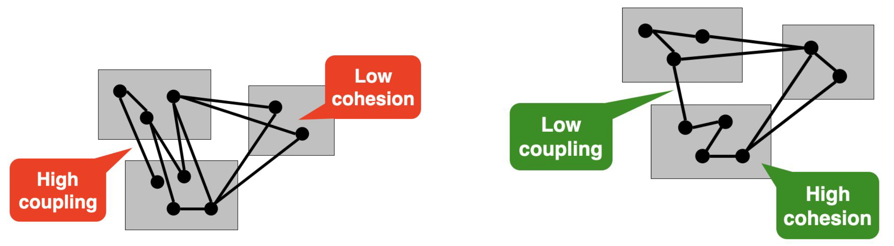
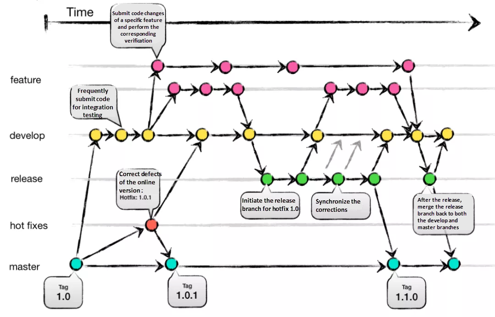

# Requirements

## *Introduction*

### Definition

**Requirements engineering RE** is the process of eliciting, analyzing, documenting, validating, and managing the requirements for a software system。需求工程是指在工程设计过程中定义、记录和维护需求的过程


需求工程涉及多种活动，例如从利益相关者那里收集和记录需求，分析需求以识别潜在的冲突或遗漏的需求，对需求进行优先级排序，并验证需求以确保它们是完整、一致和可行的

**最终目标**是创建一个清晰而简洁的需求集，准确反映利益相关者的需求，并为高质量软件产品的开发提供坚实的基础

### What is requirements

* **Features** that the system **must have** in order to be accepted by the client
* **Constraints** that the system **must satisfy** in order to be accepted by the client

## *Stages*

### Overview

1. Elicitation: This involves gathering requirements from stakeholders through interviews, surveys, workshops, and other techniques
2. Analysis: This involves analyzing and prioritizing requirements, identifying dependencies, and resolving conflicts
3. Specification: This involves documenting requirements in a clear and concise manner, often using tech specs or standard notations (e.g., UML use-case diagram)
4. Verification and validation: This involves ensuring that the requirements are complete, consistent, and correct, and that they meet the needs of stakeholders
5. Management: This involves tracking changes to requirements, communicating changes to stakeholders, and ensuring that requirements are met throughout the software or system development life cycle
6. Maintenance: This involves managing changes to requirements over time, ensuring that they remain relevant and up-to-date

### Elicitation 获取

* 引出需求的主要目标是确定系统必须满足用户和利益相关者的需求的需求
* 有很多技术可以用来引出需求，包括面试、问卷调查、观察和焦点小组讨论
*  一旦需求被引出，它们通常会被记录在需求文档或类似的文档中

### Analysis

* 分析阶段涉及审查需求，以理解它们的含义，评估其可行性，并识别任何潜在的冲突或不一致性
* 在分析过程中，通常会以结构化的方式组织和分类需求，例如将相关需求分组或创建用例来描述系统在不同情境下的行为
* 分析阶段还涉及确定需求是否可在项目的约束条件内实现，例如预算、进度和可用资源

### Specification

* The purpose of specification is to create a clear, concise, and unambiguous description of the requirements after eliciation and alysis with stakeholders
* 规格说明还包括必须考虑的任何约束或限制，以及与数据或接口相关的任何特定需求
* There are many ways to document requirements, such as
  * UML use-case diagrams
  * User stories
  * Functional/non-functional requirements
  * System specifications

### Verification and validation

* Verification and validation are critical to ensuring that the requirements for a system are accurate, complete, and consistent
* Verification refers to the process of checking that the requirements have been correctly captured, and that they accurately reflect the needs/expectations of the stakeholders
* Validation, on the other hand, refers to the process of ensuring that the system meets the requirements that have been specified

### Management

需求工程中的管理涉及在软件开发生命周期中管理需求

* 优先排序和组织需求：确定哪些需求最重要或关键，并确保它们获得适当的关注和资源。
* 跟踪需求变更：记录需求的任何变更，这是必要的，以确保所有利益相关者都知道需求的任何变更，并防止误解/沟通不畅
* 确保需求仍然有效和最新：定期审查需求，以确保它们仍然相关和准确，并根据需要更新它们，以反映利益相关者需求或项目目标的任何变化

### Maintenance

需求工程中的维护涉及在软件系统部署并使用后管理需求。在这个阶段，需求根据系统环境的变化或用户需求的变化进行审核、更新和修改

一些维护的原因

* 系统长时间运行，而需求会随着时间的推移而发生变化
* 确保系统继续正常高效地运行，例如修复错误、硬件更新、性能更新等
* 系统仍然安全，并符合任何相关法规或标准

## *Types*

### 功能性需求

Functional requirements 会定义系统特定的行为或功能

* Describe the specific tasks and functions that a system or product must perform
* Typically expressed in terms of use cases or user stories, and describe the features and functionalities of a system or product

### 非功能性需求

Non-functional requirements 是指依一些条件判断系统运作情形或其特性，而不是针对系统特定行为的需求。可以视为为了满足客户业务需求而需要符合，但又不在功能性需求以内的特性

* Describe the characteristics or qualities that the system or product must possess to meet the desired level of performance, usability, and reliability
* Typically expressed in terms of **quality attributes**, such as system's response time, availability, or its ability to handle a certain number of users or transactions per second

## *云的非功能性需求*

### Performance 性能

* **The need for performance**：The specification of a computer system typically includes explicit (or implicit) performance goals

* **Performance metrics 性能指标**

  * Latency 延迟: The time interval between a user’s request and the system response
  * Throughput 吞吐量: Number of work units done (or requests served) per time unit
  * Utilization 占用率: The percentage of capacity used to serve a given workload of requests

* **Service level agreements (SLAs) 服务级别协议 **

  An SLA is an agreement between provider (cloud software) and client (or users) about measurable metrics, e.g., performance metrics

  服务提供商与客户之间定义的正式承诺。服务提供商与受服务用户之间具体达成了承诺的服务指标——质量、可用性，责任

### Scalability 可扩展性

* **Scalability**: Measures the ability of software systems to adapt to the increasing workloads, e.g., serving millions of active users! 可扩展性是指系统适应更大的负载的能力，只需通过增加资源，进一步扩展硬件或增加额外的节点
* **Scalability via concurrency**
  * Vertical scaling (scale-up!): Exploiting **parallelism** in multicores OR adding more resources on a single machine
  * Horizontal scaling (scale-out!): Exploiting **distributed architectures** by adding more machines in the system
* **Elasticity**: The ability of software systems to expand/shrink the usage of computing resource with increasing/decreasing workload 弹性是指动态地适应应对负载所需的资源的能力，当负载增加时，通过添加更多的资源来扩大规模；而当需求减弱时，就缩减并删除不需要的资源

### Reliability 可靠性

* **Reliability**: Applications are prone to hardware and software **failures (bugs)** in the cloud
* **Fault-tolerance** is the property that enables a system to continue operating properly in the event of the failure
* **Fault tolerance metrics**: common failure metrics that get measured and tracked for any system
  * Mean time between failures (MTBF) 平均故障间隔: The average operational time between one device failure or system breakdown and the next
  * Mean time to failure (MTTF) 平均失效前时间: The average time a device or system is expected to function before it fails (usually for not repairable devices)
  * Mean time to repair (MTTR) 平均修复时间: The average time to repair and restore a failed system

### Availability

* **High availability** specifies a design that aims to **minimize the downtime of a system or service**. The main objective of high availability is to keep these systems and services continuously available
* **Availability metrics**
  * We measure high availability through the percentage of time that a service is guaranteed to be online and available for use in a year
  * For e.g., usually they are referred to as “9s”
    * 99.99% (four nines): the four nines class accepts a maximum downtime of 52.6 minutes (less than an hour) per year
    * 99.999% (five nines): the five nines class tolerates a maximum downtime of 5.26 minutes (few minutes) per year

### Security 安全性

**Security**: Software deployed in the cloud is vulnerable to security vulnerabilities as the underlying computing infrastructure is untrusted (or shared by multiple tenants). Secure systems deal with securing computing, network and storage

### Maintainability 可维护性

* **Maintainable software** allows us to quickly and easily
  * Fix a bug
  * Add new features
  * Improve usability
  * Increase performance etc.
* **Design tips** for maintainable software (covered in the course!)
  * **Modular design** to easily extend/modify system components
  * **Version control** for proper software/code management
  * **Quality management**: Refactoring, comments, code reviews, etc.
  * **Continuous integration testing/deployment** for ensuring the extensions are stable/bug free

### Deployability 可部署性

* **Deployability** of a software system is the ease with which it can be taken from development to production
  * Incorporating (hardware and software) dependencies
  * Software updates (patches)
* **Design tips** for deployability (covered in the course!)
  * Build and release management
  * Packaging dependencies for deployment, e.g., containers
  * DevOps pipeline: continuous integration and deployment

# 网络通信框架

## *通用数据交换 -- 序列化 & 反序列化*

### 为什么要序列化 & 反序列化？

* 跨平台和跨语言
  * 网络通信可能涉及不同高级语言之间的通信，若这时候C++去发一个结构体，然后Java该怎么理解？
  * 即使是同一种语言，比如说Server和Client都采用C++来写，若直接发结构体来传递信息，不同的处理器对结构体的对齐、存储方式可能完全不同，毕竟对结构体是没有C规范的
  * 这种情况下只能是通过一个大家都可以理解的中间商来交流
* TCP是面向字节流的，天然的存在[粘包问题](#粘包)，只能靠自定义数据结构、添加分隔符等方式来解决，所以自然而然的就需要序列化
* 数据交换：序列化和反序列化使得不同系统能够共享和交换数据。通过将数据序列化为一种通用格式（如 JSON、XML、Protobuf 等），可以确保数据的结构和内容在不同系统之间得到保留和解释。从OSI七层模型来看，**序列化就是位于传输层和应用层之间的Presentation层**。关于Json、XML和Protobuf的对比这部分可以看 *EIST软件工程.md 的Web与通信部分*
* 对于网络协议栈传输层及以下的协议则可以传输结构体：因为网络层以下实际上变化是很少的，且要求高效，因此在传输的时候使用的就是规定了固定格式的结构体，然后直接转成二进制。但是应用层的灵活度和弹性要很高，因为要考虑不同版本、不同时间段的用户需求，所以应用层必须要加一层序列化和反序列化的软件层来方便定制
* 数据持久化：序列化也可以用于将数据持久化到磁盘或数据库中。通过将数据序列化为字节流或字符串，可以将其写入文件或存储到数据库中，以便将来读取和解析

### 序列化 & 反序列化的组件


* IDL（Interface description language）文件：

  接口描述语言 Interface Description Language，IDL是一种用于描述系统、组件或服务之间的接口的语言。它提供了一种结构化的方式来定义接口的方法、参数、数据类型和协议等信息，以便不同的系统或组件之间能够进行有效的通信和交互

  接口描述语言的主要作用是定义接口的规范，使得不同的系统能够理解和解析接口定义，并在运行时进行相应的操作和通信。它提供了一种中立的、独立于编程语言和平台的方式来描述接口，使得不同的编程语言和平台之间可以通过解析接口描述语言的定义来实现互操作性

* IDL Compiler：IDL文件中约定的内容为了在各语言和平台可见，需要有一个编译器，将IDL文件转换成各语言对应的动态库

* Stub/Skeleton Lib：负责序列化和反序列化的工作代码

  * Stub是一段部署在分布式系统客户端的代码，一方面接收应用层的参数，并对其序列化后通过底层协议栈发送到服务端，另一方面接收服务端序列化后的结果数据，反序列化后交给客户端应用层
  * Skeleton部署在服务端，其功能与Stub相反，从传输层接收序列化参数，反序列化后交给服务端应用层，并将应用层的执行结果序列化后最终传送给客户端Stub

* Client/Server：指的是应用层程序代码，他们面对的是IDL所生成的特定语言的class或struct

* 底层协议栈和互联网：序列化之后的数据通过底层的传输层、网络层、链路层以及物理层协议转换成数字信号在互联网中传递

### 早期的IDL

* COM, [The Component Object Model](https://learn.microsoft.com/en-us/windows/win32/com/the-component-object-model) 主要用于Windows平台，并没有真正实现跨平台，另外COM的序列化的原理利用了编译器中虚表，使得其学习成本巨大（想一下这个场景， 工程师需要是简单的序列化协议，但却要先掌握语言编译器）。由于序列化的数据与编译器紧耦合，扩展属性非常麻烦
* CORBA, Common Object Request Broker Architecture 是早期比较好的实现了跨平台，跨语言的序列化协议。COBRA的主要问题是参与方过多带来的版本过多，版本之间兼容性较差，以及使用复杂晦涩。这些政治经济，技术实现以及早期设计不成熟的问题，最终导致COBRA的渐渐消亡。J2SE 1.3之后的版本提供了基于CORBA协议的RMI-IIOP技术，这使得Java开发者可以采用纯粹的Java语言进行CORBA的开发

### XML

* 语法：XML 使用自定义的标记（Tags）来标识数据的结构和内容。它使用起始标签和结束标签来定义元素，可以嵌套和包含属性。XML 的语法比较繁琐，标记需要封闭，并且有更多的符号和冗余
* 应用场景：XML 在数据交换、配置文件、文档存储等方面有广泛应用。它被广泛用于Web服务、SOAP和XML-RPC等通信协议
* 可读性：XML 对人类来说比较容易阅读和理解，标记和结构清晰可见。它是一种自我描述的格式
* 可扩展性：XML 允许自定义标签和结构，可以根据需要进行扩展和定义复杂的数据模型

### JSON

* 语法：JSON 使用简洁的KV键值对的形式来表示数据，其中键是字符串，值可以是字符串、数字、布尔值、数组、对象等。JSON 的语法相对简单，符号较少，对于 JavaScript 来说是一种原生的数据格式
* 应用场景：JSON 在 Web 开发、API、移动应用程序等领域广泛使用。它被广泛用于 RESTful API 的数据交换，也是许多前端和后端框架中的常用数据格式
* 可读性：JSON 对人类来说也相对容易阅读和理解，尤其对于熟悉 JavaScript 的开发者来说。它是一种比 XML 更紧凑的数据表示方式
* 轻量级：JSON 的语法相对较简单，数据量较小，传输和解析的效率较高

### Protobuf

* 语法：Protobuf 使用结构化的消息定义语言（IDL）来描述数据结构和消息类型。它使用.proto文件定义消息的结构，包括字段、类型和消息之间的关系
* 应用场景：**Protobuf 在高性能、跨平台的数据交换和存储方面非常强大**。它通常用于大规模分布式系统、高性能网络通信和数据存储等领域
* 可读性：Protobuf 的编码格式是二进制的，不像 XML 和 JSON 那样易于人类阅读和解析。它更注重在高效的数据传输和解析上
* 体积和效率：相比于 XML 和 JSON，Protobuf 的编码更紧凑，数据体积更小。它使用二进制格式进行编码和传输，减少了数据大小和网络传输的开销。同时，Protobuf 的解析速度也比 XML 和 JSON 更快，因为它的编解码过程是高度优化的

### 对比

* 语法：XML 使用自定义的标记（Tags），JSON 使用KV键值对的形式，而 Protobuf 使用结构化的消息定义语言（IDL）
* 可读性：XML 和 JSON 相对容易阅读和理解，而 Protobuf 的二进制编码格式不直接面向人类
* 数据体积：相同数据的体积上，Protobuf 通常比 XML 和 JSON 更小，因为它使用二进制编码和紧凑的数据表示方式
* 解析效率：Protobuf 的解析速度通常比 XML 和 JSON 更快，因为它的编解码过程是高度优化的，而 XML 和 JSON 的解析过程相对更复杂

在实际选择时，需要根据具体的需求和应用场景来决定使用哪种序列化方案。如果关注高性能、低网络开销和紧凑的数据表示，Protobuf 是一个不错的选择。而如果可读性和可调试性对于数据交换更为重要，XML 和 JSON 可能更合适

## *Three-tier architecture*

### 什么是软件架构

软件架构定义了软件的组成、各个部件的交互和它们如何被封装

软件架构会影响到如何才能满足需求、如何组织研发以及部署方式

### 三层软件架构介绍

IBM: https://www.ibm.com/cn-zh/topics/three-tier-architecture


三层架构是一种十分完善的软件应用程序架构，它将应用程序组织成三个逻辑和物理计算层：表示层（或用户界面 UI）、应用层（负责处理数据）和数据层（负责存储和管理与应用程序相关的数据）

三层架构的主要优势在于，由于每层都在自己的基础架构上运行，因此每层都可以由独立开发团队同时开发，并且可根据需要进行更新或扩展，而不会影响其他层

数十年来，**三层架构都是C/S Web应用程序的主要架构**。 目前，大多数三层应用程序的目标是实现现代化、使用云原生 Cloud-native 技术（例如容器和微服务）以及迁移到云端

层间需要通信来传输数据，最广泛使用的技术是REST架构和RPC远程调用方式

### REST、RPC和HTTP的关系

REST、RPC（Remote Procedure Call）和HTTP（Hypertext Transfer Protocol）是三个不同的概念，但它们之间存在一些关系和联系

* REST与HTTP的关系

  **REST 是一种软件架构风格**，强调使用统一的接口和资源来设计和构建分布式系统。HTTP是一种应用最广泛的协议，**REST 常常使用 HTTP 协议作为通信协议**。因此，RESTful API 通常通过 HTTP 来进行通信，使用 HTTP 方法（GET、POST、PUT、DELETE）对资源进行操作

* RPC与HTTP的关系

  **RPC 是一种远程过程调用的机制/协议**，用于实现分布式系统中的不同节点之间的通信。RPC 的目标是使远程调用像本地函数调用一样简单

  RPC **可以使用不同的协议来实现**，包括在应用层、传输层或网络层进行通信。因此，RPC 既可以是应用层协议，也可以使用其他层的协议进行实现

  在实际应用中，有一些常见的应用层 RPC 框架和协议，例如 **gRPC、Apache Thrift 和 XML-RPC 等**。这些框架和协议定义了通信的规范和方式，包括消息格式、编解码、序列化和反序列化等。它们可以在应用层或传输层上进行通信，并提供了一套 API 和工具，简化了远程调用的过程。

  除此之外，HTTP 可以作为 RPC 的传输协议之一，通过 HTTP 协议实现 RPC 被称为 HTTP-RPC 或者 HTTP-based RPC。RPC 可以使用其他协议（如 TCP、UDP）作为底层通信协议，与 HTTP 并不强关联

* REST和RPC都是进行网络通信的架构风格，它们之间的区别

  * REST 强调使用统一的接口和资源，通过资源的状态转移来进行操作，而 RPC 强调远程过程调用，即像调用本地函数一样调用远程函数
  * REST 基于无状态的通信协议，如 HTTP，每个请求都包含足够的信息，而 RPC 可以使用各种协议进行通信，包括无状态和有状态的协议
  * REST 更加面向资源和数据的操作，而 RPC 更加面向方法和过程的调用

虽然 REST 和 RPC 在设计思想和实现方式上有所差异，但它们都是用于构建分布式系统的通信机制。在实际应用中，可以根据需求选择合适的通信方式，使用 RESTful API、RPC 或者其他适合的协议来满足系统的通信需求。同时，HTTP 作为广泛使用的协议，可以被 REST 和 RPC 用作通信的基础协议之一

## *REST*

### intro

REST, Representational State Transfer 是一种**基于网络的软件架构风格**，用于设计和构建分布式系统和网络应用程序。它在 Web 开发中广泛应用，特别是在构建 Web API（Application Programming Interface）时非常常见

REST 的设计原则强调以下几个关键概念：

1. 资源（Resources）：在 REST 中，所有的数据和功能都被视为资源，可以通过唯一的标识符（如 URL）进行访问和操作。资源可以是任何事物，如用户、文章、图片等
2. 统一接口（Uniform Interface）：REST 使用统一的接口来处理资源。这包括使用标准的 HTTP 方法（如 GET、POST、PUT、DELETE）对资源进行操作，以及使用合适的 HTTP 状态码表示操作结果
3. 无状态性（Stateless）：REST 是无状态的，意味着每个请求都应该包含足够的信息来完全理解和处理该请求，而不依赖于之前的请求或会话状态。每个请求都是独立的，服务器不需要维护客户端的状态
4. 资源表述（Resource Representation）：资源的表述是通过常见的数据格式（如 JSON、XML）来表示，以便在客户端和服务器之间传输和解析数据
5. Layered systems: clients can transparently communicate with the server through other layers (proxy, load balancer)

通过遵循 REST 的设计原则，可以构建具有良好可伸缩性、松耦合性和可扩展性的分布式系统。RESTful API 的设计使得客户端和服务器之间的通信变得简单和直观，而且易于在不同的平台和编程语言之间进行交互

### REST methods

以crul (cliet url) 工具为例

* GET: retrieve resouce

  ```shell
  curl -X GET https://api.github.com/repos/OWNER/REPO/branches
  ```

* POST: create resouce

  ```shell
  curl -X POST \
  https://api.github.com/repos/OWNER/REPO/branches/BRANCH/rename \
  -d '{"new_name":"my_renamed_branch"}'
  ```

* PUT: update resource

  ```shell
  curl -X PUT \
  https://api.github.com/repos/OWNER/REPO/pulls/PULL_NUMBER/merge \
  -d '{"commit_title":"title","commit_message":"msg"}'
  ```

* DELETE: delete resource

  ```shell
  curl -X DELETE https://api.github.com/repos/OWNER/REPO
  ```

## *RPC*

Remote Procedure Calls allow the execution of function calls on a remote process

### Example


上图是两个典型的应用：网店和流媒体服务

# Software Architecture in Cloud

## *Monolithic architecture*

### 单体式架构的主要类型

### 优势

### 劣势

## *Microservice Architecture*


## *Example: Amazon Prime Video*

# System Design & Implementation

## *Modularity*

### 什么是模块化？

软件系统可以倍分解为一系列的模块 modules 或者说子系统 subsystems。模块化可以以任意的形式来实现，比如类、方法、子系统、rpc服务等。也就是说，模块化可以被应用在任意的抽象层次

模块化可以帮助管理软件的复杂度，微服务就是一个很好的模块化例子，我们将一个复杂的单体架构划分为大量的微服务系统

理想情况下，每一个模块应该是与彼此都完全独立的，用户可以直接使用模块而不需要知道有其他模块的存在。但实际上模块之间或多或少是相关的，它们依赖彼此提供的功能或服务，这也是软件系统复杂性的来源之一。**一个好的系统设计应该是要致力于降低模块之间的相互依赖**

### Terminology


* Interface 接口
  * 接口包括开发人员在不同模块中工作所需了解的一切，以便使用给定的模块
  * **Interface describes “what” the module does, but ”not how” it does it!**
* Implementation 实现：是对接口定义内容的实际实现

在开发一个模块时，开发人员必须理解该模块的接口和实现，以及任何其他依赖模块的接口

### 实现模块之间的高内聚低耦合

设计目标：在允许模块之间的相互依赖的同时降低软件整体的复杂度

* Cohesion 内聚：衡量一个模块之间类之间的依赖性
  * **高内聚**：模块中的类执行相似的任务，并通过多个关联相互关联
  * 低内聚：大量杂类和辅助类，几乎没有关联
* Coupling 耦合：衡量多个模块之间的依赖性
  * 高耦合：一个模块的变动会对其他模块产生较大的影响
  * **低耦合**：一个模块的变动对其他依赖模块的影响较小



一个好的系统设计旨在实现高内聚低耦合，高内聚追求提高模块内的关联性，低耦合则追求降低模块间的相互依赖

高内聚可以通过将沟通、互动集中在模块内，而不是跨越模块边界来实现；低耦合则可以通过不让calling module知道called module的内部信息来实现

* 高内聚
  * Operations work on the same attributes
  * Operations implement a common abstraction or service
* 低耦合
  * Small interfaces
  * Information hiding principle
  * No/minimal global data
  * Interactions are mostly within the module rather than across module boundaries

### Subsystem decomposition: Modules

## *Design Pattern: Facade Pattern*

### Intro

外观模式 Facade Pattern 是一种软件设计模式，属于结构型模式。**它提供了一个higher-level的简化的接口（外观 Facade、入口），用于访问复杂子系统的功能**，从而隐藏了子系统的复杂性，并提供了一个更简单和统一的接口供客户端使用，同时也减少了客户端与子系统之间的直接依赖


一个demo：<https://www.runoob.com/design-pattern/facade-pattern.html>

### 主要组成部分

1. 外观 Facade：外观是客户端与子系统之间的接口，它封装了底层子系统的复杂性，并提供了一个简化的接口供客户端使用。外观根据客户端的请求，调用相应的子系统组件
2. 子系统 Subsystems：子系统是实现系统功能的具体组件集合。它们包含了底层的业务逻辑和功能，但客户端并不直接与子系统的组件进行交互。外观模式通过外观作为中间层，将客户端请求转发给子系统来处理

### Pros & Cons

* Pros
  1. 简化客户端使用：外观模式提供了一个简化的接口，使得客户端使用子系统更加方便。客户端只需与外观对象交互，而不需要了解和处理子系统的复杂性，从而简化了客户端的使用方式
  2. 封装子系统复杂性：外观模式将底层子系统的复杂性封装在一个外观对象中。这样，客户端不需要了解子系统的内部工作细节，只需要通过外观对象进行交互。外观模式提供了一种高级接口，隐藏了子系统的复杂性，使得系统更易于理解和使用
  3. 解耦客户端和子系统：通过外观模式，客户端只与外观对象进行交互，而不直接与子系统的组件进行交互。这样可以降低客户端和子系统之间的耦合度，使得系统更加灵活和可维护
* Cons
  1. 违反开闭原则：在外观模式中，如果需要新增或修改子系统的功能，可能需要修改外观对象的接口和实现。这违反了开闭原则，因为修改外观对象可能会影响到客户端代码。因此，在设计外观模式时，需要权衡灵活性和稳定性之间的平衡
  2. 可能引入单点故障：外观模式将子系统的复杂性集中在一个外观对象中。如果外观对象出现问题或失败，整个子系统的功能可能受到影响。因此，需要谨慎设计和管理外观对象，以确保其稳定性和可靠性
  3. 限制灵活性：外观模式通过提供一个统一的接口来隐藏子系统的复杂性，这可能会导致某些特定功能无法直接访问。如果需要对子系统的某个特定功能进行高度定制或优化，可能需要绕过外观对象，直接与子系统的组件进行交互

## *接口设计*

### Deep vs shallow modules


* Deep modules
  * They provide **powerful functionality yet have simple interfaces**, They provide good abstraction because only a small internal complexity is visible to users. 
  * Deep module是一种具有多层次嵌套关系的模块设计方式。它通过将功能细分为多个嵌套的子模块来构建复杂的接口。每个子模块都负责特定的功能或任务，并且可以进一步嵌套其他子模块。这种深层次的嵌套结构使得接口的功能和复杂性可以逐级增加，以满足更细粒度的需求
* Shallow modules
  * Provide **huge interface, but less functionality**. More dependencies with other modules leading to high coupling
  * Shallow module是一种扁平的模块设计方式，它没有多层次的嵌套关系。相反，它将所有的功能组织在同一个层次上。这种设计方式更简单直接，适用于相对简单的接口或功能较少的场景。Shallow module通常比Deep module更容易理解和使用
* Module design as a cost vs benefit trade-off
  * Cost: The complexity using the interface
  * Benefits: Provided functionality of the module

Deep modules的设计好与Shallow modules，**一个原则是可以将complexity藏到implementation里就藏进去，尽量不要增加接口的宽度**

### 例子

Linux的文件系统就是一个典型的Deep modules，它是由文件系统、虚拟文件系统、系统调用都嵌套构成的，最终向上层提供了系统调用接口 `open()`、`write()`、`read()` 等

举一个生活中的例子

假设我们正在设计一个在线购物系统的接口，其中包含以下功能：

1. 添加商品到购物车（Add Item to Cart）：将商品添加到用户的购物车中
2. 从购物车中移除商品（Remove Item from Cart）：从用户的购物车中移除指定的商品
3. 获取购物车中的商品列表（Get Cart Items）：获取用户购物车中的所有商品列表
4. 结算购物车（Checkout Cart）：对用户购物车中的商品进行结算

Deep module的设计方式：Deep module将每个功能细分为多个嵌套的子模块，每个子模块都负责特定的功能。在这种设计中，Deep module 只是一个购物车模块在这个例子中，Deep module将购物车功能的所有操作方法放在一个深层次的CartManager模块中。每个方法都属于CartManager模块的一部分，负责不同的购物车功能

Shallow module的设计方式：Shallow module的设计方式将所有功能组织在同一个层次上，没有多层次的嵌套关系。在这个例子中，Shallow module直接将购物车功能的所有操作方法放在一个ShoppingSystem模块中，没有额外的嵌套关系

### Information hiding & leakage

信息隐藏 Information hiding 是一种软件设计原则，旨在将模块或类的内部实现细节和数据隐藏起来，只向外界暴露必要的接口或方法。该原则的目标是减少系统中各个模块之间的依赖关系，提高模块的独立性和可维护性

信息隐藏的核心思想是通过将模块的实现细节封装起来，限制对内部数据和方法的直接访问，从而降低模块之间的耦合度。模块只向外部提供必要的接口，外部只能通过这些接口与模块进行交互，而无需关心模块内部的具体实现。这样可以实现模块的独立演化，当内部实现发生变化时，只需保持接口的兼容性，而不会影响到外部的使用

相反信息泄漏 information leakage 则是将设计细节暴露出去，这可能会导致模块之间的相互依赖

Information hiding的最经典实现就是面向对象语言C++/Java的类，Private访问限定符用于implementation，Public访问限定符则用于interface

## *General layered architecture*

 层式架构是模块化的最佳体现，每一层就是一个独立的子模块。网络栈、Linux文件系统，之前提过的三层Web架构都是层结构

### Closed vs open layered architectures


* Closed layer architecture
  * 每一层只能直接调用相邻下一层的服务
  * 优势：层次清晰，维护性好
* Open layer architecture
  * 可以跨层调用，即Layer1不需要call Layer2来获取Layer n的服务，Layer1直接call Layer n
  * 优势：高性能

### Different layers, different abstraction

每一层都应该提供不同的抽象，这样可以更好的解构系统

尽量不要使用Pass-through method 传递方法。Pass-through methods 是指在类或对象中定义的方法，这些方法在实现时只是简单地将调用转发给其他对象或类的对应方法，不做任何额外的处理或逻辑

## *MVC*

# Security

## *Security Engineering*

### CIA properties

* **Confidentiality** refers to protecting information from unauthorized access 避免被未经许可的访问拿到
* **Integrity** means data are trustworthy, complete and have not been accidentally altered or modified by an unauthorized user 数据是完整的，不会被未经许可的用户故意或不当心修改
* **Availability** means data are accessible when you need them 需要时可以被拿到

### Thread Model

A threat model is used to explicitly **list all threats that jeopardize the security of a system**

Thread Model 定义了系统环境以及攻击者的能力

* Enumerating and prioritizing all potential threats
* Define system assumptions: Trusted and untrusted parts
* Risk management and trade-offs

一些典型的问题有

* What are the high value-assets in a system?
* Which components of a system are most vulnerable?
* What are the most relevant threats or attack surfaces?

## *安全系统设计原则*

### Compartilization 区域分割

和分割船舱，以致于当某个船舱进水时不至于帆船一样，软件工程甚至是整个计算机系统也要进行区域分割

在安全工程领域，Compartilization 是一种关键概念和实践，用于将系统中的不同组件或资源隔离开来，以减少潜在的安全风险和限制潜在的攻击者的行动范围。隔离的目标是防止不受信任的组件对系统中的其他部分造成损害，并通过一些精心设计的通讯协议来限制潜在的攻击者从一个受损的组件中扩散到其他组件

### Principle of least privileges 最小权限原则

Least Privilege 用于确保用户、应用程序或进程**仅具有完成其必要任务所需的最低权限**。最小权限原则旨在减少系统中的安全风险，并限制恶意用户或攻击者可能利用的潜在攻击面

最小权限原则包括以下关键概念

1. 最小访问权限：用户、应用程序或进程应该只被授予完成其任务所需的最小访问权限。这意味着将权限限制在最低必要的级别，以防止不必要的权限滥用或误操作
2. 权限分离：不同的用户角色或任务应该被分配不同的权限。每个用户或应用程序只能访问其工作所需的资源和功能，而不能访问其他敏感资源。这种权限分离减少了潜在的攻击面和错误操作的影响范围
3. 基于需求的访问控制：通过实施基于需求的访问控制策略，只有在用户或进程确实需要访问某些资源或执行特定操作时，才授予相应的权限。这种策略确保权限的最小化，并且仅在必要时才进行授权
4. 权限审计和监控：对权限的使用进行审计和监控，以确保权限不被滥用或越权访问。这可以通过记录和分析权限使用的日志来实现，并及时检测异常行为或潜在的安全威胁

### Isolation via privilege mediation

隔离的目的是将两个组件相互分离，并限制它们之间的交互在一个明确定义的应用程序编程接口（API）中进行

为了实现组件之间的隔离，所有组件都需要某种形式的**安全监视器 security monitor**来进行监控和执行安全策略

**安全监视器以比隔离组件更高的权限级别运行**，并确保它们遵守隔离规则。如果违反隔离规则，安全监视器会阻止违规行为，并可能终止违规组件的执行。这种安排可以确保隔离的有效性，并防止攻击者通过违反隔离来访问敏感资源或执行恶意行为

### High-level 安全设计原则

* Break system into compartments

* Ensure each compartment is isolated

* Ensure each compartment runs with least privilege

* Treat compartment interface as the trust boundary

  

Trusted Computing Base（TCB）是指计算系统中被认为是可信任的核心组件集合。TCB包括操作系统内核、安全核心模块、认证机构、密码学实现以及其他被信任的软件和硬件组件。TCB的目标是提供一个可信的计算环境，确保系统的安全性和可靠性

TCB的设计和实现应该经过严格的安全考虑，并遵循安全最佳实践。**它应该尽可能地简化和最小化，以减少潜在的攻击面**。TCB应该受到适当的保护措施，以防止未经授权的访问和恶意操作

### Reference/Trusted monitor

Reference Monitor 引用监视器是一个安全机制的概念，用于确保系统中的所有访问都受到适当的控制和监视。它是一个抽象的概念，代表着一个系统内核或安全子系统，负责执行访问控制策略并保护系统资源

Trusted Monitor 在安全系统中起着至关重要的作用，它可以是操作系统内核的一部分，或者是一个独立的安全子系统。它通过实施访问控制策略、验证身份、执行审计等功能来确保系统的安全性和可靠性。Trusted Monitor 的设计和实现应该经过严格的安全考虑，并接受相应的验证和审计，以保证其可信度和有效性

* 斡旋来自应用的请求
* 必须一直被调用，不能被绕过
* Tamperproof 防篡改，权限很高无法被杀死，或者被杀死的时候也会把它监控的进程一同杀死

## *Access control 权限控制*

### Terminology

* Protected entities: “objects/resources” O。对象可以是任何资源，比如文件、系统资源、聂村等
* Active objects: “subjects/principals” S (i.e., users/processes)

### Authentication vs. Authorization

Authentication（身份验证）和 Authorization（授权）是访问控制中两个关键的概念，它们在保护系统和资源的访问方面具有不同的作用

Authentication（身份验证）是**用于验证用户或实体的身份是否合法和正确**。它是确认用户是谁的过程。身份验证通常涉及用户提供凭据（如用户名和密码、生物特征、数字证书等），然后系统对这些凭据进行验证，并确定用户是否具有合法的身份。身份验证确保用户是自己声称的那个人，而不是冒名顶替

Authorization（授权）是**确定用户或实体对系统或资源的访问权限的过程**。一旦用户的身份得到验证，授权决定用户可以访问哪些资源以及可以执行哪些操作。它是定义访问权限和权限级别的过程。授权规定了用户能够做什么和不能做什么，以保证资源的安全性和保护用户数据

在一个应用程序中，用户首先进行身份验证，提供用户名和密码进行验证。一旦身份验证成功，系统会检查该用户的授权级别和权限，以确定他们能够访问的功能、数据或服务。身份验证是确认用户是谁，而授权是决定用户可以做什么。这两个过程通常在访问控制的流程中一起使用，以确保只有合法用户获得适当的访问权限

### ACL vs CL

Access Control Lists ACLs 访问控制列表

Capabilities Lists CLs

## *ACL*

### Access control matrix

## *Capabilities*

# 可靠性 & 可扩展性

## *Reliability & Availability*

## *Performance*

## *Pattern implementation*

## *Scalability*

# UML

Unified Modeling Language 统一建模语言

> UML是一种开放的方法，用于说明、可视化、构建和编写一个正在开发的、面向对象的、软件密集系统的制品的开放方法。UML展现了一系列最佳工程实践，这些最佳实践在对大规模，复杂系统进行建模方面，特别是在[软件架构](https://zh.wikipedia.org/wiki/软件架构)层次已经被验证有效 -- Wikipedia

UML 是一个首先使用、广泛被认可的这样的一个标准。软件工程师在使用不同的工具交互交流的时候，都会用 UML 的一些语义来表达自己的模型领域是什么样的含义


## *Intro*

### 分类

UML2.2定义了14种类图

* 结构型图形 structure diagram 强调的是系统式的建模
  * 静态图 static diagram
    * 类图
    * 对象图
    * 包图
  * 实现图 implementation 
    * 组件图
    * 部署图
  * 剖面图
  * 复合结构图
* 行为式图形 behaviour diagram 强调系统模型中触发的事件
  * 活动图
  * 状态图
  * 用例图
* 交互式图形 interaction diagram 属于行为图形的子集合，强调系统模型中的资料流程
  * 通信图
  * 交互概述图
  * 时序图
  * 事件图

### stereotype

**stereotype 立体字标记** 是UML的扩展机制之一，用于给建模元素提供附加意义。它可以应用于类、接口、组件等几乎所有类型的UML元素

以下是一些常见的标准UML立体字标记：

* **`<<create>>`** - 通常用于操作，表示该操作将创建一个新的实例
* **`<<destroy>>`** - 通常用于操作，表示该操作将销毁对象
* **`<<boundary>>`** - 表示系统的边界，如用户界面或API界面
* **`<<control>>`** - 通常应用于处理系统逻辑控制和决策的类
* **`<<entity>>`** - 用于表示持久化的信息和数据存储
* **`<<interface>>`** - 表示一个接口，即一组公开的操作和属性，其他类可以实现这些接口
* **`<<enumeration>>`** - 用来定义一组命名的常量
* **`<<exception>>`** - 表示异常类，用于错误处理
* **`<<datatype>>`** - 表示值类型，不同于一般的类因为它没有标识性
* **`<<table>>`** - 在数据库建模中使用，表示一个表
* **`<<primaryKey>>`** - 在数据库建模中使用，表示表的主键
* **`<<useCase>>`** - 表示用例，用于捕捉系统的功能要求
* **`<<implementationClass>>`** - 用于表示实现了接口的具体类
* **`<<service>>`** - 用于表示提供服务的类或组件
* **`<<component>>`** - 表示组件，用于封装系统的一部分实现
* **`<<node>>`** - 表示物理环境中的一个计算机节点

除了这些标准的立体字标记，UML 还允许通过定义自己的立体字标记来扩展建模语言。自定义立体字标记使得建模更加灵活，能够适应不同领域特有的要求和术语

当在UML图中看到 `<<concept>>` 这样的标记时，它通常表示附加在一个类或其他元素上的特定角色或属性。在这种情况下，`concept` 并不指的是 C++20 中引入的那个概念，而是表示该模型元素是一个抽象的概念，而非一个具体实现或者可实例化的类。

例如，如果我们在设计一个系统并且使用UML来建模，我们可能会有一个名为“用户”的概念。在UML类图中，我们可以创建一个带有 `<<concept>>` 标记的类来代表这个概念：

```
__________________
|   <<concept>>   |
|     User        |
|_________________|
| +UserID         |
| +UserName       |
|_________________|
```

在这里，“用户”是一个概念性的构造，它定义了系统中用户实体应有的属性和可能有的行为

使用立体字标记的目的是让阅读UML图的人更清楚地理解每个元素的意图和用途，尤其是当它们不是具体的类或组件时。立体字标记可以自定义，所以团队可以根据需要创建新的立体字来表示特殊的建模概念

## *类图*

30分钟学会UML类图 - 肖继潮的文章 - 知乎 https://zhuanlan.zhihu.com/p/109655171

### 在类图中表示关系

https://zhuanlan.zhihu.com/p/350793664

类和类、类和接口、接口和接口之间存在关系。其强弱关系为 实现 $\geq$ 泛化 > 组合 > 聚合 > 关联 > 依赖


* 泛化关系 Generalization

  * 对象与对象之间的继承关系 "is-a"
  * Java中对象之间的泛化关系可以直接翻译为关键字 `extends`

* 实现关系 Implementation

  * 实现关系是指接口及其实现类之间的关系
  * Java中实现关系可以直接翻译为关键字 `implements`

* 依赖关系 Dependency "uses-a"：是一种使用的关系，即一个类的实现需要另一个类的协助，**一个类被用作是另一个类的方法的参数或者局部变量**。比如说Animal类的 `eat()` 方法的参数是 Food。依赖关系除了被依赖方作为依赖方的方法参数，还可能作为依赖方的方法返回值存在。注意：**依赖关系不一定会在UML中显式的出现被依赖的类**，因为如前所述，有可能只是在类方法中作为局部变量使用

* 关联关系 Association 是一种强依赖关系

  * 关联关系与依赖关系的区别在于：依赖关系是一种临时的关系，依赖关系主要体现在方法参数，当调用方法时才有依赖关系；而关联关系是一种长期的关系，**关系的一方是另一方的成员变量/属性**，无论是否调用方法这种关系都存在

  * 关联可以分为单向关联、双向关联、自关联（比如二叉树结构体）和多重性关联

    

  * 在Java中，关联关系的代码表现形式为一个对象含有另一个对象的引用

* 聚合关系 Aggregation "has-a" ：聚合是一种强关联关系，没有整体，部分**可以独立存在，即整体的生命周期和部分的生命周期不同**。表示一个对象包含或拥有另一个对象。常用于一个类和其成员的关系。例如一个汽车对象可以包含一个引擎对象

* 组合关系 Composition "contains-a"：组合是一种强聚合关系，它是整体与部分的关系，部分离开整体后**不可以单独存在，即整体的生命周期和部分的生命周期相同**，代表整体的对象负责代表部分的对象的生命周期。常用于类的成员，比如说公司和部门的关系

无法简单的从语法上来分别关联和聚合/组合，因为它们都表现为一方是另一方的成员变量/属性。但是从语义上来说，关联的双方是平级的，不同类的对象之间没有强烈的依赖，它们是相对独立的，而聚合/聚合则有明显的整体与部分的关系


以SharedBike那个项目为例，因为 thread_pool_t 完全可以作为一个独立的组件来使用，所以当 DispatchMsgService 将其作为一个类成员的时候，此时是关联关系。而iEvent和iEventHandler则必须要依靠DispatchMsgService来发挥作用，所以它们是聚合关系

### 类图中具体类、抽象、接口和包的表示法

UML绘制：https://www.planttext.com

UML Class Diagram Tutorial：https://www.visual-paradigm.com/guide/uml-unified-modeling-language/uml-class-diagram-tutorial/;WWWSESSIONID=155970796B4B5C5AA833E9DF81911DA5.www1


* 第一层是名字，若该类是抽象类就用斜体
* 第二层是属性：`[权限]名称 : 类型[=默认值]`
* 第三层是方法：`[权限]名称 ([参数列表]) [:返回类型]`

成员属性和成员方法的访问限定副的表示方法为

* `+` 表示public
* `-` 表示private
* `#` 表示protected
* `~` 表示default/package

下面是几种类图元素

* 表示具体类

  ```java
  public class Hourly {
      private double hourlyRate;
      private double hoursWorkded;
      public double computePay(double hourlyWorked);
  }
  ```

  

* 表示抽象类：抽象类在UML类图中同样用矩形框表示，但是抽象类的类名以及抽象方法的名字都用斜体字表示

  ```java
  public abstract class Employee {
      private String address;
      private String name;
      private int number;
      public abstract double computePay() {}
      public void mailCheck() {}
  }
  ```

  

* 表示接口：接口在类图中也是用矩形框表示，但接口在类图中的第一层顶端用 `<<interface>>`表示，而且只有方法

  ```java
  public interface Shape {
      public double computeArea();
      public double computePerimeter();
  }
  ```

  

  

* 表示包

## *Domain Model*

Domain Model 领域模型可以被看作是一个系统的概念模型，用于以可视化的形式描述系统中的各个实体及其之间的关系。领域模型记录了一个系统中的关键概念和词汇表，显示出了系统中的主要实体之间的关系，并确定了它们的重要的方法和属性。因此对应于用例所描述的动态视图，领域模型提供了一种对整个系统的结构化的视图。领域模型的一个好处是描述并限制了系统边界

领域模型的语意可以被用在源代码中，因此领域模型可以被应用在底层的软件开发阶段中。实体可以演化为类别，方法和属性可以直接演化至程式码之中

UML中用类图来描述Domain Model

## *状态机*

然后状态机在 UML 里面它本身设计得也比较灵活，就它也是在市面上的一些常见的状态机模型里算是表达能力非常强，抽象度非常高，然后也有一些复杂的功能含义在里面的这样的一种设计

[状态机 - IBM 文档](https://www.ibm.com/docs/zh/dmrt/9.5?topic=diagrams-state-machines)

[UML 2 教程 - 状态机图](http://tool.uml.com.cn/ToolsEA/state-diagram.asp)

### 状态类型

* 简单状态 simple state：基本的状态类型，表示没有进一步细分的状态
* 组合状态 composite state：一个包含其他子状态的状态。复合状态可以被看作是一个有自己的子状态机的状态
* 正交状态 orthogonal state：在正交状态中，一个对象可以同时处于多个子状态中，并且这些子状态相互独立地响应事件

每一个状态都可以执行下面的三种活动

* 进入：在进入某一状态时将执行的活动
* 执行：当进入某一状态时就会开始执行的活动，并且会一直执行到完成该活动或者退出该状态为止
* 退出：在退出某一状态时将执行的活动

### 伪状态

伪状态 Pseudostate 用来组合和指导转换

* 初始伪状态 Initial Pseudostate：它表示状态机或复合状态的起始点。初始伪状态不是真正的状态，而是一个指示符，显示了对象状态的起始位置
* 结束状态 Final State：表示状态机或复合状态的结束点。类似于初始伪状态，结束状态也不是真正的状态，而是标志着状态机的结束
* 选择伪状态 Choice Pseudostate：根据条件动态决定后续流程的伪状态。当状态机到达选择伪状态时，根据指定的条件表达式决定接下来的转移路径
* 深度历史伪状态 Deep History Pseudostate：果一个复合状态被重新进入，深度历史伪状态能够记住复合状态内子状态机的前一个状态，并且能够让状态机直接回到该状态。深度历史伪状态通常用于状态机的子状态机中
* 浅历史伪状态 Shallow History Pseudostate：浅历史伪状态与深度历史伪状态类似，但只记住直接子状态机的状态，不考虑嵌套的子状态机
* 分叉伪状态 Fork Pseudostate：用于将状态机的执行从单一流转换为并发状态的多个流
* 聚合伪状态 Join Pseudostate：与分叉相反，它用于将多个并发状态合并为一个单一流

### 状态转移

UML 的语义里，状态之间的跳转/转移 transition 都是由事件来触发的。所以 UML 的状态机是一个事件触发式的状态机

* trigger 是转换的原因，可能是信号、事件、某些条件的变化或时间的流逝
* guard condition 就是跳转发生的这样的一个额外的条件，它必须为true才能使trigger引发跳转
* action 是状态跳转发生了以后触发的一些行为
* UML 跳转的 priority 是根据父子关系来的，越是在子层级的跳转，它的 priority 越高

### 历史状态

举一个典型的场景：从一个状态A进入了状态B，状态A本身有很多的状态，此时想要从状态B revert回来，比如说要在A的子状态C中做一个临时的操作，但是当C完成之后它原来处于A这个状态的信息已经丢失了

因此有一些 transition 我可以与其说跳入这个父状态，我可以跳入这个父状态的 history 状态就是它的历史状态

### UML 状态机的绘制


[UML 2 教程 - 状态机图](http://tool.uml.com.cn/ToolsEA/state-diagram.asp)


## *用例图*

## *组件图*

组件图 Component group 描绘了系统中组件提供的、需要的接口、端口等，以及它们之间的关系

## *部署图*

## *活动图*

# 设计模式

https://blog.csdn.net/sinat_21107433/category_9418696.html

> Over 20 years ago the iconic computer science book “[Design Patterns: Elements of Reusable Object-Oriented Software](https://www.amazon.com/gp/product/0201633612/ref=as_li_tl?ie=UTF8&camp=1789&creative=390957&creativeASIN=0201633612&linkCode=as2&tag=triatcraft-20&linkId=XRGUDJCGWC6AJNZM)” was first published. The four authors of the book: Erich Gamma, Richard Helm, Ralph Johnson, and John Vlissides, have since been dubbed “The Gang of Four”. In technology circles, you’ll often see this nicknamed shorted to GoF. Even though the GoF [Design Patterns](https://www.amazon.com/gp/product/0201633612/ref=as_li_tl?ie=UTF8&camp=1789&creative=390957&creativeASIN=0201633612&linkCode=as2&tag=triatcraft-20&linkId=XRGUDJCGWC6AJNZM) book was published over 20 years ago, it still continues to be an Amazon best seller.

## *分类*

设计模式 Design Pattern 是一套被反复使用、多数人知晓的、经过分类编目的、代码设计经验的总结，使用设计模式是为了可重用代码、让代码更容易被他人理解并且保证代码可靠性

大部分设计模式兼顾了系统的可重用性和可扩展性，这使得我们可以更好地重用一些已有的设计方案、功能模块甚至一个完整的软件系统，避免我们经常做一些重复的设计、编写一些重复的代码

最常用的23种设计模式可以分为

* 创建者模式 creational
  * 创建型模式关注对象的创建过程，创建型模式描述如何将对象的创建和使用分离，让用户在使用对象过程中无须关心对象的创建细节，从而降低系统耦合度，并且让系统易于修改和扩展
  * 创建模式有单例模式 singleton、简单工厂模式 simple factory、抽象工厂模式 abstract factory、工厂方法模式 factory method、原型模式 prototype、建造者模式 builder
* 结构型模式 structural
  * 结构型模式处理对象之间的组合，以构建更大的结构，并帮助客户端理解如何将对象组合在一起形成更复杂的结构
  * 适配器模式 adapter、桥接模式 bridge、组合模式 composite、装饰模式 decorator、外观模式 facade、享元模式 flyweight、代理模式 proxy
* 行为型模式 behavioral
  * 行为型模式关注对象之间的协作和职责分配，以实现更有效的通信和协同工作
    * 职责链模式 chain of responsibility、命令模式 command、解释器模式 interpreter、迭代器模式 iterator、中介者模式 mediator、备忘录模式 memento/快照模式 snapshot、观察者模式 observer、状态模式 state、策略模式 strategy、模板方法模式 template、访问者模式 visitor

## *简单工厂模式*

C++ 深入浅出工厂模式（初识篇） - 小林coding的文章 - 知乎 https://zhuanlan.zhihu.com/p/83535678

### 组成

简单工厂模式：定义一个简单工厂类，它可以根据参数的不同返回不同类的实例化对象，被创建的实例通常都具有共同的父类

* 工厂 Factory：根据客户提供的具体产品类的参数，创建具体产品实例
* 抽象产品 AbstractProduct：具体产品类的基类，包含创建产品的公共方法
* 具体产品 ConcreteProduct：抽象产品的派生类，包含具体产品特有的实现方法，是简单工厂模式的创建目标

其UML图为

### 实现

### Pros & Cons

## *抽象工厂模式*

## *工厂方法模式*

## *单例模式*

看 *面向对象.md* - 特殊类 - 特殊类设计

## *原型模式*

## *建造者模式*

## *Adapter pattern*

## *观察者/订阅模式*

https://blog.csdn.net/sinat_21107433/article/details/102927937

### 定义 & 结构

很多对象不是孤立的，它的状态或行为的改变很有可能会影响其他关联对象的状态或行为。

观察者模式 Observer Pattern 是一种行为型设计模式，用于定义一种一对多的依赖关系，当一个对象的状态发生变化时，其所有依赖对象都会自动收到通知并被更新

观察者模式也被称为发布-订阅模式 Publish-Subscribe、模型-视图模式 Model-View、源-监听器模式 Source-Listener、从属者模式 Denpendents，它提供了一种松耦合的方式，允许主题（被观察者）和观察者之间的互动，而不需要彼此了解具体的细节。


以下是观察者模式的主要参与者和它们的作用：

* 主题 Subject：也称为被观察者，它维护一组观察者对象，并分别提供attch、detach和notify方法来添加、删除或通知观察者。主题通常包含一个状态，当状态变化时，通知观察者
* 观察者 Observer：观察者是依赖主题的对象，它定义一个update接口，通常包括一个用于接收主题状态变化通知的方法。多个观察者可以订阅同一个主题，当主题状态变化时，它们会接收通知并执行相应的操作
* 具体主题 Concrete Subject：具体主题是主题的实现类，它维护了一个状态，并在状态变化时通知观察者。具体主题通常包含一个观察者列表，以便管理注册和通知
* 具体观察者 Concrete Observer：具体观察者是观察者的实现类，它实现了更新接口，以定义当接收到主题通知时要执行的操作

### 应用

观察者模式几乎是无处不在，凡是涉及到一对一、一对多的对象交互情景，都要用到观察者模式

* GUI开发：观察者模式常用于处理用户界面事件，如按钮点击、鼠标移动、键盘输入等。GUI框架中的组件（如按钮、文本框）可以作为观察者，而事件源（如窗口或控件）可以作为主题，以便在用户与界面交互时实时响应
* 分布式系统和消息队列：观察者模式可以用于实现事件驱动架构，其中发布者（主题）发布事件，而订阅者（观察者）订阅并响应这些事件。消息队列系统也常使用观察者模式来实现消息的发布和订阅
* 订阅通知系统：观察者模式用于实现订阅通知功能，如邮件订阅、新闻推送、社交媒体更新等。用户订阅主题，并在主题更新时接收通知
* 数据模型和视图分离：在MVC（模型-视图-控制器）或MVVM（模型-视图-视图模型）架构中，观察者模式可用于将数据模型和视图分离，以便实现数据和界面的同步更新

### Pros & Cons

* Pros
  * 松耦合（松耦合的意思是一方改变一方可不变）：观察者模式实现了松耦合，主题和观察者之间互不依赖，使系统更易于维护和扩展
  * 可重用性：可以轻松添加或删除观察者，而不需要修改主题的代码，从而提高了代码的可重用性
  * 广播通知：主题可以通知多个观察者，适用于需要广播消息的场景，以确保多个对象都能及时获得更新
* Cons
  * 可能导致性能问题：当主题有大量观察者并频繁发出通知时，可能会引发性能问题，因为观察者都会被通知，这可能会导致系统开销增加
  * 通知顺序不确定：观察者的通知顺序通常不确定，这可能会导致一些问题，例如观察者之间的竞争条件
  * 可能引发循环引用：如果观察者具体实现代码有问题，会导致主题和观察者对象形成循环引用，在某些采用计数垃圾回收器可能导致无法回收

### Observer的不足：用信号 & 槽机制来应对

**Observer的基类设计不利于同时观察多个不同类型的事件，这直接导致了信号 & 槽机制的产生和使用，这部分可以看Qt信号 & 槽部分**

> 陈硕：《Linux 多线程服务端编程》1.14 Observer 之谬
>
> Observer 模式的本质问题在于其面向对象的设计。换句话说，我认为正是面向对象（OO）本身造成了 Observer 的缺点。Observer 是基类，这带来了非常强的耦合，强度仅次于友元（friend）。这种耦合不仅限制了成员函数的名字、参数、返回值，还限制了成员函数所属的类型（必须是observer的派生类)。
>
> Observer class 是基类，这意味着如果 Foo 想要观察两个类型的事件（比如时钟和温度），需要使用多继承。这还不是最糟糕的，如果要重复观察同一类型的事件（比如 1 秒一次的心跳和 30 秒一次的自检），就要用到一些伎俩来 work around，因为不能从一个 Base class 继承两次。
>
> 在 C++ 里为了替换 Observer，可以用 Signal/Slots，我指的不是 QT 那种靠语言扩展的实现，而是完全靠标准库实现的 thread safe、race condition free、thread contention free 的 Signal /Slots，并且不强制要求 shared_ptr 来管理对象，也就是说完全解决了 1.8 列出的 Observer 遗留问题。这会用到 2.8 介绍的“借 shared_ptr 实现 copy-on-write”技术。

```C++
#include <iostream>
#include <list>
#include <string>

// Observer 抽象基类
class Observer {
public:
    virtual void update(std::string& event_message) = 0;
};

// Subject 抽象基类
class Subject {
    std::list<Observer*> observers;
public:
    void attach(Observer* observer) {
        observers.push_back(observer);
    }

    void detach(Observer* observer) {
        observers.remove(observer);
    }

    void notify(std::string event_message) {
        for (Observer* observer : observers) {
            observer->update(event_message);
        }
    }
};

// 具体的观察者，我们希望它能观察多种类型的事件
class ConcreteObserver : public Observer {
public:
    void update(std::string& event_message) override {
        std::cout << "Received event: " << event_message << std::endl;
    }
};

// 两个具体的主题
class Clock : public Subject {
public:
    // Clock 特有的函数，比如定期通知
    void tick() {
        notify("Clock tick");
    }
};

class Thermometer : public Subject {
public:
    // Thermometer 特有的函数，比如气温变化通知
    void temperatureChanged() {
        notify("Temperature changed");
    }
};

int main() {
    Clock clock;
    Thermometer thermometer;

    // 假设我们希望一个观察者同时观察时钟和温度计
    ConcreteObserver observer;
    
    // 订阅两种事件
    clock.attach(&observer);
    thermometer.attach(&observer);

    // 触发事件
    clock.tick();           // 观察者应该收到 "Clock tick"
    thermometer.temperatureChanged();  // 观察者应该收到 "Temperature changed"

    return 0;
}
```

## *Strategy pattern*

## *迭代器模式*

[迭代器模式，给你更高大上的遍历体验~_电视机遥控器是一个迭代器的现实应用,通过它可以实现-CSDN博客](https://fengjungle.blog.csdn.net/article/details/102879383)

迭代器可能是C++程序员不用学习都可以掌握的设计模式，因为STL的核心之一就是迭代器，它是数据容器和算法的黏合剂

迭代器模式提供了一种方法来顺序访问一个聚合对象中的各个元素，而同时又不必暴露该对象的的内部表示

通过引入迭代器，可以将数据的遍历功能从聚合对象中分离出来，这样聚合对象只需负责存储数据，而迭代器对象负责遍历数据，使得聚合对象的职责更加单一，符合单一职责原则

## *策略模式*

[如何管理和维护算法族？只需知道策略模式_人们对算法的维护主要有()。-CSDN博客](https://blog.csdn.net/sinat_21107433/article/details/102984862)

策略模式 Strategy Pattern，可以在运行时选择算法的不同变体。策略模式定义了一系列算法，并将每个算法封装起来让它们可以互相替换，使算法的变化不会影响到使用算法的客户端。比如说排序算法是一个算法族，在不同的情况下应该选用不同的排序算法（比如 `std::sort()` 的实现）

策略模式最适用于以下情况：

- 当想使用对象中的各种不同算法变体时，可以使用策略模式
- 当一个类定义了多种行为，并且这些行为在类的操作中以多个条件语句的形式出现时，可以使用策略模式来代替条件语句
- 当有很多相似的类，但它们之间只有行为不同时，可以使用策略模式

### 关键组件

1. **上下文 Context**：上下文是算法的使用者，它维护对策略对象的引用，并提供一个接口来设置当前策略或执行策略定义的算法
2. **策略接口 Strategy Interface**：这个接口是所有具体策略类所遵循的通用接口，它声明了算法/行为的方法
3. **具体策略 Concrete Strategies**：实现策略接口中的算法或行为的类

## *访问者模式*

访问者模式 Vistor Pattern 允许向一个对象结构（通常是一个复杂的对象组合）中添加更多的操作，而无需修改这些对象的类。它通过将操作逻辑从对象结构中分离出来，可以在不触及复杂对象结构的类的情况下定义新的操作

### 关键组件

* **访问者 Visitor 接口**：定义了访问者可以访问的元素的操作。每个操作对应于元素结构中的一个类
* **具体访问者 Concrete Visitor**：实现访问者接口，提供了对每个元素类的访问操作的具体实现。一个具体访问者可以实现一组相关的操作，例如序列化一个对象结构或导出数据到不同的文件格式
* **元素 Element 接口**：定义了一个`accept(Visitor)`方法，该方法将访问者作为参数
* **具体元素 Concrete Element**：实现元素接口，并定义`accept(Visitor)`方法，在这个方法中调用访问者的访问操作
* **客户端 Client**：使用访问者和元素对象结构

## *MVC*

MVC是一种在GoF总结出来的23个设计模式之外的一种复合设计模式，即多种设计模式的组合,并不仅仅只是一个单独的一个模式组

MVC全名是 Model View Controller，是模型 model - 视图 view－控制器 controller 的缩写。MVC是一种软件设计典范，用一种将业务逻辑、数据、界面显式分离的方法组织代码，将业务逻辑聚集到一个部件里面，在改进和个性化定制界面及用户交互的同时，不需要重新编写业务逻辑。MVC被独特的发展起来用于映射传统的输入、处理和输出功能在一个逻辑的图形化用户界面的结构中

- Model 模型 表示应用程序核心（如数据库）
- View 视图 显示效果（HTML页面）
- Controller 控制器 处理输入（业务逻辑）

### MVP模式

Model-View-Presenter, MVP 是从经典的模式MVC演变而来，它们的基本思想有相通的地方Controller/Presenter负责逻辑的处理，Model提供数据，View负责显示

## *委托者模式*

委托者模式 Delegation Pattern 是一种OOD的设计模式，它不属于GoF的23种设计模式，但是委托模式是一项基本技巧，许多其他的模式，如状态模式、策略模式、访问者模式本质上是在更特殊的场合采用了委托模式

**委托模式使得我们可以用聚合来替代继承**，在这种模式中，一个类（我们称之为委托者）将其部分行为委托给另一个支持类的实例（称为委托），而不是通过继承该类

委托模式可以被看作一种避免继承带来的强耦合的替代方案，并且它提供了更多的灵活性。使用委托可以减少子类数量，使系统容易理解和维护。它还使我们可以模拟mixin

### 关键组件

* **委托者 Delegator**：这是使用委托的那个类。它持有委托对象的引用，并将某些任务转发给委托。委托者通常定义了应该被委托的接口
* **委托 Delegate**：这是真正执行工作的对象。它实现了委托者所需的接口，并具体实现了这些接口方法
* **客户端 Client**：使用委托者的类或函数。当需要特定功能时，它调用委托者的方法

### demo

```C++
// 委托接口
class DelegationInterface {
public:
    virtual void operation() = 0;
};

// 具体的委托类
class ConcreteDelegate : public DelegationInterface {
public:
    void operation() override {
        // 实现具体操作
    }
};

// 委托者
class Delegator {
private:
    DelegationInterface* delegate; // 指向委托对象的指针

public:
    Delegator(DelegationInterface* d) : delegate(d) {}

    void operation() {
        // 委托操作
        delegate->operation();
    }
};
```

在上述简单示例中，`Delegator` 类并没有自己实现 `operation` 方法，而是委托给了一个实现了 `DelegationInterface` 的对象

# 测试

## *测试分类*

### 按测试对象分类


### 按开发阶段分类

1. Unit Testing 单元测试：单元测试是针对软件中的最小可测试单元（通常是函数或方法）进行的测试。它的目标是验证这些单元在隔离的环境中是否按照预期工作。单元测试通常由开发人员编写，旨在检测代码中的错误、确保每个单元的功能正确，并支持代码重构和维护。它可以使用模拟或桩件来隔离依赖项，使得测试更加独立和可重复

2. Integration Testing 集成测试：集成测试也称为联调，是将多个独立的单元组合在一起（通常是一个subsystem），测试它们之间的接口和交互是否正常工作。它的目标是检测不同组件之间的集成问题、接口错误和数据传递问题。集成测试可以涵盖不同层次（如模块间的集成测试、系统间的集成测试），并确保整个系统的各个部分协同工作

3. System Testing 系统测试：系统测试是对整个系统进行的测试，目的是验证整个系统在真实环境中的功能、性能和稳定性。系统测试通常是在与实际使用环境相似的环境中进行，以模拟最终用户的操作和预期结果。它可以涵盖各种功能、性能、安全性、兼容性和可靠性等方面的测试，以确保系统在各种情况下都能正常运行

   * Regression Testing 回归测试：回归测试是指修改了旧代码后，重新进行测试以确认修改没有引入新的错误或导致其他代码产生错误

     在整个软件测试过程中占有很大的工作量比重，软件开发的各个阶段都会进行多次回归测试。随着系统的庞大，回归测试的成本越来越大，通过选择正确的回归测试策略来改进回归测试的效率和有效性是很有意义的

   * Smoke Testing 冒烟测试：冒烟测试的对象是每一个新编译的需要正式测试的软件版本，目的是确认软件主要功能和核心流程正常，在正式进行系统测试之前执行。冒烟测试一般在开发人员开发完毕后提交给测试人员来进行测试时，先进行冒烟测试，保证基本功能正常，不阻碍后续的测试

     如果冒烟测试通过，则测试人员开始进行正式的系统测试，如果不通过，则测试人员可以让开发人员重新修复代码直到冒烟测试通过，再开始进行系统测试

4. Acceptance Testing 验收测试：验收测试是由最终用户、客户或其他授权人员执行的测试，以确认系统是否符合规格和需求。验收测试旨在验证系统是否满足用户的期望和需求，并且是否可以投入实际使用。它通常在开发周期的后期进行，以确保交付的系统符合预期并且可接受

### 按是否查看代码划分

* 黑盒测试 Black Box Testing：测试人员对被测系统进行测试，而不考虑其内部结构和实现细节。测试人员仅根据系统的规格说明、需求文档或功能描述来设计和执行测试用例，目的是验证系统的功能、界面和行为是否符合预期。黑盒测试关注系统的输入和输出，以及系统对输入的响应，而不关心内部逻辑和算法。它旨在检测功能缺陷、错误处理和系统性能等方面的问题
* 白盒测试 White Box Testing：测试人员了解被测系统的内部结构、设计和实现细节，并基于此设计和执行测试用例。测试人员可以访问系统的源代码、算法和数据结构等内部信息，以便更全面地测试系统的逻辑路径、代码覆盖率和内部错误等方面。白盒测试主要关注代码的正确性、结构和优化，以及系统的可维护性和安全性等方面
* 灰盒测试 Gray Box Testing：灰盒测试是黑盒测试和白盒测试的一种混合方法。在灰盒测试中，测试人员对被测系统有一些了解，但并不完全了解其内部实现细节。他们可能知道系统的某些算法、逻辑或设计，但没有完全的源代码访问权限。灰盒测试结合了黑盒测试的功能验证和白盒测试的结构覆盖，以设计和执行测试用例。它可以使用系统规格说明、日志文件、数据库结构等信息来指导测试，以验证系统的功能和内部逻辑的一致性

### 按测试实施组织分类

### 按是否手工划分

## *单元测试*

### xUnit架构

xUnit 架构是一种用于编写和执行自动化单元测试的软件测试框架的通用模型。它的名称中的 "x" 通常代表各种不同编程语言中的具体实现，比如JUnit（Java）、NUnit（.NET）、PyUnit/UnitTest（Python）等。**xUnit 架构的核心思想是将测试用例 test cases 封装成测试类**，并提供一组规范和工具，用于组织、执行和报告测试

以下是 xUnit 架构的一些核心概念和特点：

* 测试类：xUnit 架构鼓励将相关的测试用例组织成测试类。每个测试类通常包含一组测试方法，这些方法用于测试被测代码的不同方面。测试类的命名约定通常以 "Test" 结尾，比如 `MyClassTest`
* 测试方法：测试类中的每个测试方法都是一个独立的测试用例，它们用于验证被测代码的特定行为或功能。测试方法的命名约定通常以 "test" 开头，比如 `testAddition()`
* 断言 Assertions：断言是检查条件为真的语句。在测试方法中，开发人员使用断言来检查预期结果和实际结果是否匹配。如果断言失败，测试将被标记为失败。xUnit 框架通常提供了一系列标准断言函数，用于比较值、检查异常等
* 测试运行器 Test Runner：测试运行器是 xUnit 框架的一部分，它负责加载测试类、执行测试方法，并生成测试结果报告。测试运行器还可以支持多种选项，如并行执行、过滤测试等
* 测试夹具 Test Fixtures：有时候，测试需要在执行前后进行一些准备工作和清理工作，例如创建临时文件、建立数据库连接等。xUnit 架构提供了测试装置（test fixtures）的概念，可以在测试方法执行前后执行相关操作
* 测试套件 Test Suite 包含一个或多个测试。当测试套件中的多个测试需要共享通用对象和子例程时， 可以将它们放入测试夹具
* 测试报告：xUnit 框架生成详细的测试报告，用于展示测试的结果，包括通过的测试、失败的测试以及可能的错误信息。这些报告通常以文本、HTML、XML 等格式提供，以便开发人员查看和分析
* 插件和扩展性：xUnit 架构通常支持插件和扩展，允许开发人员编写自定义的测试运行器、断言函数、报告生成器等，以满足特定需求

### 各种语言的Unit testing工具

* C++

  * Google Test/gtest：Google Test是一个流行的C++测试框架，提供了丰富的断言和测试装置，支持测试套件、参数化测试、测试夹具等功能。它被广泛应用于C++项目中的单元测试和集成测试
  * Catch2：Catch2是另一个轻量级的C++测试框架，具有简洁的语法和强大的表达能力。它支持自动发现测试用例、断言、测试标签等功能，并提供易于阅读的测试报告
  * Boost.Test：Boost.Test是Boost库中的一个模块，提供了一个功能齐全的C++测试框架。它支持多种断言和测试装置，以及测试套件、参数化测试、测试夹具等功能
  * doctest：doctest是一个轻量级的C++单元测试框架，设计简单、易于集成。它不需要外部依赖，可以仅包含单个头文件即可使用

* Java

  * JUnit: 最常用的Java单元测试框架之一，提供了注解和断言等丰富的功能

  * TestNG: 另一个流行的Java测试框架，具有更丰富的功能，如测试套件、参数化测试等

* Python

  * unittest: Python自带的单元测试框架，支持测试类和方法的定义，断言等

  * pytest: 功能更强大、易用的Python单元测试框架，支持插件扩展和参数化测试等

* JavaScript

  * Jest: 用于JavaScript的流行的单元测试框架，具有简洁的API、模拟和覆盖率报告等功能

  * Mocha: 灵活的JavaScript测试框架，支持异步测试和多种断言库

* C#

  * NUnit: .NET平台上的流行单元测试框架，类似于JUnit，具有丰富的断言和测试装置

  * xUnit.net: 另一个.NET平台上的开源单元测试框架，具有灵活的扩展性和可配置性

* Ruby

  * RSpec: 用于Ruby的行为驱动开发（BDD）风格的测试框架，具有可读性强的语法和丰富的断言

  * MiniTest: 轻量级的Ruby测试框架，与Ruby标准库一起提供，支持单元测试和性能测试

## *Integration testing*

### intro

集成测试 Integration Testing/联调是软件测试中的一种测试方法，旨在验证多个独立组件或模块在集成后的交互和协作是否正常工作。集成测试的目标是检测组件之间的接口问题、数据传递问题以及整个系统的功能和性能

最重要的是接口验证：集成测试关注组件之间的接口，包括方法调用、消息传递、共享数据等。测试人员需要验证接口是否正确地传递数据和信息，并确保各个组件之间的协作正确

Integration Testing的策略有

* Horizontal integration
  * Big Bang integration
  * Bottom up testing
  * Top down testing 
* Vertical integration

### Big Bang approach

Big Bang 策略：大爆炸策略将所有组件集成到一起，并一次性进行完整的系统集成测试。这种策略通常用于较小和较简单的系统，或者在项目开发的后期阶段，当所有组件已经开发完毕并准备集成时。大爆炸策略的优点是速度快，但可能更难确定出现问题的具体组件

### Driver & Stubs

Driver：Driver是一个用于调用被测试模块的程序或组件。**它模拟了主调用方的行为**，通过向被测试模块提供输入数据和调用它的方法来驱动被测试模块的执行。Driver的主要目的是激活被测试模块，传递输入并捕获输出，以便进行验证和测试

Stub：Stub是一个用于替代被测试模块所依赖的外部模块或组件的占位符。当被测试模块需要与其他模块进行交互时，如果这些模块尚未实现或无法访问，Stub就会被用来模拟这些模块的行为。Stub通常返回预定义的数据或执行预定义的操作，以便测试被测试模块在与外部模块进行交互时的行为

### Top-down

自上而下（Top-down）策略：这种策略从系统的最高级别开始，逐步向下测试系统的子组件。在这种策略下，虚拟的或模拟的子组件可能被用于代替尚未实现或无法访问的实际子组件。逐步完成各个组件的集成，直到整个系统被完全集成和测试

### Bottom-up

自下而上（Bottom-up）策略：这种策略从系统的最低级别开始，首先测试系统的基础组件，然后逐步将上层组件添加到测试中。这种策略不需要虚拟或模拟的组件，因为每个组件都是实际的。测试人员首先确保单个组件的正确功能，然后逐步构建和测试更高级别的组件和系统

### Vertical integration testing

## *System testing*

### Fuzz testing/Fuzzing

模糊测试（Fuzz Testing），也称为Fuzzing，是一种自动化的软件测试技术，旨在发现应用程序中的漏洞和安全弱点。它通过**输入大量的随机、无效或异常数据来测试目标程序**，以寻找潜在的错误或异常行为

Fuzz测试的主要优势是它可以发现应用程序中未预料到的错误和边界情况。通过模糊、随机的输入，Fuzzing可以探索程序的不同执行路径和输入组合，有助于发现可能被忽略的异常情况和漏洞

在实施Fuzz测试时，通常会使用专门的Fuzzing工具，如AFL（American Fuzzy Lop）、LibFuzzer、Peach Fuzzer等。这些工具提供了自动化的模糊测试功能，并提供了结果分析和漏洞报告的功能。此外，还可以结合其他测试技术和安全工具，如静态代码分析、漏洞扫描器等，以获取更全面的测试覆盖和安全保障

### Fuzzing的类型

### Symbolic execution

Symbolic execution（符号执行）是一种静态程序分析技术，旨在通过对程序的符号变量进行推理和路径探索来获取程序的执行路径和约束条件。与传统的具体执行（concrete execution）不同，符号执行使用符号值（symbolic values）代替实际输入值，以表示程序执行过程中的未知输入。

在符号执行中，程序的每个分支都会产生一个或多个路径条件，这些条件基于符号变量的值。符号执行引擎通过解析和求解这些路径条件来探索不同的执行路径。这样，符号执行可以产生满足特定条件的测试用例，用于验证程序的正确性、发现潜在的错误和漏洞。

以下是符号执行的关键概念和过程：

1. 符号变量（Symbolic Variables）：符号执行使用符号变量来表示程序执行过程中的未知输入或状态。这些变量可以代表任意值，并与路径条件相关联。
2. 路径条件（Path Conditions）：每个分支操作都会生成一个路径条件，基于符号变量的值来决定程序执行的路径。路径条件是关于符号变量的约束条件，用于控制程序的执行流程。
3. 符号执行引擎（Symbolic Execution Engine）：符号执行引擎是负责解析和推理路径条件的工具或框架。它通过对路径条件进行符号求解来生成满足特定条件的输入值，以探索不同的执行路径。
4. 路径探索（Path Exploration）：符号执行引擎根据路径条件的求解结果，选择不同的执行路径进行探索。它会生成新的测试用例，以覆盖程序中的不同代码路径，并尽可能发现错误和漏洞。

符号执行的优点是它可以探索程序中的各种可能情况，包括边界条件、异常情况和不常见的执行路径。这使得符号执行成为发现难以达到的程序行为和错误的强大工具。然而，符号执行也面临着路径爆炸问题，即程序中可能存在大量的执行路径，导致符号执行引擎的计算复杂度增加。因此，符号执行通常与其他技术，如约简技术和具体执行相结合，以提高分析效率和准确性

### Crashing: Chaos Monkey

## *Model based testing*

## *Object oriented testing*

Black box testing可能会有部分代码是没法test到的


Stub比Driver难写 2:03


Fuzzing

但有时候用户已经知道了大概要用哪些测试用例，但Fuzzing还是会无脑生成

# 软件分析 & 程序验证

## *Faults & Failures of Software*

### Faults & error的种类

* Undefined behaviour 未定义行为是指在程序中出现没有遵守编程语言标准定义的行为

  C/C++以对机器的low-level控制闻名，未定义行为的存在是为了给编译器和实现提供更大的自由度，以便进行优化和简化。然而，程序员需要避免编写依赖于未定义行为的代码，因为它们可能会导致不可预测的结果和潜在的安全问题。良好的编程实践包括避免未定义行为，编写健壮和可移植的代码

  典型的未定义行为有使用未初始化的变量、数组越界访问、整数溢出、野指针等

  关于Binary Exploitation、缓冲区溢出攻击等内容可以看*C.md*

  > **心脏出血漏洞**（英语：Heartbleed bug），简称为**心血漏洞**，是一个出现在[加密](https://zh.wikipedia.org/wiki/密码学)程序库[OpenSSL](https://zh.wikipedia.org/wiki/OpenSSL)的[安全漏洞](https://zh.wikipedia.org/wiki/安全漏洞)，该程序库广泛用于实现互联网的[传输层安全](https://zh.wikipedia.org/wiki/传输层安全协议)（TLS）协议。它于2012年被引入了OpenSSL中，2014年4月首次向公众披露。只要使用的是存在缺陷的OpenSSL实例，无论是服务器还是客户端，都可能因此而受到攻击。此问题的原因是在实现TLS的[心跳](https://zh.wikipedia.org/wiki/心跳_(计算机))扩展时没有对输入进行适当验证（缺少[边界检查](https://zh.wikipedia.org/wiki/边界检查)）[[3\]](https://zh.wikipedia.org/wiki/心脏出血漏洞#cite_note-3)，因此漏洞的名称来源于“心跳”（heartbeat）[[4\]](https://zh.wikipedia.org/wiki/心脏出血漏洞#cite_note-4)。该程序错误属于[缓冲区过读](https://zh.wikipedia.org/wiki/缓冲区过读)[[5\]](https://zh.wikipedia.org/wiki/心脏出血漏洞#cite_note-cve-5)，即可以读取的数据比应该允许读取的还多 -- wikipedia

* Semantic faults 语义错误是指程序在语法上正确，但由于逻辑或语义错误而产生错误的行为。与语法错误不同，语义错误不会被编译器捕捉到，因为代码符合语言的语法规范，但程序的行为却不符合预期

  语义错误可能导致程序输出错误的结果、崩溃或产生未定义的行为。这些错误通常是由程序员对程序逻辑的误解、错误的算法实现或错误的数据处理引起的

  典型的语义错误有逻辑错误、数学错误、内存管理错误、并发错误（data race）、错误的函数调用和错误的类型转换等

### Tradeoff

* Soundness 完备性：if property P is provable, then P is true。不会漏报（假阴 false negative），但会误报（假阳 false positive）
* Completness 完全性：if property P is true, then P is provable。不会误报，但会漏报

|                  | Complete analysis                                            | Incomplete analysis                                          |
| ---------------- | ------------------------------------------------------------ | ------------------------------------------------------------ |
| Sound analysis   | 既不会漏报也不会误报，但根据Gödel's incompleteness theorem 非常难实现 | 可能会误报，但不会漏报。这种情况是不理想的很麻烦要去找哪些是误报含麻烦 |
| Unsound analysis | 可能会漏报，但不会误报。**这是我们要努力实现的目标**         | 既可能会误报，也可能会漏报                                   |

### 软件分析方法

静态程序分析（Static Program Analysis）和动态程序分析（Dynamic Program Analysis）是两种常见的软件工程技术，用于对计算机程序进行分析和评估。它们的目标是理解和改善程序的行为、性能和质量

* **动态程序分析是在程序运行时对其进行监测和评估**。它需要将软件源代码编译为可执行文件后，通过执行程序，并收集运行时数据（例如函数调用、变量状态、内存使用情况等）来获得关于程序行为的信息。比如说手动测试（单元测试 unit test）、自动化测试（模糊测试 fuzzing test）
* **静态程序分析是在程序的源代码或编译后的代码上进行分析，而不需要实际执行程序**。它主要关注程序的结构、语法和语义，通过对代码的语法解析、数据流分析、控制流分析、符号执行等技术来获取程序的各种属性和性质。静态分析可以检测代码中的潜在错误、安全漏洞、代码复杂度、代码规范违规等问题

动态分析运用广泛，因为它直接在程序运行时观察到的行为上进行分析，但需要准备运行程序的环境，可能会导致一些性能开销。另外最大的问题是动态分析需要的测试用例不可能覆盖所有的场景，总是会存在误报、漏报等不理想的情况。静态分析可以在早期发现潜在问题，减少代码缺陷和安全漏洞的风险

在实际应用中，静态和动态分析通常会结合使用，以获得更全面的程序分析结果。静态分析可以帮助指导动态分析的目标和范围，而动态分析可以提供实际运行环境中的行为信息来验证和补充静态分析的结果

静态程序分析是一个复杂的领域，需要大量的数理逻辑支持，这里不对其原理做进一步介绍，需要了解的可以看 *程序验证.md*

## *静态分析工具*

### Compiler warnings


编译器自带的的分析工具

* Java (more with -Xlint)
* C/C++ with GCC, Clang, MSVC (more with -Wall, -Wextra, or /Wall respectively)
* Rust (more with Clippy)

### Infer

<https://fbinfer.com>

"Infer" 是一个由Facebook开发的用于Java、C、C++、Objective-C静态程序分析工具。它旨在帮助开发人员发现和修复移动应用程序中的潜在错误和问题，提高代码的质量和可靠性

Infer 使用静态分析技术来分析应用程序的源代码，而无需实际运行应用程序。它通过检查代码的结构、语法和语义，并应用各种分析技术，如数据流分析、控制流分析、指针分析等，来发现代码中的潜在缺陷和问题

Infer 可以帮助开发人员发现各种类型的代码问题，包括内存泄漏、空指针引用、资源使用错误、并发问题等。它还提供了对代码复杂性、代码规范违规、安全漏洞等方面的分析

Infer 的工作流程通常包括以下步骤：

1. 收集应用程序的源代码
2. 对源代码进行静态分析，应用不同的分析技术来检测问题
3. 生成分析报告，指出发现的问题，并提供相应的修复建议
4. 开发人员根据报告中的信息进行代码修复和优化

Infer 的优点包括：

* 自动化：Infer 可以自动进行静态分析，无需手动运行和调试应用程序
* 扩展性：Infer 可以应用于各种编程语言和应用程序类型
* 高效性：Infer 使用高度优化的算法和技术，可以处理大型代码库并在合理的时间内生成分析结果
* 可集成性：Infer 可以与常见的开发工具和持续集成系统集成，如版本控制系统、构建工具和代码审查工具

### SpotBugs

SpotBugs（前身为FindBugs）是一个开源的静态代码分析工具，用于发现Java应用程序中的潜在缺陷、错误和安全漏洞。SpotBugs使用静态分析技术，对Java字节码进行分析，而不需要源代码。它可以帮助开发人员提前发现和修复代码中的问题，提高代码质量和可靠性

SpotBugs的特点和功能包括：

1. 静态分析：SpotBugs通过检查Java字节码，识别代码中的潜在问题。它使用一系列预定义的规则和模式，来发现常见的编程错误、潜在的空指针引用、资源泄漏、并发问题等
2. 多种规则集：SpotBugs提供了多个规则集，包括默认规则集、安全规则集和其他扩展规则集。开发人员可以根据需要选择合适的规则集，并自定义规则集来满足项目的特定需求
3. 报告生成：SpotBugs生成详细的分析报告，指出发现的问题和错误，并提供修复建议。报告可以以不同的格式输出，如HTML、XML和文本格式，方便开发人员查看和分析结果
4. IDE集成：SpotBugs可以与常见的集成开发环境（IDE）集成，如Eclipse和IntelliJ IDEA。这样开发人员可以在开发过程中实时检查代码，并及时发现问题
5. 命令行支持：SpotBugs也提供命令行界面，可以通过命令行运行分析，方便集成到构建系统和持续集成流程中

### Soot

## *动态分析工具*

### Dynamic binary instrumentation

Dynamic Binary Instrumentation（动态二进制插桩）是一种在程序运行时动态+修改和分析二进制代码的技术。它允许开发人员或安全研究人员在不修改源代码的情况下，对程序进行监视、分析和修改

动态二进制插桩通常涉及以下步骤：

1. 代码注入：通过插入特定的指令或代码片段，将插桩代码注入到目标二进制程序的内存中。插桩代码用于监视和修改程序执行过程
2. 代码跟踪：插桩代码可以记录程序执行的详细信息，如函数调用、内存访问、分支指令等。这样可以帮助开发人员或研究人员了解程序的执行流程和行为
3. 动态分析：通过在程序执行过程中监视和记录特定事件，如函数调用、参数传递、内存访问等，可以进行动态分析。这对于性能分析、错误排查、安全审计等方面非常有用
4. 动态修改：插桩代码可以在程序运行时修改二进制代码，以实现诸如函数替换、错误修复、安全增强等功能。通过动态修改，可以在不重新编译和重新部署程序的情况下进行功能增强和修复

动态二进制插桩通常由专用的工具和框架实现，例如**Pin、DynamoRIO、Valgrind**等。这些工具提供了API和库，使开发人员能够编写插桩代码，并在目标程序执行时加载和运行插桩代码

### Compiler-assisted instrumentation

Compiler-Assisted Instrumentation（CAI）借助编译器的帮助，一般比动态二进制插桩更高效

CAI的工作流程通常如下：

1. 源代码编译：源代码通过编译器进行编译，生成目标二进制文件
2. 插桩代码生成：编译器根据用户的指定或默认配置，在目标二进制文件中插入额外的代码。这些代码可以是函数调用、计数器增加、事件记录等
3. 目标二进制文件生成：插桩代码被合并到目标二进制文件中，生成最终的可执行文件
4. 运行时收集信息：当程序运行时，插入的代码会被执行，收集所需的信息。这些信息可以用于分析程序的执行过程、发现错误、评估性能等

### UndefinedBehaviorSanitizer


UndefinedBehaviorSanitizer（UBSanitizer或UBSan）是LLVM/Clang编译器提供的一种工具，用于检测和诊断C/C++程序中的未定义行为（Undefined Behavior）。未定义行为是指在程序中使用了编程语言标准未定义的操作，这样的操作可能导致程序产生不确定的行为，包括崩溃、错误结果或安全漏洞

UBSanitizer旨在帮助开发人员发现并修复潜在的未定义行为问题，从而提高程序的健壮性和安全性。它通过在编译时添加额外的运行时检查来实现对未定义行为的检测。使用UBSanitizer的好处在于，它能够帮助开发人员及早发现潜在的未定义行为问题，这些问题在某些情况下可能不容易被其他工具或静态分析器检测到。然而，UBSanitizer也可能会引入一些额外的运行时开销，因为它需要在程序运行时进行检查。

要启用UBSanitizer，可以使用Clang编译器提供的特定选项进行编译。例如，在使用Clang编译C/C++程序时，可以使用以下选项来启用UBSanitizer

```shell
clang -fsanitize=undefined <source_file.c> # C
clang++ -fsanitize=undefined <source_file.cpp> # cpp
gcc -fsanitize=undefined
```

### Valgrind

Valgrind是一个用于程序开发和调试的开源工具集，主要用于检测内存错误、数据竞争和性能问题。它提供了一系列的工具，其中最知名和常用的是Memcheck

Memcheck是Valgrind工具集中最受欢迎的工具之一，用于检测内存错误，如内存泄漏、使用未初始化的变量、越界访问、重复释放等。Memcheck通过在运行时跟踪程序的内存访问，并提供详细的报告，帮助开发人员发现和修复潜在的内存错误。

除了Memcheck之外，Valgrind还提供了其他几个工具，包括：

1. Cachegrind：用于性能分析的工具，可以检测程序中的缓存命中率、分支预测和指令执行等方面的问题，帮助开发人员优化程序的性能。
2. Callgrind：用于程序的函数调用图分析，可以帮助开发人员了解程序中函数的调用关系、调用次数和执行时间，以便进行性能优化。
3. Helgrind：用于检测多线程程序中的数据竞争问题，帮助开发人员发现并修复由于线程间共享数据而引发的竞态条件和死锁等问题。
4. Massif：用于内存分析的工具，可以跟踪程序的堆内存分配和释放情况，帮助开发人员了解程序在不同时间点的内存使用情况。

Valgrind工具集对于开发人员来说非常有价值，可以帮助他们发现和解决在程序开发过程中常见的内存错误、性能问题和并发问题。它提供了详细的报告和统计信息，帮助开发人员定位问题并进行调试和优化。

要使用Valgrind，需要将目标程序与Valgrind工具一起运行。例如，要使用Memcheck检测内存错误，可以在命令行中运行以下命令。Valgrind会在运行时拦截目标程序的执行，并提供相应的报告和分析结果

```shell
valgrind --tool=memcheck <your_program>
```

### AddressSanitizer

AddressSanitizer（ASan）是一种内存错误检测工具，旨在帮助开发人员发现和调试C/C++程序中的内存错误，如缓冲区溢出、使用释放的内存和内存访问越界等问题。它由Google开发，集成在LLVM/Clang编译器中

AddressSanitizer通过在程序运行时进行内存访问检测和记录来工作。它使用了**内存影子 shadow memory**的概念，在程序的每个字节之间维护一个附加的内存区域，用于存储关于每个内存位置的元数据信息。这些元数据用于跟踪内存分配、释放和访问情况


当程序运行时，AddressSanitizer会检测到以下类型的内存错误：

1. 缓冲区溢出：当程序写入超出分配的缓冲区范围的数据时，AddressSanitizer会捕获该错误并报告，在每个object前后添加readzone/trip wires

   

2. 内存访问越界：当程序访问超出分配的内存区域范围的数据时，AddressSanitizer会检测到越界访问

3. 释放后使用：当程序在释放后继续使用已经释放的内存时，AddressSanitizer会检测到此类错误

4. 内存泄漏：AddressSanitizer还可以检测到未释放的内存，帮助开发人员发现内存泄漏问题

```shell
clang -fsanitize=address <source_file.c>
clang++ -fsanitize=address <source_file.cpp>
```

AddressSanitizer会引入一些额外的运行时开销，包括内存和性能方面的开销，比如说shadow memory。因此，它通常在调试和测试阶段使用，以帮助发现和修复内存错误，而不是在生产环境中使用

### MemorySanitizer

MemorySanitizer（MSan）是一种内存错误检测工具，旨在帮助开发人员发现和调试C/C++程序中的未初始化内存访问问题。它是由Google开发的，集成在LLVM/Clang编译器中

MemorySanitizer通过在程序运行时进行动态分析来检测未初始化内存访问。它使用了 shadow memory，类似于AddressSanitizer（ASan），但其主要关注点是检测未初始化内存的使用

在程序的每个字节之间，MemorySanitizer维护一个附加的内存区域，用于存储关于每个内存位置的元数据信息。这些元数据用于跟踪内存的初始化状态。当程序访问未初始化的内存时，MemorySanitizer会捕获该错误并报告

MemorySanitizer可以检测到以下类型的未初始化内存访问问题：

1. 读取未初始化内存：当程序试图读取未初始化的内存时，MemorySanitizer会检测到该错误
2. 写入未初始化内存：当程序试图向未初始化的内存位置写入数据时，MemorySanitizer会捕获该错误
3. 未初始化的内存传递：当程序将未初始化的内存传递给其他函数或操作时，MemorySanitizer也可以检测到该问题

与AddressSanitizer类似，MemorySanitizer可以与其他工具和调试器一起使用，提供详细的错误报告和调试信息，帮助开发人员定位和修复未初始化内存访问问题。它通常与Clang编译器一起使用，并通过在编译时添加特定的选项来启用

```shell
clang -fsanitize=memory <source_file.c>
clang++ -fsanitize=memory <source_file.cpp>
```

### ThreadSanitizer

# 软件的开发、管理 & 部署

## *Software Configuration Management*

### SCM

Software Configuration Management（软件配置管理，SCM）是指对软件开发过程中的配置项（即软件及其相关的文档、数据等）进行管理和控制的一套方法和工具。在软件开发过程中，通常会有大量的代码、文档、配置文件、库文件等不同类型的文件，这些文件可能会经常修改、更新，而且可能由多个开发人员协同进行开发。

SCM的主要目标是确保软件开发过程的可控性、可复现性和可维护性。通过SCM，开发团队可以追踪和记录所有配置项的变更历史，保留不同版本的软件，便于回溯和复现过去的状态，同时避免因为团队成员之间的冲突而导致的代码混乱。

### SCM支柱

1. 版本控制 Version management：管理不同版本的代码和文档，记录每次变更，便于跟踪和回滚。
2. 配置管理 Configuration management：对软件的配置进行管理，确保在不同环境下能够正确部署和运行。
3. 变更管理 Change management：对软件的变更进行审批和控制，以确保变更的合理性和影响的可控性。
4. 构建管理 System building：自动化构建过程，确保每次构建的一致性和可重复性。
5. 发布管理 Release management：对软件的发布过程进行管理，确保发布版本的准确性和可靠性。
6. 缺陷管理：跟踪和管理软件缺陷，以确保及时修复和验证。

SCM通常使用一系列工具和流程来实现以上功能，例如版本控制系统（如Git、SVN）、构建工具（如Jenkins）、缺陷跟踪系统（如Jira）等。这些工具和流程帮助开发团队有效地管理和控制软件的开发和维护过程，从而提高软件开发的效率和质量。

## *Build System*

### 构建系统分类

CMake和Makefile内容可以看 [*CMakeLists.md*](../CMake/CMake.md)

## *git*

看 *git.md*

## *开发模型*

DevOps到底是什么意思？ - 小枣君的文章 - 知乎 https://zhuanlan.zhihu.com/p/91371659

### Waterfall 瀑布模式


瀑布模型在如今的开发中显得过于笨重，很少再使用了

### Scrum 敏捷开发


敏捷软件开发是以短周期迭代为核心，包含团队、工作件、管理和技术优秀实践的集合

* 团队：Product Owner, PO 产品经理、Scrum Master 敏捷教练、Team
* 工作件：产品Backlog, PBL（需求清单）、迭代清单、完成标准
* 管理实践：迭代计划会议、每日站立会议、可视化管理、迭代验收、迭代回顾会议
* 技术实践：用户故事、结对编程、Test-Driven Development, TDD 測试驱动开发、CI 持续集成、Anatomy系统解剖

### DevOps

开发的高频更新与运维的追求稳定是天生的矛盾。DevOps是一种软件开发和运维的文化和方法论，旨在促进开发团队和运维团队之间的协作、沟通和整合。它强调开发人员和运维人员之间的紧密合作，以实现快速、高质量的软件交付和持续改进

DevOps的核心目标是通过自动化、持续集成、持续交付和持续部署等实践，加速软件开发和发布周期，提高软件交付的频率和质量。它鼓励开发团队和运维团队在整个应用程序生命周期中进行协作，共同承担责任，并共享对系统的理解。比如让运维人员会在项目开发期间就介入到开发过程中，了解开发人员使用的系统架构和技术路线，从而制定适当的运维方案。而开发人员也会在运维的初期参与到系统部署中，并提供系统部署的优化建议

下图说明了Waterfall、Scrum和DevOps三种开发模式的区别


以下是一些关键特征和实践，通常与DevOps相关联：

1. 自动化：自动化是DevOps的核心原则之一。通过自动化构建、测试、部署和运维等任务，可以减少人工错误、提高效率和一致性
2. 持续集成（CI）：持续集成是指将开发人员的代码更频繁地集成到共享代码库中，并通过自动化构建和测试来验证代码的正确性。这有助于发现和解决问题的早期阶段
3. 持续交付（CD）：持续交付是指将通过持续集成生成的软件交付到预生产环境，并进行自动化测试和验证，以便随时可以将其部署到生产环境
4. 自动化部署：通过自动化部署实践，将软件应用程序从开发环境、测试环境到生产环境中进行快速且可靠的部署
5. 配置管理：使用配置管理工具（如Ansible、Chef、Puppet）来管理和自动化服务器和基础设施的配置，确保环境的一致性和可重复性
6. 实时监控和日志管理：持续监控应用程序和基础设施的运行状况，收集和分析实时数据和日志，以便快速发现和解决问题

通过采用DevOps实践，组织可以改善软件开发和运维之间的协作，缩短交付周期，提高应用程序的可靠性和质量，并能够更快地响应业务需求和市场变化

### CI/CD

<https://www.redhat.com/zh/topics/devops/what-is-ci-cd>


* Continuous Integration 持续集成：CI属于开发人员的自动化流程。成功的 CI 表明应用代码的新更改会定期构建、测试并合并到共享存储库中。这种方法可以解决在一次开发中有太多应用分支，从而导致相互冲突的问题
* Continuous Delivery/Deployment 持续交付/持续部署
  * 持续交付：持续交付通常是指开发人员对应用的更改会自动进行错误测试并上传到存储库（如 GitHub 或容器注册表），然后由运维团队将其部署到实时生产环境中。这旨在解决开发和运维团队之间可见性及沟通较差的问题。因此，持续交付的目的就是确保尽可能减少部署新代码时所需的工作量
  * 持续部署：指的是自动将开发人员的更改从存储库发布到生产环境，以供客户使用。它主要为了解决因手动流程降低应用交付速度，从而使运维团队超负荷的问题。持续部署以持续交付的优势为根基，实现了管道后续阶段的自动化

常用的CI/CD工具：Jenkins、GitLab CI/CD、Travis CI、CircleCI、Bamboo、Azure DevOps、TeamCity等

## *企业开发*

### 企业开发环境

* 开发环境 development：开发环境是程序猿们专门用于日常开发的服务器。为了开发调试方便，一般打开全部错误报告和测试工具，是最基础的环境
* 测试环境 testing：一个程序在测试环境工作不正常，那么肯定不能把它发布到生产机上。该环境是开发环境到生产环境的过渡环境
* 预发布环境/灰度环境 staging/pre-production
  * 该环境是为避免因测试环境和线上环境的差异等带来的缺陷漏测而设立的一套环境。其配置等基本和生产环境一致，但目的是能让我们发正式环境时更有把握。所以预发布环境是你的产品质量最后一道防线，因为下一步你的项目就要上线了。要注意预发布环境服务器不在线上集成服务器范围之内，为单独的一些机器
  * 所谓的灰度就是地域灰度、人群灰度环境，相当于是让小部分用户为我们的产品做测试
* 生产环境 production：是指正式提供对外服务的线上环境，例如我们目前在移动端或PC端能访问到的APP都是生产环境

### Git分支设计规范：GitFlow模型



* master分支
  * master为主分支，该分支为**只读且唯一的分支**。用于部署到正式发布环境，一般由合并release分支得到
  * 主分支作为稳定的唯一代码库,任何情况下不允许直接在 master 分支上修改代码
  * 产品的功能全部实现后，最终在master分支对外发布，另外所有在master分支的推送应该打 tag 做记录，方便追溯
  * master 分支不可删除
* release分支
  * release为预发布分支，它是在本次上线所有的feature分支合并到develop分支之后，再基于develop分支创建的。可以被部署到测试或预发布集群
  * 命名以 `release/` 开头，建议的命名规则为：`release/version_publishtime`
  * release分支主要用于提交给测试人员进行功能测试。发布提测阶段，会以release分支代码为基准进行提测
  * **如果在 release 分支测试出问题，需要回归验证 develop 分支看否存在此问题**
  * release分支属于临时分支
* develop分支
  * develop 为开发分支，**基于master分支创建的只读且唯一的分支**，始终保持最新完成以及 bug 修复后的代码。可部署到开发环境对应集群
  * 可根据需求大小程度确定是由 feature 分支合并，还是直接在上面开发（非常不建议）
* feature分支
  * Feature分支通常为新功能或新特性开发分支，**以develop分支为基础创建feature分支**
  * 命名以 `feature/` 开头，建议的命名规则：`feature/user_createtime_feature`
  * 新特性或新功能开发完成后，开发人员需合到develop分支
  * 一旦该需求发布上线，便将其删除
* hotfix分支
  * hotfix分支为线上bug修复分支或叫补丁分支，主要用于对线上的版本进行 bug 修复。当线上出现紧急问题需要马上修复时，需要基于master 分支创建 hotfix 分支
  * 命名以 `hotfix/` 开头，建议的命名规则 `hotfix/user_createtime_hotfix`
  * 当问题修复完成后，需要**被合并到master分支和develop分支并推送远程**。一旦修复上线，便将其删除

**没有什么所谓最好的分支模型，只有最合适公司、团队、提高开发效率的分支模型**

## *Release management*

### Process (general guideline)

1. Change request and approval：针对新变更的文档和审查流程
2. Release planning and design：发布范围、需求、时间表、成功标准（性能指标和度量标准）；发布计划应回答正在构建什么、发布的目标以及对企业和最终用户的价值
3. Release building：编译和打包软件以进行部署
4. Acceptance testing：验证功能和符合需求；包括让最终用户使用早期版本并收集他们的反馈意见
5. Release preparation：最终准备工作，例如文档编制、与用户沟通和准备性检查；包括质量保证（Quality Assurance QA）团队的最终质量报告
6. Release and deployment：将软件受控地部署到生产环境中

### Semantic Versioning

SemVer（Semantic Versioning）是一种常见的版本号规范，它详细定义了版本号的意义和如何根据软件的变更来递增版本号

* **主版本号（Major Version）**：通常是整个软件的大幅度变更或重构
* **次版本号（Minor Version）**：通常表示增加了新功能，但仍然向后兼容
* **修订版本号（Patch Version）**：通常表示进行了小的修复，如 bug 修复

版本号的格式通常是 MAJOR.MINOR.PATCH，比如说 `1.2.3` 的意思是 版本 1 的第 2 次发布的第 3 个修订


在版本号中的 `-rc` 表示 Release Candidate，即发布候选版。当软件开发进入预发布阶段时，开发团队通常会创建一个或多个候选版，以便让用户和测试团队在正式发布之前对软件进行测试和反馈

一个版本号中的 `-rc` 后面通常会跟着一个数字，表示发布候选版的序号。例如，版本号可能是 `1.2.3-rc1`，表示这是第一个发布候选版。如果经过测试后发现没有重大问题，可以发布更多的候选版，如 `1.2.3-rc2`、`1.2.3-rc3`，以此类推

Release Candidate 的目的是让用户和测试团队有机会在正式发布之前发现和报告潜在的问题。如果没有发现重大问题，发布候选版的版本可能会成为最终发布的版本，此时会去掉 `-rc` 标识

# Monitoring

## *intro*

Monitoring 是持续观察和分析应用程序或系统的运行情况，以确保其在最佳性能状态下运行的过程

* Metrics：可量化的测量值，提供在不同负载下系统行为的见解。例如CPU使用率、内存消耗、磁盘I/O等。**发生了什么情况？**
* 日志记录 Logging：记录系统中发生的事件，有助于调试和理解系统行为。**发生了哪些事件？**
* 追踪 Tracing：分析各个操作（如用户请求）在系统的不同组件中的流动情况。**问题出在哪里？**

## *Metric*

### Metric类型

### Prometheus toolkit


### PromQL

## *Logging*

### OS

* UNIX 系统来说，程序的日志通常存放在 `/var/log`。Linux 系统都会使用 `systemd`，这是一个系统守护进程，它会控制系统中的很多东西，例如哪些服务应该启动并运行。`systemd` 会将日志以某种特殊格式存放于`/var/log/journal`，可以使用 [`journalctl`](http://man7.org/linux/man-pages/man1/journalctl.1.html) 命令显示这些消息

  > journalctl - Print log entries from the the systemd journal -- man journalctl

* 在 macOS 系统中是 `/var/log/system.log`，但是有更多的工具会使用系统日志，它的内容可以使用 `log show` 显示

### Java

日志就是Logging，它的目的是为了取代 `System.out.println()`。Java标准库内置了日志包 `java.util.logging`。它从严重到普通的等级分别为

* SEVERE
* WARNING
* INFO（默认等级，默认等级之下的不会被打印出来）
* CONFIG
* FINE
* FINER
* FINEST

方法

* 创建logger：`Logger.getLogger(String name)`
* 获取logger的level：`getLevel(newLevel)`
* 设置logger的level：`setLevel(newLevel)`

### Python

### C++

c++日志记录都有哪些好的开源项目？ - 叛逆者的回答 - 知乎 https://www.zhihu.com/question/37640953/answer/72889728

## *Tracing*


# Software Quality

# Project Management