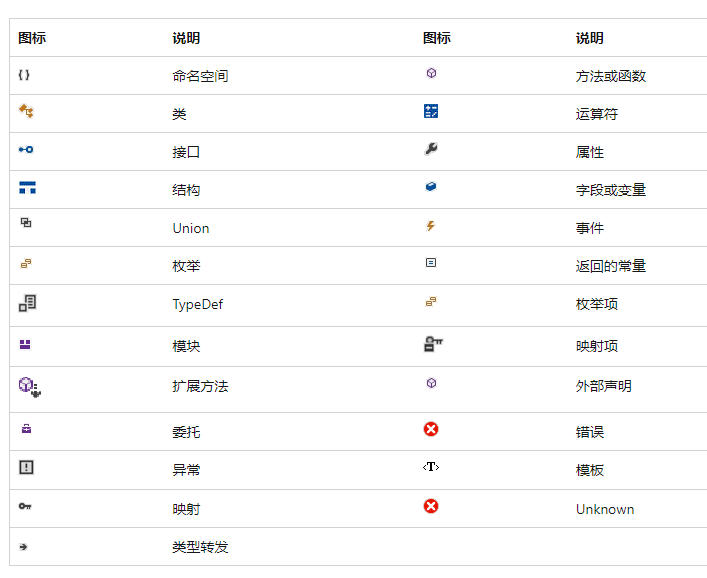
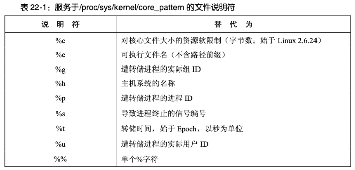

# VS

VS文档：<[Visual Studio 文档 | Microsoft Learn](https://learn.microsoft.com/zh-cn/visualstudio/windows/?view=vs-2022)>



## *生成配置*

### Debug和Release版本

* Debug调试版本：包括了调试信息，并且不做任何优化，便于程序员调试程序
* Release发布版本：编译器进行了各种优化，使得程序在代码大小和运行速度上都是最优的，以便用户使用，但不能进行调试

只有DEBUG版的程序才能设置断点、单步执行、使用 TRACE/ASSERT等调试输出语句。release不包含任何调试信息，所以体积小、运行速度快

对于x86来说，Debug和Release编译生成的obj和链接后可执行文件会分别放在Debug和Release文件夹中；而x86则是将Debug和Release分别凡在名为x64的文件夹中

## *项目结构*

### 如何组织一个项目？

新建的vs工程的配置文件主要包括两部分：Solution（解决方案）和Project（工程）配置文件

一个解决方案里可能包含多个工程。**每个工程是一个独立的软件模块，比如一个程序、一个代码库等。**这样的好处是解决方案可以共享文件和代码库

### 解决方案文件

VS 采用两种文件类型（`.sln` 和 `.suo`）来存储解决方案设置，下面提到的除了`.sln` 之外的文件都放在 `.vs/解决方案名/版本号/` 中

* `*.sln` Visual Studio.Solution  环境提供对项目、项目项和解决方案项在磁盘上位置的引用，可以将它们组织到解决方案中。比如是生成Debug还是Release，是通用CPU还是专用的等。`*.sln`文件可以在开发小组的开发人员之间共享。 `.sln` 就是打开文件的索引，正确引导用户进入环境、进入工程
* `*.suo`  Solution User Operation 解决方案用户选项，记录所有将与解决方案建立关联的选项，以便在每次打开时，它都包含用户所做的自定义设置。比如说VS窗口布局、项目最后编译的而又没有关掉的文件在下次打开时用，打的断点等。注意： `*.suo` 文件是用户特定的文件，不能在开发人员之间共享

sdf 和 ipch文件与VS提供的智能感知、代码恢复、团队本地仓库功能有关，如果不需要，可以禁止，就不会产生sdf 和 ipch这两个文件了，VS重新加载解决方案时速度会加快很多。另外这两个文件会导致VS工程变得很大，如果此时用git进行管理，git中的管理文件也会变得很大

* `*.sdf`文件：SQL Server Compact Edition Database File（`.sdf`）文件，是工程的信息保存成了数据库文件。sdf文件是VS用于intellisense的
  * 若没有参加大型的团队项目，不会涉及到高深的调试过程，这个文件对于用户来说是没什么用的，可以放心删除。若后来又需要这个文件了，只打开工程里的 `.sln` 文件重新编译链接就ok了
  * 同时我们注意到，当我们打开工程的时候还会产生一个 `*.opensdf` 的临时文件，不需关心，该文件关闭工程就会消失，是update `*.sdf`文件的缓冲。如果完全不需要，也觉得sdf文件太大，那么可以：在Visual Studio里进入如下设置：进入“Tools > Options”，选择“Text Editor >C/C++ > Advanced”，然后找到“Fallback Location”。然后把“Always use Fallback Location”和“Do Not Warn if Fallback Location”设置成“True”。这样每次打开工程，不会再工程目录生成 `*.sdf` 文件了
  * VS2015之后生成的 `*.db` 文件是sqlite后端用于intellisense的新数据库，相当于之前的 `*.sdf` SQL Server Compact数据库。它与VS2015提供的智能感知、代码恢复、团队本地仓库功能有关，VS重新加载解决方案时速度超快
* ipch文件夹：用来加速编译，里面存放的是precompiled headers，即预编译好了的头文件
* 禁止这两类文件生成的设置方法是：工具 `->` 选项 `->` 文本编辑器 `->` C/C++ `->` 高级，把回退位置和警告设置为true或者禁用数据库设为true，这样就不会产生那个文件了

上面的文件只是起一个组织的作用，将各个信息凝聚在一起，从而形成一个解决方案。不要随意的删掉着写看似没用的文件，删掉代码也不会丢失，但是，有时候环境配置好后，使用也比较方便，对于这两个文件，没必要动它。为了减少项目文件的大小，和这两个文件没有关系，但是如果操作不当，会导致解决方案打不开。那么解决办法就只有重建项目，然后导入代码文件了，只是会浪费一些时间而已，又要重新组织项目文件

### 工程配置文件

 Project的配置文件种类主要包括：`*.vcxproj`、`*.vcxproj.filters`、`*.vcxproj.user`、`*.props`.（注意区分`*.vcproj` 和 `*.vcxproj` 的区别，前者是vs2008及以前版本的工程配置文件，后者是vs2010及以后的工程配置文件）

* `*.vcxproj`文件是真正的项目配置文件，以**标准XML格式**的形式记录了工程的所有配置，如包含的文件名、定义的宏、包含的头文件地址、包含的库名称和地址、系统的种类等等。此外，还可以使用过滤条件决定配置是否有效
* `*.vcxproj.filters` 文件是项目下文件的虚拟目录，用于组织项目中源代码文件的视图层次结构的XML文件。它定义了在 Visual Studio 中的解决方案资源管理器中如何显示和组织项目文件。该文件通常包含项目中的文件夹结构和源代码文件的过滤器（例如，源文件、头文件、资源文件等）。通过在`*.vcxproj.filters`文件中定义过滤器，可以在 Visual Studio 中更好地组织和浏览项目文件
* `*.vcxproj.user` 是XML格式的用户配置文件，用于保存用户个人的数据，比如配置debug的环境PATH等等。用于存储针对特定用户的项目设置。这些设置通常包括编译器选项、调试器设置、运行时环境等。每个用户在打开或修改项目时，可以在该文件中保存自己的首选项和个性化设置
* `*.props` 是属性表文件，用于保存一些配置，可以根据需求，导入到项目中使用。使用起来很灵活，比如使用一个开源库，我们新建一个工程，往往需要做不少配置，如果不用属性表文件的话，那么我们每次创建一个工程都要配置一遍，太浪费时间了。如果我们能将配置保存起来，每次新建项目将配置加进来就好了，属性表文件就很好的实现了这一点

## *IntelliSence*

IntelliSense 是一项由 Microsoft 开发的智能代码补全和代码提示功能，旨在提高开发人员在集成开发环境（IDE）中编写代码的效率和准确性。它在多个 Microsoft IDE（如 Visual Studio、Visual Studio Code）和其他编辑器中得到广泛支持。

IntelliSense 使用静态代码分析、语义分析和用户输入上下文来为开发人员提供有关代码的实时信息和建议。它的主要功能包括：

1. 代码自动补全：IntelliSense 会根据正在输入的代码上下文，提供相关的代码补全选项。它可以自动完成代码片段、类、函数、变量等，并显示对应的参数列表和函数签名。
2. 代码导航：IntelliSense 可以帮助开发人员快速浏览代码库，并提供与代码相关的导航功能。这包括跳转到定义、查看函数调用层次结构、查找引用等。
3. 实时错误检查：IntelliSense 可以在代码编写过程中进行实时的语法和语义错误检查，并显示相应的错误和警告。这样可以帮助开发人员及早发现和修复问题，提高代码质量。
4. 文档注释：IntelliSense 可以显示与代码相关的文档注释、函数说明和参数描述，使开发人员能够更好地理解代码的含义和使用方式。
5. 提示和上下文帮助：IntelliSense 可以根据用户输入的上下文，提供有关可用选项的提示和帮助。它可以显示函数签名、参数类型、属性和方法列表等信息，以便开发人员更准确地编写代码

## *VS远程开发*

### Samba服务器

Samba 是一个开源的**局域网络协议套件**，允许不同操作系统之间共享文件和打印机。它使Linux、Unix 和类似系统可以与Windows 系统互操作，允许在**处于同一个局域网内的不同操作系统之间**共享文件和资源。以下是关于Samba服务器的一些重要信息：

* 文件共享：Samba允许在Linux/Unix和Windows系统之间共享文件和目录。这意味着您可以在Linux服务器上创建共享文件夹，并允许Windows用户通过网络访问这些文件夹，就好像它们位于Windows本地文件系统中一样
* 打印机共享：除了文件共享，Samba还支持共享打印机。这使得Windows用户可以使用网络上的共享打印机，无需在其本地系统上安装驱动程序
* 支持多种协议：Samba支持多种网络文件共享协议，包括SMB/CIFS（Server Message Block / Common Internet File System）、SMB2和SMB3等。这使得它与不同版本的Windows系统和其他操作系统兼容
* 安全性：Samba提供了强大的安全性功能，可以配置访问控制列表（ACLs）和权限，以确保只有授权的用户能够访问共享资源。它还支持用户身份验证和加密来保护数据传输的安全性
* 域控制器：Samba还可以用作域控制器，允许您在Linux系统上创建和管理Windows活动目录域。这使得在混合操作系统环境中实现统一的用户和资源管理变得更加容易
* 跨平台：Samba是一个跨平台的解决方案，可以在多种操作系统上运行，包括Linux、Unix、BSD等

### Samba服务器的使用

* Samba服务器在ubuntu上的安装

  ```cmd
  $ sudo apt-get install samba samba-common # 安装
  $ dpkg -l | grep samba # 确认安装
  $ sudo apt-get autoremove samba # 卸载
  ```

* 配置Samba服务器

  ```cmd
  $ sudo vim /etc/samba/smb.conf
  ```

  在文件最后添加

  ```
  [Share]
  comment=This is samba dir
  path=/home/wjfeng/
  writable=yes
  browseable=yes
  ```

  增加samba 用户

  ```cmd
  $ sudo smbpasswd -a wjfeng
  ```

* 启动和关闭

  ```cmd
  $ sudo service smbd start # 启动Samba服务器
  $ sudo service smbd stop # 关闭Samba服务器
  ```

# GDB

通常在程序开始运行之前，可以使用一种特殊的方法来启动和运行这个程序，这种方法就是通过一个称为 调试器 Debugger 的工具。调试器是一种专门的软件，它允许程序员以一种特殊的方式运行程序，这样就可以更仔细地观察和检查程序的行为

在一般情况下，程序直接在操作系统中运行，而使用调试器启动程序时，程序是在调试器的控制下运行的

GDB命令入门：http://c.biancheng.net/gdb/

GDB Doc：[Top (Debugging with GDB) (sourceware.org)](https://sourceware.org/gdb/current/onlinedocs/gdb.html/index.html#SEC_Contents)

## *调试执行*

### 启动调试

gcc/g++编译出来的二进制程序默认是release模式，**要使用gdb调试，必须在源代码生成二进制程序的时候加上选项 `-g`**

* 两种加载调试文件的方式
  * 直接 `gdb file_name` 来加载调试文件
  * 如果是先打开了gdb，可以通过 `file file_name` 来加载调试文件 
  
* 调试需要参数的程序

  * gdb打开程序的时候就指定参数

    ```cmd
    $ gdb --args myprogram --option1 value1 --option2 value2
    ```

  * gdb打开程序后，使用 `run` 命令并附带程序需要的参数

    ```
    (gdb) run arg1 arg2 arg3
    ```

  * 使用 `set args` 命令设置参数后再run

    ```
    (gdb) set args arg1 arg2 arg3
    (gdb) run
    ```
    
    如果觉得每次都要 `set args` 很麻烦，可以写入 `.gdbinit` 或者用脚本文件等方式

* 当完成调试时，可以使用 `q` 或者 `quit` 命令退出GDB

### 附加到进程

在很多情况下，程序出现问题时并不处于调试状态。也就是说在我们想要调试程序时，程序已经加载到内存中开始运行，此时并不处于Debugger的控制下

可以使用 `gdb attach pid` 的方式把一个已经run起来的程序托管给gdb运行

## *断点管理*

### 命令类型

在gdb中使用help可以得到11种命令类型+1种用户自定义命令+1种命令别名

* aliases -- User-defined aliases of other commands. 给命令取别名
* breakpoints -- Making program stop at certain points. 断点命令
* data -- Examining data. 查看数据
* files -- Specifying and examining files. 对Debug对象文件的操作
* internals -- Maintenance commands.
* obscure -- Obscure features.
* running -- Running the program. Debug过程控制
* stack -- Examining the stack. 堆栈信息
* status -- Status inquiries.
* support -- Support facilities.
* text-user-interface -- TUI is the GDB text based interface.
* tracepoints -- Tracing of program execution without stopping the program.
* user-defined -- User-defined commands.

### 断点类型

* 行号断点：通过在源代码的特定行上设置断点，可以使程序在执行到该行时停止。`break [filename:]linenumber`

* 函数断点：通过指定要在特定函数内停止程序执行的方式来设置函数断点。`break function_name`

* **条件断点 conditional breakpoint**：设置一个条件，只有当条件满足时才会触发断点。`break location if condition`

* 硬件断点：硬件断点是在处理器级别实现的断点，可以用于监视内存地址的读写操作。`break location hardware`

* 监视断点 watchpoint：监视断点用于监视变量的值的更改。当变量的值发生变化时，程序会停止执行。`watch variable`

  监视断点允许我们在一个变量的值发生改变时暂停程序的执行，或者内存地址被读取或写入时暂停。它关注的是数据的变化，而不像断点那样关注代码的位置。监视点非常有用于追踪变量何时和如何被修改，这在调试复杂的状态错误和内存覆写问题时很有帮助

* 静态断点：静态断点是指在程序启动之前设置的断点，用于在程序加载时立即生效。`break filename:linenumber static`

### 断点操作

* 设置断点：在程序中设置断点，以在特定位置停止程序的执行。使用 `break` 命令，后面跟上文件名和行号或函数名
* 查看断点：`info break`
* 启用和禁用断点：使用 `enable` 和 `disable` 命令可以分别启用和禁用一个或多个断点。例如，`enable breakpoints` 或 `disable breakpoints`
* 删除断点
  * `delete` 删除所有断点；`delete 断点编号` 删除指定编号的断点；`delete 范围` 删除编号范围内的断点
  * `clear 函数名` 删除函数断点；`clear 行号` 删除指定行号的断点
* 临时断点：可以设置一个临时断点，它会在首次触发后自动删除。使用 `tbreak` 命令来设置临时断点，例如，`tbreak function_name`

### 断点的重复操作

1. **忽略计数**：
   * 可以使用 `ignore` 命令来设置一个断点的忽略计数，以指定触发断点的次数。例如，`ignore 3 1` 表示在第3次触发后停止。
2. **条件断点修改**：
   * 使用 `condition` 命令可以更改条件断点的条件。例如，`condition breakpoint_number new_condition`。

## *程序执行*

* 程序执行

  * `list`（或 `l`）：查看源代码，默认查看当前运行行的前后各5行。用 `l-` 来查看前后各10行。也可以用 `set listsize NUM` 来修改查看的行数
  * 使用 `run`（或 `r`）命令来启动程序，并在达到断点或程序结束时停止
  * 使用 `continue`（或 `c`）命令来从中断点继续程序直到下一个断点

* 运行控制

  * `step`（或 `s`）：逐语句执行程序，进入函数内部

  * `next`（或 `n`）：逐过程执行程序，跳过函数内部
  * `finish`：继续运行直到当前函数执行完成

## *查看信息*

### 查看和修改变量的值

* 查看变量的值
  * `print`（或 `p`）：查看变量的值，例如 `p variable_name`
  * `info locals`：查看当前作用域内的局部变量
  * `info args`：查看当前调用函数的参数
  * 查看结构体/类的值：使用 `p *结构体指针` 直接查看结构体/类的整体信息
  * 查看数组
  * 监视断点可以持续监控
  *  `display` 命令可以设置一个表达式，每次程序停止时都会显示该表达式的值。这对于跟踪变量的值变化很有用
* 修改变量的值
  * 用 `set` 命令可以修改变量的值。需要指定变量名和新值

### 查看内存

* 使用 `x` 命令可以查看内存中的内容。需要指定要查看的内存地址和显示的格式

  ```
  x /[格式] [内存地址]
  ```

  格式可以是十六进制、十进制、八进制等。例如，`x/4x 0x12345678` 将以十六进制格式查看地址 `0x12345678` 处的四个字节

* 查看字符串：要查看内存中的字符串，可以使用 `x/s` 命令

   ```
   x/s [内存地址]
   ```
   
   例如，`x/s 0xabcdefg` 将以字符串格式查看地址 `0xabcdefg` 处的内容。
   
* 查看内存块：如果要查看一段连续的内存，可以使用 `x` 命令的范围选项

   ```
   x/[格式] [起始地址] [结束地址]
   ```
   
   例如，`x/16x 0x1000 0x1010` 将以十六进制格式查看地址从 `0x1000` 到 `0x1010` 的内容。
   
* 查看局部变量的内存：可以使用 `print` 命令结合 `&` 运算符来查看局部变量的内存地址，然后再使用 `x` 命令来查看该地址处的内容。

### 查看寄存器

在程序运行或已暂停的状态下，使用 `info registers` 命令查看寄存器的值。gdb将显示当前程序中所有可见寄存器的值和它们的名称

```
info registers
i r // 等价缩写
```

如果你关心特定寄存器的值，可以使用 `info register` 命令，并指定要查看的寄存器的名称。例如，要查看EAX寄存器的值，可以执行以下命令：

```
info register eax
```

### 查看调用堆栈

* `backtrace`（或 `bt`）：查看栈回溯信息
* 切换栈帧：`frame 栈帧号` 也可以通过 up 和 down 这两个命令用于在函数调用堆栈之间切换：`up` 命令将当前堆栈帧移动到调用者，而 `down` 命令将当前堆栈帧移动到被调用的函数。
* 查看帧信息：`info frame`

### 线程管理

## *.gdbinit*

### `.gdbinit` 的脚本命令

`.gdbinit` 是 GDB 的初始化文件，它是一个用于配置 GDB 行为的用户自定义文件。当启动 GDB 时，它会自动在用户的 home 目录下查找并加载 `.gdbinit` 文件，执行其中的命令。这使得用户可以在 GDB 启动时自动执行一系列的设置和命令，以方便调试

以下是一些在 `.gdbinit` 文件中常见的用法：

*  设置默认参数：可以在 `.gdbinit` 文件中设置默认的命令行参数，以避免在每次调试会话中手动设置。例如：

   ```
   set args arg1 arg2
   ```

* 自定义别名：创建 GDB 命令的别名，以缩短常用命令的输入。例如：

   ```
   alias ll = list
   alias r = run
   ```

* 加载 GDB 脚本：如果有一组特定的命令需要在每次启动 GDB 时执行，可以在 `.gdbinit` 文件中加载 GDB 脚本文件：

   ```cmd
   source /path/to/your/script.gdb
   ```
   
   当然也可以不用 `.gdbinit`，直接用命令行加载该脚本
   
   ```cmd
   $ gdb -x /path/to/your/script.gdb
   ```
   
* 配置 GDB 行为：修改 GDB 的一些行为，例如更改显示格式、设置断点、启用或禁用特定功能等。例如：

   ```
   set disassembly-flavor intel
   break main
   ```

* 自定义显示格式：可以通过 `.gdbinit` 文件自定义变量的显示格式，以更好地适应需求。例如：

   ```
   set print elements 0
   ```

确保在编辑 `.gdbinit` 文件时谨慎，以免引入错误或不必要的设置。此文件对于个性化和简化调试工作流程非常有用，但要确保其中的设置不会影响到特定项目之外的其他调试任务

### 全局gdbinit的安全机制

gdbinit有两种

* 全局 `gdbinit` 文件，**它必须以 `gdbinit` 命名（注意开头没有 `.`）**，通常位于系统的特定目录中，例如 `/etc/gdb/gdbinit` 或者某个其他对所有用户均可见的位置。当任何用户启动 GDB 时，全局 `.gdbinit` 文件中的命令会被自动执行

  使用全局 `.gdbinit` 文件允许系统管理员为整个系统设置默认的 GDB 配置，比如定义默认的 pretty-printers，设置常用的别名，或者加载特定的扩展

* 局部 `.gdbinit`

  局部 `.gdbinit` 文件则相对于用户或项目私有。当在某个特定目录下启动 GDB 时，该目录下的 `.gdbinit` 文件（如果存在的话）会被自动执行。用户也可以在其主目录（通常是 `~/.gdbinit`）下创建一个 `.gdbinit` 文件，这样每当该用户启动 GDB 时，都会加载用户主目录下的 `.gdbinit`

  使用局部 `.gdbinit` 文件允许用户或项目设置特定的 GDB 配置，这些配置可能只对当前工作目录下的调试会话有效，或者是用户特定偏好的设置

为了防止恶意代码或不安全的文件自动加载到 GDB 中，GDB 引入了 "Auto-loading safe path" 机制

> warning: File "/home/wjfeng/SharedBike/bin/.gdbinit" auto-loading has been declined by your `auto-load safe-path' set to "\$debugdir:\$datadir/auto-load".
>
> To enable execution of this file add `add-auto-load-safe-path /home/wjfeng/SharedBike/bin/.gdbinit` line to your configuration file "/home/wjfeng/.config/gdb/gdbinit".
>
> To completely disable this security protection add `set auto-load safe-path /` line to your configuration file "/home/wjfeng/.config/gdb/gdbinit".
>
> For more information about this security protection see the "Auto-loading safe path" section in the GDB manual.  E.g., run from the shell: `info "(gdb)Auto-loading safe path"`

1. **添加特定文件的安全路径：** 在警告信息中，建议将以下行添加到 GDB 配置文件 `~/.config/gdb/gdbinit`（**注意这个文件不是 `.` 开头的**） 中：

   ```
   add-auto-load-safe-path /home/wjfeng/SharedBike/bin/.gdbinit
   ```

   这将允许 GDB 自动加载指定的 `.gdbinit` 文件

2. **完全禁用安全保护：** 如果对 `.gdbinit` 文件的内容有充分的信任，也可以选择完全禁用安全保护。为此，将以下行添加到 GDB 配置文件中：

   ```
   set auto-load safe-path /
   ```

   这将允许 GDB 自动加载任何路径下的 `.gdbinit` 文件，但注意，这可能会引入一些安全风险

### GUI & prettier

[cyrus-and/gdb-dashboard: Modular visual interface for GDB in Python (github.com)](https://github.com/cyrus-and/gdb-dashboard)

## *Python API*

API Doc: [Python (Debugging with GDB) (sourceware.org)](https://sourceware.org/gdb/current/onlinedocs/gdb.html/Python.html#Python)

GDB 提供了一个 Python API，允许用户在 GDB 中使用 Python 脚本来扩展调试器功能。这个接口可以用来编写自定义的命令、断点动作（breakpoint actions）、pretty-printers 以及其他各种工具和自动化脚本

GDB 的 Python API 支持创建以下类型的扩展：

- **命令**：用户可以通过 Python 编写新的 GDB 命令
- **Pretty-printers**：用户可以定义格式化打印复杂数据结构的方式，提高可读性
- **断点**：用户可以自定义断点行为，包括在断点触发时执行特定的 Python 脚本
- **事件监听**：Python 脚本可以响应不同的 GDB 事件，例如停止或退出事件
- **自定义数据显示**：可以创建自定义的数据显示方法，用于监视变量
- **扩展现有命令**：可以扩展甚至覆盖 GDB 内置命令的行为

要在 GDB 中启用 Python 支持，GDB 需要在编译时启用 Python 支持，大多数现代 Linux 发行版提供的 GDB 版本通常都已经具备了这一功能。`.gdbinit` 文件本身由 GDB 读取并解释，它可以包含纯 GDB 命令，也可以在其中嵌入 Python 脚本

当需要在 `.gdbinit` 文件中执行 Python 代码时，要使用特殊的 GDB 命令 `python` 来告诉 GDB 接下来的部分是 Python 代码。例如：

```
python
# Your Python code goes here.
end
```

由于这种方式内嵌了 Python 代码，GDB 在解释这些代码时已经知道它们将通过 Python 解释器执行，因此不需要再次导入 `gdb` 模块。实际上，当 GDB 执行内嵌的 Python 代码时，**它自动地为该段代码提供了 `gdb` 模块的上下文**

下面是一个简单的例子，展示了如何在 GDB 中定义一个新的命令：

```python
import gdb

class HelloWorld(gdb.Command):
    """Greet the world."""

    def __init__(self):
        super(HelloWorld, self).__init__("hello-world", gdb.COMMAND_USER)

    def invoke(self, arg, from_tty):
        print("Hello, World!")

HelloWorld() # 创建并注册命令
```

将上述脚本保存到一个文件中，然后在 GDB 中使用下面的命令加载脚本：

```
(gdb) source /path/to/the/script.py
```

之后就可以在 GDB 中直接使用 `hello-world` 这个新定义的命令了

# GDB原理

## *架构*

## *源代码搜索问题*

工作中常常会出现发布机编译完代码要在开发机调试的情况，两台机器上的代码时一样的，但是源代码的位置可能放置的不同，那么在个人开发机上调试这样的程序就会找不到源代码

No such file or directory

[gdb调试解决找不到源代码的问题_gdb no source file named-CSDN博客](https://blog.csdn.net/albertsh/article/details/107437084)


* `$cdir` the source file was compiled into object code 编译目录 compile directory，内嵌于目标文件中
* `$cwd` current working directory 当前工作目录.

# LLDB的使用

[🐛 LLDB (llvm.org)](https://lldb.llvm.org/)

[GDB to LLDB command map - 🐛 LLDB (llvm.org)](https://lldb.llvm.org/use/map.html)

LLDB 是 LLVM 工具链中的debugger，相比于GDB它更现代、复杂，作为LLVM的一员，它同样提供了API用于开发

> LLDB is a next generation, high-performance debugger. It is built as a set of reusable components which highly leverage existing libraries in the larger [LLVM Project](https://llvm.org/), such as the Clang expression parser and LLVM disassembler.
>
> LLDB is the default debugger in Xcode on macOS and supports debugging C, Objective-C and C++ on the desktop and iOS devices and simulator.

## *LLDB编译*

### 箭头问题

lldb 箭头没有用，比如上箭头会打印出 `^[[A`

原因是：[lldb arrow keys nor working : r/LLVM (reddit.com)](https://www.reddit.com/r/LLVM/comments/1e9opgt/lldb_arrow_keys_nor_working/)，缺少libedit

[Editline Library (libedit) - Port of NetBSD Command Line Editor Library (thrysoee.dk)](https://thrysoee.dk/editline/)

```cmd
$ sudo apt-get install libedit-dev
```

构建的时候带上 `-DLLDB_ENABLE_LIBEDIT=ON` 即可

## *LLDB命令结构*

相比于GDB较为自由的命令形式，LLDB的命令结构基本上是遵守下面的格式的

```cmd
<noun> <verb> [-options [option-value]] [argument [argument...]]
```

可以使用 `''` 或 `""` 来给出空格，可以用 `\` 进行转义，用 backtick ` `` ` 进行命令替换

### 命令别名

```cmd
(lldb) command unalias b
(lldb) command alias b breakpoint
```

如果别名和已有命令产生冲突的时候，lldb parser会选择使用别名，前提是如果只有一个相同的别名的话

### raw-input

```
(lldb) help raw-input
  <raw-input> -- Free-form text passed to a command without prior interpretation, allowing spaces without requiring quotes.  To pass arguments and free form text put two dashes
                 ' -- ' between the last argument and any raw input.
```

raw-input是指传递给命令的未经解释（原始格式）的文本。当使用某些需要接收原始输入的LLDB命令时，可以直接输入文本而不需要用引号包围其中包含的空格。这意味着LLDB会将该输入当作一个整体字符串来处理，而不是试图解析它

例如，如果一个命令通常需要使用引号来包围一个包含空格的字符串参数，那么在启用raw-input模式后，就无需使用引号。这对于某些要求精确控制输入格式的命令很有用

`--` 是一种在命令行界面中常见的约定，用于表明命令参数的结束和原始输入的开始。当需要传递一些应该被视为单个参数的文本，且该文本可能包含通常会被解释为多个参数的空格或特殊字符时，这种方法非常有用

```cmd
(lldb) some-command arg1 arg2 -- 这是原始输入内容
```

注意：一旦使用了`--`来标记原始输入的开始，LLDB会认为所有随后的内容都是原始输入，直到该命令处理完毕。没有办法可以说明结束了raw-input，之后给出的内容又是正常的输入了

## *调试执行*

### Loading Program into LLDB

和gdb一样，LLVM 编译出来的二进制程序默认是release模式，编译的时候一定要 `-g` 才会把程序的debug信息放进去，从而才能使用debugger调试

* 调试需要参数的程序

  1. 在lldb打开程序的时候直接给出

     ```cmd
     $ lldb -- a.out 1 2 3
     ```

  2. lldb打开程序后，使用 `process launch` 命令并附带程序需要的参数

     ```
     (lldb) process launch -- <args>
     (lldb) run <args>
     (lldb) r <args>
     ```

  3. 使用 `settings set` 命令设置参数后再run

     ```
     (lldb) settings set target.run-args 1 2 3
     (lldb) run
     ...
     (lldb) run
     ...
     ```

     如果参数本身是有 `-` 或者 `--` 的话，需要用 `settings set -- target.run-args 1 2 3`，否则lldb会把它们解析为传递给lldb本身的选项

     在 LLDB 中，`--` 通常用来明确表示后面的参数不应该被 LLDB 解释器解析，而是直接传递给要运行的程序

  4. 新开一个Terminal来load（MacOS only）

     ```
     (lldb) process launch --tty -- <args>
     (lldb) pro la -t -- <args>
     ```

* 和gdb一样，先 `lldb` 打开LLDB，然后用 `file` 来打开待调试文件也是可以的

* 调试已经在运行的程序 `process attach`

  ```
  (lldb) process attach --pid 123
  (lldb) process attach --name Sketch
  (lldb) process attach --name Sketch --waitfor
  ```

  `--waitfor` 和挂起断点有点类似，等该进程出现的时候再attach

* 当完成调试时，可以使用 `q` 或者 `quit` 命令退出lldb

### 设置环境变量

* 设置

  ```
  (lldb) settings set target.env-vars DEBUG=1
  (lldb) set se target.env-vars DEBUG=1
  (lldb) env DEBUG=1
  ```

* 取消设置

  ```
  (lldb) settings remove target.env-vars DEBUG
  (lldb) set rem target.env-vars DEBUG
  ```

* 在 `process launch` 的时候设置

  ```
  (lldb) process launch -E DEBUG=1
  ```

### 程序执行

LLDB中，所有的完整进程控制命令都是以 `thread` 作为 noun 的

```
(lldb) thread continue   // 断点命中后继续执行
Resuming thread 0x2c03 in process 46915
Resuming process 46915
(lldb) thread step-in    // The same as GDB's "step" or "s" 进入一个函数
(lldb) thread step-over  // The same as GDB's "next" or "n" 单步调试
(lldb) thread step-out   // The same as GDB's "finish" or "f" 执行完当前函数
(lldb) thread return [RETURN EXPRESSION] // 马上从当前栈中返回，附一个可选的返回值
```

也有汇编指令级别的控制

```
(lldb) thread step-inst       // The same as GDB's "stepi" / "si"
(lldb) thread step-over-inst  // The same as GDB's "nexti" / "ni"
```

### 多线程控制


## *断点管理*

### 断点操作

```
(lldb) help breakpoint
Commands for operating on breakpoints (see 'help b' for shorthand.)

Syntax: breakpoint <subcommand> [<command-options>]

The following subcommands are supported:

      clear   -- Delete or disable breakpoints matching the specified source file and line.
      command -- Commands for adding, removing and listing LLDB commands executed when a breakpoint is hit.
      delete  -- Delete the specified breakpoint(s).  If no breakpoints are specified, delete them all.
      disable -- Disable the specified breakpoint(s) without deleting them.  If none are specified, disable all breakpoints.
      enable  -- Enable the specified disabled breakpoint(s). If no breakpoints are specified, enable all of them.
      list    -- List some or all breakpoints at configurable levels of detail.
      modify  -- Modify the options on a breakpoint or set of breakpoints in the executable.  If no breakpoint is specified, acts on the last created breakpoint.  With
                 the exception of -e, -d and -i, passing an empty argument clears the modification.
      name    -- Commands to manage name tags for breakpoints
      read    -- Read and set the breakpoints previously saved to a file with "breakpoint write".
      set     -- Sets a breakpoint or set of breakpoints in the executable.
      write   -- Write the breakpoints listed to a file that can be read in with "breakpoint read".  If given no arguments, writes all breakpoints.
```

* 设置断点

  * `breakpoint set` / `br s`

    * `-n/--name` 为某个名字的函数设置断点
    * `-f/--file` 为某个文件设置断点
    * `-l/--line` 为某行代码设置断点

  * LLDB提供了GDB风格的断点设置，即使用 `b` 可以不使用上面的选项就直接使用设置断点

    ```
    (lldb) b test.c:12
    ```

  * 使用正则表达式设置断点

    ```
    (lldb) breakpoint set --source-pattern regular-expression --file SourceFile
    (lldb) br s -p regular-expression -f file
    ```

  * 设置条件断点

    ```
    (lldb) breakpoint set --name foo --condition '(int)strcmp(y,"hello") == 0'
    (lldb) br s -n foo -c '(int)strcmp(y,"hello") == 0'
    ```

* 查看断点：`breakpoint list` or `br l`

* 启用和禁用断点：使用 `breakpoint enable` or `br en` 和 `breakpoint disable` or `br dis` 命令可以分别启用和禁用一个或多个断点

* 删除断点
  * `breakpoint delete` or `br del` 删除所有断点；`delete 断点编号` 删除指定编号的断点；`delete 范围` 删除编号范围内的断点
  * `clear 函数名` 删除函数断点；`clear 行号` 删除指定行号的断点

* 临时断点：可以设置一个临时断点，它会在首次触发后自动删除。使用 `tbreak` 命令来设置临时断点，例如，`tbreak function_name`

### 断点的重复操作

* **忽略计数**：
  * 可以使用 `ignore` 命令来设置一个断点的忽略计数，以指定触发断点的次数。例如，`ignore 3 1` 表示在第3次触发后停止。
  
* **条件断点修改**：
  * 使用 `condition` 命令可以更改条件断点的条件。例如，`condition breakpoint_number new_condition`。
  
* 自定义断点命中时的操作

  ```
  (lldb) breakpoint set --name myFunction --command 'frame variable'
  ```

  当然也可以在断点创建后追加命令

  ```
  (lldb) breakpoint command add 1.1
  Enter your debugger command(s). Type 'DONE' to end.
  > bt
  > DONE
  ```

  或者用 `--script` 让断点命中后执行该脚本文件中的命令

* 挂起断点：LLDB是默认挂起断点的，也就是说如果当前活跃的已加载的进程中没有找到断点，会把Warning而不是Error，不需要像GDB一样用 `set breakpoint pending on` 来显式开启这种行为

## *查看 & 打印*

### 检查栈

* 显示当前线程的调用栈

  ```
  (lldb) thread backtrace
  (lldb) bt
  * thread #1, name = 'a.out', stop reason = breakpoint 1.1
    * frame #0: 0x00005555555551f3 a.out`main at test_string.cpp:5:14
      frame #1: 0x00007ffff7a80d90 libc.so.6`__libc_start_call_main(main=(a.out`main at test_string.cpp:4), argc=1, argv=0x00007fffffffe3a8) at libc_start_call_main.h:58:16
      frame #2: 0x00007ffff7a80e40 libc.so.6`__libc_start_main_impl(main=(a.out`main at test_string.cpp:4), argc=1, argv=0x00007fffffffe3a8, init=<unavailable>, fini=<unavailable>, rtld_fini=<unavailable>, stack_end=0x00007fffffffe398) at libc-start.c:392:3
      frame #3: 0x0000555555555115 a.out`_start + 37
  ```

* 切换栈

  ```
  (lldb) frame select [frame index]
  (lldb) fr s
  ```

* 查看当前栈和源代码

  ```
  (lldb) f
  (lldb) process status
  ```

### 检查变量

* 查看当前源文件中的 global/static 变量

  ```
  (lldb) target variable
  (lldb) ta v
  ```

* 每次停下来展示 `argc` 和 `argv`

  ```
  (lldb) target stop-hook add --one-liner "frame variable argc argv"
  (lldb) ta st a -o "fr v argc argv"
  (lldb) display argc
  (lldb) display argv
  ```

### 线程信息

### 底层信息：寄存器、内存

### 自定义断点类型

### 自定义LLDB命令

## *Remote Debugging*

### 远端 & 本地的设置

* 远端
* 本地

### 调试

# 配置文件 & 格式化

## *Formatting*

LLDB一共有5种格式化特征

* `type format`
* `type summary`
* `type filter`
* `type synthetic`
* `type category`

除了 `type category` 外每种特种都有下面4个子命令

- `add`: associates a new printing option to one or more types
- `delete`: deletes an existing association
- `list`: provides a listing of all associations
- `clear`: deletes all associations

### Synthetic Children

对于内部结构复杂的数据结构需要特殊处理

### Frame & Thread Format

## *`.lldbinit`*

和GDB使用的 `.gdbinit` 类似，LLDB使用 `.lldbinit` 作为其配置文件

## *Python API*


# LLDB原理 & 开发

[lldb的一些调试用法前言 LLDB是我们平常在开发过程中的默认调试器 如上图所示: lldb还有一个lldb-driv - 掘金 (juejin.cn)](https://juejin.cn/post/7112446964402225160#heading-2)

[BUD17-310 - Introducing LLDB for Linux on Arm and AArch64.pdf (linaro.org)](https://static.linaro.org/connect/bud17/Presentations/BUD17-310 - Introducing LLDB for Linux on Arm and AArch64.pdf)

## *LLDB架构*

[lldb的流程&环境的配置lldb 的断点分类 lldb的断点类型: 软件断点:正在调试的二进制文件中的断点，在调试器中 - 掘金 (juejin.cn)](https://juejin.cn/post/7113844055863197726)

### 本地调试


### 远端调试

## *API*

### C++: SB

Scripting Bridge, SB API 是LLDB提供的稳定C++ API，可以通过SWIG将其转换为Python代码

### Python

## *制作LLDB插件*

[记制作lldb插件搭建模板 在上文lldb的流程&环境的配置一文中已经分析过，lldb-plugin被调用到的关键点在于 - 掘金 (juejin.cn)](https://juejin.cn/post/7114595912814444575)

# 核心转储文件调试分析

Coredump文件，即核心转储文件 是在计算机程序崩溃或发生严重错误时生成的一种文件，用于帮助开发人员诊断和调试问题。这个文件包含了程序在崩溃时内存中的状态信息，包括变量的值、函数调用堆栈和程序计数器等信息

Coredump文件相当于是程序在眼中错误发生时刻的快照。注意：Coredump文件可能包含敏感信息。确保在分析完Coredump文件后，将其删除或以安全的方式处理，以防止敏感数据泄漏

## *Linux Coredump*

### 前期设置

1. 允许生成大小不受限制的 coredump 文件（默认是0，也就是不会生成 coredump 文件）

   ```cmd
   $ ulimit -c unlimited
   ```

   如果想要长期生效的话需要写入shell配置文件

   ```cmd
   $ echo ulimit -c unlimited >> ~/.zshrc
   ```

   但是不建议这么做，因为每次程序崩溃都产生 core dump 会严重挤压系统资源，因为 core dump 文件通常是比较大的，特别是在公司和生产环境中。所以建议只在真正需要调试程序的时候打开

2. 保证当前执行程序的用户对 coredump 目录有写权限且有足够的空间存储来 coredump 文件

3. 设置coredump文件生成的目录

   ```cmd
   $ cat /proc/sys/kernel/core_pattern
   
   |/usr/share/apport/apport -p%p -s%s -c%c -d%d -P%P -u%u -g%g -- %E
   ```

   上面是笔者的云服务器 coredump 文件的默认所在地，它的意思是将生成的 coredump 文件通过管道喂给 apport 程序，该工具在 Ubuntu 等一些 Linux 发行版中用于收集应用程序崩溃信息并提供用户反馈

   但是笔者至今没有搞清楚coredump文件默认生成在哪里，所以也没办法通过apport程序来分析它。因此只能重新设置 coredump 文件的生成地址

   ```cmd
   $ sudo sh -c 'echo /home/wjfeng/core/core.%e.%p > /proc/sys/kernel/core_pattern'
   sudo sh -c 'echo /tmp/core.%t.%e.%p > /proc/sys/kernel/core_pattern'
   ```
   
   `sh -c '...'`：这部分使用了 `sh`（shell）命令，它允许我们以单个命令的方式运行一系列命令。`-c` 选项表示后面跟着一个命令字符串。
   
   

一些注意事项

* 不要使用下面的重定向，会出现权限不够的问题

  ```cmd
  $ echo /home/wjfeng/core/core.%e.%p > /proc/sys/kernel/core_pattern
  zsh: permission denied: /proc/sys/kernel/core_pattern
  ```

  这个问题是因为 `sudo` 只应用于 `echo` 命令，而不是对重定向 `>` 的权限。因此，`echo /data/coredump/core.%e.%p` 是以超级用户权限执行的，但重定向到 `/proc/sys/kernel/core_pattern` 的部分仍然是以当前用户权限执行的

* TODO：如果将 coredump 重定向到系统文件夹中不会产生coredump文件，笔者还没有搞懂为什么，可能是因为权限问题

### 手动触发coredump

```cmd
$ kill -s SIGSEGV `pidof <my_program>`
```

SIGSEGV, Segmentation Violation，表示发生了一次段错误

### 调试

```cmd
$ gdb <program> <core_file>
```

使用 `bt` 或 `backtrace` 打印崩溃时的堆栈信息

### 直接打印堆栈信息

可以使用信号的handle函数来获取栈信息，然后在日志中打印出来

```c
void handle_segv(int signum) {
	void *array[100];
    size_t size;
    char **strings;
    size_t i;
    signal(signum, SIG_DFL);
    size = backtrace(array, 100);
    strings = (char **)backtrace_symbols(array, size);
    fprintf(stderr, "Launcher received SIG: %d Stack trace:\n", signum);
    for (i = 0; i < size; i++) {
        fprintf(stderr, "%d %s\n", i, strings[i]);
    }
    free(strings);
}
```

在main函数中加入

```c
signal(SIGSEGV, handle_segv);  // SIGSEGV 11 Core Invalid memory reference
signal(SIGABRT, handle_segv);  // SIGABRT 6 Core Abort signal from
```

打印出的地址信息可以用下面的命令来转换

```cmd
$ addr2line -a <堆栈地址> -e <程序名>
```

## *Win Coredump*

# VS Code中配置开发环境（通用语言）

## *Console*

* Terminal：是一个实际的命令行终端，可以在其中执行命令，并与命令行界面进行交互。可以在其中运行各种命令，例如编译、运行脚本、Git 操作等
* Output：用于显示各种工具的输出，例如编译器、调试器、任务运行器等的输出。它是一个记录工具生成信息的地方，而不是用于交互的命令行界面
* Debug Console：专门用于显示调试器输出的面板

## *自动化构建任务*

### 新建工程

VS Code没有传统意义上的“创建新项目”流程（如在某些IDE中所见），但当打开一个文件夹 folder 时，它实际上就被视为一个工程 Project 或工作区 Workspace。VS Code会将这个文件夹及其内容作为一个整体来管理，这包括但不限于：

* **文件和目录结构**：可以在侧边栏的资源管理器中浏览和管理文件夹内的所有文件和子目录
* **设置和配置**：特定于项目的设置（例如，编译器配置、调试配置等）通常存储在文件夹内的`.vscode`目录中。这些设置包括`tasks.json` 和`launch.json` 等文件
* **扩展和依赖性**：VS Code允许用户为特定工作区安装扩展，这些扩展可以为项目提供额外的功能，如语言支持、代码格式化、版本控制等
* **版本控制集成**：如果项目使用Git或其他版本控制系统，VS Code可以集成这些功能，提供源代码管理和版本控制的便捷界面

在VS Code 中创建工程，并配置运行和调试环境涉及两个关键文件：`launch.json`（用于定义构建任务） 和 `tasks.json`（用于配制调试）。这些文件位于工程项目的 `.vscode` 文件夹中。下面介绍这两个文件

### `tasks.json` 定义构建任务

```
linting 代码校验 -> building 编译 -> packaging 打包 -> testing 测试 -> 部署 deployment
```

在软件开发中，自动化工具会帮助我们完成上面的流程。对于C/C++而言，lingting由Clang-tidy、Cppcheck来完成；编译由g++、gdb完成；编译打包测试部署由Makefile和CMake等自动化build工具来完成；test则由gtest等单元测试工具完成

`tasks.json` 则是VS Code中用于定义和配置任务 Tasks，这些任务通常用于自动化编译、运行、测试和其他与项目相关的操作。对于C++编程，`tasks.json` 文件的作用非常重要，因为它允许你在编辑器中设置和运行C++编译器以及其他自定义任务

在软件开发中，任务 task 是一个可执行的操作或工作单元，通常用于执行某种特定的操作，例如编译代码、运行测试、执行部署、清理项目等。任务可以是自动化的，可以由开发者手动触发，也可以作为自动化流程的一部分在CI/CD中运行

以下是 `tasks.json` 文件在C++编程中的主要作用：

* 定义编译任务：可以使用 `tasks.json` 来定义C++项目的编译任务，包括编译器命令、编译选项、源文件和目标文件等。这使得我们通过简单的键盘快捷方式或菜单选项来触发编译操作，而不必手动运行命令行编译器
* 配置自定义任务：除了编译任务，还可以在 `tasks.json` 中定义其他自定义任务，比如运行测试、生成文档、清理项目等。这些任务可以根据项目的需求进行定制
* 集成外部工具：可以使用 `tasks.json` 集成外部工具，例如代码生成工具、构建工具、自动化部署脚本等。通过配置任务可以在VS Code中轻松调用和执行这些外部工具
* 多平台支持：`tasks.json` 可以根据不同的操作系统和开发环境定义不同的任务配置。这使得我们可以在不同平台上构建和运行项目，而无需手动修改配置
* 任务依赖性：可以定义任务之间的依赖关系，确保它们以正确的顺序执行。例如，在构建任务之前，可能需要先运行代码校验任务
* 自动化工作流程：通过将任务与VS Code的自动保存、自动构建和自动测试功能结合使用，可以实现自动化的开发工作流程，提高开发效率

### 属性

task的总体结构如下

```json
tasks: [
	{
		任务一
	}, 
	{
		任务二
	}
]
```

下面是每个task用到的属性

* label：label 属性是任务的名称或标识符。它用于唯一标识任务并提供可读性。使用它在配置文件中引用或区分任务

* type

  * type 属性指定了任务的类型，它告诉VS Code 如何执行任务
  * 常见的类型包括 "shell"（使用Shell执行命令）、"process"（直接运行可执行文件）、"npm"（用于运行npm脚本）等。对于C++程序cppbuild等于shell的别名

* command

  * command 属性指定（终端中）要执行的命令或操作。这是任务的主要目标
  * 通常需要提供一个可执行文件的路径或一个命令行命令

* args：args是一个数组，它会指定将传递给编译器的命令行参数。这些參数按照编译器期望的特定顺序列在该文件中

* windows：windows 属性用于指定仅在 Windows 操作系统上运行的任务。可以在  windows 下定义 Windows 特定的任务配置

* group：group 属性用于将任务分组。它包括两个子属性：kind 和 isDefault

  * kind 指定了任务的种类，如 "build"、"test"、"clean" 等
  * isDefault 用于标记是否是默认任务，当你在VS Code中运行任务时，默认任务将首先执行

* presentation

  * presentation 属性用于控制任务在 VS Code 中的呈现方式
  * 可以包括 `echo` 属性，用于控制任务的输出是否显示在输出面板中

* options

  * options 属性包含一组任务执行选项，通常用于配置任务的行为

  * 可以设置环境变量、工作目录、环境路径等选项

    * cwd, current working directory：cwd 属性用于指定任务在哪个目录下执行。这对于需要在特定目录中运行任务的情况非常有用。比方说如果任务需要在项目的根目录下执行，则可以将 `cwd` 设置为项目的根目录路径 `${workspaceFolder}`

    * env 环境变量：env 属性用于设置任务执行时的环境变量。可以指定键值对，以配置任务执行环境中的特定变量。这在需要自定义环境变量的任务中非常有用

    * shell（Shell 配置）：shell 属性允许配置任务的 Shell 环境。可以指定 Shell 的路径或使用系统默认的 Shell

      ```json
      "options": {
          "shell": {
              "executable": "/bin/bash",
              "args": ["-c"]
          }
      }
      ```

    * suppressTaskName（禁止任务名称）

      * `suppressTaskName` 属性用于控制是否在输出面板中显示任务名称
      * 如果设置为 `true`，任务的名称将不会显示在输出中，只会显示命令的输出

* runOptions

  * runOptions 属性是任务运行时的选项，通常用于配置任务在后台运行或前台运行等
  * 一些任务可能需要以不同的方式运行，runOptions 允许我们进行定制

* problemMatcher：定义如何匹配和处理任务输出中的问题（错误和警告）的设置。它允许你配置 VS Code 如何识别和展示来自任务的错误和警告信息，以便在开发过程中更容易地发现和解决问题

* detail：任务列表中任务的描述。强烈建议重命名此值，以将其与类似的任务区分开来

### 预定义变量

vscode 中的配置是可以移植的，若想让配置更加通用，最好使用一些VS Code预定义的一些变量。它们可以在配置文件（如 `settings.json`、`tasks.json` 等）中使用

* `${cwd}` 表示当前工作目录的路径
* `${defaultBuildTask}` 表示默认的构建任务的名称。如果在 `tasks.json` 中指定了默认任务，它将包含该任务的名称
* `${execPath}` 表示执行VS Code的可执行文件的路径
* `${file}` 表示当前打开的文件的完整路径
* `${fileBasename}` 表示当前打开文件的基本名称（不包括路径和扩展名）
* `${fileBasenameNoExtension}` 表示当前打开文件的基本名称，但不包括扩展名
* `${fileDirname}` 表示当前打开文件所在的目录的路径
* `${fileDirnameBasename}` 当前打开的文件所在的文件夹名称
* `${fileExtname}` 表示当前打开文件的扩展名（包括点号）
* `${fileWorkspaceFolder}` 表示包含当前打开文件的工作区的根目录路径。这个变量可以用于确定当前文件所属的工作区，适用于多工作区项目
* `${lineNumber}` 表示当前光标所在位置的行号
* `${pathSeparator}` 表示文件路径中使用的路径分隔符，根据操作系统的不同而变化（例如，Windows 上为`\`，Linux/OS X 上为`/`）。这可用于在配置文件中指定跨平台兼容的路径
* `${relativeFile}` 表示当前打开文件相对于工作区根目录的路径
* `${relativeFileDirname}` 表示当前打开文件所在目录相对于工作区根目录的路径
* `${selectedText}` 表示当前选中的文本。这可用于将选中的文本传递给外部工具或任务
* `${userHome}`：用户的主文件夹路径
* `${workspaceFolder}`： 表示当前打开的工作区（项目）的根目录路径。这个变量经常用于配置文件中，用于引用项目文件的路径或设置任务的工作目录
* `${workspaceFolderBasename}` 表示当前打开的工作区的基本名称，但是不带 `/`

### `tasks.json` 示例

1. **打开命令面板**：使用 `Ctrl+Shift+P`（在Mac上是 `Cmd+Shift+P`）。
2. **运行任务配置**：输入“Tasks: Configure Task”并选择它。
3. **选择模板**：选择一个合适的模板，如`C/C++: g++ build active file`，来编译C++文件。
4. **调整任务**：根据你的需要调整生成的`tasks.json`文件。例如，你可能需要更改编译器标志或添加额外的命令。

```json
{
    "tasks": [
        {
            "type": "cppbuild",
            "label": "C/C++: gcc build active file",
            "command": "/usr/bin/gcc",
            "args": [
                "-fdiagnostics-color=always",
                "-g",
                "${file}",
                "-o",
                "${fileDirname}/${fileBasenameNoExtension}"
            ],
            "options": {
                "cwd": "${fileDirname}"
            },
            "problemMatcher": [
                "$gcc"
            ],
            "group": {
                "kind": "build",
                "isDefault": true
            },
            "detail": "Task generated by Debugger."
        },
        {
            "type": "cmake",
            "label": "CMake: configure",
            "command": "configure",
            "problemMatcher": [],
            "detail": "CMake template configure task"
        }
    ],
    "version": "2.0.0"
}
```

## *run & debug*

### MI Engine

MI Engine并不是 VS Code 本身支持的功能，而是由 C/C++ 插件提供的。卸载了 C/C++ 插件 之后，MI 引擎就不存在了。C/C++ 插件中的 cppdbg adapater 是使用 MI 引擎的一个客户端

### `launch.json` 配置

控制如何启动调试会话

1. 打开调试视图：点击左侧工具栏上的“运行和调试”图标
2. 创建 `launch.json` 文件：点击“创建 launch.json 文件”链接，或点击命令面板中的“Debug: Open launch.json”
3. 选择环境：如果出现提示，请选择一个环境，如“C++ (GDB/LLDB)”
4. 调整配置：根据你的项目调整生成的`launch.json`文件。例如，你可能需要设置`program`属性来指定要调试的可执行文件的路径

### 强制属性

* type：调试器的类型。每个安装的调试扩展都会引入一个类型，例如内置的 Node 调试器的类型是“node”，PHP和Go 扩展的类型分别是“php”和"g0"
* request：调试配置的请求类型。目前支持 "launch”和"attach”两种请求类型
* name：调试配置的名称

### configurations中的可选属性

* presentation：使用 presentation 对象中的order、group和hidden 属性，可以对调试配置和組合进行排序、分组和隐藏，以在调试配置下拉菜单和调试快速选择中进行管理
* preLaunchTask：在调试会话开始之前启动任务。将该属性设置为 tasks,json 文件中指定的任务标签，或者设置为 `${defaultBuildTask}` 来使用默认的构建任务
* postDebugTask：在调试会话结束时启动任务。将该属性设置为 tasks.json 文件中指定的任务名称
* internalconsoloptions：该属性控制调试会话期间调试控制台面板的可见性
* debugserver：仅适用于调试扩展的作者，该属性允许连接到指定的端口，而不是启动调试适配器
* serverReadyAction：如果希望在调试程序输出特定消息到调试控制台或集成终端时，在Web 浏览器中打开一个 URL。有关详细信息，参阅下面的“在调试服务器程序时自动打开 URI”部分

### `launch.json` 示例

```json
{
  // Use IntelliSense to learn about possible attributes.
  // Hover to view descriptions of existing attributes.
  // For more information, visit: https://go.microsoft.com/fwlink/?linkid=830387
  "version": "0.2.0",
  "configurations": [
    
    {
        "name": "(gdb) Launch", //配置的名称，将在 Visual Studio Code 的调试视图中显示
        //"preLaunchTask": "Build",  //在launch之前运行的任务名，这个名字一定要跟tasks.json中的任务名字大小写一致
        "purpose": ["debug-in-terminal"],
        "type": "cppdbg",
        "request": "launch",
        "program": "${fileDirname}/${fileBasenameNoExtension}.exe", //需要运行的是当前打开文件的目录中，名字和当前文件相同，但扩展名为exe的程序
        "args": ["../conf/shared_bike.ini", "../conf/log.conf"],
        "stopAtEntry": false, // 选为true则会在打开控制台后停滞，暂时不执行程序
        "cwd": "${workspaceFolder}", // 当前工作路径：当前文件所在的工作空间
        "environment": [],
        "externalConsole": true,  // 是否使用外部控制台，选false的话，我的vscode会出现错误
        "MIMode": "gdb",
        "miDebuggerPath": "c:/MinGW/bin/gdb.exe",
        "setupCommands": [
            {
                "description": "Enable pretty-printing for gdb",
                "text": "-enable-pretty-printing",
                "ignoreFailures": true
            }
        ]
    }]
}
```

## *setting.json*

### setting.json文件结构

VS Code 中的设置结构是以 JSON 格式组织的，用于配置编辑器的各种选项和行为。这些设置可以分为全局设置、工作区设置和项目设置，以满足不同层次的配置需求。

1. **全局设置 (User Settings)**：全局设置是应用于整个 VS Code 编辑器的设置，对所有工作区和项目都生效。全局设置存储在全局 `settings.json` 文件中，通常位于用户配置文件夹中，具体位置根据操作系统不同而有所不同。可以在 VS Code 中使用 "文件" -> "首选项" -> "设置"（或快捷键 `Ctrl` + `,`）打开全局设置
2. **工作区设置 (Workspace Settings)**：工作区设置是针对特定工作区（项目）的设置。在Ubuntu上这些设置存储在工作区根目录下的 `/home/$USER/.vscode-server/data/Machine/settings.json` 文件中。工作区设置仅适用于当前工作区，可以覆盖全局设置。工作区设置通常包括项目特定的配置，例如构建任务、调试配置等
3. **项目设置 (Folder/Project Settings)**：项目设置是在工作区内的特定文件夹或子目录下的设置，存储在 `.vscode/settings.json` 文件中。这允许为项目的不同部分或子项目设置不同的配置

这些设置以 JSON 格式组织，每个设置都有一个键（key）和一个对应的值（value）。可以在这些设置中配置编辑器的各种选项、扩展的行为、编辑器风格等。VS Code 提供了强大的用户界面来编辑这些设置，也可以手动编辑配置文件

注意：在项目级别的设置文件中，只需包含需要自定义的设置，而不需要将所有设置都复制到项目文件中。只有在设置文件中指定的设置项才会覆盖全局设置

这种组织结构允许你根据不同的层次和需求来配置 VS Code，使其适应不同的工作流和项目


## *VS Code 中好用的设置*

editor.guides.bracketpairs

horizontal tab

# VS Code开发C/C++

## *c_cpp_properties.json*

VS Code为C++项目提供了强大的支持

`c_cpp_properties.json` 是用于配置 C/C++ 项目的 VS Code 设置文件之一。它主要用于指定项目的编译器路径、包含目录、宏定义以及其他与代码分析和 IntelliSense 相关的配置信息。这个文件通常用于确保 VS Code 正确识别和分析你的 C/C++ 代码，以提供代码补全、代码导航和错误检查等功能

### 顶级属性

* env：用户定义的变量数组，可通过标准环境变量语法在配置中替换：`${<var>}` 或 `${env:<var>}`。接受字符串和字符串数组
* configurations：一组配置对象的数组，包含了不同编译配置的设置。这些对象为IntelliSense引擎提供有关项目和首选项的信息。默认情况下，扩展会根据使用的操作系统来创建配置。还可以添加其他配置
* version：建议不要编辑此字段。它会跟踪 c_cpp_properties.json 文件的当前版本，以便扩展知道应存在哪些属性和设置以及如何将此文件升级到最新版本

### 配置属性

* `browse`：这个部分用于配置符号浏览器的设置，包括浏览路径、符号数据库文件等
* `configurationProvider`
  * VS Code扩展的ID，它可以为源文件提供智能感知配置信息。例如使用VS Code 扩展ID `ms-vscode.cmake-tools` 从 CMake Tools扩展提供配置信息
  * 若指定了一个configurationProvider，那么它提供的配置将优先于 c_cpp_properties.ison中的其他设置
  * 一个configurationProvider候选扩展必须实现vscode-cpptools-api

* `compilerArgs`：（可选）用于修改所使用的包含或定义的编译體参数，例如 `-nostdinc++`，`-m32` 等
* `compilerCommands`（可选）
  * compile_commands 的完整路径
  * Json文件用于工作空间。将使用在该文件中发现的包含路径和定义，而不是为includePath和定义设置设置的值
  * 若编译命令数据库不包含您在编辑器中打开的文件对应的翻译单元条目，则会出现一条警告消息，扩展将使用includePath并定义设置
  * 有关文件格式的详细信息，参阅 Clang文档（Clang.documentation）。某些生成系统（如 CMake）简化了此文件的生成

* `compilerPath`：（可选）
  * 用于生成项目的编译器的完整路径，例如/usr/bin/gcc，用于启用更准确的智能感知（确保 VS Code 使用正确的编译器进行代码分析和 IntelliSense）。扩展将查询编译器器
  * 若指定的编译器不支持用于查询的参数，这将非常有用，因为扩展将默认返回到它可以找到的任何编译器（如Visual C）。省略 compilerPath 该厲性不会跳过查找编译器
* `cStandard` 和 `cppStandard`：指定了 C 和 C++ 的标准版本，用于代码分析和 IntelliSense 的配置
* `defines`：（可选）定义一个宏的预处理器选项列表，供 IntelliSense 引擎在解析文件时使用。使用 `=` 来设置一个值，例如 `VERSION=1`
* `databaseFilename`
  * 生成的符号数据库的路径。此属性指示扩展将标记解析器的符号数据库保存在工作空间默认存储位置以外的地方
  * 若指定了一个相对路径，它将相对于工作空间的默认存储位置，而不是工作空间文件夹本身。变量 `${workspaceFolder}` 可以用来指定一个相对于工作区文件夹的路径（例如 `${workspaceFolder}.vscode/ browser.vc.db` ）

* `forcedInclude`
* `intelliSenseMode`
  * 指定 IntelliSense 使用的模式，例如 `"gcc-x64"` 表示使用 GCC 编译器。使用该模式的智能感知模式映射到特定于体系结构的 MSVC、gcc 或 Clang
  * 若未设置或设置为 `${default}`，则扩展将为该平台选择默认值。在Windows 上为 msvc-x64，在 Linux 上为 gcc-x64，在 macOs 上为 clang-x64
* `includePath`
  * 包含路径，指包含源文件或头文件的文件夹。指定 IntelliSense 引擎在搜索包含的头文件时要使用的路径列表
  * **默认情况下在这些路径上进行搜索不是递归的**。指定 `**` 以指示递归搜索。比方说 `${workspaceFolder}/**` 将搜索所有子目录使用，而 `${workspaceFolder}` 则不会
  * 若在安装了 Visual Studio 的Windows 上，或者在 compilerPath 设置中指定了编译器，则无需在此列表中列出系统包含路径
* `limitSymbolsToIncludeHeaders`
  * 若为 true，则标记解析品将仅解析源文件直接或间接包含在 `${workspaceFolder}` 中的代码文件
  * 若为false，则标记分析器将分析在 browse.path 列表中指定的路径中找到的所有代码文件

* `macFrameworkPath`：（仅支持macOS的配置）一个路径列表，供智能感知引擎在搜索Mac框架中包含的头文件时使用
* `name`：标识配置的名称。Linux、Mac 和 win32 是将在这些平台上自动选择的配置的特殊标识符。VS Code 中的状态栏将显示哪个配置处于活动状态。用户还可以单击状态栏中的标签以更改活动配置
* `path`：标记解析骼用于搜索源文件中包含的头文件的路径列表。若省略，includePath将被用作路径。同样默认是不递归的
* `windowsSdkVersion`：Windows SDK的版本的路径，例如 10.0.17134.0

注意：`c_cpp_properties.json` 文件通常是针对每个项目或工作区创建的，因此用户可能会在不同的项目中看到不同的配置。可以在 VS Code 中使用工作区设置或项目设置来配置 `c_cpp_properties.json` 文件，以适应不同的编译环境和需求。这有助于确保代码分析和 IntelliSense 在不同的项目中都能正常工作

### 示例

```json
{
  "configurations": [
    {
      "name": "Linux",
      "includePath": [
        "${workspaceFolder}/**",
        "/usr/include",
        "/usr/local/include"
      ],
      "defines": [
        "_DEBUG",
        "UNICODE",
        "__GNUC__"
      ],
      "compilerPath": "/usr/bin/gcc",
      "cStandard": "c11",
      "cppStandard": "c++17",
      "intelliSenseMode": "gcc-x64",
      "browse": {
        "path": [
          "${workspaceFolder}",
          "/usr/include",
          "/usr/local/include"
        ],
        "limitSymbolsToIncludedHeaders": true,
        "databaseFilename": ""
      }
    }
  ],
  "version": 4
}
```

## *Build with CMake*

https://github.com/microsoft/vscode-cmake-tools/blob/5c2fd6ed3b990e97e4df10568ba27481a4d9b808/docs/README.md

CMake工具不会用到VS的build和debug系统（即tasks.json和launch.json），实际上VS Code的build和debug系统是通用的，适用于任何语言的build和debug

使用CMake时需要使用CMake工具提供的UI或者F1的命令或者侧边栏（默认快捷键为F7），而不是VS Code提供的构建系统，即通过快捷键，比如说F5来唤起

对于C++工程来说，VS Code提供的这套构建和debug系统并不好用，所以还是推荐直接使用CMake tools 扩展

### debug

* debug without launch.json（推荐）：在安装了相关的CMake扩展后（其依赖于Host的本地CMake），就可以使用CMake的UI工具了。不需要像之前的VS构建系统写麻烦的json文件，在编写完CMakeLists.txt之后直接用UI工具就可以了。快捷键为 ctrl + F5

> Only the debugger from Microsoft's `vscode-ms-vscode.cpptools` extension supports quick-debugging -- doc

* debug with launch.json

### `cmake.debugConfig`

在settings.json中设置

如果要debug需要传命令行参数参数的程序

```json
"cmake.debugConfig": {
	"args": []
}
```

### tasks.json with CMake

当然如果想要用tasks.json来使用CMake也是可以的

# 开发VS Code插件


