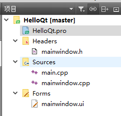

# Win软件开发历史 & Qt入门

## *Win软件开发*

### Windows API

正如Linux为开发人员提供的系统调用接口 system call interface 一样，Windows 系统也为开发人员提供一套系统调用接口，即Windows API，Windows API相比于Linux提供的接口内容上更丰富

Windows API是微软 Windows 操作系统提供给开发者的一组函数、数据结构、协议和工具，用于编写 Windows 应用程序和与操作系统进行交互。Windows API 允许开发者通过调用这些接口来执行各种任务，包括图形用户界面（GUI）操作、文件操作、网络通信、设备驱动程序访问等

Windows API将与Windows系统有关的复杂操作封装在简单的函数当中，编译成动态链接库，再随Windows一同发布。开发者可以简单地借助这些函数来完成复杂的操作，有效降低了编写Windows程序的难度

以下是 Windows API 的一些主要特点和用途：

* 系统功能访问： Windows API 允许开发者访问操作系统的各种系统功能，如文件系统、注册表、进程管理、内存管理、窗口管理、设备驱动程序等
* GUI 编程： Windows API 提供了创建和操作窗口、对话框、按钮、菜单、文本框等 GUI 元素的函数，使开发者能够创建具有丰富用户界面的应用程序
* 文件和文件系统操作： 开发者可以使用 Windows API 进行文件的创建、读取、写入、删除和重命名等操作，以及管理文件夹和目录结构
* 网络通信： Windows API 提供了一系列网络相关的函数，使应用程序能够进行网络通信、创建套接字、处理网络数据等
* 注册表操作： 开发者可以使用 Windows API 访问和操作 Windows 注册表，以存储和检索应用程序的配置信息
* 多线程和进程管理： Windows API 允许开发者创建和管理多线程和进程，以实现并行处理和多任务操作
* 图形和图像处理：Windows API 提供了图形绘制、图像处理和显示设备访问的功能，用于创建图形应用程序和游戏
* 硬件访问：Windows API 允许开发者与计算机硬件进行交互，包括访问设备驱动程序、USB设备、打印机、摄像头等
* 安全性和权限控制：Windows API 提供了安全性功能，允许开发者管理文件和资源的权限，确保系统的安全性
* COM（Component Object Model）：Windows API 支持 COM，这是一种用于创建可重用组件的技术，可用于构建可扩展的应用程序
* 消息传递和事件处理：Windows API 使用消息队列来处理事件和用户交互，开发者可以编写消息处理程序来响应消息
* 跨版本兼容性：Windows API 努力保持向后兼容性，以确保旧的应用程序在新版本的 Windows 上仍然能够正常运行

### API & 框架历史

1. **Win16 API（1985年）：** Windows 1.0引入了Win16 API，这是Windows 16位应用程序的开发框架。它基于16位的x86架构，并为开发者提供了一组API，用于创建Windows桌面应用程序
2. **Win32 API（1990年代）：** 随着Windows 3.0和3.1的推出，Win32 API成为了主要的Windows应用程序开发平台。它是32位的，支持更多的内存和功能，包括多线程、多任务处理等。
3. **MFC（Microsoft Foundation Class Library，1992年）：** MFC是微软推出的C++类库，它建立在Win32 API之上，为开发者提供了更高级别的抽象，使得Windows应用程序的开发更加容易。MFC引入了文档/视图模型以及大量的UI控件，成为了Windows应用程序开发的重要工具
4. **ATL（Active Template Library，1997年）：** ATL是微软推出的另一个C++类库，专门用于开发COM（Component Object Model）组件。它帮助开发者创建高性能的、轻量级的COM组件
5. **Windows Forms（2002年）：** Windows Forms是用于C#和.NET框架的一种Windows应用程序开发模型。它提供了一个面向对象的方式来构建Windows应用程序，使得开发者可以使用C#语言来创建Windows应用程序。
6. **WPF（Windows Presentation Foundation，2006年）：** WPF是一种现代的Windows应用程序开发框架，它使用XAML（Extensible Application Markup Language）来定义UI，并具有强大的数据绑定、动画和图形能力。WPF取代了Windows Forms，成为创建富客户端应用程序的首选框架
7. **Qt（1991年）：** Qt是一种跨平台的C++应用程序开发框架，它不仅可以用于Windows，还可以用于Linux、macOS等操作系统。Qt提供了丰富的GUI控件、网络、数据库和其他功能，成为了跨平台开发的有力工具
8. **Universal Windows Platform（UWP，2012年）：** UWP是微软推出的一种现代应用程序开发模型，支持多种设备，包括Windows桌面、移动设备、Xbox和HoloLens。UWP应用程序具有高度的可移植性和适应性

## *.NET框架*

### 开发框架

.NET框架和Java语言的SpringBoot框架一样，是一个开发人员平台，由工具、编程语言、库组成，用于构建许多不同类型的应用程序。基本平台提供适用于所有不同类型的应用的组件

以下是 .NET 平台中包含的一些内容:

* **C#、F#、Visual Basic 编程语言**
* 用于处理字符串、日期、文件/IO 等的 **基础库**
* 适用于 macOS, Windows, Linux, and Docker 的 **编辑器和工具**

### C#语言

C#/C Sharp是一种现代的、多范式的编程语言，由微软公司开发。它首次发布于2000年，旨在为Windows平台开发应用程序提供一种强大且易于使用的编程语言。C#是第一个面向组件的编程语言，其源码会编译成msil再运行。 它借鉴了Delphi的一个特点，与COM(组件对象模型)是直接集成的

C#使得程序员可以快速地编写各种基于MICROSOFT .NET平台的应用程序，MICROSOFT .NET提供了一系列的工具和服务来最大程度地开发利用计算与通讯领域

> C#是微软推出的一种基于.NET框架和后来的.NET的、面向对象的高级编程语言。C#是一种由C和C++派生出来的面向对象的编程语言。它在继承C和C++强大功能的同时去掉了一些它们的复杂特性，使其成为C语言家族中的一种高效强大的编程语言。C#以.NET框架类库作为基础，拥有类似Visual Basic的快速开发能力。C#由安德斯·海尔斯伯格主持开发，微软在2000年发布了这种语言，希望借助这种语言来取代Java。C#已经成为Ecma国际和国际标准组织的标准规范。-- wikipedia

### Object-C语言

Objective-Objective-C是C语言的严格超集－－任何C语言程序不经修改就可以直接通过Objective-C编译器，在Objective-C中使用C语言代码也是完全合法的。Objective-C被描述为盖在C语言上的薄薄一层，因为Objective-C的原意就是在C语言主体上加入面向对象的特性。

### ASP.NET

<https://dotnet.microsoft.com/zh-cn/apps/aspnet>

ASP.NET 通过专门用于生成 web 应用的工具和库扩展 .NET 平台。ASP.NET 为 .NET 平台添加了以下内容:

* 用于处理 C# 或 F# 中 Web 请求的基础框架
* 用于使用 C# 构建动态网页的网页模板化语法，称为 Razor
* 通用 Web 模式的库，例如模型-视图-控制器 MVC
* 身份验证系统包括用于处理登录名的库、数据库、模板页面，包括使用 Google、X 等进行多重身份验证和外部身份验证
* 编辑器扩展提供了语法突出显示、代码完成和其他专门用于开发网页的功能

## *Win平台C/C++编译器*

### MSVC

MSVC Microsoft Visual C++ 是微软的官方C/C++编译器和开发工具集，主要用于Windows平台上的应用程序开。MSVC通常与Visual Studio集成在一起。它是Windows上最常用的编译器之一

以下是MSVC的主要部件

* 编译器：MSVC包括Microsoft的C/C++编译器，用于将C和C++源代码编译成可执行文件。这个编译器通常是针对Windows平台的性能优化的
* 开发工具包 SDK：除了编译器，MSVC提供了一套丰富的开发工具，包括调试器、性能分析器、图形用户界面设计器、资源编辑器等，这些工具可以帮助开发者创建、调试和优化Windows应用程序
* 标准库：MSVC包括Microsoft的C/C++标准库实现，这些库提供了许多标准函数和类，以便开发者能够使用标准的C/C++函数和数据结构
* Windows API支持：MSVC深度集成了Windows API（应用程序编程接口）支持，使开发者能够轻松地访问Windows操作系统的功能和服务，创建本机Windows应用程序
* 版本和兼容性：MSVC的版本随着时间的推移而不断更新，支持新的C/C++标准和Windows平台的最新功能。开发者可以选择使用不同版本的MSVC，根据他们的需求和目标平台来进行开发

### MinGW

MinGW是一个开源项目，其名称代表"Minimalist GNU for Windows"（Windows的极简GNU）。它的主要目标是提供一个在Microsoft Windows操作系统上使用的GNU工具链，以便开发者可以编译和运行GNU/Linux类似的软件，而无需在Windows上使用大型的商业编译器

MinGW包括以下关键组件：

* GCC：GNU编译器集合（GCC）的Windows移植版本。这是一个强大的C/C++和其他编程语言的编译器，可以将源代码编译成可在Windows上运行的可执行文件
* Binutils：GNU二进制工具集的Windows移植版本，包括汇编器、链接器和其他二进制工具，用于处理可执行文件和库文件
* MSYS：Minimal System（MSYS）是MinGW系统的一部分，提供了一个轻量级的Unix命令行环境，以帮助在Windows上构建和运行Unix风格的工具和脚本。MSYS允许在Windows上使用bash shell、make命令等

MinGW的主要优点包括：

* 免费和开源：MinGW是免费的，并且以开源方式提供，允许开发者自由使用和分发它。
* 轻量级：MinGW的目标是提供一个轻量级的工具链，不需要庞大的开发环境，因此它非常适合需要在Windows上进行C/C++开发的开发者。
* 与标准GNU工具链兼容性：MinGW允许开发者使用标准的GNU工具和命令，从而实现与Linux等Unix-like系统的兼容性。
* 可移植性：MinGW生成的可执行文件可以在Windows上运行，而无需额外的运行时库。

## *Qt介绍*

### Qt简介

在Windows上开发人员可以用C++的IDE Visual Studio来开发程序。IDE不仅仅提供程序的编辑和编译，一般还会提供一套基本类库，用于提供支持平台应用程序开发的基本类，比如说Win的MFC、WPF、UWP等

Qt 是一个**跨平台的C++应用程序开发框架**，它用于创建各种类型的桌面、移动、嵌入式和Web应用程序。Qt 最初由挪威的 Trolltech 公司开发，现在是 Digia 公司维护，拥有开放源代码和商业许可两种版本。以下是 Qt 的一些关键特点和信息：

* 跨平台性：Qt具有强大的跨平台能力，这也是Qt最大的优势。可以在多个操作系统上运行，包括 Windows、Linux、macOS、Android 和 iOS。这使得开发者能够使用相同的代码库创建多平台应用程序，切换平台时无需改动或只需少许改动后再编译，就可以形成在不同平台上运行的版本
* C++编程：Qt 是标准 C++ 的拓展，C++ 的语法特性在 Qt 中都被支持，这使得开发者可以充分利用 C++ 的性能和灵活性
  * 良好封装机制使得 Qt 的模块化程度非常高，可重用性较好，可以快速上手
  * 此外 Qt 还提供了用于 Python 和其他编程语言的绑定

* 丰富的类库：Qt提供了丰富的类库，超过250+个C++类，涵盖了图形界面开发、文件操作（正则表达式）、网络通信、数据库访问、多媒体处理、3D 渲染（OpenGL）等各种领域。Qt 的类库使开发者能够更轻松地处理各种任务
* GUI设计工具：Qt Creator是Qt的IDE，内置了可视化 GUI 设计工具，允许开发者通过拖放方式创建用户界面，并生成相应的代码
* 自动化内存管理：Qt 使用自动化内存管理，通过使用智能指针等机制来管理内存，从而减少内存泄漏的风险
* Qt引入了内置信号处理机制和槽机制来替代callback，使对象之间的通信更加灵活和松耦合。这一机制是 Qt **事件驱动编程**的核心
* 多线程支持：Qt 提供了多线程支持，允许开发者创建多线程应用程序，以提高性能和响应性
* Qt框架底层是模块化设计的，使用者可以自己挑选模块来进行开发

### Qt版本

1. Qt 1.x：Qt 的最初版本，于1995年首次发布。它是用于开发Unix/Linux桌面应用程序的工具包
2. Qt 2.x：1999年发布，引入了许多改进和新特性，包括Windows支持，增强的GUI组件和国际化支持
3. Qt 3.x：2001年发布，进一步扩展了平台支持，包括移动平台，引入了Qt Designer界面设计器。
4. Qt 4.x：2005年发布，是一个重大的版本，引入了许多新特性，包括Qt Graphics View框架、QtWebKit、QtDBus等。它还引入了Qt的信号和槽机制的元对象编译器（MOC）
5. Qt 5.x：2012年发布，带来了许多重大变化，包括Qt Quick和QML技术的引入，支持OpenGL ES，以及Qt模块的重新组织。Qt 5还引入了Qt Creator作为官方的集成开发环境（IDE）
6. Qt 6.x：Qt 6于2020年发布，是Qt框架的最新主要版本。它引入了许多改进和优化，包括对C++17标准的更好支持，模块的重组，提高了性能和安全性

主要的LTS有

* Qt 5.6 LTS: 发布于2016年3月，支持至2019年3月
* Qt 5.9 LTS: 发布于2017年5月，支持至2020年5月
* Qt 5.12 LTS: 发布于2018年12月，支持至2021年12月
* Qt 5.15 LTS: 发布于2020年5月，支持至2023年5月
* Qt 6.2 LTS: 预计发布于2023年，支持时间尚未确定

## *Qt工程*

### Qt Creator

设计：使用UI来设计

### Qt中的模块

* Qt 基本模块（Qt Essentials)：提供了 Qt 在所有平台上的基本功能
* Qt 附加模块（Qt Add-Ons)：实现一些特定功能的提供附加价值的模块
* 增值模块（Value-AddModules)：单独发布的提供额外价值的模块或工具
* 技术预览模块（Technology Preview Modules）：一些处于开发阶段，但是可以作为技术预览使用的模块
* Qt 工具（Qt Tools)：帮助应用程序开发的一些工具

### Qt基本模块

* **Qt Core**：Qt 类库的核心，所有其他模块都依赖于此模块
* **Qt GUI**：设计 GUI 界面的基础类，包括 OpenGL
* Qt Multimedia：音频、视频、摄像头和广播功能的类
* Qt Multimedia Widgets：实现多媒体功能的界面组件类
* Qt Network：使网络编程更简单和轻便的类
* Qt QML：用于 QML 和 JavaScript语言的类
* Qt Quick：用于构建具有定制用户界面的动态应用程序的声明框架
* Qt Quick Controls：创建桌面样式用户界面，基于 Qt Quick 的用户界面控件
* Qt Quick Dialogs：用于 Qt Quick 的系统对话框类型
* Qt Quick Layouts：用于 Qt Quick 2 界面元素的布局项
* Qt SQL：使用 SQL 用于数据库操作的类
* Qt Test：用于应用程序和库进行单元测试的类
* **Qt Widgets**：用于构建 GUI 界面的 C++ 图形组件类

一个新的Qt项目会默认加载 Qt Core、Qt GUI 和 Qt Widgets 三个类

# Qt基础

## *Qt项目的组成*

创建一个demo项目：新建项目 - Application - Qt Widgets Application（基于窗口的项目）



### 项目文件 .pro

`.Pro` 文件是工程文件

```
# 在项目文件中, 注释需要使用 井号(#)
# 项目编译的时候需要加载哪些底层模块
QT       += core gui 

# 如果当前Qt版本大于4, 会添加一个额外的模块: widgets
# Qt 5中对gui模块进行了拆分, 将 widgets 独立出来了
greaterThan(QT_MAJOR_VERSION, 4): QT += widgets
   
TARGET = HelloQt
TEMPLATE = app   

# 使用c++11新特性
CONFIG += c++11	

# 如果在项目中调用了废弃的函数, 项目编译的时候会有警告的提示    
DEFINES += QT_DEPRECATED_WARNINGS

# 项目中的源文件
SOURCES += \
        main.cpp \
        mainwindow.cpp
        
# 项目中的头文件
HEADERS += \
        mainwindow.h
        
# 项目中的窗口界面文件
FORMS += \
        mainwindow.ui
```

### `.ui` 文件

`.ui` 文件是在设计模式中可视化设计的窗体的定义文件。并且每一个窗口都对应一个可编辑的可视化界面，即一个 `.ui` 文件

`.ui` 文件是一个xml格式的文件，一般情况下并不需要在xml格式下对这个文件进行编辑，关于这个文件结构了解即可

```xml
<?xml version="1.0" encoding="UTF-8"?>
<ui version="4.0">
 <class>MainWindow</class>
 <widget class="QMainWindow" name="MainWindow">
  <property name="geometry">
   <rect>
    <x>0</x>
    <y>0</y>
    <width>400</width>
    <height>300</height>
   </rect>
  </property>
  <property name="windowTitle">
   <string>MainWindow</string>
  </property>
  <widget class="QWidget" name="centralWidget"/>
  <widget class="QMenuBar" name="menuBar">
   <property name="geometry">
    <rect>
     <x>0</x>
     <y>0</y>
     <width>400</width>
     <height>23</height>
    </rect>
   </property>
  </widget>
  <widget class="QToolBar" name="mainToolBar">
   <attribute name="toolBarArea">
    <enum>TopToolBarArea</enum>
   </attribute>
   <attribute name="toolBarBreak">
    <bool>false</bool>
   </attribute>
  </widget>
  <widget class="QStatusBar" name="statusBar"/>
 </widget>
 <layoutdefault spacing="6" margin="11"/>
 <resources/>
 <connections/>
</ui>
```

### 主函数

```c++
#include "mainwindow.h"		// 生成的窗口类头文件
#include <QApplication>		// 应用程序类头文件

int main(int argc, char *argv[])
{
    // 创建应用程序对象, 在一个Qt项目中实例对象有且仅有一个
    // 类的作用: 检测触发的事件, 进行事件循环并处理
    QApplication a(argc, argv);
    // 创建窗口类对象
    MainWindow w;
    // 显示窗口
    w.show();
    // 阻塞函数，应用程序对象进入事件循环, 保证应用程序不退出
    return a.exec();
}
```

## *三种基本窗口类型*

 ### QWidget

### QDialog

两种显示方式

* 模态
* 非模态

### QMainWindow

## *窗口坐标*

## *内存回收*

## *Qt的数据类型*

没有必要使用这些封装类型，大部分情况下直接使用 C++ 的基础类型就可以了

位于 `<QtGlobal>` 中

### QByteArray

### QString

## *Qt的日志管理*

# 信号与槽

信号与槽 Signal & Slot 用于不同对象的通信，窗口与窗口之间，窗口之内不同控件之间的通信就是执行某种槽方法

声明了 `Q_OBJECT` 的话就是表示支持信号与槽。不是所有的类都能支持信号与槽，必须是继承自 QObject 基类的派生类才支持信号与槽机制


# Qt控件

## *按钮类型*

## *容器类型*

### 正则表达式

QRegExp

元字符解释：`^` 表示规则字符串的开始，`$` 表示规则字符串的结束

`+` 表示匹配次数 $\geq 1$ 次，`*` 表示匹配任意次数（可为0次），` {n,m}` 表示匹配次数至少n次，至多m次


# Qt事件

# 套接字通信
