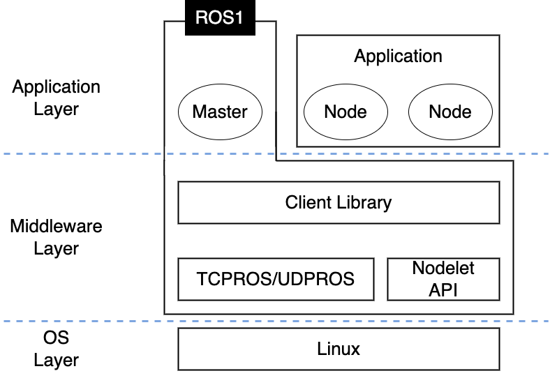
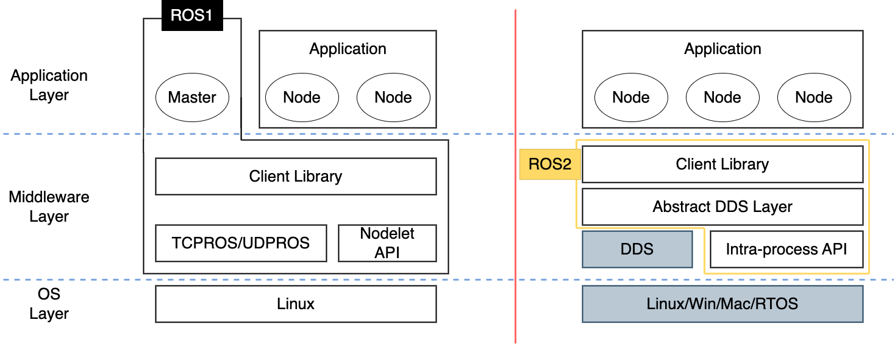
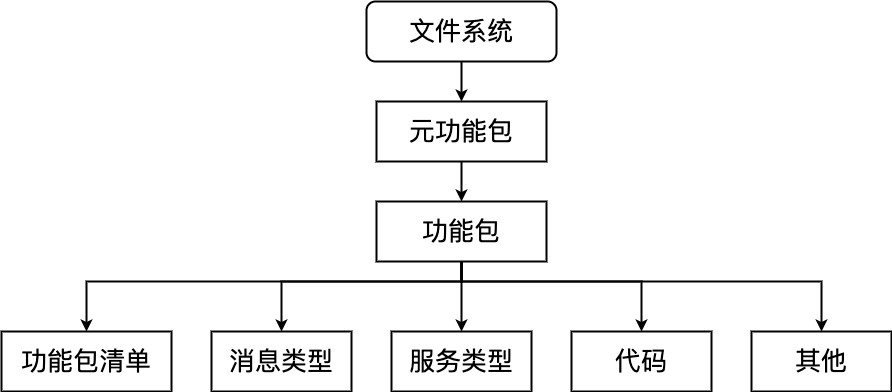
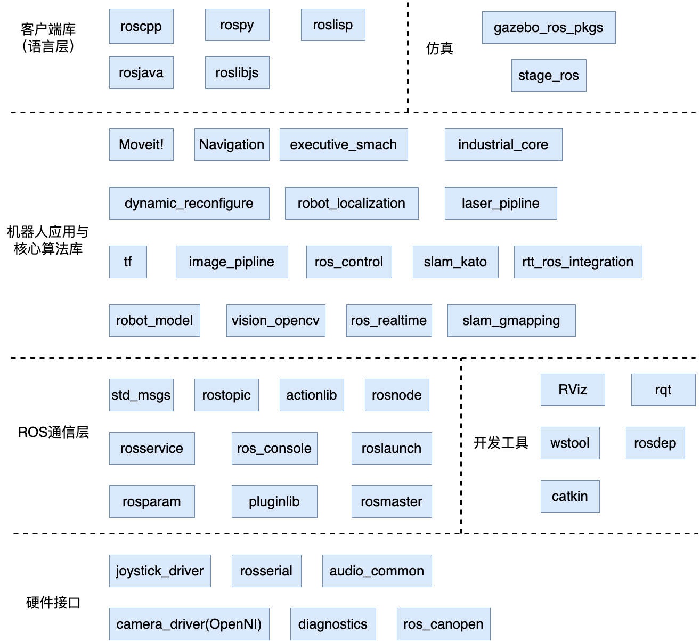
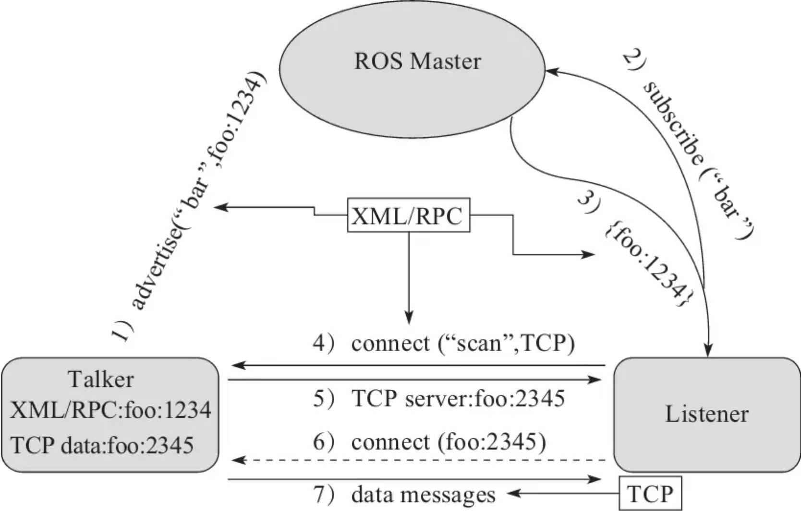
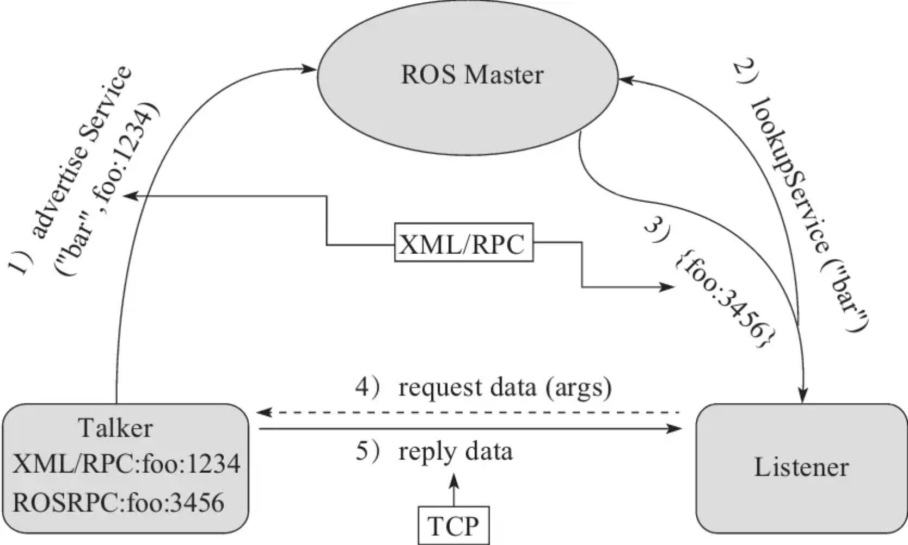
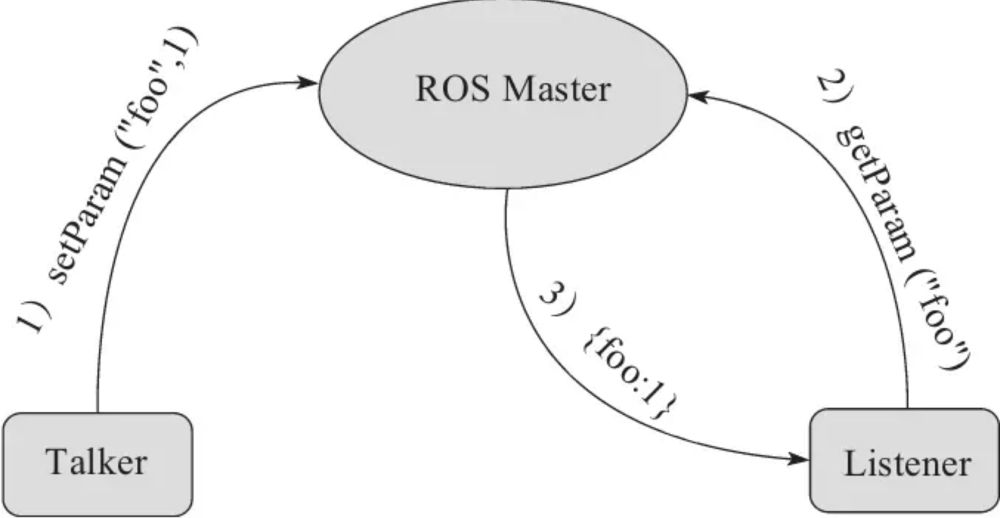

# ROS1 & ROS2 架构

Robotic OperatingSystem, ROS是一个用于编写机器人软件的灵活框架，它集成了大量的工具、库和协议，提供了类似操作系统所提供的功能，包括硬件抽象描述、底层驱动程序管理、共用功能的执行、程序间的消息传递、程序发行包管理，可以极大简化繁杂多样的机器人平台下的复杂任务创建与稳定行为控制。

## *ROS1架构设计*



* OS层：ROS依然是运行在OS上的，对ROS官方支持度最好的是Ubuntu
* 中间层
  * 对TCP/UDP进行两次封装，形成了TCPROS/UDPROS。通信系统使用发布-订阅模型、client-srever模型
  * ROS还提供一种进程内的通信方式 Nodelet，可以为多进程通信提供一种更优化的数据传输方式，适合对数据传输实时性方面有价高要求的应用
  * Client Library是一些官方库，比如数据类型定义、坐标变换、运动控制等
* 应用层
  * Master是核心管理者
  * ROS社区提供的大量机器人应用包里的模块以节点为单位运行，以ROS标准的IO作为接口，开发者不需要关注模块的内部实现机制

## *计算图*

计算图 Computation Graph，也被称为计算图谱或计算图模型，是一种表示计算任务和数据流的图形模型。计算图通常用于描述和可视化计算机程序中的操作和数据之间的关系

从计算图的角度看，ROS系统软件的功能模块以节点为单位独立运行，可以分布于多个相同或不同的主机中

### 节点 Node

节点 Node是一些执行运算任务的进程，一个系统一般会由多个节点组成，也称为软件模块

ROS节点管理器就是ROS Master用来管理各种节点。Master调用RPC来提供登记列表和对其他计算图表的查找功能

### 消息 Message

节点之间的通信机制基于发布-订阅模式的消息 Message 通信

### 话题 Subject

## *ROS2架构设计*

ROS2：https://www.guyuehome.com/34382



# Catkin

## *海龟仿真例程*

```shell
$ roscore
$ rosrun turtlesim turtlesim_node
$ rosrun turtlesim turtle_teleop_key
```

## *catkin_make*

`catkin_make` 的可选参数

```xml
catkin_make [args]
   -h, --help            帮助信息
   -C DIRECTORY, --directory DIRECTORY
                         工作空间的路径 (默认为 '.')
   --source SOURCE       src的路径 (默认为'workspace_base/src')
   --build BUILD         build的路径 (默认为'workspace_base/build')
   --use-ninja           用ninja取代make
   --use-nmake           用nmake取make
   --force-cmake         强制cmake，即使已经cmake过
   --no-color            禁止彩色输出(只对catkin_make和CMake生效)
   --pkg PKG [PKG ...]   只对某个PKG进行make
   --only-pkg-with-deps  ONLY_PKG_WITH_DEPS [ONLY_PKG_WITH_DEPS ...]
                         将指定的package列入白名单CATKIN_WHITELIST_PACKAGES，
                         之编译白名单里的package。该环境变量存在于CMakeCache.txt。
   --cmake-args [CMAKE_ARGS [CMAKE_ARGS ...]]
                         传给CMake的参数
   --make-args [MAKE_ARGS [MAKE_ARGS ...]]
                         传给Make的参数
   --override-build-tool-check
                         用来覆盖由于不同编译工具产生的错误
```

## *工作空间*

### 工作空间

工作空间 workspace 是一个存放工程开发相关文件的文件夹。ROS默认采用catkin编译系统，它封装了cmake


典型的工作空间中一般包括以下四个目录空间

* src 代码空间 Source Space：开发过程中最常用的文件夹，用来存储所有ROS功能包的源码文件
* build 编译空间 Build Space：用来存储工作空间编译过程中产生的缓存信息和中间文件
* devel 开发空间 Development Space：用来放置**编译生成的可执行文件**
* install 安装空间 Install Space：编译成功后，可以使用 `make install` 命令将可执行文件安装到该空间中，运行该空间中的环境变量脚本，即可在终端中运行这些可执行文件。安装空间并不是必需的，很多工作空间中可能并没有该文件夹

### 创建工作空间

```shell
$ mkdir -p ~/catkin_ws/src
$ cd ~/catkin_ws/src
$ catkin_init_workspace
```

创建完成后，可以在**工作空间的根目录**下使用catkin_make命令编译整个工作空间

```shell
$ cd ~/catkin_ws/
$ catkin_make
```

编译过程中在工作空间的根目录里会自动产生build和devel两个文件夹及其中的文件。在编译完成后，在devel文件夹中已经产生几个 `setup.*sh` 形式的环境变量设置脚本。使用source命令运行这些脚本文件，则工作空间中的环境变量可以生效

```shell
$ source devel/setup.bash
$ echo"source/WORKSPACE/devel/setup.bash">>~/.bashrc # 加入bash配置文件，避免每次重新启动bash都要打一遍
```

### 创建功能包

```shell
$ catkin_create_pkg <package_name> [depend1] [depend2] [depend3]
```

其中的可选参数depend是所依赖的其他功能包

### 工作空间覆盖机制

不同的工作空间中可能存在相同命名的功能包，如果这些工作空间的环境变量都已经设置了，那么此时要依靠Overlaying 工作空间覆盖机制来解决

所有工作空间的路径会依次在ROS_PACKAGE_PATH环境变量中记录，当设置多个工作空间的环境变量后，新设置的路径在ROS_PACKAGE_PATH中会自动放置在最前端。此时最前面的同名功能包会对后面的同名功能包形成覆盖

## *文件系统*



### 功能包

功能包 Package 是ROS软件中的基本单元，包含ROS节点、库、配置文件等

功能包的主要文件结构为

* config：防止功能包中的配置文件，由用户创建，文件名可以不同
* include：放置功能包中需要用到的头文件
* scripts：放置可以直接运行的Python脚本
* src：放置需要编译的C++代码
* launch：放置功能包中的所有启动文件
* msg：放置功能包自定义的消息类型
* srv：放置功能包自定义的服务类型
* action：放置功能包自定义的动作指令
* CMakeLists.txt：编译器编译功能包的规则。
* package.xml：功能包清单
* yaml：yaml文件一般存储了ROS需要加载的参数信息，一些属性的配置。通常在launch文件或程序中读取.yaml文件，把参数加载到参数服务器上。通常我们会把yaml文件存放在 param/路径下

### package.xml

每个ROS功能包都包含一个名为 package.xml 的文件，它用于存储有关功能包的元信息和依赖项的信息。以下是一个简单的package.xml文件的示例，以演示它的基本结构和内容

```xml
<?xml version="1.0"?>
<package> <!--根标记文件-->
  <name>my_example_package</name> <!--包名-->
  <version>0.1.0</version> <!--版本-->
  <description>This is an example ROS package.</description> <!--内容描述-->
  <maintainer email="your@email.com">Your Name</maintainer> <!--维护者-->
  <license>MIT License</license> <!--软件许可证-->

  <depend>roscpp</depend> <!--指定依赖项为编译、导出、运行需要的依赖，最常用-->
  <depend>std_msgs</depend>
  <buildtool_depend>catkin</buildtool_depend> <!--编译构建工具，通常为catkin-->

  <build_depend>message_generation</build_depend> <!--编译依赖项-->
  <build_export_depend></build_export_depend> <!--导出依赖项-->
  <exec_depend>geometry_msgs</exec_depend> <!--运行依赖项-->
  <test_depend>rospy</test_depend> <!--测试用例依赖项 -->
  <doc_depend></doc_depend> <!--文档依赖项 -->
</package>
```

### 功能包命令

* calkin_create_pkg：创建功能包
* rospack：获取功能包的信息
* catkin_make：編译工作空间中的功能包
* rosdep：自动安装功能包依赖的其他包
* roscd：功能包目录跳转
* roscp：拷贝功能包中的文件
* rosed：编辑功能包中的文件
* rosrun：运行功能包中的可执行文件
* roslaunch：运行启动文件

### 元功能包

元功能包 Meta Package 的主要作用是组织多个用于同一目的的功能包

## *命名空间*

# roscpp

## *ROS package 总览*



## *节点初始、关闭以及NodeHandle*

## *spin 自旋/轮询*

## *param*

### Parameter Server

## *时钟*

## *日志 & 异常*

# 通信

## *分布式通信*

### 话题通信



Talker和Listener谁先启动没有强制要求，这里只是假设Talker首先启动

1. Talker注册
   * 通过1234端口向ROS Master发起**RPC**，注册Talker信息、发布信息的话题名 bar
   * ROS Master会将节点的注册信息加入注册列表中
2. Listener注册：同样向ROS Master发起**RPC**，注册Listener信息、需要订阅的话题名 bar
3. ROS Master进行信息匹配：Master根据Listener的订阅信息从注册列表中进行查找，若没有找到匹配的发布者则等待发布者的加入；若找到匹配的发布者信息，则通过**RPC**向Listener发送Talker的RPC地址信息
4. Listener向Talker发送连接请求：在Listener收到Master发回的Talker地址信息后，尝试通过**RPC**向Talker发送连接请求、传输订阅的话题名、消息类型以及通信协议 TCP/UDP
5. Talker确认连接请求：在Talker收到Listener发送的连接请求后，继续通过**RPC**向Listener确认连接信息，其中包含自身的TCP地址信息
6. 收到Talker的确认信息后，Listener尝试与Talker建立TCP/UDP连接
7. 成功建立TCP/UDP连接后，Talker向Listener发布数据

在Talker和Listener建立了TCP/UDP连接之后，它们不再需要ROS Master，但是如果有其他节点还需要加入对这个主题的订阅，则还是要经过Master

### 服务通信

服务是一种带有数据应答的通信机制，和话题的通信相比，减少了话题订阅中第4、5步Listener与Talker之间的RPC调用



1. Talker注册
   * 通过1234端口向ROS Master发起**RPC**，注册Talker信息、发布信息的话题名 bar
   * ROS Master会将节点的注册信息加入注册列表中
2. Listener注册：同样向ROS Master发起**RPC**，注册Listener信息、需要订阅的话题名 bar
3. ROS Master进行信息匹配：Master根据Listener的订阅信息从注册列表中进行查找，若没有找到匹配的发布者则等待发布者的加入；若找到匹配的发布者信息，则通过**RPC**向Listener发送Talker的**TCP地址信息**
4. Listener与Talker建立网络连接：Listener接收到确认信息后，使用TCP尝试与Talker建立网络连接，并且发送服务的请求数据
5. Talker向Listener发布服务应答数据Talker接收到服务请求和参数后，开始执行服务功能，执行完成后，向Listener发送应答数据

### 参数管理机制

参数类似于ROS中的全局变量，由Master管理，完全通过RPC通信



1. Talker设置变量：Talker使用RPC向Master发送参数设置数据，包含参数名和参数值；Master会将参数名和参数值保存到参数列表中
2. Listener查询参数值：Listener通过RPC向Master发送参数查找请求，包含所要查找的参数名
3. Master向Listener发送参数值：Master根据Listener的查找请求从参数列表中进行查找，查找到参数后，使用RPC将参数值发送给Listener

注意：若Talker向Master更新参数值，Listener在不重新查询参数值的情况下是无法知晓参数值已经被更新的。需要一种动态参数更新的机制

## *Publisher & Subscriber*

### 准备工作

1. 创建ROS工作空间

   ```shell
   $ mkdir -p ~/catkin_ws/src
   $ cd ~/catkin_ws
   $ catkin_make
   $ source devel/setup.bash
   ```

2. 创建ROS包

   ```shell
   $ cd ~/catkin_ws/src
   $ catkin_create_pkg my_ros_tutorial std_msgs roscpp
   ```

### 编写Publisher

在ROS包的`src`目录中创建一个C++源文件 `publisher_node.cpp`，以实现发布者节点

```c++
#include "ros/ros.h"
#include "std_msgs/String.h"

int main(int argc, char **argv) {
    ros::init(argc, argv, "publisher");            // 初始化
    ros::NodeHandle nh;                         // 返回node的句柄

    ros::Publisher pub = nh.advertise<std_msgs::String>("my_topic", 10); // 向Master注册
    ros::Rate rate(10);  // 发布频率为10Hz

    while (ros::ok()) {
        std_msgs::String msg;
        msg.data = "Hello, ROS!";
        ROS_INFO("Publishing: %s", msg.data.c_str()); // 打log
        pub.publish(msg);
        
        ros::spinOnce(); // 循环等待回调函数
        rate.sleep();
    }

    return 0;
}
```

具体步骤为

1. 头文件

   ```c++
   #include "ros/ros.h"
   #include "std_msgs/String.h"
   ```

   `ros/ros.h` 相当于ROS的标准库，里面已经帮我们包含了大部分ROS中通用的头文件

2. 初始化

   ```c++
   ros::init(argc, argv, "publisher");
   ```

   前两个参数是命令行或launch文件输入的参数，可以用来完成命名重映射等功能；第三个参数定义了Publisher Node的名称，而且该名称在运行的ROS中必须是独一无二的，不允许同时存在相同名称的两个节点

   ```c++
   ros::NodeHandle n;
   ```

   创建一个节点的句柄，方便之后对节点资源的使用和管理

   ```c++
   ros::Publisher pub = nh.advertise<std_msgs::String>("my_topic", 10);
   ```

   向Master注册publisher，并发布string类型的名为 `my_topic` 的subject，它的队列长度为10

   ```c++
   ros::Rate rate(10);
   ```

   设置循环频率为10Hz

3. 循环部分

   ```c++
   while (ros::ok()) {}
   ```

   进入循环，`ros::ok()` 返回false的时候退出循环，在以下几种异常时 `ros::ok()` 返回false

   * 收到SIGINT信号（Ctrl+C）
   * 被另外一个相同名称的节点踢掉线
   * 节点调用了关闭函数 `ros::shutdown()`
   * 所有 `ros::NodeHandles `句柄被销毁

   `ros::spinOnce();` 用来处理节点订阅话题的所有回调函数

### 编写Subscriber

```c++
#include "ros/ros.h"
#include "std_msgs/String.h"

void callback(const std_msgs::String::ConstPtr& msg) {
    ROS_INFO("Received: %s", msg->data.c_str());
}

int main(int argc, char **argv) {
    ros::init(argc, argv, "my_subscriber_node");
    ros::NodeHandle nh;

    ros::Subscriber sub = nh.subscribe("my_topic", 10, callback);

    ros::spin();

    return 0;
}
```

Subscriber需要调用回调函数，当有信息到来时就调用回调函数

### 编译 & rosrun编写CMakeLists.txt

1. 编写CMakeLists.txt

   ```cmake
   add_executable(publisher_node src/publisher_node.cpp)
   add_executable(subscriber_node src/subscriber_node.cpp)
   
   target_link_libraries(publisher_node ${catkin_LIBRARIES})
   target_link_libraries(subscriber_node ${catkin_LIBRARIES})
   ```

2. 编译ROS包

   ```shell
   $ cd ~/catkin_ws
   $ catkin_make
   ```

3. 运行Publisher & Subscriber

   ```shell
   # rosrun <功能包名> <节点名>
   $ rosrun my_ros_tutorial publisher_node
   $ rosrun my_ros_tutorial subscriber_node
   ```

## *Server & Client*

### 自定义srv

## *分布式多机通信*

首先需要确定ROS多机系统中的所有计算机应处于同一网络

# 消息

ROS的msg文件提供自动的跨平台的和跨语言的序列化与反序列化，从而支持通信

## *预定义消息*

### 标准消息包

ROS中的标准消息包是 `std_msgs`，里面定义了ROS的内置数据类型，以便在ROS系统中进行通信和数据交换

这里使用的基础数据类型string、uint8都是语言无关的，编译阶段会变成各种语言对应的数据类型

在自定义msg的时候要使用这些数据类型，具体的类型可以查询 <http://wiki.ros.org/std_msgs>

### 几何消息包

geometry_msgs 提供了用于常见几何原语（如点、矢量和位姿）的消息。这些基本原语的设计旨在提供一种通用数据类型，以促进整个系统的互操作性

具体的类型可以查询 http://wiki.ros.org/geometry_msgs

### 传感器数据类型

具体的类型可以查询 http://wiki.ros.org/sensor_msgs?distro=noetic

## *自定义消息*

自定义msg的过程很像protobuf的使用，先定义再编译

### 定义msg文件

ROS支持用户定义的消息类型，允许开发者创建自己的消息以传递特定的数据

msg文件就是ROS中定义消息类型的文件，一般放置在功能包根目录下的msg文件夹中。在功能包编译过程中，可以使用msg文件生成不同编程语言使用的代码文件。例如下面的msg文件

```
Header header
string name
uint8  sex
uint8  age

uint8 unknown = 0
uint8 male    = 1
uint8 female  = 2
```

### Header

自定义信息一般会放一条Header数据类型，它的内容如下

```
uint32 seq
time stamp
string frame_id
```

* seq是消息的顺序标识，不需要手动设置，Publisher在发布消息时会自动累加
* stamp是消息中与数据相关联的时间戳，可以用于时间同步
* frame_id是消息中与数据相关联的参考坐标系id

### 编译msg文件

* 在package.xml中添加功能包依赖

  ```xml
  <build_depend>message_generation</build_depend>
  <run_depend>message_runtime</run_depend>
  ```

* 在CMakeLists.txt中添加编译选项

  ```cmake
  find_package(catkin REQUIRED COMPONENTS
      geometry_msgs
      roscpp
      rospy
      std_msgs
      message_generation
  )
  
  # catkin依赖
  catkin_package(
      ……
      CATKIN_DEPENDS geometry_msgs roscpp rospy std_msgs message_runtime
      ……)
  
  add_message_files(
      FILES
      Person.msg
  )
  generate_messages(
      DEPENDENCIES
      std_msgs
  )
  ```

最后可以使用 `rosmsg show <msg名>` 来查看msg内容

# 常用组件

## *launch文件*

`rosrun <功能包名> <节点名>` 只能运行一个节点，若要启动一批节点就要用 roslaunch。roslaunch通过XML格式实现多节点的配置和启动，有点像maven

```shell
$ roslaunch <功能包名> <launch文件名.launch>
```

### 基本结构

```xml
<launch>
  <node pkg="turtlesim" name="sim1" type="turtlesim_node"/>
  <node pkg="turtlesim" name="sim2" type="turtlesim_node"/>
</launch>
```

* `<launch>` 是launch XML文件的根元素，launch中除了开头的 `<?xml version="1.0"?>` 之外的所有内容都放在 `<launch>` 里面

* `<node>` 用来定义启动的节点

  ```xml
  <node pkg="package-name" type="executable-name" name="node-name" />
  ```

  node至少要包含上面这三个属性

  * pkg 定义节点所在的包名，type 定义节点的可执行文件名称，这两个属性相当于 rosrun 的两个输入参数
  * name定义节点名， 它会覆盖 `ros::init()` 的第三个参数

  还有一些可选的属性

  * `output="screen”`：将节点的标准输出打印到终端屏幕，默认输出为日志文档
  * `respawn="true"`： 复位属性，该节点停止时，会自动重启，默认为false
  * `required="true"`： 必要节点，当该节点终止时，launch文件中的其他节点也被终止
  * `ns="hamespace"`：命名空间，为节点内的相对名称添加命名空间前缀
  * `args="arguments"`：节点需要的输入参数

### 参数设置

* param：设置ROS系统的运行时参数

  ```xml
  <node pkg="package-name" type="executable-name" name="node-name">
  	<param name="output_frame" value="odom"/>
  </node>
  ```

  可以通过 `rosparam get <参数名>` 命令来查看参数 

* arg：设置launch的内置参数

  ```xml
  <node pkg="package-name" type="executable-name" name="node-name" args="-ip $(arg ip)"/>
  ```

### 重映射

### 嵌套复用

和include的机制相似，launch文件可以直接复用其他的launch文件

```xml
<include file="$(dirname)/other.launch" />
```

## *TF坐标变换*

## *rviz三维可视化平台*

Robot Visualizer, rviz

## *Gazebo仿真环境*

## *SDL2*

https://blog.csdn.net/yingshukun/category_10400331.html

Simple DirectMedia Layer, SDL是一个跨平台的多媒体库，用于开发2D游戏和多媒体应用程序。它提供了访问音频、图形、输入设备和窗口管理等功能，使开发者能够在不同操作系统上创建游戏和多媒体应用程序。以下是一些使用SDL2的基本步骤

### 基本使用方法

1. **初始化SDL2：** 应用程序中首先需要初始化SDL2。这通常包括初始化视频子系统、音频子系统和其他所需的子系统。示例代码如下：

   ```c++
   #include <SDL.h>
   
   int main(int argc, char* argv[]) {
       if (SDL_Init(SDL_INIT_VIDEO | SDL_INIT_AUDIO) < 0) {
           // 处理初始化错误
           return -1;
       }
   
       // 在这里执行应用程序的主要逻辑
   
       SDL_Quit();
       return 0;
   }
   ```

2. **创建窗口：** 使用SDL2创建一个窗口以进行图形输出。可以指定窗口的标题、大小和其他属性。以下是一个创建窗口的示例：

   ```c++
   SDL_Window* window = SDL_CreateWindow("My Game", SDL_WINDOWPOS_CENTERED, 
                                         SDL_WINDOWPOS_CENTERED, 800, 600, SDL_WINDOW_SHOWN);
   if (!window) {
       // 处理窗口创建错误
       return -1;
   }
   ```

3. **创建渲染器：** 使用渲染器来处理绘制操作，将图像呈现到窗口中。以下是创建渲染器的示例

   ```c++
   SDL_Renderer* renderer = SDL_CreateRenderer(window, -1, SDL_RENDERER_ACCELERATED);
   if (!renderer) {
       // 处理渲染器创建错误
       return -1;
   }
   ```

4. **渲染图像：** 使用渲染器在窗口上绘制图像、文本或几何图形。SDL2提供了绘制函数，如`SDL_RenderCopy()`和`SDL_RenderDrawRect()`等。示例代码如下：

   ```c++
   SDL_Surface* image = SDL_LoadBMP("image.bmp");
   SDL_Texture* texture = SDL_CreateTextureFromSurface(renderer, image);
   SDL_FreeSurface(image);
   
   SDL_Rect destRect = { 100, 100, 200, 200 };
   SDL_RenderCopy(renderer, texture, NULL, &destRect);
   ```

5. **主事件循环：** 创建一个主事件循环以处理用户输入、游戏逻辑和刷新屏幕。事件循环使用`SDL_PollEvent()`函数来获取事件并响应它们。示例代码如下：

   ```c++
   bool quit = false;
   SDL_Event event;
   
   while (!quit) {
       while (SDL_PollEvent(&event)) {
           if (event.type == SDL_QUIT) {
               quit = true;
           }
       }
   
       // 在这里处理游戏逻辑和绘制
   }
   ```

6. **渲染帧和更新屏幕：** 在事件循环中，使用渲染器将绘制的内容显示在屏幕上，并通过`SDL_RenderPresent()`更新窗口

   ```c++
   SDL_RenderPresent(renderer);
   ```

7. **清理资源：** 在应用程序结束时，确保释放所有SDL2资源，包括窗口、渲染器、纹理等

   ```c++
   SDL_DestroyTexture(texture);
   SDL_DestroyRenderer(renderer);
   SDL_DestroyWindow(window);
   ```

### 操控键盘

要在SDL2中控制键盘输入，需要设置事件循环以侦听键盘事件并响应按键按下和释放事件

在下面的示例中，我们使用SDL2的事件循环来侦听`SDL_KEYDOWN`（键盘按下）和`SDL_KEYUP`（键盘释放）事件。在`SDL_KEYDOWN`事件中，我们检查哪个键被按下，例如，如果按下Escape键，我们将`quit`设置为`true`，以退出应用程序

```c++
#include <SDL.h>

int main(int argc, char* argv[]) {
    if (SDL_Init(SDL_INIT_VIDEO) < 0) {
        // 处理初始化错误
        return -1;
    }

    SDL_Window* window = SDL_CreateWindow("Keyboard Input", SDL_WINDOWPOS_CENTERED, 
                                          SDL_WINDOWPOS_CENTERED, 800, 600, SDL_WINDOW_SHOWN);
    if (!window) {
        // 处理窗口创建错误
        return -1;
    }

    SDL_Renderer* renderer = SDL_CreateRenderer(window, -1, SDL_RENDERER_ACCELERATED);
    if (!renderer) {
        // 处理渲染器创建错误
        return -1;
    }

    SDL_Event event;
    bool quit = false;

    while (!quit) {
        while (SDL_PollEvent(&event)) {
            if (event.type == SDL_QUIT) {
                quit = true;
            }
            else if (event.type == SDL_KEYDOWN) {
                // 键盘按下事件
                SDL_Keysym keysym = event.key.keysym;
                if (keysym.sym == SDLK_ESCAPE) {
                    quit = true;  // 按下Escape键退出应用程序
                }
            }
            else if (event.type == SDL_KEYUP) {
                // 键盘释放事件
                // 可以在此处理其他键盘释放事件
            }
        }

        // 在这里处理游戏逻辑和绘制

        SDL_RenderPresent(renderer);
    }

    SDL_DestroyRenderer(renderer);
    SDL_DestroyWindow(window);
    SDL_Quit();

    return 0;
}
```

# Vision

# SLAM

# ML/DL
