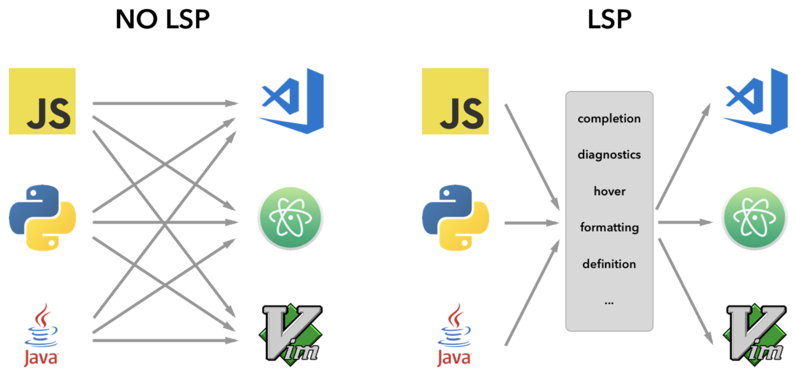

# Vim

## *Vim的基本操作*

### Intro

* Vi是由Bill Joy于1976年在加州大学伯克利分校开发的，作为BSD UNIX操作系统的一部分
* Vim (Vi iMproved) Vim是Vi的改进版本，由Bram Moolenaar于1991年发布。它在Vi的基础上增加了许多新功能和改进，成为一个更强大、更灵活的编辑器
* Neovim（简称：Nvim）是一个基于 Vim 的文本编辑器的项目，旨在作为 Vim 的改进和扩展版本。它保留了 Vim 的核心特性，并引入了一些新的功能和改进，以提供更现代、可扩展、易于配置的编辑器体验
* SpaceVim 是一个基于 Neovim 和 Vim 的社区驱动的模块化配置框架，它旨在提供一种现代、强大且易于定制的IDE。SpaceVim 设计灵感来自于 Spacemacs，一个为 Emacs 提供现代化配置的项目。SpaceVIm为不同的语言开发量身定制了相关的开发模块，该模块提供代码自动补全， 语法检查、格式化、调试、REPL 等特性。用户仅需载入相关语言的模块即可得到一个开箱即用的 Vim IDE

### vim命令

vim的命令是以 `:` 开头的，即需要先键入 `:`

* 保存和退出

  * `:w`：保存当前文件

  * `:wq`：保存并退出

  * `:x` 或 `:wq`：保存并退出

  * `:q!`：强制退出，不保存修改

* 文件操作

  * `:e <文件路径>`：打开指定文件

  * `:sp <文件路径>`：水平分割窗口并打开指定文件

  * `:vsp <文件路径>`：垂直分割窗口并打开指定文件

  * `:tabe <文件路径>`：在新标签页中打开指定文件

* 查找和替换

  * `:/{模式}`：向下查找匹配的文本

  * `:?{模式}`：向上查找匹配的文本

  * `:s/{目标}/{替换}/g`：替换文本

* 移动光标

  * `:set number`：显示行号

  * `:set nonumber`：隐藏行号

  * `:set hlsearch`：高亮搜索结果

  * `:set nohlsearch`：关闭搜索结果高亮

* 窗口和标签页

  * `:vsp`：垂直分割窗口

  * `:sp`：水平分割窗口

  * `:tabnew`：新建标签页

  * `:tabnext` 或 `:tabn`：切换到下一个标签页

  * `:tabprev` 或 `:tabp`：切换到上一个标签页

* 撤销和重做

  * `:undo` 或 `:u`：撤销上一步操作

  * `:redo` 或 `:red`：重做上一步撤销的操作

* 文件信息：

  * `:pwd`：显示当前工作目录

  * `:ls`：显示缓冲区列表

  * `:edit!`：重新加载当前文件，丢弃未保存的修改

* 其他命令

  * `:help {命令}`：查看帮助文档

  * `:set {选项}`：设置 Vim 选项

  * `:map {键位}`：查看映射关系

## *vim script*

Vim script（或称为VimL）是用于编写Vim编辑器的脚本语言，它允许用户自定义和扩展Vim的功能

### 基本语法

* 注释：使用双引号 `"` 来添加注释

* 变量：使用`let`关键字来定义变量

  ```vim
  let my_variable = "Hello, Vim!"
  ```

### 控制流

* 条件语句：使用`if`、`elseif`和`endif`来实现条件语句

  ```vim
  if condition
    " 条件成立时执行的命令
  elseif another_condition
    " 另一个条件成立时执行的命令
  else
    " 如果以上条件都不成立时执行的命令
  endif
  ```

* 循环结构： 使用`for`和`endfor`进行循环操作

  ```vim
  for i in range(1, 5)
    " 循环体中的命令
  endfor
  ```

### 自定义结构

* 函数定义：使用`function`、`endfunction`定义函数

  ```vim
  function! MyFunction()
    " 函数体中的命令
  endfunction
  ```

* 自定义命令：使用`command`关键字来定义自己的命令

  ```vim
  command! Hello :echo "Hello, Vim!"
  ```

* 自动命令：通过`autocmd`关键字设置在特定事件触发时执行的命令

  ```vim
  autocmd BufRead *.txt :echo "Opening a text file"
  ```

* 调用系统命令：使用`system()`函数调用系统命令

  ```vim
  let result = system('ls -l')
  ```

## *Buffer*

Vim中，Buffer 缓冲区用来存储文本数据的内存区域。每个打开的文件都对应一个缓冲区。Vim可以同时管理多个缓冲区，以允许用户在一个编辑器实例中轻松切换、操作和管理多个文件

### Vim管理对象

Vim 的管理对象为，文件 Buffers、窗口 Windows、标签页 Tabs 和 会话 Session，它们之间存在一定的结构关系

* Buffer
  * 一个缓冲区对应一个打开的文件或者一个临时的文本区域
  * 当打开一个文件时，Vim会创建一个缓冲区来存储文件的内容
  * 使用 `:bnext`、`:bprev` 等命令可以在不同的缓冲区之间切换
* Window
  * 一个窗口用于在屏幕上显示一个缓冲区的内容
  * Vim 可以在同一个屏幕中显示多个窗口，每个窗口可以显示不同的缓冲区内容。一个缓冲区可以被多个窗口共享，也可以在同一个窗口中显示多个缓冲区的内容
  * 使用 `:split`、`:vsplit` 命令可以分割窗口，将一个窗口分成两个水平或垂直的部分
* Tab
  * 一个标签页是包含多个窗口的集合
  * 每个标签页可以包含不同的缓冲区和窗口布局
  * 使用 `:tabnew` 命令可以创建一个新的标签页
* Session
  * 一个会话是 Vim 的工作环境，包括打开的所有文件、窗口布局、光标位置等
  * 通过保存和加载会话，可以方便地恢复你的编辑环境

## *Vim插件安装*

Vim支持插件系统，可以通过Vim脚本编写自己的插件或使用其他人开发的插件

### 手动安装

### 使用包管理器

* 安装 vim-plug，以便它在启动时自动加载

  ```cmd
  $ curl -fLo ~/.vim/autoload/plug.vim --create-dirs \
    https://raw.githubusercontent.com/junegunn/vim-plug/master/plug.vim
  ```

* 修改 `.vimrc` 配置文件

  ```vim
  call plug#begin('~/.vim/plugged')
  
  " 插件列表
  Plug '作者/插件名称'
  
  call plug#end()
  ```

* 安装插件，打开 Vim 后输入下面命令，就会安装配置文件中列出的所有插件

  ```
  :PlugInstall
  ```

### 其他的 `vim-plug` 命令

* `:PlugStatus`：查看当前插件的状态，包括已安装的插件和未安装的插件
* `:PlugUpdate`：更新配置文件中已安装插件的版本
* `:PlugUpgrade`：更新 `vim-plug` 本身到最新版本
* `:PlugClean`：删除已经不在配置文件中列出的插件
* `:PlugClean!`：强制删除所有未在配置文件中列出的插件，即使它们可能被其他插件依赖
* 快照系统
  * `:PlugDiff`：查看配置文件中插件的变化，即插件的更新或删除等
  * `:PlugSnapshot {文件路径}`：生成一个插件快照，记录当前的插件状态，可以在以后通过快照还原插件
  * `:PlugRevert`：还原到最后一次生成的插件快照

## *.vimrc*

### Leader 键

Leader 键的作用是为用户提供一个自定义的前缀，以便创建自己的快捷键映射。例如，如果设置了 Leader 键为逗号，那就可以通过 `,w` 来执行一个特定的操作，而不是直接使用 `:w`。这样有助于组织和管理自定义快捷键，避免与 Vim 的内置命令冲突

```vim
let g:mapleader = "," 
```

### 笔者的配置文件

```
let g:mapleader = ","

"""""""""""""""""""""""""""""""""""""
"basis settingd                     "
"""""""""""""""""""""""""""""""""""""
"high-light
syntax enable
syntax on
set nocp " 禁用兼容模式 compatible mode
set ru " 启用相对行号
"support mouse move and select 支持鼠标移动和选择
set mouse=a 
"the space number of tab-key is 2 制表符宽度
set tabstop=2
"next line keep with former line 启用自动缩进，新行的缩进将与上一行相同
set autoindent
"show line in col 80
set colorcolumn=80
"设置在使用 << 和 >> 缩进命令时的缩进宽度为4个空格
set shiftwidth=2
"check file-type 启用文件类型检测，使 Vim 可以根据文件的内容自动设置相应的文件类型 
filetype on
"show the row and line of mouse 显示光标位置的行号和列号
set ruler
"undo file 启用撤销文件功能	
set undofile
set undodir=$HOME/.vim/undodir
"
set showmatch
"show line number
set number
set list
set listchars=tab:>-,trail:-
" 
set paste
set smartindent
set matchtime=5
set cindent
" high-light show this col and row
set cursorline " 高亮显示当前光标所在行
"set cursorcolumn
"show result for search when input one character
set incsearch
"ignore low-high case for search 在搜索时忽略全小写
set smartcase
" high-light search
set hlsearch
"tab convert to space 将制表符转换为空格
set expandtab
"show cmd
set showcmd
"prohibit generate swap=file 禁止生成备份文件和交换文件
set nobackup
set noswapfile
" no high-light
nmap <F2> :noh<cr>
" support 256 colors 使用256色终端
set t_Co=256
""""""""""""""""""""""""""""""""""""""
"quick-print                         "
""""""""""""""""""""""""""""""""""""""
function PRINT()
    call append(line("."), "fflush(stdout);")
    call append(line("."), "printf(\"[%s],[%d]\\n\",__FUNCTION__,__LINE__);")
endfunction
map <F8> : call PRINT() <cr>

""""""""""""""""""""""""""""""""""""""
"winmanger setting                   "
""""""""""""""""""""""""""""""""""""""
" wm :map winmanager
nmap wm :WMToggle<cr>
let g:winManagerWindowLayout='FileExplorer'

""""""""""""""""""""""""""""""""""""""
"ctags settings                "
""""""""""""""""""""""""""""""""""""""
"loading ctags-file path
"tg :map open or close taglist
nmap tg :TlistToggle<Cr>
"nmap to :TlistOpen<cr>
"tc :map close taglist
"nmap tc :TlistClose<cr>
"ctags bin patch
let Tlist_Ctags_Cmd = '/usr/bin/ctags'
let Tlist_Show_One_File = 1
let Tlist_Exit_OnlyWindow = 1
"auto open taglist 1--auto  0--manual
let Tlist_Auto_Open=0
"taglist direction 0--right 1--left
let Tlist_Use_Right_Window = 0
"""""""""""""""""""""""""""""""""""""""
"cscpoe setting                       "
"""""""""""""""""""""""""""""""""""""""
"loading cscpoe.out
if has("cscope")
	set csprg=/usr/bin/cscope
	set csto=0
	set cst
	set nocsverb
	if filereadable("cscope.out")
		cs add cscope.out
	else
		let cscope_file=findfile("cscope.out",".;")
		let cscope_pre=matchstr(cscope_file,".*/")
		if !empty(cscope_file) && filereadable(cscope_file)
			exe "cs add" cscope_file cscope_pre
		endif
	endif
	set csverb
endif
"maping quick-key
"css :find this C symbol
nmap css :cs find s <C-R>=expand("<cword>")<CR><CR>	
"csg :find this function defination
nmap csg :cs find g <C-R>=expand("<cword>")<CR><CR>	
"csc :find the function where be called
nmap csc :cs find c <C-R>=expand("<cword>")<CR><CR>	
"cst :find this string
nmap cst :cs find t <C-R>=expand("<cword>")<CR><CR>	
nmap cse :cs find e <C-R>=expand("<cword>")<CR><CR>	
"csf :find this file
nmap csf :cs find f <C-R>=expand("<cfile>")<CR><CR>	
"csi :find this file which file include
nmap csi :cs find i ^<C-R>=expand("<cfile>")<CR>$<CR>
"csd :find function call which function
nmap csd :cs find d <C-R>=expand("<cword>")<CR><CR>

"""""""""""""""""""""""""""""""""""""""""""
" nerd-tree settings                      "
"""""""""""""""""""""""""""""""""""""""""""
" auto  open nerd-tree
autocmd VimEnter * NERDTree
" nt open/close nerdtree
nmap nt :NERDTreeToggle<cr>
" the direction of nerd-tree
let NERDTreeWinPos="right"
" show bookmarks
let NERDTreeShowBookmarks=1
" auto close nerd-tree when only alive nerd-tree
autocmd bufenter * if (winnr("$") == 1 && exists("b:NERDTree") && b:NERDTree.isTabTree()) | q | endif
" set nerd-tree show pic
let g:NERDTreeDirArrowExpandable = '▸'
let g:NERDTreeDirArrowCollapsible = '▾'
" show nerd-tree line number
"let g:NERDTreeShowLineNumbers=1
" dont show hidden file
let g:NERDTreeHidden=0
"Making it prettier
let NERDTreeMinimalUI = 1
let NERDTreeDirArrows = 1
"Show hidden file
let g:NERDTreeShowHidden = 1
"""""""""""""""""""""""""""""""""""""""""
" neocomplete settings                  "
"""""""""""""""""""""""""""""""""""""""""
"Note: This option must be set in .vimrc(_vimrc).  NOT IN .gvimrc(_gvimrc)!
" Disable AutoComplPop.
let g:acp_enableAtStartup = 0
" Use neocomplete.
let g:neocomplete#enable_at_startup = 1
" Use smartcase.
let g:neocomplete#enable_smart_case = 1
" Set minimum syntax keyword length.
let g:neocomplete#sources#syntax#min_keyword_length = 3

" Define dictionary.
let g:neocomplete#sources#dictionary#dictionaries = {
    \ 'default' : '',
    \ 'vimshell' : $HOME.'/.vimshell_hist',
    \ 'scheme' : $HOME.'/.gosh_completions'
        \ }

" Define keyword.
if !exists('g:neocomplete#keyword_patterns')
    let g:neocomplete#keyword_patterns = {}
endif
let g:neocomplete#keyword_patterns['default'] = '\h\w*'

" Plugin key-mappings.
inoremap <expr><C-g>     neocomplete#undo_completion()
inoremap <expr><C-l>     neocomplete#complete_common_string()

" Recommended key-mappings.
" <CR>: close popup and save indent.
inoremap <silent> <CR> <C-r>=<SID>my_cr_function()<CR>
function! s:my_cr_function()
  return (pumvisible() ? "\<C-y>" : "" ) . "\<CR>"
  " For no inserting <CR> key.
  "return pumvisible() ? "\<C-y>" : "\<CR>"
endfunction
" <TAB>: completion.
inoremap <expr><TAB>  pumvisible() ? "\<C-n>" : "\<TAB>"
" <C-h>, <BS>: close popup and delete backword char.
inoremap <expr><C-h> neocomplete#smart_close_popup()."\<C-h>"
inoremap <expr><BS> neocomplete#smart_close_popup()."\<C-h>"
" Close popup by <Space>.
"inoremap <expr><Space> pumvisible() ? "\<C-y>" : "\<Space>"

" AutoComplPop like behavior.
"let g:neocomplete#enable_auto_select = 1

" Shell like behavior(not recommended).
"set completeopt+=longest
"let g:neocomplete#enable_auto_select = 1
"let g:neocomplete#disable_auto_complete = 1
"inoremap <expr><TAB>  pumvisible() ? "\<Down>" : "\<C-x>\<C-u>"

" Enable omni completion.
autocmd FileType css setlocal omnifunc=csscomplete#CompleteCSS
autocmd FileType html,markdown setlocal omnifunc=htmlcomplete#CompleteTags
autocmd FileType javascript setlocal omnifunc=javascriptcomplete#CompleteJS
autocmd FileType python setlocal omnifunc=pythoncomplete#Complete
autocmd FileType xml setlocal omnifunc=xmlcomplete#CompleteTags

" Enable heavy omni completion.
if !exists('g:neocomplete#sources#omni#input_patterns')
  let g:neocomplete#sources#omni#input_patterns = {}
endif
"let g:neocomplete#sources#omni#input_patterns.php = '[^. \t]->\h\w*\|\h\w*::'
"let g:neocomplete#sources#omni#input_patterns.c = '[^.[:digit:] *\t]\%(\.\|->\)'
"let g:neocomplete#sources#omni#input_patterns.cpp = '[^.[:digit:] *\t]\%(\.\|->\)\|\h\w*::'

" For perlomni.vim setting.
" https://github.com/c9s/perlomni.vim
let g:neocomplete#sources#omni#input_patterns.perl = '\h\w*->\h\w*\|\h\w*::'

""""""""""""""""""""""""""""""""""""""""""
" rainbow settings                       "
""""""""""""""""""""""""""""""""""""""""""
"auto open rainbow
let g:rainbow_active = 1
" type
let g:rainbow_conf = {
\   'guifgs': ['royalblue3', 'darkorange3', 'seagreen3', 'firebrick'],
\   'ctermfgs': ['lightblue', 'lightyellow', 'lightcyan', 'lightmagenta'],
\   'operators': '_,\|+\|-_',
\   'parentheses': ['start=/(/ end=/)/ fold', 'start=/\[/ end=/\]/ fold', 'start=/{/ end=/}/ fold'],
\   'separately': {
\       '*': {},
\       'tex': {
\           'parentheses': ['start=/(/ end=/)/', 'start=/\[/ end=/\]/'],
\       },
\       'css': 0,
\   }
\}

"""""""""""""""""""""""""""""""""""""""""""
" nerd-commenter                          "
"""""""""""""""""""""""""""""""""""""""""""
let g:NERDSpaceDelims = 1
let g:NERDDefaultAlign = 'left'
let g:NERDToggleCheckAllLines = 1

"""""""""""""""""""""""""""""""""""""""""""
" minbufferexploer                        "
"""""""""""""""""""""""""""""""""""""""""""
let g:miniBufExplMapWindowNavVim =1
let g:miniBufExplMapWindowNavArrows = 1
let g:miniBufExplMapCTabSwitchBufs = 1

"""""""""""""""""""""""""""""""""""""""""""
" theme                                   "
"""""""""""""""""""""""""""""""""""""""""""
"colorscheme molokai
"colorscheme solarized
colorscheme gruvbox
set background=dark
let g:molokai_original = 1
let g:rehash256 = 1

"""""""""""""""""""""""""""""""""""""""""""
" interestingword settings                "
"""""""""""""""""""""""""""""""""""""""""""
nnoremap <silent> <leader>k :call InterestingWords('n')<cr>
nnoremap <silent> <leader>K :call UncolorAllWords()<cr>
nnoremap <silent> n :call WordNavigation(1)<cr>
nnoremap <silent> N :call WordNavigation(0)<cr>
"let g:interestingWordsGUIColors = ['#8CCBEA', '#A4E57E', '#FFDB72', '#FF7272', '#FFB3FF', '#9999FF']
let g:interestingWordsTermColors = ['154', '121', '211', '137', '214', '222']

"""""""""""""""""""""""""""""""""""""""""""
" LeaderF                                 "
"""""""""""""""""""""""""""""""""""""""""""
" let g:Lf_ShortcutF = '<C-P>'
" let g:Lf_WindowPosition = 'popup'
" let g:Lf_PreviewInPopup = 1

"""""""""""""""""""""""""""""""""""""""""""
"CtrlP                                    "
"""""""""""""""""""""""""""""""""""""""""""
let g:ctrlp_map = '<c-p>'
let g:ctrlp_working_path_mode = 'ra'
let g:ctrlp_switch_buffer = 'et'
let g:ctrlp_match_window = 'bottom,order:btt,min:1,max:10,results:10'

"""""""""""""""""""""""""""""""""""""""""""
" vim-airline                             "
"""""""""""""""""""""""""""""""""""""""""""
language messages en_US.utf8
set encoding=utf-8
set langmenu=en_US.utf8
set helplang=en
set ambiwidth=double
let laststatus = 2
let g:airline_powerline_fonts = 1
let g:airline_theme="dark"
let g:airline#extensions#tabline#enabled = 1
let g:airline#extensions#tabline#left_sep = ' '
let g:airline#extensions#tabline#left_alt_sep = '|'
let g:airline#extensions#tabline#buffer_nr_show = 1

"""""""""""""""""""""""""""""""""""""""""""
"syntastic                                "
"""""""""""""""""""""""""""""""""""""""""""
" let g:syntastic_enable_signs = 1
" let g:syntastic_error_symbol='✗'
" let g:syntastic_warning_symbol='►'
" let g:syntastic_always_populate_loc_list = 1
" let g:syntastic_auto_loc_list = 1
" let g:syntastic_loc_list_height = 5
" let g:syntastic_check_on_open = 1
" let g:syntastic_auto_jump = 1
" let g:syntastic_check_on_wq = 0
" let g:syntastic_enable_highlighting=1
" let g:syntastic_cpp_checkers = ['gcc']
" let g:syntastic_cpp_compiler = 'gcc'
" let g:syntastic_cpp_compiler_options = '-std=c++11'
" let g:syntastic_python_checkers = ['pyflakes']
" function! <SID>LocationPrevious()                       
"   try                                                   
"     lprev                                               
"   catch /^Vim\%((\a\+)\)\=:E553/                        
"     llast                                               
"   endtry                                                
" endfunction                                             
" function! <SID>LocationNext()                           
"   try                                                   
"     lnext                                               
"   catch /^Vim\%((\a\+)\)\=:E553/                        
"     lfirst                                              
"   endtry                                                
" endfunction                                             
" nnoremap <silent> <Plug>LocationPrevious    :<C-u>exe 'call <SID>LocationPrevious()'<CR>                                        
" nnoremap <silent> <Plug>LocationNext        :<C-u>exe 'call <SID>LocationNext()'<CR>
" nmap <silent> sp    <Plug>LocationPrevious              
" nmap <silent> sn    <Plug>LocationNext
" nnoremap <silent> <Leader>ec :SyntasticToggleMode<CR>
" function! ToggleErrors()
"     let old_last_winnr = winnr('$')
"     lclose
"     if old_last_winnr == winnr('$')
"         " Nothing was closed, open syntastic error location panel
"         Errors
"     endif
" endfunction
"""""""""""""""""""""""""""""""""""""""""""
" vim-plug settings and install           "
"""""""""""""""""""""""""""""""""""""""""""
"manager plug
call plug#begin('~/.vim/plugged')
Plug 'mhinz/vim-startify'
" YouCompleteMe
"Plug 'Valloric/YouCompleteMe'
" nerd-tree
Plug 'scrooloose/nerdtree'
" code release
Plug 'scrooloose/nerdcommenter'
" rainbow
Plug 'luochen1990/rainbow'
" fzf
"Plug 'junegunn/fzf'
"Plug '/usr/local/opt/fzf'
"Plug 'junegunn/fzf', { 'dir': '~/.fzf', 'do': './install --all' }
"Plug 'junegunn/fzf.vim'
" neoconplete
" Plug 'Shougo/neocomplete'
" wimmanager
Plug 'vim-scripts/winmanager'
" ctags
Plug 'esukram/vim-taglist'
" minibufexploer
Plug 'fholgado/minibufexpl.vim'
" molokai theme
"Plug 'tomasr/molokai'
" solarized theme
"Plug 'altercation/vim-colors-solarized'
" gruvbox theme
Plug 'morhetz/gruvbox'
" 
"Plug 'vim-airline/vim-airline-themes'
" mark char
"Plug 'mbriggs/mark.vim'
" high-light interestwaords
Plug 'lfv89/vim-interestingwords'
" neocpmplete
Plug 'shougo/neocomplete.vim'

" Plug 'Yggdroot/LeaderF', { 'do': ':LeaderfInstallCExtension' }
Plug 'ctrlpvim/ctrlp.vim'
" vim-airline"
Plug 'vim-airline/vim-airline'
Plug 'vim-airline/vim-airline-themes'
"syntastic"
" Plug 'scrooloose/syntastic'
call plug#end()
```

关于gruvbox

same thing happened to me and the above suggestion made no difference. I was able to fix my situation by creating a colors directory in my .vim directory
`mkdir ~/.vim/colors`
and then copying the gruvbox colors file to that directory
`cp ~/.vim/bundle/gruvbox/colors/gruvbox.vim ~/.vim/colors/`

https://github.com/morhetz/gruvbox/issues/85

# Neovim

## *NeoVim*

为什么选择NeoVim？ 简单来说就是Vim的代码古老，且其插件管理还是很麻烦，特别是代码跳转、自动补全等核心功能

> https://juejin.cn/post/7090094882588459045
>
> Neovim是从头开始重建的，它打开了大门。
>
> 1. 添加有用的功能，如[语言服务器协议](https://link.juejin.cn/?target=https%3A%2F%2Fmicrosoft.github.io%2Flanguage-server-protocol%2F)（LSP），嵌入式[Lua 5.1](https://link.juejin.cn/?target=https%3A%2F%2Fjarmos.netlify.app%2Fposts%2Fvim-vs-neovim%2Flua.org)（和LuaJIT）运行时间等，更容易。
> 2. 更加干净和优化的源代码，使之更容易维护和减少加载时间。
> 3. 更好的插件开发环境。
> 4. 如果有必要，可以通过改进插件来扩展Neovim的核心功能。 

### 安装NeoVim

Ubuntu上最好不用通过 `sudo apt install neovim` 包管理器来安装 NeoVim，因为安装的版本比较低，实测只有0.6.1版本。版本过低可能会导致之后用插件出问题

NeoVim的最新版本是0.9.5（2024.1）

所以只能去 https://github.com/neovim/neovim 通过源码来安装

```cmd
$ wget https://github.com/neovim/neovim/releases/download/stable/nvim-linux64.tar.gz
$ tar xzvf nvim-linux64.tar.gz
```

之后还要去一个已经在 `$PATH` 中的文件夹中设置一个链接（比如说 /usr/bin），让可以在任何地方都运行nvim。或者也可以选择把 `/home/wjfeng/nvim-linux64/bin` 加入 `$PATH`

因为是第三方软件，所以最好放到 /usr/local/bin 中去，而不是 /usr/bin 中

```cmd
$ cd /usr/local/bin 
$ ln -s /nvim-linux64/bin/nvim nvim
```

Optional：将 nvim 设置为 vim 别名

1. 备份vim

   ```cmd
   $ which vim
   /usr/local/bin/nvim
   $ cd /usr/local/bin/nvim
   $ mv vim vim_backup
   ```

2. 到 `.zshrc `设置别名

   ```shell
   alias vim="nvim"
   ```

如果要在window上安装的话，只需要到github上下载win对应的release即可

### 从Vim迁移到NeoVim

NeoVim的配置文件：`~/.config/nvim/init.vim`（需要手动创建）

* Vim 配置迁移如果已经有一个 `~/.vimrc` 文件，可以选择将其重命名为 `init.vim`，然后在 Neovim 的配置目录中创建一个符号链接，以便 Neovim 使用相同的配置文件。这样可以保持一致性，并在以后选择继续迁移到 Neovim 的 Lua 配置文件（需要用Lua重写）

   ```cmd
   # 示例在 Neovim 配置目录中创建符号链接
   $ ln -s ~/.vimrc ~/.config/nvim/init.vim
   ```

* 迁移插件：有些 Vim 插件可能需要特定的配置适应 Neovim。有些插件可能需要修改或者迁移，因为 Neovim 提供了不同的 API 和功能。大多数插件都可以在 Neovim 中正常工作，但需要检查插件的文档，以确保它们在 Neovim 环境中得到正确配置

### 配置

**Neovim 的配置文件：** 默认情况下，Neovim 使用 Lua 作为其主要配置语言，配置文件通常命名为 `init.lua`，而不是 Vim 中的传统 `~/.vimrc` 文件。在 `init.lua` 文件中，可以使用 Lua 语言编写配置和插件设置

配置文件在ubuntu和macOS上放在 `.config/nvim` 中，windows则放在 `~/AppData/Local/nvim` 中（如果不存在需要自己创建），可以用 `:echo stdpath('config')` 命令查询

```lua
-- 示例 Neovim 的 Lua 配置文件
-- init.lua

-- 设置缩进
vim.cmd('set expandtab')
vim.cmd('set shiftwidth=4')
vim.cmd('set tabstop=4')

-- 启用行号
vim.cmd('set number')

-- 设置配色方案
vim.cmd('colorscheme desert')
```

### 插件管理

可以通过 [awesome-neovim](https://github.com/rockerBOO/awesome-neovim) 这个项目查询相关插件

插件管理工具有 [packer.nvim](https://github.com/wbthomason/packer.nvim) 和 [lazy.nvim](https://github.com/folke/lazy.nvim)。笔者使用 lazy.nvim

```lua
local lazypath = vim.fn.stdpath("data") .. "/lazy/lazy.nvim"
if not vim.loop.fs_stat(lazypath) then
  vim.fn.system({
    "git",
    "clone",
    "--filter=blob:none",
    "https://github.com/folke/lazy.nvim.git",
    "--branch=stable", -- latest stable release
    lazypath,
  })
end
vim.opt.rtp:prepend(lazypath)
require("lazy").setup(<plugins>, [opts])
```

## *SpaceVim*

SpaceVim的配置在`~/.SpaceVim.d`文件夹中

# 插件

## *插件推荐*

### NerdTree

* 打开和关闭 NERDTree

  * 打开 NERDTree：在命令模式下输入 `:NERDTree` 或者按照设置使用快捷键（例如，`nt`）

  * 关闭 NERDTree：在 NERDTree 窗口中按 `q` 键

* 在 NERDTree 中导航

  * 使用上下箭头键移动光标

  * 按 `o` 键或 `<Enter>` 键打开文件或进入目录

  * 按 `O` 键递归打开目录（展开子目录）

  * 使用 `P` 键返回到上一级目录

* 在 NERDTree 中操作文件

  * 在文件上按 `m` 键，然后选择相应的操作，比如移动、复制、删除等

  * 使用 `d` 键标记文件或目录，然后按 `m` 键进行批量操作

* 切换显示模式：按 `i` 键切换 NERDTree 窗口的显示模式，可以切换为详细信息、简略信息等。

* 其他操作

  * 在 NERDTree 窗口中按 `?` 键查看帮助

  * 在 NERDTree 窗口中按 `I` 键切换是否显示隐藏文件

  * 在 NERDTree 窗口中按 `C` 键切换是否显示文件的完整路径

### Taglist

### Cscope

## *LSP*

### 如何实现编辑器功能

* 语法高亮：语法高亮通过在编辑器中使用不同的颜色或样式来突出显示代码中的不同元素，如关键字、变量、字符串等。实现语法高亮的方法通常是**使用正则表达式或者词法分析器**，识别并标记不同的代码元素，然后为每个元素应用相应的样式
* 代码提供：代码提供（也称为代码补全）是在用户输入代码时自动显示建议的代码片段、函数或变量。这通常通过分析已有的代码库、API文档或用户代码上下文来实现。编辑器会根据输入的首几个字符来提供可能的完成项，使得开发人员可以更快速地编写代码
* 补全功能：补全功能是在用户键入过程中自动完成代码的一种能力。这包括自动补全括号、引号、标签等。实现补全功能的方法可能涉及到监听用户输入，识别需要自动补全的部分，并在必要时插入相应的代码

### LSP architecture

https://code.visualstudio.com/api/language-extensions/language-server-extension-guide

一般上面功能是被集成在IDE中的运行时库实现的，另一种方法是在其自己的进程中运行库，并使用进程间通信与之通信。 来回发送的消息便形成协议

LSP, Language Server Protocol 语言服务器协议是一种由微软提出的开放标准，用于改进 IDE 对不同编程语言的支持



语言服务器是一个独立的进程，提供关于编程语言的语法和语义信息的服务。IDE 或编辑器通过 LSP 与语言服务器进行通信，以获取有关代码的提示、补全、错误检查、重构等方面的信息。这种分离的架构使得不同的开发工具和编程语言可以共享通用的语言支持服务，从而减轻了 IDE 或编辑器的负担

