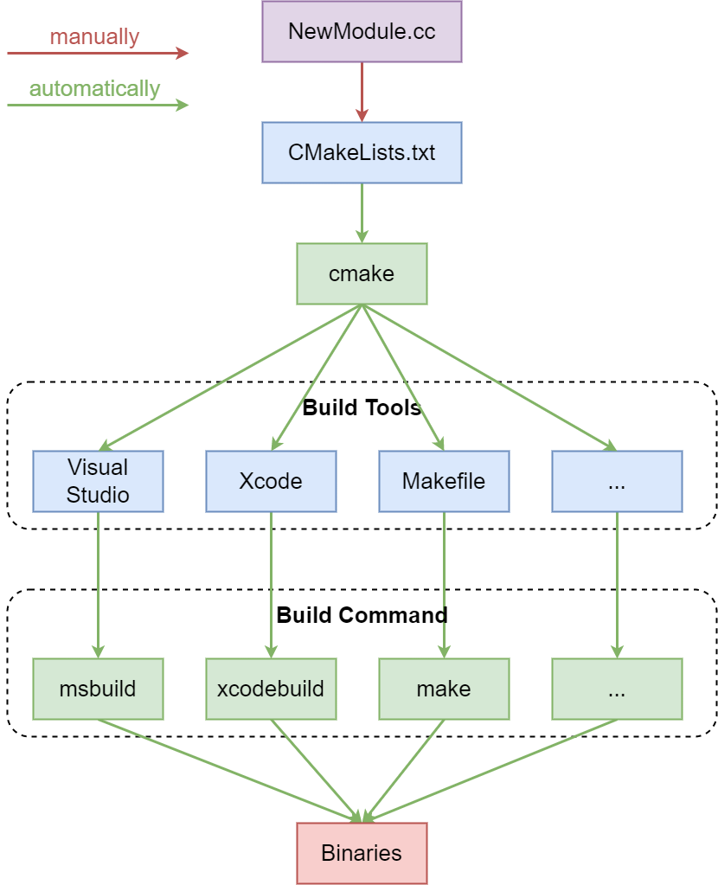
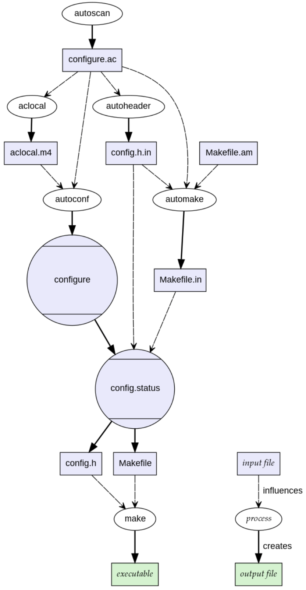
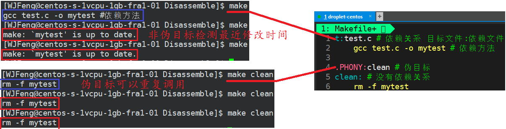
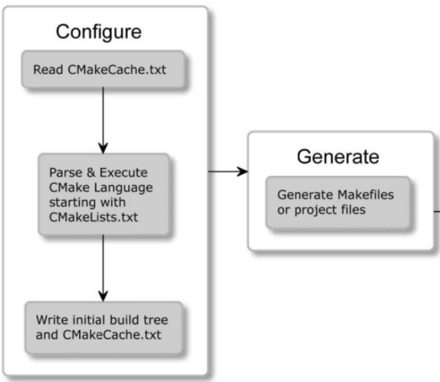
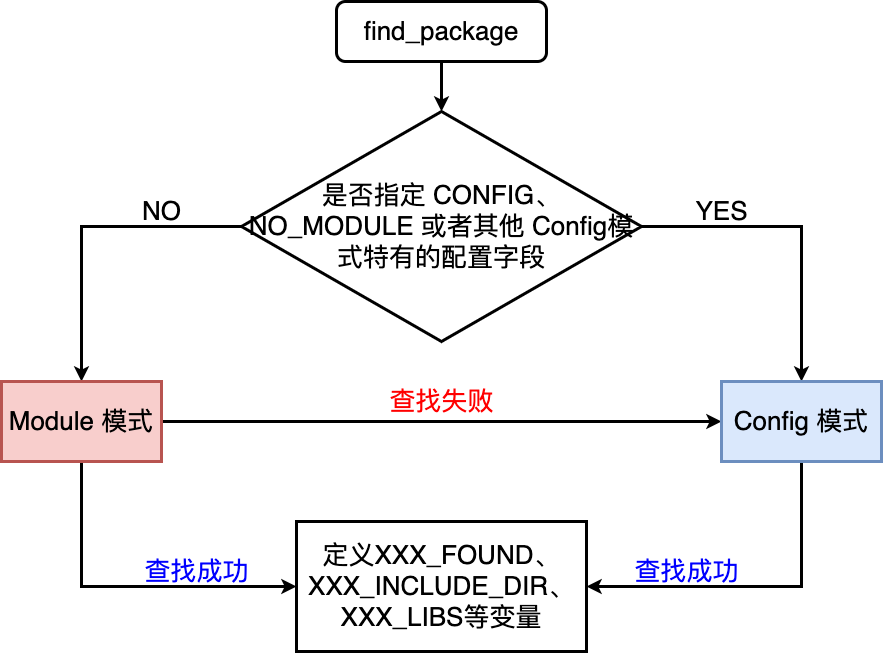
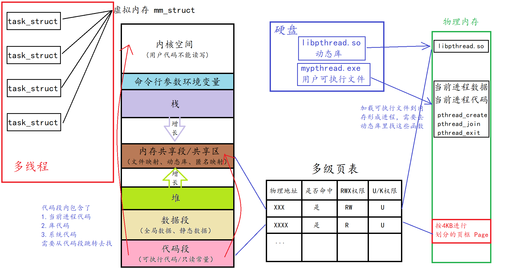

# Build系统

### build系统

直接用g++命令来编译的话，需要我们自己逐模块地编译目标文件，然后再链接起来，对于大的项目根本不可能手动来做

类似于Java的build工具maven、gradle等，`make` 是最常用的build系统之一，它通常被安装到了几乎所有类UNIX系统中

* 一个大的项目需要根据文件的类型、功能、模块按照一定顺序进行编译，不可能每次都手动输入编译命令，Makefile文件中存储着我们设计好的编译代码
* `make` 是一个命令，用来解释Makefile文件中指令的命令工具。当执行 `make` 时，它会去参考当前目录下名为 `Makefile` 的文件。所有构建目标、相关依赖和规则都需要在该文件中定义
* `make`并不完美，但是对于中小型项目来说，它已经足够好了。实际上单个project用的更多的是自动化构建Makefile工具如cmake，Makefile可以用来调用其他的build工具，比如camke、Maven等

### Makefile vs. CMake



* Makefile
  * Makefile 是一个文本文件，通常称为 `Makefile` 或 `makefile`，它包含了一系列规则，用于指导构建系统如何编译和链接项目的源代码文件
  * Makefile 的规则通常定义了目标文件、依赖文件和构建命令。当你运行 `make` 命令时，它会根据 Makefile 中的规则来构建项目
  * Makefile 通过检查文件的时间戳来确定哪些文件需要重新编译，以提高构建效率
  * Makefile 是一个传统的构建工具，通常需要手动编写，它是用于构建过程的静态规则
* CMake
  * CMake 是一个**跨平台**的构建系统生成工具，它允许开发者定义项目的构建过程，而不需要在不同平台上重复编写或使用复杂的构建工具
  * CMake 使用一个名为 `CMakeLists.txt` 的文本文件来描述项目的构建规则和依赖关系。这个文件中包含了构建配置选项、源代码文件、依赖库以及生成的目标等信息
  * CMake 生成的 Makefile 可以用于不同的构建工具，如 GNU Make、Ninja 等。这使得项目可以在不同的平台上使用不同的构建工具
  * CMake 支持多种生成器，允许你生成适用于不同集成开发环境和编译器的项目文件。这使得跨平台开发更加方便

总的来说，Makefile 是一个静态的构建工具，需要手动编写，而 CMake 是一个用于生成 Makefile 或其他构建系统的工具，它提供了更灵活的方式来管理和构建项目，特别是在需要跨平台支持的情况下。使用 CMake 可以减少构建系统的维护成本，提高项目的可移植性

# Makefile

makefile是一门用于自动化构建系统的DSL语言

## *Makefile中的特殊符号*

### `$` 转义符号

* `$@` 表示目前规则中所有的目标文件的集合
* `$^` 表示所有的依赖文件的集合
* `$<` 表示第一个依赖目标
* `$?` 表示比目标还要新的依赖文件列表
* `$%` 仅当目标是函数库文件中，表示规则中的目标成员名。例如，如果一个目标是 `foo.a(bar.o)`，那么，`$%` 就是 bar.o，`$@` 就是 foo.a。如果目标不是函数库文件（Unix下是[.a]，Windows下是[.lib]），那么，其值为空
* `$+` 这个变量很像 `$^`，也是所有依赖目标的集合。只是它不去除重复的依赖目标
* `$*` 这个变量要和 `%` 搭配使用，表示目标模式 % 及其之前的部分
  * 例子：如果目标是 `dir/a.foo.b`，并且目标的模式是 `a.%.b`，那么，`$*` 的值就是 `dir/a.foo`。这个变量对于构造有关联的文件名是比较有较
  * 如果目标中没有模式的定义，那么 `$*` 也就不能被推导出，但是，如果目标文件的后缀是make所识别的，那么`$*` 就是除了后缀的那一部分。例如：如果目标是 `foo.c`，因为 `.c` 是make所能识别的后缀名，所以，`$*` 的值就是 `foo`。这个特性是GNU make的，很有可能不兼容于其它版本的make，所以应该尽量避免使用 `$*`，除非是在隐含规则或是静态模式中。如果目标中的后缀是make所不能识别的，那么 `$*` 就是空值

注意：**`%` 是Makefile的Pattern Rule中的通配符，而 `*` 则是shell script的通配符**

### makefile调用shell命令

* **在规则的命令行中直接使用：** 对于每个规则，其下面缩进的命令部分通常是直接被当作 shell 命令执行的。这些命令会在 make 需要构建该目标时被执行

  ```makefile
  all:
      echo "This is a shell command"
  ```

* **通过 $(shell ...) 函数：** 另一种方法是使用 Makefile 的 `shell` 函数。这允许在变量赋值过程中执行 shell 命令，并捕获其输出

  ```makefile
  FILES := $(shell ls -1)
  
  all:
      @echo "Files: $(FILES)"
  ```

  在这个例子中，`$(shell ls -1)` 会执行 `ls -1` 命令并将输出的文件列表赋给 `FILES` 变量。然后，我们可以在 Makefile 的其他地方使用这个变量

### `@` 隐藏输出

`@` 单独使用的作用是在执行shell/Linux命令时**不输出该命令本身，只输出命令的结果**。通常，在 Makefile 中编写命令时，默认情况下执行的每条命令都会被打印到控制台上。如果在命令前加上`@`，那么这条命令就不会被打印，只有命令的输出结果会显示出来

注意：`@` 应当紧跟在Tab之后，否则会报错。也就是说，`@` 不能用于用 `;` 分隔的（非第一条）多条shell指令中

```makefile
SHELL := /bin/bash
VAR=foo
all:
	@VAR=bar; @echo $$VAR; @echo $(VAR)
```

上面的代码会报错

```
$ make all
/bin/bash: line 1: @echo: command not found
/bin/bash: line 1: @echo: command not found
make: *** [Makefile:4: all] Error 127
```

## *编写Makefile*

### 基本组成

```makefile
test: test.cc # 依赖关系 -> 目标文件: 依赖文件
    g++ -std=c++11 -o $@ $^ # 依赖方法，必须要用Tab缩进，不可以用空格

.PHONY: clean
clean:
    rm -f test
```

Makefile是一种DSL语言

一对make指令是由依赖关系和依赖方法组成的

```makefile
target: prerequisite
	recipe (shell commands)
	
target: prerequisite; recipe (shell commands)
```

* 依赖关系：文件之间的关系，即 `目标target: 依赖target`
* 依赖方法 recipe：如何通过依赖关系编译文件
* 注意：recipe之前一定要用tab缩进，关于tab缩进的坑可以看下面的章节。如果是写在同一行上的话用 `;` 隔开就可以了

### 伪目标 `.PHONY`

伪目标 phony target 是不产生实际输出文件的目标，它们的目的主要是执行一些动作或命令。这些目标通常用于执行一些常见任务，如编译、测试、清理等，而不是生成文件，比如说clean和all。伪指令有助于确保 Make 工具能够正确地执行这些任务，而不受已存在文件的影响

当明确运行 `make` 命令并指定伪目标（比如 `make clean`）时，伪目标中定义的命令总是会被执行，不像普通目标一样只有在构建时会根据文件的时间戳判断有最新的改动才需要重新构建

不能把为目标和普通目标写成相同的名字，但是为了避免这重名，可以直接将伪目标定义为 `.PHONY` 来区分，不过像clean和all这种很常用的，笔者看到很多人都不写 `.PHONY`

### 在不同层级上忽略错误

* 单条命令：在命令前加上 `-`
* 单条规则中的所有命令：直接以 `.IGNORE` 作为目标
* 全局：make时加上 `-i` 或者 `--ignore-errors`

如果make时加上 `-k` 或者 `--keep-going`，那么在执行时若某条规则中的命令出错了，就中止该规则的执行，但是继续执行其他规则

### 条件判断

Makefile 文件中的条件语句允许基于特定条件来决定执行哪些部分的代码。`ifeq` 是 Makefile 中用于条件判断的关键字之一，它用来比较两个参数是否相等

```makefile
ifeq (arg1, arg2)
# 如果 arg1 和 arg2 相等，则执行这里的命令
else
# 如果 arg1 和 arg2 不相等，则执行这里的命令
endif
```

这里的 `arg1` 和 `arg2` 可以是变量或者字符串

make 是在读取 Makefile 时就计算条件表达式的值，并根据条件表达式 的值来选择语句，所以最好不要把自动化变量（如 `$@` 等）放入条件表达式中，因为自动化变量是在运行时才有的

## *makefile DSL语法解析的坑*

[GNU make](https://www.gnu.org/software/make/manual/make.html#Recipe-Syntax)

### Tab缩进问题

[Makefile中的tab缩进 - 胡小兔 - 博客园 (cnblogs.com)](https://www.cnblogs.com/RabbitHu/p/makefile_tab.html)

除了Python，Makefile是另一个严格要求缩进的DSL，Makefile把缩进视为语法的一部分。更坑的是，Makefile的缩进有一些特殊的规则

* 缩进只允许用Tab（制表符），不允许用空格
* 任何以Tab开头的命令（不论是makefile语句还是shell命令）都必须是某个target的recipe的一部分

考虑下面的例子：之前犯过一个这个错误，在debug的时候想要往ifneq中间插入一个echo，看起来完全正确，但是报了一个这个错误 `recipe commences before first target.  Stop`

```makefile
ifneq ($(VERSION), )
	echo TEST============= # 错误的插入
	IMAGE_TAG := $(VERSION)
else ifneq ($(DOCKER_TAG), )
	IMAGE_TAG := $(DOCKER_TAG)
endif
```

实际上这是因为在前面没有对应的target，所以即使是用tab了也不会被解释为recipe，而makefile中并没有echo函数，所以就报错了

如果在前面加一个target，这时因为后面的IMAGE_TAG的变量定义式makefile形式的，所以也会报错

因此规范的写法应该是**不要在非recipe语句的前面加tab**，如果是想要表示缩进的话就用空格

```makefile
ifneq ($(VERSION), )
IMAGE_TAG := $(VERSION)
else ifneq ($(DOCKER_TAG), )
IMAGE_TAG := $(DOCKER_TAG)
endif
```

### 幽灵空格

[Makefile] 缩进与空格--记录踩过的坑 - 王赟康的文章 - 知乎
https://zhuanlan.zhihu.com/p/145439685

ghost white space 的问题的报错往往都很奇怪，无法一下子想到是空格的问题，所以极其难debug，只能指望makefile的维护者在编写的时候多留心这个问题

## *变量*

### 赋值

* `=` 直接对变量赋值，即**递归方式**展开
* `+=` 追加赋值，`+=` 会继承之前的赋值符号，如果前面没有赋值，就等同于 `=`
* `:=` 该符号右侧是否有变量，如有变量且变量的定义在后边，则忽略该右侧变量，其他情况同 `=` 号。主要是为了防止成环/递归展开式存在的问题和不方便，这种赋值方式称为**直接展开**
* `?=` 如果符号左侧的变量已经定义过则跳过该句

### `$` 引用变量

如上所述，`$` 用于转义特殊符号

和shell script引用变量可以使用 `${}` 或 `$x` 不同，当使用makefile中的变量时需要用 `$()` 或者 `${}` 来引用，不要漏掉括号，不然的话会去尝试转义 `$` 后面的第一个字母，也就是说当makefile变量的名字是一个字母的时候可以这么去引用

而当要使用shell的环境变量时要用 `$$` 来转义

```makefile
SHELL := /bin/bash
VAR=foo
all:
	VAR=bar; echo $$VAR; echo $(VAR)
```

```
VAR=bar; echo $VAR; echo foo
bar
foo
```

比如上面的代码段中 `echo $$VAR` 就是去转义环境变量，而 `echo $(VAR)` 就是引用makefile的环境变量

### 变量定义的方式

有三种定义变量的方式

* 通过环境变量定义：因为make是shell fork出来的进程，所以make会继承shell的环境变量表

* 通过make的命令参数定义有两种方式，这两种方式的区别在于它们的覆盖优先级上

  * 直接定义

    ```makefile
    $ make VAR="test" #通过命令行来定义一个叫做VAR的makefile变量
    ```

  * 通过 `-e` 定义

    ```makefile
    $ make -e VAR="test"1
    ```

* 通过makefile脚本来定义

### 变量定义的优先级

```makefile
VAR = in makefile
all:
	@echo $(VAR)
```

1. make 命令参数定义的优先级最高，可以覆盖 make 进程环境表及 makefile 脚本定义

   ```cmd
   $ VAR="in environment" make VAR="in command"
   in command
   ```

2. makefile 脚本定义变量中等，在没有 make 命令参数定义指定变量时，其优先级高于 make 进程环境表

   ```cmd
   $ VAR="in environment" make
   in makefile
   ```

3. make 继承的进程环境表定义最低，仅当指定变量在 make 命令参数及 makefile 中都未定义时，才被使用。但是如果使用了 `-e` 的话，此时环境变量的优先级会高于makefile脚本，但仍低于命令行参数

   ```cmd
   $ make -e VAR="in environment"
   in environment
   ```

## *函数*

### 字符串处理函数

## *隐含规则*

# Makefile构建工具链

## *Autoconf*



### configure

configure 是一个脚本，通常与 make 结合使用，用于配置源代码以适应特定的系统环境。这一般是在构建开源软件时的第一步。configure 脚本的作用是根据当前系统的特性和环境来生成一个 Makefile，以便后续使用 make 命令进行编译

主要步骤如下：

1. 检查系统环境：configure 脚本会检查目标系统的一些基本特性，例如操作系统类型、处理器架构、编译器等。这有助于确定代码是否能够在当前系统上正常编译和运行
2. 检查依赖项：configure 还会检查目标系统上是否存在所需的依赖项和库。如果某些依赖项缺失，configure 会生成一个警告或错误，并提示用户安装所需的依赖项
3. 生成 Makefile：根据检测到的系统环境和依赖项，configure 会生成一个适用于当前系统的 Makefile。Makefile 是一个包含了构建软件的编译规则和依赖关系的脚本文件
4. 用户定制选项：configure 通常还支持一些用户可定制的选项，例如安装路径、编译器选项等。这些选项允许用户在构建软件时进行一些定制化配置
5. 执行 Make： 一旦 configure 完成，用户可以运行 make 命令来使用生成的 Makefile 编译和构建软件

这种配置和构建的方式是为了使软件更具可移植性，因为它能够适应不同类型和版本的操作系统和编译器。许多开源软件项目都采用了这种配置方式，其中 Autoconf 是一个常用的工具，它生成了 configure 脚本，并与 Makefile 配合使用

### autogen.sh

autogen 是一个用于生成 configure 脚本的工具。它是 Autoconf 工具集的一部分，用于简化配置和构建过程。Autoconf 是一个用于生成可移植的配置脚本的工具，而 autogen 则是 Autoconf 的一个辅助工具，用于生成 configure 脚本

主要步骤如下：

1. 编写 configure.ac 文件：这个文件包含了 Autoconf 的宏和配置信息。在该文件中，开发者描述了项目的一些基本特性、依赖关系以及一些用户定制的选项
2. 运行 autogen.sh 或 autoreconf：在项目的根目录中，通常会提供一个名为 `autogen.sh` 或者直接运行 autoreconf 的脚本。这个脚本的目的是调用 autogen 工具，该工具会读取 configure.ac 文件并生成 configure 脚本
3. 生成 configure 脚本：autogen 会根据 configure.ac 中的信息，生成一个适用于当前系统的 configure 脚本。这个脚本将在后续的构建过程中使用
4. 运行 configure：使用生成的 configure 脚本，运行 `./configure` 命令来配置软件。这一步会根据系统环境和用户选项生成相应的 Makefile
5. 运行 make：配置完成后，运行 make 命令来编译和构建软件

通过这个过程，开发者可以确保软件能够在不同的系统上进行配置和构建，同时允许用户在某些方面进行自定义。

需要注意的是，并非所有的项目都使用 autogen。有些项目可能直接提供了预先生成的 configure 脚本，而不需要运行 autogen 这一步。使用 autogen 的目的在于自动生成 configure 脚本，减少配置和构建过程中的手动步骤

## *makefile文件的执行顺序*

[Makefile中语句的顺序_make不按照文件顺序执行-CSDN博客](https://blog.csdn.net/qq_35524916/article/details/77131555)

* `make` 命令会**默认执行遇到的第一对 `target : prerequist`**，执行其余的target需要 `make+target`，如 `make clean`

* 如果依赖关系中的文件找不到，就会根据预生成的依赖关系继续执行，比如说下面的makefile所有指令都会执行（所以并不是根据顺序语句来执行的，可能有依赖项是定义在前面）

  ```makefile
  main: main.o add.o # 没找到main.o add.o，继续往下找
      g++ main.o add.o -o main
  main.o add.o: main.s add.s
  	g++ -cmain.s -o main.o
  	g++ -c add.s -o add.o
  main.s add.s: main.i add.i
  	g++ -S main.i -o main.s
  	g++ -S add.i -o add.s
  main.i add.i: main.cpp add.cpp
  	g++ -E main.cpp -o main.i
  	g++ -E add.cpp -o add.i
  ```


### make的执行过程

[Makefile中语句的顺序_make不按照文件顺序执行-CSDN博客](https://blog.csdn.net/qq_35524916/article/details/77131555)

1. 依次读取变量 `MAKEFILES` 定义的makefile文件列表：在当前环境中查看一下有没有定义 `MAKEFILES` 这个环境变量， 如果环境变量 `MAKEFILES` 被定义了，那么make会在读取其它makefile之前，先读取 `MAKEFILE` 定义的列表中的名字（由空格分隔）。建议大家不要去定义这个环境变量，因为我们并不太了解这个变量的使用，那么经常会造成一些奇怪的错误
2. 读取工作目录下的makefile文件（缺省的是根据命名的查找顺序 `GNUmakefile -> makefile -> Makefile`，首先找到那个就读取那个）
3. 依次读取工作目录makefile文件中使用指示符 `include` 包含的文件
4. 查找重建所有已读取的makefile文件的规则（如果存在一个目标是当前读取的某一个makefile文件，则执行此规则重建此makefile文件，完成以后从第一步开始重新执行）
5. 初始化变量值并展开那些需要立即展开的变量和函数并根据预设条件确定执行分支，也就是说执行那些不属于任何target的语句
6. 根据要执行的target以及其他目标的依赖关系建立依赖关系链表
7. 执行除要执行的target以外的所有的目标的规则（规则中如果依赖文件中任一个文件的时间戳比目标文件新，则使用规则所定义的命令重建目标文件）
8. 执行要执行的target所在的规则

### 增量构建

make 的一个核心特性，通常称为增量构建 incremental build 或选择性编译 selective compilation

make是如何知道目标已经是最新的呢？根据文件的最近修改时间，若可执行程序的修改时间比所有相关文件的修改时间都要晚，那么可执行程序就是最新的

当 make 被调用时，它会检查所有指定的目标和依赖项的时间戳。make 会比较目标文件和它的依赖文件的最后修改时间，以确定是否需要重新构建。这个过程可以被视作是一种基于时间戳的缓存：

- **如果依赖文件的任何一个比目标文件新**，make 将执行相应规则中指定的命令来更新这个目标
- **如果目标文件不存在**，make 同样将执行必要的命令来生成目标文件
- **如果所有的依赖文件都没有比目标文件新**，make 则认为目标是最新的，不会执行任何操作



# CMake变量 & 缓存

现代 CMake 指的是 CMake 3.x；古代 CMake 指的是 CMake 2.x

## *CMake变量*

### listfile

有一个问题是：什么是listfile？[Terminology: what exactly is a "listfile" (#18512) · 议题 · CMake / CMake · GitLab (kitware.com)](https://gitlab.kitware.com/cmake/cmake/-/issues/18512)

> I personally interpret it to simply mean a file that CMake processes as CMake commands. The name probably comes from `CMakeLists.txt`, but (to me) it can also refer to other files that get pulled in via `include()`. This seems to be supported by the `CMAKE_CURRENT_LIST_FILE` and `CMAKE_CURRENT_LIST_DIR` variables which refer to the file that CMake is currently processing. -- [Craig Scott](https://gitlab.kitware.com/craig.scott), CMake maintainer

个人理解下面几种都是listfile，即CMake文件的几种形式

* Directories 包含 CMake 命令的文本文件。最常见的 listfile 就是 `CMakeLists.txt`

  当 CMake 处理一个项目源代码树 project source tree 时，入口点是位于顶级源目录 top-level source directory 中名为 `CMakeLists.txt` 的文件。这个文件可能包含整个构建规范，也可以使用 `add_subdirectory()` 命令添加子目录到构建中。每个通过该命令添加的子目录也必须包含一个 `CMakeLists.txt` 文件作为进入那个目录的入口点。对于每个处理了 `CMakeLists.txt` 文件的源目录，CMake 会在构建树 build tree 中生成一个对应的目录，用作默认的工作和输出目录

* Script `.cmake` 扩展名的文件：这些通常是模块或者脚本，包括预设的宏、函数、查找脚本（用于查找库、程序等）、或者工具链文件（用于交叉编译）

* Module 内置的 CMake 模块：CMake 自身提供了一系列的模块，这些模块也是 `.cmake` 文件，并且包含在 CMake 的安装目录中。它们通常通过 `find_package`、`include` 等命令在 `CMakeLists.txt` 文件中被引用

###  变量分类

* 普通变量：定义在CMakeLists.txt中的变量，相当于一个局部变量，在同一个CMake工程中使用，会有[作用域](#作用域)限制或区分

* CMake中的环境变量 Environment Variable 是OS中环境变量的超集。CMake的环境变量和普通变量差不多，但是有以下区别

  * 环境变量在 CMake 执行过程中具有全局范围（跨越 directory scope），并且它们永远不会被缓存
  * 环境变量的初始化是调用进程时的初始化。 CMake 可以访问并使用操作系统环境变量，但是 CMake 本身不会永久改变操作系统的环境变量。即环境变量只影响正在运行的 CMake 进程，而不影响整个系统环境。更改环境变量的值，不会写入调用进程，也不会被后续的构建或检测进程看到

* 缓存变量 Cache Variable：这些变量存储在`CMakeCache.txt`文件中，包含了项目配置和构建系统的相关信息。相当于一个全局变量。在同一个CMake工程中任何地方都可以使用。通过`set()`和`get()`等命令可以读取和修改这些变量

  缓存变量引用的形式为 `$CACHE{<variable>}`，它会被替换为指定缓存条目的值，**而不检查是否存在同名的普通变量**。如果缓存条目不存在，它将被替换为空字符串

  注意：**通过命令行的 `-D` 设置的变量是缓存变量**

### 变量命名

* 与makefile/Makefile都可以不一样，**CMakeLists.txt文件名必须严格区分大小写**。然而指令是⼤⼩写⽆关的，参数和变量是⼤⼩写相关的。但是推荐全部使⽤⼤写指令
* 命令的参数换行时通常不需要使用反斜杠 `\`。CMake 在解析命令时会自动识别行尾的换行符，并将多行的参数合并在一起
* CMake 保留了下面这些标识符
  * begin with `CMAKE_` (upper-, lower-, or mixed-case), or
  * begin with `_CMAKE_` (upper-, lower-, or mixed-case), or
  * begin with `_` followed by the name of any [`CMake Command`](https://cmake.org/cmake/help/latest/manual/cmake-commands.7.html#manual:cmake-commands(7)).

### 变量类型

* 字符串变量 String：字符串是CMake中最基本的数据类型，实际上所有的CMake变量都被视作String。字符串变量可以包含文本、数字等信息。通过`set()`命令可以创建字符串变量，例如：

  ```cmake
  set(MY_STRING "Hello, World!")
  ```

* 列表变量 List：列表是由分号分隔的一系列字符串的集合

  * 通过`set()`命令和`LIST`操作命令（如`list(APPEND)`、`list(REMOVE_ITEM)`等）可以创建和修改列表变量

  * 列表中的元素可以使用索引来访问，也可以使用`foreach`等循环结构进行遍历。例如：

    ```cmake
    set(MY_LIST "Item1;Item2;Item3")
    list(APPEND MY_LIST "Item4")
    ```

* FILEPATH 文件路径，例如 "C: /path/to/project//my_proj.cmake”

* PATH 目录路径，例如 “C:/path/to/project/cmake/”

* BOOL布尔值：通常来说 BOOL 类型的变量只有 ON/OFF 两种取值。但是由于历史原因，TRUE/FALSE 和 YES/NO 也可以表示 BOOL 类型。**建议始终使用 ON/OFF 避免混淆**

### 变量的使用：引用变量

```cmake
${variable_name}
```

在CMake中，使用 `${}` 来引用变量的值。例如，`${variable_name}` 将被替换为变量 `variable_name` 的实际值

这些只是一些常见的CMake变量用法示例。CMake提供了更多高级用法，如列表变量、环境变量、缓存变量

特例：[if中的条件](#if)

### CMake常用内置变量

* 编译器相关

  * CMAKE_C_FLAGS：gcc编译选项

  * CMAKE_CXX_FLAGS：g++编译选项

  * CMAKE_BUILD_TYPE：编译类型（Debug or Release），详情见构建部分的生成目标内容

  * CMAKE_C_COMPILER：指定C编译器

  * CMAKE_CXX_COMPILER：指定C++编译器

  * CMAKE_CXX_STANDARD（默认值为11） & CMAKE_CXX_STANDARD_REQUIRED

    ```cmake
    set(CMAKE_CXX_STANDARD 17)
    set(CMAKE_CXX_STANDARD_REQUIRED ON)
    set(CMAKE_CXX_EXTENSIONS ON)
    ```

    注意：**不要使用下面这种方法，因为没有跨平台性质。选择CMake为我们准备好的CMAKE_CXX_STANDARD**

    ```cmake
    # 缺乏夸平台性的做法：在CMAKE_CXX_FLAGS编译选项后追加-std=c++11
    set(CMAKE_CXX_FLAGS "${CMAKE_CXX_FLAGS} -std=c++11")
    ```

  * CMAKE_CXX_EXTENSIONS 也是 BOOL 类型，默认为 ON。设为 ON 表示启用 GCC 特 有的一些扩展功能；OFF 则关闭 GCC 的扩展功能，只使用标准的 C++

* 目录相关

  * CMAKE_BINARY_DIR、project_BINARY_DIR、BINARY_DIR：这三个变量指代的内容是一致的
    * 若是 in source build，指的就是工程顶层目录
    * 若是 out-of-source 编译，指的是工程编译发生的目录
  * CMAKE_SOURCE_DIR、PROJECT_SOURCE_DIR、SOURCE_DIR
    * CMAKE_SOURCE_DIR 定义了顶级 CMakeLists.txt 所在的文件夹，这个变量的值是不会变的

    * PROJECT_SOURCE_DIR 定义了包含最近的 `project()` 命令的CMakeLists.txt所在的文件夹。如果最近的project是作为子模块，CMake会额外做一些初始化，其构建目录也会在build下面单独开一个文件夹

  * EXECUTABLE_OUTPUT_PATH：可执行文件输出的存放路径
  * LIBRARY_OUTPUT_PATH：库文件输出的存放路径

## *定义  & 修改变量*

[CMake语法—缓存变量（Cache Variable） - kaizenly - 博客园 (cnblogs.com)](https://www.cnblogs.com/Braveliu/p/15614013.html)

CMake中统一使用set（或者boolean变量的语法糖opt）来定义或修改变量，但是不同类型的变量之间的表现会很不一样

### `set()` & `unset()`

demo中 `SET(SRC_LIST main.cpp)` 就是创建一个 `SRC_LIST` 变量，并将其值设置为 main.cpp

如果源⽂件名中含有空格，就必须要加双引号，比如 `m ain.cpp`

### option

CMake 对 BOOL 类型缓存的 set 指令提供了一个简写：option

`option(变量名 "描述" 变量值)` 等价于 `set(变量名 CACHE BOOL 变量值 "描述")`

### 普通变量

```cmake
set(<variable> <value>... [PARENT_SCOPE])
```

### 缓存变量

```cmake
set(<variable> <value>... CACHE <type> <docstring> [FORCE])
```

- variable：变量名称
- value：变量值列表
- CACHE：cache变量的标志
- type：变量类型，取决于变量的值。类型分为：BOOL、FILEPATH、PATH、STRING、INTERNAL
- docstring：必须是字符串，作为变量概要说明
- FORCE：强制选项，强制修改变量值

```cmake
set(CMAKE_CXX_COMPILER "/usr/local/bin/clang++" CACHE STRING "C++ compiler" FORCE)
```

### 环境变量

```cmd
$ set(ENV{<variable>} [<value>])
```

### projcet

project可以⽤来指定⼯程的名字和⽀持的语⾔，默认⽀持所有语⾔

* `project (HELLO)`：指定了⼯程的名字，并且⽀持所有语⾔，**建议这么写**
* `project (HELLO CXX)` 指定了⼯程的名字，并且⽀持语⾔是C++
* `project (HELLO C CXX)` 指定了⼯程的名字，并且⽀持语⾔是C和C++
* 也可以支持JAVA

**实际上 project 命令非常重要，因为它负责初始化很多基础的设置**。比如说确定编译器的信息，当调用 `project()` 时，CMake会尝试找到并使用默认的C和C++编译器，除非已经提前告知CMake使用其他的编译器

1. set 同名的普通变量进行覆盖，一定要在project之前，否则在project之后set普通变量是无法修改缓存变量的
2. set 修改缓存变量，此时放在哪里都行

在顶级 `CMakeLists.txt` 的顶部附近调用 `project()` 命令，但要在调用 `cmake_minimum_required()` 之后。在调用可能会受到版本和策略设置影响的其他命令之前确立版本和策略设置是非常重要的，因此如果不遵守这个顺序，`project()` 命令将发出警告

[CMakeLists中Set编译器要放在project设定之前_cmake中set写在project之前和之后区别-CSDN博客](https://blog.csdn.net/chunyexiyu/article/details/133804527)

`CMAKE_MINIMUM_REQUIRED(VERSION versionNumber [FATAL_ERROR])` 指定CMake的最小版本要求

## *MESSAGE (log)*

```cmake
message([<mode>] "message text" ...)
```

**`message` 指令可以用于向终端打印变量的值**。message相当于是cmake的log，里面的mode就是log的等级。如果没有指定mode的话就是一个普通的string

* 错误
  
  * FATAL_ERROR：最高优先级，一个不可恢复的错误。⽴即终⽌所有 cmake 过程
  * SEND_ERROR：产⽣错误，⽣成过程被跳过
  
* 提醒
  
  * WARNING：以警告的形式显示，用于输出一些警告信息
  * AUTHOR_WARNING：显示作者警告，用于向用户发出需要注意但不是错误的信息。可以通过设置 `CMAKE_SUPPRESS_DEVELOPER_WARNINGS` 变量或 -Wno-dev关闭
  * DEPRECATION：显示过时警告，表示某些使用已过时的特性
  * NOTICE：正常的消息输出，用于传达用户可能感兴趣的信息，但不像 STATUS 消息那样普遍
  * SATUS：输出前缀为 `—` 或 `--` 的信息
  
* 调试
  * VERBOSE：详细的信息，供项目用户使用。这些消息应提供额外的细节，大多数情况下可能不感兴趣，但对于构建项目时希望深入了解正在发生的事情的人可能会很有用
  
    可以通过命令行参数 `--log-level=VERBOSE` 来显示这些消息
  
  * DEBUG：详细的信息消息，供项目开发人员使用，而不是仅希望构建项目的用户。这些消息通常不会引起其他构建项目的用户的兴趣，通常与内部实现细节密切相关
  
    需要通过 `CMAKE_MESSAGE_LOG_LEVEL=DEBUG` 配置或者命令行参数 `--log-level=DEBUG` 才能正常输出
  
  * TRACE：具有非常低级别实现细节的细粒度消息。使用此日志级别的消息通常只是临时的，预计在发布项目、打包文件等之前会被删除

下面示例将输出变量 `variable_name` 的值到 CMake 构建过程的输出

```cmake
message(STATUS "Variable value: ${variable_name}")
```

## *CMakeCache*

CMake在配置过程中生成一个位于项目构建目录中的文件 `CMakeCache.txt`，用于存储构建系统和项目配置的各种设置

在第一次运行CMake时，它会根据CMakeLists.txt文件中的信息生成缓存文件。然后，这个缓存文件被用于存储各种配置选项、变量、路径、库位置等与项目构建相关的信息。当重新运行CMake时，它将使用缓存文件中的信息而不是重新扫描整个项目

### 缓存类型

* EXTERNAL cache entries 外部缓存条目
  * 是用户或项目的 `CMakeLists.txt` 文件可以查询和修改的配置选项。这些条目通常用于保存编译器设置、找到的库路径、用户选项以及其他项目配置参数
  * 外部条目通常通过调用 `set()` 命令和 `option()` 命令来创建和更新，也可以通过 CMake GUI 或 `ccmake` 文本界面手动编辑
  * 用户创建的缓存变量会在 `CMakeCache.txt` 文件中显示，而且通常是用户与构建系统交互的主要方式
* INTERNAL cache entries 内部缓存条目
  * 是 CMake 内部使用的，以支持配置和生成过程。用户不应该直接修改这些条目；它们通常包括 CMake 自动生成的平台特定信息和检测结果，如编译器和链接器的特性、测试程序的输出等
  * 内部条目通常由 CMake 的模块和脚本自动创建，并标记为内部使用，这意味着它们在 `CMakeCache.txt` 文件中存在但不显示在 CMake GUI 或 `ccmake` 界面中

### 删build法

缓存是造成CMake中大部分奇怪现象的原因，外部更新了，但这时候 CMakeCache.txt 中存的却是旧的值，会导致一系列问题。 这时我们需要清除缓存，最简单的办法就是删除 build 文件夹，然后重新运行cmake 配置 `cmake -B build`

不过删build虽然很有效，也会导致编译的中间结果（.o文件）都没了，而重新编译要花费很长时间。

如果只想清除缓存，不想从头重新编译，**可以只删除 build/CMakeCache.txt 这个文件**。这文件里面装的就是缓存的变量，删了它就可以让 CMake 强制重新检测一遍所有库和编译器后生成缓存

### 设置 & 更新缓存变量

```cmake
set(变量名 “变量值” CACHE 变量类型 “注释”)
```

举一个例子，完成后myvar就会出现在build/CMakeCache.txt了

```cmake
set(myvar "helLo" CACHE STRING "this is the docstring.")
message("myvar is: ${myvar}")
```

更新缓存变量的时候有坑：在完成第一次 `cmake -B build` 后再去修改 CMakeLists.txt 中 `set CACHE` 的值已经没有意义了，因为此时缓存变量已经存在，不会更新缓存的值

* **如果想要更新缓存变量必须要通过命令行 -D参数**

  ```cmd
  $ cmake -B build -Dmyvar=world
  ```

  在Linux中可以借助 ccmake，在Win中可以借助 cmake-gui 这些可视化工具来管理这些缓存变量

  ```cmd
  $ sudo apt install cmake-curses-gui
  ```

  需要在top level of build tree中打开source tree

  ```cmd
  # in build tree, '..' points to source tree
  $ ccmake ..
  ```

* 也可以通过指定FORCE来强制set更新缓存

  ```cmake
  set(myvar "helLo" CACHE STRING "this is another the docstring." FORCE)
  ```

* 除了可视化工具外也可以通过命令行来查看Cache `-L[A][H]`
  * `-L` 列出用户定义的外部缓存条目
  * `A` 增加常用的外部缓存条目
  * `H` 增加缓存条目帮助说明
  * `-LA` 列出用户和常用的外部缓存条目

## *作用域*

### 作用域分类

CMake变量拥有动态作用域，即每一个对变量的 `set()` 和 `unset()` 都会在当前作用域中修改变量

* Block Scope 块作用域，由 `block()` 命令产生（3.25版本引入，用来运行一组命令）

* Function Scope 函数局部作用域

* Directory Scope 目录全局作用域

  每个包含 `CMakeLists.txt` 文件的目录都拥有自己的作用域。当 CMake 处理一个目录的 `CMakeLists.txt` 文件时，它会继承父目录作用域中的所有变量，即会复制当前父目录中定义的所有变量绑定（如果有的话），以初始化新的目录作用域

  但是对这些变量的任何修改（除非明确地推送到父作用域）都仅限于当前目录及其子目录

  * 父会传给子：父模块里定义的变量，会传递给子模块
  * 子不会传给父
    * 子模块里定义的变量，不会传递给父模块
    * 若父模块里本来就定义了同名变量，则离开子模块后仍保持父模块原来设置的值
  * 手动子传父：可以用 set 的 PARENT_SCOPE 选项，把一个变量传递到上一层作用域，比如函数作用域

* Persistent Cache 持久化缓存，即缓存变量

### 其他独立作用域

* include 的 XXX.cmake 没有独立作用域
* add_subdirectory 的 CMakeLists.txt 有独立作用域
* macro 没有独立作用域
* function 有独立作用域

## *跨平台*

### 生成器表达式

生成器表达式 Generator Expression 是一种特殊的语法，用于在生成构建系统配置文件时动态地生成和处理信息。这些表达式允许在不同的上下文中提供不同的信息，例如根据构建类型、目标平台或其他条件来生成不同的编译选项

生成器表达式可以在CMake的各个命令中使用，如`target_compile_options()`、`target_link_libraries()`、`add_definitions()`等。它们通常包含在`$<`和`>`之间

```cmake
$<$<类型:值>:为真时的表达式>
```

### 构建类型

```cmake
target_compile_options(my_target PRIVATE
    $<$<CONFIG:Debug>:-DDEBUG_FLAG>
    $<$<CONFIG:Release>:-DRELEASE_FLAG>
)
```

### 操作系统

```cmake
target_compile_definitions(main PUBLIC
	$<$<PLATFORM_ID:Windows>:MY_NAME="DOS-Like">
	$<$<PLATFORM_ID:Linux,Darwin,FreeBSD>:MY_NAME="Unix-Like">
)
```

一些变量

* WIN32，实际上对 32 位 Windows 和 64 位 Windows 都适用
* APPLE 对于所有苹果产品（MacOS 或 iOS）都为真
* UNIX 对于所有 Unix 类系统（FreeBSD, Linux, Android, MacOS, iOS）都为真

### 编译器

```cmake
targe_compile_definitions(main PUBLIC
	$<$<CXX_COMPILER_ID:GNU, CLang>:MY_NAME="Open-source">
	$<$<CXX_COMPILER_ID:MSVC, NVIDIA>:MY_NAME="Commercial">
)
```

# 过程控制

## *CMake控制流*

### if

```cmake
if(variable_name)
  # 条件为真时执行的代码
else()
  # 条件为假时执行的代码
endif()
```

注意：if中用到的变量不需要加 `${}`，cmake会自动尝试作为变量名求值

因为一些历史原因，if 的括号中有着特殊的语法。如果是一个字符串，比如 MYVAR，则cmake会先寻找是否有 `${MYVAR}` 这个变量。如果有这个变量则会被替换为变量的值来进行接下来的比较， 否则保持原来字符串不变

假设现在定义了 `${MYVAR}=Hello`，那么cmake会进行替换寻找Hello这个变量，这样要么和我们想表达的意思不同，要么没找到直接报错

如果实在搞不懂，就写成 `"{MYVAR}"`，这样就可以避免被 if 当做变量名来求值了

### 条件判断表达式

在条件语句中，可以使用一些条件判断表达式，比如 `EQUAL`、`LESS`、`GREATER` 等，用于比较变量或表达式的值

```cmake
if (变量1 EQUAL 变量2)
    # 在变量1等于变量2时执行的指令
endif()

if(<condition>)  
    <commands>
elseif(<condition>) # optional block, can be repeated  
    <commands>
else()              # optional block  
    <commands>
endif()
```

Compound conditions [are]() evaluated in the following order of precedence:

1. Parentheses.
2. Unary tests such as [EXISTS](https://cmake.org/cmake/help/latest/command/if.html?highlight=#exists), [COMMAND](https://cmake.org/cmake/help/latest/command/if.html?highlight=#command), and [DEFINED](https://cmake.org/cmake/help/latest/command/if.html?highlight=#defined).
3. Binary tests such as [EQUAL](https://cmake.org/cmake/help/latest/command/if.html?highlight=#equal), [LESS](https://cmake.org/cmake/help/latest/command/if.html?highlight=#less), [LESS_EQUAL](https://cmake.org/cmake/help/latest/command/if.html?highlight=#less-equal), [GREATER](https://cmake.org/cmake/help/latest/command/if.html?highlight=#greater), [GREATER_EQUAL](https://cmake.org/cmake/help/latest/command/if.html?highlight=#greater-equal), [STREQUAL](https://cmake.org/cmake/help/latest/command/if.html?highlight=#strequal), [STRLESS](https://cmake.org/cmake/help/latest/command/if.html?highlight=#strless), [STRLESS_EQUAL](https://cmake.org/cmake/help/latest/command/if.html?highlight=#strless-equal), [STRGREATER](https://cmake.org/cmake/help/latest/command/if.html?highlight=#strgreater), [STRGREATER_EQUAL](https://cmake.org/cmake/help/latest/command/if.html?highlight=#strgreater-equal), [VERSION_EQUAL](https://cmake.org/cmake/help/latest/command/if.html?highlight=#version-equal), [VERSION_LESS](https://cmake.org/cmake/help/latest/command/if.html?highlight=#version-less), [VERSION_LESS_EQUAL](https://cmake.org/cmake/help/latest/command/if.html?highlight=#version-less-equal), [VERSION_GREATER](https://cmake.org/cmake/help/latest/command/if.html?highlight=#version-greater), [VERSION_GREATER_EQUAL](https://cmake.org/cmake/help/latest/command/if.html?highlight=#version-greater-equal), [PATH_EQUAL](https://cmake.org/cmake/help/latest/command/if.html?highlight=#path-equal), and [MATCHES](https://cmake.org/cmake/help/latest/command/if.html?highlight=#matches).
4. Unary logical operator [NOT](https://cmake.org/cmake/help/latest/command/if.html?highlight=#not).
5. Binary logical operators [AND](https://cmake.org/cmake/help/latest/command/if.html?highlight=#and) and [OR](https://cmake.org/cmake/help/latest/command/if.html?highlight=#or), from left to right, without any short-circuit.

### foreach

cmake中的for循环通过foreach实现

foreach语句可以用于遍历列表，并在每次迭代时执行一组指令

```cmake
foreach(<loop_var> <items>)  
    <commands>
    # 在每次迭代时执行的指令，可以使用 ${item} 获取当前元素的值
endforeach()
```

foreach可以用于遍历一个数字范围，这是通过指定起始值、结束值和可选的步长来实现的

```cmake
# 范围从0到10
foreach(num RANGE 10)
  message(STATUS "Number is ${num}")
endforeach()

# 范围从5到15，步长为2
foreach(num RANGE 5 15 2)
  message(STATUS "Number with step is ${num}")
endforeach()
```

## *Command: Function & Macro*

cmake中的函数&宏都属于command，它们都是用来定义一段可重用代码的块，它们可以在不同的地方被调用执行。尽管它们有类似的用途，但是在作用域和参数处理上有着本质的区别

### function

- 函数拥有自己的作用域。在函数内部声明或者设置的变量在函数外部是不可见的，除非显式地使用 `PARENT_SCOPE` 进行标记
- 参数是通过变量名称传递的，它们在函数作用域内作为局部变量存在
- 函数可以很好地处理复杂的引用和变量评估，因为它们不会像宏那样直接替换文本

```cmake
function(print_detail name value)
  message("${name} is ${value}")
endfunction()

set(item "banana")
print_detail(Fruit item) # 输出：Fruit is banana
```

### Macro

当你调用一个宏时，它会将当前的变量状态拷贝进来，并在宏内部直接替换参数文本，即

- 宏中的参数没有作用域；它们将展开成实际传递给宏的值
- 在宏内部对变量的任何修改都会影响到宏外部的变量
- 由于参数替换机制，宏不能很好地处理复杂的引用和变量评估

```cmake
macro(print_detail name value)
  message("${name} is ${value}")
endmacro()

set(item "apple")
print_detail(Fruit item) # 输出：Fruit is apple
```

其实和C的函数&宏还是很相似的，若需要确保在代码块内部的变量更改不影响外部环境，或者希望利用复杂的参数处理，应该使用 `function`。如果需要操作的是全局变量，或者不介意在宏内部的变量更改会影响到外部，那么 `macro` 是一个合适的选择。通常推荐使用 `function`，因为它提供了更好的封装性

### execute_process

[CMake I execute_process命令详解（配置）-CSDN博客](https://blog.csdn.net/weixin_39766005/article/details/122857619)

```cmake
execute_process(COMMAND <cmd1> [<arguments>]
             [COMMAND <cmd2> [<arguments>]]...
             [WORKING_DIRECTORY <directory>]
             [TIMEOUT <seconds>]
             [RESULT_VARIABLE <variable>]
             [RESULTS_VARIABLE <variable>]
             [OUTPUT_VARIABLE <variable>]
             [ERROR_VARIABLE <variable>]
             [INPUT_FILE <file>]
             [OUTPUT_FILE <file>]
             [ERROR_FILE <file>]
             [OUTPUT_QUIET]
             [ERROR_QUIET]
             [COMMAND_ECHO <where>]
             [OUTPUT_STRIP_TRAILING_WHITESPACE]
```

执行一个和多个command子进程

## *属性*

属性 property 是与构建目标 target of build 相关联的一些特性，可以影响构建过程和生成的输出

属性相比于全局变量提供了target粒度的控制

```cmake
set(CMAKE_CXX_STANDARD 17) # 全局的target都用17来编译
set_property(TARGET my_target PROPERTY CXX_STANDARD 11) # 控制让 my_target 用11编译
```

### RPATH

RPATH, Runtime path 是与执行文件运行时链接的一种路径设置，它用于告诉操作系统在哪里查找共享库文件以供程序运行时使用。RPATH是在编译或链接阶段设置的，用于指定程序运行时动态链接器查找共享库的路径

```cmake
set_target_properties(my_target PROPERTIES
    INSTALL_RPATH "$ORIGIN/../lib"
)
```

 RPATH可以使用相对路径，这使得程序更加可移植

# CMake构建

## *CMake项目构建命令*

### 现代编译命令

```cmd
# cmake 配置
$ cmake -B build -G <Generator> -S <Souce_Path> -DCMAKE_BUILD_TYPE=Release
# cmake 编译
$ cmake --build build --parallel 4
# cmake 安装
$ sudo cmake --build build --target install
```

* 配置阶段：`cmake -B build`：B 代表 build

  ```
  -B <path-to-build>           = Explicitly specify a build directory.
  ```

  这个命令用于配置CMake的配置 configure 过程，并将生成的构建系統文件（如Makefile或Visual Studio项目文件 .sln）放置在一个指定的目录中（在此示例中是build目录）。-B选项后面指定的参数表示生成构建文件的目录。**如果不存在build目录，那么它会自动创建build目录**

  例如，运行命令 cmake -B build 会根据CMakellists.txt文件中的配置生成构建系统文件（如Makefile或Visual Studio项目文件 .sln）并将其放置在名为build的目录中。这个命令通常用于在构建系统文件和源代码文件分离的情况下，以保持源代码目录的干净和可维护性

  * 在配置阶段还可以使用 -D（Define） 选项来设置缓存变量。第二次配置时，之前的 -D 添加仍然会被保留

    ```
    -D <var>[:<type>]=<value>    = Create or update a cmake cache entry.
    ```

    下面是构建时最常用的几个缓存变量

    * `-DCMAKE_BUILD_TYPE=Release`：指定构建的类型为 Release
    * `-DCMAKE_INSTALL_PREFIX=/usr/lib`：指定安装路径为 /usr/lib
    * `-DCMAKE_CXX_COMPILER='/usr/bin/clang++'：指定编译器

* 编译阶段：`cmake --build build`

  ```
  --build <dir>                = Build a CMake-generated project binary tree.
  ```

  这个命令用于执行构建 build 过程，根据配置好的构建系統文件（例如Makefile） 在指定的构建目录中进行实际的编译和链接

  例如，在运行 `cmake -B build` 之后，可以使用 `cmake--build build` 命令在build 目录中执行构建过程。这将根据所生成的构建系统文件执行编译器和链接器，并生成可执行文件或库文件

  这个命令会使用构建系统的默认构建规则，但也可以通过在cmake --build命令后面添加选项来修改构建过程的行为。例如，您可以使用--target 选项指定要构建的特定目标，或使用其他选项来控制并行编译、生成的输出等

  该命今是跨平台的，可以在不同平台使用该命令编译构建cmake项目

* 安装阶段

  `sudo cmake --build build --target install` 这条命令实质上是指示CMake去调用构建系统（在 `build` 目录中生成的）以执行 `install` 目标。它不会同时触发整个项目的构建，只有当之前没有构建过或者有文件自上次构建以来被修改了，才会导致重新编译

  没有直接通过CMake命令只执行安装操作的选项。`--target install` 依赖于构建系统知道哪些目标已经是最新的，以及哪些目标需要安装

### 补充：古代编译命令

在Linux平台下使用CMake构建C/C++工程的流程如下

1. 手动编写CMakeLists.txt
2. 执行命令 `cmake PATH` 生成Makefile，PATH是顶层CMakeLists.txt所在的目录。注意，在哪里执行cmake命令生成的内容就在哪里，一般选择在build文件夹中执行 `cmake ..`，因为build中是所有编译产生的内容
3. 使用 `cmake --build .` 进行跨平台build，Linux上也可以使用 `make`

可以通过 `cmake .. -DCMAKE_VERBOSE_MAKEFILE=on` 将之后在make的时候具体的编译命令展示出来

* 内部构建 in-source build

  在内部构建中，构建过程发生在源代码目录中，**也就是在与源代码相同的目录中进行构建**。这意味着生成的构建文件、中间文件和可执行文件与源代码混合在一起。这种构建方式简单，适用于小型项目或测试目的，但不推荐用于生产环境

  ```cmd
  $ cd /path/to/project
  $ cmake .
  $ make -j4
  $ make install
  ```

* 外部构建 out-of-source build

  在外部构建中，构建过程发生在与源代码目录分离的单独的build目录中。这意味着生成的构建文件、中间文件和可执行文件不会污染源代码目录，使得项目结构更加清晰和可维护。这种构建方式通常用于实际项目的生产环境

  ```cmd
  $ cd /path/to/project
  $ mkdir build
  $ cd build
  $ cmake ..
  $ make -j4
  ```

  在上述示例中，构建命令在与源代码目录分离的 build 目录中执行，这样可以确保生成的构建文件和输出文件不会与源代码混在一起

  外部构建具有以下优点，通常建议在实际项目中使用外部构建。当然现代编译命令直接就是外部构建

  * 避免污染源代码目录，使得源代码目录保持干净和可重复使用

  * 方便进行多个配置和平台的构建，而无需重复克隆源代码

  * 更好地支持并行构建，加快构建过程

  * 支持更简洁和可靠的清理过程

## *CMake的构建过程*



1. 配置 configuration
   1. 配置阶段是CMake解析CMakeLists.txt文件的过程。在这个阶段，CMake会读取CMakeLists.txt文件，并执行其中的命令。这些命令主要用于检查系统环境（例如编译器、库等），设置构建选项，以及定义构建目标（例如库、可执行文件等）。CMake会从顶层目录的CMakeLists.txt文件开始，递归地处理每个子目录中的CMakeLists.txt文件
   2. CMake将配置过程中确定的所有变量和设置保存在`CMakeCache.txt`文件中，这样在下次运行CMake时，如果没有发生变化，CMake可以快速载入这些设置而不必重新检测
2. 生成 generation：生成阶段是CMake根据配置阶段的结果，生成实际的构建文件的过程。这些构建文件通常是Makefile文件，但也可以是其他类型的构建文件，例如Ninja构建文件，或者Visual Studio项目文件，这取决于我们选择的生成器 generator
3. 构建 build：使用构建工具（例如Make、Ninja或Visual Studio）根据生成的构建文件，编译源代码并链接生成目标文件的过程

## *CMake Generator*

CMake Generator 是 CMake 工具的一个组件，用于控制如何生成构建系统的文件。简单来说，CMake 是一个跨平台的自动化构建系统，它使用  CMakeLists.txt 定义项目的构建过程。当运行 CMake 时它读取这些文件，并根据指定的生成器生成相应的构建系统文件

生成器决定了 CMake 生成哪种类型的构建文件。比如说若使用的是 Visual Studio，CMake 可以生成 Visual Studio 解决方案和项目文件；若使用的是 Make，它可以生成 Makefile。这意味着可以在一个项目中使用相同的 CMakeLists.txt 文件，并根据需要生成不同的构建系统文件

在Ubuntu中输入 `cmake` 可以看到它支持下面的生成器

```
  Green Hills MULTI            = Generates Green Hills MULTI files
                                 (experimental, work-in-progress).
* Unix Makefiles               = Generates standard UNIX makefiles. 适用于 Unix-like 系统上的 Make 工具
  Ninja                        = Generates build.ninja files. 一个小型但非常快速的构建系统
  Ninja Multi-Config           = Generates build-<Config>.ninja files.
  Watcom WMake                 = Generates Watcom WMake makefiles.
  CodeBlocks - Ninja           = Generates CodeBlocks project files.
  CodeBlocks - Unix Makefiles  = Generates CodeBlocks project files.
  CodeLite - Ninja             = Generates CodeLite project files.
  CodeLite - Unix Makefiles    = Generates CodeLite project files.
  Eclipse CDT4 - Ninja         = Generates Eclipse CDT 4.0 project files.
  Eclipse CDT4 - Unix Makefiles= Generates Eclipse CDT 4.0 project files.
  Kate - Ninja                 = Generates Kate project files.
  Kate - Unix Makefiles        = Generates Kate project files.
  Sublime Text 2 - Ninja       = Generates Sublime Text 2 project files.
  Sublime Text 2 - Unix Makefiles
                               = Generates Sublime Text 2 project files.
```

**在 Linux 上使用VS Code时默认的生成器是Ninja；Linux 系统上的 CMake 默认用是 Unix Makefiles 生成器；Windows 系统默认是 Visual Studio 2019 生成器；MacOS 系统默认是 Xcode 生成器**

选择哪个生成器通常取决于具体所使用的开发环境和平台。CMake 通过提供这种灵活性，使得开发者可以轻松地在不同的平台和工具之间移植他们的项目

### 指定生成器

```cmd
$ cmake -G <generator-name>          = Specify a build system generator.
```

可以用 -G 参数改用别的生成器，例如 `cmake -GNinja` 会生成 Ninja 这个构建系统的构建规则

### Ninja

https://ninja-build.org

Ninja是一个专注于速度的小型构建系统，它被设计用来运行元构建系统（如CMake）所生成的生成规则。Ninja的主要目标是提高重建的速度，尤其是对于那些大型代码库的小的增量更改。在实践中，Ninja通常不是直接由开发人员手动使用，而是作为更高级别工具（如CMake）的一部分自动调用，以提供更快的构建时间和更高效的增量构建

以下是Ninja的一些关键特点：

* 快速性能：Ninja的核心优势在于它的速度。它通过最小化磁盘操作和重新计算依赖性来实现快速的构建时间。这对于大型项目尤其重要，其中即使很小的更改也可能触发大量的重新编译
* 简单性：Ninja的设计哲学强调简单性。它的配置文件（Ninja文件）简洁易懂。这种设计使得Ninja作为底层构建系统的理想选择，可以被更复杂的系统（如CMake）作为后端使用
* 非递归：Ninja使用非递归模型来处理构建规则，这有助于提高性能并减少复杂性
* 依赖处理：Ninja可以精确地处理依赖关系，以确保在构建过程中只重建必要的部分
* 跨平台支持：Ninja支持多种操作系统，包括Linux, Windows和macOS，这使得它成为在不同平台上进行项目构建的理想工具
* 用于大型项目：Ninja特别适合大型项目，如Chrome或Android。这些项目可以从Ninja的快速迭代和构建过程中受益

## *CMake项目结构组织*

### 工程结构

GNU项目一般都会遵守 Filesystem Hierarchy Standard, FHS <https://zh.wikipedia.org/wiki/文件系统层次结构标准>

```shell
- MyProject/
  |- CMakeLists.txt
  |- src/
  |  |- main.cpp
  |  |- module1.cpp
  |  |- module2.cpp
  |
  |- include/
  |  |- module1.h
  |  |- module2.h
  |
  |- build/
  |
  |- bin/
  |
  |- libs/
  |  |- lib1/
  |  |  |- lib1.h
  |  |  |- lib1.cpp
  |  |
  |  |- lib2/
  |     |- lib2.h
  |     |- lib2.cpp
  |
  |- tests/
  |  |- test_module1.cpp
  |  |- test_module2.cpp
  |
  |- docs/
  |  |- README.md
  |  |- API.md

```

* `src/`：存放项目的源代码文件
* `include/`：存放项目的头文件
* `build/`：存放构建生成的可执行文件或库文件
* `libs/`：存放第三方库的文件夹。这里示例了两个库，每个库都有自己的头文件和源文件
* `tests/`：存放测试相关的代码文件
* `docs/`：存放项目的文档文件，包括项目说明和API文档等
* `bin/`：存放编译得到的二进制文件
* CMakeLists.txt or  Makefile：项目的构建文件，用于编译、链接和构建项目

### CMake文件的层次结构

有两种方式来设置编译规则

* 包含源文件的子文件夹包含CMakeLists.txt文件，主目录的CMakeLists.txt通过add_subdirectory添加子目录即可。即每一个目录下面都要有一个CMakeLists.txt，**推荐使用这种方式**
* 包含源文件的子文件夹未包含CMakeLists.txt文件，子目录编译规则体现在主目录的CMakeLists.txt中

比如说有这么一个结构

```shell
.
├── build
├── CMakeLists.txt
└── src
    ├── CMakeLists.txt
    └── main.cpp
```

* 外层CMakeLists.txt

  ```cmake
  project(hello)
  add_subdirectory(src bin)
  ```

* src下的CMakeLists.txt

  ```cmake
  add_executable(hello main.cpp)
  ```

在一个复杂的项目中，可能有多个子目录，每个子目录都包含了相关的源代码文件和构建规则。为了方便管理和配置，CMake 采用了一种层次化的项目结构，每个子目录都可以拥有一个独立的 `CMakeLists.txt` 文件。每个子目录下的 `CMakeLists.txt` 文件可以根据需要设置特定的构建规则，并与父目录的配置进行协调

通过在每个目录下创建 `CMakeLists.txt` 文件，**可以将构建规则和相关配置与对应的源代码文件放在一起，使项目的组织更加清晰和可维护**。同时，这样的结构也使得整个项目可以方便地进行模块化和扩展

当使用 CMake 来构建项目并且通过 add_subdirectory 或 include 来组织层次时，CMake 会递归地遍历项目目录结构，并根据每个目录下的 `CMakeLists.txt` 文件来生成相应的构建脚本（如 Makefile、Visual Studio 解决方案等），最终用于编译和构建整个项目

因此，为了使 CMake 能够正确地解析和处理项目，每个目录下都需要一个 `CMakeLists.txt` 文件来描述该目录的构建规则和相关配置

### Build文件中有什么

build也称为build tree，而-S则是 source tree

* CMakeFiles目录：这个目录中存放的是CMake在构建过程中生成的临时文件，包括编译器检查的结果、Find模块（Find Modules）查找的结果等。这些文件主要用于CMake自身的需求，一般情况下，我们不需要关注这个目录的内容
  * project.dir目录：这个目录中包含了项目构建过程中的临时文件，如 `.o` 文件和 `.d` 文件。这些文件是编译器在编译源代码时生成的
  * CMakeOutput.log文件：这个文件记录了CMake在配置过程中的输出信息，包括编译器检查的结果、Find模块查找的结果等
  * CMakeError.log文件：这个文件记录了CMake在配置过程中遇到的错误信息
* Testing目录：如果项目中包含了CTest测试，那么这个目录将会被生成。它包含了所有CTest测试的结果
* bin目录：这个目录中包含了所有的可执行文件。如果CMake项目中包含了多个可执行文件，那么它们都会被放在这个目录中
* lib目录：这个目录中包含了所有的库文件。无论是静态库还是动态库，都会被放在这个目录中


## *子模块*

有三种引入子模块的方式。所谓引入子模块，就是指根据我们的需要找到指定版本的库**头文件包含路径、链接库路径**等，从而能够满足我们开发项目的编译链接需要

1. 纯头文件 header-only：target_include_directories
2. 子模块：add_subdirectory
3. 引用系统中预安装的第三方库：find_package & target_link_libraries

### add_subdirectory

* ADD_SUBDIRECTORY

  ```cmake
  ADD_SUBDIRECTORY(source_dir [binary_dir] [EXCLUDE_FROM_ALL])
  ```

  * 这个指令⽤于向当前⼯程添加存放源⽂件的⼦⽬录，并可以指定中间⼆进制和⽬标⼆进制存放的位置
  * 其实最常用的用法是告诉cmake**去找子目录下的CMakeLists.txt**
  * `EXCLUDE_FROM_ALL` 函数是将写的⽬录从编译中排除，如程序中的example
  * 例：`ADD_SUBDIRECTORY(src bin)`
    * 将 src ⼦⽬录加⼊⼯程并指定编译输出(包含编译中间结果)路径为bin ⽬录
    * 本质上和包头文件是一样的，相当于包子文件中的 `add_executable` 直接拷进来
    * 如果不进⾏ bin ⽬录的指定，那么编译结果(包括中间结果)都将存放在build/src ⽬录

* AUX_SOURCE_DIRECTORY：发现一个目录下所有的源代码文件并将列表存储在一个变量中，这个指令临时被用来自动构建源文件列表

  ```cmake
  AUX_SOURCE_DIRECTORY(dir VARIABLE)
  # 定义SRC变量，其值为当前目录下所有的源代码文件
  AUX_SOURCE_DIRECTORY(. SRC)
  # 编译SRC变量所代表的源代码文件，生成main可执行文件
  add_executable(main ${SRC})
  ```

* SOURCE_AUX_DIRECTORY：搜集所有在指定路径下的源文件的文件名，并将输出结果列表储存在指定的变最中

### 操作目录中的所有文件

* aux_source_directory 用于将指定目录下的所有源文件添加到当前项目中，而不需要手动一个个列举它们

  ```cmake
  aux_source_directory(dir VARIABLE)
  ```

  * `dir` 是要搜索源文件的目录

  * `VARIABLE` 是一个用于存储找到的源文件列表的变量

  ```cmake
  # 将src目录下的所有源文件添加到变量SRC_LIST中
  aux_source_directory(src SRC_LIST)
  
  # 将变量SRC_LIST中的源文件编译成可执行文件
  add_executable(my_executable ${SRC_LIST})
  ```

* `file(GLOB ...)`

  ```cmake
  file(GLOB <variable> [LIST_DIRECTORIES true|false] [RELATIVE <path>] [CONFIGURE_DEPENDS] [<globbing-expressions>...])
  ```

  * `<variable>`：用于存储文件列表的变量名。通过这个变量，可以在后续的 CMake 文件中引用获取到的文件列表
  * `[LIST_DIRECTORIES true|false]`：可选参数，指示是否包括子目录。如果设置为 `true`，则文件列表中会包含子目录的文件。默认为 `false`
  * `[RELATIVE <path>]`：可选参数，表示相对于指定路径的文件路径。如果设置了这个参数，返回的文件路径将相对于指定路径
  * `[CONFIGURE_DEPENDS]`：可选参数，表示文件的配置是否会影响生成。通常在需要 CMake 重新运行配置时，使用这个选项，以便更新文件列表。**推荐启动这个选项**，这样不能更新cache也会自动检测
  * `...`（`<globbing-expressions>`）：通配符表达式，用于匹配文件名。可以使用多个通配符表达式，它们之间用空格分隔

  ```cmake
  # 获取当前目录下的所有子文件夹
  file(GLOB SUBDIRS RELATIVE ${CMAKE_CURRENT_SOURCE_DIR} *)
  
  # 遍历所有子文件夹并添加到项目
  foreach(SUBDIR ${SUBDIRS})
      if(IS_DIRECTORY ${CMAKE_CURRENT_SOURCE_DIR}/${SUBDIR})
          add_subdirectory(${SUBDIR})
      endif()
  endforeach()
  ```

不太推荐用 `file(GLOB) ...`，比较麻烦。用aux_source_directory比较清晰

### include_directories (deprecated)

include_directories：向工程添加多个特定的**头文件搜索路径**，效果就是指定g++编译器的 `-I` 参数

开发时遇到过这个问题：如果用到的头文件和cc文件不在同一目录下的时候，要通过绝对路径或相对路径显式给出头文件路径。这很麻烦，而且一旦头文件或者cc文件本身的位置发生变化，就要把涉及到的所有头文件位置都要更改掉。include_directories就是用来解决这个麻烦的

这条指令可以用来向工程添加多个特定的头文件搜索路径，路径之间用空格分割

**如果要让VS Code和Clion在写代码时找到用的头文件，得先编译一次**

```cmake
include_directories([AFTER|BEFORE] [SYSTEM] dir1 dir2 ...)
# 将/usr/include/myincludefolder 和 ./include 添加到头文件搜索路径
include_directories(/usr/include/myincludefolder ./include)
```

注意：include_directories只适用于头文件，源文件如果是在其他文件夹里，还是得自己显式的给出路径

### target_include_directories

inlucde_directories 是一种被现代CMake废弃的特性，因为它会影响整个工程的所有目标（targets）

现代CMake推荐使用 target_include_directories，它仅影响特定的目标

```cmake
target_include_directories(<target> [SYSTEM] [AFTER|BEFORE]
  <INTERFACE|PUBLIC|PRIVATE> [items1...]
  [<INTERFACE|PUBLIC|PRIVATE> [items2...] ...])
```

* `<target>`：指定目标的名称，为其设置头文件搜索路径
* `[SYSTEM]`：可选项，表示将指定的目录视为系统目录。这通常用于将系统提供的头文件路径标记为系统路径，以便编译器不发出与用户头文件相同的警告
* `[AFTER|BEFORE]`：可选项，用于指定添加的头文件路径是在之前还是之后
  * `AFTER`：添加的路径将被追加到当前列表的末尾
  * `BEFORE`：添加的路径将插入到当前列表的开头
* `<INTERFACE|PUBLIC|PRIVATE>`：指定添加的头文件路径的可见性。这是一个关键的部分，控制着这些路径是如何传递给依赖目标的。具体解释如下：
  * `PUBLIC`：路径将传递给目标及其依赖项
  * `PRIVATE`：路径仅适用于当前目标
  * `INTERFACE`：路径将传递给依赖于当前目标的目标
* `[items1...]`、`[items2...]`等：指定要添加到头文件搜索路径的目录列表

下面是一个例子

```cmake
add_library(my_library my_source.cpp)
target_include_directories(my_library
    PUBLIC ${CMAKE_CURRENT_SOURCE_DIR}/include
    PRIVATE ${CMAKE_CURRENT_SOURCE_DIR}/private_include
)
```

## *生成目标*

### add_executable

* add_compile_options：添加编译参数

  ```cmake
  add_compile_options(）
  # 添加编译参数 -Wall -std=c++11 -O2
  add_compile_options(-Wall -std=c++11 -O2)
  ```

* add_executable：使用指定的源文件来生成目标可执行文件

  ```cmake
  add_executable(targetName [WIN32] [MACOSX_BUNDLE]                
  				[EXCLUDE_FROM_ALL]
                  source1 [source2 ...] )
  # 编译main.cpp生成可执行文件main
  add_executable(main main.cpp)
  ```

  `add_executable(hello ${SRC_LIST})` ⽣成的可执⾏⽂件名是hello，源⽂件读取变量SRC_LIST中的内容。也可以直接写 `add_executable(hello main.cpp)`

  **建议把头文件也加上**，这样在VS里可以出现在“Header Files”一栏

  Demo可以简化的写成

  ```cmake
  project(HELLO)
  add_executable(hello main.cpp)
  ```

  注意：⼯程名的 HELLO 和⽣成的可执⾏⽂件 hello 是没有任何关系的

### 先创建目标，稍后再添加源文件

```cmake
add_executable(main)
target_sources(main PUBLIC main.cpp)
```

或者用变量来存储。如果要让文件夹中的所有文件都是源文件，就用 `file(GLOB)`，这个上面说过了

```cmake
add_executable(main)
set(sources main.cpp other.cpp)
target_sources(main PUBLIC ${sources})
```

### 构建类型

```cmake
set(CMAKE_BUILD_TYPE Release)
```

CMAKE_BUILD_TYPE 是 CMake 中一个特殊的变量，用于控制构建类型。它可以取

* Debug 调试模式：完全不优化，生成调试信息，方便调试程序。相当于 `-O0 -g`
* Release 发布模式：优化程度最高，性能最佳，但是编译比 Debug 慢。相当于 `-O3 -DNDEBUG`，定义了 NDEBUG 宏会使 assert 被去除掉
* MinSizeRel 最小体积发布：生成的文件比 Release 更小，不完全优化，减少二进制体积。相当于 `-Os -DNDEBUG`
* RelWithDebInfo 带调试信息发布：生成的文件比 Release 更大，因为带有调试的符号信息。相当于 `-O2 -g -DNDEBUG`
* **默认情况下 CMAKE_BUILD_TYPE 为空字符串，这时相当于 Debug**

### 添加宏

```cmake
target_add_definitions(myapp PUBLIC MY_MACRO=1)
target_add_definitions(myapp PUBLIC -DMY_MACRO=1)
＃添加一个宏定义
#与 MY_MACRO=1 等价
```

`target_add_definitions(myapp PUBLIC MY_MACRO=1)`，DMY_MACRO 是完全等价的，因为makefile里用的是-D，所以cmake中也兼容了一样的写法

## *链接库*

### target_link_libraries

* link_directories (deprecated)：向工程添加多个特定非标准的库文件搜索路径，相当于指定g++编译器的 `-L` 参数

  ```cmake
  link_directories(dir1 dir2 ...)
  # 将/usr/lib/mylibfolder 和 ./lib 添加到库文件搜索路径
  link_directories(/usr/lib/mylibfolder ./lib)
  ```

* target_link_directories：为 target 添加需要链接的共享库，相同于指定g++编译器 `-l` 参数

  ```cmake
  link_directories(dir1 dir2 ...) # 需要先把库的路径包进来，不包的话就要写绝对路径了
  target_link_directories(target library1<debug | optimized> library2...)
  # 将hello动态库文件链接到可执行文件main
  target_link_directories(main hello)
  ```

  这里注意和 `LINK_LIBRARIES(绝对路径)` 的区别，这个命令要写要链接的库文件的绝对路径，不推荐使用它

## *返回码*

* 0：成功。CMake 配置和生成过程成功完成
* 1：一般错误。通常是由于无效的命令行参数或配置文件中的问题导致的
* 2：严重错误。通常表示 CMake 在执行配置或生成期间遇到了致命错误，无法继续
* 3：没有匹配的 CMakeLists.txt 文件。这表示 CMake 在当前目录或指定的目录中找不到 CMakeLists.txt 文件
* 4：配置文件错误。表示 CMake 在配置项目时发生了错误，可能是由于 CMakeLists.txt 文件中的问题导致的

# find_package & 文件搜索

## *Overview*

### .cmake文件

`.cmake` 文件通常是 CMake 脚本文件的扩展名。CMake 脚本文件是用来配置、构建和安装项目的脚本文件。这些文件包含了一系列 CMake 命令和指令

和C的头文件的组织非常相似，`.cmake` 文件也可以被其他CMakeLists.txt通过include导入

现代 CMake 认为一个包 package 可以提供多个库，又称组件 components，比如 TBB 这个包，就包含了 tbb, tbbmalloc, tbbmalloc_proxy 这三个组件。因此为避免冲突，每个包都享有一个独立的名字空间，以 :: 的分割

### find_package 的两种工作模式

CMake本身不提供任何搜索库的便捷方法，所有路径都应该由软件包的`<PackageName>Config.cmake`或`Find<PackageName>.cmake` 配置文件提供

一般不用担心找不到的问题，因为一个合格的使用 CMake 构建的软件包都应该提供`<PackageName>Config.cmake`或`Find<PackageName>.cmake` 配置文件。找到了就会自动设置相关变量

find_package 有两种工作模式，这两种工作模式的不同决定了其搜索包路径的不同

* Module模式：find_package命令基础工作模式（Basic Signature），也是默认工作模式
* Config模式：find_package命令的高级工作模式（Full Signature）。 只有在find_package中指定CONFIG、NO_MODULE等关键字，或者Module模式查找失败后才会进入到Config模式



### find_package 的效果

如上所示，在 find_package 后可以直接使用相关的头文件和库等

```cmake
target_include_directories(monitor_proto PUBLIC
${PROTOBUF_INCLUDE_DIRS})
```

## *Module模式*

### 命令

```c++
find_package(<PackageName> [version] [EXACT] [QUIET] [MODULE]
             [REQUIRED] [[COMPONENTS] [components...]]
             [OPTIONAL_COMPONENTS components...]
             [REGISTRY_VIEW  (64|32|64_32|32_64|HOST|TARGET|BOTH)]
             [GLOBAL]
             [NO_POLICY_SCOPE]
             [BYPASS_PROVIDER])
```

* `<PackageName>`：指定要查找的软件包的名称。这通常是软件包提供者定义的包名称，如 Boost、OpenCV、Qt 等
* `[version]`：可选项，用于指定所需的软件包版本。可以是具体版本号，也可以是版本号的范围。例如，`[version "2.0"]` 或 `[version "2.0.1"]`
* `[EXACT]`：可选项，要求找到的软件包版本必须与指定的版本号完全匹配
* `[QUIET]`：可选项，如果找不到软件包，将不会产生错误，而是在静默模式下继续
* `[MODULE]`：可选项，假如加入了**MODULE**选项，那么就只在**Module**模式查找，如果**Module**模式下查找失败并不切换到**Config**模式查找
* `[REQUIRED]`：可选项，表示找不到指定的软件包时会引发致命错误。如果不使用此选项，CMake 将继续处理而不会停止
* `[[COMPONENTS] [components...]]`：用于指定软件包的组件（例如库、工具等）。这使得可以选择性地只找到软件包的部分组件
* `[OPTIONAL_COMPONENTS components...]`：可选项，用于指定软件包的可选组件，这些组件可以不存在
* `[REGISTRY_VIEW (64|32|64_32|32_64|HOST|TARGET|BOTH)]`：可选项，指定用于查找软件包的注册表视图。这通常用于 Windows 上的 64 位和 32 位软件包
* `[GLOBAL]`：可选项，表示全局查找软件包，即在 CMakeLists.txt 文件之外的范围中查找
* `[NO_POLICY_SCOPE]`：可选项，表示在查找时不应用策略范围（policy scope）
* `[BYPASS_PROVIDER]`：可选项，绕过软件包提供者，直接使用系统上找到的软件包。通常用于测试目的

### Module模式的搜索路径

Module模式下是要查找到名为`Find<PackageName>.cmake`的配置文件

Module模式只有两个查找路径：依次在 CMAKE_MODULE_PATH 和 CMAKE_ROOT（CMake的安装目录） 中寻找

先在CMAKE_MODULE_PATH变量对应的路径中查找。如果路径为空，或者路径中查找失败，则在CMake安装目录（即CMAKE_ROOT变量）下的Modules目录下（通常为/usr/share/cmake-XXX/Modules，XXX是CMake版本）查找

```cmake
# 查看变量
message(STATUS "CMAKE_MODULE_PATH = ${CMAKE_MODULE_PATH}")
message(STATUS "CMAKE_ROOT = ${CMAKE_ROOT}")
```

## *Config模式*

### 命令

```c++
find_package(<PackageName> [version] [EXACT] [QUIET]
             [REQUIRED] [[COMPONENTS] [components...]]
             [OPTIONAL_COMPONENTS components...]
             [CONFIG|NO_MODULE]
             [GLOBAL]
             [NO_POLICY_SCOPE]
             [BYPASS_PROVIDER]
             [NAMES name1 [name2 ...]]
             [CONFIGS config1 [config2 ...]]
             [HINTS path1 [path2 ... ]]
             [PATHS path1 [path2 ... ]]
             [REGISTRY_VIEW  (64|32|64_32|32_64|HOST|TARGET|BOTH)]
             [PATH_SUFFIXES suffix1 [suffix2 ...]]
             [NO_DEFAULT_PATH]
             [NO_PACKAGE_ROOT_PATH]
             [NO_CMAKE_PATH]
             [NO_CMAKE_ENVIRONMENT_PATH]
             [NO_SYSTEM_ENVIRONMENT_PATH]
             [NO_CMAKE_PACKAGE_REGISTRY]
             [NO_CMAKE_BUILDS_PATH] # Deprecated; does nothing.
             [NO_CMAKE_SYSTEM_PATH]
             [NO_CMAKE_INSTALL_PREFIX]
             [NO_CMAKE_SYSTEM_PACKAGE_REGISTRY]
             [CMAKE_FIND_ROOT_PATH_BOTH |
              ONLY_CMAKE_FIND_ROOT_PATH |
              NO_CMAKE_FIND_ROOT_PATH])
```

与 Module 模式相同的就不赘述了

* `[CONFIG|NO_MODULE]`：直接进入 Config 模式
* `[NO_POLICY_SCOPE]`：指示 CMake 在调用 `find_package` 时避免引入策略作用域
* `[NAMES name1 [name2 ...]]`：指定软件包的替代名称
* `[CONFIGS config1 [config2 ...]]`：指定要搜索的配置文件名称列表
* `[HINTS path1 [path2 ... ]]`：为 CMake 提供有关软件包位置的提示
* `[PATHS path1 [path2 ... ]]`：指定要搜索软件包的其他路径
* `[PATH_SUFFIXES suffix1 [suffix2 ...]]`：指定要搜索的附加路径后缀
* `[NO_DEFAULT_PATH]`：指示 CMake 不要搜索软件包的默认位置
* `[NO_PACKAGE_ROOT_PATH]`：指示 CMake 不要使用软件包根路径
* `[NO_CMAKE_PATH]`、`[NO_CMAKE_ENVIRONMENT_PATH]`、`[NO_SYSTEM_ENVIRONMENT_PATH]`、`[NO_CMAKE_PACKAGE_REGISTRY]`、`[NO_CMAKE_SYSTEM_PATH]`、`[NO_CMAKE_INSTALL_PREFIX]`、`[NO_CMAKE_SYSTEM_PACKAGE_REGISTRY]`：控制各种路径搜索和环境考虑。
* `[CMAKE_FIND_ROOT_PATH_BOTH | ONLY_CMAKE_FIND_ROOT_PATH | NO_CMAKE_FIND_ROOT_PATH]`：指定与查找根路径相关的行为

### Config模式的搜索路径

https://blog.csdn.net/zhanghm1995/article/details/105466372

Config模式下是要查找名为`<PackageName>Config.cmake`或`<lower-case-package-name>-config.cmake`的模块文件

查找顺序为

1. 名为 `<PackageName>_DIR` 的CMake变量或环境变量路径，其默认为空
   这个路径是非根目录路径，需要指定到 `<PackageName>Config.cmake` 或 `<lower-case-package-name>-config.cmake` 文件所在目录才能找到

2. 名为CMAKE_PREFIX_PATH、CMAKE_FRAMEWORK_PATH、CMAKE_APPBUNDLE_PATH的CMake变量或环境变量路径。根目录，默认都为空

3. PATH环境变量路径：根目录，默认为系统环境PATH环境变量值

   **其实这个路径才是Config模式大部分情况下能够查找到安装到系统中各种库的原因**。这个路径的查找规则为：遍历PATH环境变量中的各路径，如果该路径如果以bin或sbin结尾，则自动回退到上一级目录得到根目录

在上述指明的是根目录路径时，CMake会首先检查这些根目录路径下是否有名为 `<PackageName>Config.cmake` 或`<lower-case-package-name>-config.cmake` 的模块文件，若没有，CMake会继续检查或匹配这些根目录下的以下路径（`<PackageName>_DIR` 路径不是根目录路径）：

```
<prefix>/(lib/<arch>|lib|share)/cmake/<name>*/
<prefix>/(lib/<arch>|lib|share)/<name>*/ 
<prefix>/(lib/<arch>|lib|share)/<name>*/(cmake|CMake)/
```

其中 `<arch>` 为系统架构名，如Ubuntu下一般为：/usr/lib/x86_64-linux-gnu，整个 `(lib/<arch>|lib|share)` 为可选路径，例如OpenCV库而言会检查或匹配 `<prefix>/OpenCV/`、`<prefix>/lib/x86_64-linux-gnu/OpenCV/`、`<prefix>/lib/share/OpenCV/`、`<prefix>/share/OpenCV/` 等路径；name为包名，不区分大小写 `<name>*` 意思是包名后接一些版本后等字符也是合法的，如pcl-1.9也会被找到

## *封装软件包*

为了让我们自己开发的软件包能够让使用者通过 find_package 来找到，同理我们也需要提供 `<PackageName>Config.cmake`或`Find<PackageName>.cmake` 配置文件


## *获取软件包*

### build时下载

直到 CMake 3.11， 主流的下载包的方法都在构建时进行。这（在构建时下载）会造成几个问题；其中最主要问题的是 **`add_subdirectory` 不能对一个尚不存在的文件夹使用**。因此，我们导入的外部项目内置的工具必须自己构建自己（这个外部项目）来解决这个问题

### configure时下载：FetchContent (3.11+)

[获取软件包（FetchContent）(CMake 3.11+) · Modern CMake (modern-cmake-cn.github.io)](https://modern-cmake-cn.github.io/Modern-CMake-zh_CN/chapters/projects/fetch.html)

1. 使用 `FetchContent_Declare(MyName)` 来从 URL、Git 仓库等地方获取数据或者是软件包
2. 使用 `FetchContent_GetProperties(MyName)` 来获取 `MyName_*` 等变量的值，这里的 `MyName` 是上一步获取的软件包的名字，比如 `MyName_SOURCE_DIR`、`MyName_BINARY_DIR` 等
3. 检查 `MyName_POPULATED` 是否已经导出（populated的意思是已经下载并设置好），否则使用 `FetchContent_Populate(MyName)` 来导出变量（如果这是一个软件包，则使用 `add_subdirectory("${MyName_SOURCE_DIR}" "${MyName_BINARY_DIR}")` 

比如说yaml-cpp的使用

```cmake
include(FetchContent)

FetchContent_Declare(
  yaml-cpp
  GIT_REPOSITORY https://github.com/jbeder/yaml-cpp.git
  GIT_TAG <tag_name> # Can be a tag (yaml-cpp-x.x.x), a commit hash, or a branch name (master)
)
FetchContent_GetProperties(yaml-cpp)

if(NOT yaml-cpp_POPULATED)
  message(STATUS "Fetching yaml-cpp...")
  FetchContent_Populate(yaml-cpp)
  add_subdirectory(${yaml-cpp_SOURCE_DIR} ${yaml-cpp_BINARY_DIR})
endif()

target_link_libraries(YOUR_LIBRARY PUBLIC yaml-cpp::yaml-cpp) # The library or executable that require yaml-cpp library
```

## *路径操作*


### `get_filename_component`

`CMAKE_CURRENT_LIST_FILE` 是 CMake 中的一个预定义变量，它包含了**当前正在被处理的 CMake 脚本文件的完整路径**。当 CMake 处理项目时，它会递归地读取项目根目录下的 `CMakeLists.txt` 文件和任何由该文件包含（通过 `add_subdirectory`、`include` 等命令）的其他脚本文件。在每个脚本文件的执行过程中，变量 `CMAKE_CURRENT_LIST_FILE` 都会被设置为当前正在执行的文件的路径

这些命令 & 变量很有用，因为它可以基于工具链文件的位置来引用其他文件和脚本，无论这个工具链文件位于哪里

```cmake
get_filename_component(TOOLCHAIN_FILE_PATH "${CMAKE_CURRENT_LIST_FILE}" PATH)
```

这行CMake script执行了以下操作：

1. `${CMAKE_CURRENT_LIST_FILE}` 这个变量包含了当前处理的 CMake 脚本文件的完整路径。如果这段代码是在工具链文件 `toolchain.cmake` 中，`${CMAKE_CURRENT_LIST_FILE}` 就是 `toolchain.cmake` 文件的完整路径
2. `get_filename_component` 函数从提供的文件路径中提取出目录部分。`PATH` 参数告诉函数我们只要路径部分，不要文件名
3. 提取后的路径被存储在 `TOOLCHAIN_FILE_PATH` 变量中。因此，`TOOLCHAIN_FILE_PATH` 将包含当前 CMake 脚本（即工具链文件）所在的目录的路径

### `get_directory_property`

# 构建库

## *编译器命令行直接生成库*      

### 函数库

* 函数库可以让其他开发者用到高质量的代码以及提高自己工程的安全度，防止暴露源代码

* 静态库 Static Library
  * 静态库是指编译链接时，把库文件中用到的目标文件的代码全部链接到可执行文件中，因此生成的文件比较大，但在运行时也就不再需要库文件了
  
  * CentOS安装C/Cpp静态库（系统默认自带动态库）
    * C: `sudo yum install -y glibc-static`
    * Cpp: `sudo yum install -y libstdc++static`
    
  * 可以通过 `ldd` 命令查看动态库的依赖库文件。如果是静态库的话，ldd会直接报 not a dynamic executable
  
    ```cmd
    $ ldd a.out
            linux-vdso.so.1 (0x00007fff7f0f0000)
            libstdc++.so.6 => /lib/x86_64-linux-gnu/libstdc++.so.6 (0x00007fd94ed65000)
            libm.so.6 => /lib/x86_64-linux-gnu/libm.so.6 (0x00007fd94ec7e000)
            libgcc_s.so.1 => /lib/x86_64-linux-gnu/libgcc_s.so.1 (0x00007fd94ec5e000)
            libc.so.6 => /lib/x86_64-linux-gnu/libc.so.6 (0x00007fd94ea35000)
            /lib64/ld-linux-x86-64.so.2 (0x00007fd94efa0000)
    ```
  
* 动态库 Dynamic Link Library：动态库在编译链接时并不会把库文件的代码加入到可执行文件中，而是在程序运行时由运行时链接文件加载库，这样可以节省系统的开销

* Linux环境中 `.so` 为动态库，`.a` 为静态库；而 windows环境中 `.dll` 为动态库，`.lib` 为静态库

* gcc生成的二进制文件默认采用动态链接，可以用 `file` 命令验证



### 制作静态库

* 前缀必须是lib，后缀必须是 `.a` ，比如 `ar -rc libhello.a mymath.o myprint.o`
* 库目录
  * include 库的所有头文件
  * lib 对应的库文件
* 发布和使用
  * 自己写的库属于第三方库，既不是语言提供的也不是系统调用库。gcc调用时需要显式给
  * 头文件gcc的默认搜索路径是：`/usr/include`
  * 库文件的默认搜索路径是：`/lib64` 或者 `/usr/lib64`
  * 把第三方库拷贝到系统的默认路径下，称为库的安装
  * 为了避免未经测试的库污染系统，不要把第三方库放到系统库里，对第三方库进行指定头文件搜索路径和库文件搜索路径使用：`gcc main.c -I ./hello/include -L ./hello/lib -lhello`，其中 `-I` 指定头文件搜索路径，`-L` 指定库文件搜索路径，lhello是库名

### 制作动态库

* `gcc -shared  myprint.o mymath.o -o libhello.so`
* fPIC 的意思是生成一个与地址无关的目标二进制文件。程序编译完后有自己固定的内存地址空间，因此静态库在调用时是占用固定的地址空间的，而动态库则不占用，动态库采用的是相对动态编址方式
* gcc对动态库和静态库的使用选择
  * 静态库和动态库可以同名
  * 若只有静态库，则会强制进行静态连接
  * 若既有静态库也有动态库，则默认使用动态库；此时若想强制使用静态库，也可以用 `-staic` 来指定
* 虽然在gcc编译的时候已经告诉了程序需要的动态库的地址，但对生成程序进行调用的时候它并不能找到动态库
  * 可以将库放到系统库中，但这会造成库污染，不要使用这种方法
  * 可以将第三方动态库的地址放到库加载的搜索路径的环境变量下 `export LD_LIBRARY_PATH=$LD_LIBRARY_PATH: pwd`，但这个环境变量在OS重启后会被重置为原来的内容
  * 可以通过新增系统默认的配置文件来达到永久修改的目的：往 `/etc/ld.so.conf.d` 新建一个带有库地址的配置文件后再执行 `ldconfig` 令配置文件生效
  * 也可以在系统库 `/usr/lib64` 中建立一个指向第三库的软连接

```makefile
.PHONY:all    
all:libhello.so libhello.a    

libhello.so:mymath_d.o myprint_d.o
    gcc -std=c99 -shared mymath_d.o myprint_d.o -o libhello.so    
mymath_d.o:mymath.c
    gcc -std=c99 -c -fPIC mymath.c -o mymath_d.o    
myprint_d.o:myprint.c
    gcc -std=c99 -c -fPIC myprint.c -o myprint_d.o

libhello.a: mymath.o myprint.o    
    ar -rc libhello.a mymath.o myprint.o
mymath.o:mymath.c    
    gcc -std=c99 -c mymath.c -o mymath.o    
myprint.o:myprint.c    
    gcc -std=c99 -c myprint.c -o myprint.o    

.PHONY:output    
output:    
    mkdir -p output/lib    
    mkdir -p output/include    
    cp -rf *.h output/include    
    cp -rf *.a output/lib    
    cp -rf *.so output/lib                                                                                     

.PHONY:clean    
clean:    
    rm -rf *.o *.a *.so output    
```

## *CMake构建库*

### 用到的指令

* SET_TARGET_PROPERTIES

* ADD_LIBRARY 生成库文件，SHARED为动态库，STATIC为静态库

* 如果没有给出库的类型，那么根据变量 `BUILD_SHARED_LIBS` 是否是 `on/off` 来自动设置为 SHARED 或 STATIC。如果未指定 BUILD_SHARED_LIBS 变量，则默认为 STATIC

  ```cmake
  add_library(libname [SHARED | STATIC | MODULE] 
  			[EXCLUDE_FROM_ALL]
              source1 source2 ... sourceN)
  # 通过变量 SRC 生成 libhello.so 共享库
  add_library(hello SHARED ${SRC})
  ```


SET 指令重新定义 `EXECUTABLE_OUTPUT_PATH` 和 `LIBRARY_OUTPUT_PATH` 变量来指定最终的⽬标⼆进制的位置

```cmake
SET(EXECUTABLE_OUTPUT_PATH ${project_BINARY_DIR}/bin)
SET(LIBRARY_OUTPUT_PATH${project_BINARY_DIR}/lib)
```

### 同时生成同名的动态库和静态库

```cmake
# 如果⽤这种⽅式，只会构建⼀个动态库，不会构建出静态库，虽然静态库的后缀是.a
ADD_LIBRARY(hello SHARED ${LIBHELLO_SRC})
ADD_LIBRARY(hello STATIC ${LIBHELLO_SRC})
# 修改静态库的名字，这样是可以的，但是我们往往希望他们的名字是相同的，只是后缀不同⽽已
ADD_LIBRARY(hello SHARED ${LIBHELLO_SRC})
ADD_LIBRARY(hello_static STATIC ${LIBHELLO_SRC})
```

解决方法是使用 SET_TARGET_PROPERTIES 来设置输出的名称，对于动态库，还可以用来指定动态库版本和 API 版本

### Win的特殊流程

当使用Win中的VS配合MSVC编译时，流程和用gcc不太一样

VS要求必须在编译动态库的函数实现的返回值之前声明为 `__declspec(dllexport)`，此时同时生成一个 `.lib`（编译时需要） 和一个 `.dll` 动态库文件（运行加载时需要）

此时需要搭配 TARGET_COMPILE_DEFINITIONS 使用

```c++
#ifdef EXPORT
#define CMAKE_STUDY_API declspec（dllexport）
#else
#define CMAKE_STUDY_API _declspec（d11import）
#endif
```

一定要把 `.lib` 放到和 `.exe` 同一个文件夹里

## *安装*

### 安装的内容与方式

INSTALL的安装可以包括：⼆进制、动态库、静态库以及⽂件、⽬录、脚本等

* 从代码编译后直接 make install 安装
* 打包时的指定⽬录安装
  * 简单的可以这样指定⽬录：`make install DESTDIR=/tmp/test`
  * 稍微复杂⼀点可以这样指定⽬录：`./configure –prefix=/usr`

### 安装⽂件COPYRIGHT和README

INSTALL(FILES COPYRIGHT README DESTINATION share/doc/cmake/)

FILES：⽂件

DESTINATION：

1、写绝对路径

2、可以写相对路径，相对路径实际路径是：${CMAKE_INSTALL_PREFIX}/<DESTINATION 定义的路径>

CMAKE_INSTALL_PREFIX 默认是在 /usr/local/

cmake -DCMAKE_INSTALL_PREFIX=/usr 在cmake的时候指定CMAKE_INSTALL_PREFIX变量的路径

## *依赖关系*

### 可视化

[cmake 依赖图-掘金 (juejin.cn)](https://juejin.cn/s/cmake 依赖图)

可以通过graphviz来可视化依赖关系。为了生成 CMake 依赖图，可以使用 `--graphviz` 选项。例如，在 Linux 系统中，可以运行以下命令：

```cmd
cmake --graphviz=myproject.dot /path/to/source/dir
```

这将在当前目录下生成名为 `myproject.dot` 的文件，它描述了 `/path/to/source/dir` 目录中的 CMake 依赖关系。然后，我们可以使用 Graphviz 工具将 .dot 文件转换为图像，例如：

```cmd
dot -Tpng myproject.dot -o myproject.png
```

这将生成名为 `myproject.png` 的 PNG 图像，其中显示了 CMake 依赖关系的图形化表示

# Bazel

## *intro*

https://www.jianshu.com/p/ab5ef02bfa2c

### Bazel的兼容性问题

Bazel是一个支持多语言、跨平台的构建工具。Bazel支持任意大小的构建目标，并支持跨多个仓库的构建，是Google主推的一种构建工具

用Bazel管理、安装的包几乎无法使用make或cmake来进行管理

## *安装*

### Ubuntu

https://bazel.build/install/ubuntu?hl=zh-cn

注意：**切换到root安装**

* 第 1 步：将 Bazel 分发 URI 添加为软件包来源

  **注意**：此步骤只需执行一次设置步骤

  ```cmd
  sudo apt install apt-transport-https curl gnupg -y
  curl -fsSL https://bazel.build/bazel-release.pub.gpg | gpg --dearmor >bazel-archive-keyring.gpg
  sudo mv bazel-archive-keyring.gpg /usr/share/keyrings
  echo "deb [arch=amd64 signed-by=/usr/share/keyrings/bazel-archive-keyring.gpg] https://storage.googleapis.com/bazel-apt stable jdk1.8" | sudo tee /etc/apt/sources.list.d/bazel.list
  ```

	组件名称“jdk1.8”仅出于传统原因保留，与受支持或包含的 JDK 版本无关。Bazel 版本与 Java 版本无关。更改“jdk1.8”组件名称将破坏代码库的现有用户

* 第 2 步：安装和更新 Bazel

  ```cmd
  $ sudo apt update && sudo apt install bazel
  ```

  安装后，可以升级到常规 Bazel 版本，这是常规系统更新的一部分：

  ```cmd
  $ sudo apt update && sudo apt full-upgrade
  ```

	`bazel` 软件包始终安装最新的稳定版 Bazel。除了最新的 Bazel 之外，还可以安装其他的旧版本，例如：
	
	```cmd
	$ sudo apt install bazel-1.0.0
	```
	
	这会在系统上安装 `/usr/bin/bazel-1.0.0` 作为 Bazel 1.0.0。如果您需要特定的 Bazel 版本来构建项目，这种做法会非常有用，例如，它使用 `.bazelversion` 文件来明确说明应该使用哪个 Bazel 版本来构建项目。

### 使用
