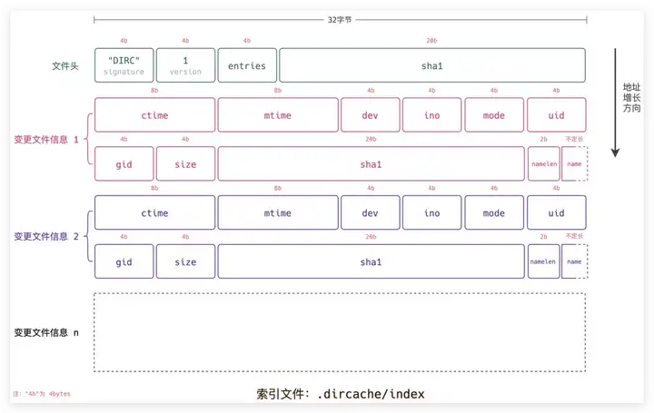

# Git的介绍 & 配置

## *版本控制*

### 版本控制术语和概念

1. Codeline/Branch： Codeline是指软件开发过程中的一个代码分支或线路，它代表了软件的一个特定版本或变体。通常，在软件开发过程中，为了满足不同的需求或开发不同的功能，开发团队可能会创建多个并行的代码线。每个Codeline可能包含了特定的功能、修复或其他改动。例如，一个Codeline可以代表一个主要版本（如v1.0）、一个开发版本（dev）、一个修复分支（hotfix）等。
2. Baseline： Baseline是指在软件开发过程中的一个重要时间点或里程碑，用于标记一个Codeline在特定时间的状态。当软件开发到达一个稳定的阶段，或者需要进行发布或测试时，开发团队通常会将当前的Codeline标记为一个Baseline。Baseline可以看作是一个特定时刻的快照，它具有确定性，即在同一个Baseline下的代码和配置是一致的，能够被准确地复现和部署。
3. Mainline： Mainline是指软件开发中的主要代码线路或主要分支，它通常是整个开发过程中的核心分支。Mainline包含了主要的功能和改动，并且经常用于集成不同开发者的代码。Mainline通常是一个稳定的Codeline，它作为整个开发团队的主要代码库，用于构建软件的最新版本。

### 版本控制工具分类

* 集中式版本管理系统：版本库是几种放在中央服务器的，而工作的时候要先从中央服务器拉取最新版本，然后工作完成后再push到中央服务器。集中式版本控制系统必须要联网才能工作，对网络带宽要求较高
  * [Subversion](www.subversion.apache.org): open source, still widely used
  * [Perforce](https://www.perforce.com): proprietary, mostly enterprise use
  * [Concurrent Versions Systems (CVS)](https://www.nongnu.org/cvs/) – open source, no longer recommended for new projects

* 分布式版本控制系统：没有中央服务器，每个人本地就有一个完整的版本库
  * [Git](https://git-scm.com): open source, one of the most popular DVCS
  * [Mercurial](www.mercurial-scm.org): open source
  * [Darcs](http://darcs.net): darcs.net – open source
  * [BitKeeper](http://www.bitkeeper.org): started proprietary, now open source, influenced creation of Git

## *git配置*

### git的设置

`git config`: Git 是一个 [高度可定制的](https://git-scm.com/docs/git-config) 工具。可以通过 `git config -l` 来查看设置列表

可以通过 `git config --unset` 来重制当前仓库的设置

`git config --global` 来设置当前host的全部仓库

```bash
git config --global user.name "Weijian Feng"
git config --global user.email "wj.feng@tum.de"
# 将 /path/to/private/key 替换为私钥文件的完整路径
git config --global core.sshCommand "ssh -i ~/.ssh/github" 
git config --global core.editor vim
git config --global init.defaultBranch main
```

### alias


# Git源代码

## *源代码的下载 & 编译*

### 准备代码

 ```cmd
 # clone Git 源码
 git clone https://github.com/git/git.git
 cd git
 
 git log --reverse # 查找第一个commit id
 git checkout e83c5163316f89bfbde7d9ab23ca2e25604af290 # 切换到第一次提交
 ```

### 编译

* 需要先安装两个用到的哈希库

  ```cmd
  sudo apt install zlib1g-dev
  sudo apt install libssl-dev
  ```

* 需要修改Makefile

  ```makefile
  LIBS= -lssl -lz -lcrypto
  ```

笔者编译的时候有出现multi-definition的问题，根据这篇帖子 https://www.reddit.com/r/C_Programming/comments/101il4b/multiple_definition_errors_when_compiling_the/?rdt=58190 增加了一个gcc 的 -fcommon flag 来解决

### 源码文件


```
$ tree -h
.
├── [2.4K]  cache.h                     # 公共头文件
├── [ 503]  cat-file.c                  # 查看objects文件
├── [4.0K]  commit-tree.c               # 提交tree
├── [1.2K]  init-db.c                   # 初始化仓库
├── [ 970]  Makefile
├── [5.5K]  read-cache.c                # 读取当前索引文件内容
├── [8.2K]  README
├── [ 986]  read-tree.c                 # 读取tree
├── [2.0K]  show-diff.c                 # 查看diff内容
├── [5.3K]  update-cache.c              # 添加文件或目录
└── [1.4K]  write-tree.c                # 写入到tree
```

## *工具库介绍*

### `<openssl/sha.h>`

`<openssl/sha.h>` 是 OpenSSL 库中用于处理安全哈希算法的头文件。下面是一些在该头文件中定义的主要接口：

* `SHA_CTX`：结构体，表示 SHA 算法的上下文。它包含了 SHA 算法所需的状态信息

  ```c
  #  define SHA_LBLOCK      16
  typedef struct SHAstate_st {
      SHA_LONG h0, h1, h2, h3, h4; // 这些字段存储了 SHA 算法中的中间哈希结果，表示消息摘要的部分值
      SHA_LONG Nl, Nh;             // 这两个字段用于存储消息长度，以比特为单位。由于 SHA 算法是基于比特的，因此对于大型消息块，需要使用这两个字段来对消息长度进行追踪
      SHA_LONG data[SHA_LBLOCK];   // 大小为 SHA_LBLOCK 的数组，用于存储待处理的数据块
      unsigned int num;            // 此字段用于记录 data 中当前存储的字节数量，以便在处理数据时进行跟踪和控制
  } SHA_CTX;
  ```

* `SHA1_Init`：用于初始化 SHA-1 哈希计算的上下文

  ```c
  int SHA1_Init(SHA_CTX *c);
  ```

* `SHA1_Update`：用于更新 SHA-1 哈希计算上下文，以便计算数据的哈希值。可以多次调用此函数来将更多数据添加到哈希计算中

  ```c
  SHA1_Update(SHA_CTX *c, const void *data, size_t len);
  ```

  * `data`：指向要添加到哈希计算中的数据的指针
  * `len`：表示数据的长度
  * 成功计算出了哈希值，返回 1；否则，返回 0

* `SHA1_Final`：用于完成 SHA-1 哈希计算并获取最终的哈希值

  ```c
  int SHA1_Final(unsigned char *md, SHA_CTX *c);
  ```

  * md 是输出型参数，即最后输出的SHA1值
  * 成功计算出了哈希值，返回 1；否则，返回 0

### `<zlib.h>`

`zlib.h` 是用于数据压缩和解压缩的 C 语言库头文件。下面是一些 `zlib.h` 中定义的主要接口：

* 压缩

  * `deflateInit(strm, level)` 宏：用于初始化压缩器

  * `deflate`：用于执行压缩操作，它可以被多次调用以压缩一个输入流

    ```c
    int deflate(z_streamp strm, int flush);
    ```

  * `deflateEnd`：用于结束压缩工作并释放相关资源

    ```c
    int deflateEnd(z_streamp strm);
    ```

* 解压缩

  * `inflateInit(strm)`宏：用于初始化解压缩器

  * `inflate`：用于执行解压缩操作，也可以被多次调用来解压一个输入流

    ```c
    int inflate(z_streamp strm, int flush);
    ```

  * `inflateEnd`：用于结束解压缩工作并释放相关资源

    ```c
    int inflateEnd(z_streamp strm);
    ```

## *Git的设计原理*

Git 设计了三种对象


* blob 二进制压缩文件对象：保存着文件快照
* tree 目录树对象：记录着目录结构和 blob 对象索引，根据index生成
* commit 提交对象：包含着指向前述 tree 对象的指针、日志和所有提交信息
* tag 标签对象：在Git的第一次commit中没有这个对象，是之后的Git版本引入的

### 三个区域


* 工作区 working directory：放需要管理的代码和文件的目录
* 暂存区 stage area/index：一般放在 `.git` 目录下的index文件中
* 版本库 commit history / 本地库 Repository (locally)：`.git` 这个隐藏目录被称为Git的版本库
* 远程库 remote repository：远端的代码托管仓库，不是必须的

### init-db / git init

```cmd
$ ./init-db
$ cd .dircache
$ tree
.
└── objects
    ├── 00
    ├── 01
    ├── 02
    ├── ~~   
    ├── fe
    ├── ff
```

创建一个 `.dircache/` 作为Git的工作目录，也就是我们现在所熟知的新版本的Git工作目录 `.git/`。为了不引起混淆，笔者在源码笔记部分用的都是`.dircache/`

在 `.dircache/objects` 中创建了从 00 ~ ff 共256个目录

### Object

Object是git管理的最基本的单元，用来存储上面说的三个对象，即blob、tree和commit

Objects文件的存储目录默认为 `.dircache/objects`，也可以通过环境变量 `SHA1_FILE_DIRECTORY` 指定。每一个被git管理的文件都会计算出一个SHA1值然后压缩放置于 `.dircache/objects` 目录中

## *update-cache / git add*

### 索引文件

索引文件默认路径为 `.dircache/index`。Git中由Cache相关的接口来操作，它的数据结构定义在 cache.h 中

```c
#define CACHE_SIGNATURE 0x44495243	/* "DIRC" */
struct cache_header {
	unsigned int signature; // 固定值 DIRC
	unsigned int version;   
	unsigned int entries;   // 索引文件中条目的数量，可能有多条entries
	unsigned char sha1[20]; // 索引文件的 SHA-1 校验和值
};

/*
 * The "cache_time" is just the low 32 bits of the
 * time. It doesn't matter if it overflows - we only
 * check it for equality in the 32 bits we save.
 */
struct cache_time {
	unsigned int sec;
	unsigned int nsec;
};

/*
 * dev/ino/uid/gid/size are also just tracked to the low 32 bits
 * Again - this is just a (very strong in practice) heuristic that
 * the inode hasn't changed.
 */
struct cache_entry {
	struct cache_time ctime;
	struct cache_time mtime;
	unsigned int st_dev;
	unsigned int st_ino;
	unsigned int st_mode;
	unsigned int st_uid;
	unsigned int st_gid;
	unsigned int st_size;
	unsigned char sha1[20];
	unsigned short namelen;
	unsigned char name[0];
};
```

index用来存储变更文件的相关信息，当运行 update-cache 时会添加变更文件的信息到索引文件中

同时也有一个叫 `.dircache/index.lock` 的文件，该文件存在时表示当前工作区被锁定，无法进行提交操作

如果是刚初始化的仓库，会自动创建索引文件

```cmd
$ echo test > test.file
$ ./update-cache test.file
$ hexdump -C .dircache/index
00000000  43 52 49 44 01 00 00 00  01 00 00 00 3b d9 04 0e  |CRID........;...|
00000010  86 ca 84 6a 79 8b 20 36  1d d3 16 e0 d2 a3 10 e9  |...jy. 6........|
00000020  3b 84 2c 66 7e 58 b4 30  3b 84 2c 66 7e 58 b4 30  |;.,f~X.0;.,f~X.0|
00000030  03 fc 00 00 68 54 12 00  b4 81 00 00 e8 03 00 00  |....hT..........|
00000040  e8 03 00 00 05 00 00 00  00 ba 0d 99 f6 11 90 b9  |................|
00000050  19 31 db 0f b8 67 8d 5c  e2 ef b0 b8 09 00 74 65  |.1...g.\......te|
00000060  73 74 2e 66 69 6c 65 00                           |st.file.|
00000068
```



其中文件头cache_header为固定的32字节，后面的cache_entry条目的数量则是随着git管理的文件数不断增加的

### 向object文件夹中添加对象

文件路径和名称根据SHA1值决定，取SHA1值的第一个字节的hex值为目录，其他字节的hex值为名称，比如若SHA1值为：00ba0d99f61190b91931db0fb8678d5ce2efb0b8，则其对象文件存储路径为：
`.dircache/objects/00/ba0d99f61190b91931db0fb8678d5ce2efb0b8`

> 问：为什么 .dircache/objects/ 目录下面要以 shal 值前一个字节的 hex 值作为子目录？
>
> 答：ext3 文件系统下，一个目录下只能有32000个一级子文件，如果都把 objects 文件存储到一个 git/objects/ 目录里，很大概率会达到上限。同时要是一个目录下面子文件太多，那文件查找效率会降低很多

可以用cat-file用查看某个SHA1值的objects文件属于什么类型的文件

```cmd
$ ./cat-file 00ba0d99f61190b91931db0fb8678d5ce2efb0b8
temp_git_file_TAU7Am: blob
```

### 暂存区原理

Git追踪管理的是修改，而不是文件。Git 处理snapshot场景的方法是使用一种叫做 **staging area 暂存区（其实就是index 索引）**的机制，它允许用户指定下次快照中要包括那些改动

update-cache 用于将文件添加到仓库中，并将记录写入staging index，从而在暂存区索引文件实现文件的查找、添加和删除操作

* `read_cache()` 读取、解析并判断索引文件的合法性 ：.dircache/index

* `add_file_to_cache()` 遍历多个文件，读取并生成变更文件信息（文件名称、文件内容SHA1值、日期、大小等），写入到索引文件中

  * `index_fd()`：对文件进行压缩和计算整个index文件的SHA-1校验和，中间会构造blob对象。并将结果写入索引头

    blob 对象用于存储变更文件内容，其实就代表一个变更文件快照。blob 对象是被拼装并压缩而成

    

    * `write_sha1_buffer()`

  * `add_cache_entry()`：构造并压缩cache entry，如果已经有了就直接替换。将文件添加到缓存中

* `write_cache()` 遍历多个文件，读取并压缩变更文件，存储到objects文件中，该文件为blob对象

## *树操作*

树操作就是本地仓库

### write-tree

tree 对象用于存储多个提交文件的信息


### commit-tree

commit-tree 会生成 commit 对象

commit 对象存储一次提交的信息，包括所在的tree信息，parent信息以及提交的作者等信息


## *辅助功能*

### cat-file

cat-file.c用于根据 shal 值从版本库中找到相应的二进制数据文件（blob/tree/commitQ），解压缩得到原始数据并保存到一个临时文
件中。

### read-tree

### show-diff

查看工作区和暂存区的文件差异

## *现代Git的一些新特性*

### .git中内容的变化


上图是一个现代git库在init之后的内容，相比之前多了下面的东西

* HAED就是一个 commit id

### 对象和内存寻址

Git 中对象根据内容地址寻址，在储存数据时，所有的对象都会基于它们的SHA1哈希值进行寻址

Blobs、Tree和Commit都一样，它们都是对象。当它们引用其他对象时，它们并没有真正的在硬盘上保存这些对象，而是仅仅保存了它们的哈希值作为引用

但是哈希值是记不住了，所以要给他们起别名，也就是建立一个用string表示的reference 引用。**和C++不同，这里reference应该被理解为指针**（下面笔者也将统一将reference称呼为指针），它可以不断变动指向不同的哈希值（或者说commit）。这样，Git 就可以使用诸如 “master” 这样人类可读的名称来表示历史记录中某个特定的提交，而不需要在使用一长串十六进制字符了

```python
references = map<string, string>

def update_reference(name, id):
    references[name] = id

def read_reference(name):
    return references[name]

def load_reference(name_or_id):
    if name_or_id in references:
        return load(references[name_or_id])
    else:
        return load(name_or_id)
```

git的分支实质上仅是包含所指对象的SHA-1校验和文件，所以它的创建和销毁都很快。创建一个新分支就相当于往一个文件中写了41个字节

### Reference

Git 支持三种引用/指针类型，不同的指针类型对应的引用文件各自存储在 `.git/refs/` 下的不同子目录中

* HEAD 指针：当前的位置特殊的索引称为 HEAD
* 标签指针：origin一般用作本地对remote repository的名称，它是 `git clone` 时的默认remote库名称，可以 `git clone [-o RemoteName] ` 换一个名字
* 远程指针：本地 `git init` 时的默认branch名称是master。因此对远程库的本地branch名称是，`<remote>/<branch>`，即origin/master

# 分区 & 分支操作

`git help <command>`: 获取 git 命令的帮助信息

## *分区操作*


### 添加到分区

* `git init`: 创建一个新的 git 仓库，其数据会存放在一个名为 `.git` 的目录下
* `git status`: 显示当前的仓库状态
* `git add <filename>`: 添加文件到暂存区
* `git commit -m "YOUR COMMIT"`：创建一个新的commit，放到本地的repository中
  * `git commit --amend -m "YOUR NEW COMMIT"`：修改上一次的commit信息
* `git push`：push到远端库
* `git fetch`：将远程主机的最新内容拉到本地，用户在检查了以后决定是否合并到工作本机分支中
* `git pull`：将远程主机的最新内容拉下来后直接合并，即 `git pull = git fetch + git merge`
* `git diff <filename>`：显示与暂存区文件的差异
* `git diff <revision> <filename>`：显示某个文件两个版本之间的差异
* `git branch -d <branch-name>`：删除一个本地 Git 分支

### 将删除操作记录到暂存区

`git rm` 的作用是从工作区中删除文件，并将这次删除操作提交到暂存区。这意味着这些文件将不再被跟踪，在下一次提交时，这些文件将不会出现在版本库中

如果想要删除多个文件，可以使用通配符或者手动指定每个文件的路径来一次性删除多个文件，也可以构造一个命令列表来进行批量删除

比方说用通配符批量删除特定模式的文件

```cmd
git rm '*.log'
```

* `git rm` 要删除的文件是没有修改过的，就是说和当前版本库文件的内容相同，否则就要使用 `git rm -f`

* `git rm --cached` 用于从暂存区中移除文件，但不会从工作目录中删除该文件。换句话说，它用于停止追踪某个文件，而不会实际删除这个文件的物理副本

  这个命令还是很使用的，比如说下面的场景

  * 当意外地将一个不应该提交到仓库的文件添加到了暂存区（例如敏感配置文件、编译生成的二进制文件等），并且想要撤销这个操作，可以使用 `git rm --cached` 来移除该文件的跟踪状态，然后通常会将其加入`.gitignore`文件以防未来误提交
  * 调整 `.gitignore` 文件后，需要清理当前暂存区中已跟踪但是现在应该被忽略的文件

### 日志

* `git log`：显示历史日志
* `git log --all --graph --decorate`：可视化历史记录（有向无环图）

## *分支介绍*

### 分支的本质

在第一个Git的commit中没有分支的概念

但其实分支的实现非常简单，仅仅只是在产生多次commit之后，切换不同的commit对象（即commit id）就可以了


### 查看分支

移动HEAD指针来指向不同的分支指针，分支指针再指向不同的commit ID。**分支指针都放在 `.git/refs` 下面**，分成了本地的heads和远端的remotes，还有打的tags

注意：在新建branch的时候是在当时的分支上进行了一次commit，即

```
--------+-----+-----+----------+-----+------+          Main Branch      
Last commit before new branch<-|     |->new commit due to new branch    
                                     |
                                     |------+          New Branch
```

* `git branch`：显示本地分支，`git branch -r` 查看远端分支。`git branch --set-upstream-to=origin/master`
  * `git branch <name>`: 创建分支
  * `git branch -d <BranchName>` 删除某条分支，注意删除某条分支的时候必须先切换到其他的分支上

## *切换分支*

### checkout 检出

* `git checkout <branch>`：切换到特定的分支

* `git checkout -b <name>`：基于当前所在分支创建分支并切换到该分支。相当于 `git branch <name>; git checkout <name>`

* checkout的使用前提：要保证当前分支上没有未提交的更改。如果有未commit的更改，需要先comimt它们，或者将它们暂存起来，即使用 `git stash` 将它们储藏起来，否则Git不允许切换分支以防止潜在的冲突。如果只是恢复文件，那么未提交的其他文件变动不会影响checkout操作

  否则就会报下面的错误

  ```
  error: Your local changes to the following files would be overwritten by checkout:
  	>>>>>>>>>>>> some changed files
  Please commit your changes or stash them before you switch branches.
  Aborting
  ```

### switch

### 在分支间复制文件

[git 从别的分支复制文件或目录 | Yunfeng's Simple Blog (vra.github.io)](https://vra.github.io/2021/09/25/git-copy-from-another-branch/)

当前是位于要复制文件到的分支，别忘了欲复制文件所在的文件如果是一个远程分支的话要加上origin/

```cmd
git checkout <欲复制文件所在的文件> -- <文件或目录>
```

## *stash*

### stash暂存文件的情景

stash暂存未commit的内容：临时保存（或“暂存”）当前工作目录和索引（即暂存区）的修改状态，以便可以在一个干净的工作基础上切换分支或者做其他操作。这是一个非常有用的工具，尤其是当不想通过提交就保存当前进度的时候。比如说下面的场景

* 当我们在本地修改了代码，然后想使用git pull下拉远程代码，为了避免冲突，可以使用git stash存储本地的修改
* 当我们在开发分支修改了代码，但是还不想commit，此时项目的某个分支上有一个bug需要立马去解决，可以使用git stash保存本
  分支的修改，然后在bug分支修复bug之后重新回到开发分支，还原工作场景

### 基本stash操作

```cmd
git stash
git stash save "Your stash message" # 等价于 等价于 git stash
git stash list                      # 列出所有暂存的进度
git stash apply                     # 应用某个存储，但不会把存储从存储列表中删除，默认使用第一个存储,即stash@{0}
git stash pop        # 命令恢复之前缓存的工作目录，将缓存堆栈中的对应stash删除，并将对应修改应用到当前的工作目录下，默认为第一个stash，即stash@{0}
git stash drop                      # 删除最近的暂存进度
git stash clear                     # 清空栈中所有的暂存进度，使用这个命令一定要慎重
```

从Git 2.23版本开始，Git引入了新的`git switch`和`git restore`命令，以提供更符合直觉的方式来分别处理分支切换和文件恢复的行为

### 多次stash的栈原理

多次stash是一种栈操作，index小的位于栈顶

```
stash@{index}: WIP on [分支名]: [最近一次的commitID] [最近一次的提交信息]
```

WIP, Work In Progess，index用于后面取出所对应储藏的修改

```cmd
git stash apply stash@{index}  # 应用特定index的暂存进度
git stash drop stash@{index}   # 将指定index的储藏从储藏记录列表中删除
git stash branch <branchname> stash@{n} # 创建一个新的分支并应用某个暂存进度，这条命令很好用，如果有冲突的话需要手动解决
# 但是如果同名的远端branch已经存在的话建议不要用，因为会创建一个同名的本地分支，而stash的内容会覆盖branch上同名的文件，而远端的内容可能是不一样的
```


[how does stashing work in git - internals - Stack Overflow](https://stackoverflow.com/questions/18527171/how-does-stashing-work-in-git-internals)

[Git Stash用法总结 - 张小凯的博客 (jasonkayzk.github.io)](https://jasonkayzk.github.io/2020/05/03/Git-Stash用法总结/)

[git（四）之分支之间的stash_分支如何 git stash-CSDN博客](https://blog.csdn.net/LS7011846/article/details/90576413)

## *回滚*

### checkout的时候发生了什么

checkout分支的时候，git做了这么三件事情

1. 将HEAD指向那个分支的最后一次commit
2. 将HEAD指向的commit里所有文件的snapshot替换掉Index区域里原来的内容
3. 将Index区域里的内容填充到Working Directory里

### Commit Level

```
                         head    index   work dir  wd safe
Commit Level
reset --soft [commit]    REF     NO      NO        YES
reset [commit]           REF     YES     NO        YES
reset --hard [commit]    REF     YES     YES       NO
checkout [commit]        HEAD    YES     YES       YES

File Level
reset (commit) [file]    NO      YES     NO        YES
checkout (commit) [file] NO      YES     YES       NO
```

head一列中的REF表示该命令移动了HEAD指向的分支引用所指向的位置，而HEAD则表示只移动了HEAD自身，NO则表示不会移动HEAD或HEAD指向的分支。 wd safe (workdir safe) 一列中，YES表示不会覆盖在workspace的修改，NO代表会覆盖在workspace的修改

* reset

  * `git reset [--soft | --mixed | --hard]`：三个不同的参数实际上就决定上面checkout运行到那个步骤。**当不指定branch的时候，默认是 `HEAD^`，即上一次comimt**

    * `--soft`：只移动HEAD，对于工作区和暂存区的内容都不变，只是将版本库回退到某个指定版本
    * `--mixed`：为**默认选项**，使用时可以不用带该参数。该参数将暂存区的内容退回为指定提交版本内容，工作区文件保持不变
    * `--hard`：将暂存区与工作区都退回到指定版本。**切记工作区有修改过的，但未提交的代码时不要用这个命令**，因为工作区会回滚，没有commit的代码就再也找不回了，所以使用该参数前一定要慎重

    ```
    working index HEAD target         working index HEAD
    ----------------------------------------------------
      A       B     C    D     --soft   A       B     D
                               --mixed  A       D     D
                               --hard   D       D     D
                               --merge (disallowed)
    ```

    target代表想要reset到哪个commit

  * 当指定了commit id或者branch时，表示指定退回的版本

    * 一般会使用HEAD来替代：HEAD 表示当前版本，`HEAD^` 上一个版本，`HEAD^^` 上上一个版本，以此类推。也可以使用 `~数字` 来替代，比如 `HEAD~0` 表示当前版本，`HEAD~1` 为上一个版本，依次类推

    * 向前回滚了之后如何向后回滚？ `git reset` 提供了后悔药，它是可以来回双向rollback的，可以使用**reflog**来查看commit ID

* `git checkout [commit]` 和 `git reset --hard` 的区别在于

  * checkout不会修改工作区中修改了但没有commit的内容，而reset则会全部覆盖

  * checkout branch不会移动当前分支的指向，而reset会移动到ref [git rm命令 & git reset和checkout区别 - kongbursi - 博客园 (cnblogs.com)](https://www.cnblogs.com/kongbursi-2292702937/p/15020513.html)

    

### File Level

* 如果`git reset <file>` 指定了某个具体的文件，那么作用如下，相当于unstage了这个文件，或者说reset到当前的HEAD上。需要注意的是带文件参数的git reset没有 `--hard, --soft` 这两个参数，只有 `--mixed` 参数

  * HEAD不会动
  * 将那个commit的snapshot里的那个文件放到Index区域中

* `git checkout -- <file>`：丢弃工作区的所有修改，让工作区中的文件回到最近一次commit时的状态

  `git checkout -- 文件名` 命令中的 `--` 表示命令行在 `--` 之后没有更多的选项。这样的好处是，**如果碰巧有一个分支与文件名重名**，仍然可以恢复该文件，而不是切换到同名的分支

  ```cmd
  git chekcout <commit-hash> -- . # 还原全部文件到某个特定的提交
  ```

### restore

对于 File Level 的回滚操作，其实使用restore更加合适。`git restore`：git 2.32版本后取代git reset 进行许多撤销操作

* `git restore <file>`：丢弃工作目录中的文件更改，使其恢复为最近一次提交时的状态
* `git restore --source=<commit> <file>`： 将指定文件恢复到指定提交时的状态
* `git restore --staged --worktree <file>`：默认情况下 `git restore` 只影响工作目录，如果想要将暂存区或工作目录的文件恢复到工作目录中，同时保持最近一次提交时的状态，就要加上 `--staged --worktree`

reset和restore的区别主要在于

* `git reset` 主要用于更改当前分支的 HEAD 指向，可以用来重置暂存区和工作目录，以及移动分支的指向
* `git restore` 用于丢弃本地修改，将文件恢复到暂存区域或提交时的状态。它可以还原暂存区或工作目录中的文件，但不会更改 HEAD

总的来说，`git reset` 更多地涉及分支管理和提交历史的变更，而 `git restore` 则更专注于恢复文件状态到之前的快照

### git revert


`git reset` 是会**修改**版本历史的，它会丢弃掉一些版本历史

而 `git revert` 是根据那个commit逆向生成一个新的commit，版本历史是不会被破坏的

如果已经push到远程库还想回退，那么只能使用revert

### 不同的场景

应用场景：撤销回滚的目的是为了防止自己写的代码影响到远程库这个公共空间中的代码

* 还没有add到暂存区
  * `git checkout -- <file>`，注意一定要带上 `--`，否则checkout就是用来对branch进行操作的
  * `git reset --hard file`
* 已经add到暂存区，但还没有commit到版本库中：`git reset [--mixed ｜ --hard] file`
* 已经commit到版本库中：前提是没有push到远程库 `git reset --hard file`

# 合并分支

## *分支合并 & 合并冲突的解决*

### 合并分支

* `git merge <revision>`：合并到当前分支
* `git mergetool`: 使用工具来处理合并冲突
* `git rebase <basename> <topic_name>`: 将一系列补丁 topic_name 变基 rebase 到新的基线 basename

### 关于合并冲突的问题

合并冲突模式

* Fast-forward：看不出来是否有创建分支并merge，看起来就像是直接在当前分支上修改的，可以通过 `git merge [--no-ff -m "提提交信息"] <branch>` 来不使用fast-forward模式来merge，注意 -m 是一定要写的
* No-ff 非fast-forward：可以看出来有没有经过merge

```
<<<<<<< HEAD
当前分支的内容
=======
其他分支上发生冲突的内容
>>>>>>>
```

解决冲突的方式是把不需要的代码全部删除，**包括尖括号提示符和 `=======`**

merge冲突需要手动解决，并且**merge后一定要再进行一次commit**。HEAD会指向merge的新提交，但被merge的分支仍然会指向自己原来的commit

```
*   commit 1f7605d4cf4e180c21b693f2aed0f945611fa33b (HEAD -> main)
|\  Merge: 27b9c7b 4dcd274
| | Author: wjfeng <wj.feng@tum.de>
| | Date:   Sat Jun 17 16:36:45 2023 +0200
| |
| |     main branch conflict fixed
| |
| * commit 4dcd27411054788c7030e7936d62ebb1ca2a3247
| | Author: wjfeng <wj.feng@tum.de>
| | Date:   Sat Jun 17 16:33:19 2023 +0200
| |
| |     test branch on dev
| |
* | commit 27b9c7bbc515a114af67ce45c5fa86d0e5591765
|/  Author: wjfeng <wj.feng@tum.de>
|   Date:   Sat Jun 17 16:34:25 2023 +0200
|
```

从main上创建了一条新的branch后，若main上没有新的commit或者没有冲突就可以直接fast-forward merge

### 分支管理的原则

* master/main：稳定分支，用来发布新版本。不允许直接修改这个分支
* dev：不稳定的开发分支，用来开发新功能。等测试完毕后再merge到master分支
* 用 `git stash` 命令将当前工作区已经add（被git追踪了）但是还没有commit的内容存起来，会放在 `.git//refs/stash` 临时存储区中，将来可以被恢复。不能把没有add的文件stash
* 可以通过 `git stash list` 来查看临时存储区的内容

将代码merge到master中的好习惯是：**在master上merge完修复好的bug后，先切换到dev上merge master，再切换到master上merge dev**。而不是在master上merge dev。在merge的过程中也有可能因为一些误操作（少merge多merge了一行）等原因而出错，因此若直接在master上merge dev出bug了，master分支会受到直接的影响，而在dev上merge master，就算出错影响的也只是dev

## *rebase vs. merge*

[https://vue3js.cn/interview/git/git%20rebase_%20git%20merge.html#二、分析](https://vue3js.cn/interview/git/git%20rebase_%20git%20merge.html#二、分析)

### merge


merge 过程还是很直观的，且 merge 是一种非破坏性的操作，对现有分支不会以任何方式被更改，保留了完整不过可能会比较复杂的历史记录

### rebase


1. rebase 会找到不同的分支的最近共同祖先，比如说上面的 B
2. 然后对比当前分支相对于该祖先的历次提交，提取相应的修改并存为临时文件。注意⚠️：老的提交 X 和 Y 也没有被销毁，只是单纯地不能再被访问或者使用了
3. 然后临时文件向前移动的时候如果发生冲突就需要解决冲突
4. rebase 之后，master 的 HEAD 位置不变。因此要合并 master 分支和 bugfix 分支

rebase有以下优势

1. **线性提交历史**：rebase操作会将当前分支的提交移到目标分支的最后面，从而使提交历史更加线性清晰
2. **减少合并提交**：rebase会避免创建额外的合并提交，使提交历史更加整洁

## *cherry-pick*

[git cherry-pick 教程 - 阮一峰的网络日志 (ruanyifeng.com)](https://www.ruanyifeng.com/blog/2020/04/git-cherry-pick.html)


有这么一个场景：分支feature2是基于分支feature1在很久前拉出来的，feature1已经先合入了dev，此时如果想要把feature2也合入dev就可能会有很多冲突（也需要很多审阅者lol），此时可以从dev单独拉一条分支出来，然后把需要的commit全部cherry-pick进新拉的分支


`git cherry-pick` 是一个 Git 命令，它允许你挑选并应用某个分支上的一个或多个特定提交到当前分支。使用这个命令时，你可以将一个分支中的修正、特性或改动“复制”到另一个分支，而不需要合并整个分支。

### 如何使用

基础命令格式如下：

```cmd
git cherry-pick <commit-hash>
```

其中 `<commit-hash>` 是你想要拾取并应用到当前分支的那个提交的哈希值。

### 选项

`git cherry-pick` 提供了一些有用的选项，以下是其中的几个：

- `-n` 或 `--no-commit`：应用更改但不自动创建提交。这允许你在继续操作（比如合并多个提交）之前编辑更改。
- `-e` 或 `--edit`：在提交的过程中允许编辑提交信息。
- `-x`：在提交信息中追加一行，说明这个提交是通过 `cherry-pick` 操作来的。
- `-s` 或 `--signoff`：为提交添加签名，即添加一行 "Signed-off-by:"。
- `-m <parent-number>` 或 `--mainline <parent-number>`：在拾取一个合并提交时，你必须指定主线，即应该考虑的父提交线路。

### 示例

假设有两个分支，`main` 和 `feature`，你想将 `feature` 分支上的一个提交应用到 `main` 分支。你可以按照以下步骤操作：

1. 首先检出到 `main` 分支：

   ```
   shell复制代码git checkout main
   ```

2. 执行 `cherry-pick` 操作，将特定的提交从 `feature` 分支应用到 `main`：

   ```
   shell复制代码git cherry-pick <commit-hash-from-feature-branch>
   ```

如果成功，那么 `feature` 分支上的那个特定提交就被引入了 `main` 分支，并且会创建一个新的提交。

### 注意事项

- 当你执行 `cherry-pick` 时，可能会遇到冲突。此时，像处理普通合并冲突一样解决它们，然后继续完成 `cherry-pick` 操作。
- `cherry-pick` 不是用来替代合并（`merge`）或变基（`rebase`）的。在选择使用它之前，请考虑你的版本控制策略是否真的需要这种类型的操作，因为它可以导致历史记录变得复杂


## *远程库*

### 远端操作

远端merge有两种方法，一种是在本地merge后push到远端，另一种是使用Pull request，Pull requset是给仓库管理员看的合并请求，实际开发中推荐使用PR

当用户在自己的分支上进行代码修改后，用户可以向主项目（或主分支）提交一个pull request。这相当于提议将用户的代码更改合并到主项目中。Pull request允许其他开发者对用户的代码进行审查、提出修改建议或进行讨论。通过pull request，团队成员可以共同讨论代码变更、解决问题并确保代码质量

**从远程仓库克隆后，Git会自动把本地的master分支和远程的master分支连接起来，并且远程仓库的默认名称是origin**

创建远端分支有两种方法，要么直接在远程库手动创建，要么在本地push一个新的分支。**绝对禁止直接在远程库中修改代码，必须是在本地修改后将改变push到远程库**

* `git clone`：从远端下载仓库

* `git remote -v`：列出远端

* `git remote add <name> <url>`：**添加一个远端**，其中 `<name>` 一般就是origin

* `git push <remote repo> <local branch>:<remote branch>`：将本地的某一个分支传送至远端的某一个分支并更新远端引用

  若本地分支和远程分支同名，可以将 `git push origin master:master` 省略冒号成 `git push origin master`

* `git fetch`：从远端获取对象/索引，`git fetch` 是用来获取远端的更新，不会将远端代码pull到本地

* `git pull <remote repo> <remote branch>:<local branch>`：相当于 `git fetch + git merge`

  若是要让远程分支与当前分支合并，可以省略冒号后的内容

### 本地库与远端库的连接关系

可以通过 `git branch -vv` 来查看本地库与远程库的连接关系

常用情景：**拉取一个本地不存在的新的远程分支到本地成为一个新的分支** `git checkout -b <local-branch> origin/<remote-branch>`，通过这个命令可以自动建立本地与远程的分支连接，这样以后就可以直接用短命令 `git push` 了

但是若没有使用 `git checkout -b <local-branch> origin/<remote-branch>`，或者说忘记打后半部分了导致没有建立连接关系也不用紧，还可以使用`git branch --set-upstream-to=<remote>/<remote branch>` 来创建本地和远端分支的关联关系

### Detached HEAD

当用户在 Git 中切换到一个特定的commit，而不是分支时， HEAD 引用会进入 detached HEAD 状态。这种状态下的提交可能会更加容易丢失，因此在进行任何修改之前，应谨慎考虑并理解当前所处的状态

在 detached HEAD 状态下，HEAD 直接指向一个具体的提交，而不是一个具名的分支。这意味着当前不再位于任何分支的最新提交上

当用户处于 detached HEAD 状态时，用户可以查看提交的内容，甚至进行修改和提交新的更改，但这些更改将不会与任何分支相关联。若在 detached HEAD 状态下进行提交，这些提交可能会很难恢复，因为没有分支引用指向它们

Detached HEAD 状态通常发生在以下几种情况下

1. 使用 `git checkout` 命令切换到特定的提交，而不是分支名称
2. 使用 `git checkout` 命令切换到一个 tag
3. 使用 `git checkout` 命令切换到一个远程分支的具体提交

要解决detached HEAD状态，可以执行以下操作之一

1. 若是意外进入了detached HEAD状态，但没有进行任何修改，可以直接通过运行 `git switch -` 或 `git checkout -` 返回到之前所在的分支
2. 若是在detached HEAD状态下进行了修改，并且希望将这些更改与一个新的分支关联起来，可以使用 `git branch <new-branch-name>` 来创建一个新的分支，然后使用 `git switch <new-branch-name>` 切换到新的分支，并commit更改

### 清理本地的废弃分支

`git remote prune origin` 命令的作用是清理掉那些在远程仓库中已经被删除但在本地仍然存在的远程跟踪分支。该命令有助于保持你的本地仓库整洁和最新状态，防止混淆和错误操作老旧的分支当远程仓库中的一个分支被删除后，本地仓库不会自动删除对应的远程跟踪分支（即通常以 `origin/branch-name` 形式出现的分支）。这可能导致本地仓库的引用列表与实际的远程仓库状态不一致

使用 `git remote prune origin` 时，Git 会检查远程仓库的当前状态，并删除本地仓库中所有已不存在于远程的对应分支

这个命令通常在以下情形中非常有用：

1. 当团队成员删除了远程仓库的一个分支，而你想要同步这个变化到你的本地仓库
2. 当正在进行代码库的清理工作，并希望删除那些无效的远程跟踪分支

# 组织大型工程的git工具

## *子模块*

Git Submodule 是一个将其他 Git 仓库作为子目录嵌入到当前 Git 仓库中的功能。如果项目依赖于第三方代码或者其他组件，可以使用 submodule 来管理这些外部资源

### 添加 Submodule

1. **添加新的submodule**：要在你的项目中添加新的 submodule，你需要使用 `git submodule add` 命令，后面跟着仓库地址和希望将该仓库添加到的路径。

   ```cmd
   git submodule add <repository> <path>
   ```

   例如：

   ```cmd
   git submodule add https://github.com/user/repo.git external/repo
   ```

2. **初始化 submodule**：如果你克隆了一个包含 submodules 的项目，则需要初始化 submodule。

   ```cmd
   git submodule init
   ```

3. **更新 submodule**：初始化之后，使用以下命令更新 submodule，以获取其内容。

   ```cmd
   git submodule update
   ```

### 克隆包含 Submodule 的仓库

**当要克隆一个包含 submodules 的仓库时，submodules 不会自动被克隆**。需要通过下面的命令进行初始化和更新：

```cmd
git clone --recurse-submodules <repository>
```

如果已经克隆了不带 submodules 的仓库，可以执行下面的命令来拉取 submodules：

```cmd
git submodule update --init --recursive
```

### 检出 Submodule 特定版本

如果想要检出 submodule 的特定提交或标签，你需要进入到 submodule 目录中，然后像在普通的 Git 仓库一样切换分支或检出提交：

```cmd
cd <submodule_path>
git checkout <tag_or_branch_or_commit>
```

完成以上操作后，应该在主仓库中做个提交来记录 submodule 的状态更改

### 对所有模块做相同的操作

`git submodule foreach` 能在每一个子模块中运行任意命令。比如说下面的命令 

```cmd
git submodule foreach --recursive git reset --hard
```

### 拉取所有 Submodule 的最新变更

如果想要更新项目中所有submodule到最新提交，可以使用下面的命令：

```cmd
git submodule update --remote
```

这个命令会将每个submodule都更新到它们所跟踪分支（默认是 master）的最新提交

### 提交和推送包含 Submodule 的变更

当在submodule中做了变更并且提交这些变更后，在主仓库也会看到submodule有变更。此时需要在主仓库做一个新的提交以跟踪submodule的新状态

然后，正常地推送主仓库和submodule仓库：

```cmd
git push --recurse-submodules=on-demand
```

这种方式确保同时推送主仓库和submodule的变更

### 删除 Submodule

删除submodule稍微复杂一些，需要几步操作：

1. 删除submodule相关的配置信息：

   ```cmd
   git submodule deinit -f <path_to_submodule>
   git rm -f <path_to_submodule>
   ```

2. 从 `.gitmodules` 文件和 `.git/config` 移除submodule配置

3. 如果需要的话，手动从工作树中删除 submodule 目录：

   ```cmd
   rm -rf .git/modules/<path_to_submodule>
   ```

4. 提交这些变更到主仓库

以上就是Git Submodule的一些基础用法。Submodule能够很好地用于管理和维护项目依赖，但它增加了项目管理的复杂性，尤其是对于新手来说。因此，在开始使用前要仔细考虑是否真的需要它

## *Git Hooks*

https://zhuanlan.zhihu.com/p/149294652

所谓 Hook 就是在执行某个事件之前或之后进行一些其他额外的操作。Git Hooks 允许我们在特定的Git事件（如提交或推送）之前或之后运行脚本，从而实现自动化流程

Git Hooks 的实现其实非常简单，就是在 `.git/hooks`文件下保存了一些 shell 脚本，然后在对应的钩子中执行这些脚本就行了

这些脚本的名字都是有固定名称的，在我们定义后会自动生效。如果Hooks的名字不对就不会生效

完整的Hooks清单：https://git-scm.com/docs/githooks

### Husky

Husky 是一个让配置 Git Hooks 变得更简单的工具
