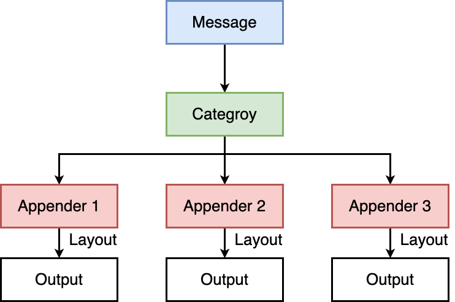

# 手搓一个（cpp）

```c++
#ifndef LOG_H_
#define LOG_H_

#include <cstdarg>
#include <cstdio>
#include <ctime>
#include <iostream>
#include <string>

// 日志是有日志级别的
#define DEBUG 0
#define NORMAL 1
#define WARNING 2
#define ERROR 3
#define FATAL 4

const char *gLevelMap[] = {"DEBUG", "NORMAL", "WARNING", "ERROR", "FATAL"};

#define LOGFILE "./selectServer.log"

// 完整的日志功能，至少: 日志等级 时间 支持用户自定义(日志内容, 文件行，文件名)
void logMessage(int level, const char *format, ...) {
  char stdBuffer[1024];  // 标准部分
  time_t timestamp = time(nullptr);
  // struct tm *localtime = localtime(&timestamp);
  snprintf(stdBuffer, sizeof stdBuffer, "[%s] [%ld] ", gLevelMap[level],
           timestamp);

  char logBuffer[1024];  // 自定义部分
  va_list args;
  va_start(args, format);
  // vprintf(format, args);
  vsnprintf(logBuffer, sizeof logBuffer, format, args);
  va_end(args);

  // FILE *fp = fopen(LOGFILE, "a");
  printf("%s%s\n", stdBuffer, logBuffer);
  // fprintf(fp, "%s%s\n", stdBuffer, logBuffer);
  // fclose(fp);
}

#endif  // LOG_H_
```

# log4cpp

## *介绍*

log4cpp（Log for C++）是一个用于C++编程语言的开源日志记录库，它提供了灵活和高度可配置的日志记录功能。log4cpp的设计灵感来自于Java中的log4j库，它旨在帮助C++开发人员实现高效的日志记录，以便在应用程序中进行调试、跟踪和错误诊断

### 安装

<https://log4cpp.sourceforge.net>

```cmd
$ wget https://nchc.dl.sourceforge.net/project/log4cpp/log4cpp-1.1.x%20%28new%29/log4cpp-1.1/log4cpp-1.1.3.tar.gz
$ tar xzvf log4cpp-1.1.3.tar.gz
$ cd log4cpp
$ ./configure --prefix=${绝对路径}
$ make
$ make check
$ make install
```

## *架构*



### Category

log4cpp有且只有一个root Category，可以有多个子Category，呈现树形结构，子分类的输出同时会输出到父分类中。可以通过不同的Category来记录不同模块的日志

Priority、Additivity、Appender、Layout等属性都是跟Category相关的

### Appender

Appender 主要是用来确定日志输出行为，比方说输出到哪儿，如何输出

Appender类是由Category来加载的，一个Category可以加载多个Appender，输出到多个地方，一个Appender也可以被多个Category加载，但是有些Appender类没有设置互斥，日志的多线程支持主要是在Category里做的处理，因此不要使用一个Appender加载到多个Category中

```c
// 输出到 std::cout
log4cpp::Appender *appender = new log4cpp::OstreamAppender("root", &std::cout);
// 输出到 log 文件
//log4cpp::Appender *appender = new log4cpp::FileAppender("root", "test.log");
```

appender 有以下这些：

* **`log4cpp::FileAppender`：输出到文件**
* **`log4cpp::RollingFileAppender`：输出到回卷文件，即当文件到达某个大小后回卷/回滚**
* `log4cpp::OstreamAppender`：输出到一个 ostream 类
* `log4cpp::RemoteSyslogAppender`：输出到远程 syslog 服务器
* `log4cpp::StringQueueAppender`：内存队列
* `log4cpp::SyslogAppender`：本地 syslog
* `log4cpp::Win32DebugAppender`：发送到缺省系统调试器
* `log4cpp::NTEventLogAppender`：发送到 win 事件日志

我们说过日志输出到终端或者文件中实际上是很慢的，因为会引起IO中断，所以我们可以输出到内存里 StringQueueAppender，然后从 StringQueueAppender 输出到其它地方，这样的话线程执行是比较高效的

### Layout

Layout设置日志输出风格，有BasicLayout、SimpleLayout、PatternLayout，其中BasicLayout，SimpleLayout主要是提供的成型的简单日志风格，实际中基本不会使用，主要是使用PatternLayout对日志做格式输出，Layout是加载到Appender中去的

## *使用*

以下是使用步骤

1. 包含头文件
2. 配置log4cpp
3. 初始化日志输出的目的地（appenders）
4. 设置日志输出的格式
5. 设置输出类别（category）和日志优先级（priority）
6. 定义宏 & 使用宏记录日志

log4cpp既可以使用配置文件来使用，也可以整合进C++代码使用，推荐使用配置文件

### 包含头文件

```c++
#include <log4cpp/Category.hh>
#include <log4cpp/FileAppender.hh>
#include <log4cpp/PatternLayout.hh>
#include <log4cpp/OstreamAppender.hh>
```

### 配置log4cpp

把Logger包装成一个单例

```c++
class Logger {
 public:
  bool init(const std::string &log_conf_file);
  static Logger *instance() { return &instance_; }
  log4cpp::Category *GetHandle() { return category_; }

 protected:
  static Logger instance_;
  log4cpp::Category *category_;
};

Logger Logger::instance_;

bool Logger::init(const std::string &log_conf_file) {
  try {
    log4cpp::PropertyConfigurator::configure(log_conf_file);
  } catch (log4cpp::ConfigureFailure &f) {
    std::cerr << "load log config file" << log_conf_file.c_str()
              << "failed with result : " << f.what() << std::endl;
    return false;
  }

  category_ = &log4cpp::Category::getRoot();
  return true;
}
```

```c++
Logger::instance()->init(std::string("log4cpp.properties");
```

这里 `"log4cpp.properties"` 是一个要用到的log4cpp的配置文件的路径

### 配置文件

https://www.cnblogs.com/mered1th/p/10890041.html

```c++
#-------定义rootCategory的属性-------

#指定rootCategory的log优先级是ERROR，其Appenders有两个，分别是console,TESTAppender
log4cpp.rootCategory=ERROR, console,TESTAppender

#-------定义console属性-------

#consoleAppender类型:控制台输出
#下面这三条语句表示控制台输出的log输出的布局按照指定的格式；输出格式是：[%p] %d{%H:%M:%S.%l} (%c): %m%n
log4cpp.appender.console=ConsoleAppender
log4cpp.appender.console.layout=PatternLayout
log4cpp.appender.console.layout.ConversionPattern=[%p] %d{%H:%M:%S.%l} (%c): %m%n

#-------定义TESTAppender的属性-------

#RollingFileAppender类型：输出到回卷文件，即文件到达某个大小的时候产生一个新的文件
#下面的语句表示文件输出到指定的log文件，输出的布局按照指定的格式，输出的格式是：[%d{%Y-%m-%d %H:%M:%S.%l} - %p] (%c): %m%n
log4cpp.appender.TESTAppender=RollingFileAppender

#当日志文件到达maxFileSize大小时，将会自动滚动
log4cpp.appender.TESTAppender.maxFileSize=400000

#maxBackupIndex指定可以产生的滚动文件的最大数
log4cpp.appender.TESTAppender.maxBackupIndex=3

#fileName指定信息输出到logs/TESTAppender.txt文件
log4cpp.appender.TESTAppender.fileName=logs/TESTAppender.txt

#PatternLayout 表示可以灵活指定布局模式
log4cpp.appender.TESTAppender.layout=PatternLayout

#append=true 信息追加到上面指定的日志文件中，false表示将信息覆盖指定文件内容
log4cpp.appender.TESTAppender.append=true
log4cpp.appender.TESTAppender.layout.ConversionPattern=[%d{%Y-%m-%d %H:%M:%S.%l} - %p] (%c): %m%n
```

* 设置输出类别（category）：名字是自己取的，对应不同的Appender和Layout等

* 控制日志输出格式控制，默认的 ConversionPattern for PatternLayout 被设置为 `%m%n`

  * `%%` - a single percent sign 转义字符


  * `%c` - the category


  * `%d` - the `date\n` Date format:

    The date format character may be followed by a date formatspecifier enclosed between braces. For example, `%d{%\H:%M:%S,%l}` or `%d{%\d %m %Y %H:%\M:%S,%l}` 

    If no date format specifier is given then the following format is used: "Wed Jan 02 02:03:55 1980". The date format specifier admits the same syntax as the ANSI C function strftime, with 1 addition. The addition is the specifier `%l` for milliseconds, padded with zeros to make 3 digits


  * `%m` - the message


  * `%n` - the platform specific line separator


  * `%p` - the priority


  * `%r` - milliseconds since this layout was created


  * `%R` - seconds since Jan 1, 1970


  * `%u` - clock ticks since process start


  * `%x` - the NDC


  * `%t` - thread name

* 设置日志优先级（priority）：日志级别总共有：`NOTSET < DEBUG < INFO < NOTICE < WARN < ERROR < CRIT < ALERT < FATAL = EMERG`。日志级别的意思是低于该级别的日志不会被记录

### 定义宏 & 使用宏记录日志

为了避免每次都要写一大堆，可以用一个宏来简化

```c++
#define LOG(__level) log4cpp::Category::getRoot() << log4cpp::Priority::__level << __FILE__ << " " << __LINE__ << ": "

#define LOG_INFO Logger::instance()->GetHandle()->info
#define LOG_DEBUG Logger::instance()->GetHandle()->debug
#define LOG_ERROR Logger::instance()->GetHandle()->error
#define LOG_WARN Logger::instance()->GetHandle()->warn
```

* `log4cpp::Category::getRoot()`
* `__FILE__` 和 `__LINE__`

实际使用宏来记录日志

```c++
LOG(DEBUG) << "i am happy.";
LOG(INFO) << "oh, you happy, we happy.";
LOG(NOTICE) << "please do not contact me. ";
LOG(WARN) << "i am very busy now.";
LOG(ERROR) << "oh, what happed?";
```

也可以使用Category定义的函数来简化

```c++
/**
* Log a message with the specified priority.
* @param priority The priority of this log message.
* @param stringFormat Format specifier for the string to write in the log file.
* @param ... The arguments for stringFormat
**/
virtual void log(Priority::Value priority, const char* stringFormat, ...) throw();
/**
* Log a message with the specified priority.
* @param priority The priority of this log message.
* @param message string to write in the log file
**/
virtual void log(Priority::Value priority, const std::string& message) throw();
void debug(const char* stringFormat, ...) throw();
void debug(const std::string& message) throw();
void info(const char* stringFormat, ...) throw();
```

# spdlog

gabime/spdlog：能适配控制台，安卓等多后端的异步高性能日志库

## *日志的性能问题*

### 性能和可靠性的权衡

日志的性能与可靠性，也称为实时性（也就是及时的持久化）是想背的，必须做出取舍

因此高性能日志的设计要点为要实现批量写入（flush），如果单笔写入，每次都要磁盘寻址以及进行用户和内核态切换

### log4cpp性能对比

* RollingFileAppender：50000条写入需要20+秒，平均2281ops/s。很慢，因为它每次都要调用lseek来判断是否要开一个新的日志文件
* FileAppender：50000条写入需要6+秒，平均7716ops/s。还是很慢，每条日志写入需要调用write
* 对比异步写入：50000条写入50毫秒，平均1,000,000ops/s。很快，因为实现了批量写入

### 同步日志和异步日志

# Java

# Python

