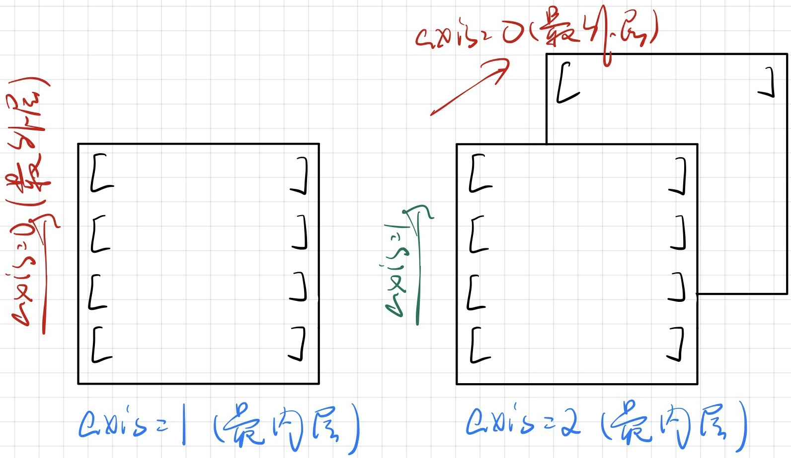

https://pandas.pydata.org/docs/index.html

# Numpy

参考《Python深度学习--基于PyTorch》

## *python数据结构缺陷 & ndarray引入*

python已经提供了list和array这种数据结构来进行计算，但是它们有各自的问题

list中可以存储所有类型的对象，因为一切皆对象，实际存储的是对象的引用，这在以大量float和int为主的数据运算中是非常低效的

而array和C语言的一维数组比较像，但是它不支持多维数组，而且支持的内置方法也比较少

因此有必要提供一种高效的用于数据计算的数据结构，即numpy的ndarray（N-dimensional Array Object）和用于处理ndarray的ufunc（Universal Funciton Object）对象

## *创建ndarray*

### 从已有数据中创建数组

用 `np.array()` 和 `np.asarray()` 来手动创建或者从已有的list或tuple类型来创建ndarray

```python
>>> a = [1, 2, 3, 4]
>>> b = (5, 6, 7, 8)
>>> a_ndarray = np.array(a)
>>> b_ndarray = np.array(b)
>>> type(a_ndarray)
<class 'numpy.ndarray'>
>>> type(b_ndarray)
<class 'numpy.ndarray'>
```

`np.array()` 和 `np.asarray()` 的区别是前者会对前者做深拷贝生成新对象，而后者直接对对象操作，因此对原对象（必须是ndarray对象）进行修改的时候，会影响到用 `asarray` 生成的原对象引用

```python
>>> a = np.array([1, 2, 3, 4])
>>> b = np.array(a)
>>> c = np.asarray(a)
>>> a[1] = 5
>>> a
array([1, 5, 3, 4])
>>> b
array([1, 2, 3, 4])
>>> c
array([1, 5, 3, 4])
```

### 利用random模块生成数组

* `np.random.random`：生成0到1之间的随机数
* `np.random.uniform` ：生成均匀分布的随机数
* `np.random.randn`：生成标准正态的随机数
* `np.random.randint`：生成随机的整数
* `np.random.normal`：生成正态分布

### 创建特定形状的特殊多维数组

* 生成特定形状的 $\boldsymbol{0}$ 数组
* 生成特定形状的 $\boldsymbol{1}$ 数组
* 生成空数组，里面是未初始化的垃圾值
* 生成特定形状的 $\boldsymbol{I}$ 数组
* 生成特定形状的制定值数组 `np.full()`

### 利用 `arange`，`linspace` 函数

`np.arange(Start, End, Step)` 生成固定范围内的数组

## *数组变形*

### axis问题

```python
>>> a
array([[[ 1,  2,  3,  4],
        [ 5,  6,  7,  8],
        [ 9, 10, 11, 12]],

       [[13, 14, 15, 16],
        [17, 18, 19, 20],
        [21, 22, 23, 24]]])
>>> a.sum(axis = 0)
array([[14, 16, 18, 20],
       [22, 24, 26, 28],
       [30, 32, 34, 36]])
>>> a.sum(axis = 2)
array([[10, 26, 42],
       [58, 74, 90]])
>>> a.sum(axis = (0, 1, 2))  # 对所有轴sum
300
```

**axis的编号规则是最外层的为axis 0，最内层的为最大数值的axis**，和一般序列号一样，-1就是最大的序列值，即最内层的axis

或者也可以**用数组shape理解**，上面代码中 `a.shape == (2, 3, 4)`，其中2对应的是axis 0，即最外层，而4对应的是axis 2，即最内层



### 更改数组形状

* `reshpae`：修改数组的形状，**不修改数组本身**，会返回一个原对象的引用
* `resize`：修改数组的形状，**直接在原对象上修改**
* `T`：转置
* `transpose`：轴对换，常用于RBG转换为GBR
* `flatten`：拉平原数组，即将多维数组转换为1维数组，不修改数组本身，会返回一个原对象的引用
* `ravel`：拉平原数组，直接在原对象上修改
* `squeeze`：将维数为1的维度去掉，进行降维

### 合并数组

## *numpy常用运算*

### 切片、获取元素

### 乘法

* 逐元素相乘 Element-wise Product：`np.multiply` 或者直接用 `*` 运算符

* 点积运算/矩阵乘法：`np.dot()`

### 统计相关

### 求最值

## *广播机制 Broadcast*

### 激活广播机制的条件

numpy的ufunc要求输入的数组shape是一致的，当数组的shape不一致时，就会激活广播机制来强制统一shape，但是得满足以下规则

1. 若两个数组维数不相等，维数较低的数组的shape会从左开始填充1，直到和高维数组的维数匹配。可以看下面的例子

   ```python
   >>> np.arange(1, 25).reshape(2, 3, 4) * np.arange(1, 5).reshape(1, 4)
   array([[[ 1,  4,  9, 16],    # a.shape == (2, 3, 4)
           [ 5, 12, 21, 32],    # b.shape == (4, ) 
           [ 9, 20, 33, 48]],   # b.shape == (1, 1, 4) 实际上是这么从左边开始扩充的，相当于是往最外层扩充 
                                # (a*b).shape == (2, 3, 4)
          [[13, 28, 45, 64],
           [17, 36, 57, 80],
           [21, 44, 69, 96]]])
   ```

2. 若两个数组维数相同，但某些维度的长度不同，那么长度为1的维度会被扩展，即向长度大的数组看齐，和另一数组的同维度的长度匹配

   ```python
   >>> np.arange(1, 4).reshape(3, 1) * np.arange(1, 5).reshape(1, 4)
   array([[ 1,  2,  3,  4],  # a.shape == (3, 1)
          [ 2,  4,  6,  8],  # b.shape == (1, 4) 
          [ 3,  6,  9, 12]]) # (a*b).shape == (3, 4)
   ```

3. 若两个数组维数相同，但有任一维度的长度不同且不为1，则报错

### 一维情况

numpy中 `(n,)` 形状的既可以是行也可以是列，都是1D-array，当它和二维数组进行计算时，会自动将size相符的维度匹配在一起计算。但若指定了第二维就不同了，2D-array `(5,1) != (1,5)`

# Panda

## *数据来源*

pandas 的文件输入输出模块依赖 xlrd、xlwt 和 openpyxl 这3个第三方库，若没有安装可以通过如下命令安装

```cmd
# 可以使用如下 conda 命令或 pip 命令安装
$ conda install xlrd xlwt openpyxl
$ pip install xlrd xlwt openpyxl
```

### csv & tsv

CSV, Comma-Separated Values，是一种常用的文本文件格式，用于存储表格数据。CSV文件通常是纯文本文件，其中的数据以逗号（或其他特定的分隔符，如分号或制表符）来分隔不同的字段或列，而换行符用于分隔不同的行。每行数据都包含相同数量的字段，每个字段都表示表格中的一个单元格值

```txt
姓名,年龄,城市
John,30,纽约
Alice,25,洛杉矶
Bob,35,芝加哥
```

CSV文件常用于数据导入和导出，因为它是一种通用的、易于阅读和编辑的格式

注意：CSV文件的格式没有固定的标准，因此在处理CSV文件时，可能需要考虑字段值中的特殊字符、字段引号的使用以及换行符的处理等问题，以确保数据的准确性和完整性

TSV, Tab-Separated Values，是另一种用于存储表格数据的文本文件格式，与CSV类似，但字段之间的分隔符是制表符（Tab字符），而不是逗号。TSV文件的结构和使用方式与CSV文件非常相似，只是分隔符不同

```
姓名    年龄    城市
John    30      纽约
Alice   25      洛杉矶
Bob     35      芝加哥
```

### 读取

panda可以用 `read_csv`、`read_table`、`read_excel` 来分别读取csv、txt和excel文件，它们都返回DataFrame。这三个函数都提供了大量的参数，我们介绍一下比较常用的参数

```python
pandas.read_csv(filepath_or_buffer, *, sep=_NoDefault.no_default, delimiter=None, header='infer', names=_NoDefault.no_default, index_col=None, usecols=None, dtype=None, engine=None, converters=None, true_values=None, false_values=None, skipinitialspace=False, skiprows=None, skipfooter=0, nrows=None, na_values=None, keep_default_na=True, na_filter=True, verbose=False, skip_blank_lines=True, parse_dates=None, infer_datetime_format=_NoDefault.no_default, keep_date_col=False, date_parser=_NoDefault.no_default, date_format=None, dayfirst=False, cache_dates=True, iterator=False, chunksize=None, compression='infer', thousands=None, decimal='.', lineterminator=None, quotechar='"', quoting=0, doublequote=True, escapechar=None, comment=None, encoding=None, encoding_errors='strict', dialect=None, on_bad_lines='error', delim_whitespace=False, low_memory=True, memory_map=False, float_precision=None, storage_options=None, dtype_backend=_NoDefault.no_default)[source]
```

1. filepath_or_buffer（必填参数）：指定要读取的 CSV 文件的路径或 URL。可以是字符串（文件路径）或类文件对象（如 StringIO）
2. sep：用于指定字段之间的分隔符，默认为逗号（`,`）。可以是字符串或正则表达式，例如 `\t` 表示制表符分隔的数据
3. delimiter：与 `sep` 参数功能相同，用于指定字段之间的分隔符
4. header：指定哪一行作为列名（列标签）。默认为 0，表示使用第一行作为列名。如果没有列名，则可以将其设置为 None
5. names：用于手动指定列名的列表。如果文件没有列名，可以使用这个参数为 DataFrame 分配列名
6. index_col：用于指定哪一列作为行索引。可以是列名或列的位置（从0开始计数）
7. usecols：用于选择要读取的列的列表。可以指定列名或列的位置
8. skiprows：用于跳过文件开头的行数，可以是一个整数或行号的列表
9. skipfooter：用于跳过文件末尾的行数，通常用于跳过页脚或摘要信息的行数
10. nrows：用于指定要读取的行数，从文件的开头开始计算
11. encoding：用于指定文件的字符编码，例如 'utf-8'、'latin1' 等
12. dtype：用于手动指定列的数据类型，可以是一个字典，将列名映射到数据类型
13. na_values：用于指定哪些值应被解释为缺失值，可以是一个列表、字典或者某个字符串
14. parse_dates：用于指定哪些列应该被解析为日期时间类型
15. date_parser：用于自定义日期时间解析函数
16. comment：用于指定注释标志，出现在行首的行将被忽略

### 写入

pandas 中没有定义 to_table 函数，但 to_csv 函数可以将数据保存为 txt 文件，并且允许自定义分隔符。常用制表符 `\t` 分割

## *基本数据结构*

pandas 封装了两种基本的数据结构，在这两种数据结构上定义了很多属性和方法，pandas 中的绝大多数数据处理操作基于它们来进行

* 存储一维值属性 values 的 Series
* 存储二维值属性 values 的 DataFrame，DataFrame用到的频率比Series高很多，因为很多的图表都是二维的

下面介绍一下这两种数据类型的属性以及如何获取它们

### Series

Series 对象中包含 4 个重要的组成部分：序列的值 data、索引 index、存储类型 dtype 和序列的名字 name

```python
class pandas.Series(data=None, index=None, dtype=None, name=None, copy=None, fastpath=False)
```

* data
  * 这是 Series 的主要数据部分，可以是不同的数据类型，如列表、NumPy 数组、字典、标量值等]
  * 如果传递的是一个字典，则字典的键将成为 Series 的索引，而字典的值将成为 Series 的数据
  * 如果不提供 data 参数，默认为 None，创建一个空的 Series
* index
  * 索引部分，用于标识和访问 Series 中的数据
  * index 参数可以是一个单独的标签（如字符串或数字），也可以是一个标签的列表或数组，用于设置多级索引
  * 如果不提供 index 参数，默认会创建一个从 0 开始的整数索引
* dtype
  * dtype 参数用于指定 Series 中的数据类型。如果不指定，Pandas 会根据数据自动推断数据类型
  * 常见的数据类型包括整数 (`int`)、浮点数 (`float`)、字符串 (`str`)、日期时间 (`datetime`) 等
* name：Series 的名称，通常用于标识 Series 对象
* copy：若设置为 True，表示创建一个 Series 的副本，而不是共享原始数据。默认为 False，即共享数据。当修改 Series 中的数据时，如果设置为 False，则可能会影响原始数据，这一点需要小心
* fastpath：这是一个优化参数，用于内部优化，通常不需要手动设置。默认为 False

### DataFrame

```python
class pandas.DataFrame(data=None, index=None, columns=None, dtype=None, copy=None)
```

DataFrame在Series的基础上增加了一个 column 列索引

## *对两种基本数据类型的常用函数汇总*

### 汇总函数

* `head()` 和 `tail()` ，它们分别返回表或者序列的前n 行和后 n 行信息，其中 n 默认为 5
* `info()` 和 `describe()` 分别返回表的信息概况和表中数值列对应的主要统计量

### 特征统计函数

sum()、mean()、median()、var()、std()、max()和 min()

quantile()、count()和 idxmax()

### 频次函数

* `unique()` 和 `nunique()` 可以分别得到其唯一值组成的列表和唯一值的个数
* `value_counts()` 可以得到序列中每个值出现的次数，当设定 normalize 为 True 时会进行归一化处理

### 替换函数

### 排序函数

* 值排序函数 `sort_values()`
* 索引排序函数 `sort_ index()`

### apply 函数

# Pandas中的4类数据类型

## *缺失数据*

## *文本数据*

# Matplotlib

## *各种图表类型*

## *图表辅助元素*

## *子图*

## *坐标轴定制*

## *3D图*