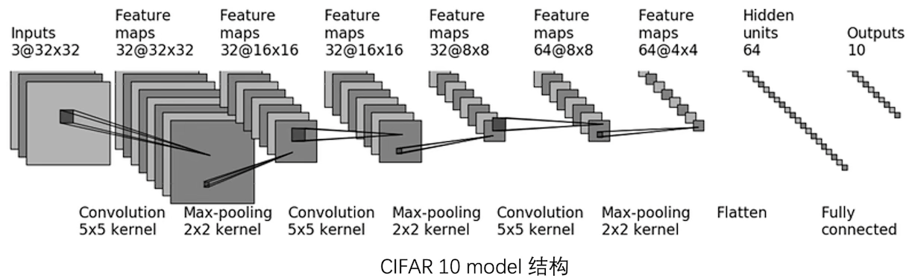

# PyTorch

>**该笔记为作者通过TUM(Technische Universität München)的Introduction to Deep Leraning课程、B站Up主“我是土堆”的“PyTorch”课程以及PyTorch官方Documentation"总结的PyTorch学习笔记**

## *Dataset*

* 

### 基本使用方法及结构

* Map style

    ```python
    def Dataset():
        def __init__(sefl,*args,**kwds):
        
        def __getitem__(self, index):

        def __len__(self):
    ```

* Iteration style

    ```python
    def IterableDataset():
        def __init__():
        
        def __iter__(self): #构造迭代器
    ```

## *Dataloader*


### 重要参数

* `dataset`: datasets from wihcih to load the data
* `batch_size`: how many samples per batch to load
* `shuffle`: 当设置为True时每一个Epoch中sample的顺序都不相同
* `num_workers`
  * 当默认设置为0时只使用主进程加载数据
  * Win环境下用多个进程可能会出现`BrokenPipeError`的错误，此时考虑设置为0
* `drop_last`：当设置为True且#samples/batch_size有余数时舍去最后一组batch

### 基本使用方法及结构

```python
import torchvision.datasets
from torch.utils.data import DataLoader
from torch.utils.tensorboard import SummaryWriter

# Prepare test data
test_data = torchvision.datasets.CIFAR10("./dataset", train = False,download=True, transform=torchvision.transforms.ToTensor())

test_loader = DataLoader(dataset=test_data, batch_size=64, shuffle=True, num_workers=0, drop_last=False)

img, target = test_data[0] # CIFAR10数据集中__getitem__规定返回 img和target
print(img.shape) # torch.Size([3, 32, 32])
print(target) # 3 target就是label

writer = SummaryWriter("./logs")
# batch_size=4 就相当于每4张图片为一组，将这4张图片的img和target分别打包成两个list，喂给神经网络
for epoch in range(2):
    step = 0
    print("Start training of epoch #:{}".format(epoch))
    for data in test_loader:
        imgs, targets = data
        # print(imgs.shape) # torch.Size([4, 3, 32, 32])
        # print(targets) # tensor([1, 8, 2, 6]) 4张图片分别所属的target
        writer.add_images("Epoch:{}".format(epoch), imgs, step)
        step = step + 1

writer.close()
```

## *TensorBoard*


### 基本使用方法及结构

```python
from torch.utils.tensorboard import SummaryWriter

writer = SummaryWriter("logs")

writer.add_image(tag, img_tensor, global_step=None, walltime=None, dataformats='CHW')

#tag是Data identifier；scalar_value是图像的y轴；global_step是x轴
writer.add_scaler(tag, scalar_value, global_step=None, walltime=None, new_style=False, double_presicion=False)

writer.close()
```

* add_image中的img_tensor参数可以是torch.Tensor，numpy.array，or string/blobname
  * 通过PIL包中PIL.open打开的图片类型是不符合img_tensor的，需要用`np.array()`进行转换后使用
  * 使用opencv读取的图片数据类型是numpy.array，可以直接被使用
* 需要注意add_image中的dataformats

## *Transforms*

### Transforms的import模块

```python
from torchvision import transforms
```

### Documentation及模块作用

当使用PyTorch训练用于图片的神经网络之前，需要对图片进行Pre-processing。tranforms.py中定义了很多对图像的预处理工具，最常用的有如ToTensor、Normalize、Rescale、CenterCrop等

### Transform工具的基本结构和使用方法（以ToTensor为例）

* ToTensor的结构

    ```python
    class ToTensor(object):
        def __call__(self, pic):
            return F.to_tensor(pic)
        
        def __repr__(self):
            return self.__class__.__name__+'()'
    ```

* ToTensor的使用

    ```python
    from PIL import Image
    img_path = ""
    img = Image.open(img_path) #用Image.open打开的图片类型为PIL.JpegImagePlugin.JpegImageFile Class
    
    tensor_trans = transforms.ToTensor() #首先要具体化给的工具，因为如Normalize之类的预处理还需要指定参数
    tesnsor_img = tensor_trans(img) #使用制定好的工具后再进行预处理
    ```

### 通过ToTensor解决两个问题

* transforms该如何使用

    ```python
    trans_norm = transforms.Normalize([1, 3, 5], [3, 2, 1])
    img_norm = trans_norm(img_tensor)
    ```

  * 首先具体化预处理工具
  * 将图片输入定制好的预处理工具
* 为什么需要Tensor数据类型：Tensor和numpy.array是很类似的数据结构，但他是专门针对GPU训练所设计的多维矩阵，有着很多深度学习需要的参数

### 组合图片预处理

```python
trans_compose = torchvision.transforms.Compose([
    torchvision.transforms.ToTensor(),
    torchvision.transforms.Normalize([1, 3, 5], [3, 2, 1])
    ])
```

## *Torchvision自带数据集的使用*

### 使用示例

```python
import torchvision

dataset_transform = torchvision.transforms.Compose([
    torchvision.transforms.ToTensor(),
    ...
]) #创建预处理模块，可以在下载数据集时顺便完成预处理，很方便

train_set = torchvision.datasets.CIFAR10(root="./dataset", train=True, transform=dataset_transform, download=True)

test_set = torchvision.datasets.CIFAR10(root="./dataset", train=False, transform=dataset_transform, download=True) 
```

* `downlaod`一直设置为True比较方便，还可以自动解压缩数据集

## *神经网络的实现*

### 神经网络的基本骨架-`torch.nn.Module`

* Documentation

>**Base class for all neural network modules.**  
Your models should also subclass this class.  
Modules can also contain other Modules, allowing to nest them in a tree structure. You can assign the submodules as regular attributes

`nn.Module`是所有自定义神经网络的骨架，即所有自定义class的父类

* 使用实例

    ```python
    import torch
    from torch import nn
    
    class TestNetwort(nn.Module):
        def __init__(self):
            super().__init__()
    
        def forward(self, input):
            output = input + 1
            return output
    
    my_network = TestNetwort() #实例化
    
    x = torch.tensor(1.0)
    output = my_network(x)
    print(output)
    ```

### 卷积操作和卷积层

* `torch.nn`是对`torch.nn.functional`的一种封装，便于使用，但实现细节如`nn.Conv1d`等在`torch.nn.functional`之中
* `torch.nn.functional.conv2d(input, weight, bias=None, stride=1, padding=0, dilation=1, groups=1, padding_mode='zeros'...)`的参数
  * `input` - shape (minibatch, in_channels, iH, iW)
  * `weight` - filters of shape (out_channels, $\frac{in\_channels}{groups}$, kH, kW)
  * `bias`
  * `stride`
  * `padding`
  * `dilation`：空洞卷积，一般默认为1
  * `groups`
  * `padding_mode`
* shape
  * input:$(N,\ C_{in},\ H_{in},\ W_{in})$
  * output:$(N,\ C_{out},\ H_{out},\ W_{out})$
  * $H_{out}=\left[\frac{H_{in}+2\times padding[0]-dilation[0]\times (kernel_size[0]-1)-1}{stride[0]}+1\right]$
  * $W_{out}=\left[\frac{W_{in}+2\times padding[1]-dilation[1]\times (kernel_size[1]-1)-1}{stride[1]}+1\right]$
* 卷积操作

    ```python
    import torch
    import torch.nn.functional as F

    input = torch.tensor([[1, 2, 0, 3, 1],
                        [0, 1, 2, 3, 1],
                        [1, 2, 1, 0, 0],
                        [5, 2, 3, 1, 1],
                        [2, 1, 0, 1, 1]])

    kernel = torch.tensor([[1, 2, 1],
                        [0, 1, 0],
                        [2, 1, 0]])

    print(input.shape)
    print(kernel.shape)
    # input和kernel很明显并不满足定义的size，要进行resize
    input = torch.reshape(input, (1, 1, 5, 5))
    kernel = torch.reshape(kernel, (1, 1, 3, 3))

    output1 = F.conv2d(input, kernel, stride=1)
    print(output1)

    output2 = F.conv2d(input, kernel, stride=2)
    print(output2)

    output3 = F.conv2d(input, kernel, stride=1, padding=1)
    print(output3)
    ```

* `torch`中`conv2d`函数的应用

    ```python
    import torch
    import torchvision
    from torch import nn
    from torch.nn import Conv2d
    from torch.utils.data import DataLoader
    from torch.utils.tensorboard import SummaryWriter
    
    dataset = torchvision.datasets.CIFAR10("./dataset", train=False, transform=torchvision.transforms.ToTensor(),
                                        download=True)
    dataloader = DataLoader(dataset, batch_size=64)
    
    class TestNetwork(nn.Module):
        def __init__(self):
            super(TestNetwork, self).__init__()
            self.conv1 = Conv2d(in_channels=3, out_channels=6, kernel_size=3, stride=1, padding=0)
    
        def forward(self, x):
            x = self.conv1(x)
            return x
    
    my_Network = TestNetwork()
    print(my_Network)
    
    writer = SummaryWriter("./logs")
    step = 0
    for data in dataloader:
        imgs, targets = data
        output = my_Network(imgs)
        print(imgs.shape)
        print(output.shape)
        # torch.Size([64, 3, 32, 32])
        writer.add_images("input", imgs, step, dataformats='NCHW')
        # torch.Size([64, 6, 30, 30])
        output = torch.reshape(output, (-1, 3, 30, 30)) #写-1会自动计算尺寸
        writer.add_images("output", output, step)
    
        step = step + 1
    
    writer.close()
    ```

### 最大池化/下采样 Max Pooling `torch.nn.MaxPool2d`

* 函数定义

    ```python
    class torch.nn.MaxPool2d(kernel_size, stride=None, 
    padding=0, dilation=1, return_indices=False, 
    ceil_mode=False)
    ```

* 参数
  * input size: $(N,\ C,\ H_{in},\ W_{in})$
  * output 
  * ceil_mode：边缘小于kernel_size的是否要舍去

* 使用示范

    ```python
    import torch
    import torchvision
    from torch import nn
    from torch.nn import MaxPool2d
    from torch.utils.data import DataLoader
    from torch.utils.tensorboard import SummaryWriter
    
    dataset = torchvision.datasets.CIFAR10("./dataset", train=False, transform=torchvision.transforms.ToTensor(),
                                        download=True)
    dataloader = DataLoader(dataset, batch_size=64)
    
    class TestNetwork(nn.Module):
        def __init__(self):
            super(TestNetwork, self).__init__()
            self.maxpool1 = MaxPool2d(kernel_size=3, ceil_mode=True)
    
        def forward(self, input):
            output = self.maxpool1(input)
            return output
    
    my_Network = TestNetwork()
    
    writer = SummaryWriter("./logs")
    step = 0
    for data in dataloader:
        imgs, targets = data
        writer.add_image("input", imgs, step, dataformats="NCHW")
        output = my_Network(imgs)
        writer.add_image("output", output, step, dataformats="NCHW")
        setp = step + 1
    
    writer.close()
    ```

### Nonlinear activation

* ReLU
  * 实现

    ```python
    import torch
    from torch import nn
    from torch.nn import ReLU
    
    class TestNetwork(nn.Module):
        def __init__(self):
            super(TestNetwork, self).__init__()
            self.relu1 = ReLU()
    
        def forward(self, input):
            output = self.relu1(input)
            return output
    
    my_Network = TestNetwork()
    print(my_Network)
    ```
  
    

### Lienar and Other laylers

* Linear layer
  * Documentaiton
    > Applies a linear transformation to the incoming data: $y=xA^T+b$

    ```python
    torch.nn.Linear(in_features, out_features, 
    bias=True, device=None, dtype=None)
    ```

  * 线性变换层的weight和bias取决于指定的in_features和out_features，通过$\mu(-\sqrt{k},\ \sqrt{k}), where\ k=\frac{1}{in\_features}$初始化
  * 应用

    ```python
    import torch
    import torchvision
    from torch import nn
    from torch.nn import Linear
    from torch.utils.data import DataLoader
    
    dataset = torchvision.datasets.CIFAR10("./dataset", train=False, transform=torchvision.transforms.ToTensor(),
                                        download=True)
    
    dataloader = DataLoader(dataset, batch_size=64, drop_last=True)
    # 因为linear层制定了input feature的维度，所以要droplast掉最后一组batch，否则计算维度不匹配出错
    
    class TestNetwork(nn.Module):
        def __init__(self):
            super(TestNetwork, self).__init__()
            self.linear1 = Linear(196608, 10)
    
        def forward(self, input):
            output = self.linear1(input)
            return output
    
    my_Network = TestNetwork()
    
    for data in dataloader:
        imgs, targets = data
        print(imgs.shape)# torch.Size([64, 3, 32, 32])
        # output = torch.reshape(imgs, (1, 1, 1, -1))
        output = torch.flatten(imgs)# 展成列向量，reshape涵盖了flatten的功能
        print(output.shape)# torch.Size([196608])
    
        output = my_Network(output)
        print(output.shape)#torch.Size([10])
    ```

* Dropout layer
* Padding layer
* Normalization layer
* Recurrent layer
* Transformer layer
* Sparse layer(NLP)

### 完整的前向网络搭建（以CIFAR10-quick model为例并采用`nn.Sequential`简化代码）



```python
import torch
from torch import nn
from torch.nn import Conv2d, MaxPool2d, Flatten, Linear, Sequential
from torch.utils.tensorboard import SummaryWriter

''' Too complicated!
class TestNetwork(nn.Module):
    def __init__(self):
        super(TestNetwork, self).__init__()
        self.conv1 = Conv2d(3, 32, 5, padding=2)
        self.maxpool1 = MaxPool2d(2)
        self.conv2 = Conv2d(32, 32, 5, padding=2)
        self.maxpool2 = MaxPool2d(2)
        self.conv3 = Conv2d(32, 64, 5, padding=2)
        self.maxpool3 = MaxPool2d(2)
        self.flatten = Flatten()
        self.linear1 = Linear(1024, 64)
        self.linear2 = Linear(64, 10)

    def forward(self, x):
        x = self.conv1(x)
        x = self.maxpool1(x)
        x = self.conv2(x)
        x = self.maxpool2(x)
        x = self.conv3(x)
        x = self.maxpool3(x)
        x = self.flatten(x)
        x = self.linear1(x)
        x = self.linear2(x)
        return x
'''


class TestNetwork(nn.Module):
    def __init__(self):
        super(TestNetwork, self).__init__()
        self.model1 = Sequential(
            Conv2d(3, 32, 5, padding=2),
            MaxPool2d(2),
            Conv2d(32, 32, 5, padding=2),
            MaxPool2d(2),
            Conv2d(32, 64, 5, padding=2),
            MaxPool2d(2),
            Flatten(),
            Linear(1024, 64),
            Linear(64, 10),
        )

    def forward(self, x):
        x = self.model1(x)
        return x

# 测试网络的正确性
my_Network = TestNetwork()
print(my_Network)
input = torch.ones((64, 3, 32, 32))
output = my_Network(input)
print(output.shape)

# 创建计算图检查网络结构
writer = SummaryWriter("./logs")
writer.add_graph(my_Network, input)
writer.close()
```

### Loss function and Back propagation

* L1
* MSE
* Cross-entropy

```python
import torch
from torch.nn import L1Loss
from torch import nn

inputs = torch.tensor([1, 2, 3], dtype=torch.float32)
targets = torch.tensor([1, 2, 5], dtype=torch.float32)

inputs = torch.reshape(inputs, (1, 1, 1, 3))
targets = torch.reshape(targets, (1, 1, 1, 3))

loss = L1Loss(reduction='sum')
result = loss(inputs, targets)

loss_mse = nn.MSELoss()
result_mse = loss_mse(inputs, targets)

print(result)  # tensor(2.)
print(result_mse)  # tensor(1.3333)

x = torch.tensor([0.1, 0.2, 0.3])
y = torch.tensor([1])
x = torch.reshape(x, (1, 3))
loss_cross = nn.CrossEntropyLoss()
result_cross = loss_cross(x, y)
print(result_cross)  # tensor(1.1019)
```

### 优化器 Optimizer `toorch.optim`

```python
import torch
import torchvision.datasets
from torch import nn
from torch.nn import Conv2d, MaxPool2d, Flatten, Linear, Sequential
from torch.utils.data import DataLoader

dataset = torchvision.datasets.CIFAR10("./dataset", train=False, transform=torchvision.transforms.ToTensor(),
                                       download=True)

dataloader = DataLoader(dataset, batch_size=1)

class TestNetwork(nn.Module):
    def __init__(self):
        super(TestNetwork, self).__init__()
        self.model1 = Sequential(
            Conv2d(3, 32, 5, padding=2),
            MaxPool2d(2),
            Conv2d(32, 32, 5, padding=2),
            MaxPool2d(2),
            Conv2d(32, 64, 5, padding=2),
            MaxPool2d(2),
            Flatten(),
            Linear(1024, 64),
            Linear(64, 10),
        )

    def forward(self, x):
        x = self.model1(x)
        return x


loss = nn.CrossEntropyLoss()
my_Network = TestNetwork()
optim = torch.optim.SGD(my_Network.parameters(), lr=0.01)

for epoch in range(20):
    running_loss = 0.0
    for data in dataloader:
        imgs, targets = data
        outputs = my_Network(imgs)
        result_loss = loss(outputs, targets)
        optim.zero_grad()  # 前次梯度置零
        result_loss.backward()  # 计算反向梯度
        optim.step()  # 执行反向传播
        running_loss = running_loss + result_loss
    print(running_loss)
```

## *现有网络模型的使用及修改* `torchvision.models`：以VGG16为例

### Documentation

```python
torchvision.models.vgg16(pretrained: bool = False, 
progress: bool = True, **kwargs: Any)
```

* pretrained：是否使用训练好的参数
* progress：显示进度条

### 使用

```python
import torchvision

# VGG16是针对ImageNet数据集训练的
from torch import nn

vgg16_not_pretrained = torchvision.models.vgg16(pretrained=False)
vgg16_pretrained = torchvision.models.vgg16(pretrained=True)

print(vgg16_pretrained)

train_data = torchvision.datasets.CIFAR10('./dataset', train=True, transform=torchvision.transforms.ToTensor(),
                                          download=True)

# 迁移学习 Transfer Learning

vgg16_pretrained.classifier.add_module('add_linear', nn.Linear(1000, 10))
print(vgg16_pretrained)

print(vgg16_not_pretrained)
vgg16_not_pretrained[6] = nn.Linear(4096, 10)
print(vgg16_not_pretrained)
```

### 网络模型的保存与读取

* 保存

    ```python
    import torch
    import torchvision

    vgg16 = torchvision.models.vgg16(pretrained=False)

    # Method 1 保存模型结构+模型参数
    torch.save(vgg16, "vgg16_method1.pth")
    # Method 2 将模型参数保存为字典
    torch.save(vgg16.state_dict(), "vgg16_method2.pth")
    ```

* 读取

    ```python
    # Method 1
    model = torch.load("vgg16_method1.pth")
    # Method 2
    vgg16.load_state_dict()
    model = torch.load("vgg16_method2.pth")
    ```

## *完整的训练过程（以CIFAR10数据集为例）*

* 大纲：准备数据->加载数据->准备模型->设置损失函数->设置优化器->开始训练->验证->Tensorboard展示

* 分开构造Modell

```python
# Construct Neural Network
import torch
from torch import nn

class TestNetwork(nn.Module):
    def __init__(self):
        super(TestNetwork, self).__init__()
        self.model = nn.Sequential(
            nn.Conv2d(3, 32, 5, 1, 2),
            nn.MaxPool2d(2),
            nn.Conv2d(32, 32, 5, 1, 2),
            nn.MaxPool2d(2),
            nn.Conv2d(32, 64, 5, 1, 2),
            nn.MaxPool2d(2),
            nn.Flatten(),
            nn.Linear(64*4*4, 64),
            nn.Linear(64, 10)
        )

    def forward(self, x):
        x = self.model(x)
        return x


if __name__ == '__main__':
    my_network = TestNetwork()
    input = torch.ones((64, 3, 32, 32))
    output = my_network(input)
    print(output)

```

* 主体

```python
import torch.optim
import torchvision
from torch.utils.data import DataLoader
from torch.utils.tensorboard import SummaryWriter

# Prepare dataset
train_data = torchvision.datasets.CIFAR10(root="../data", train=True, transform=torchvision.transforms.ToTensor(),
                                          download=True)
test_data = torchvision.datasets.CIFAR10(root="../data", train=False, transform=torchvision.transforms.ToTensor(),
                                         download=True)

train_data_size = len(train_data)
test_data_size = len(test_data)
print("The length of train dataset is:{}".format(train_data_size))
print("The length of test dataset is:{}".format(test_data_size))

# Use Dataloader to load data
train_dataloader = DataLoader(train_data, batch_size=64)
test_dataloader = DataLoader(test_data, batch_size=64)

# Construct Neural Network
class TestNetwork(nn.Module):
    def __init__(self):
        super(TestNetwork, self).__init__()
        self.model = nn.Sequential(
            nn.Conv2d(3, 32, 5, 1, 2),
            nn.MaxPool2d(2),
            nn.Conv2d(32, 32, 5, 1, 2),
            nn.MaxPool2d(2),
            nn.Conv2d(32, 64, 5, 1, 2),
            nn.MaxPool2d(2),
            nn.Flatten(),
            nn.Linear(64*4*4, 64),
            nn.Linear(64, 10)
        )

    def forward(self, x):
        x = self.model(x)
        return x

# Loss Function
loss_fn = nn.CrossEntropyLoss()

# Optimizer
learning_rate = 1e-2
optimizer = torch.optim.SGD(TestNetwork.parameters(), lr=learning_rate)

# Set Network Parameters
total_train_step = 0
total_test_step = 0
epoch = 10

# Tensorboard
writer = SummaryWriter("../logs_train")

# Training   
for i in range(epoch):
    print("------Strat to train #{} epoch------".format(i+1))
    for data in train_dataloader:
        imgs, targets = data
        outputs = TestNetwork(imgs)
        loss = loss_fn(outputs, targets)

        # Set up optimizer
        optimizer.zero_grad()
        loss.backward()
        optimizer.step()

        total_train_step = total_train_step + 1
        if total_train_step % 100 == 0: #避免无用信息
            print("# Training:{}, Loss:{}".format(total_train_step, loss.item()))
            writer.add_scalar("train_loss", loss.item(), total_train_step)

    # Test
    total_test_loss = 0
    with torch.no_grad():
        for data in test_dataloader:
            imgs, targets = data
            outputs = TestNetwork(imgs)
            loss = loss_fn(outputs, targets)
            total_test_loss = total_test_loss + loss.item()
    print("Loss of the test dataset:{}".format(total_test_loss))
    writer.add_scalar("test_loss", total_test_loss, total_test_step)
    total_test_step = total_test_step + 1

    torch.save(TestNetwork, "TestNetwork_{}.pth".format(i))
    print("Model saved.")
    

writer.close()
```

## *利用cuda进行GPU加速训练*

### 对网络模型、数据（输入）和损失函数使用`.cuda()`

```python
if torch.cuda.is_available():
    my_network.cuda()
    loss_fn = loss_fn.cuda()

    for data in train_dataloader:
        imgs, targets = data
        imgs = imgs.cuda()
        targets = targets.cuda()
```

### 使用`.to(device)`

```python
# 定义训练的设备 
# device = torch.device("cpu")
device = torch.device("cuda" if torch.cuda.is_availaable() else "cpu")
my_network.to(device)    
loss_fn.to(device)


imgs, targets = data
imgs = imgs.to(device)
targets = targets.to(device)
```


