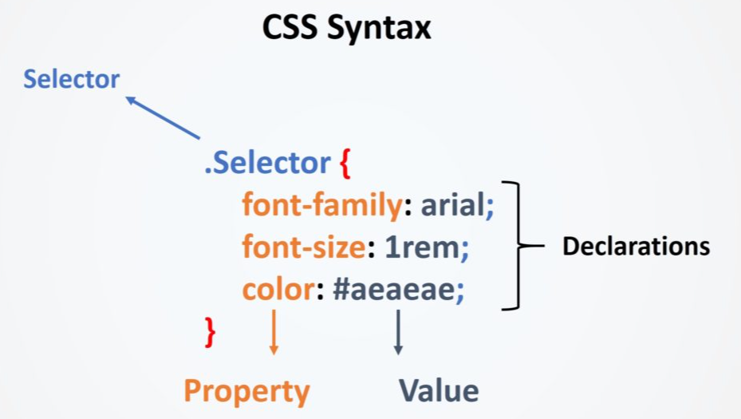

前端三要素：DHTML Dynamic HTML 动态 HTML 技术是指描述 HTML、CSS 和 JavaScript 技术组合的术语

* HTML **结构**：超文本标记语言 Hyper Text Markup Language 决定网页的结构和内容 Structure of the Content
* CSS **表现**：层叠样式表 Cascading Style Sheets，设定网页的表现样式 Document Style
* JavaScript **行为**：是一种弱脚本语言，其源代码不需要经过编译，直接由浏览器的 V8 引擎解释运行，用于控制网页的行为

# HTML

HTML, Hypertext Markup Language 超文本标记语言，是一种用于创建和设计网页结构的标记语言

## *结构*

HTML使用一系列标记 tag 来描述网页中的各种元素，如文本、图像、链接、表格等。这些标记告诉浏览器如何显示页面的内容和布局

HTML 是构建网页的基础，它由一系列的 HTML 元素（HTML element）组成，每个元素都由开始标签（opening tag）、结束标签（closing tag）和其中的内容组成。标签之间可以包含其他标签，形成一个层次结构，这种结构定义了网页的布局和组织方式


- `<!DOCTYPE html>` 声明为 HTML5 文档
- `<html>` 元素是 HTML 页面的[**根元素**](#主根元素)
- `<head>` 元素包含了文档的元（meta）数据，如 `<meta charset="utf-8">` 定义网页编码格式为 **utf-8**
- `<title>` 元素描述了文档的标题
- `<body>` 元素包含了可见的页面内容
- `<h1>` 元素定义一个大标题
- `<p>` 元素定义一个段落

### 声明

`<!DOCTYPE>` 声明有助于浏览器中正确显示网页，用来兼容以前的 HTML 格式

网络上有很多不同的文件，如果能够正确声明HTML的版本，浏览器就能正确显示网页内容

doctype 声明是不区分大小写的，以下方式均可（下面的都是 HTML5）

```html
<!DOCTYPE html>
<!DOCTYPE HTML>
<!doctype html>
<!Doctype Html>
```

### 可视化

head 部分是网友的基本信息，比如标题

body 部分是真正要用浏览器渲染好展示给用户的部分

## *元素*

[HTML 元素参考 - HTML（超文本标记语言） | MDN](https://developer.mozilla.org/zh-CN/docs/Web/HTML/Element#主根元素)


HTML 标签 和 HTML 元素 Element 通常都是描述同样的意思

### 块级元素 & 行级元素

注意：HTML 中的块级元素 & 行级元素不应该与 CSS 盒子模型中的区块盒子 & 行内盒子混淆。尽管它们默认是相关的，但改变 CSS 显示类型并不会改变元素的分类，也不会影响它可以包含和被包含于哪些元素。防止这种混淆也是 HTML5 摒弃这些术语的原因之一

在HTML中，**块级元素 / 区块元素**（Block-level elements）指的是那些默认占据整个容器宽度的元素——即使内容没有填满，它们也会在页面布局中创建一个“块”。这些元素通常用于组织页面结构和内容分段。区块元素包括但不限于以下标签：

- `<div>`：用于定义文档中的分区或节
- `<p>`：代表文本的段落
- `<h1>`, `<h2>`, ..., `<h6>`：表示六级不同重要性的标题
- `<ul>`, `<ol>`：无序列表 unordred list 和有序列表 ordered list
  - `<li>`：列表项

- `<header>`、`<footer>`、`<nav>`、`<section>`、`<article>`、`<aside>`：HTML5中新增的语义化区块元素。

每个区块元素通常都是以新行开始，并扩展到其容器的最大宽度，它们可以嵌套其他区块元素或内联元素，比如`<span>`或`<a>`

```html
<div>
  <h1>Page Title</h1>
  <p>This is a paragraph inside a div block.</p>
</div>
```

HTML 可以通过 `<div>` 和 `<span>` 将元素组合起来，它们用于对文档内容进行组织和样式化。不同之处在于它们对文档流的影响以及它们如何与 CSS 样式和 JavaScript 交互

### 内联元素

行级元素 / 内联元素 Inline elements 在HTML中是用来定义文本级的内容，例如单词或图片，它们不会以新行开始。相对于块级元素（Block-level elements），它们的主要特性是不会独占一行，而是与相邻的内联元素水平排列，直到可用空间耗尽然后折行

下面是一些内联元素的常见特点：

- **不引起换行**：内联元素通常不会导致文本换到新行上，而是继续在同一行显示，直到行的末端
- **宽度随内容变化**：内联元素的宽度由其内容决定，并非自动充满整个容器宽度，如块级元素那样
- **嵌套规则**：内联元素可以包含其他内联元素，但通常不应该包含块级元素
- **和文字在同一行中流动**：内联元素通常用于格式化文本，它们可以出现在段落或其他块级元素之内，与周围的文本在同一行中流动

### `<div>`

`<div>` 是一个块级元素（block-level element），通常用于创建页面的大块结构。`<div>` 元素本身没有任何视觉效果，但它可以通过 CSS 来进行样式化。作为块级元素，`<div>` 通常用来包裹其他块级元素和内联元素，形成文档的各部分或容器

块级元素的特点是：

- 默认占据其父元素的全部可用宽度
- 常常用于布局目的，如创建侧栏、页眉、页脚等
- 在浏览器渲染时，前后会带有换行，即每个 `<div>` 通常会开始于新的一行

例如：

```html
<div class="header">
    <h1>Welcome to My Website</h1>
</div>
```

这里，`<div>` 创建了一个包含标题的页面区块，并且可能会通过 `.header` 类来应用CSS样式

### `<span>`

`<span>` 是一个内联元素，用于对文档中的小块内容进行分组和样式化。如同 `<div>`，`<span>` 元素本身没有视觉上的变化，但可以通过CSS进行样式化

内联元素的特点是：

- 它们只占据它们需要的空间，并不强制换行
- 常用于改变一段文字的样式，而不影响整个段落或其他块级内容
- 它们不能包含块级元素

例如：

```html
<p>This is a <span class="highlight">highlighted</span> word.</p>
```

在这个例子中，`<span>` 用于突出显示“highlighted”这个词语，`.highlight` 类可以定义该词语的特殊样式，比如背景色或字体颜色的变化

### 空元素

空元素 void element（也称为自闭合元素或无内容元素）是指那些不包含内容，因此没有结束标签的元素。这些元素只有一个标签，用于插入对象、信息或回调某些行为，但它们不包含任何子元素或文本内容

例如，`` 元素就是一个空元素，用于在网页上嵌入图像，但它本身不包含任何内容

其他常见的空元素包括：

- `<br>`：插入一个换行符
- `<hr>`：在内容中画一条水平线
- `<input>`：创建各种类型的输入字段，如文本框、复选框、单选按钮等
- `<link>`：引入外部资源，如 CSS 样式表
- `<meta>`：提供关于 HTML 文档的元数据，如字符集定义、页面描述、关键字等
- `<area>`：定义图像地图内部的区域（与`<map>`元素一起使用）
- `<param>`：定义对象（如 `<object>` 元素）的参数

根据 HTML5 规范，在编写空元素时，可以选择性地在元素后添加一个斜线（self-closing tag），如 `<br />` 或 ``，但这并非必需，且在纯 HTML 文档中，斜线通常被省略。然而在 XHTML 或 XML 文档中，空元素的结束斜线是必须的

### 主根元素

`<html>`：表示一个 HTML 文档的根（顶级元素），所以它也被称为根元素。所有其它元素必须是此元素的后代

### 文档元数据

元数据 Metadata 含有页面的相关信息，包括样式、脚本及数据，能帮助一些软件（例如搜索引擎、浏览器等等）更好地运用和渲染页面。对于样式和脚本的元数据，可以直接在网页里定义，也可以链接到包含相关信息的外部文件

* `<base>`：指定用于一个文档中包含的所有相对 URL 的根 URL。一份中只能有一个该元素
* `<head>`：包含文档相关的配置信息（元数据），包括文档的标题、脚本和样式表等
* `<link>`：指定当前文档与外部资源的关系。该元素最常用于链接CSS，此外也可以被用来创建站点图标（比如 favicon 样式图标和移动设备上用以显示在主屏幕的图标）
* `<meta>`：表示那些不能由其它 HTML 元相关 meta-related 元素表示的元数据信息。如：`<base>`、`<link>`、`<script>`、`<style>` 或 `<title>`
* `<style>`：包含文档或者文档部分内容的样式信息，它们会被应用于包含此元素的文档
* `<title>`：定义文档的标题，显示在浏览器的标题栏或标签页上。它只应该包含文本，若是包含有标签，则它包含的任何标签都将被忽略

### 链接

链接元素使用 `<a>` 来指定，a 代表 anchor（锚）元素。它用于创建从一个页面到另一个页面的超链接，或者在同一页面内的不同部分之间跳转。通过使用 `href` （hypertext reference）属性来指定目标 URL，用户可以点击这个元素并导航到新的资源或页面位置

```html
<a href="https://www.example.com">Visit Example.com</a>0
```

一般将跨文本的 `<a>` 称为超链接，同一个文本内的跳转称为锚点。可以使用`name`或`id`属性在页面上的特定位置创建一个锚点，并使用带有哈希（#）的链接来跳转到这个锚点

```html
<!-- 创建一个锚点 -->
<h2 id="section1">Section 1</h2>

<!-- … 中间可能有其他内容 … -->

<!-- 链接到页面内部的锚点 -->
<a href="#section1">Go to Section 1</a>
```

注意不要把 `<a>` 和 `<link>`元素搞混了，后者虽然叫做 link，但它实际上是用于引入外部资源，如 CSS 文件、图标或预连接指示等。`<link>` 元素在文档的 `<head>` 部分定义，并且不像 `<a>` 元素那样直接和用户交互

## *属性*

HTML 属性 attribute 为 HTML 元素提供附加信息。它们通常出现在开始标签 opening tag 内，并且是以名称/值对的形式存在的，如：`name="value"`。属性用于配置元素的行为或表示其特性

当找不到图片的时候，会显示 alt 里面的问题

### 属性值

始终建议为属性值添加单引号或双引号

另外有一些值需要进行转义，HTML 中使用 `&` 来转义

* `<`：`&lt`
* `>`：`&gt`
* `"`：`&quot`
* `'`：`&apos`
* `&`：`&amp`

### 全局属性

全局属性 global attribute 是可以应用于几乎所有 HTML 元素的属性，无论该元素是什么类型。以下是一些常用的全局属性

- `class`：指定一个或多个类名；通常用于 CSS 和 JavaScript 中对元素进行选择或操作
- `id`：为元素指定唯一的 ID，可以用于 CSS 样式化和 JavaScript 操作
- `style`：应用内联 CSS 样式直接到元素上
- `title`：为元素设置额外的信息，这些信息在鼠标悬浮时显示为提示信息（tooltip）
- `data-*`：允许我们存储自定义数据私有给页面或应用程序的脚本
- `lang`：声明元素内容的语言
- `tabindex`：指定元素的Tab键控制次序
- `accesskey`：设置一个快捷键，用户可以按下来聚焦或激活元素
- `contenteditable`：指明页面上的内容是否可编辑
- `hidden`：表明一个元素当前不可见
- `draggable`：指定元素是否可拖动

## *按钮*

`<button>` 是一个 HTML 元素，用于创建一个可点击的按钮，它是在 Web 表单和文档中构建交互性功能常用的界面元素。用户可以通过鼠标点击、键盘操作或触摸屏来激活按钮，从而触发一个事件或某种行为

### 基本属性

- `id`：是一个唯一标识符，用于在文档中标记不同的按钮，便于 JavaScript 进行选择和操作
- `type`：指定按钮的类型。可能的值有：
  - **`submit`**：将按钮设为提交按钮，这是**默认值**，当按钮处于 `<form>` 表单内时，点击此按钮会提交表单
  - `reset`：将按钮设为重置按钮，当点击时，将重置所有的表单控件到初始值
  - `button`：一个普通的按钮，点击不会提交表单，通常与 JavaScript 事件处理程序一起使用以执行动作
- `name`：当按钮作为提交按钮使用时，`name` 属性指定了在提交表单数据时使用的名称
- `value`：定义了按钮在表单被提交时传递给服务端的值。只有当按钮的 `type` 属性被设置为 `submit` 时，此属性才有意义
- `disabled`：当设置此属性时，按钮将不可点击、灰显，并且不会响应用户的点击事件
- `autofocus`：此布尔属性指定了页面加载时按钮是否应自动获得焦点
- `form`：如果按钮不在一个 `<form>` 元素内，该属性可以指定一个外部 `<form>` 的id，按钮将成为那个表单的一部分，尽管视觉上可能并不在表单内

```html
<button type="button" name="alertButton" onclick="alert('Hello, World!')">Click Me!</button>
```

这段代码创建了一个简单的按钮，其`type`属性值为`button`表示它是一个普通按钮。`onclick`事件处理程序使得当用户点击按钮时，会弹出一个含有消息 "Hello, World!" 的对话框

### 样式和类

按钮可以通过CSS进行样式化。可以修改按钮的大小、颜色、边距、填充、字体以及其他视觉特性

使用类（class）为按钮添加样式是非常常见的做法。例如：

```css
.my-button {
    background-color: blue;
    color: white;
    padding: 10px 20px;
    border: none;
    border-radius: 5px;
    cursor: pointer;
}
```

然后在HTML中应用这个类：

```html
<button class="my-button">Click Me</button>
```

## *表单*

表格 table 表单 form (stands for formular) 是 Web 开发中用于收集用户输入的一种机制。表单能够包含不同类型的输入元素，如文本字段、复选框、单选按钮、下拉列表等，以及按钮元素来提交用户的输入

表单是由 `<form>` 标签创建的，并且可以包含各种表单控件：

```html
<form action="/submit-url" method="post">
  <!-- 表单控件如<input>, <textarea>, <button>等 -->
</form>
```

### 元素

- `action`：表单提交后，数据将发送到 `action` 属性指定的 URL。action 是交给后续的js处理逻辑，HTML是一种标记语言，没法处理逻辑
- `method`: 定义了数据在提交表单时应该使用的HTTP方法（通常是`GET`或`POST`）

## *常用工具*

Mithril Emmet

lorem10

注释：`<!-- -->` VS中的快捷键是 `cmd+/`

# CSS

CSS 是一门**样式表语言 stylesheet language**，用来描述和定义文档呈现的计算机语言。在 web 开发中，它们被用于指定文档如何在屏幕、打印机、语音阅读器等多种设备上展示

最常见的样式表语言是级联样式表 Cascading Style Sheets, CSS，它用于设置 HTML 或 XML 文档（包括各种 XML 方言，如 SVG 或 XHTML）的视觉表现。使用CSS，开发人员可以控制文字大小、颜色、元素布局、间距、图像的背景处理等，并且可以根据不同的设备类型和屏幕尺寸对这些样式进行调整

比如，给标题元素 `<h1>` 加一个样式，变成 48 号字体，灰色，带阴影 0

```css
<html>
<head>
  <title>Hello</title>
  <style>
    h1 {
      color: #333333;
      font-size: 48px;
      text-shadow: 3px 3px 3px #666666;
    }
  </style>
</head>
<body>
  <h1>Hello, world!</h1>
</body>
</html>
```

## *CSS Syntax Overview*



CSS 语法的整个结构称为规则集 rule-set 或直接叫做规则，它的各个部分为：

* 选择器 selector：HTML 元素名位于规则集的开头。它定义了需要添加样式的元素（本例中就是 `.Selector` 元素）。要给不同的元素添加样式，只需要更改选择器
* 声明 declaration：它是一条单独的规则（如 `color: #aeaeae;`）。用来指定为元素的哪个**属性**添加样式
* 属性 property：它是为 HTML 元素添加样式的方式（本例中 `color` 就是 `.Selector` 元素的属性）。在 CSS 中可以选择要在规则中影响的属性
* 属性值 property value：位于属性的右边，冒号后面即属性值。它从指定属性的可选值中选择一个值

## *Properties*

### 盒子模型

所有HTML元素可以看作盒子，CSS中 box model 这一术语是用来设计和布局时使用

CSS盒模型本质上是一个盒子，封装周围的HTML元素，它包括：边距，边框，填充，和实际内容

盒模型允许我们在其它元素和周围元素边框之间的空间放置元素

下面的图片说明了盒子模型


外边距塌陷：两个盒子放在一块的时候只有一份外边距（两个里面最大的那个）

padding和margin的使用方法相同，下面以margin为实例给出属性

* 每个边距分别指定

  ```css
  p {
      margin-top: 5px;
      margin-bottom: 5px;
      margin-right: 10px;
      margin-left: 10px;
  }
  ```

* 紧凑的写法

  ```css
  p { margin: 5px 10px 5px 10px; } /*上右下左顺时针*/
  p { margin: 5px 10px; } /*上下边距、左右边距*/
  p { margin: 5px 10px 5px; } /*上、左右、下边距*/
  p { margin: 5px; } /*上下左右边距相同*/
  ```

  

### 颜色

* 关键词网页安全色
* RGB
* RGBA alpha通道0-1表示透明度
* 十六进制值
* HSL (Hue, Saturation, Lightness)
* HSLA

### 字体

serif 有衬线

Sans-serif 无衬线

两个字体，优先级

有多个单词的字体要用引号扩起来

monospace 等宽字体 代码编辑器中常用

## *三种方式添加CSS*

### 外部样式表

CSS保存在.css文件中，在HTML的 `<head>` 部分使用 `<link>` 引用。这是最常用的方法

```html
<link rel="stylesheet" href="style.css">
```

### 内部样式表

不使用外部CSS文件，一般也是将CSS放在HTML `<head>` 的`<style>` 里

### 内联样式

仅影响一个元素，在HTML元素的style属性中添加。不推荐这么写，维护代码会非常麻烦

## *CSS选择器*

###  选择器类型

* 元素选择器（也称作标签或类型选择器）：所有指定类型的 HTML 元素。比如 `p`，代表选择 HTML 元素 `<p>`
* ID选择器：具有特定 ID 的元素。单一 HTML 页面中，每个 ID 只对应一个元素，一个元素只对应一个 ID。**以 `#` 作为前缀**，比如 `#my-id`，代表选择  `<p id="my-id">` 或 `<a id="my-id">`
* 类选择器：具有特定类的元素。单一页面中，一个类可以有多个实例。**以 `.` 作为前缀**，比如 `.my-class`，代表选择  `<p class="my-class">` 和 `<a class="my-class">`
* 属性选择器：拥有特定属性的元素。比如 `img[src]`，代表选择 `` 但不是 ``
* 伪类选择器：特定状态下的特定元素（比如鼠标指针悬停在链接上时）。比如 `a:hover`，代表选择仅在鼠标指针悬停在链接上时的 `<a>` 元素

## *定位方式*

* static 静态定位
* relative 相对定位
* absolute 绝对定位
* fixed 固定定位
* sticky

# Web API

Web API（应用程序编程接口）是由浏览器提供的一组允许开发者使用 JavaScript 与 Web 浏览器进行交互的标准接口。这些 API 为开发者提供了创建动态内容的方法，包括操作 DOM 树、处理事件、发送 HTTP 请求以及执行其他如音视频播放、地理位置查询等 Web 功能

Web API 的核心部分通常由 Web 标准组织（如 W3C 和 WHATWG）定义，旨在提供一组标准的 API，使得不同浏览器之间能够有着相似的行为和功能。然而，不同的浏览器厂商在实现这些标准时可能会有所差异，同时也可能会引入独特的扩展或实验性的API

因此在使用 Web API 时，重要的是要注意浏览器兼容性问题，因为某些 API 可能在部分浏览器中不被支持或存在差异。开发者通常需要对此进行检测和适配。可以通过诸如[MDN Web Docs](https://developer.mozilla.org/)这样的资源来获得详细的API文档和浏览器兼容性信息

## *DOM 介绍*

DOM, Document Object Model 文档对象模型 是一套对文档的内容进行抽象和概念化的方法。DOM 为 HTML 和 XML 文档提供了一个**树形结构表示**，其中每个节点都是文档中的一个对象。这些节点可以是元素、属性、文本内容等

```html
<html lang="en">
  <head>
    <title>My Document</title>
  </head>
  <body>
    <h1>Header</h1>
    <p>Paragraph</p>
  </body>
</html>
```

下面的 DOM 树可以表示上面这个 HTML 文档


DOM 将文档表示为节点和对象

### 文档树

### 节点

节点 Node 是构成文档树的基本单位。一个节点可以是以下之一：

- **文档节点**（Documenet Node）：代表整个文档的起始点，可以通过`document`对象访问
- **元素节点**（Element Nodes）：代表文档中的HTML元素，例如`<div>`、`<p>`、`<a>`等标签
- **属性节点**（Attribute Nodes）：与元素节点相关联的属性，如`class`、`id`、`style`等。在最新的DOM规范中，属性不再被看作是独立的节点，而是通过元素节点的属性进行访问
- **文本节点**（Text Nodes）：包含元素或属性中实际的文本内容
- **注释节点**（Comment Nodes）：包含HTML注释的内容

## *DOM API*

### DOM 结构

在 DOM 的树状结构中，顶部是 `Document`对象，它代表整个文档。从 `Document` 对象开始，我们可以访问页面上的任何元素。比如：

- `document.documentElement`：访问整个HTML文档的根元素（即 `<html>`）
- `document.head`：访问 `<head>` 元素
- `document.body`：访问 `<body>` 元素

### DOM 操作

* 选择元素

  - `getElementById()`：返回带有指定 ID 的第一个元素

  - `getElementsByClassName()`：返回包含所有具有指定类名的元素列表

  - `getElementsByTagName()`：返回含所有特定标签名称的元素列表

  - `querySelector()`：返回与指定CSS选择器匹配的第一个元素

  - `querySelectorAll()`：返回所有与指定CSS选择器匹配的元素的NodeList

* 创建和移除节点

  - `createElement()`：创建一个新的元素节点

  - `createTextNode()`：创建一个新的文本节点

  - `appendChild()`：将一个节点添加到指定父节点的子节点列表末尾

  - `removeChild()`：从DOM中删除一个子节点

  - `replaceChild()`：替换某个子节点

* 修改元素

  - `setAttribute()`：设置元素的一个新属性或修改现有属性

  - `getAttribute()`：获取元素的属性值

  - `removeAttribute()`：删除元素的属性

  - `classList`：包含元素的类名的一个集合，可以用来添加、删除和切换CSS类

  - `innerHTML`：获取或设置元素内部的HTML

  - `textContent`：获取或设置元素内所有子节点的文本内容

* 事件处理

  - `addEventListener()`：为元素添加一个事件监听器。指定当某个事件发生时应当执行的函数，而无需直接在HTML标签内使用事件处理属性（如`onclick`）

    ```javascript
    element.addEventListener(event, function, useCapture);
    ```

    - `element`：这是我们想要监听事件的 DOM 元素
    - `event`：一个字符串，表示我们想要监听的事件类型（例如 `'click'`, `'mouseover'`, `'keyup'` 等）
    - `function`：当事件发生时我们想要调用的函数。它可以是一个已经定义好的函数的名称，也可以是一个匿名函数
    - `useCapture`：（可选参数）一个布尔值，指定事件是否应该在捕获或冒泡阶段执行。默认值为 `false`，即事件处理函数在冒泡阶段执行

  - `removeEventListener()`：移除元素的事件监听器

  - 支持的事件类型很多，包括鼠标事件（click, mousedown, mouseup）、键盘事件（keydown, keypress, keyup）以及触摸事件（touchstart, touchmove, touchend）等

* 样式操作

  - `style`：访问和修改元素的行内样式

  - `getComputedStyle()`：获取应用于元素的所有CSS样式声明

### DOM 事件

DOM 事件是文档或浏览器窗口中发生的事情（用户或浏览器自己触发的）。当这些事件发生时，你可以利用事件监听器对其进行响应。例如，你可以监听一个按钮的点击事件，并在点击发生时运行代码。

### 示例

下面是一个简单的DOM操作示例，它创建一个新的段落并将其添加到HTML文档的body中：

```javascript
// 创建一个新的<p>元素
var p = document.createElement('p');
// 设置这个<p>元素的文本内容
p.textContent = 'Hello, World!';
// 将这个<p>元素添加到body元素中
document.body.appendChild(p);
```

DOM API 是前端开发的基础之一，几乎所有的Web交互和动态内容的展现都会使用到它。熟练掌握DOM API 对于前端开发者来说至关重要

## *事件处理 API*

- 使得开发者能够创建响应用户操作（如点击、触摸、键盘输入）的网站。
- 包括事件监听函数如`addEventListener()`和`removeEventListener()`。

## *网络 API*

- 提供了发送HTTP请求的能力，例如通过`fetch()`或`XMLHttpRequest`。
- 可以实现客户端与服务器之间的数据交换。

## *图形和动画 API*

- 它们允许在网页上绘制复杂的图形和动画效果。
- 比如`Canvas API`和`WebGL`。

## *音频和视频 API*

- 支持在网页中嵌入和控制多媒体内容。
- 如`<audio>`和`<video>`元素相关API。

## *性能和优化 API*

- 用于监视和改进网页性能的API。
- 比如`Performance API`和`Navigation Timing API`。

## *设备相关 API*

- 允许访问设备的硬件特征，如摄像头、麦克风、加速计等。
- 包括`Geolocation API`, `Device Orientation API`等。

## *数据存储 API*

- 提供在用户本地设备上存储数据的能力。
- 比如`localStorage`, `sessionStorage`, 和`IndexedDB`。


# JavaScript

JavaScript 是一门解释性脚本语言，它和 Sun 公司开发的 Java 这种编译性语言没有关系（就像印度跟印度尼西亚没太大关系一样）。JavaScript 的原名是 LiveScript，为了吸引用户，所以蹭 Java 的流量把名字改成了JavaScript

JavaScript 是为了让 HTML 具有交互性而作为脚本语言添加的，它是是一种运行在浏览器中的解释型的编程语言JavaScript 既可以内嵌到 HTML 中，也可以从外部链接到 HTML 中

## *添加 JavaScript 的方式*

JavaScript 文件在 HTML 中用 `<script>` 元素表示

* 内部的 JavaScript

  ```html
  <head>
  	<script>
      	// Your JavaScript codes
  	</script>
  </head>
  <body>
  	<script>
      	// Your JavaScript codes
  	</script>
  </body>
  ```

* 外部的 JavaScript：将JavaScript代码作为一个单独的 `.js`

  ```html
  <head>
      <script src="script.js"></script>
  </head>
  ```

* 内联 JavaScript，这种方法是最不推荐的

  ```html
  <button onclick="createParagraph()">Click me</button>
  ```

有些时候会看到`<script>`标签还设置了一个`type`属性，但这是没有必要的，因为默认的 `type` 就是 JavaScript，所以不必显式地把`type`指定为 JavaScript

```html
<script type="text/javascript">
    ...
</script>
```

## *变量 & 数据类型*

### 分号与注释问题

JavaScript 每条语句既可以写分号，也可以不写，因为浏览器中负责执行 JavaScript 代码的引擎会自动在每个语句的结尾补上分号（当然若是多条语句写到一行上那肯定是要用分号分隔的），但代码规范是要加分号

注释的方法和 C 语言一样，即单行用 `//`，多行用 `/**/`

支持HTML的 `<--` 注释方法，不需要写后半部分 `-->`。HTML中这种注释是支持跨行的，但是JavaScript中只支持它用于单行注释。但发生混淆，不建议这么注释

### 变量声明：var & let

JavaScript 脚本语言拥有动态类型，并且是一种弱类型语言 weakly typed，不需要明确类型声明。可以用 `typeof` 来查看变量类型

JavaScript 在设计之初，为了方便初学者学习，并不强制要求用 `var` 声明变量。这个设计错误带来了严重的后果：如果一个变量没有通过 `var` 声明就被使用，那么该变量就自动被声明为全局变量

使用 `var` 声明的变量则不是全局变量，它的范围被限制在该变量被申明的函数体内

为了修补 JavaScript 这一严重设计缺陷，ECMA 在后续规范中推出了 strict 模式，在 strict 模式下运行的 JavaScript 代码，强制通过 `var` 声明变量，未使用 `var` 声明变量就使用的，将导致运行错误

启用 strict 模式的方法是在 JavaScript 代码的第一行写上：

```javascript
'use strict';
```

这是一个字符串，不支持 strict 模式的浏览器会把它当做一个字符串语句执行，支持 strict 模式的浏览器将开启 strict 模式运行 JavaScript

**另一种申明变量的方式是 `let`，这也是现代 JavaScript 推荐的方式**

```javascript
let s = 'hello';
```

### 数据类型

* 字符串 string，使用单引号或双引号都行。数值和字符串碰到一块会自动转换成字符串

* 数值 number，数字不分为整数类型和浮点型类型，所有的数字都是 64 位双精度浮点数

  ```javascript
  123; // 整数123
  0.456; // 浮点数0.456
  1.2345e3; // 科学计数法表示1.2345x1000，等同于1234.5
  -99; // 负数
  NaN; // NaN表示Not a Number，当无法计算结果时用NaN表示
  Infinity; // Infinity表示无限大，当数值超过了JavaScript的Number所能表示的最大值时，就表示为Infinity
  ```

* 布尔值 boolean：`true` 和 `false`

* 数组 array：可以包含任意数据类型，并通过索引来访问每个元素

  ```js
  var beatles = Array("John", "Paul", "George", "Ringo");
  var beatles = new Array("John", "Paul", "George", "Ringo");
  var beatles = ["John", "Paul", "George", "Ringo"];
  ```

* 对象 object：对象由花括号分隔。在括号内部，对象的属性以名称和值对的形式 `(name : value)` 来定义。属性由逗号分隔

  ```js
  var person = {firstname:"John", lastname:"Doe", id:5566};
  var person = {
  firstname : "John",
  lastname  : "Doe",
  id        :  5566
  };
  ```

  对象就类似于 C++ 的 struct（默认 public），通过 `.` 操作符来访问属性

* `undefined` 表示变量不含有值，可以用 `null` 清空变量

### 恒等操作符 `===`

严格相等的恒等操作符：`==` 有类型转换，相当于是自动隐式转换了，会产生非常诡异的效果。`===` 没有类型转换

**由于 JavaScript 这个设计缺陷，不要使用`==`比较，始终坚持使用`===`比较**

```js
> 1 == true
> true
> 1 === true
> false
```

## *控制流*

### 分支

与 C 语言完全相同

### 循环

for、while 和 do while 与 C 语言完全相同。多了一个类似 Python 的 for in

```javascript
let o = {
    name: 'Jack',
    age: 20,
    city: 'Beijing'
};
for (let key in o) {
    console.log(key); // 'name', 'age', 'city'
}
```

### 异常

## *函数*

JavaScript 中采用了函数式编程的设计，即函数不仅是一种使用方便的封装代码的方式，还是一个可以赋值给变量、作为参数传递或者作为其他函数的返回值的一等公民对象。这意味着函数在 JavaScript 中相当灵活

### 函数定义

* 函数声明 function declaration

  ```javascript
  function greet(name) {
      return `Hello, ${name}!`;
  }
  
  ```

  固定用 `function` 指出这是一个函数定义

* 函数表达式 fucntion expression

  ```javascript
  const greet = function(name) {
      return `Hello, ${name}!`;
  };
  ```

  由于 JavaScript 的函数也是一个对象，而函数名可以视为指向该函数的变量

### 函数参数

JavaScript 有一个独特的关键字 `arguments`，它只在函数内部起作用，并且永远指向当前函数的调用者传入的所有参数。arguments 类似 Array 但它不是一个 Array

### 可变参数

JavaScript 中的可变参数被称为剩余参数语法 rest parameters。可以在函数定义的最后一个命名参数前加上三个点`...`来表示这是一个剩余参数。这样，所有额外的参数都会被放入一个数组中

```javascript
function sum(...numbers) {
  return numbers.reduce((total, num) => total + num, 0);
}

console.log(sum(1, 2, 3, 4)); // 输出：10
```

在这个例子中，`numbers` 变量代表了一个包含所有传递给 `sum` 函数的参数的数组

注意：剩余参数只能作为最后一个参数，以确保函数的签名清晰地表达了哪些参数是固定的，哪些参数是可变的。此外，剩余参数语法不能在箭头函数的 `arguments` 对象中使用，因为箭头函数没有自己的 `arguments` 对象。在箭头函数中，应该使用剩余参数语法来获取可变参数

### 函数调用

### 作用域

### 箭头函数

箭头函数 arrow function 引入于 ES6，它类似于其他语言中的 lambda

```javascript
(param1, param2, ...rest) => { statements }
```

```javascript
// 传统的匿名函数表达式
const traditionalFunction = function(a, b) {
    return a + b;
};

// 使用箭头函数的等价形式
const arrowFunction = (a, b) => a + b;
```

如果参数不是一个，就需要用括号`()`括起来，包括当没有参数的时候，比如

```javascript
// 两个参数:
(x, y) => x * x + y * y

// 无参数:
() => 3.14

// 可变参数:
(x, y, ...rest) => {
    let i, sum = x + y;
    for (i=0; i<rest.length; i++) {
        sum += rest[i];
    }
    return sum;
}
```

箭头函数不仅语法上更简短，同时也改变了`this`关键字的绑定行为。箭头函数 & 一般函数存在一些差异

* 没有 this
* 不能作为构造函数
* 没有 arguments 对象
* 不能作为 yield 表达式的生成器函数

### 闭包

## *面向对象*

### Object 对象

JavaScript 一共有 3 种对象

* 用户定义对象 user-defined object：由程序员自行创建的对象
* 内建对象 native object：内建在JavaScript语言里的对象，如Array、Math和Date等
* 宿主对象 host object：浏览器提供的对象，比如最基础的BOM或者窗口对象模型

## *jQuery*

jQuery 是一个快速、小巧且功能丰富的 JavaScript 库。它在设计上旨在简化 HTML 文档遍历和操作、事件处理、动画以及 Ajax 交互等任务。jQuery 的语法设计得易于使用和学习，尤其是对于那些不熟悉 JavaScript 的人来说，jQuery 提供了一种更简单的方式来操作 DOM 和处理事件

随着 Web 标准的发展和现代浏览器原生API的改进，许多原本需要 jQuery 才能便捷完成的任务现在可以直接通过纯 JavaScript 进行处理，尤其是在ES6及后续版本中。因此，虽然 jQuery 仍然在很多项目中广泛使用，但在新的项目中可能会考虑使用更现代的替代方案，如 Vue、React、Angular 等框架和库


#  JavaScript 异步 IO

JavaScript 网络 IO 主要指的就是如何处理 HTTP 请求和 HTTP 响应

而 JavaScript 作为一门设计之初就注重非阻塞异步 IO 的语言，在浏览器环境中并没有直接提供专门进行同步 IO 操作的 API。JavaScript 引擎和 Web API 大多围绕事件循环和回调函数来设计，以便在等待 IO（如网络请求、读写本地文件等）时不会阻塞主线程

## *事件*

JavaScript中事件的概念是指在用户或浏览器自身进行某些操作时发生的事情。可以想象为网页和用户之间的交互方式：每当用户点击按钮、输入文本、移动鼠标或者页面完成加载时，都会发生事件

### 事件的种类

- **用户界面事件**：如 `load`（页面加载完成）、`unload`（页面正在关闭或刷新）、`resize`（调整窗口大小）等
- **焦点事件**：当元素获得或失去焦点时触发，例如 `focus` 和 `blur`
- **鼠标事件**：例如 `click`（用户点击元素）、`dblclick`（用双击元素）、`mousemove`（鼠标移动）、`mouseover`（鼠标悬停在元素上方）、`mouseout`（鼠标离开元素）等
- **键盘事件**：当用户与键盘交互时触发的事件，例如 `keydown`（键被按下）、`keypress`（字符被输入）、`keyup`（键被释放）等
- **表单事件**：当表单交互时发生的事件，如 `submit`（表单提交）、`change`（表单字段值改变）、`input`（用户输入数据）等
- **触摸事件**：在支持触摸屏的设备上与触摸有关的事件，例如 `touchstart`、`touchmove`、`touchend` 等
- **定时器事件**：通过`setTimeout`或`setInterval`设置的定时器到期时触发的事件

### 事件监听器

事件监听器 / 事件处理程序是用于响应事件的函数。可以使用 `addEventListener()` 附加到 DOM 元素上，也可以通过 HTML 属性直接在标签内指定

**不要使用内联事件处理器！**使用事件处理器属性可能看起来很容易，但它们很快就会变得无法管理和低效

### 事件传播

事件流 event flow 又被称为事件传播 event propagation，是描述从页面中接收事件的顺序的术语。在 Web 编程中，当一个事件发生时（比如用户点击了一个按钮），这个事件不会仅仅只在触发它的元素上处理，而是在多个可能的元素间按照一定的顺序传播，这个过程构成了所谓的事件流

它有如下三个阶段


1. **捕获阶段 capture phase**：从 `document` 对象开始，向下通过 DOM 树直到达到触发事件的元素。在此过程中，事件会流经每一个祖先元素，直到目标元素本身。默认情况下，事件监听器不会在这一阶段触发，除非在`addEventListener()` 第三个参数中设置为 `true`
2. **目标阶段 target phase**：事件到达实际触发的目标元素。在这里，可以对事件进行处理。这通常被视为事件流的瞬间点，但实际上，如果在目标元素上注册了多个事件监听器，它们将按照 `addEventListener()` 的添加顺序执行
3. **冒泡阶段 bubbling phase**：事件从目标元素开始向上冒泡，通过 DOM 树回到 `document` 对象。与捕获阶段类似，事件将依次通过触发事件的元素的所有祖先节点。在每个节点上，如果有绑定在冒泡阶段的事件监听器，它们将会被触发

```html
<div id="div1">
  <div id="div2">
    <button id="button1">Click Me!</button>
  </div>
</div>
```

假设有上面的 HTML 结构，当用户点击`button1`时，这是发生的事件流：

- 捕获阶段：事件从 `document` 传递到 `div1` 再到 `div2`
- 目标阶段：事件在 `button1` 上被触发
- 冒泡阶段：事件回溯，从 `div2` 传递到 `div1` 最后到 `document`

注意：并非所有事件都会冒泡。有些事件，如 `focus`、`blur` 和 `load`，不会冒泡，但是大部分事件如 `click`、`keydown` 等都会经历冒泡阶段

我们可以干预事件传播的方式

- 使用 `stopPropagation()` 取消事件传播时，事件不会被传播给下一个节点，但是，同一个节点上的其他监听器还是会执行。如果想要同一层级的监听器也不执行，可以使用 `stopImmediatePropagation()`
- `preventDefault()` 只是阻止默认行为，跟 JavaScript 的事件传播一点关系都没有
- 一旦发起了 `preventDefault()`，在之后传递下去的事件里面也會有效果

## *XMLHttpRequest*

XMLHttpRequest, XHR 是一种浏览器级别的API，允许 Web 应用程序能够以异步方式发送 HTTP 或 HTTPS 请求到服务器，并获取数据。它可以在不刷新页面的情况下对服务器进行请求，是许多早期 AJAX 功能的基础

### XMLHttpRequest 的实现

```html
<button id="xhr">点击发起请求</button>
<button id="reload">重载</button>

<pre readonly class="event-log"></pre>
```

```javascript
const log = document.querySelector(".event-log");
document.querySelector("#xhr").addEventListener("click", () => {
  log.textContent = "";
  const xhr = new XMLHttpRequest(); // 创建一个 XMLHttpRequest 对象实例
  xhr.addEventListener("loadend", () => {
    log.textContent = `${log.textContent}完成！状态码：${xhr.status}`;
  });
  xhr.open(
    "GET",
    "https://raw.githubusercontent.com/mdn/content/main/files/en-us/_wikihistory.json",
  );
  xhr.send();
  log.textContent = `${log.textContent}请求已发起\n`;
});
document.querySelector("#reload").addEventListener("click", () => {
  log.textContent = "";
  document.location.reload();
});
```

XMLHttpRequest 的实现方法其实就是给 XMLHttpRequest 附加事件监听器来让程序在请求进展和最终完成时获得通知

没错，其实事件监听器这种回调就是一种异步编程的方式

### 回调地狱

所谓的回调函数 callback function 就是指当一个函数作为参数传入另一个参数中，并且它不会立即执行，只有当满足一定条件后该函数才可以执行，这种函数就称为回调函数

```javascript
// 假设这些函数进行异步操作，比如读取文件或请求数据
function doStep1(init, callback) {
  const result = init + 1;
  callback(result);
}

function doStep2(init, callback) {
  const result = init + 2;
  callback(result);
}

function doStep3(init, callback) {
  const result = init + 3;
  callback(result);
}

function doOperation() {
  doStep1(0, (result1) => {
    doStep2(result1, (result2) => {
      doStep3(result2, (result3) => {
        console.log(`结果：${result3}`);
        // 可能还有更多的嵌套操作...
      });
    });
  });
}

doOperation();
```

回调地狱 callback hell / 厄运金字塔 pyramid of doo（因为缩进看起来像一个金字塔的侧面），即为实现代码顺序执行深度嵌套的回调函数，就是而在回调函数中嵌套回调函数

回调套回调的这种模式允许每一个步骤在完成其工作之后，控制权被转移到下一个步骤，而不是立即执行下一个函数。这就是“回调风格”的异步编程的基本形式。这种模式通常被用于处理异步操作，比如网络请求、文件I/O或任何需要等待的操作。但如果每个步骤是异步的，特别是比如每步都是一个网络请求或者数据库查询，那么回调的模式就变得更加明显。在这种情况下，我们不能立即获得结果并进行下一步，因为我们必须等待操作完成

为了避免回调地狱，可以采用一些模式和技术改善代码结构：

- **模块化**：将回调拆分成独立的函数，减少嵌套层级
- **使用Promise**：Promises 提供了链式调用的方式，通过 `.then()` 和 `.catch()` 方法来组织异步流程，使得异步代码更加平坦和易于管理
- **Async/Await**：ES2017 引入了 async/await 语法，它基于 Promise 但进一步简化了异步代码的书写，使得异步函数看起来和同步函数类似，更容易阅读和维护
- **控制流库**：比如 `async.js` 等第三方库提供了更丰富的控制流程功能，帮助管理和组织异步操作

## *Promise*

Promise 是现代 JavaScript 中异步编程的基础。它是一个由异步函数返回的对象，**它代表了一个尚未完成但预期将会完成的操作的最终结果，即对未来某个事件（通常是一个长时间运行的异步任务）的结果的一种承诺**。在 Promise 返回给调用者的时候，操作往往还没有完成，但 Promise 对象提供了方法来处理操作最终的成功或失败

### Promise 状态

一个 Promise 对象可以处于以下三种状态之一：

- **Pending 待定**：初始状态，既不是成功，也不是失败。这是调用 `fetch()` 返回 Promise 时的状态，此时请求还在进行中
- **Fulfilled 已实现或成功**：意味着操作成功完成。当 Promise 完成时，它的 `then()` 处理函数被调用
- **Rejected 已拒绝或失败**：意味着操作失败。当一个 Promise 失败时，它的 `catch()` 处理函数被调用

一旦 Promise 从等待状态变为已实现或已拒绝状态，它就被认为是**已定型 settled**，并且它的状态就不会再改变。这就是所谓的**不变性 immutability**：一个 Promise 在确定下来后，其状态和结果都是不可更改的，此时称这个 Promise 为**已解决的 resolved**

注意，上面所说的“成功”或“失败”的含义取决于所使用的 API：例如，`fetch()` 认为服务器返回一个错误（如 404 Not Found）时请求成功，但如果网络错误阻止请求被发送，则认为请求失败

### fetch then catch 及其链式调用

`fetch()`是现代浏览器提供的一个用于执行网络请求的API。它基于 Promises，使得进行 HTTP 请求和处理请求及响应成为一种更流畅的体验。由于 `fetch()` 返回一个 Promise 对象，因此可以使用 `.then()` 和 `.catch()` 方法来处理成功的响应或捕获可能发生的错误

下面是`fetch`结合`.then()`和`.catch()`的基本用法：

```javascript
fetch('https://api.example.com/data')
  .then(response => {
    // 处理HTTP响应
    if (!response.ok) {
      throw new Error('Network response was not ok');
    }
    return response.json(); // 如果响应是JSON格式的数据，使用json()方法解析并返回一个新的Promise
  })
  .then(data => {
    // 对解析后的数据进行处理
    console.log(data);
  })
  .catch(error => {
    // 捕获在请求或响应处理中发生的任何错误
    console.error('There has been a problem with your fetch operation:', error);
  });
```

### Promise 避免回调地狱

Promise 的优雅之处在于 `then()` 本身也会返回一个 Promise，这个 Promise 将指示 `then()` 中调用的异步函数的完成状态

因此不必在第一个 `then()` 的处理程序中调用第二个 `then()`，我们可以直接返回 `json()` 返回的 Promise，并在该返回值上调用第二个 `then()`。这被称为 **Promise 链**，意味着当我们需要连续进行异步函数调用时，我们就可以避免不断嵌套带来的缩进增加

## *实现基于 Promise 的 API*

## *Promise 原理*

JavaScript是一种单线程语言，它使用事件循环(event loop)处理异步操作。事件循环允许JavaScript在执行长时间运行的任务时仍然保持响应性，例如在发起网络请求或读取大型文件时。在这些操作期间，代码会注册一个回调，并立即返回控制权给执行栈，继续处理其他任务。当异步操作完成并返回结果时，相关的回调会被放置到任务队列(task queue)中，等待当前执行栈为空时被事件循环捕获并执行。

## *Ajax*

[AJAX - JavaScript教程 - 廖雪峰的官方网站](https://liaoxuefeng.com/books/javascript/browser/ajax/)

Ajax, Asynchronous JavaScript and XML 意思就是用 JavaScript 执行异步网络请求，它是一种在无需重新加载整个页面的情况下，可以与服务器交换数据并更新部分网页的技术。异步在这里指的是：在等待服务器响应时，客户端不需要进行阻塞等待，用户仍然可以进行其他操作，这就大大提高了用户体验

### Ajax 之前面临的一些问题

* 频繁刷新：在 Ajax 之前就是一对 HTTP 请求 / 响应对应了一次页面刷新，但是这样会造成某些情况下即使只是小部分数据发生变化，浏览器也都要重新加载页面，这就造成了频繁刷新。如果网络情况不佳，甚至会造成 404
* 增大服务器压力：每次页面刷新都可能需要服务器渲染整个页面的内容，这会给服务器带来额外的压力，特别是在高流量的情况下
* 不利于搜素引擎优化 SEO：动态更新的内容如果通过全页刷新来实现，可能不会被搜索引擎有效地抓取和索引
* 开发复杂：对于需要频繁更新的内容，如用户表单输入的验证，传统方法可能需要编写大量的代码来维持状态和处理页面重载
* 无法使用浏览器的导航功能：比如“后退”和“前进”按钮可能无法按预期工作，因为通过这些按钮进行导航会触发新的页面加载，而不是回到之前的状态
* 交互性差：由于没有局部更新页面的机制，开发者很难创建出类似桌面应用那样具有丰富交云和动态性的 Web 应用

# Node.js

JavaScript是一种脚本语言，需要依赖于浏览器引擎来解释它，它不能够脱离浏览器独立运行

# Bootstrap

Bootstrap 是一个广泛使用的开源前端框架，它由 Twitter 的 Mark Otto 和 Jacob Thornton 在 2011 年创建。Bootstrap 提供了一套丰富的 HTML、CSS 和 JavaScript 组件，用于快速开发响应式和移动设备优先的网页