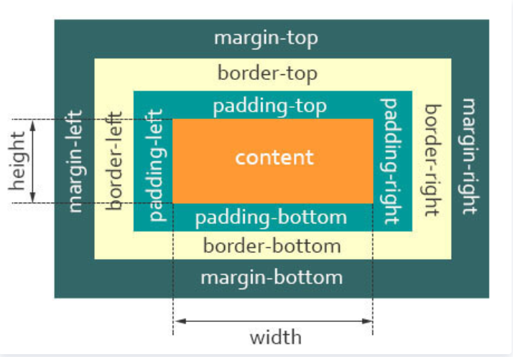

# DOM模型

前端三要素：DHTML Dynamic HTML 动态HTML技术是指描述HTML、CSS和JavaScript技术组合的术语

* HTML **结构**：超文本标记语言 Hyper Text Markup Language 决定网页的结构和内容 Structure of the Content
* CSS **表现**：层叠样式表 Cascading Style Sheets，设定网页的表现样式 Document Style
* JavaScript **行为**：是一种弱脚本语言，其源代码不需要经过编译，直接由浏览器的V8引擎解释运行，用于控制网页的行为

## *DOM介绍*

DOM Document Object Model 是一套对文档的内容进行抽象和概念化的方法

### Object 对象

JavaScript 一共有3种对象

* 用户定义对象 user-defined object：由程序员自行创建的对象
* 内建对象 native object：内建在JavaScript语言里的对象，如Array、Math和Date等
* 宿主对象 host object：浏览器提供的对象，比如最基础的BOM或者窗口对象模型

### Model 模型

## *节点*

### 元素节点

### 文本节点

# HTML

HTML, Hypertext Markup Language 超文本标记语言，是一种用于创建和设计网页结构的标记语言

## *结构*

HTML使用一系列标记 tag 来描述网页中的各种元素，如文本、图像、链接、表格等。这些标记告诉浏览器如何显示页面的内容和布局

HTML 是构建网页的基础，它由一系列的 HTML 元素（HTML element）组成，每个元素都由开始标签（opening tag）、结束标签（closing tag）和其中的内容组成。标签之间可以包含其他标签，形成一个层次结构，这种结构定义了网页的布局和组织方式


- `<!DOCTYPE html>` 声明为 HTML5 文档
- `<html>` 元素是 HTML 页面的**根元素**
- `<head>` 元素包含了文档的元（meta）数据，如 `<meta charset="utf-8">` 定义网页编码格式为 **utf-8**
- `<title>` 元素描述了文档的标题
- `<body>` 元素包含了可见的页面内容
- `<h1>` 元素定义一个大标题
- `<p>` 元素定义一个段落

### 声明

`<!DOCTYPE>` 声明有助于浏览器中正确显示网页，用来兼容以前的HTML格式

网络上有很多不同的文件，如果能够正确声明HTML的版本，浏览器就能正确显示网页内容

doctype 声明是不区分大小写的，以下方式均可（下面的都是 HTML5）

```html
<!DOCTYPE html>
<!DOCTYPE HTML>
<!doctype html>
<!Doctype Html>
```

### 可视化

head 部分是网友的基本信息，比如标题

body 部分是真正要用浏览器渲染好展示给用户的部分

## *元素*

[HTML 元素参考 - HTML（超文本标记语言） | MDN](https://developer.mozilla.org/zh-CN/docs/Web/HTML/Element#主根元素)


HTML 标签 和 HTML 元素 Element 通常都是描述同样的意思

### 块级元素 & 行级元素

在HTML中，**块级元素 / 区块元素**（Block-level elements）指的是那些默认占据整个容器宽度的元素——即使内容没有填满，它们也会在页面布局中创建一个“块”。这些元素通常用于组织页面结构和内容分段。区块元素包括但不限于以下标签：

- `<div>`：用于定义文档中的分区或节
- `<p>`：代表文本的段落
- `<h1>`, `<h2>`, ..., `<h6>`：表示六级不同重要性的标题
- `<ul>`, `<ol>`：无序列表和有序列表
- `<li>`：列表项
- `<header>`、`<footer>`、`<nav>`、`<section>`、`<article>`、`<aside>`：HTML5中新增的语义化区块元素。

每个区块元素通常都是以新行开始，并扩展到其容器的最大宽度，它们可以嵌套其他区块元素或内联元素，比如`<span>`或`<a>`

```html
<div>
  <h1>Page Title</h1>
  <p>This is a paragraph inside a div block.</p>
</div>
```

HTML 可以通过 `<div>` 和 `<span>` 将元素组合起来，它们用于对文档内容进行组织和样式化。不同之处在于它们对文档流的影响以及它们如何与 CSS 样式和 JavaScript 交互

### 内联元素

行级元素 / 内联元素 Inline elements 在HTML中是用来定义文本级的内容，例如单词或图片，它们不会以新行开始。相对于块级元素（Block-level elements），它们的主要特性是不会独占一行，而是与相邻的内联元素水平排列，直到可用空间耗尽然后折行

下面是一些内联元素的常见特点：

- **不引起换行**：内联元素通常不会导致文本换到新行上，而是继续在同一行显示，直到行的末端
- **宽度随内容变化**：内联元素的宽度由其内容决定，并非自动充满整个容器宽度，如块级元素那样
- **嵌套规则**：内联元素可以包含其他内联元素，但通常不应该包含块级元素
- **和文字在同一行中流动**：内联元素通常用于格式化文本，它们可以出现在段落或其他块级元素之内，与周围的文本在同一行中流动

### `<div>`

`<div>` 是一个块级元素（block-level element），通常用于创建页面的大块结构。`<div>` 元素本身没有任何视觉效果，但它可以通过 CSS 来进行样式化。作为块级元素，`<div>` 通常用来包裹其他块级元素和内联元素，形成文档的各部分或容器

块级元素的特点是：

- 默认占据其父元素的全部可用宽度
- 常常用于布局目的，如创建侧栏、页眉、页脚等
- 在浏览器渲染时，前后会带有换行，即每个 `<div>` 通常会开始于新的一行

例如：

```html
<div class="header">
    <h1>Welcome to My Website</h1>
</div>
```

这里，`<div>` 创建了一个包含标题的页面区块，并且可能会通过 `.header` 类来应用CSS样式

### `<span>`

`<span>` 是一个内联元素，用于对文档中的小块内容进行分组和样式化。如同 `<div>`，`<span>` 元素本身没有视觉上的变化，但可以通过CSS进行样式化

内联元素的特点是：

- 它们只占据它们需要的空间，并不强制换行
- 常用于改变一段文字的样式，而不影响整个段落或其他块级内容
- 它们不能包含块级元素

例如：

```html
<p>This is a <span class="highlight">highlighted</span> word.</p>
```

在这个例子中，`<span>` 用于突出显示“highlighted”这个词语，`.highlight` 类可以定义该词语的特殊样式，比如背景色或字体颜色的变化

### 主根元素

`<html>`：表示一个 HTML 文档的根（顶级元素），所以它也被称为根元素。所有其它元素必须是此元素的后代

### 文档元数据

元数据 Metadata 含有页面的相关信息，包括样式、脚本及数据，能帮助一些软件（例如搜索引擎、浏览器等等）更好地运用和渲染页面。对于样式和脚本的元数据，可以直接在网页里定义，也可以链接到包含相关信息的外部文件

* `<base>`：指定用于一个文档中包含的所有相对 URL 的根 URL。一份中只能有一个该元素
* `<head>`：包含文档相关的配置信息（元数据），包括文档的标题、脚本和样式表等
* `<link>`：指定当前文档与外部资源的关系。该元素最常用于链接CSS，此外也可以被用来创建站点图标（比如 favicon 样式图标和移动设备上用以显示在主屏幕的图标）
* `<meta>`：表示那些不能由其它 HTML 元相关 meta-related 元素表示的元数据信息。如：`<base>`、`<link>`、`<script>`、`<style>` 或 `<title>`
* `<style>`：包含文档或者文档部分内容的样式信息，它们会被应用于包含此元素的文档
* `<title>`：定义文档的标题，显示在浏览器的标题栏或标签页上。它只应该包含文本，若是包含有标签，则它包含的任何标签都将被忽略

## *元素*


### 块级元素 Block level element

`<div>`、`<h1> ~ <h6>`、`<p>`

* 在页面以块的形式展现
* 出现在新的一行
* 占全部宽度，要用CSS自定义

### 内联元素 Inline element

`<a>`、``、`<em>`、`<strong>`

* 通常在块级元素内
* 不会导致文本换行
* 只占必要的部分宽度


表格 table 表单 formular

表单提交：action是交给后续的js处理逻辑，HTML是一种标记语言，没法处理逻辑

## *属性 Attribute*

HTML属性为HTML元素提供附加信息。它们通常出现在开始标签 opening tag 内，并且是以名称/值对的形式存在的，如：`name="value"`。属性用于配置元素的行为或表示其特性

当找不到图片的时候，会显示 alt 里面的问题

### 全局属性

全局属性 global attribute 是可以应用于几乎所有HTML元素的属性，无论该元素是什么类型。以下是一些常用的全局属性

- `class`：指定一个或多个类名；通常用于CSS和JavaScript中对元素进行选择或操作。
- `id`：为元素指定唯一的ID，可以用于CSS样式化和JavaScript操作。
- `style`：应用内联CSS样式直接到元素上。
- `title`：为元素设置额外的信息，这些信息在鼠标悬浮时显示为提示信息（tooltip）。
- `data-*`：允许我们存储自定义数据私有给页面或应用程序的脚本。
- `lang`：声明元素内容的语言。
- `tabindex`：指定元素的Tab键控制次序。
- `accesskey`：设置一个快捷键，用户可以按下来聚焦或激活元素。
- `contenteditable`：指明页面上的内容是否可编辑。
- `hidden`：表明一个元素当前不可见。
- `draggable`：指定元素是否可拖动。

## *常用工具*

Mithril Emmet

lorem10

注释：`<!-- -->` VS中的快捷键是 `cmd+/`

# CSS

CSS, Cascading Style Sheets 层叠样式表用来控制 HTML 里的所有元素如何展现，比如，给标题元素 `<h1>` 加一个样式，变成 48 号字体，灰色，带阴影

```css
<html>
<head>
  <title>Hello</title>
  <style>
    h1 {
      color: #333333;
      font-size: 48px;
      text-shadow: 3px 3px 3px #666666;
    }
  </style>
</head>
<body>
  <h1>Hello, world!</h1>
</body>
</html>
```


## *Properties*

### 盒子模型

所有HTML元素可以看作盒子，CSS中 box model 这一术语是用来设计和布局时使用

CSS盒模型本质上是一个盒子，封装周围的HTML元素，它包括：边距，边框，填充，和实际内容

盒模型允许我们在其它元素和周围元素边框之间的空间放置元素

下面的图片说明了盒子模型



外边距塌陷：两个盒子放在一块的时候只有一份外边距（两个里面最大的那个）

padding和margin的使用方法相同，下面以margin为实例给出属性

* 每个边距分别指定

  ```css
  p {
      margin-top: 5px;
      margin-bottom: 5px;
      margin-right: 10px;
      margin-left: 10px;
  }
  ```

* 紧凑的写法

  ```css
  p { margin: 5px 10px 5px 10px; } /*上右下左顺时针*/
  p { margin: 5px 10px; } /*上下边距、左右边距*/
  p { margin: 5px 10px 5px; } /*上、左右、下边距*/
  p { margin: 5px; } /*上下左右边距相同*/
  ```

  


selector 选择器 

propertiy

value

### 颜色

* 关键词网页安全色
* RGB
* RGBA alpha通道0-1表示透明度
* 十六进制值
* HSL (Hue, Saturation, Lightness)
* HSLA

### 字体

serif 有衬线

Sans-serif 无衬线

两个字体，优先级

有多个单词的字体要用引号扩起来

monospace 等宽字体 代码编辑器中常用

## *三种方式添加CSS*

### 外部样式表

CSS保存在.css文件中，在HTML的 `<head>` 部分使用 `<link>` 引用。这是最常用的方法

```html
<link rel="stylesheet" href="style.css">
```

### 内部样式表

不使用外部CSS文件，一般也是将CSS放在HTML `<head>` 的`<style>` 里

### 内联样式

仅影响一个元素，在HTML元素的style属性中添加。不推荐这么写，维护代码会非常麻烦

## *CSS选择器*

```html
<p>class="paragraph" id="para1">Lorem</p>
```

### Attribute selector

```css
p {
    color: red;
}
```

通过class来选择

```css
.paragraph {
	color: red;
}
```

通过ID来选，ID是唯一的

``` css
#para1 {
	color: red;
}
```

float 用完之后要clear

## *定位方式*

* static 静态定位
* relative 相对定位
* absolute 绝对定位
* fixed 固定定位
* sticky

# JavaScript

JavaScript 是一门解释性脚本语言，它和Sun公司开发的Java这种编译性语言没有关系（就像印度跟印度尼西亚没太大关系一样）。JavaScript的原名是LiveScript，为了吸引用户，所以蹭Java的流量把名字改成了JavaScript

JavaScript是为了让HTML具有交互性而作为脚本语言添加的，JavaScript既可以内嵌到HTML中，也可以从外部链接到HTML中

## *添加JavaScript的方式*

* 内部的JavaScript

  ```html
  <head>
  	<script>
      	// Your JavaScript
  	</script>
  </head>
  <body>
  	<script>
      	// Your JavaScript
  	</script>
  </body>
  ```

* 外部的JavaScript：将JavaScript代码作为一个单独的 `.js`

  ```html
  <head>
      <script src="script.js"></script>
  </head>
  ```

* 内联JavaScript，这种方法是最不推荐的

  ```html
  <button onclick="createParagraph()">Click me</button>
  ```

## *基础语法*

### 分号与注释问题

JavaScript每条语句既可以写分号，也可以不写（当然若是多条语句写到一行上那肯定是要用分号分隔的），但代码规范是要加分号

注释的方法和 C 语言一样，即单行用 `//`，多行用 `/**/`

支持HTML的 `<--` 注释方法，不需要写后半部分 `-->`。HTML中这种注释是支持跨行的，但是JavaScript中只支持它用于单行注释。但发生混淆，不建议这么注释

### 数据类型

JavaScript脚本语言拥有动态类型，并且是一种弱类型语言 weakly typed，不需要明确类型声明。另外JavaScript也不没有强制规定要用 `var` 声明变量。可以用 `typeof` 来查看变量类型

* 字符串 string，使用单引号或双引号都行。数值和字符串碰到一块会自动转换成字符串

* 数值 number，数字不分为整数类型和浮点型类型，所有的数字都是64位双精度浮点数

* Boolean：`true` 和 `false`

* 数组 array

  ```js
  var beatles = Array("John", "Paul", "George", "Ringo");
  var beatles = new Array("John", "Paul", "George", "Ringo");
  var beatles = ["John", "Paul", "George", "Ringo"];
  ```

* 对象 object：对象由花括号分隔。在括号内部，对象的属性以名称和值对的形式 `(name : value)` 来定义。属性由逗号分隔

  ```js
  var person={firstname:"John", lastname:"Doe", id:5566};
  var person={
  firstname : "John",
  lastname  : "Doe",
  id        :  5566
  };
  ```

* `undefined` 表示变量不含有值，可以用 `null` 清空变量

### 恒等操作符 `===`

严格相等的恒等操作符：`==` 有类型转换，`===` 没有类型转换

```js
> 1 == true
> true
> 1 === true
> false
```

### 控制流

与C语言完全相同

## *函数*

### 函数定义

### 函数参数

### 函数调用

### 闭包

## *类*

## *对象*

# Node.js

JavaScript是一种脚本语言，需要依赖于浏览器引擎来解释它，它不能够脱离浏览器独立运行

# Bootstrap

Bootstrap 是一个广泛使用的开源前端框架，它由 Twitter 的 Mark Otto 和 Jacob Thornton 在 2011 年创建。Bootstrap 提供了一套丰富的 HTML、CSS 和 JavaScript 组件，用于快速开发响应式和移动设备优先的网页