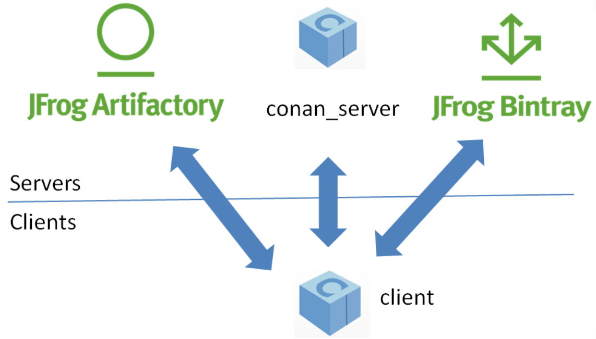

# UNIX

## *APT on Ubuntu*

在Ubuntu上，包管理工具是用于管理软件包（软件的安装、升级、删除等操作）的工具。Ubuntu使用的主要包管理工具是`APT`（Advanced Package Tool），它是一个强大而灵活的工具，用于简化软件的安装、升级和移除操作。以下是有关Ubuntu上的包管理工具的一些基本信息：

1. **APT（Advanced Package Tool）**：
   * APT是Ubuntu上的默认包管理工具，它是一个高级的、用户友好的包管理系统。
   * APT可以通过命令行进行操作，常用的命令包括：
     * `sudo apt-get update`：更新可用·00软件包列表。
     * `sudo apt-get upgrade`：升级系统上已安装的软件包。
     * `sudo apt-get install <package>`：安装软件包。
     * `sudo apt-get remove <package>`：移除软件包。
     * `sudo apt-cache search <keyword>`：搜索可用软件包。
     * `sudo apt-get autoremove`：自动删除不再需要的软件包。
2. **APT包管理工具的变体**：
   * `apt-get`：用于早期版本的APT命令行工具。
   * `apt`：是`apt-get`、`apt-cache`和其他APT工具的集成，提供更友好的命令行界面。
   * `aptitude`：另一个包管理工具，提供类似于`apt-get`的功能，但具有更强大的依赖关系解决算法。
3. **软件中心**：
   * Ubuntu还提供了一个图形用户界面的软件中心，用户可以通过图形界面轻松浏览、安装和管理软件包。
4. **Snap和Flatpak**：
   * 除了APT之外，Ubuntu还支持Snap和Flatpak，这是两种通用的软件包格式，允许在多个Linux发行版之间轻松分发软件。
   * Snap和Flatpak提供了更好的软件包隔离和依赖性管理，使得软件在不同系统上更易于部署。

总的来说，APT是Ubuntu上主要的包管理工具，它通过命令行提供了强大而灵活的软件包管理功能。对于更图形化的用户界面，用户可以使用软件中心。此外，Snap和Flatpak提供了另外的选择，使得软件的分发和管理更加灵活

## *Pacman on Arch*

# MacOS

## *Brew*

`Homebrew`（通常简称为`brew`）是一款用于macOS操作系统的包管理工具。它允许用户从命令行界面轻松安装、升级和管理各种开发工具、软件包和库。Homebrew是一个开源项目，由社区维护。以下是一些有关Homebrew的基本信息：

1. **安装Homebrew**：

   * 用户可以通过在终端中运行以下命令来安装Homebrew：

     ```
     bashCopy code
     /bin/bash -c "$(curl -fsSL https://raw.githubusercontent.com/Homebrew/install/HEAD/install.sh)"
     ```

   * 安装完成后，用户可以使用`brew`命令来执行各种包管理任务。

2. **基本命令**：

   * `brew install <package>`：安装指定的软件包。
   * `brew uninstall <package>`：卸载指定的软件包。
   * `brew upgrade`：升级所有已安装的软件包到最新版本。
   * `brew update`：更新Homebrew自身和软件包列表。
   * `brew search <keyword>`：搜索可用的软件包。
   * `brew list`：列出已安装的软件包。

3. **Formula和Casks**：

   * Homebrew使用Formula来描述和定义软件包。Formula是由社区维护的脚本，包含了构建、安装和配置软件包所需的指令。
   * Casks用于安装macOS应用程序，它们通常是图形用户界面的应用程序而不是命令行工具。

4. **自定义Tap**：

   * Homebrew支持用户创建和使用自定义Tap。Tap是存储在GitHub上的Homebrew仓库的扩展，允许用户添加其他软件包源。

5. **自动化和依赖管理**：

   * Homebrew可以自动解决软件包之间的依赖关系，确保安装的软件包可以正确运行。
   * Homebrew还允许用户使用`Brewfile`来定义一组软件包，使得在新系统上一键还原开发环境变得更加容易。

6. **社区参与**：

   * Homebrew是一个开源项目，社区驱动。任何人都可以贡献新的Formula和改进。

总的来说，Homebrew为macOS用户提供了一个方便、灵活的包管理系统，使得安装和管理开发工具以及其他软件包变得非常简单。

# Windows

## *Vcpkg*

Vcpkg 是一个开源的 C/C++ 依赖库管理器，用于简化在 Windows、Linux 和 macOS 等平台上管理和安装 C/C++ 依赖库的过程。它的目标是使 C/C++ 项目的依赖库管理变得更加容易和跨平台。

以下是一些关于 Vcpkg 的主要特点和功能：

1. **跨平台支持**：Vcpkg 可以在 Windows、Linux 和 macOS 上运行，因此你可以在不同的操作系统上管理相同的 C/C++ 依赖库。
2. **易于安装**：你可以从 GitHub 上下载 Vcpkg 的源代码并根据文档进行编译，或者在 Windows 上使用预编译的二进制版本。安装完成后，你只需将 Vcpkg 添加到系统的 PATH 环境变量中，就可以在命令行中轻松访问它。
3. **大量依赖库支持**：Vcpkg 提供了一个庞大的 C/C++ 依赖库仓库，包括常用的库如Boost、OpenCV、SDL、SQLite、Zlib 等，你可以使用 Vcpkg 轻松地安装和管理这些库。
4. **依赖库版本控制**：Vcpkg 允许你安装特定版本的依赖库，以确保项目的稳定性和兼容性。
5. **自动依赖解决**：Vcpkg 可以自动解决依赖关系，确保所需的依赖库及其版本都被正确安装。
6. **集成性**：Vcpkg 与多个常见的 C/C++ 开发环境（如Visual Studio、CMake、Makefile 等）集成得很好，使依赖库的管理变得无缝。
7. **自定义构建选项**：你可以为每个依赖库定义自定义构建选项，以满足项目特定的需求。

### 使用

1. **安装 Vcpkg**：

   在 Windows 上，你可以从 Vcpkg 的 GitHub 仓库 releases 页面下载预编译的二进制版本，并按照说明进行安装。在 macOS 和 Linux 上，你可以从源代码构建 Vcpkg。可以按照官方文档中的指南进行操作：https://github.com/microsoft/vcpkg

2. **将 Vcpkg 添加到系统 PATH**：

   在你的命令行终端中，确保将 Vcpkg 的可执行文件目录添加到系统的 PATH 环境变量中，以便能够在任何位置使用 Vcpkg 命令。示例（Windows）：

   ```cmd
   $ set PATH=%PATH%;C:\path\to\vcpkg
   ```

3. **安装依赖库**：

   使用 `vcpkg install` 命令来安装你需要的依赖库。例如，要安装 Boost 库，可以运行：

   ```cmd
   $ vcpkg install boost
   ```

   Vcpkg 将自动解析 Boost 的依赖关系，并安装所需的版本。

4. **配置项目**：

   在你的 C/C++ 项目中，你需要配置构建系统（如 CMake、Makefile 或 Visual Studio）以使用 Vcpkg 安装的依赖库。具体配置方式取决于你的项目和构建工具。在 CMake 项目中，你可以使用以下方式在 `CMakeLists.txt` 文件中指定 Vcpkg 的工具链文件：

   ```cmake
   set(CMAKE_TOOLCHAIN_FILE <vcpkg-root>/scripts/buildsystems/vcpkg.cmake)
   ```

   请替换 `<vcpkg-root>` 为你的 Vcpkg 安装路径。

5. **构建和运行项目**：

   现在，你可以构建和运行你的 C/C++ 项目，构建工具将使用 Vcpkg 管理的依赖库。

6. **更新依赖库**：

   你可以使用 `vcpkg update` 和 `vcpkg upgrade` 命令来更新 Vcpkg 仓库中的依赖库版本。

7. **自定义构建选项**（可选）：

   如果需要，你可以为特定的依赖库定义自定义构建选项，以满足项目的需求。这些选项通常可以在 Vcpkg 的 GitHub 仓库中的 `ports` 目录中找到

# Conan

https://zhuanlan.zhihu.com/p/613174589

## *intro*

### 作用

Conan是一款免费开源的 C/C++语言的依赖项和包管理器，它的作用类似于Java使用的Maven，它适用于所有平台、可用于开发所有目标，包括嵌入式，移动（iOS，Android）和裸机。它还与所有build系统集成

Conan的作用是

* 下载、构建和部署所有库到我们的系统
* 输出一个文件，告诉我们的操作系统 `.bin` 到包含的路径

### 架构



- Conan Client：Conan的客户端是一个基于命令行的程序，支持包的创建和使用。Conan客户端有一个包的本地缓存，因此完全可以离线的创建和测试和使用本地的包
- JFrog Artifactory Community Edition (CE)：[JFrog Artifactory Community Edition (CE)](https://conan.io/downloads.html)是官方推荐的用于私有部署的Conan服务器程序。这个是JFrog Artifactory的免费社区版，包含了WebUI、LDAP协议、拓扑管理、REST API以及能够存储构建物的通用仓库。下载Docker Image：`docker pull docker.bintray.io/jfrog/artifactory-cpp-ce`，运行方式参见[文档](https://www.jfrog.com/confluence/display/RTF5X/Installing+with+Docker)
- Conan Server：这是一个与Conan Client一起发布的小的服务端程序。它是一个Conan服务端的开源实现，只包含服务端的基本功能，没有WebUI以及其它高级功能
- [ConanCenter](https://conan.io/center/)：和Maven的中心Jar包库一样，Conan也有一个官方的中央仓，用于管理社区贡献的各种流行开源库，例如Boost，Zlib，OpenSSL，Poco等

## *使用*

### 编写conanfile.py

Conan中的包由一个 conanfile.py 定义。该文件定义了包的依赖、包含的源码、以及如何从源码构建出二进制文件。一个包的conanfile.py配置可以生成任意数量的二进制文件，每个二进制可以面向不同的平台和配置（操作系统、体系结构、编译器、以及构件类型等等）

在当前 conanfile 所在路径打开 cmd prompt，执行

```cmd
$ conan install .
```

```cmd
$ conan remove <lib_name>
```


# Rust

