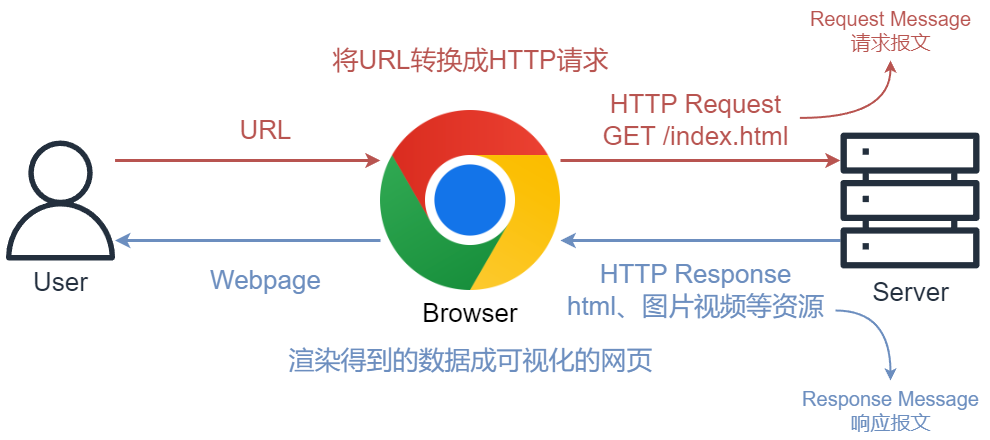

# WSGI

## *Architecture* of a Python Web


[What is Gunicorn?. The standard web servers such as… | by Serdar İlarslan | Medium](https://medium.com/@serdarilarslan/what-is-gunicorn-5e674fff131b)

[Deploying to Production — Flask Documentation (3.1.x)](https://flask.palletsprojects.com/en/stable/deploying/)


Flask 自带的服务器是单线程的，并且默认不支持处理多个请求的并发。这意味着它只能在同一时间处理一个客户端的请求。相比之下，Gunicorn 是一个预先分叉（pre-forked）的WSGI服务器，它可以启动多个工作进程来处理并发请求，大大提高了应用的响应能力和吞吐量


[Using SQLAlchemy and Flask to build a simple, data-driven web app | by Chris Morrow | Medium](https://cmmorrow.medium.com/using-sqlalchemy-and-flask-to-build-a-simple-data-driven-web-app-17e2d43778bb)


## *WSGI*

Web Server Gateway Interface, WSGI，是 Python 社区制定的一个 Web 服务器与 Python 应用程序或框架之间的通信接口标准 / 规范。WSGI 旨在为 Python 应用提供一种简单且通用的机制，以促进 Python Web 框架应用和多种 Web 服务器之间的移植性

在 WSGI 出现之前，Python 的 Web 应用通常依赖于特定的 Web 服务器软件，这意味着不同的 Web 应用和框架很难在不同的服务器之间进行移植。WSGI 的推出解决了这个问题，它定义了一个清晰的规范，使得任何遵循 WSGI 的 Web 应用都能够在任何支持 WSGI 的 Web 服务器上运行

WSGI 提供了一种标准化的方式让 Web 应用和 Web 服务器进行通信，这意味着：

- 开发人员可以选择他们喜欢的任何 WSGI 兼容的 Web 框架来编写应用，如 Flask、Django 等
- 当需要部署时，可以选择最佳的服务器软件（如 Gunicorn、Nginx、uWSGI、Apache mod_wsgi 等），而无需修改应用代码

### 组件

WSGI 规范主要定义了两方面的内容：

1. **WSGI 服务器**（或“网关”）：负责处理原始的 HTTP 请求、解析环境信息以及组装输入数据并传递给应用程序
2. **WSGI 应用程序**：是一个可调用对象（通常是一个函数或者一个类实例），它接收两个参数，一个表示环境信息的字典 `environ`，以及一个可调用的响应开始函数 `start_response`。应用程序使用这些信息来构建 HTTP 响应

### WSGI 应用示例

Python 内置了一个叫做 wsgiref 的 WSGI 服务器模块，它是用纯 Python 编写的 WSGI 服务器的参考实现。所谓参考实现是指该实现完全符合 WSGI 标准，但是不考虑任何运行效率，仅供开发和测试使用

下面是一个非常基础的 WSGI 应用示例：

```python
# hello.py

def application(environ, start_response):
    start_response('200 OK', [('Content-Type', 'text/html')])
    return [b'<h1>Hello, web!</h1>']
```

```python
# server.py
# 从wsgiref模块导入:
from wsgiref.simple_server import make_server
# 导入我们自己编写的application函数:
from hello import application

# 创建一个服务器，IP地址为空，端口是8000，处理函数是application:
httpd = make_server('', 8000, application)
print('Serving HTTP on port 8000...')
# 开始监听HTTP请求:
httpd.serve_forever()
```

在这个示例中，`application` 函数就是一个 WSGI 应用。该函数接收两个参数：`environ` 字典包含了请求的所有信息，而 `start_response` 是一个回调函数，用来发送响应状态和响应头。最后返回的是一个响应体的字节串列表

### WSGI 中间件

WSGI 还允许开发者创建中间件，即可以同时充当服务器和应用程序的组件。中间件可以处理请求、响应或者两者，然后将其传递给下一个 WSGI 组件

例如，一个中间件可能会处理身份验证、日志记录、请求/响应修改等任务

### WSGI 工具库

WSGI 工具库提供了用于开发符合 WSGI 标准的 web 应用的工具和功能。工具库中可能包括：

- Request 和 Response 对象封装：简化了 HTTP 请求和响应的处理
- 中间件组件：在请求/响应流程中提供钩子用于执行额外的逻辑，如会话管理、认证等
- 服务启动和管理：帮助开发者启动 WSGI 应用，并与多种 web 服务器集成
- 实用工具函数：例如 URL 路由解析、模板渲染、表单数据处理等

一些流行的 WSGI 工具库包括 Werkzeug（作为 Flask 的基础组件）和 WebOb 等

## *Werkzeug*

Werkzeug 是一个 Python 的综合 WSGI 工具库，它为开发 Python web 应用程序提供了一系列实用的工具和函数

Werkzeug 自身并不是一个完整的 web 框架，并且没有提供像模板渲染或数据库抽象这样高级的功能，它更多的是作为其他库和框架的构建块

### 数据结构

Werkzeug 的 Mutl!Dict 类是字典的子类，它主要实现了同一个键对应多个值的情况。比如一个文件上传宇段可能会接收多个文件。这时就可以通过 `getlist()` 来荻取文件对象列表。而 ImmutableMultiDict 类继承了 MutliDict 类，但其值不可更改

# Flask 简介

## *Flask 框架*

用 Python 开发一个 Web 框架十分容易，所以 Python 有上百个开源的 Web 框架。这章我们介绍一个很常用的 Python 微框架 Flask

[Flask 入门教程 (helloflask.com)](https://tutorial.helloflask.com/)

```cmd
$ pip3 install flask
```

### 路由装饰器

```python
from flask import Flask, render_template

app = Flask(__name__)

@app.route('/')
def index():
    return 'Hello, World!'

@app.route('/hello/<name>')
def hello(name):
    # 使用渲染模板返回个性化的问候信息
    return render_template('hello.html', name=name)

if __name__ == '__main__':
    app.run(debug=True)
```

上面的代码创建了一个最简单的 Flask 应用。我们使用 `app.route()` 装饰器告诉 Flask，当用户访问应用的根 URL（即 `'/'`）时，应该调用 `index` 函数，并返回 `'Hello, World!'` 字符串。这个字符串会显示在用户的浏览器中

* 通过 `Flask()` 构造器返回 WSGI 句柄对象
* Flask 通过 Python 装饰器 `@app.route()` 内部自动地把某个 URL 和视图函数给关联起来。每个视图函数返回的内容可以是 HTML 页面，也可以是其他类型的响应。这种映射关系定义了 Flask 应用的路由

`@app.route` 可以接收多个参数

- **rule**：这是与装饰器关联的 URL 规则（即路径），它是一个字符串，必须以 `/` 开头。这里的 URL 是相对 URL（或内部 URL），即不包含域名的 URL。例如：`@app.route('/about')` 会将函数映射到网站的 `/about` 路径上
- **methods**：这是一个列表，用来指定视图函数可以响应的 HTTP 方法（如 `GET`, `POST`, `PUT`, `DELETE` 等）。**默认情况下，路由只会响应 `GET` 请求**。如果想处理其他类型的请求，需要相应地设置这个列表。例如：`@app.route('/submit', methods=['POST'])` 表明 `submit` 函数将响应 POST 请求
- **endpoint**：Flask 内部使用端点（endpoint）名字来唯一地标识一个视图函数，如果不显式地指定，Flask 默认使用视图函数的名称作为端点名
- **strict_slashes**：如果设置为 `False`，对于同一个路由，Flask 将不区分末尾斜杠的有无。例如，`/about` 和 `/about/` 会被认为是相同的路径
- **redirect_to**：如果设置了这个参数，访问这个路由会立即重定向到提供的地址
- **defaults**：可以为视图函数的参数提供默认值，它接受一个 dict，里面存储着 URL 中动态变量的映射关系。这在创建 URL 中包含可选参数时非常有用
- **subdomain**：指定该路由仅适用于特定的子域。这允许同一应用为不同的子域提供不同的视图函数
- **host**：类似于 `subdomain`，但它允许你为整个主机名指定路由
- **provide_automatic_options**：是否自动添加 `OPTIONS` HTTP 方法作为视图函数支持的方法之一。默认情况下，Flask 会自动管理

### View Functions

视图函数 view functions 是 Flask 应用中的一个核心概念，它用于响应 requests，即它是**与特定 URL 规则关联的函数**。当访问与该函数关联的 URL 时，Flask 将执行视图函数，并将其返回值作为响应发送给客户端。视图函数负责处理 HTTP 请求并根据请求内容生成相应的 HTTP 响应

在一个典型的 Flask 应用中，视图函数通常会做以下几件事：

1. 获取 HTTP 请求信息：通过 `flask.request` 对象获取请求方法、表单数据、查询参数、cookies 等
2. 执行业务逻辑：处理数据、执行计算或者与数据库交互等操作
3. 返回响应：返回字符串、生成 HTML 页面，或者使用 `jsonify` 返回 JSON 数据，以及设置状态码、重定向、设置 cookies 等


[flask.Request — Flask API](https://tedboy.github.io/flask/generated/generated/flask.Request.html)

### render_template

`render_template` 是一个函数，通常用于 Python 的 Flask web 框架中。它用于将你的 HTML 模板文件与后端的 Python 数据结合起来，并生成最终的 HTML 响应内容发送给客户端（比如用户的浏览器）。

在 Flask 应用程序中，`render_template` 函数位于 `flask` 模块中，负责读取模板文件（通常是 Jinja2 模板），填充其中的动态内容，并返回渲染好的 HTML 字符串。这样可以使得在服务器端创建动态网页变得简单。

使用 `render_template` 时，通常会提供模板的名字和需要传递给模板的任何参数作为关键字参数。例如：

```python
from flask import Flask, render_template

app = Flask(__name__)

@app.route('/')
def index():
    user_name = "Visitor"
    return render_template('index.html', name=user_name)

if __name__ == '__main__':
    app.run(debug=True)
```

在上述例子中，`'index.html'` 是存放在 Flask 应用的 `templates/` 目录下的模板文件。`render_template` 会渲染此模板，并使用 `user_name` 变量的值替换模板中相应的占位符。最终返回的是经过渲染的 HTML 页面，其内容是基于 `index.html` 模板并插入了 "Visitor" 作为用户名的结果


## *Flask Cli*


# Flask & HTTP

关于 HTTP 的内容可以复习 *计算机网络.md*



HTTP 请求解析和响应封装实际上大部分是由 Werkzeug 完成的， Flask 子类化 Werkzeug 的请求 `Request` 类和响应 `Response` 类，并且添加了和程序相关的特定功能

## *HTTP Request*

`flask.request` 是 Flask 框架中封装的代表当前请求的对象，它封装了客户端发出的 HTTP 请求的内容。每当一个请求到达 Flask 应用时，Flask 会创建一个 `request` 对象，其中包含了这个 HTTP 请求的所有信息。这个对象只在函数处理请求的过程中有效，它是上下文局部的，这意味着可以在不同的线程中安全地访问相同的请求

### request 属性

- method：一个字符串，表示该请求使用的HTTP方法，如 `'GET'`, `'POST'`, `'PUT'`, 等
- scheme：请求使用的协议方案（如 `'http'` 或 `'https'`）
- **args**：一个不可变的 MultiDict 类型的字典，包含了URL的查询参数
- form：一个 MultiDict 类型的字典，包含了表单数据（通常来自于 POST 或 PUT 请求的 `application/x-www-form-urlencoded` 或 `multipart/form-data` 编码的表单）
- values：一个 CombinedMultiDict 类型的字典，结合了 `args` 和 `form` 的参数
- json：如果请求的 MIME 类型是 `application/json`，这个属性将包含解析的 JSON 数据
- data：包含原始请求数据的字节串
- cookies：一个字典，包含了请求中的 cookie
- headers：一个包含所有 HTTP 头部的字典，对大小写不敏感。
- files：一个 MultiDict 类型的字典，包含了所有上传的文件
- remote_addr：字符串形式的客户端IP地址
- url：请求的完整 URL
- base_url：URL 的基础部分，不包括查询参数
- url_root：URL 的根路径（基础URL加上末尾的斜杠）
- path：请求的URL路径
- query_string：URL的查询字符串的原始格式

### request 方法

- `get_json(force=False, silent=False, cache=True)`：解析并返回请求的 JSON 数据。如果 `force` 为 `True`，即使 MIME 类型不是 `application/json` 也会进行解析；如果 `silent` 为 `True`，出错时会返回 `None` 而不是抛出异常
- `is_xhr()`：已被弃用。之前用于检查请求是否由 XMLHttpRequest 发起

### Hook

有时我们需要对请求进行预处理 preprocessing 和后处理 postprocessing ，这时可以使用 Flask 提供的一些请求钩子 Hook ，它们可以用来注册在请求处理的不同阶段执行的回调函数 callback

* before_first_request：注册一个在处理第一个诮求前运行的函数
* before_request：注册一个在处理每个请求前运行的函数
* after_request：注册一个函数，如果没有未处理的异常抛出，则会在每个请求结束后运行
* teardown_request：注册一个函数， 即使有未处理的异常抛出，会在每个请求结束后运行。如果发生异常，会传入异常对象作为参数到注册的函数中
* after_this_request：在视图函数内注册一个函数，会在这个悄求结束后运行

这些钩子使用起来和 `app.route()` 装饰器基本相同， 每个钩子可以注册任意多个处理函数\

## *HTTP Response*

Flask 会先判断是否可以找到与请求 URL 相匹配的路由，如果没有则返回404 响应。如果找到， 则调用对应的视图函数， 视图函数的返回值构成了响应
报文的主体内容，正确返回时状态码默认为 200

Flask 会调用 `make_response()` 将视图函数返回值转换为响应对象。视图函数可以返回最多由三个元素组成的元组： 响应主体、状态码、首部字段。其中首部字段可以为字典，或是两元素元组组成的列表

### 重定向

在 Web 程序中，我们经常需要进行重定向。比如当某个用户在没有经过认证的情况下访问需要登录后才能访问的资源， 程序通常会重定向到登录页面

对千重定向这一类特殊响应， Flask 提供了一些辅助函数。除了手动生成 302 响应，我们可以使用 Flask 提供的 `redirect()` 来生成重定向响应，重定向的目标URL 作为第一个参数

## *Flask 上下文*

Flask 使用上下文 context 来临时将某些对象变为全局可访问，这样开发者可以在不同的部分简洁地引用这些对象，而无需通过参数传递，这带来了很多的遍历，但是在处理多线程时也容易引发一些问题。在 Flask 中，主要有两种类型的上下文：应用 / 程序上下文 application context 和请求上下文 request context

### 应用上下文

应用上下文和当前激活的应用相关联。主要包含以下对象：

- **current_app**：当前激活的 Flask 应用实例
- **g**：一个用于存储在一个请求周期中的数据的对象，通常用于保存和共享临时数据

应用上下文在需要与应用交互或访问应用配置等场合非常有用。它允许开发者编写视图函数和其他代码，而不必显式地传递应用实例

### 请求上下文

请求上下文包含了处理一个请求过程中的数据。主要包含以下对象：

- **request**：一个请求对象，封装了客户端发送的 HTTP 请求的内容
- **session**：用户会话，用于存储请求之间需要“记住”的值的字典。这是浏览器和服务器之间的持久连接，直到会话被明确地关闭

每当 Flask 应用接收到一个请求时，它就会创建一个请求上下文，并在处理该请求时保持激活状态。请求处理完毕后，上下文被销毁

Flask 确保每个线程只处理一个请求，因此 `current_app` 和 `request` 这样的变量虽然在代码中是全局访问的，但它们实际上是线程隔离的。这意味着在并发环境中，每个请求都有其独立的上下文，从而避免了数据冲突

上下文的使用让开发者能够方便地编写扩展和通用的代码，因为它省去了频繁的参数传递。然而，它也要求开发者理解上下文的生命周期，以及什么时候和怎样正确地使用这些看似全局的变量

## *HTTP 进阶*

### Ajax 异步请求

# 模板


本章展示的是 Jinja2 模板引擎


Jinja2 是一个非常流行的模板引擎 template engine，用于 Python 编程语言。它提供了一种表达式和控制结构来动态地生成 HTML 或其他标记语言文档。Jinja2 的语法非常类似于 Python

### 分隔符

Jinja2 有三种分隔符 delimiter

* `{# ... #}` 表示注释

  ```jinja2
  {# This is a comment and won't be rendered. #}
  ```

* `{{ ... }}` 双大括号用来输出变量或表达式的结果

* `` 大括号百分号用于执行语句，比如循环、条件判断或定义块

## *变量*

### 变量定义

在 Jinja2 模板中，定义变量通常是通过从后端框架（例如 Flask 或 Django）传递上下文数据到模板来实现的。不过，在模板内部，也可以使用 `` 标签定义或重新赋值变量

以下是在 Jinja2 中定义和使用变量的几种方式

* 从后端框架传递变量

  后端应用通常向模板渲染函数传递一个上下文对象，该对象包含可在模板中使用的变量。以 Flask 为例

  ```python
  @app.route('/')
  def index():
      # 定义 Python 变量
      user_name = 'Alice'
      # 将变量作为上下文传递给模板
      return render_template('index.html', user_name=user_name)
  ```

  在 `index.html` 模板中，可以这样使用这个变量

  ```jinja2
  <p>Hello, {{ user_name }}!</p>
  ```

* 在模板中定义变量

  可以直接在模板中使用 `` 来定义变量

  ```jinja2
  
  <p>The user is {{ user_age }} years old.</p>
  ```

### 作用域

## *控制流*

### 条件控制

使用 ``、`` 和 `` 来进行条件判断

```jinja2

  <p>Welcome back, {{ user.name }}!</p>

  <p>Please log in to continue.</p>

```

### 循环

使用 `` 和 `` 进行循环迭代

```jinja2
<ul>

  <li>{{ item }}</li>

</ul>
```

### 宏

Jinja2 里没有函数，用宏可以用于定义可以重用的模板片段

* 定义宏

  下面的宏定义创建了一个自定义的 `input` HTML 元素，接受参数 `name`、`value` 和 `type`

  ```jinja2
  
  <input type="{{ type }}" name="{{ name }}" value="{{ value | escape }}">
  
  ```

* 调用宏

  ```jinja2
  {{ input('username') }}
  {{ input('email', type='email') }}
  ```

* 导入宏

  如果有多个模板，并且想在不同模板中重用相同的宏，可以将其放入单独的文件中，并在需要时导入它们

  假设宏定义在名为 `_macros.html` 的文件中

  ```jinja2
  
  ```

## *模块*

### block

块（blocks）是可以在子模板中重写的部分，这些块在父模板中被定义，并可以在子模板中填充。例如，在 `base.html` 中

```jinja2
<title>Default Page Title</title>
```

然后在子模板中重写

```jinja2
Page Title
```

### extends

继承允许基于一个基础模板来创建子模板，通过 `` 声明。例如

```jinja2

```

## *过滤器*

过滤器可以修改变量的显示方式，通过管道符号 `|` 应用。例如，使用 `capitalize` 过滤器将字符串首字母大写

```jinja2
<p>{{ user_name|capitalize }}</p>
```

多个过滤器可以通过 `|` 链式调用

### 内置过滤器

* safe
* capitalize
* lower
* upper
* title
* trim
* striptags
* escape（或使用缩写 e）
* replace
* default
* length
* jsonify
* sort

### 自定义过滤器

除了使用内置过滤器之外，还可以创建自定义过滤器。这通常在 Python 代码中完成，并添加到 Jinja2 环境中

```python
def reverse(s):
    return s[::-1]

# 添加自定义过滤器到 Jinja2 环境
env.filters['reverse'] = reverse
```

在模板中使用自定义过滤器

```jinja2
{{ "olleh" | reverse }}
```


# 静态文件

## *静态 vs. 动态*

### 动态生成

动态生成内容指的是网页或应用程序在接收到用户请求时，通过服务器端的处理逻辑实时生成并提供给用户的内容。这与静态内容不同，后者是预先创建好并保存在服务器上的文件，对于所有用户和访问都是相同的

动态内容通常由如下几个步骤产生：

1. **用户请求**：用户通过浏览器发出请求，这可能是访问一个网址、提交表单、点击链接或执行其他交互操作
2. **服务器处理**：服务器接收到请求后，会根据需要运行服务器端脚本或程序。这些脚本可能使用PHP、Python、Ruby、Node.js 等编程语言编写
3. **数据库交云**：动态内容往往涉及到数据库查询。服务器端逻辑将根据用户请求向数据库发送查询命令，并从数据库获取数据
4. **内容生成**：服务器端程序将查询结果和其他处理逻辑结合起来，动态生成HTML页面或其他类型的响应（如 JSON、XML）
5. **发送响应**：最后服务器将生成的内容作为响应发送回用户的浏览器

例如，当用户在在线商店中搜索商品时，服务器会根据用户输入的搜索关键词，在数据库中查找匹配的商品信息，并将结果动态地生成为一个包含这些商品列表的HTML页面。这个过程涉及实时的计算和数据处理，使得每个用户根据不同的搜索条件得到定制化的内容

动态内容使得网站可以提供更加个性化、交云密切的用户体验。随着用户或数据的变化，显示给用户的内容也会随之改变。这种技术广泛应用于电子商务网站、社交网络平台、新闻门户网站以及任何需要根据用户输入或交互即时更新内容的在线服务

### 静态文件

静态文件指的是在服务器上不需要经过处理，可以直接由服务器对外提供并被客户端浏览器访问的文件。这些文件通常不包含服务器端脚本或程序代码，不会动态生成内容，每个用户访问时看到的内容都是相同的

静态文件的常见类型包括：

- HTML 文件 (`*.html`, `*.htm`)：静态标记语言文件，定义网页结构和内容
- CSS 文件 (`*.css`)：级联样式表文件，用于描述网页的呈现样式
- JavaScript 文件 (`*.js`)：客户端脚本语言文件，尽管它们可以创建动态交互效果，但作为文件本身来说，仍然是静态的
- 图像文件：如 JPEG (`*.jpg`, `*.jpeg`), GIF (`*.gif`), PNG (`*.png`), SVG (`*.svg`) 等格式的图像
- 字体文件：如 WOFF (`*.woff`), WOFF2 (`*.woff2`), TTF (`*.ttf`) 等格式的网页字体
- 音频文件：如 MP3 (`*.mp3`), WAV (`*.wav`) 等格式的声音文件
- 视频文件：如 MP4 (`*.mp4`), WebM (`*.webm`) 等格式的视频文件
- 文档：如 PDF (`*.pdf`), 文本文件 (`*.txt`) 等

这些文件被称为"静态"是因为它们自身的内容不会根据请求的不同而改变。相对应地，动态文件或页面通常是由服务器端应用程序生成的，如 PHP, Ruby, Python 等服务器端语言动态创建的内容，并且可以根据用户的请求或其他应用逻辑来定制内容

在 web 开发中，通常将静态文件放在专门的文件夹（例如命名为`static`, `assets`, `public`等）中，以便于理和通过 URL 直接访问这些资源

# Dash

Dash 是一个开源的 Python web 应用框架，专门为创建交互式的 web 分析应用程序而设计。它是由 Plotly 公司开发的，并建立在 Flask、Plotly.js 和 React.js 之上。Dash 旨在使数据科学家和分析师能够轻松地构建具有复杂用户界面（UI）元素的数据可视化界面，而无需深入了解前端技术