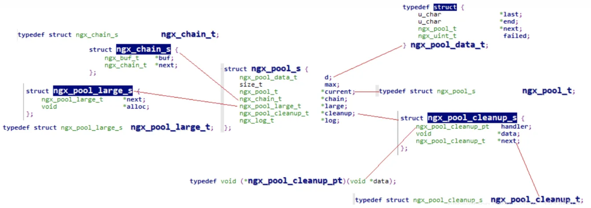
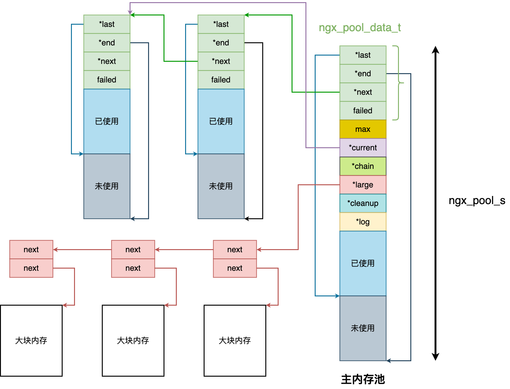
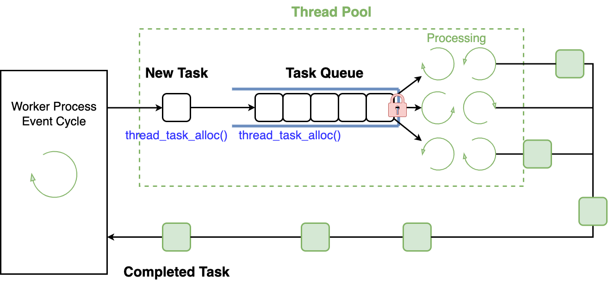
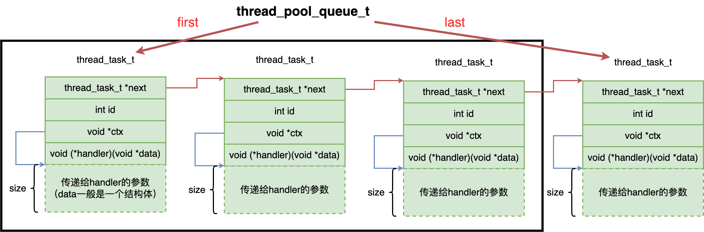

# 介绍 & 架构

## *Intro*

Nginx（发音为"engine-x"）是一个高性能的开源Web服务器，也可以用作反向代理服务器、负载均衡器、HTTP缓存和应用程序防火墙等。它的主要目标是提供快速、可靠、高性能的网络服务，特别适用于处理高并发的网络流量

Nginx代码完全用C语言从头写成，已经移植到许多体系结构和操作系统，包括：Linux、FreeBSD、Solaris、Mac OS X、AIX以及Microsoft Windows

Nginx有自己的函数库，并且除了zlib、PCRE和OpenSSL之外，标准模块只使用系统C库函数。而且，如果不需要或者考虑到潜在的授权冲突，可以不使用这些第三方库

Nginx (engine x) 是一个高性能的HTTP和反向代理web服务器，同时也提供了IMAP/POP3/SMTP服务。Nginx是由伊戈尔·赛索耶夫为俄罗斯访问量第二的Rambler.ru站点（俄文：Рамблер）开发的，第一个公开版本0.1.0发布于2004年10月4日

其将源代码以类BSD许可证的形式发布，因它的稳定性、丰富的功能集、示例配置文件和低系统资源的消耗而闻名。2011年6月1日，nginx 1.0.4发布

Nginx是一款轻量级的Web 服务器/反向代理服务器及电子邮件（IMAP/POP3）代理服务器，在BSD-like 协议下发行。其特点是占有内存少，并发能力强，事实上nginx的并发能力在同类型的网页服务器中表现较好，中国大陆使用nginx网站用户有：百度、京东、新浪、网易、腾讯、淘宝等

## *安装*

### Ubuntu

* 检查系统上是否已经安装 Nginx

  ```cmd
  $ ps -ef | grep nginx
  ```

* 添加 Nginx 的 apt 源

* 安装

  PGP, Pretty Good Privacy 是一种用于加密和签名数据的标准。PGP旨在提供保密性、数据完整性和身份验证，并广泛用于加密电子邮件、文件以及验证软件包的完整性


**nginx文件安装完成之后的文件位置：**

* /usr/sbin/nginx：主程序
* /etc/nginx：存放配置文件
* /usr/share/nginx：存放静态文件
* /var/log/nginx：存放日志

## *模块*

每个Nginx模块都有其特定的功能和用途，可以根据需要选择和配置这些模块来满足特定的要求。模块的支持和功能可以根据Nginx的编译选项和配置文件进行自定义

1. **Core模块**：这些模块提供了Nginx服务器的基本功能，包括HTTP核心模块、Events模块、Main模块等。
2. **HTTP模块**：HTTP模块包括许多子模块，如`ngx_http_core_module`（HTTP核心功能）、`ngx_http_ssl_module`（SSL/TLS支持）、`ngx_http_proxy_module`（反向代理支持）、`ngx_http_fastcgi_module`（FastCGI支持）、`ngx_http_rewrite_module`（URL重写）等。
3. **Security模块**：这些模块增强了Nginx的安全性，如`ngx_http_security_module`（提供防火墙和黑名单功能）和`ngx_http_headers_module`（用于设置HTTP响应头的安全性）。
4. **Load Balancing模块**：这些模块用于实现负载均衡，包括`ngx_http_upstream_module`和`ngx_http_proxy_module`。
5. **Caching模块**：Nginx具有内置的HTTP缓存功能，可以通过`ngx_http_proxy_module`、`ngx_http_fastcgi_module`等模块来实现。
6. **Access Control模块**：这些模块用于控制对Nginx服务器和资源的访问，如`ngx_http_auth_basic_module`（基本HTTP身份验证）和`ngx_http_access_module`（基于IP的访问控制）。
7. **Compression模块**：Nginx支持HTTP压缩，可以通过`ngx_http_gzip_module`来启用。
8. **Mail模块**：Nginx还可以用作邮件代理服务器，支持SMTP、POP3和IMAP协议，这些功能可以通过`ngx_mail_core_module`和相关子模块来实现。
9. **Third-party模块**：除了Nginx的官方模块，还有许多第三方模块可供选择，用于添加更多功能，如缓存清除、统计、日志处理、安全性增强等。


# 内存池

https://zhuanlan.zhihu.com/p/535900044

Nginx的内存池模块定义在ngx_palloc.h和ngx_palloc.c文件中

Nginx 为每一个 TCP 连接都分配了1个内存池，HTTP框架则为每一个HTTP请求又分配了1个内存池

## *架构 & 核心数据结构*

### ngx_pool_t

**Ngnix内存池分为主内存池和其他内存池**，主内存用来管理其他内存池，和自身初始具有的能够分配的内存。主内存池和其他内存池都用 `ngx_pool_t` 结构体来组织管理。这和ptmalloc用统一用malloc_state来描述主分配区和非主分配区是一样的设计思路

```c
// nginx内存池的主结构体类型
struct ngx_pool_s {
    ngx_pool_data_t      d;         // 内存池的数据头
    size_t               max;       // 小块内存分配的最大值 = 内存池总大小 - 头部大小
    ngx_pool_t          *current;   // 小块内存池入口指针，与fail有关
    ngx_chain_t         *chain;
    ngx_pool_large_t    *large;     // 大块内存分配入口指针
    ngx_pool_cleanup_t  *cleanup;   // 清理函数handler的入口指针
    ngx_log_t           *log;
};
typedef struct ngx_pool_s ngx_pool_t;
//其中ngx_pool_data_t结构如下
typedef struct {
    u_char               *last;		//当前内存池分配到的末尾地址，即下一次分配开始地址
    u_char               *end;		//内存池结束位置
    ngx_pool_t           *next;		//下一块内存
    ngx_uint_t            failed;	//当前块内存分配失败次数
} ngx_pool_data_t;
```

具体使用到的数据结构之间的关系为



### 架构



Nginx对于**每个HTTP请求或者TCP/IP连接**都会建立相应的内存池，建立好内存池之后，我们可以直接从内存池中申请所需要的内存，不用去管内存的释放，当内存池使用完成之后一次性销毁内存池

区分大小内存块的申请和释放，大于池尺寸的定义为大内存块，使用单独的大内存块链表保存，即时分配和释放；小于等于池尺寸的定义为小内存块，直接从预先分配的内存块中提取，不够就扩充池中的内存，在生命周期内对小块内存不做释放，直到最后统一销毁

注意：Nginx内存池和其他系统级内存池很不同的一点是，它的扩容是直接扩一个其他内存池，主内存池不会扩容。申请达到fail次后扩容，然后主内存池的current就会指向新扩的那个

## *操作*

### 内存池创建、销毁和重置

* `ngx_create_pool`：创建内存池

  注意： size 参数并不等同于可分配空间，它同时包含了管理结构的大小。这意味着：size 绝不能小于 `sizeof(ngx_pool_t)`，否则就会有内存越界错误

  通常可以设 size 为 NGX_DEFAULT_POOL_SIZE，该宏目前 16KB，不用担心 16KB会不够用，当这第一个16KB用完时，会自动再分配 16KB 内存的

* `ngx_destroy_pool`：销毁内存池

  它同时会把通过该pool分配出的内存释放，而且，还会执行通过 `ngx_pool_cleanup_add` 方法添加的各类资源清理方法

* `ngx_reset_pool`：重置内存池

  即将内存池中的原有内存释放后继续使用。这个方法的实现是，会把大块内存释放给操作系统，而小块内存则在不释放的情况下复用

### 内存池申请、释放和回收操作

* `ngx_palloc`：分配地址对齐的内存

  按总线长度，比方说 `sizeof(unsigned long)` 对齐地址后，可以减少CPU读取内存的次数，当然代价是有一些内存浪费

* `ngx_pnalloc`：分配内存时不进行地址对齐

* `ngx_pcalloc`：分配出地址对齐的内存后，再调用 memset 将这些内存全部清0

* `ngx_pmemalign`

* `ngx_pfree`

### 同步释放资源

* `ngx_pool_cleanup_add`
* `ngx_pool_run_cleanup_file`
* `ngx_pool_cleanup_file`
* `ngx_pool_delete_file`

### 与内存池无关的分配、释放

* `ngx_alloc`
* `ngx_calloc`
* `ngx_free`

# 线程池



### 任务队列


