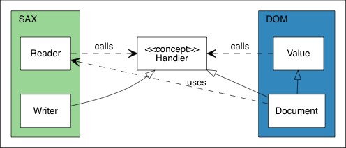
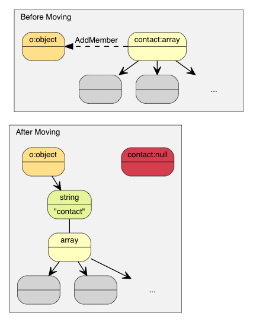

# Intro

[Tencent/rapidjson: A fast JSON parser/generator for C++ with both SAX/DOM style API (github.com)](https://github.com/Tencent/rapidjson?tab=readme-ov-file)、

[RapidJSON: 首页](https://rapidjson.org/zh-cn/)

Tencent/rapidjson - 单纯的 JSON 库，甚至没依赖 STL

### 安装

```cmd
$ git clone --depth 1 --progress https://github.com/Tencent/rapidjson.git
$ cd rapidjson
$ cmake -S . -B build
$ cd build
$ make install
```

### Use RapidJSON with CMake

```cmake
find_package(RapidJSON REQUIRED CONFIG)
include_directories(${RapidJSON_INCLUDE_DIRS})

target_link_libraries(my_exe
  ${RapidJSON_LIBS}
)
```

# DOM & SAX风格API

其实DOM和SAX两种解析风格都是用于XML文件的（*序列化与反序列化协议.md*），RapidJSON借用了这两种名字来描述它的两种JSON解析器风格 

## *DOM*

JSON被解析到一个内存中的DOM-like（Document Object Model）结构。这意味着整个JSON文档被读取并转换成一个树状结构，其中包含了多种类型的节点，如对象、数组、字符串、数字等

RapidJSON 可把 JSON 解析至一个 DOM 表示方式（`rapidjson::GenericDocument`），以方便操作。如有需要，可把 DOM 转换（stringify）回 JSON

DOM 风格 API（`rapidjson::GenericDocument`）实际上是由 SAX 风格 API（`rapidjson::GenericReader`）实现的。SAX 更快，但有时 DOM 更易用。用户可根据情况作出选择


###  Parse

### 原位解析

> *In situ* ... is a Latin phrase that translates literally to "on site" or "in position". It means "locally", "on site", "on the premises" or "in place" to describe an event where it takes place, and is used in many different contexts. ... (In computer science) An algorithm is said to be an in situ algorithm, or in-place algorithm, if the extra amount of memory required to execute the algorithm is O(1), that is, does not exceed a constant no matter how large the input. For example, heapsort is an in situ sorting algorithm.
>
> *In situ*……是一个拉丁文片语，字面上的意思是指「现场」、「在位置」。在许多不同语境中，它描述一个事件发生的位置，意指「本地」、「现场」、「在处所」、「就位」。 …… （在计算机科学中）一个算法若称为原位算法，或在位算法，是指执行该算法所需的额外内存空间是 O(1) 的，换句话说，无论输入大小都只需要常数空间。例如，堆排序是一个原位排序算法。

原位解析 Insitu parse：一种空间复杂度为***O(1)***的解析方式。正常解析方式需要将JSON字符串复制到其他缓冲区进行解析，这样将会消耗时间和空间复杂度。而原位解析则在JSON字符串所在的原空间进行操作，效率比普通解析高

由于原位解析修改了输入，其解析 API 需要 `char*` 而非 `const char*`

## *SAX*

RapidJSON还提供SAX-style（Simple API for XML）的解析器。与DOM解析不同，SAX解析器是基于事件的，并且它在解析JSON文档时不会在内存中构建完整的树状结构。这使得SAX解析器非常快速且内存消耗低，但是也更难使用，因为需要处理解析过程中发生的事件

### Reader

RapidJSON 提供一个事件循序访问的解析器 API（`rapidjson::GenericReader`）

```C++
// reader.h 
namespace rapidjson {
 
template <typename SourceEncoding, typename TargetEncoding, typename Allocator = MemoryPoolAllocator<> >
class GenericReader {
    // ...
};
 
typedef GenericReader<UTF8<>, UTF8<> > Reader;
 
} // namespace rapidjson
```

Reader类是SAX风格的解析器，用于解析JSON文本，并通过一系列事件回调通知用户解析的进度。用户可以实现自己的处理程序来处理这些事件

### Writer

RapidJSON 也提供一个生成器 API（`rapidjson::Writer`），可以处理相同的事件集合。Writer & Reader的设计不太一样，Write不是一个 `typedef`，而是一个模板类

```C++
namespace rapidjson {
 
template<typename OutputStream, typename SourceEncoding = UTF8<>, typename TargetEncoding = UTF8<>, typename Allocator = CrtAllocator<> >
class Writer {
public:
    Writer(OutputStream& os, Allocator* allocator = 0, size_t levelDepth = kDefaultLevelDepth)
// ...
};
 
} // namespace rapidjson-
```

Writer类用于将JSON内容输出到流中，例如标准输出、文件或字符串。它可以与SAX接口一起使用，以便在解析JSON时直接写入输出流，而无需先构建DOM树

### PrettyWriter

Writer所输出的是没有空格字符的最紧凑JSON，适合网络传输或储存，但不适合人类阅读。因此RapidJSON提供了一个 PrettyWriter，它在输出中加入缩进及换行

PrettyWriter的用法与Writer几乎一样，不同之处是PrettyWriter提供了一个 `SetIndent(Ch indentChar, unsigned indentCharCount)`。缺省的缩进是4个空格

# 流

`FileReadStream` 只会从文件读取一部分至缓冲区，然后让那部分被解析。若缓冲区的字符都被读完，它会再从文件读取下一部分

## *iostream包装类*

* `IStreamWrapper` 把任何继承自 `std::istream` 的类（如 `std::istringstream`、`std::stringstream`、`std::ifstream`、`std::fstream`）包装成 RapidJSON 的输入流
* `OStreamWrapper` 把任何继承自 `std::ostream` 的类（如 `std::ostringstream`、`std::stringstream`、`std::ofstream`、`std::fstream`）包装成 RapidJSON 的输出流

## *自定义流*

# 创建 & 查看Value

```json
{
    "hello": "world",
    "t": true ,
    "f": false,
    "n": null,
    "i": 123,
    "pi": 3.1416,
    "a": [1, 2, 3, 4]
}
```



## *Value & Document*

```C++
namespace rapidjson {
 
template <typename Encoding, typename Allocator = MemoryPoolAllocator<> >
class GenericValue {
    // ...
};
 
template <typename Encoding, typename Allocator = MemoryPoolAllocator<> >
class GenericDocument : public GenericValue<Encoding, Allocator> {
    // ...
};
 
typedef GenericValue<UTF8<> > Value;
typedef GenericDocument<UTF8<> > Document;
 
} // namespace rapidjson
```

* Value是RapidJSON中最重要的类之一，代表JSON值的所有可能类型，包括`null`、布尔值、数字（整数和浮点数）、字符串、数组和对象。Value对象可以轻松地从一个类型转换为另一个类型，并且可以容纳复杂的嵌套结构
* Document类继承自Value类，并代表整个JSON文档。它通常作为DOM解析的起点，加载和存储整个JSON DOM树

禁止拷贝

### Move Semantics

rapidjson为了最大化性能，在可能复制的地方采用的都是转移语义 move，注意：意思是直接对对左值move，类似于 `std::auto_ptr` 的管理权转移

如果采用了浅拷贝，特别要注意局部对象的使用，以防止对象已被析构了，却还在被使用



有时候，我们想直接构造一个 Value 并传递给一个“转移”函数（如 `PushBack()`、`AddMember()`）。由于临时对象是不能转换为正常的 Value 引用，RapidJSON加入了一个方便的 `Move()` 函数

```C++
Value a(kArrayType);
Document::AllocatorType& allocator = document.GetAllocator();
// a.PushBack(Value(42), allocator);       // 不能通过编译
a.PushBack(Value().SetInt(42), allocator); // fluent API
a.PushBack(Value(42).Move(), allocator);   // 和上一行相同
```

### Type of Values

```C++
// include/rapidjson/rapidjson.h
enum rapidjson::Type {
    kNullType = 0,      //!< null
    kFalseType = 1,     //!< false
    kTrueType = 2,      //!< true
    kObjectType = 3,    //!< object
    kArrayType = 4,     //!< array
    kStringType = 5,    //!< string
    kNumberType = 6     //!< number
};
```

## *创建/修改值*

### 创建值

* 使空的用默认构造函数

  当使用默认构造函数创建一个 Value 或 Document，它的类型会是 `Null`。要改变其类型，需调用 `SetXXX()` 或赋值操作

  ```C++
  Document d; // Null
  d.SetObject();
   
  Value v;    // Null
  v.SetInt(10);
  v = 10;     // 简写，和上面的v.SetInt(10);等价
  ```

* 使用重载的构造函数

  ```C++
  Value b(true);    // 调用 Value(bool)
  Value i(-123);    // 调用 Value(int)
  Value u(123u);    // 调用 Value(unsigned)
  Value d(1.5);     // 调用 Value(double)
  ```

  直接给 `rapidjson::Type` 也可以

  ```C++
  Value o(kObjectType);
  Value a(kArrayType);
  ```

### String

1. copy-string：分配缓冲区，然后把来源数据深拷贝给它
2. const-string：浅拷贝，简单地储存字符串的指针，下面5个 `SetString()` 中单参数的就是浅拷贝，需要特别注意
3. StringRef：提供一个快速的方式来指定字符串字面量或者已经存在的、生命周期已知的 `const char*` 字符串，而不需要复制这个字符串到 JSON DOM（Document Object Model）中

为了让用户自定义内存分配方式，当一个操作可能需要内存分配时，RapidJSON 要求用户传递一个 allocator 实例作为 API 参数。此设计避免了在每个 Value 存储 allocator（或 document）的指针

```C++
GenericValue& SetString(const Ch* s, SizeType length);
GenericValue& SetString(StringRefType s);
GenericValue& SetString(const Ch* s, SizeType length, Allocator& allocator);
GenericValue& SetString(const Ch* s, Allocator& allocator);
GenericValue& SetString(StringRefType s, Allocator& allocator);
```

### Array/list

```C++
Clear()
Reserve(SizeType, Allocator&)
Value& PushBack(Value&, Allocator&)
template <typename T> GenericValue& PushBack(T, Allocator&)
Value& PopBack()
ValueIterator Erase(ConstValueIterator pos)
ValueIterator Erase(ConstValueIterator first, ConstValueIterator last)
```

### Object/dict

```C++
Value& AddMember(Value&, Value&, Allocator& allocator)
Value& AddMember(StringRefType, Value&, Allocator&)
template <typename T> Value& AddMember(StringRefType, T value, Allocator&)
```

使用 `StringRefType` 作为 name 参数的重载版本与字符串的 `SetString` 的接口相似。 这些重载是为了避免复制 `name` 字符串，因为 JSON object 中经常会使用常数键名

### 深拷贝Value

## *查询Value*

map风格的获取KV pair的value，即 `document["key"]` 这种风格，**不过此时仍然是RapidJSON的Value数据类型，还得通过 `GetXXX()` 来转换成某种具体的C++类型**

* 若我们不确定一个成员是否存在，便需要在调用 `operator[](const char*)` 前先调用 `HasMember()`。不过这会导致两次查找。更好的做法是调用 `FindMember()`，它能同时检查成员是否存在并返回它的 Value

  ```C++
  Value::ConstMemberIterator itr = document.FindMember("hello");
  if (itr != document.MemberEnd())
      printf("%s\n", itr->value.GetString());
  ```

注意，RapidJSON 并不自动转换各种 JSON 类型。例如，对一个 String 的 Value 调用 `GetInt()` 是非法的。在调试模式下，它会被断言失败。在发布模式下，其行为是未定义的

通过 `IsXXX()` 来验证Value是否是某种类型，最简单的是针对Bool和Null类型的，其他的类型的会分别介绍

* `IsBool()`
* `IsNull()`

### 查询Array/list

* 使用索引来访问

  ```C++
  // 使用引用来连续访问，方便之余还更高效。
  const Value& a = document["a"];
  assert(a.IsArray());
  for (SizeType i = 0; i < a.Size(); i++) // 使用 SizeType 而不是 size_t
          printf("a[%d] = %d\n", i, a[i].GetInt());
  ```

* 使用迭代器来访问

  ```C++
  for (Value::ConstValueIterator itr = a.Begin(); itr != a.End(); ++itr)
      printf("%d ", itr->GetInt());
  
  for (auto& v : a.GetArray())
      printf("%d ", v.GetInt());
  ```

缺省情况下，`SizeType` 是 `unsigned` 的 typedef。在多数系统中，Array 最多能存储 2^32^-1 个元素

### 查询Object/dict

```C++
static const char* kTypeNames[] = 
    { "Null", "False", "True", "Object", "Array", "String", "Number" };
 
for (Value::ConstMemberIterator itr = document.MemberBegin();
    itr != document.MemberEnd(); ++itr) {
    printf("Type of member %s is %s\n",
        itr->name.GetString(), kTypeNames[itr->value.GetType()]);
}

for (auto& m : document.GetObject())
    printf("Type of member %s is %s\n",
        m.name.GetString(), kTypeNames[m.value.GetType()]);
```

### 查询 Number

JSON Number 类型表示所有数值。然而，C++ 需要使用更专门的类型

```C++
assert(document["i"].IsNumber());
 
// 在此情况下，IsUint()/IsInt64()/IsUint64() 也会返回 true
assert(document["i"].IsInt());          
printf("i = %d\n", document["i"].GetInt());
// 另一种用法： (int)document["i"]
 
assert(document["pi"].IsNumber());
assert(document["pi"].IsDouble());
printf("pi = %g\n", document["pi"].GetDouble());
```

### 查询String

```C++
const Ch* GetString();
SizeType GetStringLength();
```


### 比较两个Value
