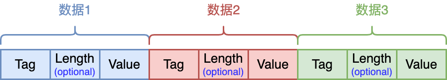
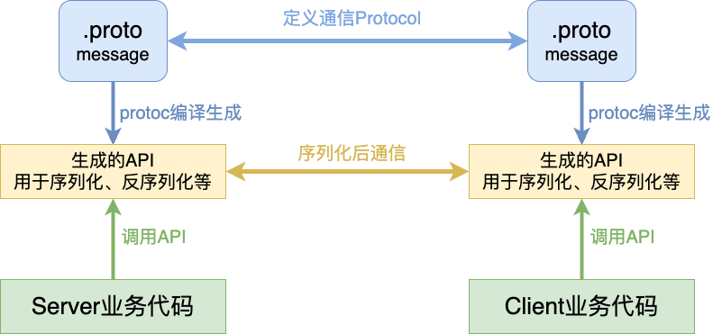
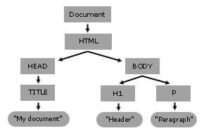
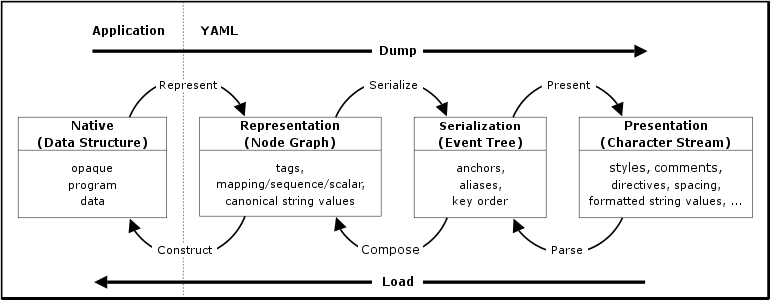

# JSON

## *JSON语法*

JSON, JavaScript Object Notation 是一种轻量级的数据交换格式，易于人阅读和编写，同时也易于机器解析和生成。JSON 基于 JavaScript 语言标准（ECMA-262 第 3 版）的一个子集，但它是完全独立于 JavaScript 语言本身的，很多编程环境都支持 JSON

官方网站是：[JSON](https://www.json.org/json-en.html)

一个简单的例子是

```json
{
  "name": "John",
  "age": 30,
  "isStudent": false
}
```

**JSON 不支持注释**。尽管某些 JSON 解析器可能会容忍注释，但它们并不属于 JSON 标准的一部分

### JSON的数据类型

数据由逗号分隔：多个名称/值对用逗号分隔。在数组或对象中，每个元素或成员之间都使用逗号来分隔

* 基本类型
    * 字符串 string 必须用双引号：在 JSON 中，**字符串必须被双引号包围**。单引号不是有效的 JSON 语法
    * 数字 number，其值为int、double
    * 布尔值 bool（true or false）
    * `null`
* 复合类型
    * **list类型（也称array类型或者数组）**：用方括号 **`[]`** 包围array，表示array的开始和结束。array可以包含多个值，这些值可以是不同类型的，比如字符串、数字、对象或者其他array
    * **dict类型（也称为对象 object）**：大括号 **`{}`** 包围对象，表示对象开始和结束。在大括号内部，可以包含多个名称/值对，其中键（名称）是字符串。dict是JSON中最常用的表现形式

### 示例

下面是一个包含多种数据类型的 JSON 对象示例：

```json
{
  "firstName": "John",
  "lastName": "Doe",
  "age": 21,
  "isStudent": true,
  "courses": ["Math", "Science", "Literature"],
  "address": {
    "street": "123 Main St",
    "city": "Anytown",
    "zipCode": "12345"
  },
  "nullValue": null
}
```

### 合法的JSON文件

一个标准的JSON文件应该只有一个最外层的 `{}` 或 `[]`。这代表了一个整体的对象（在 `{}` 情况下）或数组（在 `[]` 情况下）。JSON 格式要求整个文档必须是单一的有效JSON值

如果有多个JSON对象而且它们不包含在一个数组中，那么它不是一个有效的JSON文档。比如下面这样分开的两个JSON对象就是不合法

```json
{
    "key1": "value1"
}
{
    "key2": "value2"
}
```

## *Jsoncpp*

我们以Jsoncpp为例来说明一个JSON库一般都需要实现哪些核心数据结构和接口

[open-source-parsers/jsoncpp: A C++ library for interacting with JSON. (github.com)](https://github.com/open-source-parsers/jsoncpp)

```
.
├── allocator.h
├── assertions.h
├── config.h
├── forwards.h
├── json_features.h
├── json.h
├── reader.h
├── value.h
├── version.h
└── writer.h
```

上面是Jsoncpp的实现文件，基本上所有的JSON的C++库的核心实现就是Object、Reader和Writer


* `is*()`：数据类型的判断
* `as*()`：数据类型的显性转换
* `has()`：JSON对象中有没有
* `remove()`：删除


### 需要支持的功能

* 序列化 Serializing：将编程语言中的数据结构转换为JSON格式的字符串，以便进行存储或网络传输
* Parsing 解析/Deserializing 反序列化：将JSON格式的字符串解析成1999999程语言中的相应数据结构（如JavaScript中的对象或数组）
* 读取 Reader：从文件系统、Web API响应或其他来源读取JSON数据
* 写入 Writer：将JSON数据写入文件系统或通过网络发送
* 验证 Validation：验证JSON数据的结构是否符合特定的模式或规范
* 查询 Query：查询JSON文档以检索特定的元素或值
* 转换 Transformation：对JSON数据进行转换，如过滤、映射、排序等操作

 ### Value类

JSON首先要有一种能用JSON规定的数据格式来表示C++中的对应（可能有多种的）数据类型的能力，这种能力一般都是通过Value类来实现的

### Reader类

`Json:Reader` 类顾名思义主要用于读取：它可以将字符串转换成 `Json:Value` 对象，或者反过来从一个json文件中读取内容然后转成 `Json::Value` 对象

### Writer类

# Protobuf Intro

## *Protobuf简介*

https://sunyunqiang.com/blog/protobuf_encode/

Protocol Buffers (protobuf) 是一种由Google开发的二进制数据序列化格式。它旨在用于高效地序列化结构化数据，并支持跨不同平台、不同语言的数据交换

Protobuf 提供了一种定义数据结构的语言，称为 Protocol Buffers Language，通过该语言可以定义消息类型和相关字段。定义的消息类型被编译器转换成特定语言的类或结构体，以便在程序中使用

以下是 Protobuf 的一些主要特点

* 简洁性：Protobuf 的消息定义简洁明了，只需要定义字段的名称和类型即可。它支持基本数据类型（如整数、浮点数、布尔值等）以及复杂的数据结构（如嵌套消息、枚举等）
* 可扩展性：当需要向现有消息类型添加新字段时，可以保持向前和向后兼容性。旧版本的解析器可以解析新版本的消息，而新版本的解析器也可以解析旧版本的消息，只是忽略掉未知的字段
* 跨语言支持：Protobuf 支持多种编程语言，如C++、Java、Python、Go等。通过使用相应的编译器，可以将消息定义转换成目标语言的类或结构体，并在不同的语言之间进行数据交换
* 高效性：由于 Protobuf 使用二进制编码，因此相比于一些文本格式（如JSON、XML）具有更高的序列化和反序列化性能，以及更小的数据体积
* 可读性：虽然 Protobuf 的消息是以二进制格式存储的，但它同时支持可读的文本表示。可以使用 .proto 文件定义消息类型，并通过编译器生成用于序列化和反序列化的代码

Protobuf相比于JSON和XML高效的原因主要在于



Tag：字段标识号，用于标识字段；Length：Value的字节长度；Value：消息字段经过Varbits或Zigzag编码后的二进制值

1. **编码方式：** JSON和XML是文本格式，它们的数据是以可读的文本形式表示的（文本形式是指将字符使用UTF-8 或 Ascii 码来表示）。在网络传输中，这些文本数据在经过编码（一般是UTF-8或ASCII）后生成二进制码，这会增加数据的体积。相比之下虽然最终都是二进制码，但是Protocol Buffers 使Varints和Zigzag这类紧凑的二进制编码格式，不需要像JSON和XML那样进行文本编码，因此在传输中能够更加紧凑
2. **数据表示：** JSON和XML包含了大量用于描述数据结构的元信息，例如字段名称、数据类型等，这些元信息在文本格式中占据了相当的空间。相比之下，Protocol Buffers使用预定义的消息结构，消息结构信息存储在单独的文件中（.proto文件），在实际数据中只包含了实际的字段值，不包含字段名和数据类型等冗余信息，因此能减小数据体积

在使用 Protobuf 进行数据交换时，需要先定义消息类型，并通过**编译器**生成对应的类或结构体。然后，通过序列化将消息对象转换为二进制数据，或通过反序列化将二进制数据转换为消息对象。这使得在不同的系统之间传输和存储结构化数据变得更加简单和高效

需要注意的是，由于 Protobuf 是一种二进制格式，因此对于人类可读性较差，相比于文本格式（如JSON）更适合机器间的数据交换

## *Protobuf的编码*

下面介绍protobuf使用的两种编码方式

### Varints 编码

Variants 变长整形编码的思想：普通的 int 数据类型无论其值的大小，所占用的存储空间都是相等的，因此核心想法是根据数值的大小来动态地占用存储空间，从而使得值比较小的数字占用较少的字节数，而值相对比较大的数字占用较多的字节数

Protobuf 中使用的是 Base128 Varints 编码，之所以叫这个名字原因即是在这种方式中使用 7 bit 来存储数字。Protobuf 中Base128 Varints 采用的是小端序

看一个例子

### Zigzag 编码

Zigzag编码是为了解决Varints无法压缩负数的问题而使用的

Zigzag 编码的大致思想是首先对负数做一次变换，将其映射为一个正数，变换完成以后便可以使用 Varints 编码进行压缩

假设n是一个32位类型的数字，Zigzag编码的计算方式为

```
(n << 1) ^ (n >> 31)
```

## *安装*

### 关于版本号的问题

MAJOR.MINOR.PATCH 到 3.20.1 为止，之后的版本去掉了MAJOR 主版本号

> * Versioning scheme is changing to decouple major versions for languages
> * Minor and patch versions will remain coupled
> * Compilers and releases will refer to the version as just the minor and micro versions (i.e. 21.0) -- protobuf github

另外从 22.0 开始，C++ 全面迁移到bazel了，不建议使用。建议使用 21.11

> https://github.com/protocolbuffers/protobuf/releases/tag/v22.0
>
> * **This version includes breaking changes to: Cpp.**
>   * [Cpp] Migrate to Abseil's logging library. ([`a9f1ea6`](https://github.com/protocolbuffers/protobuf/commit/a9f1ea6371c108876649f27a5940a59cc8594768))
>   * [Cpp] `proto2::Map::value_type` changes to `std::pair<const K, V>`. ([`46656ed`](https://github.com/protocolbuffers/protobuf/commit/46656ed080e959af3d0cb5329c063416b5a93ef0))
>   * [Cpp] Mark final ZeroCopyInputStream, ZeroCopyOutputStream, and DefaultFieldComparator classes. ([`bf9c22e`](https://github.com/protocolbuffers/protobuf/commit/bf9c22e1008670b497defde335f042ffd5ae25a1))
>   * [Cpp] Add a dependency on Abseil ([#10416](https://github.com/protocolbuffers/protobuf/pull/10416))
>   * [Cpp] Remove all autotools usage ([#10132](https://github.com/protocolbuffers/protobuf/pull/10132))
>   * [Cpp] Add C++20 reserved keywords
>   * [Cpp] Dropped C++11 Support
>   * [Cpp] Delete Arena::Init
>   * [Cpp] Replace JSON parser with new implementation
>   * [Cpp] Make RepeatedField::GetArena non-const in order to support split RepeatedFields.
> * You can refer to our [migration guide](https://protobuf.dev/programming-guides/migration/) for details on what C++ code changes will be necessary to be compatible with 22.0. -- protobuf github

https://zhuanlan.zhihu.com/p/631291781

22.0之后的版本（包括22.0）貌似不支持使用Autoconf那套流程了，如果是手动编译的话要依赖 bazel。关于bazel的安装直接看 *build工具.md* - bazel

另外如果是用 cmake 来安装的话也会发生麻烦，因为官方不再为用户打包好 googletest、abseil 依赖了，googletest貌似不是强制要求的，可以在 cmake 的时候添加 `-Dprotobuf_USE_EXTERNAL_GTEST=ON` 这个 flag 关闭，但是 abseil 是需要用户自己提供的

> Somewhat. Before our distribution files were created with autotools and now are using `git archive` since we turned down autotools. That also created a difference in what distribution files we release: you can see we no longer have language-specific distribution files.
>
> The addition of the extra subrepo/dependency (abseil) has caused us to reevaluate some of how we are dealing with dependencies. Specifically, we want users to install dependencies on their own instead of relying on us to package them. This will also allow more customization in which version of our dependencies to use. https://github.com/protocolbuffers/protobuf/issues/12016

3.22.0以前的版本甚至都不需要 abseil 库，不过如果要搭配 gRPC 使用的话，abseil 库是需要的依赖

### Ubuntu C++ 21.12 版本

先介绍22.0之前的版本，我们安装21.12版本，仍然是利用make那套流程来安装。**切换到 root 安装**

注意：下面这种方式会把protobuf默认安装在 /usr/local ⽬录，lib、bin都是分散的。如果想把protobuf的lib、bin都统⼀安装在/usr/local/protobuf下，需要配置configure，即 `./configure --prefix=/usr/local/protobuf`，如果要这么安装，可以看上面的链接

```cmd
$ wget https://github.com/protocolbuffers/protobuf/releases/download/v21.12/protobuf-all-21.12.tar.gz
$ ./autogen.sh
$ ./configure
$ make 
$ make check // 会耗费几乎和make一样长的时间，而且如果lib、bin分散安装的话，会check失败，建议不要执行
$ sudo make install
$ sudo ldconfig // 刷新共享库
```

验证安装是否成功

```cmd
$ protoc --version
$ ls /usr/local/lib | grep libprotoc
```

### Ubuntu C++ 22.0 bazel

下面的流程是针对22.0之后的版本的bazel的。**切换到 root 安装**

安装 protobuf 需要先安装好下面这些库

* bazel，看 *bazel.md* 有关安装的介绍
* git
* g++
* Abseil 看 *Abseil&Boost.md* 有关安装的介绍

```cmd
$ git clone https://github.com/protocolbuffers/protobuf.git
$ cd protobuf
$ git submodule update --init --recursive
$ bazel build :protoc :protobuf
$ cp bazel-bin/protoc /usr/local/bin
```

验证安装是否成功

```cmd
$ protoc --version
```

### Java

直接使用Maven集成

# Protobuf使用

## *proto文件编写*

### protobuf使用流程



**ProtoBuf需要依赖通过编译生成的头文件和源文件使用的**

* 编写 .proto 文件，目的是为了定义结构对象 message 及属性内容
* 使用 protoc 编译器编译 .proto 文件，生成一系列的接口代码，存放在新生成的头文件和源文件中
* 依赖生成的接口，将编译生成的头文件包含进我们的代码中，实现对 .proto 文件中定义的字段进行设置和获取，和对 message 对象进行序列化和反序列化

###  定义message

在 message 消息中可以定义其属性字段，字段 field 定义格式为：`关键字 字段类型 字段名 = 字段唯一编号;`

* 字段名称命名规范：全小写字母，多个字母之间用 `_` 隔开
* 关键字：required、optional、repeated、map
* 字段类型分为：标量数据类型 Scalar value type 和 特殊类型（枚举、map）
* 字段唯一编号：用来标识字段，一旦使用了就不能改变。这个编号很重要，因为实际上通信用的是这个编号，二进制编码会把字段名删去

字段唯一编号的范围是 `1 ~ 536,870,911 (2^29 - 1)` ，其中 19000 ~ 19999 不可用

19000 ~ 19999 不可用是因为：在 Protobuf 协议的实现中，对这些数进行了预留。如果非要在.proto 文件中使用这些预留标识号，例如将 name 字段的编号设置为19000，编译时就会报警

**范围为 1 ~ 15 的字段编号只需要一个字节进行编码**， 16 ~ 2047 内的数字需要两个字节进行编码。编码后的字节不仅只包含了编号，还包含了字段类型。所以 1 ~ 15 要用来标记出现非常频繁的字段，要为将来有可能添加的、频繁出现的字段预留一些出来

举例：定义一个最简单的message

```protobuf
syntax = "proto3";

package contacts;

message PeopleInfo {
    string name = 1;
    int32 age = 2;
}
```

### 字段的关键字

* ~~required~~：数据发送方和接收方都必须处理这个字段，即显示地序列化、反序列化，否则会报编译错误。**proto3已废除，proto3默认就是required**
* optional
  * 数据发送方和接收方可以选择性地处理这个字段。如果消息实例中没有包含某个 optional 字段，解析时会使用该字段的默认值
  * protobuf对optional字段的处理方式是protobuf另加了一个boo的变量，用来标记这个optional字段是否有值，发送方在发送的时候，若这个字段有值，那么就给bool变量标记为true，否则就标记为false。接收方在收到这个字段的同时，也会收到发送方同时发送的bool变量，根据bool变量就知道这个字段是否有值了

* ~~singular~~：消息中可以包含该字段零次或一次（不超过一次）。proto3 语法中，**字段默认使用该规则，不需要显式给出**（也没有这个关键字类型）
* repeated
  * 消息中可以包含该字段任意多次（包括零次），其中重复值的顺序会被保留。可以理解为定义了一个**数组**
  * protobuf处理这个字段的时候是**和optional字段是一样的**，但是另外加了一个count计数变量，用于标明这个字段有多少个，这样发送方发送的时候，同时发送了count计数变量和这个字段的起始地址，接收方在接受到数据之后，按照count来解析对应的数据即可

* map：见值对，见下面数据类型详解

### 字段的其他定义规则

字段还有一些其他的定义规则

* 消息类型可作为字段类型使用，即允许嵌套message

  ```protobuf
  syntax = "proto3";
  package contacts;
  // 联系人
  message PeopleInfo {
      string name = 1;
      int32 age = 2;
      // Nested message
      message Phone {
      	string number = 1;
      }
      
      repeated Phone phone = 3;
  }
  ```

* 可导入其他 .proto 文件的消息并使用

  ```protobuf
  syntax = "proto3";
  package phone;
  message Phone {
  	string number = 1;
  }
  ```

  ```protobuf
  syntax = "proto3";
  package contacts;
  import "phone.proto"; // 使用 import 将 phone.proto 文件导入进来
  
  message PeopleInfo {
      string name = 1;
      int32 age = 2;
      // 引入的文件声明了package，使用消息时，需要用 ‘命名空间.消息类型’ 格式
      repeated phone.Phone phone = 3;
  }
  ```

* proto3和proto2是互相兼容的

### 数据类型


Sint32的效率更高一点

### 默认值

反序列化消息时，如果被反序列化的二进制序列中不包含某个字段，反序列化对象中相应字段时，就会设置为该字段的默认值。不同的类型对应的默认值不同：

* 字符串 string：默认值为空字符串
* 字节 bytes：默认值为空字节
* 布尔值 bool：默认值为 false
* 数值类型，默认值为 0
* 枚举 enum：默认值是第一个定义的枚举值， 必须为 0
* 对于消息字段，未设置该字段。它的取值是依赖于语言
* 对于设置了 repeated 的字段的默认值是空的（ 通常是相应语言的一个空列表 ）
* 对于消息字段、oneof字段和any字段，C++ 和 Java 语言中都有 `has_xxx` 方法来检测当前字段是否被设置。虽然标量没有has方法，但大多数情况下结合业务的语意信息是可以兼容其默认值的

## *proto编译*

### 编译 `.proto` 文件

用编译工具protoc来编译 `.proto` 文件，Ubuntu上的protoc放在 `/usr/local/bin` 下面

* 编译成C++

  ```cmd
  $ protoc [--proto_path=IMPORT_PATH] --cpp_out=DST_DIR path/to/file.proto
  ```

  * `--proto_path` 指定搜索目录，不带的话就默认从当前目录搜索，可以简写为 `-I`
  * `--cpp_out` 说明要编译成C++文件
  * `DST_DIR` 指示编译后文件放在哪里
  * `path/to/file.proto` 用到的proto文件的地址

  例子：

  ```cmd
  $ protoc -I=./ --cpp_out=./ test.proto
  ```

  会生成 `test.pb.cc` 和 `test.pb.h` 这两个文件，**这两个文件的命名就是 `.proto` 文件的名字**

  最终用编译器编译、链接成可执行文件的时候要链接protobuf库，比如说

  ```cmd
  $ g++ -std=c++11 example.cc test.pb.cc -lprotobuf
  ```

* 编译成Java

  ```cmd
  $ protoc --java_out=. contacts.proto
  ```

### protoc选项

.proto 文件中可以声明许多选项，使用 `option` 标注。选项能影响 proto 编译器的某些处理方式

选项的完整列表在google/protobuf/descriptor.proto中定义，下面给出部分代码

```protobuf
syntax = "proto2"; // descriptor.proto 使用 proto2 语法版本
message FileOptions { ... } // 文件选项 定义在 FileOptions 消息中
message MessageOptions { ... } // 消息类型选项 定义在 MessageOptions 消息中
message FieldOptions { ... } // 消息字段选项 定义在 FieldOptions 消息中
message OneofOptions { ... } // oneof字段选项 定义在 OneofOptions 消息中
message EnumOptions { ... } // 枚举类型选项 定义在 EnumOptions 消息中
message EnumValueOptions { .. } // 枚举值选项 定义在 EnumValueOptions 消息中
message ServiceOptions { ... } // 服务选项 定义在 ServiceOptions 消息中
message MethodOptions { ... } // 服务方法选项 定义在 MethodOptions 消息中
```

选项分为文件级、消息级、字段级等等， 但并没有一种选项能作用于所有的类型

### 常用选项

`optimizer_for`：文件选项，可以用来设置 protoc 编译器的优化级别，分别为 SPEED 、CODE_SIZE 、LITE_RUNTIME 。受该选项影响，设置不同的优化级

* SPEED : protoc 编译器将生成的代码是高度优化的，代码运行效率高，但是由此生成的代码编译后会占用更多的空间。**SPEED 是默认选项**
* CODE_SIZE : proto 编译器将生成最少的类，会占用更少的空间，是依赖基于反射的代码来实现序列化、反序列化和各种其他操作。但和 SPEED 恰恰相反，它的代码运行效率较低。**这种方式适合用在包含大量的.proto文件，但并不盲目追求速度的应用中**
* LITE_RUNTIME : 生成的代码执行效率高，同时生成代码编译后的所占用的空间也是非常少。这是以牺牲Protocol Buffer提供的反射功能为代价的，仅仅提供 encoding+序列化 功能，所以我们在链接 BP 库时仅需链接libprotobuf-lite，而非libprotobuf。**这种模式通常用于资源有限的平台，例如移动手机平台中**

`allow_alias` ： 允许将相同的常量值分配给不同的枚举常量，用来定义别名。该选项为枚举选项

## *编译生成文件分析（C++）*

### 命名空间

如果在 `.proto` 文件中定义了 `package foo`，那么生成的所有内容都会放在 `foo` 命名空间中

若 package 的名字用 `.` 间隔了，比如说 `package foo.bar`，那么 `.` 会转换为域访问符 `::`，即变成命名空间 `foo::bar`

### Message

每一条 message 都继承自 `google::protobuf::Message` 的基类。Message的基类MessageLite类中定义了一系列的序列化与反序列化方法

```cpp
class MessageLite {
public:
    //序列化：
    bool SerializeToOstream(ostream* output) const; // 将序列化后数据写入文件
    流
    bool SerializeToArray(void *data, int size) const;
    bool SerializeToString(string* output) const;
    //反序列化：
    bool ParseFromIstream(istream* input); // 从流中读取数据，再进行反序列化
    动作
    bool ParseFromArray(const void* data, int size);
    bool ParseFromString(const string& data);
};
```

* `bool ParseFromString(const string& data)`: Parse the message from the given serialized binary string (also known as wire format)
* `bool SerializeToArray(void *data, int size) const;` 将消息序列化到字节数组
  * `data`: 是一个指向要写入序列化数据的内存块的指针
  * `size`: 是要写入的最大字节数

* `bool SerializeToString(string* output) const`: Serialize the given message to a binary string
* `string DebugString()`: Return a string giving the `text_format` representation of the proto (should only be used for debugging)

完整API见Documentation：<https://protobuf.dev/reference/cpp/api-docs/google.protobuf.message/#Message>

* 序列化的结果为二进制字节序列，而非文本格式，我们只是用string作为一个容器来存放序列化后的二进制结果
* 以上列出的三种序列化的方法没有本质上的区别，只是序列化后输出的格式不同，可以供不同的应用场景使用
* 序列化的 API 函数均为const成员函数，因为序列化不会改变类对象的内容， 而是将序列化的结果保存到函数入参指定的地址中

关于下面这种nested message会生成内部类

```protobuf
message Foo {
  message Bar {}
}
```

在生成的头文件中有下面这种重定义，所以可以直接用 `Foo::Bar`（就好像在使用命名空间一样）

```c++
typedef Foo_Bar Bar;
```

### 操纵字段的方法

编译生成的contacts.pb.h 部分最重要的代码如下

```cpp
class PeopleInfo final : public ::PROTOBUF_NAMESPACE_ID::Message {
public:
    using ::PROTOBUF_NAMESPACE_ID::Message::CopyFrom;
    void CopyFrom(const PeopleInfo& from);
    using ::PROTOBUF_NAMESPACE_ID::Message::MergeFrom;
    void MergeFrom( const PeopleInfo& from) {
    	PeopleInfo::MergeImpl(*this, from);
	}
	static ::PROTOBUF_NAMESPACE_ID::StringPiece FullMessageName() {
		return "PeopleInfo";
	}
	// string name = 1; 第一个message字段
    void clear_name();
    const std::string& name() const; //获取name，把get省略了
    template <typename ArgT0 = const std::string&, typename... ArgT>
    void set_name(ArgT0&& arg0, ArgT... args); //set方法
    std::string* mutable_name();
    PROTOBUF_NODISCARD std::string* release_name();
    void set_allocated_name(std::string* name);
    // int32 age = 2; 第二个message字段
    void clear_age();
    int32_t age() const; //获取age，把get省略了
    void set_age(int32_t value); //set方法
};
```

PeopleInfo 这条message生成的类中会生成下面这些方法

* 一个`set_xxx()`方法：用于设置该字段的值。例如，如果在消息定义中有一个`int32 age`字段，生成的C++代码中就会有一个`void set_age(int32 value)`方法
* 一个`clear_xxx()`方法：用于清除该字段的值。例如，对于`int32 age`字段，生成的C++代码中就会有一个`void clear_age()`方法
* 一个`has_xxx()`方法：用于检查该字段是否设置了值。例如，对于`int32 age`字段，生成的C++代码中就会有一个`bool has_age()`方法
* 一个`xxx()`方法：用于获取该字段的值。例如，对于`int32 age`字段，生成的C++代码中就会有一个`int32 age()`方法

这些接口和方法使得在C++中使用标量字段变得更加方便。用户可以使用`set_xxx()`方法设置字段的值，使用`clear_xxx()`方法清除值，使用`has_xxx()`方法检查字段是否设置了值，以及使用`xxx()`方法获取字段的值

### repeated 字段的API

* 生成一个`add_xxx()`方法：用于向字段中添加一个新的值。例如，如果在消息定义中有一个`repeated string names`字段，那么生成的C++代码中就会有一个`void add_names(const std::string& value)`方法
* 生成一个`clear_xxx()`方法：用于清空该字段中的所有值。例如，对于`repeated string names`字段，生成的C++代码中就会有一个`void clear_names()`方法
* 生成一个`xxx_size()`方法：用于获取该字段当前包含的值的数量。例如，对于`repeated string names`字段，生成的C++代码中就会有一个`int names_size()`方法
* 生成一个`xxx()`方法：用于获取该字段指定索引位置的值。例如，对于`repeated string names`字段，生成的C++代码中就会有一个`const std::string& names(int index)`方法

### decode生成的二进制文件

```shell
❯ protoc --decode=contacts.Contacts contacts.proto < contacts.bin
Type not defined: contacts.Contacts
❯ protoc --decode=contacts2.Contacts contacts.proto < contacts.bin
contacts {
  name: "zhangsan"
  age: 20
  phone {
    number: "82"
  }
  phone {
    number: "138"
  }
}
```

## *编译生成文件分析（Java）*

### Builder

### Sub-Builder for nested message

# 数据类型详解

## *枚举 enum*

### 定义规则

```protobuf
enum Color {
  RED = 0;
  GREEN = 1;
  BLUE = 2;
}
```

* 0 值常量必须存在，且要作为第一个元素。这是为了与 proto2 的语义兼容：第一个元素作为默认值，且值为 0
* 反序列化时protobuf会对之前没有设置枚举值的字段默认设置为0。若没有为枚举值指定整数值，Protobuf编译器会自动为每个值分配一个唯一的整数值
* 枚举类型可以在消息外定义，也可以在消息体内定义（嵌套）
* 枚举的常量值在 32 位整数的范围内。但因负值无效因而不建议使用（与编码规则有关）

### 防止冲突

将两个 ‘具有相同枚举值名称’ 的枚举类型放在单个 .proto 文件下测试时，编译后会报错。所以这里要注意

* 同级（同层）的枚举类型，各个枚举类型中的常量不能重名
* 单个 .proto 文件下，最外层枚举类型和嵌套枚举类型，不算同级
* 多个 .proto 文件下，若一个文件引入了其他文件，且每个文件都未声明 package，每个 proto 文件中的枚举类型都在最外层，算同级冲突
* 多个 .proto 文件下，若一个文件引入了其他文件，且每个文件都声明了 package，不算同级，不发生冲突

### 枚举字段生成的API

* `set_xxx()`方法：用于设置枚举字段的值
* `xxx()`方法：用于获取枚举字段的值
* `xxx_Name()`方法：用于根据枚举值获取对应的字符串表示
* `xxx_IsValid()`：f校验枚举值是否有效的方法 
* `xxx_Parse()`方法：用于将字符串表示转换为对应的枚举值

### C++ 生成接口

### Java 生成接口

## *any*

### 介绍

可以将any类型理解为一种**泛型 generic**，可以用来存储任意的数据类型。它允许用户在不改变消息定义的情况下，将任意类型的数据作为字段的值进行传输和存储。使用时可以在 Any 中存储任意消息类型。Any 类型的字段也用 repeated 来修饰

```protobuf
//,...
message PeopleInfo {
// ...
google.protobuf.Any data = 4;
}
```

先定义好message，再用 `PackFrom()` 方法转换

### any字段生成的API

```cpp
// 更新的 PeopleInfo 类
class PeopleInfo final : public ::PROTOBUF_NAMESPACE_ID::Message {
public:
// .google.protobuf.Any data = 4;
bool has_data() const;
void clear_data();
const ::PROTOBUF_NAMESPACE_ID::Any& data() const;
PROTOBUF_NODISCARD ::PROTOBUF_NAMESPACE_ID::Any* release_data();
::PROTOBUF_NAMESPACE_ID::Any* mutable_data();
void set_allocated_data(::PROTOBUF_NAMESPACE_ID::Any* data);
};
```

设置和获取：获取方法的方法名称与小写字段名称完全相同。设置方法可以使用 `mutable_xxx` 方法，返回值为Any类型的指针，这类方法会为我们开辟好空间，可以直接对这块空间的内容进行修改

### 任意消息类型与Any的互转

需要的接口定义在google预定义好的 `any.pb.h` 中

* 使用 `PackFrom()` 方法可以将任意消息类型转为 Any 类型
* 使用 `UnpackTo()` 方法可以将 Any 类型转回之前设置的任意消息类型
* 使用 `Is()` 方法可以用来判断存放的消息类型是否为 typename T

## *oneof*

保证唯一性

不可以使用repeated

## *map*

Protobuf提供一种称为"map"的特殊数据类型，用于表示键值对的集合

```protobuf
map<key_type, value_type> field_name = field_number;
```

* key_type 是除了 float 和 bytes 类型以外的任意标量类型。 value_type 可以是任意类型
* map 字段不可以用 repeated 修饰
* map 中存入的元素是无序的

### C++ 生成接口

### Java 生成接口

```protobuf
map<int32, int32> weight = 1;
```

protoc编译器会在message class和它的builder中生成下面的方法

* `Map<Integer, Integer> getWeightMap();`：返回一个**不可修改**的map
* `int getWeightOrDefault(int key, int default);`：返回key对应的value，或者default若key不存在
* `int getWeightOrThrow(int key);`：返回key对应的value，或者抛 IllegalArgumentException 异常若key不存在
* `boolean containsWeight(int key);`：检查map里是否有key
* `int getWeightCount();`：返回map中元素个数

protoc编译器只会在message的builder中生成下面的方法

* `Builder putWeight(int key, int value);`：插入一个KV
* `Builder putAllWeight(Map<Integer, Integer> value);`: Adds all entries in the given map to this field.
* `Builder removeWeight(int key);`: Removes the weight from this field.
* `Builder clearWeight();`: Removes all weights from this field.
* `@Deprecated Map<Integer, Integer> getMutableWeight();`：返回一个**可修改**的map. Note that multiple calls to this method may return different map instances. The returned map reference may be invalidated by any subsequent method calls to the Builder.

## *更新消息*

### 更新规则

* 新增：不要和已有字段的名字和编号冲突即可
* 修改
* 删除：不可以直接删除，会造成数据损坏、错位等问题。被删除的字段要用 `reserved` 保留，之后不能被使用

不认识的字段不会被删除，而是会存储到未知字段

未知字段不能直接通过get获取

遍历UnkownFieldSet

### 保留字段 reserved

### 获取未知字段

# Protobuf API

## *C++*

https://protobuf.dev/reference/cpp/api-docs/

### 头文件

头文件全部位于 `/usr/local/include` 下面

* 核心内容全部放在 `google::protobuf` 中
* `google::protobuf::io` 是用于IO的辅助类
* `google::protobuf::util`：一些常用的工具类，比如 message comparison, JSON conversion, well known types 等
* `google::protobuf::compiler`：protoc是一个自举的编译器

## *Java*

https://protobuf.dev/reference/java/api-docs/overview-summary.html

# CMake 组织 protobuf

`FindProtobuf.cmake` 提供了 protobuf 库的配置

https://cmake.org/cmake/help/latest/module/FindProtobuf.html

## *步骤*

```cmake
cmake_minimum_required(VERSION 3.5)
project(MyProtobufProject)

# 查找Protobuf
find_package(Protobuf REQUIRED)

# 将.proto文件编译为对应的源文件
protobuf_generate_cpp(PROTO_SRCS PROTO_HDRS my_message.proto)

# 添加可执行文件
add_executable(my_program main.cpp ${PROTO_SRCS} ${PROTO_HDRS})

# 链接Protobuf库
target_link_libraries(my_program ${Protobuf_LIBRARIES})
```

## *宏*

`FindProtobuf.cmake` 提供了一些宏

### protobuf_generate

`protobuf_generate`是一个CMake宏，用于在构建时自动编译 `.proto` 源文件。这些源文件将被用于实际的编译，并与项目一起链接

注意⚠️：`PROTOBUF_GENERATE`使用时，`*.proto` 文件要位于当前目录下，即 `*.proto` 文件和 `add_library` 或 `add_executable` 需要在同一个目录，否则会出错

```cmake
protobuf_generate (
    TARGET <target>
    [LANGUAGE <lang>]
    [OUT_VAR <out_var>]
    [EXPORT_MACRO <macro>]
    [PROTOC_OUT_DIR <dir>]
    [PLUGIN <plugin>]
    [PLUGIN_OPTIONS <plugin_options>]
    [DEPENDENCIES <depends]
    [PROTOS <protobuf_files>]
    [IMPORT_DIRS <dirs>]
    [GENERATE_EXTENSIONS <extensions>]
    [PROTOC_OPTIONS <protoc_options>]
    [APPEND_PATH])
```

* `TARGET`：指定目标CMake构建目标，生成的源文件将被添加到这个目标中
* `LANGUAGE`：指定生成的源文件类型，可以是cpp或python，默认为cpp
* `OUT_VAR`：指定一个CMake变量的名称，该变量将包含生成的源文件的路径
* `EXPORT_MACRO`：指定一个宏，应用于所有生成的Protobuf消息类和外部变量。这可以用于声明DLL导出等
* `PROTOC_OUT_DIR`：指定生成的源文件的输出目录，默认为`CMAKE_CURRENT_BINARY_DIR`
* `PLUGIN`：可选的插件可执行文件，例如grpc_cpp_plugin的路径
* `PLUGIN_OPTIONS`：向插件提供的附加选项，例如`generate_mock_code=true`用于gRPC cpp插件
* `DEPENDENCIES`：传递给底层`add_custom_command`调用的依赖参数
* `PROTOS`：指定要生成源文件的.proto模式文件列表。如果省略，则将使用目标中以.proto结尾的每个源文件
* `IMPORT_DIRS`：模式文件的公共父目录，用于解析模式文件之间的相对路径
* `GENERATE_EXTENSIONS`：如果省略`LANGUAGE`，则必须设置为protoc生成的扩展名
* `PROTOC_OPTIONS`：传递给protoc的附加参数

### protobuf_generate_cpp

```cmake
protobuf_generate_cpp (<SRCS> <HDRS>
    [DESCRIPTORS <DESC>] [EXPORT_MACRO <MACRO>] [<ARGN>...])
```

这个宏专门用来将 proto 编程为 cpp 和头文件，但是不能指定输出，没有上面的宏通用

## *例子*

```cmake
find_package(gRPC CONFIG REQUIRED)
find_package(Protobuf REQUIRED)
add_library(ProtoTest Test.proto)
target_link_libraries(ProtoTest PUBLIC gRPC::grpc++)
protobuf_generate(TARGET ProtoTest)
protobuf_generate(
    TARGET ProtoTest
    LANGUAGE grpc
    PLUGIN protoc-gen-grpc=$<TARGET_FILE:gRPC::grpc_cpp_plugin>
    PLUGIN_OPTIONS generate_mock_code=true
    GENERATE_EXTENSIONS .grpc.pb.h .grpc.pb.cc)
```


# XML

[XML与JSON - 廖雪峰的官方网站 (liaoxuefeng.com)](https://www.liaoxuefeng.com/wiki/1252599548343744/1255945389334784)

XML（eXtensible Markup Language）是一种标记语言，用于存储和传输数据。它旨在具有自我描述性，并且能够通过用户自定义的标签来表示复杂的数据结构

## *语法*

* **结构**：XML文档包含一个或多个元素，形成一个树状结构。每个XML文档都有一个单独的根元素，包含所有其他元素

* **标签**：XML元素由开始标签 `<tagname>` 和结束标签 `</tagname>` 组成。例如：

  ```
  xml复制代码<greeting>Hello, World!</greeting>
  ```

  元素可以包含文本、属性、其他元素，甚至什么也不包含（空元素）。

* **属性**：元素可以有属性，属性提供关于元素额外的信息。属性总是位于开始标签中，并且以键值对的方式出现。

  ```
  xml复制代码<person name="John Doe" age="30" />
  ```

  属性值必须被双引号或单引号包围。

* **嵌套**：元素可以嵌套，但必须正确关闭，这意味着在子元素关闭之前，父元素不能关闭。

  ```
  xml复制代码<family>
      <parent name="Jane Doe">
          <child name="Little John" />
      </parent>
  </family>
  ```

* **大小写敏感**：XML是大小写敏感的，因此 `<Tag>` 和 `<tag>` 是不同的元素。

* **空元素**：没有内容的元素可以使用一个简单的标签闭合，比如 `<br/>` 表示一个换行。

* **XML声明**：XML文档可以（可选地）包含一个XML声明作为第一行，指定XML版本和字符编码。

  ```
  xml复制代码<?xml version="1.0" encoding="UTF-8"?>
  ```

### 特殊字符 & 注释

**特殊字符**：某些字符在XML中有特殊意义，如果要在元素的文本中使用这些字符，需要使用实体引用

- `<` 代表小于符号 `<`
- `>` 代表大于符号 `>`
- `&` 代表和符号 `&`
- `'` 代表单引号 `'`
- `"` 代表双引号 `"`

**注释**：XML中的注释以 `<!--` 开始，并以 `-->` 结尾。注释不能嵌套。

```xml
<!-- This is a comment -->
```


1. **处理指令**：处理指令提供了传递给应用程序的指令。

   ```
   xml复制代码<?process instruction?>
   ```

2. **CDATA区段**：CDATA部分允许包含不会被解析器处理的文本数据，格式为 `<![CDATA[ ... ]]>` 。

   ```
   xml复制代码<script><![CDATA[ function matchwo(a,b) { if (a < b && a < 0) then { return 1; } else { return 0; } } ]]></script>
   ```


## *接口风格*

- DOM：一次性读取XML，并在内存中表示为树形结构
  - 树型解析器，将读入的XML文档转换成树结构对象 `Document`
  - 整个Documnet都放在内存中，不管文件有多大，都会将所有的内容预先装载到内存中
  - **可以读取XML文件内容，也可以向XML文件中插入数据，修改数据**
- SAX：以流的形式读取XML，使用事件回调
  - 流机制解析器，在读入XML文档时生成相应的事件
  - 基于事件的，当某个事件被触发时，才获取相应的XML的部分数据，占用内存较小
  - 按顺序一边读取数据，一边进行解析，在读取数据的时候会触发事件，每触发一次，就执行一次触发方法
  - **只能对XML文件内容进行读取，而不能在文件中插入或修改数据**

### DOM

[使用文档对象模型 - Web API | MDN (mozilla.org)](https://developer.mozilla.org/zh-CN/docs/Web/API/Document_Object_Model/Using_the_Document_Object_Model)

```xml
<html lang="en">
  <head>
    <title>My Document</title>
  </head>
  <body>
    <h1>Header</h1>
    <p>Paragraph</p>
  </body>
</html>
```



注意：实际中的DOM树与上图例子中的DOM树相似，但并不完全相同，因为实际的DOM树保留了空白

### SAX

使用DOM解析XML的优点是用起来省事，但它的主要缺点是内存占用太大

另一种解析XML的方式是SAX, Simple API for XML，它是一种基于流的解析方式，边读取XML边解析，并以事件回调的方式让调用者获取数据。因为是一边读一边解析，所以无论XML有多大，占用的内存都很小

# YAML Specification

[YAML Ain’t Markup Language (YAML™) Version 1.1](https://yaml.org/spec/1.1/#id857168)

## *数据类型*

### Collections 集合

在YAML中，集合指的是可以包含多个元素的复合数据类型。YAML支持两种类型的集合：**序列 sequences** 和 **映射mappings**

* **Sequences**用于表示数组或列表，通过使用短横线`-`标记来创建。每个短横线后面跟着**空格**，然后是该项目的值

  ```yaml
  # 序列示例
  - Apple
  - Banana
  - Cherry
  ```

* **Mappings**用来表示键值对，类似于字典或哈希表。在映射中，每个键后面都跟着一个冒号和一个空格，然后是相应的值

  ```yaml
  # 映射示例
  name: John Doe
  age: 30
  married: true
  ```

### Structures  结构

YAML文件通常由上述的集合构成，并可以通过嵌套这些集合来创建更复杂的结构。例如，可以在一个映射中嵌套一个序列，反之亦然

```yaml
# 结构示例
employees:
  - name: John Doe
    role: Manager
  - name: Jane Smith
    role: Developer

address:
  street: "123 Main St"
  city: "Anytown"
  zip: 12345
```

### Scalars 标量

标量是最基本的数据单元，代表单个的值，比如字符串、布尔值、整数或浮点数。在YAML中，标量可以直接表示，也可以用引号（单引号或双引号）包围起来。使用引号的好处是可以包含特殊字符或保留字。例如：

```yaml
# 标量示例
integer: 123
boolean: true
string: "Hello, World!"
special_characters: "Newline character is \n"
```

* 布尔值、数字、日期等直接写，不要加引号

* 字符串

  * **单引号（Single quoted）**：在单引号内的字符串会按照字面意思来解释。特殊字符不需要转义，除了单引号本身，你需要用两个单引号表示一个单引号。

    ```yaml
    single_quoted: 'Here''s a string with a single quote (apostrophe).'
    ```

  * **双引号（Double quoted）**：双引号允许你使用转义序列，比如换行符 `\n` 或者 Unicode 字符。这使得双引号适合包含特殊字符的字符串。

    ```yaml
    double_quoted: "Line1\nLine2"
    ```

* 布尔值：在YAML（YAML Ain't Markup Language）中，某些字符串被认为是特殊的，并且会被解析为布尔值。`off`, `on`, `yes`, `no`, `true`, `false`, `y`, `n` 等都能够被识别并转换为布尔值。所以在 YAML 文件中使用 `off` 时，它通常会被解释为布尔值 `False`

### Tags 标签

YAML提供了扩展的数据类型，称为tags。Tags允许你显式地指定一个值的数据类型，或者使用自定义数据类型。在YAML中，标签以`!`开头，后面跟着标签名。例如，你可以使用`!!str`来强制将一个值解析为字符串，即使它看起来像一个数字。自定义标签可以与应用程序相关，以便自定义处理某些数据。例如：

```yaml
# 标签示例
explicit_string: !!str 1234
date: !!timestamp "2023-01-01T12:00:00Z"
custom_tag: !mytype { name: John Doe, age: 30 }
```

在这个例子中，`1234`通常会被视为一个整数，但标签`!!str`告诉解析器将其作为字符串处理。同样地，`!mytype`标签可以用来指示解析器使用自定义逻辑来处理该值

## *过程*



# yaml-cpp

[jbeder/yaml-cpp: A YAML parser and emitter in C++ (github.com)](https://github.com/jbeder/yaml-cpp?tab=readme-ov-file)

Node是yaml-cpp中的核心概念，是最重要的数据结构，它用于存储解析后的YAML信息。Node一共有以下几种type

- Null 空节点
- Sequence 序列，类似于一个 `std::vector`，对应YAML格式中的数组
- Map，类似标准库中的 `std::Map`，对应YAML格式中的对象
- Scalar 标量，对应YAML格式中的常量


**YAML::Node** 类提供了三个方法用于判断当前Node的类型：`IsScalar()`、`IsSequence()`、`IsMap()`

## *Parse*

## *Emitt*

