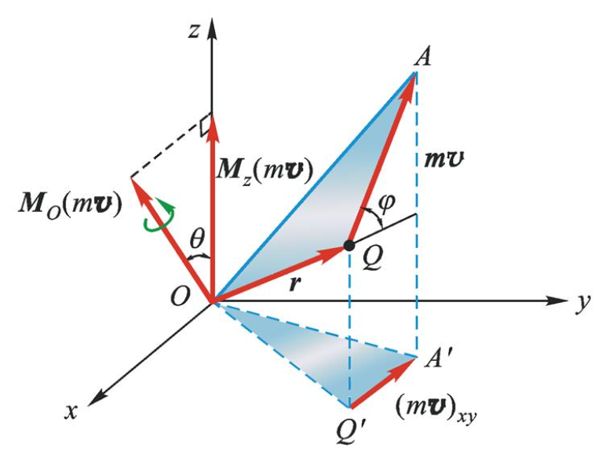
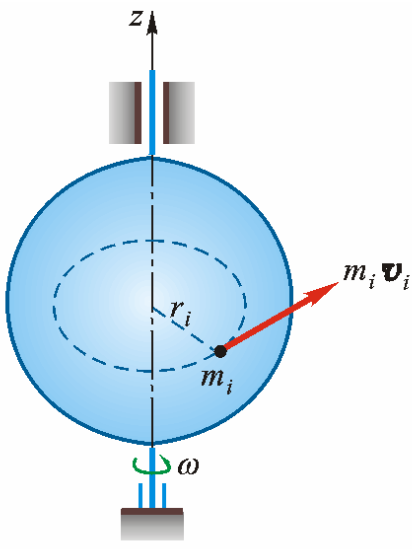
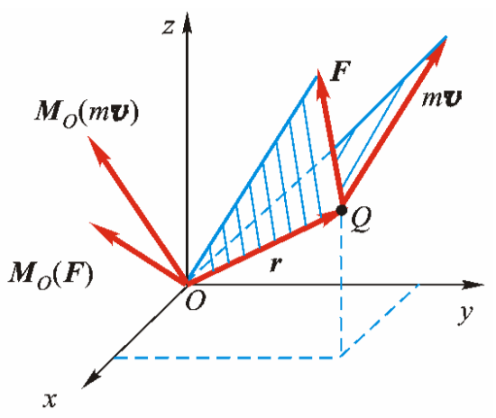
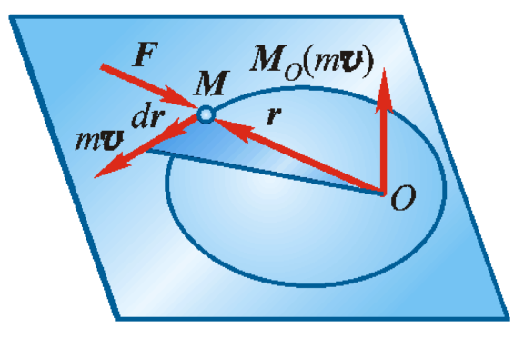
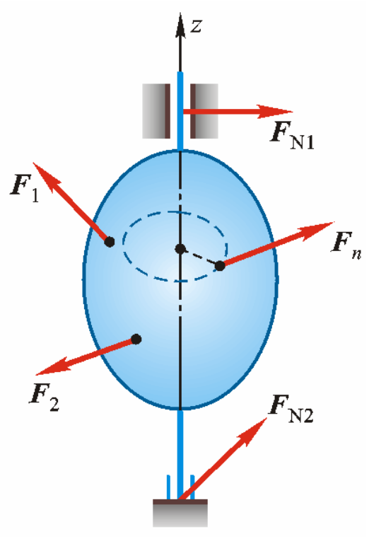

# 质点动力学的基本方程

动力学研究物体的机械运动与作用力之间的关系

### 动力学物体抽象模型

* 质点 Mass point：质点是具有一定质量而几何形状和尺寸大小可以忽略不计的物体
* 质点系：若物体的形状和大小在所研究的问题中不可以忽略时，则物体应抽象为质点系。质点系是由几个或无限个相互有联系的质点所组成的系统。

刚体是质点系的一种特殊情形，其中任意两个质点间的距离保持不变，也称为不变的质点系

## *动力学基本规律*

质点动力学的基础牛顿三定律

* 牛顿第一定律 惯性定律：不受力作用的质点，将保持静止或匀速直线运动。不受力作用的质点，不是处于静止状态，就是保持其原有的速度不变，这种性质称为**惯性 Inertia**

* 牛顿第二定律 加速度定律：质点的质量与加速度的乘积等于作用于质点的力的大小，加速度的方向与力的方向相同
  $$
  \frac{d}{dt}\left(m\boldsymbol{v}\right)=F\Leftrightarrow m\boldsymbol{a}=F\label{牛顿第二定律}
  $$
  该式是第二定律的数学表达式，是质点动力学的基本方程，建立了质点的加速度、质量与作用力之间的定量关系

  该式表明，质点的质量越大，其运动状态越不容易改变，也就是质点的惯性越大，因此**质量是质点惯性的度量**

* 牛顿第三定律 作用与反作用定律。这一定律就是静力学的公理四，它不仅适用于平衡的物体，而且也适用于任何运动的物体，并且与参考系的选择无关

## *质点的运动微分方程*

质点收到n个力 $F_1,F_2,\dots,F_n$ 作用时，由牛顿第二定理有
$$
m\boldsymbol{a}=\sum{F_i}\Leftrightarrow m\frac{d^2\boldsymbol{r}}{dt^2}=\sum{F_i}
$$
 右边的式子称为矢量形式的运动微分方程，在计算实际问题时，需要应用它的投影形式

### 投影

* 在直角坐标系上投影
  $$
  m\frac{d^2x}{dt^2}=\sum{F_{ix}},\  m\frac{d^2y}{dt^2}=\sum{F_{iy}},\  m\frac{d^2z}{dt^2}=\sum{F_{iz}}
  $$

* 在自然轴上投影
  $$
  \boldsymbol{a}=a_t\boldsymbol{e}_t+a_n\boldsymbol{e}_n\\m\frac{dv}{dt}=\sum{F_{it}},\ m\frac{v^2}{\rho}=\sum{F_{in}},\ 0=\sum{F_{ib}}
  $$

### 质点动力学的两类基本问题

* 已知质点的运动，求作用于质点的力
* 已知作用于质点的力，求质点的运动

# 动量定理

由n个质点组成的质点系，可以列出3n个运动微分方程，其求解会很复杂，而且也没必要，因为我们常常需要的是质点系的某些整体的运动特征，而不是单个质点的信息

动量、动量矩和动能定理从不同的侧面揭示了质点和质点系总体的运动变化与作用量之间的关系，可用来求解质点系动力学问题

**动量、动量矩和动能定理统称为动力学普遍定理**

## *动量与冲量*

### 动量 Momentum

物体之间往往有机械运动的相互传递，在传递机械运动时产生的相互作用力不仅与物体的速度变化有关，而且与它们的质量有关

质点的质量与速度的乘积称为质点的动量，记为 $m\boldsymbol{v}$。质点的动量是矢量，它的方向与质点速度的方向一致，单位为 $kg\cdot m/s$

质点系内各质点动量的矢量和称为质点系的动量，即
$$
\boldsymbol{p}=\sum\limits_{i=1}^{n}{m_i\boldsymbol{v}_i}=\sum{m_i\boldsymbol{v}_i}=\sum{m_i\frac{d\boldsymbol{r}_i}{dt}}=\frac{d}{dt}\sum{m_i\boldsymbol{r}_i}
$$
定义质心 Center of mass 的矢径为 $\boldsymbol{r}_c=\frac{\sum{m_i\boldsymbol{r}_i}}{m}$，代入上式得
$$
\boldsymbol{p}=\frac{d}{dt}\sum{m_i\boldsymbol{r}_i}=\frac{d}{dt}\left(m\boldsymbol{r}_c\right)=m\boldsymbol{v}_c
$$
上式表明：质点系的动量等于质心速度与其全部质量的乘积，这表明质点系的动量是描述质心运动的一个物理量

刚体是由无限多个质点组成的不变质点系，质心是刚体内某一确定点。对于质量均匀分布的规则刚体，质心就是其几何中心 Centroid

### 冲量 Impulse

物体在力的作用下引起的运动变化，不仅与力的大小和方向有关，还与力作用时间的长短有关

作用力与作用时间的乘积称为常力的冲量 $I=Ft$。冲量是矢量，它的方向与常力的方向一致，单位是 $N\cdot s$

若作用力 $F$ 是变量，在微小时间间隔 $dt$ 内，力 $F$ 的冲量称为元冲量，即 $dI=Fdt$

力 $F$ 在作用时间 $t_1-t_2$ 内的冲量是矢量积分
$$
I=\int_{t_1}^{t_2}{Fdt}
$$

## *动量定理*

### 质点的动量定理

由牛顿第二定律的数学表达式 $\eqref{牛顿第二定律}$ 可得到下式，该式被称为**质点动量定律的微分形式**，即质点动量的增量等于作用于质点上的力的元冲量
$$
\frac{d}{dt}mv=F\Rightarrow d(mv)=Fdt
$$
对上式积分，得到**质点动量定理的积分形式**，即在某一时间段 $t_2-t_1$ 内，质点动量的变化等于作用于质点的力在此段时间内的冲量
$$
m\boldsymbol{v_2}-m\boldsymbol{v_1}=\int_{t_1}^{t_2}{Fdt}=I
$$

### 质点系的动量定理

设质点系有 $n$ 个质点，第 $i$ 个质点的质量为 $m_i$，速度为 $\boldsymbol{v}_i$；设外界物体对该质点的作用为外力 External force $F_i^{(e)}$，质点系内其他质点对该质点作用的力为内力 Internal force $F_i^{(i)}$

根据质点的动量定理有如下，这样的方程对每个质点都成立，共有 $n$ 个，将其两端分别相加
$$
d(m_i\boldsymbol{v}_i)=\left(F_i^{(e)}+F_i^{(i)}\right)dt=F_i^{(e)}dt+F_i^{(i)}dt\\\xrightarrow{n\ points}\sum{d(m_i\boldsymbol{v}_i)}=\sum{F_i^{(e)}dt}+\sum{F_i^{(i)}dt}
$$
因为质点系内的质点之间的相互作用总是大小相等、方向相反地成对出现，因此内力冲量的矢量和等于0，即 $\sum{F_i^{(i)}dt}=0$

因此可得质点系的动量定理的微分形式为如下，即**质点系动量的增量等于作用于质点系的外力元冲量的矢量和**
$$
\sum{d(m_i\boldsymbol{v}_i)}=d\sum{(m_i\boldsymbol{v}_i)}=d\boldsymbol{p}=\sum{F_i^{(e)}dt}=\sum{dI_i^{(e)}}\Longleftrightarrow\frac{d\boldsymbol{p}}{dt}=\sum{F_i^{(e)}}
$$
对上式积分，可以得到**质点系动量定理的积分形式**，即在某一时间间隔内，质点系动量的改变量等于在这段时间内作用于质点系外力冲量的矢量和
$$
\int_{p_1}^{p_2}{d\boldsymbol{p}}=\sum{\int_{t_1}^{t_2}{F_i^{(e)}dt}}\Rightarrow\boldsymbol{p}_2-\boldsymbol{p}_1=\sum{I_i^{(e)}}
$$
上式为矢量式，在应用时常取投影形式
$$
p_{2x}-p_{1x}=\sum{I_x^{(e)}},\ p_{2y}-p_{1y}=\sum{I_y^{(e)}},\ p_{2z}-p_{1z}=\sum{I_z^{(e)}}
$$

### 质点系动量守恒定律

若作用于质点系的外力的主矢恒等于零，质点系的动量保持不变，即下式
$$
\boldsymbol{p}_2=\boldsymbol{p}_1=const
$$

## *质心运动定理*

### 质心 Center of mass

$$
\boldsymbol{r}_c=\frac{\sum{m_i\boldsymbol{r}_i}}{m}
$$

### 质心运动定理

### 质心运动定理的应用

* 预判爆破落点

### 质心运动守恒定律

# 动量矩定理

质点系的动量矩及动量矩定理描述了质点系相对于定点或质心的运动状态及其变化规律

## *质点和质点系的动量矩*

### 质点的动量矩

设质点Q某瞬时的动量为 $m\boldsymbol{v}$，质点相对点O的位置用其矢径 $\boldsymbol{r}$ 表示，质点Q的动量对于点O的矩，定义为质点对于点O的动量矩 Moment of Momentum，单位为 $kg\cdot m^2/s$
$$
\boldsymbol{M}_O(m\boldsymbol{v})=\boldsymbol{r}\times m\boldsymbol{v}
$$
质点对于点O的动量矩为矢量，质点动量 $m\boldsymbol{v}$ 在 $Oxy$ 平面内的投影 $\left(m\boldsymbol{v}\right)_{xy}$ 对于点O的矩，定义为质点动量对于 $z$ 轴的矩，简称对于 $z$ 轴的动量矩，对轴的动量矩是代数量
$$
\left[\boldsymbol{M}_O\left(m\boldsymbol{v}\right)\right]_z=M_z(m\boldsymbol{v})
$$

### 质点系的动量矩

质点系对某点O的动量矩等于质点系内各质点对同一点O的动量矩的矢量和，或称为质点系动量对点O的主矩，即
$$
L_O=\sum{\boldsymbol{M}_O(m_i,\boldsymbol{v}_i)}
$$
质点系对某轴 $z$ 的动量矩等于各质点对同一 $z$ 轴动量矩的代数和，即
$$
L_z=\sum{M_z(m_i\boldsymbol{v}_i)}
$$

### 转动惯量 Moment of inertia

刚体平移时，可将其看作其全部质量集中于质心的一个质点来计算其动量矩

刚体绕定轴转动是工程中最常见的一种运动情况，根据运动学中转动刚体内点的速度关系，它对转轴 $z$ 的动量矩为
$$
L_z=\sum{M_z(m_i\boldsymbol{v}_i)}=\sum{m_iv_ir_i}=\sum{m_i\omega r_ir_i}=\omega\underbrace{\sum{m_ir_i^2}}_{J_z}
$$
其中，令 $\sum{m_ir_i^2}=J_z$，称为刚体对于 $z$ 轴的转动惯量，于是可得
$$
L_z=J_z\omega\label{转动惯量}
$$
即**绕定轴转动刚体对其转轴的动量矩等于刚体对转轴的转动惯量与转动角速度的乘积**

## *动量矩定理*

### 质点的动量矩定理

如上图所示，设质点对定点O的动量矩为 $\boldsymbol{M}_O(m\boldsymbol{v})$，作用力F对同一点O的矩为 $\boldsymbol{M}_O(F)$

将动量矩对时间取一次导数有如下，且根据质点动量定理 $\frac{d}{dt}(m\boldsymbol{v})=F$，且O为定点，因此有 $\frac{d\boldsymbol{r}}{dt}=\boldsymbol{v}$，代入式子可得
$$
\frac{d}{dt}\boldsymbol{M}_O(m\boldsymbol{v})=\frac{d}{dt}\left(\boldsymbol{r}\times m\boldsymbol{v}\right)=\frac{d\boldsymbol{r}}{dt}\times m\boldsymbol{v}+\boldsymbol{r}\times\frac{d}{dt}(m\boldsymbol{v})\\=\underbrace{\boldsymbol{v}\times m\boldsymbol{v}}_{0}+\boldsymbol{r}\times F=\boldsymbol{r}\times F=\boldsymbol{M}_O(F)\\\Longleftrightarrow\frac{d}{dt}\boldsymbol{M}_O(m\boldsymbol{v})=\boldsymbol{M}_O(F)\label{动量矩定理}
$$
称上式为质点动量矩定理：质点对某定点的动量矩对时间的一阶导数等于质点上的作用力对同一点的矩

### 质点系的动量矩定理

设质点系有 $n$ 个质点，第 $i$ 个质点的质量为 $m_i$，速度为 $\boldsymbol{v}_i$；设外界物体对该质点的作用为外力 External force $F_i^{(e)}$，质点系内其他质点对该质点作用的力为内力 Internal force $F_i^{(i)}$

根据质点的动量矩定理有
$$
\frac{d}{dt}\boldsymbol{M}_O(m_i\boldsymbol{v}_i)=\boldsymbol{M}_O\left(F_i^{(e)}\right)+\boldsymbol{M}_O\left(F_i^{(i)}\right)\\\xrightarrow{n\ points}\sum{\frac{d}{dt}\boldsymbol{M}_O(m_i\boldsymbol{v}_i)}=\sum{\boldsymbol{M}_O\left(F_i^{(e)}\right)}+\sum{\boldsymbol{M}_O\left(F_i^{(i)}\right)}
$$
因为质点系内的质点之间的相互作用总是大小相等、方向相反地成对出现，因此内力冲量的矢量和等于0，即 $\sum{\boldsymbol{M}_O\left(F_i^{(i)}\right)}=0$

左边可以写写成
$$
\sum{\frac{d}{dt}\boldsymbol{M}_O(m_i\boldsymbol{v}_i)}=\frac{d}{dt}\sum{\boldsymbol{M}_O(m_i\boldsymbol{v}_i)}=\frac{d}{dt}L_O
$$
原式可化简为
$$
\frac{d}{dt}L_O=\sum{\boldsymbol{M}_O\left(F_i^{(e)}\right)}\label{质点系的动量矩定理}
$$
称上式为质点系动量矩定理；质点系对于某定点O的动量矩对时间的导数等于作用于质点系的外力对于同一点的矩的矢量和

上述动量矩定理的表达形式只适用于对固定点或固定轴，对于一般的动点或动轴，其动量矩定理具有较复杂的表达式

### 动量矩守恒定律

由 $\eqref{质点系的动量矩定理}$ 可知，质点系的内力不能改变质点系的动量矩，因此若作用于质点系的外力对于某定点O的主矩恒等于零，那么质点系对该点的动量矩保持不变，即 $L_O=const$

有心力 Central force：力作用线始终通过某固定点，称该点为力心

面积速度定理：仅在有心力作用下作用下运动的质点，其面积速度守恒

## *刚体绕定轴的转动微分方程*

设定轴转动刚体上作用有主动力 $F_1,F_2,\cdots F_n$ 和轴承约束力 $F_{N1},F_{N2}$，这些力都是外力

 

根据 $\eqref{转动惯量}$ 和 $\eqref{动量矩定理}$
$$
\frac{d}{dt}\left(J_z\omega\right)=\sum{M_z(F_i)}\Leftrightarrow J_z\frac{d\omega}{dt}=J_z\alpha=J_z\frac{d^2\varphi}{dt^2}=\sum{M_z(F_i)}
$$
上式都称为刚体绕定轴转动的微分方程

刚体转动惯量的大小表现了刚体转动状态改变的难易程度，即**转动惯量是刚体转动惯性的度量**

## *刚体对轴的转动惯量*

### 简单形状物体的转动惯量计算

* 均质细直杆对于 $z$ 轴的转动惯量
* 均质薄圆环 Ring 对于中心轴的转动惯量
* 均质圆板 Plate 对于中心轴的转动惯量

### 回转半径/惯性半径 Radius of gyration

$$
\rho_z=\sqrt{\frac{J_z}{m}}
$$

### 平行轴定理 Parallel axis theorem

$$
J_z=J_{zC}+md^2
$$

## *质点系相对于质心的动量矩定理*

### 对质心的动量矩

### 相对于质心的动量矩定理

## *刚体的平面运动微分方程*

# 动能定理

## *力与功*

## *质点和质点系的动能*

## *动能定理*

# 达朗贝尔原理

# 虚位移原理

# 分析力学基础