# 点的运动学

点的运动学研究在一个参考系内点的运动的结合性质

## *矢量法*

### 点的运动方程

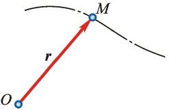

选取参考系上某个确定点O为坐标原点，自点O向动点M作矢量 $\boldsymbol{r}$，称 $\boldsymbol{r}$ 为点M相对原点O的位置矢量，简称矢径

当动点M运动时，矢径 $\boldsymbol{r}$ 随时间而变化，并且是时间的单值连续函数，即 $\boldsymbol{r}=\boldsymbol{r}(t)$，该式称为以矢量表示的点的运动方程

动点的速度矢为
$$
\boldsymbol{v}=\frac{d\boldsymbol{r}}{dt}\triangleq\dot{r}
$$
动点的加速度矢为
$$
\boldsymbol{a}=\frac{d\boldsymbol{v}}{dt}=\dot{\boldsymbol{v}}=\frac{d^2\boldsymbol{r}}{dt^2}=\ddot{\boldsymbol{r}}
$$

### 矢端曲线

上图中矢径 $\boldsymbol{r}$ 的末端描绘出的连续曲线称为矢端曲线

也可以将速度矢平行地移动到点O后连接各适量断点就可以形成速度矢端曲线

同理还有加速度矢端曲线

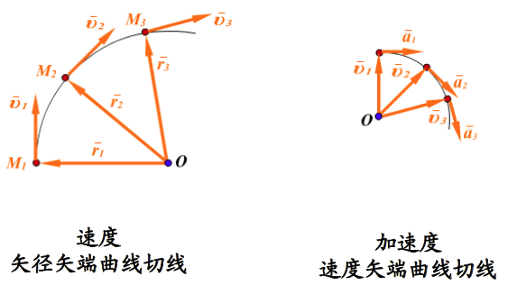

## *直角坐标法*

### 运动方程

取一固定的直角坐标系 Oxyz，矢径的起点与固定直角坐标系重合，因此有如下关系，其中x，y，z都是关于t的单值时间函数
$$
\boldsymbol{r}=x\boldsymbol{i}+y\boldsymbol{j}+z\boldsymbol{k}\\x=f_1(t),\ y=f_2(t),\ z=f_3(t)
$$
该式也是点的轨迹的参数方程，若要求点的轨迹方程，只要将时间t消去就可以了

### 速度

$$
\boldsymbol{v}=\frac{d\boldsymbol{r}}{dt}=\frac{dx}{dt}\boldsymbol{i}+\frac{d\boldsymbol{y}}{dt}\boldsymbol{j}+\frac{dz}{dt}\boldsymbol{k}=v_x\boldsymbol{i}+v_y\boldsymbol{j}+v_z\boldsymbol{k}
$$

### 加速度

$$
\boldsymbol{a}=\frac{d\boldsymbol{v}}{dt}=\frac{d\boldsymbol{v}_x}{dt}\boldsymbol{i}+\frac{d\boldsymbol{v}_y}{dt}\boldsymbol{j}+\frac{d\boldsymbol{v}_z}{dt}\boldsymbol{k}=a_x\boldsymbol{i}+a_y\boldsymbol{j}+a_z\boldsymbol{k}
$$

## *自然法*

自然法是利用点的运动轨迹建立弧坐标和自然轴系，利用它们来描述和分析点的运动的方法

### 弧坐标

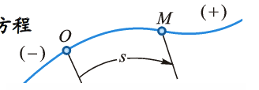

设动点M的轨迹为上图的曲线，则动点M在轨迹上的位置可以这么确定：在轨迹上任选一点O为参考点，并设点O的某一侧为正向，则动点M在轨迹上的位置由 弧长确定，视弧长 $s$ 为代数量，称它为动点M在轨迹上的弧坐标 

当动点M运动时，$s$ 会随着时间变化，它是时间的单值连续函数，即 
$$
s=f(t)
$$
该式称为**点沿轨迹的运动方程**，或**以弧坐标表示的点的运动方程**

### 自然轴系

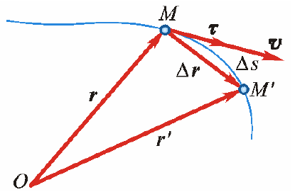

如上图所示，在点的运动轨迹曲线上取即为接近的两点M和M'，其间的弧长为 $\Delta s$，这两点的矢径差为 $\boldsymbol{r'}-\boldsymbol{r}=\Delta\boldsymbol{r}$，当 $\Delta t\rightarrow0$ 时，$\lvert\Delta\boldsymbol{r}\rvert=\lvert\overline{MM'}\rvert=\lvert\Delta s\rvert$
$$
\boldsymbol{e}_t=\lim\limits_{\Delta s\rightarrow0}{\frac{\Delta\boldsymbol{r}}{\Delta s}}=\frac{d\boldsymbol{r}}{ds}\label{tangentVector}
$$
因此有上式 $\boldsymbol{e}_t$ 为沿轨迹切线方向的单位矢量 Tangent vector，其指向与弧坐标正向一致

* 两个平面

  * 如下图所示，M的单位切向量 $\boldsymbol{\tau}_t$ 和 M'的单位且向量 $\boldsymbol{\tau}_t'$ 共同构成了一个平面，称为**密切面 Osculating plane**

  * 过点M并与单位切向量 $\boldsymbol{\tau}_t$ 垂直的平面称为**法平面**

* 三个坐标轴

  * 法平面与密切面的交线称为**主法线 Principal normal**，取它的单位矢量 $\boldsymbol{e}_n$，正方向为指向曲线内凹的一侧

  * 过点M且垂直于切线及主法线的直线称为**副法线 Binormal**，取其单位矢量 $\boldsymbol{e}_b$，指向是与 $\boldsymbol{e}_t,\boldsymbol{e}_n$ 构成右手系，即
    $$
    \boldsymbol{e}_b=\boldsymbol{e}_t\times\boldsymbol{e}_n
    $$

* 以切线、主法线和副法线为坐标轴构成的正交坐标系称为曲线在点M的单位坐标系，这三个轴称为自然轴

**自然坐标系是沿曲线而变动的游动坐标系**，当点M在运动轨迹上运动时，$\boldsymbol{e}_t,\boldsymbol{e}_n,\boldsymbol{e}_b$ 的方向也在不断地变动

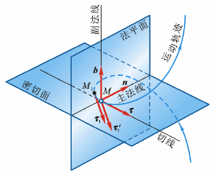

### 点的速度

根据 $\eqref{tangentVector}$ 可得
$$
d\boldsymbol{r}=\boldsymbol{e}_tds\xRightarrow{div\ dt}\boldsymbol{v}=\frac{d\boldsymbol{r}}{dt}=\frac{ds}{dt}\boldsymbol{e}_t
$$
速度的大小等于动点的弧坐标对时间的一阶导数的绝对值，即弧坐标对时间的导数是一个代数量，以 $v=\frac{ds}{dt}=\dot{s}$ 来表示

进而可以将点的速度矢写为 $\boldsymbol{v}=v\boldsymbol{e}_t$ ，即速度矢是一个大小为 $v$ ，方向沿着轨迹切线方向的的矢量

### 曲率 Curvature

在曲线运动中，轨迹的曲率或曲率半径是一个重要的参数，它表示曲线的弯曲程度，它对加速度的推导有帮助。下面对其进行说明

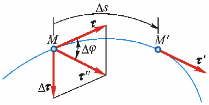

如上图所示（图中的 $\boldsymbol{\tau}$ 都用 $\boldsymbol{e}_t$ 来代替），有非常靠近的两点M和M'，将M'的切向向量的起点平移到M点，那么两个切向单位向量之间的角度为转角 $\Delta\varphi$

**曲率定义为曲线切线的转角对弧长一阶导数的绝对值**，曲率的导数称为曲率半径 curvature radius，则有
$$
\frac{1}{\rho}=\lim\limits_{\Delta s\rightarrow0}{\Bigg\vert\frac{\Delta\varphi}{\Delta s}\Bigg\rvert}=\Bigg\lvert\frac{d\varphi}{ds}\Bigg\rvert
$$
由图中的几何关系可以发现
$$
\lvert\Delta\boldsymbol{e}_t\rvert=2\lvert\boldsymbol{e}_t\rvert\sin{\frac{\Delta\varphi}{2}}
$$
当 $\Delta s\rightarrow0$ 时，$\Delta\varphi\rightarrow0$时，$\Delta\boldsymbol{\tau}$ 与 $\boldsymbol{\tau}$ 垂直，且有 $\lvert\boldsymbol{\tau}\rvert=1$，因此可以得到
$$
\lvert\Delta\boldsymbol{e}_t\rvert\triangleq\Delta\varphi
$$
另外可以注意到当 $\Delta s$ 为正时，点沿切向 $\boldsymbol{\tau}$ 的正方向运动，$\Delta\boldsymbol{\tau}$ 指向轨迹凹一侧；若 $\Delta s$ 为负，则指向外突一侧，代入上式有
$$
\frac{d\boldsymbol{e}_t}{ds}=\lim\limits_{\Delta s\rightarrow0}{\frac{\Delta\boldsymbol{e}_t}{\Delta s}}=\lim\limits_{\Delta s\rightarrow0}{\frac{\Delta\varphi}{\Delta s}\boldsymbol{e}_n}=\frac{1}{\rho}\boldsymbol{e}_n\label{relation_et_en}
$$

### 点的切向加速度和法向加速度

对 $\boldsymbol{v}=v\boldsymbol{e}_t$ 求一次导，可以得到 $\boldsymbol{a}$
$$
\boldsymbol{a}=\frac{d\boldsymbol{v}}{dt}=\frac{dv}{dt}\boldsymbol{e}_t+v\frac{d\boldsymbol{e}_t}{dt}\triangleq\boldsymbol{a}_t+\boldsymbol{a}_n
$$

* 反应速度大小变化的切向加速度 $\boldsymbol{a}_t$
  $$
  \boldsymbol{a}_t=\dot{v}\boldsymbol{e}_t
  $$
  显然 $\boldsymbol{a}_t$ 是一个沿轨迹切线的矢量，因此称为切向加速度 $a_t=\dot{v}=\ddot{s}$，它反应了点的速度值对时间的变化率

* 反应速度方向变化的加速度 $\boldsymbol{a}_n$

  改写 $\boldsymbol{a}_n$ 式子，将 $\eqref{relation_et_en}$ 代入下式
  $$
  \boldsymbol{a}_n=v\frac{d\boldsymbol{e}_t}{dt}=v\frac{d\boldsymbol{e}_t}{ds}\frac{ds}{dt}=\frac{v^2}{\rho}\boldsymbol{e}_n
  $$
  法相加速度反应了点的速度方向改变的快慢程度，方向沿主法线，指向曲率中心

由于 $\boldsymbol{a}_t,\boldsymbol{a}_n$ 均在密切面内，因此全加速度 $\boldsymbol{a}$ 也必然在密切面内，这表明加速度沿副法线上的分量为0，即 $\boldsymbol{a}_b=0$

全加速度 $\boldsymbol{a}$ 的大小和方向为
$$
\boldsymbol{a}=\left\{\begin{array}{l}a=\sqrt{a_t^2+a_n^2}\\\tan{\theta}=\frac{a_t}{a_n}\end{array}\right.
$$

### 特殊运动

* 曲线匀变速运动：动点的切向加速度的代数值保持不变，即 $a_t$ 为恒量
  $$
  dv=a_tdt\xrightarrow{\int}v=v_0+a_tt\xrightarrow{\int}s=s_0+v_0t+\frac{1}{2}a_tt^2
  $$

* 曲线匀速运动：$s=s_0+vt$

# 刚体的简单运动

刚体是由无数点组成的，在点的运动学基础上可研究刚体的运动

研究刚体整体的运动及其与刚体上各点运动之间的关系

## *刚体的平行移动*

刚体内任一直线在运动过程中始终平行于初始位置，这种运动称为平移

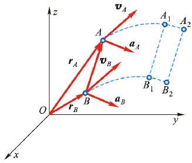

如图所示，在刚体内任选两点A和B，令点A和点B的矢径分别为 $\boldsymbol{r}_A,\boldsymbol{r}_B$
$$
\boldsymbol{r}_A=\boldsymbol{r}_B+\overrightarrow{BA}\\\boldsymbol{v}_A=\boldsymbol{v}_B,\ \boldsymbol{a}_A=\boldsymbol{a}_B
$$
当刚体平移时，线段AB的长度和方向都不改变，所以 $\overrightarrow{BA}$ 是恒矢量

当刚体平移时，其上各点的轨迹形状相同，所以在每一瞬时，各点的速度相同，加速度也相同。因此在研究刚体的平移时，可以归结为研究刚体内任一点（如质心）的运动，也就是归结为前面点的运动学问题

## *刚体绕定轴的转动*

### 转角与转动方程

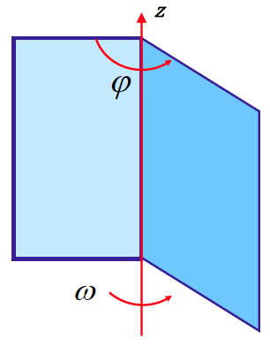

刚体在运动时，刚体上或者器扩展部分的两点保持不动，则这种运动称为刚体绕定轴转动

通过这两个固定点的一条不动的直线，称为刚体的转轴或者轴线

为确定转动刚体的位置，取其转轴为z轴，绑定一个平面在转动体上，转动后称平面之间的夹角为 $\varphi$。转角的符号规定为：从z轴的正端向负端看，逆时针为正，顺时针为负，单位为弧度 rad

当刚体转动时，转角 $\varphi$ 是时间 t 的单值连续函数，称为刚体绕定轴转动的运动方程，只要一个参数 $\varphi$ 就可以决定它的位置（只有一个自由度）
$$
\varphi=f(t)
$$

### 角速度和角加速度

角速度和角加速度分别为
$$
\omega=\frac{d\varphi}{dt},\ \alpha=\frac{d\omega}{dt}=\frac{d^2\varphi}{dt^2}=\dot{\omega}=\ddot{\varphi}
$$
特殊的转动情况

* 匀速转动：$\alpha=0\rightarrow\varphi=\varphi_0+\omega t$
* 匀变速转动：$\alpha=const\rightarrow\omega=\omega_0+\alpha t\rightarrow\varphi=\varphi_0+\omega_0t+\frac{1}{2}\alpha t^2$

## *转动刚体内各点的速度和加速度*

当刚体绕定轴转动时，刚体内任意一点都做圆周运动，圆心在轴线上，圆周所在的平面与轴线垂直，圆周的半径 $R$ 等于该点到轴线的垂直距离，对此宜采用自然法研究各点的运动

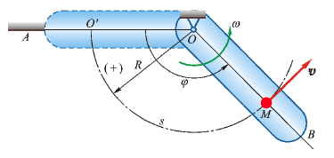

如上图所示，设物体由定平面A绕定轴O转动任一角度 $\varphi$，到达B位置，其上任一点由 $O'$ 运动到 $M$

以固定点 $O'$ 为弧坐标 $s$ 的原点，按 $\varphi$ 角的正向规定弧坐标 $s$ 的正向，根据因此有运动方程
$$
s=R\varphi
$$

### 速度

对上式对t取一阶导
$$
\frac{ds}{dt}=R\frac{d\varphi}{dt}\Rightarrow v=R\omega\label{速度和角速度关系}
$$
即转动刚体内**任一点的速度**的大小，等于**刚体的角速度**与该点到轴线的垂直距离的乘积，它的方向沿圆周的切线而指向转动的一方

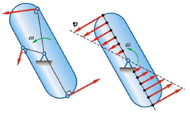

根据公式，一个绕中心转动的物体，它的横截面的线速度与半径成线性关系

### 加速度

再对t取一次导有
$$
\frac{dv}{dt}=R\frac{\omega}{dt}\Rightarrow a_t=R\alpha
$$
即转动刚体内任一点的切向加速度的大小等于刚体的角加速度与该点到轴线垂直距离的乘积，它的方向由角加速度的符号决定

法相加速度为如下，对于圆来说每点的曲率半径都为半径
$$
a_n=\frac{v^2}{\rho}=\frac{\left(R\omega\right)^2}{\rho}\xrightarrow{\rho=R}a_n=R\omega^2
$$
因此有点M的全加速度
$$
\boldsymbol{a}=\left\{\begin{array}{l}a=\sqrt{a_t^2+a_n^2}=\sqrt{R^2\alpha^2+R^2\omega^4}=R\sqrt{\alpha^2+\omega^4}\\\tan{\theta}=\frac{a_t}{a_n}=\frac{R\alpha}{R\omega^2}=\frac{\alpha}{\omega^2}\end{array}\right.
$$

* 在每一瞬时，转动刚体内所有各点的速度和加速度的大小，分别与这些点到轴线的垂直距离成正比
* 在每一瞬时，刚体内所有各点的全加速度 $\boldsymbol{a}$ 与半径间的夹角 $\theta$ 都是相同的，因为只与这个瞬间的角速度和角加速度有关

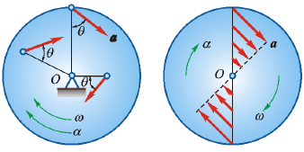

### 各种速度的叉乘表示

* 角速度：根据右手法则，绕转轴 $z$ 的正方向旋转 $\vec{\omega}=\omega\vec{k}$
* 角加速度：根据右手法则，绕转轴 $z$ 的正方向旋转 $\vec{\alpha}=\alpha\vec{k}$
* 速度：右手定则 $\vec{v}=\vec{\omega}\times\vec{r}$
* 加速度
  * 切向加速度：$\vec{\alpha}_t=\vec{\alpha}\times\vec{r}$
  * 法相加速度：$\vec{a}_n=\vec{\omega}\times\vec{v}=\vec{\omega}\times\left(\vec{\omega}\times\vec{r}\right)$

# 点的合成运动

物体相对于不同参考系的运动是不同的。研究物体相对于不同参考系的运动，分析物体相对于不同参考系运动之间的关系，可以称为复杂运动或合成运动

## *三种合成运动*

### 两种坐标系

习惯上把固定在地球上的坐标系称为定参考系，简称定系 $Oxyz$

固定在其他相对于地球运动的参考系上的坐标系称为动参考系，简称动系 $O'x'y'z'$

### 三种运动

* 点的运动，可能做直线或者曲线运动
  * 绝对运动 Absolution motion：动点相对于定系的运动
  * 相对运动 Relative motion：动点相对于动系的运动
* 参考系的运动：牵连运动 Entrainment motion 动系相对于定系的运动，实际上是刚体的运动，可能做平移、转动或其他比较复杂的运动

### 牵连点

在动参考系上与动点相重合的那一点（牵连点）的速度和加速度称为动点的**牵连速度**和牵连加速度，注意：牵连速度和牵连加速度仍然是相当于定参考系来说的！

其实所谓的牵连点通俗来讲就是我们关注的同时在固定系里和动系里要观察的一个点

常见的有偏心凸轮机构、曲柄摇杆机构等

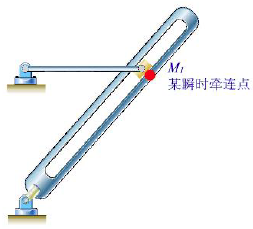

## *点的速度合成定理*

### 证明

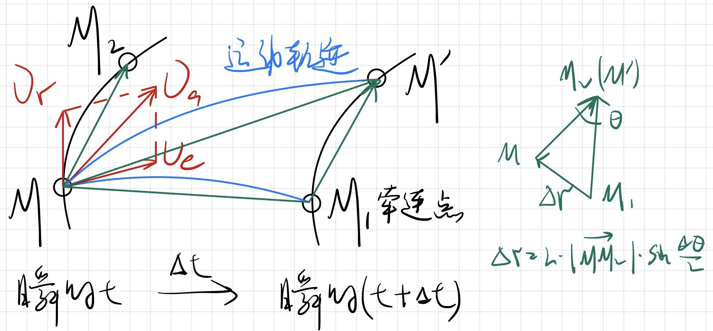

设想AB为一根金属线，动参考系固定在这根线上面，将动点 $M$ 看成是沿金属线滑动的一个极小圆环

在瞬时t，动点位于金属线AB的点 $M$，经过极短的时间 $\Delta t$ 后，动参考系 $AB$ 运动到新位置 $A'B'$，同时动点也会沿金属线移动到 $M'$ 

动点在某瞬时的绝对速度等于它在该瞬时的牵连速度与相对速度的矢量和

考虑两种观察方式

* 在动参考系上考察动点 $M$ 的运动，则它沿曲线AB运动到点 $M_2$
* 在定参考系上考察动点 $M$ 的运动，则它在时间间隔 $\Delta t$ 内的位移矢量为 $\overrightarrow{MM'}$ 

根据速度的定义，动点 $M$ 在瞬时 $t$ 的绝对速度和相对速度分别为，其中绝对速度的方向是沿弧线 $\overset{\Large\frown}{MM'}$ 的切线
$$
\boldsymbol{v}_a=\lim\limits_{\Delta t\rightarrow0}{\frac{\overrightarrow{MM'}}{\Delta t}},\ \boldsymbol{v}_{\tau}=\lim\limits_{\Delta t\rightarrow0}{\frac{\overrightarrow{MM_2}}{\Delta t}}
$$
同时有 $M_1$ 是瞬时 $t$ $M$ 点的牵连点，故点 $M_1$ 点的速度为
$$
\boldsymbol{v}_e=\lim\limits_{\Delta t\rightarrow0}{\frac{\overrightarrow{MM_1}}{\Delta t}}
$$
另设 $\Delta\boldsymbol{r}=\overrightarrow{M_1M'}-\overrightarrow{MM_2}$，可以得到
$$
\boldsymbol{v}_r=\lim\limits_{\Delta t\rightarrow0}{\frac{\overrightarrow{MM_2}}{\Delta t}}=\lim\limits_{\Delta t\rightarrow0}{\frac{\overrightarrow{M_1M'}}{\Delta t}}
$$
根据矢量关系 $\overrightarrow{MM'}=\overrightarrow{MM_1}+\overrightarrow{M_1M'}$ 并对其分别对 $\Delta t$ 求极限 可以得到 $\boldsymbol{v}_a=\boldsymbol{v}_e+\boldsymbol{v}_r$，即**质点的绝对速度=质点的牵连速度+质点的相对速度**

### 两种情况

* 牵连运动是平移 $\boldsymbol{v}_a=\boldsymbol{v}_e+\boldsymbol{v}_r$
* 牵连运动是旋转，根据 $\eqref{速度和角速度关系}$ 的叉乘表示法，$\boldsymbol{v}_a=\omega\times\boldsymbol{r}+\boldsymbol{v}_r$，其中 $\omega$ 是动系绕固定系旋转的角速度，$\boldsymbol{r}$ 是牵连点对固定系的矢径

## *点的加速度合成定理*

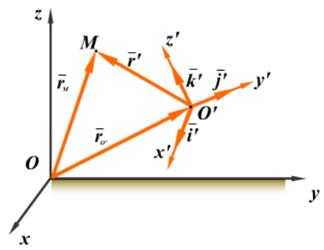

### 牵连运动是平移时

### 牵连运动是定轴转动时 -- 科氏加速度

# 刚体的平面运动

## *基点法*

## *瞬心法*