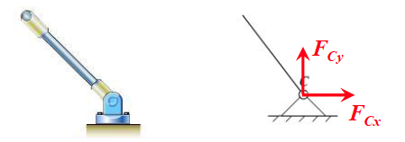

# 静力学公理和物体的受力分析

## *静力学公理*

公理是人们在生活和生产实践中长期积累的经验总结，又经过实践反复检验，被认为是符合客观实际的最普遍、最一般的规律

静力学的全部理论都可以由下面五个公理推证得到

### 力的平行四边形法则

作用在物体上同一点的两个力，可以合成为一个合力，合力的作用点也在该点，合力的大小和方向由这两个力为边构成的平行四边形的对角线确定 $F_R=F_1+F_2$

这条公理是复杂力系简化的基础

### 二力平衡条件

作用在同一刚体上的两个力，使刚体保持平衡的必要充分条件是：这两个力的大小相等、方向相反，且作用在同一条直线上

这条公理表明了作用于刚体上最简单力系平衡时所必须满足的条件

### 加减平衡力系原理

在任一原有力系上加上活减去任意的平衡力系，与原力系对刚体的作用效果等效

这条公理是研究力系等效替换的重要依据

* 力的可传性：作用于刚体上某点的力，可以沿着它的作用线移到刚体内任意一点，并不改变该力对刚体的作用

  

* 三力平衡汇交定理：刚体在三个力作用下平衡，若其中两个力的作用线交于一点，则第三个力的作用线必通过此汇交点，且三个力位于同一平面内

  

### 作用和反作用定律

作用力和反作用力总是同时存在，两力的大小相等、方向相反，沿着同一条直线，分别作用在两个相互作用的物体上

作用和反作用力作用在相互作用的**两个物体**上，而二力平衡公理中的二力作用在**同一个刚体**上

### 刚化原理

变形体在某一力系作用下处于平衡，如将此变形体刚化为刚体，其平衡状态保持不变。

这个公理提供了把变形体看作为刚体模型的**必要不充分条件**，即反之则不成立，刚体成立的，变成非刚体则不一定成立

## *约束和约束力*

### 定义

* 自由物体 Free-body：空间位置不受限制的物体
* 非自由体：空间物体受到限制的研究对象称为非自由物体

约束：非自由体的运动所收到的限制称为约束

非自由体的真实运动是两种力共同作用的结果

* 主动力：使物体产生运动或运动趋势的力
* 约束力：约束对物体的作用
  * 大小待定
  * 约束力的方向必与该约束所能够阻碍的位移方向相反
  * 作用点位于接触处

### 常见约束

* 具有光滑接触表面的约束（光滑接触约束）

  

  * 可以忽略摩擦力的一般常见的接触约束，如支持物体的固定面、啮合齿轮的齿面、机床中的导轨等
  * 作用在接触处，方向沿接触处的公发现并指向受力物体，故称为法向约束力 $F_N$

* 由柔软的绳索、链条或胶带等构成的约束

  * 柔索只能受拉力，又称张力，一般用 $F_T$ 表示

  * 柔索对物体的约束力作用在接触点，沿着柔索背向被约束物体，皮带（链条）对轮的约束力沿轮缘的切线方向

    

* 光滑铰链约束

  * 向心轴承（径向轴承）

    

    * 轴可在孔内任意转动，也可沿孔的中心线移动，但轴承阻碍着轴沿**径向向外**的位移
    * 不计摩擦时，轴与孔在接触处为光滑接触约束 -- 法向约束力，作用点为接触处，方向沿公发现指向轴心
    * 随着轴所受的主动力不同，轴和空的接触点的位置也随之不同，所以当主动力尚未确定时，约束力的方向预先不能确定，但方向始终时朝向轴心的，因此要把力分解为两个大小未知的正交力 $F_{Ax},F_{Ay}$，其指向也可暂时任意假定（朝上、朝下，朝左、超右都可能）

  * 圆柱铰链

    

    * 上图三绞拱中的C是圆柱铰链，圆柱铰链是由销钉C将两个钻有同样大小孔的构件连接在一起而成的
    * 分析铰链处的约束力时，通常把销钉固连在其中任意一个构件上，忽略摩擦的情况下，销钉与构件实际上是向心轴承的约束，因此每个构件都受到一个类似于轴承中的力，可以被分解为x和y方向上的两个分力
    * 只有在需要单独分析销钉C的受力时，才把销钉分离出来单独研究，此时销钉同时受到两个构件上的孔对它的反作用力

  * 固定铰链支座：上图三铰拱中A和B是固定铰链支座

    

    * 将销钉固连在A和B支座上
    * 和轴承一样，可以把支座对杆件的约束力分解为x和y方向上的两个分力

  上述三种约束的具体结构虽然不同，但构成约束的性质是相同的额，一般统称为铰链约束。此类约束的特点是只限制两物体径向的相对移动，而不限制两物体绕铰链中心的相对转动与沿轴向的位移。此类约束一般的约束力一般用两个正交分力来表示

* 其他类型约束

  * 滚动支座

    

    * 在前述固定铰支座与光滑固定平面之间装有光滑滚轴而成，这种轴又称为辊轴支座
    * 构件在水平于光滑面的方向上不受到约束，可以自由滑动；受到垂直于光滑面的约束力，可能是压力也可能是拉力

  * 球铰链

    

    可以绕球心转动，可以将约束力分解为空间中的三个正交分力

  * 止推轴承

    

    止推轴承比径向轴承多一个周详的约束力，也就是又了三个正交分力

## *常见力学模型*

### 二力杆

只在两个力作用下平衡的构件，称为二力构件；若构件为直杆或弯杆，则称为二力杆

一个杆件是否是二力构件仅与它的受力有关，与它的形状没有关系

二力杆的受力特点是：两个力必定沿着两个力作用点的连线，且大小相等、方向相反

下图中是一些常见的二力杆结构

### 简支梁

### 平面桁架 Truss Fachwerk

# 平面力系

## *平面汇交力系*

汇交力系：各力的作用线都汇交于一点的力系

### 几何法

* 两个共点力的合成：力三角形规则
* 多个汇交力的合成：力多边形规则。力多边形不唯一
* 汇交力系平衡的几何条件：$F_R=\sum{F_i}=0$，充要条件为该力系的力多边形自行封闭

### 解析法

利用力的投影将力表达成x和y方向的矢量和进行求解
$$
\left\{\begin{array}{l}F_x=F\cdot\cos{\theta}\\F_y=F\cdot\sin{\theta}\end{array}\right.
$$

## *力矩与力偶 Force Moment and Couple*

### 平面力对点之矩

力对刚体的作用是使刚体的运动状态发生改变，包括移动与转动，力对刚体的移动效应可用力矢来度量，而力对刚体的转动效应可用力对矩来度量，即**力矩 Moment 是度量力对刚体转动效应的物理量**。矩是某个量相对于某个点的作用的一种度量工具

* O称为矩心
* O与力矢量的首尾确定的平面称为力矩作用面
* O对力的作用线的垂直距离h称为力臂

力F使物体绕O点的转动效果完全由两个要素来决定
$$
M_O(F)=\pm F\cdot h
$$

* 大小：力F与力臂的h的乘积是一个代数量 $F\cdot h$
* 方向：规定逆时针转向为正，反之为负
* 单位为 $N\cdot m$ 

### 合力矩定理与力矩的解析表达式

$$
M_O(F)=\sum{M_O(F_i)}
$$

合力矩定理：平面汇交力系的合力对平面内任一点的矩等于各分力对该点的矩的代数和

力矩的解析表达式为
$$
M_O(F)=M_O(F_y)-M_O(F_x)\\=x\cdot F\cdot\sin{\theta}-y\cdot F\cdot\cos{\theta}=xF_y-yF_x
$$

### 力偶与力偶矩

由两个**大小相等、方向相反、不共线的平行力**组成的力系称为力偶 Couple

* 力偶是对力系但不是平衡力系
* 力偶没有合力，不能用一个力来等效替换，也不能用一个力来平衡
* 力偶和力一样，是力学中的一个基本要素

力偶矩 Moment of Couple 是对力偶使物体转动效果的度量：$M=\pm F\cdot d$

### 力偶的性质

定理：在同一平面内的两个力偶，若力偶矩相等，则两力偶彼此相等

* 推论一：力偶对任意点取力矩都等于力偶矩，不因矩心的改变而改变，因此力偶可在其作用面内任意移转，而不改变它对刚体的作用。**这也是力矩与力偶矩的主要区别**。可以通过验证求下图中力偶对两矩心的力偶矩来验证这个推论

  
  $$
  M_{O_1}(F)+M_{O1}(F')=F\cdot(d+x_1)-F'\cdot x_1=Fd\\M_{O_2}(F)+M_{O2}(F')=-F\cdot x_2-F'\cdot(x_2+d)=Fd
  $$

* 推论二：只要保持力偶矩的大小和力偶的转向不变，可以同时改变力偶中力的大小与力偶臂的长短，对刚体的作用效果不变

  

**力偶矩是平面力偶作用的唯一度量**

## *平面任意力系的简化*

力系中所有力的作用线都处于同一平面内且任意分布时，称其为平面任意力系

平面任意力系不管其怎么复杂，总可以用一个简单力系等效代替，称为平面任意力系的简化

### 力的平移定理

平移定理：可以把作用在刚体上点A的力F平行移到任一点B，但必须同时附加一个力偶，这个附加力偶的矩等于原来的力F对新作用点B的矩

在一般情况下，平面任意力系向作用面内任选一点O简化，可得一个力和一个力偶，这个力的大小和方向等于该力系的主矢，作用线通过简化中心O，这个力偶的矩等于该力系对于点O的主矩

### 平面任意力系的平衡条件和平衡方程

$$
F_R'=0,\ M_0=0\Rightarrow\sum{F_x}=0,\ \sum{F_y}=0,\ \sum{M_0(F_i)}=0
$$

## *物体系的平衡 -- 静定和超静定问题*

# 空间力系

## *空间汇交力系*

## *物体的重心*

# 摩擦

## *滑动摩擦*

## *摩擦角和自锁现象*

## *考虑摩擦时物体的平衡问题*

## *滚动摩阻的概念*