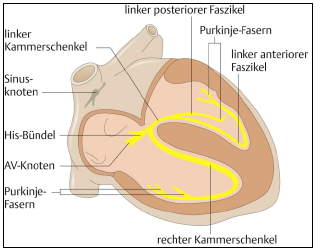
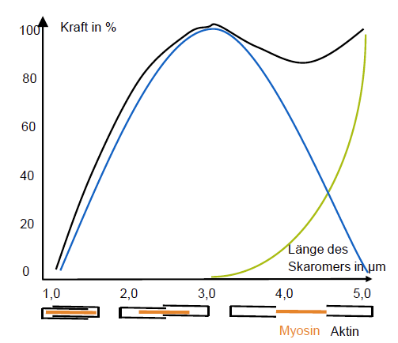
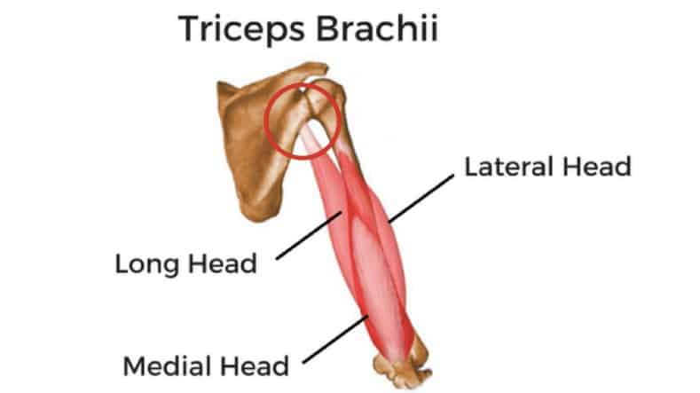

# 常见疾病

## *心脏生理学*

### 心脏结构

* 上腔静脉 obere Hohlvene：收集来自头部、上肢、胸部的血液回流
* 下腔静脉 untere Hohlvene：下半身的血液回流
* 心肌：左心室承受的压力很大，它负责把动脉血泵到全身所以心肌很厚，而右心室相对较薄，因为它只需要把血泵入肺
* 心房 Vorhof
* 心室 Kammer
* 心包 Herzbeutel 是覆盖在心脏外部的袋状组织，分为纤维性心包和浆液性心包，其功能是保护和固定心脏
  * 纤维性心包 Fibrous Pericardium 是较为结实的外层，为心脏提供保护和固定
  * 浆液性心包 Serous Pericardium 由两层膜组成：壁层 Parietal Layer 与心脏外壁相连，脏层 Visceral Layer 也称为心包脏层或心外膜 Epicardium，紧密贴附在心肌表面。心包内含有少量浆液，有助于减少心脏的摩擦
* 心肌 Herzmuskel 是心脏的肌肉组织层，由心肌细胞构成，具有自主收缩和传导电信号的能力，推动血液循环
* 两套心瓣 Klappen
  * Segelklappen 房室瓣：隔绝心房和心室
    * Trikuspidalklappe 三尖瓣：隔绝右心房和右心室
    * Mitralklappe 二尖瓣：隔绝左心房和左心室
  * Taschenklappen 半月瓣：隔绝心室和动脉
    * Aortenklappe 主动脉瓣：隔绝左心室和主动脉
    * Pulmonalklappe 肺动脉瓣：隔绝右心室和肺主动脉

### 心跳周期

心跳周期 Phasen der Herztätigkeit 是指心脏完成一次收缩和舒张的时间间隔。正常情况下，心跳周期可分为以下几个阶段

1. 收缩期 Systole：心脏收缩将氧气和营养物质富含的血液推送到全身各个组织和器官。收缩期一般占心跳周期的三分之二左右的时间
   1. 心室收缩初期/等容收缩时间 Isovolumetric Contraction IVCT：心室开始收缩，心室内压力不断上升。心房瓣和主动脉瓣关闭，防止血液回流至心房。此时，心室内的血液量不变。相当于第一心音 S1 的发生时间
   2. 心室射血期 Ejection Phase：心室的压力上升，主动脉和肺动脉瓣打开，将血液推向全身和肺部
   3. 心室收缩末期/等容舒张时间 Isovolumetric Relaxation IVRT：心室收缩结束，心室开始放松，主动脉和肺动脉瓣关闭，防止血液回流至心室
2. 舒张期 Diastole：心脏舒张时，它会充满氧气和营养不足的血液，以便下一次收缩。在舒张期间，心脏会休息和恢复，以便准备下一次收缩。舒张期一般占心跳周期的三分之一左右的时间
   1. 早期舒张期 Early Diastole：心室开始放松，血液从主动脉和肺动脉返回心房，心房充盈
   2. 心房收缩 Atrial Contraction：心房收缩，将剩余的血液推入心室，进一步增加心室的充盈
   3. 晚期舒张期 Late Diastole：心室继续放松，心房和心室充盈达到最大，准备进入收缩期

心跳周期的分布比例是由心脏的节律产生的，通常被称为心律。正常成年人的心律通常为正常窦性心律，即以一个稳定的节律进行收缩和舒张

### 心音 Herztone

心音是由心脏的收缩和舒张过程中产生的声音，用来评估和诊断心脏的健康状况。正常情况下，人体可以听到两个主要的心音，被称为第一心音 S1 和第二心音 S2

1. 第一心音 S1：第一心音是心脏收缩过程中产生的声音。它是由心脏的二尖瓣和三尖瓣关闭时造成的。S1声音通常比较低沉，可以用“咚”或“Lub”来形容。第一心音标志着心脏的开始收缩，将血液推向主动脉和肺动脉
2. 第二心音 S2：第二心音是心脏舒张过程中产生的声音。它是由主动脉瓣和肺动脉瓣关闭时造成的。S2声音通常比较清脆，可以用“咔嗒”或“Dub”来形容。第二心音标志着心脏的舒张，准备接收新鲜血液

除了S1和S2之外，有时候还可以听到其他的心音，如心脏瓣膜异常、心脏杂音或心律不齐等情况下可能会出现额外的心音

## *心血管疾病*

### 动脉粥状硬化

* 定义：动脉粥状硬化是一种慢性疾病，也被称为动脉硬化。它是指动脉血管内形成斑块或斑块堆积，逐渐导致血管壁变硬和狭窄的病理过程。这种病变主要发生在中大动脉，如冠状动脉、颈动脉、脑动脉、肾动脉和下肢动脉。
* 病因：动脉粥状硬化的形成是一个复杂的过程，主要包括以下几个步骤
  * 损伤：动脉内膜受到损伤，可能是由于高血压、高胆固醇、吸烟、糖尿病等因素引起。
  * 斑块形成：损伤的内膜会吸引血液中的胆固醇和其他脂质物质，形成斑块，也称为动脉粥样斑块。
  * 钙化和硬化：斑块中的胆固醇会被身体的免疫细胞摄取，并在血管壁内形成脂质核。随着时间的推移，脂质核会钙化并逐渐硬化，形成斑块的中心。
  * 血栓形成：斑块表面的血管内皮细胞会释放出凝血因子，导致血小板聚集和血栓形成。血栓可以阻塞血管，导致心脏病发作、中风或其他血管相关疾病。
* 后果：动脉粥状硬化的严重程度取决于斑块的大小、数量和位置。当斑块堆积在血管壁内，并逐渐狭窄或完全阻塞血管时，会导致血液供应不足，引发心血管疾病，如心绞痛、心肌梗死、血栓引起的脑梗死等。

### 心律失常

### 冠心病

### 心肌梗死

## *新陈代谢类疾病*

### 全身血液循环

### 高血压 Hypertonie

关于高血压的一些历史：<https://weixin.incongress.cn/notes.do?method=getNotesByIdLMV2&openid=oevdBuJV0wNqnIS7cFcm3FHxw22s&notesId=25494>

> 1911年，德国医生FrankE首次将病因不明的高血压命名为德文的essentielle Hypertonie，英文译为essential hypertension，essential的英文含义为必要的、不可或缺的、非常重要的，故其本意是"必需性高血压"，这是因为当时的学术界认为，血压升高类似于病原体感染时的发热，是一种代偿性反应，发热的治疗应针对感染而非降低体温。术语 essential hypertension 沿用至今，特指"原发性"高血压，但已失去单词的原意， 成一个见证历史的"古玩"性词汇了。

高血压是一种常见的慢性疾病，其特征是持续性的血压升高。高血压是心血管疾病的主要危险因素之一，如果不加控制和管理，可能导致心脏病、脑卒中、肾脏疾病和其他健康问题。

1. 根据美国预防、检测、评估和治疗高血压委员会（JNC）发布的JNC-8标准定义的血压标准为
   1. 常血压：
      * 收缩压（高压）小于120 mmHg，并且
      * 舒张压（低压）小于80 mmHg
   2. 前高血压 Prehypertension：
      * 收缩压介于120-139 mmHg之间，或
      * 舒张压介于80-89 mmHg之间
   3. 高血压 Hypertension：
      * 阶段1高血压：
        * 收缩压介于140-159 mmHg之间，或
        * 舒张压介于90-99 mmHg之间
      * 阶段2高血压：
        * 收缩压大于等于160 mmHg，或
        * 舒张压大于等于100 mmHg
2. 分类：根据血压水平，高血压被分为两类：原发性高血压 essentielle/primäre Hypertonie 和继发性高血压 sekundäre Hypertonie。绝大多数高血压患者属于原发性高血压，即原因不明的高血压。继发性高血压是由其他疾病或药物引起的，如肾脏疾病、内分泌紊乱或药物副作用等。
3. 危险因素：高血压的发病原因复杂，可能受到遗传因素、环境因素和生活方式的影响。一些常见的危险因素包括家族史、年龄、肥胖、高盐摄入、不良的饮食习惯、缺乏体育锻炼、吸烟、饮酒过量、慢性压力和某些慢性疾病（如糖尿病、肾脏疾病等）。
4. 症状：高血压通常被称为“无声的杀手”，因为大多数患者在早期没有明显的症状。长期未经控制的高血压可能导致头痛、头晕、视力模糊、胸痛、心悸、呼吸困难和疲劳等症状。
5. 预防和管理：高血压是可以控制和管理的。生活方式的改变对于预防和治疗高血压非常重要，如控制体重、减少盐的摄入、健康饮食（例如DASH饮食）、增加体育锻炼、戒烟限酒、减少压力等。在一些情况下，医生可能会推荐药物治疗，如利尿剂、钙通道阻滞剂、血管紧张素转换酶抑制剂或血管紧张素受体拮抗剂等。

### I型、II型糖尿病 Diabetes

糖尿病是一种慢性代谢性疾病，由于胰岛素的分泌不足或细胞对胰岛素的反应性降低，导致血糖水平异常升高。根据病因和病理生理特点，糖尿病可分为多种类型，其中最常见的是I型糖尿病和II型糖尿病。

I型糖尿病 Diabetes Typ I (Insulinmangel)： I型糖尿病也被称为胰岛素依赖型糖尿病或少年型糖尿病。它通常在青少年或儿童期间发病，占所有糖尿病患者的约5-10%。I型糖尿病的主要特点是胰岛 $\beta$ 细胞的自身免疫性破坏，导致胰岛素的分泌严重减少或完全停止。具体病因尚不完全清楚，但遗传因素和环境因素可能起着重要作用。

主要特征：

* 胰岛素缺乏：I型糖尿病患者体内几乎没有胰岛素的产生，需要通过外源性胰岛素注射来控制血糖水平。
* 自身免疫：免疫系统攻击和破坏胰岛细胞，导致胰岛素分泌受阻。
* 血糖控制困难：由于胰岛素严重不足，I型糖尿病患者往往需要密切监测血糖水平，注射胰岛素以维持正常的血糖控制。
* 突发症状：常见症状包括多饮、多尿、体重下降、疲劳感、饥饿感、视力模糊等。

II型糖尿病 Diabetes Typ II (Insulinresistenz)： II型糖尿病也被称为成人型糖尿病或非胰岛素依赖型糖尿病。它是最常见的糖尿病类型，约占所有糖尿病患者的90-95%。II型糖尿病主要由于胰岛素的分泌不足和细胞对胰岛素的反应性下降，导致血糖水平升高。此外，肥胖、不良的生活习惯和遗传因素等也与II型糖尿病的发生相关。

主要特征：

* 胰岛素抵抗：身体细胞对胰岛素的反应性降低，使得胰岛素难以有效将葡萄糖带入细胞内，导致血糖升高。
* 相对胰岛素分泌不足：胰腺仍能分泌一定量的胰岛素，但不足以满足细胞对胰岛素的需求。
* 可控制性：初期可以通过生活方式干预（例如改变饮食、增加运动）和口服药物来控制血糖水平。在某些情况下，患者可能需要注射外源性胰岛素。

### 高血脂 Hyperlipoproteinämie

## *神经性疾病*

### 卒中 Schlaganfall

卒中，也被称为脑卒中或中风 Stroke，是一种突发性的神经系统疾病，通常由于脑血管的破裂或阻塞导致脑部血液供应中断而引起。这种中断可以导致脑细胞缺氧和死亡，从而对身体的某些功能造成损害。

卒中可分为两种主要类型：

1. 缺血性卒中 ischämisch：占所有卒中病例的约80-85%。这种类型的卒中是由于脑血管的阻塞导致血液供应不足，最常见的原因是血栓形成或动脉硬化。当血栓或血管内的斑块阻塞了供血动脉时，脑部区域无法获得足够的氧气和营养，从而导致脑细胞损伤或死亡。
2. 出血性卒中 hämorrhagisch：占所有卒中病例的约15-20%。这种类型的卒中是由于脑血管破裂导致大量血液流入脑组织造成的。出血性卒中可能是由于脑动脉瘤破裂、高血压引起的血管破裂或血液凝固功能异常等因素引起。

卒中的症状取决于受影响的脑区域和程度，常见症状包括：

* 突发性面瘫、肢体无力或麻木
* 语言障碍或失语
* 视力丧失或模糊
* 突发性头痛
* 平衡和协调障碍
* 急剧的智力衰退或意识丧失

卒中是一种紧急情况，及早的诊断和治疗至关重要，因为迅速的干预可以减少脑损伤并提高康复的机会。常见的治疗方法包括使用血栓溶解药物（对于缺血性卒中）或进行手术治疗（对于出血性卒中）。康复阶段的治疗通常涉及物理疗法、言语疗法和职业疗法等，旨在恢复受损的功能和提高生活质量。

预防卒中的关键包括控制高血压、心脏疾病、糖尿病和高血脂等危险因素，保持健康的生活方式，包括戒烟、限制饮酒、健康饮食和适度的体育锻炼。定期进行健康检查和血压监测也是重要的预防措施。

### 帕金森病

# 关键指标测量

## *体温*

### 温度计分类

* 膨胀式温度计 Ausdehnungsthermometer：汞 Quecksilber（欧盟禁用）或 Galinstan 镓铟锡合金（镓 Galium、铟 Indium、锡 Zinn）在毛细管中的热膨胀
* 数字式温度计：电阻的热变化
* 红外温度计：耳膜或前额的红外辐射
* 热敏电阻导管：中心静脉导管或膀胱导管（重症监护室中用到）上的连续记录

### 热阻效应

Temperaturabhängigkeit der elektrischen Leitfähigkeit 与温度相关的电导性 $\sigma$ / 电阻 $\rho$

* Kaltleiter (PTC-Thermistor positive temperature coefficient)：铂温度传感器

* Heißleiter (NTC-Thermistor negative temperature coefficient)
  $$
  R(T)=R_0\cdot \exp{\left[b\left(\frac{1}{T}-\frac{1}{T_0}\right)\right]}
  $$
  b：物质常数 [K]; $R_0, T_0$：名义温度 [K] 时的名义电阻 [$\Omega$]

* 惠斯通电桥 WheatstonescherMessbrücke
  $$
  U_d=U_0\frac{\Delta R}{2(2R+\Delta R)}\approx\frac{1}{4}U_0\frac{\Delta R}{R}\ für\ \Delta R\ll R
  $$

### 红外线测量

辐射热测量是一种非常常用的非接触式温度测量

* Ohrthermometer 耳温计：耳膜与大脑温度控制中心的血液供应相连，测量时必须将测量传感器与耳膜精确对准，这对小宝宝很困难很难做到，因为他们的耳道不直
* Stirn- oder Schläfenthermometer 前额或太阳穴温度计：颞静脉 Schläfenvene 能反映体温 - 测量结果有误，特别是在烦躁不安的儿童中 - 冷汗、前额皮肤厚度和血管收缩药物会影响测量结果

## *体重*

### BMI

BMI的计算公式为
$$
BMI=\frac{Gewicht\ [kg]}{\left(Größe\ [m]\right)^2}
$$
由于BMI没有将体脂肪率计算在内，所以一个BMI超重的人，实际上可能并非肥胖。例如健身人群，由于体重有高比例的肌肉，他的BMI可能会超过30。如果他们身体的脂肪比例较低，那就不需要减重。

中国大陆官方发布的《中国成人超重和肥胖症预防控制指南》所认定的体重腰围的适宜值为

* 男性的BMI为18.5-23.9，腰围小于85
* 女性的BMI为18.5-23.9，腰围小于80

Normalgewicht laut Deutscher Gesellschaft für Ernährung

* Männer: 20-25 [kg/m2] 
* Frauen: 19-24 [kg/m2]

### 压电效应

### 应力测量仪

## *血糖*

### 侵入式 invasive Messung

安培测量法 Amperometrische Messung

1. 将血液涂抹在试纸上，血液被试纸吸收后与葡萄糖氧化酶 Glukose-Oxidase 反应（释放电子）
2. 测量两个给定电压的电极之间通过测试场的电流强度，从而得出血液中葡萄糖含量的数值

问题 ：测量并非人人可行、无法进行连续监测

### 非侵入式

* 结构
  * 传感器固定在上臂
  * 读数：读数器贴在传感器上或直接传输到接收器，可以读取当前值、过去8小时的血糖历史记录和当前趋势，部分设备具有报警功能
* 工作方式：针式传感器，传感器顶端带有葡萄糖氧化酶 Nadelsensor mit Enzym Glucose-Oxidase - 在工作电极上氧化，在对电极上还原

## *血压*

意大利医师 ScipioneRiva-Rocci 于1896年发明了基于大气压差的血压计

Einheit: 1 mmHg（毫米汞柱）= 133 Pascal

## *血氧饱和度*

### 血氧饱和度

血氧饱和度 Sauerstoffsättigung 或称**血氧浓度**，简称**氧饱和**，是指血中氧饱和血红蛋白相对于总血红蛋白（不饱和+饱和）的比值
$$
SpO_2=\frac{HbO_2}{HbO_2+Hb}\cdot100\%
$$
人体需要非常精确的平衡并调节血液中氧气的比例。人体的正常动脉血氧饱和度（SaO2）为97-100％或96%-99%。如果该水平低于90％，则被认为是低氧血症。动脉血氧水平低于80％可能会损害器官功能，例如大脑和心脏，应及时就医。持续的低氧水平可能导致呼吸或心脏骤停。氧气疗法用于协助提高血氧水平。当氧分子进入人体组织。例如，血液在肺中被氧化，其中的氧分子从空气中进入血液。 

一些缩写

* SO2 – Sauerstoffsättigung allgemein
* SaO2 – arterielle Sauerstoffsättigung
* SpO2 – **pulsoxymetrisch gemessene Sauerstoffsättigung**
* SvO2 – venöse Sauerstoffsättigung

### Pulsoxymetrie 脉氧仪

脉搏氧饱和度计 Pulsoxymetrie 利用氧合血红蛋白 Oxyhämoglobin $HbO_2$ 和脱氧血红蛋白 Desoxyhämoglobin $Hb$ 在不同波长光下的不同吸收特性，通过红外线或光散射技术测量血液中氧气的浓度

这种设备通常夹在手指、耳垂或脚趾（婴幼儿）等其他身体部位上，因为这些部位毛细血管丰富

此脉氧仪内的发光二极体和光传感器可通过这些组织发送且接收脉冲式信号，经过计算后可取得血氧饱和度。经过大量工程试验得到的结果是分别用红光（640nm波长）和红外线（940nm波长）照射下图中两个手指部位

$$
S=\frac{A_P^{660}/A_{NP}^{660}}{A_P^{940}/A_{NP}^{940}}
$$
A: Absorptionsanteile; P: pulsierend 脉搏的; NP: Nicht-pulsierend

### Photopletysmographie PPG

"Photopletysmographie" 这个词由两部分组成： "photo" 和 "plethysmographie"

1. "Photo" 表示与光有关。在医学中，光常常用于非侵入性的生物测量技术。
2. "Plethysmographie" 是指通过测量器官或组织的容积变化来评估血流量的技术。它是由希腊词 "plethysmos"（意为"充盈"）和 "graphie"（意为"测量"）组成的。因此，"Plethysmographie" 意味着测量组织或器官的容积变化。

经常用于在腕部的脉搏测量，比如iwatch上面就用PPG来测量。PPG用两个或多个LED灯照射皮肤并穿透皮肤以及组织和血管，通过光电传感器检测反射光，从而检测血液中血红蛋白对光的吸收引起的血容量变化，并将其转化为血流动力学参数

和在手指上用的红光（640nm波长）和红外线（940nm波长）照射不同，手腕部位用的是**绿光（530nm波长）**

PPG技术可用于多种应用，包括心率监测、血氧饱和度测量、脉搏波形分析以及血压估算。在心率监测中，通过分析光电传感器记录的信号，可以检测到脉搏波形的周期性变化，这些变化通常由心脏的跳动引起，因此可以计算出心率。对于血氧饱和度测量，PPG可以评估血液中氧气的含量，通过分析红外光和红光的吸收差异来估计血氧饱和度水平。此外，PPG技术还可通过分析脉搏波形的特征，提供关于心血管功能和血压变化的信息。

## *Spirometrie 肺功能量计*

### intro

## *运动测量*

## *Hydration*

# Elektrophysiologie 电生理学

## *EKG/ECG*

Elektrokardiogramm 心电图

### Erregungsablauf

心脏中的特殊肌细胞能够产生和传导激动

1. 其中最重要的结构是窦房结 Sinusknoten，它决定了心率
2. 冲动从窦房结传到房室结 Atrioventrikular AV Knoten，AV结AV结接收来自心房的激动，并将其传导至希氏束 His-Bündel
3. 希氏束将激动分为左右两个心室束支 Bundle Branches
4. 最后，分支末梢 Purkinje-Fasern 将激动传导到心室肌肉

这种有序的激动传导过程确保了心脏的协调收缩和有效泵血。窦房结作为起始点，发出的激动在心脏的不同部位逐步传导，使心房和心室按照正确的顺序收缩，从而实现了有效的心脏功能

### 窦性心律

窦性心律（Sinus Rhythm）是指心脏的正常节律，由窦房结（Sinus Node）控制和发起心脏搏动。窦房结是心脏中的起搏器，它位于心脏右心房的上部。它能够以一定的频率自发地产生电冲动，引发心脏的收缩和舒张

在窦性心律中，窦房结以稳定的频率产生电冲动，这些电冲动从心房传导至心室，使心脏按照正常的节奏收缩和舒张。正常情况下，窦性心律的心率通常在60-100次/分钟之间

窦性心律是健康心脏的正常表现，反映了正常的心脏电生理活动。它通常与正常的心脏结构和功能相关，表示心脏的起搏和传导系统正常工作。窦性心律的心电图表现为规则的P波、正常的PR间期、稳定的心率和正常的QRS波群

当心脏出现其他节律异常时，例如心房颤动、室上性心动过速或室性心律失常等，就会导致窦性心律的破坏。窦性心律的存在与否可以通过心电图检查来确认，医生会观察心电图上的特征和节律来评估心脏的健康状况

### 心电图导联 EKG Ableitungen

临床实用心电图入门系列之二：心电图导联、波形及临床价值 - 朱晓晓心电资讯的文章 - 知乎 https://zhuanlan.zhihu.com/p/384921670

单极导联 Unipolar Lead/Ableitung 和双极导联 Bipolar Lead 是EKG中常用的两种导联类型

1. 双极导联 Bipolar Lead/标准导联 Limbs Lead/Nehb导联：双极导联使用两根电极，一根作为活动电极记录心脏电信号，另一根作为参考电极放置在身体其他位置。双极导联记录心脏电信号之间的电压差异。最常用的双极导联是标准导联（I、II、III）、增强导联（aVR、aVL、aVF）和其他导联（V1~V6）

   * 标Ⅰ是左上肢连心电图仪正极，右上肢连负极；标Ⅱ是左下肢连正极，右上肢连负极；标Ⅲ是左下肢连正极，左上肢连负极。导联已在心电图仪内部连接，但在外部需要我们按照电极板的颜色正确连接。一般按右上、左上、左下、右下的顺时针次序分别连接红、黄、绿、黑电极板。注意：如左右手反接将会出现标导相反的心电图形，造成对心律的误诊
   * 与标准双极导联从“大面”上观察心脏不同，单极肢体导联是从“某一点”上观察心脏，但这一点的电动势实在太弱，于是人为的通过心电图仪增加50%的电压，使心电图的波形显现得更清楚，这就是加压单极肢体导联。它由aVR、aVL、aVF三个导联组成。aVR导联代表加压加在右上肢（Right），aVL导联代表加压加在左上肢（Left），aVF导联代表加压加在左下肢（Foot）

2. 单极导联 Unipolar Lead/胸导联 Chest Lead/Wilson导联：单极导联使用一根电极与患者的身体连接，而另一根参考电极则位于身体其他位置或是地线。单极导联记录心脏电信号与参考电极之间的电压差异。其中最常用的单极导联是V1至V6的胸导联，每个导联通过一个电极记录心脏电信号的变化，并参考零电位。胸导联提供了关于心脏在胸部不同位置的电活动的信息

   V1位置在胸骨右缘第四肋间，V2在胸骨左缘第四肋间，V3在V2与V4连线的中点处，V在左锁骨中线第五肋间，V5在左腋前线V4右延水平线，V6在左腋中线V4右延水平线。其中的关键是找准V2与V4

   

### 正常窦性心律波段

* 波 Wave/Welle
  * P波：心房除极波
  * T波：心室复极波
  * U波：部分心电图可出现U波。U波位于T波后，是心室复极后继电位的反应
* 段 Complex/Komplex：QRS波群 心室除极波
* 间期 Interval/Intervalle
  * PQ
  * ST
  * QT
  * PP

## *EEG*

Elektroenzephalographie 脑电图

## *EMG*

Elektromyographie 肌电图, myogen: **im Muskel (Muskeln) erzeugt oder entstanden**, etwa die Selbsterregung der Herzmuskulatur (Herzautomatismus).

“传说”的肌电图EMG？ - 知乎用户RmLnYl的文章 - 知乎 https://zhuanlan.zhihu.com/p/81319967

### EMG的作用

* Differenzierung von neurogenen oder myogenen Schädigungen 神经源性或肌源性损伤的鉴别
* Muskelschwäche und Bewegungsstörungen mit oder ohne Muskelschwund 肌肉无力和运动障碍，伴有或不伴有肌肉萎缩
* Auffällige Ermüdungserscheinungen und neuromukuskuläre Überleitungsstörungen 明显的疲劳症状和神经肌肉传导障碍

### Elektroden 电极

* Nadelelektrode 针状电极: Zur Beurteilung einzelner Muskeln，侵入式
* Oberflächenelektroden: Ableitung von Muskelsummenpotentialen
* Schlaufenelektrode 环形电极: Für sensible Nervenleitgeschwindigkeit
* Erdelektrode: An der entsprechenden Extremität

### 针电极检测

步骤

1. 插入电活动 Einstichaktivität：将记录针插入肌肉时所引起的电位变化。
2. 放松时 Muskel in Ruhe：观察肌肉在完全放松时是否有异常自发电活动。
3. 轻收缩时 Muskel mit leichter Willkürinnervation：观察运动单位电位时限、波幅、位相和发放频率。
4. 大力收缩时 Muskel mit maximaler Willkürinnervation：观察运动单位电位募集类型。

### Evozierte Potentiale EP

在EMG测量中，除了常见的静息状态下的肌电活动外，还可以通过刺激神经或肌肉来诱发肌肉的特定电位，这被称为诱发电位 Evozierte Potentiale EP

诱发电位是通过对神经或肌肉施加刺激而触发的特定电信号。根据刺激的方式和位置，可以得到不同类型的诱发电位。以下是一些常见的诱发电位：

1. 运动诱发电位（MEP，motorisch evozierte Potentiale）：通过对大脑皮质进行磁刺激或电刺激，诱发肌肉的运动诱发电位。MEP用于评估中枢神经系统对肌肉的控制功能，可以帮助诊断神经疾病或监测运动功能的恢复。
2. 感觉诱发电位（SEP，somatosensorische evozierte Potentiale）：通过对神经或皮肤进行电刺激，诱发感觉诱发电位。SEP用于评估中枢神经系统对感觉信息的处理，常用于检测神经传导速度、评估感觉通路的完整性以及评估中枢神经系统的功能状态。
3. 视觉诱发电位（VEP，visuell evozierte Potentiale）：通过对视觉系统进行视觉刺激，诱发视觉诱发电位。VEP用于评估视觉通路的功能，常用于检测视觉障碍、评估视觉损伤的程度以及监测视觉系统的发展和恢复。
4. 听觉诱发电位（AEP，akustisch evozierte Potentiale）：通过对听觉系统进行声音刺激，诱发听觉诱发电位。AEP用于评估听觉通路的功能，常用于检测听觉障碍、评估听觉系统的发展和恢复，以及进行听觉脑干反应检测等。

诱发电位的测量可以提供关于神经系统功能的信息，帮助医生进行诊断和治疗方案的制定。在EMG中，结合测量静息状态下的肌电活动和诱发电位，可以全面评估肌肉和神经系统的功能状态。

# 数据处理

# 生物力学

## *肌肉的构造和功能*

### 肌肉系统分类

1. 按照位置分类：
   * 躯干肌肉：位于躯干（胸部、腹部、背部等）的肌肉，包括胸肌、腹肌、斜方肌等
   * 四肢肌肉：位于四肢（上肢和下肢）的肌肉，包括肱二头肌、腓肠肌、腓肌等
2. 按照功能分类：
   * 运动肌肉：主要用于控制身体的运动，包括骨骼肌，如肱二头肌、股四头肌等
   * 平滑肌 glatte Muskulatur：位于内脏器官（如消化道、血管、呼吸道等）的肌肉，用于控制内脏器官的收缩和松弛
   * 心肌 Herzmuskel：构成心脏的肌肉组织，具有自主收缩和传导功能，用于推动血液循环
3. 按照控制方式分类：
   * 意志肌：受意识控制的肌肉，由中枢神经系统通过运动神经控制，可以进行自主运动，如手臂肌肉、腿部肌肉等
   * 不随意肌：不受意识控制的肌肉，由自主神经系统控制，如消化道肌肉、血管肌肉等
4. 按照结构分类：
   * 横纹肌肉：具有横纹的肌肉，由多个肌纤维束组成，如骨骼肌和心肌
   * 平滑肌：没有横纹的肌肉，由相互连接的单个肌细胞组成，如内脏器官中的平滑肌

### 肌腱 Sehne

肌腱是连接肌肉与骨骼的结缔组织结构，它起着**传递肌肉收缩产生的力量到骨骼上**的作用。肌腱由坚韧的纤维组成，能够承受高张力和重复的拉伸。

注意和韧带 Band 的区别，韧带连接的是骨头与骨头

肌腱通常呈带状或绳状，由胶原纤维、弹力纤维和细胞组成。胶原纤维是肌腱的主要成分，它们排列成平行的束，提供了肌腱的强度和稳定性。弹力纤维赋予肌腱一定的弹性，使得肌腱在运动时能够缓冲冲击力和吸收能量。

肌腱在人体中的位置各不相同，具体取决于相应肌肉的位置和功能。肌腱的两端分别附着在肌肉和骨骼上，通过结缔组织与骨骼相连。在肌肉收缩时，肌腱将肌肉的力量传递到相应的骨骼上，从而产生运动和力量。

肌腱的结构和功能使得它们能够承受高度的张力和重复的拉伸，但它们也容易受到损伤。肌腱炎、肌腱撕裂和肌腱病变等肌腱损伤是常见的肌肉骨骼问题。适当的锻炼、保持肌肉和肌腱的柔韧性，以及避免过度使用和损伤是保护肌腱健康的重要措施。

### 肌肉的结构

肌小节/肌原纤维节 Sarkomer 是最小的功能单位，它是肌原纤维的基本组成单位

肌节由两种蛋白质平行排列组成：肌动蛋白丝 Aktinfilamente 和肌凝蛋白/肌球蛋白丝 Myosinfilamente，它们可在 $Ca^{2+}$ 离子的帮助下结合在一起

肌节的存在使得骨骼肌和心肌具有条纹状外观

* 肌节是指两条相邻Z线（Zwischen-Scheibe）间的部分。在电子显微照片下Z线表现为一系列暗色线条
* Z线两边是明带
* 明带两边是暗带
* 暗带中有一个较明亮的H盘 Helle-Scheibe
* H带之间有一条细M线 Mittel-Scheibe

### 肌肉的运动方式

肌肉运动的方式（一） - 大肌霸浩克的文章 - 知乎 https://zhuanlan.zhihu.com/p/477231124

根据肌肉负荷和肌肉产生的力量大小，肌肉在收缩过程中存在三种不同的运动方式

* 离心收缩 Exzentrik：当肌肉产生的力量超过外部阻力时 Widerstand < Spannung im Muskel，伴随着肌肉的缩短产生了关节的运动，向心收缩即举起重物时肌纤维缩短的过程。也经常被称作动作的正向阶段。
* 等长收缩 Isometrik：等长运动意味着肌肉处于收缩状态但关节没有移动，肌肉产生了力量但肌肉长度却保持不变 Widerstand = Spannung im Muskel。当你试图举起一个不可移动的物体，或者因为物体重量太大无法将其移动的时候，你的肌肉就在做等长运动。
* 向心收缩 Konzentrik：当外部阻力超过肌肉产生的力量时 Widerstand > Spannung im Muskel，伴随着肌肉的拉长产生了关节的运动。也经常被称为动作的反向阶段。尽管肌纤维被拉长了，但它们还是处于收缩状态，并能够控制重物回到起始位置

## *肌肉力学*

### 肌肉模型

**屈肌和伸肌的相互应变使各自关节的运动得到控制**

* Muskelmodell nach Hill (1938)

  

  将生物肌肉转化为清晰的机械模型

  * SEE: Serielles Elastisches Element
  * PEE: Paralleles Elastisches Element
  * KE: Kontraktiles Element

* Muskelmodell nach Häufle (2012)

  

  Hil模型的进一步扩展

  * PDE: Paralleles Dämpfungselement
  * AE: Aktives Element
  * SE: Serielles Element

### Kraft-Längen-Relation

肌小节的伸缩关系和肌肌动蛋白丝和肌凝蛋白丝的滑动有关系

肌肉所能产生的力量取决于其当前长度和收缩速度。与静止长度 Ruhelänge/Ausgangslänge 的偏差越大，可施加的力量就越小。根据Enoka（2003）的研究，肌节的最佳长度为2.5-2.8 μm

上图中蓝色为主动收缩，绿色为被动收缩，黑色为合力

### Hill-Gleichung

$$
\left(F_M+\alpha\right)\left(v_k+\beta\right)=const=\left(F_{iso}+\alpha\right)\beta=\alpha\left(v_{max}+\beta\right)
$$

$F_M$ Muskelkraft; $v_k$ = Kontraktionsgeschwindigkeit; $\alpha$ und $\beta$ = empirische Konstanten; $F_{iso}$ = Maximalkraft bei isometrischer Kontraktion

> **Isometrisch** bedeutet "von gleicher Länge". Eine [Kontraktion](https://flexikon.doccheck.com/de/Kontraktion) ist isometrisch, wenn sich die Länge des [Muskels](https://flexikon.doccheck.com/de/Muskel) nicht verändert. -- DocCheck

### 肌肉-关节系统

1. Kugelgelenk 球窝关节：如肩关节，髋关节；可以各向运动
2. Eigelenk 椭球关节：例如寰椎和颅骨之间的关节
3. Sattelgelenk 鞍状关节：如大拇指与掌骨的连接；可以在两个方向运动
4. Scharniergelenk 屈戌/铰链关节：如膝关节
5. Radgelenk 车轴关节：如尺桡二骨之间的关节

## *生物力学中的测量技术*

[EMG](#EMG)已经在电生理学力介绍过了

### Dehnungsmessstreifen 应变片

当外力作用于静止物体时，物体受到应力或拉伸，应力由物体的内部阻力决定，拉伸 $\varepsilon$ 发生在物体变形时

拉伸阻力

### Elektro-Optik

### EMG

## *多体系统*

# 力量训练

## *解剖学基础*

### 解剖平面 Anatomical plane

标准解剖学姿势：上肢自然下垂于躯干两侧、掌心向前

* 冠状面 coronal plane：将人体纵断为左右两部分的断面。
* 矢状面/额状面 sagittal plane：从左右方向将人体纵断为前后 (腹背) 两部分的断面。
* 横断面/水平面 transverse plane：与地面平行将人体横断为上下两部分的断面。

### 解剖学动作

* 前屈 flexion：向前弯曲身体或身体的一部分。
* 后伸 extention：向后伸展身体或身体的一部分。
* 外展 abduction：将身体或身体的一部分从中线或中轴线移开。
* 内收 adduction：将身体或身体的一部分移到中线或中轴线上。
* 旋转 rotation：绕着中轴线或其他关节旋转身体或身体的一部分。
* 屈曲 flexion：使关节弯曲，使身体或身体的一部分更接近身体的中心。
* 伸展 extention：使关节伸展，使身体或身体的一部分远离身体的中心。
* 外旋 external rotation：使身体或身体的一部分绕轴向外旋转。
* 内旋 internal rotation：使身体或身体的一部分绕轴向内旋转。
* 俯卧 prone position：面朝下平躺。
* 仰卧 supine position：面朝上平躺。
* 侧卧 lateral position：侧身平躺。
* 俯卧位 prone：面朝下站立。
* 仰卧位 supine：面朝上站立。
* 侧卧位 lateral：侧身站立。
* 屈肘 flexion of the elbow：使手臂或前臂弯曲，使手或手腕靠近肩膀。
* 伸肘 extension of the elbow：使手臂或前臂伸直，使手或手腕远离肩膀。
* 屈膝 flexion of the knee：使腿弯曲，使小腿或脚趾靠近臀部。
* 伸膝 extension of the knee：使腿伸直，使小腿或脚趾远离臀部。
* 张开 abduction：将身体或身体的一部分分开或拉开

## *人体中的主要骨骼系统*

<https://zh.wikipedia.org/zh-hans/人体骨骼列表>

标准成年人体骨架共由206块骨骼构成。若将胸骨分成三块（胸骨柄、本体、剑突）计算，则骨骼数会稍多，变成208块

### 头骨

若计入舌骨与中耳的听小骨，则头骨共有29块。

### 脊柱

脊柱由椎骨组成，分为五段。成人脊柱一般包含26块骨骼，儿童则有34节椎骨。

* 颈椎 Cervical vertebrae：7节
* 胸椎 Thoracic vertebrae：12节 
* 腰椎 Lumbar vertebrae：5节 
* 荐骨 Sacrum：成人1块，新生儿有5节
* 尾骨 Coccyx：成人1块，若干变异可能有2-3节，新生儿有4节

### 胸部

胸廓 thoracic cage 又称肋廓 rib cage，是多数脊椎动物胸部由胸椎、肋骨、胸骨构成的骨质支架。由胸廓围成的空腔称为胸腔。胸廓可以保护胸腔内的心、肺等重要器官。

胸廓由25块骨骼组成（胸骨算1块。若加上胸椎，则有37块），某些个案拥有额外的颈肋

* 胸骨 Sternum：若将胸骨柄、本体、剑突分开计算，则为3块，否则为1块
  * 英语“sternum”源自古希腊语 στέρνον (stérnon)，意为胸部“chest”
  * 胸骨柄 Manubrium sterni、胸骨体 Corpus sterni、剑突 Processus xiphoideus
* 肋骨 Rib：24根，包含7对真肋与5对假肋

### 上肢

<https://doctorlib.info/medical/anatomy/21.html>

上肢包含32对、64块骨骼。

* 肩带 Shoulder girdle：2对，共4块。人类的乌喙骨已经与肩胛骨合并
  * 锁骨 Clavicle/collarbone：2根
  * 肩胛骨 Scapula：2块
* 上臂 Arm：1对，共2根
  * 肱骨 Humerus：2根
* 前臂 Forearm：2对，共4根
  * 尺骨 Ulna：2根
  * 桡骨 Radius：2根
* 手 Hand：27对，共54块
  * 腕骨 Carpus：共16块，单侧8块
    * 手舟骨 Scaphoid bone：2块
    * 月骨 Lunate bone：2块
    * 三角骨 Triquetral bone：2块
    * 豌豆骨 Pisiform bone：2块
    * 大多角骨 Trapezium bone：2块
    * 小多角骨 Trapezoid bone：2块
    * 头状骨 Capitate bone：2块
    * 钩骨 Hamate bone：2块
  * 掌骨 Metacarpus：5对，共10根
  * 指骨 Phalanges：14对，共28根
    * 近节指骨 Proximal phalanx：5对，共10根
    * 中节指骨 Middle phalanx：拇指无，故为4对，共8根
    * 远节指骨 Distal phalanx：5对，共10根

### 下肢

下肢包含31对、62块骨骼。

* 骨盆带 Pelvis girdle：1对，共2块
  * 髋骨 Hip bone：2块，由髂骨 Ilium、坐骨 Ischium 和耻骨 Pubis 融合而成
* 大腿 Thigh：1对，共4根
  * 股骨 Femur：2根
    * 膑骨 patella：2块
* 小腿 Leg：2对，共4根
  * 胫骨 Tibia：2根
  * 腓骨 Fibula：2根
* 足部：共26对，52块
  * 距骨 Talus：2块
  * 跟骨 Calcaneus：2块
  * 跗骨 Tarsus：共10块
  * 跖骨 Metatarsus：5对，共10根
  * 趾骨 Phalanx：14对，共28根
    * 近节趾骨 Proximal phalanx：5对，共10根
    * 中节趾骨 Middle phalanx：拇指无，故为4对，共8根
    * 远节趾骨 Distal phalanx：5对，共10根

## *身体中的主要肌肉结构*

<https://zh.wikipedia.org/zh-hans/人體肌肉列表#大腿前側>

全身肌肉解剖图汇总及肌肉功能 - 你的 劳力士的文章 - 知乎 https://zhuanlan.zhihu.com/p/365466916

<https://www.britannica.com/science/human-muscle-system>

### 胸肌

* 胸部浅层
  * pectoralis major 胸大肌
    * 成扇型，且分裂为大小不等两部分。在其窄端，两部分都附著于肱骨之上，在宽的一端，较小的部分，即clavicular head 锁骨部附于锁骨上；较大的部分，即sternocostal head 内侧部则附于胸骨和肋骨上面的软肋骨上
    * 胸大肌功能
      * 胸大肌收缩时能使肱骨内收及旋内
      * 拉引躯干向上臂靠拢，提肋助吸气
      * 锁骨部收缩能使肩关节屈曲
  * pectoralis minor 胸小肌
  * subclavius 锁骨下肌
  * serratus anterior 前锯肌
  * sternalis 胸骨肌
* 胸部深层

### 上臂肌肉

* biceps brachii 肱二头肌

  * 该肌靠近躯体的一部份分裂为两部分：长头 long head 和短头 short head
  * 作用：使手臂弯曲的肌肉，并协助屈肩。连接肩胛骨 scapula 和前臂的桡骨 radial bone

* triceps brachii 肱三头肌

  * 该肌靠近躯体的一部份分裂为三部分：外侧头 lateral head、内侧头 medial head和长头 long head

    

  * 作用：可伸直或伸展该臂。肱长头肌附著在肩胛骨上，而另两个附著在肱骨上

* coracobrachialis muscle 喙肱肌：协助上臂前屈和内收

* brachialis muscle 肱肌：肱肌位于肱二头肌深层，两条肌肉的功能大致相同，可共同造成肘关节屈曲

### 小臂肌肉

### 背部肌群

* 背部浅层
  * trapezius 斜方肌
  * latissimus dorsi 背阔肌
  * rhomboid minor 小菱形肌
  * rhomboid major 大菱形肌
* 背部深层
  * 竖脊肌群 erector spinae

### 肩部肌肉

* Deltoid muscle 三角肌，俗称大头肌。作用是使上臀外展，前部肌束使上臀屈和旋内，后部肌束使上臂伸和旋外

  * 三角肌分为前束 anterior deltoid、中束 medial deltoid、后束 posterior deltoid

    

    * 前束：使上臀屈和旋内
    * 中束：是三角肌最大的一部分，决定肩部的宽度
    * 后束：使上臂伸和旋外

* 大圆肌 teres major：肩关节旋外

* 小圆肌 teres minor：肩关节内收和旋内

* 冈上肌 supraspinatus muscle：肩关节外展

* 冈下肌 infraspinatus：肩关节旋外

### 腿部肌肉

### 核心肌群

## *协同肌群*

### 胸＋肩前束＋肱三头

所有的推胸类动作胸肌、肩前束、肱三头都是协同发力的。因为推胸动作包含了三种动作

* 肩关节水平内收：水平面上大臂从外向内，由胸大肌和肩前束负责
* 肩关节屈：矢状面上大臂从后向前，由胸大肌和肩前束负责
* 肘关节伸：肘关节从折叠变为打直，由肱三头肌负责

EMG实验结果表明，不同握距的卧推对这三种肌肉的刺激效果都很有效

### 背＋肩后束

[肩关节伸] 握距窄、开肘小、拉向腹部一线的下背划船，肩后束参与的较少

肩关节伸

[大臂] 矢状面从前往后的运动

[肌肉]背阔肌＋大圆肌＋肱三头肌（长头十肩后束

[肩关节伸＋肩关节水平外展] 开肘大、握距宽、拉向胸口一线的上背划船，肩后束参与的较多

肩关节水平外展

[大臂] 水平面从内往外的运动

[肌肉] 肩后束＋冈下肌

大臂在水平面上从中线往外的移动是肩后束的主要功能

5. 

## *动作模式*

### 胸

* 推胸：把阻力从胸口推出去
  * 推陶是三种关节运动的复合
    * 肩关节水平内收：胸大肌+肩前束，水平面上大臂从外向内的运动
    * 肩关节屈：胸大肌（锁骨段）+肩前束，矢状面上大臂从后向前的运动
    * 时关节伸：肱三头肌，肘关节从折叠变为打直的运动
  * 主要动作
    * [躺] 桠铃/哑铃卧推
    * [坐] 坐姿器械推胸
    * [趴] 双桠臂屈伸（俯身）
    * [趴] 俯卧撑
* 夹胸/飞鸟
  * 肩关节水平内收
  * 主要动作：蝴蝶机夹胸、龙门架夹胸、仰卧飞鸟等

### 背

* 划船：把阻力拉向躯干
  * 下背划船：肩关节伸
  * 上背划船：肩关节伸＋肩关节水平外展
* 下拉：额状面上大臂从躯干外侧靠近躯干

### 肱三头

* 肘关节伸
* 肩关节伸

### 肱三头

* 弯举

### 肩前束

* 主要动作模式：推举
* 次要动作模式：前平举

### 肩中束

* 推举
* 侧平举
* 提拉

### 肩后束

* 反向飞鸟/上背划船

### 股四头肌

膝关节伸

### 股二头肌

* 膝关节屈
* 髋关节伸

### 臀肌

* 主要动作模式：髋关节伸
* 次要动作模式：髋关节外展

### 腹肌

卷腹/举腿

总结 29分、38分

## *训练分化*

### 四分化

1. 背 + 肩后束
2. 胸 + 肩前中束
3. 手
4. 腿

### 三分化

1. 背＋肩后束＋肱二头
2. 胸＋肩前中束+肱三头
   1. 先练胸（推胸类）：杠铃平板卧推、史密斯上斜卧推、坐姿器械推胸
   2. 补练肩前束：坐姿哑铃推举、站姿哑铃前平举
   3. 补练肱三头：仰卧杠铃臂屈伸 站姿绳索臂屈伸
3. 腿

组间休息：胸背腿3min，肩手2min，练腿可休更长

### 五分化

1. 背
2. 胸
3. 肩
4. 手
5. 腿

## *训练配重问题*

### 配重与组数

Repetition Maximum 可完成的最大重复次数

### 配重的顺序

* 金字塔：配重递增 $\uparrow$，次数递减 $\downarrow$，可以用于所有动作（由其是5大项）
* 恒定组：配重恒定 $\rightarrow$，次数恒定 $\rightarrow$，可以用于所有动作（尤其是换片不便或小肌群）
* 倒金字塔：配重递减 $\downarrow$ ，次数递增 $\uparrow$，可以用于冲击重量（必须充分热身后才能开始）

# Orthetik & Prothetik

## *Orthetik 矫形学*

## *Prothetik 义肢*

# Moblitätshilfen