# 函数与极限

## *函数*

### 函数概念

* 邻域：开区间 $\left(x_0-\delta,\ x_0+\delta\right)\triangleq U\left(x_0,\delta\right)\left(\delta>0\right)$ 称为以 $x_0$ 为心，以 $\delta$ 为半径的邻域，简称为 $x_0$ 的 $\delta$ 邻域。若不需要指明半径 $\delta$ 时，记作 $U\left(x_0\right)$，称为 $x_0$ 的某邻域
* 空心邻域：$(x_0-\delta,\ x_0)\cup(x_0,x_0+\delta)\triangleq\mathring{U}(x_0,\delta)$ 称为以 $x_0$ 为心，以 $\delta$ 为半径的空心邻域

### 具有某些特性的函数

* 奇函数与偶函数
* 周期函数 $f(x+T)=f(x)$
* 单调函数
* 有界集、确界原理
* 有界函数、无界函数
  * 设f为定义在D上的函数，若存常数 $M(N)$，对每一个 $x\in D$，都有 $f(x)\le M\ \left(f\left(x\right)\geq N\right)$，则称f为D上的有上/下界，则任何大/小于 $M(N)$ 的数也是f在D上的上（下）界
  * 设f为定义在D上的函数，若存在常数 $N\le M$，使得对每一个 $x\in D$，都有 $N\le f\left(x\right)\le M$，则称f为D上的有界函数
* 隐函数 implicit function 是由隐式方程 implicit equation 所隐含定义的函数。如隐式方程 $F(x_1,x_2)=0$ 描述了 $x_1$ 和 $x_2$ 的关系

## *数列极限*

### 数列极限的概念 $\varepsilon-N$ 定义：

设 $\left\{a_n\right\}$ 是一个数列，a是一个确定的常数，若对任意给定的正数 $\varepsilon$，总存在一个正整数N，使得当n>N时，都有 $\vert a_n-a\vert<\varepsilon$，则称数列 $\left\{a_n\right\}$ 的极限是a，或者说数列 $\left\{a_n\right\}$ 收敛到a，记作 $\lim\limits_{n\rightarrow\infty}{a_n}=a$。即 $\forall\varepsilon>0$，$\exists N>0$，当n>N时，都有 $\vert a_n-a\vert<\varepsilon$，则 $\lim\limits_{n\rightarrow\infty}{a_n}=a$
### 收敛函数的性质

* 唯一性：若数列 $\left\{a_n\right\}$ 的极限存在，则极限值是唯一的

* 有界性：若数列 $\left\{a_n\right\}$ 收敛，则 $\left\{a_n\right\}$ 为有界函数，即存在某正常数M，使得对一切正整数n，都有 $\left\{a_n\right\}\le M$
  * 推论：若数列 $\left\{a_n\right\}$ 无界，则数列 $\left\{a_n\right\}$ 发散

* 设 $\lim\limits_{n\rightarrow\infty}{a_n}=a,\lim\limits_{n\rightarrow\infty}{b_n}=b$，则存在N，当n>N时（即n充分大时），都有 $a_n<b_n$
  * 推论：保号性 若 $\lim\limits_{n\rightarrow\infty}{a_n}=a>0(a<0)$，则对于满足 $0<\eta<a(a<\eta<0)$的任何常数 $\eta$，存在常数 $N_0$，当 $n>N_0$ 时，都有 $a_n>\eta>0 (a_n<\eta<0)$ 
* 不等式：若 $\lim\limits_{n\rightarrow\infty}{a_n}=a,\lim\limits_{n\rightarrow\infty}{b_n}=b$，且存在 $N_0$，当 $n>N_0$ 时，都有 $a_n\geq b_n$，则 $a\geq b$
* 数列极限的四则运算：数列极限的四则运算前提是两个数列的极限存在，并可把数列极限推广到有限项极限的四则运算，但数列极限的运算法则不能推广到无限项

### 数列极限存在的准则

* 夹逼定理：设 $\left\{a_n\right\}，\left\{b_n\right\}$ 为收敛数列，且 $\lim\limits_{n\rightarrow\infty}{a_n}=a,\lim\limits_{n\rightarrow\infty}{b_n}=b$，若存在 $N_0$，当 $n>N_0$ 时，都有 $a_n\le c_n\le b_n$，则数列 $\left\{c_n\right\}$ 收敛，且$\lim\limits_{n\rightarrow\infty}{c_n}=a$
* 数列 $\left\{a_n\right\}$ 收敛的充要条件是 $\left\{a_n\right\}$ 的任一子列 $\left\{a_{n_k}\right\}$ 都收敛且极限相等
* 数列 $\left\{a_n\right\}$ 发散的充要条件是 $\left\{a_n\right\}$ 中有两个子数列极限存在但不相等，或有一个子数列极限不存在
* 单调有界定理：若数列 $\left\{a_n\right\}$ 递增/递减有上界/下界，则数列 $\left\{a_n\right\}$ 收敛，即单调有界数列必有极限

## *函数极限*

### 函数极限的概念

* 自变量 $x\rightarrow\infty$ 时 $f(x)$ 的极限
  * 定义：设函数 $f(x)$ 在 $\left[b,+\infty\right]$ 上有定义，若存在常数A，对任给 $\varepsilon>0$，存在X>0，当x>X时，都有 $\vert f(x)-A\vert<\varepsilon$，则称数A为函数 $f(x)$ 当 $x\rightarrow+\infty$ 时的极限
  * $\lim\limits_{x\rightarrow\infty}{f(x)}=A$ 的充要条件是 $\lim\limits_{x\rightarrow+\infty}{f(x)}=\lim\limits_{x\rightarrow-\infty}{f(x)}=A$
* 自变量 $x\rightarrow x_0$ 时 $f(x)$ 的极限
  * 右极限：设 $f(x)$ 在 $x_0$ 的某右领域 $\mathring{U}_+(x_0)$ 有定义，若存在一个确定常数A，任给 $\varepsilon>0$，总存在 $\delta>0(\delta\le\delta_0)$，使得当 $x_0<x<x_0+\delta\left(x\in\mathring{U}
    _+\left(x_0,\delta\right)\right)$ 时，都有 $\vert f\left(x\right)-A\vert<\varepsilon$，则称A为 $f(x)$ 当 $x\rightarrow x_0$ 时的右极限，记作 $\lim\limits_{x\rightarrow x_0^-}{f(x)}=A$ 或$f\left(x_0^+\right)=A$ 或 $f(x_0-0)=A$
  * 左极限同理
  * $\lim\limits_{x\rightarrow x_0}{f(x)}=A$ 充要条件是 $\lim\limits_{x\rightarrow x_0^+}{f(x)}=A$ 和 $\lim\limits_{x\rightarrow x_0^-}{f(x)}=A$
  * 函数 $\color{red}f(x)$ 能否与某一常数无限接近，与函数在 $\color{red}x=x_0$ 处是否有定义，或与函数值是多少都没有关系，只要在 $\color{red}x_0$ 的某一空心邻域内考虑就行了。极限是考虑一种变化趋势，因此永远也无法到达，如果达到了x那么就停止了，所以极限只要考虑x的空心邻域，不用考虑x处有无定义或等于多少

### 函数极限的性质

* 唯一性：若极限 $\lim\limits_{x\rightarrow x_0}{f(x)}=A$ 存在，则它只有一个极限
* 局部有界性：若极限 $\lim\limits_{x\rightarrow x_0}{f(x)}=A$ 存在，则存在 $x_0$ 的某个空心领域 $\mathring{U}_+(x_0)$，使 $f(x)$ 在 $\mathring{U}(x_0)$ 内有界
* 局部保号性：若 $\lim\limits_{x\rightarrow x_0}{f(x)}=A>0\ or <0$，则对任何常数 $\eta\left(0<\eta<A\right)\ or\  A<η<0$，存在 $x_0$ 的某空心领域 $\mathring{U}(x_0)$，使得对一切 $x\in\mathring{U}(x_0,\delta_0)$，都有 $f(x)>\eta>0\ or\ f(x)<\eta<0$
* 不等式：若 $\lim\limits_{x\rightarrow x_0}{f(x)}=A,\  \lim\limits_{x\rightarrow x_0}{g(x)}=A$，且存在 $x_0$ 的某空心领域 $\mathring{U}(x_0,\delta_0)$，使得对一切 $\mathring{U}(x_0,\delta_0)$，都有 $f\left(x\right)\le g\left(x\right)$，则 $A\le B$
* 函数极限的四则运算
* 复合函数的极限：设 $y=f\left(u\right),u=\varphi\left(x\right)$，若 $\lim\limits_{x\rightarrow x_0}{\varphi\left(x\right)}=u_0,\lim\limits_{x\rightarrow x_0}{f\left(u\right)}=A$，且存在 $x_0$ 的某邻域 $\mathring{U}(x_0,\delta')$，当 $x\in\mathring{U}(x_0,\delta'),\ \varphi(x)\neq u_0$，则 $\lim\limits_{x\rightarrow x_0}{f\left[\varphi\left(x\right)\right]}=\lim\limits_{x\rightarrow x_0}{f\left(u\right)}=A$

### 函数极限存在的准则

* 夹逼定理
* Heine 海涅定理/归结原则
  * 极限不存在的充要条件

### 无穷小量、无穷大量、阶的比较

* 有界量：若存在 $x_0$ 的空心领域 $\mathring{U}\left(x_0\right)$，$f(x)$ 在 $\mathring{U}\left(x_0\right)$ 内有界，则称 $f(x)$ 当 $x\rightarrow x_0$ 时是有界量
* 无穷小量：若 $\lim\limits_{x\rightarrow x_0}{f(x)}=0$，则称 $f(x)$ 是当 $x\rightarrow x_0$ 时的无穷小量，其中 $x_0$ 可以是常数，也可以是 $+\infty, -\infty, \infty$。无穷小量不是很小的量，而是一类特殊的以0为极限的变量，它依赖与某个无限变化过程，属于极限存在
  * 无穷小性质
    * 有限多个无穷小量之和仍是无穷小量（无限个无穷小量之和不一定是无穷小量）
    * 有限多个无穷小量之积仍是无穷小量
    * 无穷小量与有界量之积仍是无穷小量
* 无穷大量：设f(x)在x_0的某邻域内有定义，任给M>0，总存在 $\delta>0$，当 $x\in\mathring{U}\left(x_0,\delta\right)$ 时，都有 $\vert f\left(x\right)\vert>M$，则称 $f(x)$ 是当 $x\rightarrow x_0$ 时的无穷大量，记作 $\lim\limits_{x\rightarrow x_0}{f\left(x\right)}=\infty$。无穷大量属于极限不存在。我们指极限存在，指的是趋于实数的极限，$\infty$ 不是一个数，与趋于实数的极限有着本质区别。
* 关系：取极限时，无穷大量和无穷小量互为倒数
* 无穷小/大量阶的比较 设 $\lim\limits_{x\rightarrow x_0}{f\left(x\right)}=0/\infty, \lim\limits_{x\rightarrow x_0}{f(x)}=0/\infty$
  * 高阶无穷小/大：$\lim\limits_{x\rightarrow x_0}{\frac{f\left(x\right)}{g\left(x\right)}}=0/\infty$，记作 $f\left(x\right)=o\left(g\left(x\right)\right)\left(x\rightarrow x_0\right)$
  * 同阶无穷小/大：$\lim\limits_{x\rightarrow x_0}{\frac{f\left(x\right)}{g\left(x\right)}}=c\neq0$，记作 $f\left(x\right)~cg\left(x\right)\left(x\rightarrow x_0\right)$
  * 等价无穷小/大：$\lim\limits_{x\rightarrow x_0}{\frac{f\left(x\right)}{g\left(x\right)}}=1$，记作 $f\left(x\right)\sim g\left(x\right)\left(x\rightarrow x_0\right)$
  * 特别地，若 $\lim\limits_{x\rightarrow x_0^+}{\frac{f\left(x\right)}{\left(x-x_0\right)^k}}=c\neq0$ 时，则称 $f(x)$ 当 $x\rightarrow x_0^+$ 时是 $x-x_0$ 的k阶无穷小/大量

### 两个重要极限

* $\lim\limits_{x\rightarrow0}{\frac{\sin{x}}{x}}=1$ 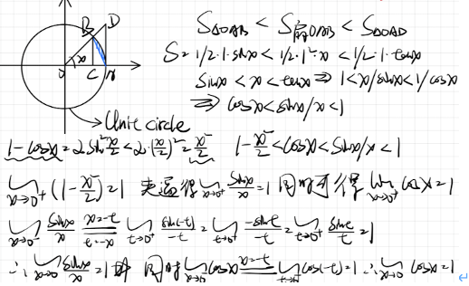
* $\lim\limits_{x\rightarrow\infty}{\left(1+\frac{1}{x}\right)^x}=e$  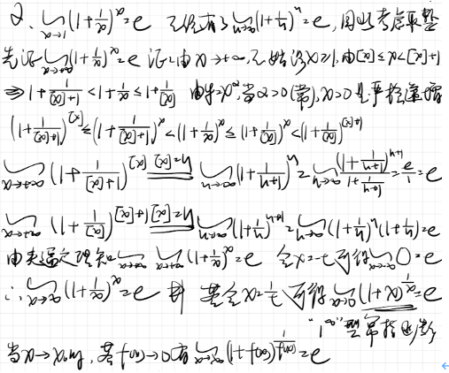
* 等价量替换定理：若 $f(x)\sim f_1(x),\ g(x)\sim g_1(x),\ h(x)\sim h_1(x),\lim\limits_{x\rightarrow x_0}{\frac{f_1(x)g_1(x)}{h_1(x)}}=A$，则 $\lim\limits_{x\rightarrow x_0}{\frac{f(x)g(x)}{h(x)}}=\lim\limits_{x\rightarrow x_0}{\frac{f_1(x)g_1(x)}{h_1(x)}}=A$。在求函数极限时，分子、分母中的因式可用它们的简单的等价量来替换，以便进行化简，但替换以后的函数极限要存在或为无穷大。分子、分母中进行加减的项不能替换，应分解因式，用因式来替换。

## *函数的连续性*

### 函数连续的概念

* 定义
  * 若 $f(x)$ 在 $x_0$ 的某邻域Ux¬0¬内有定义，且 $\lim\limits_{x\rightarrow x_0}{f\left(x\right)}=f\left(x_0\right)$，则称函数 $y=f(x)$ 在点 $x=x_0$ 处连续。若 $f(x)$ 在区间X（可以是开区间、闭区间、半开半闭区间）上处处连续，则称其为连续曲线
  * 或者若 $f(x)$ 在 $x_0$ 的某邻域内有定义且 $\lim\limits_{\Delta x\rightarrow0}{\Delta y}=0$（之后证连续和可导关系的时候要用）
* 函数在点 $x=x_0$ 处极限存在与函数在点 $x=x_0$ 连续的区别是：函数极限存在与 $f(x)$ 在 $x_0$ 处是否有定义无关；函数连续不仅要求 $f(x)$ 在 $x=x_0$ 有定义，且函数极限等于 $f\left(x_0\right)$
* 函数连续的充分必要条件是 $f(x)$ 在 $x_0$ 处既左连续又右连续
* Discontinuity 间断
  * 第一类间断点：左右极限都存在
    * 可去间断点：若 $\lim\limits_{x\rightarrow x_0}{f\left(x\right)}=A$，而 $f(x)$ 在 $x=x_0$ 处没有定义或有定义但 $f\left(x_0\right)\neq A$，则称 $x_0$ 为 $f(x)$ 的可去间断点。只需补充定义或改变f在 $x=x_0$ 处的函数值，可使函数在点 $x_0$ 处连续 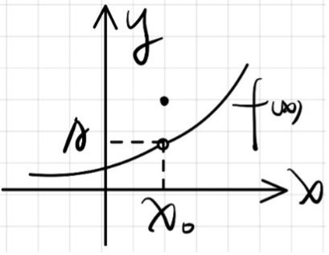
    * 跳跃间断点：若是 $\lim\limits_{x\rightarrow x_0^+}{f\left(x\right)}=f\left(x_0^+\right),\lim\limits_{x\rightarrow x_0^-}{f\left(x\right)}=f\left(x_0^-\right)$，但 $f\left(x_0^+\right)\neq f\left(x_0^-\right)$，则称 $x=x_0$ 为函数 $f(x)$ 的跳跃间断点，$\vert f\left(x_0^+\right)-f\left(x_0^-\right)\vert$ 称为跳跃度 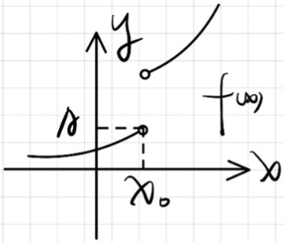
    * 第二类间断点：左右极限至少有一个不存在，如迪利克雷函数在定义域上处处不连续

### 连续函数的局部性质：局部有界性、局部保号性、不等式性质等与极限性质一致

* 连续函数的四则运算
* 复合函数的连续性：若 $u=\varphi\left(x\right)$ 在点 $x=x_0$ 处连续，$y=f\left(u\right)在u_0=\varphi\left(x_0\right)$ 处连续，则 $y=f\left(\varphi\left(x\right)\right)$ 在 $x=x_0$ 处也连续，且 $\lim\limits_{x\rightarrow x_0}{f\left(\varphi\left(x\right)\right)}=f\left(\varphi\left(x_0\right)\right)=f\left(\lim\limits_{x\rightarrow x_0}{\varphi\left(x\right)}\right)$

### 闭区间上连续函数的性质

* 最大值最小值定理：若f(x)在闭区间[a,b]上连续，则f(x)在[a,b]上一定能取到最大值与最小值，即存在 $x_1,x_2\in\left[a,b\right],f\left(x_1\right)=M,f\left(x_2\right)=m$，使得对一切 $x\in\left[a,b\right]$，都有 $m\le f\left(x\right)\le M$
  * 推论：若f(x)在闭区间[a,b]上连续，则f(x)在[a,b]上有界
* 根的存在定理或零值点定理：若函数在闭区间 $[a,b]$ 上连续，且 $f\left(a\right)f\left(b\right)<0$，则至少存在一点 $\xi\in\left(a,b\right)$，使 $f\left(\xi\right)=0$ 
  * 推论：Intermidiate value theorem 介值定理：若函数 $f(x)$ 在闭区间 $[a,b]$ 上连续，且 $f\left(a\right)\neq f\left(b\right)$，若c为介于 $f\left(a\right),f\left(b\right)$ 之间的任何实数，则在 $(a,b)$ 内至少存在一点 $\xi$，使 $f\left(\xi\right)=c$
* 初等函数在其定义域区间上的连续性：所有基本初等函数和由其通过有限次四则运算和复合而成的初等函数都是连续函数
  	

## *重要等价无穷小*

$$
\lim\limits_{x\rightarrow0}{\frac{\sin{x}}{x}}=1;\ \lim\limits_{x\rightarrow0}{\frac{\tan{x}}{x}}=1;\ \lim\limits_{x\rightarrow0}{\frac{1-\cos{x}}{x^2}}=\frac{1}{2}\\\lim\limits_{x\rightarrow0}{\left(1+x\right)^\frac{1}{x}}=e\ \lim\limits_{x\rightarrow\infty}{\left(1+\frac{1}{x}\right)^x}=e\\\lim\limits_{x\rightarrow0}{\frac{\ln{\left(1+x\right)}}{x}}=1\\\lim\limits_{x\rightarrow0}{\frac{e^x-1}{x}}=1\ \lim\limits_{x\rightarrow0}{\frac{a^x-1}{x}}=\ln{a}\\\lim\limits_{x\rightarrow0}{\frac{\left(1+x\right)^a-1}{x}}=a\\\lim\limits_{x\rightarrow0}{\frac{\arcsin{x}}{x}}=1\ \lim\limits_{x\rightarrow0}{\frac{\arctan{x}}{x}}=1
$$

## *求极限的方法*

* 极限的有理运算（需要极限都存在）
* 等价量替换：只能替换因式乘除
* 洛必达法则
* 泰勒展开/麦克劳林展开
* 夹逼准则
* 柯西收敛准则
* 单调有界定理
* 积分定义反求

# 导数与微分

## *导数 Derivative*

### 导数的概念

要求出函数值增量与相应的自变量增量之比（这个比值称为差商）当自变量增量趋于0时的极限

* 导数的定义：设导数 $y=f(x)$ 在点 $x_0$ 的某邻域 $U\left(x_0\right)$ 内有定义，若极限 $\lim\limits_{\Delta x\rightarrow0}{\frac{\Delta y}{\Delta x}}=\lim\limits_{\Delta x\rightarrow0}{\frac{f\left(x_0+\Delta x\right)-f\left(x_0\right)}{\Delta x}}$ 存在，则称 $f(x)$ 在点 $x_0$ 可导，并称此极限值为 $f(x)$ 在点 $x_0$ 处的导数（或微商），记作 $f^\prime\left(x_0\right)$ 或 $y^\prime|_{x=x_0}$ 或 $\frac{dy}{dx}|_{x=x_0}$或 $\frac{d}{dx}f\left(x\right)|_{x=x_0}$，即 $f^\prime\left(x_0\right)=\lim\limits_{\Delta x\rightarrow0}{\frac{\Delta y}{\Delta x}}=\lim\limits_{\Delta x\rightarrow0}{\frac{f\left(x_0+\Delta x\right)-f\left(x_0\right)}{\Delta x}}=y^\prime|_{x=x_0}=\frac{dy}{dx}|_{x=x_0}=\frac{d}{dx}f\left(x\right)|_{x=x_0}$。若极限不存在，则称函数 $y=f(x)$ 在点 $x_0$ 不可导
* 几何意义：若 $f(x)$ 在点 $x_0$ 可导，则 $f^\prime\left(x_0\right)$ 表示曲线 $y=f(x)$ 在点 $P_0\left(x_0,y_0\right)$ 处切线的斜率
  * 切线方程为 $y-y_0=f^\prime\left(x_0\right)\left(x-x_0\right)$
  * 法线方程为 $y-y_0=-\frac{1}{f^\prime\left(x_0\right)}\left(x-x_0\right)\left(f^\prime\left(x_0\right)\neq0\right)$
* 左导右导：设 $f(x)$ 在点 $x_0$ 的左邻域 $U_-\left(x_0\right)$ 内有定义，若极限 $\lim\limits_{\Delta x\rightarrow0^-}{\frac{\Delta y}{\Delta x}}=\lim\limits_{\Delta x\rightarrow0^-}{\frac{f\left(x_0+\Delta x\right)-f\left(x_0\right)}{\Delta x}}=\lim\limits_{\Delta x\rightarrow0^-}{\frac{f\left(x\right)-f\left(x_0\right)}{x-x_0}}$ 存在，则称 $f(x)$ 在点 $x_0$ 左可导，此极限值称为 $f(x)$ 在点 $x_0$ 的左导数，记作 $f'_\left(x_0\right)$。右导同理。
  * 可导的充要条件是左右导数存在且相等，反例为 $y=\vert x\vert$ 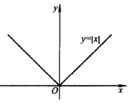
* 可导与连续的概念关系：可导的必要条件：可导一定连续，连续不一定可导，反例为 $y=\vert x\vert$ 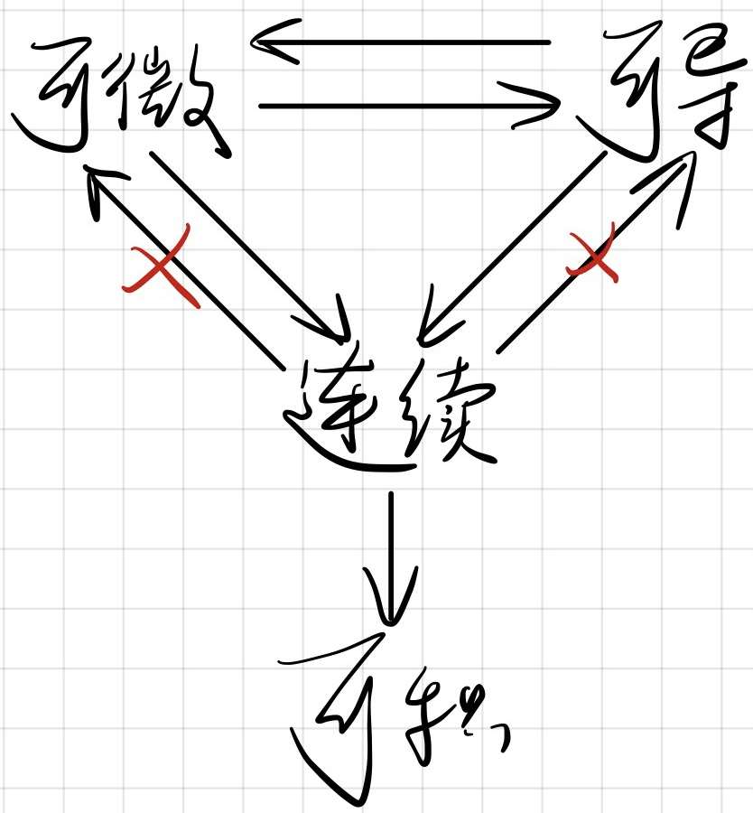

### 导数的基本公式与运算法则

* 基本初等函数的导数
  * $f\left(x\right)=c\rightarrow f^\prime\left(x\right)=0$
  * $\left(\sin{x}\right)^\prime=\cos{x} \left(\cos{x}\right)^\prime=-\sin{x} $
  * $f\left(x\right)=a^x\left(a>0,a\neq1\right)\rightarrow\left(a^x\right)^\prime=a^x\ln{a}\rightarrow\left(e^x\right)^\prime=e^x$
  * $f\left(x\right)=\log_a{x}\left(a>0,a\neq1,x\in\left(0,+\infty\right)\right)\rightarrow\left(\log_a{x}\right)^\prime=\frac{1}{x\ln{a}}\rightarrow\left(\ln{x}\right)^\prime=\frac{1}{x}$
  * $f\left(x\right)=x^a \left(x^a\right)^\prime=\alpha x^{\alpha-1} 0<a<1$ 时 $x=0$ 处不可导
  
* 导数的四则运算
  * 四则运算
    $$
    \left(u\pm v\right)^\prime=u^\prime\pm v^\prime\\\left(uv\right)^\prime=u^\prime v+uv^\prime\\\left(\frac{u}{v}\right)^\prime=\frac{u\prime v-uv\prime}{v^2}\left(v\neq0\right)
    $$
    
  * 引申三角函数求导
    * $\left(\tan{x}\right)^\prime={\sec}^2{x}\left(x\neq k\pi+\frac{\pi}{2}\right)$
    * $\left(\cot{x}\right)^\prime=-{\csc}^2{x}\left(x\neq k\pi\right)$
    * $\left(\sec{x}\right)^\prime=\sec{x}\tan{x}\left(x\neq k\pi+\frac{\pi}{2}\right)$
    * $\left(\csc{x}\right)^\prime=-\csc{x}\cot{x}\left(x\neq k\pi\right)$
    * 双曲正弦：$\sinh{x}=\frac{e^x-e^{-x}}{2}$
    * 双曲余弦：$\cosh{x}=\frac{e^x+e^{-x}}{2}$
    * 双曲正切：$\tanh{x}=\frac{e^x-e^{-x}}{e^x+e^{-x}}$
    * 双曲余切：$\coth{x}=\frac{e^x+e^{-x}}{e^x-e^{-x}}$
    
  * 反函数的求导法则：$f^\prime\left(x_0\right)=\frac{1}{\varphi\prime\left(y_0\right)}$
    * $\left(\arcsin{x}\right)^\prime=\frac{1}{\sqrt{1-x^2}},x\in\left(-1,1\right)$
    * $\left(\arccos{x}\right)^\prime=-\frac{1}{\sqrt{1-x^2}},x\in\left(-1,1\right)$
    * $\left(\arctan{x}\right)^\prime=\frac{1}{1+x^2},x\in R$
    * $\left(\mathop{arccot}{x}\right)^\prime=-\frac{1}{1+x^2},x\in R$
    
  * 复合函数的求导法则：链式法则 $\frac{dy}{dx}=\frac{dy}{du}\cdot\frac{du}{dx}$ 或 $\left[f\left(\varphi\left(x\right)\right)\right]^\prime=f^\prime\left(u\right)\varphi\left(x\right)={f^\prime\left(\varphi\left(x\right)\right)\cdot\varphi}^{\prime\left(x\right)}$

### 隐函数的导数

### 高阶导数

* 基本初等函数的高阶导数
  * $y=x^\alpha: y^{\left(n\right)}=\alpha\left(\alpha-1\right)\left(\alpha-2\right)\ldots\left(\alpha-n+1\right)x^{\alpha-n}$
  * $y=\ln{x}: y^{\left(n\right)}=\left(-1\right)^{n-1}\left(n-1\right)!x^{-n}$
  * $y=\sin{x}: y^{\left(n\right)}=\sin{\left(x+n\cdot\frac{\pi}{2}\right)}; y=\cos{x}: y^{\left(n\right)}=\cos{\left(x+n\cdot\frac{\pi}{2}\right)}$
  * $y=a^x: \left(a^x\right)^{\left(n\right)}=a^x\left(\ln{a}\right)^n \left(e^x\right)^{\left(n\right)}=e^x$
  
* 高阶导数的运算法则
  * $\left(u\pm v\right)^{\left(n\right)}=u^{\left(n\right)}\pm v^{\left(n\right)}$
  * $\left(cu\right)^n=cu^{\left(n\right)}$
  * 莱布尼兹公式：$\left(uv\right)^{\left(n\right)}$

## *微分 Differential*

### 微分的概念

* 微分概念：微分是函数的局部变化的一种线性描述
* 微分定义：设 $y=f(x)$ 在x的某邻域 $U(x)$ 内有定义，若 $\Delta y=f\left(x+\Delta x\right)-f\left(x\right)$ 可表示为 $\Delta y=f^\prime\left(x_0\right)\Delta x+\alpha\Delta x=A\Delta x+o\left(\Delta x\right)\ \left(\Delta x\right)\rightarrow0$，其中A是 与$\Delta x$ 无关的常量，则称 $y=f(x)$ 在点x处可微。$A\Delta x$ 是 $\Delta y$ 的线性主部，并称其为 $y=f(x)$ 在点x处的微分，记为 $dy$，即 $dy=A\Delta x$
* 可微与可导的关系：函数 $y=f(x)$ 在点x可微的充要条件是函数 $y=f(x)$ 在点x处可导，且 $A=f^\prime(x)$

### 微分的基本性质

* 微分四则运算和导数一样
* 一阶微分形式不变性：一阶微分和链式法则等价
* 求参数式函数的导数 $\left\{\begin{matrix}x=\varphi\left(t\right)\\y=\psi\left(t\right)\\\end{matrix}\right.$
  * 一阶导 $\frac{dy}{dx}=\frac{d\psi\left(t\right)}{d\varphi\left(t\right)}=\frac{\psi^\prime\left(t\right)dt}{\varphi^\prime\left(t\right)dt}=\frac{\psi\prime\left(t\right)}{\varphi\prime\left(t\right)}$
  * 二阶导 $\frac{d^2y}{dx^2}=\frac{dy^\prime}{dx}=\frac{\frac{dy^\prime}{dt}}{\frac{dx}{dt}}=\frac{\left(\frac{\psi\prime\left(t\right)}{\varphi\prime\left(t\right)}\right)\prime}{\varphi\prime\left(t\right)}=\frac{\psi^{\prime\prime}\left(t\right)\varphi^\prime\left(t\right)-{\psi^\prime\left(t\right)\varphi}^{\prime\prime}\left(t\right)}{\left[\varphi\prime\left(t\right)\right]^3}$
* 极坐标方程确定函数的导数

### 近似计算与误差估计

* 近似计算 $f\left(x_0+\Delta x\right)\approx f\left(x_0\right)+f^\prime\left(x_0\right)\Delta x\rightarrow f\left(x_0+\Delta x\right)-f\left(x_0\right)\approx f^\prime\left(x_0\right)\Delta x$
* 误差估计

### 一元函数可微、可导、连续的关系 

# 微分中值定理及导数的应用

导数是函数的局部性质，通过微分中值定理由函数的局部性质推断函数整体性质

## *Mean value theorem/Mittelwertsatz der Differentialrechnung/微分中值定理*

### Fermat’s theorem (Interior extremum theorem)/费马定理、最大（小）值

* 极大极小值 local extrema 定义：若存在 $x_0$ 的某邻域 $U\left(x_0,\delta\right)$，使得对一切 $x\in U\left(x_0,\delta\right)$ $，都有f\left(x_0\right)\geq f\left(x\right)/\left(f\left(x_0\right)\le f\left(x\right)\right)$，则称 $f\left(x_0\right)$ 为极大值/极小值，称 $x_0$ 为极大/小值点。极大值、极小值统称为极值，极大值点、极小值点统称为极值点。极值点属于局部性质
* 最大值最小值 global extema 是一个整体性质
* 费马定理：设 $f(x)$ 在点 $x_0$ 处取到极值，且 $f^\prime\left(x_0\right)$ 存在，则 $f^\prime\left(x_0\right)=0$。$f_0$ 点称为驻点或稳定点

### Rolle’s theorem/Satz von Rolle/罗尔定理：加什么条件，使 $f'(x)=0$：

* 定理：设 $f(x)$ 在闭区间 $[a,b]$ 上满足下列三个条件，则至少存在 $\xi\in\left(a,b\right)$，使 $f^\prime\left(\xi\right)=0$
  * $f\left(x\right)\in C\left[a,b\right]$
  * $f\left(x\right)\in D\left(a,b\right)$ 
  * $f\left(a\right)=f\left(b\right)$
  * 推论：方程的 $f\left(x\right)=0$ 的两个不同实根之间，必存在方程 $f^\prime\left(x\right)=0$的一个根
* 几何意义

### Lagrange theorem/拉格朗日中值定理、函数的单调区间一点

* 定理：若 $f(x)$ 在闭区间 $[a,b]$ 上满足下列条件，则至少存在一点 $\xi\in\left(a.b\right)$，使 $\frac{f\left(b\right)-f\left(a\right)}{b-a}=f^\prime\left(\xi\right)$。 $\xi$ 的准确值一般是不知道的，$0<\frac{\xi-a}{b-a}=\theta<1\rightarrow\xi=a+\theta\left(b-a\right)$
  * $f\left(x\right)\in C\left[a,b\right]$
  * $f\left(x\right)\in D\left(a,b\right)$
* 几何意义：闭区间 $[a,b]$ 的连续曲线 $y=f(x)$ 上处处具有不平行于y轴的切线，则在该曲线上至少存在一点 $C\left(\xi,f\left(\xi\right)\right)$，使该点切线平行于曲线两端点的连线 

### Cauchy’s mean value theorem柯西中值定理

和拉格朗日定理相似，只是函数用参数方程的形式给出。设 $f(x)$，$g(x)$ 在闭区间 $[a,b]$ 上满足下列条件

* $f\left(x\right),g\left(x\right)\in C\left[a,b\right]$
* $f\left(x\right),g\left(x\right)\in D\left(a,b\right)$
* $g^\prime\left(x\right)\neq0$

则至少存在一点 $\xi\in\left(a.b\right)$，使 $\frac{f\left(b\right)-f\left(a\right)}{g\left(b\right)-g\left(a\right)}=\frac{f^\prime\left(\xi\right)}{g^\prime\left(\xi\right)}$
​

### 函数的单调区间与极值

* 单调区间定理：通过拉格朗日中值定理证出
* 函数极值的判定
  * 极值的第一充分条件
  * 极值的第二充分条件：若 $x_0$ 是 $f(x)$ 的驻点（即 $f^\prime\left(x_0\right)=0$），$f^{\prime\prime}\left(x_0\right)$ 存在且不等于0，则当 $f^{\prime\prime}\left(x_0\right)>0$ 时，$f\left(x_0\right)$ 为极小值，$f^{\prime\prime}\left(x_0\right)<0$ 时，$f\left(x_0\right)$ 为极大值

## *未定式的极限*

* 0/0型未定式的极限 $\lim\limits_{x\rightarrow x_0}{\frac{f\left(x\right)}{g\left(x\right)}}=\lim\limits_{x\rightarrow x_0}{\frac{f\prime\left(x\right)}{g\prime\left(x\right)}}=A\ or\ \infty$
* $\infty/\infty$ 型未定式的极限同理
* 其他类型未定式的极限可通过适当恒等变形化成0/0或 $\infty/\ \infty$ 后再使用洛必达法则

## *Taylor’s theorem 泰勒定理及应用*

### 泰勒定理

本质是利用函数某点的各阶导数信息来近似该点及其附近的函数值

* 多项式函数 Polynominal function 相当于是一次和二次函数的推广
  $$
  y=f(x)=a_Kx^K+a_{K-1}x^{K-1}+\dots+a_2x^2+a_1x+a_0=\sum\limits_{i=0}^{K}{a_ix^i}
  $$

* 来源：多项式函数是各类函数中最简单的一类，因为它只需用到四则运算，从而使我们想到能否用多项式来近似表达一般函数，实际上这是近似计算理论分析的一个重要内容

* 定理：设函数 $f(x)$ 在区间I上存在n+1阶导数，$x_0\in I$，任给 $x\in I$，且 $x\neq x_0$，有
  $$
  f\left(x\right)=P_n\left(x\right)+R_n\left(x\right)=P_n\left(x\right)+\frac{f^{n+1}\left(\xi\right)}{\left(n+1\right)!}\left(x-x_0\right)^{n+1}\\=f\left(x_0\right)+f^\prime\left(x_0\right)\left(x-x_0\right)+\frac{f^{\left(2\right)}\left(x_0\right)}{2!}\left(x-x_0\right)^2+\ldots+\frac{f^{\left(n\right)}\left(x_0\right)}{n!}\left(x-x_0\right)^n+\frac{f^{n+1}\left(\xi\right)}{\left(n+1\right)!}\left(x-x_0\right)^{n+1}
  $$
  其中 $\xi$ 是介于 $x_0$ 及x之间的某一点
  $$
  P_n\left(x\right)=\underbrace{f(x_0)}_{const}+\underbrace{f^\prime(x_0)(x-x_0)}_{linear}+\underbrace{\frac{f^{(2)}(x_0)}{2!}(x-x_0)^2}_{quadratic}+\ldots+\frac{f^{\left(n\right)}}{n!}\left(x-x_0\right)^n
  $$
  称为 $f(x)$ 在 $x=x_0$ 的n次泰勒多项式
  
  * 用柯西中值定理证明
  
  * 可用 $P_n\left(x\right)$ 近似表达函数 $f(x)$，误差为拉格朗日余项 $R_n\left(x\right)$
  
  * 若 $x_0=0$ 称为麦克劳林公式
    $$
    f\left(0\right)=\left(0\right)+f^\prime\left(0\right)x+\frac{f^{\left(2\right)}\left(0\right)}{2!}x^2+\ldots+\frac{f^{\left(n\right)}\left(0\right)}{n!}x^n+\frac{f^{n+1}\left(\xi\right)}{\left(n+1\right)!}x^{n+1}
    $$

### 几个常用函数的麦克劳林公式

$$
f\left(x\right)=e^x=1+x+\frac{x^2}{2!}+\ldots+\frac{x^n}{n!}+\frac{e^{\theta x}}{\left(n+1\right)!}x^{n+1}\\f\left(x\right)=\sin{x}=x-\frac{x^3}{3!}+\frac{x^5}{5!}-\frac{x^7}{7!}+\left(-1\right)^m\frac{x^{2m+1}}{\left(2m+1\right)!}+\frac{\sin{\left(m\pi+\pi+\theta x\right)}}{\left(2m+2\right)!}x^{2m+2},\ n=2m+1\\f\left(x\right)=\cos{x}=1-\frac{x^2}{2!}+\frac{x^4}{4!}+\ldots+\left(-1\right)^m\frac{x^{2m}}{\left(2m\right)!}+\frac{\cos{\theta x+m\pi+\pi}}{\left(2m+2\right)!}x^{2m+2},\ n=2m+1\\f\left(x\right)=\ln{\left(1+x\right)}=x-\frac{x^2}{2!}+\frac{x^3}{3!}-\frac{x^4}{4!}+\ldots+\frac{\left(-1\right)^{n-1}x^n}{n}+\frac{\left(-1\right)^nx^{n+1}}{\left(n+1\right)\left(1+\theta x\right)^{n+1}}\\f\left(x\right)=\left(1+x\right)^\alpha=1+\alpha x+\frac{\alpha\left(\alpha-1\right)}{2!}x^2+\ldots+\frac{\alpha\left(\alpha-1\right)\ldots\left(\alpha-n+1\right)}{n!}x^n+\frac{\alpha\left(\alpha-1\right)\ldots\left(\alpha-n+1\right)\left(\alpha-n\right)}{\left(n+1\right)!}\frac{x^{n+1}}{\left(1+\theta x\right)^{n+1-\alpha}}
$$

### Peano remainder 带有佩亚诺余项的泰勒公式​

### 泰勒公式的应用

* 计算函数的近似值
* 用多项式逼近函数
* 证明在某种条件下 $\xi$ 的存在性
* 证明某些不等式

## *函数图形的凹凸性与拐点（欧美的凹凸性定义和国内教材相反）*

* 凹凸性：设 $f(x)$ 在 $(a,b)$ 内可导，且曲线 $y=f(x)$ 都在曲线上任意一点切线的上方，则称曲线在该区间内是凹的；如果曲线都在曲线上任意一点切线的下方，则称该区间是凸的  

* 曲线凹凸的判定定理：$f''\left(x\right)>0$ 为凹，$f''\left(x\right)<0$ 为凸

* 凹凸的分界点称为拐点或变凹点 Infleciton point
  
  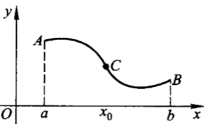
  
  * 拐点的必要条件：若是拐点，则 $f''\left(x\right)=0$，反之不成立 
  * 拐点的充分条件：$f(x)$ 在 $x_0$ 的邻域内存在二阶导，且 $x_0$ 两侧的二阶导异号
  
* 若曲线 $f(x)$ 在区间 $(a,b)$ 内凹（凸），则任给 $x_1,x_2\in\left(a,b\right),x_1\neq x_2$ 都有
  $$
  \frac{f\left(x_1\right)+f\left(x_2\right)}{2}>f\left(\frac{x_1+x_2}{2}\right)\left(\frac{f\left(x_1\right)+f\left(x_2\right)}{2}\right)
  $$

## *函数图形的描绘*

* Asymptotic line 曲线的渐近线：曲线 $y=f(x)$ 上的动点 $M(x,y)$，当它沿着曲线无限远离原点时，点M到直线L上的距离d趋向于0，则称直线L是曲线 $y=f(x)$ 当 $x\rightarrow\infty$ 时的渐近线

* 斜渐近线/水平渐近线 $a=\lim\limits_{x\rightarrow\infty}{\frac{f\left(x\right)}{x}},b=\lim\limits_{x\rightarrow\infty}{\left(f\left(x\right)-ax\right)}$，若 $a=0,\ y=b$ 时则为水平渐近线 

  * 铅锤渐近线

* 曲率 

  * 曲率 $k=\frac{\vert y^{\prime\prime}x^\prime-x^{\prime\prime}y^\prime\vert}{\left(1+y^\prime2\right)^\frac{3}{2}}=\frac{\vert y^{\prime\prime}\vert}{\left(1+y^{\prime2}\right)^\frac{3}{2}}$

  * 曲率圆 $R=\frac{1}{k}=\frac{\left(1+y^{\prime2}\right)^\frac{3}{2}}{\vert y^{\prime\prime}\vert}  $

# 不定积分

## *不定积分的概念*

* 原函数与不定积分$ \int{f\left(x\right)dx}=F\left(x\right)+C$
* 基本积分
* 不定积分的性质
  * $\frac{d}{dx}\int{f\left(x\right)dx}=f\left(x\right)$ or $d\int{f\left(x\right)dx}=f\left(x\right)dx$
    ​	
  * $\int{f^\prime\left(x\right)dx}=f\left(x\right)+C$ or $\int\left(df\left(x\right)\right)=f\left(x\right)+C$
  * 若 $f(x) g(x)$ 的原函数都存在，则
    * $\int{\left[f\left(x\right)\pm g\left(x\right)\right]dx}=\int{f\left(x\right)dx}\pm\int{g\left(x\right)dx}$
    * $\int{\alpha f\left(x\right)dx}=\alpha\int{f\left(x\right)dx}$
    * 推论：线性运算法则：$\int{\left[\alpha f\left(x\right)+\beta g (x)\right]dx}=\alpha\int {f\left(x\right)dx}+\beta\int{g\left(x\right)dx}$

## *不定积分的几种基本方法*

### 凑微分法（第一换元法）

* $f\left(\varphi\left(x\right)\right)\varphi^\prime\left(x\right)dx=f\left(\varphi\left(x\right)\right)d\varphi\left(x\right)$
* $dx=\frac{1}{a}d\left(ax+b\right)$
* $xdx=-\frac{1}{2}d\left(a^2-x^2\right)$
* $\frac{1}{\sqrt x}=2d\sqrt x$
* $\sin{x}dx=-d\cos{x}$
* $\frac{1}{\sqrt{1-x^2}}=d\arcsin{x}$
* $xdx=\frac{1}{2}d\left(x^2\pm a^2\right)$
* $\frac{1}{x}dx=d\ln{\vert x\vert}$
* $e^xdx=de^x$
* $\cos{x}dx=d\sin{x}$
* $\frac{1}{1+x^2}=d\arctan{x}$

### 变量代换法（第二换元法）

当含有如下形式的无理函数，而且不能用凑微分法时，可采取变量代换去根号

* $\sqrt{a^2-x^2}$ 时令 $x=a\sin{t},t\in\left[\frac{\pi}{2},\frac{\pi}{2}\right]$
* $\sqrt{a^2+x^2}$ 时令 $x=a\tan{t},t\in\left(-\frac{\pi}{2},\frac{\pi}{2}\right)$
* $\sqrt{x^2-a^2}$ 时令 $x=a\sec{t},t\in\left(0,\frac{\pi}{2}\right)\cup\left(\frac{\pi}{2},\pi\right)$
* $\sqrt[n]{\frac{ax+b}{cx+d}}$ 时令 $\sqrt[n]{\frac{ax+b}{cx+d}}=t$，即 $x=\frac{dt^n-b}{a-ct^n}$

### 分部积分法 $\int{udv}=uv-\int{vdu}$ 口诀：先积后导或者采用表格法

* $\int{P_n\left(x\right)e^{ax}dx}$ 令 $P_n\left(x\right)=u,e^{ax}=v^\prime$
* $\int{P_n\left(x\right)\sin{\left(ax+b\right)}dx},\ \int{P_n\left(x\right)\cos{\left(ax+b\right)}dx}$ 令 $P_n\left(x\right)=u,\sin{\left(ax+b\right)}/\cos{\left(ax+b\right)}=v^\prime$
* $\int{P_n\left(x\right)\ln{x}dx}$ 令 $\ln{x}=u,P_n\left(x\right)=v^\prime$
* $\int{p\left(x\right)\arcsin{x}dx},\int{p\left(x\right)\arccos{x}dx}$ 令 $\arcsin{x}/\arccos{x}=u,p\left(x\right)=v^\prime$
* $\int{\sin{\left(ax+b\right)}e^{ax}dx}, \int{\cos{\left(ax+b\right)}e^{ax}dx}$

## *某些特殊类型函数的不定积分：能用前面的一般方法就用一般方法*

### 有理函数的不定积分

* 有理假分式可以用分式长除法化成有理真分式
* 根据高等代数知识，任何有理真分式 $\frac{Q_m\left(x\right)}{P_n\left(x\right)}$ 都可以表示为若干个简单分式之和，最终都可以拆成以下两种积分的和形式
  $$
  \int{\frac{dx}{\left(x-a\right)^n}}=\left\{\begin{matrix}ln{\vert x-a\vert}+C&n=1\\\frac{1}{\left(1-n\right)\left(x-a\right)^{n-1}}+C&n>1\\\end{matrix}\right.\\\int{\frac{Mx+N}{\left(x^2+px+q\right)^n}dx\ \left(p^2-4q<0\right)}=\ \left\{\begin{matrix}ln{\left(x^2+px+q\right)}+C&n=1\\\frac{1}{2\left(1-n\right)\left(x^2+px+q\right)^{n-1}}+C&n>1\\\end{matrix}\right.
  $$

### 三角函数有理式的不定积分

* $\int{R\left(\sin^2{x},\sin{x}\cos{x},\cos^2{x}\right)dx}$ 万能公式：$t=\tan{\frac{x}{2}},x\in\left(-\pi,\pi\right)$
* $\int{{\sin}^m{x}{\cos}^n{x}dx}$，其中m，n中至少有一个是奇数（另外一个数可以是任何一个实数），对这类积分，把奇次幂的三角函数，分离出一次幂，用凑微分求出原函数
* $\int{{\sin}^m{x}{\cos}^n{x}dx}$，其中m，n均是偶数或零，计算这类不定积分主要利用三列三角恒等式等式降幂

### 某些无理函数的不定积分

## *一些无法用初等函数表示的可积积分*

* 三角函数类
* 高斯类 $\int{x^{2n}e^{ax^2}dx}$，特别当 $n=0$ 时，$\int{e^{ax^2}dx}$
* 指数和对数的分式型
* 根式类型（椭圆和超几何）
* 其他类型

# 定积分及其应用

## *定积分的概念*

* 定积分的定义 $I=\int_{a}^{b}f\left(x\right)dx=\lim\limits_{\lambda\rightarrow0}{\sum\limits_{i=1}^{n}f\left(\xi_i\right)\Delta x_i}$
  * 分割：相应地把闭区间 $[a,b]$ 分成n个小区间 $x_{i-1},x_i$
  * 近似
  * 求和：$S\approx\sum\limits_{i=1}^{n}{f\left(\xi_i\right)\Delta x_i}$
  * 取极限
  * 定积分的 $\varepsilon-\delta$ 说法称为黎曼积分
* 可积的必要条件：若函数f(x)在闭区间[a,b]上可积，则f(x)在[a,b]上有界

## *定积分的性质和基本定理*

### 定积分的基本性质

* $\int_{a}^{b}{1dx}=\int_{a}^{b}{dx}=b-a$
* 线性运算法则：$\int_{a}^{b}{\left[\alpha f\left(x\right)+\beta g\left(x\right)\right]dx}=\alpha\int_{a}^{b}{f\left(x\right)dx}+\beta\int_{a}^{b}{g\left(x\right)dx}$
* 对区间的可加性：$\int_{a}^{b}{f(x)dx}=\int_{a}^{c}{f\left(x\right)dx}+\int_{c}^{b}{f\left(x\right)dx}$
* 若 $f(x), g(x)$ 可积且 $f\left(x\right)\geq g\left(x\right)$，则 $\int_{a}^{b}f{(x)dx}\geq\int_{a}^{b}{g(x)dx}$
* 若 $f(x)$ 在 $[a,b]$ 上可积，$m\le f\left(x\right)\le M,x\in\left[a,b\right]$，则 $m\left(b-a\right)\le\int_{a}^{b}{f\left(x\right)dx}\le M\left(b-a\right)$
* 积分中值定理  
  * 定理：若 $f(x)$ 在闭区间 $[a,b]$ 上连续，则至少存在一点 $\xi\in\left[a,b\right]$，使 $\int_{a}^{b}{f(x)dx}=f\left(\xi\right)\left(b-a\right)$
  * 几何意义：$f\left(\xi\right)$ 为 $f(x)$ 在 $[a,b]$ 上的平均值

### 微积分学基本定理

* 变上限函数 $G\left(x\right)=\int_{a}^{x}{f\left(t\right)dt},\ x\in\left[a,b\right]$：随着x的变化，$G\left(x\right)$ 是在不断从a到x变化的，而t只是避免混淆，所以本质上是x的函数
* 对变上限函数的求导：$G'(x)=\frac{d}{dx}\int_{a}^{x}{f\left(t\right)dt}=\frac{d}{dx}f\left(x\right)-\frac{d}{dx}f\left(a\right)=f'(x)\rightarrow\\\frac{d}{dx}\int_{v\left(x\right)}^{u\left(x\right)}{f(t)dt}=\frac{d}{dx}\left(f\left(u\left(x\right)\right)-f\left(v\left(x\right)\right)\right)=f\left(u\left(x\right)\right)u^\prime\left(x\right)-f\left(v\left(x\right)\right)v^\prime\left(x\right)$
* 变上限求导定理/微积分学基本原理：若 $f(x)$ 在 $[a,b]$ 上连续，则 $G\left(x\right)=\int_{a}^{x}{f\left(t\right)dx},\ x\in\left[a,b\right]$ 可导且$G^\prime\left(x\right)=f\left(x\right)$
  * 推论：若函数 $f(x)$ 在某区间I上连续，则在此区间上 $f(x)$ 的原函数一定存在，原函数的一般表达式可写成 $\int_{x}^{a}{f\left(t\right)dt}+C$，求不出来是计算方法的问题。如果原函数是初等函数一般是可求的，如果不是初等函数要用级数来求
* Newton-Leibniz Formula/牛顿-莱布尼茨公式 $\int_{a}^{b}{f\left(x\right)dx}=F\left(b\right)-F\left(a\right)$

## *定积分的计算方法*

### 基本定积分计算方法

* 换元法：上限对上限，下限对下限
* 定积分的分部积分法

### 简化定积分计算方法

* 关于原点对称区间上函数的定积分：$\int_{-a}^{a}{f\left(x\right)dx}=f\left(x\right)=\left\{\begin{matrix}0&f\ is\ odd\\2\int_{0}^{a}{f\left(x\right)dx}&f\ is\ even\\\end{matrix}\right.$
  * 推论：不管是偶函数、奇函数还是非奇非偶都有 $\int_{-a}^{a}{f\left(x\right)}=\int_{0}^{a}{\left[f\left(x\right)+f\left(-x\right)\right]dx}$
* 周期函数的定积分 $\int_{a}^{a+T}{f\left(x\right)dx}=\int_{0}^{T}{f\left(x\right)dx}$
* ${\sin}^n{x},{\cos}^n{x}$ 在 $\left[0,\frac{\pi}{2}\right]$ 上的积分 $\int_{0}^{\frac{\pi}{2}}{{\sin}^n{x}dx}=\int_{0}^{\frac{\pi}{2}}{{\cos}^n{x}dx}=\left\{\begin{matrix}\frac{n-1}{n}\frac{n-3}{n-2}\ldots\frac{2}{3}&n\ is\ odd\\\frac{n-1}{n}\frac{n-3}{n-2}\ldots\frac{1}{2}\frac{\pi}{2}&n\ is\ even\\\end{matrix}\right.$，根据第二条性质可得$\int_{0}^{2\pi}{{\sin}^n{x}dx}=\int_{0}^{2\pi}{{\cos}^n{x}dx}=2\int_{0}^{\pi}{{sin}^n{x}dx}=4\int_{0}^{\frac{\pi}{2}}{{\sin}^n{x}dx}$
* 灵活运用变量代换计算定积分

## *定积分的应用*

### 平面图形面积

* $S=\int_{a}^{b}{\left(\vert f_1\left(x\right)-f_2\left(x\right)\vert\right)dx}$
* $S=\int_{a}^{c}{f(x)dx}+\int_{c}^{b}{-f\left(x\right)dx}$
* $S=\int_{a}^{b}{\left(\vert\varphi_1\left(x\right)-\varphi_2\left(x\right)\vert\right)dx}$
* $S=\int_{a}^{c}{\varphi\left(x\right)dx}+\int_{c}^{b}{-\varphi\left(x\right)dx}$

### 立体及旋转体体积

* $V=\lim\limits_{\lambda\rightarrow0}{\sum\limits_{i=1}^{n}{A\left(\xi_i\right)\Delta x_i}}=\int_{a}^{b}{A\left(x\right)dx}$
* 旋转体的体积
  * $y=f\left(x\right)$ 绕x轴旋转：$V\left(x\right)=\int_{a}^{b}{\pi f^2\left(x\right)dx}$
  * $y=f\left(x\right)$ 绕y轴旋转：$V\left(x\right)=ah=2\pi x\vert f\left(x\right)\vert=2\pi\int_{a}^{b}x\vert f\left(x\right)\vert dx$

### 微元法及应用 

* 曲边扇形（连续曲线）
  * 曲边扇形（连续曲线）的面积 $S=\frac{1}{2}\int_{\beta}^{\alpha}{r^2\left(\theta\right)d\theta}$
  * 连续曲线的弧长 $s=\int_{\alpha}^{\beta}{\sqrt{\varphi^{\prime2}\left(t\right)+\psi^{\prime2}\left(t\right)}dt}=\int_{\alpha}^{\beta}{\sqrt{1+f^{\prime2}\left(x\right)}dx}$（先求导再平方）
    * 弧长微分公式 $ds=\sqrt{\varphi^{\prime2}\left(t\right)+\psi^{\prime2}\left(t\right)}dt$
  * 极坐标与直角坐标的转换
    * 互换条件：极点和原点重合，极轴作x轴正向，两种坐标系的长度单位一致
    * 互换公式 $\left\{\begin{matrix}r^2=x^2+y^2\\\tan{\theta}=\frac{y}{x}\left(x\neq0\right)\\\end{matrix}\right.$
      * 已知 $r,\ \theta$ 求x、y $ \left\{\begin{matrix}x=r\cos{\theta}\\y=r\sin{\theta}\\\end{matrix}\right.$
      * 已知x、y求 $r,\ \theta$  $\left\{\begin{matrix}r^2=x^2+y^2\\\tan{\theta}=\frac{y}{x}\left(x\neq0\right)\\\end{matrix}\right.$
        ​

### 定积分在物理中的应用

### 定积分在经济中的应用

## *反常积分 Improper Integral/广义积分*

* 无穷区间上的反常积分/第一类反常（广义）函数 $\int_{a}^{+\infty}{f(x)dx}\triangleq \lim\limits_{t\rightarrow+\infty}{\int_{a}^{t}{f\left(x\right)dx}}$
  * $\int_{-\infty}^{+\infty}{x}$ 指的不是取 $\infty$ 时的积分，而是求极限的意思
  * 计算第一类反常积分：$\int_{a}^{+\infty}{f(x)dx}=\lim\limits_{t\rightarrow+\infty}{\int_{a}^{t}{f(x)dx}}=\lim\limits_{t\rightarrow+\infty}{F(x)\big|_a^t}=\lim\limits_{t\rightarrow+\infty}{\left[F(t)-F(a)\right]}\\=\lim\limits_{t\rightarrow+\infty}{F(t)}-F(a)=\lim\limits_{x\rightarrow+\infty}{F(x)}-F(a)=F(x)\big|_a^{\infty}$
  * 例子：计算 $\int_{-\infty}^{+\infty}{\frac{1}{1+x^2}dx}=\lim\limits_{x\rightarrow+\infty}{\arctan{x}}-\lim\limits_{x\rightarrow-\infty}{\arctan{x}}=\frac{\pi}{2}+\frac{\pi}{2}=\pi$

* 无界函数的反常积分/第二类反常（广义）函数 $\int_{a}^{b}{f(x)dx}\triangleq\lim\limits_{\varepsilon\ \rightarrow0^+}{\int_{a}^{b-\varepsilon}{f(x)dx}}$： b称为瑕点 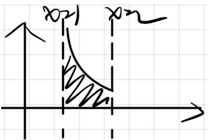
  ​

### 反常积分收敛性的判别法

* 无穷区间上反常积分收敛性的判别法
  * 比较判别法
  * 绝对收敛准则：设函数 $f(x)$ 在 $\left[a,+\infty\right]$ 上连续，若积分 $\int_{a}^{+\infty}{\vert f(x)\vert dx}$ 收敛，则 $\int_{a}^{+\infty}{f(x)}dx$ 收敛
* 无界函数的反常积分收敛性的判别法

### $\Gamma$ (Gamma)函数

* 定义：$\Gamma$ 函数既是第一类反常积分也是第二类反常积分
  * $\Gamma\left(s\right)=\int_{0}^{+\infty}{x^{s-1}e^{-x}dx\left(s>0\right)}$
  * $\Gamma\left(1\right)=\int_{0}^{+\infty}{e^{-x}dx}=\lim\limits_{x\rightarrow\infty}{e^{-x}}+1=1$

* 性质：$\Gamma\left(s+1\right)=s\Gamma\left(s\right)\left(s>0\right)$
  * 证明：$\Gamma\left(s+1\right)=\int_{0}^{+\infty}{x^se^{-x}dx}=\overbrace{-e^{-x}x^s\big|_0^{+\infty}}^{0}+\int_{0}^{+\infty}{sx^{s-1}e^{-x}dx}=\int_{0}^{+\infty}{sx^{s-1}e^{-x}dx}=s\Gamma\left(x\right)$
  * 意义：当s为正整数n，$\Gamma$ 函数是阶乘的自然推广，即 $\Gamma\left(n+1\right)=n\Gamma\left(n\right)=n\left(n-1\right)\Gamma\left(n-1\right)=\ldots=n!\Gamma\left(1\right)=n!$
* 定义域的延拓：$\Gamma\left(s\right)=\frac{\Gamma\left(s+1\right)}{s}$，定义域为除去0与负整数以外的全部实数
  * 前提：利用极坐标的区域对称性与被积函数的奇偶性先计算 $\int_{0}^{+\infty}{e^{-x^2}dx}=\frac{\sqrt{\pi}}{2}$
    * 设 $I=\int_{0}^{+\infty}{e^{-x^2}dx}\geq0$
    * $I^2=\int_{0}^{+\infty}{e^{-x^2}dx}\cdot\int_{0}^{+\infty}{e^{-x^2}dx}=\int_{0}^{+\infty}{e^{-x^2}dx}\cdot\int_{0}^{+\infty}{e^{-y^2}dy}=\int_{0}^{+\infty}{dx\int_{0}^{+\infty}{e^{-(x^2+y^2)}dy}}=\iint_{D}{e^{-(x^2+y^2)}d\sigma}$
    * 转换为极坐标表示：$\int_{0}^{\frac{\pi}{2}}{\int_{0}^{+\infty}{e^{-r^2}rdr}}=\frac{-\pi}{4}\int_{0}^{+\infty}{e^{-r^2}rd(r^2)}=\frac{-\pi}{4}e^{-r^2}\big|_0^{+\infty}=\frac{\pi}{4}$
    * $I=\frac{\sqrt{\pi}}{2}$

  * $\Gamma\left(\frac{1}{2}\right)=\int_{0}^{+\infty}{\frac{e^{-x}}{x^\frac{1}{2}}dx}=2\int_{0}^{+\infty}{e^{-x}d\left(x^\frac{1}{2}\right)}=2\int_{0}^{+\infty}{e^{-t^2}dt}=\sqrt\pi$

* 余元公式 $\Gamma\left(s\right)\Gamma\left(1-s\right)=\frac{\pi}{\sin{\pi s}}$

## *定积分的近似计算*

* 矩形法
* 梯形法
* 抛物线法

# 矢量代数与空间解析几何

## *空间直角坐标系与矢量的坐标表示式*

### 平面距离

给定平面上一条直线 $l:ax+by+c=0$，直线外一点 $A(x_A,y_A)$ 到该直线的距离为 $dist(A,l)=\frac{\vert ax_A+by_A+c\vert}{\sqrt{a^2+b^@}}$

直线 $l$ 上距离 $A$ 最近点的坐标为 $H(x_H,y_H)\rightarrow\left\{\begin{array}{c}x_H=\frac{b(bx_A-ay_A)-ac}{a^2+b^2}\\y_H=\frac{a(-bx_A+ay_A)-bc}{a^2+b^2}\end{array}\right.$

### 空间距离

* 空间两点间距离 $\vert M_1M_2\vert=\sqrt{\left(x_2-x_1\right)^2+\left(y_2-y_1\right)^2+\left(z_2-z_1\right)^2}$
* 矢量的坐标表达式 $a=\overrightarrow{OM}=a_1i+a_2j+a_3k\ or\ a=(a_1,\ a_2,\ a_3)$
  * $\vert a\vert=\vert\overrightarrow{OM}\vert=\sqrt{a_1^2+a_2^2+a_3^2} $
    * 矢量a与 *x-y-z* 轴正向的夹角分别记为 $\alpha,\ \beta,\ \gamma$，称为a的方向角，称 $\cos{\alpha},\cos{\beta},\cos{\gamma}$ 称为矢量a的方向余弦
* 线段的定比m/n分割：$\overrightarrow{M_1M}=\frac{m}{n}\overrightarrow{MM_2}$ 得到分点坐标 $x=\frac{nx_1+mx_2}{n+m},\ y=\frac{ny_1+my_2}{n+m},z=\frac{nz_1+mz_2}{n+m} $

## *两矢量的数量积与矢量积*

* 数量积/内积/点乘 $\vec{a}\cdot\vec{b}=\vert\vec{a}\vert\vert\vec{b}\vert\cos{\theta}$
  * 坐标表达式 $\vec{a}\cdot\vec{b}=a_1b_1+a_2b_2+a_3b_3$
  * 运算规律
    * 交换律
    * 结合律
    * 分配律
  * 性质
    * 两矢量a、b相互垂直的充分必要条件是它们的数量积等于零，即 $a\bot b\Leftrightarrow\vec{a}\cdot\vec{b}=0$
    * 几何意义：b在a方向上的投影
* 矢量积/外积/叉乘 $\Vert\vec{a}\times\vec{b}\Vert=\Vert\vec{a}\Vert\Vert\vec{b}\Vert\sin{\theta}$，方向遵从右手定则
  * 坐标表达式  $\vec{a}\times\vec{b}=\left|\begin{matrix}i&j&k\\a_1&a_2&a_3\\b_1&b_2&b_3\\\end{matrix}\right|=\left|\begin{matrix}0&-a_3&a_2\\a_3&0&a_3\\-a_2&a_1&0\\\end{matrix}\right|\cdot\vec{b} $
  * 运算规律
    * 结合律
    * 分配律
  * 性质
    * 两矢量a、b互相平行的充分必要条件是，它们的矢量积等于零矢量，即 $\vec{a}\parallel\vec{b}\Leftrightarrow\vec{a}\times\vec{b}=0$
    * 几何意义：由a、b为邻边构成的平行四边形的面积

## *矢量的混合积与二重矢积*

* 三矢量的混合积
  * 表达式 $\vec{a}\cdot\left(\vec{b}\times\vec{c}\right)=\left|\begin{matrix}a_1&a_2&a_3\\b_1&b_2&b_3\\c_1&c_2&c_3\\\end{matrix}\right|$
  * 三矢量a、b、c共面的充分必要条件是它们的混合积 $\vec{a}\cdot\left(\vec{b}\times\vec{c}\right)=\left|\begin{matrix}a_1&a_2&a_3\\b_1&b_2&b_3\\c_1&c_2&c_3\\\end{matrix}\right|=0$
  * 性质
    * 几何意义：若混合积不为零，则其为平行六面体的体积
    * 顺次轮换混合积中三个矢量，所得混合积不变
    * 任意对调混合积中两矢量的位置所得混合积的绝对值不变，但符号相反
* 三矢量的二重矢积

## *平面与直线方程*

### 平面及平面方程

* 平面的方程表示
  * 点法式
    * 条件：已知一平面过点 $P_0\left(x_0,y_0,z_0\right)$，且垂直于非零矢量 $\vec{n}=A\vec{i}+B\vec{j}+C\vec{k}$
    * 方程 $ A\left(x-x_0\right)+B\left(y-y_0\right)+C\left(z-z_0\right)=0$
  * 一般式
    * 方程：$Ax+By+Cz+D=0$
    * 特殊情况
      * 平面过原点 D=0
      * 平面平行于坐标轴  
        * 法矢量垂直于 *Oz* 轴，平面平行于 *Oz* 轴，此时法矢量 $\vec{n}=A\vec{i}+B\vec{j}$ 没有k，所以 $Ax+By+D=0$
        * 法矢量垂直于 *Ox* 轴，平面平行于 *Ox* 轴，$By+Cz+D=0$
        * 法矢量垂直于 *Oy* 轴，平面平行于 *Oy* 轴，$Ax+Cz+D=0$
      * 平面通过坐标轴：即平面平行于坐标轴且通过原点
      * 平面平行于坐标平面
        * 平面平行于Oyz平面，此时 $\vec{n}=A\vec{i}$，$\vec{j}$ & $\vec{k}$ 没有了，$Ax+D=0$
        * 平面平行于Oxz平面，$By+D=0$
        * 平面平行于Oxy平面，$Cz+D=0$
      * 平面与坐标平面重合
  * 截距式 $\frac{x}{-\frac{D}{A}}+\frac{y}{-\frac{D}{B}}+\frac{z}{-\frac{D}{C}}=1$ 设 $a=-\frac{D}{A},\ b=-\frac{D}{B},\ c=-\frac{D}{C}$，可化简为 $\frac{x}{a}+\frac{y}{b}+\frac{z}{c}=1$
* 两平面的夹角及点到平面的距离
  * 两平面的夹角（二面角） $\cos{\theta}=\cos{\left(\vec{n_1},\vec{n_2}\right)=}\frac{A_1A_2+B_1B_2+C_1C_2}{\sqrt{A_1^2+B_1^2+C_1^2}+\sqrt{A_2^2+B_2^2+C_2^2}}$
  * 点到平面的距离 $d=\vert P_0P\vert\cdot\vert\cos{\left(P_0P,n\right)}\vert=\vert P_0P\cdot n^0\vert=\frac{\vert Ax_0+By_0+Cz_0+D\vert}{\sqrt{A^2+B^2+C^2}}$

### 空间直线方程

* 直线的方程表示 
  * 点向式 $ \frac{x-x_0}{l}=\frac{y-y_0}{m}=\frac{z-z_0}{n} $
  * 参数式 $\left\{\begin{array}{l}x_0+lt&\\y=y_0+mt,\ \left(-\infty<t<+\infty\right)\\z=z_0+nt&\\\end{array}\right.$
  * 两点式 $\frac{x-x_1}{x_2-x_1}=\frac{y-y_1}{y_2-y_1}=\frac{z-z_1}{z_2-z_1}$
  * 一般式 $y=\left\{\begin{matrix}A_1x+B_1y+C_1z+D_1\\A_2x+B_2y+C_2z+D_2\\\end{matrix}\right.$
* 点、直线、平面间的相互位置关系
  * 两直线 $\frac{x-x_1}{l_1}=\frac{y-y_1}{m_1}=\frac{z-z_1}{n_1},\ \frac{x-x_2}{l_2}=\frac{y-y_2}{m_2}=\frac{z-z_2}{n_2}$ 的夹角 $\cos{\theta}=\frac{v_1\cdot v_2}{\vert v_1\vert\vert v_2\vert}=\frac{l_1l_2+m_1m_2+n_1n_2}{\sqrt{l_1^2+m_1^2+n_1^2}\sqrt{l_2^2+m_2^2+n_2^2}}$
  * 直线与平面的夹角 $\cos{\theta}=\frac{v\cdot n}{\left|v\right|\left|n\right|} $
  * 点到直线的距离：l上任取一点 $P_0 h=\vert P_0P\vert\sin{\left(P_0P,v\right)}=\frac{\vert P_0P\times v\vert}{\vert v\vert} $
  * 直线在平面上的投影直线方程：做过直线与平面垂直的辅助平面，辅助平面与平面的交线即为投影直线方程 
  * 两异面直线的距离 $d=\frac{\vert M_1M_2\cdot\left(v_1\times v_2\right)\vert}{\vert v_1\times v_2\vert}$

### 平面束方程

通过一已知直线L的平面有无穷多个，这无穷多个平面的集合就叫做过直线L的平面束，其中直线L称为平面束的轴。平面束方程：$\lambda\left(A_1x+B_1y+C_1z+D_1\right)+\mu\left(A_2x+B_2y+C_2z+D_2\right)=0=A_1x+B_1y+C_1z+D_1+\alpha\left(A_2x+B_2y+C_2z+D_2\right)$ 注意：通过 $\alpha$ 表示可以简化运算，但要注意 $\lambda=0$ 的情况，即平面 $\pi_2:A_2x+B_2y+C_2z+D_2=0$ 的情况

## *曲面方程与空间曲线方程*

### 曲面方程

* 球面方程及曲面方程概念
* 柱面方程
  * 由一条动直线L沿一定曲线 $\Gamma$ 平行移动所形成的曲面，称为柱面，并称动直线L为该柱面的母线，称定曲线 $\Gamma$ 为该柱面的准线 
  * 母线平行于Oz轴的柱面方程：设 $M\left(x,y,z\right)$ 为柱面上任一点，过点M的母线与准线交与点 $M\left(x_1,y_{1,}0\right)$，由于$\overrightarrow{M_1M}\parallel v$ ，所以$\overrightarrow{M_1M}=\left(x-x_1\right)\vec{i}+\left(y-y_1\right)\vec{j}+\left(z-0\right)\vec{k}=mv=a\vec{i}+b\vec{j}+c\vec{k}\rightarrow x-x_1=ma,y-y_1=mb,z=mc\rightarrow\\ x_1=x-\frac{a}{c}z,y_1=y-\frac{b}{c}z\rightarrow F\left(x-\frac{a}{c}z,y-\frac{b}{c}z\right)=0$
* 锥面方程
  * 过空间一定点O的动直线L，沿空间曲线 $\Gamma$（不过定点O）移动所生成的曲面称为锥面，其中动直线L称为该锥面的母线，曲线 $\Gamma$ 称为该锥面的准线，定点O称为该锥面的顶点 
  * $F\left(\frac{h}{z}x,\frac{h}{z}y\right)=0$
* 旋转曲面方程 
  * Oyz平面上的曲线 $\Gamma$ 绕Oz轴旋转 $F\left(y,z\right)=0\rightarrow F\left(\pm\sqrt{x^2+y^2},z\right)=0$
  * Oyz平面上的曲线 $\Gamma$ 绕Oy轴旋转 $F\left(y,z\right)=0\rightarrow F\left(y,\pm\sqrt{x^2+z^2}\right)=0$

### 空间曲线方程

* 用两曲面交线表示的空间曲线
* 用参数方程表示的空间曲线
* 空间曲线在坐标平面上的投影

## *二次曲面*

平面截割法：采用一系列平行于坐标平面的平面来截割曲面，从而得到平面与曲面一系列的交线（平面截口），通过分析这些截口的性质来认识曲面的形状

* Ellipsoid 椭球面 $\frac{x^2}{a^2}+\frac{y^2}{b^2}+\frac{z^2}{c^2}=1\left(a>0,b>0,c>0\right)$ 用平面截割
* Elliptical paraboloid 椭圆抛物面 $z=\frac{x^2}{a^2}+\frac{y^2}{b^2}\left(a>0,b>0\right)$ 用 $z=0$ 截割
* Quadric conical surface 二次锥面 $\frac{x^2}{a^2}+\frac{y^2}{b^2}-\frac{z^2}{c^2}=0$ 用 $z=h$ 截割
* Paraboloid 双曲抛物面（马鞍面）$z=-\frac{x^2}{a^2}+\frac{y^2}{b^2}$ 用 $z=h$ 截割
* Hyperboloid 单叶双曲面 $\frac{x^2}{a^2}+\frac{y^2}{b^2}-\frac{z^2}{c^2}=1$
* Hyperboloid of 2 sheets 双叶双曲面 $\frac{x^2}{a^2}+\frac{y^2}{b^2}-\frac{z^2}{c^2}=-1$

这部分的详细情况看 Linear Algebra 椭圆曲线部分

# 多元函数微分学

## *多元函数的极限与连续性*

### 多元函数的概念

* 二元函数 Bivariate funciton，有两个自变量的函数，如 $y=f(x_1,x_2)$，是一个三维图像
* 二元函数可以继续扩展到多元函数 Multivariate function，如 $y=f(x_1,x_2,\dots,x_D)$ 有D个自变量，也就是处于D+1维空间

### 平面点集

* 点的关系
  * 内点：若存在点 $P_0$ 的某一邻域 $U\left(P_0\right)$，使得 $U\left(P_0\right)\subset \mathbb{E}$，则称点 $P_0$ 是点集 $\mathbb{E}$ 的内点。$\mathbb{E}$ 的全体内点构成的集合称为 $\mathbb{E}$ 的内部，记作 $int\ \mathbb{E}$
  * 外点：若在点 $P_0$ 的某一邻域 $U(P_0)$，使得 $U(P_0)\cap=\ \emptyset$，则称点 $P_0$ 的点集 $\mathbb{E}$ 的外点，显然 $P_0\notin\mathbb{E}$
  * 边界点：若在点 $P_0$ 的任一邻域内既含有属于 $\mathbb{E}$ 的点又含有不属于 $\mathbb{E}$ 的点，则称点 $P_0$ 是点集 $\mathbb{E}$ 的界点。$\mathbb{E}$ 的全体边界点构成 $\mathbb{E}$ 的边界，记作 $\partial\mathbb{E}$
* 点集分类
  * 开集：若平面点集 $\mathbb{E}$ 中的每一点都是 $\mathbb{E}$ 的内点，即 $int\ \mathbb{E}=\mathbb{E}$，则称 $\mathbb{E}$ 为开集
  * 闭集：若平面点集 $\mathbb{E}$ 的余集 $R^2-\mathbb{E}$ 是开集，则称 $\mathbb{E}$ 为闭集
  * 若 $\mathbb{E}$ 中任意两点之间都可用一条完全含于 $\mathbb{E}$ 的有限条折线（由有线条直线段连接而成的折线）相连接，则称E具有连通性，若E既是开集由具有连通性，则称 $\mathbb{E}$ 为开域。开域连同其边界所构成的点集称为闭域

### 二元函数的极限与连续

* 极限
  * 二重极限：设二元函数 $z=f\left(P\right)=f\left(x,y\right)$ 在点 $P_0\left(x_0,y_0\right)$ 的某邻域 $\mathring{U}(P_0)$ 内有意义，若存在常数 $A,\ \forall\varepsilon>0,\ \exists\delta>0$，当 $0<\rho\left(P,P_0\right)<\delta$（即 $0<\left(x-x_0\right)^2+\left(y-y_0\right)^2<\delta^2$ 时，都有 $\lvert f\left(P\right)-A\rvert=\lvert f\left(x,y\right)-A\rvert<\varepsilon$，则称A是函数 $f\left(P\right)=f\left(x,y\right)$ 当点 $P\left(x,y\right)$ 趋于点 $P_0\left(x_0,y_0\right)$ 时的极限，记作 $\lim\limits_{\left(x,y\right)\rightarrow\left(x_0,y_0\right)}{f\left(x,y\right)}=A$ 或 $\lim\limits_{P\rightarrow P_0}{f\left(x,y\right)}=A或\lim\limits_{x\rightarrow x_0\atop y\rightarrow y_0}f\left(x,y\right)$
  
  * 二重极限值与点 $P\left(x,y\right)$ 趋于点 $P_0\left(x_0,y_0\right)$ 的方式无关，不论P以什么方法和路径趋向 $P_0$，都会得到相同的极限值
  
    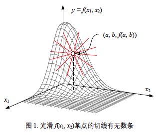
  
  * 定理：若累次极限 $\lim\limits_{x\rightarrow x_0}{\lim\limits_{y\rightarrow y_0}{f\left(x,y\right)}}$，$\lim\limits_{y\rightarrow y_0}{\lim\limits_{x\rightarrow x_0}{f\left(x,y\right)}}$ 和二重极限都存在，则三者相等（归结原理）
    * 若两个累次极限存在但不相等，则二重极限不存在；两个累次极限存在并相等无法推出二重极限的存在
  
* 连续
  * 若 $f\left(P\right)=f\left(x,y\right)$ 在点 $P_0\left(x_0,y_0\right)$ 的某邻域 $U\left(P_0\right)$ 内有意义，且 $\lim\limits_{x\rightarrow x_0\atop y\rightarrow y_0}{f\left(x,y\right)}=f\left(x_0,y_0\right)$，则称函数f(P)在点 $P_0\left(x_0,y_0\right)$ 处连续。记 $\Delta z=f\left(x,y\right)-f\left(x_0,y_0\right)=f\left(x_0+\Delta x_0,y_0\right)-f\left(x_0,y_0\right)$ 为函数的全增量，则二元函数连续的定义可改写为 $\lim\limits_{x\rightarrow x_0\atop y\rightarrow y_0}{\Delta z}=0$
  * 定义：$\Delta_xz\triangleq f\left(x,y_0\right)-f\left(x_0,y_0\right)=f\left(x+x_0,y_0\right)-f\left(x_0,y_0\right)$ 为函数（值）对x的偏增量；$\Delta_yz\triangleq f\left(x_0,y\right)-f\left(x_0,y_0\right)=f\left(x_0,y_0+\Delta y\right)-f\left(x_0,y_0\right)$ 为函数（值）对y的偏增量
  

## *偏导数与全微分*

### 偏导数

* 定义：设函数 $z=f\left(x,y\right)$ 在点 $P_0\left(x_0,y_0\right)$ 的某邻域内有定义，若极限 $\lim\limits_{\Delta x\rightarrow0}{\frac{\Delta_xz}{\Delta x}}=\lim\limits_{\Delta x\rightarrow0}{\frac{f\left(x_0+\Delta x,y_0\right)-f\left(x_0,y_0\right)}{\Delta x}}=\lim\limits_{\Delta x\rightarrow0}{\frac{f\left(x,y_0\right)-f\left(x_0,y_0\right)}{\Delta x}}$存在，则称该极限值为函数 $z=f\left(x,y\right)$ 在点 $P_0\left(x_0,y_0\right)$ 处关于x的偏导数，记为 $f_x^\prime\left(x_0,y_0\right)$ 或 $\frac{\partial z}{\partial x}\Big|_{y=y_0\atop x=x_0}$ 或 $\frac{\partial}{\partial x}f\left(x,y\right)$。Y的偏导数同理
* 几何意义：表示曲面 $z=f\left(x,y\right)$ 与平面 $y=y_0$ 的交线存在点 $M_0$ 处的切线对 *Ox* 轴的斜率  
* 高阶偏导数
  * $f_{xy}^{\prime\prime}\left(x,y\right),\ f_{yx}^{\prime\prime}\left(x,y\right)$ 称为二阶混合偏导 
  * 若函数 $z=f\left(x,y\right)$ 的二阶偏导（函数）$f_{xy}^{\prime\prime}\left(x,y\right),\ f_{yx}^{\prime\prime}\left(x,y\right)$ 都在点 $P_0\left(x_0,y_0\right)$ 处连续，则 $f_{xy}^{\prime\prime}\left(x,y\right)=f_{yx}^{\prime\prime}\left(x,y\right)$
    * 构造函数连续使用四次Lagrange中值定理证明
    * 该定理对全微分方程以及第二类曲线积分有着重要运用

### 全微分

* 若二元函数 $z=f\left(x,y\right)在点\left(x,y\right)$ 处的全增量 $\Delta z=f\left(x+\Delta x,y+\Delta y\right)-f\left(x,y\right)$ 可以表示为 $\Delta z=A\Delta x+B\Delta y+o\left(\rho\right)\left(\rho=\sqrt{\Delta x^2+\Delta y^2}\rightarrow0\right)$ ，其中A，B与变量x,y的增量 $\Delta x,\ \Delta y$ 无关，而仅与x,y有关，则称函数 $f\left(x,y\right)$ 在点 $\left(x,y\right)$ 处可微。其中 $A\Delta x+B\Delta y$ 称为函数 $f\left(x,y\right)$ 在点 $\left(x,y\right)$ 处的全微分，记作dz，即 $dz=A\Delta x+B\Delta y$ 
* 由可微的定义可知：若 $z=f\left(x,y\right)$ 在点 $\left(x,y\right)$ 处可微，则 $f\left(x,y\right)$ 在点 $\left(x,y\right)$ 处连续，反之不成立
* 可微的必要条件：若 $z=f\left(x,y\right)$ 在点 $\left(x,y\right)$ 处可微，则 $z=f\left(x,y\right)$ 在点 $\left(x,y\right)$ 处的两个偏导数  $f_x^\prime\left(x,y\right),f_y^\prime\left(x,y\right)$ 都存在，且 $A=f_x^\prime\left(x,y\right),B=f_y^\prime\left(x,y\right)$，反之不成立
* 可微的充分条件：若函数 $z=f\left(x,y\right)$ 的偏导数 $f_x^\prime\left(x,y\right),f_y^\prime\left(x,y\right)$ 在点 $x_0,y_0$ 处连续，则函数 $z=f\left(x,y\right)$ 在点 $x_0,y_0$ 处可微

## *复合函数微分法*

* 复合函数的偏导数 若 $z=f\left(u,v\right),u=\varphi\left(x\right),v=\psi\left(x\right)$，则有 $\frac{dz}{dx}=\frac{\partial{z}}{\partial{u}}\frac{du}{dx}+\frac{\partial{z}}{\partial{v}}\frac{dv}{dx}$
* 复合函数的全微分：假设 $z=f\left(x,y\right)$：其全微分为 $dz=\frac{\partial{z}}{\partial{x}}dx+\frac{\partial{z}}{\partial{y}}dy$

## *隐函数的偏导数*

### 隐函数的偏导数

* 方程 $F\left(x,y,z\right)=0$ 确定 $z=z\left(x,y\right)$，将 $z$ 代入 $F$ 得到 $F\left(x,y,z\left(x,y\right)\right)$，对 $x$ 求偏导有 $F_x^\prime+F_z^\prime\frac{\partial{z}}{\partial{x}}=0$，解得 $F_x^\prime=-F_z^\prime\frac{\partial{z}}{\partial{x}}$；对 $y$ 求偏导有 $F_y^\prime+F_y^\prime\frac{\partial{y}}{\partial{x}}=0$，解得 $F_y^\prime=-F_y^\prime\frac{\partial{y}}{\partial{x}}$
* 隐函数组的偏导数，设方程组 $\left\{\begin{matrix}F\left(x,y,u,v\right)=0\\G\left(x,y,u,v\right)=0\\\end{matrix}\right.$，确定隐函数组 $u=u\left(x,y\right),v=v\left(x,y\right)$。两边对x求偏导可得 $\frac{\partial{u}}{\partial{x}}=\frac{\left|\begin{matrix}F_x^\prime&F_v^\prime\\G_x^\prime&G_v^\prime\\\end{matrix}\right|}{\left|\begin{matrix}F_u^\prime&F_v^\prime\\G_u^\prime&G_v^\prime\\\end{matrix}\right|}, \frac{\partial{v}}{\partial{x}}=\frac{\left|\begin{matrix}F_u^\prime&F_x^\prime\\G_u^\prime&G_x^\prime\\\end{matrix}\right|}{\left|\begin{matrix}F_u^\prime&F_v^\prime\\G_u^\prime&G_v^\prime\\\end{matrix}\right|}$

* $\left|\begin{matrix}F_u^\prime&F_v^\prime\\G_u^\prime&G_v^\prime\\\end{matrix}\right|$ 称为二阶Jacobian行列式，可以用来证明二重积分中直角坐标系向极坐标系转换的问题。隐函数组的意义就是用以u和v这两个新的基向量来表示x和y，即坐标变换。

### Jacobian矩阵

* Jacobian矩阵的意义：进行坐标转换
  * 假如在 *x-y-z* 坐标系中有一向量 $r$，要用空间中一组新的基向量u,v,w来描述目前用x,y,z基向量组表示的向量r，那么就要进行坐标转换，即 $x=x\left(u,v,w\right),y=y\left(u,v,w\right),z=z\left(u,v,w\right)$。此时函数 $f\left(x,y,z\right)$ 的三重积分公式 $\iiint_{V}{f\left(x,y,z\right)dV}$ 会转换成 $\iiint_{V}{f\left(u,v,w\right)dV'}$，注意体积微元 $dV$ 是不同的
  * 那么该如何计算体积微元呢？可以用微元法，偏微分近似于线性主部，即体积微元就等于 $\frac{\partial{r}}{\partial{u}}\cdot\frac{\partial{r}}{\partial{v}}\cdot\frac{\partial{r}}{\partial{W}}$，而体积等于混合积，即 $dV=\left|\begin{matrix}\frac{\partial x}{\partial u}&\frac{\partial y}{\partial u}&\frac{\partial z}{\partial u}\\\frac{\partial x}{\partial v}&\frac{\partial y}{\partial v}&\frac{\partial z}{\partial v}\\\frac{\partial x}{\partial w}&\frac{\partial y}{\partial w}&\frac{\partial z}{\partial w}\\\end{matrix}\right|du\cdot dv\cdot w=\left|\frac{\partial\left(x,y,z\right)}{\partial\left(u,v,w\right)}\right|du\cdot dv\cdot  dw$。 $J=\left|\frac{\partial\left(x,y,z\right)}{\partial\left(u,v,w\right)}\right|$ 是一种缩写形式，称为Jacobian行列式，因此三元坐标转换公式就可以写成 $\iiint_{V}{f\left(x,y,z\right)dxdydz}=\iiint_{V}{f\left(u,v,w\right)\left|\frac{\partial\left(x,y,z\right)}{\partial\left(u,v,w\right)}\right|dudvdw}=\iiint_{V}{f\left(u,v,w\right)J_3dudvdw}$
  
* 设目标n元函数组
  $$
  y=\left\{\begin{matrix}y_1=f_1\left(x_1,x_2,\ldots x_n\right)\\y_2=f_2\left(x_1,x_2,\ldots x_n\right)\\\ldots\\y_n=f_n\left(x_1,x_2,\ldots x_n\right)\\\end{matrix}\right.
  $$
  每个 $f_i$ 对每个自变量 $x_i$ 都存在偏导数 $\frac{\partial f_i}{\partial x_i}$，则其n阶雅可比行列式
  $$
  J_n=\left|\begin{matrix}\frac{\partial f_1}{\partial x_1}&\frac{\partial f_1}{\partial x_2}&\ldots&\frac{\partial f_1}{\partial x_n}\\\frac{\partial f_2}{\partial x_1}&\frac{\partial f_2}{\partial x_2}&\ldots&\frac{\partial f_2}{\partial x_n}\\\vdots&\vdots&\ddots&\vdots\\\frac{\partial f_n}{\partial x_1}&\frac{\partial f_n}{\partial x_2}&\ldots&\frac{\partial f_n}{\partial x_n}\\\end{matrix}\right|
  $$
  之后的二重积分直角坐标系转换为极坐标，三重积分转换为极坐标或球坐标都是一般曲线坐标变换的特殊形式

### 反函数组的偏导数

## *场的方向导数与梯度*

### 场的概念

### 场的方向导数

* 定义：设数量场三元函数u在点 $P_0\left(x_0,y_0,z_0\right)$  的某领域$U\left(P_0\right)\in \mathbb{R}^3$ 内有定义，$l$ 为从点 $P_0$ 出发的射线，$P\left(x,y,z\right)$ 为 $l$ 上且含于 $U\left(P_0\right)$ 内的任一点，以 $\rho$ 表示 $P$ 与 $P_0$ 两点的距离，若极限 $\lim\limits_{\rho\rightarrow0}{\frac{u\left(P\right)-u\left(P_0\right)}{\rho}}=\lim\limits_{\rho\rightarrow0}{\frac{\Delta_lu}{{\color{red}\rho}}}$ 存在，则称此极限为函数u在点 $P_0$ 沿方向 $\vec{l}$ 的方向导数，记作 $\frac{\partial u}{\partial l}\Big|_{P_0}=\frac{\partial u}{\partial x}\Big|_{P_0}\cos{\alpha}+\frac{\partial u}{\partial y}\Big|_{P_0}\cos{\beta}+\frac{\partial u}{\partial z}\Big|_{P_0}\cos{\gamma}$
* 定理：若函数u在点 $P_0\left(x_0,y_0,z_0\right)$ 处可微，则u在点 $P_0$ 处任一方向 $\vec{l}$ 的方向导数都存在为 $\frac{\partial u}{\partial\vec{l}}\Big|_{P_0}=\frac{\partial u}{\partial x}\Big|_{P_0}\cos{\alpha}+\frac{\partial u}{\partial y}\Big|_{P_0}\cos{\beta}+\frac{\partial u}{\partial z}\Big|_{P_0}\cos{\gamma}$
* 推导：设三维空间中任意一点 $P_0\left(x_0,y_0,z_0\right)$，三维空间中任意两点距离为 $\rho=\sqrt{\left(x-x_0\right)^2+\left(y-y_0\right)^2+\left(z-z_0\right)^2}$ ，并且任一点的单位方向矢量 ${\vec{n}}^0=\left(\frac{\Delta x}{\rho}, \frac{\Delta y}{\rho}, \frac{\Delta z}{\rho}\right)=(\cos{\alpha}, \cos{\beta}, \cos{\gamma})$，那么该点沿任一方向的导数根据定义为 $\frac{\partial u}{\partial\vec{l}}\Big|_{P_0}=\lim\limits_{\rho\rightarrow0}{\frac{u\left(P\right)-u\left(P_0\right)}{\rho}}=\frac{u_x^\prime dx}{\rho}+\frac{u_y^\prime dy}{\rho}+\frac{u_z^\prime dz}{\rho}(全微分)=\frac{\partial{u}}{\partial{x}}\Big|_{P_0}\cos{\alpha}+\frac{\partial{u}}{\partial{y}}\Big|_{P_0}\cos{\beta}+\frac{\partial{u}}{\partial{z}}\Big|_{P_0}\cos{\gamma}$

### Gradient 梯度

* 定义：矢量 $\nabla u=\mathop{grad}\ u=\frac{\partial u}{\partial v}i+\frac{\partial u}{\partial y}j+\frac{\partial u}{\partial z}k=\left(\frac{\partial u}{\partial v},\frac{\partial u}{\partial y},\frac{\partial u}{\partial z}\right)$（向量微分算子 $\nabla$ 称为Nabla算子或Hamilton算子）
* 与方向导数 $\frac{\partial u}{\partial\vec{l}}$ 的关系：$\frac{\partial u}{\partial\vec{l}}=\nabla u\big|_{P_0}\cdot{\vec{n}}^0=\vert\mathbf{\nabla}u\left(P_0\right)\vert\vert{\vec{n}}^0\vert\cos{\theta}$
  * 当u在点 $P_0$ 可微时，当 $\theta=0$ 时，方向导数取到最大值，也就是说u在点 $P_0$ 的梯度方向是u值增长得最快的方向
  * 当 $\theta=\pi$ 时，$\vec{l}$ 的方向与梯度方向相反，方向导数最小
  * 当 $\theta=\frac{\pi}{2}$ 时，方向导数为0

### ==理解==

二维及高维平面的导数/偏导数都是沿着坐标轴方向的，但三维空间/高维空间中经过一定点有无数路径和方向，因此不能通过导数来确定，而要通过可从任意方向逼近的方向导数来确定。如果只问曲面上的一个点的导数是没有意义的，而应该问这个点沿着某个方向的导数（即方向导数）是多少。而在所有的方向导数中，空间方程沿着梯度方向的变化率最大，即梯度方向是函数增加最快的方向。

### Hessian 黑塞矩阵

黑塞矩阵是一个多元函数的二阶偏导组成的方阵。为什么要把黑塞矩阵单独拿出来？因为黑塞矩阵描述了函数的局部曲率，这为凸函数优化和判断正定性提供了工具

设一个多元函数 $f(x_1,x_2,\dots,x_n)$，它的二阶偏导矩阵为
$$
H(f)=\left[\begin{matrix}\frac{\partial{f}}{\partial^2{x_1}}&\frac{\partial{f}}{\partial{x_1}\partial{x_2}}&\cdots&\frac{\partial{f}}{\partial{x_1}\partial{x_n}}\\\frac{\partial{f}}{\partial{x_2}\partial{x_1}}&\frac{\partial{f}}{\partial^2{x_2}}&\cdots&\frac{\partial{f}}{\partial{x_2}\partial{x_n}}\\\vdots&\vdots&\ddots&\vdots\\\frac{\partial{f}}{\partial{x_n}\partial{x_1}}&\frac{\partial{f}}{\partial{x_n}\partial{x_2}}&\vdots&\frac{\partial{f}}{\partial^2{x_n}}\end{matrix}\right]
$$
梯度的雅可比矩阵就是黑塞矩阵

## *多元函数的极值及应用*

### 多元函数的泰勒公式

若函数f在点 $P_0\left(x_0,y_0\right)$ 的某邻域 $U\left(P_0\right)$ 内有直到n+1阶的连续偏导数，则对 $U\left(P_0\right)$ 内任一点 $\left(x_0+h,y_0+k\right)$，存在 $\theta\in\left(0,1\right)$，使得 
$$
f(x_0+h,y_0+k)=f(x_0,y_0)+\left(h\frac{\partial}{\partial{x}}+k\frac{\partial}{\partial{y}}\right)f(x_0,y_0)+\frac{1}{2!}\left(h\frac{\partial}{\partial{x}}+k\frac{\partial}{\partial{y}}\right)^2f(x_0,y_0)+\\\ldots\frac{1}{n!}\left(h\frac{\partial}{\partial{x}}+k\frac{\partial}{\partial{y}}\right)^nf(x_0,y_0)+\frac{1}{\left(n+1\right)!}\left(h\frac{\partial}{\partial{x}}+k\frac{\partial}{\partial{y}}\right)^{n+1}f(x_0+\theta h,y_0+\theta k)
$$
 称为二元函数f在点 $P_0$ 处的n阶泰勒公式

以二元函数为例，就是在用不同的平面来逼近函数；拓展到多元函数，就是在用不同的超平面来逼近

这里提供一个常用的多元函数 $f(x)$ 泰勒二级级数展开式对应的矩阵运算 $f(x)\approx f(x_p)+\nabla f(x_p)^T\Delta x+\frac{1}{2}\Delta x^TH\Delta x$

### 多元函数的极值

* 极值的必要条件：若函数f在点 $P_0(x_0,y_0)$ 存在偏导数且在点 $P_0$ 处取极值，则有 $f_x^\prime\left(x_0,y_0\right)=0\ ,f_y^\prime\left(x_0,y_0\right)=0$，若 $P_0$ 满足该关系，则称其为f的稳定点或驻点

* 极值的充分条件：Hessian 黑塞矩阵正定

  设函数 $f=\left(x,y\right)$ 在点 $P_0$ 的某领域 $U\left(P_0\right)$ 内连续，且有二阶连续偏导数，如果 $f_x^\prime\left(x_0,y_0\right)=0\ ,f_y^\prime\left(x_0,y_0\right)=0$，设 $A=f_{xx}^{\prime\prime}\left(x_0,y_0\right),\ B=f_{xy}^{\prime\prime}\left(x_0,y_0\right),\ C=f_{yy}^{\prime\prime}\left(x_0,y_0\right)$： 

  * 当 $AC-B^2>0$ 时，$f\left(x_0,y_0\right)$ 一定为极值，并且当A或C>0时，$f\left(x_0,y_0\right)$ 为极小值；当A或C<0时，$f\left(x_0,y_0\right)$ 为极大
  * 当 $AC-B^2<0$ 时，$f\left(x_0,y_0\right)$ 不是极值
  * 当 $AC-B^2=0$ 时，无法判定 $f\left(x_0,y_0\right)$ 是否为极值

## *拉格朗日乘数法 Lagrange multiplier*

### 含约束最小化优化问题

$$
\underset{\boldsymbol{x}}{\arg\min\ }{f(\boldsymbol{x})}\\subject\ to:\ \boldsymbol{l}\leq\boldsymbol{x}\leq\boldsymbol{u}\\A\boldsymbol{x}\leq\boldsymbol{b}\\A\boldsymbol{x}=\boldsymbol{b}\\c(\boldsymbol{x})\leq0\\c(\boldsymbol{x})=0
$$

下文中，考虑的都是**凸函数** $f(\boldsymbol{x})$

上式中，$\arg\min$ 下方的 $\boldsymbol{x}$ 为自变量，而 $f(\boldsymbol{x})$ 是需要优化的目标函数。$\arg\min$ 是 argument of the minima，用于获得使函数取最小值的参数，即 $\boldsymbol{x}^*=\underset{\boldsymbol{x}}{\arg\min\ }{f(\boldsymbol{x})}$

约束条件分为五类，从上到下依次为

* 上下界 Lower annd upper bounds
* 线形不等式 Linear inequalities
* 线形等式 Linear equalities
* 非线性不等式 Nonlinear inequalities
* 非线性等式 Nonlinear equalities

当约束条件存在时，最值如下图可能出现在搜索区域内部或约束边界上

通过引进拉格朗日函数，将有约束条件的极值问题（往往难以求解）化为普通的无条件的极值问题

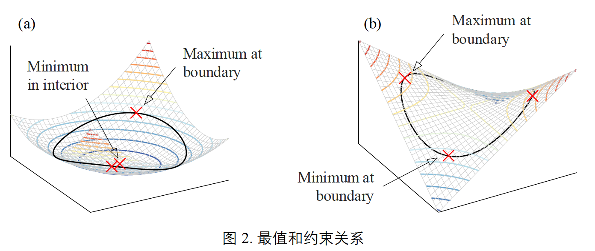

### 等式约束条件

给定等式约束优化问题，其中 $f(\boldsymbol{x})$ 和 $h(\boldsymbol{x})$ 为连续函数，$h(\boldsymbol{x})=0$ 为等式约束条件
$$
\underset{x}{\arg\min\ }{f(\boldsymbol{x})}\\subject\ to:\ h(\boldsymbol{x})=0
$$
构造拉格朗日函数 $L(\boldsymbol{x},\lambda)=f(\boldsymbol{x})+\lambda h(\boldsymbol{x})$，其中 $\lambda$ 被称作拉格朗日乘子 Lagrange multiplier，$\lambda$ 的符号既可以为正也可以为负号，采用哪个符号对判断极值有一些影响，但总体上差别不大，我们这里用正号

因此可以将含等式约束问题转化成一个无约束优化问题，即
$$
\left\{\begin{array}{l}\underset{x}{\arg\min\ }{f(\boldsymbol{x})}\\subject\ to:\ h(\boldsymbol{x})=0\end{array}\right.\Rightarrow\underset{x}{\arg\min\ }{L(\boldsymbol{x},\lambda)}
$$
当 $L(\boldsymbol{x},\lambda)$ 对 $\boldsymbol{x}$ 和 $\lambda$ ==一阶偏导都存在==的情况下，最优解的必要（不是充分）条件为一阶偏导数都为 $\boldsymbol{0}$，即
$$
\left\{\begin{array}{l}\nabla_xL(\boldsymbol{x},\lambda)=\frac{\partial L(\boldsymbol{x},\lambda)}{\partial\boldsymbol{x}}=\nabla f(\boldsymbol{x})+\lambda\nabla h(\boldsymbol{x})=\boldsymbol{0}\\\nabla_{\lambda}L(\boldsymbol{x},\lambda)=\frac{\partial L(\boldsymbol{x},\lambda)}{\partial\boldsymbol{x}}=h(\boldsymbol{x})=\boldsymbol{0}\end{array}\right.\Rightarrow\nabla_{x,\lambda}L(\boldsymbol{x},\lambda)=\boldsymbol{0}
$$
求解合并后的式子得到驻点 stationary point $\boldsymbol{x}$，然后进一步判断驻点是极大值、极小值还是鞍点

### 线性等式约束

对拉格朗日函数 $L(\boldsymbol{x},\lambda)=f(\boldsymbol{x})+\lambda h(\boldsymbol{x})$ 的理解
$$
\nabla f(\boldsymbol{x})+\lambda\nabla h(\boldsymbol{x})=\boldsymbol{0}\rightarrow\nabla f(\boldsymbol{x})=-\lambda\nabla h(\boldsymbol{x})
$$
该式表达的意义是：在驻点 $\boldsymbol{x}$ 处，$f(\boldsymbol{x})$ 和 $h(\boldsymbol{x})$ 的梯度同向或者反向，即平行

假设现在有目标函数 $f(\boldsymbol{x})$ 和 线性约束 $h(\boldsymbol{x})$（下图的黑色直线），可以发现当直线约束与目标函数的等高线相切的时候会有极值，此时无论在黑色直线上向左走还是向右走都会目标函数取不到极值

可以看到此时 $f(\boldsymbol{x})$ 和 $h(\boldsymbol{x})$ 的梯度平行，若 $\lambda$ 取负则二者同向；若 $\lambda$ 取正则二者反向

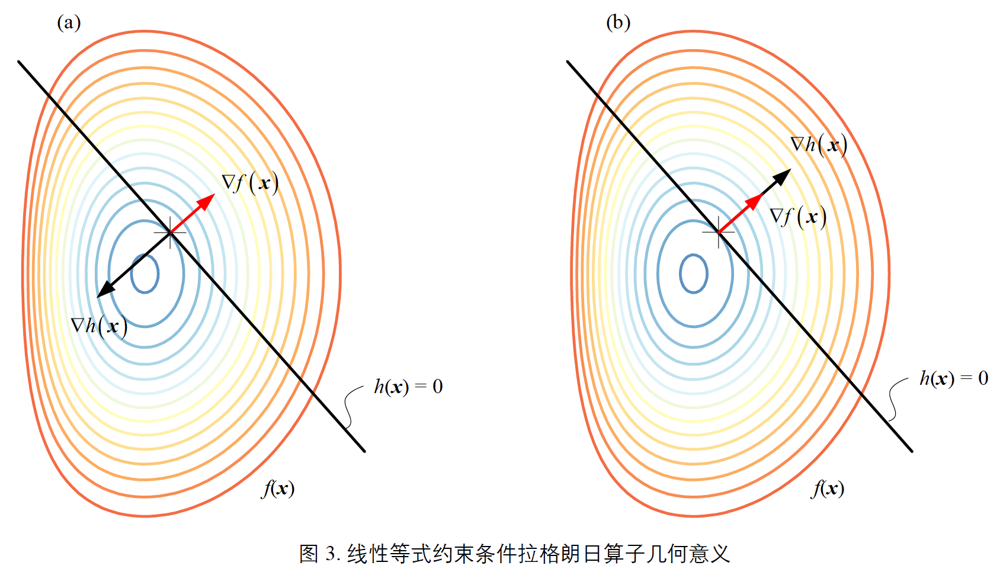

### 非线形等式约束

对非线形等式的约束完全和线形等式相同

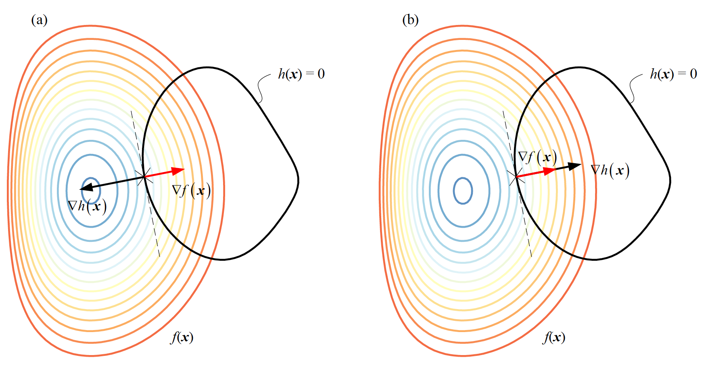

### 不等式约束

给定如下不等式约束优化问题
$$
\underset{x}{\arg\min\ }{f(\boldsymbol{x})}\\subject\ to:\ g(\boldsymbol{x})\leq0
$$

如下图所示，优化解 $\boldsymbol{x}$ 的出现位置有两种情况

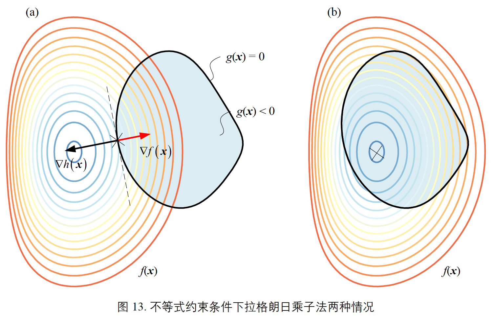

* $\boldsymbol{x}$ 出现在边界上，约束条件有效，此时可以看到变成了和非线形等式中一样的情况，因为在边界上所以 $g(\boldsymbol{x})=0$
* $\boldsymbol{x}^*$ 出现在不等式区域内（下图浅蓝色背景），此时约束条件失去效果，可以直接通过 $\nabla f(\boldsymbol{x})=\boldsymbol{0}$ 求得优化解，此时 $\lambda=0$。若 $\lambda=0$，约束条件失去约束作用时，将这种约束称为**松弛 slack**的约束；若 $\lambda>0$，约束有效时，将这种约束称为**紧致 compact**的约束
* 结合上述两种情况，有 $\lambda g(\boldsymbol{x})=0$ 恒成立

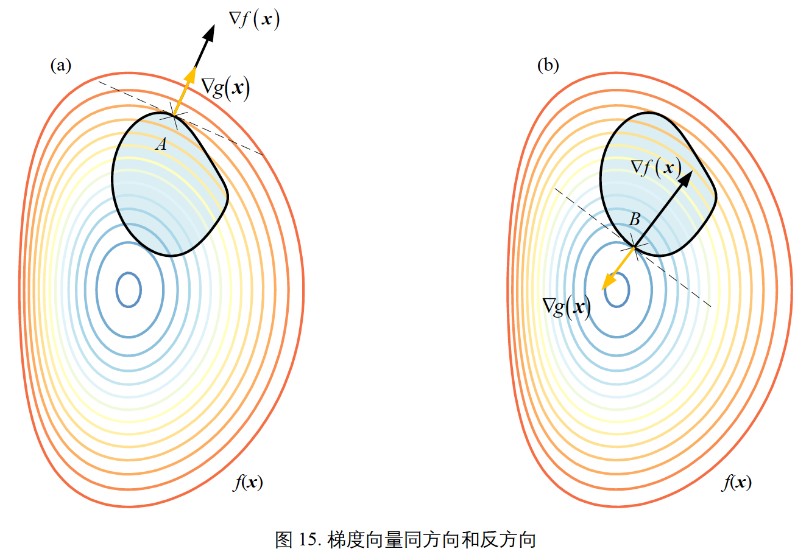

因为约束内部为 $g(\boldsymbol{x})<0$，而外部是 $g(\boldsymbol{x})>0$（通过左移、右移不等式来得到），所以对于约束而言，其梯度方向应该是从中心向外
$$
\nabla f(\boldsymbol{x})+\lambda\nabla h(\boldsymbol{x})=\boldsymbol{0}\Rightarrow\nabla f(\boldsymbol{x})=-\lambda\nabla h(\boldsymbol{x})
$$

* 从上图中可以看出，当拉格朗日乘子前的符号取正时，当拉格朗日乘值 $\lambda\geq0$ 时，目标函数梯度与约束梯度方向相反，取到极小值
* 当拉格朗日乘值 $\lambda\leq0$ 时，目标函数梯度与约束梯度方向相同，取到极大值

通过上面的讨论可以归纳出**假设拉格朗日乘子前符号为正时，凸函数取到极小值的 Karush-Kuhn-Tucker KKT 条件**：将拉格朗日乘数法推广到不等式约束问题，构造的拉格朗日函数为 $L(\boldsymbol{x},\lambda)=f(\boldsymbol{x})+\lambda g(\boldsymbol{x})$，极小点 $\boldsymbol{x}$ 出现位置满足如下KKT条件

$$
\left\{\begin{array}{l}\nabla f(\boldsymbol{x})+\lambda\nabla h(\boldsymbol{x})=\boldsymbol{0}\\g(\boldsymbol{x})\leq0\\\lambda\geq0\\\lambda g(\boldsymbol{x})=0\end{array}\right.
$$

### KKT条件一般化：推广到多约束

在后面这部分中为了避免混淆，将目标函数改为 $f_0(\boldsymbol{x})$，不等式约束及其拉格朗日乘子的符号改为 $\lambda_if_i(\boldsymbol{x})$，将等式约束及其拉格朗日乘子的符号改为 $\nu_ih_i(\boldsymbol{x})$

* 合并等式和不等式约束

  * 构造最小化优化问题
    $$
    \underset{\boldsymbol{x}}{\arg\min\ }{f_0(\boldsymbol{x})}\\subject\ to:\ f(\boldsymbol{x})\leq0,\ h(\boldsymbol{x})=0
    $$

  * 构造拉格朗日函数
    $$
    L(\boldsymbol{x},\boldsymbol{\lambda},\boldsymbol{\nu})=f_0(\boldsymbol{x})+\lambda f(\boldsymbol{x})+\nu h(\boldsymbol{x})
    $$

  * KKT条件如下
    $$
    \left\{\begin{array}{l}\nabla f_0(\boldsymbol{x})+\lambda\nabla f({\boldsymbol{x}})+\nu\nabla h({\boldsymbol{x}})=\boldsymbol{0}\\f(\boldsymbol{x})\leq0\\h(\boldsymbol{x})=0\\\lambda\geq0\\\lambda f(\boldsymbol{x})=0\end{array}\right.
    $$

* 进一步推广到多约束

  * 构造最小化优化问题
    $$
    \underset{x}{\arg\min\ }{f_0(\boldsymbol{x})}\\subject\ to:\ \left\{\begin{array}{l}f_i(\boldsymbol{x})\leq0,&i=1,\dots,m\\h_j(\boldsymbol{x})=0,&j=1,\dots,q\end{array}\right.
    $$

  * 构造拉格朗日函数
    $$
    L(\boldsymbol{x},\boldsymbol{\lambda},\boldsymbol{\nu})=f_0(\boldsymbol{x})+\sum{\lambda_if_i(\boldsymbol{x})}+\sum{\nu_jh_j(\boldsymbol{x})}
    $$

  * KKT条件如下
    $$
    \left\{\begin{array}{ll}\nabla_{\boldsymbol{x}}L(\boldsymbol{x},\boldsymbol{\lambda},\boldsymbol{\nu})=0\\f_i(\boldsymbol{x})\leq0\\h_j(\boldsymbol{x})=0\\\boldsymbol{\lambda}\geq0\\\lambda_if_i(\boldsymbol{x})=0,&\forall i\end{array}\right.
    $$

在下面的拉格朗日对偶问题中我们可以得到KKT条件是强对偶关系的必要条件，因此我们可以将KKT条件重新分组为原问题可行条件 primal feasibility、对偶可行条件 dual feasibility 和互补松弛条件 complementary slackness
$$
primal\ feasibility:\left\{\begin{array}{l}f_i(\boldsymbol{x})\leq0\\h_i(\boldsymbol{x})=0\end{array}\right.\\dual\ feasibilty:\left\{\begin{array}{l}\nabla_{\boldsymbol{x}}L(\boldsymbol{x},\boldsymbol{\lambda},\boldsymbol{\nu})=0\\\boldsymbol{\lambda}\geq0\end{array}\right.\\complementary\ slackness:\lambda_if_i(\boldsymbol{x})=0
$$

## *拉格朗日对偶问题 Duality*

现实中大部分优化目标函数都是非凸函数，可以通过拉格朗日函数的对偶问题将非凸函数转换为凸函数

https://zhuanlan.zhihu.com/p/38163970 

### Primal problem 原问题

$$
\left\{\begin{array}{l}\min{f_0(\boldsymbol{x})},\ \boldsymbol{x}\in\R^n\\s.t.\ \left\{\begin{array}{l}f_i(\boldsymbol{x})\leq0,&i=1,\dots,m\\h_i(\boldsymbol{x})=0,&j=1,\dots,q\end{array}\right.\end{array}\right.\Leftrightarrow L(\boldsymbol{x},\boldsymbol{\lambda},\boldsymbol{\nu})=f_0(\boldsymbol{x})+\sum{\lambda_if_i(\boldsymbol{x})}+\sum{\nu_ih_i(\boldsymbol{x})}\Leftrightarrow\left\{\begin{array}{l}\min\limits_{\boldsymbol{x}}{\max\limits_{\boldsymbol{\lambda},\boldsymbol{\nu}}{L(\boldsymbol{x},\boldsymbol{\lambda},\boldsymbol{\nu})}}\\s.t.\ \boldsymbol{\lambda}\geq0\end{array}\right.
$$

左右两种表示形式是完全等价的，右边被称为**原问题 Primal problem**。其中左边的形式中 $f_i(\boldsymbol{x})$ 和 $g_i(\boldsymbol{x})$ 分别为等式约束和非等式约束

等价的原因并非显而易见的，可以根据原来左边形式的 $\boldsymbol{x}$ 的两种取值情况进行讨论。但首先，右边的形式相当于是把原本的约束直接写进了方程，$L(\boldsymbol{x},\boldsymbol{\lambda},\boldsymbol{\nu})$ 取到最大值时，$\boldsymbol{\lambda},\boldsymbol{\nu}$ 是固定的，但 $\boldsymbol{x}$ 可以在全空间内任意取。但为什么是先求max？因为原来求的是 $\min{f_0(\boldsymbol{x})}$，而根据KKT条件 $\boldsymbol{\lambda}>0,f_i(\boldsymbol{x})\leq0$，从上式中间的形态可以看出必须要减去一个所有约束的最大值和，所以先求的是max

1. $\boldsymbol{x}$ 不在原约束的可行域内
   $$
   \max\limits_{\boldsymbol{\lambda},\boldsymbol{\nu}}{L(\boldsymbol{x},\boldsymbol{\lambda},\boldsymbol{\nu})}=f_0(\boldsymbol{x})+\infty+\infty=\infty
   $$

2. $\boldsymbol{x}$ 在原约束的可行域内时
   $$
   \max\limits_{\boldsymbol{\lambda},\boldsymbol{\nu}}{L(\boldsymbol{x},\boldsymbol{\lambda},\boldsymbol{\nu})}=f_0(\boldsymbol{x})+0+0=f_0(\boldsymbol{x})
   $$

虽然有一个 $\infty$，但是不用担心，因为需要对两部分进行比较，找最小值
$$
\min\limits_{\boldsymbol{x}}{\max\limits_{\boldsymbol{\lambda},\boldsymbol{\nu}}{L(\boldsymbol{x},\boldsymbol{\lambda},\boldsymbol{\nu})}}=\min\limits_{\boldsymbol{x}}\left\{f_0(\boldsymbol{x}),\infty\right\}=\min\limits_{\boldsymbol{x}}{f_0(\boldsymbol{x})}
$$
从而证明了两种原问题的表达形式完全等价，在下面的对偶问题中我们会使用 $\left\{\begin{array}{l}\min\limits_{\boldsymbol{x}}{\max\limits_{\boldsymbol{\lambda},\boldsymbol{\nu}}{L(\boldsymbol{x},\boldsymbol{\lambda},\boldsymbol{\nu})}}\\s.t.\ \boldsymbol{\lambda}\geq0\end{array}\right.$ 的形式

### 对偶问题 Duality

原问题的对偶问题：更改求min和max的顺序，先对 $\boldsymbol{x}$ 求最小，再对拉格朗日乘子求最大。注意下式中的 $\longrightarrow$，原问题和对偶问题只是相关的，并不是等价的，等价还需要满足一些其他条件，下面会讨论
$$
\underbrace{\left\{\begin{array}{l}\min\limits_{\boldsymbol{x}}{f_0(\boldsymbol{x})},\ \boldsymbol{x}\in\R^n\\s.t.\ \left\{\begin{array}{l}f_i(\boldsymbol{x})\leq0,&i=1,\dots,m\\h_j(\boldsymbol{x})=0,&j=1,\dots,q\end{array}\right.\end{array}\right.=\left\{\begin{array}{l}\min\limits_{\boldsymbol{x}}{\max\limits_{\boldsymbol{\lambda},\boldsymbol{\nu}}{L(\boldsymbol{x},\boldsymbol{\lambda},\boldsymbol{\nu})}}\\s.t.\ \boldsymbol{\lambda}\geq0\end{array}\right.}_{Primal\ problem}\longrightarrow\underbrace{\left\{\begin{array}{l}\max\limits_{\boldsymbol{\lambda},\boldsymbol{\nu}}{\min\limits_{\boldsymbol{x}}{L(\boldsymbol{x},\boldsymbol{\lambda},\boldsymbol{\nu})}}\\s.t.\ \boldsymbol{\lambda}\geq0\end{array}\right.=\left\{\begin{array}{l}\max\limits_{\boldsymbol{\lambda},\boldsymbol{\nu}}{g\left(\boldsymbol{\lambda},\boldsymbol{\nu}\right)}\\s.t.\ \boldsymbol{\lambda}\geq0\end{array}\right.}_{Dual\ problem}
$$

解决非凸问题的关键在于：不论原问题 $f_0(\boldsymbol{x})$ 是凸问题还是非凸问题，只要转换成了相应对偶问题 $g\left(\boldsymbol{\boldsymbol{\lambda},\boldsymbol{\nu}}\right)$ 就都是凸问题。以下是对偶函数的表达式，我们要先求的是一个最小值 $\boldsymbol{x}^*$，当取到该值时，**$g(\boldsymbol{\lambda},\boldsymbol{\nu})$ 相当于是一条变量为 $\boldsymbol{\lambda},\boldsymbol{\nu}$ 的确定直线**，而直线既是凸的又是凹的，因为之后要求的是最大值，所以暂时将它看作是**凹**的。从而也就将非凸问题转换成了凸优化问题。注意：凸优化问题要求目标函数和约束都是凸的，对偶问题的约束为 $\boldsymbol{\lambda}\geq0$ 为凸的
$$
g(\boldsymbol{\lambda},\boldsymbol{\nu})=\min\limits_{\boldsymbol{x}}{L(\boldsymbol{x},\boldsymbol{\lambda},\boldsymbol{\nu})}=f_0(\boldsymbol{x}^*)+\sum{\lambda_if_i(\boldsymbol{x}^*)}+\sum{\nu_ih_i(\boldsymbol{x}^*)}
$$
原问题和对偶问题是相关的，但不是等价的。**原问题得出的解一定大于等于对偶问题得出的解**

根据原问题和对偶问题的定义，可以直接得到
$$
A(\boldsymbol{x})=\max\limits_{\boldsymbol{\lambda},\boldsymbol{\nu}}{L(\boldsymbol{x},\boldsymbol{\lambda},\boldsymbol{\nu})}\geq L(\boldsymbol{x},\boldsymbol{\lambda},\boldsymbol{\nu})\geq\min\limits_{\boldsymbol{x}}{L(\boldsymbol{x},\boldsymbol{\lambda},\boldsymbol{\nu})}=I(\boldsymbol{\lambda},\boldsymbol{\nu})\Leftrightarrow A(\boldsymbol{x})\geq I(\boldsymbol{\lambda},\boldsymbol{\nu})\ always\ true\\\Leftrightarrow A(\boldsymbol{x})\geq\min\limits_{\boldsymbol{x}}{A(\boldsymbol{x})}\geq\max\limits_{\boldsymbol{\lambda},\boldsymbol{\nu}}{I(\boldsymbol{\lambda},\boldsymbol{\nu})}\geq I(\boldsymbol{\lambda},\boldsymbol{\nu})\ always\ true
$$
上式中左边就是原问题的解 $P^*$，右边就是对偶问题的解 $D^*$，即有原问题得出的解一定大于等于对偶问题得出的解
$$
P^*=\min\limits_{\boldsymbol{x}}{A(\boldsymbol{x})}\geq\max\limits_{\boldsymbol{\lambda},\boldsymbol{\nu}}{I(\boldsymbol{\lambda},\boldsymbol{\nu})}=D^*\ always\ true
$$
为了解决原问题，自然最理想的情况就是 $P^*=D^*$ 的时候，那么什么时候才会正好有这种关系呢？看下面的几何解释

### 几何解释

在原来的求解过程中，因为要考虑的是约束的 $\nu_ih_i(\boldsymbol{x})=0$ 的梯度，所以不能忽略它，但在我们下面的推导中，不会用到它的梯度，所以直接忽略它。为了方便计算，下面将原函数用 $t$ 来表示，不等式约束用 $\boldsymbol{\lambda}^T\cdot\boldsymbol{u}$ 来表示
$$
L(\boldsymbol{x},\boldsymbol{\lambda},\boldsymbol{\nu})=f_0(\boldsymbol{x})+\sum{\lambda_if_i(\boldsymbol{x})}+\underbrace{\sum{\nu_ih_i(\boldsymbol{x})}}_{=0}\triangleq t+\boldsymbol{\lambda}^T\boldsymbol{u}
$$
原问题和对偶问题的区别在于由于求极值顺序不同造成的 $\boldsymbol{x}$ 的可行域 $G_1,G_2$ 不同

* 原问题是先对 $\boldsymbol{x}$ 进行了空间约束
  $$
  G_1=\left\{(t,\boldsymbol{u})|t=f_0(\boldsymbol{x}),u_i=f_i(\boldsymbol{x}),x\in{\color{red}D}\right\}\\where\ D=\left\{\boldsymbol{x}\Big|\begin{array}{l}f_i(\boldsymbol{x})\leq0&i=1,\dots,m\\h_j(\boldsymbol{x})=0&j=1,\dots,q\end{array}\right.\\Primal\ problem:\ \min\limits_{\boldsymbol{x}}{\left\{t|(t,\boldsymbol{u})\in G_1\right\}}
  $$

* 对偶问题因为是先对 $\boldsymbol{x}$ 求min，因此 $\boldsymbol{x}$ 的可行域是全空间
  $$
  G_2=\left\{t,\boldsymbol{u}|t=f_0(\boldsymbol{x}),u_i=f_i(\boldsymbol{x}),x\in\R^n\right\}\\Dual\ probelm:\ \max\limits_{\boldsymbol{\lambda}}{\min\limits_{\boldsymbol{x}}{\left\{t+\boldsymbol{\lambda}^T\boldsymbol{u}|(t,\boldsymbol{u})\in G_2,\lambda\geq0\right\}}}
  $$

下面以 $u,t$ 为坐标轴画出原问题和对偶问题的可行域 $G_1,G_2$ ，$G_1$ 是 $G_2$ 在 $\boldsymbol{u}\leq0$（空间约束）部分的子集，注意：下面的图有一些误导，在解决对偶问题的时候必须记住**$G_2$ 的范围是图中 $G_1$ 和 $G_2$ 两部分合起来的范围**

* 原问题的目标是找到能使 $t=f_0(\boldsymbol{x})$ 最小化的 $\boldsymbol{x}$，因此在图中 $P^*$ 就是 $G_1$ 可行域的最低点对应的 $t$ 值
* 对偶问题，因为 $\lambda\geq0$，因此斜率是一个负数，直线为downward inclined
  * 首先要使 $t+\boldsymbol{\lambda}\boldsymbol{u}$ 最小化，这个式子的意义就是与 $t$ 轴的截距，因此对直线进行平移
  * 然后要寻找另直线截距最大化的斜率 $\boldsymbol{\lambda}$，相当于就是转动直线找最大截距，因为 $G_1$ 是 $G_2$ 的一部分，所以旋转斜率取到极值时必然是同时与 $G_1$ 和 $G_2$ 同时相切的时候

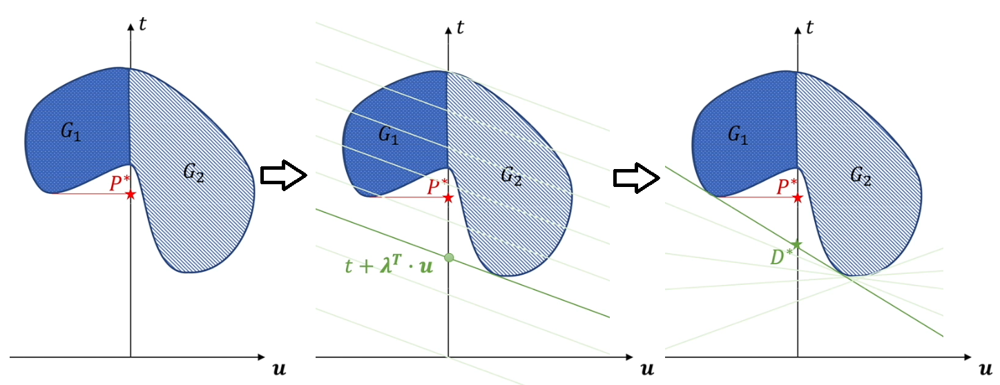

* 强对偶关系 strong duality：$P^*=D^*$，此时原问题和对偶问题就等价了
* 弱对偶关系 weak duality：$P^*>D^*$

**结论：一般只要两个空间域是凸集，那么必然是强对偶关系**，虽然这还需要slater条件来完善这个定理，但一般有化问题就是这么用的

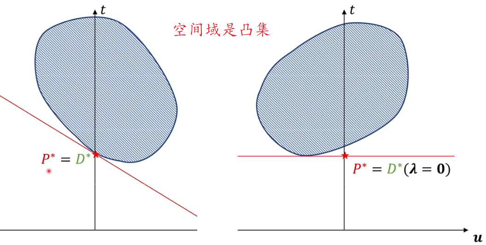

### Slater条件

即使是一个凸优化问题，也不一定就是强对偶关系（虽然一般来说大部分凸优化问题都是强对偶的，但还是不严谨存在例外）

还需要满足Slater条件：存在一个点 $\boldsymbol{x}\in relint\ D$，使得 $f_i(\boldsymbol{x})<0$，其中 $i=1,2,3\dots,m,\ A\boldsymbol{x}=b$，$relint\ D$ 表示可行域D的相对内部，所谓相对内部就是说 $x$ 不能在可行域的边界上，只能是边界内

比如在上面的图中，只要在空间域左侧有一个点属于空间域，那么就满足了slater条件，此时凸优化问题必然是强对偶关系

**slater条件是强对偶关系的充分条件，KKT条件是强对偶关系的必要条件，但强对偶关系的充要条件目前尚未可知**。实际中满足KKT条件的基本上都是强对偶关系，但实际上是不严谨的

## *偏导数在几何上的应用*

* 矢值函数的微分法
* 空间曲线的切线与法平面： 设空间曲线的参数方程为 $x=x\left(t\right),y=y\left(t\right),z=z\left(t\right)$
  * 切线 $\frac{x-x_0}{x^\prime\left(t_0\right)}=\frac{y-y_0}{y^\prime\left(t_0\right)}=\frac{z-z_0}{z^\prime\left(t_0\right)}$
  * 法平面 $x^\prime\left(t_0\right)\left(x-x_0\right)+y^\prime\left(t_0\right)\left(y-y_0\right)+z^\prime\left(t_0\right)\left(z-z_0\right)=0$

* 空间曲面的切平面与法线： 设曲面方程为 $F\left(x,y,z\right)=0$
  * 切平面 $F_x^\prime\left(x_0,y_0,z_0\right)\left(x-x_0\right)+F_y^\prime\left(x_0,y_0,z_0\right)\left(y-y_0\right)+F_z^\prime\left(x_0,y_0,z_0\right)\left(z-z_0\right)=0$
  * 法线 $\frac{x-x_0}{F_x^\prime\left(x_0,y_0,z_0\right)}=\frac{y-y_0}{F_y^\prime\left(x_0,y_0,z_0\right)}=\frac{z-z_0}{F_z^\prime\left(x_0,y_0,z_0\right)}$

# 多元函数积分学

## *二重积分的概念*

* 引入
  * 曲顶柱体的体积 
  * 非均质薄片的质量 
* 二重积分的概念：$\lim\limits_{\lambda\rightarrow0}{\sum\limits_{i=1}^{n}{f\left(\xi_i,\eta_i\right)\Delta\sigma_i}}=\iint_{\sigma}{f\left(x,y\right)d\sigma}$，二重积分又称为函数 $f(x,y)$ 在 $\sigma$ 上的黎曼积分，若这个积分存在，称函数 $f(x,y)$ 在 $\sigma$ 黎曼可积，或简称可积
* 二重积分的性质

## *二重积分的计算*

### 在直角坐标系中计算

* x-型区域与y-型区域
* x型区域：若垂直于x轴的直线 $x=x_0$ 至多与区域D的边界交与两点（垂直x轴的边界除外）$\iint_{\sigma}{f\left(x,y\right)d\sigma}=\iint_{\sigma}{f\left(x,y\right)dxdy}=\int_{a}^{b}{dx\int_{\varphi_2x}^{\varphi_1x}{f\left(x,y\right)dy}}$
* y型区域：若垂直于y轴的直线 $y=y_0$ 至多与区域D的边界交与两点（垂直于y轴的边界除外）$\iint_{\sigma}{f\left(x,y\right)d\sigma}=\iint_{\sigma}{f\left(x,y\right)dxdy}=\int_{c}^{d}{dy\int_{\psi_2x}^{\psi_1x}{f\left(x,y\right)dx}}$

### 在极坐标系中计算
* 极坐标系下的二重积分公式 $\iint_{\sigma}{f\left(x,y\right)d\sigma}=\iint_{\sigma}{f\left(r\cos{\theta},r\sin{\theta}\right)rdrd\theta}$
  * 用从隐函数组公式中推导出的二阶雅可比行列式证明
  * 微分法 
* $\theta$ 型区域分类
  * 极点O在区域 $\sigma$ 外部，此时有 $r_1\left(\theta\right)\le r\le r_2\left(\theta\right),\ \alpha\le\theta\le\beta$
  * 极点O在区域 $\sigma$ 外部，此时有 $0\le r\le r\left(\theta\right),\ \alpha\le\theta\le\beta$ 
  * 极点O在区域 $\sigma$ 外部，此时有 $0\le r\le r\left(\theta\right),0\le\theta\le2\pi$
* 也可以把 $\sigma$ 表示为r型区域
* $\sigma$ 是圆域
  * 若 $\sigma$ 是由曲线 $x^2+y^2=R^2$ 所围成的区域 $\iint_{\sigma}{f\left(x,y\right)d\sigma}=\int_{0}^{2\pi}{d\theta\int_{0}^{R}{f\left(r\cos{\theta},r\sin{\theta}\right)rdr}}$
  * 若 $\sigma$ 是由曲线 $x^2+y^2=2xR$ 所围成的区域 $\iint_{\sigma}{f\left(x,y\right)d\sigma=\int_{-\frac{\pi}{2}}^{\frac{\pi}{2}}{d\theta\int_{0}^{2R\cos{\theta}}f\left(r\cos{\theta},r\sin{\theta}\right)rdr}}$
  * 若 $\sigma$ 是由曲线 $x^2+y^2=2yR$ 所围成的区域 $\iint_{\sigma}{f\left(x,y\right)d\sigma}=\int_{0}^{\pi}{d\theta\int_{0}^{2R\sin{\theta}}f\left(r\cos{\theta},r\sin{\theta}\right)rdr}$
  * 若 $\sigma$ 是由曲线 $x^2+y^2=2xR+2yR$ 所围成的区域：设 $x-R=\cos{t},\ y-R=\sin{t}$，相当于是将极坐标系的原点平移到圆心变成了第一种情况

### 在一般曲线坐标中计算

$\iint_{\sigma}{f\left(x,y\right)d\sigma}=\iint_{\sigma}{f\left(x\left(u,v\right),y\left(u,v\right)\right)\left|\frac{\partial_{\left(x,y\right)}}{\partial_{\left(u,v\right)}}\right|dudv}$

### 广义极坐标转换（椭圆等）

令 $x=\arccos{\theta},y=br\sin{\theta}$，有 $\iint_{\sigma}{f\left(x,y\right)dxdy}=\iint_{\sigma}{f\left(r,\ \theta\right)\frac{\partial\left(x,y\right)}{\partial\left(r,\theta\right)}drd\theta}=\iint_{\sigma}{f\left(r,\ \theta\right)\left|\begin{matrix}\frac{\partial x}{\partial r}&\frac{\partial x}{\partial\theta}\\\frac{\partial y}{\partial r}&\frac{\partial y}{\partial\theta}\\\end{matrix}\right|drd\theta}=\iint_{\sigma}{f\left(r,\ \theta\right)abrdrd\theta}$

## *三重积分*

* 三重积分的概念
* 在直角坐标中计算
  * 投影法
  * 截割法：当 $f\left(x,y,z\right)$ 仅是z的表达式，而 $D_z$ 的面积又容易计算时，可使用这种方法 $\iiint_{V}{f\left(x,y,z\right)dV}=\iiint_{V}{g\left(z\right)dV}=\int_{c}^{d}{dz\iint_{D_z}{g\left(z\right)dxdy}}=\int_{c}^{d}{g\left(z\right)dz\iint_{D_z}{dxdy}}=\int_{c}^{d}{g\left(z\right){S_{D_x}dz}}$

* 在柱面坐标系中计算：令 $x=r\cos{\theta},y=r\sin{\theta},z=z$ 则 $\iiint_{V}{f\left(x,y,z\right)dV}=\iiint_{V}{f\left(r\cos{\theta},r\sin{\theta},z\right)rdrd\theta dz}$

### 在球面坐标系中计算

* 三阶Jacobian行列式
  $$
  \frac{\partial\left(x,y,z\right)}{\partial\left(u,v,w\right)}=\left|\begin{matrix}\frac{\partial x}{\partial u}&\frac{\partial x}{\partial v}&\frac{\partial x}{\partial w}\\\frac{\partial y}{\partial u}&\frac{\partial y}{\partial v}&\frac{\partial y}{\partial w}\\\frac{\partial z}{\partial u}&\frac{\partial z}{\partial v}&\frac{\partial z}{\partial w}\\\end{matrix}\right|
  $$

* 转换公式：令 $x=\rho\sin{\varphi}\cos{\theta},y=\rho\sin{\varphi}\sin{\theta},z=\rho\cos{\varphi}$，则 $\iiint_{V}{x,y,zdV}=\iiint_{V}{f\left(\rho\sin{\varphi}\cos{\theta},\rho\sin{\varphi}\sin{\theta},\rho\cos{\varphi}\right)\rho^2\sin{\varphi}d\rho d\varphi d\theta}$ 参数的范围为 $0\le\rho<+\infty,0\le\varphi\le\pi,0\le\theta\le2\pi$
  在一般曲面坐标系中计算

## *第一类曲线积分与第一类曲面积分*

### 第一类曲线积分

* 定义：设函数 $f\left(P\right)=f\left(x,y,z\right)$ 是定义在以A、B为端点的空间光滑曲线 $\Gamma$ 上的有界函数，在曲线 $\Gamma$ 上任意取点 $A=M_0,M_1,M_2,\ldots M_n=B$，将曲线分成n个部分，记弧 $M_{i-1}M_i$ 上任取一点 $P_i\left(\xi_i,\nu_i,\zeta_i\right)$，作 $\sum\limits_{i=1}^{n}{f\left(P_i\right)\Delta s_i}$，记 $\lambda=\max\left\{\Delta s_i:1\le i\le n\right\}$，当 $\lambda\rightarrow0$ 时，若上述和式的极限存在，且次极限值与曲线的分发及点 $P_i$ 的取法无关，则称此极限值为函数 $f\left(P\right)$ 沿曲线 $\Gamma$ 的第一类曲线积分，记作 $\int_{\Gamma} f\left(P\right)ds=\lim\limits_{\lambda\rightarrow0}{\sum\limits_{i=1}^{n}f\left(P_i\right)\Delta s}$
* 定理：若 $f\left(P\right)$ 在光滑曲线 $\Gamma_{AB}$ 上连续，则 $f\left(P\right)$ 在 $\Gamma_{AB}$ 上可积，反之不成立
* 物理意义：若 $\int_{\Gamma} f\left(P\right)ds$ 存在且 $f\left(P\right)\geq0$ 则 $\int_{\Gamma} f\left(P\right)ds$ 表示密度 $\mu=f\left(P\right)$ 曲线段 $\Gamma_{AB}$ 的质量M。$\int_{\Gamma}1ds$ 就是平面上的弧长
* 分类
  * 平面第一类曲线 
    * 若曲线 $\Gamma$ 的方程为 $x=x\left(t\right),y=y\left(t\right)\left(\alpha\le t\le\beta\right)$，且 $x^\prime\left(t\right),y^\prime\left(t\right)$ 连续，则 $Q=\int_{\Gamma} f\left(x,y\right){ds}=\int_{\alpha}^{\beta}{f\left(x\left(t\right),y\left(t\right)\right)\sqrt{x^{\prime2}\left(t\right)+y^{\prime2}\left(t\right)}dt}$
    * 若曲线 $\Gamma$ 的方程为 $y=\varphi\left(x\right),x\in\left[a,b\right]$，且 $\varphi^\prime\left(x\right)$ 连续，则 $Q=\int_{\Gamma} f\left(x,y\right){ds}=\int_{a}^{b}{f\left(x,\varphi\left(x\right)\right)\sqrt{1+\varphi^{\prime2}\left(x\right)}dx}$
    * 若曲线 $\Gamma$ 的方程为 $x=\psi\left(y\right),y\in\left[c,d\right]$，且 $\psi^\prime\left(y\right)$ 连续，则 $Q=\int_{\Gamma} f\left(x,y\right){ds}=\int_{c}^{d}{f\left(\psi\left(y\right),y\right)\sqrt{\psi\left(y\right)^{\prime2}+y}dx}$
    * 若曲线 $\Gamma$ 的方程为 $r=r\left(\theta\right),\theta\in\left[\alpha,\beta\right]$，且 $r^\prime\left(\theta\right)$ 连续，则 $Q=\int_{\Gamma} f\left(x,y\right){ds}=\int_{\alpha}^{\beta}{f\left(r\left(\theta\right)\cos{\theta},r\left(\theta\right)\sin{\theta}\right)\sqrt{r^2\left(\theta\right)+r^{\prime2}\left(\theta\right)}d\theta}$
    * 若曲线 $\Gamma$ 的方程为 $\theta=\theta\left(r\right),r\in\left[a,b\right]$，且 $\theta^\prime\left(r\right)$ 连续，则 $Q=\int_{\Gamma} f\left(x,y\right){ds}=\int_{\alpha}^{\beta}{f\left(r\cos\theta\left(r\right),,r\sin\theta\left(r\right),\right)\sqrt{\theta^2\left(r\right)+\theta^{\prime2}\left(r\right)}dr}$
  * 空间第一类曲线 $Q=\int_{\Gamma}{f\left(x,y,z\right)ds}=\int_{\alpha}^{\beta}{f\left(x\left(t\right),y\left(t\right),z\left(t\right)\right)\sqrt{x^{\prime2}\left(t\right)+y^{\prime2}\left(t\right)+z^{\prime2}\left(t\right)}dt}$

### 第一类曲面积分

* 定义：$\iint_{\Sigma}{f\left(x,y,z\right)dS}=\lim\limits_{\lambda\rightarrow0}{\sum\limits_{i=1}^{n}{f\left(\xi_i,\eta_i,\zeta_i\right)\delta S_i}}$
* 定理：若 $f\left(x,y,z\right)$ 在有界分片光滑曲面 $\Sigma$ 上连续，则 $f\left(x,y,z\right)$ 在 $\Sigma$ 上可积，反之不成立
* 物理意义：若 $\iint_{\Sigma}{f\left(x,y,z\right)dS}$ 存在且 $f\left(x,y,z\right)\geq0$，则 $\iint_{\Sigma}{f\left(x,y,z\right)dS}$ 表示密度 $\mu=f\left(x,y,z\right)$ 曲面块 $\Sigma$ 的质量M（与二重积分的联系是二重积分是一个在平面上的曲面积分）
* 计算：第二类曲面积分是通过将曲面积分向坐标平面投影转换为对应的二重积分进行计算的 $Q=\iint_{\Sigma}{f\left(x,y,z\right)dS}=\iint_{\Sigma}{f\left(x,y,z\left(x,y\right)\right)\sqrt{1+z_x^{\prime2}+z_y^{\prime2}}d\sigma}$

## *点函数积分的概念、性质及应用*

### 点函数积分的概念

$\int_{\Omega} f\left(P\right)d\Omega=\lim\limits_{\lambda\rightarrow0}{\sum\limits_{i=1}^{n}{f\left(P_i\right)\Delta\Omega_i}}$，当 $f\left(P\right)\geq0$ 时，$\int_{\Omega}{f\left(P\right)d\Omega}$表示密度为 $\rho=f\left(P\right)$ 的空间形体的质量M

### 点函数积分的性质

### 点函数积分的微元法

* 前提：求分布再有界闭形体 $\Omega$ 上的一个量Q的值仍用Q表示（$Q=\sum\limits_{i=1}^{n}{\Delta Q_i}$，即总量等于部分量之和，因此重心公式不能用微元法，但转动惯量符合可以使用微元法）
* 步骤
  * 选取 $d\Omega\subset\Omega$，$d\Omega$ 的大小仍用 $d\Omega$ 表示，把 $d\Omega$ 上所求的量 $\Delta Q$ 表示为 $\Delta Q\approx f\left(P\right)d\Omega,\ P\in\Omega$
  * $Q=\int_{\Omega}{f\left(P\right)d\Omega}$

### 点函数积分的分类

### 点函数积分的应用

* 重心：由一般平面上物体重心为 $\Large\bar{x}=\frac{x_1m_1+x_2m_2+\ldots+x_nm_n}{m_1+m_2+\ldots+m_n}=\frac{\sum\limits_{i=1}^{n}{x_im_i}}{\sum\limits_{i=1}^{n}m_i},\ \frac{\sum\limits_{i=1}^{n}{y_im_i}}{\sum\limits_{i=1}^{n}m_i}$
  * 设密度函数为 $\rho=\mu\left(P\right)=\mu\left(x,y,z\right)$ 连续，求空间形体 $\Omega\subset R^3$ 的重心坐标为 $\Large\bar{x}=\lim\limits_{\lambda\rightarrow0}{\frac{\sum\limits_{i=1}^{n}\mu\left(P_i\Delta\Omega_ix_i\right)}{\sum\limits_{i=1}^{n}{\mu\left(P_i\right)\Delta\Omega_i}}}=\frac{\int_{\Omega}\mu\left(P\right)xd\Omega}{\int_{\Omega}\mu\left(P\right)d\Omega}=\frac{\int_{\Omega}\mu\left(P\right)xd\Omega}{M},\bar{y}=\frac{\int_{\Omega}\mu\left(P\right)yd\Omega}{M},\bar{z}=\frac{\int_{\Omega}\mu\left(P\right)zd\Omega}{M}$
  * 当密度函数 $\rho$ 为常数时，物体的重心即为物体的形心 $\Large\bar{x}=\frac{\int_{\Omega}{\rho_0xd\Omega}}{\int_{\Omega}{\rho_0d\Omega}}=\frac{\int_{\Omega}x d\Omega}{\int_{\Omega} d\Omega}=\frac{\int_{\Omega}x d\Omega}{\Omega},\bar{y}=\frac{\int_{\Omega}y d\Omega}{\Omega},\bar{z}=\frac{\int_{\Omega} z d\Omega}{\Omega}$
* 转动惯量：设质点A的质量为m，L为一个定直线，A到L的距离为r，则A对L的转动惯量记为 $I_L=mr^2$
  * 由所求的转动惯量 $I_L$ 分布在 $\Omega$ 上（总量等于部分量之和）
    * 选取 $d\Omega\subset\Omega$，$d\Omega$ 对L的转动惯量设为 $\Delta I_L$，$\forall P\left(x,y,z\right)\in d\Omega$，质量 $\Delta M\approx f\left(x,y,z\right)d\Omega=dM，\Delta I_L\approx d^2\left(P,L\right)f\left(x,y,z\right)d\Omega=dI_L$
    * $I_L=\int_{\Omega}{d^2\left(P,L\right)f\left(x,y,z\right)d\Omega}$
  * 平面：L是x轴时 $I_x=\int_{\Omega}{y^2\mu\left(P\right)d\Omega}=\int_{\Omega}{y^2\mu\left(x,y\right)d\Omega}$
  * 空间：L是x轴时 $I_x=\int_{\Omega}\left(y^2+z^2\right)\mu\left(P\right)d\Omega=\int_{\Omega}{y^2\mu\left(x,y,z\right)d\Omega}$
* 引力：设质点A质量为 $m_1$，质点B质量为 $m_2$，求A，B两点间的引力 $\bar{r}$ 的大小，引力公式为 $\vert\bar{F}\vert=k\frac{m_1m_2}{r^2},r=\vert AB\vert\\\vec{F_x}=km\int_{\Omega}{\frac{\left(x-x_0\right)f\left(x,y,z\right)}{r^3}d\Omega_{\vec{i}}}$

# 第二类曲线积分与第二类曲面积分

## *第二类曲线积分*

### 第二类曲线积分的概念

设 $\Gamma$ 是以A，B为端点的光滑曲线，并指定从A到B的曲线方向，在 $\Gamma$ 上每一点M处作曲线的单位切矢量 $\vec{T^0}=\cos{\alpha}\vec{i}+\cos{\beta}\vec{j}+\cos{\gamma}\vec{k}$，其方向与指定的曲线方向一致，又设 $\vec{A}\left(M\right)=\vec{A}\left(x,y,z\right)=P\left(x,y,z\right)\vec{i}+Q\left(x,y,z\right)\vec{j}+R\left(x,y,z\right)\vec{k}$。在曲线上 $\Gamma$ 上的第一类曲线积分$\int_{\Gamma}{\vec{A}\cdot{\vec{T}}^0ds}=\int_{\Gamma}\left(P\cos{\alpha}+Q\cos{\beta}+R\cos{\gamma}\right)ds$ 称为函数 $\vec{A}\left(P\right)=\vec{A}\left(x,y,z\right)$ 沿曲线 $\Gamma$ 从A到B的第二类曲线积分
### 第二类曲线积分的性质

* $\int_{\Gamma_{AB}}{\vec{A}\cdot{\vec{T}}^0ds}=-\int_{\Gamma_{BA}}{\vec{A}\cdot{\vec{T}}^0ds}$
* 若有向曲线 $\Gamma$ 是由有向曲线 $\Gamma_1,\Gamma_2$ 首尾衔接而成，则 $\int_{\Gamma}{\vec{A}\cdot{\vec{T}}^0ds}=\int_{\Gamma_1}{\vec{A}\cdot{\vec{T}}^0ds}+\int_{\Gamma_2}{\vec{A}\cdot{\vec{T}}^0ds}$

### 第二类曲线积分的计算

$\int_{\Gamma_{AB}}{\vec{A}\cdot{\vec{T}}^0ds}=\int_{\Gamma_{AB}}{Pdx+Qdy+Rdz}\\=\int_{t_A}^{t_B}{P\left(x\left(t\right),y\left(t\right),z\left(t\right)\right)x^\prime\left(t\right)dt+Q\left(x\left(t\right),y\left(t\right),z\left(t\right)\right)y^\prime\left(t\right)dt+R\left(x\left(t\right),y\left(t\right),z\left(t\right)\right)z^\prime\left(t\right)dt}$

### Green Formula/Satz von Green/格林公式：格林公式建立了沿封闭曲线的第二类曲线积分与二重积分的关系

* 正方向：当在区域D边界上移动时，沿着移动方向看，区域总是在左侧，此时的移动方向称为正方向 
* 公式：若函数P、Q在有界闭区域 $D\subset R^2$ 上连续且具有一阶连续偏导数，则 $\iint_{D}{\left(\frac{\partial Q}{\partial x}-\frac{\partial P}{\partial y}\right)dxd}y=\oint_{\Gamma}{Pdx+Qdy}=\left|\begin{matrix}\frac{\partial}{\partial x}&\frac{\partial}{\partial y}\\P&Q\\\end{matrix}\right|$，这里 $\Gamma$ 为区域D的边界曲线，并取正方向
* 区域D在三种情况下的验证
  * 区域D既是x型区域又是y型区域 
  * 区域D是由一条按段光滑闭曲线 $\Gamma$ 围成，则用几段光滑曲线将D分成有限个既是x型区域又是y型区域的区域 
  * 区域D由几条曲线所围成：由 $\Gamma_1+\Gamma_2+\Gamma_3$ 围成的封闭斜线区域不是单连通域，而是复连通域，格林公式的使用不要求区域是单连通域还是复连通域，二者都可以使用，只有路径无关性才需要用到单连通域的条件： 

### 平面曲线积分与路径无关性

* 若对于平面区域D内任一封闭曲线，皆可不经过D以外的点，而连续收缩于D中的一点（即曲线D中没有洞），则为平面单连通区域，否则为复连通区域（有洞）
* 若 $D\subset\mathbb{R}^2$ 是平面单连通区域，若函数P，Q在区域D上连续，且有一阶连续偏导数，则以下四个条件等价（即告知任一一个条件，则可知其余的）
  * 沿D中任一按段光滑的闭曲线L，有 $\oint_{L}{Pdx+Qdy}=0$
  * 对D中任一按段光滑曲线L，曲线积分 $\oint_{L}{Pdx+Qdy}$ 与路径无关，只与L的起点和终点有关
  * $Pdx+Qdy$ 是D内某一函数u的全微分，即在D内存在一个二元函数 $u\left(x,y\right)$，使 $du=Pdx+Qdy$，即 $\frac{\partial u}{\partial x}=P,\frac{\partial u}{\partial y}=Q$
  * 在D内每一点处，有 $\frac{\partial P}{\partial y}=\frac{\partial Q}{\partial x}$
* 格林公式运用
  * 若计算在封闭分段光滑曲线 $\Gamma$ 上的第二类曲线积分，P，Q在以 $\Gamma$ 为边界曲线包围的连通区域D上具有连续的偏导数，且 $\frac{\partial P}{\partial y}=\frac{\partial Q}{\partial x}$，则该积分为0
  * 若 $\oint_{L}{Pdx+Qdy}$ 是在某一按段光滑曲线L上的第二类曲线积分，且L的路径比较复杂，如果P，Q在区域D上具有连续的偏导数，$\frac{\partial P}{\partial y}=\frac{\partial Q}{\partial x}$，且 $L\subset D$，则可化为与L起点、终点相同的简单曲线上的第二类曲线积分，比如用折线段或直线段

### 格林公式和路径无关的四个等价条件的应用

* 求封闭曲线的第二类曲线积分
  * 若P，Q在 $\Gamma$ 包围的区域D上偏导数连续，则 $\oint_{\Gamma}{Pdx+Qdy}=\iint_{D}\left(\frac{\partial Q}{\partial x}-\frac{\partial P}{\partial y}\right)dxdy$，二重积分要便于计算
  * $\Gamma$ 包围的区域内部有洞（即P，Q在洞上定义不连续），在洞的外部P，Q偏导连续且 $\frac{\partial P}{\partial y}=\frac{\partial Q}{\partial x}$，此时若 $\Gamma,\Gamma_1$ 包围相同的洞且 $\Gamma,\Gamma_1$ 之间没有其他的洞，则 $\oint_{\Gamma}{Pdx+Qdy}=\oint_{\Gamma_1}{Pdx+Qdy}$
  * 证：$\oint_{\Gamma^++\Gamma_1^-}{Pdx+Qdy}=\iint_{D}\left(\frac{\partial Q}{\partial x}-\frac{\partial P}{\partial y}\right)dxdy=0\longrightarrow\\\oint_{\Gamma^+}{Pdx+Qdy}=-\oint_{\Gamma_1^-}{Pdx+Qdy}=\oint_{\Gamma_1^+}{Pdx+Qdy}$
  * 定理：设在复联通区域D内，P，Q具有连续的偏导数且 $\frac{\partial P}{\partial y}=\frac{\partial Q}{\partial x}$，则环绕同一些洞的任何两条闭曲线（取同方向）上的曲线积分都相等

* 求非封闭曲线的第二类曲线积分
* 求P，Q的原函数
* 求全微分方程的通解
* 求P，Q表达式里含有代求的字母常数
* 第二类曲线积分的Newton-Lebnitz公式
* 利用第二类曲线积分求面积
* 物理应用
* 设在复连通区域D内，P，Q具有连续的偏导数且 $\frac{\partial P}{\partial y}=\frac{\partial Q}{\partial x}$，则环绕同一些洞的任何两条闭曲线（取同方向）上的曲线积分都相等

## *第二类曲面积分*

### 第二类曲面积分的概念

设S是光滑有界的定侧曲面，记S上每点M $\left(x,y,z\right)$ 处沿曲面定侧的单位法线矢量为 ${\vec{n}}^0\left(M\right)=\cos{\alpha}\vec{i}+\cos{\beta}\vec{j}+\cos{\gamma}\vec{k}$，又设 $\vec{A}\left(M\right)=\vec{A}\left(x,y,z\right)=P\left(x,y,z\right)\vec{i}+Q\left(x,y,z\right)\vec{j}+R\left(x,y,z\right)\vec{k}M\left(x,y,z\right)\in S$，其中P，Q，R是定义在S上的有界函数，则函数 $\vec{A}\cdot{\vec{n}}^0=P\cos{\alpha}+Q\cos{\beta}+R\cos{\gamma}$，在S上的第一类曲面积分 $\iint_{S}{\vec{A}\cdot{\vec{n}}^0dS}=\iint_{S}\left(P\cos{\alpha}+Q\cos{\beta}+R\cos{\gamma}\right)dS$ 称为 $\vec{A}\left(P\right)=\vec{A}\left(x,y,z\right)$ 沿定侧曲面S的第二类曲面积分

### 第二类曲面积分的计算

* $\iint_{s}{P\left(x,y,z\right)dydz+Q\left(x,y,z\right)dxdz+R\left(x,y,z\right)dxdy}$
* 高斯公式：高斯公式建立了沿空间闭曲面的第二类曲面积分与三重积分的关系 $\oiint_{s}{Pdydz+Qdzdx+Rdxdy}\\=\iiint_{v}\left(\frac{\partial P}{\partial x}+\frac{\partial Q}{\partial y}+\frac{\partial R}{\partial z}\right)dxdydz$

### Divergence 散度场

* 定义$ \mathop{div}\ A=\frac{\partial P}{\partial x}+\frac{\partial Q}{\partial y}+\frac{\partial R}{\partial z}$，则高斯公式可以改写为 $\iiint_{V}{\mathop{div}\vec{A}dV}=\oiint_{S}{\vec{A}d\vec{S}}$ 或 $\iiint_{V}{\nabla\vec{A}dV}=\oiint_{S}{\vec{A}d\vec{S}}$
* 物理意义：$\mathop{div}\ \vec{A}$ 是流量对体积V的变化率，并称它为 $\vec{A}$ 在点M_0的流量密度，若 $\mathop{div}\vec{A}\left(M_0\right)>0$，说明在每一单位时间内有一定数量的流体流出这一点，则称这一点为源；相反，若 $\mathop{div}\vec{A}\left(M_0\right)<0$，说明流体在这一点被吸收，则称这点为汇，若在向量场 $\vec{A}$ 中没一点皆有 $\mathop{div}\ \vec{A}=0$，则称 $\vec{A}$ 为无源场
* 推论1
* 推论2

## *斯托克斯公式、空间曲线积分与路径无关性*

Stokes foumular/斯托克斯公式建立了沿空间双侧曲面S的积分与沿S的边界曲线L的积分之间的联系（空间第二类曲线积分与空间第二类曲面积分之间的联系） $\oint_{L}{Pdx+Qdy+Rdz}=\iint_{s}{\left(\frac{\partial R}{\partial y}-\frac{\partial Q}{\partial z}\right)dydz+\left(\frac{\partial P}{\partial z}-\frac{\partial R}{\partial x}\right)dzdx+\left(\frac{\partial Q}{\partial x}-\frac{\partial P}{\partial y}\right)dxdy}\\=\iint_{S}\left|\begin{matrix}dydz&dzdx&dxdy\\\frac{\partial}{\partial x}&\frac{\partial}{\partial y}&\frac{\partial}{\partial z}\\P&Q&R\\\end{matrix}\right|$

* 空间曲线积分与路径无关性
* Curl 旋度场 $\mathop{rot}\ A=\left|\begin{matrix}\vec{i}&\vec{j}&\vec{k}\\\frac{\partial}{\partial x}&\frac{\partial}{\partial y}&\frac{\partial}{\partial z}\\P&Q&R\\\end{matrix}\right|$
* 势量场 $\left|\begin{matrix}\vec{i}&\vec{j}&\vec{k}\\\frac{\partial}{\partial x}&\frac{\partial}{\partial y}&\frac{\partial}{\partial z}\\P&Q&R\\\end{matrix}\right|$
* 向量微分算子

## *积分总结*

# Series/Reihen/级数

## *函数级数的基本概念*

### 定义

设 $u_1,u_2,\ldots,u_n,\ldots$ 是一个给定的数列（级数有无穷项，而数列是有穷的），按照数列 $\left\{u_n\right\}$ 下标的大小依次相加，得形式上和 $u_1+u_2+u_3+\ldots+u_n+\ldots$，这个表达式称为数项级数，简称为级数，记为 $\sum\limits_{n=1}^{\infty}u_n，u_n$ 称为级数地通项或一般项，级数地前n项和称为级数的第n项部分和或简称部分和。可得到一个数列 $\left\{S_n\right\}$，若 $\sum\limits_{n=1}^{\infty}=\lim\limits_{n\rightarrow\infty}{S_n}=S$，则称级数收敛，若 $\lim\limits_{n\rightarrow\infty}{S_n}$ 不存在，则称级数发散。级数就是无穷数列的和式

### 两个重要级数及其收敛性

* 几何级数/等比级数 $\sum\limits_{n=1}^{\infty}{aq^{n-1}}=a+aq+aq^2+\ldots+aq^{n-1}\left(a\neq0\right)$
  * $\vert q\vert<1$ 时，级数收敛 $\sum\limits_{n=1}^{\infty}{aq^{n-1}}=\frac{a}{1-q}$
  * $\vert q\vert=1$，级数发散
  * $q=1,S_n=na$ 发散
  * $q=-1,S_n=\left\{\begin{matrix}0&n=2m\\a&n=2m-1\\\end{matrix}\right.$ 极限存在但不相等，$S_n$ 发散
* P级数 $\sum\limits_{n=1}^{\infty}\frac{1}{n^p}=1+\frac{1}{2^p}+\frac{1}{3^p}+\ldots+\frac{1}{n^p}+\ldots$
  * p=1时，称为Harmonic series/调和级数，级数发散
  * $p<1$ 时，级数发散
  * $p>1$ 时，级数收敛

### 数项级数的基本性质

* 线性运算法则：若级数 $\sum\limits_{n=1}^{\infty}u_n, \sum\limits_{n=1}^{\infty}v_n$ 均收敛，且 $\sum\limits_{n=1}^{\infty}u_n=A,\ \sum\limits_{n=1}^{\infty}v_n=B$，则对任何常数 $\alpha,\ \beta，\sum\limits_{n=1}^{\infty}\left(\alpha u_n+\beta v_n\right)=\alpha\sum\limits_{n=1}^{\infty}u_n+\beta\sum\limits_{n=1}^{\infty}v_n$
* 一个级数改变它的有限项，或者去掉前面有限项，或者在级数前面增加有限项，都不影响级数的收敛性
* 收敛级数的结合性：若级数 $\sum\limits_{n=1}^{\infty}u_n$ 收敛，则在级数中任意添加括号所得到的新级数也收敛，且其和不变
* 若级数 $\sum\limits_{n=1}^{\infty}u_n$ 收敛，则 $\lim\limits_{n\rightarrow\infty}{u_n}=0$
  * 若 $\lim\limits_{n\rightarrow\infty}{u_n}$ 不存在或 $\lim\limits_{n\rightarrow\infty}{u_n}\neq0$，则级数 $\sum\limits_{n=1}^{\infty}u_n$ 发散
  * 级数收敛的柯西准则：级数 $\sum\limits_{n=1}^{\infty}u_n$ 收敛的充要条件是：$\forall\varepsilon>0,\ \exists N$，当n>N时，对一切正整数p，都有 $\vert u_{n+1}+u_{n+2}+\ldots+u_{n+p}\vert<\varepsilon$

## *正项级数收敛性的判别法*

* 正向级数定义：若 $u_n\geq0$，称级数 $\sum\limits_{n=1}^{\infty}u_n$ 为正项级数
* 正项级数 $\sum\limits_{n=1}^{\infty}u_n$ 收敛的充要条件是：正项级数的部分和 $S_n$ 有上界，即存在常数M，对一切 $n\in N$，都有 $S_n\le M$

* 比较判别法
  * 设 $\sum\limits_{n=1}^{\infty}U_n,\sum\limits_{n=1}^{\infty}V_n$ 均为正项级数且 $U_n\le V_n$
    * 若 $\sum\limits_{n=1}^{\infty}V_n$ 收敛，则 $\sum\limits_{n=1}^{\infty}U_n$ 收敛，反之不成立
    * 若 $\sum\limits_{n=1}^{\infty}U_n$ 发散，则 $\sum\limits_{n=1}^{\infty}V_n$ 发散，反之不成立
  * 比较判别法的极限形式：设 $\sum\limits_{n=1}^{\infty}U_n,\sum\limits_{n=1}^{\infty}V_n$ 均为正项级数且 $\lim\limits_{n\rightarrow\infty}{\frac{U_n}{V_n}=l}$ 
    * 若 $0<l<+\infty$，即 $U_n~V_n$，则 $\sum\limits_{n=1}^{\infty}U_n,\sum\limits_{n=1}^{\infty}V_n$ 同发同收
    * 若 $l=0$，若 $\sum\limits_{n=1}^{\infty}V_n$ 收敛，则 $\sum\limits_{n=1}^{\infty}U_n$ 收敛
    * 若 $l=+\infty$，若 $\sum\limits_{n=1}^{\infty}V_n$ 发散，则 $\sum\limits_{n=1}^{\infty}U_n$ 发散

* d’Alembert 比值判别法/朗达贝尔判别法：设 $\sum\limits_{n=1}^{\infty}u_n$ 是正项级数，并且 $\lim\limits_{n\rightarrow\infty}{\frac{u_{n+1}}{u_n}}=\gamma\left(or+\infty\right)$
  * 当 $\gamma<1$ 时，级数收敛
  * 当 $\gamma>1\left(or+\infty\right)$，级数发散
  * 当 $\gamma=1$ 时，本判别法失效

* 根植判别法/柯西判别法：设 $\sum\limits_{n=1}^{\infty}u_n$ 是正项级数，并且 $\lim\limits{n\rightarrow\infty}{\sqrt[n]{u_n}}=\gamma\left(or+\infty\right)$当
  * $\gamma<1$ 时，级数收敛
  * 当 $\gamma>1\left(or+\infty\right)$，级数发散
  * 当 $\gamma=1$ 时，本判别法失效

* 积分判别法

## *一般数项级数收敛性的判别法*
### 交错级数

* 莱布尼茨定理：若交错级数 $\sum\limits_{n=1}^{\infty}{\left(-1\right)^{n-1}u_n}$ 满足下列条件时，则 $\sum\limits_{n=1}^{\infty}{\left(-1\right)^{n-1}u_n}$ 收敛，并且它的和 $S\le u_1$
  * $u_1\geq u_2\geq u_3\geq\ldots$
  * $\lim\limits_{n\rightarrow\infty}{u_n}=0$

### 绝对收敛级数与条件收敛级数

* 定义：设 $\sum\limits_{n=1}^{\infty}u_n$ 为一般级数
  * 如果 $\sum\limits_{n=1}^{\infty}\vert u_n\vert$ 收敛，则称 $\sum\limits_{n=1}^{\infty}u_n$ 绝对收敛
  * 如果 $\sum\limits_{n=1}^{\infty}\vert u_n\vert$ 发散，但 $\sum\limits_{n=1}^{\infty}u_n$ 收敛，则称 $\sum\limits_{n=1}^{\infty}u_n$ 条件收敛
* 判别法
  * 绝对值的比值判别法
  * 绝对值的根植判别法

## *幂级数及其和函数* 
### 幂级数及其收敛半径
* 定义：若函数项级数 $\sum\limits_{n=0}^{\infty}{a_n\left(x-x_0\right)^n},x\in R$，其中 $a_n$ 为常数 $n=0,1,2,3,\ldots$，其中约定 $\left(x-x_0\right)^0=1$ 则称$\sum\limits_{n=0}^{\infty}\left(x-x_0\right)^n=a_0+a_1\left(x-x_0\right)+a_2\left(x-x_0\right)^2+\ldots+a_n\left(x-x_0\right)^n+\ldots$ 为关于x的幂级数
* Cauthy-Hadamard Formula/柯西-阿达玛公式：设幂级数 $\sum\limits_{n=0}^{\infty}{a_nx^n}$，若 $\lim\limits_{n\rightarrow\infty}{\frac{\vert a_n\vert}{\vert a_n+1\vert}}=R$（可用绝比或绝根证明），R称为幂级数的收敛半径，$\left(-R,R\right)$ 为幂级数的收敛区间
  * 当 $0<R<+\infty$ 时，级数 $\sum\limits_{n=0}^{\infty}{a_nx^n}$ 在 $\left(-R,R\right)$ 内绝对收敛，$\vert x\vert>R$ 时发散
  * 当 $R=0$时，级数 $\sum\limits_{n=0}^{\infty}{a_nx^n}$ 仅在x=0处收敛，$x\neq0$ 时发散
  * 当 $R=+\infty$ 时，级数 $\sum\limits_{n=0}^{\infty}{a_nx^n}$ 在 $-\infty,+\infty$内绝对收敛

### 幂级数的性质及运算

唯一性定理：设 $S\left(x\right)$ 为幂级数在x=0某邻域捏的和函数，则

### 幂级数的和函数

* 2个重要的幂级数的和函数，多数幂级数的和函数都可以转换为这两种类型
  * $\sum\limits_{n=1}^{\infty}\frac{x^n}{n}$
  * $\sum\limits_{n=1}^{\infty}{nx^{n-1}}$
* 方法
  * 利用幂级数的线性运算法则
  * 利用变量代换
  * 通过逐项求导，再利用 $S\left(x\right)=S\left(0\right)+\int_{0}^{x}{S^\prime\left(x\right)dx}$
  * 通过逐项积分，再利用 $S\left(x\right)=\left(\int_{0}^{x}{S\left(x\right)dx}\right)^\prime$

### 函数展成幂级数

* 泰勒级数
* 基本初等函数的幂级数展开
* 函数展成幂级数的其他办法：只有少数简单的函数，其幂级数展开式能直接从定义除法，得到它的麦克劳林展开式，更多的函数是根据唯一性定理，利用已知的函数展开式除法，通过线性运算法则、变量代换、逐项求导或逐项积分等方法间接地求得幂级数展开式

### 幂级数的应用

* 函数的近似公式
* 数值计算
* 积分计算

## *函数的傅里叶展开*

### 傅里叶级数的概念

* 定义：周期 $T=2l$ 的函数 $f(x)$，其可以表示成该级数的和 $f\left(x\right)~\frac{a_0}{2}+\sum\limits_{n=1}^{\infty}\left(a_n\cos{\frac{n\pi x}{l}}+b_n\sin{\frac{n\pi x}{l}}\right)$
* 傅里叶系数 $\left\{\begin{matrix}a_n=\frac{1}{l}\int_{-l}^{l}{f\left(x\right)\cos{\frac{n\pi x}{l}}dx}&n=0,1,2,3,...\\b_n=\frac{1}{l}\int_{-l}^{l}{f\left(x\right)\sin{\frac{n\pi x}{l}}dx}&n=1,2,3,...\\\end{matrix}\right.$

### 周期函数的傅里叶展开

* 迪利克雷定理：如果 $f(x)$ 是以 $T=2l$ 为周期的周期函数，而且 $f\left(x\right)$ 在 $\left[-l,l\right]$ 上逐段光滑（可导），那么 $f\left(x\right)$ 的傅里叶计数在任一点x处都收敛，并且收敛于 $f\left(x\right)$ 在该点左、右极限的平均值，即 $\frac{a_0}{2}+\sum\limits_{n=1}^{\infty}{a_n\cos{\frac{n\pi x}{l}}+b_n\sin{\frac{n\pi x}{l}}}=S\left(x\right)=\frac{f\left(x-0\right)+f\left(x+0\right)}{2},x\in\left(\infty,+\infty\right)$。若x是 $f\left(x\right)$ 的连续点时，则 $\frac{f\left(x-0\right)+f\left(x+0\right)}{2}=f\left(x\right)$
* 若 $f\left(x\right)$ 是偶函数，有 $f\left(x\right)\sin{\frac{n\pi x}{l}}$ 是奇函数，$f\left(x\right)\cos{\frac{n\pi x}{l}}$ 是偶函数，则 $\left\{\begin{matrix}a_n=\frac{2}{l}\int_{-l}^{l}{f\left(x\right)\cos{\frac{n\pi x}{l}}dx}&n=0,1,2,3,...\\b_n=\frac{1}{l}\int_{-l}^{l}{f\left(x\right)\sin{\frac{n\pi x}{l}}dx}=0&n=1,2,3,...\\\end{matrix}\right.$，于是有傅里叶余弦级数 $S\left(x\right)=\frac{a_0}{2}+\sum\limits_{n=1}^{\infty}{a_n\cos{\frac{n\pi x}{l}}}=\frac{f\left(x-0\right)+f\left(x+0\right)}{2}$
* 若 $f\left(x\right)$ 是奇函数，有 $f\left(x\right)\sin{\frac{n\pi x}{l}}$ 是偶函数，$f\left(x\right)\cos{\frac{n\pi x}{l}}$ 是奇函数，则 $\left\{\begin{matrix}a_n=\frac{1}{l}\int_{-l}^{l}{f\left(x\right)\cos{\frac{n\pi x}{l}}dx}=0&n=0,1,2,3,...\\b_n=\frac{2}{l}\int_{-l}^{l}{f\left(x\right)\sin{\frac{n\pi x}{l}}dx}&n=1,2,3,...\\\end{matrix}\right.$，于是有傅里叶正弦级数 $S\left(x\right)=\frac{a_0}{2}+\sum\limits_{n=1}^{\infty}{b_n\sin{\frac{n\pi x}{l}}}=\frac{f\left(x-0\right)+f\left(x+0\right)}{2}$
* 若 $T=2\pi$，则有 $\left\{\begin{matrix}a_n=\frac{1}{\pi}\int_{-\pi}^{\pi}{f\left(x\right)\cos{\frac{n\pi x}{l}}dx}&n=0,1,2,3,...\\b_n=\frac{1}{\pi}\int_{-\pi}^{\pi}{f\left(x\right)\sin{\frac{n\pi x}{l}}dx}&n=1,2,3,...\\\end{matrix}\right.，S\left(x\right)=\frac{a_0}{2}+\sum_{n=1}^{\infty}\left(a_n\cos{nx}+b_n\sin{nx}\right)$
* 若 $T=2l=b-a,l=\frac{b-a}{2}$ 且逐段光滑，由周期函数的定积分性质 $\int_{a}^{a+T}{f\left(x\right)dx}=\int_{0}^{T}{f\left(x\right)dx}$，有 $\left\{\begin{matrix}a_n=\frac{2}{b-a}\int_{a}^{b}{f\left(x\right)\cos{\frac{2n\pi x}{b-a}}dx}&n=0,1,2,3,...\\b_n=\frac{2}{b-a}\int_{a}^{b}{f\left(x\right)\sin{\frac{2n\pi x}{b-a}}dx}&n=1,2,3,...\\\end{matrix}\right.，S\left(x\right)=\frac{a_0}{2}+\sum_{n=1}^{\infty}\left(a_n\cos{\frac{2n\pi x}{b-a}}+b_n\sin{\frac{2n\pi x}{b-a}}\right)$

### 有限区间上的傅里叶展开

实际中有很多问题的函数表达式都不是周期函数，如波动、热传导或扩散问题等，因此我们要将定义在有限区间上的函数展开为傅里叶级数

* Parseval等式：设 $f\left(x\right)$ 可积且平方可积，则 $f\left(x\right)$ 的傅里叶级数 $a_n$ 和 $b_n$ 的平方构成的级数 $\frac{a_0^2}{2}+\sum\limits_{n=1}^{\infty}\left(a_n^2+b_n^2\right)$ 是收敛的，且成立等式 $\frac{a_0^2}{2}+\sum\limits_{n=1}^{\infty}\left(a_n^2+b_n^2\right)=\frac{1}{l}\int_{-l}^{l}{f^2\left(x\right)dx}$
* 区间 $\left[-l,l\right]$ 上的展开式
* 区间 $\left[0,l\right]$ 上的展开式
  * 奇延拓
  * 偶延拓

### 复数形式的傅里叶级数

$\left(x\right)=\sum\limits_{n=-\infty}^{+\infty}{c_ne^{i\frac{n\pi x}{l}}},\ -\infty<x<+\infty$ 其中 $c_n=\frac{1}{2l}\int_{-l}^{l}{f\left(x\right)e^{-i\frac{n\pi x}{l}}dx},\ n=0,\pm 1, \pm 2, \dots$

### 矩形区域上二元函数的傅里叶展开

# 含参量积分

## *含参量的常义积分*

## *含参量的反常积分*

## *$\Gamma$ 函数和B函数*
