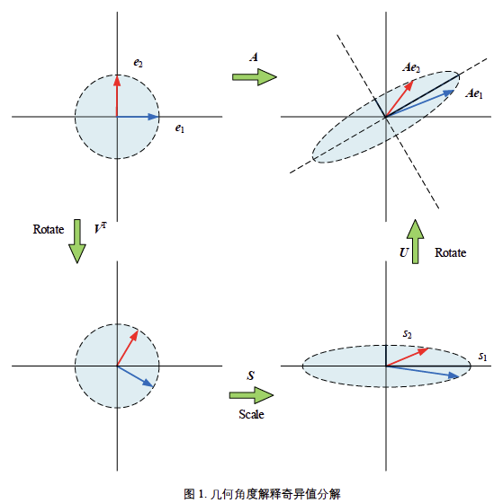

# 向量与矩阵运算

## *向量运算*

### 向量长度：模/ $L^2$ 范数

* 模：$\Vert\boldsymbol{a}\Vert=\Vert\boldsymbol{a}\Vert_2=\sqrt{\boldsymbol{a}\cdot\boldsymbol{a}}=\sqrt{\boldsymbol{a}^T\boldsymbol{a}}=\left(\sum\limits_{i=1}^{n}{a_i^2}\right)^{1/2}$
* 单位向量：$\hat{\boldsymbol{a}}=\frac{\boldsymbol{a}}{\Vert\boldsymbol{a}\Vert}$
* 两点距离 $\Vert\boldsymbol{a}-\boldsymbol{b}\Vert_2$

### 内积/点乘 Inner prodcut/Dot product

* 定义：$a\cdot b=\langle a,b\rangle=\sum\limits_{i=1}^{n}{a_ib_i}$
* 几何视角：余弦定理和投影 $a\cdot b=\Vert a\Vert\Vert b\Vert\cos{\theta}$ 

* Cauthy-Schwarz不等式 $(a\cdot b)^2\leq\Vert a\Vert^2\Vert b\Vert^2\leftrightarrow\left(\sum\limits_{i=1}^{n}{a_ib_i}\right)^{2}\leq\left(\sum\limits_{i=1}^{n}{a_i^2}\right)\left(\sum\limits_{i=1}^{n}{b_i^2}\right)\in\R^n$
* 向量夹角：反余弦 $\theta=\arccos{\left(\frac{a\cdot b}{\Vert a\Vert\Vert b\Vert}\right)}$

### 外积/叉乘 Cross product

* $\Vert\boldsymbol{a}\times\boldsymbol{b}\Vert=\Vert\boldsymbol{a}\Vert\Vert\boldsymbol{b}\Vert\sin{\theta}$
* $\boldsymbol{a}\times\boldsymbol{b}=\left|\begin{matrix}i&j&k\\a_1&a_2&a_3\\b_1&b_2&b_3\\\end{matrix}\right|=\left|\begin{matrix}0&-a_3&a_2\\a_3&0&a_3\\-a_2&a_1&0\\\end{matrix}\right|\cdot\boldsymbol{b}=\boldsymbol{a}^\wedge\boldsymbol{b}$，其中 $a^\wedge$ 为 anti-symmetrix matrix
* 方向遵从右手定则：即顺着 $x\rightarrow y\rightarrow z\rightarrow x$ 方向为正，即 $\vec{i}\times \vec{j}=\vec{k}$ 和 $\vec{j}\times\vec{i}=-\vec{k}$
* 两矢量a、b互相平行的充分必要条件是，它们的矢量积等于零矢量，即 $\vec{a}\parallel\vec{b}\Leftrightarrow\vec{a}\times\vec{b}=0$，因此有自己和自己叉乘为0
* 几何意义：由a、b为邻边构成的平行四边形的面积

### 矢量的混合积与二重矢积

* 三矢量的混合积
  * 表达式 $\vec{a}\cdot\left(\vec{b}\times\vec{c}\right)=\left|\begin{matrix}a_1&a_2&a_3\\b_1&b_2&b_3\\c_1&c_2&c_3\\\end{matrix}\right|$
  * 三矢量a、b、c共面的充分必要条件是它们的混合积 $\vec{a}\cdot\left(\vec{b}\times\vec{c}\right)=\left|\begin{matrix}a_1&a_2&a_3\\b_1&b_2&b_3\\c_1&c_2&c_3\\\end{matrix}\right|=0$
  * 性质
    * 几何意义：若混合积不为零，则其为平行六面体的体积
    * 顺次轮换混合积中三个矢量，所得混合积不变
    * 任意对调混合积中两矢量的位置所得混合积的绝对值不变，但符号相反
* 三矢量的二重矢积

### 逐项积 Piecewise product/阿达玛乘积 Hadamard product

$\left\{\begin{array}{c}\boldsymbol{a}=[a_1,a_2,\dots,a_n]^T\\\boldsymbol{b}=[b_1,b_2,\dots,b_n]^T\end{array}\right.\longrightarrow\boldsymbol{a}\odot\boldsymbol{b}=[a_1b_1,a_2b_2,\dots,a_nb_n]^T$

### 向量张量积 Tensor product 与分块矩阵克罗内克积 Kronecker product

* 向量张量积的性质
  * 设列向量 $\boldsymbol{a},\boldsymbol{b}$：$\boldsymbol{a}\otimes\boldsymbol{a}=\boldsymbol{a}\boldsymbol{a}^T,\ \boldsymbol{a}\otimes\boldsymbol{b}=\boldsymbol{a}\boldsymbol{b}^T$ 注意 $\boldsymbol{a}\boldsymbol{a}^T$ 是进行扩张，而 $\boldsymbol{a}^T\boldsymbol{a}$ 只是一个数
  * $(a\otimes a)^T=a\otimes a$
  * $(a+b)\otimes v=a\otimes v+b\otimes v$
  * $t(a\otimes b)=(ta)\otimes b=a\otimes(tb)$
  * $(a\otimes b)\otimes v=a\otimes(b\otimes v)$
  
* 分块矩阵 Kronecker product
  $$
  \boldsymbol{A}_{m\times n}\otimes\boldsymbol{B}_{n\times D}=\left[\begin{matrix}a_{11}\boldsymbol{B}&\dots&a_{1n}\boldsymbol{B}\\\vdots&\vdots&\vdots\\a_{m1}\boldsymbol{B}&\dots&a_{mn}\boldsymbol{B}\end{matrix}\right]_{mn\times nD}
  $$
  
* 列向量和自身的张量积是对陈矩阵，向量的张量积矩阵的秩为1

## *全1列向量 $\boldsymbol{1}$*

### 每列元素求和

$$
\boldsymbol{1}_{n\times1}^T\boldsymbol{X}=\left[\begin{matrix}1&1&\cdots&1\end{matrix}\right]\left[\begin{matrix}x_{1,1}&x_{1,2}&\cdots&x_{1,D}\\x_{2,1}&x_{2,2}&\cdots&x_{2,D}\\\vdots&\vdots&\ddots&\vdots\\x_{n,1}&x_{n,2}&\cdots&x_{n,D}\end{matrix}\right]=\left[\begin{matrix}\sum\limits_{i=1}^{n}{x_{i,1}}&\sum\limits_{i=1}^{n}{x_{i,2}}&\cdots&\sum\limits_{i=1}^{n}{x_{i,D}}\end{matrix}\right]_{1\times D}
$$

将上式左右都除以数据数 $n$，可以得到数据质心 Centroid
$$
E(\boldsymbol{X})=\frac{\boldsymbol{1}^T\boldsymbol{X}}{n}=\left[\begin{matrix}\frac{\sum\limits_{i=1}^{n}{x_{i,1}}}{n}&\frac{\sum\limits_{i=1}^{n}{x_{i,2}}}{n}&\cdots&\frac{\sum\limits_{i=1}^{n}{x_{i,D}}}{n}\end{matrix}\right]=\left[\begin{matrix}\mu_1&\mu_2&\cdots&\mu_D\end{matrix}\right]
$$
注意：$E(\boldsymbol{X})$ 和 $\boldsymbol{\mu_X}$ 都可以用来表达质心，但 $E(\boldsymbol{X})$ 为行向量，经常配合原始数据矩阵 $\boldsymbol{X}$ 一块出现，比如利用广播原则去均值；而 $\boldsymbol{\mu_X}$ 为列向量，它是 $E(\boldsymbol{X})$ 的转置，它常用在分布相关计算中，如多元高斯分布

### 去均值

全1列向量具有复制的功能，很多应用场合需要将 $E(\boldsymbol{X})$ 复制n份，得到一个和原始数据矩阵 $\boldsymbol{X}$ 形状相同的矩阵，下式可以完成这个运算
$$
\boldsymbol{1}_{n\times1}E(\boldsymbol{X})_{1\times D}=\frac{\boldsymbol{1}\boldsymbol{1}^T\boldsymbol{X}}{n}=\frac{\boldsymbol{1}\otimes\boldsymbol{1}\boldsymbol{X}}{n}=\left[\begin{matrix}\mu_1&\mu_2&\cdots&\mu_D\\\mu_1&\mu_2&\cdots&\mu_D\\\vdots&\vdots&\ddots&\vdots\\\mu_1&\mu_2&\cdots&\mu_D\end{matrix}\right]_{n\times D}
$$
对 $\boldsymbol{X}$ 去均值 demean/centralize 就是 $\boldsymbol{X}$ 的每个元素减去 $\boldsymbol{X}$ 对应列方向数据均值，得到去均值矩阵 $\boldsymbol{X}_c$
$$
\boldsymbol{X}_c=\boldsymbol{X}-\frac{\boldsymbol{1}\boldsymbol{1}^T\boldsymbol{X}}{n}=\left[\begin{matrix}x_{1,1}-\mu_1&x_{1,2}-\mu_2&\cdots&x_{1,D}-\mu_D\\x_{2,1}-\mu_1&x_{2,2}-\mu_2&\cdots&x_{2,D}-\mu_D\\\vdots&\vdots&\ddots&\vdots\\x_{n,1}-\mu_1&x_{n,2}-\mu_2&\cdots&x_{n,D}-\mu_D\end{matrix}\right]\\=\boldsymbol{I}\boldsymbol{X}-\frac{\boldsymbol{1}\boldsymbol{1}^T\boldsymbol{X}}{n}=\left(\boldsymbol{I}-\frac{\boldsymbol{1}\boldsymbol{1}^T}{n}\right)\boldsymbol{X}
$$

### 每行元素求和

$$
\boldsymbol{X}_{n\times D}\boldsymbol{1}_{D\times1}=\left[\begin{matrix}x_{1,1}&x_{1,2}&\cdots&x_{1,D}\\x_{2,1}&x_{2,2}&\cdots&x_{2,D}\\\vdots&\vdots&\ddots&\vdots\\x_{n,1}&x_{n,2}&\cdots&x_{n,D}\end{matrix}\right]\left[\begin{matrix}1\\1\\\vdots\\1\end{matrix}\right]=\left[\begin{matrix}\sum\limits_{j=1}^{n}{x_{1,j}}\\\sum\limits_{j=1}^{n}{x_{2,j}}\\\vdots\\\sum\limits_{j=1}^{n}{x_{n,j}}\end{matrix}\right]_{n\times1}
$$

### 所有元素的和

数据矩阵 $\boldsymbol{X}$ 分别左乘 $\boldsymbol{1}^T$、右乘 $\boldsymbol{1}$ 向量，结果为 $\boldsymbol{X}$ 所有元素求和
$$
\boldsymbol{1}_{n\times1}^T\boldsymbol{X}_{n\times D}\boldsymbol{1}_{D\times1}=\left[\begin{matrix}\sum\limits_{i=1}^{n}{x_{i,1}}&\sum\limits_{i=1}^{n}{x_{i,2}}&\cdots&\sum\limits_{i=1}^{n}{x_{i,D}}\end{matrix}\right]_{1\times D}\boldsymbol{1}_{D\times1}=\sum_{j=1}^{D}{\sum\limits_{i=1}^{n}{x_{i,j}}}
$$

## *矩阵运算*

### 矩阵乘法的不同视角

* 行乘列/标量积展开
* 列乘行/外积展开：矩阵的乘法变成若干矩阵的叠加

### Numpy 的 Broadcasting 规则

### 转置 Transpose

* 若 $A=A^T$，则 $A$ 为对陈矩阵
* $(A+B)^T=A^T+B^T$
* $(kA)^T=kA^T$
* $(AB)^T=B^TA^T$
* $(A_1A_2A_3\dots A_k)^T=A_k^T\dots A_3^TA_2^TA_1^T$

### 迹 Trace

* 迹运算是针对方阵而言的，非方阵没有迹
* 迹是A的主对角线元素之和：$tr(A)=\sum\limits_{i=1}^{n}{a_{i,i}}=a_{1,1}+a_{2,2}+\dots+a_{n,n}$
* 迹的常用性质
  * $tr(A+B)=tr(A)+tr(B)$
  * $tr(kA)=k\cdot A$
  * $tr(A^T)=tr(A)$
  * $tr(AB)=tr(BA)$
* ==在计算二维矩阵的特征值时，可利用迹和行列式==：$\left\{\begin{array}{l}trace=\lambda_1+\lambda_2\\\det=\lambda_1\cdot\lambda_2\end{array}\right.$

## *长方阵的重要矩阵乘法：Gram矩阵*

### 定义

* 设一个矩阵 $X_{n\times D}=\left[\begin{matrix}x_{1,1}&x_{1,2}&\cdots&x_{1,D}\\x_{2,1}&x_{2,2}&\cdots&x_{2,D}\\\vdots&\vdots&\ddots&\vdots\\x_{n,1}&x_{n,2}&\cdots&x_{n,D}\end{matrix}\right]=\left[\begin{matrix}\boldsymbol{x_1}&\boldsymbol{x_2}&\cdots&\boldsymbol{x_D}\end{matrix}\right]=\left[\begin{matrix}\boldsymbol{x^{(1)}}\\\boldsymbol{x^{(2)}}\\\vdots\\\boldsymbol{x^{(n)}}\end{matrix}\right]$

* Gram matrix 格拉姆矩阵  Power of matrix Ch.05
  $$
  \boldsymbol{G}=\boldsymbol{X}^T\boldsymbol{X}=\\\left[\begin{matrix}\boldsymbol{x_1}\cdot\boldsymbol{x_1}&\boldsymbol{x_1}\cdot \boldsymbol{x_2}&\cdots&\boldsymbol{x_1}\cdot\boldsymbol{x_D}\\\boldsymbol{x_2}\cdot\boldsymbol{x_1}&\boldsymbol{x_2}\cdot \boldsymbol{x_2}&\cdots&\boldsymbol{x_2}\cdot\boldsymbol{x_D}\\\vdots&\vdots&\ddots&\vdots\\\boldsymbol{x_D}\cdot\boldsymbol{x_1}&\boldsymbol{x_D}\cdot\boldsymbol{x_2}&\cdots&\boldsymbol{x_D}\cdot\boldsymbol{x_D}\end{matrix}\right]=\left[\begin{matrix}\langle\boldsymbol{x_1},\boldsymbol{x_1}\rangle&\langle\boldsymbol{x_1},\boldsymbol{x_2}\rangle&\cdots&\langle\boldsymbol{x_1},\boldsymbol{x_D}\rangle\\\langle\boldsymbol{x_2},\boldsymbol{x_1}\rangle&\langle\boldsymbol{x_2},\boldsymbol{x_2}\rangle&\cdots&\langle\boldsymbol{x_2},\boldsymbol{x_D}\rangle\\\vdots&\vdots&\ddots&\vdots\\\langle\boldsymbol{x_D},\boldsymbol{x_1}\rangle&\langle\boldsymbol{x_D},\boldsymbol{x_2}\rangle&\cdots&\langle\boldsymbol{x_D},\boldsymbol{x_D}\rangle\end{matrix}\right]\\=\left[\begin{matrix}\lVert\boldsymbol{x_1}\rVert\lVert\boldsymbol{x_1}\rVert\cos{\theta_{1,1}}&\lVert\boldsymbol{x_1}\rVert\lVert\boldsymbol{x_2}\rVert\cos{\theta_{2,1}}&\cdots&\lVert\boldsymbol{x_1}\rVert\lVert\boldsymbol{x_D}\rVert\cos{\theta_{1,D}}\\\lVert\boldsymbol{x_2}\rVert\lVert\boldsymbol{x_1}\rVert\cos{\theta_{1,2}}&\lVert\boldsymbol{x_2}\rVert\lVert\boldsymbol{x_2}\rVert\cos{\theta_{2,2}}&\cdots&\lVert\boldsymbol{x_2}\rVert\lVert\boldsymbol{x_D}\rVert\cos{\theta_{2,D}}\\\vdots&\vdots&\ddots&\vdots\\\lVert\boldsymbol{x_D}\rVert\lVert\boldsymbol{x_1}\rVert\cos{\theta_{1,D}}&\lVert\boldsymbol{x_D}\rVert\lVert\boldsymbol{x_2}\rVert\cos{\theta_{2,D}}&\cdots&\lVert\boldsymbol{x_D}\rVert\lVert\boldsymbol{x_D}\rVert\cos{\theta_{D,D}}\end{matrix}\right]\label{Gram}
  $$
  
  
  * 元素对应关系为：$(X^TX)_{i,j}=x_i^Tx_j$
  
  * 当 $i=j$ 时，$x_i^Tx_i$ 对应的就是 $G$ 的对角线元素
  
  * 利用第二种矩阵乘法的思想，也可以写成行向量的张量和
    $$
    G=X^TX=\left[\begin{matrix}x^{(1)T}&x^{(2)T}&\cdots&x^{(D)T}\end{matrix}\right]\left[\begin{matrix}x^{(1)}\\x^{(2)}\\\vdots\\x^{(n)}\end{matrix}\right]=\sum\limits_{i=1}^{n}{x^{(i)T}x^{(i)}}=\sum\limits_{i=1}^{n}{x^{(i)}\otimes x^{(i)}}
    $$
    
  

### Gram matrix的重要性

* 根据 $\eqref{Gram}$  Gram matrix**保存了向量长度和相对夹角（方向）两部分重要信息**
* $\boldsymbol{G}$ 是一个**对称矩阵** $\boldsymbol{G}^T=(\boldsymbol{X}^T\boldsymbol{X})^T=\boldsymbol{X}^T\boldsymbol{X}=\boldsymbol{G}$

* $\boldsymbol{X}^T$ 的 Gram matrix $\boldsymbol{H}=\boldsymbol{X}\boldsymbol{X}^T$

* ==原矩阵的元素平方和等于其Gram矩阵的迹==：可用于计算矩阵的 $F$-范数等
  $$
  trace(X^TX)=trace(XX^T)\\trace\left[\begin{matrix}\boldsymbol{x_1}\cdot\boldsymbol{x_1}&\boldsymbol{x_1}\cdot\boldsymbol{x_2}&\cdots&\boldsymbol{x_1}\cdot\boldsymbol{x_D}\\\boldsymbol{x_2}\cdot\boldsymbol{x_1}&\boldsymbol{x_2}\cdot\boldsymbol{x_2}&\cdots&\boldsymbol{x_2}\cdot\boldsymbol{x_D}\\\vdots&\vdots&\ddots&\vdots\\\boldsymbol{x_D}\cdot\boldsymbol{x_1}&\boldsymbol{x_D}\cdot\boldsymbol{x_2}&\cdots&\boldsymbol{x_D}\cdot\boldsymbol{x_D}\end{matrix}\right]=\boldsymbol{x_1}\cdot\boldsymbol{x_1}+\boldsymbol{x_2}\cdot\boldsymbol{x_2}+\cdots+\boldsymbol{x_D}\cdots\boldsymbol{x_D}\\\sum\limits_{i=1}^{n}{x_{i,1}^2}+\sum\limits_{i=1}^{n}{x_{i,2}^2}+\cdots+\sum\limits_{i=1}^{n}{x_{i,D}^2}=\sum\limits_{j=1}^{D}{\sum\limits_{i=1}^{n}{x_{i,j}^2}}
  $$

### 从格拉姆矩阵到相似度矩阵

定义一个缩放矩阵
$$
\boldsymbol{S}=\left[\begin{matrix}\lVert\boldsymbol{x_1}\rVert&&&\\&\lVert\boldsymbol{x_2}\rVert&&\\&&\ddots&\\&&&\lVert\boldsymbol{x_D}\rVert\end{matrix}\right]
$$
对 $\boldsymbol{G}$ 左右分别乘上 $\boldsymbol{S}^{-1}$
$$
\boldsymbol{C}=\boldsymbol{S}^{-1}\boldsymbol{G}\boldsymbol{S}^{-1}=\\\left[\begin{matrix}\frac{\boldsymbol{x_1}\cdot\boldsymbol{x_1}}{\lVert\boldsymbol{x_1}\rVert\lVert\boldsymbol{x_1}\rVert}&\frac{\boldsymbol{x_1}\cdot\boldsymbol{x_2}}{\lVert\boldsymbol{x_1}\rVert\lVert\boldsymbol{x_2}\rVert}&\cdots&\frac{\boldsymbol{x_1}\cdot\boldsymbol{x_D}}{\lVert\boldsymbol{x_1}\rVert\lVert\boldsymbol{x_D}\rVert}\\\frac{\boldsymbol{x_2}\cdot\boldsymbol{x_1}}{\lVert\boldsymbol{x_2}\rVert\lVert\boldsymbol{x_1}\rVert}&\frac{\boldsymbol{x_2}\cdot\boldsymbol{x_2}}{\lVert\boldsymbol{x_2}\rVert\lVert\boldsymbol{x_2}\rVert}&\cdots&\frac{\boldsymbol{x_2}\cdot\boldsymbol{x_D}}{\lVert\boldsymbol{x_2}\rVert\lVert\boldsymbol{x_D}\rVert}\\\vdots&\vdots&\ddots&\vdots\\\frac{\boldsymbol{x_D}\cdot\boldsymbol{x_1}}{\lVert\boldsymbol{x_D}\rVert\lVert\boldsymbol{x_1}\rVert}&\frac{\boldsymbol{x_D}\cdot\boldsymbol{x_2}}{\lVert\boldsymbol{x_D}\rVert\lVert\boldsymbol{x_2}\rVert}&\cdots&\frac{\boldsymbol{x_D}\cdot\boldsymbol{x_D}}{\lVert\boldsymbol{x_D}\rVert\lVert\boldsymbol{x_D}\rVert}\end{matrix}\right]
$$
矩阵 $\boldsymbol{C}$ 被称为余弦相似度矩阵 Cosine similarity matrix，这是因为 $\boldsymbol{C}$ 的每个元素实际上计算的都是 $\boldsymbol{x}_i$ 和 $\boldsymbol{x}_j$ 的夹角余弦值

###  两个Gram矩阵的特征值

特征值分解的充分条件：实对称矩阵可以直接进行实特征值分解，因此对 $\boldsymbol{G}=\boldsymbol{X}^T\boldsymbol{X}$ 进行特征值分解，假设 $\lambda_G$ 是它的一个特征值
$$
\boldsymbol{G}=\boldsymbol{X}^T\boldsymbol{X}=\boldsymbol{V}\boldsymbol{\Lambda}\boldsymbol{V}^T\xrightarrow{\boldsymbol{v}}\boldsymbol{G}\boldsymbol{v}=\boldsymbol{X}^T\boldsymbol{X}\boldsymbol{v}=\lambda_G\boldsymbol{v}\label{GramEVD}
$$
对 $\boldsymbol{H}=\boldsymbol{X}\boldsymbol{X}^T$ 进行特征值分解
$$
\boldsymbol{H}=\boldsymbol{X}\boldsymbol{X}^T=\boldsymbol{U}\boldsymbol{D}\boldsymbol{U}^T\xrightarrow{\boldsymbol{u}}\boldsymbol{H}\boldsymbol{u}=\boldsymbol{X}\boldsymbol{X}^T\boldsymbol{u}=\lambda_H\boldsymbol{u}
$$
在 $\eqref{GramEVD}$ 左右乘上 $\boldsymbol{X}$，发现和上式的形式完全一样，因此可以得到 $\lambda_G=\lambda_H$，即两个Gram矩阵的非零特征值相等
$$
\underbrace{\boldsymbol{X}\boldsymbol{X}^T}_{\boldsymbol{H}}\underbrace{\boldsymbol{X}\boldsymbol{v}}_{\boldsymbol{u}}=\lambda_G\underbrace{\boldsymbol{X}\boldsymbol{v}}_{\boldsymbol{u}}
$$

## *行列式 Determinant*

行列式的几何意义是面积/体积，当行列式为0时说明矩阵奇异，相当于维度被压缩了

### 重要行列式性质

* $\det{I}=1$
* 基本行变换：每交换一次行会令行列式变号一次，即偶数次换行行列式不变，奇数次换行行列式乘-1
* $\left|\begin{matrix}ta&tb\\c&d\end{matrix}\right|=t\left|\begin{matrix}a&b\\c&d\end{matrix}\right|$，$\left|\begin{matrix}a+a'&b+b'\\c&d\end{matrix}\right|=\left|\begin{matrix}a&b\\c&d\end{matrix}\right|+\left|\begin{matrix}a'&b'\\c&d\end{matrix}\right|$
* 2个相同的行或列都会导致 $\det=0$
* 基本行变换，从行 $k$ 减去 $l$ 倍行 $i$，$\det$ 不变（消元）
* 全0行则 $\det=0$
* 主元公式
* 当 $A$ 奇异时，$\det{A}=0$，可用来判断是否可逆
* $\det{A\cdot B}=\det{A}\cdot\det{B}$ ，但 $\det{(A+B)}\neq\det{A}+\det{B}$
* $\det{A^T}=\det{A}$

### 代数余子式 Cofactor 求行列式

* $\det{A}=C_{11}a_{11}+C_{12}a_{12}+\dots+C_{1n}a_{1n}$，具体的余子式矩阵 $C$ 如何计算查看 Linear Algebra 笔记34页
* 对于二维矩阵 $A=\left[\begin{matrix}a&b\\c&d\end{matrix}\right]$ 有 $\det{A}=ad-bc$

### 其他常用的行列式运算规则

* $\det{A}=\prod\limits_{j=1}^{D}{\lambda_i}$，这条性质可以从基本行变换不改变行列式值得出，因为可以不断做基本行变换，最后使得矩阵除了对角线外全部为0，此时再将对角线值恢复到原来的数值，但此时的行列式并不会发生变化，从而得到行列式值就是原来对角线元素之积。当然也可以用几何角度来解释，这里不做论述
* $\det{(kA)}=k^D\prod\limits_{j=1}^{D}{\lambda_i}$，同样可以用基本行变换和几何两种角度得出

## *矩阵逆 Inverse*

* 矩阵可逆 invertible 也称非奇异 non-singular
* 若 $A^T=A^{-1}\Rightarrow A^TA=AA^T=I$，则 $A$ 是正交矩阵 orthogonal matrix

### 逆的常用运算规则

若 $A$ 的逆存在，有

* $(A^T)^{-1}=(A^{-1})^T$
* $(AB)^{-1}=B^{-1}A^{-1}$
* $(kA)^{-1}=\frac{1}{k}A^{-1}$
* 一般情况下 $(A+B)^{-1}\neq A^{-1}+B^{-1}$

### 伴随矩阵 Adjugate matrix 求逆

* $A^{-1}=\frac{1}{\det{A}}C^T$，其中 $C^T$ 为伴随矩阵，即 $A$ 中每一个元素的代数余子式所组成的转置矩阵
* 对于二维矩阵有 $A^{-1}=\left[\begin{matrix}a&b\\c&d\end{matrix}\right]^{-1}=\frac{1}{\det{A}}\left[\begin{matrix}d&-b\\-c&a\end{matrix}\right]$

### Cramer's rule 求解线性方程组

* 具体计算过程见 Linear Algebra 笔记36页
* 效率非常低，在实际中几乎没有使用价值

## *数据与统计*

下面的计算将会大量用到全1列向量 $\boldsymbol{1}$，可以参考 LinearAlgebra.md 向量与矩阵运算部分

### 均值：线性代数视角

从样本数据矩阵 $\boldsymbol{X}$ 中取出任意一列列向量 $\boldsymbol{x}_j$，$\boldsymbol{x}_j$ 代表着第 $j$ 特征的所有样本数据构成的列向量

也可以说列向量 $\boldsymbol{x}_j$ 对应随机变量 $X_j$，因为数据的每一个特征就是一个维度的随机变量
$$
\boldsymbol{x}_j=\left[\begin{matrix}x_{1,j}\\x_{2,j}\\\vdots\\x_{n,j}\end{matrix}\right]
$$
通过样本数据估算随机变量 $X_j$ 的期望值（均值）$E(X_j)$
$$
E(X_j)=\mu_j=\frac{x_{1,j}+x_{2,j}+\dots+x_{n,j}}{n}=\frac{1}{n}\sum\limits_{i=1}^{n}{x_{i,j}}
$$
因为 $E(\boldsymbol{x}_j)$ 等价于 $E(X_j)$，所以有 $E(\boldsymbol{x}_j)$ 的线性代数运算如下
$$
E(\boldsymbol{x}_j)=E(X_j)=\mu_j=\frac{\boldsymbol{x}_j^T\boldsymbol{I}_{j\times1}}{n}=\frac{\boldsymbol{I}_{j\times1}^T\boldsymbol{x}_j}{n}=\frac{\boldsymbol{x}_j\cdot\boldsymbol{I}}{n}=\frac{\boldsymbol{I}\cdot\boldsymbol{x}_j}{n}=\frac{1}{n}\sum\limits_{i=1}^{n}{x_{i,j}}
$$
其中 $\boldsymbol{I}_j$ 是和 $\boldsymbol{x}_j$ 列数一样的全1列向量，比如 $\boldsymbol{I}_2=\left[\begin{matrix}1\\1\end{matrix}\right]$ 

### 质心：均值排列成向量

质心 Centroid $\boldsymbol{\mu_X}$ 是数据矩阵 $\boldsymbol{X}$ 的每列特征均值构成的向量

$$
\boldsymbol{\mu_X}=\left[\begin{matrix}\mu_1\\\mu_2\\\vdots\\\mu_D\end{matrix}\right]=\frac{\left(\boldsymbol{1}^T\boldsymbol{X}\right)^T}{n}=\frac{\boldsymbol{X}^T\boldsymbol{1}}{n}
$$

### 中心化

* 中心化、去均值 Centralize or demean
  $$
  \boldsymbol{X}_c=\boldsymbol{X}-\frac{\boldsymbol{1}\boldsymbol{1}^T\boldsymbol{X}}{n}=\underbrace{\left(\boldsymbol{I}-\frac{\boldsymbol{1}\boldsymbol{1}^T}{n}\right)}_{M}\boldsymbol{X}
  $$
  称 $\boldsymbol{M}$ 为中心化矩阵。中心化后，数据 $\boldsymbol{X}_c$ 质点位于原点

  $\boldsymbol{M}$ 是一个幂等矩阵，即满足 $\boldsymbol{M}\boldsymbol{M}=\boldsymbol{M}$

* 标准化：平移+缩放

  在中心化的基础上，进一步对 $\boldsymbol{X}_c$ 进行标准化 Standardization or Z-score normalization

  计算过称为，对原始数据先去均值，然后每一列再除以对应的标准差
  $$
  \boldsymbol{Z_X}=\boldsymbol{X}_c\boldsymbol{S}^{-1}=\left(\boldsymbol{X}-E\left(\boldsymbol{X}\right)\right)\boldsymbol{S}^{-1}\\\boldsymbol{S}=\left[\begin{matrix}\sigma_1\\&\sigma_2\\&&\ddots\\&&&\sigma_D\end{matrix}\right]
  $$
  处理得到的数值实际上是原始数据的z分数，含义是距离均值若干倍的标准差偏移

* 数据惯性 Inertia 可以用来描述样本数据紧密程度

  惯性实际上就是残差平方和 Sum of Squares for Deviations SSD
  $$
  SSG(\boldsymbol{X})\triangleq\sum\limits_{i=1}^{n}{dist\left(\boldsymbol{x}^{(i)},E(\boldsymbol{X})\right)^2}=\sum\limits_{i=1}^{n}{\lVert\boldsymbol{x}^{(i)}-E(\boldsymbol{X})\rVert^2_2}=\sum\limits_{i=1}^{n}{\lVert\boldsymbol{x}^{(i)}-\boldsymbol{\mu_X}\rVert^2_2}
  $$
  SSD相当于样本点和质心 $E(\boldsymbol{X})$ 的欧式距离平方和，可以利用trace来求
  $$
  SSD(\boldsymbol{X})=trace\left(\boldsymbol{X}^T_c\boldsymbol{X}_c\right)=trace\left(\left(\boldsymbol{X}-E(\boldsymbol{X})\right)^T\left(\boldsymbol{X}-E(\boldsymbol{X})\right)\right)
  $$

### 簇质心

$$
\boldsymbol{\mu}_k=\frac{1}{count(C_k)}\sum\limits_{i\in C_k}{\boldsymbol{x}^{(i)T}}
$$

类似 $\boldsymbol{\mu_X}$，任意一类标签为 $C_k$ 样本数据的簇质心 $\boldsymbol{\mu}_k$。对于属于某个标签 $C_k$ 的所有样本数据 $\boldsymbol{x}^{(i)}$，求其各个特征平均值

### 方差的投影角度

对于总体等概率来说，随机变量 $X$ 方差的计算公式为下式，若是样本就应该采用无偏估计。可以利用中心化矩阵 $\boldsymbol{M}$ 及其幂等性质对下式进行改写或者改写成范数形式
$$
Var(X)=\frac{1}{n}\sum\limits_{i=1}^{n}{\left(x_i-E(X)\right)}^2\xRightarrow{\boldsymbol{M}=x_i-E(X)}\\\frac{1}{n}\left(\boldsymbol{M}\boldsymbol{x}\right)^T\boldsymbol{M}\boldsymbol{x}=\boldsymbol{x}^T\boldsymbol{M}^T\boldsymbol{M}\boldsymbol{x}=\boldsymbol{x}^T\boldsymbol{M}\boldsymbol{x}\\=\lVert\boldsymbol{x}-E(\boldsymbol{x})\rVert_2^2
$$
对于数据矩阵 $\boldsymbol{X}$，第j列的方差可以表示为
$$
Var(\boldsymbol{X}_j)=Var(\boldsymbol{x}_j)=\sigma_j^2
$$

均值和方差可以看做是 $\boldsymbol{x}_j$ 向 $\boldsymbol{1}$ 方向的投影和误差

### 协方差和相关性系数

对于样本数据矩阵 $\boldsymbol{X}_{n\times D}$，它的协方差矩阵可以通过下式计算
$$
\boldsymbol{\Sigma}=\frac{\left(\boldsymbol{X}-E(\boldsymbol{X})\right)^T\left(\boldsymbol{X}-E(\boldsymbol{X})\right)}{n-1}=\frac{\boldsymbol{X}_c^T\boldsymbol{X}_c}{n-1}\ (无偏)\ or\ \boldsymbol{\Sigma}=\frac{1}{N}\boldsymbol{X}^T\boldsymbol{X}-\boldsymbol{X}_c^T\boldsymbol{X}_c\ (有偏)=\frac{1}{N}\boldsymbol{X}_c^T\boldsymbol{X}_c
$$
其中 $\boldsymbol{X}_c^T\boldsymbol{X}_c$ 是demean数据的Gram矩阵，根据协方差矩阵定义有
$$
\boldsymbol{X}_c^T\boldsymbol{X}_c=(n-1)\boldsymbol{\Sigma}=(n-1)\left[\begin{matrix}\sigma_1^2&\rho_{1,2}&\cdots&\rho_{1,D}\sigma_1\sigma_D\\\rho_{1,2}\sigma_1\sigma_2&\sigma_2^2&\cdots&\rho_{2,D}\sigma_2\sigma_D\\\vdots&\vdots&\ddots&\vdots
\\\rho_{1,D}\sigma_1\sigma_D&\rho_{2,D}\sigma_2\sigma_D&\cdots&\sigma_D^2\end{matrix}\right]
$$
我们可以把标准差 $\sigma_j$ 看做是一个向量 $\boldsymbol{\sigma}_j$，称其为标准差向量
$$
\boldsymbol{\Sigma}=\left[\begin{matrix}\langle\boldsymbol{\sigma_1},\boldsymbol{\sigma_1}\rangle&\langle\boldsymbol{\sigma_1},\boldsymbol{\sigma_2}\rangle&\cdots&\langle\boldsymbol{\sigma_1},\boldsymbol{\sigma_D}\rangle\\\langle\boldsymbol{\sigma_2},\boldsymbol{\sigma_1}\rangle&\langle\boldsymbol{\sigma_2},\boldsymbol{\sigma_2}\rangle&\cdots&\langle\boldsymbol{\sigma_2},\boldsymbol{\sigma_D}\rangle\\\vdots&\vdots&\ddots&\vdots\\\langle\boldsymbol{\sigma_D},\boldsymbol{\sigma_1}\rangle&\langle\boldsymbol{\sigma_D},\boldsymbol{\sigma_2}\rangle&\cdots&\langle\boldsymbol{\sigma_D},\boldsymbol{\sigma_D}\rangle\end{matrix}\right]\\=\left[\begin{matrix}\lVert\boldsymbol{\sigma_1}\rVert\lVert\boldsymbol{\sigma_1}\rVert\cos{\theta_{1,1}}&\lVert\boldsymbol{\sigma_1}\rVert\lVert\boldsymbol{\sigma_2}\rVert\cos{\theta_{2,1}}&\cdots&\lVert\boldsymbol{\sigma_1}\rVert\lVert\boldsymbol{\sigma_D}\rVert\cos{\theta_{\sigma,D}}\\\lVert\boldsymbol{\sigma_2}\rVert\lVert\boldsymbol{\sigma_1}\rVert\cos{\theta_{1,2}}&\lVert\boldsymbol{\sigma_2}\rVert\lVert\boldsymbol{\sigma_2}\rVert\cos{\theta_{2,2}}&\cdots&\lVert\boldsymbol{\sigma_2}\rVert\lVert\boldsymbol{\sigma_D}\rVert\cos{\theta_{2,D}}\\\vdots&\vdots&\ddots&\vdots\\\lVert\boldsymbol{\sigma_D}\rVert\lVert\boldsymbol{\sigma_1}\rVert\cos{\theta_{1,D}}&\lVert\boldsymbol{\sigma_D}\rVert\lVert\boldsymbol{\sigma_2}\rVert\cos{\theta_{2,D}}&\cdots&\lVert\boldsymbol{\sigma_D}\rVert\lVert\boldsymbol{\sigma_D}\rVert\cos{\theta_{D,D}}\end{matrix}\right]
$$
这和Gram矩阵的展开式形式一模一样，因此标准差向量之间的夹角余弦值就是相关性系数

若两个随机变量线形相关，则对应标准差向量平行；若线性无关，则对应的标准差向量正交

可以单独把相关性系数矩阵 $\boldsymbol{P}$ 提出来
$$
\boldsymbol{P}=\left[\begin{matrix}\frac{\boldsymbol{\sigma_1}\cdot\boldsymbol{\sigma_1}}{\lVert\boldsymbol{\sigma_1}\rVert\lVert\boldsymbol{\sigma_1}\rVert}&\frac{\boldsymbol{\sigma_1}\cdot\boldsymbol{\sigma_2}}{\lVert\boldsymbol{\sigma_1}\rVert\lVert\boldsymbol{\sigma_2}\rVert}&\cdots&\frac{\boldsymbol{\sigma_1}\cdot\boldsymbol{\sigma_D}}{\lVert\boldsymbol{\sigma_1}\rVert\lVert\boldsymbol{\sigma_D}\rVert}\\\frac{\boldsymbol{\sigma_2}\cdot\boldsymbol{\sigma_1}}{\lVert\boldsymbol{\sigma_2}\rVert\lVert\boldsymbol{\sigma_1}\rVert}&\frac{\boldsymbol{\sigma_2}\cdot\boldsymbol{\sigma_2}}{\lVert\boldsymbol{\sigma_2}\rVert\lVert\boldsymbol{\sigma_2}\rVert}&\cdots&\frac{\boldsymbol{\sigma_2}\cdot\boldsymbol{\sigma_D}}{\lVert\boldsymbol{\sigma_2}\rVert\lVert\boldsymbol{\sigma_D}\rVert}\\\vdots&\vdots&\ddots&\vdots\\\frac{\boldsymbol{\sigma_D}\cdot\boldsymbol{\sigma_1}}{\lVert\boldsymbol{\sigma_D}\rVert\lVert\boldsymbol{\sigma_1}\rVert}&\frac{\boldsymbol{\sigma_D}\cdot\boldsymbol{\sigma_2}}{\lVert\boldsymbol{\sigma_D}\rVert\lVert\boldsymbol{\sigma_2}\rVert}&\cdots&\frac{\boldsymbol{\sigma_D}\cdot\boldsymbol{\sigma_D}}{\lVert\boldsymbol{\sigma_D}\rVert\lVert\boldsymbol{\sigma_D}\rVert}\end{matrix}\right]=\left[\begin{matrix}1&\cos{\phi_{2,1}}&\cdots&\cos{\phi_{1,D}}\\\cos{\phi_{1,2}}&1&\cdots&\cos{\phi_{2,D}}\\\vdots&\vdots&\ddots&\vdots\\\cos{\phi_{1,D}}&\cos{\phi_{2,D}}&\cdots&1\end{matrix}\right]
$$

# 向量空间/线性空间

## *线性空间相关概念*

### 线性空间

* 线性空间的定义

  * 线性空间 Lienar space 和向量空间 Vector space/Vektorraum 是一样的
  * 简单的说就是**对加法和标量乘法封闭**

* 线性组合 Linear combination

  * 令 $\boldsymbol{v_1},\boldsymbol{v_2},\dots,\boldsymbol{v_D}$ 为向量空间 $V$ 中的向量和实数集合 $\alpha_1,\alpha_2,\dots,\alpha_D$ ，则称 $\alpha_1\boldsymbol{v_1}+\alpha_2\boldsymbol{v_2}+\cdots+\alpha_D\boldsymbol{v_D}$ 为一个线性空间 $V$ 中的线性组合
  * 张成 span：$\boldsymbol{v_1},\boldsymbol{v_2},\dots,\boldsymbol{v_D}$ 的所有线性组合的集合称为 $\boldsymbol{v_1},\boldsymbol{v_2},\dots,\boldsymbol{v_D}$ 的张成，当 $\boldsymbol{v_1},\boldsymbol{v_2},\dots,\boldsymbol{v_D}$ 线性无关时其张成的空间就是整个线性空间 $V$

* 线性相关与线性无关 Independence

  * 给定向量组 $V=[\boldsymbol{v_1},\boldsymbol{v_2},\dots,\boldsymbol{v_D}]$，若存在不全为0的实数集合 $\alpha_1,\alpha_2,\dots,\alpha_D$ 使得 $\alpha_1v_1+\alpha_2v_2+\cdots+\alpha_Dv_D=0$ 成立，则称向量组 $V$ 线性相关 ，否则为线性无关或线形独立

  * 列秩 column rank 是X的线性无关的列向量数量最大值，同理行秩，列秩=行秩

  * 将线形组合中的自由向量，即线性相关的冗余向量剔除后得到的剩余线性组合称为极大线形无关组 Maximal linearly independent subset

  * 方阵只有满秩时才可逆

  * 对于实矩阵 $X$ 有，$rank(X^TX)=rank(XX^T)=rank(X)=rank(X^T)$

### 基底

* 基底、基底向量  Basis and basis vector
  * 线性空间 $V$ 中线形独立的 $\boldsymbol{v_1},\boldsymbol{v_2},\dots,\boldsymbol{v_D}$ 称为基底向量，他们张成 $V$
  * $V$ 中的所有向量都可以表示称基向量 $\boldsymbol{v_1},\boldsymbol{v_2},\dots,\boldsymbol{v_D}$ 的线性组合
  * $[\boldsymbol{e_1},\boldsymbol{e_2}]$ 为有序基，其按顺序排列，可以构造得到 $E$，$\left\{\boldsymbol{e_1},\boldsymbol{e_2}\right\}$ 为基底集合
  * 基底选择不唯一，但一般都会选择以由正交的单位向量基底组成的标准正交基 standard orthonormal basis $[\boldsymbol{e_1},\boldsymbol{e_2}]$ 作为参考系
* 维数 Dimension：基底中基底向量的个数

### 基变换

* 基变换可视化

  

* 设一个向量 $x$ 用标准正交基来表达是 $x=[e_1,e_2]\left[\begin{matrix}x_1\\x_2\end{matrix}\right]=Ex$

* $x$ 用新的正交基 $[v_1,v_2]$ 来表示是 $(z_1,z_2)$，$x$ 可以写成 $v_1,v_2$ 的线性组合 $x=z_1v_1+z_2v_2=[v_1,v_2]\left[\begin{matrix}z_1\\z_2\end{matrix}\right]=Vz$

* 那么 $x$  用正交基 $V$ 来表示就是 $z=V^{-1}x$

* 若有第三个基底 $W$ 和用它的表示 $y$，就可以直接在 $z$ 和 $y$ 之间转换，即 $Wy=Vz=x\rightarrow y=W^{-1}Vz$

* 之所以选标准正交基作基地的原因就是其直观性，其他的基地组合很容易可以看做对标准正交基的空间变换

## *求解线性方程*

### 线性方程组

$$
\boldsymbol{A}\boldsymbol{x}=\boldsymbol{b}\Longleftrightarrow\left\{\begin{matrix}a_{1,1}x_1+a_{1,2}x_2+\cdots+a_{1,D}x_D=b_1\\a_{2,1}x_1+a_{2,2}x_2+\cdots+a_{2,D}x_D=b_2\\\vdots\\a_{n,1}x_1+a_{n,2}x_2+\cdots+a_{n,D}x_D=b_n\end{matrix}\right.\Longleftrightarrow\left[\begin{matrix}a_{1,1}&a_{1,2}&\cdots&a_{1,D}\\a_{2,1}&a_{2,2}&\cdots&a_{2,D}\\\vdots&\vdots&\ddots&\vdots\\a_{n,1}&a_{n,2}&\cdots&a_{n,D}\end{matrix}\right]\left[\begin{matrix}x_1\\x_2\\\vdots\\x_n\end{matrix}\right]=\left[\begin{matrix}b_1\\b_2\\\vdots\\b_n\end{matrix}\right]
$$

中间称为线性方程组 System of linear equations

* 有无穷多解的方程组称为欠定方程组 Unterdetermined system
* 解不存在的方程组称为超定方程组 Overdetermined system

若 $\boldsymbol{A}\boldsymbol{x}=\boldsymbol{b}$ 有唯一解，则矩阵 $\boldsymbol{A}$ 可以逆，即
$$
\boldsymbol{A}\boldsymbol{x}=\boldsymbol{b}\Rightarrow\boldsymbol{x}=\boldsymbol{A}^{-1}\boldsymbol{b}
$$
特别地，若 $\boldsymbol{A}^T\boldsymbol{A}$ 可逆，$\boldsymbol{x}$ 可以通过伪逆 Psudo-inverse $\left(\boldsymbol{A}^T\boldsymbol{A}\right)^{-1}\boldsymbol{A}^T$ 求解
$$
\boldsymbol{A}\boldsymbol{x}=\boldsymbol{b}\Rightarrow\boldsymbol{A}^T\boldsymbol{A}\boldsymbol{x}=\boldsymbol{A}^T\boldsymbol{b}\Rightarrow\boldsymbol{x}=\underbrace{(\boldsymbol{A}^T\boldsymbol{A})^{-1}\boldsymbol{A}^T}_{\boldsymbol{A}^{\dagger}}\boldsymbol{b}
$$

### 求解 $\boldsymbol{A}\boldsymbol{x}=\boldsymbol{0}$

求解 $\boldsymbol{A}\boldsymbol{x}=\boldsymbol{0}$ 的流程

1. 先消元，化为 $\boldsymbol{R}$ reduced row echlon form 简化行阶梯形式，确定主列和自由列
2. 得到 $r$ 个主变量 Pivot variables 和 $n-r$ 个自由变量 Free variables
3. 对自由变量分配数值（一般为1或者0），得到 $n-r$ 个解向量

### 求解 $\boldsymbol{A}\boldsymbol{x}=\boldsymbol{b}$

$\boldsymbol{b}$ 的可解性：$\boldsymbol{b}$ 在 $\boldsymbol{A}$ 的列空间中，即 $\boldsymbol{b}$ 是列向量的线性组合

完整解由特解+通解（基础解系）组成

## *四个基本子空间*

子空间是指矩阵空间的基向量可以张成的向量空间

### 行向量空间 $\R^{m}$：行空间与零空间

由 $\boldsymbol{X}$ 的行向量 $\boldsymbol{x}^{(1)},\boldsymbol{x}^{(2)},\dots,\boldsymbol{x}^{(j)},\dots,\boldsymbol{x}^{(m)}$ 所张成的子空间称为 $\boldsymbol{X}$ 的行空间 Row space，记作 $Row(\boldsymbol{X})$ 或 $R(\boldsymbol{X})$

和 $R(\boldsymbol{X})$ 相对应的是零空间 Null space，记作 $Null(\boldsymbol{X})$。**从矩阵乘法行列相乘的方式就可以知道，行空间和列空间必然是互补的，行空间大一点，零空间就小，反之亦然**

$R(\boldsymbol{X})$ 和 $Null(\boldsymbol{X})$ 分别都是 $\R^n$ 的子空间，两者维度之和为n，或者说行空间和零空间的秩相加为n，只有 $\boldsymbol{X}$ 非满秩的时候，零空间才不为0

且两者互为正交补 Orthogonal complement，即
$$
dim\left(R(\boldsymbol{X})\right)+dim(Null(\boldsymbol{X}))=m\\R(\boldsymbol{X})^{\perp}=Null(\boldsymbol{X})
$$

### 列向量空间 $\R^n$：列空间与左零空间

由 $\boldsymbol{X}$ 的列向量 $\boldsymbol{x}_1,\boldsymbol{x}_2,\dots x_j,\dots,x_n$ 所张成的子空间称为 $\boldsymbol{X}$ 的列空间 Column space，记作 $Col(\boldsymbol{X})$ 或 $C(\boldsymbol{X})$

和 $C(\boldsymbol{X})$ 相对应的是左零空间 Left-Null space，记作 $Null(\boldsymbol{X}^T)$。左零空间指的是**矩阵转置后，其列向量变成了行向量**，转置矩阵构成的线性方程组 $\boldsymbol{A}^T\boldsymbol{x}=\boldsymbol{0}$ 的解空间

$C(\boldsymbol{X})$ 和 $Null(\boldsymbol{X}^T)$ 分别都是 $\R^m$ 的子空间，两者维度之和为m，或者说列空间和左零空间的秩相加为m

且两者互为正交补 Orthogonal complement，即
$$
dim\left(C(\boldsymbol{X})\right)+dim(Null(\boldsymbol{X}^T))=m\\C(\boldsymbol{X})^{\perp}=Null(\boldsymbol{X}^T)
$$
### SVD：数据矩阵 $\boldsymbol{X}$ 向子空间做投影的最大努力

$$
\boldsymbol{X}=\boldsymbol{U}\boldsymbol{S}\boldsymbol{V}^T\Rightarrow\boldsymbol{X}\boldsymbol{V}=\boldsymbol{U}\boldsymbol{S}\\\boldsymbol{X}^T=\boldsymbol{V}\boldsymbol{S}\boldsymbol{U}^T\Rightarrow\boldsymbol{X}^T\boldsymbol{U}=\boldsymbol{V}\boldsymbol{S}
$$

改写SVD，可以看到分别是数据矩阵 $\boldsymbol{X}$ 往行正交空间和列正交空间中进行空间转换

SVD尽全力去行空间和列空间找基底来进行空间转换，但因为零空间和左零空间的存在，它不能进行完全地转换，必定有一部分要被投影/降维到零空间中去。若此时是满秩方阵，那么SVD就等价于EVD，可以进行完美的空间变换

即行向量空间 $\R^m$ 由行空间和零空间组成，列向量空间 $\R^n$ 由列空间和左零空间组成（特别是当非方阵非满秩的矩阵一定存在某个零空间），它对行空间或列空间的空间变换必定要进入零空间，因此SVD是数据矩阵 $\boldsymbol{X}$ 向 $\R^n$ 和 $\R^m$ 空间做空间变换的最大努力，有一部分注定要被投影降维

获得四个基本子空间最便捷的方法就是SVD

## *几何变换*

### 区分线形映射和线形变换

平移不是线形变换，而是仿射变换

线形变换可以看做是一种特殊的仿射变换

### 常见平面几何变换

平面几何变换和三维几何变换的定义不太相同，具体看CV2

具体细节和过程不给出，查看Power of Matrix Ch.08

* 平移 Translation
* 等比例缩放 Scaling：所有值相等的对角矩阵
* 非等比例缩放 Unequal scaling：值不相等的对角矩阵
* 挤压 Squeeze
* 旋转 Rotation
  * $\det{R}=1$
  * 二维旋转满足交换律，三维不满足
* 镜像 Reflection：镜像变换矩阵的 $\det{R}=-1$
  * 可以用两种方法得出镜像变换矩阵 $T$，虽然结果看似不同，但实际上完全相同
  * 令切向量为 $\left[\begin{matrix}\tau_1&\tau_2\end{matrix}\right]^T$，则 $T=\frac{1}{\Vert\tau\Vert^2}\left[\begin{matrix}\tau_1^2-\tau_2^2&2\tau_1\tau_2\\2\tau_1\tau_2&\tau_2^2-\tau_1^2\end{matrix}\right],\ \det{T}=-1$
  * 令切向量为 $\left[\begin{matrix}\cos{\theta}&\sin{\theta}\end{matrix}\right]^T$，则 $T=\left[\begin{matrix}\cos{2\theta}&\sin{2\theta}\\\sin{2\theta}&-\cos{2\theta}\end{matrix}\right]$。该推导将在投影章节推导 Householder transformation 时给出
* 投影 Projection
  * $x$ 往切向量 $\tau$ 上的投影为 $\left[\begin{matrix}z_1\\z_2\end{matrix}\right]=\underbrace{\frac{1}{\Vert\tau\Vert^2}\left[\begin{matrix}\tau_1^2&\tau_1\tau_2\\\tau_1\tau_2&\tau_2^2\end{matrix}\right]}_{P}\left[\begin{matrix}x_1\\x_2\end{matrix}\right]$，通过投影公式可以证明，位于Ch.09 公式21
  * 利用张量积可以简化为 $z=(\hat{\tau}\otimes\hat{\tau})_{2\times 2}\cdot x$
* 剪切 Shear：上下三角阵

# 投影 Projection

## *正交投影 Orthogonal Projection*

### 标量投影与向量投影

* 标量投影 Scalar projection
  * 标量 $s$ 为 向量 $\boldsymbol{z}$ 的模，$\boldsymbol{v}$ 为 $\boldsymbol{z}$ 方向的一个向量（不是单位向量，所以后面要把模给除掉），因此有 $\boldsymbol{z}=s\frac{\boldsymbol{v}}{\Vert \boldsymbol{v}\Vert}$
  * 正交投影，所以 $\boldsymbol{x}-\boldsymbol{z}\perp\boldsymbol{v}$，即 $(\boldsymbol{x}-\boldsymbol{z})\cdot\boldsymbol{v}=0\leftrightarrow(\boldsymbol{x}-\boldsymbol{z})^T\boldsymbol{v}=0$
  * 将 $\boldsymbol{z}$ 代入上式得 $\left(\boldsymbol{x}-s\frac{\boldsymbol{v}}{\Vert\boldsymbol{v}\Vert}\right)^T\boldsymbol{v}=0$
  * $\boldsymbol{x}^T\boldsymbol{v}-\frac{s}{\Vert\boldsymbol{v}\Vert}\boldsymbol{v}^T\boldsymbol{v}=0\rightarrow s=\frac{\boldsymbol{x}^T\boldsymbol{v}}{\Vert\boldsymbol{v}\Vert}$
* 向量投影 Vector projection
  * $\Large proj_v(\boldsymbol{x})=s\frac{\boldsymbol{v}}{\Vert\boldsymbol{v}\Vert}={\color{red}\frac{\boldsymbol{v}^T\boldsymbol{x}}{\boldsymbol{v}^T\boldsymbol{v}}\boldsymbol{v}}=\frac{\langle\boldsymbol{x},\boldsymbol{v}\rangle}{\langle\boldsymbol{v},\boldsymbol{v}\rangle}\boldsymbol{v}$
  * 若 $\boldsymbol{v}$ 是单位向量可以进一步简化为 $proj_v(\boldsymbol{x})=\langle\boldsymbol{x},\boldsymbol{v}\rangle \boldsymbol{v}=(\boldsymbol{v}^T\boldsymbol{x})\boldsymbol{v}$
* 将向量投影改写为张量积
  * $proj_{\boldsymbol{v}}(\boldsymbol{x})=\underbrace{(\boldsymbol{v}^T\boldsymbol{x})}_{scalar}\boldsymbol{v}=\boldsymbol{v}\underbrace{(\boldsymbol{v}^T\boldsymbol{x})}_{scalar}=\boldsymbol{v}\boldsymbol{v}^T\boldsymbol{x}=(\boldsymbol{v}\otimes\boldsymbol{v})_{2\times 2}\cdot x$：把 **$\boldsymbol{v}\otimes\boldsymbol{v}=\boldsymbol{v}\boldsymbol{v}^T$ 称为投影矩阵 projection matrix**
  * 假设 $\boldsymbol{X}$ 为一个数据矩阵，它也可以往 $\boldsymbol{x}$ 方向投影：$\boldsymbol{Z}=\boldsymbol{X}\boldsymbol{v}\boldsymbol{v}^T=\boldsymbol{X}(\boldsymbol{v}\otimes\boldsymbol{v})_{2\times 2}$

### 正交矩阵：一个规范正交基 Orthonormal Basis

向量可以选择向另外的向量方向投影，也可以选择由一个张成的向量空间投影，一般都会选择一个由规范正交基张成的空间投影

* 满足该定义：$V^TV=I$ 的称为正交矩阵 Orthogonal matrix。要注意的是前提 $V$ 必须是一个方阵，否则既是满足该式也不能称为正交矩阵

* 正交矩阵的常用性质

  * $V^TV=VV^T=I$
  * $V^T=V^{-1}$

* 将 $V^TV$ 按矩阵乘法第一视角展开
  $$
  V^TV=\left[\begin{matrix}v_1^T\\v_2^T\\\vdots\\v_D^T\end{matrix}\right]\left[\begin{matrix}v_1&v_2&\cdots&v_D\end{matrix}\right]=\left[\begin{matrix}v_1^Tv_1&v_1^Tv_2&\cdots&v_1^Tv_D\\v_2^Tv_1&v_2^Tv_2&\cdots&v_2^Tv_D\\\vdots&\vdots&\ddots&\vdots\\v_D^Tv_1&v_D^Tv_2&\cdots&v_D^Tv_D\end{matrix}\right]=\left[\begin{matrix}1&0&\cdots&0\\0&1&\cdots&0\\\vdots&\vdots&\ddots&\vdots\\0&0&\cdots&1\end{matrix}\right]
  $$

  * $V^TV$ 的主对角线元素为1：$v_j^Tv_j=1,\ j=1,2,\dots,D$
  * $V^TV$ 除主对角线外为0：$v_i^Tv_j=0,\ i\neq j$

* 将 $VV^T$ 按矩阵乘法第二视角展开
  $$
  VV^T=\left[\begin{matrix}v_1&v_2&\cdots&v_D\end{matrix}\right]\left[\begin{matrix}v_1^T\\v_2^T\\\vdots\\v_D^T\end{matrix}\right]=v_1v_1^T+v_2v_2^T+\cdots+v_Dv_D^T=v_1\otimes v_1+v_2\otimes v_2+\cdots+v_D\otimes v_D=I_{D\times D}\\X_{n\times D}VV^T=X(v_1\otimes v_1+v_2\otimes v_2+\cdots+v_D\otimes v_D)=X_{n\times D}
  $$
  

  相当于是提供了在不同方向的投影矩阵 $I_{D\times D}=\sum\limits_{j=1}^{D}{v_j\otimes v_j}$

### Householder Transformation 初等反射

* 首先从投影角度看反射变换矩阵。求向量 $x$ 关于切向量 $\tau=\left[\begin{matrix}\cos{\theta}&\sin{\theta}\end{matrix}\right]^T$ 的镜像 $z$
  * 将 $\tau$ 代入向量 $x$ 在 $\tau$ 方向的投影为
    $$
    p=(\tau\otimes\tau)x=\left[\begin{matrix}\cos{\theta}\cos{\theta}&\cos{\theta}\sin{\theta}\\\cos{\theta}\sin{\theta}&\sin{\theta}\sin{\theta}\end{matrix}\right]x=\left[\begin{matrix}(\cos{2\theta}+1)/2&\sin{2\theta}/2\\\sin{2\theta}/2&(1-\cos{2\theta})/2\end{matrix}\right]x
    $$
  
  * 得到了反射的变换矩阵 $T$
    $$
    h=p-x,\ z=x+2h\\\longrightarrow z=2p-x=\left[\begin{matrix}(\cos{2\theta}+1)/2&\sin{2\theta}/2\\\sin{2\theta}/2&(1-\cos{2\theta})/2\end{matrix}\right]x-Ix=\underbrace{\left[\begin{matrix}\cos{2\theta}&\sin{2\theta}\\\sin{2\theta}&-\cos{2\theta}\end{matrix}\right]}_{T}x
    $$
  
* 现在推导 Householder 变换矩阵 
  * $z=2p-x=2(\tau\otimes\tau)x-x=(2\tau\otimes\tau-I)x$
  * 定义一个垂直于切向量的单位向量 $v$，$[\tau,v]$ 成为一个规范正交基，因此有 $\tau\otimes\tau+v\otimes v=I\rightarrow\tau\otimes\tau=I-v\otimes v$
  * 代入 $z=\underbrace{(I-2v\otimes v)}_{H}x$ 。中间的部分称为豪斯霍尔德矩阵 $H$，它所完成的转换称为豪斯霍尔德转换

### Gram-Schmidt 正交化

核心思路就是不断做投影，最后单位化。在实际中并不实用，下面公式中的 $\eta_i$ 与 $\eta_{i+1}$ 互为正交补 Orthogonal complement
$$
\eta_1=x_1\\
\eta_2=x_2-proj_{\eta_1}(x_2)\\
\eta_3=x_3-proj_{\eta_1}(x_3)-proj_{\eta_2}(x_3)\\
\cdots\\
\eta_D=x_D-\sum\limits_{j=1}^{D-1}{proj_{\eta_j}(x_D)}
$$

## *数据投影*

# 圆锥曲线与正定性 POS-DEF

## *圆锥曲线*

### 二次型 Quadratic form

$$
\boldsymbol{x}^T\boldsymbol{Q}\boldsymbol{x}=q=\left[\begin{matrix}\boldsymbol{x_1}&\boldsymbol{x_2}&\cdots&\boldsymbol{x_D}\end{matrix}\right]\left[\begin{matrix}q_{1,1}&q_{1,2}&\cdots&q_{1,D}\\q_{2,1}&q_{2,2}&\cdots&q_{2,D}\\\vdots&\vdots&\ddots&\vdots\\q_{D,1}&q_{D,2}&\cdots&q_{D,D}\end{matrix}\right]\left[\begin{matrix}x_1\\x_2\\\vdots\\x_D\end{matrix}\right]\\=\left[\begin{matrix}x_1q_{1,1}+x_2q_{2,1}+\cdots+x_Dq_{D,1}\\x_1q_{1,2}+x_2q_{2,2}+\cdots+x_Dq_{D,2}\\\vdots\\x_1q_{1,D}+x_2q_{2,D}+\cdots+x_Dq_{D,D}\end{matrix}\right]^T\left[\begin{matrix}x_1\\x_2\\\vdots\\x_D\end{matrix}\right]=\sum\limits_{i=1}^{D}{q_{i,i}x_i^2}+\sum\limits_{i=1}^{D}{\sum\limits_{j=1}^{D}{q_{i,j}x_ix_j}}=q
$$

* 单项式变量的最高次数为2，所以称之为二次型
* 对二次型的基本运算性质
  * $\nabla_x(a^Tx)=a$
  * 当 $A$ 是方阵时，有 $\nabla_x(x^TAx)=(A+A^T)x$；若 $A=A^T$，可以进一步简化为 $\nabla_x(x^TAx)=2Ax$

### 圆锥曲线的一般形式

圆锥曲线的一般表达式为 $f(x_1,x_2)=Ax_1^2+Bx_1x_2+Cx_2^2+Dx_1+Ex_2+F=0$

将一般形式写成矩阵运算式
$$
\frac{1}{2}\left[\begin{matrix}x_1\\x_2\end{matrix}\right]^T\underbrace{\left[\begin{matrix}2A&B\\B&2C\end{matrix}\right]}_{Q}\left[\begin{matrix}x_1\\x_2\end{matrix}\right]+\underbrace{\left[\begin{matrix}D\\E\end{matrix}\right]^T}_{w}\left[\begin{matrix}x_1\\x_2\end{matrix}\right]+F=0\longleftrightarrow\frac{1}{2}x^T\boldsymbol{Q}x+w^Tx+F=0
$$
其中矩阵 $Q$ 的行列式为 $\det{Q}=4AC-B^2$，这个式子决定了圆锥曲线的形状

* 当 $4AC-B^2>0$ 时候，解析式为椭圆，特别地当 $A=C$ 且 $B=0$ 时为正圆
* 当 $4AC-B^2=0$ 时候，解析式为抛物线
* 当 $4AC-B^2<0$ 时候，解析式为双曲线

### 圆锥曲线的中心

* 梯度为0时的点为圆锥曲线的驻点也就是它的中心
* 对 $f(x_1,x_2)$ 求梯度：$\nabla_xf=Qx+w=0\Rightarrow x=-Q^{-1}w=-\left[\begin{matrix}2A&B\\B&2C\end{matrix}\right]^{-1}\left[\begin{matrix}D\\E\end{matrix}\right]$
* 将 $\left[\begin{matrix}2A&B\\B&2C\end{matrix}\right]^{-1}=\frac{1}{4AC-B^2}\left[\begin{matrix}2C&-B\\-B&2A\end{matrix}\right]$ 代入上式可得到中心坐标 $\left[\begin{matrix}c_1\\c_2\end{matrix}\right]=\frac{1}{B^2-4AC}\left[\begin{matrix}2CD-BE\\2AE-BD\end{matrix}\right]$

这就是椭圆、正圆和双曲线要求 $4AC-B^2\neq0$ 的原因

## *从单位圆到任意圆和旋转椭圆*

### 单位圆的不同表示方式

正圆可以表示为 $x_1^2+x_2^2=1$ 或 $x^Tx=1$，其中 $x=\left[\begin{matrix}x_1\\x_2\end{matrix}\right]$

单位元还可以用如下的 $L^2$ 范数、向量内积等来表示
$$
\Vert x\Vert_2-1=0\\
\Vert x\Vert_2^2-1=0\\
x\cdot x-1=0\\
\langle x,x\rangle-1=0
$$

### 缩放

* 对于圆心位于原点半径为 $r$ 的正圆解析式为 $x^Tx-r^2=0$
* 对照圆锥曲线的一般表达式改写为 $x^T\left[\begin{matrix}1/r^2&0\\0&1/r^2\end{matrix}\right]x-1=0\Rightarrow x^T\underbrace{\left[\begin{matrix}1/r&0\\0&1/r\end{matrix}\right]}_{S^{-1}}\underbrace{\left[\begin{matrix}1/r&0\\0&1/r\end{matrix}\right]}_{S^{-1}}x-1=0$
* $x^TS^{-1}S^{-1}x-1=(S^{-1}x)^TS^{-1}x-1=0$ 其中 $S$ 对角矩阵的作用是进行缩放

### 缩放+平移

* 假设单位圆为 $z^Tz=0$，对 $z$ 进行等比例缩放和平移得到 $x$：$x=\underbrace{\left[\begin{matrix}r&0\\0&r\end{matrix}\right]z}_{scale}+\underbrace{c}_{translate}$
* 将 $z=\left[\begin{matrix}r&0\\0&r\end{matrix}\right]^{-1}(x-c)$ 代入 $z^Tz-1=0$ 可得到下方的表达式
* 对于圆心位于原点半径为 $r$ 的正圆解析式为 $(x-c)^T\left[\begin{matrix}1/r^2&0\\0&1/r^2\end{matrix}\right](x-c)-1=0$

###  旋转椭圆

* 缩放+平移+旋转：$\underbrace{R}_{Rotate}\underbrace{S}_{Scale}z+\underbrace{c}_{Translate}=x\Rightarrow z=S^{-1}R^{-1}(x-c)=S^{-1}R^T(x-c)$，此时的缩放对角矩阵为 $S=\left[\begin{matrix}a&0\\0&b\end{matrix}\right]$
* 代入 $z^Tz-1=\left(S^{-1}R^T(x-c)\right)^T\left(S^{-1}R^T(x-c)\right)-1=0$ 
* 进一步整理可以得到椭圆的表达式 $(x-c)^T\underbrace{RS^{-2}R}_{Q}(x-c)-1=0$，其中$Q=RS^{-2}R^T=R\left[\begin{matrix}a^{-2}&0\\0&b^{-2}\end{matrix}\right]R^{-T}$
* 对 $Q$ 进行特征值分解得到两个特征值 $\left[\begin{matrix}\lambda_1&\\&\lambda_2\end{matrix}\right]=\left[\begin{matrix}a^{-2}&\\&b^{-2}\end{matrix}\right]$，即 $a=\frac{1}{\sqrt{\lambda_1}},b=\frac{1}{\sqrt{\lambda_2}}$，因此椭圆的半长轴长度 $a$ 和半短轴长度 $b$ 只比即为特征值之比 $\frac{a}{b}=\frac{\sqrt{\lambda_2}}{\sqrt{\lambda_1}}$

## *多维高斯分布的理解*

$$
\Large f_{\chi}(x_1,\ldots,x_k)=\frac{1}{\sqrt{(2\pi)^k\lvert\Sigma\rvert}}\exp{\left(-\frac{1}{2}\underbrace{(x-\mu)^T\Sigma^{-1}(x-\mu)}_{Quadratic\ Form\ of\ Ellipse}\right)}
$$

### 特征分解协方差矩阵

* 因为协方差矩阵 $\Sigma$ 是一个对称矩阵，对其进行特征值分解 $\Sigma=V\Lambda V^T$

* 将 $\Sigma^{-1}=V\Lambda^{-1}V^T$ 代入椭圆的二次型解析式，发现它可以拆成 $\Lambda^{-\frac{1}{2}}V^T(x-\mu)$ 的平方关系
  $$
  (x-\mu)^TV\Lambda^{-1}V^T(x-\mu)=(x-\mu)^TV\Lambda^{-\frac{1}{2}}\Lambda^{-\frac{1}{2}}V^T(x-\mu)=\left[\Lambda^{-\frac{1}{2}}V^T(x-\mu)\right]^T\Lambda^{-\frac{1}{2}}V^T(x-\mu)=\Vert\Lambda^{-\frac{1}{2}}V^T(x-\mu)\Vert_2^2=\Vert z\Vert_2^2
  $$

### $\Lambda^{-\frac{1}{2}}V^T(x-\mu)$ 的几何视角

$\Lambda^{-\frac{1}{2}}V^T(x-\mu)$ 表示中心在 $\mu$ 的旋转椭圆，通过平移-旋转-缩放的过程变成单位圆，这个图和圆锥曲线部分从圆到旋转椭圆的过程是一样的

* 图5(a)中的散点表示服从多元高斯分布 $\mathcal{N}(\mu,\Sigma)$ 的随机数，随机数质心位于 $\mu$，协方差矩阵 $\Sigma$ 描述了椭圆形状
* (b)、(c)、(d) 分别描述了去均值（中心化过程）、旋转、（比例/不成比例）缩放的过程，缩放矩阵 $\Lambda$ 中包含了椭圆半长轴和半短轴信息
* 最后得到的是服从 $\mathcal{N}(0,I)$ 的标准多元正态分布，反推这个过程就相当于一步步把服从 $\mathcal{N}(0,I)$ 数据变成了服从 $\mathcal{N}(\mu,\Sigma)$ 的数据

### 从欧式距离到马氏距离

上面在特征分解协方差矩阵时已经将多元高斯分布中的椭圆二次型部分转换成了一个欧式距离，称其为马氏距离 Mahalanobis Distance

马氏距离是一个无量纲量，它将各个特征数据标准化

马氏距离是一个考虑了数据标准差和相关性影响的欧式距离，即考虑了样本数据的“亲疏关系”。如下图中分别采用了欧式距离和马氏距离，途中的绿色弧线为距离等高线，可以明显看到当采用马氏距离时黄色圈点到数据质心的距离明显大于其欧式距离，这就是因为马氏距离考虑了数据的亲疏

### 多维高斯分布PDF的其他部分

* $f_{\chi}(x_1,\ldots,x_k)=\frac{1}{\sqrt{(2\pi)^k\lvert\Sigma\rvert}}\exp{\left(-\frac{1}{2}d^2\right)}$ 的高斯核函数将距离转换成了亲进度，也就是将二次曲面转换为了高斯函数曲面
* 从统计角度看，距离中心 $\mu$ 越远，对应的概率越低，概率密度值可以无限接近0，但是不为0。因此转换到亲进度很符合直观感受
* 和在概率论中计算过的一元正态分布一样， $(2\pi)^{D/2}$ 起到的作用是归一化，此部分计算可见 Calculus 的第二类反常函数 $\Gamma$ 函数部分

## *正定性与二次曲面*

### 二次型与对称矩阵的关系

二次型矩阵一定是一个对称矩阵，这是人为定义的，主要有两个原因

假设有不对称的矩阵 $\boldsymbol{Q}=\left[\begin{matrix}a&b\\c&d\end{matrix}\right]$ 代入二次型 $\boldsymbol{x}^T\boldsymbol{Q}\boldsymbol{x}$
$$
\boldsymbol{x}^T\boldsymbol{Q}\boldsymbol{x}=\left[\begin{matrix}x_1&x_2\end{matrix}\right]\left[\begin{matrix}a&b\\c&d\end{matrix}\right]\left[\begin{matrix}x_1\\x_2\end{matrix}\right]=ax_1^2+(b+c)x_1x_2+dx_2^2
$$
但是若我们选取 $\boldsymbol{S}=\frac{\boldsymbol{Q}+\boldsymbol{Q}^T}{2}$，此时 $\boldsymbol{S}=\left[\begin{matrix}a&(b+c)/2\\(b+c)/2&d\end{matrix}\right]$ 是一个对称矩阵，当我们代入 $\boldsymbol{x}^T\boldsymbol{S}\boldsymbol{x}$
$$
\boldsymbol{x}^T\boldsymbol{S}\boldsymbol{x}=\left[\begin{matrix}x_1&x_2\end{matrix}\right]\left[\begin{matrix}a&(b+c)/2\\(b+c)/2&d\end{matrix}\right]\left[\begin{matrix}x_1\\x_2\end{matrix}\right]=ax_1^2+(b+c)x_1x_2+dx_2^2
$$
上面两个式子的二次型**完全相同**，也就意味着对于一个非对称矩阵 $\boldsymbol{Q}$ 的二次型，我们完全可以找到一个 $\boldsymbol{S}=\frac{\boldsymbol{Q}+\boldsymbol{Q}^T}{2}$ 对称矩阵来得到一个完全等价的二次型

另外一个原因是因为根据圆锥曲线的一般表达式，它也等价于有一个对称矩阵的二次部分。所以结合上面两个原因，为了方便研究，实二次型矩阵一定是对称矩阵

不同学科中的二次型的定义不同

* 在线性代数中，一般只局限在实数域中，二次型一定是对称矩阵
* 矩阵论扩展到了复数域，二次型一定是正规矩阵，对称矩阵就是正规矩阵在实数域的子集

### 正定性 POS-DEF

正定性定义：

>一个 $n\times n$ 的**实对称矩阵** $\boldsymbol{M}$ 是正定的，当且仅当所有的非零实洗漱向量 $\boldsymbol{z}$，都有 $\boldsymbol{z}^T\boldsymbol{M}\boldsymbol{z}>0$

对称矩阵就是正规矩阵在实数域的子集。因此可以看到，正定矩阵从定义上就是一类特殊的**对称矩阵**，没有对称，“正定”便无从谈起

* 当 $x\neq0$时，若满足 $x^TAx>0$ 就称 $A$ 为正定矩阵
* 判断正定性的两种方式
  * 若矩阵为对称矩阵且所有特征值为正，则矩阵为正定矩阵
  * 若矩阵可以进行 Cholesky 分解，则矩阵为正定矩阵
* 当然也可以利用下面的几种等价特征，矩阵 $\boldsymbol{A}$ 是正定矩阵等价于
  * $\boldsymbol{A}$ 的所有特征值为正
  * $\boldsymbol{A}$ 的所有主元为正
  * $\boldsymbol{A}$ 的所有子行列式为正

### 二次型：二次曲面反映 $A_{2\times2}$ 的正定性

设对称矩阵 $A_{2\times2}=\left[\begin{matrix}a&b\\b&c\end{matrix}\right]$，构造二次型 $y=f(x_1,x_2)=x^TAx=\left[\begin{matrix}x_1&x_2\end{matrix}\right]\left[\begin{matrix}a&b\\b&c\end{matrix}\right]\left[\begin{matrix}x_1\\x_2\end{matrix}\right]=ax_1^2+2bx_1x_2+cx_2^2$

* 当 $A_{2\times2}$ 为正定矩阵时，$y=f(x_1,x_2)$ 为开口向上抛物线

  

* 当 $A_{2\times2}$ 为半正定矩阵时，$y=f(x_1,x_2)$ 为山谷面

  

* 当 $A_{2\times2}$ 为负定矩阵时，$y=f(x_1,x_2)$ 为开口向下抛物面

* 当 $A_{2\times2}$ 为负半定矩阵时，$y=f(x_1,x_2)$ 为山脊面

* 当 $A_{2\times2}$ 不定时，$y=f(x_1,x_2)$ 为马鞍面/双曲抛物面

  

# 范数与各种距离 Norm and Distance

范数的作用就是度量距离，是一种向量到标量的映射。范数在距离度量、正则化中都有重要的作用

## *向量范数*

### $L^p$ 范数与超椭圆

给定向量 $x=\left[\begin{matrix}x_1&x_2&\cdots&x_D\end{matrix}\right]$，$x$ 的 $L^p$ 范数定义为
$$
\Vert x\Vert_p=\left(\lvert x_1\rvert^p+\lvert x_2\rvert^p+\cdots+\lvert x_D\rvert^p\right)=\sum\limits_{j=1}^{D}{\left(\lvert x_j\rvert^p\right)^{1/p}}
$$

* $L^p$ 范数丈量一个向量的“大小”，当然也可以看成是x点和原点之间的距离公式。当 $p$ 取不同值时，丈量方式各有不同。下文提到的所有范数都是对 $L^p$ 范数的特殊化
* $p\geq1$，当 $p<1$ 时，虽然上式有定义，但不能被称为范数，因为它不满足距离的次可加性 subadditivity/三角不等式性质 triangle inequality $\Vert x+y\Vert_p\leq\Vert x\Vert_p+\Vert y\Vert_p$，该式又被称为闵可夫斯基不等式 Minkowski inequality
* $L^p$ 范数 和超椭圆  $\lvert\frac{x_1}{a}\rvert^p+\lvert\frac{x_2}{b}\rvert^p=1$ 密切相关，这也是圆锥曲线的一种应用

将 $L^p$ 范数改写成x与非原点q之间的距离公式，q被称为查询点 query point。该距离公式称为闵可夫斯基距离，闵氏距离是对后面的曼哈顿距离、欧式距离等的概括
$$
d(x,q)=\Vert x-q\Vert_p=\left(\lvert x_1-q_1\rvert^p+\lvert x_2-q_2\rvert^p+\cdots+\lvert x_D-q_D\rvert^p\right)=\sum\limits_{j=1}^{D}{\left(\lvert x_j-q_j\rvert^p\right)^{1/p}}
$$

### $L^1$ 范数 曼哈顿距离

$$
\Vert x\Vert_1=\left(\lvert x_1\rvert+\lvert x_2\rvert+\cdots+\lvert x_D\rvert\right)=\sum\limits_{j=1}^{D}{\left(\lvert x_j\rvert\right)}\\
d(x,q)=\Vert x-q\Vert_1=\left(\lvert x_1-q_1\rvert+\lvert x_2-q_2\rvert+\cdots+\lvert x_D-q_D\rvert\right)=\sum\limits_{j=1}^{D}{\left(\lvert x_j-q_j\rvert\right)}
$$

$L^1$ 范数在 Lasso 中被用作 $L^1$ 正则项，该部分具体看统计机器学习

### $L^2$ 范数 欧氏距离

$$
\Vert x\Vert=\Vert x\Vert_2=\sqrt{x\cdot x}=\sqrt{x^Tx}=\left(\sum\limits_{i=1}^{n}{x_i^2}\right)^{1/2}\\
d(x,q)=\Vert x-q\Vert=\Vert x-q\Vert_2=\sqrt{(x-q)\cdot (x-q)}=\sqrt{(x-q)^T(x-q)}=\left(\sum\limits_{i=1}^{n}{x_i^2-q_i}\right)^{1/2}
$$

* 标准化欧式距离 Standardized Euclidean distance：考虑标准差
  $$
  d(x,q)=\sqrt{(x-q)D^{-1}(x-q)}
  $$

  * 其中 $D$ 是 $\Sigma$ 的对角线矩阵，即 $D=diag(\Sigma)=diag\left(\left[\begin{matrix}\sigma_1^2&\rho_{1,2}\sigma_1\sigma_2&\cdots&\rho_{1,D}\sigma_1\sigma_D\\\rho_{1,2}\sigma_1\sigma_2&\sigma_2^2&\cdots&\rho_{2,D}\sigma_2\sigma_D\\\vdots&\vdots&\ddots&\vdots\\\rho_{1,D}\sigma_1\sigma_D&\rho_{2,D}\sigma_2\sigma_D&\cdots&\sigma_D^2\end{matrix}\right]\right)=\left[\begin{matrix}\sigma_1^2\\&\sigma_2^2\\&&\ddots\\&&&\sigma_D^2\end{matrix}\right]$ 

* 马氏距离 Mahal distance/Mahalanobis distance：考虑标准差和相关性
  $$
  d(x,q)=\sqrt{(x-q)\Sigma^{-1}(x-q)}
  $$
  这部分已经在圆锥曲线与正定性部分的深入理解多元高斯部分中详细阐述

可以证明对于同样的数据之间的 $L^2\leq L^1$ 永远成立 

### $L^{\infty}$ 范数 切比雪夫距离

$$
\Vert x\Vert_{\infty}=\max{\left(\lvert x_1\rvert,\lvert x_2\rvert,\cdots,\lvert x_D\rvert,\right)}\\
d(x,q)=\Vert x-q\Vert_{\infty}=\max{\left(\lvert x_1-q\rvert,\lvert x_2-q\rvert,\cdots,\lvert x_D-q_D\rvert\right)}
$$

下图中的等距是对 $L^p$ 范数的对比，其中当 $p=\infty$ 时为切比雪夫距离

## *从距离到亲近度*

亲近度 Affinity 或 相似度 Similarity 是与距离相反的度量，两个样本数据距离越远，两者亲近度越低

### 余弦相似度和余弦距离

* 余弦相似度 cosine similarity
  * 余弦相似度用向量夹角的余弦值度量样本数据的相似性
  * x和q两个列向量的余弦相似度定义为：$\kappa(x,q)=\frac{x\cdot q}{\Vert x\Vert\Vert q\Vert}$
* 余弦距离 cosine distance：$d(x,q)=1-\kappa(x,q)=1-\frac{x\cdot q}{\Vert x\Vert\Vert q\Vert}$

### 相关系数相似度 Correlation similarity

$$
\kappa(x,q)=\frac{(x-\bar{x})^T(q-\bar{q})}{\Vert x-\bar{x}\Vert\Vert q-\bar{q}\Vert}
$$

相关系数相似度与余弦相似度类似，但相关系数相似度需要先中心化向量

### 核函数亲近度

* 线性核 Linear Kernel $\kappa(x,q)=x^Tq$

* 多项式核 Polynominal Kernel $\kappa(x,q)=(\gamma x^Tq+r)^d$

* Sigmoid核 $\kappa(x,q)=\tanh{(\gamma x^Tq+r)}$

* 高斯核函数 Gaussian Kernel Funciton/径向基核函数 Radial Basis Function or RBF Kernel
  $$
  \kappa_{RBF}(x,q)=\exp{\left(-\gamma\Vert x-q\Vert^2_2\right)})=\exp{\left(-\gamma\Vert x-q\Vert^2\right)}=\exp{\left(-\frac{1}{2\sigma^2}\Vert x-q\Vert^2\right)}
  $$
  RBF kernel的取值范围是 $(0,1]$，即当 $x=q$ 时函数值为1，此时最亲近；距离很大时，函数值无限趋近于0

* 拉普拉斯核 Laplace Kernel $\kappa(x,q)=\exp{(-\gamma\Vert x-q\Vert_1)}$

## *矩阵范数*

矩阵范数相当于向量范数的推广。类似向量范数，矩阵范数也是某种基于特定规则的矩阵到标量映射，矩阵范数也从不同角度度量了矩阵的“大小”

本节以 $A_{m\times n}=\left[\begin{matrix}0&1\\1&1\\1&0\end{matrix}\right]$ 为例

### 矩阵 p-范数

形状为 $m\times n$ 的 $A$ 矩阵的p-范数定义为
$$
\Vert A\Vert_p=\underset{x\neq0}\max{\frac{\Vert Ax\Vert_p}{\Vert x\Vert_p}}
$$

### 矩阵 1-范数

矩阵 $A$ 的1-范数，也叫做列元素绝对值之和最大范数 maximum absolute column sum norm
$$
\Vert A\Vert_1=\underset{i\leq j\leq n}\max{\sum\limits_{i=1}^{m}{\lvert a_{i,j}\rvert}}
$$

### 矩阵 $\infty$ 范数

矩阵 $A$ 的 $\infty$-范数，也叫做行元素绝对值之和最大范数 maximum absolute row sum norm
$$
\Vert A\Vert_1=\underset{i\leq i\leq n}\max{\sum\limits_{j=1}^{n}{\lvert a_{i,j}\rvert}}
$$

### 矩阵 2-范数

2-范数是矩阵的最大奇异值
$$
\Vert A\Vert_2=\underset{x\neq0}\max{\frac{\Vert Ax\Vert}{\Vert x\Vert}}=s_1=\sqrt{\lambda_1}
$$

### 矩阵 $F$-范数

$F$-范数 Frobenius norm，是矩阵所有元素的平方和的开方，也就是矩阵的Gram矩阵的迹，也就是Gram矩阵的特征值之和
$$
\Vert A\Vert_F=\sqrt{\sum\limits_{i=1}^{m}{\sum\limits_{j=1}^{n}{\vert a_{i,j}\vert^2}}}=\sqrt{tr(A^TA)}=\sqrt{\sum\limits_{i=1}^{n}{\lambda_i}}
$$
对比 2-范数和$F$-范数，显然矩阵的 2-范数不大于 $F$-范数

# 矩阵分解 Decomposition

从矩阵乘法角度，矩阵分解将矩阵拆解为若干矩阵的乘积

从几何角度看，矩阵分解结果可能对应了缩放、旋转、投影、剪切等各种几何变换，而原矩阵的映射作用就是这些几何变换按特定次序的叠加

## *LU分解*

### 分解过程

$$
\boldsymbol{A}=\boldsymbol{L}\boldsymbol{U}\\\left[\begin{matrix}a_{1,1}&a_{1,2}&\cdots&a_{1,m}\\a_{2,1}&a_{2,2}&\cdots&a_{2,m}\\\vdots&\vdots&\ddots&\vdots\\a_{m,1}&a_{m,2}&\cdots&a_{m,m}\end{matrix}\right]_{m\times m}=\left[\begin{matrix}l_{1,1}&0&\cdots&0\\l_{2,1}&l_{2,2}&\cdots&0\\\vdots&\vdots&\ddots&\vdots\\l_{m,1}&l_{m,2}&\cdots&l_{m,m}\end{matrix}\right]_{m\times m}\left[\begin{matrix}u_{1,1}&u_{1,2}&\cdots&u_{1,m}\\0&u_{2,2}&\cdots&u_{2,m}\\\vdots&\vdots&\ddots&\vdots\\0&0&\cdots&u_{m,m}\end{matrix}\right]_{m\times m}
$$

* LU分解一般写为 $\boldsymbol{A}=\boldsymbol{P}\boldsymbol{L}\boldsymbol{U}$ 其中 $\boldsymbol{P}$ 是 Permutation，用来进行初等行变换
* LU分解被视为高斯消元法 Gauss Elimination 的矩阵乘法形式
* PLU分解具有很高的数值稳定性，可以通过P来减少出现极大值的几率

### 例子

直接利用基本变换矩阵进行分解
$$
\underbrace{\left[\begin{matrix}1&0&0\\0&1&0\\-3&0&1\end{matrix}\right]}_{E_{31}}\underbrace{\left[\begin{matrix}2&1&0\\0&4&2\\6&3&5\end{matrix}\right]}_{A}=\underbrace{\left[\begin{matrix}2&1&0\\0&4&2\\0&0&5\end{matrix}\right]}_{U}\xRightarrow{E_{31}^{-1}}\underbrace{\left[\begin{matrix}2&1&0\\0&4&2\\6&3&5\end{matrix}\right]}_{A}=\underbrace{\left[\begin{matrix}1&0&0\\0&1&0\\3&0&1\end{matrix}\right]}_{L=E_{31}^{-1}}\underbrace{\left[\begin{matrix}2&1&0\\0&4&2\\0&0&5\end{matrix}\right]}_{U}
$$

## *Cholesky分解与LDL分解*

### Cholesky分解

**只有正定对称矩阵才可以进行 Cholesky 分解**，当矩阵正定时，可以得到**唯一确定**的 $\boldsymbol{L}$，当矩阵半正定时， $\boldsymbol{L}$ 不唯一

Cholesky分解是LU分解的特例，实际用来计算 $\boldsymbol{L}$ 的 Cholesky算法是基于高斯消元改进的到的

Cholesky分解把矩阵分解为一个下三角矩阵以及它的转置矩阵的乘积，当然也可以利用上三角矩阵 $\boldsymbol{R}$
$$
\boldsymbol{A}=\boldsymbol{L}\boldsymbol{L}^T=\boldsymbol{R}^T\boldsymbol{R},\ where \ \boldsymbol{R}=\boldsymbol{L}^T\\\left[\begin{matrix}a_{1,1}&a_{1,2}&\cdots&a_{1,m}\\a_{2,1}&a_{2,2}&\cdots&a_{2,m}\\\vdots&\vdots&\ddots&\vdots\\a_{m,1}&a_{m,2}&\cdots&a_{m,m}\end{matrix}\right]_{m\times m}=\left[\begin{matrix}l_{1,1}&0&\cdots&0\\l_{2,1}&l_{2,2}&\cdots&0\\\vdots&\vdots&\ddots&\vdots\\l_{m,1}&l_{m,2}&\cdots&l_{m,m}\end{matrix}\right]_{m\times m}\left[\begin{matrix}l_{1,1}&l_{2,1}&\cdots&l_{m,1}\\0&l_{2,2}&\cdots&l_{m,2}\\\vdots&\vdots&\ddots&\vdots\\0&0&\cdots&l_{m,m}\end{matrix}\right]_{m\times m}
$$

### LDL分解

Cholesky分解可以进一步扩展为LDL分解：剪切 $\rightarrow$ 缩放 $\rightarrow$ 剪切，这个几何变化的过程和从圆到椭圆的过程是一样的，因此我们可以利用LDL分解来从标准正态分布得到我们想要的任意特征值的正态分布随机值用来进行蒙特卡洛模拟
$$
\boldsymbol{A}=\boldsymbol{L}\boldsymbol{D}\boldsymbol{L}^T=\boldsymbol{L}\boldsymbol{D}^{1/2}\left(\boldsymbol{D^{1/2}}\right)^T\boldsymbol{L}^T=\boldsymbol{L}\boldsymbol{D}^{1/2}\left(\boldsymbol{L}\boldsymbol{D}^{1/2}\right)^T\\\left[\begin{matrix}a_{1,1}&a_{1,2}&\cdots&a_{1,m}\\a_{2,1}&a_{2,2}&\cdots&a_{2,m}\\\vdots&\vdots&\ddots&\vdots\\a_{m,1}&a_{m,2}&\cdots&a_{m,m}\end{matrix}\right]_{m\times m}=\left[\begin{matrix}1&0&\cdots&0\\l_{2,1}&1&\cdots&0\\\vdots&\vdots&\ddots&\vdots\\l_{m,1}&l_{m,2}&\cdots&1\end{matrix}\right]_{m\times m}\left[\begin{matrix}d_{1,1}&0&\cdots&0\\0&d_{2,2}&\cdots&0\\\vdots&\vdots&\ddots&\vdots\\0&0&\cdots&d_{m,m}\end{matrix}\right]_{m\times m}\left[\begin{matrix}1&l_{2,1}&\cdots&l_{m,1}\\0&1&\cdots&l_{m,2}\\\vdots&\vdots&\ddots&\vdots\\0&0&\cdots&1\end{matrix}\right]_{m\times m}
$$
令 $\boldsymbol{B}=\boldsymbol{D}^{1/2}$，上式可以继续改写为，$\boldsymbol{L}\boldsymbol{B}$ 相当于是 $\boldsymbol{A}$ 的平方根，也可以用上三角矩阵 $\boldsymbol{R}$ 来替换 $\boldsymbol{L}^T$
$$
\boldsymbol{A}=\boldsymbol{L}\boldsymbol{D}^{1/2}\left(\boldsymbol{L}\boldsymbol{D}^{1/2}\right)^T=\boldsymbol{L}\boldsymbol{B}\left(\boldsymbol{L}\boldsymbol{B}\right)^T=\boldsymbol{R}^T\boldsymbol{B}\boldsymbol{B}\boldsymbol{R}=\left(\boldsymbol{B}\boldsymbol{R}\right)^T\boldsymbol{B}\boldsymbol{R}
$$
Cholsky分解在蒙特卡洛模拟中有着重要应用，其**分解结果可以用来产生满足指定相关性系数的随机数**

### 用Cholesky分解来产生满足特定相关性的随机数

关于随机值和蒙特卡洛方法的进一步讨论可以看Probability.md的统计模拟方法

## *QR分解：正交化*

任何实数矩阵都可以进行QR分解

### QR分解的方法

* Householder转换迭代 $Q=I-2v\otimes v=I-2vv^T$，Householder相比于Gram-Schmidt有更高的数值稳定性
* Gram-Schmidt分解迭代

对数据矩阵 $\boldsymbol{X}$ 的正交化方法有多种，不同正交化方法得到的规范正交基也不同

### 完全型 Complete 和略缩型 Reduced

完全型的QR分解中，$\boldsymbol{Q}$ 为规范正交基底组成的方阵
$$
\boldsymbol{X}_{n\times D}=\boldsymbol{Q}_{n\times n}\boldsymbol{R}_{n\times D}
$$
把 $\boldsymbol{Q}$ 展开写成 $\left[\begin{matrix}\boldsymbol{q}_1&\boldsymbol{q}_2&\cdots&\boldsymbol{q}_n\end{matrix}\right]$，则 $\boldsymbol{X}$ 的第一列向量 $\boldsymbol{x}_1$ 可以通过以下方式得到
$$
\boldsymbol{x}_1=\left[\begin{matrix}\boldsymbol{q}_1&\boldsymbol{q}_2&\cdots&\boldsymbol{q}_n\end{matrix}\right]\left[\begin{matrix}r_{1,1}\\r_{2,1}\\\vdots\\r_{n,1}\end{matrix}\right]=r_{1,1}\boldsymbol{q}_{1}+\underbrace{r_{2,1}\boldsymbol{q}_2}_{orthog,\ 0}+\cdots+\underbrace{r_{n,1}q_{n}}_{orthog,\ 0}=r_{1,1}\boldsymbol{q}_1
$$
由不同的正交分解方法得到的QR分解结果不唯一，但是若 $\boldsymbol{X}$ 列满秩，且 $\boldsymbol{R}$ 的对角元素为正实数的情况下QR分解唯一

完全型的QR分解可以进一步简化，如上图，将 $\boldsymbol{R}$ 中多余的全零行和 $\boldsymbol{Q}$ 多余的正交基底全部删去即可。缩略型的QR分解中，$\boldsymbol{Q}$ 和原矩阵形状相同

# 特征值与特征值分解

## *特征值与特征向量*

当一个向量 $v$ 在经过空间变换 $A$ 后它的方向没有发生变化，那么称这个向量为特征向量 Eigenvalue，虽然方向没有变化，但可能经过了伸缩或换向，把这个伸缩的量称之为特征值 Eigenvalue，用如下的式子来表示这种关系
$$
Av=\lambda v\rightarrow (A-\lambda I)v=0
$$
上图中的不同单位向量组成的单位圆在经过一个矩阵 $A$ 的空间变换后只有蓝色箭头的向量方向没有发生变换

### 计算特征值与特征向量

* 要得到一个非零解则必须令 $\lvert A-\lambda I\rvert=0$，该式称为特征方程 characteristic equation 用来计算特征值和特征向量
* 在计算时特征值和特征向量的选择不唯一，我们通常选择将其正规化，在正规化后组成的特征向量矩阵为 $V$ 本质上是一个旋转矩阵

### 特征值的常用计算性质

$$
A^n=V\Lambda^nV^{-1}\\
A^{-1}v=\frac{1}{\lambda}v\\
\det{A}=\prod\limits_{j=1}^{D}{\lambda_i}\\
\det{(kA)}=k^D\prod\limits_{j=1}^{D}{\lambda_i}
$$

## *特征值分解与谱分解*

### 对角化与特征值分解

* 若存在一个非奇异矩阵 $V$ 和一个对角矩阵 $D$，使得**方阵** $A$ 满足 $V^{-1}AV=D$，则称 $A$ 可对角化 diagonalizable
* 只有可对角化的矩阵才能进行特征值分解
  * 对于一个 $A_{n\times n}$ 矩阵，能进行对角化的条件是有n个独立不重复的特征向量，特征值只要不是0，重复没关系
  * 有重复的特征向量可能可以对角化
* 设 $A_{D\times D}$ 的特征向量矩阵为 $V=\left[\begin{matrix}v_1&v_2&\cdots&v_D\end{matrix}\right]^T$（每一行是一个特征向量），特征值对角矩阵为 $\Lambda=\left[\begin{matrix}\lambda_1\\&\lambda_2\\&&\ddots\\&&&\lambda_D\end{matrix}\right]$，则有 $AV=\Lambda V\rightarrow A=V\Lambda V^{-1}$

### 几何视角/空间变换

$A=\underbrace{V}_{Rotate}\underbrace{\Lambda}_{Scale}\underbrace{V^{-1}}_{Rotate}$，也就是说 $Aw$ 的作用就是对 $w$ 分别进行旋转、伸缩、旋转，这一过程可以用从单位圆到任意圆和旋转椭圆的那张过程图来描述

### 谱分解 Spectral Decomposition

* **对称矩阵的特征值分解称为谱分解**
* 因为 $S=V\Lambda V^{-1}=S^T=V^{-T}\Lambda^TV^T$，可以得出 $V^T=V^{-1}$，即此时 $V$ 为规范正交矩阵
* 谱分解将矩阵拆解成一系列的张量积之和

$$
\boldsymbol{S}=\boldsymbol{V}\boldsymbol{\Lambda}\boldsymbol{V}^T\\=\lambda_1v_1v_1^T+\lambda_2v_2v_2^T+\cdots+\lambda_Dv_Dv_D^T=\sum\limits_{j=1}^{D}{\lambda_jv_jv_j^T}\\=\lambda_1v_1\otimes v_1+\lambda_2v_2\otimes v_2+\cdots+\lambda_Dv_D\otimes v_D=\sum\limits_{j=1}^{D}{\lambda_jv_j\otimes v_j}
$$

## *复数特征值*

### 引入

考虑矩阵 $\boldsymbol{A}=\left[\begin{matrix}1&-1\\1&1\end{matrix}\right]$，求它的特征值和特征向量
$$
\det{\left(\boldsymbol{A}-\lambda\boldsymbol{I}\right)}=\left|\begin{matrix}1-\lambda&-1\\1&1-\lambda\end{matrix}\right|=\left(1-\lambda\right)^2+1=0\\\lambda_1=1+i,\ \boldsymbol{v}_1=\left[\begin{matrix}i\\1\end{matrix}\right]\\\lambda_1=1-i,\ \boldsymbol{v}_1=\left[\begin{matrix}-i\\1\end{matrix}\right]
$$
求解得到的特征值和特征向量以共轭复数的形式成对，被称为共轭特征值 Conjugate eigenvalues 和共轭特征向量 Conjugtae eigenvectors，此时将矩阵推广到了复数空间 $\C^n$ 上

### 复数空间

复数矩阵的转置称作埃尔米特转置 Hermitian transpose，即 $\boldsymbol{A}=\boldsymbol{A}^H$，复数的转置是取共轭复数，即 $A_{ij}=\bar{A}_{ji}$

复数矩阵中的正交矩阵称为酉矩阵或幺正矩阵 Unitary matrix

复数矩阵中的对称矩阵则称为正规矩阵 Normal matrix

### Generalizaiton

考虑一般矩阵 $\boldsymbol{A}=\left[\begin{matrix}a&-b\\b&a\end{matrix}\right]$，求它的特征值和特征向量
$$
\det{\left(\boldsymbol{A}-\lambda\boldsymbol{I}\right)}=\left|\begin{matrix}a-\lambda&-b\\a&a-\lambda\end{matrix}\right|=\left(a-\lambda\right)^2+b^2=0\\\lambda_{1,2}=a\pm bi
$$
求特征值的模，发现它等于矩阵的行列式的根
$$
r=\lvert\lambda\rvert=\sqrt{a^2+b^2}=\sqrt{\lvert\boldsymbol{A}\rvert}
$$
因此，可以将 $\boldsymbol{A}$ 写成如下，即缩放和旋转的复合几何变换
$$
\boldsymbol{A}=\sqrt{a^2+b^2}\left[\begin{matrix}\frac{a}{\sqrt{a^2+b^2}}&\frac{-b}{\sqrt{a^2+b^2}}\\\frac{b}{\sqrt{a^2+b^2}}&\frac{a}{\sqrt{a^2+b^2}}\end{matrix}\right]=r\left[\begin{matrix}\cos{\theta}&-\sin{\theta}\\\sin{\theta}&\cos{\theta}\end{matrix}\right]=\underbrace{\left[\begin{matrix}\cos{\theta}&-\sin{\theta}\\\sin{\theta}&\cos{\theta}\end{matrix}\right]}_{\boldsymbol{R}}\underbrace{\left[\begin{matrix}r&0\\0&r\end{matrix}\right]}_{\boldsymbol{S}}
$$

### 几何视角

设平面上某个点 $\boldsymbol{x}_0$，将矩阵 $\boldsymbol{A}$ 不断作用在它上
$$
\boldsymbol{x}_n=\boldsymbol{A}^n\boldsymbol{x}_0
$$
如下图左图，当 $r=1.2>1$时，随着 $n$ 增大， $\boldsymbol{x}_n$ 将会不断外旋扩散；而右图中，当 $r=0.8<1$时，随着 $n$ 减小， $\boldsymbol{x}_n$ 将会不断内旋收敛

## *对称矩阵的优良性质*

对称矩阵是线性代数中最重要的矩阵

二次型一定是对称矩阵[二次型与对称矩阵的关系](#二次型与对称矩阵的关系)，这是人为规定的

若矩阵是对称矩阵，可以通过所有特征值为正的方式快速判断正定性

实对称矩阵可以实对角化

## *特征值分解的应用*

### 用特征值分解来计算==方阵==的n次根或n次幂

$$
A^2=V\Lambda V^{-1}V\Lambda V^{-1}=V\Lambda ^2V^{-1}\\
A^n=V\Lambda^nV^{-1}
$$

### 矩阵指数：幂级数的推广

对于方阵 $A$ 定义矩阵指数 matrix exponential $e^A=\exp{A}=I+A+\frac{1}{2!}A^2+\frac{1}{3!}A^3+\cdots$

利用方针通过特征值分解来计算n次幂的方法改写矩阵指数 $e^A=V(I+\Lambda+\Lambda^2+\Lambda^3+\cdots)V^{-1}$

特别的，对角方阵 $\Lambda$ 矩阵指数为
$$
\exp{\Lambda}=I+\Lambda+\Lambda^2+\Lambda^3+\cdots\\=\left[\begin{matrix}1\\&1\\&&\ddots\\&&&1\end{matrix}\right]+\left[\begin{matrix}\lambda_1\\&\lambda_2\\&&\ddots\\&&&\lambda_D\end{matrix}\right]+\frac{1}{2!}\left[\begin{matrix}\lambda_1^2\\&\lambda_2^2\\&&\ddots\\&&&\lambda_D^2\end{matrix}\right]+\cdots\\=\lim\limits_{n\rightarrow\infty}{\left[\begin{matrix}\sum\limits_{k=1}^{n}{\frac{1}{k!}\lambda_1^k}\\&\sum\limits_{k=1}^{n}{\frac{1}{k!}\lambda_2^k}\\&&\ddots\\&&&\sum\limits_{k=1}^{n}{\frac{1}{k!}\lambda_D^k}\end{matrix}\right]}=\left[\begin{matrix}\exp{\lambda_1}\\&\exp{\lambda_2}\\&&\ddots\\&&&\exp{\lambda_D}\end{matrix}\right]
$$
将对角方阵 $\Lambda$ 矩阵指数代入 $A$ 方阵的矩阵指数 
$$
\exp{A}=V\exp{\Lambda}V^{-1}=V\left[\begin{matrix}\exp{\lambda_1}\\&\exp{\lambda_2}\\&&\ddots\\&&&\exp{\lambda_D}\end{matrix}\right]V^{-1}
$$

### Fibonacci数列求通项式

### 马尔可夫过程

见 BayersianML

### 瑞利商 Rayleigh quotient

$R(x)=\frac{x^TAx}{x^Tx}$

# SVD 奇异值分解

## *引入*

### 定义

**SVD是适用于所有矩阵的特征值分解**

对矩阵 $\boldsymbol{X}_{n\times D}$  进行奇异值分解
$$
\boldsymbol{X}_{n\times D}=\boldsymbol{U}\boldsymbol{S}\boldsymbol{V}^T=\sum\limits_{i=1}^{r}{\sigma_i\cdot\boldsymbol{u}_i\cdot\boldsymbol{v}_i^T}
$$

* $\boldsymbol{S}$ 为奇异值矩阵，它是一个对角矩阵，它的主对角线元素 $s_i$ 为非负的奇异值 Singular value
* $\boldsymbol{U}$ 的列向量称作左奇异值向量 Left singular vector，是一个单位正交矩阵
* $\boldsymbol{V}$ 的列向量称作右奇异值向量 Right singular vector，是一个单位正交向量
* 可以看成是 $r$ 个秩1矩阵之和

### 手算奇异值分解例子

计算奇异值用到了**两个Gram矩阵共享相同的非零特征值[GramEVD](#GramEVD)**这个重要性质

给定矩阵
$$
\boldsymbol{X}=\left[\begin{matrix}0&1\\1&1\\1&0\end{matrix}\right]
$$

* 计算 Gram matrix $\boldsymbol{X}^T\boldsymbol{X}$ 的特征值和特征向量
  $$
  \boldsymbol{X}^T\boldsymbol{X}=\boldsymbol{V}\boldsymbol{S}^T\underbrace{\boldsymbol{U}^T\boldsymbol{U}}_{\boldsymbol{I}}\boldsymbol{S}\boldsymbol{V}^T\\=\left[\begin{matrix}0&1&1\\1&1&0\end{matrix}\right]\left[\begin{matrix}0&1\\1&1\\1&0\end{matrix}\right]=\left[\begin{matrix}2&1\\1&2\end{matrix}\right]\\\left\{\begin{array}{l}\lambda_1=3\\\lambda_2=1\end{array}\right.,\ \left\{\begin{array}{l}\boldsymbol{v}_1=\left[\begin{matrix}\sqrt{2}/2&\sqrt{2}/2\end{matrix}\right]^T\\\boldsymbol{v}_2=\left[\begin{matrix}-\sqrt{2}/2&\sqrt{2}/2\end{matrix}\right]^T\end{array}\right.
  $$

* 计算 Gram matrix $\boldsymbol{X}^T\boldsymbol{X}$ 的特征值和特征向量
  $$
  \boldsymbol{X}\boldsymbol{X}^T=\boldsymbol{U}\boldsymbol{S}\underbrace{\boldsymbol{V}^T\boldsymbol{V}}_{\boldsymbol{I}}\boldsymbol{S}^T\boldsymbol{U}^T\\=\left[\begin{matrix}0&1\\1&1\\1&0\end{matrix}\right]\left[\begin{matrix}0&1&1\\1&1&0\end{matrix}\right]=\left[\begin{matrix}1&1&0\\1&2&1\\0&1&1\end{matrix}\right]\\\left\{\begin{array}{l}\lambda_1=3\\\lambda_2=1\\\lambda_3=0\end{array}\right.,\ \left\{\begin{array}{l}\boldsymbol{u}_1=\left[\begin{matrix}1/\sqrt{6}&2/\sqrt{6}&1/\sqrt{6}\end{matrix}\right]^T\\\boldsymbol{u}_2=\left[\begin{matrix}-\sqrt{2}/2&0&-\sqrt{2}/2\end{matrix}\right]^T\\\boldsymbol{u}_3=\left[\begin{matrix}\sqrt{3}/3&-\sqrt{3}/3&\sqrt{3}/3\end{matrix}\right]^T\end{array}\right.
  $$
  可以得到奇异值分解
  $$
  \boldsymbol{X}_{n\times D}=\boldsymbol{U}\boldsymbol{S}\boldsymbol{V}^T=\left[\begin{matrix}\frac{1}{\sqrt{6}}&\frac{\sqrt{2}}{2}&\frac{\sqrt{3}}{3}\\\frac{2}{\sqrt{6}}&0&-\frac{\sqrt{3}}{3}\\\frac{1}{\sqrt{6}}&-\frac{\sqrt{2}}{2}&\frac{\sqrt{3}}{3}\end{matrix}\right]\left[\begin{matrix}\sqrt{3}&0\\0&1\\0&0\end{matrix}\right]\left[\begin{matrix}\frac{\sqrt{2}}{2}&-\frac{\sqrt{2}}{2}\\\frac{\sqrt{2}}{2}&\frac{\sqrt{2}}{2}\end{matrix}\right]^T
  $$
  

### 几何视角

$\boldsymbol{A}\boldsymbol{x}=\boldsymbol{U}\boldsymbol{S}\boldsymbol{V}^T\boldsymbol{x}$ 相当于是先进行了 $\boldsymbol{V}^T$ 旋转，然后进行了 $\boldsymbol{S}$ 缩放，最后再进行一次 $\boldsymbol{U}$ 旋转

这个过程和特征值分解的过程非常相似，实际上若 $\boldsymbol{A}$ 是一个可对角化矩阵，则两者的分解结果将完全一致

最大的不同是奇异值分解的两次旋转可以发生在不同的维度

## *SVD的三种形式简化运算*

上图为SVD四种形式得到的矩阵的形状，1号为完全型，2号为经济型，3号为紧凑型，4号为截断型

### 完全型 Full

完全型SVD中 $\boldsymbol{X}_{n\times D}=\boldsymbol{U}_{n\times n}\boldsymbol{S}_{n\times D}\boldsymbol{V}^T_{D\times D}$

常见的数据矩阵都是 $n>D$，即每个数据都是行向量，数据的个数远大于其特征数

当 $\boldsymbol{X}$ 列满秩时，$rank(\boldsymbol{X})=D$，$\boldsymbol{S}$ 的主对角线元素（奇异值）一般都是从大到小排列的，即
$$
s_1\geq s_2\geq\cdots\geq s_D>0
$$

### 经济型 Economy-size, thin

长方对角阵 $\boldsymbol{S}_{n\times D}$ 上下分块为一个对角方阵和一个零矩阵 $\boldsymbol{0}$，即
$$
\boldsymbol{S}_{n\times D}=\left[\begin{matrix}s_1&&&\\&s_2&&\\&&\ddots&\\&&&s_D\\0&0&\cdots&0\\\vdots&\vdots&\ddots&\vdots\\0&0&\cdots&0\end{matrix}\right]_{n\times D}=\left[\begin{matrix}\boldsymbol{S}_{D\times D}\\\boldsymbol{0}_{\left(n-D\right)\times D}\end{matrix}\right]_{n\times D}
$$
利用分块矩阵乘法，完全型SVD可以简化为经济型SVD分解
$$
\boldsymbol{X}_{n\times D}=\left[\begin{matrix}\boldsymbol{U}_{n\times D}&\boldsymbol{U}_{n\times \left(n-D\right)}\end{matrix}\right]\left[\begin{matrix}\boldsymbol{S}_{D\times D}\\\boldsymbol{0}_{\left(n-D\right)\times D}\end{matrix}\right]_{n\times D}\boldsymbol{V}^T\\=\left(\boldsymbol{U}_{n\times D}\boldsymbol{S}_{D\times D}+\boldsymbol{U}_{n\times\left(n-D\right)}\boldsymbol{0}_{\left(n-D\right)\times D}\right)\boldsymbol{V}^T=\boldsymbol{U}_{n\times D}\boldsymbol{S}_{D\times D}\boldsymbol{V}^T
$$

### 紧凑型 Compact：非满秩

特别地，当 $rank(\boldsymbol{X})\leq D$ 时，奇异值满足如下条件，奇异值矩阵可以进一步分块
$$
s_1\geq s_2\geq\cdots\geq s_r>0,\ s_{r+1}=s_{r+2}=\cdots=s_D=0\\\boldsymbol{S}_{D\times D}=\left[\begin{matrix}\boldsymbol{S}_{r\times r}&\boldsymbol{0}_{r\times\left(D-r\right)}\\\boldsymbol{0}_{\left(D-r\right)\times D}&\boldsymbol{0}_{\left(D-r\right)\times\left(D-r\right)}\end{matrix}\right]_{D\times D}
$$
利用分块矩阵乘法，完全型SVD可以简化为紧凑型SVD分解
$$
\boldsymbol{X}_{n\times D}=\left[\begin{matrix}\boldsymbol{U}_{n\times r}&\boldsymbol{U}_{n\times \left(D-r\right)}\end{matrix}\right]\left[\begin{matrix}\boldsymbol{S}_{r\times r}&\boldsymbol{0}_{r\times\left(D-r\right)}\\\boldsymbol{0}_{\left(D-r\right)\times D}&\boldsymbol{0}_{\left(D-r\right)\times\left(D-r\right)}\end{matrix}\right]_{D\times D}\left[\begin{matrix}\boldsymbol{V}_{D\times r}&\boldsymbol{V}_{D\times\left(D-r\right)}\end{matrix}\right]^T\\=\left[\begin{matrix}\boldsymbol{U}_{n\times r}\boldsymbol{S}_{r\times r}&\boldsymbol{0}_{n\times\left(D-r\right)}\end{matrix}\right]\left[\begin{matrix}\boldsymbol{V}_{D\times r}\\\boldsymbol{V}_{D\times\left(D-r\right)}\end{matrix}\right]=\boldsymbol{U}_{n\times r}\boldsymbol{S}_{r\times r}\boldsymbol{V}_{D\times r}^T
$$

## *低秩估计*

### Eckart-Young theorem: Best approximation by $\boldsymbol{A}_k$

Eckart-Young theorem: If $\boldsymbol{B}$ has **rank k** then $\lVert\boldsymbol{A}-\boldsymbol{B}\rVert\geq\lVert\boldsymbol{A}-\boldsymbol{A}_k\rVert$

其中矩阵norm可以取L2、Frobenius norm、Nuclear norm，有不同的意义

最常用的是[Frobenius norm](#F-norm)，可以复习
$$
\lVert\boldsymbol{A}\rVert_F=\sqrt{\sum\limits_{i=1}^{m}{\sum\limits_{j=1}^{n}{\vert a_{i,j}\vert^2}}}=\sqrt{tr(\boldsymbol{A}^T\boldsymbol{A})}=\sqrt{\sum\limits_{i=1}^{n}{\lambda_i}}
$$
基于Forbenius norm的低秩估计证明可以看 Learning from Data 1.9 -- Gilbert Strang

优化目标是最小化用Forbenius error表示的重构误差，即对于 $\boldsymbol{A}\in\R^{n\times d},\boldsymbol{B}\in\R^{n\times d}$
$$
\min{\lVert\boldsymbol{A}-\boldsymbol{B}\rVert_F^2}=\sum\limits_{i=1}^{m}{\sum\limits_{j=1}^{n}{\left(a_{i,j}-b_{i.j}\right)^2}}
$$
举个例子，下面两个矩阵是非常相似的，完全可以通过秩2矩阵 $\boldsymbol{B}$ 来近似秩3矩阵 $\boldsymbol{A}$。可以认为，$\boldsymbol{A}$ 之所以是秩3是因为在一个维度上存在噪音，因此在这个维度上的variance非常小，因此从秩2变成了秩3
$$
\boldsymbol{A}=\left[\begin{matrix}1.01&2.05&0.9\\-2.1&-3.05&1.1\\2.99&5.031&0.3\end{matrix}\right]\approx\boldsymbol{B}=\left[\begin{matrix}1&2&1\\-2&-3&1\\3&5&0\end{matrix}\right]
$$

### 第四种SVD形式 截断型 Truncated：近似

$$
\boldsymbol{X}_{n\times D}\approx\hat{\boldsymbol{X}}_{n\times D}=\boldsymbol{U}_{n\times p}\boldsymbol{S}_{p\times p}\boldsymbol{V}_{D\times p}^T
$$

即取前p个奇异值，舍弃较小的奇异值对应的秩1矩阵

p取多少合适？使用heuristic的90% rule，即一般来说前k个特征值保留了90%的能量。k is the smallest value ensuring
$$
\sum\limits_{i=1}^{k}{\lambda_i}\geq0.9\cdot\sum\limits_{i=1}^{d}{\lambda_i}
$$

source: https://www.projectrhea.org/rhea/index.php/PCA_Theory_Examples

上图表示了取不同的奇异值来进行图片还原的效果，PCA被广泛应用于各种的压缩算法

### SVD的投影视角

[SVD是数据矩阵 $\boldsymbol{X}$ 向子空间做投影的最大努力](#SVD_proj)，因为数据要降维，注定有些维度是要投影到零空间的。所以SVD只能尽力去航空件和列空间找 orthonomal basis 来进行投影。基底的方向就是主成分的方向

SVD相当于进行投影，这些投影的基是对数据特征的一次归纳，比如下图中SVD找出了数据的latent structure，一个基底表示的都是sci-fi，而另一个基都是romance

PCA特征脸算法中eigenface的第一个基是得到了人脸的某些细节总和

### SVD优化视角

Pow Ch.18
