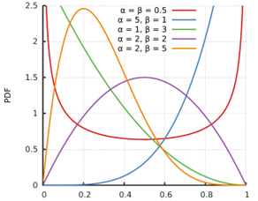
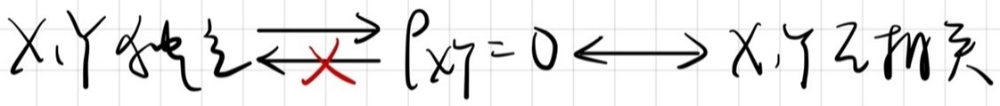
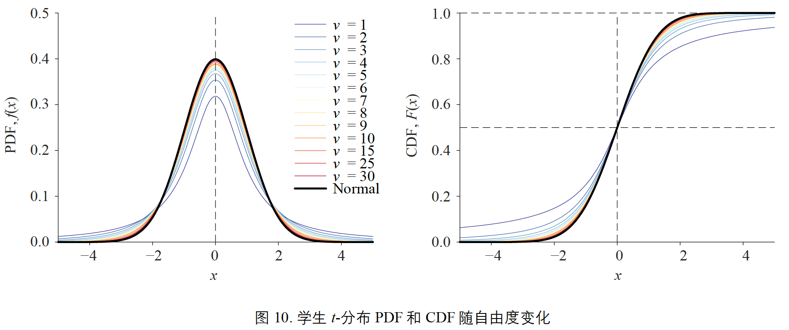

# 随机事件与概率

## *随机事件及其运算*

### 随机现象

* 随机现象：在一定条件下，出现的可能结果不止一个，事前无法确切知道哪一个结果一定会出现，但大量重复试验中其结果又具有统计规律的现象称为随机现象
* 随机试验 Random experiment：是在相同条件下对某随机现象进行的大量重复观测，需要满足下列三个条件
  * 可重复：在相同条件下试验可以重复进行
  * 结果集合明确，每次试验的可能结果不止一个，并且能事先明确试验的所有可能结果
  * 单次试验不确定，进行一次试验之前不能确定哪一个结果会出现，但必然出现结果集合中的一个

* Sample space/样本空间：随机现象的一切可能基本结果组成的集合，记作 $\Omega=\left\{\omega\right\}$，其中 $\omega$ 表示基本结果，又称为样本点
* 随机事件：随机现象的某些样本点组成的集合称为随机事件
  * Venn 维恩图
  * 由样本空间 $\Omega$ 中的单个元素组成的子集称为基本事件，样本空间 $\Omega$ 的最大子集（其本身）称为必然事件，最小子集称为不可能事件
* 随机变量 Random varaible：用来表示随机现象结果的变量称为随机变量，常用大写字母 $X,Y,Z$ 表示

### 事件间的关系

* 包含关系 $A\subset B$
* 相等关系 $A=B$
* 互不相容

### 事件间的运算

* 交 Intersection $A\cap B$ 或记作 $AB$，若 $AB=\emptyset$，则 $A$，$B$ 为互斥事件或互不相容 mutually exclusive
  * 事件的并与交可推广到有限个或可列个事件，譬如有事件 $A_1,A_2,\ \ldots$
  * 称 $\bigcup\limits_{i=1}^n{A_i}$ 为有限并，$\bigcup\limits_{i=1}^\infty{A_i}$ 为可列并
  * 称 $\bigcap\limits_{i=1}^n{A_i}$ 为有限交，$\bigcap\limits_{i=1}^\infty{A_i}$ 为可列交
* 并 Union $A\cup B$：$A$ 与$B$ 中至少有一个发生
  * 加法律：$P(A\cup B)=P(A)+P(B)-P(A\cap B)$
  * 若 $A,B$ 互斥，则有 $P(A\cup B)=P(A)+P(B)$
* 差 $A-B$
* 补 Complementary $\bar{A}$：如果事件 $A$ 与 $B$ 满足 $A\cap B=\emptyset,\ A\cup B=\Omega$，则 $A$ 与 $B$ 互为对立事件

### 事件的运算性质

* 交换律
* 结合律
* 分配律
* 对偶律（德摩根公式）
  * $\overline{A\cup B}=\bar{A}\cap\bar{B}$
  * $\overline{A\cap B}=\bar{A}\cup\bar{B}$

### Borel set/Borel 事件域，又称为 $\sigma$ 域或 $\sigma$ 代数

* $\Omega\in\mathcal{F}$
* 若 $A\in\mathcal{F}$，则对立事件 $\bar{A}\in\mathcal{F}$
* 若 $A_n\in\mathcal{F},\ n=1,2,\ldots$，则可列并 $\bigcup\limits_{n=1}^\infty{A_n}\in\mathcal{F}$
* 分割 Partition：将 $\Omega$ 划分为 $A_1,A_2,\dots,A_n$，若 $A_1,A_2,\ldots,A_n$ 互不相容，且 $\bigcup\limits_{i=1}^n{A_i}=\Omega,\ P(A_i)>0$

## *概率的定义及其确定方法*

### 概率的公理化定义

概率的公理化定义刻画了概率的本质，概率是集合（事件）的函数，若在事件域 $\mathcal{F}$ 上给定一个函数，当这个函数能满足下面三条公理时，就被称为概率

* 非负性公理：若 $A\in\mathcal{F}$，则 $P(A)\geq0$
* 正则性公理：$P(\Omega)=1$
* 可列可加性公理：$P(\bigcup\limits_{i=1}^\infty{A_i})=\sum\limits_{i=1}^{\infty}{P(A_i)}$

### 排列与组合方式

* 乘法原理
* 加法原理
  * 排列：从n个不同元素中任取 $r(r\le n)$ 个元素排成一列（考虑元素先后出现次序）$A_n^r=n\ast(n-1)\ast(n-2)\ast\ldots\ast(n-r+1)=\frac{n!}{(n-r)!}$
  * 重复排列：从n个不同元素中每次取出一个，放回后再取下一个，连续取r次的重复排列数为 $n^r$ 次（这里的r允许大于n）
  * 组合：从n个不同元素中任取 $r(r\le n)$ 个元素排成一列（不考虑元素之间的次序）$\binom{n}{r}=C_n^r=\frac{A_n^r}{r!}=\frac{n(n-1)\ldots(n-r+1)}{r!}=\frac{n!}{r!(n-r)!};\ \binom{n}{r}=\binom{n}{n-r}$
  * 重复组合：从n个不同元素中每次取出一个，放回后再取下一个，如此连续取r次所得的组合称为重复组合，这种重复组合总数为 $\binom{n+r-1}{r}$
* <font color="red">二项式定理：$(a+b)^n=\sum\limits_{k=0}^{n}{\binom{n}{k}a^kb^{n-k}}$</font>

### 确定概率的频率方法

* 与考察事件 $A$ 有关的随机现象可大量重复进行
* 在n次重复试验中，记 $n(A)$ 为事件 $A$ 出现的次数，又称 $n(A)$ 为事件 $A$ 的频数，称 $f_n(A)=\frac{n(A)}{n}$ 为事件 $A$ 出现的频率
* 人们的长期实践表明：随着试验重复次数n的增加，频率 $f_n(A)$ 会稳定在某一常数 $a$ 附近，我们称这个常数为频率的稳定值，这个频率的稳定值就是我们所求的概率

### 确定概率的古典方法

概率模型是对不确定现象的数学描述。古典概型也叫等概率模型 equiprobablity，是最经典的一种概率模型

* 所涉及的随机现象只有有限个样本 $card(\Omega)=n$
* 每个样本点发生的可能性等可能 $P(A)=\frac{card(A)}{card(\Omega)}=\frac{\#A}{\#\Omega}=\frac{k}{n}$

### 确定概率的几何方法

* 如果一个随机现象的样本空间 $\Omega$ 充满整个区域，其度量（长度、面积或体积等）大小可用 $S_\Omega$ 表示
* 任意一点落在度量相同的子区域内是等可能的
* 若事件 $A$ 为 $\Omega$ 中的某个子区域，且其度量大小可用 $S_A$ 表示，则事件A的概率为 $P(A)=\frac{S_A}{S_\Omega}$

### 确定概率的主观方法：不一定能满足公理

## *概率的性质*

* $P(\emptyset)=0$：不可能事件 impossible event
* 概率的可加性
  * 有限可加性 $P(\bigcup\limits_{i=1}^n{A_i})=\sum\limits_{i=1}^{n}{P(A_i)}$
  * 对任一事件有 $P(\bar{A})=1-P(A)$
* 概率的单调性
  * 若 $A\supset B$，则 $P(A-B)=P(A)-P(B)$
    * 推论（单调性）：若 $A\supset B$，则 $P(A)\geq P(B)$
  * 对任一两个事件 $A,\ B$，有 $P(A-B)=P(A)-P(AB)$
* 概率的加法公式：对任意事件 $A,\ B$ 有 $P(A\cup B)=P(A)+P(B)-P(AB)$
* 概率的连续性

## *Conditional probability/条件概率*

条件概率的定义：在 $B$ 发生下 $A$ 发生的概率 $P(A|B)=\frac{P(AB)}{P(B)}$


* $P(B)$ 称为边缘概率 Marginanl Probability
* $P(AB)$ 称为 $A$ 和 $B$ 的联合概率 Joint Probability 

### ==乘法公式==

* 若 $P(B)>0$，有 $P(AB)=P(B)P(A|B)=P(A)P(B|A)$

* 引申出链式法则：若 $P(A_1A_2\ldots A_{n-1})>0$，则
  $$
  P(A_1A_2A_3\dots A_n)\\=P(A_n|A_{n-1}A_{n-2}\dots A_1)\cdot P(A_{n-1}A_{n-2}\dots A_1)=P(A_n|A_{n-1}A_{n-2}\dots A_1)\cdot P(A_{n-1}|A_{n-2}\dots A_1)\cdot P(A_{n-2}\dots A_1)=\cdots\\=\underbrace{P(A_n|\bigcap\limits_{i=1}^{n-1}{A_i})\dots\underbrace{ P(A_3|A_1A_2)\underbrace{P(A_2|A_1)P(A_1)}_{P(A_2A_1)}}_{P(A_3A_2A_1)}}_{P(A_1A_2A_3\dots A_n)}=\prod\limits_{i=1}^{n}{\left[p(x_i)|\bigcap\limits_{j=1}^{i-1}{p(x_j)}\right]}
  $$

* 罐子模型
  * 当 $c=-1,d=0$ 时为不返回抽样
  * 当 $c=0,d=0$ 时为返回抽样
  * 当 $c>0,d=0$ 时为传染病模型
  * 当 $c=0,d>0$ 时为安全模型

### Total probability formular/全概率公式

* 最简单形式

  

* 若 $B_1,B_2,\ldots,B_n$ 是 $\Omega$ 的一个划分，其互不相容（即 $A\subset B,P(AB)=P\left(A\right)$），则 $P(A)=\sum\limits_{i=1}^{n}{P(B_i)P(A|B_i)}$

  

* 模型
  * 摸彩模型
  * 敏感性问题调查

### Bayes公式

可以认为Bayes公式是两个条件概率之间的关系，即
$$
{\color{red}P(A|B)P(B)=P(B|A)P(A)=P(AB)}\rightarrow P(A|B)=\frac{P(B|A)P(A)}{P(B)}
$$
推广到高维：若 $B_1,B_2,\ldots,B_n$ 是 $\Omega$ 的一个划分
$$
P(A_i|B)=\frac{P(A_iB)}{P(B)}=\frac{P(B|A_i)P(A_i)}{\sum\limits_{k=1}^{n}{P(B|A_k)P(A_k)}}={\color{red}\frac{P(B|A_i)P(A_i)}{P(B)}}
$$

* 用结果（后验概率）来修正先验概率
* $P(A_i)$ 先验概率 Prior：一开始给定的证据
* $P(A_i|B)$ 后验概率 Posterior：修正过后的概率
* $P(B|A_i)$ 似然概率 Likelihood
* $P(B)$ 证据因子 Evidence

例题
* 三门问题

  >三门问题（Monty Hall problem）亦称为[蒙提霍尔问题](https://baike.baidu.com/item/蒙提霍尔问题/10946045?fromModule=lemma_inlink)、蒙特霍问题或蒙提霍尔悖论，大致出自美国的电视游戏节目Let's Make a Deal。问题名字来自该节目的主持人蒙提·霍尔（Monty Hall）。参赛者会看见三扇关闭了的门，其中一扇的后面有一辆汽车，选中后面有车的那扇门可赢得该汽车，另外两扇门后面则各藏有一只山羊。当参赛者选定了一扇门，但未去开启它的时候，节目主持人开启剩下两扇门的其中一扇，露出其中一只山羊。主持人其后会问参赛者要不要换另一扇仍然关上的门。问题是：换另一扇门是否会增加参赛者赢得汽车的机率。如果严格按照上述的条件，那么答案是会。不换门的话，赢得汽车的几率是1/3。换门的话，赢得汽车的几率是2/3。虽然该问题的答案在逻辑上并不自相矛盾，但十分违反直觉。

  let $X=x_i\triangleq$ be the prize behind door $i\left(D_x=\left\{1,2,3\right\}\right)$ and $Y=y_i\triangleq$ be the door opened by host $j\left(D_y=\left\{1,2,3\right\}\right)$ 

  第一次开门的时候 $P(X=x_1)=P(X=x_2)=P(X=x_3)=1/3$

  选择打开门1，host开启门3，露出其中一种山羊

  若奖品在1门后那么host打开3门的概率是 $P(Y=y_3|X=x_1)=1/2$，因为他要么选择打开门2，要么打开3门

  若奖品在2门后那么host打开3门的概率是 $P(Y=y_3|X=x_2)=1$，因为此时1门后也是羊，他没有选择必然要打开3门

  若奖品在3门后那么host不会选择打开3门，因此概率是 $P(Y=y_3|X=x_3)=0$

  此时计算换2门得奖的概率为如下，显然换门得奖的概率更高
  $$
  P(X=x_2|Y=y_3)=\frac{P(Y=y_3|X=x_2)P(X=x_2)}{\sum_i{P(Y=y_3|X=x_i)}P(X=x_i)}=\frac{1\cdot\frac{1}{3}}{\frac{1}{2}\cdot\frac{1}{3}+1\cdot\frac{1}{3}+0\cdot\frac{1}{3}}=\frac{2}{3}
  $$
  三门是一个典型的贝叶斯概率，host的反应暴露了一些概率信息来帮助更新先验

* 抽签概率与抽签顺序无关问题

## *Independence/独立性*

### 独立性

若事件B的发生与否不会影响事件A发生的概率，即有下式
$$
P(A|B)=P(A)\Leftrightarrow P(B|A)=P(B)
$$
代入乘法公式 $P(A|B)P(B)=P(AB)$
$$
P(A|B)=P(A)\rightarrow\frac{P(AB)}{P(B)}=P(A)\rightarrow P(AB)=P(A)P(B)
$$

* 两个事件的独立性用以上两种方式表达都可以

  * 若A与B独立，则 $A,\bar{B}$，$\bar{A},B$，$\bar{A},\bar{B}$ 都互相独立
  * 独立一定不互斥，互斥一定不独立。两时间独立的必要条件为必须要有公共部分，若无公共部分，一定不独立。若为互斥事件，则 $A$ 发生，$B$ 一定不发生，反之亦然，说明 $A$ 与 $B$ 之间存在某种关联性。但有公共部分也不一定独立，还要满足独立的概率公式。

* 多个事件的相互独立性
  $$
  P(A_1\cap A_2\cap\cdots\cap\ A_n)=P(A_1A_2\cdots A_n)=\prod\limits_{i=1}^{n}{P(A_i)}
  $$

* 试验的独立性：设有两个试验 $E_1,\ E_2$，加入试验 $E_1$ 的任一结果（事件）与试验 $E_2$ 的任一结果（事件）都是相互独立的事件，则称两个试验相互独立。N重独立重复试验中，如果每次试验的可能结果只有两个：$A$ 和$\bar{A}$，则称这种试验为n重伯努利试验

### 条件独立性

* 随机变量相互独立：设n维随机变量 $X_1,X_2,\ldots X_n$ 的联合分布函数为 $F\left(x_1,x_2,\ldots x_n\right)$，若其可以写成 $F\left(x_1,x_2,\ldots x_n\right)=\prod\limits_{i=1}^nF_i\left(x_i\right)$
* Conditional Independence 条件独立性：两事件A和B在给定的另一事件C发生时条件独立，也就是指当且仅当事件C发生时，A和B是相互独立的
  * $A\perp B|C$
  * $P(AB|C)=P(A|C)P(B|C)$，也可以等价地表示为 $P(A|BC)=P(A|C)$，因为当C发生时，B发生与否无关于A发生与否

# Random variable 随机变量及其分布

## *随机变量及其分布*

### 随机变量的概念

定义在 $\Omega$ 上的实值函数称随机变量 $X=X(\omega)$，即对随机的结果的量化，$X$ 可以根据需要设置。例如可以设硬币朝上这一事件 $X=1$，朝下为 $X=0$
* 有限取值、可列取值：离散随机变量 Discrete
* 区间取值：连续随机变量 Continuous

### 随机变量的分布函数

* 定义：设 $X$ 是一个随机变量，对任意实数 $x$，称 $F(x)=P(X\le x)$ 为随机变量 $X$ 的分布函数，且称 $X$ 服从 $F(x)$，记为 $X\sim F(x)$，有时也可用 $F_X(x)$ 以表明是 $X$ 的分布函数
* 判别函数是否能成为分布函数的充要条件
  * 单调性：$F(x)$ 是定义在整个实数轴上的单调递增函数
  * 有界性：对任意的 $x$，有 $0\le F(x)\le1$，且 $F\left(-\infty\right)=\lim\limits_{x\rightarrow-\infty}{F(x)}=0,\ F(\infty)=\lim\limits_{x\rightarrow\infty}{F\left(x\right)}=1$
  * 右连续性：$\lim\limits_{x\rightarrow x_0^+}{F(x)}=F(x_0)$

### 离散随机变量的概率质量函数PMF/概率分布列

概率质量函数 Probability mass function PMF 或称概率分布列是离散随机变量在特定取值上的概率。其本质上就是概率。用 $p(x)$ 表示

* 非负性
* 正则性：$\sum\limits_{x}{p(x)=1}$

### 连续随机变量的概率密度函数PDF

与PMF相对，概率密度函数 Probability dennsity funcntion PDF对应连续随机变量。PDF经过单次积分或多重积分得到的累积分布函数 Cumulative Distribution Function CDF 才是概率值。设随机变量 $X$ 的分布函数为 $F(x)$，如果存在实数轴上的一个非负可积函数 $f(x)$，使得对任意实数 $x$ 有 $F(x)=\int_{-\infty}^{x}{f(t)dt}$

* 非负性
* 正则性：$\int_{-\infty}^{+\infty}{f(x)dx}=1$

## *Expectation 随机变量的数学期望*

### 定义

* 从分赌本问题得出，实际上表示的就是用取值的概率作为权数的加权平均数，物理解释是质心 Centroid。数学期望是消除随机性的主要手段

* 定义：在 $\sum\limits_{i=1}^{\infty}{\lvert x_i\rvert p_i}<+\infty$（离散型）或 $\int_{-\infty}^{+\infty}\lvert x\rvert f(x)dx<+\infty$（连续型）的前提下
  $$
  EX=\left\{\begin{array}{ll}\sum\limits_{i=1}^{\infty}{x_ip_i}&Discountinuous\\\int_{-\infty}^{+\infty}xp(x)dx&Countinuous\\\end{array}\right.
  $$

### 数学期望的性质

* 若 $c$ 是常数，则 $E(c)=c$

* 对任意常数 $a$，有 $E(aX)=aE(X)\rightarrow E(aX+c)=aE(X)+c$

* 若随机变量X的分布用分布列 $p(x_i)$ 或用密度函数 $p(x)$ 来表示，则 $X$ 的某一函数 $g(x)$ 的数学期望为
  $$
  E\left[g(X)\right]=\left\{\begin{array}{ll}\sum\limits_{i=1}^{\infty}{{g(x}_i)p_i}&Discountinuous\\\int_{-\infty}^{+\infty}g(x)p(x)dx&Countinuous\\\end{array}\right.
  $$

* 对任意两个函数 $g_1(x)和g_2(x)$ 有
  $$
  E\left[g_1(X)\pm g_2(X)\right]=E\left[g_1(X)\right]\pm E\left[g_2(X)\right]
  $$

## *Variance & standard variance 随机变量的方差与标准差*

### 方差定义

* 若随机变量 $X^2$ 的数学期望 $E(X^2)$ 存在，则称偏差平方 $(X-EX)^2$ 的数学期望 $E\left[(X-EX)^2\right]$ 为随机变量 $X$（或相应分布）的方差，记为
  $$
  Var(X)=E\left[(X-EX)^2\right]=\left\{\begin{array}{ll}\sum_{i}{\left(x_i-E(X)\right)^2p(x_i)}&Discountinuous\\\int_{-\infty}^{\infty}{\left(x-E(X)\right)^2p(x)dx}&Countinuous\\\end{array}\right.
  $$

* 期望描述了数据整体上的平均水平，即随机变量 $X$ 总是在 $E(x)$ 波动，但期望不能描述波动的程度。波动的程度由方差与标准差给出，比如以下两组数据

  

* 这个式子是人为定义的：为了描述波动程度，很自然的想到应该要计算 $X-E(X)$，这个过程称为==去均值== demean，也叫中心化 centralize。由于要避免正负波动抵消，改为 $\lvert X-E(X)\rvert$。但绝对值在数学上比较难处理，因此改为计算 $\left(X-E(X)\right)^2$，由于其计算后仍然为一个 $X$ 的分布列/密度函数，因此再取一次期望就可以得到平均波动即方差。

* 若方差存在，期望一定存在，反之不成立（柯西分布永远有一定概率出现极大值，无法计算方差）

### 标准差

定义：称方差的正平方根 $\sqrt{Var(X}$ 为随机变量 $X$（或相应分布）的标准差，记为 $\sigma(X)$ 或 $\sigma_X$。标准差与方差功能相似，其区别主要在于量纲，标准差与讨论的随机变量 $X$ 有相同的量纲，即 $E(x)\pm k\sigma(X)$ 有意义，因此实际中更愿意选用 $\sigma_X$

### 方差与标准差的性质

* ${\color{red}Var(X)}=E(X-E(X))^2=E(X^2-2XE(X)+(EX)^2)=EX^2-2E(X)E(X)+(EX)^2={\color{red}EX^2-(EX)^2}$
* 常数的波动为0，即方差为0，$Var(c)=0$
* 若a，b是常数，则 $Var(aX+b)=a^2Var(X)$

## *常用离散分布*

* Bernoulli分布/0-1分布：1重伯努利试验 $p_k=p^k(1-p)^{1-k},\ k=0,1$
* 二项分布 $X\sim b(n,p)$：记 $X$ 为n重伯努利试验中成功的次数
  * 分布列：$P\left(X=k\right)=C_n^kp^k\left(1-p\right)^{n-k},\ k=0,1,\ldots,n$
  * 二点分布/0-1分布/伯努利分布：当 $n=1$ 时二项分布变为二点分布 $X\sim b\left(1,p\right)$
* 泊松分布 $X\sim P(\lambda)$
  * 分布列：$p_k=\frac{\lambda^k}{k!}e^{-\lambda},\ k=0,1,\ldots$
  * 常与单位时间（或单位面积、单位产品等）上的计数过程相联系，若一天中进店的顾客、铸件上的砂眼等
  * 二项分布的泊松近似：当二项分布中的n非常大，而p相对较小时会令计算非常困难。此时可以证明当 $n\rightarrow\infty$ 时，有 $np_n\rightarrow\lambda$（$(p_n)$ 表示p与试验次数有关），有 $C_n^kp^k\left(1-p\right)^{n-k}\approx\frac{\left(\mathrm{np}\right)^k}{k!}e^{-np}$。且当n越大，p越小时近似越准确
* 超几何分布 $X\sim h(n,N,M)$：不放回抽样
  * 分布列：$p_k=\frac{\binom{M}{k}\binom{N-M}{n-k}}{\binom{N}{n}},k=0,1,\ldots,r,r=min\left\{M,n\right\}$
  * 超几何分布的二项近似：当 $n\ll N$ 时，即抽取个数n远小于产品总数N时，每次抽取后，总体中的不合格品率 $p=\frac{M}{N}$ 改变很小，所以不放回抽样可近似地看成放回抽样
* 几何分布 $X\sim Ge\left(p\right)$ 与负二项分布 $X\sim Nb(r,p)$
  * 几何分布：伯努利试验中 $X$ 为试验首次成功时的试验次数
  * 分布列：$p_k=\left(1-p\right)^{k-1}p,\ k=1,2,\ldots$
  * 几何分布的无记忆性：$P\left(X>m+n\middle| X>m\right)=P\left(X>n\right)$ 在前m次实验中 $A$ 没有出现的条件下，则在接下去的n次试验中 $A$ 仍未出现的概率只与n有关，而与以前的m次试验无关，似乎忘记了前m次试验结果，即失败不是成功之母
  * 帕斯卡分布/负二项分布 $X\sim Nb(r,p)$：重复试验，直至第x次才成功r次

## *Normal distribution 正态分布 $X\sim N(\mu,\sigma^2)$*

### 高斯函数和拉普拉斯核函数

* 高斯函数：$f(x)=\exp{(-\gamma x^2)}$，其中 $\gamma$ 控制函数形状
* 常用的高斯函数的一般形式：$f(x)=\exp{\left(\frac{-(x-b)^2}{2c^2}\right)}$
* 拉普拉斯核函数：$f(x)=\exp{(-\gamma\vert x\vert)}$，其中 $\gamma$ 控制函数形状

### 正态分布的密度函数和分布函数

正态分布是概率论与数理统计中最重要的一个分布。中心极限定理可以证明：一个随机变量如果是由大量微小的、独立的随机因素的叠加效果，那么这个变量一般都可以认为服从正态分布

* 密度函数 PDF
  $$
  p\left(x\right)=\frac{1}{\sigma\sqrt{2\pi}}\exp{\left(-\frac{\left(x-\mu\right)^2}{2\sigma^2}\right)},\ -\infty<x<\infty
  $$
  

  * $\mu$ 称为位置参数
  * $\sigma$ 称为尺度参数

* 累积分布函数 CDF
  $$
  F\left(x\right)=\frac{1}{\sqrt{2\pi}\sigma}\int_{-\infty}^{x}{\exp{-\frac{\left(t-\mu\right)^2}{2\sigma^2}}dt}=\frac{1}{2}\left[1+erf\left(\frac{x-\mu}{\sigma\sqrt{2}}\right)\right]
  $$
  

* 百分点函数 PPF

  百分点函数 Percent-Point Function PPF 是 CDF 的逆函数。即给定 $x$ ，通过PDF得到累积概率值 $F(x)$；而PPF则是给定累积概率值 $F(x)$，得 $x$

### 标准正态分布

称 $\mu=0,\sigma=1$ 的正态分布 $N(0,1)$ 为标准正态分布，记标准正态变量为 $Z$

* 标准正态分布的密度函数为 $\varphi\left(z\right)=\frac{1}{\sqrt{2\pi}}\exp{-\frac{z^2}{2}}$。在 Calculus $\Gamma$ 函数部分证明过 $\int_{0}^{+\infty}{e^{-x^2}dx}=\frac{\sqrt{\pi}}{2}$，因此底部的 $\sqrt{2\pi}$ 缩放因子是用来使积分=1的

* 标准正态分布的分布函数为 $\Phi\left(z\right)=\frac{1}{\sqrt{2\pi}}\int_{-\infty}^{z}{\exp{-\frac{z^2}{2}}dt}$，$\Phi(z)$ 没有其他参数，只与 $z$ 有关，由于该积分的原函数是不能通过初等函数来表达的，因此所有的正态分布函数都可以在化成标准正态分布后通过标准正态分布的分布函数表来计算
  $$
  P(a<Z<b)=\Phi(b)-\Phi(a)\\P(-z)=1-\Phi(z)\\P(Z>z)=1-\Phi(z)\\P\left(\lvert Z\rvert<c\right)=2\Phi(z)-1
  $$

### 正态变量的标准化

对一般正态分布都可以通过一个线性变换（标准化）化成标准正态分布，即若随机变量 $X\sim N(\mu,\sigma^2)$，则
$$
P\left(X\right)=\Phi\left(\frac{X-\mu}{\sigma}\right)=Z\sim N\left(0,1\right)
$$

* 推导：令 $Z=\frac{X-\mu}{\sigma}$，则 $dX=\sigma dZ$，则 $F\left(z\right)=\frac{1}{\sqrt{2\pi}\sigma}\sigma\int_{-\infty}^{z\sigma+\mu}{e^{-\frac{t^2}{2}}dt}=\frac{1}{\sqrt{2\pi}}\int_{-\infty}^{z\sigma+\mu}{e^{-\frac{t^2}{2}}dt}$
* 公式：$P\left(X\le c\right)=\Phi(\frac{c-\mu}{\sigma})；P(a<X\le b)=\Phi(\frac{b-\mu}{\sigma})-\Phi(\frac{a-\mu}{\sigma})$

### $3\sigma$ 原则

尽管正态变量的取值范围是 $(-\infty,+\infty)$，但它的99.73%的值落在 $(\mu-3\sigma,\mu+3\sigma)$ 内。$3\sigma$ 远在在实际工作中很有用

### QQ图

## *常用连续分布*

### 密度函数

* <font color='red'>为什么连续分布要使用密度函数来表征？在我们学习的概率论中存在一个矛盾点，连续分布的区间由于可以无限细分，因此取到每个单独点的概率在取极限后为0，但整个分布区间的概率加起来又为1。为了彻底地弄清这个问题，需要借助测度论的帮助。在实际计算中可以通过在连续分布中使用概率分布函数来绕开这个悖论，每一个小区间的高度不表示概率，而是表示概率密度，即概率为区间的面积=区间的长度*高度。如果使用高度来表示概率，那么在取极限后所有小区间的概率都将为0（即取到单个点的概率为0）</font>
* PDF为分布函数的导数 $F(x)=F^\prime(x)\Delta x=p(x)\Delta x$，PDF经过单次积分或多重积分得到的分布函数还是概率值

### 对数正态分布

若随机变量 $X$ 的对数 $\ln{X}$ 服从正态分布，则 $X$ 服从对数正态分布 logarithmic normal distribution

对数正态分布的随机变量取值只能为正值。对数正态分布的最大特点是右偏，即正偏
$$
p(x)=\frac{1}{\sqrt{2\pi}\sigma x}\exp{\left(-\frac{(\ln{x}-\mu)^2}{2\sigma^2}\right)}\\E(X=\exp{\left(\mu+\frac{\sigma^2}{2}\right)},\ var(X)=\left[\exp{(\sigma^2)-1}\right]\exp{\left(2\mu+\sigma^2\right)}
$$


### 拉普拉斯分布 Laplace

$$
f(x)=\frac{1}{2b}\exp{\left(-\frac{\lvert x-\mu\rvert}{b}\right)}\\E(X)=\mu,\ \sigma^2(X)=2b^2
$$


### 均匀分布 $X\sim U(a,b)$

轮胎圆周上任意一点接触地面的可能性

* 密度函数：$p\left(x\right)=\frac{1}{b-a},\ a<x<b$
* 分布函数：$F\left(x\right)=\frac{x-a}{b-a},a\le x<b$

### 指数分布 $X\sim Exp\left(\lambda\right)$

经常被用作各种寿命分布，如电子元器件的寿命，动物的寿命，电话的通话时间等

指数分布可以看作是柏松分布的连续随机变量版

* 密度函数：$p\left(x\right)=\lambda e^{-\lambda x},\ x\geq0$ 
* 分布函数：$F\left(x\right)=1-e^{-\lambda x},\ x\geq0$


指数分布的无记忆性：$P(X>s+t|X>s)=P(X>t)$ 记X是某种产品的使用寿命，若X服从指数分布，那么已知此产品使用了s小时没发生故障，则再使用t小时而不发生故障的概率与已使用的s小时无关，只相当于重新开始使用t小时的概率，即对已使用过的s没有记忆

### $\Gamma$ 分布 $X\sim Ga(\alpha,\lambda)$

电子产品的寿命（收到 $\alpha$ 次冲击后失效）服从$\Gamma$ 分布

* $\Gamma$ 函数：$\Gamma\left(s\right)=\int_{0}^{+\infty}{x^{s-1}e^{-x}dx\left(s>0\right)}$ 关于这部分的积分运算可以参考 Calculus 反常积分的 $\Gamma$ 函数部分
  * $\Gamma\left(1\right)=1,\Gamma\left(\frac{1}{2}\right)=\sqrt\pi$
  * $\Gamma\left(\alpha+1\right)=\alpha\Gamma\left(\alpha\right)$，当 $\alpha$ 为自然数 $0,1,2\ldots$ 时，有 $\Gamma\left(n+1\right)=n\Gamma\left(n\right)=n!$
* Gamma分布的密度函数：$p(x,\lambda)=\frac{\lambda^\alpha}{\Gamma(\alpha)}\chi^{\alpha-1}e^{-λx},x\geq0$
  
  
  
  * $\alpha>0$ 称为形状参数
  * $\lambda>0$ 称为尺度参数
* 特例
  * $\alpha=1$ 时的伽马分布就是指数分布，即 $Ga\left(1,\lambda\right)=Exp\left(\lambda\right)$
  * 称 $\alpha=\frac{n}{2},\lambda=\frac{1}{2}$ 时的伽马分布是自由度为n的 $\chi^2$（卡方）分布，记为 $\chi^2\left(n\right)$，即 $Ga\left(\frac{n}{2},\frac{1}{2}\right)=\chi^2\left(n\right)$

### B分布 $X\sim Be(a,b)$

Beta分布在贝叶斯推断中有着重要的应用

* B函数：$B\left(a,b\right)=\int_{0}^{1}{x^{a-1}\left(1-x\right)^{b-1}dx}$
  * $B\left(a,b\right)=\frac{\Gamma\left(a\right)\Gamma\left(b\right)}{\Gamma\left(a+b\right)}$
  * $B\left(1,1\right)=\frac{\Gamma\left(2\right)}{\Gamma\left(1\right)\Gamma\left(1\right)}=U\left(0,1\right)$
  
* B分布
  $$
  p\left(x\right)=\frac{\Gamma\left(a+b\right)}{\Gamma\left(a\right)\Gamma\left(b\right)}x^{a-1}\left(1-x\right)^{b-1},\ 0<x<1
  $$
  

### Dirchlet分布

Dirchlet分布本质上是多元Beta分布 Multivariate Beta Distribution

Dirchlet分布常作为贝叶斯统计的先验概率

Dirchlet分布的PDF和其中的K元Beta函数为
$$
f(x_1,\dots,x_K;\alpha_1,\dots,\alpha_K)=\frac{1}{\Beta(\alpha_1,\dots,\alpha_K)}\prod\limits_{i=1}^{K}{x_i^{\alpha_i-1}},\ \sum\limits_{i=1}^{K}{x_i}=1\\\Beta(\alpha_1,\dots,\alpha_K)=\frac{\sum\limits_{i=1}^{K}{\Gamma(\alpha_i)}}{\Gamma\left(\sum\limits_{i=1}^{K}{\alpha_i}\right)}
$$

## *常用离散和连续分布总结 （期望和方差的推导参考笔记）*

分布|分布列或分布密度函数|期望|方差
:-|:-|:-|:-
Bernoulli分布/0-1分布|$p_k=p^k(1-p)^{1-k},\ k=0,1$|$p$|$1-p$
二项分布 $X\sim b(n,p)$|$p_k=\binom{n}{k}p^k\left(1-p\right)^{n-k},\ k=0,1,\ldots n$|$np$|$np(1-p)$
泊松分布 $X\sim P(\lambda)$|$p_k=\frac{\lambda^k}{k!}e^{-\lambda},\ k=0,1,\ldots$|$\lambda$|$\lambda$
超几何分布 $X\sim h(n,N,M)$|$p_k=\frac{\binom{M}{k}\binom{N-M}{n-k}}{\binom{N}{n}},k=0,1,\ldots,r\\r=\min\left\{M,n\right\}$|$n\frac{M}{N}$|$\frac{nM(N-M)(N-n)}{N^2(N-1)}$
几何分布 $X\sim Ge(p)$|$p_k=(1-p)^{k-1}p,\ k=1,2,\ldots$|$\frac{1}{p}$|$\frac{1-p}{p^2}$
负二项分布 $X\sim Nb(r,p)$|$p_k=\binom{k-1}{r-1}(1-p)^{k-r}(p^r),\ k=r,r+1,\ldots$|$\frac{r}{p}$|$\frac{r(1-p)}{p^2}$
正态分布 $X\sim N(\mu,\sigma^2)$|$p(x)=\frac{1}{\sqrt{2\pi}\sigma}\exp{-\frac{(x-\mu)^2}{2\sigma^2}}\\-\infty<x<\infty$|$\mu$|$\sigma^2$
均匀分布 $X\sim U(a,b)$|$p(x)=\frac{1}{b-a},\ a<x<b$|$\frac{a+b}{2}$|$\frac{(b-a)^2}{12}$
指数分布 $X\sim Exp(\lambda)$|$p(x)=\lambda e^{-\lambda x},\ x\geq0$|$\frac{1}{\lambda}$|$\frac{1}{\lambda^2}$
Gamma分布 $X\sim Ga(\alpha,\lambda)$|$p(x)=\frac{\lambda^\alpha}{\Gamma(\alpha)}x^{\alpha-1}(1-x)^{b-1},\ x\geq0$|$\frac{\alpha}{\lambda}$|$\frac{\alpha}{\lambda^2}$
$\chi^2$分布|$p(x)=\frac{e^{-\frac{x}{2}}x^{\frac{n}{2}-1}}{\Gamma(\frac{n}{2})2^\frac{n}{2}}\\\ x\geq0$|$n$|$2n$
Beta分布 $X\sim Be(a,b)$|$p(x)=\frac{\Gamma(a+b)}{\Gamma(a)\Gamma(b)}x^{a-1}(1-x)^{b-1}\\0<x<1$|$\frac{a}{a+b}$|$\frac{ab}{(a+b)^2(a+b+1)}$
对数正态分布 $X\sim LN(\mu,\sigma^2)$|$p(x)=\frac{1}{\sqrt{2\pi}\sigma x}\exp{\left(-\frac{(\ln{x}-\mu)^2}{2\sigma^2}\right)}\\-\infty<x<\infty$|$\exp{\left(\mu+\frac{\sigma^2}{2}\right)}$|$\left[\exp{(\sigma^2)-1}\right]\exp{\left(2\mu+\sigma^2\right)}$
柯西分布 $X\sim Cau(\mu,\lambda)$|$p(x)=\frac{1}{\pi}\frac{\lambda}{\lambda^2+(x-\mu)^2}\\-\infty<x<+\infty$|$/$|$/$
韦布尔分布|$p(x)=F^\prime(x)F(x)=1-\exp\left\{-(\frac{x}{\eta})^m\right\}$|$\eta\Gamma(1+\frac{1}{m})$|$\eta^2\left[\Gamma(1+\frac{2}{m})-\Gamma^2(1+\frac{1}{m})\right]$

## *随机变量函数的分布*

### 离散随机变量函数的分布

### 连续随机变量函数的分布

* 当 $g\left(x\right)$ 严格单调时（严格单调是为了保证有 $y=g\left(x\right)$ 的反函数 $x=h\left(y\right)$ 存在）：$p_Y(y)=\left\{\begin{matrix}p_x\left[h(y)\right]\lvert h(y)^\prime\rvert&a<y<b\\0&,\ Other\\\end{matrix}\right.$
  * 本质上和离散分布时是一样的，用到的密度函数都是x的密度函数，通过已知的 $Y$ 与 $X$ 的关系来求Y的分布
  * 需要对其求导，而求导的对象是一个 $x$ 的复合函数，所以有 $\lvert h\left(y\right)^\prime\rvert$
* 利用分布函数求（$g\left(x\right)$ 分段单调时）：原理和严格单调的公式是一样的
  * 因为是已知X密度函数来求Y密度函数，所以还是对x积分，上下限相当于是给出了Y求Y对X的反函数，因此是用将X用Y表示
  * Ex：设随机变量 $X$ 从 $\left(-\frac{\pi}{2},\frac{\pi}{2}\right)$ 上的均匀分布，求随机变量 $Y=\cos{X}$ 的密度函数 $p_Y\left(y\right)$  
    
    
    
    * 画出的图只是Y与X的映射关系，不是对它作积分！！
    * 从实际意义来看：上下限实际上取得都是X的范围，但是因为要求Y的分布，因此将X用Y来表示
    * 但如果仅从计算的角度来看：积分里的密度函数本质上是对y的变上限积分，因此真正的变量是y，这两种看待的角度是矛盾的，注意不要混淆
  * Ex：设随机变量X服从标准正态分布 $N\left(0,1\right)$，分别求 $Y=\lvert X\rvert$ 和 $Y=2X^2+1$ 的密度函数
    
    
    
    * 求除了正态分布之外的密度函数可以选择定积分后求导也可以选择直接求变上限函数的导数，别忘了最后要求一个X反函数的导
* 延伸定理
  * 正态变量的线性变换仍为正态变量
  * 对数正态分布
  * 任一 $\Gamma$ 分布可转换为 $\chi^2$ 分布：设随机变量 $X\sim Ga\left(\alpha,\lambda\right)$，则当 $k>0$ 时，有 $Y=kX\sim Ga\left(\alpha,\lambda/k\right)$
  * 均匀分布在连续分布类中占有特殊地位

## *分布的其他特征数*

* Kth Moment K阶矩，矩是对变量分布和形态特点进行度量的一组量
  * K阶原点矩 $\mu_k=E\left(X^k\right)$（一阶原点矩是数学期望）
  * K阶中心矩 $v_k=E\left(X-E\left(X\right)\right)^k$（二阶中心矩为方差）
  * 中心距和原点矩的关系：$v_k=E\left(X-E\left(X\right)\right)^k=E\left(X-\mu_1\right)^k=\sum_{i=0}^{k}{C_k^i\mu_i\left(-\mu_1\right)^{k-i}}$
  * $k+l$ 阶混合矩：$E\left(X^kY^l\right)$
  * $k+l$ 阶混合中心矩：$E\left[\left(X-EX\right)^k\left(Y-EY\right)^l\right]$（二阶混合中心矩为协方差）
  
* Coefficient of variation 变异系数
  $$
  C_v\left(X\right)=\frac{\sqrt{Var\left(X\right)}}{E\left(X\right)}=\frac{\sigma\left(X\right)}{E\left(X\right)}
  $$

* Quantile 分位数

* Median 中位数：$p=0.5$ 时的p分位数 $x_{0.5}$ 为此分布的中位数，满足
  $$
  F\left(x_{0.5}\right)=\int_{-\infty}^{x_{0.5}}p(x)dx=0.5
  $$

* Skewness 偏度系数：设随机变量X的前三阶矩存在，则称
  $$
  \beta_s=\frac{v_3}{v_2^{3/2}}=\frac{E\left(X-EX\right)^3}{\left[Var\left(X\right)\right]^{3/2}}
  $$
  为 $X$ 的偏度系数，简称偏度。偏度 $\beta_s$ 是描述分布偏离对称性程度的一个无量纲特征数。$\beta_s>0$ 时为正偏/右偏，$\beta_s<0$ 时为负偏/左偏

  
  
* Kurtosis 峰度系数：设随机变量 $X$ 的前四阶矩存在，则称 $\beta_k$ 为峰度
  $$
  \beta_k=\frac{v_4}{v_2^2}=\frac{E\left(X-EX\right)^4}{\left[Var\left(X\right)\right]^2}-3
  $$
  峰度是描述分布尖峭程度和尾部粗细的一个无量纲特征数，上式称为超值峰度 Excess kurtosis，也就是要-3，目的是为了令正态分布的峰度系数为0
  
  
  
  上图展示了高峰态 leptokurtic 和低峰态 platykurtic。和正态分布相比，高峰态分布有明显的尖峰，两侧尾端有肥尾 Fat tail

# 多维随机变量及其分布

## *多维随机变量及其联合分布*

* 多维随机变量
* 联合分布函数 Joint distribution：$F\left(x,y\right)=P\left(X\le x,Y\le y\right)$ 是事件 $\lvert X\le x\rvert$ 与 $\lvert Y\le y\rvert$ 同时发生（即交）的概率
* 离散多维随机变量的联合分布列
* 连续多维随机变量的联合密度函数

### 常用多维分布

* 多项分布
  $$
  P\left(X_1=n_1,X_2=n_2,\ldots X_r=n_r\right)=\frac{n!}{n_1!n_2!\ldots n_r!}p_1^{n_1}p_2^{n_2}\ldots p_3^{n_3}
  $$

* 多维超几何分布
  $$
  P\left(X_1=n_1,X_2=n_2,\ldots X_r=n_r\right)=\frac{C_{N_1}^{n_1}C_{N_2}^{n_2}\ldots C_{N_r}^{n_r}}{C_N^n}
  $$

* 多维均匀分布
  $$
  p_Y\left(y\right)=\left\{\begin{array}{ll}\frac{1}{S_D}&\left(x_1,x_2,\ldots x_n\right)\in D\\0&,\ Other\\\end{array}\right.
  $$

* 多元正态分布，具体见下
  $$
  p\left(x,y\right)=\frac{1}{2\pi\sigma_1\sigma_2\sqrt{1-\rho_{X,Y}^2}}\exp{\left\{-\frac{1}{2}\underbrace{\frac{1}{\left(1-\rho_{X,Y}^2\right)}\left[\frac{\left(x-\mu_1\right)^2}{\sigma_1^2}-2\rho_{X,Y}\frac{\left(x-\mu_1\right)\left(y-\mu_2\right)}{\sigma_1\sigma_2}+\frac{\left(y-\mu_2\right)^2}{\sigma_2^2}\right]}_{Ellipse}\right\}},-\infty<x<+\infty
  $$
  
  * 拓展到高维正态分布的密度函数
    $$
    f_{\chi}(x_1,\ldots,x_k)=\frac{1}{\sqrt{(2\pi)^k\lvert\Sigma\rvert}}\exp{\left(-\frac{1}{2}\underbrace{(x-\mu)^T\Sigma^{-1}(x-\mu)}_{Quadratic\ Form}\right)}
    $$
  
  * $\Mu=\left[\mu_1,\ldots,\mu_k\right]^T$，$\lvert\Sigma\rvert$ 为协方差矩阵的行列式，以二维为例
    $$
    \sqrt{\left|\Sigma\right|}=\sqrt{\left|\begin{array}{cc}\sigma_X^2&\rho\sigma_X\sigma_Y\\\rho\sigma_X\sigma_Y&\sigma_Y^2\end{array}\right|}=\sqrt{(1-\rho^2)}\sigma_X\sigma_Y
    $$

## *边缘分布*

### 边缘分布函数

边缘概率 Marginal probability 是指某个事件发生的概率，而与其他事件无关

边缘化 Marginalization：穷举联合概率中属于某一随机变量的所有事件

若在二维随机变量 $(X,Y)$ 的联合分布函数 $F(x,y)$ 中令 $y\rightarrow\infty$，由于 $\lvert Y<\infty\rvert$ 为必然事件，故可得 $\lim\limits_{y\rightarrow\infty}{F(x,y)}=P(X\le x,Y<\infty)=P(X\le x)$，这是由 $(X,Y)$ 的联合分布函数 $F(x,y)$ 求得的 $X$ 的分布函数，被称为 $X$ 的边缘分布，记为 $F_X(x)=F(x,\infty)$。二维联合分布不仅含有每个分量的概率分布，而且还含有两个变量 $X$ 与 $Y$ 间关系的信息

### 边缘密度函数

* 多项分布的一维边缘分布仍为二项分布
* 二维正态分布的边缘分布为一维正态分布：即若 $\left(X,Y\right)\sim N\left(\mu_1,\mu_2,\sigma_1^2,\sigma_2^2,\rho\right)$，则 $X\sim N\left(\mu_1,\sigma_1^2\right),\ Y\sim N\left(\mu_2,\sigma_2^2\right)$
  * 二维正态分布的边缘分布中不含参数 $\rho$
  * 这说明有不同参数 $\rho$ 的二维正态分布的边缘分布是相同的
  * 具有相同边缘分布的多维联合分布可以是不同的

## *多维随机变量函数的分布*

### 多维离散随机变量的分布

### 二维随机变量分布函数的分布

* 直接积分
  * 先求随机变量Z的分布函数 $F_Z\left(z\right)=P\left\{Z\le z\right\}=P\left\{g\left(X,Y\right)\le z\right\}=\iint_{g\left(x,y\right)\le z} f\left(x,y\right)dxdy$。把Z看作一个定值来确定积分上下限
  * 对 $F_Z\left(z\right)$ 求导，得Z的概率密度函数 $f_Z\left(z\right)=F_Z^\prime\left(z\right)$
* 变量变换法
  * 变量变换法：若 $u，v$ 是 $x，y$ 的二维随机变量，则 $p\left(u,v\right)=p\left(x\left(u,v\right),y\left(u,v\right)\right)\lvert J\rvert$
  * 增补变量法：是变量变换法的应用
    * 求独立随机变量的和函数 $Z=X+Y$，其密度函数为 $f_Z\left(z\right)=\int_{-\infty}^{+\infty}\left(z-y,y\right)dy$ 或则 $f_Z\left(z\right)=\int_{-\infty}^{+\infty}\left(x,z-x\right)dx$
      * 若 $X，Y$ 独立，则有卷积公式：$\int_{-\infty}^{+\infty}{p_X\left(z-y\right)p_Y\left(y\right)dx}$ 或 $\int_{-\infty}^{+\infty}{p_X\left(x\right)p_Y\left(z-x\right)dx}$
    * 求两个独立随机变量的积函数
    * 求两个独立随机变量的商函数

### 最值函数：若X与Y独立，分布函数分别为 $F_X\left(x\right),F_Y\left(y\right)$

* 最大值函数的分布函数
  * $M=\max\left(X,Y\right)$ 的分布函数为 $F_{max}\left(z\right)=F_X\left(z\right)F_Y\left(z\right)$
  * 推广到n维：$F_{max}\left(z\right)=F_{X_1}\left(z\right)F_{X_2}\left(z\right)\ldots F_{X_n}\left(z\right)$
* 最小值函数的分布函数
  * $M=\min\left(X,Y\right)$ 的分布函数为 $F_{min}\left(z\right)=1-{[1-F}_X\left(z\right)][1-FYz]$
  * 推广到n维：$F_{min}\left(z\right)=1-\left[1-F_{X_1}\left(z\right)\right]\left[1-F_{X_2}\left(z\right)\right]\ldots\left[1-F_{X_n}\left(z\right)\right]$

### 分布的可加性：同分布的独立随机变量和的分布仍属于该类分布。设独立的随机变量X，Y

* 二项分布
  * $Z=X+Y\sim b\left(n+m,p\right)$
  * $b\left(n,p\right)\ast b\left(m,p\right)\sim b\left(n+m,p\right)$
* 泊松分布
  * $Z=X+Y\sim P\left(\lambda_1+\lambda_2\right)$
  * 可以叙述为泊松分布的卷积仍然是泊松分布：$P\left(\lambda_1\right)\ast P\left(\lambda_2\right)=P\left(\lambda_1+\lambda_2\right)$。卷积运算指寻求两个独立随机变量和的分布运算
* 正态分布
  * $Z=X+Y\sim N(\mu_1+\mu_2,\sigma_1^2+\sigma_2^2)\rightarrow aX+bY\sim N(a\mu_1+b\mu_2,\left(a\sigma_1\right)^2+\left(b\sigma_2\right)^2$
  * 推广：独立的正态分布随机变量的非零线性组合仍服从正态分布
  * Gamma分布：$Z=X+Y\sim Ga\left(\alpha_1+\alpha_2,\lambda\right)$

## *多维随机变量的特征数*

### 多维随机变量函数的数学期望

$$
E\left(Z\right)=\int_{-\infty}^{+\infty}\int_{-\infty}^{+\infty}g\left(x,y\right)p\left(x,y\right)dxdy
$$

* 数学期望与方差的运算性质
  * ${\color{red}E\left(X\pm Y\right)=E\left(X\right)\pm E\left(Y\right)}$
  * 若随机变量相互独立，则有 $E\left(XY\right)=E\left(X\right)E\left(Y\right)$
  * 若随机变量相互独立，则有 $Var\left(X\pm Y\right)=Var\left(X\right)+Var\left(Y\right)$，若不独立，则有 $Var\left(X\pm Y\right)=Var\left(X\right)+Var\left(Y\right)\pm2Cov\left(X,Y\right)$
  * $Var(XY)=E\left(Y^2\right)Var(X)+Var(Y)E\left(X^2\right)+Var(X)Var(Y)$

### 协方差 Covariance

协方差为描述二维联合分布中==两变量相互关联程度==的特征数

* 定义：${\color{red}Cov\left(X,Y\right)=E\left[\left(X-E\left(X\right)\right)\left(Y-E\left(Y\right)\right)\right]}$ 称为数学期望为 $X$ 与 $Y$ 的协方差，或称为 $X$ 与 $Y$ 的相关（中心）矩
  * 当 $Cov\left(X,Y\right)>0$ 时称 $X$ 与 $Y$ 正相关
  * 当 $Cov\left(X,Y\right)<0$ 时称 $X$ 与 $Y$ 负相关
  * 当 $Cov\left(X,Y\right)=0$ 时称 $X$ 与 $Y$ 不（线性）相关
* 性质
  * 由协方差定义式可推出计算式 ${\color{red}Cov\left(X,Y\right)=E\left(XY\right)-E\left(X\right)E\left(Y\right)}$
  * 若随机变量 $X$ 与 $Y$ 相互独立，则 $Cov\left(X,Y\right)=0$。其逆否性质成立，即若 $Cov\left(X,Y\right)\neq0$，则随机变量 $X$ 与 $Y$ 肯定不独立。但 $Cov\left(X,Y\right)=0$ 不能推出随机变量 $X$ 与 $Y$ 肯定独立，$X$ 与 $Y$ 可能独立，也可能是 $X$ 与 $Y$ 之间存在非线性关系
  * 对任意二维随机变量 $X，Y$ 有 ${\color{red}Var\left(X\pm Y\right)=Var\left(X\right)+Var\left(Y\right)\pm2Cov\left(X,Y\right)}$
  * ${\color{red}Cov\left(X,X\right)=E\left[\left(X-EX\right)^2\right]=Var\left(X\right)}$
  * 协方差的计算与 $X，Y$ 的次序无关，即 $Cov\left(X,Y\right)=Cov\left(Y,X\right)$
  * 任意随机变量 $X$ 与常数a的协方差为0，即 $Cov\left(X,a\right)=0$
  * 对任意常数a，b有 $Cov\left(aX,bY\right)=abCov\left(X,Y\right)$
  * 设 $X，Y，Z$ 是任意三个随机变量，则 $Cov\left(X+Y,Z\right)=Cov\left(X,Z\right)+Cov\left(Y,Z\right)$

### 相关系数 Correlation coefficient

* 定义：协方差的大小在一定程度上反映了 $X$ 和 $Y$ 相互间的关系，但它还受 $X$ 与 $Y$ 本身度量单位的影响。例如 $kX$ 和 $kY$ 之间的统计关系与 $X$ 和 $Y$ 之间的统计关系应该是一样的，但根据性质 $Cov\left(kX,kY\right)=k^2Cov\left(X,Y\right)$，其协方差却扩大了 $k^2$ 倍。为了消除量纲的影响，将量纲除掉，得到相关系数。当 $Var\left(X\right),Var\left(Y\right),Cov\left(X,Y\right)$ 存在，有
  $$
  Corr\left(X,Y\right)=\rho_{XY}=\frac{Cov\left(X,Y\right)}{\sqrt{Var\left(x\right)}\sqrt{Var\left(Y\right)}}=\frac{Cov\left(X,Y\right)}{\sigma_X\sigma_Y}
  $$

* 常用计算公式
  $$
  \rho_{XY}=\frac{E\left(XY\right)-E\left(X\right)E\left(Y\right)}{\sqrt{Var\left(X\right)}\sqrt{Var\left(Y\right)}}
  $$

* Cauthy-Schwarz不等式：对任意二维随机变量 $\left(X,Y\right)$，若 $X$ 与 $Y$ 的方差都存在，且记 $\sigma_X^2=Var\left(X\right),\sigma_Y^2=Var\left(Y\right)$，则有 $\left[Cov\left(X,Y\right)\right]^2\le\sigma_X^2\sigma_Y^2$

* 性质
  * 由Cauthy-Schwarz不等式可以得到 $\lvert\rho_{XY}\rvert\le1$
  
  * $\lvert\rho_{XY}\rvert\le1$ 的充要条件是 $X$ 与 $Y$ 之间几乎处处由线性关系，即存在常数a，b，使 $P\left(Y=aX+b\right)=1$
    * 当 $\lvert\rho_{XY}\rvert=1$ 时，$XY$ 几乎就是线性关系，称 $X$ 与 $Y$ 相关
      * 正相关 Positive Correlation $\rho_{XY}=1$
      
        
      
      * 负相关 Negative Correlation $\rho_{XY}=-1$
      
        
      
      
      
    * 当 $\lvert\rho_{XY}\rvert$ 较大时，$XY$ 线性关系较密切 Strong Positive/Negative correlation
    
    * 当 $\lvert\rho_{XY}\rvert$ 较小时，$XY$ 线性关系较弱 Moderate Positive/Neagtive correlation
    
    * 当 $\lvert\rho_{XY}\rvert=0$ 时，$XY$ 没有线性关系（不相关）Uncorrelated
  
* 独立与不相关关系：“不（线性）相关”是比“独立”弱的概念。相关系数仅反应了线性相关性，不线性相关还有可能有其他相关性，但若二者独立，则没有任何相关性

  

* 相关性是数据的一种性质，相关性不等于因果性，因果性可能需要除数据相关性的其他证据来证明

* 对于随机变量 $X，Y$ 以下命题等价 $\rho_{XY}=0\Longleftrightarrow$ $X,Y$ 不相关 $\Longleftrightarrow Cov(X,Y)=0\Longleftrightarrow E(XY)=E(X)E(Y)\Longleftrightarrow D(X±Y)=D(X)+D(Y))$

### 随机向量的数学期望向量与协方差矩阵

* 二维随机变量：$E\left[\left(X-E\left(X\right)\right)\left(Y-E\left(Y\right)\right)\right]=\left[\begin{matrix}Var\left(X\right)&Cov\left(X,Y\right)\\Cov\left(Y,X\right)&Var\left(Y\right)\\\end{matrix}\right]$，特别的有二元正态分布的协方差矩阵为 $\Sigma=\left[\begin{matrix}\sigma_1^2&\rho\sigma_1\sigma_2\\\rho\sigma_1\sigma_2&\sigma_2^2\\\end{matrix}\right]$ （注意：这里的 $\sigma$ 和 $\rho$ 专指正态分布中的标准差和相关系数，和线性代数和统计机器学习笔记中的不同，那里面指的是任意数据的统计信息）

* 推广到n维随机变量 $X=\left(X_1,X_2,\ldots X_n\right)$ 的协方差矩阵：对称非负定矩阵
  $$
  \Sigma=\left(X-E(X)\right)^T\left(X-E(X)\right)=\left[\begin{matrix}Var(X_1)&Cov(X_1,X_2)&\cdots&Cov(X_1,X_n)\\Cov\left(X_2,X_1\right)&Var\left(X_2\right)&\cdots&Cov\left(X_2,X_n\right)\\\vdots&\vdots&\cdots&\vdots\\Cov(X_n,X_1)&Cov(X_n,X_2)&\cdots&Var\left(X_n\right)\\\end{matrix}\right]
  $$

* 衡量多元随机变量各特征维度的波动是用协方差矩阵，方差描述的是一个维度里数据的波动。当多元随机变量退化为一维随机变量的时候协方差矩阵=方差。对于一个有N个数据的p维数据 $X_N\times p$，其协方差和方差可统一表示为 $S=\frac{1}{N}\sum\limits_{i=1}^{N}{(x_i-\bar{x})(x_i-\bar{x})^T}$

* 正态分布的特殊结论：若 $\left(X,Y\right)\sim N\left(\mu_1,\mu_2,\sigma_1^2,\sigma_2^2,\rho\right)$
  * $X\sim N\left(\mu_1,\sigma_1^2\right),\ Y\sim N\left(\mu_2,\sigma_2^2\right)$
  * $Cov\left(X,Y\right)=\rho\sigma_1\sigma_2$
  * $\rho_{XY}=\rho$
  * <font color="red">$X,Y$ 独立 $\rightarrow\rho=0\longleftrightarrow X,Y$ 不相关</font>，该性质可直接由 $\rho=0$ 时的表达式得出。即二位正态随机变量 $X，Y$ 的分布完全由 $X$ 与 $Y$ 的数学期望，方差以及 $X$ 与 $Y$ 的相关系数所确定。正态分布只有线性相关关系，没有其他相关关系
  * 协方差矩阵为 $C(\Sigma)=\left|\begin{matrix}\sigma_1^2&\rho\sigma_1\sigma_2\\\rho\sigma_1\sigma_2&\sigma_2^2\\\end{matrix}\right|$
  * $X，Y$ 的任意非零线性组合 $aX+bY\sim N\left(a\mu_1+b\mu_2,\left(a\sigma_1\right)^2+\left(b\sigma_2\right)^2\right)$

## *条件分布的特征值*

### 条件期望

### 条件方差

### 条件高斯分布

# 大数定律与中心极限定律

## *随机变量序列的两种收敛性*

* 依概率收敛：设 $X_1,X_2,\ldots,X_n,\ldots$ 是一个随机变量序列，a是一个常数，若对任意整数 $\varepsilon$，有 $\lim\limits_{n\rightarrow\infty}{P\left\{\lvert X_n-a\rvert<\varepsilon\right\}=1}$，则称序列 $X_1,X_2,\ldots,X_n,\ldots$ 依概率收敛于a，记作 $X_n\ \overrightarrow{P}\ a$
* 另一种形式：对 $X_n$ 的绝对偏差不小于任一给定量的可能性将随着n增大而愈来愈小，即 $\lim\limits_{n\rightarrow\infty}{P\left\{\lvert X_n-a\rvert\geq\varepsilon\right\}=0}$
* 直观解释：绝对偏差 $\lvert X_n-a\rvert$ 小于任一给定量的可能性将随着n增大而愈来愈接近于1。对任意 $\varepsilon>0$，当n充分大时，时间Xn与a的偏差大于 $\varepsilon$ 发生的概率很小（趋于0）。
* 设 $\left\{X_n\right\},\left\{Y_n\right\}$ 是两个随机变量序列，a，b是两个常数，若有 $X_n\ \overrightarrow{P}\ a,\ Y_n\ \overrightarrow{P}\ b$，则 $X_n\pm Y_n\ \overrightarrow{P}\ a\pm b,\ X_n\times Y_n\ \overrightarrow{P}\ a\times b,\ X_n\div Y_n\ \overrightarrow{P}\ a\div b$

### 按分布收敛与弱收敛

* 按分布收敛：$X_n\ \overrightarrow{L}\ X$
* 弱收敛 $F_n(x)\ \overrightarrow{W}\ F(x)$

## *特征函数*

### 特征函数的定义

$\varphi\left(t\right)=E\left(e^{itX}\right)=\left\{\begin{matrix}\sum_{k=1}^{\infty}{e^{itx_k}p_k}&Discountinuous\\\int_{-\infty}^{+\infty}{e^{itx}p\left(x\right)dx}&Countinuous\\\end{matrix}\right.$

### 特征函数的性质

* $\lvert\varphi(t)\rvert\le\varphi(0)=1$
* $\varphi(-t)=\bar{\varphi(t)}$
* 若 $Y=aX+b$ 则 $\varphi_Y(t)=e^{ibt}\varphi_x(at)$
* 独立随机变量和的特征函数为每个随机变量的特征函数的积，即设 $X$ 与 $Y$ 相互独立，则 $\varphi_{X+Y}\left(t\right)=\varphi_X\left(t\right)\varphi_Y\left(t\right)$
* 若 $E\left(X^l\right)$ 存在，则 $X$ 的特征函数 $\varphi\left(t\right)$ 可l次求导，且对 $1\le k\le l$，有 $\varphi^{\left(k\right)}\left(0\right)=i^kE\left(X^k\right)$，可以用来计算期望和方差
* $E\left(X\right)=\frac{\varphi^\prime\left(0\right)}{i}$
* $Var\left(X\right)=-\varphi^{\prime\prime}\left(0\right)+\left(\varphi^\prime\left(0\right)\right)^2$

### 特征函数唯一决定分布函数

* 即使两个分布的数学期望、方差、各阶矩都相等也无法证明两个分布相等，特征函数有着更优良的性质：即特征函数完全决定了分布。另外特征函数可以将寻求独立随机变量和的分布的卷积运算（积分运算）转换成乘法运算，也能把求分布的各阶原点矩（积分运算）转换成微分运算。
* 唯一性定理：随机变量的分布函数由其特征函数唯一决定
* 逆转公式/傅里叶逆变换：设 $F(x)和\varphi(t)$ 分别为随机变量 $X$ 的分布函数和特征函数，则对 $F(x)$ 的任意两个连续点 $x_1<x_2$，有 $F(x_2)-F(x_1)=\lim\limits_{T\rightarrow\infty}{\frac{1}{2\pi}\int_{-T}^{T}{\frac{e^{-itx_1}-e^{-itx_2}}{it}\varphi(t)dt}}$
* 分布函数序列 $\lvert F_n\left(x\right)\rvert$ 弱收敛于分布函数 $F\left(x\right)$ 的充要条件是 $\lvert F_n(x)\rvert$ 的特征函数序列 $\lvert\varphi_n(t)\rvert$ 收敛于 $F(x)$ 的特征函数 $\varphi(t)$

### 矩的问题

### 常用特征函数

分布|分布列或分布密度函数|特征函数 $\varphi(t)$
:-|:-|:-
单点分布|$P\left(X=a\right)=1$|$e^{ita}$
0-1分布|$p_k=p^k\left(1-p\right)^{1-k},\ k=0,1$|$pe^{it}+q$
二项分布 $X\sim b\left(n,p\right)$|$p_k=\binom{n}{k}p^k\left(1-p\right)^{n-k},\ k=0,1,\ldots n$|$\left(pe^{it}+q\right)^n$
泊松分布 $X\sim P\left(\lambda\right)$|$p_k=\frac{\lambda^k}{k!}e^{-\lambda},\ k=0,1,\ldots$|$e^{\lambda\left(e^{it}-1\right)}$
超几何分布 $X\sim h\left(n,N,M\right)$|$p_k=\frac{\binom{M}{k}\binom{N-M}{n-k}}{\binom{N}{n}},k=0,1,\ldots,r,r=min\left\{M,n\right\}$|/	
几何分布 $X\sim Ge\left(p\right)$|$p_k=\left(1-p\right)^{k-1}p,\ k=1,2,\ldots$|$\frac{1-p}{p^2}$
负二项分布 $X\sim Nb\left(r,p\right)$|$p_k=\binom{k-1}{r-1}\left(1-p\right)^{k-r}\left(p^r\right),\ k=r,r+1,\ldots$|$\frac{r\left(1-p\right)}{p^2}$
正态分布 $X\sim N\left(\mu,\sigma^2\right)$|$p\left(x\right)=\frac{1}{\sqrt{2\pi}\sigma}e^{-\frac{\left(x-\mu\right)^2}{2\sigma^2}},\ -\infty<x<\infty$|$\exp{\left(i\mu t-\frac{\sigma^2t^2}{2}\right)}$
均匀分布 $X\sim U\left(a,b\right)$|$p\left(x\right)=\frac{1}{b-a},\ a<x<b$|$\frac{e^{ibt}-e^{iat}}{it\left(b-a\right)}$
指数分布 $X\sim Exp\left(\lambda\right)$|$p\left(x\right)=\lambda e^{-\lambda x},\ x\geq0$|$\left(1-\frac{it}{\lambda}\right)^{-1}$
Gamma分布 $X\sim Ga\left(\alpha,\lambda\right)$|$p\left(x\right)=\frac{\lambda^\alpha}{\Gamma\left(\alpha\right)}x^{\alpha-1}\left(1-x\right)^{b-1},\ x\geq0$|$\left(1-\frac{it}{\lambda}\right)^{-n}$
$\chi^2\left(n\right)$ 分布|$p\left(x\right)=\frac{e^{-\frac{x}{2}}x^{\frac{n}{2}-1}}{\Gamma\left(\frac{n}{2}\right)2^\frac{n}{2}},\ x\geq0$|$\left(1-2it\right)^{-\frac{\pi}{2}}$
Beta分布 $X\sim Be\left(a,b\right)$|$p\left(x\right)=\frac{\Gamma\left(a+b\right)}{\Gamma\left(a\right)\Gamma\left(b\right)}x^{a-1}\left(1-x\right)^{b-1},\ 0<x<1$|$\frac{\Gamma\left(a+b\right)}{\Gamma\left(a\right)}\sum_{k=0}^{\infty}\frac{\left(it\right)^k\Gamma\left(a+k\right)}{k!\Gamma\left(a+b+k\right)\Gamma\left(k+1\right)}$
Cauthy分布|$p\left(x\right)=\frac{1}{\pi\left(1+x^2\right)},\ -\infty<x<+\infty$|$e^{-t}$

## *Law of Large Numbers LLN 大数定律*

大数定律的一般形式 ：研究在什么条件下随机变量序列的算术平均依概率收敛到其均值
$$
\frac{1}{n}\sum\limits_{i=1}^{n}{X_i}\ \overrightarrow{P}\ E\left(\frac{1}{n}\sum\limits_{i=1}^{n}X_i\right)\ or\\\lim\limits_{n\rightarrow\infty}{P\left\{\lvert\frac{1}{n}\sum\limits_{i=1}^{n}X_i-\frac{1}{n}\sum\limits_{i=1}^{n}E\left(X_i\right)\rvert<\varepsilon\right\}}=1,\ i.e.\bar{X}\ \overrightarrow{p}\ E\left(\bar{X}\right)
$$

### Chebyshev inequality 切比雪夫不等式

* $P\left(\lvert X-EX\rvert\geq\varepsilon\right)\le\frac{Var\left(x\right)}{\varepsilon^2}$ 或 $P\left(\lvert X-EX\rvert<\varepsilon\right)\le1-\frac{Var\left(x\right)}{\varepsilon^2}$
* 方差 $Var\left(X\right)$ 越小，概率 $P\left\{\lvert X-EX\rvert<\varepsilon\right\}$ 越大，X的取值就越集中在均值EX附近，即X偏离EX的波动程度越小，因此方差确实是反应X偏离EX波动程度的量
* 无需知道X的分布，只要知道 $Var\left(X\right)$，就可对X落入以EX为中心的对称区间 $\left(E\left(X\right)-\varepsilon,E\left(X\right)+\varepsilon\right)$ 内（或外）的概率进行粗略估值（但必须要是对称区间）

### 切比雪夫大数定律

* 设 $\left\{X_n\right\}$ 为一列两两不相关的随机变量序列，若每个 $X_i$ 的方差存在且有共同上界 $M$，即 $Var\left(X_i\right)\le M,i=1,2,\ldots$，则 $\left\{X_n\right\}$ 服从大数定律，也就是 $\lim\limits_{n\rightarrow\infty}{P\left\{\lvert\frac{1}{n}\sum\limits_{k=1}^{n}X_k-\frac{1}{n}\sum\limits_{k=1}^{n}E\left(X_k\right)\rvert<\varepsilon\right\}}=1$
* 定理表明 $X_1,X_2,\ldots,X_n,\ldots$ 的算术平均值 $\frac{1}{n}\sum\limits_{k=1}^{n}X_k$ 当 $n\rightarrow\infty$ 时依概率收敛于它的数学期望
* 推论：设随机变量序列 $\left\{X_n\right\}$ 两两不相关，且具有相同的数学期望和相同的方差 $E\left(X_k\right)=\mu,Var\left(X_k\right)=\sigma^2$，则给任意给定的正数 $\varepsilon$，恒有 $\lim\limits_{n\rightarrow\infty}{P\left\{\lvert\frac{1}{n}\sum\limits_{k=1}^{n}X_k-\mu\rvert<\varepsilon\right\}}=1$
* 切比雪夫大数定律只要求 $\left\{X_n\right\}$ 互不相关，并不要求它们是同分布的，但我们可以容易推出：若 $\left\{X_n\right\}$ 是独立同分布的随机变量序列，且方差有限，则 $\left\{X_n\right\}$ 必定服从大数定律。伯努利大数定律是切比雪夫大数定律的特例。
* 从推论中可以知道切比雪夫大数定律是实际问题中使用算数平均值的依据。为测量某个量a（实际上a的量到底是多少是永远无法准确得知的），可用同意测量装置重复测量n次，得到测量值 $x_1,x_2,\ldots,x_n$ 可把它们看作是n个独立的，具有相同数学期望和方差的随机变量 $X_1,X_2,\ldots,X_n$ 的取值，由推论知，当测量次数很大时，可用这n次测量结果的算术平均值作为a的近似值，所产生的误差很小

### 伯努利大数定律

* 设 $n_A$ 是n次独立重复试验中事件 $A$ 发生的次数（$\frac{n_A}{n}$ 就是算术平均），p是事件 $A$ 在一次实验中发生的概率（p就是期望），则对任意 $\varepsilon>0$，有 $\lim\limits_{n\rightarrow\infty}{P\left\{\lvert\frac{n_A}{n}-p\rvert<\varepsilon\right\}}=1$ 即 $\frac{n_A}{n}\ \overrightarrow{P}\ p$
* 伯努利大数定律以严格的数学形式表达了频率的稳定性，所以当试验次数n很大时，可用事件 $A$ 发生的频率代替事件 $A$ 的概率

### 马尔科夫大数定律

* 马尔科夫条件：只要有 $\frac{1}{n^2}Var\left(\sum\limits_{i=1}^{n}X_i\right)\rightarrow0$，则对任意的 $\varepsilon$，$\left\{X_n\right\}$ 服从大数定律
* 马尔科夫大数定律的重要性在于：对 $\left\{X_n\right\}$ 已经没有任何同分布、独立性、不相关的假定

### 辛钦大数定律/独立同分布大数定律 Khinchin weak law of large numbers

* 设随机变量 $X_1,X_2,\ldots,X_n,\ldots$ 独立同分布，且有 $E\left(X_k\right)=\mu\left(k=1,2,\ldots\right)$，则对任意正数 $\varepsilon，\left\{X_n\right\}$ 服从大数定律
* 辛钦大数定律将方差存在的条件去掉了，并且加上了独立同分布的条件
* 辛钦大数定律提供了求随机变量数学期望 $E\left(X\right)$ 的近似值的方法。这样做法的优点是我们可以不必管 $X$ 的分布究竟是怎样的，我们的目的只是寻求数学期望的近似值

## *Central Limit Theorem CLT中心极限定理*

* 正态分布在自然界中非常常见。观察表明，如果一个量是由大量相互独立的随机因素的影响所造成的，而每个因素所起的作用都很微小，则这个量一般都服从或近似服从正态分布（独立随机变量和Y_n=\sum_{i=1}^{n}X_i的分布函数按分布收敛于正态分布）。中心极限定理研究独立随机变量之和所特有的规律性问题。

* 独立同分布下的中心极限定理 Linderberg-Levy中心极限定理：设 $\left\{X_n\right\}$ 是独立同分布的随机变量序列，且 $E\left(X_i\right)=\mu,Var\left(X_i\right)=\sigma^2>0$ 存在，随机变量 $Y_n^\ast=\frac{\sum\limits_{k=1}^{n}X_k-E\left(\sum\limits_{k=1}^{n}X_k\right)}{\sqrt{D\left(\sum\limits_{k=1}^{n}X_k\right)}}=\frac{\sum\limits_{k=1}^{n}X_k-n\mu}{\sqrt n\sigma}\sim N\left(0,1\right)$ 的分布函数为 $F_n\left(x\right)=P\left\{Y_n\le x\right\}=P\left\{\frac{\sum\limits_{k=1}^{n}X_k-n\mu}{\sqrt n\sigma}<x\right\}$，则对任意实数 $x$ 有 $\lim\limits_{n\rightarrow\infty}F_n\left(x\right)=\Phi\left(x\right)=\frac{1}{\sqrt{2\pi}}\int_{-\infty}^{x}{e^{-\frac{t^2}{2}}dt}$。即 $Y_n$ 依分布收敛于满足标准正态分布的X
  * 若独立同分布序列 $\left\{X_n\right\}$，且 $E\left(X_i\right)=\mu,Var\left(X_i\right)=\sigma^2>0$ 存在，当n很大时，前n各随机变量和 $\sum\limits_{k=1}^{n}X_k\sim N\left(n\mu,n\sigma^2\right)$，标准化后有
    $$
    \frac{\sum\limits_{k=1}^{n}X_k-E\left(\sum\limits_{k=1}^{n}X_k\right)}{\sqrt{D\left(\sum\limits_{k=1}^{n}X_k\right)}}=\frac{\sum_{k=1}^{n}X_k-n\mu}{\sigma\sqrt n}\sim N\left(0,1\right)
    $$
  
  * 无论每一个随机变量 $X_i$ 服从什么分布，只要每一个 $X_i$ 在和 $\sum\limits_{k=1}^{n}X_k$ 的分布中起的作用很微小，则和 $\sum\limits_{k=1}^{n}X_k$ 近似服从正态分布
  
  * 但n很大时，可用正态分布近似计算概率
    $$
    P\left\{a<\sum_{k=1}^{n}X_k<b\right\}=P\left\{\frac{a-n\mu}{\sigma\sqrt n}<\frac{\sum_{k=1}^{n}X_k-n\mu}{\sigma\sqrt n}<\frac{b-n\mu}{\sigma\sqrt n}\right\}\approx\Phi\left(\frac{b-n\mu}{\sigma\sqrt n}\right)-\Phi\left(\frac{a-n\mu}{\sigma\sqrt n}\right)
    $$
    

### 二项分布的正态近似

De Moivre-Laplace中心极限定理是概率论历史上第一个中心极限定理，它是专门针对二项分布的

* 说明
  * 设随机变量 $Y_n\sim B\left(n,p\right)$，则对任意实数x，有
    $$
    \lim\limits_{n\rightarrow\infty}P\left\{\frac{Y_n-np}{\sqrt{np\left(1-p\right)}}\le x\right\}=\Phi\left(x\right)=\frac{1}{\sqrt{2\pi}}\int_{-\infty}^{x}{e^{-\frac{t^2}{2}}dt}
    $$
  
  * 定理表明，若 $X\sim B\left(n,p\right)$，当n充分大时，$X\sim N\left(np,np\left(1-p\right)\right)$，即正态分布是二项分布的极限分布
  
  * 若 $X\sim B\left(n,p\right)$，当n很大时，可用正态分布近似简化计算二项分布的概率
    $$
    P\left\{a<X<b\right\}=P\left\{\frac{a-np}{\sqrt{np\left(1-p\right)}}<\frac{X-np}{\sqrt{np\left(1-p\right)}}<\frac{b-np}{\sqrt{np\left(1-p\right)}}\right\}\approx\Phi\left(\frac{b-np}{\sqrt{np\left(1-p\right)}}\right)-\Phi\left(\frac{a-np}{\sqrt{np\left(1-p\right)}}\right)
    $$
  
* 应用场景
  * n为多大时，二项分布可用正态分布做近似计算？要依据实际问题情况来定，一般 $n\geq50$ 就可以，有时也可以放宽到 $n\geq30$
  * 在实际问题中，当 $p\le0.1$，n较大且 $np\le5$ 时，常用泊松分布做二项分布的近似计算；当n较大且 $np>5$ 或 $n\left(1-p\right)>5$ 时，常用正态分布做二项分布的近似计算
  
* 计算
  * 给定 $n,y$ 求 $\beta$
  * 给定 $n,\beta$ 求 $y$（求分位数）
  * 给定 $y,\beta$ 求 $n$（求样本量）

### 独立不同分布下的中心极限定理

* 同分布条件比较难保证。要使中心极限定理成立，在和的各项中不应有起突出作用的项
* Lindeberg中心极限定理：设独立随机变量序列 $\left\{X_n\right\}$ 满足以下的Lindeberg条件则 $\left\{X_n\right\}$ 近似服从正态分布
  * Lindeberg条件：$\lim\limits_{n\rightarrow\infty}{\frac{1}{\tau^2B_n^2}}\sum\limits_{i=1}^{n}\int_{\lvert x-\mu_i\rvert>\tau B_n}{\left(x-\mu_i\right)^2p_i\left(x\right)dx}=0$
  * $\lim\limits_{n\rightarrow\infty}{P\left(\frac{1}{B}\sum\limits_{i=1}^{n}\left(X_i-\mu_i\right)\le x\right)}=\frac{1}{\sqrt{2\pi}}\int_{-\infty}^{x}{e^{-\frac{t^2}{2}}dt}$
* Lyapunov中心极限定理

### 中心极限定理解题步骤

* 随机变量 $X=\left\{\begin{matrix}X=\sum_{i=1}^{n}X_i\\X\sim B\left(n,p\right)\\\end{matrix}\right.$
* 求 $E\left(X_i\right),D\left(X_i\right)和E\left(X\right),D\left(X\right)$
* 当n较大时，$\frac{X-E\left(X\right)}{\sqrt{D\left(X\right)}}\sim N\left(0,1\right)$
* $P\left\{a<X<b\right\}=P\left\{\frac{a-E\left(X\right)}{\sqrt{D\left(X\right)}}<\frac{X-E\left(X\right)}{\sqrt{D\left(X\right)}}<\frac{b-E\left(X\right)}{\sqrt{D\left(X\right)}}\right\}\approx\Phi\left(\frac{b-E\left(X\right)}{\sqrt{D\left(X\right)}}\right)-\Phi\left(\frac{a-E\left(X\right)}{\sqrt{D\left(X\right)}}\right)$

## *大数定律和中心极限定律的关系*

* 大数定律只告诉我们当数据样本点趋向无穷大时样本点的分布趋向稳定，是一种理论基础，但无法进行实际的计算
* 在给定条件下，中心极限定理不仅保证其概率的极限是1，同时还给出了概率的近似表达式，可见中心极限定理的结论更为精确

# 统计量及其分布

## *总体与样本*

* 总体 $X$ 与个体
* 样本：对总体 $X$ 进行抽样操作，得到相互独立的简单随机样本 $\left\{X_1,X_2,\ldots,X_n\right\}$
  * $n$ 称为样本容量
  * 样本容量有限的称为有限总体，无限的称为无限总体
  * $\left\{x_1,x_2,\ldots,x_n\right\}$ 称为样本观测值

## *样本数据的整理与表示*

* 经验分布函数与格里纹科定理 Glivenko-Cantelli theorem/Fundamental theorem of statistics：当n相当大时，经验分布函数是总体分布函数 $F(x)$ 的一个良好近似。该定理是经典统计学中一切统计推断的依据
* 频数频率分布表
* 样本数据的图形显示
  * 直方图
  * 茎叶图

## *统计量及其分布*

### 统计量与抽样分布

设 $X_1,X_2,\ldots,X_n$ 为取自某总体的样本，若样本函数 $T=T(x_1,x_2,\ldots,x_n)$ 中不含有任何未知参数，则称T为统计量，统计量的分布称为抽样分布。引进统计量的目的是为了进行统计推断，若统计量中仍含有未知参数，就无法依靠样本观测值求出未知参数的估计值，因而失去利用统计量估计未知参数的意义

### 统计推断的一般步骤


### 样本均值及其抽样分布

* 设 $x_1,x_2,\ldots x_n$ 为取自某总体的样本，其算术平均值称为样本均值 $\bar{x}=\frac{x_1+x_2+\ldots+x_n}{n}=\frac{1}{n}\sum\limits_{i=1}^{n}x_i$
* 在分组样本场合，样本均值的近似公式为 $\bar{x}=\frac{x_1f_1+x_2f_2+\ldots+x_nf_n}{n}$，其中k为组数，$x_i$ 为第i组的组中值，$f_i$ 为第i组的频数
* 若把样本中的数据与样本均值之差称为偏差，则样本所有偏差只和为0，即 $\sum\limits_{i=1}^{n}\left(x_i-\bar{x}\right)=0$
* 数据观测值与均值的偏差平方和最小，即在形如 $\sum\left(x_i-c\right)^2$ 的函数中，$\sum\left(x_i-\bar{x}\right)^2$ 最小，其中c为任意给定常数
* 设取自某总体的独立同分布样本 $x_1,x_2,\ldots x_n，\bar{x}$ 为其样本均值
  * 若总体分布为 $N\left(\mu,\sigma^2\right)$，可得知 $\bar{x}$ 的精确分布为 $N\left(\mu,\frac{\sigma^2}{n}\right)$。证：由卷积公式得出的正态分布可加性可知 $x_1,x_2,\ldots x_n\sim N\left(\mu,\sigma^2\right)\rightarrow x_1+x_2+\ldots+x_n\sim N\left(n\mu,n\sigma^2\right)\rightarrow\bar{x}\sim N\left(\mu,\frac{\sigma^2}{n}\right)$
  * 若总体分布未知或不是正态分布，但有 $E\left(x\right)=\mu,Var\left(x\right)=\sigma^2$，则n较大时根据Linderberg-Levy中心极限定理可知 $\bar{x}$ 的渐进分布（渐进分布指n较大时的分布）为 $N\left(\mu,\frac{\sigma^2}{n}\right)$，记为 $\bar{x}\sim N\left(\mu,\frac{\sigma^2}{n}\right)$

### 样本方差与标准差

* 设 $x_1,x_2,\ldots x_n$ 为取自某总体的样本，则它关于样本均值 $\bar{x}$ 的平均偏差平方和 $s_\ast^2=\frac{1}{n}\sum\limits_{i=1}^{n}\left(x_i-\bar{x}\right)^2$ 称为样本方差。当n不大时，常用无偏方差 $s_\ast^2=\frac{1}{n-1}\sum\limits_{i=1}^{n}\left(x_i-\bar{x}\right)^2=\frac{1}{n-1}\left(\sum\limits_{i=1}^{n}X_i^2-n{\bar{X}}^2\right)$ 代替。反映了全体样本 $X_1,X_2,\ldots,X_n$ 与样本中心的偏离程度，反映了全体样本的分散程度
* n-1称为无偏方差的自由度，其含义是在 $\bar{x}$ 确定后，n个偏差 $x_1-\bar{x},x_2-\bar{x},\ldots,x_n-\bar{x}$ 中只有 n-1个偏差可以自由变动，而第n个则不能自由取值。样本方差要除以数据的自由度才能得到无偏估计
* 之所以有偏的原因的原因是不能取到总体的所有样本，如果此时仍然除n，将会产生偏差

### 使用MLE证明样本均值和样本方差的无偏/有偏性

* 样本均值：$E[\mu_{MLE}]$
* 样本方差

### 样本矩及其函数

* 样本k阶原点矩：$a_k=\frac{1}{n}\sum\limits_{i=1}^{n}x_i^k$
* 样本k阶中心距：$a_k=\frac{1}{n}\sum\limits_{i=1}^{n}(x_i-\bar{x})^k$
* 样本最大值和最小值
* 样本偏度
* 样本峰度

### 次序统计量及其分布

* 定义
* 单个次序统计量的分布
* 多个次序统计量及其函数的分布

### 样本分位数与中位数

### 五数概括与箱线图

## *三大抽样分布*

### $\chi^2$ 分布（卡方分布）

* 设 $X_1,X_2,\ldots,X_n$ 独立同分布于标准正态分布 $N(0,1)$，则 $\chi^2=X_1^2+\ldots+X_n^2$ 的分布称为自由度为n的 $\chi^2$ 分布，记为 $\chi^2\sim\chi^2(n)$
  * 这里的自由度是指独立的服从标准正态分布的随机变量的个数
  
  * 若 $X，Y$ 都 $\sim N(0,1)$且独立，则 $X^2+Y^2\sim\chi^2(2)$
  
  * $p\left(y\right)=\frac{1}{\Gamma\left(\frac{n}{2}\right)2^\frac{n}{2}}y^{\frac{n}{2}-1}e^{-\frac{y}{2}},\left(y>0\right)$：随着自由度的增加曲线中心向右下方移动
  
    
  
* 性质
  * 若 $\chi^2\sim\chi^2(n)$，则 $E\left(\chi^2\right)=n，Var\left(\chi^2\right)=2n$
  * $\chi^2$ 分布的可加性：若 $X\sim\chi^2\left(n_1\right)$，$Y\sim\chi^2\left(n_2\right)$，且 $X,Y$ 相互独立，则 $X+Y\sim\chi^2(n_1+n_2)$
  * 若 $\chi^2\sim\chi^2(n)$，则对任意实数x，$\lim\limits_{n\rightarrow\infty}{P\left\{\frac{\chi^2\left(n\right)-n}{\sqrt{2n}}\le x\right\}}=\int_{-\infty}^{x}{\frac{1}{\sqrt{2\pi}}e^{-\frac{t^2}{2}}dt}$，即当n充分大时，$\frac{\chi^2\left(n\right)-n}{\sqrt{2n}}$ 近似服从 $N\left(0,1\right)$，也即当n充分大时，$\chi^2\left(n\right)$ 近似服从 $N\left(n,2n\right)$
  * $\chi^2$ 分布的上 $\alpha$ 分位数：$P\left\{\chi^2>\chi_\alpha^2\left(n\right)\right\}=\int_{\chi_\alpha^2\left(n\right)}^{+\infty}f\left(x\right)dx=\alpha$
  
* 设 $x_1,\ldots,x_n$ 是来自正态总体 $N\left(\mu,\sigma^2\right)$ 的样本，其样本均值和样本方差分别为 $\bar{x}=\frac{1}{n}\sum\limits_{i=1}^{n}x_i$ 和 $s^2=\frac{1}{n-1}\sum\limits_{i=1}^{n}\left(x_i-\bar{x}\right)^2$
  * $\bar{x}\ \&\ s^2$ 相互独立
  * $\bar{x}\sim N\left(\mu,\frac{\sigma^2}{n}\right)$
  * $\frac{\left(n-1\right)s^2}{\sigma^2}\sim\chi^2\left(n-1\right)$

### F分布

* 设 $X\sim\chi^2\left(n_1\right)，Y\sim\chi^2\left(n_2\right)$，且 $X,Y$ 相互独立，则称随机变量 $F=\frac{X/n_1}{Y/n_2}$ 服从第一自由度为 $n_1$，第二自由度为 $n_2$（或自由度为 $(n_1,n_2)$）的F分布，记作 $F\sim F(n_1,n_2)$
  * 这里的自由度源于 $\chi^2\left(n_1\right)，\chi^2\left(n_2\right)$ 的自由度
  * 若 $F\sim F\left(n_1,n_2\right)$，则 $\frac{1}{F}\sim F\left(n_2,n_1\right)$
  * 
  * $p\left(y\right)=\frac{\Gamma\left(\frac{m+n}{2}\right)\left(\frac{m}{n}\right)^\frac{m}{2}}{\Gamma\left(\frac{m}{2}\right)\Gamma\left(\frac{n}{2}\right)}y^{\frac{m}{2}-1}\left(1+\frac{m}{n}y\right)^{-\frac{m+n}{2}}$
  * F分布的上 $\alpha$ 分位点：$P\left\{F>F_\alpha\left(n_1,n_2\right)\right\}=\int_{F_\alpha\left(n_1,n_2\right)}^{+\infty}f\left(x\right)dx=\alpha$

### t分布/ Student’s t-distribution：小样本统计学

* 设 $X\sim N\left(0,1\right),Y\sim\chi^2\left(n\right)$，且 $X$ 与 $Y$ 独立，则称随机变量 $t=\frac{X}{\sqrt{Y/n}}$ 服从自由度为n的t分布，记作 $t\sim t\left(n\right)$
  * 这里的自由度源于 $\chi^2(n)$ 的自由度
  
  $$
  p\left(y\right)=\frac{\Gamma\left(\frac{n+1}{2}\right)}{\sqrt{n\pi}\cdot\Gamma\left(\frac{n}{2}\right)}\left(1+\frac{y^2}{n}\right)^{-\frac{n+1}{2}},(-\infty<y<\infty)
  $$
  
  
  
* 当n比较大 $(n>50)$ 时，$t(n)$ 分布近似于 $N\left(0,1\right)$

* t分布上的上 $\alpha$ 分位点：设 $t\sim t(n)$，对于给定的正数 $\alpha\left(0<\alpha<1\right)，P\left\{t\left(n\right)>t_\alpha\left(n\right)\right\}=\int_{t_\alpha\left(n\right)}^{+\infty}f\left(x\right)dx=\alpha$

统计量的构造|抽样分布密度函数|期望|方差
---|:-|:-|:-
$\chi^2=x_1^2+x_2^2+\ldots x_n^2$|$p\left(y\right)=\frac{1}{\Gamma\left(\frac{n}{2}\right)2^\frac{n}{2}}y^{\frac{n}{2}-1}e^{-\frac{y}{2}},\ (y>0)$|$n$|$2n$
$F=\frac{\left(y_1^2+\ldots+y_m^2\right)/m}{\left(x_1^2+\ldots x_n^2\right)/n}$|$p\left(y\right)=\frac{\Gamma\left(\frac{m+n}{2}\right)\left(\frac{m}{n}\right)^\frac{m}{2}}{\Gamma\left(\frac{m}{2}\right)\Gamma\left(\frac{n}{2}\right)}y^{\frac{m}{2}-1}\left(1+\frac{m}{n}y\right)^{-\frac{m+n}{2}}$|$\frac{n}{n-2},\left(n>2\right)$|$\frac{2n^2\left(m+n-2\right)}{m\left(n-2\right)^2\left(n-4\right)},\left(n>4\right)$
$t=\frac{y_1}{\sqrt{\left(x_1^2+\ldots x_n^2\right)/n}}$|$p\left(y\right)=\frac{\Gamma\left(\frac{n+1}{2}\right)}{\sqrt{n\pi}\Gamma\left(\frac{n}{2}\right)}\left(1+\frac{y^2}{n}\right)^{-\frac{n+1}{2}},\left(-\infty<y<\infty\right)$|$0,n>1$|$\frac{n}{n-2},\left(n>2\right)$

## *充分统计量 Sufficient statistics*

### 充分性的概念

### 因子分解定理

## *箱线图 Boxplot*

### 箱线图的5个统计量

如何深刻理解箱线图（boxplot） - jinzhao的文章 - 知乎 <https://zhuanlan.zhihu.com/p/347067055>

箱线图，也称为盒须图、盒式图，是一个能够通过5个统计量来描述数据的分布的标准方式，这5个统计量分别为：最小值，第一分位，中位数，第三分位数，最大值，箱线图能够明确且简洁紧凑地展示离群点的信息，同时能够让我们了解数据是否对称，数据如何分组、数据的峰度

1. 上边缘（Upper Whisker）：表示数据的最大值，位于上四分位数（上四分位数+1.5倍的四分位距离）处。
2. 上四分位数（Upper Quartile）：数据的上四分位数，将数据分为上半部分和下半部分的中位数。
3. 中位数（Median）：数据的中间值，将数据分为相等的两部分。
4. 下四分位数（Lower Quartile）：数据的下四分位数，将数据分为上半部分和下半部分的中位数。
5. 下边缘（Lower Whisker）：表示数据的最小值，位于下四分位数（下四分位数-1.5倍的四分位距离）处。

### 箱线图的表示


IQR是中间50%数据的位置，即第25至第75个百分点的距离

### 箱线图的绘制

Matlab的很简单，直接用内置命令就可以了

```matlab
x = [17,29,46,71,91];
boxplot(x)
```

# 统计模拟方法：Monte Carlo

Monte Carlo 模拟：以概率统计为基础，**基于伪随机数发生器**，进行数值模拟

## *随机数及其随机数生成器*

随机数介绍：https://halfrost.com/random_number/

随机数诞生历史：https://zhuanlan.zhihu.com/p/25888319

Can a computer generate a truly random number?: https://engineering.mit.edu/engage/ask-an-engineer/can-a-computer-generate-a-truly-random-number/

### 随机数性质

* 随机性：不存在统计学偏差，是完全杂乱的数列
* 不可预测性：不能从过去的数列推测出下一个出现的数
* 不可重现性：除非将数列本身保存下来，否则不能重现相同的数列

### 随机数分类及其生成器

* 伪随机数
  * 利用人类设计的算法设计出来的随机数都是伪随机数
  * 弱伪随机数
    * 只具有随机性，易被攻击。需要种植随机数种子 seed，一旦实现算法和种子被知道就很容易被破解
    * 但被用来作为数值统计的工具足够了，比如说为 Monte Carlo 提供采样工具，或者在此基础上借助概率统计的理论基础，如大数定律、中心极限定律等生成随机正态分布等。在LinearAlgebra.md中已经介绍过了有关使用 Cholesky 分解来产生满足特定相关性的随机数
  * 强伪随机数
    * 具有随机性和不可预测性，要作为安全密钥使用，至少要达到这个级别
    * 攻击者在知道过去生成的伪随机数列的前提下，依然无法预测出下一个生成出来的伪随机数
    * 不可预测性是通过使用其他的密码技术来实现的，例如单向散列函数的单向性和机密性，来保证伪随机数的不可预测性
* 真随机
  * 具有随机性、不可预测性和不可重现性
  * 利用工程中一些自然噪音实现真随机，比如硬件产生的热噪声，计算机运行产生的噪声数据等

### 随机数生成器

* 伪随机数生成器 PRNG (Preudo Random Number Generator)
  * Mersenne Twister 梅森旋转算法（大部分语言的随机函数库的实现方法），完美地平衡了性能和随机数的质量
  * 线性同余
  * 平方取中 midsquare method/冯诺依曼方法
* 密码学伪随机数生成器 CPRNG (Cryptography secure Preudo Random Number Generator)
  * 单向散列算法
  * 密码学：ASE对称加密、RSA公钥加密等
  * ANSI X9.17
* 真随机数生成器 TRNG (True Random Number Generator)：英特尔开发出了能够生成不可重现的随机数列的硬件设备。在 CPU 中内置了**数字随机数生成数** (Digital Random Number Generator，DRNG)，并提供了生成不可重现的随机数 RDSEED 指令，以及生成不可预测的随机数的 RDRAND 指令

### 语言和Linux随机数函数

* C

  ```c
  #include <stdlib.h>
  void srand(unsigned int seed);
  ```

* python：random库以及 `numpy.random` 模块 

* Linux：https://piaohua.github.io/post/linux/20200825-linux-dev-urandom/

  * Linux中维护了一个内核熵池 entropy pool，用来收集计算机系统在运行时的噪音，这些是质量很高的随机数序列
  * 为跟踪熵池中数据的随机性，内核在将数据加入池的时候将估算数据的随机性，这个过程称作熵估算。熵估算值描述池中包含的随机数位数，其值越大表示池中数据的随机性越好
  * 两个接口：依赖于系统中断的 `/dev/random` 和不依赖系统中断的 `/dev/urandom`
  * 虽然产生的是真随机数，但问题是速度太慢了，跟不上用的速度。 https://www.zhihu.com/question/351793601/answer/868323180

### 正态分布生成算法

如何产生正态分布的随机数？ https://www.zhihu.com/question/29971598/answer/53562028

## *经典Monte Carlo实验*

### 估算平方根

用下面的式子来进行估算，其中 $N()$ 表示在某个区间的点数
$$
\sqrt{2}=2\times\frac{N(0\leq x^2\leq 2)}{N(0\leq x^2\leq 4)}
$$

```python
x = 2*np.random.uniform(0,1,1000000)
x_sq = x**2;
makers = (x_sq<=2);
est_sqrt_2 = 2*np.sum(makers)/len(x_sq);
err = (est_sqrt_2 - np.sqrt(2))/np.sqrt(2)*100; 
```

### 估算积分

### 估算圆周率

$$
\frac{A_{circle}}{A_{square}}=\frac{\pi}{4}
$$

# 参数估计

根据数据对分布中的未知参数进行估计

## *何为参数估计？*

* 在实际问题中，经常遇到总体 $X$ 的分布类型已知，但它的参数未知的情况。从总体 $X$ 中抽取样本 $\left\{X_1,X_2,\ldots,X_n\right\}$，依据样本来估计总体中的位置参数的近似值和近似范围称为参数估计
* 例如总体分布 $X\sim N\left(\mu,\sigma^2\right)$，$\mu$ 和 $\sigma^2$ 未知，通过构造适当的样本函数，给出 $\mu$ 和 $\sigma^2$ 的估计值（点估计）或取值范围（区间估计）
* 参数估计方法
  * 点估计：用某一数值作为未知参数的近似值（与真实值到底差了多少是没办法确定的）
    * 矩估计 Method of moments estimation
    * 最大似然估计 Maximum likelihood estimation
  * 区间估计：在要求的精度范围内指出未知参数所在的区间

## *点估计的概念与无偏性*

### 判断估计好坏的性质

* 大样本量
  * 相合性
  * 渐进正态性
* 小样本量：无偏估计用方差，有偏方差用均方误差

### 点估计及无偏性

* 设 $X_1,\ldots,X_n$ 是来自总体的一个样本，构造一个适当的统计量 $\hat{\theta}=\hat{\theta}\left(X_1,\ldots,X_n\right)$ 用于估计未知参数 $\theta$，用它的观测值 $\hat{\theta}=\hat{\theta}\left(x_1,\ldots,x_n\right)$ 作为未知参数 $\theta$ 的近似值。这或称为 $\theta$ 的点估计，简称估计
* 设 $\hat{\theta}=\hat{\theta}\left(X_1,\ldots,X_n\right)$ 是 $\theta$的一个估计，$\theta$ 的参数空间为 $\Theta$，若对任意的 $\theta\in\Theta$，有 $E_\theta\left(\hat{\theta}\right)=\theta$ 则称 $\hat{\theta}$ 是 $\theta$ 的无偏估计，否则称为有偏估计

### 有效性

## *矩估计及相合性*

### 替换原理

* 用样本的k阶矩 $A_k=\frac{1}{n}\sum\limits_{i=1}^{n}{X_i^k}$ 去替换总体的k阶矩 $\mu_k=E(X^k)$，这里的矩可以是原点矩也可以是中心矩
* 举个简单的例子：已知全校同学身高服从一个正态分布 $X\sim N(\mu,1)$，要求 $\mu$。现有所有人的身高，只要求 $E(X)=\frac{X_1+X_2+\ldots+X_n}{n}$ 就是估计的 $\mu$。这种思路非常清晰
* 替换原理的实质是用经验分布函数去替换总体分布，其理论基础是格里纹科定理

### 相合性

点估计是一个统计量，也就是一个随即变量，在样本量一定的条件下，不可能要求它完全等同于参数的真实取值。但如果有足够的观测值，则根据Glivenko-Cantelli定理，完全可以要求估计量随着样本量的不断增大而逼近参数真值。设 $\theta\in\Theta$ 为未知参数，${\hat{\theta}}_n={\hat{\theta}}_n\left(x_1,x_2,\ldots x_n\right)$ 是 $\theta$ 的一个估计量，n是样本容量，若对任何一个 $\varepsilon>0$，有 $\lim\limits_{n\rightarrow\infty}{P\left({\hat{\theta}}_n-\lvert\theta\rvert\right)}=0$，则称 ${\hat{\theta}}_n$ 为 $\theta$ 的相合估计。相合性被认为是对估计的一个最基本要求，如果一个估计量，在样本量不断增大时，它都不能把被估参数估计到任意指定的精度，那么这个估计是很值得怀疑的。不满足相合性的估计一般不予考虑

### 矩估计法求估计量的步骤

* 总体 $X$ 只有一个待估参数 $\theta$
  * 总体 $X$ 只有一个待估参数 $\theta$，则求 $E\left(X\right)\triangleq\bar{X}$
  * 解出 $\theta$，得矩估计量 $\hat{\theta}=\hat{\theta}\left(X_1,X_2,\ldots,X_n\right)$
  * 将 $X_1,X_2,\ldots X_n$ 用观测值代入，得矩估计值 $\hat{\theta}=\hat{\theta}\left(x_1,x_2,\ldots,x_n\right)$
  
* 总体 $X$ 有多个待估参数 $\theta_1,\theta_2\ldots,\theta_n$
  * 则求
    $$
    \left\{\begin{matrix}E\left(X\right)\triangleq\bar{X}\\E\left(X^2\right)\triangleq A_2\\\ldots\\E\left(X^n\right)\triangleq A_n\\\end{matrix}\right.
    $$
  
  * 解出 $\theta$，得矩估计量
    $$
    \left\{\begin{matrix}{\hat{\theta}}_1={\hat{\theta}}_1\left(X_1,X_2,\ldots,X_n\right)\\{\hat{\theta}}_2={\hat{\theta}}_2\left(X_1,X_2,\ldots,X_n\right)\\...\\{\hat{\theta}}_n={\hat{\theta}}_n\left(X_1,X_2,\ldots,X_n\right)\\\end{matrix}\right.
    $$
  
  * 将 $X_1,X_2,\ldots X_n$ 用观测值代入，得矩估计值
    $$
    \left\{\begin{matrix}{\hat{\theta}}_1={\hat{\theta}}_1\left(x_1,x_2,\ldots,x_n\right)\\{\hat{\theta}}_2={\hat{\theta}}_2\left(x_1,x_2,\ldots,x_n\right)\\...\\{\hat{\theta}}_n={\hat{\theta}}_n\left(x_1,x_2,\ldots,x_n\right)\\\end{matrix}\right.
    $$

### 计算举例


### 矩估计的优缺点

* 优点
  * 不依赖总体的分布，简便易行
  * 只要n充分大，精确度很高
* 缺点
  * n不够大时，矩估计的精度较差
  * 矩的选择方式多样，求解结果可能不唯一
  * 要求总体的某个k阶矩存在

## *最大似然估计MLE与EM算法*

### Maximum likelihood estimation 最大似然估计

* 最大似然思想：做一次试验就出现的事件有较大的概率，或者说让事件概率最大化意味着事件同时发生的可能性最大，而因为这些事件数据是同时发生的，所以此时得到的参数就是要估计的概率模型参数
* 最大似然估计法：利用==已知的==总体的概率密度（分布律），根据最大似然思想，设计总体概率密度（分布律）中的未知参数的方法
* MLE的直观理解
  
  
  
  * 考虑射击10次，命中k次，命中概率为p，即满足二项分布 $X\sim B(n,p)$，给与命中数据为第一次10中4，第二次10中5，第三次10中6。估计参数 $p$
  * 构造最大似然函数，最大似然函数的意义是事件同时发生的概率，也就是当事件真实发生时，要使概率最大
  * 从结果可知，$p=0.5$，若不另MLE取最大值，则 $p$ 可能为0.3（图中绿色）或0.7（图中蓝色），此时概率分布明显改变，不符合实验结果

### 似然与概率的区别

概率反应的是已知原因，推测某个结果发生的概率

似然反应的是已知某件事发生的概率，所谓知道某件事发生的概率，通常就是由观测数据 $\mathcal{D}$ 得到的。进而推测背后的原因，或者具体的说推导服从分布的参数

因此有似然函数 $p(\mathcal{D}|\boldsymbol{\theta})$，其中 $\mathcal{D}$ 为观测数据集合，$\boldsymbol{\theta}$ 为待估参数。`|` 符号有两种理解方式：一是条件概率，即在给定参数 $\boldsymbol{\theta}$ 的情况下得到观测数据集合的概率（所以说MLE就是要让这个概率最大）；二是表示待估参数

### 最大似然估计的一般步骤

* 只有一个待估参数
  * 构造似然函数：$L(\theta_1,\theta_2,\ldots\theta_r)=\prod\limits_{i=1}^{n}f(x_i|\theta)$ (f是连续概率密度）或 $\prod\limits_{i=1}^{n}p(x_i|\theta)$ （p是离散概率）
  * 取对数 $\ln{L}$ 来将连乘转换为连加，方便求导
  * 对 $\theta$ 求导，$\frac{d\ln{L}}{d\theta}$
  * 判断该导数是否有解，若有解，即其解为所求MLE，否则，MLE位于边界上
* 有多个待估参数
  * 构造似然函数：$L(\theta_1,\theta_2,\ldots\theta_r)=\prod\limits_{i=1}^{n}f(x_i|\theta_1,\theta_2,\ldots,\theta_m)$ 或 $\prod\limits_{i=1}^{n}p(x_i|\theta_1,\theta_2,\ldots,\theta_m)$
  * 取对数，求导数（偏导），令导数（偏导）=0，得方程（组）$\frac{\partial L\left(\theta_1,\theta_2,\ldots\theta_r\right)}{\partial\theta_i}=0,\ \left(i=1,2,\ldots,r\right)$
  * 解方程（组），得 $\theta_1,\theta_2,\ldots\theta_r$ 的最大似然估计值和最大似然估计量分别为 $\left\{\begin{matrix}{\hat{\theta}}_1={\hat{\theta}}_1\left(x_1,x_2,\ldots,x_n\right)\\{\hat{\theta}}_2={\hat{\theta}}_2\left(x_1,x_2,\ldots,x_n\right)\\...\\{\hat{\theta}}_n={\hat{\theta}}_n\left(x_1,x_2,\ldots,x_n\right)\\\end{matrix}\right.$ 和 $\left\{\begin{matrix}{\hat{\theta}}_1={\hat{\theta}}_1\left(X_1,X_2,\ldots,X_n\right)\\{\hat{\theta}}_2={\hat{\theta}}_2\left(X_1,X_2,\ldots,X_n\right)\\...\\{\hat{\theta}}_n={\hat{\theta}}_n\left(X_1,X_2,\ldots,X_n\right)\\\end{matrix}\right.$

### 注意点

* 若似然函数L是 $\theta_1,\theta_2,\ldots\theta_r$ 的可微函数，可按上述方法求未知参数的最大似然估计值和估计量
* 若似然函数L为分段函数或有 $\theta_i$ 在分段点上，需用其他方法求最大似然估计值
* 参数的最大似然估计不是唯一的，也可能不存在
* 最大似然估计具有不变性
  * 若 $\hat{\theta}$ 是未知参数 $\theta$ 的最大似然估计，$g(\theta)$ 是严格单调函数，则 $g(\theta)$ 的最大似然估计为 $g(\hat{\theta})$

### 计算举例


### EM算法/Expectation-maximization algorithm 最大期望算法（见ML）

### 渐进正态性

## *最小方差无偏估计 UMVUE*

### 均方误差 Mean-Square Error

### 最小方差无偏估计

### 充分性原则

### Cramer-Rao不等式

## *Bayes估计*

### 统计推断的基础

* 总体信息：总体服从什么分布，具有几阶矩
* 样本信息：数据集
* 先验信息（贝叶斯学派）：待估参数的先验分布

Bayes学派的基本观点是：任一未知量 $\theta$ 都可看做随机变量，可用一个概率分布去描述，这个分布称为先验分布

### Bayes公式的密度函数形式

### Bayes估计

* 最大后验估计 Maximum-a-posteriori Estimation MAP：使用后验分布的密度函数最大值点作为 $\theta$ 的估计值
* 后验中位数估计：使用后验分布的密度函数中位数作为 $\theta$ 的估计值
* 后验期望估计/Bayes估计：使用后验分布的均值作为 $\theta$ 的估计值

### 共轭先验分布

设 $\theta$ 是总体分布 $p(x;\theta)$ 中的参数，$\pi(\theta)$ 是其先验分布，若对任意来自 $p(x;\theta)$ 的样本观测值得到的后验分布 $\pi(\theta|X)$ 与 $\pi(\theta)$ 属于同一个分布族，则称该分布族是 $\theta$ 的共轭先验分布（族）

## *区间估计*

### 区间估计的概念

* 从点估计到区间估计
  * 利用点估计方法得到的未知参数的估计值不一定是位置参数的真值，一般存在误差，但误差究竟有多大不知道。
  * 即使得到的估计值与真值相等，也无法肯定。即由点估计得到的未知参数的估计值无法反应它与真值的近似程度，也无法给误差范围
  * 若能估计出一个范围，并指导该范围包含真值的可靠层度，则实用价值更大，这种估计称之为区间估计
* 区间估计的思想
  * 从样本出发，构造两个统计量 $\theta_1,\theta_2$，使得两个统计量所形成的随机区间 $\left(\theta_1,\theta_2\right)$ 包含待估参数的概率尽可能地大。也就是说，希望确定一个区间，使得能以较高地可靠程度保证它包含未知参数地真值
  * 这里所说的“可靠程度”是用概率来度量的，称为置信度或置信水平。习惯上把置信水平记作 $1-\alpha$，这里 $\alpha$ 是一个很小的正数。置信水平的大小是根据实际需要选定的，通常可取1 $-\alpha=0.95\ or\ 0.9$
* 设总体X的分布中含有一个未知参数 $\theta，X_1,X_2,\ldots,X_n$ 是来自总体的样本，如果对于给定值 $1-\alpha\ \left(0<\alpha<1\right)$，存在两个统计量 $\theta_1=\theta_1\left(X_1,X_2,\ldots,X_n\right),\theta_2=\theta_2\left(X_1,X_2,\ldots,X_n\right)\left(\theta_1<\theta_2\right)$。使得 $P\left\{\theta_1<\theta<\theta_2\right\}=1-\alpha$，则称 $1-\alpha$ 为置信度（置信水平），称随机区间 $\left(\theta_1,\theta_2\right)$ 为参数 $\theta$ 得置信水平为 $1-\alpha$ 的置信区间，$\theta_1$ 称为置信下限，$\theta_2$ 称为置信上限。这种通过构造一个置信区间对位置参数进行估计的方法称为区间估计
  * 参数 $\theta$的置信水平为 $1-\alpha$ 的置信区间 $\left(\theta_1,\theta_2\right)$ 表示该区间包含未知参数 $\theta$ 的真值的可能性为 $100\ast\left(1-\alpha\right)\%$，未知参数 $\theta$ 的真值也可能落在置信区间之外，其可能性为 $100\ast\alpha\%$
  * 置信度（置信水平）$1-\alpha$ 反应了置信区间包含真值的可靠程度，$1-\alpha$ 越大，估计的可靠性越高
  * 不同的置信水平，参数 $\theta$ 的置信区间不同
  * 置信区间的长度 $\theta_2-\theta_1$ 反映了估计的精度，置信区间长度越小，估计越精确
  * 当样本容量固定不变时，置信区间的可靠性越高（即 $1-\alpha$ 越大），精度越低（即区间长度越长）
  * 处理“可靠性与精度关系”的原则：先求参数的置信区间，在保证可靠性情况下，再提高精度
  * $\alpha$ 确定后，置信区间的选取方法不唯一，常选最小的一个

### 枢轴量法 Pivot quantity method

* 构造一个样本和 $\theta$ 的函数 $T=T\left(X_1,X_2,\ldots X_n;\theta\right)$，$T$ 中除了待估参数 $\theta$ 不含其他未知参数，服从的分布已知且与待估参数无关
* 给定置信度 $1-\alpha$，利用T的分布找到两个常数a,b，使得 $P\left\{a<T<b\right\}=1-\alpha$，常取 $a,b$ 分别为 $T$ 的上 $1-\frac{\alpha}{2}$ 和 $\frac{\alpha}{2}$ 分位点
* 由 $a<T<b$ 等价变换解出 ${\hat{\theta}}_L\le\theta\le{\hat{\theta}}_U$

### 单个正态总体参数的置信区间

* $\sigma^2$ 已知时求 $\mu$ 的置信区间
  * 选取枢轴量 $u=\frac{\bar{X}-\mu}{\sigma/\sqrt n}\sim N(0,1)$
  * 给定置信水平 $1-\alpha$，即要使得 $P\left\{-u_{\alpha/2}<\frac{\bar{X}-\mu}{\sigma/\sqrt n}<u_{\alpha/2}\right\}=1-\alpha$
  * 
  * 得 $P\left\{\bar{x}-u_{\alpha/2}\frac{\sigma}{\sqrt n}<\mu<\bar{x}+u_{\alpha/2}\frac{\sigma}{\sqrt n}\right\}$，故 $\mu$ 的置信水平为 $1-\alpha$ 的置信区间为 $\left(\bar{x}-u_{\alpha/2}\frac{\sigma}{\sqrt n},\bar{x}+u_{\alpha/2}\frac{\sigma}{\sqrt n}\right)$
* $\sigma^2$ 未知时求 $\mu$ 的置信区间
  * 选取枢轴量 $t=\frac{\bar{X}-\mu}{S/\sqrt n}\sim t\left(n-1\right)$
  * 给定置信水平 $1-\alpha$，即要使得 $P\left\{-t_{\alpha/2}\left(n-1\right)<\frac{\bar{X}-\mu}{S/\sqrt n}<t_{\alpha/2}\left(n-1\right)\right\}=1-\alpha$
  * 
  * 得 $P\left\{\bar{x}--t_{\alpha/2}\left(n-1\right)\frac{S}{\sqrt n}<\mu<\bar{x}+t_{\alpha/2}\left(n-1\right)\frac{S}{\sqrt n}\right\}$，故 $\mu$ 的置信水平为 $1-\alpha$ 的置信区间为 $\left(\bar{x}-t_{\alpha/2}\left(n-1\right)\frac{S}{\sqrt n},\bar{x}+t_{\alpha/2}\left(n-1\right)\frac{S}{\sqrt n}\right)$
* $\mu$ 已知求 $\sigma^2$ 的置信区间
  * 选取枢轴量 $\chi^2=\sum_{i=1}^{n}\left(\frac{X_i-\mu}{\sigma}\right)^2\sim\chi^2\left(n\right)$
  * 给定置信水平 $1-\alpha$，即要使得 $P\left\{\chi_{1-\frac{\alpha}{2}}^2\left(n\right)<\frac{1}{\sigma^2}\sum_{i=1}^{n}\left(X_i-\mu\right)^2<\chi_{\frac{\alpha}{2}}^2\left(n\right)\right\}=1-\alpha$
  * 
  * 得 $P\left\{\frac{\sum_{i=1}^{n}\left(X_i-\mu\right)^2}{\chi_{\frac{\alpha}{2}}^2\left(n\right)}<\sigma^2<\frac{\sum_{i=1}^{n}\left(X_i-\mu\right)^2}{\chi_{1-\frac{\alpha}{2}}^2\left(n\right)}\right\}$，故 $\sigma^2$ 的置信水平为 $1-\alpha$ 的置信区间为 $\left(\frac{\sum_{i=1}^{n}\left(X_i-\mu\right)^2}{\chi_{\frac{\alpha}{2}}^2\left(n\right)},\ \frac{\sum_{i=1}^{n}\left(X_i-\mu\right)^2}{\chi_{1-\frac{\alpha}{2}}^2\left(n\right)}\right)$
* $\mu$ 未知求 $\sigma^2$ 的置信区间
  * 选取枢轴量 $\chi^2=\frac{\left(n-1\right)S^2}{\sigma^2}\sim\chi^2\left(n-1\right)$
  * 给定置信水平 $1-\alpha$，即要使得 $P\left\{\chi_{1-\frac{\alpha}{2}}^2\left(n-1\right)<\frac{\left(n-1\right)S^2}{\sigma^2}<\chi_{\frac{\alpha}{2}}^2\left(n-1\right)\right\}=1-\alpha$
  * 
  * 得 $P\left\{\frac{\left(n-1\right)S^2}{\chi_{\frac{\alpha}{2}}^2\left(n-1\right)}<\sigma^2<\frac{\left(n-1\right)S^2}{\chi_{1-\frac{\alpha}{2}}^2\left(n-1\right)}\right\}$，故 $\sigma^2$ 的置信水平为 $1-\alpha$ 的置信区间为 $\left(\frac{\left(n-1\right)S^2}{\chi_{\frac{\alpha}{2}}^2\left(n-1\right)},\ \frac{\left(n-1\right)S^2}{\chi_{1-\frac{\alpha}{2}}^2\left(n-1\right)}\right)$

### 大样本置信区间

### 样本量的确定n

### 两个正态总体下的置信区间  

* $\mu_1-\mu_2$ 的置信区间
  * $\sigma_1^2$ 和 $\sigma_2^2$ 已知时
    * 选取枢轴量
      $$
      u=\frac{\bar{X}-\bar{Y}-\left(\mu_1-\mu_2\right)}{\sqrt{\frac{\sigma_1^2}{n_1}+\frac{\sigma_2^2}{n_2}}}\sim N\left(0,1\right)
      $$
    
    * 给定置信水平 $1-\alpha$，即要使得 $P\left\{-u_{\alpha/2}<\frac{\bar{X}-\bar{Y}-\left(\mu_1-\mu_2\right)}{\sqrt{\frac{\sigma_1^2}{n_1}+\frac{\sigma_2^2}{n_2}}}<u_{\alpha/2}\right\}=1-\alpha$。得 $P\left\{\bar{X}-\bar{Y}-u_{\alpha/2}\sqrt{\frac{\sigma_1^2}{n_1}+\frac{\sigma_2^2}{n_2}}<\mu<\bar{X}-\bar{Y}+u_{\alpha/2}\sqrt{\frac{\sigma_1^2}{n_1}+\frac{\sigma_2^2}{n_2}}\right\}$，故 $\mu$ 的置信水平为 $1-\alpha$ 的置信区间为 $\left(\bar{X}-\bar{Y}-u_{\alpha/2}\sqrt{\frac{\sigma_1^2}{n_1}+\frac{\sigma_2^2}{n_2}},\ \bar{X}-\bar{Y}+u_{\alpha/2}\sqrt{\frac{\sigma_1^2}{n_1}+\frac{\sigma_2^2}{n_2}}\right)$
    
  * $\sigma_1^1=\sigma_2^2=\sigma^2$ 未知时
    * 选取枢轴量 $t=\frac{\bar{X}-\bar{Y}-\left(\mu_1-\mu_2\right)}{S_w\sqrt{\frac{1}{n_1}+\frac{1}{n_2}}}\sim t\left(n_1+n_2-2\right)$，其中$S_w=\sqrt{\frac{\left(n_1-1\right)S_1^2+\left(n_2-1\right)S_2^2}{n_1+n_2-2}}$
    * 给定置信水平 $1-\alpha$，即要使得 $P\left\{-t_{\alpha/2}\left(n_1+n_2-2\right)<\frac{\bar{X}-\bar{Y}-\left(\mu_1-\mu_2\right)}{S_w\sqrt{\frac{1}{n_1}+\frac{1}{n_2}}}<t_{\alpha/2}\left(n_1+n_2-2\right)\right\}=1-\alpha$。得 $P\left\{\bar{X}-\bar{Y}-t_{\alpha/2}\left(n_1+n_2-2\right)S_w\sqrt{\frac{1}{n_1}+\frac{1}{n_2}}<\mu<\bar{X}-\bar{Y}+t_{\alpha/2}\left(n_1+n_2-2\right)S_w\sqrt{\frac{1}{n_1}+\frac{1}{n_2}}\right\}$，故 $\mu$ 的置信水平为 $1-\alpha$ 的置信区间为 $\left(\bar{X}-\bar{Y}-t_{\alpha/2}\left(n_1+n_2-2\right)S_w\sqrt{\frac{1}{n_1}+\frac{1}{n_2}},\ \bar{X}-\bar{Y}+t_{\alpha/2}\left(n_1+n_2-2\right)S_w\sqrt{\frac{1}{n_1}+\frac{1}{n_2}}\right)$
    
  * $\frac{\sigma_2^2}{\sigma_1^2}=c$ 已知时
  
* $\frac{\sigma_1^2}{\sigma_2^2}$ 的置信区间

### 单侧置信区间

* 对实际问题有时会关心参数在一个方向的界限。例如对于设备的使用寿命，越长越好，关心的是平均寿命的下限，这是可将置信上限取为 $+\infty$，而只着眼于置信下限；而对于产品的废品率p，希望p越小越好，关心的是p的上限，这时可将置信下限取为0，而只着眼于置信上限
* 设总体 $X$ 分布中含有未知参数 $\theta$，从总体 $X$ 抽取样本 $X_1,\ldots,X_n$，使得 $P\left\{\theta>\theta_1\right\}=1-\alpha$，则称 $\left(\theta_1,+\infty\right)$ 为置信水平为 $1-\alpha$ 的单侧置信区间，$\theta_1$ 称为置信水平为 $1-\alpha$ 的单侧置信下限；若统计量 $\theta_2=\theta_2\left(X_1,\ldots,X_n\right)$，使得 $P\left\{\theta<\theta_2\right\}=1-\alpha$，则称 $\left(-\infty,\theta_2\right)$ 为置信水平为 $1-\alpha$ 的单侧置信区间，$\theta_2$ 称为置信水平为 $1-\alpha$ 的单侧置信上限

## *非参数估计之KDE*

在上文的参数估计中，我们都已经知道了数据大致服从怎么样的分布，然后再去根据样本来估计分布的参数。但是若我们连数据服从什么分布都不知道呢，此时就需要使用非参数估计

### Naïve ideas

* 直方图：直方图实际上是最常用的一种概率密度估计方法。但直方图的概率密度结果呈现阶梯状，不平滑也很难解析表达，很多时候我们都需要一个解析表达的平滑曲线
* 高斯分布：单单用一个高斯分布的话，样本分布的细节容易被忽略。且多数情况下，样本数据分布不够“正态”，仅仅使用均值 $\mu$ 和均方差 $\sigma$ 来描述数据不合适

### KDE原理

Kernel Density Estimation KDE 核密度估计是若干核函数的加权叠加


对于n个样本数据点 $\left\{x^{(1)},x^{(2)},\dots,x^{(n)}\right\}$，我们可以用如下式的n个核函数分别代表每个数据点，其中 $h(h>0)$ 是核函数本身的缩放系数，又叫带宽。每个核函数与水平面构成图形的面积为1
$$
\underbrace{\frac{1}{h}K\left(\overbrace{\frac{x-x^{(i)}}{\underset{Scale}{h}}}^{Shift}\right)}_{Area=1},\ -\infty<x<+\infty
$$

这n个核函数先叠加，然后再平均，便可以得到概率密度估计函数。$1/n$ 是为了让n个面积为1的核函数面积归一化，相当于每个核函数贡献的面积为 $1/n$
$$
\hat{f}_X(x)=\frac{1}{n}\sum\limits_{i=1}^{n}{K_h\left(x-x^{(i)}\right)}=\underset{Weight}{\frac{1}{n}}\frac{1}{h}\sum\limits_{i=1}^{n}{K\left(\frac{x-x^{(i)}}{h}\right)}
$$
比如利用高斯核函数 $K(x)=\frac{1}{\sqrt{2\pi}}\exp{\left(\frac{-x^2}{2}\right)}$ 估计上图，假设其中的数据结合为 $\left\{-3,-2,0,2,2.5,3,4\right\}$，则有KDE
$$
\hat{f}_X(x)=\frac{1}{7}\left(\frac{\exp{\left(\frac{-(x+3)^2}{2}\right)}}{\sqrt{2\pi}}+\frac{\exp{\left(\frac{-(x+2)^2}{2}\right)}}{\sqrt{2\pi}}+\frac{\exp{\left(\frac{-x^2}{2}\right)}}{\sqrt{2\pi}}+\frac{\exp{\left(\frac{-(x-2)^2}{2}\right)}}{\sqrt{2\pi}}+\frac{\exp{\left(\frac{-(x-2.5)^2}{2}\right)}}{\sqrt{2\pi}}+\frac{\exp{\left(\frac{-(x-3)^2}{2}\right)}}{\sqrt{2\pi}}+\frac{\exp{\left(\frac{-(x-4)^2}{2}\right)}}{\sqrt{2\pi}}\right)
$$

### 对核函数的要求

* 核函数与水平面构成图形的面积为1
  $$
  \displaystyle\int_{-\infty}^{+\infty}{K(x)dx}=\frac{1}{h}\int_{-\infty}^{+\infty}{K\left(\frac{x}{h}\right)dx}=1
  $$

* 对称性 $K(x)=K(-x)$

### 带宽：决定核函数高矮胖瘦

从第一条要求以及通过换元公式可以看到，带宽 Scale 无论选什么都不会影响总面积为1，但不同的带宽会影响核函数的形状以及最后合成密度函数的形状

如下图，当h小的时候，核函数细高，会令概率密度估计曲线不够平滑；而h大的时候，核函数矮胖，会令概率密度估计曲线过于平滑，大量有用信息被忽略


对于高斯核函数，合理的h可以通过下式估算，其中 $\sigma$ 为数据标准差，n为样本数
$$
h\approx1.06\cdot n^{-\frac{1}{5}}\sigma
$$

### 常见核函数

参考 DrGinger Book5 Ch18 18.4节的8种常见核函数

### 二元KDE

二元、多元KDE的原理和前文的一元KDE完全相同，对于n个多维样本数据点 $\left\{\boldsymbol{x}^{(1)},\boldsymbol{x}^{(2)},\dots,\boldsymbol{x}^{(n)}\right\}$，如下多个核函数叠加、再平均就可以得到概率密度估计
$$
\hat{f}(\boldsymbol{x})=\frac{1}{n}\sum\limits_{i=1}^{n}{K_H\left(\boldsymbol{x}-\boldsymbol{x}^{(i)}\right)}
$$
特别地，有多元高斯核函数，对于每一个维度都有一个带宽h，因此总的形式为一个正定矩阵 $H$
$$
K_H(\boldsymbol{x})=\det{\left(H\right)}^{-\frac{1}{2}}K\left(H^{\frac{1}{2}}\boldsymbol{x}\right)\\2-D:\ K(\boldsymbol{x})=\frac{1}{2\pi}\exp{\left(\frac{-\boldsymbol{x}^T\boldsymbol{x}}{2}\right)}
$$


# 假设检验 Test

## *假设检验的基本思想与概念*

根据数据对已知分布中的未知参数的某种假设进行检验

* 基本思想：做一次试验就出现了小概率事件，认为是不合理的
* 方法（采用概率的反证性）：先假定原假设 $H_0$ 是成立的；在 $H_0$ 成立的情况下，看是否会导致不合理结果（就是看在一次试验中，是否出现小概率事件，即极大似然原理）。如果结果是合理的，就接收原假设 $H_0$；如不合理，则否定原假设 $H_0$，接受备择假设 $H_1$

## *假设检验的一般步骤*

* 建立假设：根据题意合理地建立原假设 $H_0$ 和对立假设/备选假设 $H_1$。原假设于备选假设一般是选择相互对立的，两者有且只有一个正确，一旦否定了原假设 $H_0$，也就接受了备选假设 $H_1$
  * 把“着重考察的假设”确定为原假设
  * 把“支持旧方法的假设”确定为原假设
  * 把等号放在原假设里
* 选择检验统计量，给出拒绝域形式：选择适当的检验统计量，要求在 $H_0$ 为真时，该统计量的分布是确定和已知的
* Choose significant level 选择显著性水平：给定显著性水平 $\alpha$，查概率分布表，确定拒绝域
  * 假设检验的两类错误
    * 第一类错误和第二类错误/拒真错误和取伪错误
    * 想少犯第一类错误，就要使得 $H_0$ 为真却落入拒绝域的概率减小，直接的做法就是缩小拒绝域，这会导致 $H_0$ 不真却没有落入拒绝域的概率增加，从而增加了犯第二类错误的概率；反过来，要少犯第二类错误，就要扩大拒绝域，从而会增大第一类错误
    * 通常认为 $H_0$ 是比较重要的假设，在进行假设检验时，采取的原则是控制第一类错误的概率，即给定显著水平 $\alpha$，$\alpha$ 通常取0.01, 0.05, 0.1
  * 势函数/功效函数 Power function
* 给出拒绝域：由样本观测值，计算检验统计量的观测值
* 做出判断

## *双侧假设检验与单侧假设检验*

若原假设为 $H_0:\theta=\theta_0$。备择假设为 $H_1$

* 双侧检验：$H_0:\theta=\theta_0,H_1:\theta\neq\theta_0$（不等、有差异）

  

* 左侧检验：$H_0:\theta\geq\theta_0,H_1:\theta<\theta_0$（降低、减少）

  

* 右侧检验：$H_0:\theta\le\theta_0,H_1:\theta>\theta_0$（提高、增加）

  

## *正态总体参数假设检验*

### 单个正态总体均值的检验

* 方差 $\sigma^2$ 已知，均值 $\mu$ 假设检验—u检验（构建的枢轴量满足正态分布的称为u）
* 方差 $\sigma^2$ 未知，均值 $\mu$ 假设检验—t检验（构建的枢轴量满足t分布的称为t）

### 假设检验与置信区间的关系

### 两个正态总体均值差的检验

### 成对数据检验

### 正态总体方差的检验：均值 $\mu$ 已知，方差 $\sigma^2$ 的假设检验--$\chi^2$检验

## *其他分布参数的假设检验*

### 指数分布参数的假设检验

### 比率p的检验

### 大样本检验

## *似然比检验与分布拟合检验*

### 正态概率图

### W检验

### EP检验

## *正态性检验*

### 正态概率图

### W检验

### EP检验

## *非参数检验：在总体分布未知情形下，依据样本，对总体分布的某种假设作出真伪判断*

### 游程检验

### 符号检验

### 秩和检验

