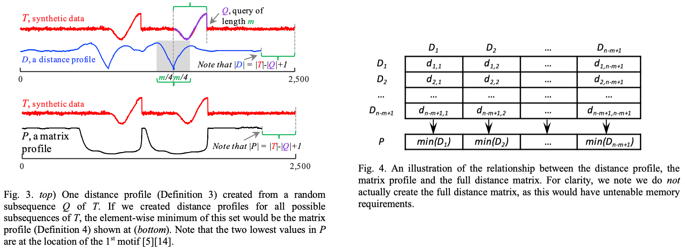

时间序列分析是一种通过对一系列按时间顺序排列的数据进行统计和数学分析的方法。这种分析通常用于揭示数据中的趋势、季节性、周期性和其他模式，以便进行预测或解释


## *Similarity Join*

### 定义

Similarity Join 是指在数据库中查找相似元素的操作。在这个上下文中，相似性是根据某种度量来定义的，例如编辑距离、余弦相似度、Jaccard相似度等。相似性连接旨在找到数据库中两个表或数据集中相似的记录

具体来说，相似性连接通常用于处理这样的问题：给定两个数据集，每个数据集包含一些记录，任务是找到这两个数据集中相似的记录对。这在数据清洗、数据集集成和数据挖掘等领域中很常见

举例来说，假设有两个包含用户信息的数据集，它们使用不同的模式和格式，但是表示相同的实体（例如，用户）。相似性连接的目标就是找到这两个数据集中表示同一个用户的相似记录

实现相似性连接通常需要定义相似性度量，并使用索引结构和算法来高效地找到相似的记录。这个过程可能涉及到计算所有记录之间的相似性得分，然后根据某个阈值或排名来确定哪些记录被认为是相似的

### 例子

假设有两个包含用户信息的数据集，分别是数据集A和数据集B，它们都包含以下字段：

```
用户ID | 用户姓名 | 电子邮件地址 | 手机号码
```

这两个数据集代表的是同一组用户信息，但由于来源不同，字段名不同，可能存在一些格式差异或拼写错误。现在的任务是通过相似性连接找到这两个数据集中相同用户的匹配记录

在这种情况下，可以使用编辑距离作为相似性度量，衡量字符串之间的相似程度。通过计算姓名字段、电子邮件地址和手机号码之间的编辑距离（Edit Distance 是一种用于衡量两个字符串之间相似性的度量方法。编辑距离指的是从一个字符串转换为另一个字符串所需的最小编辑操作次数，允许的编辑操作包括插入 Insertion、删除 Deletion 和替换Substitution），可以确定两个数据集中哪些记录是相似的

例如，如果数据集A中有一条记录：

```
用户ID | 用户姓名    | 电子邮件地址           | 手机号码
101      John Doe    john.doe@example.com   123-456-7890
```

而数据集B中有一条记录：

```
用户ID | 用户姓名    | 电子邮件地址           | 手机号码
101      John Doe    john.doe@example.com   123-456-7891
```

通过计算姓名、电子邮件地址和手机号码的编辑距离，可以得到相似度得分。如果相似度得分超过一个预定义的阈值，就可以认为这两条记录是相似的，从而进行相似性连接，建立两个数据集中相同用户的对应关系

# Matrix Profile

Matrix Profile是一种通用的时间序列挖掘工具，其可用于多种用途，包括异常检测 anomaly detection，主题发现 motif discovery，分类 classification 以及分割 segmentation 等等

## *定义*

https://blog.csdn.net/qq_33431368/article/details/129905458



* *Time Series*: A time series $T$ is a sequence of real-valued numbers $t_i$: $T=t_1,\ t_2,\ \dots,\ t_n$ where n is the length of $T$

* *Subsequence*: A subsequence $T_{i,m}$ of a time series $T$ is a continuous subset of the values from $T$ of length $m$ starting from position $i$. Formally, $T_{i,m}=t_i,\ t_{i+1},\ \dots,\ t_{i+m-1}$, where $1 \leq i \leq n-m+1$. In short, A local region of time series is called a subsequence

  上图中 $Q$ 就是一个长度为 $m$ 的 $T$ 的subsequence

* *Distance Profile*:  A distance profile $D_i$ of time series $T$ is a vector of the Euclidean distances between a given query subsequence $T_{i,m}$ and each subsequence in time series $T$. Formally, $D_i=\left[d_{i,1},\ d_{i,2},\ \dots,\ d_{i,n-m+1}\right]$, where $d_{i,j}\left(1\leq i,\ j\leq n- m+1\right)$ is the distance between $T_{i,m}$ and $T_{j,m}$。简而言之就是把 $T$ 先分成长度为 $m$ 的subsequence，然后让这些subsequence做join形成一个 $D$ 矩阵

  * Assumption: the distance is measured by Euclidean distance between z-normalized subsequences
  * By definition, the $i^{th}$ location of distance profile $D_i$ is zero, and very close to zero just before and after this location. Such matches are called *trivial matches* in the literature
  * By ignoring an "exclusion zone" of length $m/4$ before and after the location of the query, i.e. grey area in Fig.3 top, we eliminated such trivial matches
  * In practice, just set $d_{i,j}$ to $\infty$ for $\left(i-m/4\leq j\leq i+m/4\right)$ while evaluating $D_i$

* *Matrix Profile*: A matrix profile $P$ of time series $T$ is a vector of the Euclidean distances between each subsequence $T_{i,m}$ and its nearest neighbor (closest match) in time series $T$. Formally, $P=\left[\min{\left(D_1\right)},\ \min{\left(D_2\right)},\ \dots, \min{\left(D_{n-m+1}\right)}\right]$, where $D_i\left(1\leq i\leq n- m+1\right)$ is the distance profile $D_i$ of time series $T$

* *Matrix Profile Index*: A matrix profile index $I$ of time series $T$ is a vector of integers: $I=\left[I_1,\ I_2,\ \dots,\ I_{n-m+1}\right]$, where $I_i=j$ if $d_{i,j}=\min{\left(D_i\right)}$

### 补充：Z-normalization

Z-normalized Euclidean Distance则是在计算欧氏距离之前，对向量进行标准化处理。标准化的过程包括两个步骤：

1. **零均值化 Zero-mean normalization：** 对每个维度的数据减去该维度上的均值，使得数据的均值为零
2. **单位方差化 Unit variance normalization：** 将每个维度的数据除以该维度上的标准差，使得数据的方差为一

标准化后，两个向量的每个维度都具有相似的尺度，从而避免了在距离计算中某些维度的影响过大。然后，对标准化后的向量计算欧氏距离，即为Z-normalized Euclidean Distance

这种距离度量常用于数据挖掘、模式识别和聚类等领域，特别是当不同维度的尺度差异较大时，通过标准化可以提高距离度量的鲁棒性

## *STAMP*

STAMP,  **S**calable **T**ime series **A**nytime **M**atrix **P**rofile

Anytime 是指算法具有一种灵活性，允许在任何时候停止运行并返回当前的结果，而不必等待整个算法执行完毕。这个特性对于大规模时间序列数据的处理非常有用，因为它允许在算法运行的任何阶段获得部分结果，从而在时间和计算资源有限的情况下提供一些答案

## *STOMP*

STOMP, **S**calable **T**ime series **O**rdered-search **M**atrix **P**rofile