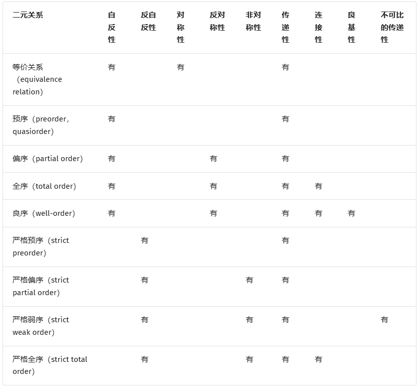
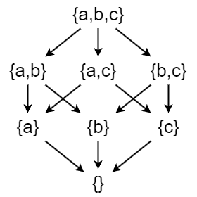
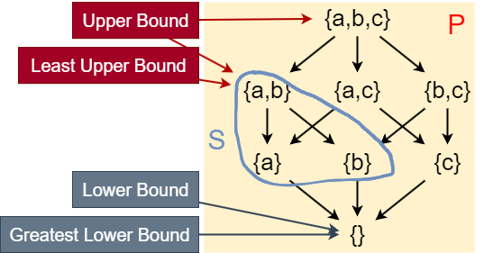

# 逻辑

这一部分看 *GrundlageKI.md*

[递归相关的形而上思考整理 (miao1007.github.io)](https://miao1007.github.io/a13f3492-b3d6-11ec-bc8b-a33112d068ea/)

[(21 封私信 / 80 条消息) 数学家在知道哥德尔不完备定理后为何还继续研究数学？ - 知乎 (zhihu.com)](https://www.zhihu.com/question/311997208/answer/782302485)

[数理逻辑及其 python 实现 (hugchange.life)](https://www.hugchange.life/posts/2023_mathlogicpy/index.html)

# 集合、函数、序列

## *集合与元组*

### 集合的定义与形式化描述

集合 set 是一组对象，把它看成一个整体。集合中可以包含任何类型的对象，包括数、符号甚至是其他集合，集合中的对象称为它的元素 element 或成员 member

有两种常用的方式来描述集合

1. 花名册方法 roster method：用大括号 $\left\{\right\}$ 来逐个列出集合的元素

   有时候用花名册方法表示集合时并不列出它的所有元素。先列出集合中的某些元素，当元素的一般规律显而易见时就用省略号 $\dots$ 代替

2. 集合构造器 set builder：我们通过描述作为集合的成员必须具有的性质来刻画集合中的那些元素。一般的形式是采用记号 $\{x|x具有性质P\})$，并读
   作满足 P 的所有 x 的集合

   例如，小于 10 的所有奇数的集合 O 可以写成
   $$
   O=\left\{x|x是小于10的正奇数\right\}
   $$

用符号 $\in$ 和 $\notin$ 来分别表示集合成员和非集合成员，读作属于和不属于

集合与描述它的元素的排列顺序无关，也不考虑其元素的重复，即 $\left\{1,2,3\right\}$ 和  $\left\{1,1,1,2,2,3\right\}$ 是相同的集合。若要考虑元素出现的次数，则把它称为多重集合 multiset

### 常用的特殊集合

* 空集 empty set/null set $\emptyset$ 是不包含任何元素的集合

* 元素集 singleton set 是只有一个元素的集合。注意：$\left\{\emptyset\right\}$ 是单元素集而不是空集

* 无穷集合 infinite set 是包含无穷多元素的集合，不可能列出无穷集合的所有元素，所以有时用记号 $\cdots$ 来表示集合的元素将永远持续下去

* 数字集合，用粗体字母表示

  * 自然数集 set of natural number $\bold{N}=\left\{1,2,3,\cdots\right\}$

  * 整数集 set of integers  $\bold{Z}=\left\{\cdots,-2,-1,0,1,2,\cdots\right\}$
  * 正整数集 set of positive integers  $\bold{Z^+}=\left\{1,2,\cdots\right\}$
  * 有理数集 set of rational number $\bold{Q}=\left\{p/q|p\in\bold{Z},q\in\bold{Z},\ and\ q\neq0\right\}$

  * 实数集 $\bold{R}$
  * 正实数集 $\bold{R}^+$
  * 复数集 $\bold{C}$

### 子集

对于两个集合 A 和 B，若 A 的每个成员也是 B 的成员，则称 A 为 B 的子集 subset，记作 $A\subseteq B$，若 A 为 B 的子集且不等于 B，那么 A 为 B 的真子集 proper subset，记作 $A\subset B$

为了证明两个集合 A 和 B 相等，需要证明 $A\subseteq B$ 和 $B\subseteq A$

### 集合的大小

令 S 为集合。如果 S 中恰有 n 个不同的元素，这里 n 是非负整数，我们就说 S 是有限集，而 n 是 S 的基数。S 的基数记为 $|S|$

术语基数 cardinality 来自于将术语基数 cardinal number 作为一个有限集的大小的常用语

### 幂集

集合与序列可以作为其他集合或序列的元素，**A 的幂集 power set 为 A 的所有子集的集合**，表示为 2^A^ 或 $\mathcal{P}(A)$。比如 $A=\left\{0,1\right\}$ 的幂集为 $\left\{(0,0),(0,1),(1,0),(1,1)\right\}$。当 $A$ 为有限集时，$\#A=n$，则 $\mathcal{P}(A)$ 的元素数为
$$
C_n^0+C_n^1+\cdots+C_n^n=2^n
$$

### 有序集

有时候元素聚集中其次序是很重要的。由于集合是无序的，所以就需要用一种不同的结构来表示有序的聚集。这就是有序 n 元组

有序 n 元组 ordered n-tuple $a_1,a_2,\dots,a_n$ 是以 a~1~ 为第 1 个元素，a~2~ 为第 2 个元素，a~n~ 为第 n 个元素的有序聚集

特别将有序二元组 $(a_1,a_2)$ 称为有序对/序偶 ordered pair 

### 笛卡尔积

集合 A 和 B 的笛卡尔积 Cartesian product 或叉积 cross prodcut A×B 为第一个 A 的元素和第二个 B 的元素的所有**有序对**组成的结合，注意顺序是很重要的！
$$
A\times B=\left\{(a,b)|a\in A\wedge b\in B\right\}
$$
比如 $A=\left\{1,2\right\}$ 和 $B=\left\{x,y,z\right\}$ 的笛卡尔积为
$$
A\times B=\left\{(1,x),(1,y),(1,z),(2,x),(2,y),(2,z)\right\}
$$
集合自身的笛卡尔积可以写作 $\overbrace{A\times A\times\cdots\times A}^{k}=A^k$

对于两个以上的集合也可以定义笛卡儿积。集合 $A_1,A_2,\cdots,A_n$ 的笛卡尔积用 $A_1\times A_2\times\cdots A_n$ 表示，是有序 n 元组 $a_1,a_2,\dots,a_n$ 的集合，其中 a~i~ 属于 A~i~
$$
A_1\times A_2\times\cdots A_n=\left\{(a_1,a_2,\dots,a_n)|a_i\in A_i,i=1,2,\dots,n\right\}
$$
笛卡儿积 A×B 的一个子集 R 被称为从集合 A 到集合 B 的关系 relation。R 的元素是有序对，其中第一个元素属于 A 而第二个元素属于 B。例如，$R=\left\{(a,0),(a,1),(a,3),(b,1),(b,2),(c,0),(c,3)\right\}$ 是从集合 $\left\{a,b,c\right\}$到 集合 $\left\{0,1,2,3\right\}$ 的关系，它也是一个从集合 $\left\{a,b,c,d,e\right\}$ 到集合 $\left\{0,1,3,4\right\}$ 的关系。（这解释了一个关系不一定要包含 A 的每个元素的有序对 $(x,y)$）。从集合 A 到其自身的一个关系称为是 A 上的一个关系

## *函数*

## *序列 & 求和*

### 序列

序列 sequence 是某些元素或成员按某种顺序排成的一个列表，通常把它写在一对圆括号来指明它为一个序列，比如 $(1,2,3)$

在集合中不用考虑元素

的顺序和重复性，但在序列中要考虑元素的顺序和重复性，此时$\left(1,2,3\right)$ 和  $\left(1,1,2,1,2,3\right)$ 是两个不同的序列

与集合一样，序列也可以分为是有穷序列或者无穷序列，通常**把有穷序列称为多元组 tuple**，比如k个元素的序列称为 k 元组 k-tuple，二元组可以特殊地称为有序对 ordered pair

# 数论

数学中专门研究整数集合及其性质的分支称为数论

# 归纳 & 递归

# 高级计数技术

## *鸽巢原理*

鸽巢原理 Pigeonhole Principle，也称为狄利克雷抽屉原理 Dirichlet Drawer Principle，是一个简单但非常强大的数学原理，广泛应用于组合数学、计算机科学、密码学等领域。它的核心思想是：如果有更多的鸽子（物品）放入较少的鸽巢（容器）中，那么至少有一个鸽巢中必须包含多于一只的鸽子

* 鸽巢原理：如果 k+1 个或更多的物体放入 k 个盒子，那么至少有一个盒子包含了 2 个或更多的物体
* 广义鸽巢原理（引申了倍数关系）：设 n 和 k 是正整数，如果将 k 个物品放入 n 个容器中，且 k>n，则至少有一个容器中至少包含 $\lceil k/n\rceil$ 个物品

**换句话说，如果资源有限（鸽巢），而对象（鸽子）数量超过资源容量，必然会出现重复**

### 用于证明迭代收敛

一个应用在于证明不动点定理的收敛性

鸽巢原理可以用来证明迭代收敛的关键在于：

- **状态空间有限**：如果迭代过程中的可能状态是有限的，那么根据鸽巢原理，经过足够多的迭代后，某些状态必然会重复出现
- **重复状态导致收敛**：如果迭代规则是确定性的（即相同的输入总是产生相同的输出），那么一旦某个状态重复出现，后续的迭代过程就会进入一个循环，从而收敛到一个稳定状态或周期

# 关系

## *关系及其性质*

### 关系的定义

在笛卡尔积中提到过关系的定义，这里再给出一遍

设 A 和 B 是集合，一个从 A 到 B 的二元关系是 A×B 的子集

换句话说，一个从 A 到 B 的二元关系是集合 R，其中每个有序对的第一个元素取自 A 而第二个元素取自 B。我们使用记号 aRb 表示 $(a, b)\in R$，$a\cancel{R}b$ 表示 $(a, b)\notin R$。当 (a, b) 属于 R 时，称 **a 与 b 有关系 R**

另外，**集合 A 上的关系是从 A 到 A 的关系**

### 关系的性质

* 自反性 Reflexivity：若对每个元素 $a\in A$ 有  $(a,a)\in R$，那么定义在集合 A 上的关系 R 称为自反的。记作 aRa，a 是 A 中任意一个元素

  形式化表达：若 $\forall a((a,a)\in R)$，则 R 是集合 A 上的自反关系，这里的论域是 A 中所有元素的集合

* 对称性 Symmetricity：对于任意 $a,b\in A$，若只要 $(a, b)\in R$ 就有 $(b,a)\in R$，则称定义在集合 A 上的关系 R 为对称的

  形式化表达：若 $\forall a\forall b((a,b)\in R\rightarrow(b,a)\in R)$，则称定义在集合 A 上的关系 R 为对称的

* 反对称性 Antisymmetricity：对于任意 $a,b\in A$，若 $(a,b)\in R$ 且 $(b,a)\in A$，一定有 a = b，则称定义在集合 A 上的关系 R 为反对称的 

  形式化表达：对于任意 $a,b\in A$，若 $(a,b)\in R$ 且 $(b,a)\in R$，一定有 a = b，则称定义在集合 A 上的关系 R 为反对称的

* 传递性 Transitivity：若对于任意 $a,b,c\in A$，$(a,b)\in R$ 并且 $(b,c)\in R$ 则 $(a,c)\in R$，那么定义在集合 A 上的关系 R 称为传递的

  形式化表达：若 $\forall a\forall b\forall c(((a,b)\in R\wedge(b,c)\in R)\rightarrow(a,c)\in R)$ 则 $(a,c)\in R$，那么定义在集合 A 上的关系 R 称为传递的

注意：**对称与反对称的概念不是对立的**，因为一个关系可以同时有这两种性质或者两种性质都没有。一个关系如果包含了某些形如 $(a,b)$ 的有序对，其中 $a\neq b$，则这个关系就不可能同时是对称的和反对称的

### 关系的组合

除了常见的并∪、交 ∩、差 - 、异或 ⊕，还有一些新的组合方式

* 关系的合成
* 关系的幂

## *n 元关系*

设 $A_1,A_2,\cdots,A_n$ 是集合，定义在这些集合上的 n 元关系是 $A_1\times A_2\times\cdots A_n$ 的子集。这些集合 $A_1,A_2,\cdots,A_n$ 称为关系的域 domain，n 称为关系的阶

下面我们会讨论 n 元关系在 CS 领域的一个重要应用，即关系型数据库。这部分在 *数据库理论.md* 中有更详细、更直观的说明

### n 元关系 & 关系型数据库

关系型数据库由记录 record 构成，这些记录是由域 domain 构成的 n 元组。这些域是 n 元组的数据项

例如，学生记录的数据库可以由包含学生的姓名、学号、专业、平均学分绩点 GPA 的域构成。关系数据模型把记录构成的数据库表示成一个 n 元关系。于是，学生记录可以表示成形如 `(学生姓名, 学号, 专业, GPA)` 的4元组

用于表示数据库的关系也称为表，因为这些关系常常用表来表示。表中的每个列对应于数据库的一个属性

当 n 元组的某个域的值能够确定这个 n 元组时，n 元关系的为这个域就叫作**主键 primary key**。这就是说，当关系中没有两个 n 元组在这个域有相同的值时，这个域就是主键

在一个 n 元关系中，域的组合也可以唯一地标识 n 元组。当一组域的值确定一个关系中的元组时，这些域的笛卡儿积就叫作**复合主键 composite primary key**

### n 元关系的运算

* select 选择：设 R 是一个 n 元关系，C 是 R 中元素可能满足的一个条件。那么选择运算符 s~C~ 将 n 元关系 R 映射到 R 中满足条件 C 的所有 n 元组构成的 n 元关系
* project 投影：投影 $P_{i_1,i_2,\dots,i_m}$，其中 $i_1<i_2<\cdots<i_m$，将 n 元组 $a_1,a_2,\dots,a_n$ 映射到 m 元组 $a_{i_1},a_{i_2},\dots,a_{i_n}$，其中 m ≤ n
* join 连接：设 R 是 m 元关系，S 是 n 元关系。连接运算 J~p~(R, S) 是 m+n-p 元关系，其中 p ≤ m 和 p ≤ n，它包含了所有的 (m+n-p) 元组 $(a_1,a_2,\cdots,a_{m-p},c_1,c_2,\cdots,c_p,b_1,b_2,\cdots,b_{n-p})$，其中 m 元组 $(a_1,a_2,\cdots,a_{m-p},c_1,c_2,\cdots,c_p)$ 属于 R 且 n 元组 $(c_1,c_2,\cdots,c_p,b_1,b_2,\cdots,b_{n-p})$ 属于 S

## *关系的闭包*

## *等价关系*

定义在集合 A 上的关系叫作等价关系，如果它是自反的、对称的和传递的

如果两个元素 a 和 b 由于等价关系而相关联，则称它们是等价的。记法 a\~b 通常用来表示对于某个特定的等价关系来说，a 和 b 是等价的元素

## *偏序 & 全序 & 拟序*

符号 $\preceq$（表示偏序关系的 precedes or equal to）

[序理论 - OI Wiki](https://oi-wiki.org/math/order-theory/#有向集与格)

### 偏序

偏序关系 Partial Order 是一种二元关系满足以下三个条件：

- 自反性：x $\sqsubseteq$ x
- 反对称性：x $\sqsubseteq$ y, y $\sqsubseteq$ x, 则 x = y
- 传递性：x $\sqsubseteq$ y, y $\sqsubseteq$ z, 则 x $\sqsubseteq$ z

所谓偏序集合 Partially Ordered Set, Poset，就是一个由集合 P 和偏序关系 $\sqsubseteq$ 所组成 $(P, \sqsubseteq)$ 对，**偏序集就是集合中只有部分成员能够互相比较大小**

偏序关系 partial order 与全序关系 total order 的区别在于，**全序关系可以让任意两个元素比较，而偏序关系不保证所有元素都能进行比较 incomparable**

比如说有一个 Poset $(S,\sqsubseteq)$，其中 S 是一个 Power Set，$\sqsubseteq$ 则代表着 $\subseteq$，很明显它是满足偏序集的三个性质的

### 全序

全序 Total Order 是一种特殊的偏序，满足以下额外条件：

- 全可比性：对于任意两个元素 a 和 b，**要么** a ≤ b，**要么** b ≤ a（注意这里 ≤  不不仅仅代表小于等于，而是更 general 地表示全序的意思）
- 换句话说，若一个偏序关系中，每个元素都是可比的，则称为全序关系

全序集 Totally Ordered Set 是指配备了全序关系的集合。全序集中的任何两个元素都是可比的

**例子**：

- 实数集上的标准大小关系是一个全序
- 字母表上的字典序也是一个全序

### 拟序

拟序（Quasiorder，也称为预序，Preorder）是集合论和序理论中的一种二元关系，它比偏序更一般化，但比完全无约束的关系更结构化。拟序满足自反性和传递性，但不一定满足反对称性

### Upper & Lower Bounds

对于偏序集中的某子集 S 来说：

- 若存在元素 u 使得 S 的任意元素 x 有 x $\sqsubseteq$ u，那么我们说 u 是 S 的上界 Upper bound
- 若存在元素 l 使得 S 的任意元素 x 有 l $\sqsubseteq$ x，那么我们说 l 是 S 的下界 Lower bound

然后我们衍生出最小上界和最大下界的概念：

- 在 S 的所有上界中，我们记最小上界（Least Upper Bound, LUB or **join**）为 $\sqcup S$，满足所有上界 u 对 LUB 有： $\sqcup S \sqsubseteq u$
- 在 S 的所有下界中，我们记最大下界（Greatest Lower Bound, GLB or **meet**）为 $\sqcap S$，满足所有下界 l 对 LUB 有： $l\sqsubseteq\sqcap S$

当 S 的元素个数只有两个 $\{a, b\}$ 时，我们还可以有另一种记法：

- 最小上界：$a \sqcup b$, a join b
- 最大下界：$a \sqcap b$, a meet b

并不是每个偏序集都有 LUB 和 GLB，但是如果有，那么该 LUB, GLB 将是唯一的。（可假设存在多个，然后用自反性证明它们是同一个）

还是用 Power Set P 来说，假设它有一个子集 S

### Lattice

给定一个偏序集 P，如果它的任意元素对 $\{a, b\}\in P$ 都有 LUB & GLB，那么这么偏序集 P 就叫做 **lattice 格**

- 属于 lattice 的：小于等于关系，子集关系
- 不属于 lattice 的：子串关系

如果在此之上更加严格一些，任意集合都存在 LUB & GLB，那么我们说这个 lattice 为 **complete lattice 全格/完备格**

- 属于全格的：子集关系
- 不属于全格的：小于等于关系，因为全体正整数没有一个边界

如果偏序集任意两元素的上下界仅有其 LUB & GLB，那么称该偏序集为**半格 join/meet Semilattice**

每一个全格都存在着**最大元素 $\top$ top 和最小元素 $\bot$ bottom**，他们分别是整个集合的 LUB & GLB

如果一个 lattice 是有穷的，那么它一定是一个全格

然而，一个全格不一定是有穷的，例如 `[0, 1]` 之间的实数是无穷的，但是期间的小于等于关系可以使其成为全格

另外还有 **Product Lattice**，多个 lattice 的笛卡尔积也能形成一个新的 lattice

- product lattice 也是一个 lattice
- 如果 product lattice L 是全格的积，那么 L 也是全格

### Hasse Diagram

Hasse Diagram 哈塞图是偏序的一种可视化表示，它省略了由于自反性和传递性而必须出现的边，因为每一个元素必须有自反关系，因为传递性而产生的边可以删除，因为这些边必须存在。我们只需要画出一些完全由关系的要求而产生的边（不能是传递性产生的边），也就是覆盖关系

### 严格弱序

严格弱序在 C++ STL 中有应用，具体可以看 *STL.md*

## *拓扑关系*
