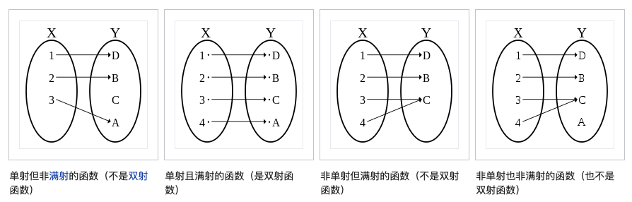
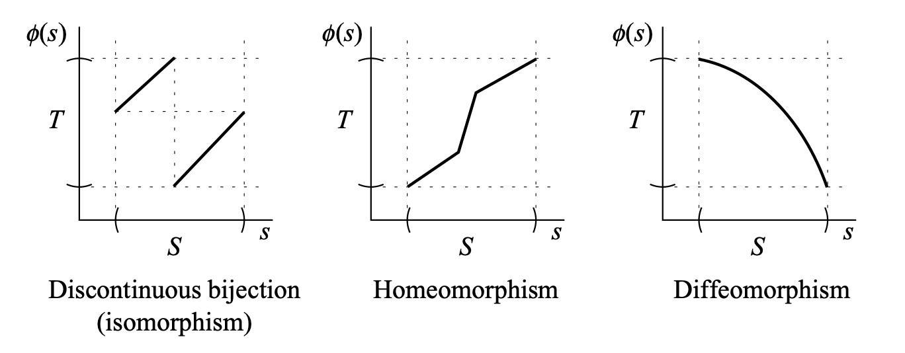
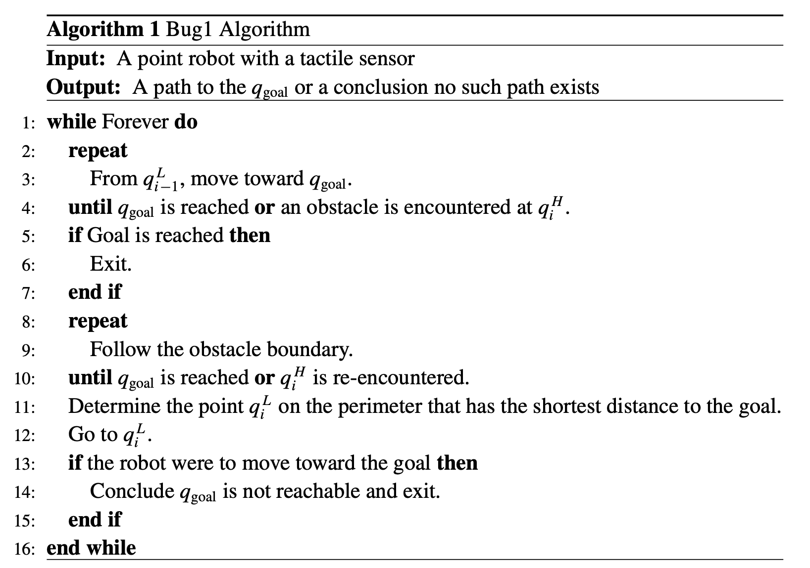
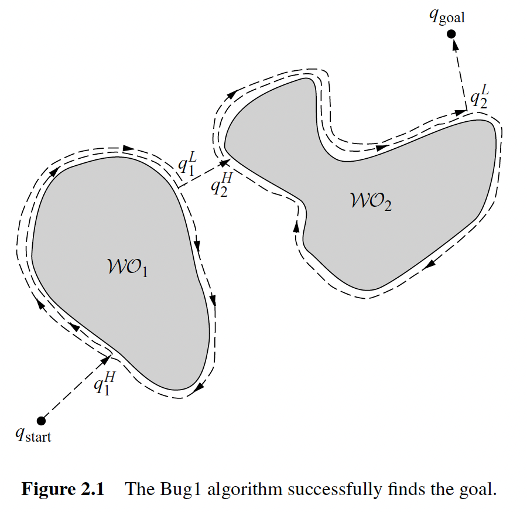
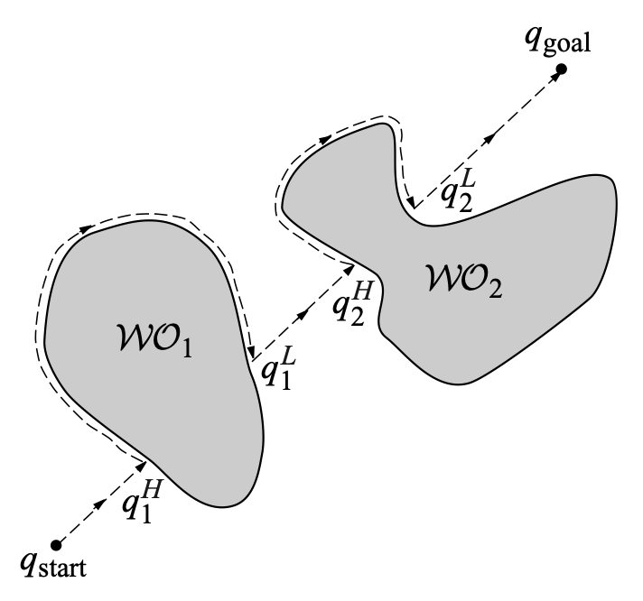
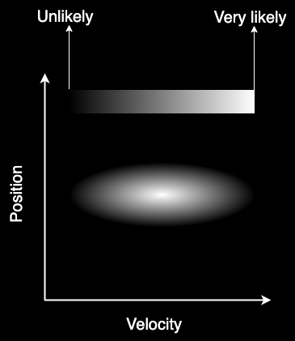

# Configuration Space

## *数学定义*

### Workspace

在RMP中假设机器人都是在2D平面 $\R^2$ 或3D $\R^3$ 空间中的，这种空间也被称为 **Workspace **$\mathcal{W}$。$\mathcal{W}$ 中经常会有障碍 Obstacles，将 $\mathcal{WO}_i$ 记作第 $i$ 个障碍。Free workspace 是扣除了障碍的无障碍空间 $\mathcal{W}_{free}=\mathcal{W}\textbackslash\bigcup_i{\mathcal{WO_i}}$

### 构型空间定义

Motion Planning一般都不会在 Workspace 中进行，而是在 Configuration space/C-space $\mathcal{Q}$ 构型空间中来进行

机器人系统的一个Configuration 构型是对该系统每个点位置的完整说明。机器人系统的Configuration space/C-space，是系统所有可能Configuration的空间。因此Configuration就是这个抽象Configuration space中的一个点。在本文中，我们用 $q$ 表示一个Configuration，用 $\mathcal{Q}$ 表示构型空间。**机器人系统的DOF是 $Q$ 的维度，或者是指定Configuration所需的最小参数数量**

用 $R(q)$ 来表示机器人不同 Configuration 对应的一系列Workspace中的点，因此Obstacle在C-space中的表示就是Workspace中机器人和Obstacle交点转换过来，即 $\mathcal{QO}_i=\left\{q|R(q)\bigcap\mathcal{WO}_i\neq\empty\right\}$。和之前一样可以定义 Free configuration space 为 $\mathcal{Q}_{free}=\mathcal{Q}\textbackslash\bigcup_i{\mathcal{QO_i}}$

### 为什么要用Configuration space？

1. 简化表示：构型空间提供了对机器人姿态的抽象表示，不需要考虑具体的环境和物体几何形状。这样可以将复杂的运动规划问题简化为在高维构型空间中寻找合适的路径
2. 避免碰撞检测复杂性：在工作空间中进行运动规划时，需要考虑环境中的障碍物和机器人的物体几何形状。这会涉及到复杂的碰撞检测算法和几何计算。而在构型空间中进行规划，避免了这些复杂性，因为碰撞检测可以在抽象的构型空间中进行
3. 多自由度支持：构型空间可以很容易地表示机器人的多自由度运动，每个自由度对应一个维度。这使得在构型空间中规划路径更加灵活和高效

尽管构型空间提供了简洁和抽象的表示，但在实际运动执行过程中，需要将构型空间中的路径映射回工作空间，以实现实际的机器人运动。这涉及到逆运动学和轨迹插值等技术

### Path

Path planning 和 Motion planning 是有区别的

* Path是在C-space中的连续曲线，它由一个连续函数表示，将某个路径参数（通常取在单位区间 $[0, 1]$内）映射到 $\mathcal{Q_{free}}$ 中的一条曲线。单位区间的选择是任意的；任何参数化方式都可以。路径规划问题的解 $c\in C^0$ 是一个连续函数
  $$
  c:[0,1]\rightarrow\mathcal{Q}\ where\ c(0)=q_{start},\ c(1)=q_{goal}\ and\ c(s)\in Q_{free}\ \forall s\in[0,1]
  $$

* 当用 $t$ 参数化的时候，$c(t)$ 是一个轨迹，速度和加速度可以被计算出来，这也就是说 $c$ 至少是二阶可导的，找到一个可行的轨迹被称为Trajectory planning/Motion planning

路径 $C:[0,1]\rightarrow cl\left(Q_{free}\right)$ 被称为半自由路径 ，其中 $cl\left(Q_{free}\right)$ 表示 $Q_{free}$ 的闭包。自由路径与半自由路径的区别在于机器人是否被允许与障碍物的边界接触。书中一般假设自由空间 $Q_{free}$ 是开集合，简单理解 $cl\left(Q_{free}\right)$ 就是与之相对应的闭集合，即在开集合的基础上加上边界点

## *Topology*

### Intro

拓扑学是数学的一个分支，研究空间的性质和变形的规律，而不依赖于度量和距离的概念。它关注的是形状、连通性和变换等概念，而不关注具体的度量或距离。

在拓扑学中，研究的对象可以是各种各样的空间，包括点、线、曲面、多维空间以及更抽象的空间结构。**拓扑学家关注的是空间中的性质和结构如何在连续变形下保持不变**。下面这张图非常传神

> 著有《一般拓扑学》一书的数学家[约翰·L·凯利](https://zh.wikipedia.org/wiki/约翰·L·凯利)曾说：拓扑学家为不知甜甜圈与咖啡杯之分别者。 -- wikipedia

拓扑学的核心概念包括：

1. 拓扑空间 Topology space：拓扑学研究的基本对象，它是一个集合，其中定义了一组满足一定公理的子集，称为开集。拓扑空间的定义不依赖于距离度量，而是基于集合之间的包含关系
2. 连通性 Connectivity：拓扑学研究空间的连通性，即空间中的点如何通过连续的路径相互连接。连通性可以分为强连通性和弱连通性，用于描述空间中的连续性和连通性程度
3. 同伦 Homotopy：同伦是拓扑学中的一个重要概念，用于描述空间中的变形和形状的等价性。如果两个空间可以通过**连续的变形**相互转化，它们被认为是同伦等价的
4. 不变量 Invariant：拓扑学研究中使用不变量来描述空间的性质和结构。不变量是一种在拓扑变换下保持不变的量，它们可以用于区分不同的空间，或者刻画空间的某些特性

### Homeomorphisms 同胚

对于一个映射 $\phi:S\rightarrow T$

1. Surjection 满射： 一个函数或映射被称为满射，若它的值域（或称为陪域）T等于或包含在目标集合中的每个元素。换句话说，对于目标集合中的每个元素，**至少存在一个定义域中的元素与之对应**。满射也被称为"onto"映射

2. Injection 单射： 一个函数或映射被称为单射，**若它的定义域S中的每个元素映射到目标集合T中的不同元素且最多映射一个**。换句话说，不同的定义域元素不会映射到相同的目标元素。单射也被称为"one-to-one"映射

3. Bijection 双射

   * 一个函数或映射被称为双射，**如果它是满射且单射**。换句话说，双射是一种既有一对一映射又有映射到每个元素的映射。对于双射，每个目标集合中的元素都有一个唯一的对应元素在定义域中。双射也被称为"one-to-one correspondence"映射
   * 双射具有良好的性质：对于任何T中的值，都可以找到它的逆，即可以在S和T之间任意转换

4. Discontinuous bijection (isomorphism) 同构

5. Homeomorphism 同胚映射： 同胚映射是拓扑空间之间的一种映射关系，它保持了空间的拓扑性质。若 $\phi:S\rightarrow T$ 是双射的，且 $\phi$ 和 $\phi^{-1}$ 都是连续的，那么称 $\phi$ 为Homeomorphism，S和T都是homeomorphic

6. Diffeomorphism 微分同胚映射： 微分同胚映射是微分流形之间的一种映射关系，它保持了流形的微分结构。如果存在两个微分流形M和N以及从M到N的映射 $f$ 和从N到M的映射 $g$，使得 $f$ 和 $g$ 都是**光滑**的，并且 $f$ 和 $g$ 的复合映射等于各自的身份映射，那么 $f$ 和 $g$ 被称为微分同胚映射，而M和N则称为微分同胚的

   

### 同胚和同伦的关系

同胚是指两个拓扑空间之间存在一种一一映射，这个映射和其逆映射都是连续的。换句话说，如果两个拓扑空间可以通过一个连续的双射来互相映射，那么它们就是同胚的。同胚可以理解为两个空间之间的一种对应关系，它保持空间的拓扑性质不变，包括点的连通性、开集的性质等。如果两个空间是同胚的，它们在拓扑学上被认为是完全等同的

而同伦则是一个更为宽松的概念。同伦定义了一种连续的变形过程，将一个空间逐渐变形为另一个空间，而变形过程中的每个中间状态也是合法的拓扑空间。同伦关注的是连续变形的过程，而不关注变形的细节。如果两个拓扑空间可以通过一个连续的变形过程相互转化，那么它们是同伦等价的。同伦等价关系可以看作是同胚关系的更加宽松的版本

同胚和同伦有什么区别？可以简单理解为，同胚关注空间之间的一一对应关系，而同伦关注空间之间的连续变形关系。同胚是更严格的关系，它要求映射是双射且连续的，而同伦则更为宽松，只要存在连续的变形过程即可。同胚关系保持了空间的所有拓扑性质，而同伦关系只保持了一些基本的连通性质

### 连通性和紧凑性

* 连通性 Connectedness
* 紧凑性 Compactness

### 为什么要关注拓扑关系？

* 拓扑关系影响我们对构型空间的表示
* 若我们的路径规划算法在某一个构型空间上有效，那么在其拓扑等价的构型空间上也基本有效

## *例子*

### Circular Mobile Robot

Grid-based representation（基于网格的表示）是一种常见的构型空间表示方法。

在基于网格的表示中，构型空间被划分为一个二维或三维的网格。每个网格单元表示一个离散的构型，包括机器人或物体的位置和姿态。这些网格单元可以被标记为自由区域（表示可通过的区域）或障碍物区域（表示不可通过的区域）。通过将环境中的障碍物与自由区域相对应，我们可以在网格中建立一个表示环境的地图。

在基于网格的表示中，路径规划问题可以转化为在网格中搜索一条从起始构型到目标构型的路径。常用的搜索算法如A*算法和Dijkstra算法可以用于在网格中搜索最佳路径。

基于网格的表示具有简单和直观的优点，可以处理多种形状和复杂度的环境。然而，它也存在网格分辨率的权衡，较细的网格可以提供更准确的路径规划结果，但会增加计算和存储开销，而较粗的网格可能导致路径规划的精度损失。因此，在实际应用中，需要根据具体情况选择合适的网格分辨率。

图片对于可视化构型空间中的障碍物是有用的，但它们并不足以规划无碰撞运动。原因是网格仅对位于网格上的离散点编码了碰撞信息。路径不仅包括网格点，还包括连接网格点的曲线上的点

### 2-Joint Arm

## *流形 Manifolds*

### 欧几里得空间

欧几里德空间（Euclidean space）是一种常见的数学空间，用于描述我们日常生活中的物理空间。

欧几里德空间是一个多维实数空间，其中的每个点可以由一组实数坐标来表示。在二维欧几里德空间中，我们用平面笛卡尔坐标系（x，y）来描述点的位置；在三维欧几里德空间中，我们用空间笛卡尔坐标系（x，y，z）来描述点的位置

欧几里德空间具有以下性质：

1. 平行公理：通过点P和不在该直线上的点Q，存在唯一一条直线与给定直线平行。
2. 距离公理：给定两点P和Q，存在唯一的正实数d(P,Q)，表示P和Q之间的距离，并满足非负性、对称性和三角不等式。
3. 点和直线公理：任意两点之间有一条直线通过，且直线上的任意两点也在同一直线上。

欧几里德空间是一个平坦的空间，其中的直线是直的、平行线永远不会相交，并且满足传统的几何规则。我们可以在欧几里德空间中进行几何图形的构造、测量距离、计算角度等。

### 流形

流形 manifold 是一种数学概念，用于描述具有局部平坦性的空间。我们可以将流形想象为柔软的曲面，它可以弯曲和扭曲，但在小范围内看起来类似于欧几里德空间

想象一下我们生活在一个二维的平面世界。这个平面是一个二维流形，因为我们可以在平面上移动，并且任何一点附近都可以找到一个局部的平坦块。但是，如果我们将目光转向地球，我们会发现地球是一个三维流形。虽然地球的表面是弯曲的，但在我们小范围的观察中，它看起来是平坦的

流形可以具有不同的维度。例如，二维平面是一个二维流形，三维空间是一个三维流形。流形可以是有限维的，也可以是无限维的。在现实世界中，我们可以将流形应用于各种领域，如计算机图形学、机器学习、数据分析等。流形的概念帮助我们理解和处理复杂的数据结构，以及在高维空间中进行建模和分析

### 不同的流形

$T^n$: n-dimensional torus 环面

$S^n$: n-dimensional sphere in $\R^n$

嵌入维度（embedding dimension）和内在维度（intrinsic dimension）是两个在数据分析和机器学习领域中常用的概念。

嵌入维度指的是将高维数据映射到低维空间时所选择的目标维度。在许多情况下，原始数据可能具有高维度，但其中的信息可能可以用较低维度的空间来表示。通过选择适当的嵌入维度，我们可以尽可能保留数据的关键信息，同时减少计算和存储的开销。嵌入维度的选择通常是根据具体问题和数据集的特性进行的。

内在维度是指数据集中真正重要的维度，即数据所固有的维度。它是数据集中最有效表示数据的最小维度。内在维度与原始数据的维度不同，它更关注于数据中的结构和模式。通过确定内在维度，我们可以更好地理解数据集的特性，降低数据表示的冗余性，并更有效地进行数据处理和分析。

需要注意的是，嵌入维度和内在维度并不总是相等的。在某些情况下，嵌入维度可能小于内在维度，表示我们可以用更低维度的空间来表示数据。而在其他情况下，嵌入维度可能大于内在维度，表示在较低维度的表示中可能存在一些冗余信息。因此，选择合适的嵌入维度和理解数据的内在维度对于有效的数据分析和机器学习至关重要

### 可微流形

### 

### $\R^n$ 中的流形嵌入 Embeddings of Manifolds

### $SO(3)$ 的参数化

# Bug Algorithm

## *Bug1*

### Intro

Assumptions

* 假设机器人是一个可以准确定位（无定位误差）的点 perfect positioning
* Workspace is bounded 工作空间是有边界的
* 机器人具有感知障碍物边界、测量任意两点距离的能力

Bug1算法的效率很低，但可以保证机器人能到达任何可达的目标（概率完备）

Bug算法大多数情况下被当作是一种避障算法，属于reactive planner ，可以把起始点到目标点的直线连接当作全局路径来理解

### 算法

Bug1算法的思想是最直观的，即在未遇到障碍物时，沿直线向目标运动 motion-go-goal；在遇到障碍物后则沿着障碍物边界绕行 boundray-following，并利用一定的判断准则离开障碍物继续直行。这种应激式的算法计算简便，不需要获知全局地图和障碍物形状，具备完备性。但是其生成的路径平滑性不够好，对机器人的各种微分约束适应性比较差

* Motion-to-goal 向目标直行
* Boundary following 障碍物边界绕行

从遇到障碍时的hit point开始，机器人环绕障碍物移动直至返回 hit point，然后判断出障碍物周边上离目标最近的点，并移到这个点 leave point。开始时，机器人再次沿直线驶向目标，如果这条线仍与当前障碍物相交，则不存在到达目标的路径

### 算法伪代码

起点 $q_{start}=q_0^L$，目标点 $q_{goal}$，连接 $q_i^L$ 和 $q_{goal}$ 的每一段直线称为m-line，$q_i^H$ 称为 hit point，$q_i^L$ 称为 leave point

成功到达目的地

## *Bug2*

### intro

Bug2仍然采用Motion-to-goal和Boundary following，但是与Bug1算法不同的是，Bug2算法中的直线m-line是连接初始点和目标点的直线，**在计算过程中保持不变**。当机器人遇到障碍物时，机器人开始绕行障碍物，若机器人在绕行过程中在距离目标更近的点**再次遇到 m-line** $d(m,q_{goal})<d(q_i^H,g_{goal})$，就停止绕行，然后继续沿着m-line向目标直行，直到抵达目标

### Bug1 vs. Bug2

* Bug1算法会**详尽/完备**地搜索以找到最优的出发点
* Bug2算法会**贪婪**的将找到的第一个比较优的点作为出发点

当障碍物比较简单时，Bug2的贪婪方法效率可能比较高，但是当障碍物很复杂时，Bug2可能会因为贪婪而导致碰到更多的障碍物，从而走很多冤枉路

我们可以定量的分析一下

* Bug1算法：$L_{Bug1}\leq d(q_{start},q_{goal})+1.5\sum\limits_{i=1}^n{p_i}$，1.5是考虑最糟糕的情况：检测1圈，然后需要绕0.5圈到leave point
* Bug2算法：$L_{Bug1}\leq d(q_{start},q_{goal})+0.5\sum\limits_{i=1}^n{n_ip_i}$，$n_i$ 是碰到障碍物 $i$ 的次数

## *Tangent Bug*

TangentBug算法是对BUG2算法的改进。它利用机器人上距离传感器的读数对障碍物做出提前规避，可以获得更短更平滑的机器人路径。假设机器人上安装有360°无限角度分辨率的激光雷达（或者红外距离传感器），那么我们可以测得每束光线到达障碍物的距离

下图中细线表示距离，粗线表示不连续性

Saturated raw distance function
$$
\rho_R(x,\theta)=\left\{\begin{array}{ll}\rho(x,\theta),&if\ \rho(x,\theta)<R\\\infty,&otherwise\end{array}\right.
$$

## *辅助信息*

### Bug-ike算法的核心

Bug-like 算法主要就是两个动作：Motion-to-goal和Boundary following

* Motion-to-goal 可以理解为 $d(\cdot,n)$ 的梯度下降形式，其中 $d(\cdot,n)$ 表示机器人到目标点的距离，$n$ 要么是 $q_{goal}$ 要么是 $O_i$
* Boundary-following 就复杂很多，因为我们并没有障碍物边界的先验知识。因此Bug-like 算法之间主要的区别在于离开障碍物的位置选择

为了到达目的地，我们只能借助传感器感知到的信息，但是一个传感器的能力是有限的，我们只能先确定机器人需要什么信息，然后再确定机器人应移动到哪个位置来获取更多信息，这是所有基于传感器的规划都需要克服的问题

需要解决的三个问题是

* 机器人需要什么信息来绕过障碍物？
* 机器人如何从传感器数据中获取这些信息？
* 机器人如何使用这些信息来确定（局部）路径？

### 切线

### 距离和梯度

### 处理信息：Continuation methods

# Potential Functions

配置空间很难计算一种替代方法是开发搜索算法，在搜索路径的同时逐步“探索”自由空间。其实Bug算法就是在没有构建配置空间的情况下在自由空间中操作，但Bug算法仅适用于简单的二维配置空间。所以下面介绍适用于更丰富机器人类别并生成比Bug方法更多样化路径的导航规划器 navigation planner，即适用于更一般的配置空间类别，包括多维和非欧几里德的配置空间

Potential function 势函数是一个可微的实值函数 $U: \R^m\rightarrow\R$。势函数的值可以看作能量，因此潜力的梯度就是力。梯度是一个向量∇U(q) = DU(q)T= [∂U/∂q1(q), . . . , ∂U/∂qm(q)]T，它指向在局部上最大增加U的方向。有关梯度的更严格定义，请参见附录C.5。我们使用梯度来定义一个向量场，为流形上的每个点分配一个向量。正如其名称所示，梯度向量场为每个点分配了某个函数的梯度。当U表示能量时，梯度向量场具有沿任何闭合路径所做的功为零的属性。

潜力函数方法将机器人的运动视为在梯度向量场中移动的粒子。梯度可以直观地看作作用在正电荷机器人上的力，它被负电荷目标所吸引。

障碍物也具有正电荷，形成了一个排斥力，将机器人引开障碍物。排斥力和吸引力的组合有望将机器人从起始位置引导到目标位置，同时避开障碍物。

# Roadmaps

如第2章和第4章所描述的，规划器从特定的起始配置规划到特定的目标配置。如果我们知道在同一环境中需要规划许多路径，那么构建一次数据结构，然后使用该数据结构来更快地规划后续路径是有意义的。

这个数据结构通常被称为地图，而地图生成是根据传感器数据生成机器人环境模型的任务。当机器人对其环境没有先验信息并且必须依靠传感器收集信息来逐步构建地图时，地图生成变得非常重要。在室内系统的背景下，存在三种地图概念：拓扑地图、几何地图和栅格地图（见图5.1）。

拓扑表示旨在表示具有图形结构的环境，其中节点对应于“某种独特的事物”，而边表示节点之间的邻接关系。例如，地点可以是具有特定区别特征的位置，例如办公楼中的交叉口和T型交叉口，而边可以对应于使机器人能够从一个位置移动到另一个位置的特定行为或运动指令，例如沿墙行走。最近，将拓扑地图与度量信息（例如相对距离、角度）相结合，以帮助消除“外观相似”的地点[108,250,382,418]或将其用于导航[188,213,240,339]变得流行起来。

几何模型使用几何基元来表示环境。地图生成的任务是估计基元参数以最佳拟合传感器观测。在过去，已经使用了不同的表示方法取得了巨大的成功。

许多研究人员使用线段[27,122,169,180,334]来表示环境的部分。流行的方法还使用三角网格[17,161,182,416]来表示环境的三维结构。

最后，占据栅格是类似于第4章描述的栅格结构，其中每个像素的值表示相应的工作空间或配置空间部分被占据的可能性[142]。占据栅格最初是为了使用宽角超声波传感器对未知空间进行地图绘制而引入的；这个主题在第9章中讨论。

本章重点介绍了一类称为路网的拓扑地图[91,262]。路网嵌入在自由空间中，因此路网的节点和边也具有物理意义。例如，路网节点对应于特定位置，边对应于相邻位置之间的路径。因此，除了是一个图形，路网还是一个收集一维流形的集合，捕捉自由空间的显著拓扑。

机器人使用路网的方式与人们使用高速公路系统类似。人们通常不会规划到目的地的每条可能的辅路路径，而是通常规划到高速公路网络，然后沿着高速公路系统行驶，最后从高速公路到达目的地。大部分运动发生在高速公路系统上，将驾驶员从起点附近带到目标附近（图5.2）。

同样地，使用路网，规划器可以通过首先找到到达路网的无碰撞路径，然后穿越路网接近目标，最后从路网上的一个点到目标构建无碰撞路径，构造出机器人自由空间连接组件中任意两点之间的路径。大部分运动发生在路网上，因此搜索不会在多维空间中进行，无论是工作空间还是配置空间。如果机器人了解路网，那么它实际上了解了环境。因此，机器人可以通过依靠传感器数据构建路网，然后使用该路网来规划未来对环境的探索。现在我们正式定义路网。

## *Visibility graph*

## *Deformation retracts*

# Cell Decomposition

单元分解/栅格化

## *Trapezoidal Decomposition*

# Sampling-Based Algorithms

# Kalman Filtering

<https://www.bzarg.com/p/how-a-kalman-filter-works-in-pictures/>

<http://t.csdn.cn/XxCJc>

## *卡尔曼滤波的原理*

### intro

**卡尔曼滤波器可以应用于任何存在不确定信息的动态系统**，并且可以对系统接下来要做的事情做出**有根据的猜测 educated guess**。即使混乱的现实干扰了对系统运动的清晰猜测，卡尔曼滤波器通常也能很好地弄清楚实际发生了什么。而且它可以利用使用者自己可能没有考虑到的各种现象之间的相关性 correlation

在GKI中学习了适用于离散系统滤波的HMM模型（用于离散语素的语言模型），而卡尔曼滤波器则非常适合用于**连续变化**的系统。它们的优点是占用的内存很少（除了**前一个状态**外，它们不需要保留任何历史记录），并且速度非常快，非常适合实时问题和嵌入式系统

### Toy example of robotic

假设我们造了一个很简单的小机器人，当它在移动的时候它需要知道自己的位置用来导航。我们说我们的机器人处于状态 state $\boldsymbol{x}_k=\left[\begin{matrix}p&v\end{matrix}\right]^T$，这个状态只有两个参数，一个是 position $p$， 一个是速度 $v$

所谓的状态 state只不过是用来描述系统的一系列参数组成的一个向量，实际上我们可以取任意参数，只要机器人配备了相关的传感器，比如说温度、重量什么的。因为这里我们给机器人装了一个GPS，所以用的就是position和velocity

GPS传感器告诉了我们一些状态信息，我们的**预测 prediction**则告诉了我们机器人应该会怎样运动，但都只是间接的，并且伴随着一些不确定和不准确性。但是，如果使用所有对我们可用的信息，我们能得到一个比任何依据自身估计更好的结果吗，卡尔曼滤波器就是将这些可用信息全部结合起来的方法

### 正态分布建模

**卡尔曼滤波器假设变量都服从正态分布**，在我们的例子中的两个变量position和vector都服从正态分布 $\boldsymbol{x}_k\sim\mathcal{N}(\mu,\sigma^2)$。每个变量都有一个均值 $\mu$，表示正态分布的中心，即最可能的状态；还有一个方差 $\sigma^2$，表示不确定性的范围

在上图中，位置和速度是不相关的，这意味着由其中一个变量的状态无法推测出另一个变量可能的值。但实际中变量之间往往会存在相关性，比如位置和速度可能是**相关**的，观测特定位置的可能性取决于当前的速度，速度大可能跑的就远一点，相反速度小跑的可能就近一点

相关性是非常重要的，因为它带给了我们**更多的信息，即其中一个测量值告诉了我们其它变量可能的值，这就是卡尔曼滤波的目的，尽可能地在包含不确定性的测量数据中提取更多信息**。用对称的相关性矩阵 $\boldsymbol{\Sigma}$ 来表示相关性 

### 转移模型

因为我们基于高斯分布来建立状态变量，所以在时刻 $k$ 需要两个信息：最佳估计 $\hat{\boldsymbol{x}}_k=\left[\begin{matrix}position&velocity\end{matrix}\right]^T$（即均值 mean，其它地方常用 $\mu$ 表示)，以及 $k$ 时刻的协方差矩阵 $\boldsymbol{\Sigma}_k=\left[\begin{matrix}\Sigma_{pp}&\Sigma_{pv}\\\Sigma_{vp}&\Sigma_{vv}\end{matrix}\right]$

接下来我们根据当前时刻 $k-1$ 的状态来预测下一时刻 $k$ 的状态，用矩阵 $\boldsymbol{F}_k$ 来表示这个预测过程。在我们的例子中，直接套用最简单的匀速运动定理
$$
\left\{\begin{array}{l}p_k=p_{k-1}+\Delta t\cdot v_{k-1}\\v_k=v_{k-1}\end{array}\right.\Rightarrow\hat{\boldsymbol{x}}_k=\left[\begin{matrix}1&\Delta t\\0&1\end{matrix}\right]\hat{\boldsymbol{x}}_{k-1}=\boldsymbol{F}_k\hat{\boldsymbol{x}}_{k-1}
$$
除此之外还要更新协方差矩阵，利用下面这个公式
$$
\left\{\begin{array}{c}Cov(x)=\boldsymbol{\Sigma}\\Cov(\boldsymbol{A}x)=\boldsymbol{A}\boldsymbol{\Sigma}\boldsymbol{A}^T\end{array}\right.\Rightarrow\left\{\begin{array}{c}\hat{\boldsymbol{x}}_{k}=\boldsymbol{F}_k\hat{\boldsymbol{x}}_{k-1}\\\boldsymbol{\Sigma}_k=\boldsymbol{F}_k\boldsymbol{\Sigma}_{k-1}\boldsymbol{F}_k^T\end{array}\right.
$$

### 外部控制量

除了状态本身的变化之外，还有一些外部因素 external influence $\boldsymbol{u}$ 可能也会影响状态。以我们的例子为例，假设操纵者可以通过网络来远程控制机器人的加减速，因为加减速的程度是我们给的，所以假设我们知道**期望**的加速度 $\boldsymbol{a}$，因此上面的运动学基本方程可以进一步拓展为
$$
\left\{\begin{array}{l}p_k=p_{k-1}+\Delta t\cdot v_{k-1}+0.5\cdot\boldsymbol{a}\cdot\Delta t^2\\v_k=v_{k-1}+a\cdot\Delta t\end{array}\right.\Rightarrow\hat{\boldsymbol{x}}_k=\boldsymbol{F}_k\hat{\boldsymbol{x}}_{k-1}+\left[\begin{matrix}\frac{\Delta t}{2}\\\Delta t\end{matrix}\right]\boldsymbol{a}=\boldsymbol{F}_k\hat{\boldsymbol{x}}_{k-1}+\boldsymbol{B}_k\boldsymbol{\mu}_k
$$
其中 $\boldsymbol{B}_k$ 称为控制矩阵 control matrix，$\boldsymbol{\mu}_k$ 称为控制向量 control vector

### 外部干扰

上面说了，控制向量表示的是一个期望值，但是现实是不完美的，总是存在着各种各样的不确定性 external uncertainty，或者说各种干扰和噪音 noise，所以实际的 $\boldsymbol{a}$ 基本不可能和我们的期望值一样

原始估计中的每个状态变量更新到新的状态后仍旧服从正态分布。因此我们可以说 $\hat{\boldsymbol{x}}_{k-1}$ 的每个状态变量移动到了一个新的服从高斯分布的区域，新的协方差为 $\boldsymbol{Q}_k$。**我们将这些没有被跟踪的干扰当作协方差为 $\boldsymbol{Q}_k$ 的噪声来处理**，这产生了具有不同协方差（但具有相同的均值）的新的高斯分布

我们通过简单地添加 $\boldsymbol{Q}_k$ 来得到扩展的 $k$ 时刻的协方差
$$
\left\{\begin{array}{c}\hat{\boldsymbol{x}}_{k}=\boldsymbol{F}_k\hat{\boldsymbol{x}}_{k-1}+\boldsymbol{B}_k\boldsymbol{\mu}_k\\\boldsymbol{\Sigma}_k=\boldsymbol{F}_k\boldsymbol{\Sigma}_{k-1}\boldsymbol{F}_k^T+\boldsymbol{Q}_k\end{array}\right.
$$
由上式可知，**新的最优估计是根据上一最优估计预测得到的，并加上已知外部控制量的修正**。 而**新的不确定性由上一不确定性预测得到，并加上外部环境的干扰**

### 传感器模型：用测量值来修正估计值

传感器读取的数据的单位和尺度有可能与我们要跟踪的状态的单位和尺度不一样，用矩阵 $\boldsymbol{H}_k$ 来建模传感器
$$
\boldsymbol{\mu}_{expected}=\boldsymbol{H}_k\hat{\boldsymbol{x}}_k\\\boldsymbol{\Sigma}_{expected}=\boldsymbol{H}_k\boldsymbol{\Sigma}_k\boldsymbol{H}_k^T
$$
卡尔曼滤波的一大优点就是能处理传感器噪声，即我们的传感器或多或少都有点不可靠，原始估计中的每个状态可以对应一定范围内的传感器读数。从测量到的传感器数据中，我们大致能猜到系统当前处于什么状态。但是由于存在不确定性，某些状态可能比我们得到的读数更接近真实状态

因此假设传感器读到的数据也服从正态分布，用一个新的协方差 $\boldsymbol{R}_k$ 来表示传感器噪声，该分布的均值就是我们读取到的传感器数据 $\boldsymbol{z}_k$

### 正态分布融合

现在我们有了两个高斯分布，一个是在预测值的，一个是传感器读数的。我们必须在预测值和传感器测量值之间找到最优解，即最可能的一种状态/其实这很简单，因为二者都服从正态分布，两个正态分布的积仍然是一个正态分布，所以直接将两个正态分布相乘就行了

### 总结

“**黄金五条**”公式，且通过“**预测**”与“**更新**”两个过程来对系统的状态进行最优估计。我们采用书上为我们的表示，注意和上面文章中的区分

* Prediction
  $$
  \hat{\boldsymbol{x}}_{t|t-1}=\boldsymbol{F}_t\hat{x}_{t-1}+\boldsymbol{B}_t\boldsymbol{u}_t
  $$

  $$
  \boldsymbol{P}_{t|t-1}=\boldsymbol{F}_t\boldsymbol{P}_{t-1|t-1}\boldsymbol{F}_t^T+\boldsymbol{Q}_t
  $$

* Update
  $$
  \hat{\boldsymbol{x}}_{t|t}=\hat{\boldsymbol{x}}_{t|t-1}+\boldsymbol{K}_t\left(\boldsymbol{y}_t-\boldsymbol{H}_t\hat{\boldsymbol{x}}_{t|t-1}\right)
  $$

  $$
  \boldsymbol{K}_t=\boldsymbol{P}_{t|t-1}\boldsymbol{H}_t^T\left(\boldsymbol{H}_t\boldsymbol{P}_{t|t-1}\boldsymbol{H}_t^T+\boldsymbol{R}_t\right)^{-1}
  $$

  $$
  \boldsymbol{P}_{t|t}=\left(\boldsymbol{I}-\boldsymbol{K}_t\boldsymbol{H}_t\right)\boldsymbol{P}_{t|t-1}
  $$

## *线性卡尔曼滤波*

## *扩展卡尔曼滤波 EKF*

EKF用于非线性系统的建模，EKF多了一个把预测和测量部分进行线性化的过程

## *SLAM中的卡尔曼滤波*

### 传感器融合 Sensor fusion

传感器融合是指将多个传感器的数据和信息进行整合和融合，以获取更准确、全面和可靠的环境感知结果的技术过程。传感器融合的目标是通过综合多个传感器的优势和互补性，弥补单一传感器的局限性，提高感知系统的性能和可靠性

在传感器融合中，不同类型的传感器可以包括视觉传感器（如摄像头、激光雷达）、惯性传感器（如陀螺仪、加速度计）、环境传感器（如温度传感器、气压传感器）、位置传感器（如GPS）等。每个传感器提供的信息具有不同的特点和局限性，例如精度、测量范围、采样率、噪声水平等

传感器融合的关键在于将不同传感器的数据进行整合，以提供更准确和全面的环境状态估计。这可以通过多种技术和方法来实现，如滤波器（例如卡尔曼滤波器、粒子滤波器）、融合算法（例如加权平均、概率融合）、机器学习（如神经网络、深度学习）等

传感器融合的优点包括提高感知系统的可靠性和稳定性、减少误差和不确定性、增加环境感知的鲁棒性和鉴别能力。通过融合多个传感器的信息，可以更好地理解和解释环境，从而支持自主导航、目标检测与跟踪、环境建模与地图构建、姿态估计等应用领域

# Bayesian Method

## *Localization*

### Particle Filtering

## *Mapping*