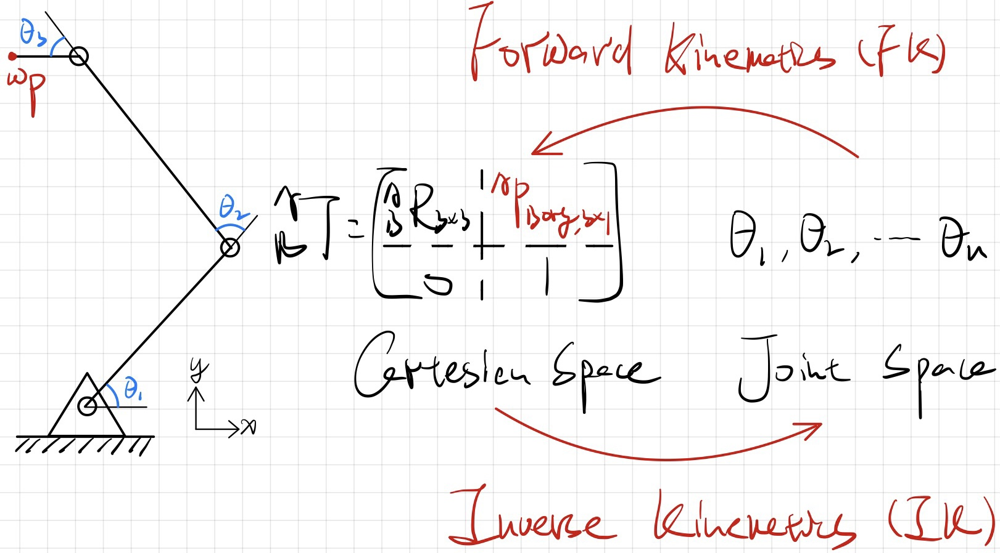

# 空间与旋转表示

见CV2

# 前向运动学 Forward Kinematics

## *运动学*

### 不同的空间

* 关节空间 Joint Space：对于一个n自由度的操作臂来说，它的所有连杆位置可由一组n个关节变量加以确认。这样的一组变量被称为 $n\times1$ 的关节向量
* 笛卡尔空间 Cartesian Space：当位置是在空间中相互交互的轴上测量，且姿态是使用旋转矩阵、欧拉角等表示方式表示的时候，称这个空间为笛卡尔空间，有时也称为任务空间或操作空间
* 驱动器空间 Acctuator Space：由于测量操作臂位置的传感器常常安装在驱动器上，因此进行控制器运算的时候时必须把关节向量表示成一组驱动器变量方程，即驱动向量

### 动力学与运动学区别

* 运动学 Kinematic：讨论运动状态本身，不涉及到产生运动的力
  
  
  
  * 前向运动学：**已知机械臂的关节角度和几何参数，求解机械臂的末端位置和姿态**
  * 逆向运动学：**已知机械臂的末端位置和姿态，求解机械臂的关节角度和几何参数**
* 动力学 Dynamics：讨论力/力矩如何产生运动

## *手臂几何描述方式 -- DH方法（Craig Version）*

### 常见运动副 pair

* 低副 lower pair：通过两个平面相互之间的相对滑动来连接相邻两个刚体的运动，机器人用的运动副基本都是下面几种低副
  * Revolving joint 转动副
  * Linear joint 移动副
  * Rotational joint 旋转副
  * Twisting joint
* 高副 higher pair：点面、点线运动
  * 齿轮
  * 凸轮
* 机器人手臂可以堪称由一系列通过运动副/关节连接成运动链的刚体，将这些刚体称为连杆

### 机械臂坐标系标准命名

* $\left\{B\right\}$：基坐标系位于操作臂的基座上，它仅是赋予坐标系 $\left\{0\right\}$ 的另一个名称。因为它固连在机器人的静止部位，所以有时称为连杆0
* $\left\{S\right\}$：固定坐标系的设置与任务相关，它是一个通用坐标系，机器人的所有运动都是相对于它来执行的。也被称为任务坐标系、世界坐标系或通用坐标系
* $\left\{W\right\}$：腕部坐标系在操作臂的末端连杆上
* $\left\{T\right\}$：工具坐标系在机器人所持工具的末端。当手部没有夹持工具时，工具坐标系的原点位于机器人的指尖之间，通常是通过腕部坐标系来确定的
* $\left\{G\right\}$：目标坐标系是对机器人移动工具到达的位置描述，特指在机器人运动结束后，工具坐标系应当与目标坐标系重合

### DH表示法 -- 连杆参数

* 描述连杆本身
  * 连杆长度 $a_{i-1}$：两关节轴 $i-1$ 和 $i$ 之间的长度即位两轴之间的公垂线长度
  * 连杆扭转角 $\alpha_{i-1}$：假设作一个平面与公垂线垂直，然后将关节轴 $i-1$ 和 $i$ 都投影到该平面上所形成的夹角
* 描述相邻连杆之间的连接关系
  * 连杆偏距 $d_i$：沿两个相邻连杆公共轴线方向的距离，即所在平面有没有错开。对于移动关节，$d_i$ 为关节变量，其余三个参数是固定不变的
  * 关节角 $\theta_i$：描述两相邻连杆绕公共轴线旋转的夹角。对于转动关节，$\theta_i$ 为关节变量，其余三个参数是固定不变的
* 首尾，即地杆和last link的参数定义
  * $a_0=a_n=\alpha_0=\alpha_n=0$
  * 对于Revolute joint 转动关节 $\theta_1/\theta_n$ 可以是随机值，将 $d_1/d_n=0$
  * 对于Prismatic joint 移动关节 $d_1/d_n$ 可以是随机值，将 $\theta_1/\theta_n=0$

### DH表示法 -- 连杆坐标系的定义

DH表示法有两种，Standard Version 和 Craig Version，区别在于坐标轴建立在连杆 Link前还是连杆后。后面统一采用Craig

* 坐标系 $\left\{i\right\}$ 的建立规则
  * 原点位于公垂线 $a_i$ 与关节轴 $i$ 的交点处
  * 坐标系 $\left\{i\right\}$ 的 $\hat{Z}$ 轴称为 $\hat{Z}_i$ ，与转动或移动关节轴 $i$ 重合
  * $\hat{X}_i$ 沿 $a_i$ 方向由关节 $i$ 指向 $i+1$，$\hat{X}_i$ 一定是和 $\hat{Z}_i$ 垂直的，因为 $a_{i}$ 是 $i$ 的垂线
  * $\hat{Y}_i$ 垂直于 $\hat{X}_i$ 和 $\hat{Z}_i$，由右手系确定
* **参数方向与坐标系的关系** Craig version -- 根据这个关系来确定四个参数
  * $\alpha_{i-1}$：以 $\hat{X}_{i-1}$ 方向看，$\hat{Z}_{i-1}$ 和 $\hat{Z}_i$ 的夹角，逆时针为正方向
    * 右手系中，逆着 $\hat{X}_{i-1}$ 的方向为正；左手系则是沿着 $\hat{X}_{i-1}$ 的方向为正
    * 不论右手系还是左手系，正方向始终是 *x-y-z-x* 的顺序走，这是由矩阵叉乘性质决定的
  * $a_{i-1}$：沿着 $\hat{X}_{i-1}$ 方向看，$\hat{Z}_{i-1}$ 和 $\hat{Z}_i$ 的距离
  * $\theta_i$：以 $\hat{Z}_i$ 方向看，$\hat{X}_{i-1}$ 和 $\hat{X}_i$ 的夹角，逆时针为正方向
  * $d_i$：沿着 $\hat{Z}_i$ 方向看，$\hat{X}_{i-1}$ 和 $\hat{X}_i$ 的距离
* 首尾的坐标系定义
  * 固定坐标系 $\left\{0\right\}$：$\hat{Z}_0$ 轴沿关节轴1的方向，总有 $a_0$ 和 $\alpha_0=0$
    * 当关节1为转动关节时，$d_1=0$
    * 当关节1为移动关节时，$\theta_1=0$
  * 尾坐标系 $\left\{n\right\}$
    * 对于转动关节n：$\hat{X}_N$ 取和 $\hat{X}_{N-1}$ 同方向，坐标系 $\left\{N\right\}$ 的原点位置使之满足 $d_n=0$
    * 对于移动关节n：选定 $\hat{X}_N$ 轴的方向使之满足 $\theta_n=0$，当 $d_n=0$ 时，选取坐标系 $\left\{N\right\}$ 的原点位于 $\hat{X}_{N-1}$ 轴与关节轴 $n$ 的交点位置 

### 前向运动学建模流程

* 观察机器人构型，建立关节坐标系
  * Joint axes 找出转轴
  * Common perpendicular lines 公垂线
  * 为每个关节建立 Frame $\hat{Z}_i,\hat{X}_i,\hat{Y}_i$
  * 处理 $\left\{0\right\},\left\{n\right\}$
* 列出D-H表
  * 根据下面单步连杆变换的分解可以看到，DH表中的 $\alpha$ 和 $a$ 参数是 $\left\{i-1\right\}$ 关节的
  * 而 $d$ 和 $\theta$ 参数属于 $\left\{i\right\}$ 关节的

* 计算相邻关节坐标的齐次变换矩阵
* 计算末端执行器相对于基地坐标系之间的总体前向运动学方程

## *空间变换计算*

### 单步连杆变换的分解

将从 $\left\{i-1\right\}$ 到 $\left\{i\right\}$ 坐标系的变换分解成4个基本空间变换步骤：$^{i-1}P=^{i-1}_iT\ ^iP=^{i-1}_RT\ ^R_QT\ ^Q_PT\ ^P_iT\ ^iP$ （欧拉角右乘），下式为 $^{i-1}_iT$ 的一般表达式
$$
^{i-1}_iT={\color{green}^{i-1}_RT}{\color{orange}^R_QT}{\color{purple}^Q_PT}{\color{red}^P_iT}={\color{green}T_{\hat{X}_{i-1}}(\alpha_{i-1})}{\color{orange}T_{\hat{X_R}}(a_{i-1})}{\color{purple}T_{\hat{Z}_Q}(\theta_i)}{\color{red}T_{\hat{Z}_p}(d_i)}=\left[\begin{matrix}c\theta_i&-s\theta_i&0&a_{i-1}\\s\theta_ic\alpha_{i-1}&c\theta_ic\alpha_{i-1}&-s\alpha_{i-1}&-s\alpha_{i-1}d_i\\s\theta_is\alpha_{i-1}&c\theta_is\alpha_{i-1}&c\alpha_{i-1}&c\alpha_{i-1}d_i\\0&0&0&1\end{matrix}\right]
$$

### 连杆变换的连乘

坐标系 $\left\{n\right\}$ 相对于 $\left\{0\right\}$ 的总变换矩阵为下式，且可以拆分为旋转部分和移动部分
$$
^0_nT=^0_1T\ ^1_2T\ ^2_3T\cdots^{n-1}_nT=\left[\begin{matrix}_n^0R_{3\times3}&_0^nP_{3\times1}\\0&1\end{matrix}\right]
$$

工具位置计算，定位函数：$_T^ST=_S^BT^{-1}\ _W^BT\ _T^WT$

## *实例*

### RRR机械臂

* 找转轴 Joint axes
* 找公垂线 Common perpendicular
* 建立坐标系 Frame $\widehat{Z}_i,\widehat{X}_i,\widehat{Y}_i$
* 处理首尾坐标系 $\left\{0\right\},\left\{n\right\}$

|  i   | $\alpha_{i-1}$ | $a_{i-1}$ | $d_i$ | $\theta_i$ |
| :--: | :------------: | :-------: | :---: | :--------: |
|  1   |       0        |     0     |   0   | $\theta_1$ |
|  2   |       0        |   $L_1$   |   0   | $\theta_2$ |
|  3   |       0        |   $L_2$   |   0   | $\theta_3$ |

### PRP机械臂

* 找转轴 Joint axes
* 找公垂线 Common perpendicular
* 建立坐标系 Frame $\widehat{Z}_i,\widehat{X}_i,\widehat{Y}_i$，这里出现了两轴相交的情况，当两轴相交时，选取两个 $Z$ 轴的交点作为建立坐标系的原点
* 处理首尾坐标系 $\left\{0\right\},\left\{n\right\}$

|  i   | $\alpha_{i-1}$ | $a_{i-1}$ | $d_i$ | $\theta_i$ |
| :--: | :------------: | :-------: | :---: | :--------: |
|  1   |       0        |     0     |   0   | $\theta_1$ |
|  2   |  $90\degree$   |     0     | $d_2$ |     0      |
|  3   |       0        |     0     | $l_2$ | $\theta_3$ |

### PUMA 560 -- 经典六自由度机器人手臂

|  i   | $\alpha_{i-1}$ | $a_{i-1}$ | $d_i$ | $\theta_i$ |
| :--: | :------------: | :-------: | :---: | :--------: |
|  1   |       0        |     0     |   0   | $\theta_1$ |
|  2   |  $-90\degree$  |     0     | $d_2$ | $\theta_2$ |
|  3   |       0        |   $a_2$   | $d_3$ | $\theta_3$ |
|  4   |  $-90\degree$  |   $a_3$   | $d_4$ | $\theta_4$ |
|  5   |  $90\degree$   |     0     |   0   | $\theta_5$ |
|  6   |  $-90\degree$  |     0     |   0   | $\theta_6$ |

可以得到6个连杆坐标系变换矩阵的乘积，注意**简化写法** $\cos{\theta_i}=c\theta_i=c_i;\ \sin{\theta_i}=s\theta_i=s_i$ 以及 $c_{ij}=\cos{(\theta_i+\theta_j)}$
$$
_0^6T=_1^0T_1^6T=\left[\begin{matrix}r_{11}&r_{12}&r_{13}&p_x\\r_{21}&r_{22}&r_{23}&p_y\\r_{31}&r_{32}&r_{33}&p_z\\0&0&0
&1\end{matrix}\right]\label{puma560}
$$

$$
r_{11}=c_1\left[c_{23}(c_4c_5c_6-s_4s_5)-s_{23}s_5c_6\right]+s_1(s_4c_5c_6+c_4+s_6)\\r_{21}=s_1\left[c_{23}(c_4c_5c_6-s_4s_5)-s_{23}s_5c_6\right]-c_1(s_4c_5c_6+c_4+s_6)\\r_{31}=-s_{23}(c_4c_5c_6-s_4s_6)-c_{23}c_5c_6
$$

$$
r_{12}=c_1\left[c_{23}(-c_4c_5c_6-s_4c_6)+s_{23}s_5s_6\right]+s_1(c_4c_6-s_4c_5s_6)\\r_{22}=s_1\left[c_{23}(-c_4c_5c_6-s_4c_6)+s_{23}s_5s_6\right]-c_1(c_4c_6-s_4c_5s_6)\\r_{32}=-s_{23}(-c_4c_5c_6-s_4c_6)-c_{23}s_5s_6
$$

$$
r_{13}=-c_1(c_{23}c_4s_5+s_{23}s_5s_6)-s_1s_4s_5\\r_{23}=-s_1(c_{23}c_4s_5+s_{23}s_5s_6)+c_1s_4s_5\\r_{33}=s_{23}c_4s_5-c_{23}c_5
$$

$$
p_x=c_1[a_2c_2+a_3c_{23}-d_4s_{23}]-d_3s_1\\p_y=s_1[a_2c_2+a_3c_{23}-d_4s_{23}]+d_3s_1\\p_z=-a_3s_{23}-a_2s_2-d_4c_{23}
$$

# 逆向运动学 Inverse Kinematics

求出要求的关节角，使得工具坐标系 $\left\{T\right\}$ 位于固定坐标系 $\left\{S\right\}$ 的特定位姿

## *Workspace*

### Reachable workspace 可达工作空间

可达工作空间指机器人的末端执行器**至少可以从一个方向**上到达的空间区域

### Dexterous workspace 灵巧工作空间

灵巧工作空间指机器人的末端执行器能够从**各个方向**到达的空间区域

灵巧工作空间是可达工作空间的一个子集

### Configuration space 配置空间

## *Multiplicity of Solutions 多重解*

考虑正向运动学的经典六自由度机械手臂 PUMA560，通过正项运动学可以列出12个方程式 $\eqref{puma560}$，其中因为旋转的限制，对于旋转的9个方程式中只有3个自由度，因此总共是12个方程式6个自由度，目标就是通过这些方程式解出6个关节角度 $\theta_1,\theta_2,\dots,\theta_6$

### 六自由度机器手臂解的数量

从 $\eqref{puma560}$ 中可以看到，每一个方程都是**非线形超越方程**，因此6个方程求6个未知数不代表唯一解

解是由joint的数目和link的参数共同决定的，对于六自由度机械手臂而言，解的数目一般有以下的情况

|      $a_i$      | 解的数目 |
| :-------------: | :------: |
| $a_1=a_3=a_5=0$ | $\leq4$  |
|   $a_3=a_5=0$   | $\leq8$  |
|     $a_3=0$     | $\leq16$ |
| All $a_i\neq0$  | $\leq16$ |

以 PUMA560 为例，针对特定工作解可以得到八组解

每种前三轴的姿态都会有两种后三轴手腕的旋转组合，手腕转180度就可以到达了。当然若手臂本身有几何限制，则并非每一种解都可以运行
$$
\theta_4'=\theta_4+180\degree\\\theta_5'=-\theta_5\\\theta_6'=\theta_6+180\degree
$$

### 选择最优解

* 离目前状态最近的解，要么是最快，要么是最省能

* 如果有避障要求，就需要避开障碍物。像图中那样最近的路线不能走，一定要反方向绕

  

### 求解方法

* 解析法 Closed-form Solutions
  * 几何解
  * 代数解
  * 目前大部分机械手臂都被设计成具有解析解，即当令手腕的后三轴相交于一点时，可以得到 Pieper's Solution
* 数值法

## *几何解*

### Task

以FK中的第一个例子RRR手臂为例：Given $(x,y,\phi)$, Find $(\theta_1,\theta_2,\theta_3)$

注意**简化写法**：$\cos{\theta_i}=c\theta_i=c_i;\ \sin{\theta_i}=s\theta_i=s_i$ 以及 $c_{ij}=\cos{(\theta_i+\theta_j)}$
$$
FK\rightarrow_3^0T=\left[\begin{matrix}c_{123}&-s_{123}&0&l_1c_1+l_2c_{12}\\s_{123}&c_{123}&0&l_1s_1+l_2s_{12}\\0&0&1&0\\0&0&0&1\end{matrix}\right]\Longleftrightarrow Goal:\ _3^0T=\left[\begin{matrix}c_{\phi}&-s_{\phi}&0&x\\s_{\phi}&c_{\phi}&0&y\\0&0&1&0\\0&0&0&1\end{matrix}\right]
$$

### 余弦定理求 $\theta_2$

对图中绿色三角形以 $\theta_2$ 为中心用一次余弦定理，注意此时 $\theta_2$ 有两个解，即图中取正的绿色和取负的蓝色两种情况
$$
\left\{\begin{array}{l}x^2+y^2=l_1^2+l_2^2-2l_1l_2\cos{(180\degree-\theta_2)}\\\cos{(180\degree-\theta)}=-\cos{\theta}\end{array}\right.\Rightarrow\cos{\theta_2}=\frac{x^2+y^2-l_1^2-l_2^2}{2l_1l_2}\Rightarrow\theta_2=\arccos{\left(\frac{x^2+y^2-l_1^2-l_2^2}{2l_1l_2}\right)}
$$

### 求 $\theta_1,\theta_3$

对图中绿色三角形以 $\psi$ 为中心再用一次余弦定理，三角形内角 $0\degree<\psi<180\degree$

然后就可以 $\beta$ 的三角关系求 $\theta_1$ 和 $\theta_3$ 了
$$
\cos{\psi}=\frac{l_2^2-(x^2+y^2)-l_1^2}{-2l_1\sqrt{x^2+y^2}}\\\theta_1=\left\{\begin{array}{ll}\arctan{(y,x)}+\psi&\theta_2<0\degree\\\arctan{(y,x)}-\psi&\theta_2>0\degree\end{array}\right.\\\theta_3=\phi-\theta_1-\theta_2
$$

## *代数解*

仍然以RRR手臂为例

### 建立方程式

$$
c_{\phi}=c_{123},\ s_{\phi}=s_{123}\\x=l_1c_1+l_2c_{12},\ y=l_1s_1+l_2s_{12}
$$

### 解 $\theta_2$

取 $x^2+y^2$，代入上式，可以发现结果和几何法的第一次余弦定理结果是一样的，当 $\theta_2$ 大于1或小于-1时候无解，$-1\leq\theta_2\leq1$ 则为两个解
$$
x^2+y^2=l_1^2+l_2^2+2l_1l_2c_2\Rightarrow c_2=\frac{x^2+y^2-l_1^2-l_2^2}{2l_1l_2}\Rightarrow\theta_2=\arccos{\theta_2}
$$

### 解 $\theta_1$

将 $\theta_1$ 单独拉出来：将求得的 $\theta_2$ 代入 $x$ 和 $y$ 的公式，利用和角公式 $c_{12}=c_1c_2-s_1s_2;\ s_{12}=s_1c_2+s_2c_1$ 进行拆分，其中 $x,y,k_1,k_2$ 都是已知的
$$
x=l_1c_1+l_2c_{12}=(l_1+l_2c_2)c_1+(-l_2s_2)s_1\triangleq k_1c_1-k_2s_1\\y=l_1s_1+l_2s_{12}=(l_1+l_2c_2)s_1+(l_2s_2)c_1\triangleq k_1s_1+k_2c_1
$$
换元，然后利用和角公式重写，可以过滤出来 $\theta_1$ 
$$
r\triangleq+\sqrt{k_1^2+k_2^2},\ \gamma=\arctan{(k_2,k_1)}\xrightarrow{Rewrite}k_1=r\cos{\gamma},\ k_2=r\sin{\gamma}\\\frac{x}{r}=\cos{\gamma}\cos{\theta_1}-\sin{\gamma}\sin{\theta_1}=\cos{(\gamma+\theta_1)},\ \frac{y}{r}=\cos{\gamma}\sin{\theta_1}+\sin{\gamma}\cos{\theta_1}=\sin{(\gamma+\theta_1)}
$$
现在可以解出 $\theta_1$，并且代入 $\gamma=\arctan{(k_2,k_1)}$。因为 $\theta_2$ 是多解，会影响 $k_2,k_1$ 所以 $\theta_1$ 也是多解
$$
\gamma+\theta_1=\arctan{\left(\frac{y}{r},\frac{x}{r}\right)}=\arctan{(y,x)}\xrightarrow{\gamma=\arctan{(k_2,k_1)}}\theta_1=\arctan{(y,x)}-\arctan{(k_2,k_1)}
$$

### 解 $\theta_3$

$$
\theta_1+\theta_2+\theta_3=\arctan{\left(s_{\phi},c_{\phi}\right)}=\phi\Rightarrow\theta_3=\phi-\theta_1-\theta_2
$$

### Generalizaiton

代数法的关键是第一步，在RRR中，第一步可以通过三角函数的平方关系很方便地求得 $\theta_2$ ，但是若是比较复杂的 $a\cos{\theta}+b\sin{\theta}=c$ 的 $\theta$ 该怎么办？

利用换元进行化解
$$
let\ \tan{\left(\frac{\theta}{2}\right)}=u,\ then\ \cos{\theta}=\frac{1-u^2}{1+u^2},\sin{\theta}=\frac{2u}{1+u^2}
$$
将 $\cos{\theta}$ 和 $\sin{\theta}$ 代入 $a\cos{\theta}+b\sin{\theta}=c$
$$
a\frac{1-u^2}{1+u^2}+b\frac{2u}{1+u^2}=c\rightarrow(a+c)u^2-2bu+(c-a)=0\rightarrow u=\frac{b\pm\sqrt{b^2+a^2-c^2}}{a+c}\\\theta=\left\{\begin{array}{ll}2\arctan{\left(\frac{b\pm\sqrt{b^2+a^2-c^2}}{a+c}\right)}&,a+c\neq0\\180\degree&,a+c=0\end{array}\right.
$$

## *Pieper's Solution*

Pieper's solution 是一种经过经过特殊设计的解析解，即六自由度机械手臂具有**三个连续的轴交在同一个点**时，则该手臂的IK有解析解

一般六自由度机械手臂会设计为前三轴产生移动，后三轴（腕部）产生转动，后三轴交于一点 $^0P_{6ORG}=^0P_{4ORG}$

### 层层分解 $\theta_1,\theta_2,\theta_3$

$$
^{i-1}_iT==\left[\begin{matrix}c\theta_i&-s\theta_i&0&a_{i-1}\\s\theta_ic\alpha_{i-1}&c\theta_ic\alpha_{i-1}&-s\alpha_{i-1}&-s\alpha_{i-1}d_i\\s\theta_is\alpha_{i-1}&c\theta_is\alpha_{i-1}&c\alpha_{i-1}&c\alpha_{i-1}d_i\\0&0&0&1\end{matrix}\right]
$$

根据Piper准则，第三轴到第四轴不涉及转动，只有移动，因为可以直接用 $_4^3T$ 的最后一列来表示，当然也可以认为转动部分为 $R_{3\times3}=I_{3\times3}$
$$
\left[\begin{matrix}x\\y\\z\\1\end{matrix}\right]=^0P_{4ORG}=_1^0T\ _2^1T\ _3^2T\ ^0P_{4ORG}=_1^0T\ _2^1T\ _3^2T\ ^0\underbrace{\left[\begin{matrix}a_3\\-d_4s\alpha_3\\d_4c\alpha_3\\1\end{matrix}\right]}_{4^{th}\ col\ of\ _4^3T}=_1^0T\ _2^1T\left[\begin{matrix}f_1(\theta_3)\\f_2(\theta_3)\\f_3(\theta_3)\\1\end{matrix}\right]
$$
上式中，因为参数 $d_4,a_3,\alpha_3$ 都是确定的，因此可以直接把 $_3^2T$ 包进去变成一个关于 $\theta_3$ 的函数 $f(\theta_3)$

同理，可以进一步把 $_1^2T$ 和 $_0^1T$ 给包进去
$$
^0P_{4ORG}=\left[\begin{matrix}x\\y\\z\\1\end{matrix}\right]=_1^0T\ _2^1T\left[\begin{matrix}f_1(\theta_3)\\f_2(\theta_3)\\f_3(\theta_3)\\1\end{matrix}\right]=_0^1T\left[\begin{matrix}g_1(\theta_2,\theta_3)\\g_2(\theta_2,\theta_3)\\g_3(\theta_2,\theta_3)\\1\end{matrix}\right]=\left[\begin{matrix}c_1g_1-s_1g_2\\s_1g_1+c_1g_2\\g_3\\1\end{matrix}\right]
$$
其中 $g_i$ 是仅关于 $\theta_2,\theta_3$ 的函数

将 $\theta_2$ 和 $\theta_3$ 分开
$$
r=x^2+y^2+z^2=(c_1g_1-s_1g_2)^2+(s_1g_1+c_1g_2)^2+(g_3)^2=g_1^2+g_2^2+g_3^2\\=f_1^2+f_2^2+f_3^2+a_1^2+d_2^2+2d_2f_3+2a_1(c_2f_1-s_2f_2)=(k_1c_2+k_2s_2)2a_1+k_3\\z=g_3=(k_1s_2-k_2c_2)s\alpha_1+k_4
$$
其中 $k_i$ 是只和 $\theta_3$ 有关的函数
$$
k_1(\theta_3)=f_1;\ k_2(\theta_3)=-f_2;\ k_3(\theta_3)=f_1^2+f_2^2+f_3^2+a_1^2+d_2^2+2d_2f_3;\ k_4(\theta_3)=f_3c\alpha_1+d_2c\alpha_1
$$

### 求解移动部分 $\theta_1,\theta_2,\theta_3$

整合 $r$ 和 $z$ 一起考虑，然后进行分类讨论
$$
\left\{\begin{array}{l}r=(k_1c_2+k_2s_2)2a_1+k_3\\z=(k_1s_2-k_2c_2)s\alpha_1+k_4\end{array}\right.
$$

* 若 $a_1=0$：$r=k_3(\theta_3)=f_1^2+f_2^2+f_3^2+a_1^2+d_2^2+2d_2f_3$ ，$r$ 取值已知且是一个关于 $\theta_3$ 的单变量函数，可以解出 $\theta_3$
* 若 $s\alpha_1=0$：$z=k_4(\theta_3)=f_3c\alpha_1+d_2c\alpha_1$，$z$ 取值已知且是一个关于 $\theta_3$ 的单变量函数，可以解出 $\theta_3$
* 否则 $\frac{(r-k_3)^2}{4a_1^2}+\frac{(z-k_4)^2}{s^2\alpha_1}=k_1^2+k_2^2$，类似于椭圆，利用 $u=\tan{\left(\frac{\theta_3}{2}\right)}$ 可以解出 $\theta_3$

求出 $\theta_3$ 后可以代入 $r=(k_1c_2+k_2s_2)2a_1+k_3$ 求出 $\theta_2$，然后再将 $\theta_2,\theta_3$ 代入 $x=c_1g_1(\theta_2,\theta_3)-s_1g_2(\theta_2,\theta_3)$ 求出 $\theta_1$

### 求解转动部分 $\theta_4,\theta_5,\theta_6$

$\theta_1,\theta_2,\theta_3$ 已知，$_6^3R=_3^0R^{-1}\ _6^0R$，然后通过 Z-Y-Z Euler Angle 求解 $\theta_4,\theta_5,\theta_6$

## *数值解*

### 牛顿法

### 梯度下降

# Jacobian：速度和静力

## *复习动力学*

### 质点与参考系的运动方式

* 点的运动，可以是直线或曲线运动
  * 绝对运动 Absolute motion：动点相对于定参考系的运动
  * 相对运动 Relative motion：动点相对于动参考系的运动
* 参考系的运动是刚体的运动，可以是平动、转动或其他较复杂的运动：牵连运动 Entrainement motion：动参考系相对于定参考系的运动

### 运动合成

**绝对运动 = 相对运动 + 牵连运动**

* 当牵连运动为平移时，动点在某一瞬时的绝对（加）速度等于该瞬时它的牵连（加）速度与相对（加）速度的矢量和
* 当牵连运动是定轴转动时动点在某瞬时的绝对（加）速度等于该瞬时的牵连（加）速度与科氏（加）速度的矢量和（科氏加速度由于动系为转动时，牵连运动与相对运动相互影响产生）

## *时变位置和姿态的符号表示*

### 位置矢量的导数

相对于 $\left\{B\right\}$ 参考系的位置向量 $^BP_Q$ 的速度矢量为
$$
^BV_Q=\frac{d}{dt}\ ^BP_Q=\lim\limits_{\Delta t\rightarrow0}{\frac{^BP_Q(t+\Delta t)-^BP_Q(t)}{\Delta t}}
$$
因为在一个参考系中的相对速度为0时，在另外一个参考系中的相对速度却可能不为0，所以一定要定义清楚是相对于哪一个参考系

在通常的情况下速度矢量都是与空间的某点相关的，而描述此点速度的数值取决于两个坐标系。举个例子：当观测者在跑步的时候，请问那辆车相当于观测者速度是多少？这个问题实际上意思是，这辆车相对于地面参考系的速度，再用相对于我这个观测者的参考系来描述

* 进行求导运算的坐标系
* 用来描述这个速度矢量的坐标系

若两个参考系不同，则要通过它们之间的旋转关系  $R$ 来转换，在 $\left\{B\right\}$ 参考系中的位置矢量的微分用 $\left\{A\right\}$ 参考系来看可以表达为下式
$$
^A(^BV_Q)=^A(\frac{d}{dt}\ ^BP_Q)=_B^AR\ ^BP_Q
$$
当只有一个左侧上标的时候就默认求导参考系和描述坐标系是同一个

坐标系 $\left\{C\right\}$ 的原点相对于通用参考坐标系 Universe reference frame $\left\{U\right\}$ 的速度矢量可以简化缩写为：$v_C\triangleq ^UV_{CORG}$

### 举例

有固定的世界坐标系 $\left\{U\right\}$，坐标系 $\left\{T\right\}$ 固定在速度为 $^UV_T=100\vec{i}$  的火车上，坐标系 $\left\{C\right\}$ 固定在速度为 $^UV_C=30\vec{i}$  的汽车上，旋转矩阵 $_T^UR$ 和 $_C^UR$ 已知

* 求 $^U\left(\frac{d}{dt}^UP_{CORG}\right)$ ，即坐标系 $\left\{C\right\}$ 的原点相对于世界坐标系的速度：$^U\left(\frac{d}{dt}^UP_{CORG}\right)=^UV_C=30\vec{i}$
* 求 $^C\left(^UV_{TORG}\right)$，即坐标系 $\left\{T\right\}$ 的原点相对于世界坐标系的速度，用坐标系 $\left\{C\right\}$ 来描述：$^Cv_T=_U^CR\ v_T=_C^UR^{-1}\cdot100\vec{i}$
* 求 $^C\left(^TV_{CORG}\right)$，即坐标系 $\left\{C\right\}$ 的原点相对于坐标系 $\left\{T\right\}$ 的速度，用坐标系 $\left\{C\right\}$ 来描述：$_T^CR(^TV_{CORT}=_U^CR\ _T^UR(-70\vec{i}))=-_C^UR^{-1}\ _T^UR\cdot70\vec{i}$

### 角速度矢量

角速度矢量 $^A\Omega_B$

* 表示 $\left\{B\right\}$ 参考系用 $\left\{A\right\}$ 参考系来表达的角速度，注意：不是说 $\left\{B\right\}$ 参考系绕着 $\left\{A\right\}$ 参考系旋转
* $^A\Omega_B$ 的方向：旋转轴
* $^A\Omega_B$ 的大小：旋转速度

用参考系 $\left\{C\right\}$ 来描述：$^C\left(^A\Omega_B\right)$

坐标系 $\left\{C\right\}$ 的原点相对于通用参考坐标系 Universe reference frame $\left\{U\right\}$ 的角速度矢量可以简化缩写为：$\omega_C\triangleq ^U\Omega_{CORG}$

## *固定坐标系观测运动坐标系*

令 $\left\{B\right\}$ 是一个任意移动和转动的的坐标系，而 $\left\{U\right\}$ 是固定的通用参考坐标系 Universe reference frame，如何计算从 $v_A$ ？
$$
\vec{r}_A=x_A\vec{I}+y_A\vec{J}=\vec{r}_B+\vec{r}_{A/B}=\left(x_B\vec{I}+y_B\vec{J}\right)+\left(x_{A/B}\vec{I}+y_{A/B}\vec{J}\right)
$$
上式中 $\vec{I},\ \vec{J}$ 是 $\left\{U\right\}$ 的基向量，下式中 $\vec{i},\vec{j}$ 是坐标系 $\left\{B\right\}$ 的基向量。下面因为要求速度，所以对上式求导
$$
\vec{v}_A=\dot{\vec{r}_A}=\dot{x_A}\vec{I}+\dot{y_A}\vec{J}=\dot{\vec{r}_B}+\dot{\vec{r}_{A/B}}=\left(\dot{\vec{x}_B}\vec{I}+\dot{y_B}\vec{J}\right)+\left(\dot{\vec{x}_{A/B}}\vec{I}+\dot{y_{A/B}}\vec{J}\right)
$$
注意：对于基底 $\vec{I},\vec{J}$ 也要进行求导，但参考坐标系 $\left\{U\right\}$ 没有发生移动，所以 $\dot{\vec{i}}=0$ 消去了

一般而言，速度的观测都是在当前的参考系中做的，因此把 $\vec{I},\vec{J}$ 基底通过旋转矩阵转换到坐标系 $\left\{A\right\}$ 中的 $\vec{i},\vec{j}$ 中去
$$
\vec{v}_A=\dot{\vec{r}_B}+\dot{\vec{r}_{A/B}}=\left(\dot{\vec{x}_B}\vec{I}+\dot{y_B}\vec{J}\right)+\left(\dot{\vec{x}_{A/B}}\vec{i}+\dot{y_{A/B}}\vec{j}\right)+\left(\vec{x}_{A/B}\dot{\vec{i}}+y_{A/B}\dot{\vec{j}}\right)
$$
但现在出现了一个问题，如果去求向量基底 $\vec{i},\vec{j}$ 的微分呢？

### 角速度

如上图，考虑一个单位向量 ${\color{orange}\vec{e}}$ 绕 $\vec{\omega}$ 旋转，在经过 $\lim\limits_{\Delta t\rightarrow0}{\Delta t}$ 时间后，${\color{orange}\vec{e}}$ 转到了 $e(t+\Delta t)$ 的位置

方向上有 $d\vec{e}\perp\vec{e},d\vec{e}\perp\vec{\omega}$

其中旋转半径为 $\lvert e\rvert\sin{\varphi}$（注意图中的圆形是正切于转轴的），因此是取极限，所以弧长可以近似为 $\lvert de\rvert=\lvert e\rvert\sin{\varphi}d\theta$，两边同除 $dt$ 后，有
$$
\frac{\lvert de\rvert}{dt}=\frac{\lvert e\rvert\sin{\varphi}d\theta}{dt}\Rightarrow\lvert\dot{e}\rvert=\lvert e\rvert\sin{\varphi}\dot{\theta}=\lvert e\rvert\lvert\omega\rvert\sin{\varphi}=\vec{\omega}\times\vec{e}
$$
即一个向量的微分可以写成它的角速度叉乘本身。对一个向量微分，这个向量的长度和方向都有可能发生变化。直观上讲，空间中通一个向量相对于不同参考坐标系的方向不相同，需要通过旋转修正坐标系后才能得到它们之间的关系

因此原式可以写成如下公式，可以理解为A的绝对速度（相对于通用地面参考系）= B的绝对速度 + A与B之间的相对速度 + 科式速度（B坐标系相对于A坐标系的角速度叉乘两坐标系之间的相对距离）
$$
\vec{v}_A=\dot{\vec{r}_B}+\dot{\vec{r}_{A/B}}=\left(\dot{\vec{x}_B}\vec{I}+\dot{y_B}\vec{J}\right)+\left(\dot{\vec{x}_{A/B}}\vec{i}+\dot{y_{A/B}}\vec{j}\right)+\vec{\omega}\times\left(\vec{x}_{A/B}\vec{i}+y_{A/B}\vec{j}\right)\\\Longrightarrow \vec{v}_A=\vec{v}_B+\vec{v}_{relative}+\vec{\omega}\times\vec{r}_{A/B}
$$
从而推广到一般情况下在一个固定坐标系中观测一个运动坐标系中某点的速度变化
$$
^AV_Q=^AV_{BORG}+_B^AR^BV_Q+^A\Omega_B\times_B^AR^BP_Q
$$

## *速度传播 Velocity Propagation*

### 建模策略

用连杆坐标系本身描述先速度和角速度矢量，而不是全部都相对于世界参考坐标系，这样就可以用类似于FK中的相邻杆件之间的关系来依次推导

### 旋转关节的速度传播

对于旋转关节相对于是一个刚体的纯旋转

* 初速度
  $$
  ^1\omega_1=\left[\begin{matrix}0\\0\\\dot{\theta}_1\end{matrix}\right],\ ^1v_1=\left[\begin{matrix}0\\0\\0\end{matrix}\right]
  $$

* 角速度传播
  $$
  ^i\omega_{i+1}=\ ^i\omega_i+\ _{i+1}^iR\dot{\theta}_{i+1}\ ^{i+1}\hat{Z}_{i+1}\\\xRightarrow{_i^{i+1}R}\ ^{i+1}\omega_{i+1}=\ _i^{i+1}R\ ^i\omega_i+\dot{\theta}_{i+1}\ ^{i+1}\hat{Z}_{i+1},\ where\ \dot{\theta}_{i+1}\ ^{i+1}\hat{Z}_{i+1}=\ ^{i+1}\left[\begin{matrix}0\\0\\\dot{\theta}_{i+1}\end{matrix}\right]
  $$

* 线速度传播
  $$
  ^iv_{i+1}=\ ^iv_i+\ ^i\omega_i\times\ ^iP_{i+1}\\\xRightarrow{_i^{i+1}R}\ ^{i+1}v_{i+1}=_i^{i+1}R\left(^iv_i+^i\omega_i\times\ ^iP_{i+1}\right)
  $$

### 移动关节的速度传播

对于移动关节相对于是一个刚体的纯线运动

* 角速度传播
  $$
  ^i\omega_{i+1}=\ ^i\omega_i\\\xRightarrow{_i^{i+1}R}\ ^{i+1}\omega_{i+1}=\ _i^{i+1}R\ ^i\omega_i
  $$

* 线速度传播
  $$
  ^iv_{i+1}=\left(^iv_i+\ ^i\omega_i\times\ ^iP_{i+1}\right)+\ _{i+1}^iR\dot{d}_{i+1}\ ^{i+1}\hat{Z}_{i+1}\\\xRightarrow{_i^{i+1}R}\ ^{i+1}v_{i+1}=\ _i^{i+1}R\left(^iv_i+\ ^i\omega_i\times\ ^iP_{i+1}\right)+\dot{d}_{i+1}\ ^{i+1}\hat{Z}_{i+1},\ where\ \dot{d}_{i+1}\ ^{i+1}\hat{Z}_{i+1}=\ ^{i+1}\left[\begin{matrix}0\\0\\\dot{d}_{i+1}\end{matrix}\right]
  $$

## *Jacobian*

### Jacobian意义

在机器人学中，通常使用雅可比将关节速度与操作臂末端的笛卡尔速度联系起来
$$
\boldsymbol{Y}=F\left(\boldsymbol{X}\right)\xrightarrow{求导}\boldsymbol{\dot{Y}}=J(\boldsymbol{X})\cdot\boldsymbol{\dot{X}}\\\dot{P}=^0\boldsymbol{v}=\left[\begin{matrix}^0v\\^0\omega\end{matrix}\right]=^0J(\boldsymbol{\Theta})\dot{\boldsymbol{\Theta}}
$$

$^0\boldsymbol{v}$ 是机械臂末端相对于固定参考系的速度，$\boldsymbol{\Theta}$ 是所有关节角度的集合，$^0J(\boldsymbol{\Theta})$ 是所有关节角度的Jacobian，Jacobian是时变的线性变化

Jacobian矩阵的维度

* 平面
* 空间

### Jacobian的计算

* 直接利用end-effector的速度与关节角的微分关系来计算
* 通过速度传播与Jacobian更换参考系来计算

$$
^A\boldsymbol{v}=\left[\begin{matrix}^Av\\^A\omega\end{matrix}\right]=^AJ(\boldsymbol{\Theta})\dot{\boldsymbol{\Theta}}=\left[\begin{matrix}^A_BR&0\\0&^A_BR\\\end{matrix}\right]\left[\begin{matrix}^Bv\\^B\omega\end{matrix}\right]\Rightarrow\ ^AJ(\boldsymbol{\Theta})=\left[\begin{matrix}^A_BR&0\\0&^A_BR\\\end{matrix}\right]\ ^BJ(\boldsymbol{\Theta})
$$

### 奇点与可逆性

奇异性大致可以分为

* 工作空间边界的奇异位形
* 工作空间内部的奇异位形

当操作臂处于奇异位形时，它会失去一个或多个自由度。也就是说，在笛卡尔空间的某个方向上，无论选择什么样的关节速度都不能够使机器人手臂运动

当判断奇点与自由度损失情况时，用相对于end-effector的Jacobian矩阵会便利的多

## *操作臂静力*

### 静力和力矩传递

不考虑连杆重力，求保持系统**静态平衡**的关节力/力矩。关节静力和静力矩是由是施加在最后一个连杆上的静力或静力矩引起的

令 $f_i$ 为连杆 $i-1$ 施加在连杆 $i$ 上的力，$n_i$ 为连杆 $i-1$ 施加在连杆 $i$ 上的力矩。相对于同一个参考坐标系 $\left\{i\right\}$ 有如下。并且用 $\left\{i+1\right\}$ 相对于 $\left\{i\right\}$ 的旋转矩阵 $^i_{i+1}R$ 实现两个坐标系之间的静力转换
$$
force:\ ^if_i=\ ^if_{i+1}\xRightarrow{^i_{i+1}R}\ ^if_i=\ ^i_{i+1}R\ ^{i+1}f_{i+1}\\torque:\ ^in_i=\ ^in_{i+1}+\ ^iP_{i+1}\times\ ^if_{i+1}\xRightarrow{^i_{i+1}R}\ ^in_i=\ ^i_{i+1}R\ ^{i+1}n_{i+1}+\ ^iP_{i+1}\times\ ^if_i
$$

为了平衡施加在关节上的力和力矩，需要施加在关节上的力矩为在 $\hat{Z}_i$ 方向上的投影。通常将使关节角增大的旋转方向定义为关节力矩的正方向
$$
revolute:\tau_i=\ ^in_i^T\ ^i\hat{Z}_i\\prismatic:\tau_i=\ ^if_i^T\ \hat{Z}_i
$$

### 力域中的Jacobian

### 速度和静力的笛卡尔变换

# 动力学：Lagrange/Euler Analysis

## *牛顿方程和欧拉动力学方程*

### 转动惯量

### 计算力和力矩

牛顿方程：刚体质心以加速度 $\dot{v}_C$ 作加速运动，可以通过牛顿方程计算作用在质心上的力 $F$ 引起刚体的加速度
$$
F=m\dot{v}_C
$$
欧拉动力学方程：刚体质心的角速度和角加速度分别为 $\omega$ 和 $\dot{\omega}$，$^CI$ 是刚体在坐标系 $\left\{C\right\}$ 中的惯性张量，$\left\{C\right\}$ 的原点在刚体的质心。可以通过欧拉方程计算引起刚体转动的力矩 $N$
$$
N=\ ^CI\dot{\omega}+\omega\times\ ^CI\omega
$$

## *Newton-Euler递推过程*

假设已知关节的位置、速度和加速度 $\Theta,\dot{\Theta},\ddot{\Theta}$，结合机器人运动学和质量分布的知识，可以计算出驱动关节运动所需的力、力矩

### 初始化

* Assumption：robot 有N个joints，$\left\{N+1\right\}$ 是end-effector的坐标系
* 确定初速度以及enf-effector承受的力和力矩 $^0\omega_0,\ ^0\dot{\omega}_0,\ ^0v_0,\ ^0\dot{v}_0,\ ^{N+1}f_{N+1},\ ^{N+1}n_{N+1}$
* Gravity:  $^0\dot{v}_0=-G$

### 速度前向过程

* Joint $i+1$ is revolute

  * Rotational acceleration
    $$
    ^{i+1}\omega_{i+1}=\ _i^{i+1}R\cdot\ ^i\omega_i+\dot{\Theta}_{i+1}\cdot\ ^{i+1}Z_{i+1}\\^{i+1}\dot{\omega}_{i+1}=\ _i^{i+1}R\cdot\ ^i\dot{\omega}_i+\ _i^{i+1}R\cdot\ ^i\omega_i\times\dot{\Theta}_{i+1}\cdot\ ^{i+1}Z_{i+1}+\ddot{\Theta}_{i+1}\ ^{i+1}Z_{i+1}
    $$

  * Linear acceleration
    $$
    ^{i+1}\dot{v}_{i+1}=\ _i^{i+1}R\cdot\left[^i\dot{\omega}_i\times\ ^iP_{i+1}+\ ^i\omega_i\times\left(^i\omega_i\times\ ^iP_{i+1}\right)+\ ^i\dot{v}_i\right]
    $$

* Joint $i+1$ is prismatic

  * Rotational acceleration
    $$
    ^{i+1}\omega_{i+1}=\ _i^{i+1}R\cdot\ ^i\omega_i\\^{i+1}\dot{\omega}_{i+1}=\ _i^{i+1}R\cdot\ ^i\dot{\omega}_i
    $$

  * Linear acceleration
    $$
    ^i\dot{v}_{C_i}=\ ^i\dot{\omega}_i\times\ ^iP_{C_i}+\ ^i\omega_i\times\left(^i\omega_i\times\ ^iP_{C_i}\right)+\ ^i\dot{v}_i
    $$

### 力、力矩反向过程

* 作用在link $i$ 的质心 $C_i$ 的力和力矩
  $$
  ^iF_i=m\cdot\ ^i\dot{v}_{C_i}\\\ ^iN_i=\ ^{C_{i}}I_i\cdot\ ^i\dot{\omega}_i+\ ^i\omega_i\times\ ^{C_i}I_i\cdot\ ^i\omega_i
  $$

* 作用在joint $i$ 的力和力矩
  $$
  ^if_i=\ ^i_{i+1}R\cdot\ ^{i+1}f_{i+1}+\ ^iF_i\\^in_i=\ ^iN_i+\ ^i_{i+1}R\cdot\ ^{i+1}n_{i+1}+\ ^iP_{C_i}\times\ ^iF_i+\ ^iP_{i+1}\times\ ^{i}_{i+1}R\ ^{i+1}f_{i+1}
  $$

### 计算 $\tau$

和静力中的情况一样，这里再给出一遍
$$
revolute:\tau_i=\ ^in_i^T\ ^i\hat{Z}_i\\prismatic:\tau_i=\ ^if_i^T\ \hat{Z}_i
$$
现在需要考虑重力的影响：$^0\dot{v}_0=-G$。State-space equation 有以下三种形式

* MVG-form
  $$
  \tau=M\left(\Theta\right)\ddot{\Theta}+V\left(\Theta,\dot{\Theta}\right)+G\left(\Theta\right)
  $$

* MBCG-form
  $$
  \tau=M\left(\Theta\right)\ddot{\Theta}+B\left(\Theta\right)\left[\dot{\Theta}\dot{\Theta}\right]+C\left(\Theta\right)\left[\dot{\Theta}^2\right]+G\left(\Theta\right)
  $$

  * $B\left(\Theta\right)$ 的维度是 $n\times n\left(n-1\right)/2$，$\left[\dot{\Theta}\dot{\Theta}\right]$ 是下面这个向量的缩写
    $$
    \left(\dot{\Theta}_1\dot{\Theta}_2,\dot{\Theta}_1\dot{\Theta}_3,\cdots,\dot{\Theta}_{n-1}\dot{\Theta}_n\right)^T
    $$

  * $C\left(\Theta\right)$ 的维度是 $n\times n$，$\left[\dot{\Theta}^2\right]$ 是下面这个向量的缩写
    $$
    \left(\dot{\Theta}_1^2,\dot{\Theta}_2^2,\cdots,\dot{\Theta}_n^2\right)^T
    $$

# PID Control