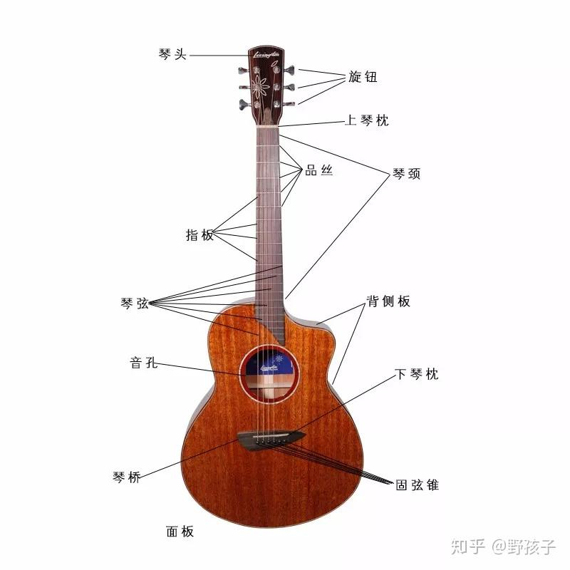
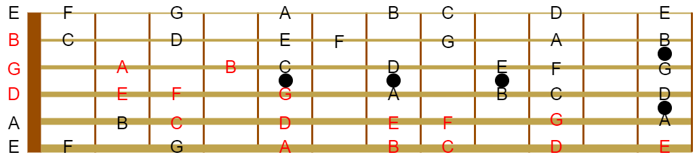

#  乐音体系

## *乐音 & 噪音*

### 定义

* 乐音：能够稳定保持同一频率的音
* 噪音：不能时刻保持在某一个频率，振动没有规律

并不是所有的乐器都是乐音乐器，也有噪音乐器，比如鼓、镲等。绝大多数的音乐都是乐音和噪音的结合

### 乐音体系& 

音乐中使用到的所有乐音的总和称为乐音体系。对于乐音的数量，通常有两种说法

* 乐音有88个，也就是对应钢琴的88个键。而其他的乐器，能使用到的音基本都在钢琴的音域范围内
* 乐音有97个，这个97出自于一款很有影响力的叫做Bösendorfer（贝森朵芙）牌的钢琴

### 音列

音列是将乐音体系中的音按照从低到高或从高到低的次序排列起来。通俗地讲就是在乐音体系中取若干个乐音，然后将它们有序的排列起来，这样一个集体就称为一个音列。比如 $\left[E\ \sharp f\ a^1\ g^3\right]$

## *音名 pitch & 唱名 solfège*

### 对应关系

通俗地讲：音名就是音乐的名字，即每个音阶的名字；唱名则告诉我们这个音名是如何被人所唱出来的，它不但要包含该音名的发音，还要能表示音的高低

| 简谱符号 | 1    | 2    | 3    | 4    | 5    | 6    | 7    |
| -------- | ---- | ---- | ---- | ---- | ---- | ---- | ---- |
| 音名     | C    | D    | E    | F    | G    | A    | B    |
| 唱名     | Do   | Re   | Mi   | Fa   | Soi  | La   | Si   |

注意：没有0，因为0表示停止，所以没有对应的念法

### 两种音名体系

* 德、奥音名体系：德国的音名体系所使用的音名为“C、D、E、F、G、A、H”七个音名，用H来表示英美体系中的B音，而用“B”来表示英美体系中的bB这个音
* 英、美音名体系

### 唱名的来历

BC1800之前都是文字谱，这些文字谱都是记录乐器的操作，而很难记录音乐的高低长短。进入9、10世纪，为了方便唱圣咏，出现了各种点划符号来记录乐谱，这种方式的乐谱我们成为符号谱/纽姆谱

圭多•达雷佐 Guido d'Arezzo 在此基础上创作了四线谱，并把《给约翰洗礼者的颂歌》*Ut Queant Laxis (Hymn to St.John the Baptist)* 中前六句中的第一个词的第一个音节 Ut Re Mi Fa Sol *5La* 给提取了出来，形成了唱名的基础。17世纪初，音乐家将Ut替换成了更容易发音的Do，并增加了Si唱名

17世纪下半叶，法国音乐家苏埃蒂开始用 1234567 去对应 do、re、mi、fa、sol、la、si，由此诞生出简谱。所以是先有唱名才有的简谱

### 两种唱名类型

[乐理知识 | 音名、唱名 - 哔哩哔哩 (bilibili.com)](https://www.bilibili.com/read/cv8374202/)

* 首调唱名法：将该调的主音唱作“do”，其余各音按照相应的音高关系来唱，就是以相对的音高为基础的唱名方法。当调有所变化时，只须找到该调的主音即可，而不用加入临时升降记号
* 固定调唱名法：无论乐谱是什么调，均将C唱作“do”，即以绝对音高为基础的唱名方法。当调有变化时，音级要相应地唱高或唱低半音，但唱名却始终不变

首调唱名法和固定调唱名法是两种不同的唱谱方法并不存在孰优孰劣的问题，每个人可根据自己的情况来决定用什么样的唱名法。一般来说，固定唱名法更适合于器乐演奏者（特别是西洋乐器）使用，而首调唱名法多用于声乐和民族乐器使用

## *简谱简介*

### 简谱的构造

* 标题
* 调号
* 拍号
* 情绪、速度（可选）
  * 情绪是相对抽象的概念，只是给看谱人一个大致的印象
  * 抽象速度，比如说“快速地”；精确速度
* 词曲来源
* 乐谱正文

### 钢琴键盘和音名

钢琴最基本的结构单元是7个白键与5个黑键，总共12个键。将这12个键看作一个单元，称为一个组

完整的钢琴键盘由9个组组成，但是实际的钢琴键盘中将最左边和最右边的组切去了一部分，总共有88个键

每一个按键弹下去就会发出某个音高，我们用音名来准确形容某一个音。将每一个组的白键从左到右分别命名为C、D、E、F、G、A、B

注意：**每一组的音名的位置是固定的**，即每组的第一个白键一定是C，最后一个白键则是B

### 调号

* 虽然唱名有7个，但唱名在绝大多数情况下都会写1
* 音名也有7个，即C、D、E、F、G、A、B，但是注意，音名和唱名并不是在任何情况下都完全对应的

`1=C` 指的是当在乐谱中看到1，即do时，就应该弹C键。那么对于钢琴键盘来说有这么多的C键，应该是哪一个C键呢？

理论上来说，1可以是任意一个C键，但一般指的都是下图中的中央C

## *钢琴黑键 & 升降号*

### 升号 & 降号

钢琴键盘上从左到右音高依次升高，即声音的振动频率不断变高

* 升号 sharp $\sharp$ 表示升高到相邻的音
* 降号 flat $\flat$ 表示降低到相邻的音

### 什么是相邻的音？

如上图所示，钢琴的一组键盘中，C和D并不是直接相邻的，它们中间还隔着一个黑键

我们把C和D中间的黑键称为 $\sharp C$ 或者 $\flat D$（写作 $\sharp C$ 还是 $C\sharp$ 都可以，或者 $\flat D$ 和 $D\flat$）

每一个键拥有不同的名字的意义在于**在不同的情况下，使用不同的名字，表达也会更加的方便和直观**。把同一个音的不同名字叫做**等音**

两个相邻的音之间的距离是一个半音，半音是音乐中两个音最小的距离。全音是两个半音

### 所有的钢琴黑键

注意：**EF和BC不管在任何情况下都是直接相邻的**

### 重升 & 重降号

* 重升号：&#x1D12A;，**在后面直接用X替代**，因为typora中的latex包不支持。升高音高两次
* 重降号：$\flat\flat$。降低音高两次

### 推广：所有按键的名字

每组的12个键里有11个键有3个等音，只有一个键比较特殊，即 $\sharp G/\flat A$ 键。**因为在音乐中不会使用两个符号去形容一个键**，而要用重升、重降号来形容这个键的话，必然会用到图中两个紫色的键，而这两个键已经是用其他符号形容了

在一些具体语境下，运用升降号、重升重降号来表示音，相比于都用音名来表示更有逻辑、更贴合逻辑

### 当 $1\neq C$ 时的键盘对应情况

$\natural$

# 音律

## *音程*

### 音程

音程是指两个音在音高上的距离。音程通常按照音符之间的相对位置来分类，并且可以按照大小进行进一步的区分。音程既可以根据乐谱上音符的位置来确定，也可以通过听觉感受两个音之间的高低差距来体验

音程主要分为以下几种类型：

1. **纯音程**：包括纯一度（两个相同的音），纯四度，纯五度以及纯八度（也就是八度）。被称为“纯”是因为它们听起来比较稳定和协和
2. **大音程和小音程**：这些音程有大二度、大三度、大六度、大七度和它们对应的小音程版本。大音程比小音程大一个半音步
3. **增音程和减音程**：当纯音程或大音程扩大半音时，成为增音程；当纯音程或小音程缩小半音时，成为减音程。增音程和减音程通常听起来会比较紧张，不那么协和
4. **复合音程**：超过一个八度的音程称为复合音程，例如九度（一个八度加一个二度）、十度（一个八度加一个三度）等

音程的大小不仅决定了和声和旋律的性质，而且在音乐作品的创作、演奏和分析中都起着核心作用。给定调式内的特定音程会产生特有的情感反应和音色效果，这是作曲家和演奏者表达音乐意图的重要手段之一

### 音阶

音阶是一系列按照升高或降低顺序排列的音符，它们构成了音乐旋律和和声的基础。在西洋音乐理论中，音阶通常从一个选定的音（称为“主音”或“基音”）开始，然后按照特定的模式上升或下降至同名音的更高或更低八度。

音阶根据其音符之间的相对音程大小有不同的类型和结构，以下是一些常见的音阶类型：

* 描述音高变化的两种基本单位
  * **全音音阶 Whole tone**：由全音步组成，因此不具备明显的主音和尾音，听起来较为平坦
  * **半音阶 Semitone，或称为半步 Half step**：由连续的半音步构成，如十二平均律中连续的12个半音
* **大调音阶**：由两个全音、一个半音、三个全音和一个半音按顺序排列而成。例如 C 大调音阶的音符是 C-D-E-F-G-A-B-C。
* **小调音阶**：可以细分为自然小调、和声小调和旋律小调。自然小调音阶的半音和全音的排列顺序与大调不同，产生不同的情感色彩。
* **五声音阶**：常见于非西方音乐，如中国音乐的宫商角徵羽，只包含五个音符。
* **蓝调音阶**：源于非洲裔美国人的音乐传统，常用于爵士乐和布鲁斯音乐，具有特殊的降音。
* **教会模式**：如多利亚模式、弗里吉亚模式、利底亚模式和艾奥利亚模式等

### 纯八度 Octave

若两个音的振动频率数越接近简单的整数比，则这两个音听上去就越相近、越协和、越相似。最简单的整数比自然是 $1:2$

随着音乐的发展 明确了一个事实：当频率为 $1:2$ 时，两个音在听觉上是无比的和谐的，甚至就像是一个音

频率比为 $1:2$ 的两个音称为纯八度。因为听起来非常相似，所以在音名上也就保持统一

### 十二平均律

十二平均律 12-tone equal temperament，是一种音乐调律方式，它将八度划分为12个等频率的半音步，每个半音间的频率比是相同的，这个固定的比值为2的1/12次方（约等于1.059463）。在十二平均律中，任何相邻两个音（无论是两个黑键之间、两个白键之间还是黑白键之间）的频率比都是相等的

口诀：全全半全全全半

十二平均律的发展简化了音乐作品的调性转换，并且使得各种乐器能够较为和谐地在不同的调中演奏。此前的律制如纯律和各种气性律制存在着一些和声上的限制，因为它们在某些键位上会显得不够协调

以下是十二平均律系统的要点：

- **半音的等分**：一个八度内包含12个等距的半音，所以从一个音到它的上八度（频率加倍的音），需要经过12个这样的等距半音步。
- **计算公式**：如果一个音的频率是`f`，那么它上面的第一个半音的频率是`f * 2^(1/12)`。
- **转换自由**：由于所有半音步的间隔是一致的，所以可以自由转调，即在不同的调式中演奏而不会出现和谐上的问题。
- **普遍应用**：十二平均律被广泛应用于西洋乐器上，如钢琴、吉他等，因为这种调律使得乐器在任何调式下演奏和伴奏都是可能的。
- **音色均匀**：在十二平均律中，由于所有音的间隔完全一致，不同调性之间的音乐色彩差异减少，为作曲和演奏带来了更大的灵活性。

## *音乐分组*

### Helmholtz音调记号法

Helmholtz音调记号法 Helmholtz pitch notation/d,: Tonsymbol 将钢琴的第三个组称为大字组，将钢琴的第四个组称为小字组，之后以这两组和中心向左右扩展，大字组往左依次称为大字N组，小字组往右依次称为小字N组

Helmholtz音调记号法的书写规则为

* 大字组或者大字N组的音名首先要大写，小字组或者小字N组的音名首先要小写
* 大字N组统一在音名右下方写上N，小字N组统一在音名右上方写上N

### 科学音调记号法 Scientific pitch notation

* 全部采用大写字母，不用小写字母
* 钢琴的第一个 C 键称为 C1，第二个 C 键称为 C2，以此类推
* 是什么组就在大写的音名后加上组的数字
* 最左边组的三个键用 A0、$\sharp A0/\flat B0$、B0表示

### 中央C & 标准音

中央C是 $c^1$（Helmholtz音调记号法） 或C4（科学音调记号法）

不同地区、不同乐器对于同一个音名的频率认知不同。为了消除这个差异，国际上采用一个通用的标准，将 $a^1$ /A4的频率固定为440Hz，将其称为标准音。以它的频率为基准就可以让其它音的频率，按照律制的规则而变得统一和准确

“第一国际高度”因为通常用于演奏会上，也被称为“演奏会高度”。在1834年，德国斯图加特物理学家会议决定A4=440Hz，被称为“第一国际高度”，A4=435Hz被称为“第二国际高度”

### 区分唱名：高音点 & 低音点

* 低音点：比原本的 1234567 低一个八度的 1234567，就在其下方加上一个小圆点。低两个八度，就加两个点，称为倍低音点
* 高音点：比原本的 1234567 高一个八度的 1234567，就在其上方加上一个小圆点。高两个八度，就加两个点，称为倍高音点 

## *音域*

### 定义

音域是指一个乐器（包括人声）能发出的所有的音高总和

小提琴的音域为 $g-b^4$，大管的音域为 $\flat b_1-e^2$。当然对于这种拉奏乐器和吹奏乐器，这些乐器可以通过一些演奏方法来扩宽其音域，所以不同的教程可能对这些乐器的音域描述有略微的差异

但是对于钢琴这类按键乐器就没有这个问题了，因为无法拓宽按键。钢琴的音域为 $A_2-b^4$

### `1=C` 到底是等于哪个组的C？

人声的音域大概是在 $g-d^2$

绝大多数简谱都是用来唱的，所以中央C对应的就是最常用到的小字一组 $c^1$。这样也不会出现太多的高音点 & 低音点，简化了表示

虽然说 `1=C` 可以是对应任意的组，但是结合实际的用途和音域考虑，就确定下了中央C

# 节奏与节拍

# 简谱 & 五线谱

# 和弦

# 高级调式

# 吉他

## *Intro*

### 吉他的构造

### 标准调弦：55545

* 6弦的第五品与5弦空弦音高相同
* 5弦的第五品与4弦空弦音高相同
* 4弦的第五品与3弦空弦音高相同
* 3弦的第四品与2弦空弦音高相同
* 2弦的第五品与1弦空弦音高相同

## *指板 & 音阶的对应关系*

### 指名

古典吉他乐谱上以p、i、m、a来表示右手各指，ch为小指（不常用）

* 拇指 p：西班牙语Pulgar开首字母
* 食指 i, indice
* 中指 m, medio
* 无名指 a, anular
* 小指 ch, 南美称为chico，西班牙称为menique

### 空弦音

0代表空弦音

E和F，B和C之间是半音的关系，其他都是全音

Mi La Re Soi Si Mi

### 指板音阶图

如何记住吉他指板每个位置代表的音符？ - 吉他老师高峰的回答 - 知乎
https://www.zhihu.com/question/350769241/answer/1140408635

## *和弦*
