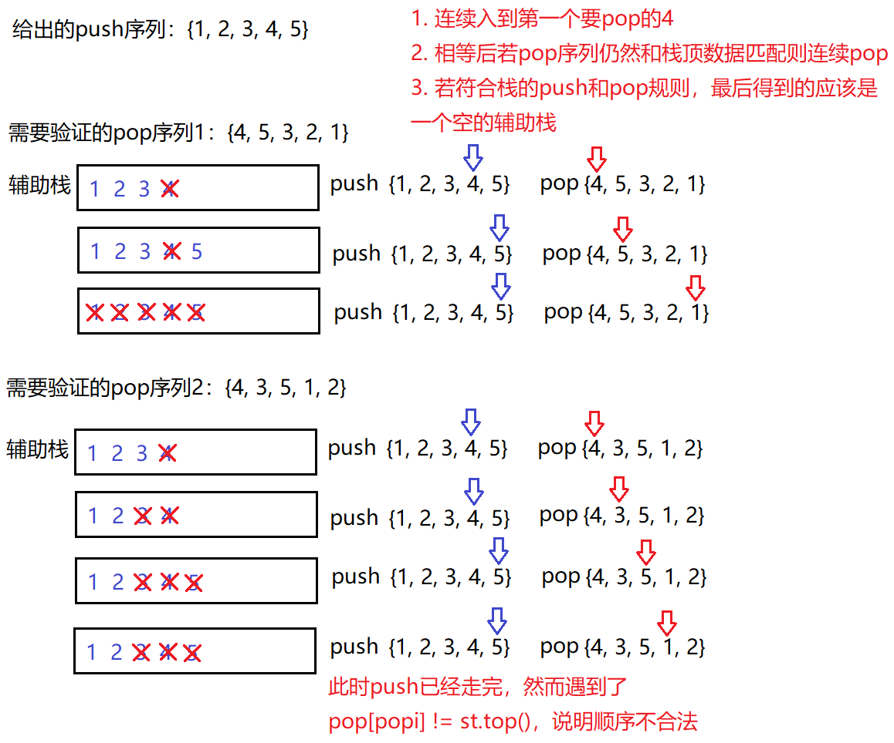
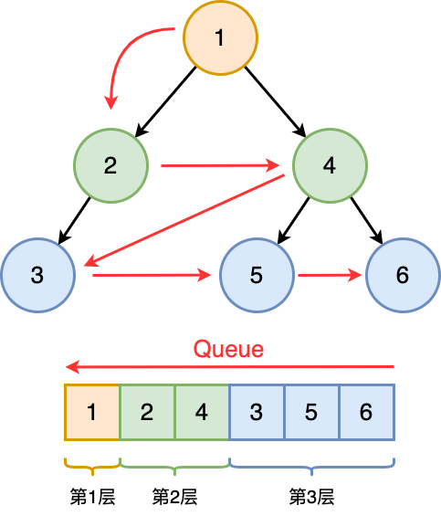
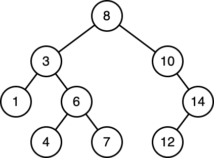

# 二分查找

之所以把二分查找的部分放在最头上是因为二分查找的区间定义及其影响的边界控制方法对后面做题非常重要

二分查找的复杂度是***O(logN)***

## *框架*

### 使用二分查找的前提

1. 有序数组，不论是排升序还是排降序
2. 返回一个索引

### 无重复值

[704. 二分查找](https://leetcode.cn/problems/binary-search/)

二分查找最重要的就是边界控制，而边界控制是要根据区间定义来的。二分查找根据区间定义的不同有两种写法

* 左闭右闭 `[left, right]`

  ```c++
  int binarySearch(vector<int>& nums, int target) {
      int left = 0;
      int right = nums.size() - 1;
      
      while (left <= right) {
          int mid = left + (right - left)/2; // int mid = (left + right) / 2;
          if (nums[mid] == target) {
              return mid;
          }
          else if (nums[mid] < target) { // 提高下界
              left = mid + 1;
          }
          else if (nums[mid] > target) { // 缩小上界
              right = mid - 1;
          }
      }
      return -1;
  }
  ```

  * 为什么要写成 `left + (right - left)/2`？这种表达和 `(left + right)/2` 是一样的效果，但是前者可以抵抗大整数相加溢出

  * 为什么while判断条件用了 `left <= right`？因为将right初始化为 `nums.size()-1`，而不是 `num.size()`，这相当于是左闭右闭的写法。所以当 `left == right` 的时候是有意义的，此时会做最后一次搜索，此时的搜索空间就是 `[left, left]`

  * 为什么迭代操作是 `left = mid + 1` 和 `right = mid - 1`？因为我们已经计算确定了 `nums[mid]` 不等于 target，可以直接把当前的mid排除在外了，所以因为区间定义是左闭右闭，所以把当前mid排除

  * 关于数组是奇数还是偶数的问题：奇数时 `/2` 可以整除，偶数时则要向下取整。但两种情况下边界都是 `+1`、`-1`，所以边界在不断缩小，适用于两种情况，可以手推一下下面两个例子

    ```
    奇数：0 3 5 7 9     target = 7
    偶数：0 3 5 7 9 11  target = 9
    ```

  * 全部用了else if没有用else的原因是这样可以有效的帮助我们理清楚三种情况

* 左开右开 `[left, right)`

  ```c++
  int binarySearch(vector<int>& nums, int target) {
      int left = 0;
      int right = nums.size();
      
      while (left < right) {
          int mid = left + (right - left)/2; // int mid = (left + right) / 2;
          if (nums[mid] == target) {
              return mid;
          }
          else if (nums[mid] < target) { // 提高下界
              left = mid + 1;
          }
          else if (nums[mid] > target) { // 缩小上界
              right = mid;
          }
      }
      return -1;
  }
  ```

  * while判断改为 `left < right`，因为这时候 `left==right` 没有意义
  * 区间迭代的时候是 `left=mid + 1` 和 `right=mid`，同样的因为我们已经计算确定了 `nums[mid]` 不等于 target，可以直接把当前的mid排除在外了，所以因为区间定义是左闭右开，所以把当前mid排除的方式就是直接让 `right=mid`。注意 ⚠️：`left=mid+1` 仍然是这样

### 有重复值：找左侧边界

### 无重复值：找右侧边界

## *二分查找题目*

## *扩展题目*

### 搜索二维矩阵

* 题目：[搜索二维矩阵](https://leetcode.cn/problems/search-a-2d-matrix/)

### 搜索二维矩阵II

* 题目：[搜索二维矩阵 II](https://leetcode.cn/problems/search-a-2d-matrix-ii/)

## *二分查找变体*

# 单向链表

## *链表重构*

### 什么时候应该加哨兵位头节点？

哨兵位主要是方便了头插、头删的时候找头，以及方便调整头指针等

此外若给了一个空链表，那么首先我们需要判断是否链表为空

个人的经验是：**当涉及到链表的遍历、重构时，构思时不论怎样先把头节点加上，看看是否可以简化边界情况的处理，如果感觉不需要的话再去掉**

### 遍历

各种数据结构的遍历+访问有两种形式：线性的和非线性的。线性的就是用for/while来迭代 iteration，非线形的就是递归 recursion

```cpp
void traverse(vector<int>& nums) {
    for (int i = 0; i < nums.size(); i++) {
        // 迭代访问 arr[i]
    }
}

// 递归遍历数组
void traverse(vector<int>& arr, int i) {
    if (i == arr.size()) {     // base case
        return;
    }
    // 前序位置
    traverse(arr, i + 1);
    // 后序位置
}
```

而链表的遍历则既有线性的也有非线性的

```cpp
/**
 * Definition for singly-linked list.
 * struct ListNode {
 *     int val;
 *     ListNode *next;
 *     ListNode() : val(0), next(nullptr) {}
 *     ListNode(int x) : val(x), next(nullptr) {}
 *     ListNode(int x, ListNode *next) : val(x), next(next) {}
 * };
 */

void traverse(ListNode* head) {
    while (head->next) {
        // 迭代访问 p->val
        head = head->next;
    }
}

void traverse(ListNode* head) {
    // 递归访问 head->val
    // 前序位置
    traverse(head -> next);
    // 后序位置
}
```

[二叉树的遍历](#二叉树的遍历)也是既有线性的也有非线性的（其实就是链表的扩展）

同时也可以利用[链表和数组的前序和后序遍历](#链表和数组的前序和后序遍历)来做一些逆序的题目

### 设计链表

* [707. 设计链表](https://leetcode.cn/problems/design-linked-list/)
* 思路：自己定义链表节点Node、使用 `dummyhead_` 简化操作、定义 `size_` 记录链表长度
* 注意点
  * 如果是在Leetcode中主要不要把链表节点命名为ListNode，会发生重定义冲突
  * 找节点的时候从 `dummyhead_` 开始找，而不是从 `dummyhead_->next` 开始找

### <span id="合并两个有序链表">合并两个有序链表</span>

* [21. 合并两个有序链表](https://leetcode.cn/problems/merge-two-sorted-lists/)

* 思路1：双指针，比较结点数据大小。令一个为dest，另一个为src，进行尾插。这种方式虽然很清晰，但边界条件很不好控制

* 思路2：双指针归并，从头开始比较，取小的尾插到新链表。归并操作，指的是将两个顺序序列合并成一个顺序序列的方法

  

### <span id="分隔列表">分隔列表</span>

* 题目

  * [86. 分隔链表](https://leetcode.cn/problems/partition-list/)
  * <https://www.nowcoder.com/practice/0e27e0b064de4eacac178676ef9c9d70?tpId=8&&tqId=11004&rp=2&ru=/activity/oj&qru=/ta/cracking-the-coding-interview/question-ranking>

* 思路：三指针，一个 `currNewGreater` 跟踪大数值链表，一个 `currNewLess` 跟踪小数值链表，另外一个 `currOld` 跟踪原链表中走到了哪里。`currOld` 走完之后，再把新的两个链表连接起来。**注意⚠️：最后一定要把大链表的最后一个置空，即 `currNewGreater->next = nullptr;`，否则会成环**

  

* 注意：因为我们的做法相当于是直接从原链表上摘节点下来，而且不像[合并两个有序链表](#合并两个有序链表)这道题，我们不能确认最后新的链表的最后一个节点就是（任意）原来链表的最后一个节点（若是的话本身最后一个节点的next就已经是空了）。**所以最后一个节点的next必须要置nullptr**，否则就会形成环

### 合并K个有序链表

* 题目：[23. 合并 K 个升序链表](https://leetcode.cn/problems/merge-k-sorted-lists/)
* 思路：用一个优先级队列来先将所有的节点入队列，然后思路就和[合并两个有序链表](#合并两个有序链表)这道题一样了。优先级队列默认 `std::less` 建大堆，记得用lambda自定义一下建小堆
* 注意：这道题和[分隔列表]((#分隔列表))那道题有同样的坑，就是因为不知道到底哪个原来的节点是新的最后一个节点，所以一定要将新的最后一个节点置空，否则会成环
* 时间复杂度分析：***O(NlogK)***，N是链表的总节点数，K是链表的条数

### 查找和最小的K对数字

### 复制带随机指针的链表

* [138. 随机链表的复制](https://leetcode.cn/problems/copy-list-with-random-pointer/)

* 思路1：构造深拷贝，问题在于每一个random应该放在什么位置？将要copy的节点连接到源节点的后面

  

* 思路2：利用BST的KV模型：存储源节点和拷贝节点的KV映射

### 其他链表重构的题目

* [24. 两两交换链表中的节点](https://leetcode.cn/problems/swap-nodes-in-pairs/)

  

## *链表双指针*

### 链表的中间结点

* [876. 链表的中间结点](https://leetcode.cn/problems/middle-of-the-linked-list/)

* 思路：快慢指针，慢指针一次走1步，快指针一次走2步

  

### 删除链表中等于给定值val的所有结点

* [203. 移除链表元素](https://leetcode.cn/problems/remove-linked-list-elements/)

* 思路1：哨兵位简化尾插后直接遍历过去就行了，尾插一般要考虑哨兵位。说实话这道题使用这种方法已经够了，最自然的想法也就是这种方法

* 思路2：快慢指针，遇到等于val的就调整指针关系

  

* 思路3：遍历原链表，把不是val的结点拿出来尾插到新链表

### 输入一个链表，输出该链表中倒数第k个结点

* 题目
  * [19. 删除链表的倒数第 N 个结点](https://leetcode.cn/problems/remove-nth-node-from-end-of-list/)
  * <https://www.nowcoder.com/practice/529d3ae5a407492994ad2a246518148a?tpId=13&&tqId=11167&rp=2&ru=/activity/oj&qru=/ta/coding-interviews/question-ranking>
* 思路
  * 两次遍历求出链表长度N后再走N-K步，复杂度为***O(N)***
  * 快慢指针，快指针先走k步，然后快慢指针同时走。等到快指针走到NULL时，慢指针就是倒数第k个结点。虽然复杂度也为***O(N)***，不过只需要一次遍历了

### 输入两个链表，找出它们的第一个公共结点

* 题目：[160. 相交链表](https://leetcode.cn/problems/intersection-of-two-linked-lists/)
* 思路1：快慢指针。分别找出两个链表的长度和长度差k，然后令长的为快指针走k步后，再令快慢之中遍历一次链表并同时判断node的地址是否有相同的
* 思路2：因为给的是struct结构体，所以分别建两个vector后push_back，将长的vector pop_back掉两个vector的长度差个元素，然后逐次比较
* 思路3：利用两个栈，分别入栈，将长的栈pop掉两个栈的长度差个元素，然后逐次比较
* 思路4：利用BST的K模型，找出第一个出现两次的节点

## *删除链表元素*

### <span id="删除排序链表中的重复元素">删除排序链表中的重复元素</span>

* 题目：[83. 删除排序链表中的重复元素](https://leetcode.cn/problems/remove-duplicates-from-sorted-list/)。这道题虽然标了简单难度，然而是比较麻烦的一道题

* 思路1：用单指针curr来跟踪走到哪里了，这么走是不太好控制的

* 思路2：快慢指针，注意处理尾巴是连续的重复节点的情况，此时要让 `slow->next = nullptr;`

  

### 删除排序链表中的重复元素 II

* 题目：[删除排序链表中的重复元素 II](https://leetcode.cn/problems/remove-duplicates-from-sorted-list-ii/)
* 思路1：这道题不要用和[删除排序链表中的重复元素](#删除排序链表中的重复元素)一样的双指针走，主要问题在于if-else这种结构中slow是必然要移动的，我们既要用 `slow->val` 来判断是否值相等，又要保存slow之前的那个元素，若引入第三个指针好像会变得很复杂
* 思路2：当发现重复元素时用while把这段区间跳过，这样slow就还是开始重复的元素之前的那一个。尽管如此，这种方法仍然需要考虑一些特殊情况，比较容易犯错误
* 思路2：快慢指针 + table。第一遍遍历和[删除排序链表中的重复元素](#删除排序链表中的重复元素)一样，得到一个只保留一个重复元素的链表，并在此期间也建立一张重复元素的set。第二遍遍历时若遇到了这个节点就调整指针指向。这种方法虽然需要额外空间来保存一个set，但是不需要考虑边界条件或特殊情况，是最简单的一种方法
* 思路3：递归

### 从未排序的链表中移除重复元素

* 题目：[1836. 从未排序的链表中移除重复元素](https://leetcode.cn/problems/remove-duplicates-from-an-unsorted-linked-list/)
* 思路：快慢指针 + table。第一次遍历建立一个元素出现次数的table，第二遍历时若发现元素出现次数 `>=2`，就调整指针，将元素删去

## *判断成环*

### 给定一个链表，判断链表中是否有环

* <https://leetcode.cn/problems/linked-list-cycle/description/>
* 思路：用快慢指针转变为一个追击问题，若有环则慢指针肯定能追上快指针。若没有环则当fast或fast->next走完时就返回false
* 证明：为什么快指针每次走2步，慢指针每次走1步时若有环一定能追上？
  * slow进环后开始追击。假设slow进环后，fast和slow之间的距离是X
  * 这次fast真正开始追击slow，每追击一次，fast和slow之间距离缩短1
  * 直到距离缩短到0，二者相遇
* 如果快指针一次走3步、4步、n步时，fast是否肯定能追上slow呢？不一定！这时候环的大小就有影响了
  * 假设环的大小为R，假设fast一次走3步，每走一次fast和slow距离缩短2
    * 若fast和slow之间的距离N是偶数，则第一次就追上
    * 若X是奇数，则距离会变成X, X-2, ..., 3, 1, X-1
    * 此时开始第二次追击，若R-1是偶数（即R是奇数），则第二次就追上了
    * 若R-1是奇数（R是偶数），则永远追不上

### 返回链表开始入环的第一个结点

* <https://leetcode.cn/problems/linked-list-cycle-ii/>

* 思路1：让快慢指针同时从链表起始位置开始遍历链表找出相遇点。当二者相遇时，让一个指针从**相遇点**位置开始绕环运行，头指针重新从头出发。两个指针都是每次均走一步，最终肯定会在入口点的位置相遇。时间复杂度***O(N)***，空间复杂度***O(1)***

  

  * 当slow走1步，fast走2步时，slow进环以后，fast一定在2圈之内追上slow。因为追击过程快慢指针之间相对距离每次缩小1，不可能会错过，他们相对距离最多是1圈，slow最多走1圈就会被追上

  * 设环之前的路程为L，slow进环后走X，环的大小是R

  * 假设slow进环前，fast在环里面转了N圈（$N\geq1$，fast至少要走一圈追上slow）

  * 则fast走的路程为 $L+n*R+X\ (n=1,\cdots,n)$

  * 根据下面的公式可以看出若一个指针从相遇点出发，一个指针从头开始走，他们会在入口点相遇
    $$
    fast == slow\longleftrightarrow L+n*R+X = 2*(L+X) \rightarrow L=n*R-X=(n-1)*R+(R-X)\\\rightarrow L+(R-X)=(n-1)*R
    $$

  * 假设的参数中只有R是可以明确算出来的

* 思路2：建立索引遍历，第一个重新遇到的就是入口。时间、空间复杂度都是***O(N)***

## *单链表递归反转*

### 框架

### 反转一个单链表

* [206. 反转链表](https://leetcode.cn/problems/reverse-linked-list/)

* 遍历法

    * 思路1：颠倒指针

        

        ```c
        class Solution {
        public:
            ListNode* reverseList(ListNode* head) {
                ListNode* curr = head;
                ListNode* next = head;
                ListNode* prev = nullptr;
                while (curr != nullptr) {
                    next = curr->next;
                    curr->next = prev;
                    prev = curr;
                    curr = next;
                }
                return prev;
            }
        };
        ```

    * 思路2：遍历原链表，把所有结点拿出来头插尾插到新链表。这个题目的关系没有上面方法那么简单
    
        

* 递归法

### 反转一个链表的某个区间

### K个一组反转链表

## *回文链表*

### 链表的回文结构

* <https://www.nowcoder.com/practice/d281619e4b3e4a60a2cc66ea32855bfa?tpId=49&&tqId=29370&rp=1&ru=/activity/oj&qru=/ta/2016test/question-ranking>
* 思路1：快慢指针找到中间结点rhead后将rhead后面的部分逆置。奖后将head和rhead都看作慢指针，每次走一步并且比较，若有不同则返回false。奇数次和偶数次的情况可以统一为一种情况，奇数次时会形成环
* 思路2：直接新建一个翻转的新链表，然后两个指针同时走比较
* 思路3：二叉树后序遍历？

# 数组

## *双指针*

### 典型：O(1)原地移除元素

* [27. 移除元素](https://leetcode.cn/problems/remove-element/) 给你一个数组 nums 和一个值 val，你需要 原地 移除所有数值等于 val 的元素，并返回移除后数组的新长度。不要使用额外的数组空间，你必须仅使用 O(1) 额外空间并 原地 修改输入数组。

* 思路：双指针

  

### 其他题目

* [26. 删除有序数组中的重复项](https://leetcode.cn/problems/remove-duplicates-from-sorted-array/)

* [283. 移动零](https://leetcode.cn/problems/move-zeroes/)

* [977. 有序数组的平方](https://leetcode.cn/problems/squares-of-a-sorted-array/)

* [189. 轮转数组](https://leetcode.cn/problems/rotate-array/) & https://kamacoder.com/problempage.php?pid=1065 右旋转字符串。空间复杂度 ***O(1)*** 的两种方法

  

  * 思路1：双指针遍历
  * 思路2：负负得正，先倒置整体，后倒置每个单词


### 合并两个有序数组

* [88. 合并两个有序数组](https://leetcode.cn/problems/merge-sorted-array/) 给你两个按非递减顺序排列的整数数组nums1和nums2，另有两个整数m和n，分别表示 nums1和nums2中的元素数目。请你合并nums2到nums1中，使合并后的数组同样按非递减顺序排列。
* 思路：因为是非递减的数组，所以三指针从后往前排

```c
void merge(int* nums1, int nums1Size, int m, int* nums2, int nums2Size, int n){
    int dest = m-1, src = n-1, dest_end = m+n-1;
    while (src>=0 && dest>=0)
    {
        if (nums2[src] >= nums1[dest])
            nums1[dest_end--] = nums2[src--];
        else
            nums1[dest_end--] = nums1[dest--]; 
    }
    while (src>=0)
        nums1[dest_end--] = nums2[src--]; 
}
```

### 汇总区间

* 题目：[228. 汇总区间](https://leetcode.cn/problems/summary-ranges/)
* 思路：快慢指针

```cpp
class Solution {
public:
    vector<string> summaryRanges(vector<int>& nums) {
        int stay = 0, move = 1;
        int n = nums.size();
        vector<string> ret {};
        while (move <= n - 1) {
            if (nums[move] == nums[move - 1] + 1) {
                move++;
            }
            else {
                if (stay == move - 1) {
                    ret.push_back(std::to_string(nums[stay])); // only one element
                }
                else {
                    ret.push_back(std::to_string(nums[stay]) + "->" + std::to_string(nums[move - 1]));
                }
                stay = move++;
            }
        }
        // last range
        if (n > 0) {
            if (stay == n - 1) {
                ret.push_back(std::to_string(nums[stay])); // only one element
            }
            else {
                ret.push_back(std::to_string(nums[stay]) + "->" + std::to_string(nums[n - 1]));
            }
        }
        return ret;
    }
};
```

## *前缀和*

前缀和主要适用的场景是原始数组不会被修改的情况下，频繁查询某个区间的累加和

## *差分数组*

查分数组主要适用的场景是频繁对原始数组的某个区间的元素进行增减

## *二维数组的遍历*

### 顺/逆时针旋转矩阵

### 螺旋遍历

* [59. 螺旋矩阵 II](https://leetcode.cn/problems/spiral-matrix-ii/)

螺旋遍历没有什么高级的技巧，就是按照顺序遍历即可。难点在于边界控制

核心是要将遍历统一为左闭右开方便上下左右的四趟遍历，其实就是要分成奇偶数两种情况


## *滑动窗口*

### 典型例题 & 框架

* [209. 长度最小的子数组](https://leetcode.cn/problems/minimum-size-subarray-sum/)

* 题目：

  给定一个含有 `n` 个正整数的数组和一个正整数 `target` **。*

  找出该数组中满足其总和大于等于 `target` 的长度最小的 **连续子数组** `[numsl, numsl+1, ..., numsr-1, numsr]` ，并返回其长度**。**如果不存在符合条件的子数组，返回 `0` 


滑动窗口的框架是一个 for/while + while，第一层循环控制的是终止位置，如何移动起始位置是滑动窗口的核心所在

```pseudocode
int right = 0; // 窗口的终止位置
int left = 0;  // 窗口的起始位置
while (控制right) {
	windows.add();
	right++;
    while (控制left) {
    	windows.remove();
    	left++;
    }
}
```

这个算法的复杂度仍然是 ***O(2N)***，因为所有元素最多就过两遍。相当于是两层for循环的剪枝

TODO：有负数咋办？

### 字符串问题

处理字符串问题要进行一些字符串的操作

### Rabin-Karp字符匹配算法

## *数组/顺序表*


### 杨辉三角

* <https://leetcode.cn/problems/pascals-triangle/>

```cpp
class Solution {
public:
    vector<vector<int>> generate(int numRows) {
        vector<vector<int>> vv;
        vv.resize(numRows); // resize初始化每一行
        // 每一行的首尾元素赋为1
        for (size_t i=0; i<vv.size(); i++)
        {
            vv[i].resize(i+1, 0);
            vv[i].front() = vv[i].back() = 1;
        }

        for (size_t i=0; i<vv.size(); i++)
        {
            for (size_t j=0; j<vv[i].size(); j++)
                if (!vv[i][j])
                    vv[i][j] = vv[i-1][j] + vv[i-1][j-1];
        }
        return vv;
    }
};
```

### 电话号码的字母组合

* <https://leetcode.cn/problems/letter-combinations-of-a-phone-number/>
* 思路：排列组合多路递归，深度优先遍历。


```cpp
class Solution {
    const char* numToStr[10] = {"", "", "abc", "def", "ghi", "jkl", "mno", "pqrs", "tuv", "wxyz"};
    //string numToStr[10] = {"", "", "abc", "def", "ghi", "jkl", "mno", "pqrs", "tuv", "wxyz"};
public:
    void combine(string digits, int di, vector<string>& retV, string combineStr)
    { // digits为选中的数字，di为其下标，retV存放返回的可能组合，combineStr
        // 取数字字符映射的字符串
        if (di == digits.size())
        {
            retV.push_back(combineStr);
            return;
        }
        int num = digits[di] - '0';
        string str = numToStr[num];
        for (auto ch : str)
            combine(digits, di+1, retV, combineStr+ch);
            // 这里注意不要写成combineStr+=ch了，因为处于for循环中，combineStr需要重复使用
    }
    vector<string> letterCombinations(string digits) {
        vector<string> v;
        if (digits.empty())
            return v;
        string str;
        combine(digits, 0, v, str);
        return v;
    }
};
```

# 字符串

## *字符串的库函数及其复杂度*


### 容量操作

* `size` 与 `length` 是一样的，只是因为string类产生的比较早，用的是 `length`，后来出现了其他容器后统一规范为 `size`

  `string.size()` 返回的是一个无符号的 `string::size_type` 类型的数据，所以当求了size之后，就不要和int混用了以免出错

* `reserve(size_t n)`：预留空间

* `clear`：清空有效字符

* `resize(size_t n, char c)`：将有效字符的个数改成n个，多出的空间用字符c填充（开空间+初始化）

### 访问及遍历操作

* `operator[]` 重载的意义：可以像操作数组一样用 `[]` 去读写访问对象
* `at` 和 `operator[]` 的区别是越界以后抛异常

### 迭代器 iterator

PS：范围for的底层实现，范围for的底层就是无脑直接替换迭代器

* iterator是属于容器的一个类，它的用法很像指针，可能是指针也可能不是
* string和vector不太使用迭代器，因为 `operator[]` 更方便，但是对于其他的容器如list、map、set来说只能用迭代器来访问。迭代器是所有容器的通用访问方式，用法类似
* C++中的迭代区间都是左闭右开 `[ )`，右开是因为方便遍历到 `\0` 时正好结束
* `begin` & `end`: return iterator to beginning/end
* `rbegin` & `rend`: return reverse iterator
* 四种迭代器
  * iterator/reverse_iterator
  * const_iterator/const_reverse_iterator

```cpp
// 迭代器示例
void PrintString(const string& str) {
    string::const_iterator it = str.begin();
//auto it = str.begin(); // auto自动推导
    while (it != str.end())
//*it = 'x';
        cout << *it++ << " ";
    cout << endl;

    string::const_reverse_iterator rit = str.rbegin();
    while (rit != str.rend())
        cout << *rit++ << " ";
    cout << endl;
}
```

### 查找

* `find` 和 `rfind`：返回 size_t，返回第一个/最后一个找到的位置，找不到则返回 `npos`，这时会解释为一个非常大的数，这是因为默认不存在这么大的字符串
* `substr` 从pos位置开始取n个字节长度的子串

### 插入

* insert：时间复杂度大概是 ***O(N)***

* push_back 和 append

  * 不如 +=，基本都是用 +=。`operator+=` 在字符串后追加字符串str

  * 也可以使用迭代器，来控制插入字符的某一段

    ```cpp
    string s("hello");
    string str(" world");
    s.append(str.begin(), str.end());
    ```

### 修改

* replace
* assign
* erase

### 非成员函数

* getline：cin和scanf一样，输入以空格或换行符为间隔标志，因此会自动把空格去掉。getline和C语言中的fgetf函数功能一样，帮助取到一句有空格的字符串
* operator+：尽量少用，传值返回导致深拷贝效率低

### string 和其他数据类型之间的转换

* c_str：用来兼容C字符串，C不支持string类型。比如说 `printf()` 无法直接输出string，可借助 `c_str()` 来输出

  ```cpp
  printf("%s", s.c_str()); // print string
  
  string filename("test.cpp");
  FILE* fout = fopen(filename.c_str(), "r");
  assert(fout);
  // ...
  ```

* 补充 atoi：Ascii to Integer 是一个C标准库函数，用于将字符串转换为整数

  ```c++
  int atoi(const char *str) 
  ```

* stoi, stol, stof, stod：字符串转换为 int、long、float、double

  ```c++
  int stoi (const string&  str, size_t* idx = 0, int base = 10);
  int stoi (const wstring& str, size_t* idx = 0, int base = 10);
  ```

  * 函数参数

    * `const string& str`：要转换的字符串

    * `size_t* idx = 0`：可选参数，用于存储第一个无法被转换的字符的位置的指针。如果转换成功，此参数保持为默认值 0

    * `int base = 10`：可选参数，表示字符串中的数字的进制，默认为十进制。可以选择 2、8、10 或 16 进制

  * 返回转换后的整数值

  * stoi 会对转化后的数进行检查，判断是否会超出 int 范围，如果超出范围就会报错

* to_sring, to_wstring：将内置数据类型转换为字符串的函数

## *字符串操作问题*

### 反转

* [344. 反转字符串](https://leetcode.cn/problems/reverse-string/)：双指针即可。`lo <= hi` 和 `lo < hi` 都可以，前者的话奇数会多做一次操作

* [917. 仅仅反转字母](https://leetcode.cn/problems/reverse-only-letters/)：双指针，若判断为字母就swap

* [541. 反转字符串 II](https://leetcode.cn/problems/reverse-string-ii/)

  这道题看起来简单，但是笔者第一次做的时候使用计数器，然后越写发现if的判断条件和分支加的越来越多，最后也没有做出来

  这道题的核心在于 **每计数至 `2k` 个字符，就反转**，所以应该设计成一个 stride 为 `2*k` 的for循环

  reverse可以自己实现，也可以用 `std::reverse`，反正时间复杂度都是 ***O(N/2)***

* [151. 反转字符串中的单词](https://leetcode.cn/problems/reverse-words-in-a-string/)：比较复杂的一道题

  * 使用库函数：split提取单词后拼接起来
  * 空间复杂度 ***O(1)*** 的做法：分成下面三步
    * 去除多余的空格
    * 翻转整体
    * 翻转每个单词

### 替换问题

* https://kamacoder.com/problempage.php?pid=1064 替换数字
* [1844. 将所有数字用字符替换](https://leetcode.cn/problems/replace-all-digits-with-characters/)

## *KMP算法问题*


### 字符串最后一个单词的长度

* <https://www.nowcoder.com/practice/8c949ea5f36f422594b306a2300315da?tpId=37&&tqId=21224&rp=5&ru=/activity/oj&qru=/ta/huawei/question-ranking>
* 思路：调用string::rfind找到最后一个空格后再用strlen

```cpp
int main() {
    string str;
    getline(cin, str); 
    size_t pos = str.rfind(' ');
    if (pos != string::npos)
    {
        cout << str.size() - pos - 1 << endl;
    }
    else
    {
        // 只有一个单词
        cout << str.size() << endl; 
    }
}
```

### 字符串中的第一个唯一字符

* <https://leetcode.cn/problems/first-unique-character-in-a-string/>
* 思路：计数排序

```cpp
class Solution {
public:
    int firstUniqChar(string s) {
        int countArr[26] = {0};
        for (auto ch:s)
        {
            countArr[ch-'a']++;
        }
        for (size_t i=0; i<s.size(); i++)
        {
            if (countArr[s[i]-'a'] == 1)
                return i;
        }
        return -1;
    }
};
```

### 字符串转整型数字

* <https://www.nowcoder.com/practice/1277c681251b4372bdef344468e4f26e?tpId=13&&tqId=11202&rp=6&ru=/activity/oj&qru=/ta/coding-interviews/question-ranking>
* 思路：从头遍历

```cpp
long long StrToInt(string str)
{
    long long sum = 0;
    int i = 0;
    int flag = 1; // 记录正负数
    int end = str.size(); // 不算\0
    while (i < end)
    {
        if ((str[i] > '0' && str[i] < '9') || (str[i] == '+' || str[i] == '-'))
        {
            if (i == 0 && (str[0] == '+' || str[0] == '-')) // 处理 +- 号
                str[0] == '+' ? flag : flag *= -1; // 若是-号，就将flag置为-1
            else
                sum = sum * 10 + (str[i] - '0');
            i++;
        }
        else
            return 0;
    }
    return flag * sum;
}
```

### 字符串相加--实现大整数加法

* <https://leetcode.cn/problems/add-strings/>
* 思路：从后往前将每一个转换为数字后进行加法，用next来保留进位。将加法得到的结果转换回string然后进行尾插。注意：string和vector一样因为效率原因不提供尾插，尾插的方法是直接+=，最后reverse

```cpp
class Solution {
public:
    string addStrings(string num1, string num2) {
        int end1 = num1.size() - 1, end2 = num2.size() - 1;
        int next = 0; // 保存进位
        string strRet; // 保存返回的string
        while (end1 >= 0 || end2 >= 0) // 两个都走完才结束
        {
            int val1 = end1 >= 0 ? num1[end1] - '0' : 0; // 若有一个加数走完了，那么就将他相应位看作0
            int val2 = end2 >= 0 ? num2[end2] - '0' : 0;
            int ret = val1 + val2 + next;
            next = ret > 9 ? 1 : 0;
            // // string 不支持 push_front，因为string和vector一样头插要挪动数据，效率很低。要使用insert
            // strRet.insert(0, 1, (ret % 10) + '0'); // strRet.insert(strRet.begin(), (ret % 10) + '0') 用迭代器
            --end1;
            --end2;
            // 尾插就是直接+=后最后统一reverse一下就可以了
            strRet += ('0' + ret%10);
        }
        // 类似于'1' + '9'这种情况下，还有1个进位
        if (next == 1)
            strRet += '1';
        reverse(strRet.begin(), strRet.end());
        // // 类似于'1' + '9'这种情况下，还有1个进位
        // if (next)
        //     strRet.insert(strRet.begin(), '1');
        return strRet;
    }
};
```

# set & map

哈希表最擅长做的就是给一个元素，看这个元素是否在表中出现过

* 数组：用下标做索引，如果元素的范围很大或者很分散的话，用数组就不合适，因为要开很大的空间，浪费空间
* set：**避免重复的情况，验证唯一性**
* map：需要通过特殊的下标索引来记录值，或者下表索引范围很大或很分散

## *nSum*

### 一场意外：排序的twoSum

这道题严格意义上并不属于 nSum 问题，因为它用双指针就能解决

* 题目：[167. 两数之和 II - 输入有序数组](https://leetcode.cn/problems/two-sum-ii-input-array-is-sorted/)。从一个已经排升序的数组之中找出满足相加之和等于目标数 `target` 的两个数，以长度为 2 的整数数组 `[index1, index2]` 的形式返回这两个整数的下标 `index1` 和 `index2`

* 思路：左右指针，因为已经排成升序了，所以如果当前两个边界的值大于 `target` 就缩小右边界，若小于 `target` 就放大左边界

### 哈希表：未排序的twoSum

* 题目：[1. 两数之和](https://leetcode.cn/problems/two-sum/)。这道题目虽然标的是简单，但实际上比前面排序好的twoSum要麻烦，很有理由怀疑是两道题目的难易程度搞混了
* 思路
  * 因为这道题目由题目保证了每种输入只会对应一个答案，**不需要我们去重**，所以可以用哈希表来做。其实这道题即使想要用双指针也用不了，因为题目要求返回的是数组下标，而双指针法需要首先进行排序，排序完下标也就乱了
  * 和base case的区别是没有排序，所以我们首先要排序。但是用 `sort()` 排序是对原来的vector直接操作的，那么排完序之后就不能取到原来的序号了。我们可以尝试用unordered_map来保存 `<num, 对应的原下标>` 这种对应关系，但会很麻烦
  * 实际上不需要排序，只要一次遍历，一边用unordered_map来保存 `<num, 对应下标>` 这种对应关系，一边找 `target-nums[i]` 是否已经在 dict 中就可以了。如果找到了直接返回对应的两个下标就行


### 哈希表：四数之和II

* [454. 四数相加 II](https://leetcode.cn/problems/4sum-ii/)：思路基本和 [1. 两数之和](https://leetcode.cn/problems/two-sum/) 一样
* 这道题比四数之和简单，因为不需要去重。思路就是将暴力的4层for循环拆分为2个2层for循环，复杂度为 ***2O(N^2)***。在第一个2层for循环中在map中记录下投两个元素的和，在第二个2层for循环中只要去找 `target-nums3[i]-nums4[j]` 就可以了

### 需要去重问题的 \*Sum 问题的Base Case

现在泛化twoSum：`nums` 中**可能有多对**元素之和都等于 `target`，请算法返回**所有**和为 `target` 的元素对，其中**不能出现重复**

比如说输入为 `nums = [1,3,1,2,2,3], target = 4`，那么算法返回的结果就是：`[[1,3],[2,2]]`（注意：要求返回元素，而不是索引，所以可以 sort 后用双指针）


适应这种情况的方式是左右指针如果遇到了重复的就继续移动，复杂度为快排引起的***O(NlogN)***

```cpp
vector<int> twoSum(vector<int>& numbers, int target) {
    sort(nums.begin(), nums.end());
    int sz = nums.size();
    int lo = 0, hi = sz - 1;
    vector<vector<int>> ret;
    while (lo <= hi) {
    	if (nums[lo] + nums[hi] < target) {
            // 思维误区：这里不需要去重，全部统一在了找到二元组的情况
            lo++;
        }
        else if (nums[lo] + nums[hi] > target) {
            // 思维误区：这里不需要去重，全部统一在了找到二元组的情况
			hi--;
        }
        else {
            ret.push_back( {left, right} );
            lo++;
            hi--;
            while (hi > 0 && nums[hi] == nums[hi + 1]) hi--;
            while (lo < sz - 1 && nums[lo] == nums[lo - 1]) lo++;
        }
    }
    
    return ret;
}
```

### 指针法：threeSum & fourSum

[15. 三数之和](https://leetcode.cn/problems/3sum/) 和 [18. 四数之和](https://leetcode.cn/problems/4sum/) 这两道题思路和之前的base是一样的。关键仍然在于去重，分别是对三元组的第一个元素去重，以及对三元组的第二、第三个元素去重

* 因为这两道题都不需要返回原来的数组下标，所以可以排序
* threeSum 和 fourSum可以分一层/两层for循环 + Base Case来解决
* 剪枝
  * 三数之和的target为0，所以排序之后可以对第一个元素剪枝
  * 注意⚠️：四数之和很鸡贼，**它的target可以是负数**，所以无法对四元组的第一、第二个元素剪枝

## *其他*

### set应用

* [349. 两个数组的交集](https://leetcode.cn/problems/intersection-of-two-arrays/)：不要求顺序，输出唯一的交集元素。相当于就是验证 `nums2` 中有哪些元素也是在 `nums1` 中的，因为要验证唯一性/存在性，所以用 set 就可以

* [202. 快乐数](https://leetcode.cn/problems/happy-number/)：如果 `n` 是 *快乐数* 就返回 `true` ；不是，则返回 `false` 

  快乐数的定义为：

  * 对于一个正整数，每一次将该数替换为它每个位置上的数字的平方和。
  * 然后重复这个过程直到这个数变为 1，也可能是 **无限循环** 但始终变不到 1。
  * 如果这个过程 **结果为** 1，那么这个数就是快乐数。

  无限循环的意思就是说有一个相加结果会重复出现，从这个相加结果开始陷入死循环。所以这道题的核心就是要验证结果是否重复，即结果的唯一性。因此要用 set 来验证唯一性

### map应用

* [242. 有效的字母异位词](https://leetcode.cn/problems/valid-anagram/)：通过字典分别统计两个单词中出现的字母的个数是否相同就行
* [383. 赎金信](https://leetcode.cn/problems/ransom-note/)：和字母异位词的思路是一样的，不过这道题中 `magazine` 中包含的字符是可以多于 `ransomNote` 中的字符的，也就是说 `ransomNote` 是 `magazine` 的子集，这点在判断字符数量的时候要注意
* [169. 多数元素](https://leetcode.cn/problems/majority-element/)：很简单的一道题，map 统计元素个数就行
* [961. 在长度 2N 的数组中找出重复 N 次的元素 - 力扣（LeetCode）](https://leetcode.cn/problems/n-repeated-element-in-size-2n-array/)：跟169题基本一样的。遍历一遍数组，放到计数的countMap里，若countMap的Val等于N，返回countMap的Key

### 前K个高频单词

* <https://leetcode.cn/problems/top-k-frequent-words/>
* 思路1：优先级队列通过构建仿函数，提供自定义仿函数less来实现字典序

    ```cpp
    struct Less // 为优先级队列自定义仿函数
    {
        bool operator()(const pair<string, int>& kv1, const pair<string, int>& kv2) const //临时变量具常性，不用const可能通不过编译
        {
            if (kv1.second < kv2.second) // 比较val的大小
                return true;
            if (kv1.second == kv2.second && kv1.first > kv2.first) // 若val相同，则按字典序排
                return true;
            return false;
        }
    };

    vector<string> topKFrequent(vector<string>& words, int k) {
        map<string, int> countMap; // 统计次数
        for (auto& str : words)
            countMap[str]++;
        // topK问题，优先级队列方案
        priority_queue<pair<string, int>, vector<pair<string, int>>, Less> maxHeap;
        for (auto& kv : countMap)
            maxHeap.push(kv);
        // 返回topK的vector<string>
        vector<string> v;
        while (k--)
        {
            v.push_back(maxHeap.top().first);
            maxHeap.pop();
        }
        return v;
    }
    ```

* 思路2：直接使用 `stable_sort`

    ```cpp
    struct Greater
    {
        bool operator()(const pair<string, int>& kv1, const pair<string, int>& kv2) const
        {
            if (kv1.second > kv2.second)
                return true;
            // // 若用的是stable_sort就不用提供下面的比较了，这里是间接解决了sort的稳定性问题
            // if (kv1.second == kv2.second && kv1.first < kv2.first) // 若val相同，则按字典序排
            //     return true;
            return false;
        }
    };
    vector<string> topKFrequent(vector<string>& words, int k) {
        map<string, int> countMap;
        for (auto str:words)
            countMap[str]++;
        // 保证字典序就要保证sort稳定性，因此用stable_sort
        // sort和stable_sort都要使用随机访问迭代器，因此将map里的东西转移到vector里
        vector<pair<string, int>> sortV(countMap.begin(), countMap.end());
        stable_sort(sortV.begin(), sortV.end(), Greater());

        vector<string> v;
        for (size_t i=0; i<k; i++)
            v.push_back(sortV[i].first);
        return v;
    }
    ```

* 思路3：使用multimap进行排序，因为map底层是红黑树，可以对key进行排序

    ```cpp
    vector<string> topKFrequent(vector<string>& words, int k) {
        map<string, int> countMap;
        for (auto& str : words)
            countMap[str]++;
        
        multimap<int, string, greater<int>> sortMap; //不能用map，因为要保留重复项
        for (auto& kv : countMap)
            sortMap.insert(make_pair(kv.second, kv.first));
        
        vector<string> v;
        multimap<int, string, greater<int>>::iterator it = sortMap.begin();
        for (size_t i=0; i<k; i++)
        {
            v.push_back(it->second);
            it++;
        }
        return v;
    }
    ```

# 栈 & 队列

## *构造问题*

### 用栈实现队列

* [232. 用栈实现队列](https://leetcode.cn/problems/implement-queue-using-stacks/)

* 思路

  

  * 一种想法是每次pop的时候先把数据从 `in_` 全部倒入 `out_`，从 `out_` 取到要pop的数据并且pop后再把此时 `out_` 中所有的元素重新倒回 `in_` 中。这种做法可以完成任务，但并不好。因为会造成非常冗余的倒数据，比如说连续的pop。以及在这道题中如果采用这种方式则 peek 无法复用 pop，因为会造成数据顺序的混乱
  * 优化的方法是pop会不把所有的数据从 `out_` 全部倒回 `in_`，如果 `out_` 中有数据就直接从 `out_` 中拿，如果没有数据才从 `in_` 中倒入

### 用队列实现栈

* [225. 用队列实现栈](https://leetcode.cn/problems/implement-stack-using-queues/)

* 思路：给两个FIFO的队列，保持一个队列存储数据，一个队列空着，空着的队列是为了将另一个队列的数据倒过来。和用栈实现队列不太一样，这里pop的实现中是先要把全部数据搬到队列 `out_` ，然后再搬回队列 `in_`，也就是用栈实现队列中那种peek不可复用pop的设计。之所以有这种不同是因为即使有另外一个队列也无法实现连续 pop 的栈顺序

  

### 设计循环队列/环形缓冲器

* 解决的问题是当位子有限时的排队，比如限定了人数的商店，只有当一个人出去了另一个人才能进来。OS中的生产者消费者模型
* <https://leetcode.cn/problems/design-circular-queue/>
* 思路：
  * 因为有可能是因为push满了也有可能是pop空了，此时都是 front == rear，无法判断到底是满了还是空了
  * 可以考虑多记录一个size
  * 也可以考虑多开一个空间不存储数据，当 rear + 1 == front 是就是满了，若 front == rear 就是空
  * 因为用单链表实现比较难取尾，所以用数组来实现
  * 要处理当tail或head在边界时的特殊情况

为了更方便的取队尾数据，采用数组来实现

### 最小栈：要求时间复杂度为O(1)

* <https://leetcode.cn/problems/min-stack/>

* 思路：构造一个辅助栈minst存储最小值，当st中有小于等于minst堆顶数据的时候minst才插入

  

```cpp
class MinStack {
public:
    MinStack() {
    // 不用处理，空的构造函数等价于默认构造函数，因为会自动调用初始化列表（实际上初始化的地方）进行默认的初始化
    // 因为类成员都是 stack<int> 这种有默认构造的内置数据类型，所以给一个默认构造也没事
    }
    void push(int val) {
        _st.push(val);
        if (_minst.empty() || val <= _minst.top())
            _minst.push(val);
    }
    void pop() {
        if (_minst.top() == _st.top()) // 若是和_st.top()相同的数据就删除_minst.top()
            _minst.pop();
        _st.pop();
    }
    int top() {
        return _st.top();
    }
    int getMin() {
        return _minst.top();
    }
private:
    stack<int> _st;
    stack<int> _minst;
};
```

* 进一步扩展：若待入栈的数据是大量重复数据该怎么办？比如插入10w个1。将minst中的数据类型改成一个struct或class，加一个计数器类成员。若是相同的数据则只要更新计数器就行

## *栈的应用*

由于栈结构的特殊性，非常适合做对称匹配类的题目，比如说括号是否匹配

### 括号匹配问题

* [20. 有效的括号](https://leetcode.cn/problems/valid-parentheses/)

* 思路：左括号入栈，若不是左括号则进行匹配，若匹配则将此时的栈顶元素pop掉，若不匹配则返回false。直到全部元素判断完

* 这道题的思路虽然不难，但是要分析清楚三种括号不正常的情况

    ```
    ( ] ) // 括号类型不匹配 -> 判断栈顶元素
    ( ( ) // 左括号多余了 -> 最后stack判空
    [ ]]] // 右括号多余了 -> 如果栈顶元素不匹配直接返回false
    ```

* 改进：若队列中不仅仅包含括号，还有其他字符怎么办？多添加一个 else if 判断就可以


### 栈的弹出压入序列

* <https://www.nowcoder.com/practice/d77d11405cc7470d82554cb392585106?tpId=13&&tqId=11174&rp=1&ru=/activity/oj&qru=/ta/coding-interviews/question-ranking>
* 思路：用一个辅助栈来模拟push和pop的过程。若当前push的值不等于要pop的值就持续入；若和pop序列匹配就持续出。若辅助栈的值能pop完就为真否则为假



```cpp
class Solution {
public:
    bool IsPopOrder(vector<int> pushV,vector<int> popV) {
        stack<int> st;
        int popi = 0;

        for (auto pushVal : pushV)
        {
            st.push(pushVal);
            // 出栈序列匹配后要持续比较，可能会有多个匹配
            while (!st.empty() && popV[popi] == st.top())
            {
                popi++;
                st.pop();
            }
        }
        return st.empty(); // return popi == popV.size();
    }
};
```

### 其他题目

* [1047. 删除字符串中的所有相邻重复项](https://leetcode.cn/problems/remove-all-adjacent-duplicates-in-string/)：比较简单，单指针遍历字符串入栈，最后将栈中的字符串依次拿出来然后倒置一下就可以了

## *表达式问题*

### 波兰表达式

波兰表达式 Polish notation 也称前缀表达式。在计算机中人类习惯的中缀表达式是无法进行有效计算的，必须转换成前缀或后缀表达式队列后，利用出栈和入栈再进行运算

* 中缀表达式 infix expression `2 + 1 * 3`
* 后缀表达式 suffix expression（逆波兰表达式 Reverse Polish Notation, RPN）：不包含括号，运算符放在两个运算对象的**后面**，所有的计算按运算符出现的顺序，严格**从左向右**进行（不再考虑运算符的优先规则），比如 `2 1 3 * +`
* 前缀表达法 prefix expression（波兰表达式）：不包含括号，运算符放在两个运算对象的**前面**，严格**从右向左**进行（不再考虑运算符的优先规则），所有的计算按运算符出现的顺序，比如 `+ 2 * 1 3` 

### 中缀、后缀、前缀之间的转换

Online Converter: https://raj457036.github.io/Simple-Tools/prefixAndPostfixConvertor.html

我们来具体看一下中缀表达式是如何转换为后缀、前缀表达式的，分别以 `2 + 1 * 3` 和 `(2 + 1) * 3` 为例

* 后缀表达式

  1. 初始化一个空栈和一个空列表，用于存储运算符和最终的逆波兰表达式

  2. **从左到右**扫描中缀表达式的每个元素

     * 如果是操作数，直接添加到逆波兰表达式中

     * 如果是运算符：

       * 如果栈为空，直接将运算符入栈
       * 如果栈不为空，比较栈顶运算符的优先级和当前运算符的优先级：
         * 如果当前运算符的优先级**高于**栈顶运算符，直接将当前运算符**入栈**
         * 如果当前运算符的优先级**不高于**栈顶运算符，将栈顶运算符**弹出并添加到逆波兰表达式中**，然后继续比较直到满足条件

       * 将当前运算符入栈

  3. 扫描完所有元素后，将栈中剩余的运算符依次弹出并添加到逆波兰表达式中

     

* 中缀转换为前缀表达式与中缀转换为后缀的区别是

  * 前缀是**从右到左扫描中缀表达式中的每个元素**
  * 要反转最后得到的表达式才是前缀表达式

  

### 逆波兰表达式求值

* [150. 逆波兰表达式求值](https://leetcode.cn/problems/evaluate-reverse-polish-notation/)
* 思路
  * 给一个辅助栈，只入操作数，不入操作符
  * 遇到操作数就入栈，遇到运算符就就取栈顶的连续两个数据运算，运算结果继续入栈
  * 若序列走完了，最后辅助栈里栈顶元素就是结果

### 基本运算器

* [224. 基本计算器](https://leetcode.cn/problems/basic-calculator/)
* 包含了两个基本步骤：先要将输入的中缀表达式转换为后缀表达式，然后再利用后缀表达式求值
  * 中缀转后缀
    * 操作数输出到存储序列中，操作符入辅助栈
    * 栈为空，或者若操作符比当前栈顶的操作符优先级高则当前操作符入栈；若低于或等于栈顶操作符，则栈顶元素出栈放到存储序列中，然后当前操作符入栈（注意，若栈中有多个运算符，就要进行连续比较）。这是因为要控制栈顶的优先级高
    * 序列走完了，若辅助栈里还有操作符则依次输出到存储序列中
  * 若有括号，则设置一个flag，将 flag = 1，则将运算符优先级升到最高
  * 处理空格

### 基本计算器 变种

* [227. 基本计算器 II](https://leetcode.cn/problems/basic-calculator-ii/)
* [772. 基本计算器 III](https://leetcode.cn/problems/basic-calculator-iii/)
* [770. 基本计算器 IV](https://leetcode.cn/problems/basic-calculator-iv/)

## *语法解析问题*

[736. Lisp 语法解析](https://leetcode.cn/problems/parse-lisp-expression/)

[439. 三元表达式解析器](https://leetcode.cn/problems/ternary-expression-parser/)

[722. 删除注释](https://leetcode.cn/problems/remove-comments/)

[385. 迷你语法分析器](https://leetcode.cn/problems/mini-parser/)

[341. 扁平化嵌套列表迭代器](https://leetcode.cn/problems/flatten-nested-list-iterator/)

## *优先级队列*

### 数组中第k个大的元素

* <https://leetcode.cn/problems/kth-largest-element-in-an-array/>
* 思路：优先级队列建大堆，将前k-1个pop掉后，堆顶的就是第k个最大元素

```cpp
class Solution {
public:
    int findKthLargest(vector<int>& nums, int k) {
        // 建大堆 -- O(N)
        priority_queue<int> maxHeap(nums.begin(), nums.end());
        while (--k) // 将前k-1个pop掉后，堆顶的就是第k个最大元素
            maxHeap.pop(); // O(logN * k)
        return maxHeap.top();
    }
};
```

# 树

## *二叉树的遍历*

**关于二叉树的前中后序遍历的递归、非递归实现以及层序遍历等实现以及OJ题可以查看*数据结构与算法.md*的二叉树部分**

二叉树解题的总体思路可以分为两种

* 遍历思路 -- 回溯算法：**是否可以通过遍历一遍二叉树来得到答案？**若可以的话，就用一个 `traverse` 函数配合外部变量来实现
* 分解问题思路 -- 动态规划算法：**是否可以定义一个递归函数，通过子问题（子树）的答案推导出原问题的答案？**若是的话就写出递归函数，并充分利用这个函数的返回值

两种方式都要思考的问题是若单独抽出一个二叉树节点，需要对它做什么事，即操作逻辑？需要在什么时候做，即是在前序、中序还是后序，即操作顺序？

### General：如何写递归？

1. 确定递归函数的参数 & 返回值

   关于是否需要设置返回值

   * 如果需要搜索整棵二叉树且不用处理递归返回值，递归函数就不要返回值
   * 如果需要搜索整棵二叉树且需要处理递归返回值，递归函数就需要返回值
   * 如果只要搜索**其中一条**符合条件的路径，那么递归一定需要返回值，因为遇到符合条件的路径了就要及时返回
2. 确定终止条件
3. 确定单层递归的逻辑

### <span id="二叉树的遍历">二叉树的递归遍历框架</span>

二叉树遍历最常用、最典型的就是非线性的递归遍历，而且这种遍历是一种DFS

```cpp
/**
 * Definition for a binary tree node.
 * struct TreeNode {
 *     int val;
 *     TreeNode *left;
 *     TreeNode *right;
 *     TreeNode() : val(0), left(nullptr), right(nullptr) {}
 *     TreeNode(int x) : val(x), left(nullptr), right(nullptr) {}
 *     TreeNode(int x, TreeNode *left, TreeNode *right) : val(x), left(left), right(right) {}
 * };
 */
void traverse(TreeNode* root) {
    if (root == nullptr) return; // base case
    // 前序位置
    traverse(root->left);
    // 中序位置
    traverse(root->right);
    // 后序位置
}
```

二叉树可以扩展为多叉树，多叉树又可以进一步扩展为[图的DFS遍历](#图的遍历)

```cpp
/* 基本的 N 叉树节点 */
class TreeNode {
public:
    int val;
    vector<TreeNode*> children;
};

void traverse(TreeNode* root) {
    if (root == nullptr) return; // base case
    // 前序位置
    for (TreeNode* child : root->children)
        traverse(child);
    // 后序位置
}
```

<span id="链表和数组的前序和后序遍历">我们可以借此generalize前序和后序遍历到其他的数据结构</span>，如下图所示**前序位置，就是刚进入一个节点（元素）的时候**，而**后序位置就是即将离开一个节点（元素）的时候**。所以代码在前序和后序的不同位置执行的时机也不同


一道典型的例题就是[1265. 逆序打印不可变链表](https://leetcode.cn/problems/print-immutable-linked-list-in-reverse/)

### 非递归遍历的框架

二叉树的非递归遍历本质上就是图借助栈实现的DFS推广到二叉树上（递归写法不具有一般性）

### 二叉树高度/深度问题

深度 depth 是二叉树里指从**根节点**到该节点的最长简单路径边的条数，要用前序遍历（越上面越小）；而高度 height 则是从该节点到**叶子节点**的最长简单路径边的条数，要用后序遍历（越上面越大）


* [104. 二叉树的最大深度](https://leetcode.cn/problems/maximum-depth-of-binary-tree/)：利用max递归求子树的最大深度（即高度），所以用后序遍历

* [111. 二叉树的最小深度](https://leetcode.cn/problems/minimum-depth-of-binary-tree/)

  

  * 思路1：前序遍历的代码要用回溯比较麻烦，还是用后序。和求最大深度相反用min，但要注意的是**当有一个分支为空时，这个分支不能被计算在内，而是将有效子树的高度+1**。比如说下面的做法是当左子树或右子树为空时取max，这样可以避开空子树的情况

    ```c++
    class Solution {
    public:
        int traverse(TreeNode* root) {
            if (root == nullptr) return 0;
            if (root->left && root->right) {
                return min(traverse(root->left), traverse(root->right)) + 1;
            } else {
                return max(traverse(root->left), traverse(root->right)) + 1;
            }
        }
    
        int minDepth(TreeNode* root) {
            return traverse(root);
        }
    };
    ```

  * 思路2：BFS，当找到第一个左右子树都为0的节点时，就输出当前的层数

* [110. 平衡二叉树](https://leetcode.cn/problems/balanced-binary-tree/)：这道题相当于是一次递归实现了求最大深度和判断左右子树的高度差，即借助子树的高度差来递归判断每一棵子树是否是平衡树

### 其他遍历问题

* [965. 单值二叉树](https://leetcode.cn/problems/univalued-binary-tree/)：中序遍历

* [226. 翻转二叉树](https://leetcode.cn/problems/invert-binary-tree/)：指针做交换，而不是数值做交换

  

  * 迭代：前序、后序都可以
  * 非迭代：DFS、层序

* [116. 填充每个节点的下一个右侧节点指针](https://leetcode.cn/problems/populating-next-right-pointers-in-each-node/)：递归做法、层序遍历做法

* [117. 填充每个节点的下一个右侧节点指针 II](https://leetcode.cn/problems/populating-next-right-pointers-in-each-node-ii/)

* [114. 二叉树展开为链表](https://leetcode.cn/problems/flatten-binary-tree-to-linked-list/)：这个题目用分解成子问题的思路来做很方便，只要左子树和右子树分别拉平，自底向上就可以将整棵树拉平

  这道题要注意的一个点是当把右子树接到原来的左子树上的时候要对左子树找尾，此时候应该要从root开始找，可以把左子树为空的情况囊括进去

  

* [222. 完全二叉树的节点个数](https://leetcode.cn/problems/count-complete-tree-nodes/)：后序遍历，写法和二叉树的最大深度差不多

* [958. 二叉树的完全性检验](https://leetcode.cn/problems/check-completeness-of-a-binary-tree/)：这道题代做，考虑如果每一层的个数不对就return false？

### 回溯

* [257. 二叉树的所有路径](https://leetcode.cn/problems/binary-tree-paths/)

  ```c++
  void traverse(TreeNode* root, vector<int>& path, vector<string>& result);
  ```

  * 注意拼接 int 的时候要用 `to_string()`，否则会变成 \u0001 的unicode表示
  * 回溯：因为我们这里使用的是 `vector<int>& path` 引用，也就是只有一个path来保存路径，所以要回溯

* [112. 路径总和](https://leetcode.cn/problems/path-sum/)

* [113. 路径总和 II](https://leetcode.cn/problems/path-sum-ii/)

## *后序遍历的妙用*

### 后序遍历的特殊性

前序遍历（中左右）的代码只能从函数参数中获取父节点传递来的数据，而后序遍历（左右中）的代码不仅可以获取参数数据，还可以获取到子树通过函数返回值传递回来的数据

**一旦发现题目和子树有关，那大概率要给函数设置合理的定义和返回值，在后序位置写代码**

### 例题：对称二叉树

[101. 对称二叉树](https://leetcode.cn/problems/symmetric-tree/)：这道题只能使用后序，只有后序才能收集子树的信息。同时遍历两棵树

1. 确定递归函数的参数 & 返回值

   ```c++
   bool compare(TreeNode* left, TreeNode* right);
   ```

2. 确定终止条件

   * 左为空，右不为空 `-> return false`
   * 左不为空，右为空 `-> return false`
   * 左为空，右为空  `-> return true`
   * 左右不为空，值不相等 `-> return false`

3. 确定单层递归的逻辑

   

   若左右不为空，值相等，则应该继续往下层遍历。分别对比外侧和内侧的元素值是否相等

```c++
class Solution {
public:
    bool compare(TreeNode* left, TreeNode* right) {
        if (left == nullptr && right != nullptr) return false;
        if (left != nullptr && right == nullptr) return false;
        if (left == nullptr && right == nullptr) return true;
        if (left->val != right->val) return false;

        // 后序
        bool outside = compare(left->left, right->right); // 外侧
        bool inside = compare(left->right, right->left);  // 内侧
        return outside && inside;
    }

    bool isSymmetric(TreeNode* root) {
        return compare(root->left, root->right);
    }
};
```

### 二叉树的直径

## *层序遍历 BFS*

### 框架



核心就是利用FIFO的队列。[102. 二叉树的层序遍历](https://leetcode.cn/problems/binary-tree-level-order-traversal/)

```cpp
void levelTraverse(TreeNode* root) {
    queue<TreeNode*> q;
    if (root) q.push(root);
    
    while (!q.empty()) {
        int levelSize = q.size();
        for (int i = 0; i < levelSize; i++) {
            TreeNode* top = q.front();
            /* 
            对队首元素的操作
            */
            if (top->left) q.push(top->left);
            if (top->right) q.push(top->right);
            q.pop();
        }
    }
}
```

### 层序遍历的题目

* [429. N 叉树的层序遍历](https://leetcode.cn/problems/n-ary-tree-level-order-traversal/)：二叉树层序遍历扩展到N叉树
* [107. 二叉树的层序遍历 II](https://leetcode.cn/problems/binary-tree-level-order-traversal-ii/)：102得到的res里的元素用reverse函数反转一下
* [637. 二叉树的层平均值](https://leetcode.cn/problems/average-of-levels-in-binary-tree/)
* [199. 二叉树的右视图](https://leetcode.cn/problems/binary-tree-right-side-view/)：层序遍历将每层的最后一个值加入vector即可
* [515. 在每个树行中找最大值](https://leetcode.cn/problems/find-largest-value-in-each-tree-row/)

## *其他二叉树问题*

### 子树问题

* 检查两颗树是否相同
* 另一颗树的子树
* 寻找重复的子树

### 给定一个二叉树, 找到该树中两个指定节点的最近公共祖先

* [236. 二叉树的最近公共祖先](https://leetcode.cn/problems/lowest-common-ancestor-of-a-binary-tree/)

  > [百度百科](https://baike.baidu.com/item/最近公共祖先/8918834?fr=aladdin)中最近公共祖先的定义为：“对于有根树 T 的两个节点 p、q，最近公共祖先表示为一个节点 x，满足 x 是 p、q 的祖先且 x 的深度尽可能大（**一个节点也可以是它自己的祖先**）。”

  

  * 思路1：递归法，这道题的核心就在于当左右子树递归的返回值都不为空的时候，当前的节点就是最近共工祖先。复杂度为 ***O(h\*N)***

    包括了一种特殊情况，即若其中一个寻找的节点 `p` 是另外一个寻找的节点 `q` 的父节点，那么 `p` 它自己本身就是 `p` 和 `q` 的最近公共祖先

  * 思路2：遍历法，借助队列和三叉链（节点带parent），转换为链表相交问题 -- 优化到 ***O(N)***

    

  * 题目里已经说明了给出的节点一定在树里能找到；若不一定在树里，那么需要迭代更多
  * 若换成搜索二叉树，那么就不需要find函数了，直接利用搜索二叉树进行优化


## *构造题*

构造二叉树的题目中要用前序遍历（中左右），一般题目给出的都是一个数组，我们要控制的是数组的下标。当数组的下标相同时就说明构造区间走完了，返回的是nullptr，如果不这么控制的话，很容易会多构造节点出来

```c++
// [begin, end)
TreeNode* buildTree(vector<int>&nums, int begin, int end) {
	if (begin == end) return nullptr;
    // 前序操作获得构建root的index
    TreeNode* root = new TreeNode(index);
    // 叶子节点
    if (begin == end + 1) return root;
    // 遍历
    root->left = buildTree(nums, leftBegin, leftEnd);
    root->right = buildTree(nums, rightBegin, rightEnd);
    return root;
}
```

### 根据一棵树的前序遍历/后序遍历 & 中序遍历构造二叉树

* 必须是前序和中序或者中序和后序的序列和无重复值才能重建二叉树，**若是前序和后序则不能。也就是必须要有中序**，前序和后序确定树的根，而中序分割树的区间

    举个例子，下面的两棵二叉树是不同的，但是它们的前序和后序都是一样的，即前序为 `[1, 2, 3]`，后序为 `[3, 2, 1]`。所以不用中序是无法构造出来的，因为无法分割左右区间

    

* [106. 从中序与后序遍历序列构造二叉树](https://leetcode.cn/problems/construct-binary-tree-from-inorder-and-postorder-traversal/)

    

    * 步骤

      1. 若后序节点为空，则说明已经遍历完毕了，没有什么可以再用来分割root了，返回 nullptr
	  2. 若后序数组的size == 1，说明遍历到叶子节点了，返回root
      3. 寻找后序最后一个元素在中序数组中对应的下标
      4. 切割中序数组
      5. 切割后序数组
      6. 递归处理左区间与后区间
    
    * 代码注意事项
    
      * 有两种方案来划分区间：
    
        * 每一层递归都创建新的数组，消耗的空间会很大
    
          ```c++
          TreeNode* _buildTree(vector<int> inorder, vector<int> postorder);
          ```
    
        * 采用下标控制，传引用
    
          ```c++
          TreeNode* _buildTree(vector<int>& inorder, int inorderBegin, int inorderEnd,
                               vector<int>& postorder, int postorderBegin, int postorderEnd);
          ```
    
      * 切割后序数组的时候用中序左区间的size来控制，而不是再找一遍index，这样就不需要处理一些特殊情况了

* [105. 从前序与中序遍历序列构造二叉树](https://leetcode.cn/problems/construct-binary-tree-from-preorder-and-inorder-traversal/)

### 二叉树创建字符串

* [606. 根据二叉树创建字符串](https://leetcode.cn/problems/construct-string-from-binary-tree/)
* 用C语言来写，可以用strcat，strcat需要自己开空间，问题是要开多大，很麻烦
* 思路：左右都为空则省略掉相应括号；左子树不为空，右子树为空，则省略掉；左子树为空，右子树不为空，则不省略

### 其他构造题

* [654. 最大二叉树](https://leetcode.cn/problems/maximum-binary-tree/)：这道题就是根据一棵树的前序遍历/后序遍历 & 中序遍历构造二叉树的扩展，但是没有那么复杂，仍然用前序遍历（中左右）
* [617. 合并二叉树](https://leetcode.cn/problems/merge-two-binary-trees/)：同时操作两棵二叉树，这道题不难

## *BST*

### BST的重要性质

BST的详细情况可以看*数据结构与算法.md*，这里只给出最重要的几个性质

* 若它的左子树不为空，则左子树上**所有**节点的值都小于根节点的值
* 若它的右子树不为空，则右子树上**所有**节点的值都大于根节点的值
* 它的左右子树也都必须为BST

但是对于做算法题而言，BST最重要的一个隐藏性质是：**对BST的中序遍历结果是有序的（升序）**



比如对于上面这棵BST，它的中序（左中右）为 `1 3 4 6 7 8 10 12 14`，显然是成升序的

### 利用中序遍历有序的性质

双指针法

```c++
TreeNode* pre = nullptr; // 全局
void traerse(TreeNode* root) {
    // base condition
    if (pre != nullptr && /*some condition*/) {
        // some operation
    }
    pre = root; // 更新 pre
    // other code
}
```

* [98. 验证二叉搜索树](https://leetcode.cn/problems/validate-binary-search-tree/)

  * 思路1：直接走一遍中序，将结果放到一个vector中，然后判断是否生序。不能用 `std::is_sorted` 来判断，因为它会把 `[2, 2, 2]` 这类情况也判断为 true。得自己先一个
  * 思路2：不使用一个新的vector，直接在递归遍历的时候判断。这种思路也有两种做法
    * 设置一个全局的 LONG_MIN，因为这道题的后台测试中最小值是 INT_MIN，但是如果题目改成最小值是 LONG_MIN 怎么办？
    * 所以另外一种做法是不使用 LONG_MIN，而是找到最左边的值，然后依次比较（双指针做法）

* [530. 二叉搜索树的最小绝对差](https://leetcode.cn/problems/minimum-absolute-difference-in-bst/) & [783. 二叉搜索树节点最小距离](https://leetcode.cn/problems/minimum-distance-between-bst-nodes/)（两道题相同）：使用 [98. 验证二叉搜索树](https://leetcode.cn/problems/validate-binary-search-tree/) 双指针的做法，一遍进行中序遍历，一遍比较两个节点的差值就可以了。另外这两道题不需要设置返回值，所以在给的函数外面再套一层

* [700. 二叉搜索树中的搜索](https://leetcode.cn/problems/search-in-a-binary-search-tree/)：利用BST的性质简化搜索就可以了，这道题用递归法和迭代法都很简单

* [501. 二叉搜索树中的众数](https://leetcode.cn/problems/find-mode-in-binary-search-tree/)：这道题看起来简单，并且做这道题的方法很多，但并不容易写好

  * BST可以不借助额外的数据结构来遍历

    * 遍历两遍：第一遍遍历出众数出现过的次数，第二遍找出众数，但是这种方法容易出错，因为要用到两个全局变量，一个参数，总共需要控制三个变量来统计
    * **双指针法遍历一遍（推荐）**：如何知道当前的是真正的众数？我们不知道！因为是BST，中序是排好序的，所以如果后面有出现更大的众数（即更大的maxCount），那就把已有的结果集 result 中的元素全部 pop 掉（`vector.clear()`），然后重新把当前的 push 进 result

  * 借助map：map统计完成后，从map中筛选出出现频率最高的Key（先sort排序，然后再选出key）。如果不是BST，而是找普通二叉树的众数的话只能用这种方法

    ```c++
    // map<int, int> key:元素，value:出现频率
    void searchBST(TreeNode* cur, unordered_map<int, int>& map) { // 前序遍历
        if (cur == NULL) return ;
        map[cur->val]++; // 统计元素频率
        searchBST(cur->left, map);
        searchBST(cur->right, map);
        return ;
    }
    
    bool static cmp (const pair<int, int>& a, const pair<int, int>& b) {
        return a.second > b.second; // 按照频率从大到小排序
    }
    
    vector<pair<int, int>> vec(map.begin(), map.end());
    sort(vec.begin(), vec.end(), cmp); // 给频率排个序
    ```

### BST的操作

* [235. 二叉搜索树的最近公共祖先](https://leetcode.cn/problems/lowest-common-ancestor-of-a-binary-search-tree/)

  * 这道题是[236. 二叉树的最近公共祖先](https://leetcode.cn/problems/lowest-common-ancestor-of-a-binary-tree/)的子集，完全可以用[236. 二叉树的最近公共祖先](https://leetcode.cn/problems/lowest-common-ancestor-of-a-binary-tree/)的通用解法来做。但是这道题的意图是利用BST的搜索性质来做，然后要用上BST的搜索性质却并不容易
  * 解决这道题的核心是要理解：当第一次遇到在 `[p->val, q->val]` 的root就是 `p` 和 `q` 的最近公共祖先
  * 这道题千万不要去试图处理 `root->val` 在 `[p->val, q->val]` 的情况，会非常非常麻烦，比如说因为 `p` 和 `q` 的大小题目是未定的，所以光是要处理 `p` 和 `q` 的大小就要分两种情况，然后还要区分 `root->val == p->val || root->val == q->val` 等等情况，非常麻烦
  * 最简单的方法就是取反，无非就是处理三种情况：当 `root->val` 既比 `p->val` 也比 `q->val` 小的时候（省去了判断 `p` 和 `q` 之间的大小的麻烦）就往左走；如果 `root->val` 最大则往右走；否则就是我们要找的root

  ```c++
  TreeNode* lowestCommonAncestor(TreeNode* root, TreeNode* p, TreeNode* q) {
      if (root == nullptr) return nullptr;
      // 往右走
      if (root->val < p->val && root->val < q->val)
          return lowestCommonAncestor(root->right, p, q);
      // 往左走
      if (root->val > p->val && root->val > q->val)
          return lowestCommonAncestor(root->left, p, q);
  	// 剩余的所有情况
      return root;
  }
  ```

* [701. 二叉搜索树中的插入操作](https://leetcode.cn/problems/insert-into-a-binary-search-tree/)

  * 这道题的题目说明有些误导，重构的操作是AVL树和红黑树的，一般的BST不需要重构，就一个一个往里面插就好了。注意：构造BST时元素插入的顺序是有影响的，不同的插入顺序最后会形成不同的BST
  * 参考BST的Insert实现，可以考虑循环和递归两种写法
  * 和其他二叉树题目不同，注意单独处理 `root == nullptr` 的情况

* [450. 删除二叉搜索树中的节点](https://leetcode.cn/problems/delete-node-in-a-bst/)：参考 *数据结构与算法.md* 中BST删除节点的3种情况，即删除节点没有孩子、有1个孩子（托孤）和有两个孩子（替换法）三种情况

* [669. 修剪二叉搜索树](https://leetcode.cn/problems/trim-a-binary-search-tree/)

  * 这道题比删除BST中的节点简单的多，因为如果一个节点比 low 小，则它的左树（如果存在）肯定也是要删除的，同理如果一个节点比 high 大，则它的右树（如果存在）肯定也是要删除的
  * 所以我们要考虑的就是当一个节点比 low 小时，它的右树（如果存在）中的所有节点是否都比 low 小，因此要继续递归遍历，同理一个节点比 high 大时，要继续递归遍历它的左树

  比如说下面两种情况，其中红色是 low，蓝色是 high，对于左边的树 4 是不应该被删除的，对于右边的树 1 和 2是都要被删除的

  

### BST的构造

* [108. 将有序数组转换为二叉搜索树](https://leetcode.cn/problems/convert-sorted-array-to-binary-search-tree/)：和之前一般二叉树的构造题是一样的，也是通过控制区间下标来构造，核心是构造BST时是要找到有序数组的中间位来作为root，这样树才是平衡的

  

  ```c++
  TreeNode* buildTree(vector<int>& nums, int begin, int end) {
      // other codes
      // 奇数取中间，偶数取左边
      int mid = (end + begin) / 2;
      // other codes
  }
  ```

* [538. 把二叉搜索树转换为累加树](https://leetcode.cn/problems/convert-bst-to-greater-tree/) & [1038. 从二叉搜索树到更大和树](https://leetcode.cn/problems/binary-search-tree-to-greater-sum-tree/)（两道题相同）：看清题干，是在原来的树上转换，然后返回root即可。因为是倒序的，所以直接右中左遍历即可，定义一个sum累加更新

* 二叉树搜索树转换成排序双向链表：<https://www.nowcoder.com/practice/947f6eb80d944a84850b0538bf0ec3a5?tpId=13&&tqId=11179&rp=1&ru=/activity/oj&qru=/ta/coding-interviews/question-ranking>

  * 要求不能创建任何新的结点，只能调整树中结点指针的指向。当转化完成以后，树中节点的左指针需要指向前驱，树中节点的右指针需要指向后继。也就是要在原来的搜索二叉树上进行改动，不能创建一个新的vector

  * 思路1：和二叉树线索化（线索化在实际中没有价值）一样，令left指向中序顺序的前一个，令right指向中序顺序的后一个。用2次递归

  * 思路2：

# 回溯算法

## *回溯算法介绍*

### 算法思想

* 回溯算法实际上是一个类似枚举的搜索尝试过程，主要是在搜索过程中寻找问题的解，当发现已不满足求解条件时，就回溯返回，尝试别的路径
* 满足回溯条件的某个状态的点称为“回溯点”，也称为剪枝点

回溯和递归是相辅相成的，有递归就可以有回溯。回溯函数其实就是递归函数，因为并没有一个完全只用来实现回溯功能的独立函数

回溯算法常用于解决组合问题、排列问题和搜索问题等，如求解数独、八皇后问题、迷宫问题等。在回溯算法的实现中，常常需要使用深度优先遍历来搜索所有可能的解

本质上就是模拟栈操作？

### 模版

**回溯法解决的问题是在有限的解空间，并且解空间可以抽象为树形结构（N叉树）**

回溯法一般是在集合中递归搜索，集合的大小构成了树的宽度，递归的深度构成的树的深度


1. 确定递归函数 backtrack 的参数和返回值

   回溯算法中的递归函数的返回值一般都是void

2. 确定终止条件

3. 实现单层递归逻辑

```pseudocode
void backtrack(参数) {
    if (终止条件) {
        存放结果;
        return;
    }

    for (选择：本层集合中元素（树中节点孩子的数量就是集合的大小）) {
        处理节点;
        backtracking(路径，选择列表); // 递归
        回溯，撤销处理结果
    }
}
```

### 回溯 vs. DFS

回溯算法和深度优先遍历有密切的关系，回溯算法 = DFS + 剪枝

深度优先遍历是一种搜索算法，它通过递归地访问每个节点的所有后继节点，直到遇到终止条件或者无法再继续访问为止。回溯算法就是一种基于深度优先遍历的算法，在搜索的过程中遇到无法继续搜索的情况时，回溯算法会返回上一层节点，继续搜索其他路径。

回溯算法：在树枝上选择和撤销选择

DFS：在节点上选择和撤销选择

```cpp
// DFS 算法把「做选择」「撤销选择」的逻辑放在 for 循环外面
void dfs(Node* root) {
    if (root == NULL) return;
    // 做选择
    printf("我已经进入节点 %p 啦\n", root);
    for (Node* child : root->children) {
        dfs(child);
    }
    // 撤销选择
    printf("我将要离开节点 %p 啦\n", root);
}

// 回溯算法把「做选择」「撤销选择」的逻辑放在 for 循环里面
void backtrack(Node* root) {
    if (root == NULL) return;
    for (Node* child : root->children) {
        // 做选择
        printf("我站在节点 %p 到节点 %p 的树枝上\n", root, child);
        backtrack(child);
        // 撤销选择
        printf("我将要离开节点 %p 到节点 %p 的树枝上\n", child, root);
    }
}

```

我们可以发现，当做DFS的时候，选择和撤销选择是在for外面，因此它可以把root给打出来。但是做回溯的时候选择和撤销是在for里面，也就是说这时候已经经过了节点，在转移到下一个节点的过程中了，所以它会把root给漏掉

## *组合问题*

组合问题：N个数里面按一定规则找出k个数的集合

[77. 组合](https://leetcode.cn/problems/combinations/)：给定两个整数 `n` 和 `k`，返回范围 `[1, n]` 中所有可能的 `k` 个数的组合，可以按 **任何顺序** 返回答案

朴素的思想是用for循环来暴力搜索，比如说当 `n=100, k=3`。这当然是不可持续的，试想当  `n=100, k=50` 时要写50层for循环。而且 for 循环暴力搜索也没有普适性，因为一个算法中for循环的层数是写死的，没办法给一个变量 `n`，就自动套几层 for 循环

```c++
vector<vector<int>> res;
for (int i = 0; i < n + 1; i++) {
    for (int j = i; j < n + 1; j++) {
        for (int k = j; k < n + 1; k++) {
            res.push_back({i, j, k});
        }
    }
}
```

所以解决这个问题得用回溯算法。回溯算法也是暴力穷举，但它是智能的、自适应的暴力穷举法


### 组合总和问题

## *分割问题*

切割问题：一个字符串按一定规则有几种切割方式

## *排列问题*

排列问题：N个数按一定规则全排列，有几种排列方式

## *棋盘问题*

### N皇后问题

### 数独问题

## *子集问题*

子集问题：一个N个数的集合里有多少符合条件的子集


# 图

## *图的遍历*

### 图的两种逻辑结构

* 邻接矩阵：`vector<vector<int>> matrix;`
* 邻接表：OJ做题时常用 `unordered_map` 来实现：**`unodered_map<V, vector<pair<V, W>>`**，其中作为key的V是源节点，后面的Value `vector` 是邻接表结构，pair中的V是目标节点，W则是权重

要表示无向图时候其实就是把原本相反方向的路径的值设成一样的就行了，也就是 `matrix[i][j] = matrix[j][i]`（假设这两个元素是连通的）

### 遍历

图的遍历就是从二叉树遍历扩展开来的[多叉树的DFS](#二叉树的遍历)

同时我们也知道图就是可能带环的树，所以说我们需要一个 `visited` 数组来帮我们记录哪些节点是已经访问过了，防止重复访问造成死循环

而 `onPath` 数组并不是必须的，我们可以用它来判断是否成环，比如用于路径依赖问题

### 名流问题

## *环检测及拓扑排序算法*

### 环检测 & 路径依赖问题

看到路径依赖问题，首先应该将其转换为有向图的逻辑结构，只要有向图中有环，就说明肯定存在路径依赖

笔者用[Leetcode 207. 课程表](https://leetcode.cn/problems/course-schedule/)这个典型的路径依赖问题来说明

### 拓扑排序

拓扑排序 topological sorting

笔者用[Leetcode 210. 课程表 II](https://leetcode.cn/problems/course-schedule-ii/)个典型的拓扑排序问题来说明

### 课程表问题扩展

* [Leetcode 207. 课程表](https://leetcode.cn/problems/course-schedule/)进一步返回图中哪些节点是成环的？
* 课程表III
  * 题目：[Leetcode 630. 课程表 III](https://leetcode.cn/problems/course-schedule-iii/)
  * 思路
    * DFS
    * BFS
* 课程表IV
  * 题目：[Leetcode 1462. 课程表 IV](https://leetcode.cn/problems/course-schedule-iv/)
  * 思路
    * Floyd

## *二分图判定*


## *DFS算法*

### 岛屿类题目

## *BFS算法*

### BFS框架

GKI中学过BFS算法：BFS是一种采用队列以空间换时间的方法，**具有完备性**。虽然可以找到最优的路径，但大量的enqueue、dequeue操作使算法消耗很大，空间复杂度也比较大

```cpp
int BFS(Node start, Node target) {
    queue<Node> q; 
    set<Node> visited;
    
    q.push(start); 
    visited.insert(start);

    while (!q.empty()) {
        int sz = q.size();
        for (int i = 0; i < sz; i++) {
            Node cur = q.front();
            q.pop();
            if (cur == target)
                return step;
            for (Node x : cur.adj()) {
                if (visited.count(x) == 0) {
                    q.push(x);
                    visited.insert(x);
                }
            }
        }
    }
    // 如果走到这里，说明在图中没有找到目标节点
}

```


### 滑动谜题


# 动态规划 DP

## *核心框架*

### 动态规划三要素

动态规划 DP Dynamic Programming 是一种解决复杂问题的算法设计技术，它通常用于运筹学中的最优化问题和组合问题，以在给定约束条件下找到最优解或计算问题的解决方案。动态规划算法的关键思想是将问题分解成子问题，然后将子问题的解合并以找到原始问题的解决方案

既然是要最优化，所以DP的一般形式就是求最值，而求最值的核心问题自然就是穷举。不过穷举并非一件简单的事情，动态规划三要素如下

1. 需要熟练掌握递归思维，列出正确的**状态转移方程**
2. 需要判断算法问题是否具备**最优子结构**，是否能够通过子问题的最值得到原问题的最值
3. 单纯暴力穷举的话效率会很低，所以需要使用**备忘录 DP table**来优化穷举过程，避免不必要的计算

### 状态转移方程 & 框架

动态规划问题通常通过状态转移方程来描述子问题之间的关系。这是问题的数学表示，用于定义如何从一个或多个子问题的解来计算原始问题的解

写出状态转移方程：明确 base case `->` 明确状态 `->` 定义dp数组/函数的含义

下面我们用两个例子Fibonacci数和凑零钱问题来说明动态规划

## *Fibonacci数*

[509. 斐波那契数](https://leetcode.cn/problems/fibonacci-number/)

### 空间优化

滚动数组，求中间的一个状态仅使用之前的N个有效状态。能把***O(N^2)***空间复杂度降为***O(N)***，***O(N)***空间复杂度降为***O(1)***

注意滚动数组的赋值方向，从前往后赋值

### 相关题目

[70. 爬楼梯](https://leetcode.cn/problems/climbing-stairs/)

[746. 使用最小花费爬楼梯](https://leetcode.cn/problems/min-cost-climbing-stairs/)

[1137. 第 N 个泰波那契数](https://leetcode.cn/problems/n-th-tribonacci-number/)

### 凑零钱问题

要符合最优子结构，子问题之间必须互相独立

1. 确定 base case：amount为0时就返回0，此时
2. 确定**状态**，即原问题和子问题中会变化的变量：本题中coin的数量无限制，coin的面值也不变化，只有amount会随着凑零钱的进度不断向base case靠近。因此这道题里amount就是状态
3. 确定**选择**，选择导致状态产生变化的行为：选择什么面值的硬币会导致amount变化
4. 明确dp函数/数组的定义，列出状态转移方程

## *最长递增子序列*

## *背包类型问题*

# 数据结构设计

## *常数时间删除、查找数组中的任意元素*

# 数学运算技巧

## *常用的位操作*

### 异或

[136. 只出现一次的数字](https://leetcode.cn/problems/single-number/)

### 不引入第三个变量交换两个变量

* 先加后减：可能会有溢出问题

  ```cpp
  a = a + b;
  b = a - b;
  a = a - b;
  ```

* 先减后加：可能会有溢出问题

  ```cpp
  a = b - a;
  b = b - a;
  a = a + b;
  ```

* 异或：速度很快，但是只能用于整数

  ```cpp
  a = a ^ b;
  b = a ^ b; // b == a^b^b == a
  a = a ^ b; // a == a^b^a^b^b == b
  ```

## *高效模幂运算*

## *高效寻找素数*

## *丑数*

### 丑数I

### 丑数II

### 丑数III

### 超级丑数

## *摩尔投票*

[169. 多数元素](https://leetcode.cn/problems/majority-element/)

# 随机算法

## *随机选择算法*

## *水塘抽样算法*

# 算法技巧

## *股票买卖问题*

## *打家劫舍问题*

## *KMP和BF*


### 统计参与通信的服务器

* 题目：[统计参与通信的服务器](https://leetcode.cn/problems/count-servers-that-communicate/)
* 思路：因为只要两台服务器位于同一行或者同一列就可以通信，所以只要判断在同一行或者同一列上是否有两台主机就可以。两次遍历即可

```cpp
class Solution {
public:
    int countServers(vector<vector<int>>& grid) {
        int m = grid.size(), n = grid[0].size();
        vector<int> colTraverse(n, 0), rowTraverse(m, 0);
        for (int i = 0; i < m; i++) {
            for (int j = 0; j < n; j++) {
                if (grid[i][j]) {
                    rowTraverse[i]++; 
                    colTraverse[j]++;
                }
            }
        }
        int ret = 0;
        for (int i = 0; i < m; i++) {
            for (int j = 0; j < n; j++) {
                if (grid[i][j] && (rowTraverse[i] >= 2 || colTraverse[j] >= 2)) {
                    ret++;
                }
            }
        }

        return ret;
    }
};
```

