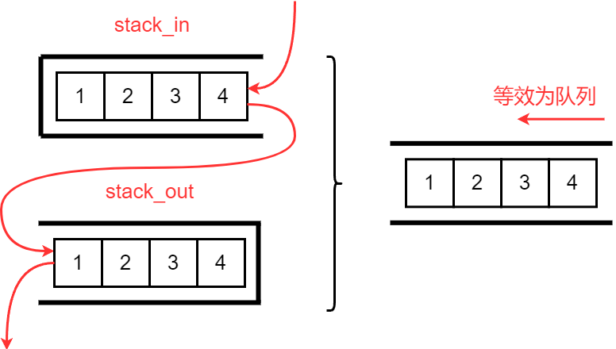
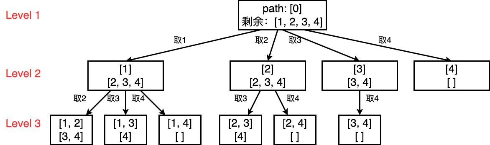
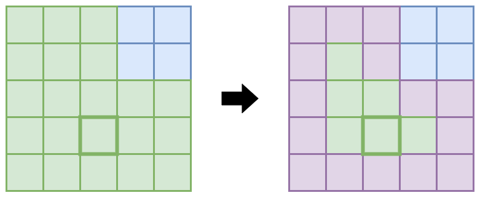

# 二分查找

之所以把二分查找的部分放在最头上是因为二分查找的区间定义及其影响的边界控制方法对后面做题非常重要

二分查找的复杂度是***O(logN)***

## *框架*

### 使用二分查找的前提

1. 有序数组，不论是排升序还是排降序
2. 返回一个索引

### 无重复值

[704. 二分查找](https://leetcode.cn/problems/binary-search/)

二分查找最重要的就是边界控制，而边界控制是要根据区间定义来的。二分查找根据区间定义的不同有两种写法

* 左闭右闭 `[left, right]`

  ```c++
  int binarySearch(vector<int>& nums, int target) {
      int left = 0;
      int right = nums.size() - 1;
      
      while (left <= right) {
          int mid = left + (right - left)/2; // int mid = (left + right) / 2;
          if (nums[mid] == target) {
              return mid;
          }
          else if (nums[mid] < target) { // 提高下界
              left = mid + 1;
          }
          else if (nums[mid] > target) { // 缩小上界
              right = mid - 1;
          }
      }
      return -1;
  }
  ```

  * 为什么要写成 `left + (right - left)/2`？这种表达和 `(left + right)/2` 是一样的效果，但是前者可以抵抗大整数相加溢出

  * 为什么while判断条件用了 `left <= right`？因为将right初始化为 `nums.size()-1`，而不是 `num.size()`，这相当于是左闭右闭的写法。所以当 `left == right` 的时候是有意义的，此时会做最后一次搜索，此时的搜索空间就是 `[left, left]`

  * 为什么迭代操作是 `left = mid + 1` 和 `right = mid - 1`？因为我们已经计算确定了 `nums[mid]` 不等于 target，可以直接把当前的mid排除在外了，所以因为区间定义是左闭右闭，所以把当前mid排除

  * 关于数组是奇数还是偶数的问题：奇数时 `/2` 可以整除，偶数时则要向下取整。但两种情况下边界都是 `+1`、`-1`，所以边界在不断缩小，适用于两种情况，可以手推一下下面两个例子

    ```
    奇数：0 3 5 7 9     target = 7
    偶数：0 3 5 7 9 11  target = 9
    ```

  * 全部用了else if没有用else的原因是这样可以有效的帮助我们理清楚三种情况

* 左开右开 `[left, right)`

  ```c++
  int binarySearch(vector<int>& nums, int target) {
      int left = 0;
      int right = nums.size();
      
      while (left < right) {
          int mid = left + (right - left)/2; // int mid = (left + right) / 2;
          if (nums[mid] == target) {
              return mid;
          }
          else if (nums[mid] < target) { // 提高下界
              left = mid + 1;
          }
          else if (nums[mid] > target) { // 缩小上界
              right = mid;
          }
      }
      return -1;
  }
  ```

  * while判断改为 `left < right`，因为这时候 `left==right` 没有意义
  * 区间迭代的时候是 `left=mid + 1` 和 `right=mid`，同样的因为我们已经计算确定了 `nums[mid]` 不等于 target，可以直接把当前的mid排除在外了，所以因为区间定义是左闭右开，所以把当前mid排除的方式就是直接让 `right=mid`。注意 ⚠️：`left=mid+1` 仍然是这样

### 有重复值：找左侧边界

### 无重复值：找右侧边界

## *扩展题目*

[35. 搜索插入位置](https://leetcode.cn/problems/search-insert-position/)

### 搜索二维矩阵

* [搜索二维矩阵](https://leetcode.cn/problems/search-a-2d-matrix/)
* [搜索二维矩阵 II](https://leetcode.cn/problems/search-a-2d-matrix-ii/)

### 山峰数组

[852. 山脉数组的峰顶索引](https://leetcode.cn/problems/peak-index-in-a-mountain-array/)

## *二分查找变体*

# 单向链表

## *链表重构*

### 什么时候应该加哨兵位头节点？

哨兵位主要是方便了头插、头删的时候找头，以及方便调整头指针等

此外若给了一个空链表，那么首先我们需要判断是否链表为空

个人的经验是：**当涉及到链表的遍历、重构时，构思时不论怎样先把头节点加上，看看是否可以简化边界情况的处理，如果感觉不需要的话再去掉**

### 遍历

各种数据结构的遍历+访问有两种形式：线性的和非线性的。线性的就是用for/while来迭代 iteration，非线形的就是递归 recursion

```cpp
void traverse(vector<int>& nums) {
    for (int i = 0; i < nums.size(); i++) {
        // 迭代访问 arr[i]
    }
}

// 递归遍历数组
void traverse(vector<int>& arr, int i) {
    if (i == arr.size()) {     // base case
        return;
    }
    // 前序位置
    traverse(arr, i + 1);
    // 后序位置
}
```

而链表的遍历则既有线性的也有非线性的

```cpp
/**
 * Definition for singly-linked list.
 * struct ListNode {
 *     int val;
 *     ListNode *next;
 *     ListNode() : val(0), next(nullptr) {}
 *     ListNode(int x) : val(x), next(nullptr) {}
 *     ListNode(int x, ListNode *next) : val(x), next(next) {}
 * };
 */

void traverse(ListNode* head) {
    while (head->next) {
        // 迭代访问 p->val
        head = head->next;
    }
}

void traverse(ListNode* head) {
    // 递归访问 head->val
    // 前序位置
    traverse(head -> next);
    // 后序位置
}
```

[二叉树的遍历](#二叉树的遍历)也是既有线性的也有非线性的（其实就是链表的扩展）

同时也可以利用[链表和数组的前序和后序遍历](#链表和数组的前序和后序遍历)来做一些逆序的题目

### 设计链表

* [707. 设计链表](https://leetcode.cn/problems/design-linked-list/)
* 思路：自己定义链表节点Node、使用 `dummyhead_` 简化操作、定义 `size_` 记录链表长度
* 注意点
  * 如果是在Leetcode中主要不要把链表节点命名为ListNode，会发生重定义冲突
  * 找节点的时候从 `dummyhead_` 开始找，而不是从 `dummyhead_->next` 开始找

### <span id="合并两个有序链表">合并两个有序链表</span>

* [21. 合并两个有序链表](https://leetcode.cn/problems/merge-two-sorted-lists/)

* 思路1：双指针，比较结点数据大小。令一个为dest，另一个为src，进行尾插。这种方式虽然很清晰，但边界条件很不好控制

* 思路2：双指针归并，从头开始比较，取小的尾插到新链表。归并操作，指的是将两个顺序序列合并成一个顺序序列的方法

  

### <span id="分隔列表">分隔列表</span>

* 题目

  * [86. 分隔链表](https://leetcode.cn/problems/partition-list/)
  * <https://www.nowcoder.com/practice/0e27e0b064de4eacac178676ef9c9d70?tpId=8&&tqId=11004&rp=2&ru=/activity/oj&qru=/ta/cracking-the-coding-interview/question-ranking>

* 思路：三指针，一个 `currNewGreater` 跟踪大数值链表，一个 `currNewLess` 跟踪小数值链表，另外一个 `currOld` 跟踪原链表中走到了哪里。`currOld` 走完之后，再把新的两个链表连接起来。**注意⚠️：最后一定要把大链表的最后一个置空，即 `currNewGreater->next = nullptr;`，否则会成环**

  

* 注意：因为我们的做法相当于是直接从原链表上摘节点下来，而且不像[合并两个有序链表](#合并两个有序链表)这道题，我们不能确认最后新的链表的最后一个节点就是（任意）原来链表的最后一个节点（若是的话本身最后一个节点的next就已经是空了）。**所以最后一个节点的next必须要置nullptr**，否则就会形成环

### 合并K个有序链表

* 题目：[23. 合并 K 个升序链表](https://leetcode.cn/problems/merge-k-sorted-lists/)
* 思路：用一个优先级队列来先将所有的节点入队列，然后思路就和[合并两个有序链表](#合并两个有序链表)这道题一样了。优先级队列默认 `std::less` 建大堆，记得用lambda自定义一下建小堆
* 注意：这道题和[分隔列表]((#分隔列表))那道题有同样的坑，就是因为不知道到底哪个原来的节点是新的最后一个节点，所以一定要将新的最后一个节点置空，否则会成环
* 时间复杂度分析：***O(NlogK)***，N是链表的总节点数，K是链表的条数

### 查找和最小的K对数字

### 复制带随机指针的链表

* [138. 随机链表的复制](https://leetcode.cn/problems/copy-list-with-random-pointer/)

* 思路1：构造深拷贝，问题在于每一个random应该放在什么位置？将要copy的节点连接到源节点的后面

  

* 思路2：利用BST的KV模型：存储源节点和拷贝节点的KV映射

### 其他链表重构的题目

* [24. 两两交换链表中的节点](https://leetcode.cn/problems/swap-nodes-in-pairs/)

  

## *链表双指针*

### 链表的中间结点

* [876. 链表的中间结点](https://leetcode.cn/problems/middle-of-the-linked-list/)

* 思路：快慢指针，慢指针一次走1步，快指针一次走2步

  

### 删除链表中等于给定值val的所有结点

* [203. 移除链表元素](https://leetcode.cn/problems/remove-linked-list-elements/)

* 思路1：哨兵位简化尾插后直接遍历过去就行了，尾插一般要考虑哨兵位。说实话这道题使用这种方法已经够了，最自然的想法也就是这种方法

* 思路2：快慢指针，遇到等于val的就调整指针关系

  

* 思路3：遍历原链表，把不是val的结点拿出来尾插到新链表

### 输入一个链表，输出该链表中倒数第k个结点

* 题目
  * [19. 删除链表的倒数第 N 个结点](https://leetcode.cn/problems/remove-nth-node-from-end-of-list/)
  * <https://www.nowcoder.com/practice/529d3ae5a407492994ad2a246518148a?tpId=13&&tqId=11167&rp=2&ru=/activity/oj&qru=/ta/coding-interviews/question-ranking>
* 思路
  * 两次遍历求出链表长度N后再走N-K步，复杂度为***O(N)***
  * 快慢指针，快指针先走k步，然后快慢指针同时走。等到快指针走到NULL时，慢指针就是倒数第k个结点。虽然复杂度也为***O(N)***，不过只需要一次遍历了

### 输入两个链表，找出它们的第一个公共结点

* 题目：[160. 相交链表](https://leetcode.cn/problems/intersection-of-two-linked-lists/)
* 思路1：快慢指针。分别找出两个链表的长度和长度差k，然后令长的为快指针走k步后，再令快慢之中遍历一次链表并同时判断node的地址是否有相同的
* 思路2：因为给的是struct结构体，所以分别建两个vector后push_back，将长的vector pop_back掉两个vector的长度差个元素，然后逐次比较
* 思路3：利用两个栈，分别入栈，将长的栈pop掉两个栈的长度差个元素，然后逐次比较
* 思路4：利用BST的K模型，找出第一个出现两次的节点

## *删除链表元素*

### <span id="删除排序链表中的重复元素">删除排序链表中的重复元素</span>

* 题目：[83. 删除排序链表中的重复元素](https://leetcode.cn/problems/remove-duplicates-from-sorted-list/)。这道题虽然标了简单难度，然而是比较麻烦的一道题

* 思路1：用单指针curr来跟踪走到哪里了，这么走是不太好控制的

* 思路2：快慢指针，注意处理尾巴是连续的重复节点的情况，此时要让 `slow->next = nullptr;`

  

### 删除排序链表中的重复元素 II

* 题目：[删除排序链表中的重复元素 II](https://leetcode.cn/problems/remove-duplicates-from-sorted-list-ii/)
* 思路1：这道题不要用和[删除排序链表中的重复元素](#删除排序链表中的重复元素)一样的双指针走，主要问题在于if-else这种结构中slow是必然要移动的，我们既要用 `slow->val` 来判断是否值相等，又要保存slow之前的那个元素，若引入第三个指针好像会变得很复杂
* 思路2：当发现重复元素时用while把这段区间跳过，这样slow就还是开始重复的元素之前的那一个。尽管如此，这种方法仍然需要考虑一些特殊情况，比较容易犯错误
* 思路2：快慢指针 + table。第一遍遍历和[删除排序链表中的重复元素](#删除排序链表中的重复元素)一样，得到一个只保留一个重复元素的链表，并在此期间也建立一张重复元素的set。第二遍遍历时若遇到了这个节点就调整指针指向。这种方法虽然需要额外空间来保存一个set，但是不需要考虑边界条件或特殊情况，是最简单的一种方法
* 思路3：递归

### 从未排序的链表中移除重复元素

* 题目：[1836. 从未排序的链表中移除重复元素](https://leetcode.cn/problems/remove-duplicates-from-an-unsorted-linked-list/)
* 思路：快慢指针 + table。第一次遍历建立一个元素出现次数的table，第二遍历时若发现元素出现次数 `>=2`，就调整指针，将元素删去

## *判断成环*

### 给定一个链表，判断链表中是否有环

* <https://leetcode.cn/problems/linked-list-cycle/description/>
* 思路：用快慢指针转变为一个追击问题，若有环则慢指针肯定能追上快指针。若没有环则当fast或fast->next走完时就返回false
* 证明：为什么快指针每次走2步，慢指针每次走1步时若有环一定能追上？
  * slow进环后开始追击。假设slow进环后，fast和slow之间的距离是X
  * 这次fast真正开始追击slow，每追击一次，fast和slow之间距离缩短1
  * 直到距离缩短到0，二者相遇
* 如果快指针一次走3步、4步、n步时，fast是否肯定能追上slow呢？不一定！这时候环的大小就有影响了
  * 假设环的大小为R，假设fast一次走3步，每走一次fast和slow距离缩短2
    * 若fast和slow之间的距离N是偶数，则第一次就追上
    * 若X是奇数，则距离会变成X, X-2, ..., 3, 1, X-1
    * 此时开始第二次追击，若R-1是偶数（即R是奇数），则第二次就追上了
    * 若R-1是奇数（R是偶数），则永远追不上

### 返回链表开始入环的第一个结点

* <https://leetcode.cn/problems/linked-list-cycle-ii/>

* 思路1：让快慢指针同时从链表起始位置开始遍历链表找出相遇点。当二者相遇时，让一个指针从**相遇点**位置开始绕环运行，头指针重新从头出发。两个指针都是每次均走一步，最终肯定会在入口点的位置相遇。时间复杂度***O(N)***，空间复杂度***O(1)***

  

  * 当slow走1步，fast走2步时，slow进环以后，fast一定在2圈之内追上slow。因为追击过程快慢指针之间相对距离每次缩小1，不可能会错过，他们相对距离最多是1圈，slow最多走1圈就会被追上

  * 设环之前的路程为L，slow进环后走X，环的大小是R

  * 假设slow进环前，fast在环里面转了N圈（$N\geq1$，fast至少要走一圈追上slow）

  * 则fast走的路程为 $L+n*R+X\ (n=1,\cdots,n)$

  * 根据下面的公式可以看出若一个指针从相遇点出发，一个指针从头开始走，他们会在入口点相遇
    $$
    fast == slow\longleftrightarrow L+n*R+X = 2*(L+X) \rightarrow L=n*R-X=(n-1)*R+(R-X)\\\rightarrow L+(R-X)=(n-1)*R
    $$

  * 假设的参数中只有R是可以明确算出来的

* 思路2：建立索引遍历，第一个重新遇到的就是入口。时间、空间复杂度都是***O(N)***

## *单链表递归法*

### 框架

### 反转一个单链表

* [206. 反转链表](https://leetcode.cn/problems/reverse-linked-list/)

* 遍历法

    * 思路1：颠倒指针，这道题的关键是要设置一个 `ListNode* prev = nullptr`，然后不断颠倒 prev 和 curr，next只是为了保存下一步要颠倒的指针

        

        ```c
        ListNode* reverseList(ListNode* head) {
            ListNode* curr = head;
            ListNode* next = head;
            ListNode* prev = nullptr;
            while (curr != nullptr) {
                next = curr->next;
                curr->next = prev;
                prev = curr;
                curr = next;
            }
            return prev;
        }
        ```
        
    * 思路2：遍历原链表，把所有结点拿出来头插尾插到新链表。这个题目的关系没有上面方法那么简单
    
        
    
* 递归法

    ```c++
    ListNode* reverseList(ListNode* head) {
        // head==nullptr 是用来方式一开始就是空链表的情况
        // 正常的链表它不会起作用
        if (head == nullptr || head->next == nullptr) {
            return head;
        }
    
        ListNode* last = reverseList(head->next);
        head->next->next = head;
        head->next = nullptr;
        return last;
    }
    ```

### 反转一个链表的某个区间

[92. 反转链表 II](https://leetcode.cn/problems/reverse-linked-list-ii/)

扩展：先实现反转链表的前 n 个节点，要想办法在递归中把第 `n+1` 个节点给保存下来

```c++
ListNode* successor = nullptr;
ListNode* reverseList(ListNode* head, int n) {
    if (n == 1) {
        successor = head->next;
        return head;
    }
    ListNode* last = reverseList(head->next, n-1);
    head->next->next = head;
    head->next = successor;
    return last;
}
```

### K个一组反转链表

[25. K 个一组翻转链表](https://leetcode.cn/problems/reverse-nodes-in-k-group/)

* 递归法
* 迭代法

### 回文链表

* [234. 回文链表](https://leetcode.cn/problems/palindrome-linked-list/)
  * 借助额外空间：将值复制到数组中后用双指针法
  
  * 递归法
  
  * 快慢指针
  
* [OR36 链表的回文结构](https://www.nowcoder.com/practice/d281619e4b3e4a60a2cc66ea32855bfa?tpId=49&&tqId=29370&rp=1&ru=/activity/oj&qru=/ta/2016test/question-ranking)
  * 思路1：快慢指针找到中间结点rhead后将rhead后面的部分逆置。奖后将head和rhead都看作慢指针，每次走一步并且比较，若有不同则返回false。奇数次和偶数次的情况可以统一为一种情况，奇数次时会形成环
  * 思路2：直接新建一个翻转的新链表，然后两个指针同时走比较
  * 思路3：二叉树后序遍历？


# 数组

## *双指针*

### 典型：O(1)原地移除元素

* [27. 移除元素](https://leetcode.cn/problems/remove-element/) 给你一个数组 nums 和一个值 val，你需要 原地 移除所有数值等于 val 的元素，并返回移除后数组的新长度。不要使用额外的数组空间，你必须仅使用 O(1) 额外空间并 原地 修改输入数组。

* 思路：双指针

  

### 其他题目

* [26. 删除有序数组中的重复项](https://leetcode.cn/problems/remove-duplicates-from-sorted-array/)

* [283. 移动零](https://leetcode.cn/problems/move-zeroes/)

* [977. 有序数组的平方](https://leetcode.cn/problems/squares-of-a-sorted-array/)

* [189. 轮转数组](https://leetcode.cn/problems/rotate-array/) & https://kamacoder.com/problempage.php?pid=1065 右旋转字符串。空间复杂度 ***O(1)*** 的两种方法

  

  * 思路1：双指针遍历
  * 思路2：负负得正，先倒置整体，后倒置每个单词


### 合并两个有序数组

* [88. 合并两个有序数组](https://leetcode.cn/problems/merge-sorted-array/) 给你两个按非递减顺序排列的整数数组nums1和nums2，另有两个整数m和n，分别表示 nums1和nums2中的元素数目。请你合并nums2到nums1中，使合并后的数组同样按非递减顺序排列。
* 思路：因为是非递减的数组，所以三指针从后往前排

```c
void merge(int* nums1, int nums1Size, int m, int* nums2, int nums2Size, int n){
    int dest = m-1, src = n-1, dest_end = m+n-1;
    while (src>=0 && dest>=0)
    {
        if (nums2[src] >= nums1[dest])
            nums1[dest_end--] = nums2[src--];
        else
            nums1[dest_end--] = nums1[dest--]; 
    }
    while (src>=0)
        nums1[dest_end--] = nums2[src--]; 
}
```

### 汇总区间

* 题目：[228. 汇总区间](https://leetcode.cn/problems/summary-ranges/)
* 思路：快慢指针

```cpp
class Solution {
public:
    vector<string> summaryRanges(vector<int>& nums) {
        int stay = 0, move = 1;
        int n = nums.size();
        vector<string> ret {};
        while (move <= n - 1) {
            if (nums[move] == nums[move - 1] + 1) {
                move++;
            }
            else {
                if (stay == move - 1) {
                    ret.push_back(std::to_string(nums[stay])); // only one element
                }
                else {
                    ret.push_back(std::to_string(nums[stay]) + "->" + std::to_string(nums[move - 1]));
                }
                stay = move++;
            }
        }
        // last range
        if (n > 0) {
            if (stay == n - 1) {
                ret.push_back(std::to_string(nums[stay])); // only one element
            }
            else {
                ret.push_back(std::to_string(nums[stay]) + "->" + std::to_string(nums[n - 1]));
            }
        }
        return ret;
    }
};
```

## *前缀和*

前缀和主要适用的场景是原始数组不会被修改的情况下，频繁查询某个区间的累加和

## *差分数组*

查分数组主要适用的场景是频繁对原始数组的某个区间的元素进行增减

## *矩阵相关题*

### 顺/逆时针旋转矩阵

### 螺旋遍历

* [59. 螺旋矩阵 II](https://leetcode.cn/problems/spiral-matrix-ii/)

螺旋遍历没有什么高级的技巧，就是按照顺序遍历即可。难点在于边界控制

核心是要将遍历统一为左闭右开方便上下左右的四趟遍历，其实就是要分成奇偶数两种情况


### 矩阵乘法

[311. 稀疏矩阵的乘法](https://leetcode.cn/problems/sparse-matrix-multiplication/)

### 其他矩阵操作

* [867. 转置矩阵](https://leetcode.cn/problems/transpose-matrix/)

## *滑动窗口*

### 典型例题 & 框架

* [209. 长度最小的子数组](https://leetcode.cn/problems/minimum-size-subarray-sum/)

* 题目：

  给定一个含有 `n` 个正整数的数组和一个正整数 `target` **。*

  找出该数组中满足其总和大于等于 `target` 的长度最小的 **连续子数组** `[numsl, numsl+1, ..., numsr-1, numsr]` ，并返回其长度**。**如果不存在符合条件的子数组，返回 `0` 


滑动窗口的框架是一个 for/while + while，第一层循环控制的是终止位置，如何移动起始位置是滑动窗口的核心所在

```pseudocode
int right = 0; // 窗口的终止位置
int left = 0;  // 窗口的起始位置
while (控制right) {
	windows.add();
	right++;
    while (控制left) {
    	windows.remove();
    	left++;
    }
}
```

这个算法的复杂度仍然是 ***O(2N)***，因为所有元素最多就过两遍。相当于是两层for循环的剪枝

TODO：有负数咋办？

### 字符串问题

处理字符串问题要进行一些字符串的操作

### Rabin-Karp字符匹配算法

## *数组/顺序表*


### 杨辉三角

* <https://leetcode.cn/problems/pascals-triangle/>

```cpp
class Solution {
public:
    vector<vector<int>> generate(int numRows) {
        vector<vector<int>> vv;
        vv.resize(numRows); // resize初始化每一行
        // 每一行的首尾元素赋为1
        for (size_t i=0; i<vv.size(); i++)
        {
            vv[i].resize(i+1, 0);
            vv[i].front() = vv[i].back() = 1;
        }

        for (size_t i=0; i<vv.size(); i++)
        {
            for (size_t j=0; j<vv[i].size(); j++)
                if (!vv[i][j])
                    vv[i][j] = vv[i-1][j] + vv[i-1][j-1];
        }
        return vv;
    }
};
```

### 电话号码的字母组合

* <https://leetcode.cn/problems/letter-combinations-of-a-phone-number/>
* 思路：排列组合多路递归，深度优先遍历。


```cpp
class Solution {
    const char* numToStr[10] = {"", "", "abc", "def", "ghi", "jkl", "mno", "pqrs", "tuv", "wxyz"};
    //string numToStr[10] = {"", "", "abc", "def", "ghi", "jkl", "mno", "pqrs", "tuv", "wxyz"};
public:
    void combine(string digits, int di, vector<string>& retV, string combineStr)
    { // digits为选中的数字，di为其下标，retV存放返回的可能组合，combineStr
        // 取数字字符映射的字符串
        if (di == digits.size())
        {
            retV.push_back(combineStr);
            return;
        }
        int num = digits[di] - '0';
        string str = numToStr[num];
        for (auto ch : str)
            combine(digits, di+1, retV, combineStr+ch);
            // 这里注意不要写成combineStr+=ch了，因为处于for循环中，combineStr需要重复使用
    }
    vector<string> letterCombinations(string digits) {
        vector<string> v;
        if (digits.empty())
            return v;
        string str;
        combine(digits, 0, v, str);
        return v;
    }
};
```

# 字符串

## *字符串的库函数及其复杂度*


### 构造字符串

```c++
string();
string (const string& str);
// substring
string (const string& str, size_t pos, size_t len = npos);
// from c-string
string (const char* s);
// from buffer
string (const char* s, size_t n);
// fill
string (size_t n, char c);
// range
template <class InputIterator>  string  (InputIterator first, InputIterator last);
// initializer list
string (initializer_list<char> il);
// move
string (string&& str) noexcept;
```

### 容量操作

* `size` 与 `length` 是一样的，只是因为string类产生的比较早，用的是 `length`，后来出现了其他容器后统一规范为 `size`

  `string.size()` 返回的是一个无符号的 `string::size_type` 类型的数据，所以当求了size之后，就不要和int混用了以免出错

* `reserve(size_t n)`：预留空间

* `clear`：清空有效字符

* `resize(size_t n, char c)`：将有效字符的个数改成n个，多出的空间用字符c填充（开空间+初始化）

### 访问及遍历操作

* `operator[]` 重载的意义：可以像操作数组一样用 `[]` 去读写访问对象。返回一个 char&

  ```c++
  char& operator[] (size_t pos);
  const char& operator[] (size_t pos) const;
  ```

* `at` 和 `operator[]` 的区别是越界以后抛异常，同样返回一个 char&

* `back()` 和 `front()` 分别返回 string 的最后一个和第一个 char&

### 迭代器 iterator

PS：范围for的底层实现，范围for的底层就是无脑直接替换迭代器

* iterator是属于容器的一个类，它的用法很像指针，可能是指针也可能不是
* string和vector不太使用迭代器，因为 `operator[]` 更方便，但是对于其他的容器如list、map、set来说只能用迭代器来访问。迭代器是所有容器的通用访问方式，用法类似
* C++中的迭代区间都是左闭右开 `[ )`，右开是因为方便遍历到 `\0` 时正好结束
* `begin` & `end`: return iterator to beginning/end
* `rbegin` & `rend`: return reverse iterator
* 四种迭代器
  * iterator/reverse_iterator
  * const_iterator/const_reverse_iterator

```cpp
// 迭代器示例
void PrintString(const string& str) {
    string::const_iterator it = str.begin();
//auto it = str.begin(); // auto自动推导
    while (it != str.end())
//*it = 'x';
        cout << *it++ << " ";
    cout << endl;

    string::const_reverse_iterator rit = str.rbegin();
    while (rit != str.rend())
        cout << *rit++ << " ";
    cout << endl;
}
```

### 查找

* `find` 和 `rfind`：返回 size_t，返回第一个/最后一个找到的位置，找不到则返回 `npos`，这时会解释为一个非常大的数，这是因为默认不存在这么大的字符串

* `substr` 从pos位置开始取n个字节长度的子串

  ```c++
  string substr (size_t pos = 0, size_t len = npos) const;
  ```

### 插入

* insert：时间复杂度大概是 ***O(N)***

  ```c++
  // 插入一份 str 的拷贝
  string& insert (size_t pos, const string& str);
  // 插入某个 string 的 substring 拷贝
  string& insert (size_t pos, const string& str, size_t subpos, size_t sublen = npos);
  // 插入一个 c 字符串数组
  string& insert (size_t pos, const char* s);
  // 插入一个 c 字符串数组的前n个字符（一个缓冲区）
  string& insert (size_t pos, const char* s, size_t n);
  // 在 pos 位置连续插入 n 个 字符 c
  string& insert (size_t pos, size_t n, char c);
  iterator insert (const_iterator p, size_t n, char c);
  // 在迭代器位置 p 之前插入一个字符 c
  iterator insert (const_iterator p, char c);
  // 在迭代器位置 p 之前插入
  template <class InputIterator>
  iterator insert (iterator p, InputIterator first, InputIterator last);
  string& insert (const_iterator p, initializer_list<char> il);
  ```

  注意⚠️：是插入在 **位置 pos 或 迭代器 p 之前**

* push_back 在 string 末尾插入一个 char

  ```c++
  void push_back (char c);
  ```

* append

  ```c++
  // 在尾部添加 string
  string& append (const string& str);
  // 在尾部添加 substring
  string& append (const string& str, size_t subpos, size_t sublen = npos);
  // 在尾部添加一个 c 字符串数组
  string& append (const char* s);
  // 在尾部添加一个 c 字符串数组的前n个字符（一个缓冲区）
  string& append (const char* s, size_t n);
  // 在尾部添加 n 个相同的 c 字符
  string& append (size_t n, char c);
  // 添加某个 range 内的 string
  template <class InputIterator>
  string& append (InputIterator first, InputIterator last);
  // 使用初始化列表
  string& append (initializer_list<char> il);
  ```

* `operator+=` 在字符串后追加字符串str

  ```cpp
  // string
  string& operator+= (const string& str);
  // c-string
  string& operator+= (const char* s);
  // character
  string& operator+= (char c);
  // initializer list
  string& operator+= (initializer_list<char> il);
  ```

### 修改

* replace

* assign

* erase

  ```c++
  // 删除 pos 位置的连续 len 个字符
  string& erase (size_t pos = 0, size_t len = npos);
  // 删除迭代器 p 位置的一个字符
  iterator erase (const_iterator p);
  // 删除迭代器 range 内的字符
  iterator erase (const_iterator first, const_iterator last);
  ```

### 判断相等

* Remainder：C 字符串使用 `strcmp()`

  ```c
  int my_strcmp(const char* s1, const char* s2) {
      assert(s1 && s2);
      while (*s1 == *s2) {
          if (*s1 == '\0') return 0;
          s1++;
          s2++;
      }
      return *s1 - *s2;
  }
  ```

* string的compare函数

  ```c++
  // string
  int compare (const string& str) const noexcept;
  // substrings
  int compare (size_t pos, size_t len, const string& str) const;
  int compare (size_t pos, size_t len, const string& str, size_t subpos, size_t sublen = npos) const;
  // c-string
  int compare (const char* s) const;int compare (size_t pos, size_t len, const char* s) const;
  // buffer
  int compare (size_t pos, size_t len, const char* s, size_t n) const;
  ```

  大概是 ***O(N)*** 的复杂度

* `operator==`

  ```c++
  bool operator== (const string& lhs, const string& rhs) noexcept;
  bool operator== (const char* lhs, const string& rhs);
  bool operator== (const string& lhs, const char* rhs);
  ```

  和 compare 的区别在于 `operator==` 返回的是一个bool，而 compare 和 C 的 strcmp 一样，比较的不是字符串的长度，而是字符串中对应位置上的字符的ASCII码大小

  https://blog.csdn.net/fefe82/article/details/44037887 这篇文章指出因为 `operator==` 可以直接通过 string 的属性 `_size` 来比较，所以大多数情况下甚至都是 ***O(1)***，不需要像 compare 或 strcmp 一样要去访问内存

  所以如果仅仅是在判断字符串是否相等，需要返回一个 bool 的时候，用 `operator==` 是更好的选择

### 非成员函数

* getline：cin和scanf一样，输入以空格或换行符为间隔标志，因此会自动把空格去掉。getline和C语言中的fgetf函数功能一样，帮助取到一句有空格的字符串
* operator+：尽量少用，传值返回导致深拷贝效率低

### string 和其他数据类型之间的转换

* c_str：用来兼容C字符串，C不支持string类型。比如说 `printf()` 无法直接输出string，可借助 `c_str()` 来输出

  ```cpp
  printf("%s", s.c_str()); // print string
  
  string filename("test.cpp");
  FILE* fout = fopen(filename.c_str(), "r");
  assert(fout);
  // ...
  ```

* 补充 atoi：Ascii to Integer 是一个C标准库函数，用于将字符串转换为整数

  ```c++
  int atoi(const char *str) 
  ```

* stoi, stol, stof, stod：字符串转换为 int、long、float、double

  ```c++
  int stoi (const string&  str, size_t* idx = 0, int base = 10);
  int stoi (const wstring& str, size_t* idx = 0, int base = 10);
  ```

  * 函数参数

    * `const string& str`：要转换的字符串

    * `size_t* idx = 0`：可选参数，用于存储第一个无法被转换的字符的位置的指针。如果转换成功，此参数保持为默认值 0

    * `int base = 10`：可选参数，表示字符串中的数字的进制，默认为十进制。可以选择 2、8、10 或 16 进制

  * 返回转换后的整数值

  * stoi 会对转化后的数进行检查，判断是否会超出 int 范围，如果超出范围就会报错。比如说会报 invalid argument

* to_sring, to_wstring：将内置数据类型转换为字符串的函数

## *字符串操作问题*

### 反转

* [344. 反转字符串](https://leetcode.cn/problems/reverse-string/)：双指针即可。`lo <= hi` 和 `lo < hi` 都可以，前者的话奇数会多做一次操作

* [917. 仅仅反转字母](https://leetcode.cn/problems/reverse-only-letters/)：双指针，若判断为字母就swap

* [541. 反转字符串 II](https://leetcode.cn/problems/reverse-string-ii/)

  这道题看起来简单，但是笔者第一次做的时候使用计数器，然后越写发现if的判断条件和分支加的越来越多，最后也没有做出来

  这道题的核心在于 **每计数至 `2k` 个字符，就反转**，所以应该设计成一个 stride 为 `2*k` 的for循环

  reverse可以自己实现，也可以用 `std::reverse`，反正时间复杂度都是 ***O(N/2)***

* [151. 反转字符串中的单词](https://leetcode.cn/problems/reverse-words-in-a-string/)：比较复杂的一道题

  * 使用库函数：split提取单词后拼接起来
  * 空间复杂度 ***O(1)*** 的做法：分成下面三步
    * 去除多余的空格
    * 翻转整体
    * 翻转每个单词

### 替换问题

* https://kamacoder.com/problempage.php?pid=1064 替换数字
* [1844. 将所有数字用字符替换](https://leetcode.cn/problems/replace-all-digits-with-characters/)
* 字符串转整型数字 <https://www.nowcoder.com/practice/1277c681251b4372bdef344468e4f26e?tpId=13&&tqId=11202&rp=6&ru=/activity/oj&qru=/ta/coding-interviews/question-ranking>：从头遍历

### 其他题目

* [2828. 判别首字母缩略词](https://leetcode.cn/problems/check-if-a-string-is-an-acronym-of-words/)：很简单的一道题目

## *KMP算法问题*

## *字典树 Trie*

### TrieSet & TrieMap

实现方式非常多，大致可以分为 TrieSet 和 TrieMap 两种，在 C++ 中的实现中区别只是里面保存的是 bool 还是 int

* TrieSet：[208. 实现 Trie (前缀树)](https://leetcode.cn/problems/implement-trie-prefix-tree/)

  ```c++
  struct TrieNode {
      bool isWord; // TrieSet
      TrieNode* next[26];
  
      TrieNode() : isWord(false) {
          for (int i = 0; i < 26; ++i) {
              next[i] = nullptr;
          }
      }
  };
  ```

* TrieMap：[1804. 实现 Trie （前缀树） II](https://leetcode.cn/problems/implement-trie-ii-prefix-tree/)

  ```c++
  struct TrieNode {
      int val; // TrieMap;
      TrieNode* next[26];
  
      TrieNode() : val(0) {
          for (int i = 0; i < 26; ++i) {
              next[i] = nullptr;
          }
      }
  };
  ```

​	另外这道题需要清空某个字符串

字典可以补充的 API 很多，在下面的字典树引用中会逐渐补充其他的 API

### Trie 相关的题目

* [211. 添加与搜索单词 - 数据结构设计](https://leetcode.cn/problems/design-add-and-search-words-data-structure/)
* [720. 词典中最长的单词](https://leetcode.cn/problems/longest-word-in-dictionary/)
* [648. 单词替换](https://leetcode.cn/problems/replace-words/)
* [676. 实现一个魔法字典](https://leetcode.cn/problems/implement-magic-dictionary/)
* [820. 单词的压缩编码](https://leetcode.cn/problems/short-encoding-of-words/)
* [677. 键值映射](https://leetcode.cn/problems/map-sum-pairs/)
* [421. 数组中两个数的最大异或值](https://leetcode.cn/problems/maximum-xor-of-two-numbers-in-an-array/)
* [1707. 与数组中元素的最大异或值](https://leetcode.cn/problems/maximum-xor-with-an-element-from-array/)
* [面试题 17.17. 多次搜索](https://leetcode.cn/problems/multi-search-lcci/)
* [745. 前缀和后缀搜索](https://leetcode.cn/problems/prefix-and-suffix-search/)

## *其他*


### 字符串最后一个单词的长度

* [58. 最后一个单词的长度](https://leetcode.cn/problems/length-of-last-word/)：使用反向迭代器
* <https://www.nowcoder.com/practice/8c949ea5f36f422594b306a2300315da?tpId=37&&tqId=21224&rp=5&ru=/activity/oj&qru=/ta/huawei/question-ranking>：调用 `string::rfind` 找到最后一个空格后再用strlen，因为不用考虑最后的空格？

### 字符串中的第一个唯一字符

* <https://leetcode.cn/problems/first-unique-character-in-a-string/>
* 思路：计数排序

```cpp
class Solution {
public:
    int firstUniqChar(string s) {
        int countArr[26] = {0};
        for (auto ch:s)
        {
            countArr[ch-'a']++;
        }
        for (size_t i=0; i<s.size(); i++)
        {
            if (countArr[s[i]-'a'] == 1)
                return i;
        }
        return -1;
    }
};
```

### 字符串相加--实现大整数加法

* [415. 字符串相加](https://leetcode.cn/problems/add-strings/)
* 思路：从后往前将每一个转换为数字后进行加法，用next来保留进位。将加法得到的结果转换回string然后进行尾插。注意：string和vector一样因为效率原因不提供尾插，尾插的方法是直接+=，最后reverse

```cpp
class Solution {
public:
    string addStrings(string num1, string num2) {
        int end1 = num1.size() - 1, end2 = num2.size() - 1;
        int next = 0; // 保存进位
        string strRet; // 保存返回的string
        while (end1 >= 0 || end2 >= 0) // 两个都走完才结束
        {
            int val1 = end1 >= 0 ? num1[end1] - '0' : 0; // 若有一个加数走完了，那么就将他相应位看作0
            int val2 = end2 >= 0 ? num2[end2] - '0' : 0;
            int ret = val1 + val2 + next;
            next = ret > 9 ? 1 : 0;
            // // string 不支持 push_front，因为string和vector一样头插要挪动数据，效率很低。要使用insert
            // strRet.insert(0, 1, (ret % 10) + '0'); // strRet.insert(strRet.begin(), (ret % 10) + '0') 用迭代器
            --end1;
            --end2;
            // 尾插就是直接+=后最后统一reverse一下就可以了
            strRet += ('0' + ret%10);
        }
        // 类似于'1' + '9'这种情况下，还有1个进位
        if (next == 1)
            strRet += '1';
        reverse(strRet.begin(), strRet.end());
        // // 类似于'1' + '9'这种情况下，还有1个进位
        // if (next)
        //     strRet.insert(strRet.begin(), '1');
        return strRet;
    }
};
```

# set & map

哈希表最擅长做的就是给一个元素，看这个元素是否在表中出现过

* 数组：用下标做索引，如果元素的范围很大或者很分散的话，用数组就不合适，因为要开很大的空间，浪费空间
* set：**避免重复的情况，验证唯一性**
* map：需要通过特殊的下标索引来记录值，或者下表索引范围很大或很分散

## *nSum*

### 一场意外：排序的twoSum

这道题严格意义上并不属于 nSum 问题，因为它用双指针就能解决

* 题目：[167. 两数之和 II - 输入有序数组](https://leetcode.cn/problems/two-sum-ii-input-array-is-sorted/)。从一个已经排升序的数组之中找出满足相加之和等于目标数 `target` 的两个数，以长度为 2 的整数数组 `[index1, index2]` 的形式返回这两个整数的下标 `index1` 和 `index2`

* 思路：左右指针，因为已经排成升序了，所以如果当前两个边界的值大于 `target` 就缩小右边界，若小于 `target` 就放大左边界

### 哈希表：未排序的twoSum

* 题目：[1. 两数之和](https://leetcode.cn/problems/two-sum/)。这道题目虽然标的是简单，但实际上比前面排序好的twoSum要麻烦，很有理由怀疑是两道题目的难易程度搞混了

* 思路
  * 因为这道题目由题目保证了每种输入只会对应一个答案，**不需要我们去重**，所以可以用哈希表来做。其实这道题即使想要用双指针也用不了，因为题目要求返回的是数组下标，而双指针法需要首先进行排序，排序完下标也就乱了
  * 和base case的区别是没有排序，所以我们首先要排序。但是用 `sort()` 排序是对原来的vector直接操作的，那么排完序之后就不能取到原来的序号了。我们可以尝试用unordered_map来保存 `<num, 对应的原下标>` 这种对应关系，但会很麻烦
  * 实际上不需要排序，只要一次遍历，一边用unordered_map来保存 `<num, 对应下标>` 这种对应关系，一边找 `target-nums[i]` 是否已经在 dict 中就可以了。如果找到了直接返回对应的两个下标就行

* 面试题扩展：要找出两个数字都是第二次出现的下标：改成用 map 来记录次数，当两个都是2的时候就是我们要的，不过要用另外一个 num2pos 的字典来找到另外一个次数为2的数字的位置

  ```c++
  unordered_map<int, int> isSecond;
  unordered_map<int, int> num2pos;
  int N = 9; // 两数之和
  for (int i = 0; i < nums.size(); ++i) {
  	if (isSecond[nums[i]] == 2) {
          num2pos[nums[i]]++;
          if (isSeoncd[nums[N-nums[i]]] == 2) {
              int first = i + 1;
              int second = num2pos[N-nums[i]];
          }
      }
  }
  ```


### 哈希表：四数之和II

* [454. 四数相加 II](https://leetcode.cn/problems/4sum-ii/)：思路基本和 [1. 两数之和](https://leetcode.cn/problems/two-sum/) 一样
* 这道题比四数之和简单，因为不需要去重。思路就是将暴力的4层for循环拆分为2个2层for循环，复杂度为 ***2O(N^2)***。在第一个2层for循环中在map中记录下投两个元素的和，在第二个2层for循环中只要去找 `target-nums3[i]-nums4[j]` 就可以了

### 需要去重问题的 \*Sum 问题的Base Case

现在泛化twoSum：`nums` 中**可能有多对**元素之和都等于 `target`，请算法返回**所有**和为 `target` 的元素对，其中**不能出现重复**

比如说输入为 `nums = [1,3,1,2,2,3], target = 4`，那么算法返回的结果就是：`[[1,3],[2,2]]`（注意：要求返回元素，而不是索引，所以可以 sort 后用双指针）


适应这种情况的方式是左右指针如果遇到了重复的就继续移动，复杂度为快排引起的***O(NlogN)***

```cpp
vector<int> twoSum(vector<int>& numbers, int target) {
    sort(nums.begin(), nums.end());
    int sz = nums.size();
    int lo = 0, hi = sz - 1;
    vector<vector<int>> ret;
    while (lo <= hi) {
    	if (nums[lo] + nums[hi] < target) {
            // 思维误区：这里不需要去重，全部统一在了找到二元组的情况
            lo++;
        }
        else if (nums[lo] + nums[hi] > target) {
            // 思维误区：这里不需要去重，全部统一在了找到二元组的情况
			hi--;
        }
        else {
            ret.push_back( {left, right} );
            lo++;
            hi--;
            while (hi > 0 && nums[hi] == nums[hi + 1]) hi--;
            while (lo < sz - 1 && nums[lo] == nums[lo - 1]) lo++;
        }
    }
    
    return ret;
}
```

### 指针法：threeSum & fourSum

[15. 三数之和](https://leetcode.cn/problems/3sum/) 和 [18. 四数之和](https://leetcode.cn/problems/4sum/) 这两道题思路和之前的base是一样的。关键仍然在于去重，分别是对三元组的第一个元素去重，以及对三元组的第二、第三个元素去重

* 因为这两道题都不需要返回原来的数组下标，所以可以排序
* threeSum 和 fourSum可以分一层/两层for循环 + Base Case来解决
* 剪枝
  * 三数之和的target为0，所以排序之后可以对第一个元素剪枝
  * 注意⚠️：四数之和很鸡贼，**它的target可以是负数**，所以无法对四元组的第一、第二个元素剪枝

## *其他*

### set应用

* [349. 两个数组的交集](https://leetcode.cn/problems/intersection-of-two-arrays/)：不要求顺序，输出唯一的交集元素。相当于就是验证 `nums2` 中有哪些元素也是在 `nums1` 中的，因为要验证唯一性/存在性，所以用 set 就可以

* [202. 快乐数](https://leetcode.cn/problems/happy-number/)：如果 `n` 是 *快乐数* 就返回 `true` ；不是，则返回 `false` 

  快乐数的定义为：

  * 对于一个正整数，每一次将该数替换为它每个位置上的数字的平方和。
  * 然后重复这个过程直到这个数变为 1，也可能是 **无限循环** 但始终变不到 1。
  * 如果这个过程 **结果为** 1，那么这个数就是快乐数。

  无限循环的意思就是说有一个相加结果会重复出现，从这个相加结果开始陷入死循环。所以这道题的核心就是要验证结果是否重复，即结果的唯一性。因此要用 set 来验证唯一性

### map应用

* [242. 有效的字母异位词](https://leetcode.cn/problems/valid-anagram/)：通过字典分别统计两个单词中出现的字母的个数是否相同就行
* [383. 赎金信](https://leetcode.cn/problems/ransom-note/)：和字母异位词的思路是一样的，不过这道题中 `magazine` 中包含的字符是可以多于 `ransomNote` 中的字符的，也就是说 `ransomNote` 是 `magazine` 的子集，这点在判断字符数量的时候要注意
* [169. 多数元素](https://leetcode.cn/problems/majority-element/)：很简单的一道题，map 统计元素个数就行
* [961. 在长度 2N 的数组中找出重复 N 次的元素 - 力扣（LeetCode）](https://leetcode.cn/problems/n-repeated-element-in-size-2n-array/)：跟169题基本一样的。遍历一遍数组，放到计数的countMap里，若countMap的Val等于N，返回countMap的Key

### 前K个高频单词

* <https://leetcode.cn/problems/top-k-frequent-words/>
* 思路1：优先级队列通过构建仿函数，提供自定义仿函数less来实现字典序

    ```cpp
    struct Less // 为优先级队列自定义仿函数
    {
        bool operator()(const pair<string, int>& kv1, const pair<string, int>& kv2) const //临时变量具常性，不用const可能通不过编译
        {
            if (kv1.second < kv2.second) // 比较val的大小
                return true;
            if (kv1.second == kv2.second && kv1.first > kv2.first) // 若val相同，则按字典序排
                return true;
            return false;
        }
    };

    vector<string> topKFrequent(vector<string>& words, int k) {
        map<string, int> countMap; // 统计次数
        for (auto& str : words)
            countMap[str]++;
        // topK问题，优先级队列方案
        priority_queue<pair<string, int>, vector<pair<string, int>>, Less> maxHeap;
        for (auto& kv : countMap)
            maxHeap.push(kv);
        // 返回topK的vector<string>
        vector<string> v;
        while (k--)
        {
            v.push_back(maxHeap.top().first);
            maxHeap.pop();
        }
        return v;
    }
    ```

* 思路2：直接使用 `stable_sort`

    ```cpp
    struct Greater
    {
        bool operator()(const pair<string, int>& kv1, const pair<string, int>& kv2) const
        {
            if (kv1.second > kv2.second)
                return true;
            // // 若用的是stable_sort就不用提供下面的比较了，这里是间接解决了sort的稳定性问题
            // if (kv1.second == kv2.second && kv1.first < kv2.first) // 若val相同，则按字典序排
            //     return true;
            return false;
        }
    };
    vector<string> topKFrequent(vector<string>& words, int k) {
        map<string, int> countMap;
        for (auto str:words)
            countMap[str]++;
        // 保证字典序就要保证sort稳定性，因此用stable_sort
        // sort和stable_sort都要使用随机访问迭代器，因此将map里的东西转移到vector里
        vector<pair<string, int>> sortV(countMap.begin(), countMap.end());
        stable_sort(sortV.begin(), sortV.end(), Greater());

        vector<string> v;
        for (size_t i=0; i<k; i++)
            v.push_back(sortV[i].first);
        return v;
    }
    ```

* 思路3：使用multimap进行排序，因为map底层是红黑树，可以对key进行排序

    ```cpp
    vector<string> topKFrequent(vector<string>& words, int k) {
        map<string, int> countMap;
        for (auto& str : words)
            countMap[str]++;
        
        multimap<int, string, greater<int>> sortMap; //不能用map，因为要保留重复项
        for (auto& kv : countMap)
            sortMap.insert(make_pair(kv.second, kv.first));
        
        vector<string> v;
        multimap<int, string, greater<int>>::iterator it = sortMap.begin();
        for (size_t i=0; i<k; i++)
        {
            v.push_back(it->second);
            it++;
        }
        return v;
    }
    ```

# 栈 & 队列

## *构造问题*

### 用栈实现队列

* [232. 用栈实现队列](https://leetcode.cn/problems/implement-queue-using-stacks/)

* 思路

  

  * 一种想法是每次pop的时候先把数据从 `in_` 全部倒入 `out_`，从 `out_` 取到要pop的数据并且pop后再把此时 `out_` 中所有的元素重新倒回 `in_` 中。这种做法可以完成任务，但并不好。因为会造成非常冗余的倒数据，比如说连续的pop。以及在这道题中如果采用这种方式则 peek 无法复用 pop，因为会造成数据顺序的混乱
  * 优化的方法是pop会不把所有的数据从 `out_` 全部倒回 `in_`，如果 `out_` 中有数据就直接从 `out_` 中拿，如果没有数据才从 `in_` 中倒入

### 用队列实现栈

* [225. 用队列实现栈](https://leetcode.cn/problems/implement-stack-using-queues/)

* 思路：给两个FIFO的队列，保持一个队列存储数据，一个队列空着，空着的队列是为了将另一个队列的数据倒过来。和用栈实现队列不太一样，这里pop的实现中是先要把全部数据搬到队列 `out_` ，然后再搬回队列 `in_`，也就是用栈实现队列中那种peek不可复用pop的设计。之所以有这种不同是因为即使有另外一个队列也无法实现连续 pop 的栈顺序

  

### 设计循环队列/环形缓冲器

* [622. 设计循环队列](https://leetcode.cn/problems/design-circular-queue/)：解决的问题是当位子有限时的排队，比如限定了人数的商店，只有当一个人出去了另一个人才能进来。OS中的生产者消费者模型
* 思路：
  * 因为有可能是因为push满了也有可能是pop空了，此时都是 front == rear，无法判断到底是满了还是空了
  * 可以考虑多记录一个size
  * 也可以考虑多开一个空间不存储数据，当 rear + 1 == front 是就是满了，若 front == rear 就是空
  * 因为用单链表实现比较难取尾，所以用数组来实现
  * 要处理当tail或head在边界时的特殊情况

为了更方便的取队尾数据，采用数组来实现

## *栈的应用*

由于栈结构的特殊性，非常适合做对称匹配类的题目，比如说括号是否匹配

### 括号匹配问题

* [20. 有效的括号](https://leetcode.cn/problems/valid-parentheses/)

* 思路：左括号入栈，若不是左括号则进行匹配，若匹配则将此时的栈顶元素pop掉，若不匹配则返回false。直到全部元素判断完

* 这道题的思路虽然不难，但是要分析清楚三种括号不正常的情况

    ```
    ( ] ) // 括号类型不匹配 -> 判断栈顶元素
    ( ( ) // 左括号多余了 -> 最后stack判空
    [ ]]] // 右括号多余了 -> 如果栈顶元素不匹配直接返回false
    ```

* 改进：若队列中不仅仅包含括号，还有其他字符怎么办？多添加一个 else if 判断就可以


### 栈的弹出压入序列

* <https://www.nowcoder.com/practice/d77d11405cc7470d82554cb392585106?tpId=13&&tqId=11174&rp=1&ru=/activity/oj&qru=/ta/coding-interviews/question-ranking>
* 思路：用一个辅助栈来模拟push和pop的过程。若当前push的值不等于要pop的值就持续入；若和pop序列匹配就持续出。若辅助栈的值能pop完就为真否则为假


```cpp
class Solution {
public:
    bool IsPopOrder(vector<int> pushV,vector<int> popV) {
        stack<int> st;
        int popi = 0;

        for (auto pushVal : pushV)
        {
            st.push(pushVal);
            // 出栈序列匹配后要持续比较，可能会有多个匹配
            while (!st.empty() && popV[popi] == st.top())
            {
                popi++;
                st.pop();
            }
        }
        return st.empty(); // return popi == popV.size();
    }
};
```

### 其他题目

* [1047. 删除字符串中的所有相邻重复项](https://leetcode.cn/problems/remove-all-adjacent-duplicates-in-string/)：比较简单，单指针遍历字符串入栈，最后将栈中的字符串依次拿出来然后倒置一下就可以了

## *表达式问题*

### 波兰表达式

波兰表达式 Polish notation 也称前缀表达式。在计算机中人类习惯的中缀表达式是无法进行有效计算的，必须转换成前缀或后缀表达式队列后，利用出栈和入栈再进行运算

* 中缀表达式 infix expression `2 + 1 * 3`
* 后缀表达式 suffix expression（逆波兰表达式 Reverse Polish Notation, RPN）：不包含括号，运算符放在两个运算对象的**后面**，所有的计算按运算符出现的顺序，严格**从左向右**进行（不再考虑运算符的优先规则），比如 `2 1 3 * +`
* 前缀表达法 prefix expression（波兰表达式）：不包含括号，运算符放在两个运算对象的**前面**，严格**从右向左**进行（不再考虑运算符的优先规则），所有的计算按运算符出现的顺序，比如 `+ 2 * 1 3` 

### 中缀、后缀、前缀之间的转换

Online Converter: https://raj457036.github.io/Simple-Tools/prefixAndPostfixConvertor.html

我们来具体看一下中缀表达式是如何转换为后缀、前缀表达式的，分别以 `2 + 1 * 3` 和 `(2 + 1) * 3` 为例

* 后缀表达式

  1. 初始化一个空栈和一个空列表，用于存储运算符和最终的逆波兰表达式

  2. **从左到右**扫描中缀表达式的每个元素

     * 如果是操作数，直接添加到逆波兰表达式中

     * 如果是运算符：

       * 如果栈为空，直接将运算符入栈
       * 如果栈不为空，比较栈顶运算符的优先级和当前运算符的优先级：
         * 如果当前运算符的优先级**高于**栈顶运算符，直接将当前运算符**入栈**
         * 如果当前运算符的优先级**不高于**栈顶运算符，将栈顶运算符**弹出并添加到逆波兰表达式中**，然后继续比较直到满足条件

       * 将当前运算符入栈

  3. 扫描完所有元素后，将栈中剩余的运算符依次弹出并添加到逆波兰表达式中

     

* 中缀转换为前缀表达式与中缀转换为后缀的区别是

  * 前缀是**从右到左扫描中缀表达式中的每个元素**
  * 要反转最后得到的表达式才是前缀表达式

  

### 逆波兰表达式求值

* [150. 逆波兰表达式求值](https://leetcode.cn/problems/evaluate-reverse-polish-notation/)
* 思路
  * 给一个辅助栈，只入操作数，不入操作符
  * 遇到操作数就入栈，遇到运算符就就取栈顶的连续两个数据运算，运算结果继续入栈
  * 若序列走完了，最后辅助栈里栈顶元素就是结果

### 基本运算器

* [224. 基本计算器](https://leetcode.cn/problems/basic-calculator/)
* 包含了两个基本步骤：先要将输入的中缀表达式转换为后缀表达式，然后再利用后缀表达式求值
  * 中缀转后缀
    * 操作数输出到存储序列中，操作符入辅助栈
    * 栈为空，或者若操作符比当前栈顶的操作符优先级高则当前操作符入栈；若低于或等于栈顶操作符，则栈顶元素出栈放到存储序列中，然后当前操作符入栈（注意，若栈中有多个运算符，就要进行连续比较）。这是因为要控制栈顶的优先级高
    * 序列走完了，若辅助栈里还有操作符则依次输出到存储序列中
  * 若有括号，则设置一个flag，将 flag = 1，则将运算符优先级升到最高
  * 处理空格

### 基本计算器 变种

* [227. 基本计算器 II](https://leetcode.cn/problems/basic-calculator-ii/)
* [772. 基本计算器 III](https://leetcode.cn/problems/basic-calculator-iii/)
* [770. 基本计算器 IV](https://leetcode.cn/problems/basic-calculator-iv/)

## *优先级队列*

### 数组中第k个大的元素

* <https://leetcode.cn/problems/kth-largest-element-in-an-array/>
* 思路：优先级队列建大堆，将前k-1个pop掉后，堆顶的就是第k个最大元素

```cpp
class Solution {
public:
    int findKthLargest(vector<int>& nums, int k) {
        // 建大堆 -- O(N)
        priority_queue<int> maxHeap(nums.begin(), nums.end());
        while (--k) // 将前k-1个pop掉后，堆顶的就是第k个最大元素
            maxHeap.pop(); // O(logN * k)
        return maxHeap.top();
    }
};
```

## *最大最小栈*

### 最小栈：要求时间复杂度为O(1)

[155. 最小栈](https://leetcode.cn/problems/min-stack/)：构造一个辅助栈minst存储最小值，当st中有小于等于minst堆顶数据的时候minst才插入，栈的末尾插入、删除是***O(1)***的


这里要考虑清楚的是 push 和 pop 两个接口

* minst的push条件是 `minst_.empty() || minst_.top() >= val` ，之所以要大于等于是因为有重复的元素
* pop 的时候 st 的栈顶元素不可能比 minst 的栈顶小，因为 minst 保留了 st 中递减元素的顺序，所以肯定是一一对应的。比如说上面的例子中 minst 保留了 `[4,3,1,0,0]` 的弱序递减性

进一步扩展：若待入栈的数据是大量重复数据该怎么办？比如插入10w个1。将minst中的数据类型改成一个struct或class，加一个计数器类成员。若是相同的数据则只要更新计数器就行

### 最大栈

[716. 最大栈](https://leetcode.cn/problems/max-stack/)

比最小栈麻烦，需要实现一个 popMax，它的功能是删除栈中最大的那个值

* 思路1：和[155. 最小栈](https://leetcode.cn/problems/min-stack/)一样，用多个栈，这道题还要再添加一个栈，用来在popMax的时候存放从st中拿出来的值，但是这个来回倒数据的过程最坏是***O(N)***的

  所以这个思路无法通过第165个测试用例，因为超时了。所以要想一个***O(logN)***甚至***O(1)***的思路

* 思路2：popMax 相当于是一个随机删除的过程，那就只能用链表了，它的插入、删除都是***O(1)***的。另外也要***O(1)***的找到链表的元素，所以要用哈希（类似于LRU的思路），同时因为元素有重复，所以应该用 multimap

  所以最终的思路是链表 + `multimap<key, list<int>::iterator>`，可以复习一下 multimap 的接口使用，比如说用到了比较少用到的upper_bound

  这个思路中这道题的 pop 等接口不需要判断 multimap 的最右元素和链表最后一个元素的大小问题，直接全部加入 multimap 就行了，否则popMax又会遇到[155. 最小栈](https://leetcode.cn/problems/min-stack/)pop后变成空的问题

## *单调栈*

单调栈就是栈的一种应用，只是利用某些算法结构，使得每次新元素入栈后，栈内的元素都保持有序（升序或者降序）

单调栈可以解决这样一类问题：**找出当前元素右边/左边第一个比它大/小的元素是什么**

### 基础题

[739. 每日温度](https://leetcode.cn/problems/daily-temperatures/)：这道题直接两层for循环暴力求解的复杂度是 ***O(N^2)***，无法通过第47个测试用例。可以通过单调栈优化到 ***O(N)***

这道题中单调栈中不应该放元素本身，因为无法借此来找到下标，应该直接放下标

维护一个单调递增的栈（递增是指遍历栈的时候元素的出栈顺序，也就是从栈顶到栈底是递增的，栈顶最小）。如果满足条件就弹出，这样之后都是一一对应的过程。只有弹出的时候才计算

注意⚠️：一定要 while 判断弹栈，也就是说要连续判断，从而维护栈中的递增/递减性质

```c++
vector<int> dailyTemperatures(vector<int>& temperatures) {
    int sz = temperatures.size();
    vector<int> results(sz, 0);
    stack<int> st; // 保存的是temp下标
    st.push(0);

    for (int i = 1; i < sz; ++i) {
        // 注意这里要连续判断，才能保持栈顶是小的
        while (!st.empty() && temperatures[i] > temperatures[st.top()]) { 
            results[st.top()] = i - st.top();
            st.pop();
        }
        st.push(i);
    }

    return results;
}
```

### 下一个更大元素

* [496. 下一个更大元素 I](https://leetcode.cn/problems/next-greater-element-i/)：`nums1` 是 `nums2` 的子集，没有重复元素。`nums1` 中数字 `x` 的 **下一个更大元素** 是指 `x` 在 `nums2` 中对应位置 **右侧** 的 **第一个** 比 `x` 大的元素

  这道题是简单题，用暴力搜索能过。现在考虑用单调栈来优化，道题比上面的基础题更麻烦，需要通过单调栈 + 哈希表来优化

  去哪里找元素就用哪个来建栈，所以在 nums2 上遍历 + 建栈，为了确认 nums1 中有遍历到的栈顶元素并且将结果记录下来，需要建立 nums1 中元素和其下标的哈希表

* [503. 下一个更大元素 II](https://leetcode.cn/problems/next-greater-element-ii/)：环形数组 `nums` （ `nums[nums.length - 1]` 的下一个元素是 `nums[0]` ），返回 `nums` 中每个元素的 **下一个更大元素**

  * 思路1：两个 nums 拼接到一起后再用单调栈，遍历完毕后将 results resize 到 `nums.size()`。记得栈里面存的是下标

  * 思路2：不开辟新数组，用取模的方法来模拟环形数组。**其实不止这道题，只要是成环的题目都可以考虑用这种方法**

    ```c++
    vector<int> nextGreaterElements(vector<int>& nums) {
        int sz = nums.size();
        vector<int> results(sz, -1);
        stack<int> st;
        st.push(0);
    
        for (int i = 1; i < 2 * sz; ++i) {
            int curr = i % nums.size();
            while (!st.empty() && nums[curr] > nums[st.top()]) {
                results[st.top()] = nums[curr];
                st.pop();
            }
            st.push(curr);
        }
    
        return results;
    }
    ```

### 接雨水问题

[42. 接雨水](https://leetcode.cn/problems/trapping-rain-water/)：给定 `n` 个非负整数表示每个宽度为 `1` 的柱子的高度图，计算按此排列的柱子，下雨之后能接多少雨水


上面是由数组 `[0,1,0,2,1,0,1,3,2,1,2,1]` 表示的高度图，在这种情况下，可以接 6 个单位的雨水（蓝色部分表示雨水）

从题目来看，本质上就是一个找下一个更大的元素的问题，当然具体情况和[739. 每日温度](https://leetcode.cn/problems/daily-temperatures/)还不一样，这道题在编码上要注意很多细节。这道题目我们要找的是一个凹槽来存水，也就是说既要找右边第一个更大的，也要找左边第一个更大的才能存水

```c++
if (!st.empty()) {
    int leftHight = height[st.top()];
    int height = std::min(rightHigh, leftHight) - mid;
    int width = i - st.top() - 1;
    raindrop += height * width;
}
```


`[0, 0, 60, 20, 20, 10, 30]` 这个测试用例是一个比较全面的例子

像上图这种第一个左边为0的格子怎么处理？用 `st.empty()` 来处理

### 柱状图中最大的矩形

[84. 柱状图中最大的矩形](https://leetcode.cn/problems/largest-rectangle-in-histogram/)：核心思路是以当前遍历到的元素，分别找它左边第一个比它矮的和它右边第一个比它矮的元素，然后求最大面积


这道题用单调栈来做的话，需要构建一个单调递减的栈 

首尾都要加0，来分别应对递增（比如 `[8, 6, 4, 2]`） 和递减（比如 `[2, 4]`）的两种特殊情况

# 树

## *二叉树的遍历*

**关于二叉树的前中后序遍历的递归、非递归实现以及层序遍历等实现以及OJ题可以查看*数据结构与算法.md*的二叉树部分**

二叉树解题的总体思路可以分为两种

* 遍历思路 -- 回溯算法：**是否可以通过遍历一遍二叉树来得到答案？**若可以的话，就用一个 `traverse` 函数配合外部变量来实现
* 分解问题思路 -- 动态规划算法：**是否可以定义一个递归函数，通过子问题（子树）的答案推导出原问题的答案？**若是的话就写出递归函数，并充分利用这个函数的返回值

两种方式都要思考的问题是若单独抽出一个二叉树节点，需要对它做什么事，即操作逻辑？需要在什么时候做，即是在前序、中序还是后序，即操作顺序？

### General：如何写递归？

1. 确定递归函数的参数 & 返回值

   关于是否需要设置返回值

   * 如果需要搜索整棵二叉树且不用处理递归返回值，递归函数就不要返回值
   * 如果需要搜索整棵二叉树且需要处理递归返回值，递归函数就需要返回值
   * 如果只要搜索**其中一条**符合条件的路径，那么递归一定需要返回值，因为遇到符合条件的路径了就要及时返回
2. 确定终止条件
3. 确定单层递归的逻辑

### <span id="二叉树的遍历">二叉树的递归遍历框架</span>

二叉树遍历最常用、最典型的就是非线性的递归遍历，而且这种遍历是一种DFS

```cpp
/**
 * Definition for a binary tree node.
 * struct TreeNode {
 *     int val;
 *     TreeNode *left;
 *     TreeNode *right;
 *     TreeNode() : val(0), left(nullptr), right(nullptr) {}
 *     TreeNode(int x) : val(x), left(nullptr), right(nullptr) {}
 *     TreeNode(int x, TreeNode *left, TreeNode *right) : val(x), left(left), right(right) {}
 * };
 */
void traverse(TreeNode* root) {
    if (root == nullptr) return; // base case
    // 前序位置
    traverse(root->left);
    // 中序位置
    traverse(root->right);
    // 后序位置
}
```

二叉树可以扩展为多叉树，多叉树又可以进一步扩展为[图的DFS遍历](#图的遍历)

```cpp
/* 基本的 N 叉树节点 */
class TreeNode {
public:
    int val;
    vector<TreeNode*> children;
};

void traverse(TreeNode* root) {
    if (root == nullptr) return; // base case
    // 前序位置
    for (TreeNode* child : root->children) {
        // 回溯
        traverse(child);
        // 回溯
    }
    // 后序位置
}
```

<span id="链表和数组的前序和后序遍历">我们可以借此generalize前序和后序遍历到其他的数据结构</span>，如下图所示**前序位置，就是刚进入一个节点（元素）的时候**，而**后序位置就是即将离开一个节点（元素）的时候**。所以代码在前序和后序的不同位置执行的时机也不同


一道典型的例题就是[1265. 逆序打印不可变链表](https://leetcode.cn/problems/print-immutable-linked-list-in-reverse/)

### 非递归遍历的框架

二叉树的非递归遍历本质上就是图借助栈实现的DFS推广到二叉树上（递归写法不具有一般性）

### 二叉树高度/深度问题

深度 depth 是二叉树里指从**根节点**到该节点的最长简单路径边的条数，要用前序遍历（越上面越小）；而高度 height 则是从该节点到**叶子节点**的最长简单路径边的条数，要用后序遍历（越上面越大）


* [104. 二叉树的最大深度](https://leetcode.cn/problems/maximum-depth-of-binary-tree/)：利用max递归求子树的最大深度（即高度），所以用后序遍历

* [111. 二叉树的最小深度](https://leetcode.cn/problems/minimum-depth-of-binary-tree/)

  

  * 思路1：前序遍历的代码要用回溯比较麻烦，还是用后序。和求最大深度相反用min，但要注意的是**当有一个分支为空时，这个分支不能被计算在内，而是将有效子树的高度+1**。比如说下面的做法是当左子树或右子树为空时取max，这样可以避开空子树的情况

    ```c++
    class Solution {
    public:
        int traverse(TreeNode* root) {
            if (root == nullptr) return 0;
            if (root->left && root->right) {
                return min(traverse(root->left), traverse(root->right)) + 1;
            } else {
                return max(traverse(root->left), traverse(root->right)) + 1;
            }
        }
    
        int minDepth(TreeNode* root) {
            return traverse(root);
        }
    };
    ```

  * 思路2：BFS，当找到第一个左右子树都为0的节点时，就输出当前的层数

* [110. 平衡二叉树](https://leetcode.cn/problems/balanced-binary-tree/)：这道题相当于是一次递归实现了求最大深度和判断左右子树的高度差，即借助子树的高度差来递归判断每一棵子树是否是平衡树

### 其他遍历问题

* [965. 单值二叉树](https://leetcode.cn/problems/univalued-binary-tree/)：中序遍历

* [226. 翻转二叉树](https://leetcode.cn/problems/invert-binary-tree/)：指针做交换，而不是数值做交换

  

  * 迭代：前序、后序都可以
  * 非迭代：DFS、层序

* [116. 填充每个节点的下一个右侧节点指针](https://leetcode.cn/problems/populating-next-right-pointers-in-each-node/)：递归做法、层序遍历做法

* [117. 填充每个节点的下一个右侧节点指针 II](https://leetcode.cn/problems/populating-next-right-pointers-in-each-node-ii/)

* [114. 二叉树展开为链表](https://leetcode.cn/problems/flatten-binary-tree-to-linked-list/)：这个题目用分解成子问题的思路来做很方便，只要左子树和右子树分别拉平，自底向上就可以将整棵树拉平

  这道题要注意的一个点是当把右子树接到原来的左子树上的时候要对左子树找尾，此时候应该要从root开始找，可以把左子树为空的情况囊括进去

  

* [222. 完全二叉树的节点个数](https://leetcode.cn/problems/count-complete-tree-nodes/)：后序遍历，写法和二叉树的最大深度差不多

* [958. 二叉树的完全性检验](https://leetcode.cn/problems/check-completeness-of-a-binary-tree/)：这道题代做，考虑如果每一层的个数不对就return false？

### 回溯

* [257. 二叉树的所有路径](https://leetcode.cn/problems/binary-tree-paths/)

  ```c++
  void traverse(TreeNode* root, vector<int>& path, vector<string>& result);
  ```

  * 注意拼接 int 的时候要用 `to_string()`，否则会变成 \u0001 的unicode表示
  * 回溯：因为我们这里使用的是 `vector<int>& path` 引用，也就是只有一个path来保存路径，所以要回溯

* [112. 路径总和](https://leetcode.cn/problems/path-sum/)

* [113. 路径总和 II](https://leetcode.cn/problems/path-sum-ii/)

## *后序遍历的妙用*

### 后序遍历的特殊性

前序遍历（中左右）的代码只能从函数参数中获取父节点传递来的数据，而后序遍历（左右中）的代码不仅可以获取参数数据，还可以获取到子树通过函数返回值传递回来的数据

**一旦发现题目和子树有关，那大概率要给函数设置合理的定义和返回值，在后序位置写代码**

### 例题：对称二叉树

[101. 对称二叉树](https://leetcode.cn/problems/symmetric-tree/)：这道题只能使用后序，只有后序才能收集子树的信息。同时遍历两棵树

1. 确定递归函数的参数 & 返回值

   ```c++
   bool compare(TreeNode* left, TreeNode* right);
   ```

2. 确定终止条件

   * 左为空，右不为空 `-> return false`
   * 左不为空，右为空 `-> return false`
   * 左为空，右为空  `-> return true`
   * 左右不为空，值不相等 `-> return false`

3. 确定单层递归的逻辑

   

   若左右不为空，值相等，则应该继续往下层遍历。分别对比外侧和内侧的元素值是否相等

```c++
class Solution {
public:
    bool compare(TreeNode* left, TreeNode* right) {
        if (left == nullptr && right != nullptr) return false;
        if (left != nullptr && right == nullptr) return false;
        if (left == nullptr && right == nullptr) return true;
        if (left->val != right->val) return false;

        // 后序
        bool outside = compare(left->left, right->right); // 外侧
        bool inside = compare(left->right, right->left);  // 内侧
        return outside && inside;
    }

    bool isSymmetric(TreeNode* root) {
        return compare(root->left, root->right);
    }
};
```

### 二叉树的直径

## *层序遍历 BFS*

### 框架


核心就是利用FIFO的队列。[102. 二叉树的层序遍历](https://leetcode.cn/problems/binary-tree-level-order-traversal/)

```cpp
void levelTraverse(TreeNode* root) {
    queue<TreeNode*> q;
    if (root) q.push(root);
    
    while (!q.empty()) {
        int levelSize = q.size();
        for (int i = 0; i < levelSize; i++) {
            TreeNode* top = q.front();
            /* 
            对队首元素的操作
            */
            if (top->left) q.push(top->left);
            if (top->right) q.push(top->right);
            q.pop();
        }
    }
}
```

### 层序遍历的题目

* [429. N 叉树的层序遍历](https://leetcode.cn/problems/n-ary-tree-level-order-traversal/)：二叉树层序遍历扩展到N叉树
* [107. 二叉树的层序遍历 II](https://leetcode.cn/problems/binary-tree-level-order-traversal-ii/)：102得到的res里的元素用reverse函数反转一下
* [637. 二叉树的层平均值](https://leetcode.cn/problems/average-of-levels-in-binary-tree/)
* [199. 二叉树的右视图](https://leetcode.cn/problems/binary-tree-right-side-view/)：层序遍历将每层的最后一个值加入vector即可
* [515. 在每个树行中找最大值](https://leetcode.cn/problems/find-largest-value-in-each-tree-row/)

## *其他二叉树问题*

### 子树问题

* 检查两颗树是否相同
* 另一颗树的子树
* 寻找重复的子树

### 最近公共祖先问题

最近公共祖先问题 Lowest Common Ancestor, LCA 重要的原因是因为它是 Git 的原理

* [236. 二叉树的最近公共祖先](https://leetcode.cn/problems/lowest-common-ancestor-of-a-binary-tree/)

  > [百度百科](https://baike.baidu.com/item/最近公共祖先/8918834?fr=aladdin)中最近公共祖先的定义为：“对于有根树 T 的两个节点 p、q，最近公共祖先表示为一个节点 x，满足 x 是 p、q 的祖先且 x 的深度尽可能大（**一个节点也可以是它自己的祖先**）。”

  

  * 思路1：递归法，这道题的核心就在于当左右子树递归的返回值都不为空的时候，当前的节点就是最近共工祖先。复杂度为 ***O(h\*N)***

    包括了一种特殊情况，即若其中一个寻找的节点 `p` 是另外一个寻找的节点 `q` 的父节点，那么 `p` 它自己本身就是 `p` 和 `q` 的最近公共祖先

  * 思路2：遍历法，借助队列和三叉链（节点带parent），转换为链表相交问题 -- 优化到 ***O(N)***

    

  * 题目里已经说明了给出的节点一定在树里能找到；若不一定在树里，那么需要迭代更多
  * 若换成搜索二叉树，那么就不需要find函数了，直接利用搜索二叉树进行优化
  
* 扩展题

  * 


## *构造题*

构造二叉树的题目中要用前序遍历（中左右），一般题目给出的都是一个数组，我们要控制的是数组的下标。当数组的下标相同时就说明构造区间走完了，返回的是nullptr，如果不这么控制的话，很容易会多构造节点出来

```c++
// [begin, end)
TreeNode* buildTree(vector<int>&nums, int begin, int end) {
	if (begin == end) return nullptr;
    // 前序操作获得构建root的index
    TreeNode* root = new TreeNode(index);
    // 叶子节点
    if (begin == end + 1) return root;
    // 遍历
    root->left = buildTree(nums, leftBegin, leftEnd);
    root->right = buildTree(nums, rightBegin, rightEnd);
    return root;
}
```

### 根据一棵树的前序遍历/后序遍历 & 中序遍历构造二叉树

* 必须是前序和中序或者中序和后序的序列和无重复值才能重建二叉树，**若是前序和后序则不能。也就是必须要有中序**，前序和后序确定树的根，而中序分割树的区间

    举个例子，下面的两棵二叉树是不同的，但是它们的前序和后序都是一样的，即前序为 `[1, 2, 3]`，后序为 `[3, 2, 1]`。所以不用中序是无法构造出来的，因为无法分割左右区间

    

* [106. 从中序与后序遍历序列构造二叉树](https://leetcode.cn/problems/construct-binary-tree-from-inorder-and-postorder-traversal/)

    

    * 步骤

      1. 若后序节点为空，则说明已经遍历完毕了，没有什么可以再用来分割root了，返回 nullptr
	  2. 若后序数组的size == 1，说明遍历到叶子节点了，返回root
      3. 寻找后序最后一个元素在中序数组中对应的下标
      4. 切割中序数组
      5. 切割后序数组
      6. 递归处理左区间与后区间
    
    * 代码注意事项
    
      * 有两种方案来划分区间：
    
        * 每一层递归都创建新的数组，消耗的空间会很大
    
          ```c++
          TreeNode* _buildTree(vector<int> inorder, vector<int> postorder);
          ```
    
        * 采用下标控制，传引用
    
          ```c++
          TreeNode* _buildTree(vector<int>& inorder, int inorderBegin, int inorderEnd,
                               vector<int>& postorder, int postorderBegin, int postorderEnd);
          ```
    
      * 切割后序数组的时候用中序左区间的size来控制，而不是再找一遍index，这样就不需要处理一些特殊情况了

* [105. 从前序与中序遍历序列构造二叉树](https://leetcode.cn/problems/construct-binary-tree-from-preorder-and-inorder-traversal/)

### 二叉树创建字符串

* [606. 根据二叉树创建字符串](https://leetcode.cn/problems/construct-string-from-binary-tree/)
* 用C语言来写，可以用strcat，strcat需要自己开空间，问题是要开多大，很麻烦
* 思路：左右都为空则省略掉相应括号；左子树不为空，右子树为空，则省略掉；左子树为空，右子树不为空，则不省略

### 其他构造题

* [654. 最大二叉树](https://leetcode.cn/problems/maximum-binary-tree/)：这道题就是根据一棵树的前序遍历/后序遍历 & 中序遍历构造二叉树的扩展，但是没有那么复杂，仍然用前序遍历（中左右）
* [617. 合并二叉树](https://leetcode.cn/problems/merge-two-binary-trees/)：同时操作两棵二叉树，这道题不难

## *BST*

### BST的重要性质

BST的详细情况可以看*数据结构与算法.md*，这里只给出最重要的几个性质

* 若它的左子树不为空，则左子树上**所有**节点的值都小于根节点的值
* 若它的右子树不为空，则右子树上**所有**节点的值都大于根节点的值
* 它的左右子树也都必须为BST

但是对于做算法题而言，BST最重要的一个隐藏性质是：**对BST的中序遍历结果是有序的（升序）**


比如对于上面这棵BST，它的中序（左中右）为 `1 3 4 6 7 8 10 12 14`，显然是成升序的

### 利用中序遍历有序的性质

双指针法

```c++
TreeNode* pre = nullptr; // 全局
void traerse(TreeNode* root) {
    // base condition
    if (pre != nullptr && /*some condition*/) {
        // some operation
    }
    pre = root; // 更新 pre
    // other code
}
```

* [98. 验证二叉搜索树](https://leetcode.cn/problems/validate-binary-search-tree/)

  * 思路1：直接走一遍中序，将结果放到一个vector中，然后判断是否生序。不能用 `std::is_sorted` 来判断，因为它会把 `[2, 2, 2]` 这类情况也判断为 true。得自己先一个
  * 思路2：不使用一个新的vector，直接在递归遍历的时候判断。这种思路也有两种做法
    * 设置一个全局的 LONG_MIN，因为这道题的后台测试中最小值是 INT_MIN，但是如果题目改成最小值是 LONG_MIN 怎么办？
    * 所以另外一种做法是不使用 LONG_MIN，而是找到最左边的值，然后依次比较（双指针做法）

* [530. 二叉搜索树的最小绝对差](https://leetcode.cn/problems/minimum-absolute-difference-in-bst/) & [783. 二叉搜索树节点最小距离](https://leetcode.cn/problems/minimum-distance-between-bst-nodes/)（两道题相同）：使用 [98. 验证二叉搜索树](https://leetcode.cn/problems/validate-binary-search-tree/) 双指针的做法，一遍进行中序遍历，一遍比较两个节点的差值就可以了。另外这两道题不需要设置返回值，所以在给的函数外面再套一层

* [700. 二叉搜索树中的搜索](https://leetcode.cn/problems/search-in-a-binary-search-tree/)：利用BST的性质简化搜索就可以了，这道题用递归法和迭代法都很简单

* [501. 二叉搜索树中的众数](https://leetcode.cn/problems/find-mode-in-binary-search-tree/)：这道题看起来简单，并且做这道题的方法很多，但并不容易写好

  * BST可以不借助额外的数据结构来遍历

    * 遍历两遍：第一遍遍历出众数出现过的次数，第二遍找出众数，但是这种方法容易出错，因为要用到两个全局变量，一个参数，总共需要控制三个变量来统计
    * **双指针法遍历一遍（推荐）**：如何知道当前的是真正的众数？我们不知道！因为是BST，中序是排好序的，所以如果后面有出现更大的众数（即更大的maxCount），那就把已有的结果集 result 中的元素全部 pop 掉（`vector.clear()`），然后重新把当前的 push 进 result

  * 借助map：map统计完成后，从map中筛选出出现频率最高的Key（先sort排序，然后再选出key）。如果不是BST，而是找普通二叉树的众数的话只能用这种方法

    这道题是要对 unordered_map 的 value 进行比较，所以没办法直接用 sort，要将所有的 pair 导入到一个 vector 后再用 sort
    
    ```c++
    class Solution {
    public:
        map<int, int> dict; // map<int, int> key:元素，value:出现频率
        void traverse(TreeNode* root) {
            if (root == nullptr) return;
            traverse(root->left);
            dict[root->val]++; // 统计元素频率
            traverse(root->right);
        }
    
        bool static cmp(const pair<int, int>& a, const pair<int, int>& b) {
            return a.second > b.second; // 按照频率从大到小排序
        }
    
        vector<int> findMode(TreeNode* root) {
            traverse(root);
            vector<pair<int, int>> tmp;
            for (const auto& kv : dict) {
                tmp.push_back(kv);
            }
    
            sort(tmp.begin(), tmp.end(), cmp); // 给频率排序
    
            vector<int> res;
            for (const auto& kv : dict) {
                if (kv.second == tmp[0].second) {
                    res.push_back(kv.first);
                }
            }
    
            return res;
        }
    };
    ```

### BST的操作

* [235. 二叉搜索树的最近公共祖先](https://leetcode.cn/problems/lowest-common-ancestor-of-a-binary-search-tree/)

  * 这道题是[236. 二叉树的最近公共祖先](https://leetcode.cn/problems/lowest-common-ancestor-of-a-binary-tree/)的子集，完全可以用[236. 二叉树的最近公共祖先](https://leetcode.cn/problems/lowest-common-ancestor-of-a-binary-tree/)的通用解法来做。但是这道题的意图是利用BST的搜索性质来做，然后要用上BST的搜索性质却并不容易
  * 解决这道题的核心是要理解：当第一次遇到在 `[p->val, q->val]` 的root就是 `p` 和 `q` 的最近公共祖先
  * 这道题千万不要去试图处理 `root->val` 在 `[p->val, q->val]` 的情况，会非常非常麻烦，比如说因为 `p` 和 `q` 的大小题目是未定的，所以光是要处理 `p` 和 `q` 的大小就要分两种情况，然后还要区分 `root->val == p->val || root->val == q->val` 等等情况，非常麻烦
  * 最简单的方法就是取反，无非就是处理三种情况：当 `root->val` 既比 `p->val` 也比 `q->val` 小的时候（省去了判断 `p` 和 `q` 之间的大小的麻烦）就往左走；如果 `root->val` 最大则往右走；否则就是我们要找的root

  ```c++
  TreeNode* lowestCommonAncestor(TreeNode* root, TreeNode* p, TreeNode* q) {
      if (root == nullptr) return nullptr;
      // 往右走
      if (root->val < p->val && root->val < q->val)
          return lowestCommonAncestor(root->right, p, q);
      // 往左走
      if (root->val > p->val && root->val > q->val)
          return lowestCommonAncestor(root->left, p, q);
  	// 剩余的所有情况
      return root;
  }
  ```

* [701. 二叉搜索树中的插入操作](https://leetcode.cn/problems/insert-into-a-binary-search-tree/)

  * 这道题的题目说明有些误导，重构的操作是AVL树和红黑树的，一般的BST不需要重构，就一个一个往里面插就好了。注意：构造BST时元素插入的顺序是有影响的，不同的插入顺序最后会形成不同的BST
  * 参考BST的Insert实现，可以考虑循环和递归两种写法
  * 和其他二叉树题目不同，注意单独处理 `root == nullptr` 的情况

* [450. 删除二叉搜索树中的节点](https://leetcode.cn/problems/delete-node-in-a-bst/)：参考 *数据结构与算法.md* 中BST删除节点的3种情况，即删除节点没有孩子、有1个孩子（托孤）和有两个孩子三种情况。其中有两个孩子的情况推荐使用**旋转法**不容易出错

  如果采用替换法，因为我们最后要删除的并不是 curr，而是 leftMost，所以首先要同时找 leftMost 和 leftMost 的父节点而且要考虑很多种 leftMost 和 leftMostPre 的关系以调整 leftMostPre 和 `leftMost->right` 之间的关系，所以很容易出错

  

  ```c++
  // 右子树的最左节点肯定没有左节点，判断是否有右节点
  if (leftMost->right != nullptr) {
      if (leftMost == leftMostPre->left) {
          leftMostPre->left = leftMost->right; 
      } else {
          leftMostPre->right = leftMost->right;
      }
  } else {
      if (leftMost == leftMostPre->left) {
          leftMostPre->left = nullptr;
      } else {
          leftMostPre->right = nullptr;
      }
  }
  ```

* [669. 修剪二叉搜索树](https://leetcode.cn/problems/trim-a-binary-search-tree/)

  * 这道题比删除BST中的节点简单的多，因为如果一个节点比 low 小，则它的左树（如果存在）肯定也是要删除的，同理如果一个节点比 high 大，则它的右树（如果存在）肯定也是要删除的
  * 所以我们要考虑的就是当一个节点比 low 小时，它的右树（如果存在）中的所有节点是否都比 low 小，因此要继续递归遍历，同理一个节点比 high 大时，要继续递归遍历它的左树

  比如说下面两种情况，其中红色是 low，蓝色是 high，对于左边的树 4 是不应该被删除的，对于右边的树 1 和 2是都要被删除的

  

### BST的构造

* [108. 将有序数组转换为二叉搜索树](https://leetcode.cn/problems/convert-sorted-array-to-binary-search-tree/)：和之前一般二叉树的构造题是一样的，也是通过控制区间下标来构造，核心是构造BST时是要找到有序数组的中间位来作为root，这样树才是平衡的

  

  ```c++
  TreeNode* buildTree(vector<int>& nums, int begin, int end) {
      // other codes
      // 奇数取中间，偶数取左边
      int mid = (end + begin) / 2;
      // other codes
  }
  ```

* [538. 把二叉搜索树转换为累加树](https://leetcode.cn/problems/convert-bst-to-greater-tree/) & [1038. 从二叉搜索树到更大和树](https://leetcode.cn/problems/binary-search-tree-to-greater-sum-tree/)（两道题相同）：看清题干，是在原来的树上转换，然后返回root即可。因为是倒序的，所以直接右中左遍历即可，定义一个sum累加更新

* 二叉树搜索树转换成排序双向链表：<https://www.nowcoder.com/practice/947f6eb80d944a84850b0538bf0ec3a5?tpId=13&&tqId=11179&rp=1&ru=/activity/oj&qru=/ta/coding-interviews/question-ranking>

  * 要求不能创建任何新的结点，只能调整树中结点指针的指向。当转化完成以后，树中节点的左指针需要指向前驱，树中节点的右指针需要指向后继。也就是要在原来的搜索二叉树上进行改动，不能创建一个新的vector

  * 思路1：和二叉树线索化（线索化在实际中没有价值）一样，令left指向中序顺序的前一个，令right指向中序顺序的后一个。用2次递归

  * 思路2：

# 排序算法

之所以将排序算法放在树后面，是因为排序和树的递归息息相关

[912. 排序数组](https://leetcode.cn/problems/sort-an-array/)：这道题可以用来测试除了 ***O(N^2)*** 之外的所有排序方法，经过测试冒泡是失败的

## *快排*

快排是 ***O(NlogN)*** 的排序算法，它的本质是前序遍历。具体的递归和非递归实现可以看 *数据结构与算法.md*

## *归并排序*

归并是 ***O(NlogN)*** 的排序算法，它的本质是后序遍历。具体的递归和非递归实现可以看 *数据结构与算法.md*

[315. 计算右侧小于当前元素的个数](https://leetcode.cn/problems/count-of-smaller-numbers-after-self/)

[327. 区间和的个数](https://leetcode.cn/problems/count-of-range-sum/)

[493. 翻转对](https://leetcode.cn/problems/reverse-pairs/)


# 回溯算法

对于回溯算法的题目，使用左毕右闭的方式来做边界控制会比较省力

## *回溯算法介绍*

### 算法思想

* 回溯算法实际上是一个类似枚举的搜索尝试过程，主要是在搜索过程中寻找问题的解，当发现已不满足求解条件时，就回溯返回，尝试别的路径
* 满足回溯条件的某个状态的点称为“回溯点”，也称为剪枝点

回溯和递归是相辅相成的，有递归就可以有回溯。回溯函数其实就是递归函数，因为并没有一个完全只用来实现回溯功能的独立函数

回溯算法常用于解决组合问题、排列问题和搜索问题等，如求解数独、八皇后问题、迷宫问题等。在回溯算法的实现中，常常需要使用深度优先遍历来搜索所有可能的解

本质上就是模拟栈操作？

### 模版

**回溯法解决的问题是在有限的解空间，并且解空间可以抽象为树形结构（N叉树）**

**所以回溯法其实就是多叉树的遍历**：回溯法一般是在集合中递归搜索，集合的大小构成了树的宽度（条件由 for 来掌管），递归的深度构成的树的深度（条件由 backtrack 递归掌管）


1. 确定递归函数 backtrack 的参数和返回值

   回溯算法中的递归函数的返回值一般都是void

2. 确定终止条件

3. 实现单层递归逻辑

```pseudocode
void backtrack(参数) {
    if (终止条件) {
        存放结果;
        return;
    }
    
	// 前序操作
    for (选择：本层集合中元素（树中节点孩子的数量就是集合的大小）) {
        处理节点;
        backtracking(路径，选择列表); // 递归
        回溯，撤销处理结果
    }
    // 后序操作
}
```

**在这里先总结一下组合问题、排列问题、分割问题、子集问题和棋盘问题的联系和区别**

* 收集叶子节点的数据
  * 无序：利用 startIndex 来控制
    * 组合问题
    * 分割问题
  * 排列问题：有序，不用 startIndex 控制，每一个树枝的递归都是从头开始，但需要 `visited` 记录遍历过的元素
* 收集所有节点的数据：子集问题。子集问题也是无序的

根据题目类型的不同会有下面代码的区别

* 关于重复元素的问题
  * 可以重复利用给定数组 `nums`：`backtrack(i)`；不可以重复利用则是 `backtrack(i+1)` 
  * 给定数组 `nums` 中本身有重复元素，但是要求结果集中没有重复的结果：两种去重方式
    * 可以事先 sort 的用 `isBacktrack` 来实现 for 方向去重，递归方向不去重
    * 不可以事先 sort 的，每层都用一个 sort 来记录
* for 循环里 continue 和 break 的问题
  * continue 是把这根树枝的回溯删掉，但是for循环剩余的继续走
  * break 则是对 for 循环进行剪枝

### 回溯 vs. DFS

实际上回溯算法就是 DFS 的一种细分场景，进行多叉树/图的 DFS 或者二叉树的递归时，天然的就会产生可以进行回溯操作的实际。回溯的作用就是要收集中间产生的结果（可能是叶子节点也可能是所有节点）

但是 DFS 或者二叉树递归就可以选择不做回溯，因为它们不一定要收集中间结果，而是可以选择做一些其他的事情

回溯的过程总是在从同层 for 循环中一个节点转移到另一个节点的过程中发生的，而 DFS 和 二叉树递归则是在节点上进行操作的，也就是前序、后序和中序（二叉树才有），具体来说就是 for 循环之前和之后

```cpp
// DFS 算法把「做选择」「撤销选择」的逻辑放在 for 循环外面
void dfs(Node* root) {
    if (root == NULL) return;
    // 做选择
    printf("我已经进入节点 %p 啦\n", root);
    for (Node* child : root->children) {
        dfs(child);
    }
    // 撤销选择
    printf("我将要离开节点 %p 啦\n", root);
}

// 回溯算法把「做选择」「撤销选择」的逻辑放在 for 循环里面
void backtrack(Node* root) {
    if (root == NULL) return;
    for (Node* child : root->children) {
        // 做选择
        printf("我站在节点 %p 到节点 %p 的树枝上\n", root, child);
        backtrack(child);
        // 撤销选择
        printf("我将要离开节点 %p 到节点 %p 的树枝上\n", child, root);
    }
}

```

我们可以发现，当做DFS的时候，选择和撤销选择是在for外面，因此它可以把root给打出来。但是做回溯的时候选择和撤销是在for里面，也就是说这时候已经经过了节点，在转移到下一个节点的过程中了，所以它会把root给漏掉

笔者认为这道题用这道题 [22. 括号生成](https://leetcode.cn/problems/generate-parentheses/) 来说明很合适。这道题的规则是**只有当 `)` 的数量严格小于 `(` 的数量的时候**，才有右子树 https://leetcode.cn/problems/generate-parentheses/solutions/35947/hui-su-suan-fa-by-liweiwei1419


* 因为括号只包括多对圆括号 `()`，所以这道题既可以用二叉树（这里可以用二叉树的中序递归来扩展到把我们要说明的 DFS，原理是一样的）的谦虚遍历来做

* 如果要用回溯来做就稍微麻烦点，但是效率高了，因为题目没有为我们提供相应的数组，所以我们要建立 `char dict[2] = {'(', ')'};` 和 `vector<int> nums` 来方便回溯控制区间，但是优点就在于反复利用同一个 path，不必像递归/dfs一样每层都要开一个 string

  TODO：如果是要生成 `()`、`[]`、`{}` 多种括号形式的话可能可以考虑使用回溯法？

从中我们可以看到，回溯的题目大多需要借助数组来存储要查询的值，然后通过 index 来控制

### 性能分析

TODO：即然都是暴力求解，本质上还是大量的 for 循环，为什么回溯法就能通过测试？

## *组合问题*

组合问题：N个数里面按一定规则找出k个数的集合。组合问题是无序的，也就是 `[1, 2]` 和 `[2, 1]` 是一回事

[77. 组合](https://leetcode.cn/problems/combinations/)：给定两个整数 `n` 和 `k`，返回范围 `[1, n]` 中所有可能的 `k` 个数的组合，可以按 **任何顺序** 返回答案

朴素的思想是用for循环来暴力搜索，比如说当 `n=100, k=3`。这当然是不可持续的，试想当  `n=100, k=50` 时要写50层for循环。而且 for 循环暴力搜索也没有普适性，因为一个算法中for循环的层数是写死的，没办法给一个变量 `n`，就自动套几层 for 循环

```c++
vector<vector<int>> res;
for (int i = 0; i < n + 1; i++) {
    for (int j = i; j < n + 1; j++) {
        for (int k = j; k < n + 1; k++) {
            res.push_back({i, j, k});
        }
    }
}
```

所以解决这个问题得用回溯算法。回溯算法也是暴力穷举，但它是智能的、自适应的暴力穷举法



上面的搜索树可以进行剪枝优化：当列表中还没有用过的元素 `n-i` 大于等于 还需要的元素个数 `k - path.size()` 时就停止。之所以要 `+1`，因为这道题的 startIndex 是从1开始的

```c++
for (int i = startIndex; i <= n - (k - path.size()) + 1; i++) {}
```

### 其他组合问题

* [216. 组合总和 III](https://leetcode.cn/problems/combination-sum-iii/)：只使用数字 1 ~ 9 找出所有不重复的相加之和为 `n` 的 `k` 个数的组合

  这道题就是用 `[1, 2, 3, 4, 5, 6, 7, 8, 9]` 来找出和为 `n` 的 `k` 个树的组合

* [39. 组合总和](https://leetcode.cn/problems/combination-sum/)：这道题是允许重复使用給的数组中的元素的，所以只要将纵向递归的起始条件 `startIndex` 设置为相同的 `i` 就可以了

  

  注意剪枝的时候要先 `std::sort` 排升序，否则会把正确答案直接剪掉

* [40. 组合总和 II](https://leetcode.cn/problems/combination-sum-ii/)：给定一个**有重复数字的**候选人编号的集合 `candidates` 和一个目标数 `target` ，找出 `candidates` 中所有可以使数字和为 `target` 的组合。`candidates` 中的每个数字在每个组合中只能使用 **一次** 且 **解集中不能包含重复的组合**

  这道题最大的难点在于要实现 for 方向 / 横向去重，但是递归方向 / 纵向不能去重，如果仅仅是对 startIndex 或者 `i` 做文章的话是实现不了的，因为无论是改动 startIndex 还是 `i` 都既会对横向也会对纵向产生影响

  所以做法是借助一个 `vector<bool> isOnBacktrack` 来判断是处于第二层及以下的 backtrack 递归中（此时 `isOnBacktrack[i-1] == true`），还是第一层backtrack的 for 循环中（此时 `isOnBacktrack[i-1] == false`）

  
  
  要将原数组 sort 排升序，才能用 `candidates[i-1] == candidates[i]` 俩判断是否数字相同
  
* [17. 电话号码的字母组合](https://leetcode.cn/problems/letter-combinations-of-a-phone-number/)：给出字典的对应关系，然后就是一道普通的组合题

  ```c++
  unordered_map<char, string> dict = {
      {'2', "abc"},
      {'3', "def"},
      {'4', "ghi"},
      {'5', "jkl"},
      {'6', "mno"},
      {'7', "pqrs"},
      {'8', "tuv"},
      {'9', "wxyz"}
  };
  ```
  
  注意⚠️：这道题和之前的组合总和题是不一样的，之前的题目都是在同一个集合来求组合。而这道题是**多个集合之间取组合，各个集合之间是互不影响的**。所以题目里没有写 startIndex，因为我们不需要分割同一个数列，题目里有一个 Index 只是用来记录当前在哪一个元素然后用来查字典

## *分割问题*

切割问题：一个字符串按一定规则有几种切割方式

### 分割回文串

[131. 分割回文串](https://leetcode.cn/problems/palindrome-partitioning/)


**切割问题基本和组合问题是一样的**，通过 startIndex 和 `i` 来充当分割线，然后这道题判断回文串的 `isPalindrome()` 用的是双指针法

注意⚠️：在 for 方向如果判定当前新分割的单词不是回文串，不能 return，而是要 continue 跳过这个分割，因为有可能后面新的是回文串

TODO：优化，动态规划思想

### 复原IP地址

[93. 复原 IP 地址](https://leetcode.cn/problems/restore-ip-addresses/)：这道题也是一道分割子串的题目，这道题虽然只是中等难度，但很麻烦，要考虑的内容很多。实际上这道题虽然放在回溯算法这里，实际上考验的是string操作


下面是这道题要考虑的要点

* 层数控制 & 树枝个数控制
  * 层数控制：因为只能分成4段，所以就是3层遍历。一开始笔者尝试了直接使用 `i` 或者单独使用 `level` 来进行层数控制，都不太好控制。最后是直接用 `sumPoint` 来控制，即每次加一个 `.` 就 `+1`
  * 树枝个数控制：不能修改 for 的结束区间，因为第二层、第三层递归都要往后走，直接通过检查合法性的区间数组不大于 255 来控制

* 在原字符串 s 上原地修改：因为这里是需要这整个s（分开好之后）全部一次性放到result之中，而不是分段一个一个放到result之中，所以本题不需要path
* 添加、删除 `.`：要注意 C++ string 的 insert 和 erase 接口的使用，特别是它们都是在 pos 或 iterator 之前操作的
* 检查合法性：不以0开头、区间数字不大于255、没有除了数字以外的字符

## *子集问题*

子集问题：一个N个数的集合里有多少符合条件的子集。**子集问题是要找树的所有节点，也就是前序遍历多叉树**

因为要前序遍历整棵多叉树，所以子集问题不需要任何剪枝

### 子集例题

[78. 子集](https://leetcode.cn/problems/subsets/)


### 两种去重方法的对比

* [491. 非递减子序列](https://leetcode.cn/problems/non-decreasing-subsequences/)

  

  这道题目有两个方面需要考虑

  ```c++
  if (dict.count(nums[i]) != 0 || // 去重
      (!path.empty() && nums[i] < path.back()) ) { // 非递减
      continue;
  }
  ```

  * 如何判断非递减 path：当 path 不为空的时候，当前元素 `nums[i]` 必须要大于 path 中的最后一个元素
  * 去重：这道题因为不可以事先排序，所以不能用 `visited` 来实现 backtrack 不去重，for方向去重的效果。这道题去重的方式是在每一层都开一个 `unordered_set` 的字典来记录当前层哪些元素已经遍历过了
  
* [90. 子集 II](https://leetcode.cn/problems/subsets-ii/)：有重复元素，但返回的结果中的子集不能重复。和 [40. 组合总和 II](https://leetcode.cn/problems/combination-sum-ii/) 的思路是一样的，别忘了要先 sort

  这道题也可以用上面每层开一个 set 的方法来做，但是注意⚠️：set方法仍然需要事先排序

  上面的题目虽然不能事先排序，但它找的是**非递增**的子集，所以非递增已经保证了不会出现不能树枝间的重复，比如说 `[1, 2]` 和 `[2, 1]` 这两种情况

每层的 set 方法相比于全局的 `isBacktrack` 数组来说，空间复杂度高了很多

## *排列问题*

排列问题：N个数按一定规则全排列，有几种排列方式。排列问题是有序的，也就是 `[1, 2]` 和 `[2, 1]` 是不同的

### 全排列问题

[46. 全排列](https://leetcode.cn/problems/permutations/)：在这种情况下无法通过 startIndex 来划分区间了，因为并不是每次区间都往后走。此时要通过一个 `vector<bool> visited(nums.size(), false)` 来记录下已经走过了数组的哪些元素，相当于是一个掩码，如果元素已经遍历过了，下次迭代就不能取它了。另外此时 for 循环不应该从 startIndex 开始了，**而是应该每次都从 0 开始**


### 其他排列问题

* [47. 全排列 II](https://leetcode.cn/problems/permutations-ii/)：有重复元素，但返回的结果中的子集不能重复。和[40. 组合总和 II](https://leetcode.cn/problems/combination-sum-ii/)的思路是一样的，别忘了要先 sort

  

## *棋盘问题*

棋盘问题是用到二维数组数据结构的排列问题，它的元素需要满足题目所规定的一些条件

TODO：[332. 重新安排行程](https://leetcode.cn/problems/reconstruct-itinerary/)，图DFS or 回溯算法？

### N皇后问题

按照国际象棋的规则，皇后可以攻击与之处在同一行或同一列或同一斜线上的棋子。**N皇后问题** 研究的是如何将 `n` 个皇后放置在 `n×n` 的棋盘上，并且使皇后彼此之间不能相互攻击


其实是比较简单的一道回溯题，需要注意下面两个点

* 检查对角线上是否有棋子可以分为两种情况：要分别检查列、左上斜线和右上斜线是否有皇后，不需要检查行方向是否有皇后，因为是逐层递归的，所以行方向只能有一个皇后

* 字符串操作：关于 board 笔者尝试过两种写法

  ```c++
  vector<vector<string>> board(n, vector<string>(n, "."));
  /* 以 n = 4 为例
  [["."], ["."], ["."], ["."],
   ["."], ["."], ["."], ["."],
   ["."], ["."], ["."], ["."],
   ["."], ["."], ["."], ["."]]
  */
  vector<string> board(n, string(n, '.'));
  /* 以 n = 4 为例
  ["....",
   "....",
   "....",
   "...."]
  */
  ```

  笔者一开始用的是第一种，这会极大的复杂化字符串操作，因为我们还需要一个 `vector<string> solution` 在每次回溯的时候把一层棋盘插入进去，并且还需要对其进行拼接形成一层

  而第二种方式就直接在 board 上操作就好，然后直接 `results.push_back(board)` 就可以了

### 数独问题


只要找到一个解就可以，不需要遍历整棵树，所以 backtrack 要返回 bool，一旦 bool 为 ture 就逐层返回

在做这道题的时候被上面的 N 皇后带进过坑里，一开始写的回溯函数如下，这样相当于从下往上一行一行填。这么写主要是返回的条件以及回溯的时候撤销不好写

```c++
bool backtrack(vector<vector<char>>& board, int row);
```

实际上这道题如果想法是直接以行主序的方式一个一个填的话非常好做，即

```c++
bool backtrack(vector<vector<char>>& board);
```

Debug用到的测试用例

```c++
int main() {
    vector<vector<char>> board = {
        {'5', '3', '.', '.', '7', '.', '.', '.', '.'},
        {'6', '.', '.', '1', '9', '5', '.', '.', '.'},
        {'.', '9', '8', '.', '.', '.', '.', '6', '.'},
        {'8', '.', '.', '.', '6', '.', '.', '.', '3'},
        {'4', '.', '.', '8', '.', '3', '.', '.', '1'},
        {'7', '.', '.', '.', '2', '.', '.', '.', '6'},
        {'.', '6', '.', '.', '.', '.', '2', '8', '.'},
        {'.', '.', '.', '4', '1', '9', '.', '.', '5'},
        {'.', '.', '.', '.', '8', '.', '.', '7', '9'}};
    solveSudoku(board);
    for (int i = 0; i < 9; i++) {
        for (int j = 0; j < 9; j++) {
            cout << board[i][j] << ", ";
        }
        cout << endl;
    }
    return 0;
}
```

# 图

## *DFS*

### 图的两种逻辑结构

* 邻接矩阵：提前开好的固定大小的 `vector<vector<int>> matrix;`
* 邻接表
  * OJ做题时如果是无权重图的话就直接用  `vector<vector<int>>`，然后不断往里面插入来构建图
  * OJ做题时如果是权重图常用 **`unodered_map<V, vector<pair<V, W>>`** 来实现，其中作为key的V是源节点，后面的Value `vector` 是邻接表结构，pair中的V是目标节点，W则是权重


要表示无向图的时候其实就是把原本相反方向的路径的值设成一样的就行了，也就是 `matrix[i][j] = matrix[j][i]`（假设这两个元素是连通的）

### DAG遍历

DAG, Directed Acyclic Graph 有向无环图

图的遍历就是从二叉树遍历扩展开来的[多叉树的DFS](#二叉树的遍历)：这道题就是典型的单向无环图 DAG 遍历 [797. 所有可能的路径](https://leetcode.cn/problems/all-paths-from-source-to-target/)

```c++
/* 基本的 N 叉树节点 */
class TreeNode {
public:
    int val;
    vector<TreeNode*> children;
};

void traverse(TreeNode* root) {
    if (root == nullptr) return; // base case
    // 前序位置
    for (TreeNode* child : root->children) {
        // 回溯
        traverse(child);
        // 回溯
    }
    // 后序位置
}
```

### DCG遍历

DCG, Directed Cycline Graph 有向有环图

同时我们也知道图就是可能带环的树，所以说我们需要一个 `visited` 数组来帮我们记录哪些节点是已经访问过了，防止重复访问造成死循环

而 `onPath` 数组并不是必须的，我们可以用它来判断是否成环，比如用于路径依赖问题（课程表问题）


```c++
vector<int> visited; //记录被遍历过的结点
vector<vector<int>> onPath; //记录当前搜索路径，或者说从起点到当前结点的路径
void traverse(vector<vector<int>> Graph, int s) { //图多以邻接表形式给
    if (visited[s]) return;
    for (int neighbor : graph[s]) //遍历每一个相邻结点，图中的相邻结点就是树种的子节点
    	traverse(graph, v);
}
```

### visited 数组的容器选择

是用 `vector<bool>` 容器还是用 `unordered_set<T>` 容器？

当每一个分支的孩子结点基本确定且存储的数据为较简单的int等类型时，就用 `vector<bool>` 直接通过随机访问来查找，如全排列、课程表等问题

当每一个分支的孩子并不知道有多少或者数目很大，且存储的是类似于string这种较复杂的结构时，就考虑用 `unordered_set<T>` 来存储，然后用 `set.count(T)` 来查找是否在set中，如数独问题、滑动谜题等问题

### 名流问题

## *BFS*

### BFS框架

BFS 就是二叉树迭代写法扩展到多叉树/图中，并且GKI中也学过BFS算法。BFS适用的场景是寻找从起点 start 到终点 target 的**最短路径**

BFS是一种采用队列以空间换时间的方法，**具有完备性**。虽然可以找到最优的路径，但大量的enqueue、dequeue操作使算法消耗很大，空间复杂度也比较大

BFS找到的路径一定是最短的，但是空间复杂度会比DFS大很多，因为要存每一层的结点

```cpp
//计算从起点start到终点target的距离
int BFS(Node* start, Node* target){
    queue<Node*> q; //保存数据
    if (start) //将起点先加入队列
        q.push(root);
    unordered_set<Node*> visited; //保存走过的路径，避免走回头路
    int step; //记录扩散步数
    
    while (!q.empty()) {
        int levelSize = q.size();
        for (int i = 0; i < levelSize; i++) {
            Node* front = q.top();
            q.pop();
            // 判断是否到达终点
            if (front == target)
                return step;
            // 将front的所有相邻结点加入队列中
            for (int i = 0; i < front->children.size(); i++) {
                if (!visited.count(front->children[i])) {
                    visited.insert(front->children[i]);
                	q.push(front->children[i]);
                }
            }
        }
      	step++;
    }
    return -1; //没找到
}
```

### 滑动谜题

## *岛屿类题目*

### 岛屿数量

[200. 岛屿数量](https://leetcode.cn/problems/number-of-islands/)：给一个由 `'1'`（陆地）和 `'0'`（水）组成的的二维网格，计算网格中岛屿的数量

```
输入：grid = [["1","1","1","1","0"],
             ["1","1","0","1","0"],
             ["1","1","0","0","0"],
             ["0","0","0","0","0"]]
输出：1

输入：grid = [["1","1","0","0","0"],
             ["1","1","0","0","0"],
             ["0","0","1","0","0"],
             ["0","0","0","1","1"]]
输出：3
```

设置一个计数器记录岛屿的数量，只要**水平方向和/或竖直方向上**有相邻的陆地，那么计数器就不自加

实际上就是做了一个填色游戏（见下面的Flood Fill），只要找到一块没有访问过的陆地就把它的所有相连的陆地块全部设置为visited

这里有一个在图常见到的问题，如何把一个二维矩阵转换为一个图的遍历？有下面两种处理方式


* 使用方向数组

  ```c++
  const int dir[4][2] {{-2, -1, 0}, {-1, 0, 1}, {0, 1, 2}};
  ```

* 四次 dfs，分别表示上下左右

  ```c++
  dfs(grid, x - 1, y);
  dfs(grid, x, y - 1);
  dfs(grid, x, y + 1);
  dfs(grid, x + 1, y);
  ```

这两种处理方式都需要考虑边缘的处理

```c++
if (x < 0 || y < 0 || x >= grid.size() || y >= grid[0].size()) return;
```

这道题目有下面几种做法

* DFS
  * 使用 visited 防止走重路
  * 淹没陆地，直接将遍历到的陆地改为海洋，这样就不需要 visited 了
* BFS

### Flood Fill 算法

https://mp.weixin.qq.com/s/Y7snQIraCC6PRhj9ZSnlzw

Flood Fill 最经典的场景应该就是画图工具把选中区域的所有像素全部填充成一个颜色以及扫雷中选中一个格子然后扩展出一大片吧

这些场景都可以抽象成一个二维矩阵（图片其实就是像素点矩阵），然后从某个点开始向四周 DFS/BFS 扩展（四叉树遍历），直到无法再扩展为止

```c++
// (x, y) 为坐标位置
void fill(int x, int y) {
    fill(x - 1, y); // 上
    fill(x, y - 1); // 左
    fill(x, y + 1); // 右
    fill(x + 1, y); // 下
}
```

下面两道题都是这种类型的。**这两道题要处理当 oldColor 和 newColor 相同时的无限递归**，有两种方法：使用visited数组或者-1回溯，不过还是推荐使用visited数组，因为更清晰和通用，回溯在有些特殊情况下无法使用，比如说下面的[1034. 边界着色](https://leetcode.cn/problems/coloring-a-border/)

* [733. 图像渲染](https://leetcode.cn/problems/flood-fill/)：主程序中不需要遍历所有的像素点，因为就只是点一个格子扩展一下

  

* [1034. 边界着色](https://leetcode.cn/problems/coloring-a-border/)：这道题题目要看清楚，说的是给边界上色

  判断边界的条件：区域边界上的坐标，至少有一个方向不是 oldColor（即下图中的绿色块）。dfs要返回 bool 或 int 来判断。用bool来判断的时候就是越界和不是 oldColor 都返回 false

  

  注意⚠️：这道题不能用回溯，一定要借助visited来防止走重路。输入是

  ```c++
  vector<vector<int>> grid{{1, 1, 1}, {1, 1, 1}, {1, 1, 1}};
  row = 1, col = 1, color = 2
  ```

  下面的回溯的问题在于处理中心块的时候，上下左右应该返回的都是 true，但是此时因为颜色都已经修改完了，因为回溯又都撤销了-1的复制，所以左下右都直接走了 `if (grid[i][j] != oldColor) return false;` 的分支，所以都返回 false 了

  ```c++
  class Solution {
  public:
      bool dfs(vector<vector<int>>& grid, int i, int j, int oldColor, int newColor) {
          if (i < 0 || j < 0 || i >= grid.size() || j >= grid[0].size()) return false;
          if (grid[i][j] == -1) return true;
          if (grid[i][j] != oldColor) return false;
          int origColor = grid[i][j];
          grid[i][j] = -1;
          bool upper = dfs(grid, i - 1, j, oldColor, newColor);
          bool left = dfs(grid, i, j - 1, oldColor, newColor);
          bool right = dfs(grid, i, j + 1, oldColor, newColor);
          bool lower = dfs(grid, i + 1, j, oldColor, newColor);
          bool result = upper && left && right && lower;
          grid[i][j] = result == false ? newColor : origColor;
          return true;
      }
  
      vector<vector<int>> colorBorder(vector<vector<int>>& grid, int row, int col, int color) {
          // if (grid[row][col] == color) return grid;
          int m = grid.size();
          int n = grid[0].size();
          dfs(grid, row, col, grid[row][col], color);
          return grid;
      }
  };
  ```

  

### 飞地

* [1020. 飞地的数量](https://leetcode.cn/problems/number-of-enclaves/)：返回网格中 **无法** 在任意次数的移动中离开网格边界的陆地单元格的数量。飞地就是没有和边界相邻的陆地块
* [130. 被围绕的区域](https://leetcode.cn/problems/surrounded-regions/)：正好和飞地的数量反过来。被围绕的区间会存在于边界上，换句话说，任何边界上的 `'O'` 都不会被填充为 `'X'`。 任何不在边界上，或不与边界上的 `'O'` 相连的 `'O'` 最终都会被填充为 `'X'`

### 太平洋大西洋水流问题

[417. 太平洋大西洋水流问题](https://leetcode.cn/problems/pacific-atlantic-water-flow/)

### 最大人工岛

[827. 最大人工岛](https://leetcode.cn/problems/making-a-large-island/)

### 其他题

* [695. 岛屿的最大面积](https://leetcode.cn/problems/max-area-of-island/)：计算并返回 `grid` 中某个最大的岛屿面积。如果没有岛屿，则返回面积为 `0`。没什么难度，只要遍历找最大面积就行了
* [463. 岛屿的周长](https://leetcode.cn/problems/island-perimeter/)：这道题都用不上图遍历，直接网格遍历，如果邻居是边界和陆地，那么边长就++
* [1254. 统计封闭岛屿的数目](https://leetcode.cn/problems/number-of-closed-islands/)：封闭岛是一个完全被海洋包围（左、上、右、下）的岛
* [1905. 统计子岛屿](https://leetcode.cn/problems/count-sub-islands/)
* [694. 不同岛屿的数量](https://leetcode.cn/problems/number-of-distinct-islands/)

## *环检测及拓扑排序算法*

### 环检测 & 路径依赖问题

看到路径依赖问题，首先应该将其转换为有向图的逻辑结构，只要有向图中有环，就说明肯定存在路径依赖

笔者用[Leetcode 207. 课程表](https://leetcode.cn/problems/course-schedule/)这个典型的路径依赖问题来说明

1. 转换成图：因为这道题是无权图，所以用连接
2. 环检测

### 以图判树

[261. 以图判树](https://leetcode.cn/problems/graph-valid-tree/) 这道题的换检测并没有这么简单

### 拓扑排序

拓扑排序 topological sorting 是一种对有向无环图 DAG 的所有顶点进行线性排序的算法，使得对于任何来自顶点`u`到顶点`v`的边，`u`都会在排序中出现在`v`之前。如果图包含循环（即它不是DAG），则无法进行拓扑排序；实际上，尝试进行拓扑排序可以帮助检测图中是否存在循环


笔者用[Leetcode 210. 课程表 II](https://leetcode.cn/problems/course-schedule-ii/)个典型的拓扑排序问题来说明

这道题不仅仅要判断是否可以完成所有课程，而是进一步要返回一个合理的上课顺序，保证开始修每个课程时，前置的课程都已经修完

将后序遍历的结果进行反转，就是拓扑排序的结果

### 课程表问题扩展

* [Leetcode 207. 课程表](https://leetcode.cn/problems/course-schedule/)进一步返回图中哪些节点是成环的？
* 课程表III
  * 题目：[Leetcode 630. 课程表 III](https://leetcode.cn/problems/course-schedule-iii/)
  * 思路
    * DFS
    * BFS
* 课程表IV
  * 题目：[Leetcode 1462. 课程表 IV](https://leetcode.cn/problems/course-schedule-iv/)
  * 思路
    * Floyd

## *二分图判定*

关于二分图的定义可以看 *数据结构与算法.md*

[785. 判断二分图](https://leetcode.cn/problems/is-graph-bipartite/)

## *并查集*

## *Kruskal 最小生成树算法*

[1135. 最低成本连通所有城市](https://leetcode.cn/problems/connecting-cities-with-minimum-cost/)

## *Prim 最小生成树算法*

## *Dijkstra 算法*

* 加权有向图
* 没有负权重边
* 用优先级队列作为容器

# 贪心算法

## *贪心算法基础*

### 算法思想

贪心算法是一种算法思想，相比于树、回溯算法和图全部可以 generalize 到图的遍历算法而言，贪心算法并没有什么可以总结出来的模版

贪心算法的思想是**通过局部最优，推出整体最优**，其实就是 UCS/GBFS。难点在于如何总结出题目的实质是贪心

### 例题

* [455. 分发饼干](https://leetcode.cn/problems/assign-cookies/)：每个小朋友都要吃能够吃饱的最小量
* [1005. K 次取反后最大化的数组和](https://leetcode.cn/problems/maximize-sum-of-array-after-k-negations/)：将 `nums` 按照绝对值大小排降序，然后遍历遇到负的就改正。如果遍历完了 `k` 还没有用完，就让它在最后一个数组元素上把 `k` 消耗完
* [860. 柠檬水找零](https://leetcode.cn/problems/lemonade-change/)：算是比较简单的一道题了。5的时候不用找，10的时候固定找一张5，20的时候可以选择找一张5和一张10，或者3张5，优先找1张5和1张10，因为只用5可以应对10和20的两种情况，所以5是比10更通用的

## *序列问题*

### 摆动序列

[376. 摆动序列](https://leetcode.cn/problems/wiggle-subsequence/)

这个题目大概的思路并不难想，主要是有几个特殊的情况非常恶心


### 最大子序和

## *两个维度权衡*

### 分发糖果 

[135. 分发糖果](https://leetcode.cn/problems/candy/)

即要和左边的小孩比较，也要和右边的小孩比较，如果同时考虑左边和右边基本上是很难解出来的。所以本题的核心思想就是走两遍：**第一遍从左往右考虑，第二遍在第一遍的基础上从右往左考虑**


另外还需要注意这些

* 初始化 candies 数组的所有元素为 1，因为所有孩子至少要有一颗糖果
* 当右边 rating = 左边 rating，就不用改变 candies，因为题目没有说相等时怎么办
* 第二遍遍历的时候如果遇到左边比右边大的情况，要对比 `candies[i-1]` 和 `candies[i]+1` 谁大，然后取大的那个，因为大的值可以同时保证第二遍与第一遍的结果

第二遍不可以像第一遍一样从左往右遍历，因为当前的更新可能会影响到前面的 candies 元素，因为是向右遍历的，所以无法回头调整

### 根据身高重建队列

[406. 根据身高重建队列](https://leetcode.cn/problems/queue-reconstruction-by-height/)

和上面的题目一样，这道题如果同时考虑两个维度，即身高 `h` 和次数 `k` 的话会非常混乱，所以也是分两次走

如果先对 k 排序的话说明不了任何事情，因为 k 表示的是队列前面高于或等于自己身高的人的数量，所以应该要先对 h 排降序，这样第二遍走的时候就可以利用上 k 的信息了


这里有个注意点，如果两个人身高相同的话，要对 k 排升序，这样才能保证第一遍排序后的第一个元素的 k 是 0（为什么这样做之后第一个元素的 k 一定是0？因为第一个元素必然是最高的，队列中不可能有高于他的，所以高于或等于他的肯定是0），否则在第二遍插入到新的 queue 的时候就会发生越界

另外这道题如果用 `vector<vector<int>> queue` 来做的话，扩容 + 插入，复杂度比较高，可以考虑用链表来优化

## *区间问题*

### 跳跃游戏

* [55. 跳跃游戏](https://leetcode.cn/problems/jump-game/)

  * 其实这道题一开始想到的是用回溯来做
  * 通过覆盖范围俩做

  

* [45. 跳跃游戏 II](https://leetcode.cn/problems/jump-game-ii/)

  每一步跳跃都尽可能的往远跳，即达到局部最优，那么就可以整体最优。但是问题是这个尽可能是什么意思呢，意思就是有限制条件限制了我们跳每一步的最远距离 `nums[i]`，这个限制条件就是我们如何知道如果我们当前步跳最远 `nums[i]`，从 `i ~ i+nums[i]` 之间不会有能让 span 更大的呢？

  解决方案就是我们要结合当前步和下一步的距离一块看，因为可以这么理解，

  不过要考虑一种特殊情况，那就是直接第一步就走完了

### 重叠区间

* [452. 用最少数量的箭引爆气球](https://leetcode.cn/problems/minimum-number-of-arrows-to-burst-balloons/)

  这个问题一开始想到的是困惑是当有多种重叠区间组合的时候，如何才能保证选择最优的组合来让使用的弓箭最少

  比如说下面的第一个例子中 `[2, 8]` 和 `[7, 12]` 两个区间也是重叠的，但是如果这么选的话，`[1, 6]` 和 `[10, 16]` 就又需要单独的两支箭，总共需要3支箭了，此时就不是最优的

  

  所以就将所有区间按照每个区间的左边界的大小排升序（如果左边界相等，就按照右边界排升序）。此时就按序遍历，每支箭尽量射多的重叠区间，具体做法就是记录一个range，一旦出现超过range的区间就把前面的射掉

  注意两个细节，这里最小的区间是 `-2^32 == INT32_MIN`，所以我们的 range 要初始化为 `long long range = INT64_MIN`

  另外看第二个特殊情况，如果中间出现一个重叠区间，虽然左边界仍然在 range 内，但是其右边界已经比 range 小了，此时应该要射掉，因为乳沟后面的重叠区间的右边界比这个缩小的range大的话，后面再射箭有可能是射不到这个缩小的范围内的

* [435. 无重叠区间](https://leetcode.cn/problems/non-overlapping-intervals/)：题目要求是返回需要移除区间的最小数量，使剩余区间互不重叠。这道题有好几种做法

  * 按左边界排序：还是一样要考虑 range 缩小的特殊情况，即右边界在缩小的时候。比方说下面这个测试用例，遍历到 `[-62, -49]` 的时候它的右边界相比于原来的 `range == -26` 缩小了，但此时并不是把 `[-62, -49]` 这个区间移除掉，而是要把  区间移除掉

    ```
    [[-52,31],[-73,-26],[82,97],[-65,-11],[-62,-49],[95,99],[58,95],[-31,49],[66,98],[-63,2],[30,47],[-40,-26]]
    ```

    也就是说，这里的贪心思想体现在我们要找的区间要尽可能小，这样才能让移除的区间尽可能的少

    

  * 按右边界排序

  * 从反方向来考虑，即从 [452. 用最少数量的箭引爆气球](https://leetcode.cn/problems/minimum-number-of-arrows-to-burst-balloons/) 这道题的反面来考虑

* [56. 合并区间](https://leetcode.cn/problems/merge-intervals/)：这道题不难，主要是题目有点难读懂。其他基本上和前面的思路的没有什么区别

  题目的意思是要去重叠区间的并集，而不是交集。就比如说下面的例子

  ```
  [[1,5], [2,3], [4,6]] -> [[1,6]]
  ```

* [763. 划分字母区间](https://leetcode.cn/problems/partition-labels/)

  

  这道题目其实是一种面多加水，水多加面的思想。因为第一步是我们无法选择的，所以如果后面几步的最远距离是小于第一步的话，那说明在第一步的可划分范围内，所以只要等走到第一步字符的最远出现处切分就可以了。如果后面几步的最远出现距离有比第一步大的话，那就相当于新加了面，必须要把这一步的字符也全部囊括进来才行，所以就只能更新一个 range 了

### 安排会议

安排会议系列题目本质上就是重叠区间问题

* [252. 会议室](https://leetcode.cn/problems/meeting-rooms/)：最简单的一道题，只要排序后判断下有没有重叠就可以了
* [253. 会议室 II](https://leetcode.cn/problems/meeting-rooms-ii/)：和 [435. 无重叠区间](https://leetcode.cn/problems/non-overlapping-intervals/) 是一样的思路，一样的题目还有 [1094. 拼车](https://leetcode.cn/problems/car-pooling/)
* [2402. 会议室 III](https://leetcode.cn/problems/meeting-rooms-iii/)

## *其他题目*

### 最大子数组和

[53. 最大子数组和](https://leetcode.cn/problems/maximum-subarray/)

* 贪心（推荐）：当**连续子数组的和**是负数的时候，就立即抛弃这个连续子数组，从后面非负的数组元素重新开始。注意不是元素是负数就马上抛弃

* DP：`dp[i]` 的定义是以 `i` 为结尾的 `nums[i]` 的最大连续子序列的和

  ```c++
  dp[i] = std::max(dp[i - 1] + nums[i], nums[i])
  ```

### 加油站

[134. 加油站](https://leetcode.cn/problems/gas-station/)，这道题是比较难的。即使是 ***O(N^2)*** 的暴力解法要考虑的细节也是相当多，因为这道题里面有一个逻辑上的环。不过就算写出来了暴力解法也会超出时间限制

我们考虑从一个加油站跑到另一个加油站的剩余燃油 deposit

```c++
class Solution {
public:
    int canCompleteCircuit(vector<int>& gas, vector<int>& cost) {
        int curr_deposit = 0;
        int sum_deposit = 0;
        int start = 0;
        for (int i = 0; i < gas.size(); i++) {
            curr_deposit += gas[i] - cost[i];
            sum_deposit += gas[i] - cost[i];
            if (curr_deposit < 0) {
                curr_deposit = 0;
                start = i + 1;
            }
        }
        return sum_deposit < 0 ? -1 : start;
    }
}
```

另外这道题里有几个特别 sb 的测试用例，近乎全0，又特别长。所以就算有这种思路了之后，也要注意编码，笔者一开始写了两个 for 循环，结果还是超时了

```c++
vector<int> deposit;
for (int i = 0; i < gas.size(); ++i) {
    deposit.push_back(gas[i] - cost[i]);
}
// 超时
for (int i = 0; i < deposit.size(); ++i) {
    int sumDeposit = 0;
    for (int j = i; j < deposit.size(); ++j) {
        sumDeposit += deposit[j];
        if (sumDeposit < 0) break;
        if (j == deposit.size() - 1) return i;
    }
}
```

### 监控二叉树

# 动态规划 DP

## *核心框架*

### 动态规划三要素

动态规划 DP Dynamic Programming 是一种解决复杂问题的算法设计技术，它通常用于运筹学中的决策过程 decision process 的最优化问题和组合问题，**以在给定约束条件下找到最优解或计算问题的解决方案**

之前用到过的递归、DFS等其实都是一种**自顶向下的暴力搜索**，DFS做了很多的无用嗖嗖，而递归甚至比DFS在实际中更加糟糕，因为它更容易导致栈溢出。而动态规划算法的关键思想则是**自底向上**，将问题分解成子问题，然后**把中间子结果保存下来**，这样就能有效降低搜索的复杂度，避免冗余的重复搜索，最后将子问题的解合并以找到原始问题的解决方案

如上所述，DP有两种重要特性

* 重叠子问题
* 最优子结构

### DP解题步骤

既然是要最优化，所以DP的一般形式就是求最值，而求最值的核心问题自然就是穷举。不过穷举并非一件简单的事情，动态规划需要考虑下面几个方面

1. 确定dp数组（dp table），明确下标的含义

2. 根据题意，列出正确的**状态转移方程/递推公式**。一般来说就是**把dp定义为答案，然后找递推关系，反推到起点**

3. 确定dp数组的初始化方式（可能依赖于递推公式）

4. 确定遍历顺序

5. optional for debug：打印出dp数组，看是否和我们预想的不同

   ```c++
   void print_1d_dp(const vector<int> &dp) {
       for (int i = 0; i < dp.size(); ++i) {
           std::cout << dp[i] << " ";
       }
       std::cout << std::endl;
   }
   
   void print_2d_dp(const vector<vector<int>> &dp) {
       int m = dp.size();
       int n = dp[0].size();
       for (int i = 0; i < m; ++i) {
           for (int j = 0; j < n; ++j) {
               std::cout << dp[i][j] << " ";
           }
           std::cout << std::endl;
       }
       std::cout << std::endl;
   }
   ```

下面是两个额外的优化

1. 单纯暴力穷举的话效率会很低，所以需要使用**备忘录 DP table**来优化穷举过程，避免不必要的计算
2. 需要判断算法问题是否具备**最优子结构**，是否能够通过子问题的最值得到原问题的最值（即变成了贪心问题）

### 状态转移方程 & 框架

动态规划问题通常通过状态转移方程来描述子问题之间的关系。这是问题的数学表示，用于定义如何从一个或多个子问题的解来计算原始问题的解

写出状态转移方程：明确 base case `->` 明确状态 `->` 定义dp数组/函数的含义

下面我们用两个例子Fibonacci数和经典的爬楼梯问题来说明动态规划的思想

## *基础题目*

### Fibonacci数

[509. 斐波那契数](https://leetcode.cn/problems/fibonacci-number/)

* 动规写法

  ```c++
  int fib(int n) {
      if (n == 0 || n == 1) return n;
      vector<int> dp(n + 1);
      dp[0] = 0;
      dp[1] = 1;
      for (int i = 2; i <= n; ++i) {
          dp[i] = dp[i-1] + dp[i-2];
      }
      return dp[n];
  }
  ```

  1. `dp[i]` 的意义是第 `i` 个斐波那契数
  2. 递推公式题目已经给出：`dp[i] = dp[i-1] + dp[i-2];`
  3. dp数组的初始化方式题目已经给出
  4. 遍历顺序：递推公式中可以看出 `dp[i]` 是依赖于前面两个元素的，所以应该要从前往后遍历

* 空间优化：滚动数组，求中间的一个状态仅使用之前的N个有效状态。能把***O(N^2)***空间复杂度降为***O(N)***，***O(N)***空间复杂度降为***O(1)***

  注意滚动数组的赋值方向，从前往后赋值

  ```c++
  int fib(int n) {
      if (n == 0 || n == 1) return n;
      int dp[2];
      dp[0] = 0;
      dp[1] = 1;
      int sum = 0;
      for (int i = 2; i <= n; ++i) {
          sum = dp[0] + dp[1];
          dp[0] = dp[1];
          dp[1] = sum;
      }
      return dp[1];
  }
  ```

* 递归写法

  ```c++
  int fib(int n) {
      if (n == 0) return 0;
      if (n == 1 || n == 2) return 1;
      return fib(n-1) + fib(n-2);
  }
  ```

相关题目

* [1137. 第 N 个泰波那契数](https://leetcode.cn/problems/n-th-tribonacci-number/)

### 爬楼梯

* [70. 爬楼梯](https://leetcode.cn/problems/climbing-stairs/)

  这个问题笔者觉得想起来还是很费劲的。笔者主要的疑惑就是为什么是可以转换为 `f(N) = f(N-1) + f(N-2)`

  为什么是加起来呢，不会有重复吗？其实是没有的，以下面跳到第4层为例，第三层本来有三种方法，它要跳到第四层只能是跳一步；而二阶虽然可以选择跳一步也可以选择跳两步，但是跳一步变成第三层的方法已经被第四层囊括在内了，所以它是选跳两层，所以第四层跳的方法就是第三层+第二层c

  核心是要理解**对于 `f(N)`，此时 `f(N-1)` 只能跳一步，`f(N-2)` 只能跳两步**，所有的都遵守这个规定，最后可以递归到 `f(1)` 和 `f(2)`，这两个没有重复，所以整体也就没有重复了

  | 台阶层数 | 走法数量 |                        走法                        |
  | :------: | :------: | :------------------------------------------------: |
  |    1     |    1     |                         1                          |
  |    2     |    2     |                       11、2                        |
  |    3     |    3     |                    111、12、21                     |
  |    4     |    5     | 1111、121、212（第3层跳法）、112、22（第二层跳法） |

  在实现的时候基本上和斐波那契数列是完全一样的，只是有一个地方要注意：笔者把 `dp[0]=0`，为什么这么做？因为我们让严格遵守 dp 数组的意义，在这道题里面 `dp[i]` 的意义就是第 `i` 有几种方法，显然 `dp[0]` 就是在楼顶，所以没有方法

  ```c++
  int dp[3];
  dp[0] = 0;
  dp[1] = 1;
  dp[2] = 2;
  ```

* [746. 使用最小花费爬楼梯](https://leetcode.cn/problems/min-cost-climbing-stairs/)：这道题其实是一道贪心的题目，思路也是一样的，从最后一级往后看，从中选花费最小的，所以 `dp[i]` 的意义是第 `i` 级阶梯的最小花费，递推公式如下

  ```c++
  dp[i] = std::min(cost[i-1]+dp[i-1], cost[i-2]+dp[i-2]);
  ```

  这道题的初始化是个大坑，因为默认第0级和第1级台阶都不需要花费体力

  ```c++
  dp[0] = 0;
  dp[1] = 0;
  ```

* 扩展问题：一步可以走m阶，n层需要几步？本质上变成了一个完全背包的排列个数问题，用凑零钱类比，m 就是零钱的面值，n 就是要凑的数量

### 不同路径

* [62. 不同路径](https://leetcode.cn/problems/unique-paths/)
* [63. 不同路径 II](https://leetcode.cn/problems/unique-paths-ii/)

### 不同的 BST 的数量

[96. 不同的二叉搜索树](https://leetcode.cn/problems/unique-binary-search-trees/)


这道题不要被节点中的数字所迷惑，跟数字没有关系，根据 BST 的规则，具有 `n` 个节点的 BST 的排布数量是相同的，不可能会因为节点里存放的值而发生变化

以 `n=3` 为例，它的总排列数字为 n=1 的情况 + n=2 的情况 + n=3 的情况。而每种情况又可以进行拆分，比如说 n=1 时可以拆分为左树是空树的情况和右数是 n=2 的情况

```c++
int numTrees(int n) {
    vector<int> dp(n+1, 0);
    dp[0] = 1; // 空BST 也是一种情况
    dp[1] = 1;
    for (int i = 2; i <= n; ++i) {
        for (int j = 0; j <= i-1; ++j) {
            dp[i] += dp[j] * dp[i-j-1];
        }
    }
    return dp[n];
}
```

## *0-1背包*

### 背包问题 overview

https://leetcode.cn/problems/last-stone-weight-ii/solutions/805162/yi-pian-wen-zhang-chi-tou-bei-bao-wen-ti-5lfv

不同背包问题的区别在于物品怎么取

* 0-1背包：有 n 种物品，每种物品只有一个。
* 完全背包：有 n 种物品，每种物品有无限个
* 多重背包：有 n 种物品，每种物品的个数有限且各不相同（可以转换为0-1背包）
* 分组背包：有 n 种物品，要对各种物品进行分组打包且每组中最多选一个

每种背包问题又有下面三种要求，每种问题的递推公式、初始化条件都各不相同

* 最值问题返回最值 int：要求最大值/最小值。`dp[i] = max/min(dp[i], dp[i-nums]+1)` 或 `dp[i] = max/min(dp[i], dp[i-num]+nums)`
* 存在问题返回 bool：是否存在 XXX，满足 XXX。`dp[i]=dp[i]||dp[i-num]`
* 组合问题返回组合数 int：求所有满足 XXX 的排列组合。`dp[i]+=dp[i-num]`

以上的三种要求和几种背包问题是可以排列组合的

可以用 [474. 一和零](https://leetcode.cn/problems/ones-and-zeroes/) 这道题来体会一下这些问题的区别

### 背包基础（0-1背包）

0-1背包要求：有 n 件物品和一个最多能背重量为 w 的背包，第 i 件物品的重量是 `weight[i]`，得到的价值是 `value[i]` 。**每件物品只能用一次**，求解将哪些物品装入背包里物品价值总和最大

暴力解法可以用回溯来实现，回溯的深度是 n，每种物品有取与不取两种状态，因此回溯的时间复杂度是***O(2^N)***

动态规划可以通过保存中间的重叠子问题来降低复杂度。0-1背包有一维 dp 和二维 dp 两种写法，二维 dp 实际上是可以转换为一维 dp 的，下面来看一下具体的写法。[NC145 01背包](https://www.nowcoder.com/practice/2820ea076d144b30806e72de5e5d4bbf?tpId=196&tqId=37561&ru=/exam/oj)、[DP41【模板】01背包](https://www.nowcoder.com/practice/fd55637d3f24484e96dad9e992d3f62e?tpId=230&tqId=38964&ru=/exam/oj)

以算法图解的动态规划的0-1背包为例，我们有一个可以装下4kg东西的背包，现在有3样东西，它们的 `(价值, 重量)` 元组分别如下，求背包最高装下多少价值的东西

```
{ 吉他：     [1500, 1]
  音响：     [3000, 4]
  笔记本电脑：[2000, 3] }
```

* 二维 dp

  

  `dp[i][j]` 表示的是符合条件的任取 `0~i` 中的物品，然后放进 `j` 大小背包的最大价值（相当于是在说每一个 `j` 大小的背包的最大价值是多少）

  对于装入的情况，要判断是否装得下，如果装得下的话还要判断不装入的情况和装入了之后谁的价值大。更新dp的条件是比较下面两个选项的最大值，其他装得下的情况的表达式的意思当前物品的价值和背包除去当前物品的重量之后的剩余可装重量的最大价值的和
  $$
  装入当前行的物品:\ \left\{\begin{array}{l}装不下：\ dp[i-1][j]\\装得下：\ \max{(dp[i-1][j],\ value[i]+dp[i-1][j-weight[i]])}\end{array}\right.
  $$
  设想一下一种这种情况：有三样东西，吉他、音响和一颗钻石，钻石虽然只有 0.1 kg 重，但是它的价值非常大，而背包的容量恰好是吉他和音响可以把背包塞满，这时候还是要选只装下钻石，因为装钻石虽然空间利用率不高，但总的价值确实最高的

  ```c++
  vector<int> weight = {1, 3, 4};
  vector<int> value = {15, 20, 30};
  int bagweight = 4;
  
  // 二维数组
  vector<vector<int>> dp(weight.size(), vector<int>(bagweight + 1, 0));
  
  // 初始化
  for (int i = 0; i < value.size(); ++i) {
      dp[i][0] = 0;
  }
  for (int j = weight[0]; j <= bagweight; j++) {
      dp[0][j] = value[0];
  }
  
  // weight数组的大小 就是物品个数
  for(int i = 1; i < weight.size(); i++) { // 遍历物品
      for(int j = 0; j <= bagweight; j++) { // 遍历背包容量
          if (j < weight[i]) {
              dp[i][j] = dp[i - 1][j];
          } else {
              dp[i][j] = max(dp[i - 1][j], dp[i - 1][j - weight[i]] + value[i]);
          }
      }
  }
  ```

* 一维 dp `vector<int> dp(sz+1, 0)`

  就像在斐波那契数列中用的一样，每一次遍历都把上一轮的dp值拷贝到当前层，然后计算出当前层的数据后覆盖就可以了，从而把二维dp矩阵压缩成一行。在一维dp数组中，`dp[j]` 表示：容量为 `j` 的背包，所背的物品价值可以最大为 `dp[j]`
  
  这里需要考虑三个问题
  
  * 很自然会想到的问题是，如果 dp 前面的元素已经被更新过了，后面的怎么办，这个问题体现在二维 dp 中需要求 `dp[i-1][背包重量-j]`。所以我们要做的是从后往前遍历，因为本轮遍历仅依赖于上一轮的dp，所以从后往前遍历不会对结果产生任何影响
  * 还要控制的是当遍历到 `nums[i]` 的时候就应该停止，这相当于二维数组中for循环判断 `j < nums[i]`（如果重量按降序拍完序就可以不用控制这个条件了？）
  * 一维 dp 的初始化没有二维 dp 那么复杂，因为我们申请的是 `vector<int> dp(sz+1, 0)`，现在相当于是在二维dp数组的 `j` 方向也多申请了一行，所以第一行直接赋成全0就可以
  
  ```c++
  vector<int> weight = {1, 3, 4};
  vector<int> value = {15, 20, 30};
  int bagWeight = 4;
  
  // 初始化
  vector<int> dp(bagWeight + 1, 0);
  for(int i = 0; i < weight.size(); i++) { // 遍历物品
      for(int j = bagWeight; j >= weight[i]; j--) { // 遍历背包容量
          dp[j] = max(dp[j], dp[j - weight[i]] + value[i]);
      }
  }
  ```

可以验证的是各行的排列顺序无关紧要，另外网格的粒度取决于重量的粒度

### 0-1背包例题

每个元素只能取一次，然后可以选择取与不取的问题都可以归纳为0-1背包问题

[416. 分割等和子集](https://leetcode.cn/problems/partition-equal-subset-sum/)：`dp[i][j]` 表示的是符合条件的任取数组下标为 `0~i` 中的元素，然后放进 `j` 大小背包的最大值（相当于是在说每一个 `j` 大小的背包的最大价值是多少）

下面图中的测试用例是 `[1, 2, 3, 4, 5, 6, 7]`


TODO：这道题也可以用 set 来做

### 最后一块石头的重量

[1046. 最后一块石头的重量](https://leetcode.cn/problems/last-stone-weight/)：每次取重量最重的两块石头

[1049. 最后一块石头的重量 II](https://leetcode.cn/problems/last-stone-weight-ii/)：每次任取两块石头

分成重量上尽量相近的两个石头堆，然后它们的差值就是答案

有关于为什么可以看成是两堆之和石头相撞，是因为这里涉及到的运算无非就是减法和取绝对值，而取绝对值又只是改变加减号，所以最后的结果还是可以看成是两个数做减法，而这两个数就是两堆石头的分别和

### 组合问题例题：目标和

[494. 目标和](https://leetcode.cn/problems/target-sum/)

将整个数组拆分成2个子集：pos（全加）和 neg（全减）
$$
\left\{\begin{array}{l}pos+neg=sum\\pos-neg=target\end{array}\right.\Rightarrow neg=pos-target\Rightarrow pos+pos-target=sum\\pos=\frac{sum+target}{2}
$$
如果 `sum+target` 不能整除2就是不能凑出来 target。现在的问题就变成了在集合nums中找出和为 pos 的组合

* 二维 dp：`dp[i][j]`使用 下标为 `[0, i-1]` 的元素中能够凑满 `j`（包括 `j`）这么大容量的包，有 `dp[i][j]` 种方法

  https://leetcode.cn/problems/target-sum/solutions/816361/mu-biao-he-by-leetcode-solution-o0cp

  dp 的第一列 `dp[i][0]` 的意思是使用下标为 0~i 的nums元素来凑满 0 的组合。这里有一种特殊情况情况是需要考虑的，就是当数组中有0的时候，这个时候如果任何数字搭配取0也是一种方案，不取0也是一种方案

  以 `nums=[0,0,0,0,0], target=0` 为例，实际上最后有 `2^5=32` 种组合方案（要么取，要么不取，每个0都有两种可能）

  所以如果不多开一行，那么 `dp[0][nums[0]]` 就无法确定如何初始化了，特别是当数组中有多个0的时候更是麻烦。多开了一行之后因为此时 `dp[0][0]` 的意思仅仅是 nums 中一个也不取可以凑成0的组合，那就只能是1，即什么都不取这一种情况

  那么为什么这里需要多开一行，而之前的最值问题则不需要多开一行？因为现在求的是组合数，那么不取也是一种组合，而之前的最值求的是值

  ```c++
  int findTargetSumWays(vector<int>& nums, int target) {
      int sum = std::accumulate(nums.begin(), nums.end(), 0);
      if ((sum + target) % 2 == 1 || std::abs(target) > sum) return 0;
  
      int m = nums.size();
      int n = (sum + target) / 2;
      /* dp[i][j] 的意义是从 nums的 0~i-1 个元素中可以凑到 j 的组合数 */
      vector<vector<int>> dp(m+1, vector<int>(n+1, 0));
      dp[0][0] = 1;
  
      for (int i = 1; i < m + 1; ++i) {
          for (int j = 0; j <= n; ++j) {
              if (j < num[i-1]) {
                  dp[i][j] = dp[i-1][j];
              } else {
                  dp[i][j] = dp[i-1][j] + dp[i-1][j-num[i-1]];
              }
          }
      }
  
      return dp[m][n];
  }
  ```

* 一维 dp：`dp[j]` 的意义是凑成 `j` 的有 `dp[j]` 种方案

  还是要从 dp 数组的意义出发：如果已经有一个体积为 `nums[i]` 的物品，那么剩下的体积就是 `j-nums[i]`，而此时对应的组合方案就是 `dp[j-nums[i]]`，也就是说还需要 `dp[j-nums[i]]` 个组合来凑满。所以总的递推公式就是 **`dp[j] += dp[j-nums[i]]`**

  一维数组多开了一个元素，所以相当于就是多开了一行

  另外根据 dp 的含义，在背包容量为0的时候，不选任何数字就是一种方案，所以dp数组第一个元素必须要初始化为1，而其他的元素则要初始化为0

  ```c++
  int findTargetSumWays(vector<int>& nums, int target) {
      int sum = std::accumulate(nums.begin(), nums.end(), 0);
      if ((sum+target) % 2 == 1 || std::abs(target) > sum) return 0;
      int bagSz = (sum + target) / 2;
  
      vector<int> dp(bagSz+1, 0);
      dp[0] = 1;
  
      for (int i = 0; i < nums.size(); ++i) {
          for (int j = bagSz; j >= nums[i]; --j) {
              dp[j] += dp[j-nums[i]];
          }
      }
  
      return dp[bagSz];
  }
  ```

## *完全背包*

### 完全背包基础

完全背包和0-1背包的区别在于，完全背包的同一件物品可以使用无数次。实现起来其实很简单，**只要把0-1背包一维数组的遍历顺序改为正序就可以了**，后面的都是根据前面状态推，所以正序遍历相当于在放过这个物品的情况下再用这个物品

另外完全背包中，如果是求最值问题，那么两个for循环的先后循序，都不影响计算 `dp[j]` 所需要的值，反正要重复用到前面的值

但是如果是要求组合数问题，那么先遍历背包还是先遍历物品就有讲究了，这部分可以看凑零钱问题


```c++
#include <iostream>
#include <vector>
using namespace std;

void print_1d_dp(const vector<int> &dp) {
    for (int i = 0; i < dp.size(); ++i) {
        std::cout << dp[i] << " ";
    }
    std::cout << std::endl;
}

void test_CompletePack() {
    vector<int> weight = {1, 3, 4};
    vector<int> value = {15, 20, 30};
    int bagWeight = 4;
    vector<int> dp(bagWeight + 1, 0);
    for (int i = 0; i < weight.size(); i++) {          // 遍历物品
        for (int j = weight[i]; j <= bagWeight; j++) { // 遍历背包容量
            dp[j] = max(dp[j], dp[j - weight[i]] + value[i]);
        }
        print_1d_dp(dp);
    }
    print_1d_dp(dp);
}

int main() {
    test_CompletePack();
    return 0;
}
```

### 排列组合的区别

* [518. 零钱兑换 II](https://leetcode.cn/problems/coin-change-ii/)：本题中coin的数量无限制，coin的面值也不变化，只有amount会随着凑零钱的进度不断向target靠近，所以是一个完全背包问题。要求的是组合数，所以不需要顺序

  以这道题为例来说明一下完全背包求排列、组合问题的区别

  先遍历物品的时候相当于是先把这个物品放进去了然后再看其他的能不能放进去，所以不会出现逆序；而先遍历背包相当于是用每个大小的背包看看把每一个物品都放进去一次再看别的物品能不能放进去，所以可以有逆序

  * 求组合

    ```c++
    vector<int> dp(amount + 1, 0);
    dp[0] = 1;
    
    for (int i = 0; i < coins.size(); ++i) {       // 遍历物品
        for (int j = coins[i]; j <= amount; ++j) { // 遍历背包容量
            dp[j] += dp[j - coins[i]];
        }
        print_1d_dp(dp);
    }
    ```

    ```
    1 1 1 1 1 1
    1 1 2 2 3 3
    1 1 2 2 3 4
    ```

  * 求排列

    ```c++
    vector<int> dp(amount + 1, 0);
    dp[0] = 1;
    
    for (int j = 0; j <= amount; j++) {          // 遍历背包容量
        for (int i = 0; i < coins.size(); i++) { // 遍历物品
            if (j - coins[i] >= 0)
                dp[j] += dp[j - coins[i]];
        }
        print_1d_dp(dp);
    }
    ```

    ```
    1 0 0 0 0 0
    1 1 0 0 0 0
    1 1 2 0 0 0
    1 1 2 3 0 0
    1 1 2 3 5 0
    1 1 2 3 5 9
    ```

  总结一下就是：**如果求组合数就是外层for循环遍历物品，内层for遍历背包；如果求排列数就是外层for遍历背包，内层for循环遍历物品**

  扩展：如果给定的数组中含有负数会发生什么？问题会产生何种变化？如果允许负数出现，需要向题目中添加哪些限制条件？如果存在负权值，答案可能会有无穷个。因为本身数值能够被选无限次，一旦存在负权，可以构造多个总和为 0 的方案，然后在此方案上构造出 target

* [377. 组合总和 Ⅳ](https://leetcode.cn/problems/combination-sum-iv/)

  * 数组中的元素使用次数不限，所以是完全背包问题
  * 另外虽然这道题题目是叫组合，但是题目又说顺序不同的序列被视作不同的组合，也就是说顺序是有影响的，所以这道题其实是一道排列问题
  * 扩展面试题：

* [322. 零钱兑换](https://leetcode.cn/problems/coin-change/)：计算并返回可以凑成总金额所需的 **最少的硬币个数**

  

  * `dp[j]` 的意义是能够凑成 `j` 元的最少硬币个数

  * 递推公式是 `std::min(dp[j - coins[i]] + 1, dp[j])`，也就是选凑零钱和不凑零钱的最小值。注意如果 `dp[j - coins[i]]` 是 INT_MAX 就跳过，此时的意识就是凑不成要的零钱，比如说 `coins=[2], amount=3` 这种情况下是凑不成的

    ```c++
    if (dp[j - coins[i]] != INT_MAX) {
        dp[j] = std::min(dp[j - coins[i]] + 1, dp[j]);
    }
    ```

  * 初始化：因为我们现在求的是最小值，所以应该初始化为 INT_MAX，如果初始化为0或者其他值，那么得到的所有递推都会是0

  * **本题是要求最少硬币数量，硬币是组合数还是排列数都无所谓，所以两个for循环先后顺序怎样都可以**

* [279. 完全平方数](https://leetcode.cn/problems/perfect-squares/)：这道题和上面零钱兑换的题目基本上是一模一样的，相当于是用 `[1,2,3,..., sqrt(n)]` 这些 coins 的平方和来凑一个 `n`。之所以是 `sqrt(n)` 是因为凑一个 n 需要的最少的平方数就是 `sqrt(n)`

  

* [139. 单词拆分](https://leetcode.cn/problems/word-break/)

  * 和[131. 分割回文串](https://leetcode.cn/problems/palindrome-partitioning/)这道题比较相似，可以用回溯来做，可以AC
  * 完全背包问题，问题在于如何确定背包的大小？


## *打家劫舍问题*

### 不能偷连续的两个房间

[198. 打家劫舍](https://leetcode.cn/problems/house-robber/)：不能连续偷两个房间。因为偷和不偷的状态实际上取决于前面的两个房子，所以是子状态的问题

* `dp[i]` 表示偷或不偷第 `i` 家所获得的最大金币数量

* 每个状态无非是偷和不偷两种情况，如果偷的话那么前面的那个房间肯定是不偷的，我们要比较的就是到底偷（`dp[i-2] + nums[i]`）和不偷（`dp[i-1]`）两种情况

  ```c++
  dp[i] = std::max(dp[i-2] + nums[i], dp[i - 1]);
  ```

* 初始化要单独考虑第一个房间和第二个房间的情况，因为后面的状态都是根据这两个状态推导出来的。同时也要考虑只有一个和两个房间的两种特殊情况

### 房间成环，不能同时偷首尾房间

[213. 打家劫舍 II](https://leetcode.cn/problems/house-robber-ii/)：房子围成一圈，相比于[198. 打家劫舍](https://leetcode.cn/problems/house-robber/)增加了不能同时偷第一个和最后一个房间的条件

这道题可以分成两个部分来做：偷第一个房子而不偷最后一个房子、不偷第一个房子而**可能**偷最后一个房子。对两种情况分别dp，最后比较最后一个dp元素，取最值就可以了

### 二叉树房子

[337. 打家劫舍 III](https://leetcode.cn/problems/house-robber-iii/)：房子的形状成二叉树状排列，不能偷相连的两个房间。这是一道树形dp题

根据之前两道题的经验，首先想到的一个问题就是这道题的 dp 应该怎么开出来？难道要先遍历一遍二叉树看有几个节点吗。其实不必，**每一层都开一个 `dp[0]` 和 `dp[1]`**，`dp[0]` 表示不偷这个房子获得的最大金钱，`dp[1]` 表示偷这个房子获得的最大金钱


采用后序遍历，因为要利用左右子树传回来的结果。有以下两种情况

* 偷当前节点：当前节点的值 + 左右孩子不偷的值
* 不偷当前节点：左孩子偷或不偷的最大值 + 右孩子偷或不偷的最大值

## *股票问题*

### 基础题

下面两道股票问题的基础题都是既可以用贪心也可以用DP，当然用贪心更简单一些

* [121. 买卖股票的最佳时机](https://leetcode.cn/problems/best-time-to-buy-and-sell-stock/)：题目要求是只能有一天买入，未来的某一天卖出，最多持有一支股票

  * 可以直接使用贪心，直接找左边最小值和右边最大值，然后相减就是最大获利

    ```c++
    int maxProfit(vector<int>& prices) {
        int low = INT_MAX;
        int profit = INT_MIN;
        for (int i = 0; i < prices.size(); ++i) {
            if (prices[i] < low) low = prices[i];
            profit = std::max(profit, prices[i] - low);
        }
    
        return profit;
    }
    ```

  * DP

    * 和打家劫舍III有点像，开一个二维的 DP 数组来保存每一天的两种状态，即持有股票的最大获利和不持有股票的最大获利。注意用词是持有和不持有，并不是买入和卖出，因为并不一定就是当天在买卖，可能是延续前面的状态
    * 递推公式
      * 第 `i` 天持有股票 `dp[i][0]` 的状态可以从两个状态推出来
        * 要么是前一天就持有了股票，即 `dp[i-1][0]`
        * 要么是今天买入的股票，既然因为只能买卖股票一次，所以前一天必然是未持有股票，即之前买股票的获利 `dp[i-1][1]` 必然是0，所以获利就是 `0 - prices[i]`
      * 第 `i` 天不持有股票
        * 要么是前一天就不持有股票，即 `dp[i-1][1]`
        * 要么就是今天卖出了，即 `prices[i] + dp[i-1][0]`
    * 初始化
    * 最后返回是返回不持有股票的，包含了没有交易这种情况
    
    ```c++
    int maxProfit(vector<int>& prices) {
        int sz = prices.size();
        // [持有股票，不持有股票]
        vector<vector<int>> dp(sz, vector<int>(2, 0));
        dp[0][0] = -prices[0]; // 持有股票的最大获利
        dp[0][1] = 0; // 不持有股票的最大获利
        for (int i = 1; i < sz; ++i) {
            dp[i][0] = std::max(dp[i-1][0], -prices[i]);
            dp[i][1] = std::max(dp[i-1][1], prices[i] + dp[i-1][0]);
        }
    
        return dp[sz - 1][1];
    }
    ```

* [122. 买卖股票的最佳时机 II](https://leetcode.cn/problems/best-time-to-buy-and-sell-stock-ii/)：题目要求是在每一天都可以买/卖股票，最多持有一支股票。其实这道题比第一道题好想一些

  * 贪心：所以可以计算每两天股票价格的差值得到每两天买卖股票的利润，然后取其中正的加起来就行

    

  * DP：不持有股票的情况还是一样的，但是持有的情况要改一下，因为现在可以多次买卖股票

    ```c++
    dp[i][0] = std::max(dp[i-1][0], dp[i-1][1] - price[i]);
    ```

### 买卖股票的最佳时机 II 泛化到固定交易笔数

下面的题目用贪心就不太行了，只能用 DP

* [123. 买卖股票的最佳时机 III](https://leetcode.cn/problems/best-time-to-buy-and-sell-stock-iii/)：最多可以完成 **两笔** 交易，不能同时参与持有多支股票，必须在再次购买前出售掉之前的股票

  * 这道题首先想到的就是，该如何表示两笔交易？考虑增加 dp 的状态
  * 开一个有4个状态的 DP 数组，分别表示第一次持有、第一次不持有、第二次持有和第二次不持有
  * 初始化`dp[0][2]=0` 此时可以理解为在第一天买入又卖出

* [188. 买卖股票的最佳时机 IV](https://leetcode.cn/problems/best-time-to-buy-and-sell-stock-iv/)：第3题的general情况，最多可以完成 **k笔** 交易，不能同时参与持有多支股票，必须在再次购买前出售掉之前的股票

  有了第3题的经验，就直接修改状态就可以了，开一个 `2*k` 个状态的 DP 数组

### 增加额外的限制

* [309. 买卖股票的最佳时机含冷冻期](https://leetcode.cn/problems/best-time-to-buy-and-sell-stock-with-cooldown/)：在第2题的基础上增加了冷冻期，即卖出股票后，无法在第二天买入股票（即冷冻期为 1 天）
  
  * 在第2题的基础上，这道题的核心思想就是将不持有股票的状态拆分为具体的卖出股票和保持卖出股票的两种状态。一共有4种状态，持有股票、卖出股票、保持卖出股票和冷冻期
  
    
  
  * 初始化有点不好搞，除了持有股票状态初始化为 `-prices[0]` 之外，其他状态都初始化为0。可以这么理解，因为题目是允许在同一天买入、卖出的，所以第一天既可以是买入、卖出和冷冻期，所以初始化为0，但这样无法解释保持卖出的状态也初始化0。实际上保持卖出和冷冻期在第一天应该是非法的，但是从递推关系可以推导出需要初始化它们为0
  
* [714. 买卖股票的最佳时机含手续费](https://leetcode.cn/problems/best-time-to-buy-and-sell-stock-with-transaction-fee/)：在第2题的基础上增加了手续费 fee。这道题没什么难度，就是第二天的基础上多花一个 fee。fee 在一次买入 + 卖出中只需要出一次，这里统一在买入的时候减去 fee，这样也把初始化也统一进去了

## *LIS问题*

**子序列 subsequence** 是由数组派生而来的序列，删除（或不删除）数组中的元素而不改变其余元素的顺序。例如，`[3,6,2,7]` 是数组 `[0,3,1,6,2,2,7]` 的子序列

子序列问题是动态规划解决的经典问题

<https://writings.sh/post/longest-increasing-subsequence-revisited#有限递增的子序列长度>

### LIS基础

[300. 最长递增子序列](https://leetcode.cn/problems/longest-increasing-subsequence/)：最长递增子序列 Longest Increasing Subsequence, LIS 是非常经典的一个算法问题

* 动态规划：***O(N^2)***

  

  * `dp[i]` 表示的是以 `nums[i]` 结尾的最长递增子序列的长度

  * 递推关系

    ```c++
    if (nums[i] > nums[j]) dp[i] = max(dp[i], dp[j] + 1);
    ```

    跟自身比较是因为在遍历 `dp[j]` 的时候每一次都要把最大的 `dp[j]+1` 存放到 `dp[i]` 中。即 `dp[i]` 记录了遍历过的区间中最大的子序列长度，遍历的过程中不能破坏这种关系

    比如说上图的遍历过程中，当 `i=3` 时，`dp=[1, 2, 1, 3, 1]`，在 `j=2` 的时候，这时候就不应该取 `dp[j] + 1`，因为 0 比 1 小，中间不连续了，所以应该取 `dp[i]`

  * 初始化：全部初始化1，因为每一个子序列 `dp[i]` 至少包括一个自己 `i`
  * DP的最后一个不一定就是LIS长度，DP完成后需要遍历找最大值

* 贪心 + 二分查找：要尽量让序列上升的更慢，才能找到更长的递增子序列

  维护一个数组 d，它的意义是所有长度为 `i+1` 的上升子序列的末尾元素中的最小值。根据定义，在遍历的时候要分成两种情况

  * `nums[i] > d.back()`：找到了一个新的上升子序列元素，加入 d
  * `nums[i] < d.back()`：找到了一个（可能）更慢上升的子序列元素，找到 d 中对 `nums[i]` 的 lower_bound 进行替换。为什么说可能呢？因为不一定后面有足够的序列可以使它比当前已经找到的序列更长，但是这个没有关系，已经我们的 `d.size()` 已经是我们当前能够找到的 LIS，后面的不影响

  ```c++
  int lengthOfLIS(vector<int>& nums) {
      vector<int> d{nums[0]};
      for (int i = 1; i < nums.size(); ++i) {
          if (auto num = nums[i]; num > d.back()) {
              d.push_back(num);
          } else {
              auto it = std::lower_bound(d.begin(), d.end(), num);
              *it = num;
          }
      }
      return d.size();
  }
  ```

  lower_bound 应该采用的是二分法查找，所以复杂度是 ***O(logN)***

### LIS引申

* [673. 最长递增子序列的个数](https://leetcode.cn/problems/number-of-longest-increasing-subsequence/)

* [674. 最长连续递增序列](https://leetcode.cn/problems/longest-continuous-increasing-subsequence/)：和LIS是一样的，区别在于它是连续的，所以只要比较 `nums[i] > nums[i-1]` 就行了，不用比较之前的每一个值

  ```c++
  if (nums[i] > nums[i - 1]) dp[i] = dp[i - 1] + 1
  ```

* [354. 俄罗斯套娃信封问题](https://leetcode.cn/problems/russian-doll-envelopes/)：是 LIS 问题在二维上的一个延伸问题

* [2407. 最长递增子序列 II](https://leetcode.cn/problems/longest-increasing-subsequence-ii/)

## *LCS问题*

### LCS基础

[1143. 最长公共子序列](https://leetcode.cn/problems/longest-common-subsequence/)：Longest Common Subsequence, LCS 是另外一个经典的算法问题。选取两个字符串之间重复的元素，但元素之间可以不连续

```
text1 = "abcde", text2 = "ace" -> 输出 3，公共子序列为 ace
text1 = "abcde", text2 = "bf"  -> 输出 1，公共子序列为 b
```

* 用什么形式来比较两个数组元素中比较的状态？定义一个二维的dp数组。`dp[i][j]` 的意义是以 `i-1` 为结尾的 nums1 和以 `j-1` 为结尾的 nums2 的最长公共子序列的长度

  之所以不定义为 `i` 和 `j` 结尾，是为了便利初始化，当这么定义的时候，就要手动去比较两个数组的第一个元素是否相等，相等则要初始化为1，否则初始化为0。一般子序列DP的题目都是这么定义的

* 递推公式

  * 如果相等的话：`dp[i][j] = dp[i-1][j-1]+1;`

  * 如果不相等的话：`dp[i][j] = std::max(dp[i][j-1], dp[i-1][j])`

    具体的例子就是当遍历到 `i=3` 时，`'c' != 'e'`，还需要比较下面两种情况的公共子串

    ```
    abc | de
    ac | e
    
    ab | cde
    ace
    ```

    ```c++
    for (int i = 1; i <= m; ++i) {
        for (int j = 1; j <= n; ++j) {
            if (text1[i - 1] == text2[j - 1]) { // 注意这里是i-1和j-1，根据dp的定义来
                dp[i][j] = dp[i-1][j-1] + 1;
            } else {
                dp[i][j] = std::max(dp[i][j-1], dp[i-1][j]);
            }
        }
    }
    ```

* 从dp的定义出发，第一行第一列与空串的公共子序列当然是0，所以全部初始化为0

* 从上到下、从左到右遍历，最后返回 `dp[m][n]`

### LCS引申

* [1035. 不相交的线](https://leetcode.cn/problems/uncrossed-lines/)：这道题和LCS是一模一样的，之所以可以抽象成LCS的原因是因为在遍历的过程中不会走回头路，所以也就不会有交叉
* [718. 最长重复子数组](https://leetcode.cn/problems/maximum-length-of-repeated-subarray/)：这道题和LCS基础题目的区别就在于这道题的元素之间是连续的，所以这道题反而简单了很多
  * `dp[i][j]` 的意义是以 `i-1` 为结尾的 nums1 和以 `j-1` 为结尾的 nums2 的最长重复子数组
  * 递推公式
    * 如果相等的话：`dp[i][j] = dp[i-1][j-1]+1;`
    * 如果不相等的话，因为要求的是连续的子序列，所以就是默认的0就可以了，因为之后如果再有相等的子序列也是从这个0开始重新递推
  * 二维DP数组全部初始化为0即可，因为 -1 的下标没有意义

## *其他子序列问题*

### 编辑距离

下面的题目难度是逐步递增的，都是为了铺垫最后编辑距离这道题目

* [392. 判断子序列](https://leetcode.cn/problems/is-subsequence/)：比较简单的一道题，做法很多

  * 推荐用双指针，效率极高
  * 为了铺垫编辑距离，这道题可以用DP来做。思路很简单，其实就是LCS那道题目，如果最后得到的最大公共子序列长度等于要判断的 s 的长度的话，就说明 s 是 t 的子串

* [115. 不同的子序列](https://leetcode.cn/problems/distinct-subsequences/)：给两个字符串 `s` 和 `t` ，统计并返回在 `s` 的 **子序列** 中 `t` 出现的个数。没有说连续

  ```
  s = "babgbag", t = "bag" -> 输出 5
  babgbag
  ^^ ^
  babgbag
  ^^    ^
  babgbag
  ^    ^^
  babgbag
    ^  ^^
  babgbag
      ^^^
  ```

  * DP

    

    * `dp[i][j]` 表示 `s[0:i-1]` 的子序列中 `t[0:j-1]` 出现的次数

    * 递推公式

      * `s[i-1] == s[j-1]`
        * 使用 `s[j-1]`：`dp[i-1][j-1]+1`
        * 不使用 `s[j-1]`：`dp[i-1][j]`，意思是不用 `s[i-1]` 来匹配，也就是模拟在s中删除这个元素
      * `s[i-1] != s[j-1]`

      `dp[i-1][j]` 可以看成在 `s[0:i-2]` 子序列中找 `t[0:j-1]` 中总共出现多少次，我们以上图右边的例子中推导 `[2,1]` 的时候的情况为例。因为 `'a'!='b'`，所以此时应该就不用考虑 `dp[i-1][j-1]+1`，只需要考虑之前 `t` 的匹配情况就可以了，即 `dp[i-1][j]`，这个意思就是说不考虑 `s[i-1]` 时的子串匹配情况。用上面的例子来说，就是 `b` 和 `b` 匹配的次数

      为什么不考虑 `dp[i-1][j]`？因为我们要找的是 s 中 t 的匹配次数，`dp[i-1][j]` 的意思就翻过来了

    * 根据dp数组的定义第一行除第一个元素外应该初始化为0，因为空串除了空串之外不可能有子串；第一列则应该初始化为1，至少有一个空串是子串

  * 0-1背包解法：现在有7个物品“babgbag", 依次放进size为3的背包"bag"中，但放进背包的条件是只有字符相等才能放，可以选择放与不放

  * 这道题还有一个很坑的点，要用 uint64_t 或者 unsigned long long 才行，不然就会溢出

* [583. 两个字符串的删除操作](https://leetcode.cn/problems/delete-operation-for-two-strings/)：最少删除几个字母，使两个单词相同

  ```
  word1 = "park", word2 = "spake" -> 输出3，park去掉r，spake去掉s和e
  ```

  就是[1143. 最长公共子序列](https://leetcode.cn/problems/longest-common-subsequence/)这道题反过来，`m + n - 2 * LCS` 即可

* [72. 编辑距离](https://leetcode.cn/problems/edit-distance/)：求通过插入、删除和替换三种方法将 word1 转换为 word2 的最少操作次数（既可以操作 word1，也可以操作 word2）

  * `dp[i][j]` 表示把 `word[0:i-1]` 的子序列中 `word2[0:j-1]` 的最小操作次数

  * 递推

    * 相等的时候不需要操作，不相等的时候可以通过修改 word2
    * 不相等的时候可以删除 word1 中的元素 `word1[i-1]`，此时就是 `dp[i-1][j]+1`（等价于 word2 添加一个元素）；或者 word2 删除一个元素 `word2[j-1]`，此时就是 `dp[i][j-1]+1`（等价于 word1 添加一个元素）；或者 `dp[i][j]+1`，即替换一个元素。取三种方法中的最小值

    ```c++
    if (word1[i - 1] == word2[j - 1]) {
        dp[i][j] = dp[i - 1][j - 1];
    } else {
        dp[i][j] = std::min(dp[i - 1][j - 1], 
            std::min(dp[i - 1][j], dp[i][j - 1])) + 1;
    }
    ```

  * 初始化：如果另外一个是空串，那么要插入的次数就是当前串的长度次

### 回文

* [647. 回文子串](https://leetcode.cn/problems/palindromic-substrings/)

  ```
  s = "aaa"
  输出：6
  解释：6个回文子串: "a", "a", "a", "aa", "aa", "aaa"
  ```

  * 这道题和之前直接把DP数组用题目来定义不太一样，`dp[i][j]` 表示的是 `[i, j]` 范围内的子串是否是回文串，最后的结果用一个变量 result 来收集
  * 递推公式
  * `dp[0][]` 初始化
  * 这道题的遍历顺序和范围是有讲究的：从低往上、从左往右地进行遍历。另外 `j = i` 作为 `j` 的遍历起点，因为子串的范围要求 `j >= i` 

* [516. 最长回文子序列](https://leetcode.cn/problems/longest-palindromic-subsequence/)：子序列和子串是不一样的，子串是连续的，不可以中断，子序列可以经过插入、删除操作来调整

  ```
  s = "bbbab"
  输出：4
  解释：一个可能的最长回文子序列为 "bbbb" 
  ```

  * `dp[i][j]` 表示的是 `[i, j]` 范围内的子序列的最长回文子序列的长度。子序列的不连续性体现在i，j会遍历所有的区间
  * 对角线元素要初始化为
  * 注意遍历的时候是从 `j=i+1` 开始的，因为 `j==i` 的情况在初始值已经处理过了，另外如果赋成 `j=i+1` 的话，第一次循环的 `dp[i][j] = dp[i + 1][j - 1] + 2;` 就越界了

* [5. 最长回文子串](https://leetcode.cn/problems/longest-palindromic-substring/)

# 算法设计

## *常数时间删除、查找数组中的任意元素*

## *缓存算法*

### 实现 LRU 缓存

[146. LRU 缓存](https://leetcode.cn/problems/lru-cache/)


分析一下需求：即要 ***O(1)*** 的查找，又要 ***O(1)*** 的插入、删除，前者可以通过哈希map实现，后者可以通过链表实现，要同时实现这两样需求就只能结合哈希和链表。因此总体的设计就是用 list 来存放插入的 KV，这样就可以在 list 上实现 ***O(1)*** 的插入、删除，然后通过一个 `<key, pointer>` 的字典来 ***O(1)*** 的查找对应的 list 节点

之所以 list 存的是 KV，是因为我们在 evict 的时候要通过 list 中的 key 来找到 `list_map_` 中的元素并删除它

笔者是直接了使用 `std::list<int, int>` 和 `std::unordered_map<int, std::list<int, int>::iterator>`，有些题解是自己实现一个双向链表及其接口，不太理解为什么，即然已经有现成的数据结构了为什么不用呢

关于 `make_recent()` 的实现有两个点要注意下

* make_recent 的效果是要把某个访问的元素放到 list 的头部，笔者用 splice 删除 + 拼接来实现的，第二种直接 swap 是错误的

  ```c++
  LRU_list_.splice(LRU_list_.begin(), LRU_list_, list_map_[key]); // renew
  // std::iter_swap(LRU_list_.begin(), list_map_[key]); // 错误的写法
  ```

* 别忘了如果缓存中已经存在了key，那么在 put 更新它的时候也要让它成为最近使用的

另外建议先实现 get，因为 put 可以复用 get

### 实现 LFU 缓存

[460. LFU 缓存](https://leetcode.cn/problems/lfu-cache/)

一定要记录使用频率 freq，list 每次使用某个元素就调整 list 的次序是不对的，比如说元素 a 最近用了10次，元素 b 最近用了 2 次，这时候不能访问 a 就更换它们的次序，因为在一段时间内仍然是 a 用的最频繁

仍然要使用 list 来作为存储数据结构，它有两个功能

* 实现c
* 不同的 key 可能有相同的 freq，此时插入最久未使用的 KV（即删除最先插入的），所以此时 list 是可以把相同 freq 时的时序保留下来的

evict 的逻辑要找到最小的 freq，且要通过 freq 找到对应的（可能有多个）节点，所以既要记录 `key2freq` 的映射，也要记录 `freq2key` 的映射


### 哲学家进餐问题

[1226. 哲学家进餐](https://leetcode.cn/problems/the-dining-philosophers/)

# 编译器类题目

## *词法分析：构建DFA*

### 有效数字

[65. 有效数字](https://leetcode.cn/problems/valid-number/) 的规则是

**有效数字**（按顺序）可以分成以下几个部分：

1. 一个 **小数** 或者 **整数**
2. （可选）一个 `'e'` 或 `'E'` ，后面跟着一个 **整数**

**小数**（按顺序）可以分成以下几个部分：

1. （可选）一个符号字符（`'+'` 或 `'-'`）
2. 下述格式之一：
   1. 至少一位数字，后面跟着一个点 `'.'`
   2. 至少一位数字，后面跟着一个点 `'.'` ，后面再跟着至少一位数字
   3. 一个点 `'.'` ，后面跟着至少一位数字

**整数**（按顺序）可以分成以下几个部分：

1. （可选）一个符号字符（`'+'` 或 `'-'`）
2. 至少一位数字

参考的是 https://leetcode.cn/problems/valid-number/solutions/1/biao-qu-dong-fa-by-user8973 和 https://leetcode.cn/problems/valid-number/solutions/2361385/65-you-xiao-shu-zi-you-xian-zhuang-tai-z-5lde 这两篇题解构造DFA的方法

### atoi

[8. 字符串转换整数 (atoi)](https://leetcode.cn/problems/string-to-integer-atoi/)

## *语法分析*

[736. Lisp 语法解析](https://leetcode.cn/problems/parse-lisp-expression/)

[439. 三元表达式解析器](https://leetcode.cn/problems/ternary-expression-parser/)

[722. 删除注释](https://leetcode.cn/problems/remove-comments/)

[385. 迷你语法分析器](https://leetcode.cn/problems/mini-parser/)

[341. 扁平化嵌套列表迭代器](https://leetcode.cn/problems/flatten-nested-list-iterator/)


# 数学运算技巧

## *常用的位操作*

### 使用 bitset

* [461. 汉明距离](https://leetcode.cn/problems/hamming-distance/)

  ```c++
  int hammingDistance(int x, int y) {
      return bitset<32>(x ^ y).count();
  }
  ```

* [477. 汉明距离总和](https://leetcode.cn/problems/total-hamming-distance/)

* [191. 位1的个数](https://leetcode.cn/problems/number-of-1-bits/)

* [231. 2 的幂](https://leetcode.cn/problems/power-of-two/)

* [342. 4的幂](https://leetcode.cn/problems/power-of-four/)：4的幂的特点是它的为1的位都出现在奇数bit上

### 异或

异或有一个重要性质就是 `a^a = 0`，一个重要应用就是找出奇数次的元素

* [136. 只出现一次的数字](https://leetcode.cn/problems/single-number/)
* [268. 丢失的数字](https://leetcode.cn/problems/missing-number/)

### 只出现一次的数字进阶

下面两道题是只出现一次的数字的进阶题，不是单纯使用异或就能解决的

* [137. 只出现一次的数字 II](https://leetcode.cn/problems/single-number-ii/)

  因为数字是要么出现1次，要么出现3次，所以异或运算没用。思路是出现3次的数字的每一个二进制位都出现了3次，那么只要把这一次提取出来后看看是否能成功模3就可以了

  ```c++
  int singleNumber(vector<int>& nums) {
      int res = 0;
      for (int i = 0; i < 32; ++i) {
          int sum = 0;
          for (int num : nums) {
              sum += (num >> i) & 1;
          }
  
          if (sum % 3 != 0) {
              res |= (1 << i);
          }
      }
  
      return res;
  }
  ```

* [260. 只出现一次的数字 III](https://leetcode.cn/problems/single-number-iii/)

### 不引入第三个变量交换两个变量

* 先加后减：可能会有溢出问题

  ```cpp
  a = a + b;
  b = a - b;
  a = a - b;
  ```

* 先减后加：可能会有溢出问题

  ```cpp
  a = b - a;
  b = b - a;
  a = a + b;
  ```

* 异或：速度很快，但是只能用于整数

  ```cpp
  a = a ^ b;
  b = a ^ b; // b == a^b^b == a
  a = a ^ b; // a == a^b^a^b^b == b
  ```

## *高效模幂运算*

### 实现高效的 pow

[50. Pow(x, n)](https://leetcode.cn/problems/powx-n/)：当然不能直接用 `std::pow(x, n);`

题目中提示了要找到比***O(N)***暴力法更好的方法，那就只能是***O(logN)***了，所以要往二分分治去思考

### 阶乘算法

## *遍历数字类题目*

### 单调递增的数字

[738. 单调递增的数字](https://leetcode.cn/problems/monotone-increasing-digits/)

非常麻烦的一道题，不仅思路上不好想，代码实现也很麻烦

核心思路就是**某一位变成9了，那么这位后面的所有位都要变成9**，否则已经遍历过的就有可能没办法递增。比如还是以 52396 为例，这个测试用例整体呈现一个波浪起伏的状态，比较全面。一开始错误的想法会导致再遍历过5和2之后，因为原来的 `2>3`，会导致已经被遍历过的3不变，最后结果变成了 49399

因此处理方法是要用一个 flag 位记录下最后变成9的前一位，然后最后把这一位后面的全部赋成9


做这道题的时候要把给的 int 用 `std::to_stirng()` 转成 string 再遍历每位数字，否则会非常麻烦，处理好后再用 `std::stoi()` 转回去

`--` 是要随着遍历进行的。有一个问题困扰了很久，就是如何处理中间有0的情况，其实不需要特别考虑，因为我们现在转换成了 string，`'0'--` 是有意义的，而且后面的数字可以照常判断大小

## *高效寻找素数*

## *丑数*

### 丑数I

### 丑数II

### 丑数III

### 超级丑数

## *摩尔投票*

[169. 多数元素](https://leetcode.cn/problems/majority-element/)

## *其他数学类题目*

### 整数拆分

[343. 整数拆分](https://leetcode.cn/problems/integer-break/)

这道题是一道数学题，主要证明了两个点

1. 通过算术几何均值不等式可以简单的得到：对于某个整数 `n`，若拆分的数量 a 确定， 则 **各拆分数字相等时** ，乘积最大
   $$
   \frac{n_1+n_2+\dots+ n_a}{a}\geq\sqrt[a]{n_1n_2\dots n_a}
   $$

2. 将数字 `n` 尽可能以因子 3，等分时，乘积最大。具体的数学推导可以看 https://leetcode.cn/problems/integer-break/solutions/29098/343-zheng-shu-chai-fen-tan-xin-by-jyd

因此拆分规则是

* 最优：`n%3` 余数为0 ，此时直接返回 `3^n`
* 次优：`n%3` 余数为2，此时返回 `(3^n)*2`
* 最差：`n%3` 余数为1，此时应该把最后一个 3 和 1 转换为 `3 + 1 = 4 = 2 * 2`，因为 `3*1 < 2*2`

另外一种思路是动态规划：这题其实就是零钱兑换类的背包问题，只不过由最少硬币数变成了最大硬币乘积（最大价值）

### GCD

最大公约数 Greatest Common Divisor

[最大公约数GCD算法 - 知乎 (zhihu.com)](https://zhuanlan.zhihu.com/p/38100838)

[最大公约数 - OI Wiki (oi-wiki.org)](https://oi-wiki.org/math/number-theory/gcd/#更相减损术)

# 随机算法

## *随机选择算法*

## *水塘抽样算法*


### 统计参与通信的服务器

* 题目：[统计参与通信的服务器](https://leetcode.cn/problems/count-servers-that-communicate/)
* 思路：因为只要两台服务器位于同一行或者同一列就可以通信，所以只要判断在同一行或者同一列上是否有两台主机就可以。两次遍历即可

