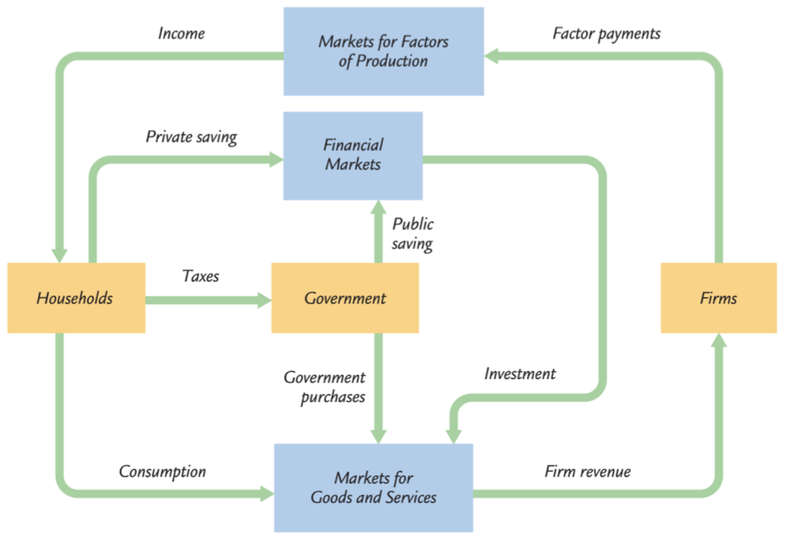
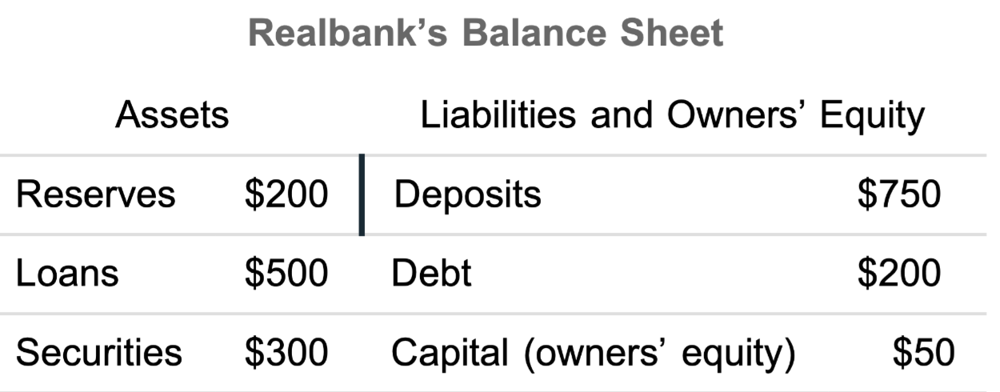
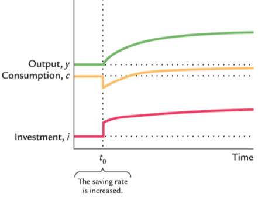
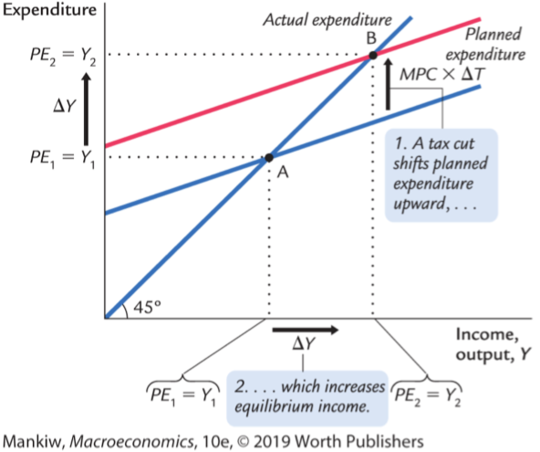

# 宏观经济指标

## *GDP*

### 看待GDP的三种方式

国内生产总值 Gross domestic product GDP 常常被认为是对经济表现状况的最佳衡量指标。在中国由国家统计局发布，在美国由商务部下属经济分析局 Bureau of Economic Analysis 发布

GDP的目的是用一个代表了某一给定时期经济活动的货币价值的单一数字来汇总所有数据。看待这一统计数字有三种方式

* Output：GDP的精确定义是**国内生产总值是给定时期的经济内domestic 市场生产的所有最终产品和服务的市场价值**，即在一定时间内生产了多少final goods
* Income：把GDP看作是domestic经济中所有人的总收入（domestic包含了属于本国和外国的capital 和 labor） $Y=wL+rK$
* Expenditure：把GDP看作是在经济的产品和服务的产出上的总支出 $Y=C+I+G+NX$。统计局一般都是用expenditure来计算GDP的，因为它最方便获取数据和进行计算

这两种看待方式是完全等价的，因为等于整个经济来说，收入必定等于支出

### GDP计算规则

为了理解GDP的定义是如何应用的，需要给出一些经济学家在构建这个统计数字时所遵循的一些规则

* 为了计算不同产品的服务的总价值，国民收入核算使用市场价格，因为市场价格反应了人们为产品或服务的支付意愿
* 二手货 Used goods 的出售不包括在GDP中，因为GDP衡量现期生产的产品与服务的价值。二手货的出售反应了资产的转移，并不是经济中收入的增加
* 存货 Inventories：当一家企业增加其产品的存货时，这种存货投资作为企业所有者的支出来计算，因此会增加GDP。然后出售存货不会影响GDP。这种处理存货的方式确保了GDP反映了经济中产品与服务的现期生产
* 中间产品 Intermediate goods：许多产品是分阶段生产的，GDP只包括最终产品 final goods 的价值，不会对中间价值进行重复计算
* 估算价值 Imputation：尽管大部分产品与服务都按照其市场价格来计算，但有很多产品不在市场上销售，也就不会有市场价格，若GDP要包括这些产品与服务的价值，我们就必须对其i进行价值估算
  * 估算对决定住房的价值很重要。自有房也会被估算租金，视为房主为自己支付的租金
  * 对于政府服务，公务人员的工资被用来衡量其产出的价值
  * 地下经济 Underground economy 中销售的产品和服务的价值是不会被估算的

GDP是不完美的指标，因为对GDP的计算是不可能完全精确的，必然会有很多的多算或少算。但只要这些不完美的程度随着时间的推移保持**相当的稳定**，那么GDP对经济活动的逐年比较就是有用的

### 支出的组成部分

$$
Y=C+I+G+NX
$$

国民收入核算把GDP分为四大类支出：消费 $C$、投资  $I$ 、政府购买 $G$ 和净出口 $NX$，上式称为国民收入核算恒等式 National income accounts identity

* 消费 cosumption 由家庭在产品与服务上的支出构成
  * 产品 goods 是有形的东西
    * 耐用品 durable goods 是持续时间长的产品
    * 非耐用品 nondurable goods 是持续时间短的产品
  * 服务 srevices 是无形的东西
* 投资 investment 由为未来使用而购买的产品构成。经济的投资并不包括在不同个体之间的重新配置资产的购买，而是创造了新的资本和生产资料
  * 企业固定投资 business fixed investment 也称为非住房固定投则，是企业对新建筑物、设备和知识产权产品的购买
  * 住房固定投资 residential fixed investment 是家庭和房东对新住房的购买
  * 存货投资 inventory investment 是企业产品存货的增加
* 政府购买 government purchases 是政府购买的产品和服务。注意社保和福利等再分配不属于GDP
* 净出口 net exports 是与其他国家的贸易

### 收入的其他衡量指标

* 国民生产总值 Gross **National** Product GNP

  * GNP = GDP + 来自国外的要素报酬 - 支付给国外的要素报酬
  * GNP衡量一国居民所赚取的总收入

* 国民净产值 Net National Product NNP

  * NNP=GNP-折旧
  * 折旧 Depreciation 被称为固定资本的消耗 consumption of fixed capital
  * 由于折旧是生产经济中的产出的成本，所以减去折旧后的值表示经济活动的净结果

* 国民收入 National Income 

  * NI是近似于NNP的另一个衡量指标，两者的差别只有被称为统计误差 statistical discrepancy 的小矫正。这种统计误差的产生是由于不同的数据哀怨可能并不是一直的

  * 国民收入衡量经济中的所有人一共赚了多少钱。国民收入核算把国民收入分成六个部分，划分标准是谁赚到了收入

    * 雇员报酬 compensation of employees：工人赚到的工资和福利津贴

    * 业主收入 properties' income：小农场、夫妻店和合伙企业等非公司型企业的收入

    * 租金收入 rental income：房东得到的收入（包括房主向自己“支付”的租金）减去折旧等支出

    * 公司利润 corporate profits：公司在向工人和债权人支付报酬后的收入

    * 净利息 net interest：国内企业支付的利息减去它们得到的利息，加上从外国人那里赚到的利息

    * 生产和进口税 taxes on production and imports：企业的某些税收减去冲抵的企业补贴

* 个人收入 Personal income

  * 个人收入 = 国民收入 - 生产和进口税 - 公司利润 - 社会保险费 - 净利息 + 股息 + 政府对个人的转移支付 + 个人利息收入
  * 个人可支配收入 Disposable Personal Income = 个人收入 - 个人税收

## *GDP的统计计算*

### 实际GDP vs. 名义GDP

经济学家把用**现期价格**衡量的产品与服务的价值叫做名义GDP nominal GDP，名义GDP的增加可能是由于数量增加，也有可能是由于价格上升，单纯的价格上升对衡量经济增长没有什么价值。因此这种GDP计算方式不是衡量经济福利的最优指标

更好的经济福利衡量指标将计算经济中产品与服务的产出，他们不受价格变动的影响，因此经济学家使用实际GDP。实际GDP使用一组**不变价格**，即基年 base year 的数据衡量的价值与服务的价值，即实际GDP表明若**数量变化而价格不变**时对产出的支出有什么变动。**计算实际GDP需要提供基年数据 Base-year prices**

### 同比与环比

* 同比 Year-on-Year
  $$
  (本期数据 - 同期数据) / 同期数据 * 100\%
  $$
  同比是将同一时期的两个相邻时间段进行比较，**通常是将当前时间点与去年同一时间点进行比较**。比如若想比较今年第二季度的GDP同去年第二季度的GDP就是在进行同比分析。同比的主要目的是看出同一时间段内数据的增长或减少情况

  

* 环比 Quarter-on-Quarter QoQ/Month-on-Month MoM

  环比是将连续两个时间段的数据进行比较，通常是将当前时间点与上一个时间点进行比较。比如若想比较本季度的销售额与上一季度的销售额，那么就是在进行环比分析。环比的主要目的是观察短期内数据的连续变化趋势
  $$
  (本期数据 - 上期数据) / 上期数据 * 100\%
  $$

下表是我国从2018年第1季度-2023年第二季度的GDP同比和环比增长数据，图源自国家统计局 <http://www.stats.gov.cn/sj/zxfb/202307/t20230717_1941310.html>

### GDP平减指数 Deflator

GDP平减指数 GDP deflator，又被称为GDP的隐形价格平减指数 Implicit price deflator，定义为名义GDP与实际GDP的比率
$$
Deflator=\frac{Nominal\ GDP}{Real\ GDP}
$$
实际GDP是从名义GDP剔除了通货膨胀的部分

### 实际GDP的链式加权衡量

如何选择基年数据对测算实际GDP有着重要作用，链式加权测度 chain-weighted 确保了用来计算实际GDP的价格永远不会过于陈旧。在chain-weighted中，基年会随时间的推移不断变化

下面给出两个用百分比进行运算的tips，用 $P$ 表示GDP平减指数，$Y$ 表示实际GDP

* $P\times Y$ 的百分比变动 $\approx$ $P$ 的百分比变动 + $Y$ 的百分比变动
* 一个比率的百分比变动近似地等于分子的百分比变动减去分母的百分比变动

## *CPI*

### CPI介绍

价格总体水平的上升称为通货膨胀 inflation，价格水平从一个时期到下一个时期的百分比变化称为通货膨胀率 inflation rate

最常用的价格水平衡量指标是**消费者价格指数 Consumer Price Index CPI**，在美国是由劳工统计局负责计算的。在中国称为居民消费价格指数，由国家统计局进行计算

计算CPI需要收集成千上万种产品和服务的价格，正如GDP把许多产品与服务的数量变成衡量生产的价值的单一数字一样，**CPI把许多产品与服务的价格变成衡量价格总体水平的单一指数**

### 一篮子产品价格

统计局通过计算一个典型的消费者所购买的一篮子产品与服务 a basket of goods 的价格模型来对不同的产品及服务进行加权计算

和实际GDP一样，CPI是这一篮子产品与服务的价格相对于同一篮子产品与服务在某个基年的价格的比值

比方说消费者每月只购买3个梨和6个香蕉，那么以2019年作为基年，今年的CPI为
$$
CPI=\frac{3\times P_p+6\times P_b}{3\times P_{p,2017}+6\times P_{b,2017}}
$$
其他的重要价格指数

* 另外一个重要的价格指数是**生产者价格指数 Producer Price Index PPI**。它衡量企业而不是消费者购买的典型一篮子产品的价格
* 除此之外统计局还会计算衡量不包括食物和能源产品的消费者篮子的价格增长指数：核心通货膨胀 Core Inflation。由于食物和能源产品的短期波动性比较大，所以core inflation有时候被认为是一个更好地衡量当前通膨趋势的指标

### 对三种通膨指数的比较：CPI vs. GDP平减指数 vs. PCE平减指数

CPI vs. GDP deflator

* GDP deflator 衡量生产出来的所有产品于服务的价格，而CPI衡量的只是消费者购买的产品与服务的价格。因此企业或政府的支出会反映在GDP deflator上，而不会反映在CPI中
* GDP deflator 只包括domestic production，进口品不是GDP的一部分，因此就不会反映在GDP deflator上，但消费者是可以选择购买任意国家的产品的，因此进口产品可能属于一篮子产品中的一部分，其价格变化会影响CPI
* 两个指数对经济中许多价格加总的方法存在差异。具体来说CPI是一个 Laspeyres Index，它倾向于夸大价格上涨对消费者的影响；而GDP deflator是一个 Passasche Index，它倾向于低估价格上涨对消费者的影响

Price Index的比较

* Paasche Index 帕氏指数：一篮子可变产品计算的价格指数。GDP deflator是帕氏指数的一类
  $$
  P_t^P=\frac{\sum\limits_{i=1}^{n}{\left(p_{i,t}\cdot Q_{i,t}\right)}}{\sum\limits_{i=1}^{n}{\left(p_{i,0}\cdot Q_{i,t}\right)}}
  $$

* Laspeyres Index 拉式指数：一篮子固定产品计算的价格指数。CPI是拉式指数的一类
  $$
  P_t^L=\frac{\sum\limits_{i=1}^{n}{\left(p_{i,t}\cdot Q_{i,0}\right)}}{\sum\limits_{i=1}^{n}{\left(p_{i,0}\cdot Q_{i,0}\right)}}
  $$

个人消费支出 Personal Consumption Expenditures PCE 的隐形价格平减指数

### CPI反应通膨的准确度

CPI不是完全准确的，但和GDP一样，只要它长期保持稳定就能作为一个重要的参考数据

## *失业率*

失业率是衡量**想要工作的人**中没有工作的人所占比例的统计数字

### 家庭调查

### 机构调查

# 古典理论描述长期中的经济：国民收入

货币在经济中的循环流程图

## *产品与服务的总生产*

生产要素和生产函数共同决定了产品与服务的供给量，而产品与服务的供给量又等于经济的产出

### 生产要素

生产要素 Factors of production 是用于生产产品与服务的投入。两种最重要的生产要素是资本和劳动。资本 $K$ 是工人使用的工具集合，而劳动是人们用于工作的时间 $L$。用 $\overline{K}$ 和 $\overline{L}$ 来表示固定量

暂时假设生产要素得到了充分利用，也就是说没有资源浪费。在现实中，一部分劳动力会失业，一些资本会被闲置

### 生产函数

可使用的生产技术决定了给定数量的资本和劳动能够生产多少产出，用生产函数 production function 来表示这种关系
$$
Y=F(K,L)
$$

## *什么决定了产品与服务需求*

假设一个封闭经济 close economy，即一个不与其他国家进行贸易往来的国家，这样净出口就总是0。因此GDP的可以表示为扣除了贸易的国民收入衡算恒等式：$Y=C+I+G$

### 消费

家庭从他们的劳动和资本所有权中得到收入，然后向政府纳税。纳税后的可支配收入用于消费和储蓄

可支配收入 disposable income $Y-T$：支付了所有税收之后的收入

假设消费水平直接取决于可支配收入水平。可支配收入越高，消费也越多，因此有消费函数 consumption function。消费函数是可支配收入的函数
$$
C=C\left(Y-T\right)
$$
用边际消费倾向 marginal propensity to consume 来衡量将可支配收入用于消费的比例，剩余的用于储蓄

### 投资

企业购买投资品是为了增加它们的资本存量和替代现有的资本损耗

投资品的需求量取决于利率 interest rate，**利率衡量了为投资而融资的资金成本**。用 $I=I(r)$ 方程来表示投资与实际利率关系

利率主要在三个方面存在差异：期限 term（短期or长期）、信贷风险 credit risk、税收待遇 tax treatment

### 政府购买

政府购买 $G$ 等于税收减去转移支付 $T$。若二者相等，则政府有平衡的预算 balanced budget；若 $G>T$，则政府有预算赤字 budget deficit，要通过发行政府债券从金融市场上借款要为这种赤字融资；若 $G<T$，政府就有预算盈余 budget surplus 来偿还未清偿债务

## *利率与储蓄使国民收入达成平衡*

改写上面的收入支出恒等式
$$
Y=C+I+G\\C=C\left(Y-T\right),\ I=I(r),\ G=\overline{G},\ T=\overline{T}\\\overline{Y}=C\left(\overline{Y}-\overline{T}\right)+I(r)+\overline{G}
$$
上式中除了利率都是固定的，因此**利率是在实现供给与需求均衡中起到重要作用的价格**

### 储蓄

改写封闭经济的国民收入核算恒等式
$$
Y-C-G=I
$$
左边这一项是满足了消费者和政府需求后剩余的产出，称为国民储蓄 national saving，或简称储蓄 savings $S$。上面的等式表明，储蓄等于投资

可以把国民储蓄分为两部分 -- 私人部分储蓄 + 政府部门储蓄
$$
S=\underbrace{\left(Y-T-C\right)}_{private\ saving}+\underbrace{\left(T-G\right)}_{gov\ saving}=I
$$
上面的公式中左边是可支配收入减去消费，即私人储蓄 private saving。右边是政府收入减去政府支出，即公共储蓄 public saving，若政府支出大于政府收入，就变成了负数赤字

为了方便处理，上图中暂时假设储蓄不取决于投资（实际上关系是很大的）。储蓄和投资的关系可以用供给需求关系来解释，在这种情况下，产品是**可贷资金 loanable funds**，其价格则是利率。储蓄是可贷资金的供给，即家庭把储蓄贷给银行，通过银行又间接把钱贷给投资者，或者通过购买股票和债券的方式直接贷给投资者

### 储蓄的变动：财政政策的效应

* 政府购买的增加必定伴随着投资的等量减少，因为可支配收入 $Y-T$ 不变，所以消费 $C$ 也不变。因此只有政府储蓄 $T-G$ 减少了，这导致了整体储蓄 $S$ 减少，相当于上图中 $S$ 左移。为了保持平衡，即为了使投资减少，利率必然上升。称**政府购买挤出 crowd out 了投资**
* 减税挤出投资并提高了利率，因为减税会提高可支配收入，从而增加了消费

简单的概括，**储蓄的减少必然伴随着利率升高；储蓄的增加必然伴随着利率下降**

### 投资需求的变动

* 技术创新
* 政府通过税法激励或抑制投资

# 货币系统

宏观经济政策的两大支柱是货币政策和财政政策

* 货币政策 Monetary policy：关于一国硬币、通货和银行体系的决策，一般由中央银行制定
* 财政政策 Fiscal policys：政府关于支出和税收的决策，由立法或行政机构制定

## *什么是货币*

### 货币的职能

货币 Money/Währung 是可以很容易地用于交易的资产存量，公众手中的货币构成一国的货币存量

* 价值储藏手段 store of value：货币是一种把购买力从个现在转换到未来的方式`
* 计价单位 unit of account：货币提供了人们标记价格和记录债务的单位
* 交换媒介 medium of exchange
  * 货币是人们用于购买产品于服务的东西，它使更为复杂的交易称为可能
  * 一种资产可以转变为交换媒介和用于交换其他东西（产品、服务或资本资产）的容易程度被称为该资产的流动性 liquidity。由于货币是交换媒介，它是经济中流动性最高的资产

### 货币的类型

* 法币 fiat money：没有内在价值的货币称为法定货币，简称法币，因为它是由政府的规定或法令确定为货币的
* 商品货币 commodity money
  * 历史上大部分社会都曾把有某种内在价值的商品作为货币，这些货币称为商品货币
  * 最普遍的商品货币是黄金，当人们把黄金作为货币时，该经济被认为是在实行金本位制 gold standard

### 控制货币量

一个经济中可用的货币量称为货币供给 money supply。在一个商品货币体系中，货币供给就是那种商品的数量

在当今的大多数经济中，都由政府来控制货币供给，法律约束赋予了政府发行货币的垄断权力。货币供给和税收一样都是政府的重要政府工具，这种控制被称货币政策

在大多数国家，货币政策会被委托给中央银行 central bank 制定。美国的中央银行是美联储 Federal Reserve (Fed)，中国的中央银行是中国人民银行

> **货币政策**（英语：Monetary policy）是一个国家或是经济体的[货币](https://zh.wikipedia.org/wiki/貨幣)权威机构（多数国家由央行来执行）利用控制[货币供给量](https://zh.wikipedia.org/wiki/貨幣供應量)，来达到影响其他经济活动所采取的措施。主要手段包括：调节基准利率、调节商业银行保证金、[公开市场操作](https://zh.wikipedia.org/wiki/公开市场操作)。
>
> 利率、信用、资产价格等一系列受货币政策影响的变化，最终导致就业率、生产量的变化的过程，称为**货币政策传导机制**。一般而言，货币政策的主要目的是防止通货膨胀。-- wikipedia

### 货币量的衡量

货币是用于交易的资产的存量，所以货币量是衡量资产的数量（货币本身是没有价值的）

* 现金货币：货币量中的最显而易见的资产是通货 currency，即未清偿的纸币与硬币之和，大多数日常交易使用通货作为交换媒介
* 存款货币：活期存款 demand deposits 是人们在自己的储蓄账户上持有的资金

以**金融资产流动性**的大小作为标准，并根据自身政策目的的特点和需要，进行货币供给量的层次划分。中国货币的供应量表格分为 M0、M1和M2

* M0是流通中货币
* M1是狭义货币 narrow money = M0+可开支票进行支付的单位活期存款
* M2是广义货币 broad money = M1＋居民储蓄存款＋单位定期存款＋单位其他存款＋证券公司客户保证金
* 还可以有M3 = M2+金融债券 + 商业票据 + 大额可转让定期存单等，M3是根据金融工具的不断创新而设置的，中国暂未设立

## *银行在货币系统中的作用*

货币供给不仅由中央银行的政策决定，而且由家庭（持有货币）和银行的行为共同决定
$$
M=C+D
$$
M代表货币供给，C代表通货，D代表活期存款

### 百分之百准备金银行制度

银行收到的但没有贷放出去的存款称为准备金 reserves。一些准备金存放在全国各地银行的金库中，但大部分存放在该国的中央银行中

若银行只是接受存款，把货币作为准备金，直到储户提款或依据余额签发支票为止，这种系统称为百分之百准备金银行制度 100-percent-reserve banking 

可以使用资产负债表 balance sheet 来标识所有的资产和负债情况

### 部分准备金银行制度

部分准备金银行制度 fractional-reserve banking：银行只把部分存款都作为准备金，其余部分放贷收取利息

存款准备金率 reserve-deposit ratio 是存款中用作准备金的比率，一般都是存在中央银行内

通过借贷，部分准备金银行会创造货币，增加货币供给。货币的创造不局限于单次，而是每经过一方向外放贷，货币供给量就会增加一次

**银行体系创造货币的能力是银行与其他金融机构之间的主要差别**。金融市场的重要职能是把经济中的资源从储蓄转移到投资，这个过程被称为金融中介化 financial intermidiation。虽然股票、债券市场也可以有金融中介化的作用，但只有银行合法的增加货币供给

当然部分准备金银行创造了货币，但并没有创造创富，因为债务也同时被创造了，所以创造货币的过程知识增加了经济的流动性，并没有增加经济的财富总量

### 银行资本、杠杆和资本要求

开办银行要有资本方面的要求，也就是说银行的所有者必须有一些金融资源才能开业，这些资源被称为银行资本 bank capital

杠杆率 leverage ratio：银行的总资产与银行资本之比，下面的负债表中的杠杆率为 $1000/50=20$。这意味着银行所有者每投入1美元资本，银行能拥有20美元的资产，也就是有19美元的存款和债务

由于杠杆率的存在以及法律保障储户和债券持有者优先偿付，所以银行资产的下降将令银行资本快速下降，但银行资产少于其债务时，银行资不抵债

为了提高银行的抗风险能力，比如严重的流动性风险 Liquidity risk，各国央行都对银行有存款准备金的规定。超出央行规定的称为超额准备金 excess reserve

## *中央银行如何影响货币供给*

### 补充：外生变量 & 内生变量

* 外生变量 xogenous variable 也可以称为输入变量。 **完全由经济系统外部确定并输入系统的变量，它只对系统产生影响而不受系统的影响，一般我们将其视为给定**。 在经济计量模型中，外生变量是与模型的随机扰动项不相关的变量。 通常，描述影响经济系统运行的，技术、政治、制度、自然条件等外部因素的变量都是外生变量
* 内生变量 endogenous variable 是指在模型中被视为依赖于其他变量的因素。内生变量的值是由模型内部的其他变量所决定。在经济学中，内生变量通常是模型中需要解释或预测的变量

### 货币供给模型

考虑一个部分准备金银行制度下的货币供给，需要考虑美联储、银行和家庭决策之间的相互作用，即美联储关于创造多少美元的决策、银行关于将存款作为准备金持有还是作为贷款放贷的决策、家庭关于将他们的货币以通货还是活期存款的形式持有的决策

考虑该模型的三个外生变量

* 基础货币 monetary base $B$：是公众以通货形式持有的美元 $C$ 和银行以准备金形式持有的美元 $R$ 的总量，由中央银行直接控制
* 存款准备金率 reserve-deposit ratio $rr$：是银行持有的准备金占存款的比例 $rr=R/D$，由银行的经营政策和监管银行的法律决定
* 通货存款比 currency-deposit ratio $cr$：是人们持有的通货量 $C$ 对其活期存款量 $D$ 的比例 $cr=C/D$，它反映了家庭对其希望持有的货币形式的偏好

$$
\left\{\begin{array}{l}M=C+D\\B=C+R\end{array}\right.\Rightarrow\frac{M}{B}=\frac{C+D}{C+R}=\frac{C/D+1}{C/D+R/D}\\\xrightarrow{cr=C/D,\ rr=R/D}M=\frac{cr+1}{cr+rr}\times B,\ \frac{cr+1}{cr+rr}\triangleq m
$$

从上式可以看出，货币供给量是与基础货币成比例的，将比例 $m=\frac{cr+1}{cr+rr}$ 称为**货币乘数 money multiplier**。因为1美元基础货币能产生 $m$ 美元货币，即基础货币对货币供给量是有乘数效应的，所以基础货币有时被称为**高能货币 high-powered money**

增加货币供给

* 存款准备金 $rr$ 越低，银行发放的存款就越多，银行也就能创造出更多的货币，也就增加了货币供给
* 通货存款比 $cr$ 越高，$m$ 越趋近于1，公众持有的通货也就越少，银行的准备金越多，能创造的货币也就越多

### 中央银行的货币政策工具

* 改变基础货币
  * 公开市场操作 open market operations 是指中央银行凭借自己的资金实力，在公开市场买进或卖出各种有价证券，从而增加和减少商业银行的超额准备金，以达到控制市场上的基础货币供应量和市场利率的目的
  * 中央银行扮演最后贷款人 lender of last resort，以贴现率 discount rate（央行给其他银行贷款的利率）贷款给其他银行，来满足银行对于满足准备金率等的需求。贴现率越低，银行在央行的贴现窗口 discount window 借的钱也就越多，因此贴现率的下降会增加基础货币和货币供给
* 改变准备金率从而影响
  * 上修法定准备金率会降低货币乘数和货币供给
  * 2008年后Fed推出了准备金利息 interest on reserves。有些国家是对全部准备金支付利息，有些对超额准备金不支付利息

# 通货膨胀

## *货币数量论*

货币数量论 quantity theory of money 是有关货币在长期影响经济的最重要的解释。货币量决定价格水平，货币量增长决定了通货膨胀率

### 交易与数量方程

货币也是存在供给与需求关系的，上一节中描述了货币的供给，现在描述货币的需求。

货币数量论的起点是人们为了购买产品与服务而持有货币这一见解。他们为进行这样的交易所需要的货币越多，他们持有的货币也就越多。因此经济中的货币量与交易中交换的美元量相关

交易与货币之间的关系可以表示为数量方程 quantity equation，其中M是货币量，V称为货币的交易流通速度 transactions velocity of money，它衡量货币在经济中流通的速度；T表示某一时期内的交易总数，P是一次典型交易的价格
$$
货币\times货币流通速度=价格\times交易量\Leftrightarrow MV=PT
$$

### 从交易到收入

**数量方程中的 T 交易次数是难以衡量，因此用经济中的总产出 Y 来替换**

这个替换是合理的，因此交易与产出虽然不是相同的，但是是相关的，因为总体来说经济生产得越多，买卖交易的产品也就越多

当替换成 $Y$ 后，$Y$ 是实际GDP，$P$ 是GDP deflator，$PY$ 表示的就是名义GDP。由于 $Y$ 也是总收入，这个形式的数量方程中的 $V$ 也被称为货币的收入流通速度 income velocity of money

### 货币需求函数和数量方程

实际货币余额 real money balances $M/P$：把货币量表示成它可以购买的产品与服务的数量

货币需求函数 money demand function 是一个表明人们希望持有的实际货币余额数量的决定因素的方程。其中 $k$ 是常数，它告诉我们对与一单位货币的收入，人们想要持有的货币是多少
$$
\left(M/P\right)^d=kY\label{货币需求函数}
$$

### 货币流通速度不变的假设简化分析

货币数量论 quantity theory of money = 数量方程 + 货币流通速度不变假设

货币流通速度不变假设只是现实的一种简化，但在很多分析中很有用。其实可以得到结论货币数量 M 的变动必定会引起名义GDP $PY$ 的同比例变动
$$
M\overline{V}=PY
$$

### 经济中的长期价格水平：货币、价格和通胀

经济的生产能力决定实际GDP，货币量决定名义GDP，而GDP deflator是名义和实际GDP的比值

1. 生产要素和生产函数决定产出 $Y$，也就是实际GDP
2. 中央银行设定的货币供给 $M$ 决定产出的名义价值 $PY$
3. 价格水平 $P$ 是产出的名义价值 $PY$ 与产出 $Y$ 的比例

**货币数量论意味着：价格水平与货币供给成比例**

该价格水平理论也是一个通膨理论。用百分比变动的形式表示数量方程
$$
\%\Delta M+\%\Delta V=\%\Delta P+\%\Delta Y
$$

* $\%\Delta M$ 货币量变动由中央银行控制
* $\%\Delta V$ 货币流通速度变动反应货币需求的移动，当然在货币流通速度不变假设中为 $\%V=0$
* $\%\Delta P$ 是通货膨胀率
* $\%\Delta Y$ 产出变动取决于生产要素的增长和技术进步

货币数量论说明，控制货币供给的中央银行能够最终控制通货膨胀率。若中央银行保持货币供给稳定，价格水平也将稳定。当然这种影响更适用于长期经济，而非短期经济

## *政府从发行货币得到收益：铸币税*

为什么中央银行要大量增加货币供给？因为政府自身就要支出货币来换取某些服务，比如为政府工作人员提供薪水、提供社会福利等。政府有三种方法来进行融资

* 税收
* 出售政府债券向公众借贷
* 发行货币

通过发行货币筹集的收入称为货币铸造税 seigniorage。这个词汇来源于法语 seigneur，一个意为“封建领主”的法语词。在中世纪，封建领主拥有在自己的领地铸造货币的排他性权利，今天这种权利属于中央政府，它是一项收入来源

>铸币税指发行货币的组织或国家的政府，享有货币发行面值减去发行成本后，换取实际经济资源的利益，从中攫取发行货币所产生的特定收益。这部分由货币发行主体垄断性地享受“通用货币面价值超出生产成本”的收益，就被定义为铸币税 -- wikipedia

当政府发行货币来融资时，它增加了货币供给，得到了新货币供自己使用。而货币供给的增加是有副作用的，根据货币数量论，它会引发通货膨胀。**发行货币筹集收入就像征收一种通货膨胀税 inflation tax**。因为随着通膨，个人持有的货币的购买力是在下降的，这和税收降低了人们持有的货币量是一样的，因此本质上，通膨就是在对持有的货币征收的税

通过发行货币能够筹集到的收益在各国之间的差别是很大的

## *通货膨胀与利率*

### 实际利率与名义利率

* 名义利率 nominal interest rate：银行支付的利率
* 实际利率 real interest rate：购买力的增加

用 $i$ 代表名义利率，$r$ 代表实际利率，$\pi$ 代表通货膨胀率，那么这三个变量之间的关系为下式，也就是说实际利率 = 名义利率 - 通膨率。重新整理可以得到费雪方程 Fisher equation
$$
r=i-\pi\\Fisher\ equation:i=r+\pi
$$

费雪方程名义利率可以由两个原因而发生变动：实际利率变动或通膨变动

费雪效应 Fisher effect：根据 Fisher equation，通胀率%1的上升会引起名义利率1%的上升。通膨率和名义利率之间这种一对一的关系称为费雪效应 Fisher effect

### 事前与事后实际利率

贷款时虽然能够对名义利率达成一致，但贷款期限内通膨率 $\pi$ 是多少却是无法知道的，只有一个预期的通膨率 $E(\pi)$

* 事前实际利率 Ex-ant real interest rate 表示**预期**的实际利率
* 事后实际利率 Ex-post real interest rate 表示**事实**的实际利率

## *名义利率与货币需求*

### 持有货币的成本

如果只是单纯持有货币，由于通膨的存在，收益将会是 $r+E(\pi)$。通过购买政府债券或储蓄，可以赚到实际利率 $r$，实际利率是持有货币的机会成本

货币是经济中最具流动性的资产。实际货币余额的需求既取决于收入水平又取决于名义利率，可以把一般的货币需求函数写作
$$
\left(M/P\right)^d=L(i,Y)
$$

### 未来货币与现期价格

用费雪方程把名义利率写为实际利率与预期通膨率之和，下式说明价格水平不仅取决于今天的货币供给，**而且取决于预测的未来货币供给**
$$
\left(M/P\right)^d=L(r+E\left(\pi\right),Y)
$$
实际中使用的货币需求函数是极为复杂的，但中心思想是：价格水平取决于现期货币供给与预期的未来货币供给的加权平均值。通货膨胀既收到现期货币供给增长的驱动，又受到预期的未来货币供给增长的驱动

## *通货膨胀的危害*

在说明通膨的危害之前，首先给出一个大部分经济学家认同的2%-3%温和通膨的益处：可以使劳动市场更好地运作。大部分岗位的工资都是逐年上涨的，而借助温和通膨，可以让企业视企业情况调控工资上涨幅度

### 通货膨胀的成本

* 对人们持有的货币量的扭曲效应：频繁的取放现金引发的鞋底成本 shoeleather cost
* 企业频繁的更改产品标价的行为代价是高昂的，被称为菜单成本 menu cost
* 企业无法适应价格的更改而造成资源配置的无效率
* 通膨会显著影响税收效率
* 未预期到的通货膨胀的成本：对养老金、借贷等合约的影响

### 恶性通货膨胀

恶性通膨 Hyperinflation 是指每个月超过50%的通膨

恶性通膨发生的原因主要是因为政府主体失去信用从而无法通过发债、税收等方式筹措资金，只能通过发行更多货币来获得铸币税。但由于无节制的发型货币很快就引发了严重的通胀

# 开放经济

## *资本和产品的国际流动*

### 净出口的作用

总产出 $Y$ 中有一些产出是出口到国外的，即出口 $X$，有一些产出是从国外进口的 $IM$，因此可以将国民收入恒等式写成如下
$$
Y=C+I+G+X-IM
$$
**净出口 net exports** 为出口减去进口 $X-IM$，因此可以将恒等式写成
$$
Y=C+I+G+NX
$$
**净出口又称为贸易余额 trade balance**，因为它告诉我们一国的产品与服务贸易如何偏离进口等于出口这种基准情形

### 国际资本流动和贸易余额

$$
Y=C+I+G+NX\longrightarrow\underbrace{Y-C-G}_{S}=I+NX,\ S=Y-C-G=\underbrace{Y-T-C}_{household}+\underbrace{T-C}_{gov}\label{TradeBalance}
$$

左边是国民储蓄 $S$，即有 $S=I+NX\Rightarrow S-I=NX$。取决于左边 $S-I$，即国内投资是正还是负，称其为资本净流出 net capital outflow/国外净投资 net foreign investment（对国外的储蓄）或者是资本净流入（经济通过从国外借贷来额外融资）；若恰好为0，就称该国贸易平衡 balanced trade

资本积累的资金国际流动和产品与服务的国际流动是互相平衡的。若 $S-I$ 和 $NX$ 是正的，则一国有贸易盈余 trade surplus，该国是国际金融市场上的净债权人，也就是说国民储蓄大于支出，多余的用于向外国放贷；若是负的，则有贸易赤字 trade deficit，说明国民储蓄不足以平衡支持，需要以大量进口的方式向外国借贷；恰好等于零，则一国贸易平衡 balanced trade

## *小型开放经济中的储蓄与投资*

### 资本的流动性与世界利率

具有完全资本流动性的小型开放经济 small open economy

* “小型”是指这个经济是世界经济的一个小部分，从而它对世界利率的影响微不足道
* “完全资本流动性”是指该国居民可以完全进入世界金融市场，即政府不会组织国际借贷或贷款。由于这个假设，**小型开放经济中的利率 $r$ 必定等于世界利率 $r'$**

### 模型

仍然采用国民收入中用到的三个假设

* 经济的产出Y是由其生产要素和生产函数固定的 $Y=\overline{Y}=F\left(\overline{K},\overline{L}\right)$
* 消费C与可支配收入 $Y-T$ 正相关。我们把消费函数写为 $C=C(Y-T)$
* 投资I与实际利率r 负相关。我们把投资函数写为 $I=I(r)$

将上面的假设代入 $\ref{TradeBalance}$ 中
$$
NX=(Y-C-G)-I=S-I\\=\left[\overline{Y}-C\left(\overline{Y}-T\right)-G\right]-I\left(r^*\right)=\overline{S}-I\left(r^*\right)
$$
该方程说明了贸易余额NX取决于那些决定储蓄S和投资I的变量，当然储蓄S本身也取决于世界实际利率（开放经济）$r^*$，所以贸易余额是由在世界利率水平时储蓄和投资之间的差额决定的。下面这张图和封闭经济中的储蓄、投资平衡图非常相似

汇率使得产品的国际流动与资本的国际流动相平衡

### 评价经济政策

增加投资或减少储蓄的政策往往会引起贸易赤字；而减少投资或增加储蓄的政策往往会引起贸易盈余

大多数经济学家认为贸易赤字本身并不是一个问题，但也许是问题的征兆。贸易赤字可能反映了低储蓄

不能仅仅从贸易余额来判断经济表现，而应该应该考察国际流动背后的原因来判断贸易赤字到底代表了什么

## *汇率 Exchange Rate*

### 名义与实际汇率

* 名义汇率 nominal exchange rate 是两个国家通货的相对价格。升值 appreciation/货币坚挺 strengthening、贬值 depreciation/货币疲软 weakening都是相对概念，**一般用一美元可兑多少其他货币说的多一点**，即 $\#其他货币/美元$
  * 直接标价法：以外币作为基准货币，汇率变动方向与外币的价值一致。我国兑主要国际货币采用直接标价法
  * 间接标价法：以本币作为基准货币，汇率变动方向与本币的价值一致。我国兑非主要货币（马来西亚林吉特和俄罗斯卢布）采用问接标价法
* 实际汇率 real exchange rate 是两国产品的相对价格。实际汇率告诉我们,我们能按什么比率用一国的产品交换另一国的产品。实际汇率有时被称为贸易条件 terms of trade

实际汇率与名义汇率之间的关系是
$$
实际汇率=名义汇率\times\frac{国内产品价格}{国外产品价格}
$$
对于单一产品的实际汇率计算方法可以被推广到如何定义对于更广泛的一篮子产品的实际汇率。令 $e$ 代表名义汇率（每1美元可兑RMB数量，RMB/美元），P代表美国的价格水平（用美元衡量），$P^*$ 代表中国的价格水平（用RMB衡量），那么实际汇率为：
$$
\epsilon=e\times(P/P^*)
$$

### 实际汇率的决定因素

两国之间的实际汇率是从名义汇率和两国的价格水平计算的。若实际汇率高，外国产品就相对便宜，而国内产品就相对昂贵；若实际汇率低，外国产品就相对昂贵，而国内产品就相对便宜

实际汇率对贸易余额/净出口有着明显的影响，实际上**净出口是实际汇率的负相关函数** $NX(\epsilon)$。当实际汇率高时，本国产品比外国产品贵，消费者会更多的购买他国的产品，而实际汇率低时本国产品则更便宜

结合守恒公式 $\ref{TradeBalance}$，$S-I=NX=NX(\epsilon)$，因此投资和储蓄并不受汇率影响，所以 $S-I$ 是一条垂直的竖线，两者的交点就是均衡实际汇率

注意到上图和利率-投资关系图几乎一摸一样，因此也可以说实际汇率反映了外汇的供给-需求关系

若国内政府通过增加政府购买或减税来减少国民储蓄，即减少 $S-I$，那么必然伴随着实际汇率的上升，净出口减少，平衡了贸易余额；若外国政府增加政府购买或减税，财政政策的这两种变动都降低了世界储蓄，使世界利率上升，世界利率的上升减少了国内投资 $I$，导致 $S-I$ 增大了，因此实际汇率下降，净出口增加

### 贸易政策的影响，以保护主义为例

贸易政策的广义定义是设计用于直接影响产品与服务进口与出口数量的政策。贸易政策通常采取保护国内产业免受国外竞争的形式，或者通过对外国进口品征税（课关税)），或者通过限制可以进口的产品与服务的数量（进口配额）

举一个贸易保护主义的例子，例如禁止进口EV，来分析一下贸易保护主义对进出口的影响

对千任何给定的实际汇率，进口将会更低，这意味着净出口（EX-IM）将会更高，上图中蓝色 $NX(\epsilon)$ 将会外移到红色。在新均衡处实际汇率更高，净出口则保持不变。尽管净出口曲线移动了，但净出口的均衡水平仍然相同，这是因为保护主义政策既没有改变储蓄也没有改变投资

我们得出的结论是，保护主义贸易政策并不影响贸易余额，仅仅是提高了实际汇率。这个结果令人惊讶，实际上很多的贸易保护政策，比如Trump发动的贸易战就是觉得美国对中国的贸易逆差/贸易赤字太大了，他试图缩小这一赤字。但实际上因为进一步提高了实际汇率，本国的产品竞争力进一步下降，因此进一步降低了出口量，由于净出口不变，该国的进口也必然减少了（汇率升值在某种程度上确实刺激了进口，但这仅仅部分抵消了由于贸易限制引起的进口减少）。因此总的来说贸易保护主义既减少了进口又减少了出口

总体贸易量下降是经济学家通常反对保护主义政策的原因。通过允许每个国家专业化生产本国最具有比较优势的产品与服务以及为每个国家提供更多品种的产品与服务，所有国家都可以从专业分工的国际贸易中受益。保护主义政策减少了这些来自贸易的获益。虽然这些政策使社会内的某些群体获益，比如说禁止进口EV可能有利于国内EV厂商的发展，保护本土产业。但当这些政策减少了国际贸易量时，平均而言降低了整个社会的utitily

### 名义汇率的决定因素

可以改写上面实际汇率的表达式得到名义汇率
$$
e=\epsilon\times(P^*/P)
$$
考虑汇率随时间的变动是有启发性的，因此可以将实际汇率方程进一步写成
$$
\Delta e\%=\Delta\epsilon\%+\Delta P^*\%-\Delta P\%
$$
实际上，$\Delta e\%$ 的百分比变动是实际汇率的变动，$P$的百分比变动是国内通货膨胀率 $\pi$，$P^*$ 的百分比变动是外国的通货膨胀率 $\pi^*$。因此名义汇率的百分比变动是
$$
\Delta e\%=\Delta\epsilon\%+(\pi^*-\pi)
$$
其中，$\pi^*-\pi$ 就是两国通货膨胀率之差。也就是说上式的意义是**两个国家的通货之间名义汇率的百分比等于实际汇率的百分比变动加上两国通货膨胀率之差**。若一个国家相对于美国而言通货膨胀率较高，那么随着时间的推移，1美元能购买的外国通货量将增加。若一个国家相对于美国而言通货膨胀率较低，那么随着时间的推移，1美元能购买的外国通货量将减少

高通货膨胀的一个后果是本国通货贬值：高 $\pi$ 意味着e的下降。换言之，正如货币量的增长使按货币衡量的产品价格上升一样，它也往往会使按本国通货衡量的外国通货价格上升

### 国际收支

* 经常项目/经常账户 current account：主要反映一国实体经济的对外状况
  * 贸易收支 trade alance 就是货物的进出口
  * 服务收支 service transaction：运输、旅游、银行和保险业务收支、军事支出、政府往来等等
* 资本和金融项目/资本和金融账户 capital account：主要记录表现为资金形态的资本流入、流出情况，包括跨境直接投资、证券投资、借贷活动和其他形式的跨境资本流动

### 购买力平价理论

外国货币的需求基础是其购买力，因此两种货币的汇率应由其各自在本国的购买力之比，即购买力平价 purchasing-power parity 来决定

购买力平价论有一些缺陷，首先它有以下假设

* 所有的货物和服务都可以进行国际贸易
* 国际贸易可自由进行，不受任何限制
* 国际贸易的交易成本，如运费和关税为0

Commodity arbitrage 套利，比如说代购

在满足以上条件时，如果外汇交易的汇率明显偏离购买力平价，则经汇率换算以后，一国的相对价格水平就会与另一国出现极大偏差，这就为商品套购提供了机会，进而实现一价定律

一价定律 law of one price 是理论上的，以为套购行为本身还存在成本，或者说为了商业营销等考量，添加中间差价不一定完全和在本国购买一致

购买力平价成立/一致的结果就是一价定律

首先，有些物品，如旅游资源无法套购：有些物品的运输费用和关税很高，抑制了套购，结果，一价定律就不能实现，使得汇率偏离购买力平价

第三，虽然价格会影响汇率，但汇率的变动反过来也会影响价格。例如外汇汇率上升以后，进口商品的价格相应上扬，由此会推动国内价格水平的涨升

# 失业

## *自然失业率 & 摩擦性失业*

### 劳动力模型

首先建立一个劳动力的动态模型，该模型说明了什么因素决定自然失业率。令L代表劳动力，E代表就业工人人数，U代表失业工人人数。由于每个工人不是就业者就是失业者，因此劳动力是就业者与失业者之和：$L=E+U$，那么失业率就是 $U/L$

假设 $L$ 是固定的，我们把注意力放在劳动力中的个体在就业E与失业U之间的转换上。令s代表离职率 rate of job separation，即每个月失去或离开自己的工作的就业者的比例。令f代表入职率 rate of job finding，即每个月找到工作的失业者的比例

离职率s和入职率f共同决定了失业率。若失业率既没有上升也没有下降，即若劳动市场处千稳定状态，那么找到工作的人数 $fU$ 必定等于失去工作的人数 $sE$，即 $fU=sE$

下面进行一些变换，下面的方程表明，稳定状态失业率 $U/L$ 取决千离职率s和入职率f。离职率越高，失业率就越高；入职率越高，失业率就越低
$$
fU=s(L-U)\rightarrow f\frac{U}{L}=s(1-\frac{U}{L})\rightarrow\frac{U}{L}=\frac{s}{s+f}\rightarrow\frac{U}{L}=\frac{1}{1+f/s}
$$

### 工作搜寻和摩擦性失业

失业的一个原因是，使工人与工作岗位相匹配需要花时间。由于工人找工作需要花时间而引起的失业称为摩擦性失业 frictional unemployment

摩擦性失业的原因有很多，比如经济学家把需求构成在不同行业和地区之间的变动称为部门转移 sectoral shift。由于部门转移总在发生，且工人改变部门需要时间，所以摩擦性失业总是存在。当然，部门转移只是造成摩擦性失业的一个原因

### 公共政策与摩擦性失业

政府会推出很多政策来降低自然失业率。比如一些辅助就业的机构、职业培训等

但有时候一些公共政策反而会增加摩擦性失业，比如失业保障 unemployment insurance

通过减轻失业的经济困难，失业保障增加了摩擦性失业的数量，提高了自然失业率。那些得到失业保障津贴的失业者寻找新工作的压力小了，更有可能放弃没有吸引力的工作机会

尽管失业保障提高了自然失业率，但我们不应该由此推断这项政策是一个坏主意。这个项目的好处是减少了工人对自己收入的不确定性

## *实际工资刚性与结构性失业*

失业的第二个原因是工资刚性 wage ridigity，即工资未能调整到劳动供给等于劳动需求的水平

工资刚性与工作配给引起的失业称为结构性失业 structural unemployment。工人失业并不是因为他们在积极寻找最适合于他们个人技能的工作，而是因为愿意工作的人数与可以得到的工作数之间存在不匹配。在现行工资下劳动供给量超过劳动需求量，所以许多工人只是在等待工作岗位的出现

当实际工资高于均衡水平和工人的供给超过需求时,我们可能预期企业会降低它们支付的工资。结构性失业的产生是因为尽管存在劳动的超额供给，企业也不能降低工资。现在我们转而论述这种工资刚性的三个原因：最低工资法、工会的垄断力量以及效率工资

### 最低工资法

法定最低工资事实上造成了工资刚性

政治上总是对最低工资争论不休。支持更高的最低工资水平的人把最低工资看作一种增加有工作的穷人的收入的手段。但很多时候因为最低工资收益的不一定是真正需要工作的低技术工人，也有可能是富裕家庭出来打工获取零花钱的年轻人

许多经济学家认为，税收抵免是一种增加有工作的穷人收入的更好方法，劳动收入所得税抵免 earned income tax credit 是允许有工作的穷人家庭从应纳税收中扣除的数量。与最低工资不同，劳动收人所得税抵免并没有增加企业的劳动成本，从而不会减少企业需求的劳动量，但是它的不利之处是减少了政府的税收收入

### 工会和集体议价

已加入工会的工人的工资不是由供给和需求均衡决定的，而是由工会领导人与企业管理层之间的谈判决定的。**最终的协议常常把工资提高到均衡水平以上，而把决定雇佣多少工人的权利交给企业**。结果是所雇用的工人数量减少了，入职率下降了，进一步增加了结构性失业

在美国只有不到20%的工人通过工会集体议价，而在西欧国家比例在60%-100%之间

工会还能够影响那些工人没有组成工会的企业所支付的工资，因为大部分企业都讨厌工会，所以企业可以选择向自己的工人支付让他们满意的高工资，抑制工人组成工会

工会和工会化威胁会加剧不同群体的工人之间的冲突，即局内人 insiders 与局外人 outsiders 之间的冲突。局内人是指已经被企业雇用的工人，它们一般都想使企业的工资保持在高水平。局外人是指失业者，却承担了高工资的部分代价，因为他们被雇佣的机会变少了，因为在较低工资水平时可能会被雇用。这两个群体的利益冲突是不可避免的，任何谈判过程对工资和就业的效应都取决于每个群体的相对影响

局内人与局外人之间的冲突在不同国家的解决方式各异。在一些国家，比如美国，工资谈判是在企业或工厂的层次进行的。在其他国家，比如瑞典，工资谈判则是在更高的国家层次进行的，此时政府往往起着关键作用。尽管工会化程度高，瑞典在历史上并没有经历过极高的失业。一种可能的解释是，工资谈判的集中化和政府在谈判过程中的作用给了局外人更大的影响力，这使工资更接近均衡水平

### 效率工资

效率工资 efficiency-wage 理论：由于企业向其工人支付高工资就能更有效地运行，所以企业可能发现保持工资高于供给和需求相平衡的水平是有利可图的。这种高于均衡水平的工资所产生的结果是更低的入职率和更高的失业率

效率工资理论大概可以分为4种

1. 工资影响工人健康，更适用于穷国
2. 高工资减少了劳动力的更替，更适用于富国
3. 逆向选择 adverse selection：一家企业的劳动力质量取决于它向雇员支付的工资。如果企业降低工资，最好的雇员就会到其他企业工作，而留在企业的是那些其他机会更少的低质量雇员
4. 高工资提高了工人的努力程度。类似于高薪养廉，企业可以通过支付高工资减少道德风险问题 moral hazard。工资越高，工人被解雇的代价越大。通过支付高工资，企业可以促使更多的雇员不偷懒，从而提高生产效率

# 超长期经济：经济增长

研究经济增长的模型称为**索洛增长模型 Solow growth model** 的经济增长理论

之前的内容都是静态的。索洛增长模型则是动态化分析，它会说明储蓄/资本存量、人口增长和技术进步如何影响一个经济的产出水平及其随着时间的增长

## *资本积累与发展稳态*

Solow增长模型的设计是为了说明在一个经济中，资本存量的增长、劳动力的增长和技术进步之间如何相互作用，以及它们如何影响一国产品与服务的总产出。第一步是考察产品的供给和需求如何决定资本积累。在第一步中，**假设劳动力和技术是固定不变的**

### 供给与生产函数

考虑一个长期的封闭经济，input和output的price都是可以改变的

* Solow模型中产品的供给是基于生产函数的，生产函数是指，产出取决于资本存量和劳动力
  $$
  Y=F(K,L)
  $$

* Output被用来消费和投资，其中投资相当于储蓄 saving，$s\in[0,1]$ 为储蓄率 saving rate，
  $$
  Y=C+I=C+sY
  $$

生产函数的性质

* Solow增长模型假设生产函数具有规模不变报酬
  $$
  F(\lambda L,\lambda K)=\lambda F(L,K),\ \forall\lambda>0
  $$

* Positive but decreasing marginal products 也就是说 strictly concave
  $$
  \frac{\partial F}{\partial L}>0,\ \frac{\partial^2F}{\partial L^2}<0\\\frac{\partial F}{\partial K}>0,\ \frac{\partial^2F}{\partial K^2}<0
  $$

* Inada-conditions
  $$
  \lim\limits_{L\rightarrow0}{\left(\frac{\partial F}{\partial L}\right)}=\lim\limits_{K\rightarrow0}{\left(\frac{\partial F}{\partial K}\right)}=\infty\\\lim\limits_{L\rightarrow\infty}{\left(\frac{\partial F}{\partial L}\right)}=\lim\limits_{K\rightarrow\infty}{\left(\frac{\partial F}{\partial K}\right)}=0
  $$

Intensive form of input function: representation in per-worker terms：因为有规模报酬不变假设，所以可以转换为per-worker的产出表示
$$
\left\{\begin{array}{c}\frac{Y}{L}\triangleq y=F\left(\frac{K}{L},\frac{L}{L}\right)=F(k,1)\\k\triangleq\frac{K}{L}\end{array}\right.\Rightarrow y=f(k)
$$

### 需求与消费函数

产品的需求来自消费和投资，即人均产出 $y$ 会被划分为人均消费 $c$ 和人均投资 $i$：$y=c+i$。注意：目前暂时忽略政府购买和净出口（假设封闭经济）

索洛模型假设每年人们储蓄 $s$ 比例的收入，消费 $(1一s)$ 比例的收入：$c=(1-s)y$ 。政府政策都可以潜在地影响一国的储蓄率，因此我们的目的之一是找出什么样的储蓄率是合理的。目前暂时把储蓄率 $s$ 作为给定的

为了看出这一消费函数对投资意味着什么，用 $c=(1-s)y$ 代替国民收入核算恒等式中的c。它说明投资等于储蓄，和国民收入中说明的一样，储蓄率 $s$ 就是用于投资的比例
$$
y=(1-s)y+i=y-sy+i\Rightarrow i=sy
$$
现在我们已经介绍了索洛模型中的两个主要组成部分：生产函数和消费函数。它们描述了任何一个时点上的经济。对于任何一个给定的资本存量 $k$ ，生产函数 $y=f(k)$ 决定了经济生产多少产出，储蓄率 $s$ 决定了产出在消费和投资之间的配置

### 资本存量的增长与稳态

Capital accumulation：资本存量可以随时间变动，而这些变动会引起经济增长。当前时刻的投资 investment （用于扩张新的生产资料）和折旧 depreciation（用于维护旧生产资料）会影响下一时刻的资本存量，$\delta$ 称为折旧率
$$
K_{t+1}=K_t+sY_t-\delta K_t\Rightarrow\Delta k=i-\delta\cdot k\label{人均资本存量变动}
$$

注意：生产函数表现出资本的边际产量 MPK 递减，也就是说随着资本的增加，每增加一单位资本多出来的产量会越来越少。别跟Solow模型生产函数具有规模不变报酬的假设弄混了

观察上图，存在单一的资本存量 $k$ 使得投资量等于折旧量。若经济体发现自身正处在这一资本存量水平，那资本存量就不会改变，因为此时作用于它的两种力量，即投资和折旧正好平衡了。在 $k^*$ 点 $\Delta k=0$，将 $k^*$ 称为稳态 steady-sate 资本水平

### 储蓄率对增长的影响

注意：下图中没有把人口增长 $n$ 算进去，但是也只是对直线斜率的修正，大致上图像是一样的

Solow模型表明，储蓄率是稳态资本存量的关键决定因素。若储蓄率高，经济的稳态将会有大的资本存量和高的产出水平

储蓄率下降的长期后果是更低的资本存量和更低的国民收入，这就是为什么许多经济学家批评持续性预算赤字的原因

当然更高的储蓄率带来的增长也只是暂时性的，只不过是能达到更好的稳态

虽然高储蓄一定程度上意味着高收入，但也不能把所有资金全部储蓄起来，如果不能用来消费又有什么意义呢？至于这个合适的储蓄率该如何选择我们将在下节golden rule中讨论

## *Golden Rule*

### Optimization problem

**Solow模型从经济福利，也就是最大化消费的角度来看待最优的资本积累量**。政策制定者的目的是使组成社会的个体的福利最大化，因此他会选择消费水平最高的稳态，**使消费最大化的稳态 $k$ 值倍称为资本的黄金律水平 Golden Rule level of capital**，记为 $k_{gold}^*$

注意：下图中没有把人口增长 $n$ 算进去，但是也只是对直线斜率的修正，大致上图像是一样的。为了方便讨论，我把书上人口增长的影响 $n$​ 直接统一进来，人口增长：在任意时间段 $t$，劳动力以恒定速率 $n$ 变化
$$
L_{t+1}=\left(1+n\right)L_t
$$
可以把上面的资本积累公式改写成intensive form
$$
\frac{L_{t+1}}{L_{t+1}}\frac{K_{t+1}}{L_k}=K_t+sY_t-\delta K_t\Rightarrow(1+n)k_{t+1}=k_t+sf(k_t)-\delta k_t
$$
存在单一的资本存量 $k^*$ 使得投资量等于折旧量，这个状态称为稳态 steady state。稳态代表了经济的长期均衡。Solow模型表明，储蓄率是稳态资本存量的关键决定因素
$$
k^*=k_t=k_{t+1}\\(1+n)k^*=k^*+sf(k^*)-\delta k^*\Rightarrow sf\left(k^*\right)=\left(\delta+n\right)k^*
$$
现在 $\ref{人均资本存量变动}$ 可以改写为 $\Delta k=i-(\delta+n)\cdot k$

这是一个优化问题，优化目标是最大化消费。在任意时间 $t$，单位工人的消费为下式，上图中就是生产绿线与支持（储蓄+折旧）的差值
$$
c_t=y_t-i_i=(1-s)y_t=f(k_t)-sf(k_t)
$$

* 因为此时处于黄金律稳态，所以稳态条件 $sf\left(k^*\right)=\left(\delta+n\right)k^*$ 成立，因此上式可以改写为
  $$
  \max\limits_{k^*}{c^*=f(k^*)-\left(\delta+n\right)k^*}
  $$

* **只有在output函数和损耗函数的斜率相同时可以取到最值**，因此黄金律稳态要满足下面 $k$ 的条件
  $$
  f'\left(k_{gold}^*\right)=\delta+n
  $$

### 向黄金律稳态的过渡

假定经济已经达到了一个不同于黄金律稳态的稳态，现在分析从当前稳态向黄金律稳态过渡时，消费、投资和资本发生的变动以及在这种变动的影响下，变动到黄金律稳态是否是值得的

* Starting with too much capital per worker: Dynamic inefficiency

  

  经济一开始所处的稳态所拥有的资本多于golden稳态。在这种情况下，为了减少资本存量，采取降低储蓄率的政策。在 $t_0$ 时刻储蓄率下降到最终将导致golden稳态的水平

  储蓄率下降造成消费的即刻增加和投资的即刻减少。由于投资和折旧在初始稳态是相等的，所以投资现在就会小于折旧，这意味着经济不再处于稳态。资本存量逐渐减少导致产出、消费和投资的减少。 这些变量一直下降，直到经济达到新的稳态为止。由于我们假设新的稳态是黄金律稳态，所以尽管产出和投资都更低了，消费必然会高于储蓄率变动之前

* Starting with too little capital per worker: Dynamic efficiency

  
  
  经济一开始所处的稳态所拥有的资本少于golden稳态。在这种情况下，为了增加资本存量，采取提高储蓄率的政策。在 $t_0$ 时刻储蓄率上升到最终将导致golden稳态的水平
  
  储蓄率上升造成消费的即刻减少和投资的即刻增加。由于投资和折旧在初始稳态是相等的，所以投资现在就会打架折旧，这意味着经济不再处于稳态。资本存量逐渐增加导致产出、消费和投资的逐渐增加。 这些变量一直增大，直到经济达到新的稳态为止。由于我们假设新的稳态是黄金律稳态，最终同时得到更高的产出、消费和投资

因此我们可以得到结论是和从高资本存量开始达到黄金律相反，虽然从低资本存量达到黄金律能够同时达到更高的产出、消费和投资。但是一开始却要付出减少消费的代价

因此，当选择是否增加资本积累时，**政策制定者要面对不同世代人的福利之间的取舍**。那些对现在这一代人的关心超过对子孙后代的关心的政策制定者可能决定不采取达到黄金律稳态的政策。相反那些对所有各代同样关心的政策制定者将选择达到黄金律。尽管现在这一代人将消费得更少，但无数的子孙后代都将从移动到黄金律中受益

## *Solow模型中的技术进步*

### Model extension

引入劳动效率 efficiency of labor $E$ 的概念对生产函数进行改造
$$
Y=F(K,L\times E)
$$
劳动效率被认为反应了社会拥有的关于生产方法的知识，$L\times E$ 可以被解释为工人的有效数量 effective number of workers

关于技术进步最简单的假设是，它引起劳动效率 $E$ 以某种不变的速率 $g$ 增长，这种形式的技术进步被称为**劳动改善性 labor augmenting 技术进步**。结合劳动力的增长速度和技术进步，有效工人的数量按 $(n+g)$ 增长

### 促进增长的政策

# 短期经济：经济周期理论

## *总需求与总供给*

### 经济周期

经济学期把产出与就业的短期波动称为经济周期 business cycle

什么决定经济低迷程度严重到被确定为衰退 recession 的程度是没有一个简单的评判标准的

奥肯定律 Okun's law：失业率的上升应该与实际GDP的下降相联系。Okun's law 提醒我们：GDP的长期增长主要由技术进步决定，但GDP的短期运动与经济的劳动力使用情况密切相关

### 领先指标

经济学家得到预测结果的一种方法是观察领先指标 leading indicators，领先指标是那些常常在我们看到整体经济的运动之前先发生波动的变量。由于经济学家对哪些领先指标更可靠所持的意见不一致，所以预测可能各不相同

>  我国一般采用以下这些指标作为领先指标：[轻工业](https://baike.baidu.com/item/轻工业/902184?fromModule=lemma_inlink)[总产值](https://baike.baidu.com/item/总产值/10873725?fromModule=lemma_inlink)、一次[能源生产总量](https://baike.baidu.com/item/能源生产总量/6195954?fromModule=lemma_inlink)、钢产量、[铁矿石](https://baike.baidu.com/item/铁矿石/3593655?fromModule=lemma_inlink)产量、10种有色金属产量、国内工业品纯购进、国内钢材库存、国内水泥库存、[新开工项目](https://baike.baidu.com/item/新开工项目/22680038?fromModule=lemma_inlink)数、[基建贷款](https://baike.baidu.com/item/基建贷款/22673046?fromModule=lemma_inlink)、海关[出口额](https://baike.baidu.com/item/出口额/10201993?fromModule=lemma_inlink)、经贸部出口[成交额](https://baike.baidu.com/item/成交额/2773465?fromModule=lemma_inlink)、广义货币M2、[工业贷款](https://baike.baidu.com/item/工业贷款/168578?fromModule=lemma_inlink)、工资和对个人[其他支出](https://baike.baidu.com/item/其他支出/12576849?fromModule=lemma_inlink)、农产品采购支出、[现金支出](https://baike.baidu.com/item/现金支出/12753356?fromModule=lemma_inlink)、[商品销售收入](https://baike.baidu.com/item/商品销售收入/6214666?fromModule=lemma_inlink)等共18项。为与国际接轨，如今主要采用[PMI指数](https://baike.baidu.com/item/PMI指数/7297251?fromModule=lemma_inlink)。领先指标的目的是预测企业周期中的转折点和估计[经济活动](https://baike.baidu.com/item/经济活动/796581?fromModule=lemma_inlink)升降的幅度 -- 百度百科

这里重点介绍一下PMI指数

### 为什么要将宏观经济学的时间范围划分为短期和长期？

短期与长期之间的关键差别是价格行为。在长期，价格是有灵活性的，能对供给或需求的变动做出反应；**而短期许多价格是粘性的 sticky，固定在某个水平上**。由于价格在短期和长期有不同的行为，所以各种经济时间和政策在不同时间范围中有不同的影响。比如在长期，货币政策对整体经济是有影响的，但在短期内，许多价格并不对货币政策作出反应

**灵活的价格是古典理论至关重要的假设**。灵活的价格是古典理论至关重要的假设。该理论有时隐含地假设价格调整确保产出的需求量与供给量相等

为了研究短期经济行为，我们会建立总需求与总供给模型。这个宏观经济模型使我们可以研究价格总体水平和总产出数量在短期是如何决定的。它还提供了一种比较经济的长期行为和短期行为的方法

### 总需求

总需求 aggregate demand AD 是总体产出需求量与总体价格水平之间的关系。即AD告诉我们，在任何给定的价格水平人们想购买的产品与服务的数量。此时的价格和产出都不是单一产品的，而是对于经济体总体而言的

回顾一下货币需求函数 $\ref{货币需求函数}$ 以及货币数量论 $MV=PY$，可以得到 $M/P=\left(M/P\right)^d=kY$。由数量方程够可以得到价格水平 $P$ 和产出 $Y$ 之间的负相关关系 

### 总供给

总供给 aggregate supply AS 是总体产品与服务的供给量和总体价格水平之间的关系。由于供给产品与服务的企业在长期中有具有弹性的价格，但在短期中价格是黏性的，总供给关系取决于时间范围。我们需要引入两种不同的总供给曲线：长期总供给曲线 LRAS 与短期总供给曲线 SRAS。我们还需要讨论经济如何从短期向长期过渡

* LRAS 垂直的AS曲线：产量不受价格影响，与古典理论中超长期经济发展的供需关系保持一致
* SARS 水平的AS曲线：极端情况，短期内所有价格都是粘性的

### 短期波动理论Overview

凯恩斯交叉和流动性偏好理论作为IS-LM模型的基石。IS-LM模型有助于解释总需求曲线的位置和斜率。总需求曲线又是总供给与总需求模型的一部分，经济学家用这个模型来解释政策变动和其他事件对国民收入的短期影响

## *建立IS-LM模型：产品市场*

### IS-LM模型的提出

古典理论不能解释大萧条和经济周期的发生，需要一个新模型来解释这种大的和突发性的经济衰退以及提供可能减轻这么多人所面临的经济困难的政策建议

1936年，英国经济学家John Maynard Keynes出版了其著作《就业、利息和货币通论》，在通论中凯恩斯提出：**总需求低迷是作为经济衰退特征的低收人和高失业的罪魁祸首**。他批评古典理论中假设国民收入只由总供给，即资本、劳动和技术决定

IS-LM 总供给是对凯恩斯理论的主流解释，这个模型的目的是说明给定一个给定的价格水平，说明决定了国民收入

**IS曲线代表 Investment + Saving，它描述了产品与服务市场上产生的利率与收入水平之间的关系；LM曲线代表 Liquidity + Money，它描述了货币供给和需求的情况（利率与收入水平之间的关系）**

**由于利率既影响投资又影响货币需求，所以正是这个变量把IS-LM模型的两个部分联系起来了。这个模型说明了产品和货币这两个市场之间的相互作用如何决定总需求曲线的位置和斜率**，从而决定短期内国民收人的水平 

### Keynesian cross 凯恩斯交叉

凯恩斯交叉基本模型是对凯恩斯的国民收入决定理论的最简单解释，是构成更复杂和更现实的IS-LM模型的基石。**它说明了家庭、企业和政府的支出计划如何决定国民收入**

在通论中凯恩斯提出，在短期中经济的总收入主要由家庭、企业和政府的支出计划决定，因此衰退和萧条期间的问题是支出不足。凯恩斯交叉模型化了这种见解

首先明确两个概念：实际支出 actual expenditure 是家庭、企业和政府花在产品和服务上的数额，它等于整个经济的国内生产总值；计划支出 planned expenditure 是家庭、企业和政府想花在产品和服务上的数额。为什么这两个支出会有区别，因为短期内企业可以根据实际情况来调整自己的预期支出

下面是凯恩斯交叉的几个部分

1. 推导计划支出函数

   * 假设封闭经济体（净出口为0），我们把计划支出PE写为消费C、计划投资I和政府购买G之和：$PE=C+I+G$

   * 加入消费函数 $C=C(Y-T)$，即消费取决于可支配收人（总收入 $Y$ 减去税收 $T$）。为了简化，现在我们把**计划投资视为外生固定 given** $I=\overline{I}$

   * 和之前一样假设财政政策，即政府购买和税收水平是固定的 $G=\overline{G},\ T=\overline{T}$

   * 结合上面的内容可以得到下面的计划支出公式。**计划支出是收入Y、计划投资I及财政政策变量G和T的函数**
     $$
     PE=C(Y-\overline{T})+\overline{I}+\overline{G}
     $$

2. 处于均衡的经济：**凯恩斯交叉的均衡假设是当实际支出等于计划支出时，经济处于均衡**。这个假设基于这样一个思想，当人们的计划都被实现了的时候，他们没有理由改变他们当前的行为。因此可以把均衡条件写成
   $$
   实际支出=计划支出\Longrightarrow Y=PE
   $$
   在凯恩斯交叉模型中，**存货在调整平衡中起着重要的作用**。只要经济不处于均衡，企业就会有存货的计划外变动，这引起企业改变生产水平。生产的变动又影响总收入和总支出,使经济向均衡运动

   

   上图中实际支出 $Y=PE$ 是45$\degree$的直线。当计划支出低于均衡水平时，企业会通过减少存货来满足顾客，然后因为库存在不断减少，企业会雇佣更多工人和增加生产，GDP上升趋向于平衡；当计划支出高于均衡水平时则相反

### 利用财政政策来提高总需求

* 增加政府购买

  

  政府购买乘数 government-purchases multiplier
  $$
  \Delta Y/\Delta G=1/(1-MPC)
  $$

* 减税

  

  税收指数 tax multiplier
  $$
  \Delta Y/\Delta T=-MPC/(1-MPC)
  $$

### 产品市场 & IS曲线

凯恩斯交叉是IS-LM模型的基础，它对计划支出 $PE=C(Y-\overline{T})+\overline{I}+\overline{G}$ 做了一个重要的简化假设：计划投资 $I$ 是固定不变的，在开放经济中我们知道了一个重要的宏观经济关系：计划投资取决于利率 $r$，即 $I=I(r)$ 

下图中，我们通过a图中利率变动和b图中凯恩斯交叉的均衡input/ouput之间的对应关系可以得到IS曲线图

IS曲线上的每一点都代表产品市场的均衡，该曲线显示了均衡收入如何依赖于利率。由千利率上升引起计划投资下降，计划投资的下降又引起收入的下降

IS曲线是根据给定的财政政策绘制的

* 提高产品与服务需求的财政政策变动使IS曲线向右移动，即**扩张性财政政策 expansionary fiscal policy**：扩大政府购买、增税
* 减少产品与服务需求的财政政策变动使IS曲线向左移动，即**紧缩性财政政策 contractionary fiscal policy**：减少政府购买、增税

## *建立IS-LM模型：货币市场*

### 流动性偏好理论

流动性指的是将资产转化为现金或其他易于交易的资产的能力。根据流动性偏好理论 theory of liquidity preference ，人们对不同资产的偏好程度与这些资产的流动性 liquidity 有关，人们倾向于持有具有更高流动性的资产，因为这样可以更容易地进行交易、支付账单、应对突发事件等

流动性偏好理论是LM曲线的基石：凯恩斯在通论中假设理利率的调整使经济中最具流动性的资产--货币的供给和需求平衡

流动性偏好理论假设存在一个固定的实际余额供给，即 $\left(M/P\right)^s=\overline{M}/\overline{P}$ （M代表货币供给，P代表价格水平，$M/P$ 是实际货币余额供给）

货币供给M是由中央银行选择的一个外生政策变量。在这个模型中，价格水平P也是一个外生变量。我们把价格水平视为给定是因为IS-LM模型的最终目的是为了解释价格水平固定不变的短期。**这些假设意味着实际货币余额的供给是固定的，也就是说它不取决于利率**。因此下图中货币的供给量是一条垂直的直线

### 收入、货币需求 & LM曲线

在[通货膨胀部分](#总产出替换交易次数)我们用总产出Y来代替交易数量T，所以经济中收入Y的变动会切实影响实际货币需求。当收入高时，货币的需求也高，人们需要更多货币来交易，所以可以把货币需求函数写为下式
$$
\left(M/P\right)^d=L(r,Y)
$$
通过不同的利率和收入关系我们可以从货币余额图中推出LM曲线。LM曲线说明**实际货币余额的需求量与利率负相关，与收入正相关**

LM曲线是根据给定的实际货币余额的供给绘制的

* 紧缩性货币政策：实际货币余额供给的减少使LM曲线向上移动/左移
* 扩张性货币政策：实际货币余额供给的增加使LM曲线向下移动/右移

### 短期均衡

$$
IS:\ Y=C(Y-T)+I(r)+G\\LM:\ M/P=L(r,Y)
$$

这个模型把财政政策G和T、货币政策M和价格水平P作为外生变量。给定这些外生变量，IS曲线给出了满足代表产品市场的方程的r与Y的组合，而LM曲线给出了满足代表货币市场的方程的r与Y的组合

**经济的均衡是IS曲线与LM曲线的交点**。该点给出了既满足产品市场均衡条件又满足货币市场均衡条件的利率r与收入Y。换言之，在这个交点，实际支出等于计划支出，对实际货币余额的需求等于供给

## *应用IS-LM模型*

### 用IS-LM模型解释波动

* 财政政策
  * 扩张性财政政策 $G\uparrow, T\downarrow$：IS右移，利率升高，收入增加。财政扩张引起的收入增加小于凯恩斯交叉中的收入增加
  * 紧缩性财政政策 $G\downarrow,T\uparrow$：IS左移，利率降低，收入减少
* 货币政策
  * 扩张性货币政策：增加货币供给 $M\uparrow$：LM右移/下移
  * 紧缩性货币政策：降低货币供给 $M\downarrow$：LM左移/上移

### 总需求总供应模型与古典理论的不同

### 大萧条

* 支出假说 spending hypothesis 冲击IS曲线
* 货币假说 money hypothesis 冲击LM曲线

### 负利率与流动性危机

<https://rich01.com/what-fed-negative-interest/>

#  总需求在开放经济中的应用

# 政府债务和预算赤字

## *政府债务的规模*

## *衡量问题*

## *传统的政府债务观点*

## *李嘉图学派的政府债务观点*

## *关千政府债务的其他观点*

### 平衡预算 vs. 最优财政政策

### 财政状况对货币政策的影晌

### 债务与政治过程

### 国际维度

# 金融系统

## *金融系统是做什么的？*

### 为投资融资

### 风险分担

### 处理不对称信息

### 促进经济增长

## *金融危机*

### 危机剖析

### 对危机的政策反应

### 预防危机的政策