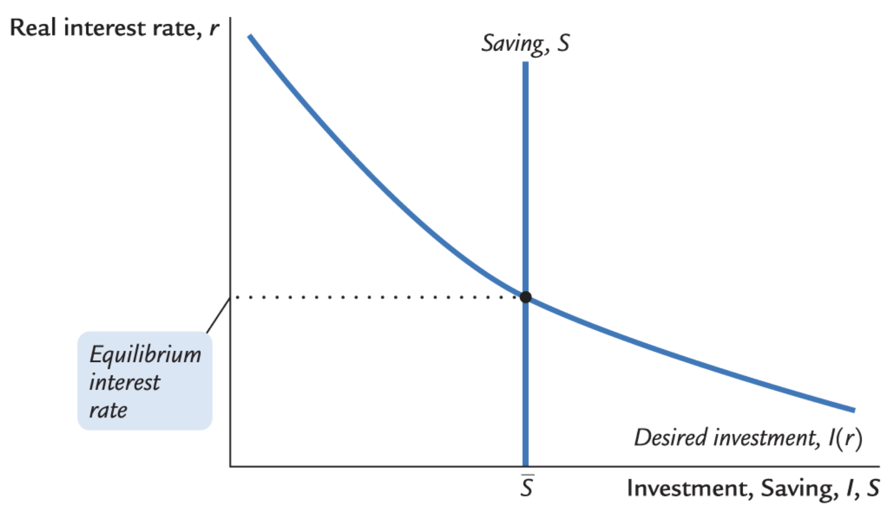
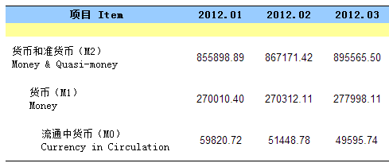
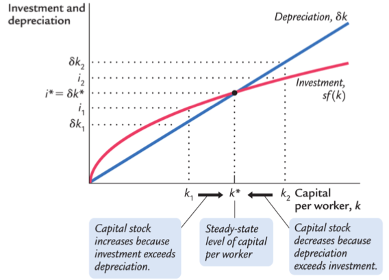
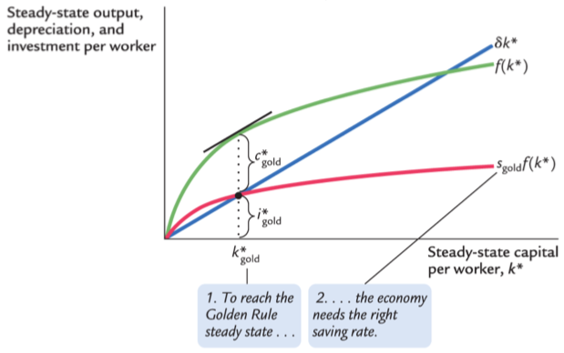
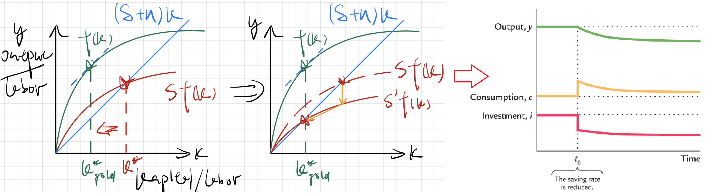

# 宏观经济指标

## *GDP*

### 看待GDP的三种方式

国内生产总值 Gross domestic product GDP 常常被认为是对经济表现状况的最佳衡量指标。在中国由国家统计局发布，在美国由商务部下属经济分析局 Bureau of Economic Analysis 发布

GDP的目的是用一个代表了某一给定时期经济活动的货币价值的单一数字来汇总所有数据。看待这一统计数字有三种方式

* Output：GDP的精确定义是**国内生产总值是给定时期的经济内domestic 市场生产的所有最终产品和服务的市场价值**，即在一定时间内生产了多少final goods
* Income：把GDP看作是domestic经济中所有人的总收入（domestic包含了属于本国和外国的capital 和 labor） $Y=wL+rK$
* Expenditure：把GDP看作是在经济的产品和服务的产出上的总支出 $Y=C+I+G+NX$。统计局一般都是用expenditure来计算GDP的，因为它最方便获取数据和进行计算

这两种看待方式是完全等价的，因为等于整个经济来说，收入必定等于支出

### GDP计算规则

为了理解GDP的定义是如何应用的，需要给出一些经济学家在构建这个统计数字时所遵循的一些规则

* 为了计算不同产品的服务的总价值，国民收入核算使用市场价格，因为市场价格反应了人们为产品或服务的支付意愿
* 二手货 Used goods 的出售不包括在GDP中，因为GDP衡量现期生产的产品与服务的价值。二手货的出售反应了资产的转移，并不是经济中收入的增加
* 存货 Inventories：当一家企业增加其产品的存货时，这种存货投资作为企业所有者的支出来计算，因此会增加GDP。然后出售存货不会影响GDP。这种处理存货的方式确保了GDP反映了经济中产品与服务的现期生产
* 中间产品 Intermediate goods：许多产品是分阶段生产的，GDP只包括最终产品 final goods 的价值，不会对中间价值进行重复计算
* 估算价值 Imputation：尽管大部分产品与服务都按照其市场价格来计算，但有很多产品不在市场上销售，也就不会有市场价格，若GDP要包括这些产品与服务的价值，我们就必须对其i进行价值估算
  * 估算对决定住房的价值很重要。自有房也会被估算租金，视为房主为自己支付的租金
  * 对于政府服务，公务人员的工资被用来衡量其产出的价值
  * 地下经济 Underground economy 中销售的产品和服务的价值是不会被估算的

GDP是不完美的指标，因为对GDP的计算是不可能完全精确的，必然会有很多的多算或少算。但只要这些不完美的程度随着时间的推移保持**相当的稳定**，那么GDP对经济活动的逐年比较就是有用的

### 支出的组成部分

$$
Y=C+I+G+NX
$$

国民收入核算把GDP分为四大类支出：消费 $C$、投资  $I$ 、政府购买 $G$ 和净出口 $NX$，上式称为国民收入核算恒等式 National income accounts identity

* 消费 cosumption 由家庭在产品与服务上的支出构成
  * 产品 goods 是有形的东西
    * 耐用品 durable goods 是持续时间长的产品
    * 非耐用品 nondurable goods 是持续时间短的产品
  * 服务 srevices 是无形的东西
* 投资 investment 由为未来使用而购买的产品构成。经济的投资并不包括在不同个体之间的重新配置资产的购买，而是创造了新的资本和生产资料
  * 企业固定投资 business fixed investment 也称为非住房固定投则，是企业对新建筑物、设备和知识产权产品的购买
  * 住房固定投资 residential fixed investment 是家庭和房东对新住房的购买
  * 存货投资 inventory investment 是企业产品存货的增加
* 政府购买 government purchases 是政府购买的产品和服务。注意社保和福利等再分配不属于GDP
* 净出口 net exports 是与其他国家的贸易

### 收入的其他衡量指标

* 国民生产总值 Gross **National** Product GNP

  * GNP = GDP + 来自国外的要素报酬 - 支付给国外的要素报酬
  * GNP衡量一国居民所赚取的总收入

* 国民净产值 Net National Product NNP

  * NNP=GNP-折旧
  * 折旧 Depreciation 被称为固定资本的消耗 consumption of fixed capital
  * 由于折旧是生产经济中的产出的成本，所以减去折旧后的值表示经济活动的净结果

* 国民收入 National Income 

  * NI是近似于NNP的另一个衡量指标，两者的差别只有被称为统计误差 statistical discrepancy 的小矫正。这种统计误差的产生是由于不同的数据哀怨可能并不是一直的

  * 国民收入衡量经济中的所有人一共赚了多少钱。国民收入核算把国民收入分成六个部分，划分标准是谁赚到了收入

    * 雇员报酬 compensation of employees：工人赚到的工资和福利津贴

    * 业主收入 properties' income：小农场、夫妻店和合伙企业等非公司型企业的收入

    * 租金收入 rental income：房东得到的收入（包括房主向自己“支付”的租金）减去折旧等支出

    * 公司利润 corporate profits：公司在向工人和债权人支付报酬后的收入

    * 净利息 net interest：国内企业支付的利息减去它们得到的利息，加上从外国人那里赚到的利息

    * 生产和进口税 taxes on production and imports：企业的某些税收减去冲抵的企业补贴

* 个人收入 Personal income

  * 个人收入 = 国民收入 - 生产和进口税 - 公司利润 - 社会保险费 - 净利息 + 股息 + 政府对个人的转移支付 + 个人利息收入
  * 个人可支配收入 Disposable Personal Income = 个人收入 - 个人税收

### 实际GDP vs. 名义GDP

经济学家把用**现期价格**衡量的产品与服务的价值叫做名义GDP nominal GDP，名义GDP的增加可能是由于数量增加，也有可能是由于价格上升，单纯的价格上升对衡量经济增长没有什么价值。因此这种GDP计算方式不是衡量经济福利的最优指标

更好的经济福利衡量指标将计算经济中产品与服务的产出，他们不受价格变动的影响，因此经济学家使用实际GDP。实际GDP使用一组**不变价格**，即基年 base year 的数据衡量的价值与服务的价值，即实际GDP表明若**数量变化而价格不变**时对产出的支出有什么变动。**计算实际GDP需要提供基年数据 Base-year prices**

### GDP平减指数 Deflator

GDP平减指数 GDP deflator，又被称为GDP的隐形价格平减指数 Implicit price deflator，定义为名义GDP与实际GDP的比率
$$
Deflator=\frac{Nominal\ GDP}{Real\ GDP}
$$
实际GDP是从名义GDP剔除了通货膨胀的部分

### 实际GDP的链式加权衡量

如何选择基年数据对测算实际GDP有着重要作用，链式加权测度 chain-weighted 确保了用来计算实际GDP的价格永远不会过于陈旧。在chain-weighted中，基年会随时间的推移不断变化

下面给出两个用百分比进行运算的tips，用 $P$ 表示GDP平减指数，$Y$ 表示实际GDP

* $P\times Y$ 的百分比变动 $\approx$ $P$ 的百分比变动 + $Y$ 的百分比变动
* 一个比率的百分比变动近似地等于分子的百分比变动减去分母的百分比变动

## *CPI*

### CPI介绍

价格总体水平的上升称为通货膨胀 inflation，价格水平从一个时期到下一个时期的百分比变化称为通货膨胀率 inflation rate

最常用的价格水平衡量指标是**消费者价格指数 Consumer Price Index CPI**，在美国是由劳工统计局负责计算的。在中国称为居民消费价格指数，由国家统计局进行计算

计算CPI需要收集成千上万种产品和服务的价格，正如GDP把许多产品与服务的数量变成衡量生产的价值的单一数字一样，**CPI把许多产品与服务的价格变成衡量价格总体水平的单一指数**

### 一篮子产品价格

统计局通过计算一个典型的消费者所购买的一篮子产品与服务 a basket of goods 的价格模型来对不同的产品及服务进行加权计算

和实际GDP一样，CPI是这一篮子产品与服务的价格相对于同一篮子产品与服务在某个基年的价格的比值

比方说消费者每月只购买3个梨和6个香蕉，那么以2019年作为基年，今年的CPI为
$$
CPI=\frac{3\times P_p+6\times P_b}{3\times P_{p,2017}+6\times P_{b,2017}}
$$
其他的重要价格指数

* 另外一个重要的价格指数是**生产者价格指数 Producer Price Index PPI**。它衡量企业而不是消费者购买的典型一篮子产品的价格
* 除此之外统计局还会计算衡量不包括食物和能源产品的消费者篮子的价格增长指数：核心通货膨胀 Core Inflation。由于食物和能源产品的短期波动性比较大，所以core inflation有时候被认为是一个更好地衡量当前通膨趋势的指标

### 对三种通膨指数的比较：CPI vs. GDP平减指数 vs. PCE平减指数

CPI vs. GDP deflator

* GDP deflator 衡量生产出来的所有产品于服务的价格，而CPI衡量的只是消费者购买的产品与服务的价格。因此企业或政府的支出会反映在GDP deflator上，而不会反映在CPI中
* GDP deflator 只包括domestic production，进口品不是GDP的一部分，因此就不会反映在GDP deflator上，但消费者是可以选择购买任意国家的产品的，因此进口产品可能属于一篮子产品中的一部分，其价格变化会影响CPI
* 两个指数对经济中许多价格加总的方法存在差异。具体来说CPI是一个 Laspeyres Index，它倾向于夸大价格上涨对消费者的影响；而GDP deflator是一个 Passasche Index，它倾向于低估价格上涨对消费者的影响

Price Index的比较

* Paasche Index 帕氏指数：一篮子可变产品计算的价格指数。GDP deflator是帕氏指数的一类
  $$
  P_t^P=\frac{\sum\limits_{i=1}^{n}{\left(p_{i,t}\cdot Q_{i,t}\right)}}{\sum\limits_{i=1}^{n}{\left(p_{i,0}\cdot Q_{i,t}\right)}}
  $$

* Laspeyres Index 拉式指数：一篮子固定产品计算的价格指数。CPI是拉式指数的一类
  $$
  P_t^L=\frac{\sum\limits_{i=1}^{n}{\left(p_{i,t}\cdot Q_{i,0}\right)}}{\sum\limits_{i=1}^{n}{\left(p_{i,0}\cdot Q_{i,0}\right)}}
  $$

个人消费支出 Personal Consumption Expenditures PCE 的隐形价格平减指数

### CPI反应通膨的准确度

CPI不是完全准确的，但和GDP一样，只要它长期保持稳定就能作为一个重要的参考数据

## *失业率*

失业率是衡量**想要工作的人**中没有工作的人所占比例的统计数字

### 家庭调查

### 机构调查

# 古典理论描述长期中的经济：国民收入

货币在经济中的循环流程图

## *产品与服务的总生产*

生产要素和生产函数共同决定了产品与服务的供给量，而产品与服务的供给量又等于经济的产出

### 生产要素

生产要素 Factors of production 是用于生产产品与服务的投入。两种最重要的生产要素是资本和劳动。资本 $K$ 是工人使用的工具集合，而劳动是人们用于工作的时间 $L$。用 $\overline{K}$ 和 $\overline{L}$ 来表示固定量

暂时假设生产要素得到了充分利用，也就是说没有资源浪费。在现实中，一部分劳动力会失业，一些资本会被闲置

### 生产函数

可使用的生产技术决定了给定数量的资本和劳动能够生产多少产出，用生产函数 production function 来表示这种关系
$$
Y=F(K,L)
$$

## *什么决定了产品与服务需求*

假设一个封闭经济 close economy，即一个不与其他国家进行贸易往来的国家，这样净出口就总是0。因此GDP的可以表示为扣除了贸易的国民收入衡算恒等式：$Y=C+I+G$

### 消费

家庭从他们的劳动和资本所有权中得到收入，然后向政府纳税。纳税后的可支配收入用于消费和储蓄

可支配收入 disposable income $Y-T$：支付了所有税收之后的收入

假设消费水平直接取决于可支配收入水平。可支配收入越高，消费也越多，因此有消费函数 consumption function。消费函数是可支配收入的函数
$$
C=C\left(Y-T\right)
$$
用边际消费倾向 marginal propensity to consume 来衡量将可支配收入用于消费的比例，剩余的用于储蓄

### 投资

企业购买投资品是为了增加它们的资本存量和替代现有的资本损耗

投资品的需求量取决于利率 interest rate，**利率衡量了为投资而融资的资金成本**。用 $I=I(r)$ 方程来表示投资与实际利率关系

利率主要在三个方面存在差异：期限 term（短期or长期）、信贷风险 credit risk、税收待遇 tax treatment

### 政府购买

政府购买 $G$ 等于税收减去转移支付 $T$。若二者相等，则政府有平衡的预算 balanced budget；若 $G>T$，则政府有预算赤字 budget deficit，要通过发行政府债券从金融市场上借款要为这种赤字融资；若 $G<T$，政府就有预算盈余 budget surplus 来偿还未清偿债务

## *什么使产品与服务的供给和需求达到均衡？*

改写上面的收入支出恒等式
$$
Y=C+I+G\\C=C\left(Y-T\right),\ I=I(r),\ G=\overline{G},\ T=\overline{T}\\\overline{Y}=C\left(\overline{Y}-\overline{T}\right)+I(r)+\overline{G}
$$
上式中除了利率都是固定的，因此**利率是在实现供给与需求均衡中起到重要作用的价格**

### 金融市场的均衡：可贷资金的供给和需求

改写封闭经济的国民收入核算恒等式
$$
Y-C-G=I
$$
左边这一项是满足了消费者和政府需求后剩余的产出，称为国民储蓄 national saving，或简称储蓄 savings $S$。上面的等式表明，储蓄等于投资

可以把国民储蓄分为两部分 -- 私人部分储蓄 + 政府部门储蓄
$$
S=\underbrace{\left(Y-T-C\right)}_{private\ saving}+\underbrace{\left(T-G\right)}_{gov\ saving}=I
$$
左边是可支配收入减去消费，即私人储蓄 private saving。右边是政府收入减去政府支出，即公共储蓄 public saving，若政府支出大于政府收入，就变成了负数赤字

为了方便处理，上图中暂时假设储蓄不取决于投资（实际上关系是很大的）。储蓄和投资的关系可以用供给需求关系来解释，在这种情况下，产品是**可贷资金 loanable funds**，其价格则是利率。储蓄是可贷资金的供给，即家庭把储蓄贷给银行，通过银行又间接把钱贷给投资者，或者通过购买股票和债券的方式直接贷给投资者

### 储蓄的变动：财政政策的效应

* 政府购买的增加必定伴随着投资的等量减少，因为可支配收入 $Y-T$ 不变，所以消费 $C$ 也不变。而为了使投资减少，利润必然上升。称政府购买挤出 crowd out 了投资
* 减税挤出投资并提高了利率，因为减税会提高可支配收入，从而增加了消费

### 投资需求的变动

* 技术创新
* 政府通过税法激励或抑制投资

# 货币系统

宏观经济政策的两大支柱是货币政策和财政政策

* 货币政策 Monetary policy：关于一国硬币、通货和银行体系的决策，一般由中央银行制定
* 财政政策 Fiscal policys：政府关于支出和税收的决策，由立法或行政机构制定

## *什么是货币*

### 货币的职能

货币 Money/Währung 是可以很容易地用于交易的资产存量，公众手中的货币构成一国的货币存量

* 价值储藏手段 store of value：货币是一种把购买力从个现在转换到未来的方式
* 计价单位 unit of account：货币提供了人们标记价格和记录债务的单位
* 交换媒介 medium of exchange
  * 货币是人们用于购买产品于服务的东西，它使更为复杂的交易称为可能
  * 一种资产可以转变为交换媒介和用于交换其他东西（产品、服务或资本资产）的容易程度被称为该资产的流动性 liquidity。由于货币是交换媒介，它是经济中流动性最高的资产

### 货币的类型

* 法币 fiat money：没有内在价值的货币称为法定货币，简称法币，因为它是由政府的规定或法令确定为货币的
* 商品货币 commodity money
  * 历史上大部分社会都曾把有某种内在价值的商品作为货币，这些货币称为商品货币
  * 最普遍的商品货币是黄金，当人们把黄金作为货币时，该经济被认为是在实行金本位制 gold standard

### 控制货币量

一个经济中可用的货币量称为货币供给 money supply。在一个商品货币体系中，货币供给就是那种商品的数量

在当今的大多数经济中，都由政府来控制货币供给，法律约束赋予了政府发行货币的垄断权力。货币供给和税收一样都是政府的重要政府工具，这种控制被称货币政策

在大多数国家，货币政策会被委托给中央银行 central bank 制定。美国的中央银行是美联储 Federal Reserve (Fed)，中国的中央银行是中国人民银行

> **货币政策**（英语：Monetary policy）是一个国家或是经济体的[货币](https://zh.wikipedia.org/wiki/貨幣)权威机构（多数国家由央行来执行）利用控制[货币供给量](https://zh.wikipedia.org/wiki/貨幣供應量)，来达到影响其他经济活动所采取的措施。主要手段包括：调节基准利率、调节商业银行保证金、[公开市场操作](https://zh.wikipedia.org/wiki/公开市场操作)。
>
> 利率、信用、资产价格等一系列受货币政策影响的变化，最终导致就业率、生产量的变化的过程，称为**货币政策传导机制**。一般而言，货币政策的主要目的是防止通货膨胀。-- wikipedia

### 货币量的衡量

货币是用于交易的资产的存量，所以货币量是衡量资产的数量（货币本身是没有价值的）

* 现金货币：货币量中的最显而易见的资产是通货 currency，即未清偿的纸币与硬币之和，大多数日常交易使用通货作为交换媒介
* 存款货币：活期存款 demand deposits 是人们在自己的储蓄账户上持有的资金

以**金融资产流动性**的大小作为标准，并根据自身政策目的的特点和需要，进行货币供给量的层次划分。中国货币的供应量表格分为 M0、M1和M2

* M0是流通中货币
* M1是狭义货币 narrow money = M0+可开支票进行支付的单位活期存款
* M2是广义货币 broad money = M1＋居民储蓄存款＋单位定期存款＋单位其他存款＋证券公司客户保证金
* 还可以有M3 = M2+金融债券 + 商业票据 + 大额可转让定期存单等，M3是根据金融工具的不断创新而设置的，中国暂未设立

## *银行在货币系统中的作用*

货币供给不仅由中央银行的政策决定，而且由家庭（持有货币）和银行的行为共同决定
$$
M=C+D
$$
M代表货币供给，C代表通货，D代表活期存款

### 百分之百准备金银行制度

银行收到的但没有贷放出去的存款称为准备金 reserves。一些准备金存放在全国各地银行的金库中，但大部分存放在该国的中央银行中

若银行只是接受存款，把货币作为准备金，直到储户提款或依据余额签发支票为止，这种系统称为百分之百准备金银行制度 100-percent-reserve banking 

可以使用资产负债表 balance sheet 来标识所有的资产和负债情况

### 部分准备金银行制度

部分准备金银行制度 fractional-reserve banking：银行只把部分存款都作为准备金，其余部分放贷收取利息

存款准备金率 reserve-deposit ratio 是存款中用作准备金的比率，一般都是存在中央银行内

通过借贷，部分准备金银行会创造货币，增加货币供给。货币的创造不局限于单次，而是每经过一方向外放贷，货币供给量就会增加一次

**银行体系创造货币的能力是银行与其他金融机构之间的主要差别**。金融市场的重要职能是把经济中的资源从储蓄转移到投资，这个过程被称为金融中介化 financial intermidiation。虽然股票、债券市场也可以有金融中介化的作用，但只有银行合法的增加货币供给

当然部分准备金银行创造了货币，但并没有创造创富，因为债务也同时被创造了，所以创造货币的过程知识增加了经济的流动性，并没有增加经济的财富总量

### 银行资本、杠杆和资本要求

开办银行要有资本方面的要求，也就是说银行的所有者必须有一些金融资源才能开业，这些资源被称为银行资本 bank capital

杠杆率 leverage ratio：银行的总资产与银行资本之比，下面的负债表中的杠杆率为 $1000/50=20$。这意味着银行所有者每投入1美元资本，银行能拥有20美元的资产，也就是有19美元的存款和债务

由于杠杆率的存在以及法律保障储户和债券持有者优先偿付，所以银行资产的下降将令银行资本快速下降，但银行资产少于其债务时，银行资不抵债

为了提高银行的抗风险能力，比如严重的流动性风险 Liquidity risk，各国央行都对银行有存款准备金的规定。超出央行规定的称为超额准备金 excess reserve

## *中央银行如何影响货币供给*

### 货币供给模型

考虑一个部分准备金银行制度下的货币供给，需要考虑美联储、银行和家庭决策之间的相互作用，即美联储关于创造多少美元的决策、银行关于将存款作为准备金持有还是作为贷款放贷的决策、家庭关于将他们的货币以通货还是活期存款的形式持有的决策

考虑该模型的三个外生变量

* 基础货币 monetary base $B$：是公众以通货形式持有的美元 $C$ 和银行以准备金形式持有的美元 $R$ 的总量，由中央银行直接控制
* 存款准备金率 reserve-deposit ratio $rr$：是银行持有的准备金占存款的比例 $rr=R/D$，由银行的经营政策和监管银行的法律决定
* 通货存款比 currency-deposit ratio $cr$：是人们持有的通货量 $C$ 对其活期存款量 $D$ 的比例 $cr=C/D$，它反映了家庭对其希望持有的货币形式的偏好

$$
\left\{\begin{array}{l}M=C+D\\B=C+R\end{array}\right.\Rightarrow\frac{M}{B}=\frac{C+D}{C+R}=\frac{C/D+1}{C/D+R/D}\\\xrightarrow{cr=C/D,\ rr=R/D}M=\frac{cr+1}{cr+rr}\times B,\ \frac{cr+1}{cr+rr}\triangleq m
$$

从上式可以看出，货币供给量是与基础货币成比例的，将比例 $m=\frac{cr+1}{cr+rr}$ 称为**货币乘数 money multiplier**。因为1美元基础货币能产生 $m$ 美元货币，即基础货币对货币供给量是有乘数效应的，所以基础货币有时被称为**高能货币 high-powered money**

增加货币供给

* 存款准备金 $rr$ 越低，银行发放的存款就越多，银行也就能创造出更多的货币，也就增加了货币供给
* 通货存款比 $cr$ 越高，$m$ 越趋近于1，公众持有的通货也就越少，银行的准备金越多，能创造的货币也就越多

### 中央银行的货币政策工具

* 改变基础货币
  * 公开市场操作 open market operations 是指中央银行凭借自己的资金实力，在公开市场买进或卖出各种有价证券，从而增加和减少商业银行的超额准备金，以达到控制市场上的基础货币供应量和市场利率的目的
  * 中央银行扮演最后贷款人 lender of last resort，以贴现率 discount rate（央行给其他银行贷款的利率）贷款给其他银行，来满足银行对于满足准备金率等的需求。贴现率越低，银行在央行的贴现窗口 discount window 借的钱也就越多，因此贴现率的下降会增加基础货币和货币供给
* 改变准备金率从而影响
  * 上修法定准备金率会降低货币乘数和货币供给
  * 2008年后Fed推出了准备金利息 interest on reserves。有些国家是对全部准备金支付利息，有些对超额准备金不支付利息

## *量化宽松与量化紧缩/缩表*

# 通货膨胀

## *货币数量论*

货币数量论 quantity theory of money 是有关货币在长期影响经济的最重要的解释。货币量决定价格水平，货币量增长决定了通货膨胀率

### 交易与数量方程

货币也是存在供给与需求关系的，上一节中描述了货币的供给，现在描述货币的需求。

货币数量论的起点是人们为了购买产品与服务而持有货币这一见解。他们为进行这样的交易所需要的货币越多，他们持有的货币也就越多。因此经济中的货币量与交易中交换的美元量相关

交易与货币之间的关系可以表示为数量方程 quantity equation，其中M是货币量，V称为货币的交易流通速度 transactions velocity of money，它衡量货币在经济中流通的速度；T表示某一时期内的交易总数，P是一次典型交易的价格
$$
货币\times货币流通速度=价格\times交易量\Leftrightarrow MV=PT
$$

### 从交易到收入

数量方程中的 T 交易次数是难以衡量，因此用经济中的总产出 Y 来替换

这个替换是合理的，因此交易与产出虽然不是相同的，但是是相关的，因为总体来说经济生产得越多，买卖交易的产品也就越多

当替换成Y后，$Y$ 是实际GDP，$P$ 是GDP deflator，$PY$ 表示的就是名义GDP。由于 $Y$ 也是总收入，这个形式的数量方程中的 $V$ 也被称为货币的收入流通速度 income velocity of money

### 货币需求函数和数量方程

实际货币余额 rea money baances $M/P$：把货币量表示成它可以购买的产品与服务的数量

货币需求函数 money demand function 是一个表明人们希望持有的实际货币余额数量的决定因素的方程。其中 $k$ 是常数，它告诉我们对与一单位货币的收入，人们想要持有的货币是多少
$$
\left(M/P\right)^d=kY
$$

### 货币流通速度不变的假设简化分析

货币数量论 quantity theory of money = 数量方程 + 货币流通速度不变假设

货币流通速度不变假设只是现实的一种简化，但在很多分析中很有用。其实可以得到结论货币数量 M 的变动必定会引起名义GDP $PY$ 的同比例变动
$$
M\overline{V}=PY
$$

### 经济中的长期价格水平：货币、价格和通胀

经济的生产能力决定实际GDP，货币量决定名义GDP，而GDP deflator是名义和实际GDP的比值

1. 生产要素和生产函数决定产出 $Y$，也就是实际GDP
2. 中央银行设定的货币供给 $M$ 决定产出的名义价值 $PY$
3. 价格水平 $P$ 是产出的名义价值 $PY$ 与产出 $Y$ 的比例

**货币数量论意味着：价格水平与货币供给成比例**

该价格水平理论也是一个通膨理论。用百分比变动的形式表示数量方程
$$
\%\Delta M+\%\Delta V=\%\Delta P+\%\Delta Y
$$

* $\%\Delta M$ 货币量变动由中央银行控制
* $\%\Delta V$ 货币流通速度变动反应货币需求的移动，当然在货币流通速度不变假设中为 $\%V=0$
* $\%\Delta P$ 是通货膨胀率
* $\%\Delta Y$ 产出变动取决于生产要素的增长和技术进步

## *政府从发行货币得到收益：铸币税*

为什么中央银行要大量增加货币供给？因为政府自身就要支出货币来换取某些服务，比如为政府工作人员提供薪水、提供社会福利等。政府有三种方法来进行融资

* 税收
* 出售政府债券向公众借贷
* 发行货币

通过发行货币筹集的收入称为货币铸造税 seigniorage。这个词汇来源于法语 seigneur，一个意为“封建领主”的法语词。在中世纪，封建领主拥有在自己的领地铸造货币的排他性权利，今天这种权利属于中央政府，它是一项收入来源

>铸币税指发行货币的组织或国家的政府，享有货币发行面值减去发行成本后，换取实际经济资源的利益，从中攫取发行货币所产生的特定收益。这部分由货币发行主体垄断性地享受“通用货币面价值超出生产成本”的收益，就被定义为铸币税 -- wikipedia

当政府发行货币来融资时，它增加了货币供给，得到了新货币供自己使用。而货币供给的增加是有副作用的，根据货币数量论，它会引发通货膨胀。**发行货币筹集收入就像征收一种通货膨胀税 inflation tax**。因为随着通膨，个人持有的货币的购买力是在下降的，这和税收降低了人们持有的货币量是一样的，因此本质上，通膨就是在对持有的货币征收的税

通过发行货币能够筹集到的收益在各国之间的差别是很大的

## *通货膨胀与利率*

### 实际利率与名义利率

* 名义利率 nominal interest rate：银行支付的利率
* 实际利率 real interest rate：购买力的增加

用 $i$ 代表名义利率，$r$ 代表实际利率，$\pi$ 代表通货膨胀率，那么这三个变量之间的关系为下式，也就是说实际利率 = 名义利率 - 通膨率。重新整理可以得到费雪方程 Fisher equation
$$
r=i-\pi\\Fisher\ equation:i=r+\pi
$$

费雪方程名义利率可以由两个原因而发生变动：实际利率变动或通膨变动

费雪效应 Fisher effect：根据 Fisher equation，通胀率%1的上升会引起名义利率1%的上升。通膨率和名义利率之间这种一对一的关系称为费雪效应 Fisher effect

### 事前与事后利率

## *名义利率与货币需求*

### 持有货币的成本

### 未来货币与现期价格

## *通货膨胀的社会成本*

### 外行观点和古典理论的反应

### 预期的通货膨胀的成本

### 未预期到的通货膨胀的成本

# 开放经济

## *资本和产品的国际流动*

### 净出口的作用

### 国际资本流动和贸易余额

### 双边贸易余额的无关紧要性

## *小型开放经济中的储蓄与投资*

### 资本的流动性与世界利率

### 模型

### 政策如何影响贸易余额？

### 评价经济政策

## *汇率*

### 名义与实际汇率

### 实际汇率和贸易余额

### 实际汇率的决定因素

### 政策如何影响实际汇率？

### 贸易政策的影响

### 名义汇率的决定因素

### 购买力平价特例

# 失业

## *失去工作，寻找工作，以及自然失业率*

## *工作搜寻和摩擦性失业*

### 摩擦性失业的原因

### 公共政策与摩擦性失业

## *实际工资刚性与结构性失业*

### 最低工资法

### 工会和集体议价

### 效率工资

# 超长期经济：经济增长

研究经济增长的模型称为索洛增长模型 Solow growth model 的经济增长理论

## *资本积累与发展稳态*

Solow增长模型的设计是为了说明在一个经济中，资本存量的增长、劳动力的增长和技术进步之间如何相互作用，以及它们如何影响一国产品与服务的总产出。第一步是考察产品的供给和需求如何决定资本积累。在第一步中，假设劳动力和技术是固定不变的

### 模型

考虑一个长期的封闭经济，input和output的price都是可以改变的

* Solow模型中产品的供给是基于生产函数的，生产函数是指，产出取决于资本存量和劳动力
  $$
  Y=F(K,L)
  $$

* Output被用来消费和投资，其中投资相当于储蓄 saving，$s\in[0,1]$ 为储蓄率 saving rate，
  $$
  Y=C+I=C+sY
  $$

* 

生产函数的性质

* Solow增长模型假设生产函数具有规模不变报酬
  $$
  F(\lambda L,\lambda K)=\lambda F(L,K),\ \forall\lambda>0
  $$

* Positive but decreasing marginal products 也就是说 strictly concave
  $$
  \frac{\partial F}{\partial L}>0,\ \frac{\partial^2F}{\partial L^2}<0\\\frac{\partial F}{\partial K}>0,\ \frac{\partial^2F}{\partial K^2}<0
  $$

* Inada-conditions
  $$
  \lim\limits_{L\rightarrow0}{\left(\frac{\partial F}{\partial L}\right)}=\lim\limits_{K\rightarrow0}{\left(\frac{\partial F}{\partial K}\right)}=\infty\\\lim\limits_{L\rightarrow\infty}{\left(\frac{\partial F}{\partial L}\right)}=\lim\limits_{K\rightarrow\infty}{\left(\frac{\partial F}{\partial K}\right)}=0
  $$

Intensive form: representation in per-worker terms：因为有规模报酬不变假设，所以可以进行如下转换
$$
\frac{Y}{L}\triangleq y=F\left(\frac{L}{L},\frac{K}{L}\right)=F(1,k),\ k\triangleq\frac{K}{L}\Rightarrow y=f(k)
$$

### 资本存量的增长与稳态

人口增长：在任意时间段 $t$，劳动力以恒定速率 $n$ 变化
$$
L_{t+1}=\left(1+n\right)L_t
$$
Capital accumulation：资本存量可以随时间变动，而这些变动会引起经济增长。投资 investment 和折旧 depreciation会影响资本存量，$\delta$ 称为折旧率
$$
K_{t+1}=K_t+sY_t-\delta K_t
$$
可以把上面的资本积累公式改写成intensive form
$$
\frac{L_{t+1}}{L_{t+1}}\frac{K_{t+1}}{L_k}=K_t+sY_t-\delta K_t\Rightarrow(1+n)k_{t+1}=k_t+sf(k_t)-\delta k_t
$$
存在单一的资本存量 $k^*$ 使得投资量等于折旧量，这个状态称为稳态 steady state。稳态代表了经济的长期均衡。Solow模型表明，储蓄率是稳态资本存量的关键决定因素
$$
k^*=k_t=k_{t+1}\\(1+n)k^*=k^*+sf(k^*)-\delta k^*\Rightarrow sf\left(k^*\right)=\left(\delta+n\right)k^*
$$

注意：上图中没有把人口增长 $n$ 算进去，但是也只是对直线斜率的修正，大致上图像是一样的

## *Golden Rule*

### Optimization problem

Solow模型从经济福利，也就是最大化消费的角度来看待最优的资本积累量。政策制定者的目的是使组成社会的个体的福利最大化，因此他会选择消费水平最高的稳态，使消费最大化的稳态 $k$ 值倍称为资本的黄金律水平 Golden Rule level of capital，记为 $k_{gold}^*$

注意：下图中没有把人口增长 $n$ 算进去，但是也只是对直线斜率的修正，大致上图像是一样的

这是一个优化问题，优化目标是最大化消费。在任意时间 $t$，单位工人的消费为weiguan
$$
c_t=(1-s)y_t=f(k_t)-sf(k_t)
$$

* 因为此时处于黄金律稳态，所以稳态条件 $sf\left(k^*\right)=\left(\delta+n\right)k^*$ 成立，因此上式可以改写为
  $$
  \max\limits_{k^*}{c^*=f(k^*)-\left(\delta+n\right)k^*}
  $$

* 只有在output函数和损耗函数的斜率相同时可以取到最值，因此黄金律稳态要满足下面 $k$ 的条件
  $$
  f'\left(k_{gold}^*\right)=\delta+n
  $$

### 向黄金律稳态的过渡

假定经济已经达到了一个不同于黄金律稳态的稳态，现在分析从当前稳态向黄金律稳态过渡时，消费、投资和资本发生的变动以及在这种变动的影响下，变动到黄金律稳态是否是值得的

* Starting with too much capital per worker: Dynamic inefficiency

* Starting with too little capital per worker: Dynamic efficiency

## *人口增长*

### 人口增长的影响

### 关于人口增长的其他观点

## *Solow模型中的技术进步*

### Model extension

引入劳动效率 efficiency of labor 的概念对生产函数进行改造
$$
Y=F(K,L\times E)
$$
劳动效率被认为反应了社会拥有的关于生产方法的知识，$L\times E$ 可以被解释为工人的有效数量 effective number of workers

关于技术进步最简单的假设是，它引起劳动效率 $E$ 以某种不变的速率 $g$ 增长，这种形式的技术进步被称为劳动改善性 labor augmenting。结合劳动力的增长速度和技术进步，有效工人的数量按 $(n+g)$ 增长

### 促进增长的政策

# 短期经济：经济周期理论

## *总需求与总供给*

### 经济周期

经济学期把产出与就业的短期波动称为经济周期 business cycle

什么决定经济低迷程度严重到被确定为衰退 recession 的程度是没有一个简单的评判标准的

奥肯定律 Okun's law：失业率的上升应该与实际GDP的下降相联系。Okun's law 提醒我们：GDP的长期增长主要由技术进步决定，但GDP的短期运动与经济的劳动力使用情况密切相关

### 为什么要将宏观经济学的时间范围划分为短期和长期？

短期与长期之间的关键差别是价格行为。在长期，价格是有灵活性的，能对供给或需求的变动做出反应；而短期，许多价格是粘性的，国定在某个水平上。由于价格在短期和长期有不同的行为，所以各种经济时间和政策在不同时间范围中有不同的影响

比如在长期，货币政策对整体经济是有影响的，但在短期内，许多价格并不对货币政策作出反应

### 总需求与总供给模型

总需求 aggregate deman AD 是产出需求量与价格总体水平之间的关系。即AD告诉我们，在任何给定的价格水平人们想购买的产品与服务的数量

## *IS-LM模型*

IS-LM model是对凯恩斯理论的主流解释，这个模型的目的是说明给定一个给定的价格水平，说明决定了国民收入

### Keynesian cross 凯恩斯交叉

$$
PE=C+I+G
$$

# 政府债务和预算赤字

## *政府债务的规模*

## *衡量问题*

## *传统的政府债务观点*

## *李嘉图学派的政府债务观点*

## *关千政府债务的其他观点*

### 平衡预算 vs. 最优财政政策

### 财政状况对货币政策的影晌

### 债务与政治过程

### 国际维度

# 金融系统

## *金融系统是做什么的？*

### 为投资融资

### 风险分担

### 处理不对称信息

### 促进经济增长

## *金融危机*

### 危机剖析

### 对危机的政策反应

### 预防危机的政策