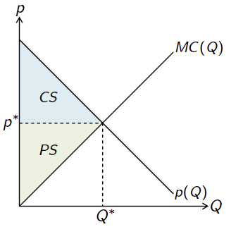

# 经济学十大原理

* 人们如何做出决策
  * 人们面临权衡取舍
  * 机会成本 Opportunitiy Cost
  * 理性人考虑边际量
  * 人们会对激励做出反应
* 人们如何相互影响
  * 贸易可以使每个人的状况都变得更好
  * 市场通常是组织经济活动的一种好方法
  * 政府有时可以改善市场结果
* 整体经济如何运行
  * 一国的生活水平取决于它生产物品与服务的能力
  * 当政府发行了过多货币时，物价上升
  * 社会面临通货膨胀与失业之间的短期权衡取舍

# 消费者行为

## *市场*

### 最优化和均衡

在解释人们的行为时，我们需要一个能让我们的分析立足于其上的架构 Framework，在经济学的大部分内容中，我们使用基于下列两条基本原理的架构

* 最优化原理 The optimization principle：人们选择能支付得起的最优消费模式
* 均衡原理 The equilibrium principle：价格调整到人们对某商品的需求量等于供给数量时为止
  * 均衡的概念在不同模型中可能是不同的。在更一般的模型中，均衡的一般性定义为均衡要求经济人 economic agents 的行为彼此应该一致

### 需求曲线与供给曲线

保留价格 Reservation price：保留价格是一个人为某样商品愿意支持的最高价格，即某人愿意接受的最高价格但仍以改价格购买某商品

也可以说，低于该价格水平时，买或不买对于他来说是**无差异的 indifferent**。低于保留价格时，他既可以选择买也可以选择不买，对他来说没有区别，但商品价格高于保留价格时，只剩下一个选择：不购买

需求曲线用来表征商品需求和其保留价格之间的关系；而供给曲线则用来表征市场可以提供的商品与其价格之间的关系

### 市场均衡

均衡价格 equilibrium price $p^*$ 是需求量等于供给量时的价格。在处于均衡价格时，愿意以该价格购买的消费者和愿意以该价格出售的供给者都没有任何理由来改变就自己的行为

### Pareto efficiency

* Pareto improvement Pareto 改进：若能找到一种方法，这种方法能使一些人的状况变好但同时未使其他人的状况变差，则我们得到了一种Pareto 改进
* Pareto inefficient and efficient：若某种配置存在Pareto 改进，则将这种配置称为 Pareto inefficient；若不存在这种配置，则为 Pareto efficient

### 市场种类与配置方式

* 竞争性市场/完全竞争 competitive market 是经济学中的理想市场竞争状态。如果市场中的买者和卖者规模足够大，并且每个个人（包括买者和卖者）都是价格接受者 Price taker，而且不能单独影响市场价格时，这样的竞争性状态被称为完全竞争。其配置结果为 Pareto efficient
* 歧视性垄断者
* 普通垄断者

## *预算约束*

### 预算约束 Budget constraint

用 $X=(x_1,x_2)$ 有序数对来表示消费者的消费束 consumption bundle，它表明了消费者选择消费商品1的数量 $x_1$ 和商品2的数量 $x_2$ 

假设两种商品的价格 $(p_1,p_2)$ 合消费者拥有的钱数 $m$ 都是已知的，那么消费者的预算约束可以写作
$$
p_1x_1+p_2x_2\leq m
$$
把可以支付的起的消费束称为消费者的预算集 budget set

预算线 budget line 是指将消费者的收入 $m$ 恰好画完的那些消费束的结合，此时有 $p_1x_1+p_2x_2=m$ 

可以将预算线改写为斜截式
$$
x_2=\frac{m}{p_2}-\frac{p_1}{p_2}x_1
$$

* 横截距 $m/p_1$ 和纵截距 $m/p_2$ 分别表示若把预算全部用来只购买一样商品时能够买到的商品数量
* 预算线的斜率 $p_1/p_2$ 衡量市场中两种商品相互替代的比例，也就是说当多买一样商品时需要少买多少其他商品。也可说斜率衡量了消费商品1的机会成本 Opportunity cost

### 两种商品的模型

用两种商品进行分析已具有足够的代表性。我们可以将两种商品中的一种解释为除了我们关注的某种特定商品之外的其余所有想要消费的商品

称商品2这种商品为复合商品 composite good，它表示的除了商品1之外的所有其他消费品

### 计价物 Numeraire

实际上用两种商品价格和消费者的收入来定义预算线，有一个变量是多余的，可以将其中一种价格或者收入固定在既定水平上，调整其他两个变量也可以等到与原来相同的预算集，即下两式是同一条预算线的不同表达形式，第一种将 $p_2$ 固定为1，第二种将 $m$ 固定为1
$$
p_1x_1+p_2x_2=m\Rightarrow\frac{p_1}{p_2}x_1+x_2=\frac{m}{p_2}\ or\ \frac{p_1}{m}x_1+\frac{p_2}{m}x_2=1
$$
当把其中一种商品的价格设定为1时，通常将这种商品的价格称为计价物或本位价格 Numeraire。计价物价格是我们选定用某商品的价格作为基准价格，用来衡量其他商品的价格以及衡量收入

将一种商品视为几家物降使分析变得简单，因为减少了一个价格变量

### 税收、补贴和配额对预算线的影响

税收 tax 是政府在经济政策时用来影响消费者的预算约束的重要政策工具，消费税一般有如下几种

* 从量税 quantity tax 是指消费者每购买某种商品时都要向政府缴纳一定数量的税收，比如以加仑计价的汽油税
* 从价税 value tax/ad valorem tax 是指对销售商品的价格而不是购买的数量征税，通常以价格的百分比表示
* 定额税 lump-sum 是指政府对消费者征收一笔固定的税收，这种税收和消费者是否消费某种商品无关，征收定额税后，消费者的预算线向内平移，因为相当于是他的收入被拿走了一部分

通过对商品1征收税率为 $\tau$ 的销售税，消费者实际要付的价格变成了 $(1+\tau)p_1$，相当于提升了物品价格，以之前的预算线为例，此时预算线会变得更为陡峭

补贴 subsidy 正好和税收相反，假设对商品1的补贴率为 $\sigma$，此时商品1的价格变成了 $$(1+\sigma)p_1$$，预算线会变得更为平坦

配额 rationing 约束则是对某商品的消费，这表示对商品的消费设立上线

政府往往会将税收、补贴和配额联合使用来影响消费

## *偏好 Preference*

### 消费者的偏好

假设给定两个消费束 $(x_1,x_2)$ 和 $(y_1,y_2)$，消费者可以按照自己的意愿对这两个消费束排序

* 他可以认为一个消费束严格好于另外一个消费束，用 $\succ$ 来表示严格偏好 strict preference，记为 $(x_1,x_2)\succ(y_1,y_2)$，意思是肯定想消费 $(x_1,x_2)$ 而不是 $(y_1,y_2)$ 
* 也可以认为这两个消费束式无差异的 indifferent，用 $\sim$ 来表示，记为 $(x_1,x_2)\sim(y_1,y_2)$，意思是认为两个消费束所能提供的满足程度是一样的，选择哪个都无所谓
* 用符号 $\succeq$ 表示弱偏好 weak preference，前者**至少**和后者一样好

要注意：**偏好不等于预算集，偏好只是消费者一种理想的消费排序，而预算集才是消费者真正做出选择的量，这部分将在选择部分描述**

### 消费者偏好的三条公理

必须要对什么是**合理的**偏好关系做出假设，下面的三条消费者偏好公理是消费者理论的基石

* 完备性公理 complete：假设任何两个消费束都可以比较，即给定消费束 $X$ 和消费束 $Y$，必然会有 $(x_1,x_2)\succeq(y_1,y_2)$ 或者 $(y_1,y_2)\succeq(x_1,x_2)$，或者两者都成立，那么此时的偏好是无差异的
* 反身性公理 reflexive：假设任何消费束都至少和它本身一样好，即 $(x_1,x_2)\succeq(x_1,x_2)$
* 传递性公理 transitive：若 $(x_1,x_2)\succeq(y_1,y_2)$ 并且 $(y_1,y_2)\succeq(z_1,z_2)$，则 $(x_1,x_2)\succeq(z_1,z_2)$ 

传递性公理在纯逻辑上存在一些问题，但这个假设是否符合基本逻辑事实并不是问题的关键，关键在于这个假设是否能合理地准确刻画消费者的选择行为

### 无差异曲线

用无差异曲线 indifference curve 来刻画偏好。如上图所示，蓝色阴影区标识了弱偏好集，而弱偏好集的边界，即蓝色粗线就是无差异曲线

无差异曲线具有一个重要的性质：不同无差异曲线（代表了不同的偏好水平）**不能够相交**，否则就违反了传递性公理

若不对偏好做出进一步假设和限制，那么几乎可以画出任意形状的无差异曲线（当然性质不一定良好，具有良好性质的偏好的要求看下下节），下面介绍几种偏好类型对应的无差异曲线

但首先考虑如何才能画出无差异曲线：考虑[边际量](#MRS)。给定偏好类型，构建相应无差异曲线的通用程序如下

* 在坐标系上任意画一个点，代表消费束 $(x_1,x_2)$
* 现在假设给消费者一些商品1 $\Delta x_1$，则新消费束为 $(x_1+\Delta x_1,x_2)$
* 要回答的问题是，要如何改变商品2的数量才能恰好使消费者还在原来的无差异曲线上

问题变成：给定商品1的消费量变化 $\Delta x_1$，$\Delta x_2$ 为多少时，$(x_1+\Delta x_1,x_2+\Delta x_2)$ 和 $(x_1,x_2)$ 这两个消费束无差异，一旦知道如何移动，就可以画出无差异曲线

### 特殊偏好

* 完全替代 perfect substitute

  

  * 两种商品是完全替代的，若消费者愿意按固定比例将一种商品替换为另一种
  * 完全替代的一个重要特征是无差异曲线的斜率是固定的
  * 不完全替代的一个例子：钢笔和铅笔

* 完全互补 perfect complements

  

  * 完全互补是指几种商品按固定的搭配比例被一起消费，商品之间是互为补充的
  * 一个很好的例子是同一双鞋子的左鞋和右鞋，若只是其中的一只多了，那么对消费者来说都是无差异的
  * 完全互补商品的无差异曲线是L形的
  * 不完全互补的一个例子：鞋子和袜子
  * **[替代和互补的经济学定义](#替代和互补的经济学定义)**

* 厌恶品 bad

  

  * 厌恶品是指消费者不喜欢的商品
  * 上图中便好增加的方向是右下方，即为了让消费者多消耗商品 $x_1$，必须要给消费者一些 $x_2$ 作为补偿

* 中性商品 neutral good

  

  中性商品指某种商品，消费者有它也行没有它也行

* 饱和 satiation

  

  有时候研究的消费选择含有饱和点 satiation $(\bar{x}_1,\bar{x}_2)$，或称为幸福点 bliss point。饱和点的消费束对于消费者来说是最优的，消费束越接近饱和点越受消费者喜欢

  饱和点刻画了消费者的最优消费量，消费不够的时候无差异曲线斜率是正的，消费过多的时候无差异曲线是负的，此时消费品变成了厌恶品。这意味着**过犹不及**，人们一般不会自愿选择过多消费某种商品

  对于消费者理论来说，重点要关注的区域是两种商品分别小于饱和数量 $(\bar{x}_1,\bar{x}_2)$ 的区域，因为这最符合实际状况

### 良好形状的偏好

消费者理论除了三个公理外，还要给出一些一般性假设来定义良好形状的无差异曲线 well-behaved indifference curve

* 单调性 Monotonicity

  

  * 单调性假设的前提是我们研究的是**消费束达到饱和之前**的情形。实际上不可能人人都达到饱和点，否则也就不存在经济学了
  * 单调性假设等价于多多益善，即我们研究的是好的商品 goods，而不是厌恶品 bads。更准确的说，给定两个消费束 $(x_1,x_2)$ 和 $(y_1,y_2)$，若 $y_1\geq x_1$ 且 $y_2>x_2$ 或者 $y_1>x_1$ 且 $y_2\geq x_2$，则必有 $(y_1,y_2)\succ(x_1,x_2)$，通俗的讲就是若一个消费束A里一个商品比另一个消费束B的多，另一个商品至少比另一个消费束里多，那么A就肯定比B好
  * 单调性假设意味着无差异曲线的斜率为负的

* 凸性 Convexity

  

  * 凸性等价于平均束好于端点束 Averages are preferred to extremes
    $$
    \left(tx_1+(1-t)y_1,tx_2+(1-t)y_2\right)\succeq(x_1,x_2)
    $$

  * 假设形状良好的偏好是凸集的原因是这意味着消费者不存在“挑食”现象，上图中B的某一段和C凹集的意思都是在达到饱和之前某种商品是厌恶品，这与实际情况是不符合的，也就是消费者只愿意消费某一种商品而不是都消费一些

### 边际替代率 MRS

无差异曲线在某点处的切线的斜率在消费者行为理论中被频繁使用，它被称为边际替代率 Marginal Rate of Substitution MRS

* MRS衡量了某消费者恰好愿意以一种商品替代另一种商品的比率

  

* MRS衡量了消费者的边际支付意愿 Marginal willingess to pay

  * 边际：MRS衡量消费者愿意支付一定的商品2来购买**少量**商品1
  * 意愿：实际支付的钱数取决于想购买的商品价格，而愿意支付的钱取决于偏好，而不取决于价格

## *效用 Utility*

### 效用与偏好

古典经济学家将效用作用衡量一个人总体福利 well-being 的指标，在这种情况下，自然可以认为消费者做出选择的目的是最大他们的效用。但是古典经济学家并未真正阐述如何衡量和量化效用

因为效用难以衡量，现代经济学家已经放弃了把效用看成是well-being的衡量指标，而是选择用**消费者偏好**重新改写消费者行为理论，效用仅仅被看作是一种描述偏好的方法

对于选择行为而言，效用最要紧的事情是一个商品束的效用是否比另外一个商品束的高，至于高多少并不重要

起初偏好仍然是用效用来定义的，即说一个消费束 $(x_1,x_2)$ 比另一个消费束 $(y_1,y_2)$ 更受偏好，表示商品束 $X$ 比商品束 $Y$ 效用更大。但现在观点反过来了，**消费者的偏好是研究选择最基本的工具，效用只是描述偏好的一种方法，还有其他可以用来描述偏好的工具**

### 序数效用 

效用函数 Utility function 是对每个可能的消费束都赋予数值的一种方法，这种方法要做到**对于更受偏好的消费束，赋值更大**。效用函数是**标记无差异曲线的一种方法，在同一条无差异曲线上的所有商品束必然有相同的效用**

效用赋值的唯一重要性能是它是如何对消费束排序的，两个消费束效用值的差额到底有多大并不重要。由于强调排序，这种效用称为序数效用 Ordinal utility

单调变换 Monotonic transformation 是将一组数字转换为另一组数字的方法，这种方法要保留转换前后数字的顺序不变。单调函数总有正的变化率

### 基数效用

基数效用 Cardinal utility 理论认为效用大小是重要的，也就是说认为两个商品束的差值大小是有意义的

但是到底如何该如何量化这种偏好的标准？比如如何判断我喜欢一个商品束的程度是喜欢另一个商品束的两倍，利用实际价值还是花在上面的时间呢？都不具有操作性。知道这个商品束的效用值比那个商品束大了多少，对我们的分析选择行为没有用处，因此完全使用序数效用理论

### 常用的效用函数

* 完全替代：$u(x_1,x_2)=ax_1+bx_2$ 

* 完全互补：$u(x_1,x_2)=\min{\left\{ax_1,bx_2\right\}}$，$a,b$ 是两个正数，表示两商品的搭配比例。以鞋子为例，只关心有多少**双**鞋子

* 拟线性偏好 quasilinear utility：$u(x_1,x_2)=k=v(x_1)+x_2$

* Cobb-Douglas 偏好：$u(x_1,x_2)=x_1^cx_2^d$

  

  * Cobb-Douglas无差异曲线的形状类似于凸且单调的无差异曲线，他的表达式大概是能产生良好形状偏好的最简单的代数表达式

  * Cobb- Douglas的任何**单调变换**也能表示同样的偏好

    * 取对数
      $$
      v(x_1,x_2)=\ln{\left(x_1^cx_2^d\right)}=c\ln{x_1}+d\ln{x_2}
      $$

    * 开 $(c+d)$ 次方，令幂的和为1
      $$
      \sqrt[c+d]{x_1^cx_2^d}=x_1^{\frac{c}{c+d}}x_2^{\frac{d}{c+d}}\xRightarrow{let\ a=c/(c+d)}v(x_1,x_2)=x_1^ax_2^{1-a}
      $$

### MU和MRS

边际效用Marginal Utility取决于效用的大小，而效用的大小取决于我们选取的效用衡量方法，它本身并没有什么实际意义，但可以利用MU来计算MRS
$$
MU_1=\frac{\Delta U}{\Delta x_1}=\frac{u(x_1+\Delta x_1,x_2)-u(x_1,x_2)}{\Delta x_1},\ MU_2=\frac{\Delta U}{\Delta x_2}=\frac{u(x_1,x_2+\Delta x_2)-u(x_1,x_2)}{\Delta x_2}\\\Delta U=MU_1\Delta x_1=MU_2\Delta x_2
$$
假设两种消费量的变化 $(\Delta x_1,\Delta x_2)$ 恰好使效用不变，即**消费量沿着一条无差异曲线变动**，于是必然有如下，并解出无差异曲线的边际替代率MRS
$$
MU_1\Delta x_1+MU_2\Delta x_2=\Delta U=0\Rightarrow MRS_{12}=\frac{\Delta x_2}{\Delta x_1}=-\frac{MU_1}{MU_2}
$$

## *选择*

将预算集和偏好理论合起来，以便研究消费者的最优选择 optimal solution

刻画消费者行为的经济模型：人们在能买得起的商品束中选择最好的，也就是说**消费者从他们的预算集中选择最受偏好的商品束**

### 最优选择

形状良好的偏好曲线，取到最优点 $(x_1^*,x_2^*)$ 的地方必然是偏好与预算集相切的地方。考虑相交的情况，那么沿着偏好曲线走（**这是一个很重要的点，即消费者的行为是随着偏好曲线移动，而不是预算集**），会到达预算集的下方，说明还可以进行消费购买，那么偏好曲线必然要像右上方移动，直到和预算集相切。如下图，此时称为**内部最优 interior optimum**

* **在凸偏好的情况下，相切条件是取到内部最优点的充要条件**

* 最优点在预算集和某条无差异曲线相切时取到，此时在二者的斜率，即MRS的比例下消费者处于恰好既不愿意卖，也不愿意买的交集点。因为但凡沿着无差异曲线移动一下，预算线就会处于偏好曲线之下，此时消费者无法负担，只能选择卖出

* 此时有商品的价格比率等于其边际替代率MRS，这个公式非常重要，它的意义是在一个功能良好的市场中，市场会使某两种商品的边际替代率对每个人都是相同的，不论他的收入、预算、偏好是什么。一个人可以在他的预算集中选择一点，即多消费一些商品1，少消费一些商品2，或者反过来，这都对最优选择处的MRS没有影响，因为人们必须对商品的交换律达成一致
  $$
  MRS_{12}=-\frac{p_1}{p_2}
  $$

注意下面这种情况，在最优点，某种商品的消费量为0，无差异曲线的斜率与预算线不想等但也不相交，将这种情况称为**边界最优 boundary optimum**

### 消费者需求

在某组价格和消费者的收入水平（预算集）下，**商品1和商品2的最优选择称为消费者的需求束 demanded bundle**。通常当价格和收入改变时，消费者的最优选择也会改变。需求函数 demand function 是将最优选择（即商品的需求数量）与不同价格和收入水平关联起来的函数组
$$
\left\{\begin{array}{l}x_1(p_1,p_2,m)\\x_2(p_1,p_2,m)\end{array}\right.
$$
研究需求函数下的消费者行为，就是研究最优选择如何随价格和收入变动而变动，也就是说**研究消费者是如何在不同的价格和收入情况下做出最优选择**

* 完全替代
  $$
  x_1=\left\{\begin{array}{l}m/p_1&p_1<p_2\\x_1\in[0,\ m/p_1]&p_1=p_2\\0&p_1>p_2\end{array}\right.
  $$

* 完全互补：在1:1搭配的情况下，完全互补产品必然是被成对购买的，因此两种商品的数量必然相同
  $$
  p_1x_1+p_2x_2=m\Rightarrow x_1=x_2=x=\frac{m}{p_1+p_2}
  $$

* Cobb-Douglas：拉格朗日乘数法解带约束优化问题
  $$
  u(x_1,x_2)=x_1^cx_2^d\\x_1=\frac{c}{c+d}\frac{m}{p_1},\ x_2=\frac{d}{c+d}\frac{m}{p_2}
  $$

### 通过需求拟合效用函数

与前面通过偏好和效用函数来得到需求函数相反，现实生活中往往得到的数据都是消费者的需求函数，即消费者是根据自己的收入和商品价格进行选择的，然后我们需要通过其**可观测需求行为，由需求行为推知相应的偏好（效用函数）**

拟合的效用函数既可以被用来预测各种政府政策的影响，也可以用来评估过去政策的有效性

实际中当然很难得到个人消费选择的详细数据，但通常可以得到人口组别的消费数据，比如青少年、中产阶级家庭、老年人等。这些不同的人口组别对不同的商品有不同的偏好，这些偏好可以从他们的消费支出模式中看出，利用这些数据可以估测出刻画他们消费模式的效用函数，然后再利用效用函数对某些政策进行评估

### 消费税和所得税对需求的影响

消费税 quantity tax

所得税 income tax

## *需求*

消费者理论的比较静态分析就是研究当**价格**和**收入**变化时需求如何变化。**再次注意：需求就是消费者在一定的预算集和偏好（效用函数）下做出的最优选择**

### 收入变化对需求的影响

正常商品和劣等商品

* 正常商品 normal goods：当消费者的收入增加时，他对每种商品的需求都会增加

  对于正常商品来说，需求量的变动方向总是与收入变动的方向相同的
  $$
  \frac{\Delta x_1}{\Delta m}>0
  $$

* 劣等商品 inferior goods：随着收入增加，对商品的需求减少。比如稀饭、简陋公寓等低质量商品

  

* 正常商品和劣等商品并不是绝对的，而是随着收入而变化的，因为一个人变穷了之后原来对他来说是劣等商品的商品就有可能会变成正常商品

收入提供曲线和恩格尔曲线

* 收入提供曲线 Income offer curve/收入扩展路径 Income expansion path：当预算线变动时，会因为最优选择而产生一系列的需求束，连接这些需求束就会得到收入提供曲线。若两种商品都是争产个商品，那么收入提供曲线的斜率为正
* 恩格尔曲线 Engel curve：在所有商品价格不变情形下，将某种商品的需求视作收入的函数得到的曲线，即对于 $x_1(p_1,p_2,m)$，把 $p_1,p_2$ 看做是常量，研究 $x_1$ 相对于 $m$ 的变化

### 位似偏好和拟线性偏好的收入提供曲线

假设消费者的偏好仅取决于商品1和商品2的比例，这意味着若有 $(x_1,x_2)\succ(y_1,y_2)$，那么一定会有 $(tx_1,tx_2)\succ(ty_1,ty_2)$。具有这种性质的偏好称为位似偏好 homothetic preferences

若消费者的偏好是位似偏好，那么收入提供曲线都为通过原点的直线。位似偏好很简单，方便研究，但正因为相同的原因，很多情况下这个假设和现实存在偏差

拟线形偏好 quasilinear preference 的无差异曲线是通过一条无差异曲线平移而来的

### 价格变化对需求的影响

普通商品和吉芬商品

* 普通商品 Ordinary goods：价格下降，需求量上升
* 吉芬商品 Giffen good：价格下降，需求量下降，或者说价格上升，需求量上升。与劣等商品不同，Giffen good在现实中比较难找到，但在理论上是完全可能存在的

价格变化：价格提供曲线和需求曲线

* 价格提供曲线 Price offer curve：假设商品1价格变动，保持商品2的价格和货币收入不变，这会令预算线产生转动，将转动后新的最优消费点连接起来就构成了价格提供曲线
* 需求曲线 Demand curve：每个不同的 $p_1$ 值 对应商品1的最优消费水平。通常来说，商品价格上升，需求会下降，所以需求曲线的斜率通常为负 $\frac{\Delta x_1}{\Delta p_1}<0$

反需求函数 Inverse demand curve：反需求函数是将价格视为需求量的函数

### 替代品和互补品的经济学定义

* 替代品 Substitute

  * 若商品2的价格上升时，商品1的需求上升，就说商品1是商品2的替代品
    $$
    \frac{\Delta x_1}{\Delta p_2}>0
    $$

  * 代表的思想是：若商品2变得更昂贵时，就用商品1进行替代

* 互补品 Complement

  * 若商品2的价格上升时，商品1的需求下降，就说商品1是商品2的互补品
    $$
    \frac{\Delta x_1}{\Delta p_2}<0
    $$

  * 互补品是一起被消费的商品，比如方糖和咖啡

### 离散商品

## *显示性偏好理论 Revealed Preference*

如何利用消费者的需求信息去发现他的偏好信息

### 显示偏好原理

假设：不管人们的潜在偏好如何，都必须为严格凸的，从而保证每个预算集都有唯一的需求束

处于预算线下的商品束 $(y_1,y_2)$，是都**可以买但并未买**的，因此实际处于预算线上并被购买的商品束 $(x_1,x_2)$ 肯定是更好的，用代数语言描述就是
$$
p_1x_1+p_2x_2\geq p_1y_1+p_2y_2
$$
**显示偏好原理 The Principle of Revealed Preference**：令 $(x_1,x_2)$ 是价格水平为 $(p_1,p_2)$ 时消费者选择的商品束，$(y_1,y_2)$ 是满足条件 $p_1x_1+p_2x_2\geq p_1y_1+p_2y_2$ 的其他商品束，则如果消费者在他能买得到的商品束中选择最好的，必有 $(x_1,x_2)\succ(y_1,y_2)$

### 复原偏好

### 显示偏好弱公理

显示偏好弱公理 Weak Axiom of Revealed Preference WARP：若 $(x_1,x_2)$ 被直接显示偏好于 $(y_1,y_2)$，而且这两个商品束不是同一个商品束，则 $(y_1,y_2)$ 被直接显示偏好于 $(x_1,x_2)$ 的情形不可能发生

### 显示偏好强公理

显示偏好强公理 Strong Axiom of Revealed Preference SARP：若 $(x_1,x_2)$ 被直接显示偏好于 $(y_1,y_2)$，而且这两个商品束不是同一个商品束，那么 $(y_1,y_2)$ 不可能被直接或间接显示偏好于 $(x_1,x_2)$ 

## *Slutsky Equation*

### 价格变化对需求的影响

某种商品价格改变时，将产生两种效应
$$
\Delta x_1=\Delta x_1^s+\Delta x_1^n
$$

* 用一种商品交换另外一种商品的比率发生改变，即需求变化是由两种商品之间的交换比率变化所导致，称为替代效应
* 收入的总购买力发生了改变，即需求变化是由购买力变化所导致，称为收入效应

可以将价格变动拆分为两个步骤

* 令相对价格改变，相应调整货币收入，以保持购买力不变
  * 购买力是指**在一定时期内用一定货币总额能购买到多少商品**
  * 在下图中就是预算线以原需求束为轴心转动
* 保持相对价格不变，调整购买力。在下图中就是将转动后的预算线平移到新需求束之处

### 替代效应 Substitution effect

在转动后货币收入额减少了，因为转动后的预算线必然低于最终的预算线（截距不同）。设 $m'$ 为在转动后恰好能买得起原消费束的货币收入数额，由于在 $(p_1,p_2,m)$ 和 $(p_1',p_2,m')$ 这两种价格收入水平下，都恰好能买得起消费束 $(x_1,x_2)$ affordable，即下式，并进一步令两式相减，
$$
m'=p_1'x_1+p_2x_2\\m=p_1x_1+p_2x_2\\m'-m=x_1[p_1'-p_1]\Leftrightarrow\Delta m=x_1\Delta p_1
$$
上式表明，在新价格下还能恰好买得起原消费束，货币收入该变量应恰好等于商品1的原来消费量与其价格改变量的乘积

在转动后的预算线上，尽管 $(x_1,x_2)$ 还能买得起，但通常已不是最优消费束，将此时的最优消费束称为 $Y$，**消费束从 $X$ 向 $Y$ 的移动称为替代效应**。**它表明了当商品价格变化但购买力不变时，消费者如何用一种商品来替代另外一种商品**

更准确地说，替代效应 $\Delta x_1^s$，是指当商品1的价格变为 $p_1'$，同时收入变为 $m'$ 时，商品1**需求的变动量**。下式中因为 $p_2$ 不变，所以省略了
$$
\Delta x_1^s=x_1(p_1',m')-x_1(p_1,m)
$$
替代效应有时也被称为补偿需求 compensated demand 的变动量，因为商品价格上升时，需要补偿给消费者足够的资金，以便他能买得起原来的消费束

### 收入效应 Income effect

预算线平移的意义是调整收入，只要将消费者的收入从 $m'$ 改变为 $m$，但维持商品的价格 $(p_1',p_2)$ 不变即可。这一变动将使最优需求束从 $(y_1,y_2)$ 移动到 $(z_1,z_2)$。将这一步称为收入效应

更准确地说，收入效应 $\Delta x_1^n$，是指当收入从 $m'$ 改变为 $m$，当维持商品1的价格 $p'$ 不变时，消费者对商品1的需求量的变动，即
$$
\Delta x_1^n=x_1(p_1',m)-x_1(p_1',m')
$$
收入效应的方向有两个，若是正常品会增加消费，若是劣等品会减少消费

### 需求的总变动

$$
\Delta x_1=\Delta x_1^s+\Delta x_1^n=\left[x_1(p_1',m')-x_1(p,m)\right]+\left[(x_1(p_1',m)-x_1(p_1',m')\right]
$$

上式称为Slutsky 恒等式 Identity，它的意义在于把总需求的变动拆解为替代效应和收入效应

现在考虑一下替代效应和收入效应的**符号问题**

* 收入效应的方向取决于商品是正常品还是劣等品，正常品在收入增加时的收入效应为正，劣等品则为负
* 替代效应的运动方向总是与价格方向相反，我们说**替代效应为负**。这是因为在原预算线上，$X$ 是最优选择，也就是说位于 $X$ 左边的预算线是affordable，但不会被选择，当预算线旋转后，因为 $X$ 仍然是affordable，也就是说商品1的消费量至少是大于等于 $X$ 的，即在最优选择 $Y$ 在 $X$ 的右边

对于总需求来说，符号变动取决于上面两条

* 对于正常品来说，两种效应会互相加强
* 对于劣等品来说，收入效应则有可能会超过替代效应，此时这种商品就是 Giffen good，即价格上升，需求反而上升

Slutsky 恒等式表明，对于第二种反常效应只有可能发生在劣等品身上，因此 Giffen good必然是劣等品，而劣等品未必是Giffen good，即
$$
Giffen\ goods\overrightarrow{\nleftarrow}Inferior\ goods
$$
Giffen goods 的收入效应必须是负的，且数值还必须足够大，所以它不仅必须是劣等品，还必须非常劣等

### 需求法则

需求法则：**若收入增加时某种商品的需求上升，那么当价格上升时，该商品的需求必然下降**

这个法则可从Slutsky恒等式直接推导出。若收入增加，某种商品需求上升，那么它为正常品，对于正常品，替代效应和收入效应互相加强，因此价格上升必然减少需求

### 收入效应和替代效应的例子

* 完全互补的偏好：需求变化完全由收入效应引起

* 完全替代的偏好：需求变化完全由替代效应引起

* 拟线型偏好：需求变化完全由替代效应引起

  

### Hicks 替代效应

让预算线绕着通过原消费束的那条无差异曲线选择，使其与原偏好曲线仍然相切的情况下，最终还要和最终的预算线平行

Hicks 替代效应保持效用不同，而Slutsky替代效应保持购买力不变

可以证明，若价格变动不大，这两种替代效应是完全等价的

Hicks 替代效应又被称为补偿需求曲线 compensated demand curve

## *购买与销售的决策*

消费者可以通过出售自己生产出的商品、积累的资产或者更一般的劳动来获得收入

### 净需求和总需求

禀赋 Endowment 是指消费者在进入市场之前就拥有的财富，假设某消费者在进入市场前的禀赋为两种商品 $(\omega_1,\omega_2)$ 

* 总需求 gross demands 是指消费者最终实际消费的商品1的数量 $(x_1,x_2)$
* 净需求 net demands 是指对商品的总需求减去初始禀赋，即 $(x_1-\omega_1,x_2-\omega_2)$。若净需求是负的，就说明消费者是供给者 supplier

### 预算约束

消费者最终消费的约束条件是：购入/持有商品束的价值等于带到售出/供给的商品束的价值，即
$$
p_1x_1+p_2x_2=p_1\omega_1+p_2\omega_2\\p_1(x_1-\omega_1)+p_2(x_2-\omega_2)=0
$$

* 若 $(x_1-\omega_1)$ 为正，则称消费者为商品1的净购买者 net buyer 或净需求者 net demander
* 若 $(x_1-\omega_1)$ 为负，则称消费者为商品1的净出售者 net seller 或净供给者 net supplier

**禀赋就是消费者的预算，预算线必然通过禀赋**，因为消费者必然能买得起自己手中的存货，通过最优选择 $(x_1^*,x_2^*)$ 可以很容易确定预算线和偏好线

### 禀赋变动对最优选择的影响

假设禀赋数量从 $(\omega_1,\omega_2)$ 变为 $(\omega_1',\omega_2')$ 使得

* $p_1\omega_1+p_2\omega_2>p_1\omega_1'+p_2\omega_2'$
  * 预算集整体内移，因为通过销售获得的预算减少了
  * 新禀赋束代表的消费者状况更差，因为他的消费可能性减少了
* $p_1\omega_1+p_2\omega_2<p_1\omega_1'+p_2\omega_2'$，预算集整体外移

### 价格变动

* 若消费者是某种商品的净销售者，其销售的某种商品价格下降
  * 根据显示偏好原理，若他继续充当销售者，那么他的福利一定是下降的
  * 若他决定转变为这种商品的购买者，此时无法判断消费者的福利是增加还是下降
* 若消费者是某种商品的净购买者，其购买的某种商品价格上升
  * 根据显示偏好原理，若他继续充当购买者，那么他的福利一定是下降的
  * 若他决定转变为这种商品的销售者，此时无法判断消费者的福利是增加还是下降

### Slutsky identity

Slutsky方程将价格变动引起的需求变动分为替代效应和收入效应。原来的Slutsky考虑货币收入是不会变化的，但现在消费者拥有禀赋，价格变动会导致禀赋价值变动，从而引入需求变动

禀赋收入效应 Endowment income effect：由于商品价格改变导致禀赋束价值改变的收入效应
$$
\frac{\Delta x_1}{\Delta p_1}=\frac{\Delta x_1^s}{\Delta p_1}+(\omega_1-x_1)\frac{\Delta x_1^m}{\Delta m}
$$

### 劳动供给

消费者消费的商品价值等于非劳动与劳动收入之和，下式中 $M$ 为消费者的初始收入，这个收入和它是否劳动无关，被称为 nonlabor income，令 $C$ 表示消费量，$p$ 表示消费品的价格，$w$ 为工资率，$L$ 表示劳动供给量
$$
 pC=M+wL
$$

## *跨期选择*

# 资产与不确定性

## *资产市场*

## *不确定性*

## *风险资产*

# Perfect Competition

## *市场需求*

### 从个人需求到市场需求

令 $x_i^1(p_1,p_2,m_i)$ 表示消费者 $i$ 对商品1的需求函数，$x_i^2(p_1,p_2,m_i)$ 表示消费者 $i$ 对商品2的需求函数。假设有n个消费者，则商品1的市场需求 market demand，又称为商品1的加总需求 aggregate demand 是这些消费者个体需求的加和
$$
X^1(p_1,p_2,m_1,\dots,m_n)=\sum\limits_{i=1}^{n}{x_i^1(p_1,p_2,m_i)}
$$
由于每个消费者对某商品的需求取决于所有商品的价格以及他的收入，市场需求通常取决于所有商品的价格，也取决于收入的分布。可以把市场需求想象为某个“具有代表性”的消费者的需求，而该消费者的收入等于所有消费者的收入之和，那么在分析时就非常方便。事实上这种可加性的要求非常严格

若接受上述假设，即考察具有代表性消费者的需求，则市场需求函数的形式将为下式，相当于所有的消费者等同于一个拥有 $M$ 收入的代表性消费者
$$
X^1(p_1,p_2,M)
$$

### 弹性 Elasticity

弹性是一种衡量需求对价格或收入变化的反应敏感性的无量纲性质

* 需求的价格弹性 price elasticity of demand $\varepsilon$，定义为需求量的变化百分比除以价格变化百分比（省略负号）
  $$
  \varepsilon=\frac{\Delta q/q}{\Delta p/p}=\frac{p}{q}\frac{\Delta q}{\Delta p}
  $$

* 需求的收入弹性 income elasticity of demand 用来衡量需求对收入变动的敏感性

以线形需求曲线 $q=a-bp$  的价格弹性为例
$$
\varepsilon=\frac{-bp}{q}=\frac{-bp}{a-bp}
$$

弹性与需求的关系为如下。一般来说，某种商品的需求弹性在很大程度上取决于它有多少相近的替代品：若替代品很多，那么它自己的需求变化就价格变化很敏感，也就是弹性很大；若找不到替代品，那么就会非常缺乏弹性

* $\lvert\varepsilon\rvert>1$：说该商品具有弹性需求 elastic demand
* $\lvert\varepsilon\rvert<1$：缺乏弹性的需求 inelastic demand
* $\lvert\varepsilon\rvert=-1$：单位弹性需求 unit elastic demand

### 价格弹性与销售收入

销售收入 renvenue $R$ 是某商品的价格与它的销售量的乘积 $R=pq$。若某商品的价格上升，则该商品的销售量就会下降，但销售收入有可能增加也有可能减少，取决于商品的价格弹性。弹性大，销售量大幅下降，那么销售收入就会下降；弹性小，销售量变动不大，那么销售收入就会上升

假设价格的变动为 $p+\Delta p$，需求的变动量为 $q+\Delta q$
$$
R'=\left(p+\Delta p\right)\left(q+\Delta q\right)=pq+p\Delta q+q\Delta p+\underbrace{\Delta p\Delta q}_{\approx0}\\R-R'=\Delta R=p\Delta q+q\Delta p\Rightarrow\frac{\Delta R}{\Delta p}=q+p\frac{\Delta q}{\Delta p}
$$
什么时候销售量的变动会是正的？也就是说价格上升，销售量上升
$$
\frac{\Delta R}{\Delta p}=q+p\frac{\Delta q}{\Delta p}>0\Rightarrow p\frac{\Delta q}{\Delta p}>-q\Rightarrow\frac{p}{q}\frac{\Delta q}{\Delta p}=\varepsilon(p)>-1
$$
因为 $\varepsilon(p)$ 是一个负数，所以两边同乘-1变号。因此结论为当价格弹性的绝对值小于1时，价格上升，销售收入增加
$$
\lvert\varepsilon(p)\rvert<1
$$
也可以用下面表达方法，很容易可以看出当价格弹性的绝对值小于1时，价格上升，销售收入增加
$$
\frac{\Delta R}{\Delta p}=q+p\frac{\Delta q}{\Delta p}=q\left[1+\frac{p}{q}\frac{\Delta q}{\Delta p}\right]=q\left[1+\varepsilon(p)\right]=q\left[1-\lvert\varepsilon(p)\rvert\right]
$$

### 价格弹性与边际销售收入

$$
\Delta R=p\Delta q+q\Delta p\xrightarrow{\div\Delta q}MR=\frac{\Delta R}{\Delta q}=p+q\frac{\Delta p}{\Delta q}=p\left[1+\underbrace{\frac{q\Delta p}{p\Delta q}}_{1/\varepsilon}\right]=p\left[1+\frac{1}{\varepsilon}\right]=p\left[1-\left|\frac{1}{\varepsilon}\right|\right]
$$

## *均衡*

### 完全竞争市场模型

假设每个需求者和供给者都是既定价格的接受者，即假设个体不能影响价格，它们能做的事情就是对给定的市场价格做出最优的反应。若某市场中的任何个体都不能影响价格，即只能接受给定的价格，则这种市场称为**完全竞争市场 competitive market**

完全竞争市场的合理性在于，每个消费者的需求量或每个生产者的供给量，在市场总量中的份额都非常小。因此对市场价格的影响可以忽略不计

### Competitive equilibrium

Assumption: Consider a perfectly competitive market where an **ordinary good** is supplied by $n\in\N$ identical firms producing **at increasing marginal costs**

尽管完全竞争市场的市场价格和任何一个个体的行为无关，但是所有个体的行为共同决定了市场价格。某商品的均衡价格 equilibrium price 是该商品的供给等于需求时的价格。若令 $Q^D$ 表示市场需求曲线，$Q^S$ 表示市场供给曲线，则均衡价格 $p^*$ 为下列方程的解，$Q^*$ 为均衡供应量
$$
Q^D\left(p^*\right)=Q^S\left(p^*\right)=Q^*
$$

### 不均衡

* 需求变动

  

  * 整体需求增加（即每个价格下的需求都提高），需求曲线右移：均衡价格和供应量都会上升
  * 整体需求减少，需求曲线左移：均衡价格和供应量都会下降

* 供给变动

  

  * 整体供给增加，供给曲线右移：均衡价格下降，均衡供给量上升
  * 整体供给减少，供给曲线左移：均衡价格上升，均衡供给量下降

### 长期均衡

* short run: The number of firms in the market is fixed
* long run: the number of firms in the marketmay change because of entry and exit of firms
  * Additional firms enter the market if this yields non-negative profits，只要有利可图就会新的企业进入市场
  * Incumbent firms exigt the market if they suffer losses 在市场的企业如果亏损就会退出市场
  * The equilibrium number of firms in the market is the maximum number of firms that can make non-negative profits 企业的均衡数目是在市场上可以盈利的最大数字

### Surplus 剩余

* 消费者剩余 consumer surplus：消费者剩余是消费者购买商品时，愿意支付的价格与消费者实际支付的价格之差
  $$
  CS=\int_{0}^{Q\left(\tilde{p}\right)}{\left(p\left(Q\right)-\tilde{p}\right)dQ}
  $$

* 生产者剩余 producer surplus：生产者剩余表示的是卖家收到的金额和每单位商品他们愿意出售的价格之差
  $$
  PS=\int_{0}^{Q\left(\tilde{p}\right)}{\left(\tilde{p}-MC\left(Q\right)\right)dQ}
  $$

* 总剩余：消费者剩余与生产者剩余之和 $TS=CS+PS$

Welfare Maximum: In the competitive equilibrium, total surplus is maximal, the competitive equilibrium is Pareto efficient as all potential gains from trade are realized

### Welfare Loss

* Price Limitation

  

  * Price ceiling：规定最低价格后，供给量会降低 excess demand，供给者剩余被压缩了，消费者剩余可能增大可能减少，但无论如何总剩余都减少了，产社概念了福利损失。例子是天然气限价等
  * Price floor：规定最高价格后，供给增加了，消费量少了 excess supply。最低工资、农业补贴

* Tax：假设从量税 $T=tQ$

  

  * 对生产者收税，相当于供给量相同时价格上升，因此供给曲线左移
  * 对消费者收税，相当于消费量减少，整体需求量减少，需求曲线左移
  * 无论是对producer还是consumer收费效果都是一样的，都发生了税收转嫁，producer和consumer的剩余都减少了，其中一部分是福利损失，一部分称为了税款 $T$

Laffer curve：随着税率的不断上升，tax revenue会先变高再变低tax revenue和税率之间的关系被称为laffer curve

同时税率和walface loss则是monotous上升的关系

## *拍卖*

### 拍卖分类

根据商品价值分类

* 个人价值拍卖 Private-value auctions：每个竞买人对拍卖的商品的价格不同，具体价值多少取决于个人的偏好
* 共同价值拍卖 Common-value auctions：拍卖的商品对每个竞买人来说价值大致相同，尽管他们的具体评价可能存在差异

竞价规则

* 英式拍卖 English auction
  * 拍卖人 auctioneer 从保留价格开始拍卖，这个价格是委托人（卖主）卖掉商品所愿意接受的最低价格
  * 竞买人 bidders 连续报出更高的价格，最终商品由出价最高的人获得。每次报价的竞价增量 bid increment 是比起那一个报价至少高出的最小数额
* 荷兰式拍卖 Dutch auction：拍卖人从某高价起拍，逐步降低价格，直到有人愿意购买
* 密封拍卖 Sealed-bid auction：投标人将报价密封，开封后报价最高的人得到商品，常用于招投标
* 集邮者拍卖 Philatelist auction/维克里拍卖 Vickrey auction：和密封拍卖很相似，区别在于得标人只需要按第二高的报价支付

### 拍卖设计

### 位置拍卖

### 胜利者诅咒

### 机制设计

# 企业行为

企业在做生产决策时要面对很多约束

* 来自消费者的约束，即市场约束 market constraint：企业可以随机决定生产多少产品，也可以随便定价，但是产品的销量不是它说了算的，而是由消费者的购买意愿所决定的
* 来自竞争者的约束
* 来自自然的约束：使用要素生产产品的可行方法不多，只要少数类型的技术选择是可行的

生产理论和消费者理论是很相似的，且生产理论比消费者理论简单，因为生产过程的产出通常是可以观测到的，而消费的产出，即效用则很难直接观测到

## *技术*

### 投入和产出

生产中的投入称为**生产要素 factors of production**

* 土地
* 劳动
* 原材料
* 实物资本 capital goods 是生产过程的投入品，即各种生产资料
* 金融资本 financial capital 是创业或企业运行所需要的资金

用流量 flow 单位衡量投入和产出，即每周多少劳动，每周生产多少产品等

### 描述技术约束

**生产集对应效用函数；等产量线对应偏好曲线**

自然条件对企业造成了技术约束 technological constraints：在生产既定数量的产出时，只有某些投入组合可行，企业必须选择技术可行的生产方案

* 将技术可行的投入和产出的所有组合列举起来，将所有的这些组合形成的集合称为**生产集 production set**

  

  上图是只有一种要素投入和一种产出的生产集

  处于生产集内的投入产出组合意味着在技术上是可行的，生产集表明了某企业面对的可能技术选择。生产集的边界称为最大可能产出 maximum possible output，描述生产集边界的函数称为生产函数 production function，它衡量对于既定数量的投入可以获得的最大可能产出

* **等产量线 isoquant** 类似于偏好曲线，当有两种生产要素的投入时，可以将两种生产素的关系用等产量线来描述。isoquant和偏好曲线的的区别是它是确定的，不具有效用标记的那种随意性

  * 固定比例技术对标消费理论中的完全互补偏好

  * 完全替代技术对标消费理论中的完全替代偏好

  * Cobb-Douglas $f(x_1,x_2)=Ax_1^ax_2^b$
    * 参数 $A$ 衡量生产规模：若每种投入各使用一单位能得到多少产出
    * 参数 $a$ 和 $b$ 衡量投入变化时产量如何变化

### 技术性质

对技术的一般假设

* 单调性
  * 若至少增加一种投入的数量，则产量至少和原来一样大
  * 该性质有时也被称为自由取舍 free disposal，若企业追加要素投入不会增加额外的成本，则额外的要素投入不会引起企业的损失

* 凸性

### 边际产量与技术替代率

生产要素 $i$ 的边际产量 marginal product of factor $i$
$$
MP_i=\frac{\Delta y}{\Delta x_i}=\frac{f(x_i+\Delta x_i,x_j)-f(x_i,x_j)}{\Delta x_i}
$$

* 边际产量递减定律 law of diminishing marginal product：当某种要素投入量越来越多时，他的边际产量是递减的
* 虽然称为定律 law，但他实际上只是一个大多数生产过程所有的常见特征，并不一定严格成立
* 需要强调的是边际产量递减规律仅适用于当**所有其他**要素投入量都不变的情形

技术替代率是等产量线 technical rate of substitution TRS 在点 $(x_1,x_2)$ 的斜率，TRS衡量维持产量不变时两种生产要素之间的替代关系
$$
TRS(x_1,x_2)=\frac{\Delta x_2}{\Delta x_1}=-\frac{MP_1(x_1,x_2)}{MP_2(x_1,x_2)}
$$

* 技术替代率递减 diminishing technical rate of substitution 是指当增加要素1的投入量，而调整要素2的投入量使产量不变时，技术替代率是递减的

### 长期和短期

技术是一系列可行的生产方案，可以将生产方案划分为

* 立即可行 immediately feasible
* 最终可行 eventually feasible

短期 short run：在短期至少有一种生产要素是固定的

长期 long run：在长期**所有**生产要素都是可变的

短期和长期的划分并没严格的界限，具体时间段的长短需要具体问题具体分析

### 规模报酬

规模报酬 returns to scale 描述的是如果增加所有要素的投入，产量将会如何变化；而边际产量描述的是当改变一种生产要素，而维持其他生产要素不变的时候，产量会如何变化

* 当按倍数增加生产函数中所有生产要素的投入数量，若产量成相同倍数提高，这种情形称为规模报酬不变 constant returns to scale
  $$
  tf(x_1,x_2)=f(tx_1,tx_2)
  $$
  出现规模报酬不变的可能原因是：通常企业能够复制 replicate 它的生产过程

* 规模报酬递增 increasing returns to scale
  $$
  f(tx_1,tx_2)>tf(x_1,x_2)
  $$

* 规模报酬递减 decreasing returns to scale
  $$
  f(tx_1,tx_2)<tf(x_1,x_2)
  $$
  规模报酬递减最常见的原因是忘记考虑某些生产要素

某技术在不同产量水平可能出现不同规模报酬现象

## *利润最大化*

利润最大化模型：**企业选择生产方案使得利润最大化**

### 利润

利润的定义是收入 revenue 减去成本 cost 。假设某企业使用m种生产要素 $(x_1,\dots,x_m)$ 生产n种产品 $(y_1,\dots,y_n)$，另生产要素的价格为 $(w_1,\dots.w_m)$，产品的价格为 $(p_1,\dots,p_n)$，则企业得到的利润 $\pi$ 可以表示为
$$
\pi=\underbrace{\sum\limits_{i=1}^{n}{p_iy_i}}_{revenue}-\underbrace{\sum\limits_{i=1}^{m}{w_ix_i}}_{cost}
$$
利润的经济学定义要求：所有投入品和产出品都应该按照它们的机会成本计价

### 企业组织形式

* 独资企业 proprietorship 为一人所有
* 合伙制企业 partnership 由两人或多人共同拥有
* 公司制企业 corporation 也是由多人共同拥有，但法律允许这样的企业与所有人相分离。公司制企业的所有人和经营者通常是分开的，因此所有权和控制权是分离的

### 固定要素和可变要素

* 固定要素 fixed factor：企业某种要素的投入量是固定不变的，企业无法进行调整。如一段时间签订的地皮合同等
* 可变要素 variable factor：某种要素的数量可以调整
* 准固定要素 quasi-fixed factor：只要企业的产量为正，这些要素的使用量不变

### 短期利润最大化

假设要素2的数量固定在 $\bar{x}_2$，企业的生产函数为 $f(x_1,x_2)$，产品价格为p，要素1和2的价格分别为 $w_1$ 和 $w_2$，则企业的短期利润最大化问题可以写成
$$
\max\limits_{x_1}{pf(x_1,\bar{x}_2)-w_1x_1-w_2\bar{x}_2}
$$
要素1的最优投入数量 $x_1^*$ 不难确定，则产品价格 $p$ 乘以要素1的边际产量应该等于要素1的价格，即**某种要素的边际产量的价值应该等于该要素自身的价格 $w$**
$$
p\cdot MP_1(x_1^*,\bar{x}_2)=w_1
$$
这是因为当已经取到利润最大化的时候，企业考虑决定多投入一些要素1，则当要素1的投入量为 $\Delta x_1$，产量因此增加了 $\Delta y=MP_1\Delta x_1$，新增产量的价值为 $p\Delta y=p\cdot MP_1\Delta x_1$，而相应的成本为 $w_1x_1$。若边际产量的价值大于成本，则应该增加要素1的投入来增加利润；若边际产量的价值小于成本，增应该减少要素1的投入来增加利润。因此在达到短期利润最大化的时候只能是投入要素边际产量的价值应该等于该要素自身的价格

可以考虑用图形来推导这个结论，下图中的曲线为要素2数量固定时的 $x_1$ 与 $y$ 之间关系的生产函数，利润表达式为
$$
\pi=py-w_1x_1-w_2\bar{x}_2
$$

由此可以解出 $y$，即将产量 $y$ 表达为 $x_1$ 的函数，将该式称为**等利润线 isoprofit lines**，它刻画的是能带来固定利润水平 $\pi$ 的投入和产出的所有组合
$$
y=\frac{\pi}{p}+\frac{w_2}{p}\bar{x}_2+\frac{w_1}{p}x_1
$$
当 $\pi$ 发生变动时，即等利润线的y截距 $\frac{\pi}{p}+\frac{w_2}{p}\bar{x}_2$（利润+固定成本） 发生变化，斜率则一直为 $\frac{w_1}{p}$。因此短期利润最大化问题转换成了在生产函数上找到一点，使得这点位于位置最高的等利润线上，而这一点必然是二者的切点，斜率关系必然为 $MP_1=\frac{w_1}{p}$

### 长期利润最大化

长期所有投入要素都可以自由选择变动
$$
\max\limits_{x_1,x_2}{pf(x_1,x_2)-w_1x_1-w_2x_2}
$$
若企业已对要素1和2的投入量做出最优选择，则此时必然有每种要素的边际产量价值等于各自的价格
$$
\left\{\begin{array}{l}p\cdot MP_1(x_1^*,x_2^*)=w_1\\p\cdot MP_2(x_1^*,x_2^*)=w_2\end{array}\right.
$$
上述方程组含有两个未知数 $x_1^*,x_2^*$，若我们已经知道知道了等产量线，那么就能求出每种要素的最优选择，它们是两种要素价格和产品价值的函数 $f(p,w_1,w_2)$，最终得到的方程称为**要素需求曲线 factor demand curves**

### 利润最大化和规模报酬

假设企业已经做出了使长期利润最大化的要素投入组合 $x_1^*,x_2^*$，此时根据等产量线有产出 $y^*=f(x_1^*,x_2^*)$，该企业的长期最大化利润为
$$
\pi^*=py^*-w_1x_1^*-w_2x_2^*
$$
假设该企业的生产函数是规模报酬不变的，而且假设均衡时它的利润为正。此时将要素的投入量变为原来的2倍，那么根据规模报酬不变前提，产量也会变为2倍，此时根据利润函数，长期利润也应该变为2倍，这就和原假设已经实现了利润最大化产生了矛盾

矛盾的来源是假设均衡时利润为正。从而可以得出结论，**若某竟争性企业若在所有产量水平上都是规模报酬不变的，那么它的唯一可能长期利润水平就是零利润**（若是负利润，该企业就应该从市场上退出了）

考虑若企业试图无限扩大生产规模时的结果，结果可能有三种

* 企业变得很大，不能够有效运行，这其实是在说企业不能在任何产量上都是规模报酬不变的，最终会因为管理效率降低进入规模报酬递减的区域
* 企业变得很大，以至于垄断了市场，此时企业会利用自己的规模来影响市场价格。垄断性企业的行为就不再能用竞争性i润最大化模型来分析
* 市场上所有企业运用同样技术生产的都是规模报酬不变的，那么必然导致产量变大，从而必然会压低产品价格，导致所有企业的利润都下降

### 显式的盈利能力

在某利润最大化企业在做投入和产出决策时，透露了两条信息

* 它选中的投入和产出组合代表着一个可行生产方案
* 这个选择比企业能选取但未选取的其他组合更具有盈利能力

假设观察到企业在两个不同时期，不同价格水平下做出的选择，假设企业在两个时期的生产技术不变

* 在时期t，企业面对的价格为 $(p^t,w_1^t,w_2^t)$，它的选择为 $(y^t,x_1^t,x_2^t)$
* 在时期s，企业面对的价格为 $(p^s,w_1^s,w_2^s)$，它的选择为 $(y^s,x_1^s,x_2^s)$

从而有下两式，若企业行为违背了下面任何不等式的一个，那么至少在那个时期必然不是利润最大化的。将这两个不等式称为利润最大化的弱公理 Weak Axiom of Profit Maximization WAPM
$$
p^ty^t-w_1^tx_1^t-w_2^tx_2^t\geq p^ty^s-w_1^tx_1^s-w_2^tx_2^s\\p^sy^s-w_1^sx_1^s-w_2^sx_2^s\geq p^sy^t-w_1^sx_1^t-w_2^sx_2^t
$$
若企业的选择决策满足WAPM，那么可以推导出一个有用的比较静态结论，这个结论描述了价格变动时企业对要素的需求行为和产品的供给行为。将第二个不等式进行移项
$$
-p^sy^t+w_1^sx_1^t+w_2^sx_2^t\geq-p^sy^s+w_1^sx_1^s+w_2^sx_2^s
$$
将上式与第一个不等式相加得
$$
\left(p^t-p^s\right)y^t-\left(w_1^t-w_1^s\right)x_1^t-\left(w_2^t-w_2^s\right)x_2^t\\\geq\left(p^t-p^s\right)y^s-\left(w_1^t-w_1^s\right)x_1^s-\left(w_2^t-w_2^s\right)x_2^s\\\Rightarrow\left(p^t-p^s\right)\left(y^t-y^s\right)-\left(w_1^t-w_1^s\right)\left(x_1^t-x_1^s\right)-\left(w_2^t-w_2^s\right)\left(x_2^t-x_2^s\right)\geq0\\\Leftrightarrow\Delta p\Delta y-\Delta w_1\Delta x_1-\Delta w_2\Delta x_2\geq0
$$

## *成本最小化*

### 成本函数与等成本线

假设有两种生产要素 $x_1$ 和 $x_2$，其价格分别为 $w_1$ 和 $w_2$，对于既定的产量水平 $y$，成本最小化可以描述为下面的优化问题
$$
\min\limits_{x_1,x_2}{w_1x_1+w_2x_2}\\s.t.\ f(x_1.x_2)=y
$$
**实现既定产量成本最小化的解 $c(w_1,w_2,y)$ 称为成本函数 cost function**

假设对于既定的成本水平C，有要素投入的组合为下式
$$
w_1x_1+w_2x_2=C\Rightarrow x_2=\frac{C}{w_2}-\frac{w_1}{w_2}x_1
$$
将这条斜率为 $-w_1/w_2$，纵截距为 $C/w_2$ 的直线称为等成本线 isocost lines

成本最小化问题可以改写为：**找到等产量线上的一点，使得它位于位置最低的等成本线上**

对于性质良好（单调+凸）的等产量线，成本最小化的条件是等产量线与等成本线相切，此时有**技术替代率 TRS 必定等于要素价格之比**
$$
-\frac{MP_1(x_1^*,x_2^*)}{MP_2(x_1^*,x_2^*)}=TRS(x_1^*,x_2^*)=\frac{\Delta x_2}{\Delta x_1}=-\frac{w_1}{w_2}
$$

### 几种常用生产技术的成本最小化函数

* 完全互补生产技术

* 完全替代生产技术

* Cobb-doglas生产技术 $f(x_1,x_2)=x_1^ax_2^b$
  $$
  c(w_1,w_2,y)=Kw_1^{\frac{a}{a+b}}w_2^{\frac{b}{a+b}}y^{\frac{1}{a+b}}
  $$

### 规模报酬和成本函数

### 几种成本类型

* 长期成本和短期成本
  * 短期成本函数：只能调整可变要素的投入量时，生产既定产量的最小成本
  * 长期成本函数：在所有生产要素均可调整的情形下，生产既定产量的最小成本
* 固定成本和准固定成本
  * 固定成本 fixed cost：成本和产量无关，无论企业是否生产都必须支付
  * 准固定成本 quasi-fixed cost：产量为正时需付出的成本
* 沉没成本 sunk cost：在支出后不能被回收的成本

## *成本曲线*

### 平均成本

企业的总成本 total cost 可以写成可变成本 $c_v(y)$ 和不变成本F之和
$$
c(y)=c_v(y)+F
$$
平均成本函数 average cost function 衡量每单位产品的总成本，根据上式又可将其分为平均可变成本函数 average variable cost function 和平均固定成本函数 average fixed cost fucntion 
$$
AC(y)=\frac{c(y)}{y}=\frac{c_v(y)}{y}+\frac{F}{y}=AVC(y)+AFC(y)
$$

其中平均固定成本必然随着产量的增加而逐渐下降，而平均可变成本则会随着产量不断上升，当然平均可变成本不一定是严格递增的，在有效率的生产技术下也有可能是一开始下降再增长。但无论如何AVC最终肯定是会上升的，这可以用规模报酬递减来理解。最终结合AFC和AVC，平均成本曲线AC必然呈现U字形

### 边际成本

边际成本曲线 Marginal cost curve 衡量产量变动引起的成本变动，即对于任何给定的产量水平 $y$，若产量变动 $\Delta y$，成本要如何变动

边际成本用成本函数和可变成本函数定义是等价的，因为 F 不会变动
$$
MC(y)=\frac{\Delta c(y)}{\Delta y}=\frac{c(y+\Delta y)-c(y)}{\Delta y}\\\equiv MC(y)=\frac{\Delta c_v(y)}{\Delta y}=\frac{c_v(y+\Delta y)-c_v(y)}{\Delta y}
$$
**通常将 $\Delta y$ 看为一单位产量**，边际成本表示额外多生产一单位产品所导致的成本变动

第一单位产品的边际成本等于这一单位产品的平均可变成本
$$
MC(1)=\frac{c_v(1)+F-c_v(0)-F}{1}=\frac{c_V(1)}{1}=AVC(1)
$$
可以证明产量为 $y$ 时边际成本曲线下方区域的面积，等于产量为 $y$ 时的可变成本。因为边际成本曲线衡量的是生产额外没单位产品的成本

### 长期成本

**长期情形下，企业不存在固定成本**，也就是说企业总是可以选择生产零单位产品，也就是说退出当前行业，既然已经退出了当前行业也就不需要缴纳固定成本，比如说将工厂关闭后，就不再需要缴纳租金了。但是仍然可能存在准固定要素 quasi-fixed factors，即只要产量为正就必须支付的某些成本

对于任一产量来说，短期生产成本必定不会小于长期成本。以工厂规模为例，长期企业可以自由调整工厂规模，从而使得规模逐渐趋近长期最优值 $k^*$

长期成本曲线是短期成本曲线的下包络线 lower envelope

## *企业供给*

### 完全竞争市场

若企业的产品定价为 $p$ 时，可以销售 $x$ 单位产品，将这种价格和销量之间的关系称为企业面对的需求曲线 demand curve facing the firm

若市场上只有一家企业，那么企业所面对的需求曲线就将是由一个个消费者的需求曲线叠加而成的市场需求曲线

但是若市场上还有其他企业，单个企业面临的约束就会发生改变。在这种情况下，每个企业在做价格和产量决策时，都要考虑或猜测市场中其他企业的行为。用市场环境 market environment 来描述企业在做价格和产量决策时对其他企业行为的反应方式

纯粹竞争 purely competitive/完全竞争市场是值市场价格和每个企业的产量无关的市场。在竞争性市场中，每个企业只需要关心它自己的想要生产的产量即可。无论生产多少，都只能按照唯一的市场价格出售。也就是说，当每个企业占市场总量的份额很小时，无论生产多少产品都不会对市场的定价产生影响，这种企业是price taker

### 竞争性企业的供给决策

既然竞争性企业是price taker，那么对于既定产品价格 $p$，企业面对的利润最大化问题是
$$
\max\limits_y{py-c(y)}
$$
**竞争性企业的产量是边际收入和边际成本相等的地方**，即每单位产量的额外收入
$$
\Delta R=p\Delta y\Rightarrow\frac{\Delta R}{\Delta y}=p=MC(y)
$$
在最优产量水平上，价格必然等于边际成本，不管市场价格 $p$ 为多大，企业选择的产量 $y$ 都要满足 $p=MC(y)$，因此**竞争性企业的边际成本曲线正是它的供给曲线**。换句话说，市场价格恰好等于边际成本，只要每个企业都在利润最大化产量水平上生产

### 例外情形

价格等于边际成本是利润最大化的必要条件，但它一般不是充分条件。也就是说在两个产量下价格都和边际成本相等，此时要抛弃边际成本下降的那一段得到的产量值，因为在这个阶段产量增加必然增加利润

有时候不生产可能比生产好，完全有可能出现企业不生产是最佳选择的情形，当零生产时企业的利润为花费的固定成本 $-F$，下式称为停产条件 shutdown condition
$$
-F>py-c_v(y)-F\Rightarrow AVC(y)=\frac{c_v(y)}{y}>p
$$

由此得到了**竞争性企业的供给曲线**。竞争性企业的供给曲线是位于平均成本曲线以上的那段向上倾斜的边际成本曲线。它不会在边际成本曲线位于AVC以下的那些点上生产，因为此时停产能得到更大的利润，或者说是为了避免更多的损失

### 利润

## *行业供给*

# Market Failure

## *Monolply*

### 垄断市场

垄断市场：一个市场的供应者是有限的，最极端情况下只有一个供应者，供给端相比与竞争市场来说是没有竞争的

Framework: Consider a monopoly market for an ordinary good

* All consumers are price takers 消费者只能接受价格
* The monopolist is a price setter: Given inverse market demand, the monopolist’s output choice determines the market price.
* The monopolist is perfectly informed about market demand but cannot identify individual demands. Therfore No price discrimination: The monopolist charges every consumer and the same price for all units of the good. 假设虽然垄断者暂时能够知道市场需求，但它不能知道每个消费者各自的需求，因此无法实施价格歧视政策以最大化其收益，只能是设定一个统一的市场价格以在一定程度上最大化它的生产者剩余

### 价格歧视

当垄断企业得知了消费者各自的需求，垄断企业能按不同高价格销售不同单位的产品，即可以通过价格歧视政策 price discrimination 以最大化其收益

一级、二级和三级价格歧视的事例？ - 张大伦的回答 - 知乎 https://www.zhihu.com/question/30895203/answer/558558418

* 第一级价格歧视 first-degree price discrimination -- 看人定价，垄断企业按不同价格出售不同产量，而且这些价格可能因人而异，这种价格有时又称为完全价格歧视 perfect price discrimination
* 第二级价格歧视 second-degree price discrimination -- 按需定价，价格按购买数量制定，比如多买多优惠
  * 正向二级价格歧视
  * 逆向二级价格歧视：让拥有高消费能力且不太在意“小钱”的人支付利润最高的那部分
* 第三级价格歧视 third-degree price discrimination -- 按群体定价，比如对学生打折

### Monoply equilibrium

与完全竞争市场不同，完全竞争市场中的价格必须满足等与生产边界条件，但垄断企业可以控制市场价格，因此此时的价格是垄断企业设定的能够使其利润最大化的价格 $P^M(Q)$

下面推导垄断企业的**均衡条件为边际收入曲线等与边际成本曲线**
$$
\max\limits_{Q}{\pi(Q)}=R(Q)-C(Q)=p(Q)Q-C(Q)\\F.O.C.\ \underbrace{p(Q)+\frac{dp(Q)}{dQ}Q}_{MR(Q)}=\underbrace{\frac{dC(Q)}{dQ}}_{MC(Q)}
$$
当供给量 $Q$ 变动时，需要进行trade-off，卖出了更多产品收入增加；垄断企业将价格压低了，降低了收入

假设垄断企业面对的价格曲线/反需求曲线为线形关系 $p(Q)=a-bQ$，则收入函数和边际收入函数分别为
$$
R(Q)=p(Q)Q=(a-bQ)Q\\MR(Q)=a-2bQ
$$
也就是说边际收入曲线与横轴的坐标永远是反需求曲线的一半

将均衡供给量称为 profit-maximizing quantity $Q^M$，其对应的均衡价格为 $p^M$，此时有 $Q^M=Q^D(p^M)$

从上图可以看到，垄断均衡并不是walfare maximized的，通过选定一个价格，垄断企业可以获得最大的生产者剩余

### 自然垄断

此时的 $MC(Q)$ 不是 strict convex的

自然垄断是指在特定市场条件下，由于高度的经济规模效应和技术限制，一个单一的企业能够以最低成本提供某种商品或服务，并且其他竞争企业无法进入市场并与之竞争

自然垄断通常出现在具有高度固定成本和低边际成本的行业，其中一个企业可以通过规模经济效应实现显著的成本优势。在这种情况下，一家大型企业能够以较低的平均成本生产和提供产品或服务，而其他企业进入市场后由于无法获得相同的规模经济效应，无法与该企业竞争

自然垄断的原因可以包括以下几个方面：

1. 固定成本高：涉及到建设基础设施、网络、管道等高昂的固定成本，需要大量投资。这些成本需要由大规模的市场需求来分摊，只有一个企业具备这种能力
2. 规模经济效应：当产量增加时，平均成本逐渐下降。这使得市场上的大企业能够以较低的成本提供产品或服务
3. 技术限制：某些行业由于技术特性和专有技术的限制，只有少数企业具备相应的技术和专业知识。其他企业进入市场并不容易，因为它们需要克服技术和专业壁垒

这类情形通常在公用事业领域出现

## *Externalities*

### External effects

> **外部性**（英语：Externality）是指个体经济单位的行为对社会或者其他个人部门造成了影响（例如环境污染）却**没有承担相应的义务或获得回报**，亦称**外部成本**、**外部效应**或**溢出效应**。这种外部效应有时产生有利影响（教育和安全提高社会生产力），有时会产生不利影响（污染和犯罪降低社会生产力）。我们可以按照外部效应产生的影响不同，把外部效应分为**外部经济**和**外部不经济** -- wikipedia
>
> 正外部性是**某个经济行为个体的活动使他人或社会受益，而受益者无须花费成本**

Externality: **Uncompensated** effect of production or consumption choices on other's profit or utility

Framework: Consider price-taking decision makers whose choices may have external effects

* **Marginal cost 边际成本**或者统称为social marginal cost 由 private marginal costs 和 external marginal costs 组成
  $$
  MC(Q)=MC_{Pr}(Q)+MC_{Ex}(Q)
  $$

* **Marginal benefits 边际收益** comprise private and external marginal benefits 其实就是 willingness to pay
  $$
  MB(Q)=MB_{Pr}(Q)+MB_{Ex}(Q)
  $$

### Welfare Loss

Welfare Loss: In the presence of externalities, individual maximization results in a quantity that does not maximize total surplus as it fails to align marginal costs and marginal benefits，之前的surplus被称为social surplus，由消费者和生产者剩余组成

* Negative externality：产生了 $MC_{Ex}(Q)$ 总的social surplus减少了，总的供应量减少了，并且有welfare loss，这是因为实际上的最佳output是 $Q_E$，但因为没有考虑 $MC_{Ex}(Q)$，所以实际上是 $Q^*$。比如说吸烟者对自己和别人的伤害、工业生产的环境问题
* Positive externality：产生了 $MB_{Ex}(Q)$ 总的social surplus增加了，此时仍然有welfare loss，这是因为实际上的最佳output是 $Q_E$，但因为没有考虑 $MB_{Ex}(Q)$，所以实际上是 $Q^*$。比如说养蜂（养蜂是养蜂人获取收益的一种手段，但他们不会把养蜂对自然环境的改善这种收益考虑进去）、种果树等

### Remidies to externalities

* Quantity Regulation：生产量管制，需要大量相关信息才能制定

* Corrective Taxation/Subsidy: Pigouvian tax or subsidy

  > **庇古税**（英语：Pigouvian tax）是对任何产生负[外部性](https://zh.wikipedia.org/wiki/外部性)（成本未包含在市场价格中）的[市场](https://zh.wikipedia.org/wiki/市场)活动的[税](https://zh.wikipedia.org/wiki/稅)。该税种旨在纠正不良或低效的[市场结果](https://zh.wikipedia.org/wiki/經濟均衡)（[市场失灵](https://zh.wikipedia.org/wiki/市场失灵)），并通过将税率设置为等于负外部性的外部边际成本来进行纠正，最终达到恢复市场健康发展的目的。 -- wikipedia

* Bargaining：解决lack of compensation的问题。Coase Theorem

## *Public goods*

### 公共品

Public good: a good that is non-rival and non-excludable with respect to consumption。纯公共物品是指具有（完全）非竞争性与（完全）非排他性

* Non-rivalry 非竞争性: Consumption by one individual does not diminish the consumption possibilities of other individuals，一个消费者对公共品的消费不会减少其他消费者的消费机会，比如供电。完全的非竞争性意味着每增加一个消费者的边际成本总是零，这意味着它可以同时容纳任意多的消费者
* Non-excludability 非排他性: It is effectively impossible to prevent any individual from consuming a public good，所有人都可以消费。非排他性越强，阻止搭便车的成本很大

实际上可以通过上面两个性质是否完全对商品进行分类

|                    | Rivalrous            | Non-rivalrous |
| ------------------ | -------------------- | ------------- |
| **Excludable**     | Private goods        | Club goods    |
| **Non-excludable** | Common-pool resource | Public goods  |

在现实生活中很难找到严格意义上的纯公共物品，现实世界中的物品位于纯公共物品与纯私人物品 private goods 之间。某些非纯公共物品的排他成本尽管不是零，但也并不高，即具有较强的排他性，经济学称之为俱乐部产品

非纯公共物品是指在一定范围内（消费上）具有非竟争性的商品。非纯公共物品虽然在一定范围内具有消费上的非竞争性，但一旦超过某个临界点，随着使用者的不断增加，每个消费者从该物品获得的效用将下降，即消费开始具有竟争性，经济学称这种现象为拥挤 congestion，而纯公共物品是不会有拥挤现象的，所以，经济学又称之为可拥挤公共物品 congestible

### Welfare loss

Free-rider problem: Incentive of individuals to rely on others to provide the public good

> **搭便车问题**（英语：free-rider problem），是由美国经济学家和社会学家曼瑟尔·奥尔森于1965年在《集体行动的逻辑》一书中所提出。其基本含义是不付成本而坐享他人之利。是一种发生在公共物品上的问题。指一些人需要某种公共物品，但事先宣称自己并无需要，在别人付出代价去取得后，他们就可不劳而获的享受成果。在日常生活中常可找到搭便车的例子，例如许多轮船公司不肯兴建灯塔，他们可以获得同样的服务，此种搭便车问题会影响公共政策的顺利制定及有效执行。--wikipedia

MB是随着 $Q$ 下降的，可以这么考虑，比如说2米高的防洪堤可以抵挡99%的洪水，但3米高的防洪堤能抵挡100%的洪水，但是考虑到成本等问题，建2米的支付意愿会比较高

### 确定（纯）公共物品的最优供给水平：Samuelson condition

Samuelson在1954年第一个研究了公共物品的帕累托最优供给条件，并于次年给出了简明的图形解释
$$
\sum\limits_{i}{MB_i\left(Q_E\right)}=MC(Q_E)
$$

