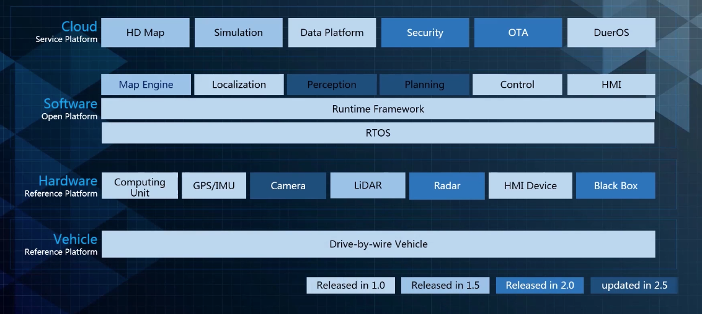
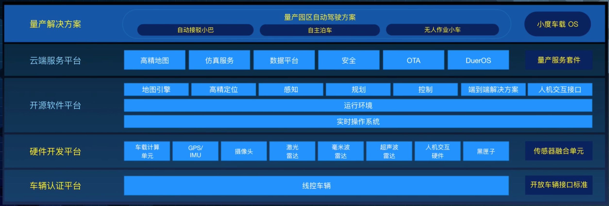
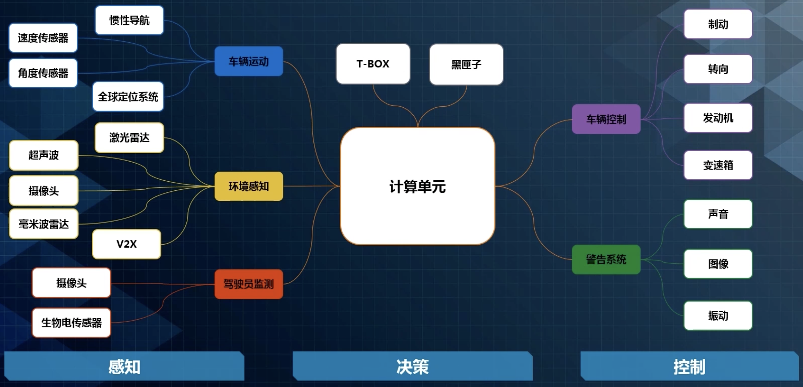
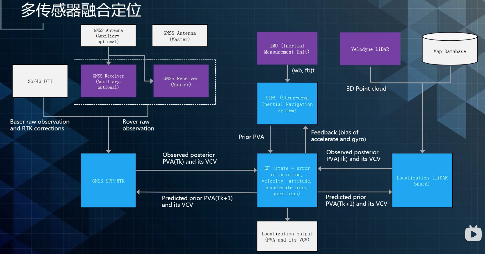

L1: Adaptive Cruise Control

L2: Lane Keeping

L3: Lane Change

L4: Driverless

L2 和 L3 都是 Advanced Driving Assistant, ADAS

By-wire 线控：车能被电脑控制

function safety (ISO26262)  & cyber security

# Apollo介绍

## *架构 *

### 1.0～2.5

### 3.0

## *硬件平台介绍*

### 自动驾驶的研发流程

1. 基于模拟器仿真的软件在环
2. 基于必要的硬件平台的硬件在环
3. 基于车辆执行的车辆在环
4. 基于实际道路的司机在环

### 自动驾驶的硬件子系统

## *安装*

# 定位

无人车的自定位系统：相对某一个坐标系，确定无人车的位置和姿态

无人车的环境感知是很难的，需要自定为系统与自动驾驶地图配合提供静态环境感知

还需要输出置信度给下游模块

自动驾驶汽车定位系统指标要求

* 精度：指标是误差均值，理想值是<10cm
* 鲁棒性：指标是最大误差，理想值是<30cm
* 场景：指标是覆盖场景，理想值是全天候

### 硬件

* 基于电子信号定位：GNSS、Wi-Fi、Cell Phone、FM Radio、UWB
* 航迹推算：IMU odometry
* 环境特征匹配：LiDAR Radar Camera

## *GNSS*

GNSS, Global Navigation Satellite System 全球导航卫星系统

## *激光点云定位*

## *视觉定位*

3D地图提取路灯、电线杆等物体的竖直部分；2D地图提取车道线停止线、导流线等路面标记

## *惯性导航*

# 高精地图

车道线级别的高精地图 HD Map

HD Map（high definition map）高分辨率地图

HAD Map（highly automated driving map）高度自动驾驶地图

高精地图最显著的特点是其表征路面特征的精准全面性，高精地图要求有更高的实时性。高精地图=自动驾驶地图

# CyberRT

CyberRT 是百度Apollo推出的代替ROS的消息中间件

