# 介绍

### 分类

如今比较广泛的是使用德国的方法来区分汽车的级别，将汽车划分为A00级、A0级、A级、B级、C级、D级。这种分级的方法主要依据汽车轴距、排量、重量等参数划分的，其中最常见的方法是通过轴距的长度来划分级别

* 按发动机排量/轴距分
  * 微型汽车 A00级：<= 1.0L，轴距在2400mm以下
  * 小型车 A0级：1.0~1.6L，轴距在2400-2550mm之间
  * 紧凑型车 A级：轴距在2550-2700mm之间
  * 中级轿车 B级：1.6~2.5L，轴距在2700-2850mm
  * 中高级汽车 C级：2.5~4L，轴距在2850-3000mm
  * 高级汽车 D级：> 4L，轴距在3000mm以上
* 按车体布置形式分类
  * 三厢车
  * 二厢车
  * 单厢车

### 国产汽车编号规则

汽车的产品型号由企业名称代号、车辆类别代号、主参数代号、产品序号组成。必要时附加企业自定代号。对于专用汽车及专用半挂车还应增加专用汽车
分类代号

```
aa b cc d ee
```

* 企业名称代码：位于产品型号的第一部分，用代表企业名称的两个汉语拼音字母表示
* 车辆类别代码：用一位阿拉伯数字表示
  1. 载货汽车
  2. 越野汽车
  3. 自卸汽车
  4. 牵引汽车
  5. 专用汽车
  6. 客车
  7. 轿车
  8. /
  9. 半挂车及专用半挂车
* 主参数代号：车辆的特征，用两位阿拉伯数字表示
* 产品序号
* 专用汽车分类代号：用于反映车辆结构和用途特征的三个汉语拼音

### 车辆构造

车辆的总体构造基本上由四部分组成：发动机、底盘、车身、车辆电子

* 发动机 engine：发动机是车辆的动力装置，其作用是使进入其中的燃料经过燃烧而变成热能，并转化为动能，通过底盘的传动系统驱动汽车行驶
* 底盘 chassis：底盘的作用是支撑车身，接受发动机产生的动力，并保证汽车能够正常行驶。底盘本身又可分为传动系统、行驶系统、转向系统和制动系统四部分
* 车身 carrosserie/body：车身指的是车辆用来载人装货的部分，也指车辆整体。汽车车身结构主要包括车身壳体、车门、车窗、车前钣制件、车身内外装饰件和车身附件、座椅以及通风、暖气、冷气、空气调节装置等。在货车和专用汽车上还包括车厢和其他装备
* 车辆电子：电气设备包括电源、发动机启动系统以及汽车照明等用电设备，在强制点火的发动机中还包括发动机的点火系统

## *车身*

### 车身外形

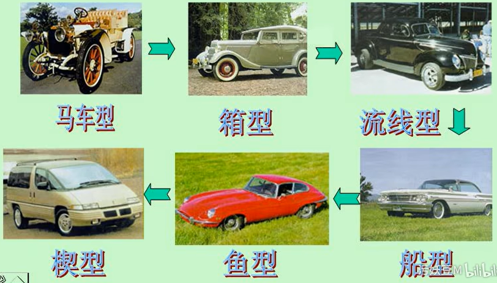

### 车身类型

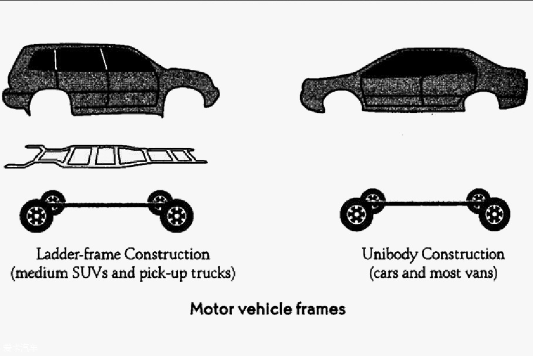

* 承载式车身 Unibody

* 非承载式车身 Body-on-Frame

  非承载式车身是有底盘大梁的

  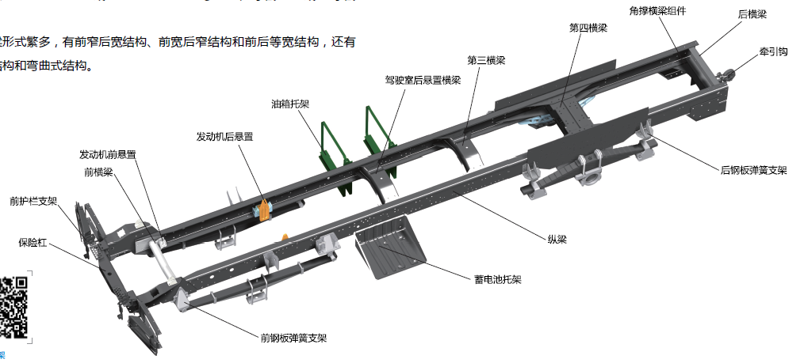

# 发动机


### 发动机的布置形式

在市面上大部分车型都是采用横置的布局模式，比如大众、丰田、本田、福特以及国产品牌等等；而像奔驰、宝马、奥迪等豪车大多数都是纵置发动机

横置发动机适合小型至中型车辆，节省空间且经济；纵置发动机则适合高性能车辆，尤其是追求速度和强大驱动力的运动型车款

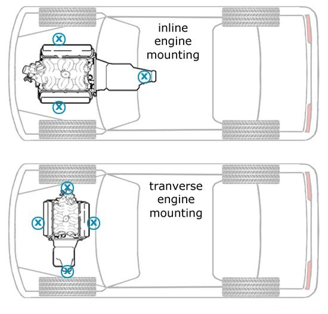

* 发动机横置 Transverse Engine：发动机的曲轴与车辆的行驶方向垂直。这种布局一般用于前轮驱动（FWD）和部分四轮驱动（4WD或AWD）的车型

  * Pros
    * **空间效率高：** 发动机和变速箱组合紧凑，为乘客舱和行李箱留出更多空间
    * **成本效益：** 生产线可以通用化，降低生产和维护成本
    * **车辆平衡：** 横置布局有助于提高车辆的前后轴平衡

  * Cons
    * **动力限制：** 由于空间限制，难以适应大排量或多缸数的发动机
    * **散热问题：** 狭小的发动机舱可能导致散热性能不
* 发动机纵置 Inline/Longitudinal Engine：发动机的曲轴与车辆的行驶方向平行。这种布局常见于后轮驱动（RWD）、四轮驱动（4WD/AWD）以及部分前轮驱动的车型

  * Pros
    * **适应性强：** 方便安装大排量或多缸数的发动机
    * **散热好：** 较为宽敞的发动机舱有利于散热
    * **动力传输效率：** 动力直接后传，适合高性能车辆
  * Cons
    * **空间利用差：** 占据较多的车头空间，影响乘客舱和行李箱的容积
    * **成本较高：** 结构复杂，生产和维护成本相对较高
      * **车辆平衡：** 可能导致车辆前重后轻，影响操控性能

## *辅助系统*

### TCS

驱动汽车行驶的驱动力取决于发动机的输出转矩，但同时也会受到驱动轮表面附着力的限制，而附着力的大小又取决于路面的附着系数。对于雨雪、湿滑的路面，发动机过大的输出转矩将会引起驱动轮打滑，从而破坏了车辆行驶的稳定性。寒冷地区的车主（比如说中国东北地区）可能会遇到在冰雪上起步时踩加速踏板太猛反而不能起步的现象；而在行驶中如加速太猛，车子还会在冰雪上打转。这都是驱动力过大惹的祸

TCS, Traction Control System 牵引力控制系统为 可以适时地根据行驶条件来调节发动机的驱动力。TCS 与加速防滑控制系统 ASR, Acceleration Slip Regulation、DTC, Dynamic Traction Control（BMW）、TRC, Traction Control（Toyota）等都是类似系统的不同叫法。

当起步或加速时，若车轮打滑，TCS便会减小驱动力，同时对打滑驱动轮进行适当制动，阻止继续打滑

TCS也是在ABS基础上发展而来的。**它遵循于车轮的滑转差介于10%~30%之间时车轮附着力最大这一原则进行设计**。在汽车起步或加速中，当电脑监测到驱动轮的滑转差大于30%时，便向发动机发出指令减小驱动力，发动机便会减少喷油量，从而减小发动机转矩输出，使驱动轮的滑转差回到10%~30% 之间，保证车轮始终拥有较大的附着力

TCS可以明显改善车辆的操纵稳定性，特别是在湿滑路面、冰雪路面或其他复杂路面上，无论是起步还是加速，TCS 都可帮助驾驶人保持车辆稳定性能，或者说不用要求驾驶人拥有更高的驾驶技术就能应付这些复杂路面上的起步和加速动作


## *配气机构*

配气机构的功用是按照发动机每一气缸的工作顺序和工作循环的要求，定时开启和关闭各气缸的进、排气门，使新混合气(或新鲜空气)进入气缸，废气从气缸排出

# 底盘 & 传动系统

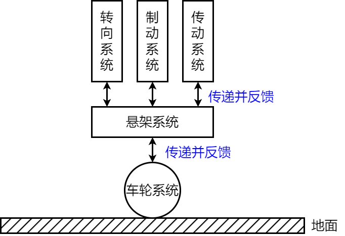

* 转向系统 steering system 的作用是
  * 改变车辆行驶方向
  * 反馈给驾驶员路面及车辆行驶状况（提供路感）
  * 减少碰撞对驾驶员的伤害（车辆正碰时）
  * 提高驾驶舒适性（助力转向系统）
* 制动系统 brake system  的作用是
  * 使行驶的车辆减速或停止
  * 使停止的车辆继续保持停止
  * 保证在各种制动状况下的车辆稳定性
* 传动系统 transmission system 的作用是
  * 传递发动机扭矩来驱动车辆
  * 切断发动机动力向车轮的传递
  * 改变变速箱传动速比，以实现不同的驱动扭矩转换
* 悬架系统 suspension system 的作用是
  * 传递并承受路面作用于车轮的力和力矩
  * 减缓路面对车身的冲击，并衰减由此产生的振动，保证汽车的行驶平顺性
  * 配合传动系统，实现车辆匀速或加速行驶
  * 配合转向系统，实现车辆行驶方向的控制
  * 配合制动系统，保证车辆的制动性
* 车轮系统 wheeling system

## *传动系统*

汽车传动系统是汽车发动机与驱动轮之间动力传递装置的总称。它能根据需要将动力平稳接合，并传递或迅速彻底地分离动力。传动系统能满足汽车倒车和必要时左、右驱动轮差速转动的要求;能在各种行驶条件下提供所需的牵引力和车速，使汽车有良好的动力性和燃油经济性

### 传动系统的主要组成

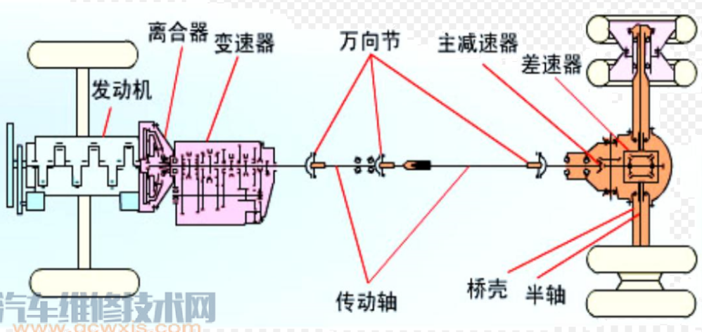

动力传递过程：发动机 `->` 离合器 `->` 变速器 `->` 主减速器 `->` 差速器 `->` 万向传动装置 `->` 传动矩 `->` 驱动桥（差速器 & 半轴）`->` 驱动轮

* 主减速器：增扭、减速 $P=n\cdot T$
* 变速器 gear box：实现车辆的变速，目的是为了保证发动机始终工作在高效区
* 离合器 clutch：传递或中断动力。在正常工作时接通，在起步、换档、制动、滑行等情况时断开。同时在驾驶员的操纵下，通过主动、从动部分结合或分离实现传递或断开
* 差速器 differential & 半轴：实现左右车轮的差速，使转向不打滑
* 万向传动装置/万向节：变角度传动。消除变速器与驱动桥之间因相对运动而产生的不利影响，允许驱动轮在一定的空间范围内跳动。便于传动轴的在底部的布置，降低地板的高度
* 传动轴：连接变速箱与主减速器，传递动力在
* 驱动桥：安装左右驱动轮，内置主减速器齿轮、差速器，安装制动器

### 传动系统的类型

* 机械式
* 液力机械式
* 静液式 ( 容积液压式) 
* 电力式

### 动力传递方式

通过汽车的传动系统将发动机产生的转矩按需求分配给各个驱动轮

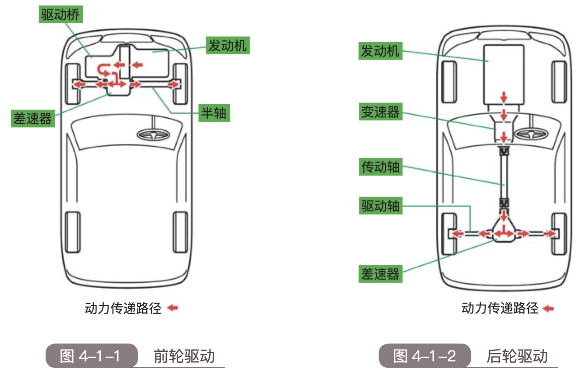

* 前驱：传动系统将发动机的动力传递给前轮，从而驱动汽车行驶

  因为前置发动机的输出可以直接驱动前轮，所以前置前驱不需要传动轴。但同时因为前轮需要同时承担来自方向盘的转向力和来自发动机的驱动力，在高速情况下容易引起转向不足

  前轮驱动汽车直线行驶稳定性好，它最适合常见的乘用车

* 后驱：传动系统将发动机的动力传递给后轮，从而驱动汽车行驶

  后轮驱动操控性和稳定性好，更适合高性能乘用车和商用车

* 四轮驱动：四轮驱动每个车轮都能获得驱动力，越野性能最佳

  * 全时四驱：在任何时候,车辆都是由四个车轮独立驱动的。全时四驱结构复杂，制造成本高，一般用于中高档车型
  * 分时四驱：可以由驾驶人根据路面情况，通过接通或断开分动器来切换驱动模式，从而实现两驱和四驱自由转换。操作复杂，一般用于硬派越野
  * 适时四驱：只有在适当的时候才会转换为四轮驱动，而在其他情况下仍然是两轮驱动。系统会根据行驶路况自动切换为两驱或四驱模式，无须人为操作。一般用于城市SUV

### 传动系统的布置形式

车辆由于功用不同，可以设计成多种布置和动力传递的组合形式

* FR, Front Engine, Rear Drive 前置后驱
* FF, Front Engine, Front Drive 前置前驱，中置后驱，全驱
* RR, Rear Engine, Rear Drive 后置后驱
* MR, Middle Engine, Rear Drive 中置后驱
* nWD, n Whell Drive 全轮驱动

## *离合器*

离合器的作用是要实现发动机与变速器柔和接合，起步平稳、保证换档时工作平顺、防止传动系过载

## *手动变速器*

> 汽车的实际使用情况非常复杂，如起步、怠速停车、低速或高速行驶、加速、减速、爬坡和倒车等，这就要求汽车的驱动力和速度能在相当大的范围内比变化，而目前广泛采用的活塞式发动机的输出转矩和转速变化范围较小。为了适应经常变化的行驶条件，同时使发动机工作在有利的工况下（功率较高、油耗较低），在传动系统中设置了变速器。 -- 汽车构造与原理三维图解

### 变速器的种类

[120张图看懂汽车详细构造 - 知乎 (zhihu.com)](https://zhuanlan.zhihu.com/p/20738444)

[MT、AT、AMT、CVT、DCT都是什么鬼？ - 知乎 (zhihu.com)](https://zhuanlan.zhihu.com/p/93974997)

* 手动变速器 / 机械式变速器 Manual Transmission, MT：即必须用手拨动变速杆（也就是我们平常所说的挡把）通过变化挡位来改变变速器内的齿轮啮合位置，从而达到变速的目的
* 自动变速箱 Auto Transmission, AT：是由液力变矩器、行星齿轮和液压操纵系统组成，通过液力传递和齿轮组合的方式来达到变速变矩。装有自动变速器的汽车，能根据路面状况自动变速、变矩
  * 液力自动变速器 hydraulic automatic transmissions, AT
  * 电控机械式自动离合变速器 Automated Manual/Mechanical Transmission, AMT
  * 无级变速器 Continuously Variable Transmission, CVT：是没有明确的挡位区分，根据路面状况和车辆实际使用情况，通过改变传动比使发动机的功率和燃油消耗率都控制在一个最理想的范围内，使动力输出持续流畅
  * 双离合变速器 Dual Clutch Transmission, DCT：有两组离合器。与AT相比，DCT可以降低油耗，与MT相比，动力输出不会出现间断

### 手动变速器的挡位设置

手动变速器通常有多个前进档（常见的有 4、5、6、7、8 档）供驾驶人选择，其中的低档可提供足够的转矩来使汽车起步，高档可提供足够的巡航速度来提高经济性，中间档保证动力输出更加平顺

高速空挡滑行的危害：行驶中切不可挂入N档滑行，因为自动变速箱内需要润滑，当行驶中把档位放在N上面时油泵是无法正常地供油进行润滑的，会使变速箱内部件温度升高，造成彻底损坏。另外高速空档滑行也是非常常危险的，而且并不省油。低速时滑至停止可以提前挂入N档，倒没有什么影响

### 三轴变速器：以五速手动变速器为例

[图解·汽车（4）一篇看懂变速箱 - 知乎 (zhihu.com)](https://zhuanlan.zhihu.com/p/54023696)

三轴变速器除了输入轴和输出轴外，还有中间的第三轴变速器轴，输入轴和输出轴通过中间轴来传递动力，中间轴主要用来固定安装各档位的变速传动齿轮。由于三轴变速器的每个档位都是由两对齿轮传动的，因此输入轴和输出轴的旋转方向相同，这种变速器通常更适合发动机前置后轮驱动的汽车

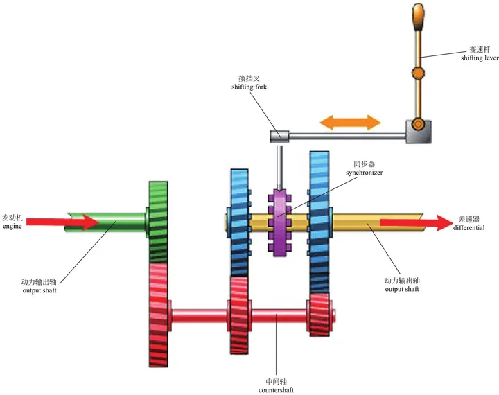

机械原理中学过，不同的齿轮组合（即不同的齿轮组传动比）可以输出不同的力矩、角速度组合，这就是变速器的原理。通过滑动输出轴，实质与不同的中间轴上的齿轮啮合形成不同的力矩、角速度组合。一个五速手动变速器包括5个前进挡和1个倒车档

[手动变速箱工作原理_哔哩哔哩_bilibili](https://www.bilibili.com/video/BV1a44y1i7L8/?spm_id_from=333.337.search-card.all.click&vd_source=ae602f37eb59a22980f23644723779c7)

滑动啮合变速器的缺陷在于换挡操作麻烦，需要踩两次离合器，以及换挡时容易发出齿牙相碰的咔咔噪声

常啮合变速器则解决了这个问题，常啮合变速器中齿轮会一直保持啮合状态。常啮合变速器中输出齿轮并不是固定在输出轴上的，而是用反过来的思路，即齿轮式松动地套在输出轴上的，将其中一个输出齿轮锁定到输出轴上时，最终的输出轴转速就等于这个锁定的输出齿轮的速度

下图中就是一个常啮合变速器，其中紫色的同步器就是用来帮助锁定输出齿轮到输出轴上的，同步环用于帮助输出齿轮和输出轴获得相同的转速。在换挡前，先踩下离合器踏板以切断发动机传向输出齿轮的动力，用换挡杆推动接合套，接合套会把同步环压到输出齿轮的锥面上，因为同步环和锥面之间的摩擦力很大，因此会迫使输出齿轮的速度渐渐和同步环趋同。所以实际上是通过摩擦力来强行变速的

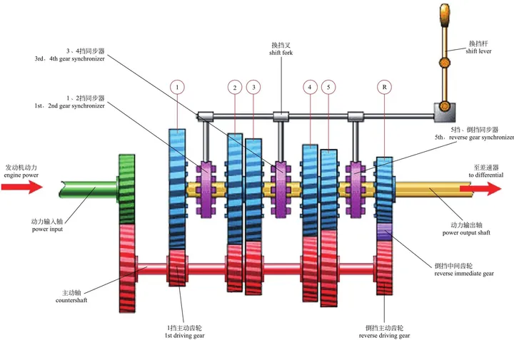

### 两轴变速器

### 分动器

分动器通常安装在变速器后部,它可将发动机输出的动力按一定比例分配给前、后驱动桥,实现四轮驱动。分动器主要由输入轴、主动齿轮、从动齿轮和输出轴组成

当分动器有两个档位时兼起副变速器的作用

## *自动变速器*

### 自动变速器的挡位

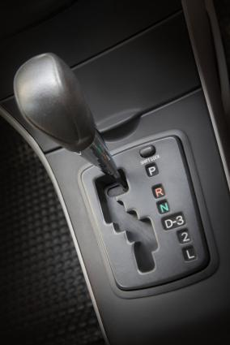

[自动变速器的挡位_装备自动变速器的车辆，变速杆要退出p位置，必须要踩下的踏板是-CSDN博客](https://blog.csdn.net/cairx/article/details/5567957)

[D档、P档、N档、R档、L档，分别是什么意思？ - 知乎 (zhihu.com)](https://zhuanlan.zhihu.com/p/99453818#:~:text=D (Drive)前进档，也称驱动档：,D这个档位下变速箱会在1～超速档（相当于1～4档）根据速度和油门情况自动切换，该档位用在一般道路行驶。 由于各国车型有不同的设计，所以“D”档一般包括从1档至高档或者2档至高档，并会因车速及负荷的变化而自动换档。)


* P (Park) 停车挡 / 泊车挡：利用机械装置锁紧汽车的传动部分，使汽车不能移动
* R (Reverse) 倒挡：车辆倒后之用。通常要按下拨杆上的保险按钮,之才可将拨杆移至R挡。当车辆尚未完全停定时，绝对不可以强行转至R挡，否则变速器会受到严重损坏
* N (Neutral) 空挡：空挡时发动机与变速器之间的动力已经切断分离。如短暂停留可将拨杆置于此挡并拉出手制动许，右脚可移离刹车踏板稍作休息
* D (Drive) 前进档，也称驱动档：用在一般道路行驶。由于各国车型有不同的设计，所以D挡一般包括从1挡至高挡或者2挡至高挡，并会因车速及负荷的变化而自动换挡。将拨杆放置在D挡上，驾车者控制车速快慢只要要控制好油门踏板就可以了
* S (Second Gear) 或2挡：变速器只能在1挡、2挡之间变换，不不会跳到3挡和4挡。将拨杆放置在2挡位，汽车会由1挡起步，当速度增加时会自动转2挡。2挡**可以用作上、下斜坡之用**。此挡段的好处是当上斜或落斜时，车辆会稳定地保持在1挡或2挡位置，不会因上斜的负荷或车速的不平衡、令变速器不停地转挡。在落斜坡时，利用发动机低转速的阻力作制动，也不会令车子越行越快
* L (Low) 或1挡 (First Gear)：变速器只能在1挡内工作，不能变换到其他挡位。它用在严重交通堵塞的情况和斜度较大的斜坡上最能发挥功用。上斜坡或下斜坡时，可充分利用汽车发动机的扭力

车辆一定要在完全停止时才可使用P挡，要不然自动变速器的机械部分会受到损坏。自动变速轿车上装置空挡启动开关，使得汽车只能在P或N挡才能启动发动机，以避免在在其他挡位上误启动时使汽车突然前窜

### CVT

[6000字，看懂CVT变速箱 - 知乎 (zhihu.com)](https://zhuanlan.zhihu.com/p/64353272)

[CVT真不如AT？丰田WCVT变速箱带来的思考 - 知乎 (zhihu.com)](https://zhuanlan.zhihu.com/p/73264514)

### 莱佩莱捷行星排自动变速器

## *万向传动装置*

万向传动装置用于轴线相交或相对位置经常变化的转轴之间的动力传递，主要由万向节和传动轴组成

## *驱动桥*

驱动桥的作用是将发动机输出的转矩通过主减速器、差速器、半轴等传到驱动轮，从而实现降低转速、增大转矩及两侧车轮差速等功能

### 差速器

在汽车转向时，左右驱动轮在相同的时间内行驶的距离是不同的，因此需要获得不同的线速度，内侧车轮的线速度较小，外侧车轮的线速度较大

实现方法：动力经主减速器 `->` 差速器 `->` 半轴，传递到驱动轮

## *悬架/悬挂系统*

[图解·汽车（5）一篇看懂汽车悬架 - 知乎 (zhihu.com)](https://zhuanlan.zhihu.com/p/54317556)

### 悬架的主要类型

悬架，又称为悬挂 suspension，其主要作用是把路面作用于车轮上的支承力、驱动力、制动力和侧向反力以及这些反力所形成的力矩传递到车架或承载式车身上，以保证汽车正常行驶

根据汽车两侧车轮运动是否相互关联，汽车悬架可分为非独立悬架和独立悬架

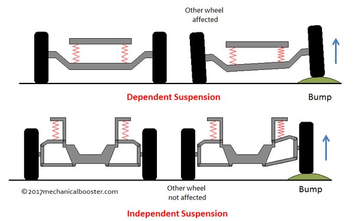

* 独立悬架 independent suspension 的特点是汽车两侧车轮分别安装在一根整体式的车轴两端，车轴则通过弹性元件与车架相连，当一侧车轮因道路不平而跳
  动时，会影响另一侧车轮的工作
* 非独立悬架 non-independent suspension 的特点是两侧车轮分别安装在断开式的车轴两端，每段车轴和车轮单独通过弹性元件与车架相连，当一侧车轮跳动时，对另一侧车轮不产生影响

独立悬架的前轮可调整其定位，故在乘用车上被广泛应用，而非独立悬架因结构简单、制造和维修方便，故中、重型商用车中普遍采用

### 麦弗逊式悬架

麦弗逊式悬架是一种最为常见的独立悬架，主要由A字形叉臂和减振机构组成

### 空气悬挂

### FSD悬挂

FSD, Frequency Selective Damping Suspension 是一种机械式自动调节悬挂系统，能够根据路面颠簸情况自动调节悬挂的软硬程度，实现更稳定、更舒适的驾驶体验

### BYD云辇悬挂系统

BYD云辇悬挂系统实际上是一系列智能车身控制系统，属于智能底盘技术的一种，由比亚迪全栈自研，能够实现系统级深度集成。该套系统的核心在于对底盘悬架系统的智能化控制，可以看作是比亚迪对其底盘技术的一种补齐

BYD云辇悬挂系统的能力从低到高排列为

* 云辇C
* 云辇A
* 云辇P
* 云辇X

# 制动与汽车安全系统

## *介绍*

### 制动系统分类

[汽车上的四种制动系统-电子工程专辑 (eet-china.com)](https://www.eet-china.com/mp/a136776.html)

* 按作用分
  * 行车制动系统（脚刹车）：使行驶中的汽车减速或停止的制动系统
  * 驻车制动系统（手刹车）：使停止的汽车在原地驻留的制动系统
  * 紧急制动系统：在行车制动失效时，使汽车减速、停车的系统
  * 辅助制动系统：汽车下长坡时稳定车速的制动系统
* 按能源分
  * 人力制动系统：以驾驶员的体力为输入能源的制动系统
  * 动力制动系统：靠发动机的动力转化而成的气压或液压能进行制动的系统
  * 伺服制动系统：兼用人力和发动机动力的制动系统
* 按制动力的变化方式分
  * 渐进制动系统：制动力矩和制动力在驾驶员的操纵控制下，在一定的范围内逐渐变化，比如行车制动系统
  * 非渐进制动系统：无上述特点的制动系统(如驻车制动系统
* 按能量传输方式分：机械式、液压式、气压式、电磁式
* 按传动系统的回路分
  * 单回路系统
  * 双回路系统：双回路制动系统在一侧回路失效时，仍能提供部分制动力。目前汽车制动系统必须采用双回路制动系统

### 基本组成

* 供能装置
* 控制装置
* 传动装置
* 制动器
* 其它附加装置：制动力调节装置、报警装置、压力保护装置等

## *制动器*

### 分类

* 鼓式 drum brake
  * 内张型
    * 轮缸式
      * 领从蹄式
      * 双领梯式
      * 双从蹄式
      * 自增力式（单向、双向自增力)
    * 楔式
  * 外束型
* 盘式 disk brake
  * 钳盘式
    * 定钳盘式
    * 浮钳盘式
  * 全盘式

### 鼓式制动器

[鼓式制动器工作动画_哔哩哔哩_bilibili](https://www.bilibili.com/video/BV1sB4y1G7VN/?spm_id_from=333.788.top_right_bar_window_history.content.click)

鼓式制动器利用制动蹄片挤压制动鼓而获得制动力，可分为内张式和外束式

* 内张鼓式制动器是以制动鼓的内圆柱面为工作表面，在现代汽车上广泛使用
* 外束鼓式制动器则是以制动鼓的外圆柱面为工作表面，目前只用作极少数汽车的驻车制动器

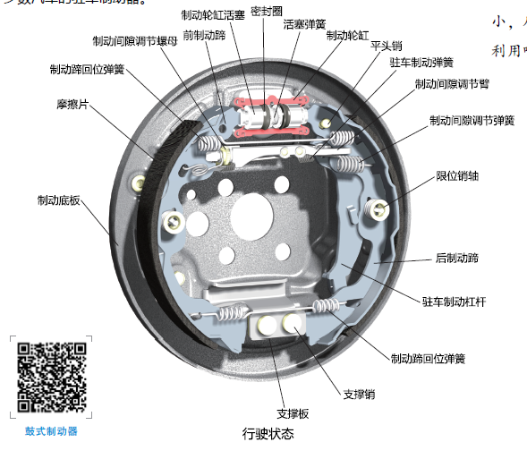

### 盘式制动器

[汽车盘式制动器详细介绍_哔哩哔哩_bilibili](https://www.bilibili.com/video/BV1Jb411P7tV/?vd_source=ae602f37eb59a22980f23644723779c7)

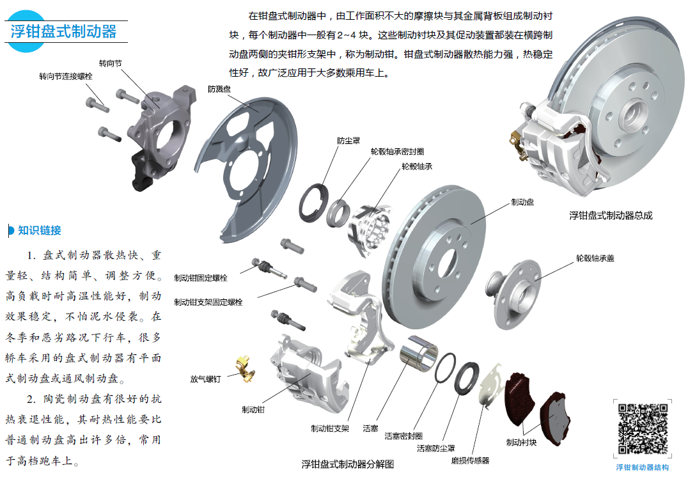

## *辅助制动*

### 汽车安全系统

* 主动安全系统：ABS、EBS

  这些系统可以使得汽车的行驶更加稳定，缩短制动距离，减少汽车的碰撞率，但是这些系统必须在人工控制的状态下才能发挥出作用，没有办法预测和有效避免交通事故的发生

* 被动安全系统：安全气囊、儿童安全座椅、安全带等这类安全系统，这些系统的作用仅仅是减少车祸所带来的损失

以预防危险事故发生为核心的主动安全技术已成为现代汽车技术发展的重要方向

主动安全辅助功能从系统角度分为车道辅助、碰撞辅助、巡航辅助、灯光辅助、速度辅助、**转向辅助**等几大系统，转向辅助系统（Turn Assist）常见的功能有：

* 紧急转向辅助ESS - Emergency Steering Support
* 自动紧急转向AES - Automatic Emergency Steering

### ABS

ABS, Anti-lock Braking System 汽车防抱死制动系统。传统的汽车制动系统的功能是使行驶中的车辆车轮受制动力矩的作用，使车辆停止。未安装ABS系统的车辆，在紧急制动时，很容易导致车轮抱死，这种状态会造成车轮轮胎的严重磨损，后轮抱死车辆会产生侧滑，丧失稳定性，前轮抱死会使车辆丧失转向能力，从而导致事故的发生。装有ABS系统的车辆，在行驶过程中紧急制动时，可保持车辆行驶方向的可操作性，绕开障碍物，从而避免发生事故。另外，ABS系统还用以减少轮胎的磨损，降低车辆维护费用

抱死 wheel lock：刹车过程中，车辆的一个或多个轮胎因为制动力过大而停止旋转的现象。当轮胎与路面间的摩擦力超过轮胎能够承受的最大限度时，轮胎便会停止转动，造成抱死。此时摩擦驱动力都是往当前运动方向的反方向，汽车不会转弯，而是沿当前运动方向侧滑。由于每个轮胎的摩擦力不同，抱死时还会出现不可预测的车辆的旋转

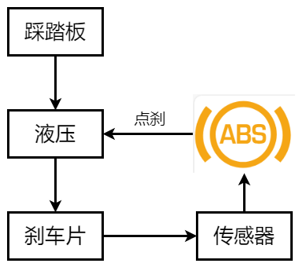

连续不断的点刹是防止侧滑的有效手段，但一般的驾驶者在紧急情况下是很难做出连续点刹的。ABS所做的工作就是模拟不停的点刹。其工作原理就是由轮速感应器监测车轮的转速，获得的信号汇集到ECU内分析，一旦监测到车轮快要抱死时，电子控制器会发出指令给制动压力调节器，由它实现制动、保压、减压、再增压的过程，避免轮胎抱死

ABS的另外一个作用就是减少制动距离。如下图所示，在车轮的纯滚动和车轮抱死之间有一个点可以达到制动力的最佳值，ABS可以尽量的去逼近这个值

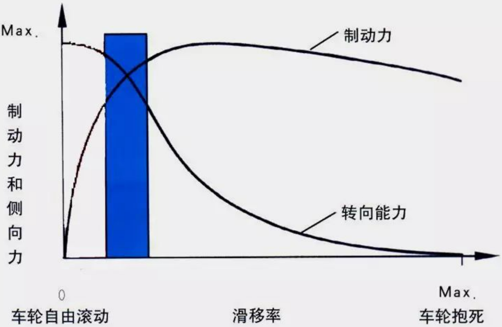

### EPB

EPB, Electrical Park Brake 电子驻车制动系统 是通过电子控制方式实现驻车制动、及驻车制动与行车制动相结合的技术，EPB将传统的机械式手刹变成了电子控制手刹，融合行车制动、驻车制动等功能

* 车辆熄火时，即使忘了拉手刹，系统会自动完成驻车
* 车辆起步时，司机忘了松手刹，驻车制动也会自动解除。车辆在坡道起步，也不会倒溜，使得车辆更为智能、简便、安全，减少事故的发生

## *车辆的被动安全系统*

### SRS

SRS, Supplemental Restraint System 安全气囊系统。SRS是一种被动安全性的保护系统，安全气囊与座椅安全带配合使用，可以为乘员提供有效的防撞保护 

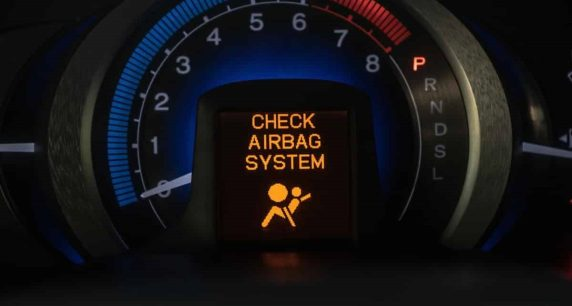

# 转向系统

## *转向系统分类*

* 机械转向系统：以驾驶员的体力为转向能源，其中所有的传力件都是机械零件
* 动力转向系统：兼用驾驶员体力和发动机动力为转向能源，其转向系统中需增加动力转向装置

### 转向不足 & 转向过度

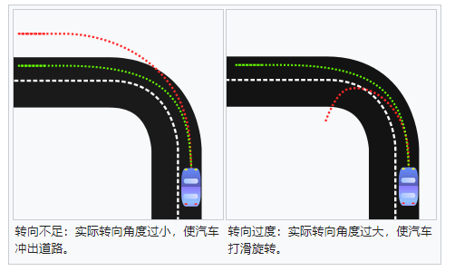

* 转向不足 understeer：当车辆遇到转向不足时，实际转向角度小于驾驶员通过方向盘输入的角度。简而言之，这意味着车辆在转弯时前轮失去了与路面的一部分抓地力，导致车头朝向外侧滑行，无法紧贴旋转半径

  转向不足的原因可能包括：

  - 前轮胎抓地力不足
  - 过重的前轴负载
  - 悬挂设置导致的动态重量分配问题
  - 驾驶员过快进入弯道

* 转向过度 oversteer：转向过度则恰好相反，车辆的尾部倾向于向外滑出，实际转向角度大于驾驶员的输入

  转向过度的原因可能包括：

  - 后轮胎抓地力不足
  - 车辆后部过重或悬挂设置问题
  - 驾驶员在弯道中过度加速
  - 路面湿滑或松散

转向不足通常被认为比转向过度更安全，因为车辆的反应相对缓慢、可预测，驾驶员可以通过减少转向角度或减速来调整车辆的方向。而转向过度通常需要较高的驾驶技巧来控制，驾驶员必须迅速减速并适当调整转向角度来纠正车辆姿态

在汽车设计中，工程师会努力平衡车辆的转向特性，以便在保证良好操控性的同时确保驾驶安全。现代车辆经常配备电子稳定程序（ESP）或车辆动态控制（VDC）等系统，这些系统可以检测到转向不足或转向过度的情况，并自动调整发动机输出或独立刹车轮子以帮助驾驶员保持控制

## *转向器及操纵机构*

### 转向器概念

路感和打手之间的矛盾：所谓路感就是路面的力和振动等会反应在方向盘上，使驾驶员对路面的感受较好。但是反应太大了就会造成对驾驶员的冲击，也就是所谓的打手

### 转向器分类

* 按结构分
  * 循环球-齿条齿扇式
  * 循环球-曲柄指销式
  * 蜗杆-曲柄指销式
  * 齿轮齿条式
* 按逆效率高低分：可逆式、不可逆式、极限可逆式（大型车辆）

### 转向器结构

* 循环球-齿条齿扇式
* 循环球-曲柄指销式
* 蜗杆-曲柄指销式
* 齿轮齿条式

### 转向盘的自由行程

转向盘在空转时的角行程(消除间隙)

理想情况是不超过10~·15度

作用：缓和地面冲击，不打手。过大则无路感

## *转向辅助*

### EBS

EBS, Electronic Braking System 电子制动控制系统，该系统是在防抱死系统 ABS 与防侧滑 ESP 的基础上升级而成的控制系统。其主要作用是减少了制动系统的响应时间和建压时间，可实现整车电子制动力的分配和主、挂车一致性控制，缩短整车的制动距离，提升整车的整体制动性能

EBS可以针对每个车轮做出不同的控制，比如车辆在湿滑路面进行制动时，驾驶员踩下刹车，系统会根据驾驶员踩刹车的力度释放制动压力，达到最佳制动的效果。如果某个车轮因为摩擦力不足出现抱死或者是打滑的情况，EBS系统会针对特定的车轮减少制动气压，以保证各个车轮之间的制动力均衡。

挂车的制动一般比主车要早一些，由于挂车和主车连接方式决定了制动时的特殊性。一旦挂车或者是主车制动时出现不同步的情况，极易发生侧滑或者是推头等危险情况。EBS的出现恰好能解决这一问题，如果主车和挂车都装备了EBS系统，当系统监测到主车和挂车制动不统一时，EBS就会调整制动分配，达到统一制动的效果。

EBS还可以提升ASR(自动牵引力控制系统)的性能，当系统监测到车辆在加速或者是起步的时候出现出现打滑的情况。EBS就会启动，针对打滑的车轮进行制动，以维持车辆行驶方向的稳定性和起步能力。

EBS还可以提高紧急制动时的制动效率，当EBS系统预判出驾驶员需要紧急制动时，制动帮助功能将控制相应的制动元件输出最大的制动压力到制动气室进行全制动，直到驾驶员释放制动踏板时候才结束制动帮助功能。

EBS作为一个开放的车辆控制平台，仅需增加少量部件，即可以集成为电子稳定系统(ESC)、自适应巡航(ACC)、自动紧急制动(AEBS)等先进车辆控制系统。

### ESC / ESP

ESC, Electronic Stability Control 电子稳定控制系统 实际上是一组车身稳定性控制的综合策略，它包含防抱死刹车系统 ABS和驱动轮防滑系统 ASR，可以说它是在这两种系统基础之上的一种功能性延伸，而非作为独立配置存在。旨在提升车辆的操控表现的同时、有效地防止汽车达到其动态极限时失控的系统。电子稳定程序能提升车辆的安全性和操控性

ESP是博世的车身电子稳定系统专利，而ESC是通用的叫法。为了避免与ESP专利冲突，现在很多汽车装有ESC，两者从功用到原理没有本质上的区别， 但各家ESC 在性能上还是有较大差别的

ESC系统包括两大子功能

* 方向控制（转向过度/转向不足）

  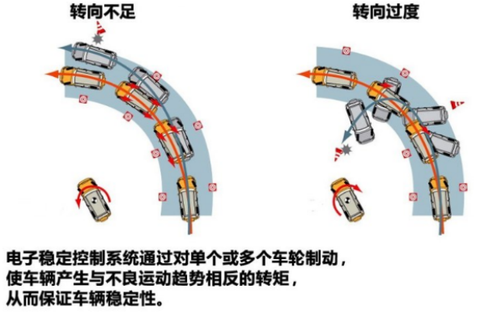

* 防侧翻控制

  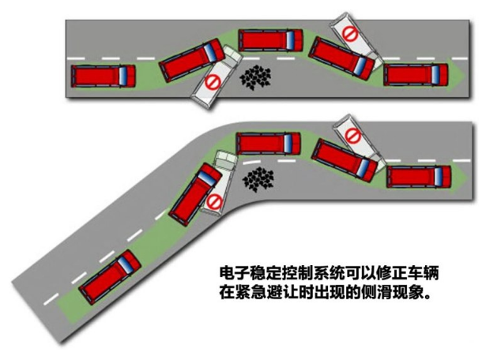

ESP 由控制单元、转向角传感器、轮速传感器、侧滑传感器、横向加速度传感器等组成。控制单元通过这些传感器信号对汽车运行状态进行判断，进而发出控制指令。而ESP 则能够探测分析车况并纠正驾驶错误，防患于未然

ESP 对过度转向和不足转向特别敏感，例如汽车在路滑时左拐过度转向（转弯太急）时会产生向右侧甩尾，传感器探测到滑动就会迅速制动右前轮使其恢复附着力，产生一种相反的力矩而使汽车保持在原来的车道上

# 车辆电子

BCM, Body Control Module 车身控制模块 [车身控制模块BCM设计与开发方法详解 - 知乎 (zhihu.com)](https://zhuanlan.zhihu.com/p/436953890)

ECU, Electronic Control Unit **电子控制单元，又称“行车电脑”、“车载电脑”等**。 从用途上讲则是汽车专用微机控制器，也叫汽车专用单片机

## *域控制器*

DCU, Domain Control Unit / DCM, Domain Control Module / MDC, Multi-Domain Controller

[深度：什么是域控制器？ - 知乎 (zhihu.com)](https://zhuanlan.zhihu.com/p/117603274)

随着这些年车载电子的发展，特别是高性能MCU在车载电子的使用。车载电子电器主要形成了功能“域”的架构，即Domain的架构。典型的是分为动力总成，底盘控制，车身控制， ADAS, 娱乐系统这5个主要的domain。每个Domain有一个主要的高性能的ECU（这就是Domain Controller），负责处理Domain内的功能处理和转发。Domain内部一般使用低速总线，Domain之间使用高速总线或者现在用的比较多的车载以太网互联

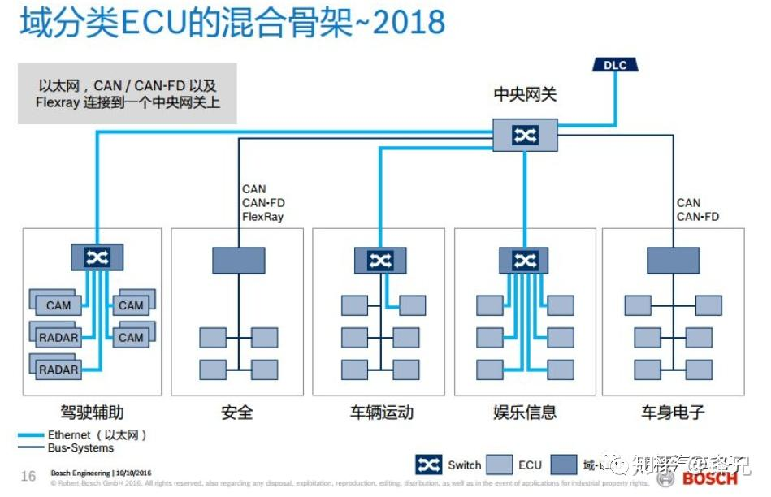

### 华为MDC介绍

华为MDC, Mobile Data Center 移动数据中心

[独家｜揭秘华为MDC：算力、量产与新势力大考-汽车之心 - 探索智能汽车的万象与新知 (autobit.xyz)](https://www.autobit.xyz/news/2304.html)

[MDC：使能自动驾驶的汽车大脑 - 华为 (huawei.com)](https://www.huawei.com/cn/huaweitech/publication/81/self-driving-AI-brain)


[图解·汽车（终）一篇看懂汽车电器系统 - 知乎 (zhihu.com)](https://zhuanlan.zhihu.com/p/54799460)

# 其他子系统

## *车轮系统*

### 轮胎的主要类型

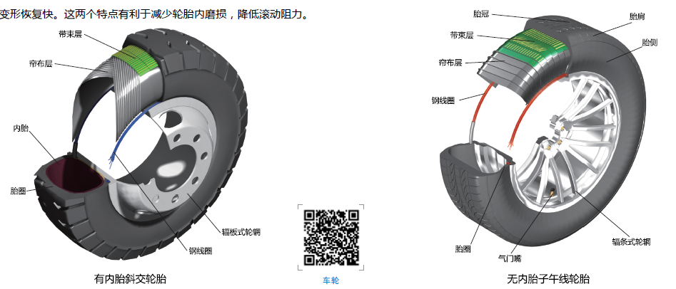

* 斜交轮胎 bias tire：帘布的帘线与胎面中心线约呈35°角
  * 有内胎轮胎 tube tire
  * 无内胎轮胎 tubeless tire
* 子午线轮胎 radial tire：帘布层与胎面中心线呈90°角或接近90°角排列，与帘布层轮胎的子午断面一致
* 越野轮胎

### TPMS

TPMS, Tire-pressure monitoring system 胎压监测系统

## *机油*

[关于机油，或许你知道这些就够了！（知识点汇总） - 知乎 (zhihu.com)](https://zhuanlan.zhihu.com/p/59098356)

## *其他辅助系统*

### 空调

### 灯光

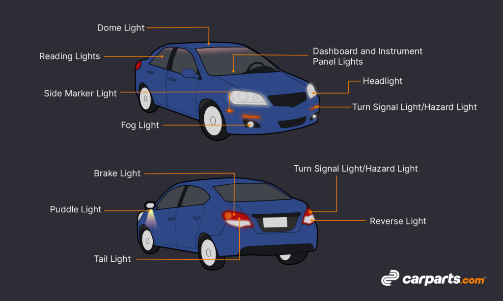

* 前大灯
  * 远光灯 high beam
  * 近光灯 low beam
* 转向灯
  * 前后转向灯 signal lamp
  * 双闪/警示灯 hazard light
* 刹车灯 brake light
* 倒车灯 reverse light
* 雾灯 fog light

仪表盘上的标志

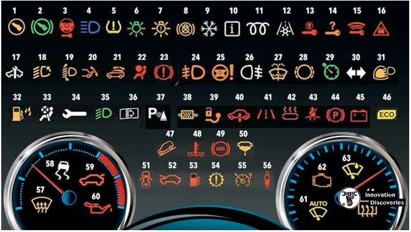

[COMPLETE DASHBOARD LIGHT SYMBOLS (innovationdiscoveries.space)](https://innovationdiscoveries.space/complete-dashboard-light-symbols/)

### 雨刮器

[雨刮标识和操作不理解的戳进来_搜狐汽车_搜狐网 (sohu.com)](https://www.sohu.com/a/538387733_120294442)

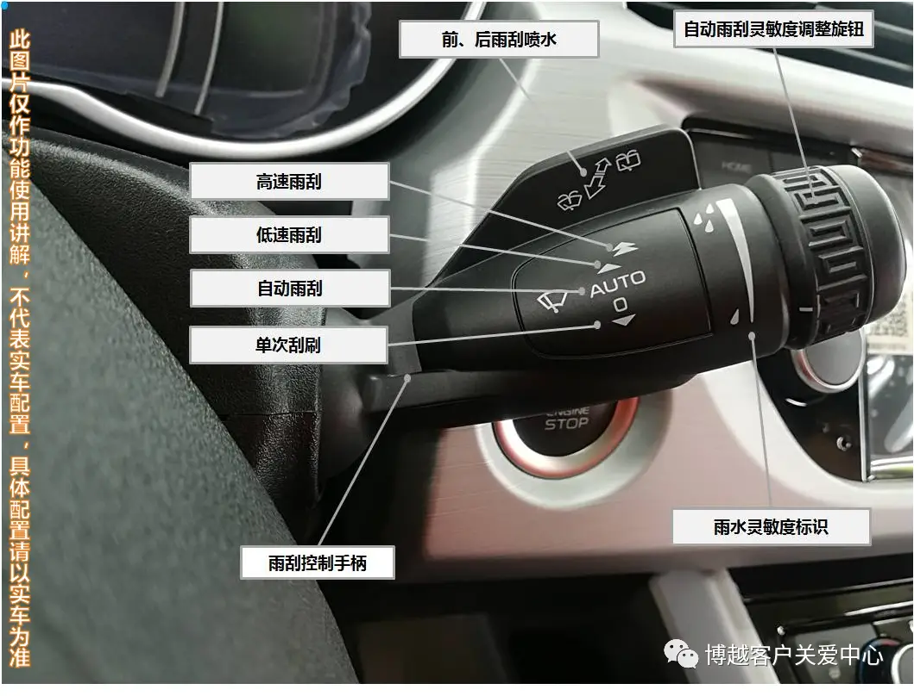

雨刮器的工作状态可以分为：手工工作、OFF、INT、LO和HI


# 新能源车

## *新能源车类型*

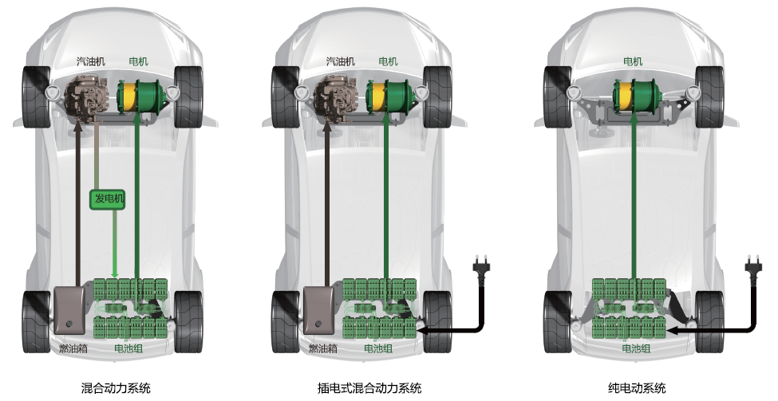

## *电池*

电车的电压一般是**336V、384V**，而电动大客车的电压则一般在580-600V之间

### 铅酸电池 (Lead-Acid)

- **优点**: 成本低廉，技术成熟
- **缺点**: 重量大，体积大，循环寿命较短，环境影响较大

### 镍镉电池 (Nickel-Cadmium, NiCd)

- **优点**: 可以快速充放电，性能稳定
- **缺点**: 有“记忆效应”，含有有毒的镉元素，对环境不友好

### 镍氢电池 (Nickel-Metal Hydride, NiMH)

- **优点**: 比能量高于铅酸电池，无“记忆效应”
- **缺点**: 自放电速率高，成本比铅酸电池高

### 锂离子电池 (Lithium-Ion, Li-ion)

- **优点**: 高能量密度，轻便，无“记忆效应”，可以快速充放电
- **缺点**: 成本相对较高，需严格的管理系统以保证安全

### 锂聚合物电池 (Lithium Polymer, LiPo)

- **优点**: 构造可灵活，重量轻，形状多样
- **缺点**: 相对锂离子电池能量密度低一些，成本高，需要保护电路控制安全

### 固态电池 (Solid-State Battery)

- **优点**: 安全性高，能量密度预期更高，充电周期长
- **缺点**: 目前尚处于研发阶段，成本高，还未实现商业化生产

### 金属空气电池 (Metal-Air Battery)

- **优点**: 理论上具有极高的能量密度
- **缺点**: 技术尚不成熟，存在寿命和重新充电问题

### 超级电容器 (Supercapacitor)

- **优点**: 充放电速度极快，循环寿命长
- **缺点**: 目前能量密度远低于化学电池，成本较高

目前市面上最常见的电动汽车电池是锂离子电池，其优良的综合性能使得它在现代电动车中占据主导地位。随着科技的进步，固态电池等新技术正逐渐走向成熟，未来可能会对传统电池产生重大影响。

## *电机*

[7000字搞懂「电动机」是如何驱动汽车的？ - 知乎 (zhihu.com)](https://zhuanlan.zhihu.com/p/90215075)

# 自动驾驶用到的传感器

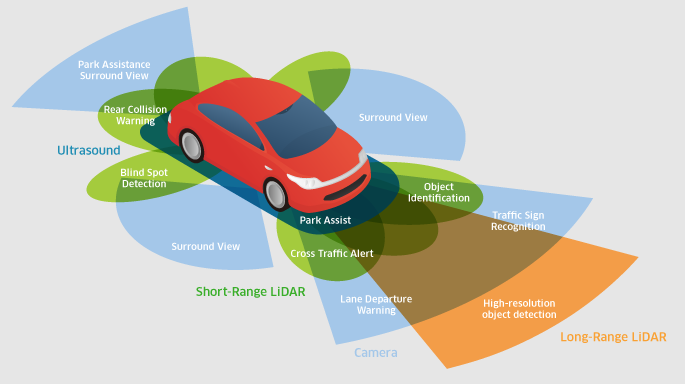

## *雷达*

### 光谱


### 分类

[超声波、激光、毫米波：聊聊自动驾驶中的雷达“三剑客” (mouser.cn)](https://www.mouser.cn/blog/cn-ultrasonic-laser-mmwave-are-eyes-indispensable-for-autonomous-driving)

* 超声波雷达 USS, Ultra-Sonic Sensor 	
* 毫米波雷达 RADAR, Radio Detection and Ranging
  * 短距雷达 SRR
  * 中距雷达 MRR 
  * 长距雷达 LRR
* 单脉冲雷达
* 微波雷达
* 激光雷达 LiDAR, Light Detection And Ranging
* 红外雷达

## *超声波传感器*

[无人驾驶技术入门（八）| 被严重低估的传感器超声波雷达 (zhihu.com)](https://www.zhihu.com/tardis/zm/art/35177313?source_id=1003)

 利用超声波进行测距的传感器 

常见的超声波雷达有两种。第一种是安装在汽车前后保险杠上的，也就是用于测量汽车前后障碍物的倒车雷达，这种雷达业内称为UPA, Ultrasonic Park Assist)；第二种是安装在汽车侧面的，用于测量侧方障碍物距离的超声波雷达，业内称为 APA, Automatic Parking Assist

## *RADAR*

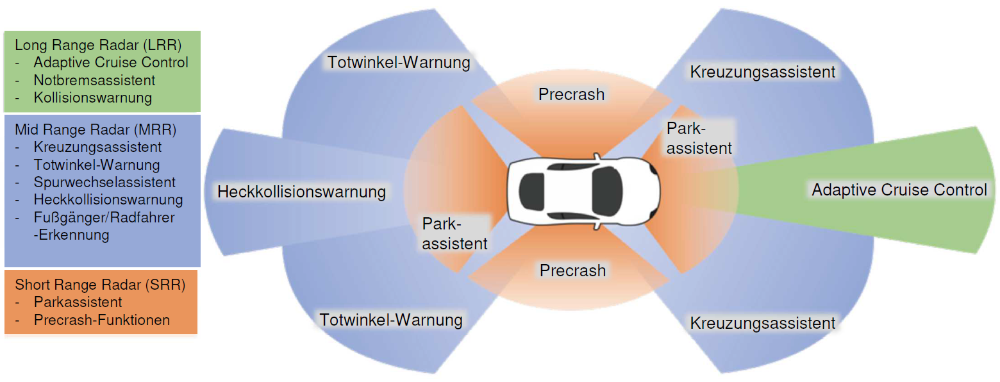

### 趋势：4D影像雷达

## *LiDAR*

### ToF

Time of Flight, ToF

# 自动驾驶业务


# 总线通信

[一篇易懂的CAN通讯协议指南1 - 知乎 (zhihu.com)](https://zhuanlan.zhihu.com/p/162708070)

控制器局域网 CAN, Controller Area Network 是国际上应用较广泛的现场总线之一，目前已经成为汽车计算机控制系统和嵌入式工业控制局域网的标准总线

可变速率的CAN CAN-FD, CAN with Flexible Data-Rate：在经典CAN的基础上增加传输速率，数据域可传输64Byte，也就是可变速的功能，

**CAN通常具有较低的数据传输速率，通常为1 Mbps。** **而CANFD支持更高的灵活数据传输速率，可达到2 Mbps或更高**。 这使得CANFD在需要更高带宽的应用中具有明显的优势，如高清视频传输和大规模数据传输

CAN被设计用于在不需要[主机](https://zh.wikipedia.org/wiki/网络主机)（Host）的情况下，允许网络上的[单片机](https://zh.wikipedia.org/wiki/单片机)和仪器相互通信。 它基于[消息传递协议](https://zh.wikipedia.org/wiki/訊息傳遞_(軟體))，设计之初在车辆上采用[复用通信](https://zh.wikipedia.org/wiki/多路复用)线缆，以降低铜线使用量，后来也被其他行业所使用


## *其他总线协议*

[一文看懂四大汽车总线：LIN、CAN、FlexRay、MOST - 知乎 (zhihu.com)](https://zhuanlan.zhihu.com/p/367856446)

### LIN

局部互联协议 LIN, Local Interconnect Network 总线，是基于UART/SCI（Universal Asynchronous Receiver-Transmitter/Serial Communication Interface通用异步收发器/串行通信接口）的低成本串行通信协议


LIN 的目标是为现有汽车网络，（比如CAN总线）提供辅助功能，因此LIN总线是一种辅助的总线网络。在不需要CAN 总线的带宽和多功能的场合，比如智能传感器和制动装置之间的通讯使用LIN 总线可大大节省成本

### FlexRay

高速容错网络协议 FlexRay

### MOST

MOST, Media Oriented System Transport 面向媒体的系统传输总线


# Autosar

Automotive open system architecture 汽车开放系统架构，AutoSar考虑到当前和未来市场中不同的汽车E/E架构，为汽车软件架构建立了事实上的开放行业标准，是汽车行业应用程序和标准软件模块中功能管理的基本基础设施

AUTOSAR旨在改善汽车电子系统软件的更新与交换，同时更方便有效地管理日趋复杂的汽车电子软件系统。AUTOSAR规范的运用使得不同结构的电子控制单元的接口特征标准化，应用软件具备更好的可扩展性以及可移植性，能够实现对现有软件的重用，大大降低了重复性工作，缩短开发周期

Autosar AP支持大数据的并行处理，对于高性能运算的功能需要运行在该平台上。它的实时运行环境为可动态配置的ARA（Autosar Run-time For Adaptive）

[一万字解读AUTOSAR - 知乎 (zhihu.com)](https://zhuanlan.zhihu.com/p/367857218)

# DBC文件

[DBC学习（一）_dbc文件用什么软件打开-CSDN博客](https://blog.csdn.net/FitKi/article/details/129421034)

DBC, CAN Data Base 是描述网络上所有电子控制节点 ECU, Electronic Control Unit 之间CAN通信信息的数据库文件。注意三个关键词：网络、电子节点和CAN信息，DBC文件只用于描述CAN通信，通常一个DBC文件只能包含一个CAN网络的节点信息，因此为了描述整车的网络拓扑信息是需要多个DBC文件的

CAN协议的dbc文件可以更直观的表达协议内容

## *CANoe*

CANoe, Controller Area Network open environment, 控制器局部网开放环境是网络和ECU开发、测试和分析的专业工具，支持从需求分析到系统实现的整个系统的开发过程，主要用于汽车总线的开发而设计

供应商在开发ECU软件的时候，主机厂是必须要提供其设计版的信号矩阵，明确具体的ECU收发的报文及对应的信号号

### CANdb++

CANdb++ Editor是一款专门用于阅读dbc文件的软件

* Networks：网络。从网络的视角来观察总线上存在的节点、报文及信号

  只能开Network可以看到包括了 Tx Messages、Signal和本网络上的多个节点

  其中Tx Messages下列出了该网络总线上所有的报文，其实就是每个节点发送报文的集合。Signals下列出了该网络总线上所有的信号。节点
  部分列出了每个节点自身的发送和接收信号

* Network nodes：电子节点

  与Networks不同，Nodes部分从单个节点的视角来观察与节点相关的总总线报文及信号。展开后下面包含Tx Messages、Rx Messages、Mapped Tx Signals以及Mapped Rx Signals等

  * Tx Messages 下包含本节点所有的发送报文
  * Rx Messages 下包含本节点所有的接收报文
  * Mapped Tx Signals下包含本节点所有的发送信号
  * Mapped Rx Signals下包含本节点所有的接收信号

* Messages

  Message是CAN总线上传输信息的最小单位,一条Message最大包含8个Byte的数据（CAN FD则最大支持64个Byte的数据）。Messages从用途角度可以分为三大类：应用（APP）报文、网络（NM）报文和诊断（DIAG）报文。通过点击Node下的Tx Messages或Rx Messages，可以查看报文属性

* Signals

  Signal是Message里最小的元素单位，通过在某条报文上右击选择Edit Message打开报文编辑窗口，然后选择Layout选项卡可以查看当前报文的信号布局

  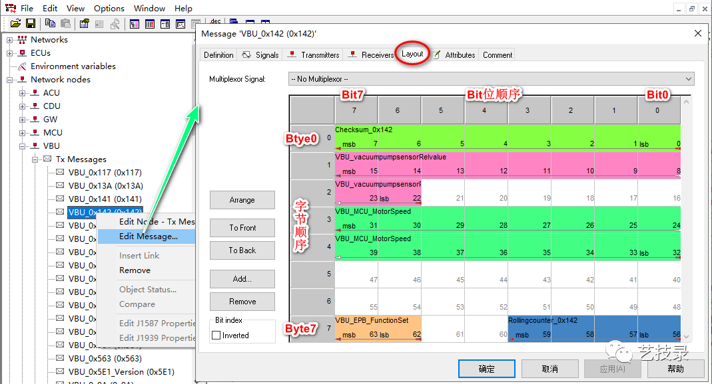

  Layout中纵向表示字节顺序，从上到下为Byte0~Byte7；横向表示字节内的bit位顺序，从左至右为Bit7~Bit0

  Signal在Message里的位置由Byte Order、Startbit和Length三个参数决定

  * Byte Order主要用于跨多个字节的信号，例如上图中横跨Byte1和Byte2的粉色信号

    * Motorola格式：Byte1为信号的高bit位，Byte2为低bit位
    * lntel格式的话则与Motorola格式正好相反

  * Startbit用于确定信号的起始位置，通常要么为信号的最高bit位（msb）要么为最低bit位（lsb）

  * length决定了信号的实际有效长度

    从这里可以看出报文里的信号数量是可变的，对于一条8个Byte的报文，其信号数量最小为1个，最大为64个

* ECUs：每个ECU的network node和environment variables

* Environment variables：在使用CANoe仿真节点时会用到

注意：Node、Message和Signal的属性参数不是一成不变的，像Message和Signal除了基本的属性以外，其它的属性（尤其是"Gen-"开头的属性）都是不定的，根据使用的功能多少，这些属属性或多或少，而对于每种类别下具体支持哪些属性，建议参考Vector官方文档或咨询有经验人士和相关厂商