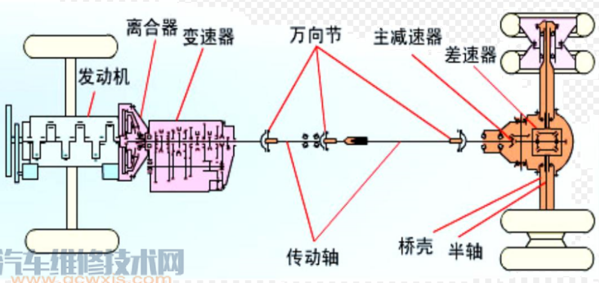
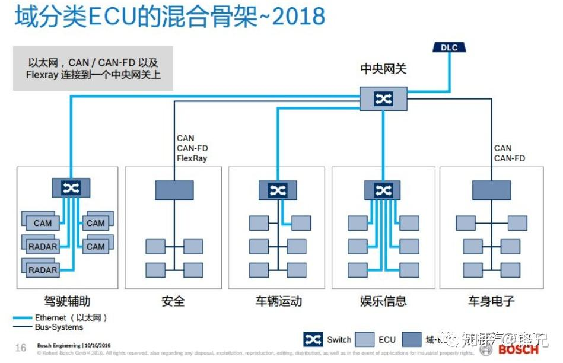
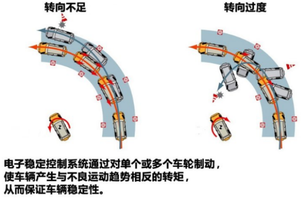
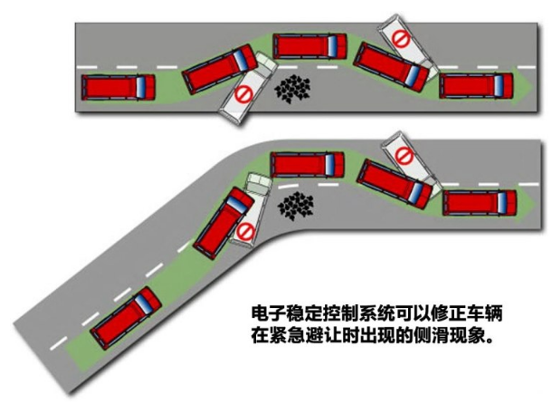

# 介绍


### 分类

如今比较广泛的是使用德国的方法来区分汽车的级别，将汽车划分为A00级、A0级、A级、B级、C级、D级。这种分级的方法主要依据汽车轴距、排量、重量等参数划分的，其中最常见的方法是通过轴距的长度来划分级别

* 按发动机排量/轴距分
  * 微型汽车 A00级：<= 1.0L，轴距在2400mm以下
  * 小型车 A0级：1.0~1.6L，轴距在2400-2550mm之间
  * 紧凑型车 A级：轴距在2550-2700mm之间
  * 中级轿车 B级：1.6~2.5L，轴距在2700-2850mm
  * 中高级汽车 C级：2.5~4L，轴距在2850-3000mm
  * 高级汽车 D级：> 4L，轴距在3000mm以上
* 按车体布置形式分类
  * 三厢车
  * 二厢车
  * 单厢车

### 国产汽车编号规则

汽车的产品型号由企业名称代号、车辆类别代号、主参数代号、产品序号组成。必要时附加企业自定代号。对于专用汽车及专用半挂车还应增加专用汽车
分类代号

```
aa b cc d ee
```

* 企业名称代码：位于产品型号的第一部分，用代表企业名称的两个汉语拼音字母表示
* 车辆类别代码：用一位阿拉伯数字表示
  1. 载货汽车
  2. 越野汽车
  3. 自卸汽车
  4. 牵引汽车
  5. 专用汽车
  6. 客车
  7. 轿车
  8. /
  9. 半挂车及专用半挂车
* 主参数代号：车辆的特征，用两位阿拉伯数字表示
* 产品序号
* 专用汽车分类代号：用于反映车辆结构和用途特征的三个汉语拼音

### 车辆构造

车辆的总体构造基本上由四部分组成：发动机、底盘、车身、车辆电子

* 发动机 engine：发动机是车辆的动力装置，其作用是使进入其中的燃料经过燃烧而变成热能，并转化为动能，通过底盘的传动系统驱动汽车行驶
* 底盘 chassis：底盘的作用是支撑车身，接受发动机产生的动力，并保证汽车能够正常行驶。底盘本身又可分为传动系统、行驶系统、转向系统和制动系统四部分
* 车身 carrosserie/body：车身指的是车辆用来载人装货的部分，也指车辆整体。汽车车身结构主要包括车身壳体、车门、车窗、车前钣制件、车身内外装饰件和车身附件、座椅以及通风、暖气、冷气、空气调节装置等。在货车和专用汽车上还包括车厢和其他装备
* 车辆电子：电气设备包括电源、发动机启动系统以及汽车照明等用电设备，在强制点火的发动机中还包括发动机的点火系统

### 汽车安全系统

* 主动安全系统：ABS、EBS

  这些系统可以使得汽车的行驶更加稳定，缩短制动距离，减少汽车的碰撞率，但是这些系统必须在人工控制的状态下才能发挥出作用，没有办法预测和有效避免交通事故的发生

* 被动安全系统：安全气囊、儿童安全座椅、安全带等这类安全系统，这些系统的作用仅仅是减少车祸所带来的损失

以预防危险事故发生为核心的主动安全技术已成为现代汽车技术发展的重要方向


主动安全辅助功能从系统角度分为车道辅助、碰撞辅助、巡航辅助、灯光辅助、速度辅助、**转向辅助**等几大系统，转向辅助系统（Turn Assist）常见的功能有：

* 紧急转向辅助ESS - Emergency Steering Support
* 自动紧急转向AES - Automatic Emergency Steering

## *车身*

### 车身外形


### 车架

# 底盘


* 转向系统 steering system 的作用是
  * 改变车辆行驶方向
  * 反馈给驾驶员路面及车辆行驶状况（提供路感）
  * 减少碰撞对驾驶员的伤害（车辆正碰时）
  * 提高驾驶舒适性（助力转向系统）
* 制动系统 brake system  的作用是
  * 使行驶的车辆减速或停止
  * 使停止的车辆继续保持停止
  * 保证在各种制动状况下的车辆稳定性
* 传动系统 transmission system 的作用是
  * 传递发动机扭矩来驱动车辆
  * 切断发动机动力向车轮的传递
  * 改变变速箱传动速比，以实现不同的驱动扭矩转换
* 悬架系统 suspension system 的作用是
  * 传递并承受路面作用于车轮的力和力矩
  * 减缓路面对车身的冲击，并衰减由此产生的振动，保证汽车的行驶平顺性
  * 配合传动系统，实现车辆匀速或加速行驶
  * 配合转向系统，实现车辆行驶方向的控制
  * 配合制动系统，保证车辆的制动性
* 车轮系统 wheeling system

## *传动系统*

### 传动系统的主要组成



* 主减速器：增扭、减速 $P=n\cdot T$
* 变速器 gear box：实现车辆的变速，目的是为了保证发动机始终工作在高效区
* 离合器 clutch：传递或中断动力。在正常工作时接通，在起步、换档、制动、滑行等情况时断开。同时在驾驶员的操纵下，通过主动、从动部分结合或分离实现传递或断开
* 差速器 differential & 半轴：实现左右车轮的差速，使转向不打滑
* 万向传动装置/万向节：变角度传动。消除变速器与驱动桥之间因相对运动而产生的不利影响，允许驱动轮在一定的空间范围内跳动。便于传动轴的在底部的布置，降低地板的高度
* 传动轴：连接变速箱与主减速器，传递动力在
* 驱动桥：安装左右驱动轮，内置主减速器齿轮、差速器，安装制动器

动力的传递过程：发动机 `->` 离合器 `->` 变速器 `->` 传动矩 `->` 差速器 `->` 半轴 `->` 驱动轮

### 传动系统的布置形式

* FR, Front Engine, Rear Drive 前置后驱
* FF, Front Engine, Front Drive 前置前驱，中置后驱，全驱
* RR, Rear Engine, Rear Drive 后置后驱
* MR, Middle Engine, Rear Drive 中置后驱
* nWD, n Whell Drive 全轮驱动

### 变速器的种类

[120张图看懂汽车详细构造 - 知乎 (zhihu.com)](https://zhuanlan.zhihu.com/p/20738444)

[MT、AT、AMT、CVT、DCT都是什么鬼？ - 知乎 (zhihu.com)](https://zhuanlan.zhihu.com/p/93974997)

* 手动变速器 / 机械式变速器 Manual Transmission, MT：即必须用手拨动变速杆（也就是我们平常所说的挡把）通过变化挡位来改变变速器内的齿轮啮合位置，从而达到变速的目的
* 自动变速箱 Auto Transmission, AT：是由液力变矩器、行星齿轮和液压操纵系统组成，通过液力传递和齿轮组合的方式来达到变速变矩。装有自动变速器的汽车，能根据路面状况自动变速、变矩
  * 机械自动离合变速器 Automated Manual/Mechanical Transmission, AMT
  * 无级变速器 Continuously Variable Transmission, CVT：是没有明确的挡位区分，根据路面状况和车辆实际使用情况，通过改变传动比使发动机的功率和燃油消耗率都控制在一个最理想的范围内，使动力输出持续流畅
  * 双离合变速器 Dual Clutch Transmission, DCT：有两组离合器。与AT相比，DCT可以降低油耗，与MT相比，动力输出不会出现间断

### 挡位 Gear

1挡、2挡

[D档、P档、N档、R档、L档，分别是什么意思？ - 知乎 (zhihu.com)](https://zhuanlan.zhihu.com/p/99453818#:~:text=D (Drive)前进档，也称驱动档：,D这个档位下变速箱会在1～超速档（相当于1～4档）根据速度和油门情况自动切换，该档位用在一般道路行驶。 由于各国车型有不同的设计，所以“D”档一般包括从1档至高档或者2档至高档，并会因车速及负荷的变化而自动换档。)


* P (Park) 停车挡 / 泊车挡
* R (Reverse) 倒挡
* N (Neutral) 空挡
* D (Drive) 前进档，也称驱动档
* S (Second Gear) 或2挡
* L (Low) 或1挡 (First Gear)

### 离合器

离合器的作用是要实现发动机与变速器柔和接合，起步平稳、保证换档时工作平顺、防止传动系过载

### 差速器

在汽车转向时，左右驱动轮在相同的时间内行驶的距离是不同的，因此需要获得不同的线速度，内侧车轮的线速度较小，外侧车轮的线速度较大

实现方法：动力经主减速器 `->` 差速器 `->` 半轴，传递到驱动轮

## *悬架系统*

## *车轮系统*

# 车辆电子

BCM, Body Control Module 车身控制模块 [车身控制模块BCM设计与开发方法详解 - 知乎 (zhihu.com)](https://zhuanlan.zhihu.com/p/436953890)

## *域控制器*

DCU, Domain Control Unit / DCM, Domain Control Module / MDC, Multi-Domain Controller

[深度：什么是域控制器？ - 知乎 (zhihu.com)](https://zhuanlan.zhihu.com/p/117603274)

随着这些年车载电子的发展，特别是高性能MCU在车载电子的使用。车载电子电器主要形成了功能“域”的架构，即Domain的架构。典型的是分为动力总成，底盘控制，车身控制， ADAS, 娱乐系统这5个主要的domain。每个Domain有一个主要的高性能的ECU（这就是Domain Controller），负责处理Domain内的功能处理和转发。Domain内部一般使用低速总线，Domain之间使用高速总线或者现在用的比较多的车载以太网互联



### 华为MDC介绍

华为MDC, Mobile Data Center 移动数据中心

[独家｜揭秘华为MDC：算力、量产与新势力大考-汽车之心 - 探索智能汽车的万象与新知 (autobit.xyz)](https://www.autobit.xyz/news/2304.html)

[MDC：使能自动驾驶的汽车大脑 - 华为 (huawei.com)](https://www.huawei.com/cn/huaweitech/publication/81/self-driving-AI-brain)

### ABS

ABS, Anti-lock Braking System 汽车防抱死制动系统。传统的汽车制动系统的功能是使行驶中的车辆车轮受制动力矩的作用，使车辆停止。未安装ABS系统的车辆，在紧急制动时，很容易导致车轮抱死，这种状态会造成车轮轮胎的严重磨损，后轮抱死车辆会产生侧滑，丧失稳定性，前轮抱死会使车辆丧失转向能力，从而导致事故的发生。装有ABS系统的车辆，在行驶过程中紧急制动时，可保持车辆行驶方向的可操作性，绕开障碍物，从而避免发生事故。另外，ABS系统还右以减少轮胎的磨损，降低车辆维护费用

### EBS

EBS, Electronic Braking System 电子制动控制系统，该系统是在防抱死系统 ABS 与防侧滑 ESP 的基础上升级而成的控制系统。其主要作用是减少了制动系统的响应时间和建压时间，可实现整车电子制动力的分配和主、挂车一致性控制，缩短整车的制动距离，提升整车的整体制动性能

EBS可以针对每个车轮做出不同的控制，比如车辆在湿滑路面进行制动时，驾驶员踩下刹车，系统会根据驾驶员踩刹车的力度释放制动压力，达到最佳制动的效果。如果某个车轮因为摩擦力不足出现抱死或者是打滑的情况，EBS系统会针对特定的车轮减少制动气压，以保证各个车轮之间的制动力均衡。

挂车的制动一般比主车要早一些，由于挂车和主车连接方式决定了制动时的特殊性。一旦挂车或者是主车制动时出现不同步的情况，极易发生侧滑或者是推头等危险情况。EBS的出现恰好能解决这一问题，如果主车和挂车都装备了EBS系统，当系统监测到主车和挂车制动不统一时，EBS就会调整制动分配，达到统一制动的效果。

EBS还可以提升ASR(自动牵引力控制系统)的性能，当系统监测到车辆在加速或者是起步的时候出现出现打滑的情况。EBS就会启动，针对打滑的车轮进行制动，以维持车辆行驶方向的稳定性和起步能力。

EBS还可以提高紧急制动时的制动效率，当EBS系统预判出驾驶员需要紧急制动时，制动帮助功能将控制相应的制动元件输出最大的制动压力到制动气室进行全制动，直到驾驶员释放制动踏板时候才结束制动帮助功能。

EBS作为一个开放的车辆控制平台，仅需增加少量部件，即可以集成为电子稳定系统(ESC)、自适应巡航(ACC)、自动紧急制动(AEBS)等先进车辆控制系统。

### AEBS

自动紧急制动系统(Advanced Emergency Braking System)，简称AEBS，本系统是一种具备预警和主动防撞功能的先进汽车主动安全系统，该系统是一种为了防止汽车追尾或碰撞而研制的预警和辅助制动系统。

商用车AEBS作为一种高级驾驶辅助系统，适用于各种类型的城市客车、长途客车、载货车和牵引车等，其主要目标为辅助驾驶员控制车距，降低因驾驶员注意力分散或制动不及时而导致前向碰撞事故的概率，避免或减少事故伤害和财产损失。

### ESC

ESC, Electronic Stability Control 电子稳定控制系统 实际上是一组车身稳定性控制的综合策略，它包含防抱死刹车系统 ABS和驱动轮防滑系统 ASR，可以说它是在这两种系统基础之上的一种功能性延伸，而非作为独立配置存在。旨在提升车辆的操控表现的同时、有效地防止汽车达到其动态极限时失控的系统。电子稳定程序能提升车辆的安全性和操控性

ESC系统包括两大子功能

* 方向控制（转向过度/转向不足）

  

* 防侧翻控制

  

### EPB

EPB, Electrical Park Brake 电子驻车制动系统 是通过电子控制方式实现驻车制动、及驻车制动与行车制动相结合的技术，EPB将传统的机械式手刹变成了电子控制手刹，融合行车制动、驻车制动等功能

* 车辆熄火时，即使忘了拉手刹，系统会自动完成驻车
* 车辆起步时，司机忘了松手刹，驻车制动也会自动解除。车辆在坡道起步，也不会倒溜，使得车辆更为智能、简便、安全，减少事故的发生


### TPMS

TPMS, Tire-pressure monitoring system 胎压监测系统


# 转向系统

## *转向系统分类*

* 机械转向系统：以驾驶员的体力为转向能源，其中所有的传力件都是机械零件
* 动力转向系统：兼用驾驶员体力和发动机动力为转向能源，其转向系统中需增加动力转向装置

## *转向器及操纵机构*

### 转向器概念

路感和打手之间的矛盾：所谓路感就是路面的力和振动等会反应在方向盘上，使驾驶员对路面的感受较好。但是反应太大了就会造成对驾驶员的冲击，也就是所谓的打手

### 转向器分类

* 按结构分
  * 循环球-齿条齿扇式
  * 循环球-曲柄指销式
  * 蜗杆-曲柄指销式
  * 齿轮齿条式
* 按逆效率高低分：可逆式、不可逆式、极限可逆式（大型车辆）

### 转向器结构

* 循环球-齿条齿扇式
* 循环球-曲柄指销式
* 蜗杆-曲柄指销式
* 齿轮齿条式

### 转向盘的自由行程

转向盘在空转时的角行程(消除间隙)

理想情况是不超过10~·15度

作用：缓和地面冲击，不打手。过大则无路感

# 制动系统

## *介绍*

### 制动系统分类

[汽车上的四种制动系统-电子工程专辑 (eet-china.com)](https://www.eet-china.com/mp/a136776.html)

* 按作用分
  * 行车制动系统（脚刹车）：使行驶中的汽车减速或停止的制动系统
  * 驻车制动系统（手刹车）：使停止的汽车在原地驻留的制动系统
  * 紧急制动系统：在行车制动失效时，使汽车减速、停车的系统
  * 辅助制动系统：汽车下长坡时稳定车速的制动系统
* 按能源分
  * 人力制动系统：以驾驶员的体力为输入能源的制动系统
  * 动力制动系统：靠发动机的动力转化而成的气压或液压能进行制动的系统
  * 伺服制动系统：兼用人力和发动机动力的制动系统
* 按制动力的变化方式分
  * 渐进制动系统：制动力矩和制动力在驾驶员的操纵控制下，在一定的范围内逐渐变化，比如行车制动系统
  * 非渐进制动系统：无上述特点的制动系统(如驻车制动系统
* 按能量传输方式分：机械式、液压式、气压式、电磁式
* 按传动系统的回路分
  * 单回路系统
  * 双回路系统：双回路制动系统在一侧回路失效时，仍能提供部分制动力。目前汽车制动系统必须采用双回路制动系统

### 基本组成

* 供能装置
* 控制装置
* 传动装置
* 制动器
* 其它附加装置：制动力调节装置、报警装置、压力保护装置等

## *制动器*

### 分类

* 鼓式
  * 内张型
    * 轮缸式
    * 凸轮式
      * 领从蹄式
      * 双领，双向双领
      * 单向、双向自增力
    * 楔式
  * 外束型
* 盘式
  * 钳盘式
    * 定钳盘式
    * 浮钳盘式
  * 全盘式