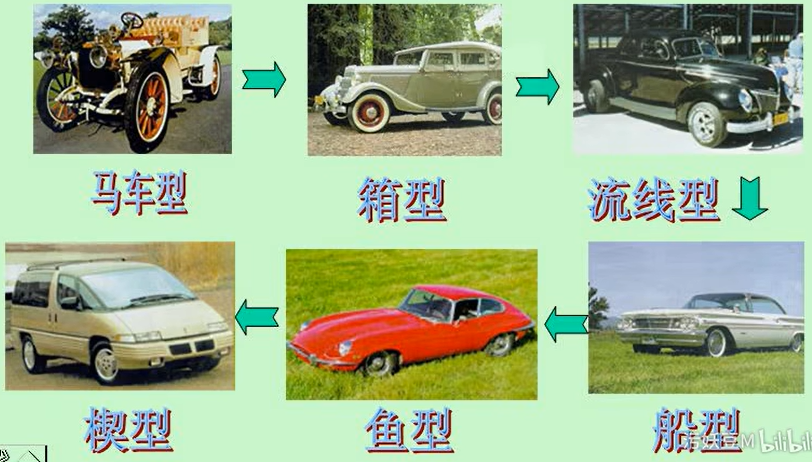
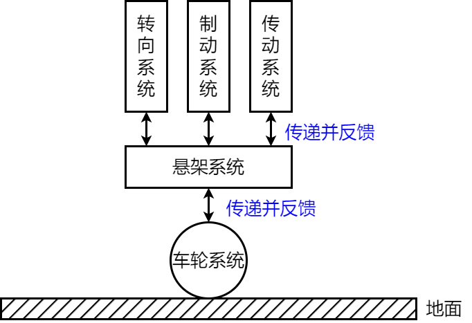

# 介绍

### 车身外形



### 分类

如今比较广泛的是使用德国的方法来区分汽车的级别，将汽车划分为A00级、A0级、A级、B级、C级、D级。这种分级的方法主要依据汽车轴距、排量、重量等参数划分的，其中最常见的方法是通过轴距的长度来划分级别

* 按发动机排量/轴距分
  * 微型汽车 A00级：<= 1.0L，轴距在2400mm以下
  * 小型车 A0级：1.0~1.6L，轴距在2400-2550mm之间
  * 紧凑型车 A级：轴距在2550-2700mm之间
  * 中级轿车 B级：1.6~2.5L，轴距在2700-2850mm
  * 中高级汽车 C级：2.5~4L，轴距在2850-3000mm
  * 高级汽车 D级：> 4L，轴距在3000mm以上
* 按车体布置形式分类
  * 三厢车
  * 二厢车
  * 单厢车

### 国产汽车编号规则

汽车的产品型号由企业名称代号、车辆类别代号、主参数代号、产品序号组成。必要时附加企业自定代号。对于专用汽车及专用半挂车还应增加专用汽车
分类代号

```
aa b cc d ee
```

* 企业名称代码：位于产品型号的第一部分，用代表企业名称的两个汉语拼音字母表示
* 车辆类别代码：用一位阿拉伯数字表示
  1. 载货汽车
  2. 越野汽车
  3. 自卸汽车
  4. 牵引汽车
  5. 专用汽车
  6. 客车
  7. 轿车
  8. /
  9. 半挂车及专用半挂车
* 主参数代号：车辆的特征，用两位阿拉伯数字表示
* 产品序号
* 专用汽车分类代号：用于反映车辆结构和用途特征的三个汉语拼音

### 车辆构造

车辆的总体构造基本上由四部分组成：发动机、底盘、车身、车辆电子

* 发动机 engine：发动机是车辆的动力装置，其作用是使进入其中的燃料经过燃烧而变成热能，并转化为动能，通过底盘的传动系统驱动汽车行驶
* 底盘 chassis：底盘的作用是支撑车身，接受发动机产生的动力，并保证汽车能够正常行驶。底盘本身又可分为传动系统、行驶系统、转向系统和制动系统四部分
* 车身 carrosserie/body：车身指的是车辆用来载人装货的部分，也指车辆整体。汽车车身结构主要包括车身壳体、车门、车窗、车前钣制件、车身内外装饰件和车身附件、座椅以及通风、暖气、冷气、空气调节装置等。在货车和专用汽车上还包括车厢和其他装备
* 车辆电子：电气设备包括电源、发动机启动系统以及汽车照明等用电设备，在强制点火的发动机中还包括发动机的点火系统

### 汽车的布置形式

* FR, Front Engine, Rear Drive 前置后驱
* FF, Front Engine, Front Drive 前置前驱，中置后驱，全驱
* RR, Rear Engine, Rear Drive 后置后驱
* MR, Middle Engine, Rear Drive 中置后驱
* nWD, n Whell Drive 全轮驱动

# 底盘



* 转向系统 steering system 的作用是
  * 改变车辆行驶方向
  * 反馈给驾驶员路面及车辆行驶状况（提供路感）
  * 减少碰撞对驾驶员的伤害（车辆正碰时）
  * 提高驾驶舒适性（助力转向系统）
* 制动系统 brake system  的作用是
  * 使行驶的车辆减速或停止
  * 使停止的车辆继续保持停止
  * 保证在各种制动状况下的车辆稳定性
* 传动系统 transmission system 的作用是
  * 传递发动机扭矩来驱动车辆
  * 切断发动机动力向车轮的传递
  * 改变变速箱传动速比，以实现不同的驱动扭矩转换
* 悬架系统 suspension system 的作用是
  * 传递并承受路面作用于车轮的力和力矩
  * 减缓路面对车身的冲击，并衰减由此产生的振动，保证汽车的行驶平顺性
  * 配合传动系统，实现车辆匀速或加速行驶
  * 配合转向系统，实现车辆行驶方向的控制
  * 配合制动系统，保证车辆的制动性
* 车轮系统 wheeling system

## *转向系统*

## *制动系统*

## *传动系统*

### 挡位 Gear

1挡、2挡

[D档、P档、N档、R档、L档，分别是什么意思？ - 知乎 (zhihu.com)](https://zhuanlan.zhihu.com/p/99453818#:~:text=D (Drive)前进档，也称驱动档：,D这个档位下变速箱会在1～超速档（相当于1～4档）根据速度和油门情况自动切换，该档位用在一般道路行驶。 由于各国车型有不同的设计，所以“D”档一般包括从1档至高档或者2档至高档，并会因车速及负荷的变化而自动换档。)


* P (Park) 停车挡 / 泊车挡
* R (Reverse) 倒挡
* N (Neutral) 空挡
* D (Drive) 前进档，也称驱动档
* S (Second Gear) 或2挡
* L (Low) 或1挡 (First Gear)


## *悬架系统*

## *车轮系统*

# 车辆电子

BCM, Body Control Module 车身控制模块 [车身控制模块BCM设计与开发方法详解 - 知乎 (zhihu.com)](https://zhuanlan.zhihu.com/p/436953890)

# 转向系统