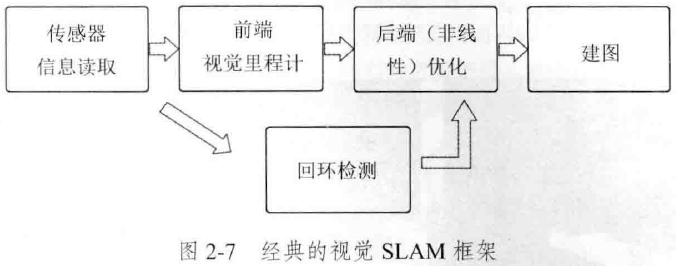
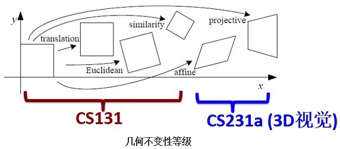

# CV2（SLAM十四讲）

## 经典视觉SLAM框架

## 三维空间刚体运动

### 旋转矩阵 Rotation matrix

#### 点、向量和坐标系

$a\times b$
反对称矩阵 Anti-Symmetric matrix $a^{\wedge}b=\left[\begin{array}{c}0&-a_3&a_2\\a_3&0&-a_1\\-a_2&a_1&0\end{array}\right]$

#### 坐标系间的欧式变换

* 两个坐标系之间的运动由一个旋转加上一个平移做成，这种运动称为刚体运动。刚体运动做成中，同一个向量在各个坐标系下的长度和夹角都不会发生变化，这种变换称为欧式变换 Euclidean Transform。
* $a'=\mathbf{R}a+t$ R称为旋转矩阵。n维旋转矩阵集称为特殊正交群 Special Orthogonal Group $SO(n)=\left\{\mathbf{R}\in\mathbb{R}^{n\times n}|\mathbf{R}\mathbf{R}^T=\mathbf{I}, \det{\mathbf{R}}=1\right\}$

#### 变换矩阵与齐次坐标

* 多次欧式变换不是一个线性变换，因此我们引入一个数学技巧：齐次坐标。即引入第四维，其为常量1
* 将旋转和平移整合到一个变换矩阵 Transform Matrix中，变换矩阵集合称为特殊欧式群 Special Euclidean Group $SE(3)=\left\{\mathbf{T}=\left[\begin{array}{cc}\mathbf{R}&t\\0^T&1\end{array}\right]\in\mathbb{R}^{4\times4}|\mathbf{R}\in SO(3),t\in\mathbf{R}^3\right\}$

### 旋转向量和欧拉角 

#### 旋转向量/轴角 Axis-Angle 

* 轴角
* 轴角和旋转矩阵之间转换关系
  * 轴角向旋转矩阵转换的罗德里格斯公式 Rodrigues's Formula：$\mathbf{R}=\cos{\theta}\mathbf{I}+(1-\cos{\theta}nn^T)+\sin{\theta}n^{\wedge}$
  * 旋转矩阵向轴角转换 $\theta=\arccos{\frac{tr({\mathbf{R}})-1}{2}}$

#### 欧拉角 Euler Angle

### 四元数 Quaternion

### 相似、放射、射影变换

|变换名称|矩阵形式|DoF|不变性质
|:-|:-|:-|:-|
|Euclidean|$\left[\begin{array}{cc}\mathbf{R}&t\\0^T&1\end{array}\right]$|6|长度、夹角、体积
|Similarity|$\left[\begin{array}{cc}s\mathbf{R}&t\\0^T&1\end{array}\right]$|7|体积比
|Affine|$\left[\begin{array}{cc}\mathbf{A}&t\\0^T&1\end{array}\right]$|12|平行性、体积
|Perspective|$\left[\begin{array}{cc}\mathbf{A}&t\\a^T&v\end{array}\right]$|15|接触平面的相交和相切

## 李群与李代数

### 李群与李代数基础 Lie Group

#### 群 Group

群是一种集合加上一种运算的代数结构。群要求运算满足下列几个条件：

* 封闭性 closeness：$\forall a_1,a_2\in A, a_1\cdot a_2\in A$
* 结合律 associativity：$\forall a_1,a_2,a_3\in A,(a_1\cdot a_2)\cdot a_3=a_1\cdot (a_2\cdot a_3)$
* 幺元 neutrality：$\exists a_0\in A, s.t. \forall a\in A, a_0\cdot a=a\cdot a_0=a$
* 逆 invertibility：$\forall a^{-1}\in A, \exists a^{-1}\in A, s.t. a\cdot a^{-1}=a_0$ 整数的逆是其相反数

李群是指具有连续（光滑）性质的群，整数加法群$(\mathbb{Z},+)$这类离散群是不光滑的。而$SO(n), SE(n)$属于光滑的李群，其对于位姿估计非常重要。

#### 李代数的引出

* 任意随事件变换的旋转满足 $\mathbf{R}(t)\mathbf{R}(t)^T=\mathbf{I}$
* 两边对时间求导  $\dot{\mathbf{R}}(t)\mathbf{R}(t)^T+\mathbf{R}(t)\dot{\mathbf{R}(t)^T}=0\rightarrow\dot{\mathbf{R}}(t)\mathbf{R}(t)^T=-\mathbf{R}(t)\dot{\mathbf{R}(t)^T}$
* $\dot{\mathbf{R}}(t)\mathbf{R}(t)^T$是一个反对称矩阵，对于任意反对称矩阵，我们也可以找到唯一与之对应的向量，将这个运算称为$A^{\vee}$。因此可以找到一个三维向量$\phi(t)\in\mathbb{R}^3$与之对应，即$\dot{\mathbf{R}}(t)\mathbf{R}(t)^T=\phi(t)^{\wedge}$
* 等式两边右乘$\mathbf{R}(t)$
  * $\dot{\mathbf{R}}(t)\mathbf{R}(t)^T\mathbf{R}(t)=\dot{\mathbf{R}}=\phi(t)^{\wedge}\mathbf{R}(t)=\left[\begin{array}{c}0&-{\phi}_3&{\phi}_2\\{\phi}_3&0&-{\phi}_1\\-{\phi}_2&{\phi}_1&0\end{array}\right]\mathbf{R}(t)$
  * 可以看到，要求旋转矩阵的导数，只要对其左乘一个$\phi^{\wedge}(t)$矩阵即可
* 考虑$t_0=0$时，设此时旋转矩阵为$\mathbf{R}(0)=\mathbf{I}$，根据导数定义，在$t=0$进行一阶泰勒展开得到$\mathbf{R}(t)\approx\mathbf{R}(t_0)+\dot{\mathbf{R}}(t_0)(t-t_0)=\mathbf{I}+\phi(t_0)^{\wedge}(t)$
* 解上面的微分方程可以得到$\mathbf{R}=\exp{\phi_0^{\wedge}(t)}$
  * 给定某时刻的$\mathbf{R}$，就能求得一个对应的$\phi$，它描述了$\mathbf{R}$在局部的导数关系。$\phi$正是对应到$SO(3)$上的李代数$\mathfrak{so}(3)$
  * $\mathbf{R}$与$\phi$之间的计算关系称为李群与李代数间的指数/对数映射

#### 李代数的定义

* 每个李群都有与之对应的李代数。李代数描述了李群的局部性质/单位元附近的正切空间。
* 李代数$\mathfrak{g}$由一个集合$\mathbb{V}$、一个数域$\mathbb{F}$和一个二元运算$[,]$（称为李括号）组成。李代数需要满足如下性质
  * 封闭性：$\forall \mathbf{X},\mathbf{Y}\in\mathbb{V},[\mathbf{X},\mathbf{Y}]\in\mathbb{V}$
  * 双线性：：$\forall \mathbf{X},\mathbf{Y},\mathbf{Z}\in\mathbb{V},a,b\in\mathbb{F}$，有$[a\mathbf{X}+b\mathbf{Y},\mathbf{Z}]=a[\mathbf{X},\mathbf{Z}]+b[\mathbf{Y},\mathbf{Z}], [\mathbf{Z},a\mathbf{X}+b\mathbf{Y}]=a[\mathbf{Z},\mathbf{X}]+b[\mathbf{Z},\mathbf{Y}]$
  * 自反性：$\forall\mathbf{X}\in\mathbb{V},[\mathbf{X},\mathbf{X}]=0$
  * 雅可比等价：$\forall \mathbf{X},\mathbf{Y},\mathbf{Z}\in\mathbb{V},[\mathbf{X},[\mathbf{Y},\mathbf{Z}]]+[\mathbf{Z},[\mathbf{X}+\mathbf{Y}]],[\mathbf{Y},[\mathbf{Z},\mathbf{X}]]=0$
* 李代数SO(3)
  * $\Phi=\phi^{\wedge}=\left[\begin{array}{c}0&-{\phi}_3&{\phi}_2\\{\phi}_3&0&-{\phi}_1\\-{\phi}_2&{\phi}_1&0\end{array}\right]\in\mathbb{R^{3\times3}}$
  * $\mathfrak{so}(3)=\left\{\phi\in\mathbb{R}^3, \Psi=\phi^{\wedge}\in\mathbb{R}^{3\times 3}\right\}$
  * $[\phi_1,\phi_2]=(\Phi_1\Phi_2-\Phi_2\Phi_1)^{\vee}$
* 李代数SE(3)
  * $\mathfrak{se}(3)=\left\{\xi=\left[\begin{array}{c}\rho\\\phi\end{array}\right]\in\mathbb{R}^6, \phi\in\mathfrak{so}(3),\xi^{\wedge}=\left[\begin{array}{cc}\phi^{\wedge}&\rho\\\mathbb{0}^T&0\end{array}\right]\right\}$
  * $[\xi_1,\xi_2]=(\xi_1^{\wedge}\xi_2^{\wedge}-\xi_2^{\wedge}\xi_1^{\wedge})^{\vee}$

### 指数与对数映射

#### SO(3)上的指数映射

* 任意矩阵的指数映射可以写成一个泰勒展开$\exp{(\phi^{\wedge})}=\sum\limits^{\infty}\limits_{n=0}{\frac{1}{n!}(\phi^{\wedge})^n}$，其只有在收敛的时候才有结果，但这个展开不能拿来计算（只用来推导稳定性）
* 拆分$\phi=\theta\mathbf{a},\Vert a\rVert=1$，通过以下两条性质可进行计算
  * $\mathbf{a}^{\wedge}\mathbf{a}^{\wedge}=\mathbf{a}\mathbf{a}^T-\mathbf{I}$
  * $\mathbf{a}^{\wedge}\mathbf{a}^{\wedge}\mathbf{a}^{\wedge}=-\mathbf{a}^{\wedge}$
* 通过泰勒展开和相关项合并后可以得到$\exp{(\phi^{\wedge})}=\cos{\theta}\mathbf{I}+(1-\cos{\theta}nn^T)+\sin{\theta}n^{\wedge}$
  * 该公式就是罗德里格斯公式，这意味着$\mathfrak{so}(3)$实际上就是由旋转向量构成的空间，而指数映射就是罗德里格斯公式。通过它们可以把$\mathfrak{so}(3)$中任意一个向量对应到一个位于$SO(3)$中的旋转矩阵
  * 相反也可以定义反方向$SO(3)\rightarrow \mathfrak{so}(3)$的对数映射：$\phi=\ln{\mathbf{(R)}^{\vee}}=\left(\sum\limits_{n=0}\limits^{\infty}{\frac{(-1)^n}{n+1}(\mathbf{R}-\mathbf{I})^{n+1}}\right)^{\vee}$

#### SE(3)上的指数映射

* 指数映射：$\exp{(\xi^{\wedge})}=\left[\begin{array}{cc}\exp{\phi^{\wedge}}&\mathbf{J}\rho\\0^T&1\end{array}\right]$，$\mathbf{J}=\frac{\sin{\theta}}{\theta}\mathbf{I}+(1-\frac{\sin{\theta}}{\theta})\mathbf{a}\mathbf{a}^T+\frac{1-\cos{\theta}}{\theta}\mathbf{a}^{\wedge}$
* 对数映射

### 李代数求导与扰动模型

#### BCH公式与近似形式

#### SO(3)上的李代数求导

#### 李代数求导

#### 扰动模型（左乘）

#### SE(3)上的李代数求导

## 相机与图像

### 相机模型

$\frac{Z}{f}=-\frac{X}{X'}=-\frac{Y}{Y'}\rightarrow\frac{Z}{f}=\frac{X}{X'}=\frac{Y}{Y'}\rightarrow\left\{\begin{array}{c}X'=f\frac{X}{Z}\\Y'=f\frac{Y}{Z}\end{array}\right.$ 

$\left\{\begin{array}{c}u=\alpha X'+c_x\\v=\beta Y'+c_y\end{array}\right.\rightarrow\left\{\begin{array}{c}u=f_x\frac{X}{Z}+c_x\\v=f_y\frac{Y}{Z}+c_y\end{array}\right.$

$\left(\begin{array}{c}u\\v\\1\end{array}\right)=\frac{1}{Z}\left(\begin{array}{c}f_x&0&c_x\\0&f_y&c_y\\0&0&1\end{array}\right)\left(\begin{array}{c}X\\Y\\Z\end{array}\right)\triangleq\frac{1}{Z}KP\rightarrow Z\left(\begin{array}{c}u\\v\\1\end{array}\right)=\left(\begin{array}{c}f_x&0&c_x\\0&f_y&c_y\\0&0&1\end{array}\right)\left(\begin{array}{c}X\\Y\\Z\end{array}\right)\triangleq KP$

$ZP_{uv}=Z\left[\begin{array}{c}u\\v\\1\end{array}\right]=K(RP_w+t)=KTP_w$

#### 针孔相机模型

#### 畸变模型

#### 双目相机模型

#### RGB-D模型

## 非线性优化

### 状态估计问题

### 非线性最小二乘

#### 一阶和二阶梯度法

#### 高斯牛顿法

#### 列文伯格-马夸尔特方法

## 视觉里程计1：特征点法 Visual Odometry VO

### 特征点法

### 2D-2D：对极几何

#### 对极约束

#### 本质矩阵

#### 单应矩阵

### 三角测量

### 3D-2D：PnP

## 视觉里程计2：直接法 Direct Method

### 直接法的引出

### 2D光流 2D Optical Flow

* 稀疏光流 Lucas-Kanade光流
* 稠密光流 Horn-Schunck光流

### 直接法

## 后端

## 回环检测

## 建图
